<h2 align="center">W3Cx Front-End Web Developer</h2>
<br/>
<!------------------------------------------------------------------------------------------------>
<!------------------------------- readme.md of W3Cx-2of5-HTML5.0x -------------------------------->
<!------------------------------------------------------------------------------------------------>
<!------------------------------------------ w3cx logo ------------------------------------------->
<!------------------------------------------------------------------------------------------------>
<p align="center" width="100%">

</p>

<h3 align="center">W3Cx-2of5-HTML5.0x - HTML5 and CSS3 Fundamentals</h3>
<!------------------------------------------------------------------------------------------------>
<!------------------------------ 01. W3Cx-2of5-HTML5.0x logo (01) -------------------------------->
<!------------------------------------------------------------------------------------------------>
<p align="center" width="100%">

</p>

## [Table of Contents](#table-of-contents)

## [**About W3C and the Web**](#cha)
>### - [**About W3C and the Web**](#cha-1)
>### - [**Why accessibility is important**](#cha-2)
>### - [**Why internationalization is important**](#cha-3)

## [**Course information**](#chb)
>### * [**Welcome to "HTML5 and CSS Fundamentals"**](#chb-1)
>### * [**Course practical information**](#chb-2)
>### * [**Course tools**](#chb-3)

## [Module 1: My first Web page in HTML5](/modules/module1.md)

>### 1.1 [**Introduction to Module 1**](#ch1-1-1)
>### 1.2 [**The big three: HTML5, CSS3 and JavaScript**](#ch1-2-1)
>### 1.3 [**Elements, tags and attributes**](#ch1-3-1)
>### 1.4 [**Character encoding**](#ch1-4-1)
>### 1.5 [**Best practices**](#ch1-5-1)
>### 1.6 [**More on tags**](#ch1-6-1)

## [Module 2: Attributes, images and links](/modules/module2.md)
>### 2.1 [**Introduction to Module 2**](#ch2-1-1)
>### 2.2 [**Attributes**](#ch2-2-1)
>### 2.3 [**Semantic meaning**](#ch2-3-1)
>### 2.4 [**images**](#ch2-4-1)
>### 2.5 [**Hyperlinks**](#ch2-5-1)

## [Module 3: Adding style with CSS](/modules/module3.md)
>### 3.1 [**Introduction to Module 3**](#ch3-1-1)
>### 3.2 [**CSS basic syntax**](#ch3-2-1)
>### 3.3 [**CSS properties**](#ch3-3-1)
>### 3.4 [**Lists and selectors**](#ch3-4-1)

## [Module 4: Fixing and debugging](/modules/module4.md)
>### 4.1 [**Introduction to Module 4**](#ch4-1-1)
>### 4.2 [**Debugging tools and HTML5**](#ch4-2-1)
>### 4.3 [**Debugging and the CSS box model**](#ch4-3-1)
>### 4.4 [**Debugging CSS precedence**](#ch4-4-1)

## [Module 5: More HTML5 and CSS](/modules/module5.md)
>### 5.1 [**Introduction to Module 5**](#ch5-1-1)
>### 5.2 [**Tables**](#ch5-2-1)
>### 5.3 [**Multimedia**](#ch5-3-1)
>### 5.4 [**Embedding content**](#ch5-4-1)
>### 5.5 [**CSS tricks**](#ch5-5-1)

## [Module 6: Basics of page Layout](/modules/module6.md)
>### 6.1 [**Introduction to Module 6**](#ch6-1-1)
>### 6.2 [**Concepts**](#ch6-2-1)
>### 6.3 [**CSS Flexbox**](#ch6-3-1)
>### 6.4 [**More flexbox**](#ch6-4-1)
>### 6.5 [**CSS Grid**](#ch6-5-1)
>### 6.6 [**Recipe project**](#ch6-6-1)

<a href="https://github.com/bbauska/W3Cx-2of5-HTML5-and-CSS-Fundamentals.git">HTML5 and CSS Fundamentals - git</a>

<h3>Course Outline:</h3>

Quickly learn the basics of Web design and style to give your Web sites
a professional look and feel, by just following these 6 modules!
<ul>
<li>The first set of lessons are available under <b>"Module 1: My first Web page in HTML5"</b>.</li>
</ul>
<!------------------------------------------------------------------------------------------------>
<!--------------------------------- 02. my first web page (01) ----------------------------------->
<!------------------------------------------------------------------------------------------------>
<p align="center" width="100%">

</p>
<ul>
<li>In <b>Module 2</b>, you will learn about HTML5 attributes, and become fluent in adding images and links in your Web pages.&nbsp;<br/></li>
<li>Now that you have made your first Web page, it is time to introduce you to CSS in <b>Module 3</b>.

<h5>CSS is used to style the HTML</h5>

<!------------------------------------------------------------------------------------------------>
<!-------------------------------- 03. w3c developers logo (02) ---------------------------------->
<!------------------------------------------------------------------------------------------------>
<p align="center" width="100%">

</p>

It is how we determine the color, text size, spacing and other visual
aspects of your Web page. We'll introduce the syntax of CSS, how to
include it with your pages, and get you started with some basic
properties and concepts. Note that we'll explore how to use CSS to
layout your page during the last week of this course.</li>

<!------------------------------------------------------------------------------------------------>
<!--------------------------------------- 04. laptop (02) ---------------------------------------->
<!------------------------------------------------------------------------------------------------>
<p align="center" width="100%">

</p>

<li>Whilst practicing and improving your recipe project (or else) with
    CSS features, you may have noticed that errors (subtle or not -
    we've all been there) can get in the way! This week you will learn
    how to fix your Web page when it's not doing what you hoped it would
    do.  
    <b>Module 4</b> is a 'short' week so please use that time to practice,
    practice and practice coding again!<br/>&nbsp;</li>

<!------------------------------------------------------------------------------------------------>
<!---------------------------------- 05. w3c cheat sheet (02) ------------------------------------>
<!------------------------------------------------------------------------------------------------>
<p align="center" width="100%">

</p>

<li>In <b>Module 5</b>, you will be combining HTML and CSS to create more
    complex pages, and "beautify" even more your recipe projects. You
    will learn about tables, the audio and video elements, etc. This is
    a good preparatory work for the <a href="https://www.edx.org/course/html5-coding-essentials-and-best-practices">HTML5 Coding Essentials and Best Practices course</a> (intermediate level). You will also learn how to embed other elements in a page other than a simple image. Note that some parts of the material are optional: iframes, usemap, and ismap.<br/>&nbsp;</li>

<!------------------------------------------------------------------------------------------------>
<!------------------------------- 06. can i use: css colors (03) --------------------------------->
<!------------------------------------------------------------------------------------------------>
<p align="center" width="100%">

</p>

<li><b>Module 6</b> is about page layout and more specifically about
CSS flexbox. Using flexible widths and heights, elements can be aligned
to fill a space or distribute space between elements, which makes it a
great tool to use for responsive design systems. Once you've got the
basics, practice more with this fun <a href="https://flexboxfroggy.com/">Flexbox Froggy</a> game. Note that some parts of this week are clearly indicated OPTIONAL, meaning that there will be no
questions related to that content material.</li>
</ul>

W3C has designed a <a href="https://www.edx.org/professional-certificate/w3cx-front-end-web-developer">"Front-End Web Developer" (FEWD) Professional
Certificate</a> where you will learn all of the necessary skills needed to build interactive
and responsive user experiences on the Web. This program will deepen
your knowledge of the 3 foundational languages that power the Web:
HTML5, CSS and JavaScript. The W3C FEWD program is composed of 5
courses:
<ol type="1">
   <li><a href="https://www.edx.org/course/css-basics">CSS Basics</a> - introductory level,<br/>&nbsp;</li>
   <li><b>This course: <a href="https://www.edx.org/course/html5-and-css-fundamentals">HTML5 and CSS Fundamentals</a> - introductory level,</b><br/>&nbsp;</li>
   <li><a href="https://www.edx.org/course/html5-coding-essentials-and-best-practices">HTML5 Coding Essentials and Best Practices</a> - intermediate level,<br/>&nbsp;</li>
   <li><a href="https://www.edx.org/course/html5-apps-and-games">HTML5 Apps and Games</a> - advanced
    level,<br/>&nbsp;</li>
   <li><a href="https://www.edx.org/course/javascript-introduction">JavaScript Introduction</a> -
    introductory level.</li>
</ol>

<h4>Welcome!</h4>

This "HTML5 & CSS Fundamentals" introductory course is designed for anyone, no prerequisites required.

During this course, you will learn:
<ul>
<li>Basic concepts of a markup language,<br/>&nbsp;</li>
<li>Basic building blocks of Web design and style,<br/>&nbsp;</li>
<li>Basics of HTML5 and CSS,<br/>&nbsp;</li>
<li>How to write a Web page.</li>
</ul>

Have fun!

<h3>Web Browsers and Editors</h3>
<hr/>
<h3>Web browsers</h3>

Not surprisingly, it would be helpful to have a browser (short for "Web
Browser") so that you can see the end result of your source code.

Common modern browsers for the desktop
are <a href="https://firefox.com/), [Chrome](https://www.google.com/chrome/">Firefox</a>, <a href="https://www.microsoft.com/en-us/windows/microsoft-edge">Microsoft
Edge</a>(and IE), <a href="http://www.apple.com/safari/">Safari</a>, <a href="https://brave.com/">Brave</a>,
etc. The most common features of a Web browser include the browser
window itself (also referred to as the user interface), the navigation
and address bar, and options to view your history, settings, and other
tools.

Look at the <a href="https://en.wikipedia.org/wiki/Web_browser#History">history of Web
browsers</a> (on Wikipedia). An interesting resource is the <a href="https://www.w3counter.com/globalstats.php">Browser and Platform Market
Share</a> (updated regularly).

<h3>Web editors</h3>

An HTML editor is invaluable for both beginners and more advanced
developers. While any text editor, like NotePad or TextEdit, can be used
to create Web pages, they don't necessarily offer options for error
checking, syntax coloring and saving some typing by filling things out
for you.

There are two types of editors available, WYSIWYG ("What You See Is What
You Get") and textual HTML editors. Here is a non exhaustive list:
<ul>
<li><a href="https://www.sublimetext.com/">Sublime Text</a> - it is quite
popular with developers, though there can be a bit of a learning curve
to use its many features,</li>
<li><a href="http://bluegriffon.org/">BlueGriffon</a> - a WYSIWYG content
editor for the World Wide Web. Powered by Gecko, the rendering engine of
Firefox, it's a modern and robust solution to edit Web pages in
conformance to the latest Web Standards,</li>
<li><a href="https://code.visualstudio.com/">Visual Studio Code</a> - a free
open source editor that can run on any operating system. Many coding
videos in this course are demonstrated using Visual Studio Code,</li>
<li><a href="https://github.com/">GitHub</a> itself - check <a href="https://towardsdatascience.com/how-to-create-a-free-github-pages-website-53743d7524e1">this resource
that explains how to create a Web site using 
GitHub</a>,</li>
<li><a href="https://developer.apple.com/xcode/">XCode</a> - Mac developers
may be familiar with XCode,</li>
<li>TextEdit - this is available on Macs, but be sure
you're <a href="https://discussions.apple.com/message/5014514#5014514">saving as plain
text</a>, not as a ".rtf" or ".doc" file,</li>
<li><a href="https://notepad-plus-plus.org/">Notepad++</a> - on Windows PC's,</li>
<li><a href="https://www.sublimetext.com/">Atom</a> - another cross platform
editor, created by <a href="https://github.com/">GitHub</a>,</li>
<li><a href="https://www.vim.org/) or [Emacs](https://www.gnu.org/software/emacs/">Vim</a> -
great editors, but if you're not already familiar with these, this isn't the time to try.</li>
</ul>

<h3>Online Code Editors</h3>

To help you practice during the whole duration of the course, we propose
to use the <a href="https://codepen.io/">CodePen</a> online code editor. An online
code editor is a tool that resides on a remote server and is accessible
via browsers.

CodePen is an HTML/CSS/JavaScript code editor that previews/showcases
your code in your browser. We are providing a short live coding video on
how to use CodePen at the beginning of Module 1. CodePen gives you the
tools for collaboration, experimentation, and sharing, but you also get
live results and the ability to search through their database and
repository of snippets that other authors put up so you can experiment
and learn from their work, too.

Note that there are many other online code editors available out there,
such as JSBin,  JSFiddle, and Dabblet (Lea Verou's tool).

Here's an interesting article on what beginners can do with
CodePen: <a href="https://codepen.io/brentmiller/post/things-you-can-do-with-codepen">Things you can do with
CodePen</a> [Brent Miller, February 6, 2019].

<h3>W3C Validators</h3>

<!------------------------------------------------------------------------------------------------>
<!-------------------------------- 03. w3c developers logo (08) ---------------------------------->
<!------------------------------------------------------------------------------------------------>
<p align="center" width="100%">

</p>
<!------------------------------------------------------------------------------------------------>
<!----------------------------- 07. mdn web docs mozilla logo (08) ------------------------------->
<!------------------------------------------------------------------------------------------------>
<p align="center" width="100%">

</p>

For over 15 years, the W3C has been developing and
hosting <a href="https://w3c.github.io/developers/">free and open source tools</a> used every day
by millions of Web developers and Web designers. All the tools
listed below are Web-based, and are available as downloadable sources or
as free services on the <a href="https://w3c.github.io/developers/tools/">W3C Developers
tools</a>.

<h3>W3C Validator</h3>

The [W3C validator](https://validator.w3.org/) checks the [markup
validity](https://validator.w3.org/docs/help.html#validation_basics) of
various Web document formats, such as HTML. Note that you are
automatically directed to the [Nu Html
Checker](https://validator.w3.org/nu/) when validating an HTML5
document.

<h3>CSS Validator</h3>

The [CSS validator](https://jigsaw.w3.org/css-validator/) checks
Cascading Style Sheets (CSS) and (X)HTML documents that use CSS
stylesheets.

<!------------------------------------------------------------------------------------------------>
<!--------------------------------------- 04. laptop (08) ---------------------------------------->
<!------------------------------------------------------------------------------------------------>
<p align="center" width="100%">

</p>

<h3>Unicorn</h3>

[Unicorn](https://validator.w3.org/unicorn/) is W3C's unified validator,
which helps people improve the quality of their Web pages by performing
a variety of checks. Unicorn gathers the results of the popular HTML and
CSS validators, as well as other useful services, such as
Internationalization, RSS/Atom feeds and http headers.

<h3>Internationalization Checker</h3>

The [W3C Internationalization
Checker](https://validator.w3.org/i18n-checker/) provides information
about various internationalization-related aspects of your page,
including the HTTP headers that affect it. It will also report a number
of issues and offer advice about how to resolve them.

<h3>Link Checker</h3>

The <a href="https://validator.w3.org/checklink">W3C Link Checker</a> looks for
issues in links, anchors and referenced objects in a Web page, CSS style
sheet, or recursively on a whole Web site. For best results, it is
recommended to first ensure that the documents checked use
valid [(X)HTML
Markup](https://validator.w3.org/) and [CSS](https://jigsaw.w3.org/css-validator/).

<h3>W3C CheatSheet</h3>

The [W3C cheatsheet](https://www.w3.org/2009/cheatsheet/) provides quick
access to useful information from a variety of specifications published
by W3C. It aims at giving in a very compact and mobile-friendly format a
compilation of useful knowledge extracted from W3C specifications,
completed by summaries of guidelines developed at W3C, in particular Web
accessibility guidelines, the Mobile Web Best Practices, and a number of
internationalization tips.

<!------------------------------------------------------------------------------------------------>
<!---------------------------------- 05. w3c cheat sheet (09) ------------------------------------>
<!------------------------------------------------------------------------------------------------>
<p align="center" width="100%">

</p>

Its main feature is a lookup search box, where one can start typing a keyword and get a list of matching properties/elements/ attributes/functions in the above-mentioned specifications, and further details on those when selecting the one of interest.

The W3C cheatsheet is only available as a <a href="https://dev.w3.org/2009/cheatsheet/doc/">pure Web application</a>.

<h3>Browser Compatibility</h3>

The term browser compatibility refers to the ability of a given Web site
to appear fully functional on the browsers available in the market.

The most powerful aspect of the Web is what makes it so challenging to
build for: its universality. When you create a Web site, you’re writing
code that needs to be understood by many different browsers on different
devices and operating systems!

To make the Web evolve in a sane and sustainable way for both users and
developers, browser vendors work together to standardize new features,
whether it’s a new <a href="https://developer.mozilla.org/en-US/docs/Web/HTML/Element">HTML
element</a>, <a href="https://developer.mozilla.org/en-US/docs/Web/CSS/Reference#Keyword_index">CSS
property</a>,
or <a href="https://developer.mozilla.org/en-US/docs/Web/API">JavaScript API</a>.
But different vendors have different priorities, resources, and release
cycles — so it’s very unlikely that a new feature will land on all the
major browsers at once. As a Web developer, this is something you must
consider if you’re relying on a feature to build your site.

We are then providing references to the browser support of HTML5
features presented in this course using 2 resources: <a href="https://caniuse.com/">Can I
Use</a> and [Mozilla Developer Network <a href="https://developer.mozilla.org/en-US/">MDN Web
Docs</a>.

<h3>Can I use</h3>

<a href="https://caniuse.com/">Can I Use</a> provides up-to-date tables for support
of front-end Web technologies on desktop and mobile Web browsers. Below
is a snapshot of what information is given by CanIUse when searching for
"CSS3 colors".

<!------------------------------------------------------------------------------------------------>
<!------------------------------------- 06. cheat sheet (10) ------------------------------------->
<!------------------------------------------------------------------------------------------------>
<p align="center" width="100%">

</p>

<h3>MDN Web Docs</h3>

<!------------------------------------------------------------------------------------------------>
<!---------------------------------- 07. mdn web docs logo (10) ---------------------------------->
<!------------------------------------------------------------------------------------------------>
<p align="center" width="100%">

</p>

To help developers make these decisions consciously rather than
accidentally, <a href="https://developer.mozilla.org/">MDN Web Docs</a> provides
browser compatibility tables in its documentation pages, so that when
looking up a feature you’re considering for your project, you know
exactly which browsers will support it.

<h3>External resources</h3>
<ul>
<li><a href="https://hacks.mozilla.org/2018/02/mdn-browser-compatibility-data/">MDN browser compatibility data: Taking the guesswork out of web
    compatibility</a),</li>
<li><a href="https://hacks.mozilla.org/2019/09/caniuse-and-mdn-compat-data-collaboration/">Caniuse and MDN compatibility data
    collaboration</a>.</li>
</ul>

<h3>What is W3C?</h3>

<h4>As steward of global Web standards, W3C's mission is to safeguard the openness, accessibility, and freedom of the World Wide Web from a technical perspective.</h4>

W3C's primary activity is to develop protocols and guidelines that
ensure long-term growth for the Web. The widely adopted Web standards
define key parts of what actually makes the World Wide Web work.

<h3>A few history bits</h3>

<!------------------------------------------------------------------------------------------------>
<!------------------------------ 08. tim berners-lee in 1994 (11) -------------------------------->
<!------------------------------------------------------------------------------------------------>
<p align="center" width="100%">

</p>
<p align="center">Tim Berners-Lee at his desk in CERN, 1994</p>

[Tim Berners-Lee](https://www.w3.org/People/Berners-Lee/) wrote a
[proposal](https://www.w3.org/History/1989/proposal.html) in 1989 for a
system called the World Wide Web. He then created the first Web browser,
server, and Web page. He wrote the first specifications for URLs, HTTP,
and HTML.

In October 1994, Tim Berners-Lee founded the World Wide Web Consortium
(W3C) at the Massachusetts Institute of Technology, Laboratory for
Computer Science \[MIT/LCS\] in collaboration with
[CERN](https://home.cern/), where the Web originated (see information on
the [original CERN Server](https://www.w3.org/Daemon/)), with support
from DARPA and the [European
Commission](https://ec.europa.eu/index_en.htm).

In April 1995, [Inria](https://www.inria.fr/) became the first European
W3C host, followed by [Keio University of
Japan](https://www.keio.ac.jp/) (Shonan Fujisawa Campus) in Asia in
1996. In 2003, [ERCIM](https://www.ercim.eu/) took over the role of
European W3C Host from Inria. In 2013, W3C announced [Beihang
University](https://ev.buaa.edu.cn/) as the fourth Host.

<h3>A few figures</h3>

As of April 2021, W3C:
<ul>
<li>Is a <a href="https://www.w3.org/Consortium/Member/List">member-</a>driven
    organization composed of nearly 430 companies, universities,
    start-ups, etc. from all over the world.&nbsp;<br/></li>
<li>Holds 48 <a href="https://www.w3.org/Consortium/activities">technical groups</a>, including Working
    and Interest Groups where technical specifications are discussed and
    developed.&nbsp;<br/></li>
<li>Published over 7,652 <a href-"https://www.w3.org/TR/">published technical
    reports</a>, including 442 Web standards (or
    W3C Recommendations) - since January 1st,1995.&nbsp;<br/></li>
<li>Runs a <a href="https://www.w3.org/Consortium/Translation/">translation
    program</a> to foster the translation of its specifications: see the <a href="https://www.w3.org/Consortium/Translation/matrix.html">translation
    matrix</a> currently listing 307 available translations of W3C recommendations.&nbsp;<br/></li>
<li>Hosts 350 <a href="https://www.w3.org/community/groups/">Community and Business Groups</a>, where developers, designers, and anyone passionate about the Web have a place to hold
    discussions and publish ideas.&nbsp;<br/></li>
<li>Gathers over 13,960active participants constituting the W3C
    community.&nbsp;<br/></li>
<li>Has a <a href="https://www.w3.org/People/"> technical staff</a> composed of 68
    people, spread on all five continents.</li>
</ul>

<h3>W3C's core values</h3>

Committed to core values of an open Web that promotes innovation,
neutrality, and interoperability, W3C and its community are setting the
vision and standards for the Web, ensuring the building blocks of the
Web are open, accessible, secure, international and have been developed
via the collaboration of global technical experts.

In the next video below, listen to what Sir Tim Berners-Lee said when
asked what part of the W3C’s work he’s the most proud of.

<h4>The Web is Amazing!</h4>

People often use the words "Internet" and "Web" interchangeably, but
this usage is technically incorrect.

The Web is an application of the Internet. The Web is the most popular
way of accessing the Internet, but other applications of the Internet
are [e-mail](https://en.wikipedia.org/wiki/Email) and
[ftp](https://en.wikipedia.org/wiki/File_Transfer_Protocol) for example.
One analogy equates the Internet to a road network where the Web is a
car, the email is a bicycle, etc.  Read [this
article](https://www.lifewire.com/difference-between-the-internet-and-the-web-2483335)
for more details about the difference between Internet and the Web.

<h4>What is Web Accessibility?</h4>

<h3 id="ch1-1-1">1.1.1 Welcome to Module 1</h3>

Hello everyone! Welcome to Module 1 of the introduction to HTML5 and CSS
course.

I'm Andrew and I'll be your instructor for this module.

We have lots of exciting stuff to cover in this module, and we're going
to also create and edit our very first Web page.

We'll start with a brief history of HTML and the Web.

Then we'll learn how the big three, HTML5, CSS and JavaScript, relate to
one another.

We're also going to learn about elements, tags, and attributes.

We'll cover best practices, some do's and don'ts of writing HTML5.

As I mentioned already, throughout this module, you'll have
opportunities to practice what we're teaching by creating and editing
your very first Web page.

Finally, you'll have a chance to show off what you've learned in the
quiz section.

With that, let's jump right in.

<h3 id="ch1-1-2">1.1.2 Module 1 – Content</h3>

<b>1.1 Introduction:</b> A video that introduces the content of Module 1.

<b>1.2 The big three:</b> Learn about the basic tools you will use to code
for the Web including hypertext and Web browsers.

<b>1.3 Elements, tags and attributes:</b> Here you will begin learning
about the functions of the different types of code.

<b>1.4 Character encoding:</b> To make you familiarized with international
features.

<b>1.5 Best practices, the wisdom:</b> Studying other people's mistakes is
a great way to avoid the same pitfalls.

<b>1.6 More on tags:</b> Review of the tags we have just learned about and
get started on your course project.

<h3 id="ch1-2-1">1.2.1 Vague But Exciting!</h3>

Twenty-nine years ago a proposal was sent internally at CERN
outlying a universal linked information system. Dubbed 'Information
Management: A proposal', pictured below, the proposal was created by Sir
Tim Berners-Lee and was sent to his boss Mike Sendall, who described it
as 'vague but exciting'.

<!------------------------------------------------------------------------------------------------>
<!------------------------------- 09. network of components (13) --------------------------------->
<!------------------------------------------------------------------------------------------------>
<p align="center" width="100%">

</p>

Sir Tim Berners-Lee’s vision for universality enabled the development of
a high-level network of content that allows any document to link to any
other documents.

The World Wide Web was initially created to make it easier to share
research papers. It is a system of interlinked ‘hypertext’ documents
that are accessed via the Internet; in essence, an information space.
While he did not invent hypertext systems, Berners-Lee proposed using
them 'to link and access information of various kinds as a web of nodes
in which the user can browse at will.'

His breakthrough was to link hypertext to the Internet and he used three
technologies to do this:

<ul>
<li>HyperText Transfer Protocol (HTTP) is the foundation of data
    communication for the Web.</li><br/>
<li>HyperText Markup Language (HTML) is the main mark-up language for
    creating Web pages and information that can be displayed on a Web
    browser.</li><br/>
<li>Web addresses or a Uniform Resource Locator (URL) are used to
    reference a Web page.</li><br/>
</ul>

In the following pages, we present HTML through what are usually called
the big 3 (HTML5, CSS and JavaScript), the hypertext concept and the
browser, an application program that provides a way to look at and
interact with all the information on the World Wide Web.

<h3 id="ch1-2-2">1.2.2 HTML5, CSS and JS</h3>

<h4>HTML5</h4>
<!------------------------------------------------------------------------------------------------>
<!------------------------------------- 10. html5 logo (14) -------------------------------------->
<!------------------------------------------------------------------------------------------------>
<p align="center" width="100%">

</p>

When people say 'HTML5', they usually mean a bit more than just the 5th
version of the "HyperText Markup Language". Modern Web pages and Web
applications are generally composed of at least three components, so
what people often mean when they say 'HTML5' is the trio of languages:
HTML5, CSS3 and JavaScript.

The 'HTML' part contains all the content, organized into a logical
structure.  This is the part that an author might be most concerned
with: the words, chapter headings, figures, diagrams, etc.

While there have been numerous versions of HTML since its inception, our
focus in this course is the most recent version, HTML5. HTML5 was
developed to provide more powerful and flexible ways for developers to
create dynamic Web pages.

<h4>CSS</h4>
<!------------------------------------------------------------------------------------------------>
<!------------------------------------- 11. css3 logo (14) --------------------------------------->
<!------------------------------------------------------------------------------------------------>
<p align="center" width="100%">

</p>

The 'CSS' part (version 3 being current) is all about the presentation
or style of the page; what it looks like without too much regard for the
specific content. We'll be going into more detail on that later in this
course, but for now, think of it as the way you might specify a "theme"
in a word processing document, setting fonts, sizes, indentations and
whatever else may apply to what it looks like.

<h4>JavaScript</h4>

<!------------------------------------------------------------------------------------------------>
<!---------------------------------- 12. javascript logo (15) ------------------------------------>
<!------------------------------------------------------------------------------------------------>
<p align="center" width="100%">

</p>

The 'JavaScript', or 'JS' for short, part is about the actions a page
can take such as interaction with the user, and customizing and changing
the page according to any number of parameters.  This is what allows a
Web page to be more than just a document, but potentially a Web
application, with nearly unlimited possibilities.  We will not be
doing much with JavaScript in this course, but you should know that it
is an important leg of the stool for modern Web pages.

<h3 id="ch1-2-3">1.2.3 Hypertext</h3>

A fundamental key to the World Wide Web is the concept of "*Hypertext*".
 Hypertext is built on the idea of linking information together, not
unlike using footnotes, except much easier and more flexible. The idea
was to "Mark Up" your document with links and define how to break it
down into different segments (chapters, sections, paragraphs, tables,
figures, etc.)

That's why, in 1989, Tim Berners-Lee began to create a definition of
HTML: Hypertext Markup Language, to provide a simple, uniform way to
incorporate Hyperlinks in a text document.

<!------------------------------------------------------------------------------------------------>
<!------------------------- 13. illustration of hypertext documents (16) ------------------------->
<!------------------------------------------------------------------------------------------------>
<p align="center" width="100%">

</p>

He envisioned a technology that would facilitate thoroughly
interconnected documents. He wanted authors to be able to connect an
idea in one document to the source of the idea in another, or connect a
statement with the data that backs up that statement. Traditionally,
this kind of thing was done with footnotes and bibliographies, which can
be cumbersome. This information should be easily transferable from one
place to another, so that in reading one document, it is easy to access
everything related (linked) to it. Tim Berners-Lee imagined a "Web" of
interconnected documents.

He used the metaphor of a Web to emphasize the importance of connections
between documents. It was not just a long list of details, but rather a
sea of information stretching out in all directions. This sea of
information was navigated by a new tool called a "Browser".

<h3 id="ch1-2-4">1.2.4 The Browser</h3>

The Internet existed long before the Web came to fruition, and lots of
organizations were connected to it, including schools, companies and
government organizations.  As things progressed through the 80s, the
Internet was used for file transfers, newsgroups (a kind of open forum),
email and other conveniences.

<!------------------------------------------------------------------------------------------------>
<!---------------------------- 14. snapshot of mosaic browser (17) ------------------------------->
<!------------------------------------------------------------------------------------------------>
<p align="center" width="100%">

</p>

At the time there were a number of different programs like
'<a href="https://en.wikipedia.org/wiki/Fetch_(FTP_client">fetch</a>',
'<a href="http://www.yourdictionary.com/gopher#Noun-3">gopher</a>' and
'<a href="https://en.wikipedia.org/wiki/Archie_search_engine">archie</a>' that were
used to download, browse and search for files.  Typically, you might use
one tool to search for the location of files of interest, then another
to copy that file to a local machine.  Then, you still needed more tools
to read that file.  If it was text, you could use a text editor, if it
was a formatted document you might need a word processor, if a picture
you would need an image viewer and so on.

<a href="https://en.wikipedia.org/wiki/Marc_Andreessen">Marc Andreessen</a> conceived of
a solution that would put all the pieces together in one app, making it
easy for users to browse all the different sorts of information and data
on the World Wide Web.  Together with others, he started the "Mosaic"
project.

Though not technically the first browser, Mosaic was the first one that
many people experienced and played a big part in popularizing the
concepts of the World Wide Web and the Web browser. It provided a simple
graphical way to access and browse the various resources on the
Internet. Instead of using different tools to download and view
information on the Internet, a simple click on a link would present the
information in a graphical window. In many ways, it is the ancestor of
most modern browsers.

<h3 id="ch1-2-5">1.2.5 Activity – Explore the Web</h3>

<h4>Exploring the Web, "Then and Now":</h4>

<li>Go to <a href="https://archive.org/">archive.org</a> and find the earliest
    available instance of the Web site: www.google.com.</li><br/>
<li>Note the differences between that and its current Web site.</li><br/>
<li>Find an old news story, see how far back you can go (hint: start by
    looking at yahoo.com).</li><br/>
<li>In general, what differences do you notice between Web sites from
    the 90's and Web sites today?</li><br/>
<li>Post your observations and findings in the discussion forum below.</li><br/>
</ul>

<h3 id="ch1-3-1">1.3.1 Putting the “M” in HTML</h3>

So the "M" in HTML stands for "Markup", but what does Markup really
mean? Essentially, it means to annotate a document with extra
information. Things like where different sections and paragraphs begin
and end, which part is the title, which things should be emphasized and
so on.  

There are many ways to markup a document, but HTML borrows a technique
from an ancestor language, SGML (<a href="https://en.wikipedia.org/wiki/Standard_Generalized_Markup_Language">Standard Generalized Markup
Language</a>),
which uses angle brackets ("&lt;" and "&gt;") to separate the annotations
from the regular text.  In HTML these annotations are called "tags".

For example, consider the following chunk of HTML code:
```xml
     <body>
        <h1>A Tale of Two Cities</h1>
        <p>
           It was the best of times, it was the worst of times, . . .
    .
        </p>
        . . .
        <p>
           . . . it is a far, far better rest
           that I go to than I have ever known.
       </p>
    </body>
```
If you eliminated everything in between the angle brackets from the
text, for most purposes it would still read the same:

A Tale of Two Cities  
It was the best of times, it was the worst of times . . . .  
. . .  
. . . it is a far, far better rest  
that I go to than I have ever known.

Once you know that everything in angle brackets is "meta-information",
it leaves a lot of flexibility. You can put a lot of different things in
between those brackets without any of it showing up (directly) in your
finished document. And, though you don't usually see directly what's in
those angle brackets, they can often have a big effect on what your Web
page looks like as well as how it responds and interacts with you.

Try It Out!

I expect at this point you may be longing to write some HTML code.  As
is the tradition in programming tutorials, we'll pause here to create a
simple "Hello HTML" program. Please choose any Web editor of your liking
(see in the subsection "Course tools").

<h3 id="ch1-3-2">1.3.2 Programming “Hello HTML”</h3>

You can build and edit your HTML pages by either using online editors or
editors that you can install on your machine, like Visual Studio Code.

<h4>Using online editors:</h4>

Both <a href="https://jsbin.com">JSBin</a> and <a href="https://codepen.io/">CodePen</a> are
two online editors that you can use to create HTML Web pages.
The following two videos show you how to create your first HTML page
using <a href="https://jsbin.com">JSBin</a> and <a href="https://codepen.io/">CodePen</a>

And this time, what I'd like to show you a very simple HTML file that
I've created.

We'll take a look at it in a browser, and then see how it's built using
a popular online HTML editor.

Here's the file in question.

It's called hello.html

The .html extension tells me this is a HTML file, and it will contain
some HTML code.

Let's look at this file in a browser and by right clicking and saying
open with Microsoft Edge.

The file is loaded from my disk and then it displays its contents.

And here you can see that this simple file, it is just showing me the
text hello html and it's also changed the title of the page to be my first HTML page.

So, there you have it, a very simple HTML page.

Let's now go to an online tool and try to create this page from scratch.

Okay so, how did we create this page?

Well, there are many ways to create HTML files and we'll show you a few
throughout this course.

At this point in time, I'll introduce you to JSBin, which is one of your
options and to do that, I'll open up a new tab and go to jsbin.com

Here I am inside JSBin.

You can see that I'm using the free version right now.

I haven't logged in, I haven't registered it on anything else.

I'm just going to use the site as a kind of HTML playground to create a
simple HTML page.

We'll have a quick look around the layout of the site.

Here you can see there's a panel on the left which is a HTML panel to
edit HTML code, and on the right, you have an open panel that will
eventually display whatever code you write on the left-hand side.

And the site can cater for other languages such as JavaScript, CSS, 
and so on, and you can also share code snippets and do lots lots more.

I'd encourage you to browse around.

But for this exercise, we're just going to use the site in this simple
format.

As I said, this page on the left-hand side it was opened by default when
we navigated here and it contained some HTML.

There's no content or output yet and we'll get to that shortly.

But this would be the most basic HTML code file that you would need to
create in order to produce your first HTML page.

You could probably do a little bit simpler but this is a very good
template for us to start with.

Why don't we just walk through some of the tags and elements that we see
right in front of us.

The first thing we see at the top of the page is a DOCTYPE declaration.

This always comes before everything else in a HTML file.

It's actually just some information for the browser about what version
of HTML the page is written in.

And in this case here, it signifies that the page is written in HTML5.

The next tag we see is the html tag,
and as you can see we have the beginning tag here and the ending tag at
the end, which means everything on a HTML page is contained within these two
tags.

All other tags must be contained or nested within this tag, 
and it tells the browser of course that this is a HTML document.

In this example, we then have a head tag, again the beginning and end,
head tag, and as you can see, this head tag contains other types of
elements.

You can see in this example there's a meta and a title element, and
there are more than these two.

We've actually seen the title element in action already.

It defines the title for the page, that's used in the browser tabs or
toolbar and the title is also used in the browser history.

For example, in our page we had typed: "my first HTML page", and that's
where that would be created.

That's the head tag. \<head\>

Next up is the body element. \<body\>

And as its name suggests, this element contains the body of the page,
meaning all of its contents.

As you learn more and more about HTML you'll see there's lots of
different tags you can put in here to do various different things within your HTML
page, but for now as in our example, we'll just type some text.

Hello HTML!.

And as you can see, output is now appearing because we have some content
in our body.

And I can do a lot more here if I want to, but for now that's just
showing you that this page has created the same output as our original
page "Hello HTML!", and the page title we've said is my first HTML page,
and that's the amount of code it takes to construct that page.

Hello, everyone. Today, I'd like to give you a brief overview of a site
called CodePen.

I'm already at the site here in my browser at codepen.io, so you should
browse there, too.

And here I am at the landing page and I haven't logged in, I don't have
an account.

What I'm going to show you now is just a very brief overview of what the
site can be used for.

A "Pen" in this site is kind of like a Code snippet.

It's code you can write, or you can also explore Pens that the community
has put up on the site for you to consume.

Let's start there, let's have a look at what a Pen might look like.

To do that, I'm going over here on the top right to the "Search" button,
and I get a nice big Search text box.

And if I just type in a term that I'm interested in, for example,
"Button", and I just wait a brief second, you'll see that that search
returns 936,000 Pens.

These are pieces of code that other people have shared that contain
something to do with Buttons, the key word "Button".

And so, this is the list that you'll get back and you can explore and do
a lot of configurations on the search.

To see the code behind one of these, you would click on the Tile that
has been returned.

And I'll do it, I'll click on this one.

And you can see an "Editor" opens up, and it has a HTML Pane, A CSS
Pane, a JavaScript Pane, and an Output Pane. This is just an example.

<!------------------------------------------------------------------------------------------------>
<!------------------------------ image-example 13 1/2. example (23) ------------------------------>
<!------------------------------------------------------------------------------------------------>
<p align="center" width="100%">

</p>

We won't go into the code in this example.

But you can see that this is a live preview of what's being shown here
from the code out down here below in the Output window.

Let's go back. That was just an example of a Pen that someone else has
created and they've decided to share it publicly.

Why don't we try and create our first Pen?

To do that, we're going to come over to the "Create" button here.

Click on "New Pen". And you'll notice I still haven't logged in.

I'm just using the site as a public visitor.

I click on "New Pen" and an empty editor opens up.

You can see the three panes HTML, CSS and JavaScript.

Nice big output panel here down in the bottom.

Don't like this view?

Go ahead and "Change view", and you can reconfigure it to have editors
on the left, the editors on the right, et cetera.

Now, I'll just stick to the "Default view".

Also, only going to code some HTML, so here, I'm going to "Maximize the
HTML editor" which slides the others out of view of a nice lot of space
here to work with.

To save some time, let's just paste in some HTML.

What you see here is that the preview is live, as in, when I make a
change in my code, it shows up in the output practically
instantaneously, which is a really great feature.

Let's change the code to watch it in action.

I'm going to change my code "Hello CodePen!"

I'm going to wrap it in a header, H1 header, and we should see that text
get larger in the output panel.

I put in my tag, and you can see that it's actually expanded which is
great.

The other nifty little features that you can use here:

if you get HTML into a state you're not happy with how it looks on the
screen, you can say "Tidy HTML".

And we'll try to indent a little bit better and spread it out so that
it's more readable.

Even go as far as going into the "Settings" and under "Behavior", use
"Tabs" over "Spaces".

That's a nice feature.

That's the code editing part of CodePen.

And I encourage you, if you don't want to download a tool or other
editors, you can browse here for free and write some code and see it
appear in the Output window.

Take other people's code and play with it.

Explore with their cool creations and try that stuff out as well.

Another reason I wanted to introduce CodePen is,

because if you look at our course, you may come across this editor here
in line, inside the content that we've created.

It's an embedded CodePen editor.

In this example, it shows you two panes, the "HTML" code and the
"Result".

Switch off the "Result"and just show the "HTML" by clicking on the
"Result" button.

Vice versa. I can also edit inline here.

For example, if I go into this paragraph in code and I say something
like "Hi!", that will refresh, on the right hand side, the actual
output, which is interesting.

I'll just ignore that DOCTYPE warning for the moment.

That's not really important right now.

This is a live editing experience embedded into our course, but you can
go over to CodePen which is where we've been, and you can navigate to the actual Pen that was created.

And here, you can see that in the CodePen site.

And you get yourself an account on CodePen.

You're able to do stuff like just fork this, which is effectively
copying this actual Pen into your own account so you can play with it,
use it, and so on, and so forth.

That's the round tripping. I just wanted to make sure you see.

When you come across these integers inside our course, you'll know that
that's really a CodePen editor inside the content, that you can then go
and use the CodePen site, or use it directly inside the content itself.

So that's it. A very quick look at the popular online editor and
front-end code playground called CodePen.

Until next time, happy coding.

<h4>Using Visual Studio Code</h4>

Watch these 3 demos/videos below to learn how to use <a href="https://code.visualstudio.com/">Visual Studio
Code</a> (VS):
<ul>
<li>to write HTML pages and explore the support you get when using
    Visual Studio Code to create Web pages.</li>
<li>to preview your HTML page using the "open in browser" extension.</li>
<li>to build your first "Hello HTML!" page using VS Code.</li>
</ul>

<h4>Live coding video: using Visual Studio Code</h4>

To get Visual Studio on your machine, simply visit code.visualstudio.com

Just as I've done here in my browser.

Visual Studio Code is a very powerful and popular code editor.

It's completely free and it supports a multitude of programming
languages.

And as you can see here, it's also available for multiple platforms, Mac
OS, Windows and Linux.

One of the really great things about this editor is that it's open
source and has a very active community behind it.

And that means that great features and fixes are released every month.

If I scroll to the end of this page, I can see that the number of stars
in GitHub, which is basically the number of people who have showed
appreciation or liked this editor, is quite high.

There's a lot of activity behind this editor.

Once you follow the installation instructions for your platform, and you
have Visual Studio Code on your machine, launch it.

On this Windows machine, I'll just click on my Visual Studio Code icon,
and then a couple of seconds, Visual Studio Code will be launched.

You should be presented with a similar welcome screen when you open
Visual Studio Code for the first time.

And so, to get going here, what I'd like to do next is open a file or
create a new file.

And I can do that here by clicking on "New file", or up in the main menu
by choosing "File", "New File", or even using a shortcut.

For now, I just click on "New File" and I'm presented with this new file
inside the code editor.

I'll just paste some HTML in to save some time.

And there's some HTML and so far, nothing too exciting.

What we have to do next is help the editor realize that this is HTML.

And we do that by naming this file with the HTML extension.

I'll save the file and save it off to my disc.

And let me see...

HTML and I'll call this one test.html Bingo. Once you do that, you can
see that the editor has recognized this page as HTML and it's beginning
to light up the content.

You can see the nice color coding of the page we get for free out of the
box.

Let's look at a couple more things we get with this basic support for
HTML.

If I move my mouse over any tag, I get more information on the symbol
under the cursor.

If I roll over HTML, I get some information about that tag and similarly
for the body tag and every other tag or element on this page.

This is great when you're learning the language.

If I'm inside my page and I'm editing, if I open an angle bracket, it
gives me a list of possible tags I can use.

And if I select the tags, for example, P, and I close it with an angle
bracket, the editor automatically inserts the end tag if one is needed
for that particular element, which is really useful, too.

There are two more things I can use.

Another one is if I'm in my HTML or any other code inside a Visual
Studio, and I want to tidy it up a bit, one thing to try is
"shift-Alt-F", and it will prettify or beautify the page a little bit.

And that's useful. And on the MAC, you can use the same command,
"Command K", "Command F".

And so, that's just a couple of more features that are available out of
the box in Visual Studio Code for HTML editing.

Of course, it's always nice to see what your HTML code looks like when
the page is rendered in a browser.

One way to do that is to open the file from the local folder.

If I go to my Windows Explorer, and I have my file test.html, I can right click on it and say "Open with" and choose a browser.

And as I've done before, I'll choose Microsoft Edge.

And there is that file rendered inside the browser.

Unfortunately, there is no preview in browser function available by
default in Visual Studio Code.

Fear not, community to the rescue.

As I mentioned earlier, there's a vibrant developer community around
this product.

And they fill in feature gaps when needed.

Visual Studio Code has hundreds of extensions available in the Visual
Studio Code marketplace.

Let’s find an extension to help us preview our HTML in a browser.

There are many ways to get to the Visual Studio Code extensions
marketplace.

One way is to come up here to the "View" menu and select "View
Extensions".

And a panel is opened beside the editor which will allow us to search
for extensions in the marketplace.

Here, I'll type in the word "browser".

And we'll get a lot of different extensions related to browser listed
here.

I encourage you to look through some of these, look at the ratings and
figure out for yourself which extensions you'd like to install.

I'll try this open in browser because I think this is one I've already
installed previously.

Just for demo purposes, I'll install that.

And you can see it says installing, and then reload.

I have to click reload to activate this particular extension.

This only takes a couple of moments.

And once it's installed, then I have to go back into my HTML.

I can see in the extensions panel

here that it says it's installed which is great.

And I believe the command to preview using this extension is "control-K" and then "D'.

And as you can see, it launches my default browser.

And it shows me the preview of that page.

If I go back to my Visual Studio Code and I changed this to be VS code and I save it and I say "control-K-D".

There you go. It previews.

That's just an example of extension we can use in order to preview our HTML code

in a browser from Visual Studio Code.

That's it. That's a quick lap around Visual Studio Code for HTML
editing.

And I encourage you to explore the documentation and discover more
features of Visual Studio Code.

In this video, I want to show you options in Visual Studio Code for
preview in HTML in a browser.

By default, Visual Studio Code gives you very little help out of the
box. So, what does that mean?

Well, take this simple page, hello.html…If you want see it in a browser,
there are no default commands in Visual Studio Code to help.

Instead, I have to locate the file on my disk, and use my operating
system menu commands to open it in a browser like so.

That's my first option to preview my HTML, and it may be enough for very
small projects.

Given that I know the format of the address to type into the browser, I
can load other pages as well.

For example, if I change hello.html to images.html, I can load a
different page.

But let's go back to our original page.

The limitations of this preview approach are twofold.

As you saw, I have to load the page manually the first time.

And when I make changes to the file, I'm going to have to remember to
save the file and refresh the page in the browser. I show you what I
mean.

If I put my file to the side and put my visual studio code here, if I
change my file and say "Hello Demo!", you can see the file has to be
saved.

If I save my file, you notice my browser doesn't change.

Instead, I have to also remember to hit refresh.

This two-step approach, and therefore, this way to preview my HTML is
still pretty cumbersome.

Let's improve upon the situation with the power of Visual Studio Code
extensions.

As you may recall, you can access the extensions through the view
extensions menu command.

Here, the extensions marketplace is opened up, and just make sure we
have enough room to show this.

Then the search box, I'll type browser in to have a look at some of the
extensions that contain the word browser.

And as always, I encourage you to do your own research, review ratings
and reviews, to determine which extensions are best for you to install.

I'm just showing you examples here and I'm not endorsing any particular
extension that I'm showing in this demo.

That said, in order to show the demo, I'll choose one of these first three open in browser type extensions.

I've worked with this one before, open-in-browser, so I click "Install".

And as you can see, that has installed.

I need to reload my work space in order to have that extension be
activated.

Let's use this extension to see how we can open the HTML page I have in
front of me into a browser.

This extension has two commands.

One is the Ctrl+Alt+O command, which allows you to select a browser in
order to open this page in.

I won't do that for now because the other ways open your default
browser,

which is Ctrl+K+D.

And as you can see, that's opened a copy of Microsoft Edge because
that's my default browser, and it's launched my page.

If I now expand the explorer panel in my editor,

I can right click on any HTML page, and now I have an open in default
browser selection.

Here, I'll open the images page just here.

I'll open that just with a command inside Visual Studio.

With this extension, I remove the task of finding my file on disk and
using the context menu to load it.

I also don't have to remember addresses for files.

An extension like this is definitely a step forward.

However, to view my changes, I still have to save my file and reload it in the browser manually.

If I type in "Hello Demo2!" and I save my file, you can see, there is still no change.

I have to refresh my page here.

The next level of HTML preview extension you can install is one that offers a live preview.

A live preview of a HTML page is when your page is actually loaded into a local Web server running on your machine.

And so the pages live, meaning any changes that you make to the page, also show up immediately on the page and in a browser.

I'll show you how you can do that right now.

First of all, let's go back to "Extensions" panel.

And here, I'm going to search for something like, "Live Preview", and
let's see what comes up there.

I'll just expand this a little bit.

These first few extensions look interesting here from a live preview
perspective.

The first one, "Live Server", will actually launch a development local
server and load the page into it.

I'll try that one out. I'll just click install.

And as you can see, it installs pretty fast. I like that run.

Now that that's installed, I have to reload this workspace in order to
activate that extension.

Now we have our new live server extension in place.

Down below, we see that there is a live server button called "Go Live"
that this extension has installed.

And if I click on that button, it will start a server port 5500. I'll
Just close that.

And over here on the browser, you can see it's actually launched that
server at this particular address with my page that I have opened.

What does that mean to me? Well, it means that if I was to change my
HTML text again, and I haven't saved if I do file, save.

I'd just watch the browser on the left-hand side.

As soon as I hit "Save", the live server to text those changes and
service the page to me again.

That was a quick roundup of some options to make your HTML preview
experience better in Visual Studio Code.

In this exercise, we're going to build our first Web page from scratch
using Visual Studio Code.

As you can see, I have Visual Studio Code open, and so the first thing
we want to do is create a blank HTML page.

I'll do that by choosing "New File".

I have a new file now but I need to save it as a HTML file.

I'll say "Save As", and I'll use the file name: index.html.

And now the editors recognize this as a HTML file.

Let's see what that looks like in our browser.

The file is saved.

I'll go to my "Local Disk".

I'll select the file and open with my browser, and as you can see it's
blank.

Tt is picking up the file from my "Local Disk", index.html.

It's just a file that has no contents.

I'll just leave the site by side with Visual Studio Code so we can see
everything together once. There you go.

Now we're ready to add some HTML to our file.

The first thing we need in our file is the DTD tag or the document type
declaration.

And as you recall, what this does is this information for the browser to
tell it what version of HTML we're running.

And in our case, this is HTML5 represented by the value html.

Great. Now the next thing we need to add is the html element and that
takes up the rest of the files, meaning that everything else we add
after this will be contained within the HTML element.

We still don't have anything visible on the page.

As you can see here, when I refresh my browser, it's still empty,
because we have no content yet over here on our HTML page.

Let's move on. The HTML element typically has two children.

The first one is the "head" element, and that's typically followed by
the "body" element.

The "head" element contains mostly data that isn't visible to the user,
sometimes we call that metadata.

However, there is one exception to this and that is the element called
"title".

And this is an element that has content that will be visible to the
user.

If I use, if I put in a title element and inside it, I add some content,
"My First Page", for example.

If I save my page now and then refresh over in the browser, you will see
that that content, "My First Page", it shows up as the title of this
page inside the browser.

And that title is also used for indexing and for Web browser history,
and so on.

That's the name of the page that will show up.

That's a visible element that's inside "head".

Okay, let's add some content to the page body.

In between the "body" element, I'll just add some text, and if I save my
page and refresh my browser once more, we'll see my text up here has
shown up.

And we can do lots more inside this "body".

For example, if I was to change this so that, let's add another tag...

Use one of the HTML headings tags, and if I save my file and refresh
again, you can see how that text changes its look based on the tags that
enclose it. And HTML5 defines multiple heading tags.

I'll try another one. There's another one, and when I save it and
refresh, you can see the different sizes.

That's it. We have our first Web page built from scratch.

We defined a "title" here which showed up here.

And we also defined content in the "body" of our page which shows up
like this, based on the various tags that we've used.

Now we have only used a tiny fraction of the HTML elements and tags that
are available to you.

But hopefully this shows you, just how easy it is to get started.

<h3 id="ch1-3-3">1.3.3 Elements</h3>

If you are sitting at a coffee shop next to a table of Web developers,
you will probably hear three words quite a bit:  'Tags', 'Attributes'
and 'Elements' (or sometimes 'DOM elements', same thing just more
precise and wordy).

'Elements' are the pieces themselves, i.e. a paragraph is an element, or
a header is an element, even the body is an element.  Most elements can
contain other elements, as the body element would contain header
elements, paragraph elements, in fact pretty much all of the visible
elements of the DOM.

<!------------------------------------------------------------------------------------------------>
<!----------------------------------- 15. html element (34) -------------------------------------->
<!------------------------------------------------------------------------------------------------>
<p align="center" width="100%">

</p>

Consider the figure above.  It contains a single 'html' element.  It
turns out this includes within it the entire content of your html file.
 If you click on the "html" node, you'll find that it contains two
components, a head and a body.  Clicking on each of those will reveal
their respective contents.  This structure is what we computer
scientists call a "tree".  Any given element (except for the outermost
'html' element) is wholly contained inside another element, referred to
as the "parent" element.  Not surprisingly, the elements that a given
element contains are its "child" elements.  And, yes, children of a
common parent are often referred to as "siblings".

Thus, in the example above, the top element is the html element, which
contains just two elements, the head and body.  The head element
contains a title element and the body contains an 'h1' element and a 'p'
element.  In a more typical example, the body would contain many more
children, but for our purpose this is enough.

That may be a great picture, but how do we represent such a structure in
a text file?  Well, that's where "tags" come in.

<h3 id="ch1-3-4">1.3.4 Tags</h3>

<!------------------------------------------------------------------------------------------------>
<!---------------------------------------- 16. tags (36) ----------------------------------------->
<!------------------------------------------------------------------------------------------------>
<p align="center" width="100%">

</p>

'Tags' are what we use to organize a text file (which is just a long
string of characters) such that it represents a tree of elements that
make up the html document.  Tags are not the elements themselves, rather
they're the bits of text you use to tell the computer where an element
begins and ends.  When you 'mark up' a document, you generally don't
want those extra notes that are not really part of the text to be
presented to the reader. HTML borrows a technique from another language,
SGML, to provide an easy way for a computer to determine which parts are
"MarkUp" and which parts are the content. By using '\<' and '\>' as a
kind of parentheses, HTML can indicate the beginning and end of a tag,
i.e. the presence of '\<' tells the browser 'this next bit is markup,
pay attention'.

Whatever that tag (or 'open tag') does, it applies to the content
following the tag. Unless you want that to be the entire rest of the
document, you need to indicate when to stop using that tag and do
something else, so '\<' and '\>' are again used. Since elements are
typically nested within other elements, the browser needs to be able to
distinguish between the end of the current tag or the beginning of a
new tag (representing a nested element). This is done by adding a '/'
right after the '\<' to indicated that it's a 'close tag'. To indicate
the beginning and end of a paragraph (indicated by the single letter
'p') you end up with something like this:

```
<p>This is my first paragraph!</p>
```

The browser sees the letters '\<p>' and decides 'A new paragraph is
starting, I'd better start a new line and maybe indent it'. Then when it
sees '\</p>' it knows that the paragraph it was working on is finished,
so it should break the line there before going on to whatever is next.

For example, the '\<em>' tag is used for element that needs *Em*phasis.
 The  '<' and '>' indicate that this is a tag, and the "little bits of
text" in between tell us what kind of tag it is.  To completely describe
the element, it needs an open and close tag, with everything in between
the tags being the content of the element:

<!------------------------------------------------------------------------------------------------>
<!------------------------------ 17. diagram of an element  (34) --------------------------------->
<!------------------------------------------------------------------------------------------------>
<p align="center" width="100%">

</p>
<p>
Most tags have open and close versions, but there are a few strange
ones.  We'll learn more about these later, but we generally refer to the
strange ones as "self closing" tags. Usually these tags represent an
element that is completely described by its attributes, and thus
there is no need for other content.  So if you see something like this:

```

```

... then you should know that the slash at the end of the open tag is
sort of a shorthand for a close tag, so you won't see any other
indication that this element is now complete.  There are also a few tags
that don't even use the '/' at the end, they just don't have any close
tag at all.  This works because all of the information this tag needs is
declared in an "attribute".

<h3 id="ch1-3-5">1.3.5 Comments</h3>

Computers are great at reading computer languages, but it's not always
easy for humans.  Comments are a way of adding some text that is
primarily targeted towards human readers.

Every programming language I've used has some way of representing
comments.  HTML5 is no exception.  If you want to add something in your
file that you want the browser to completely ignore, there's a special
tag for that (unsurprisingly called a "comment tag"):

```
  <!-- This is a comment -->
```

An HTML comment tag starts with \<!-- and ends with --\>, meaning that
as the computer is reading through your HTML file, if it sees \<!-- it
will ignore everything it sees until it comes across --\>.  There is no
open or close tag, just a comment tag.  Unlike most other things in
HTML5, comments cannot be nested.  If you try that, like:

```html5
<!--
Beginning of comment
  <!-- comment nested inside -->
This is after the nested comment
-->
```

The computer will then see the beginning of the comment tag and start
ignoring everything until it sees --\>, including the second \<!--.
Once it sees --\>, it assumes the comment is done and goes back to
processing everything it sees as HTML code and content, even though the
writer may have meant it to be a comment.

Like most other tags, it can span multiple lines of your source file.
 This can be really convenient when you have a lot to say:
```xml
<!--
If you want some good advice,
Neither a borrower nor a lender be,
For loan oft loses both itself and friend,
And borrowing dulls the edge of husbandry.
-->
```
Comments are also commonly used in development to block out bits of
code, whether for testing or leaving unfinished business in the file:
```
 <!-- Not sure if I want this wording or not:
 <p>Eighty seven years ago, a bunch of guys started a new
    country</p>
 -->
```
It's important to remember that just as HTML, CSS and JavaScript are
three different languages, they each have their own notation for
handling comments. This might seem confusing, but it's actually kind of
important that the HTML comment notation, at least, differs from the
others.  As for the exact form of those comments, we'll cover that in
good time.

<h3 id="ch1-3-6">1.3.6 Attributes</h3>

Most of what we'll cover about attributes will come later, but I wanted
to introduce the idea briefly. Basically, a given element on your Web
page can be distinguished by any number of unique or common attributes.
You can identify it uniquely with an 'id' attribute, or group it with a
class of other elements by setting the 'class' attribute.

Attributes in HTML are written inside the opening tag like this:
```
<p id="paragraph-1" class="regular-paragraphs">
   Call me Ishmael . . .
</p>
```
The paragraph above has a unique identifier, "paragraph-1" and is part
of a class of "regular-paragraphs". The letters inside the quotes have
no meaning to the browser, they just need to be consistent. They are
actually strings (of characters), which, as we will soon learn, suggest
that if you want to have another paragraph in this class, it has to say
"regular-paragraphs", not "regular" or "Regular-Paragraphs" or any other
variation.

Again, the fact that the computer does not care what we put in those
strings (except for some restrictions) means we can use them to convey
meaning to a human developer. I could just as easily have said id='x'
and class='y', but anyone looking at that would have no hint what the
significance of x and y are. Best practice is to name these things to
increase clarity, consistency and brevity.

But more about attributes in the next module.

<h3 id="ch1-3-7">1.3.7 All Together Now</h3>

One key to understanding HTML, or any computer language, is to be sure
that you avoid ambiguity, because computers generally are not good at
judgement calls. For example, you could streamline HTML so that whenever
you see a \<p\> tag, you start a new paragraph, no close tag needed.
That might work most of the time, but that would prevent you from
nesting one element inside another, as the browser could not know if you
meant the new element to be nested or a successor.

A human designer might be able to tell what you meant from the context,
and knowing that mistakes happen choose the one she thinks is best
suited in that case. A browser, on the other hand, has difficulty with a
task like that, so it is helpful to use a close tag that matches the
open tag to make things absolutely clear.
```
<p>
The old lady pulled her spectacles
down and looked over them about the
room; then she put them up and looked
out under them.

There was a slight noise behind her
and she turned just in time to seize a
small boy by the slack of his roundabout
and arrest his flight.
</p>
```
The old lady pulled her spectacles down and looked over them about the
room; then she put them up and looked out under them. There was a slight
noise behind her and she turned just in time to seize a small boy by the
slack of his roundabout and arrest his flight.

> *A human reader could easily detect that two paragraphs were intended
> and that the writer probably just forgot to terminate one and start
> the other. The browser, on the other hand, will only see one paragraph
> and layout accordingly.*

On the other hand, you might think that since a browser always knows
exactly what tag it is working with (<a href="https://en.wikipedia.org/wiki/Eidetic_memory">eidetic
memory</a>), you could
provide a sort of "universal close tag" that doesn't specify the type
that it's closing. It would know to close the current tag. While that's
technically true, it's handy to have the close tag there for people
reading the code. The close tag makes it easier to remember what tag it
is closing. We humans can get confused trying to remember that kind of
detail.

But there are other ambiguities to consider. For example, when a browser
receives a file, it may know that it's receiving an HTML file, but it
won't know which version of HTML is used (it matters).  

That's why **the first thing you need in any HTML file** is a tag to
tell you what type of HTML file it is:
```
<!DOCTYPE html>
```
In other words, the first thing the browser sees is the declaration
"This is an HTML5 file, in case you were wondering". It may seem tedious
to put this at the top of every file, but believe me, it used to be
worse.  You probably noticed that it doesn't say "!DOCTYPE HTML5" but
just "html".

HTML5 can do this because all the previous versions were much more long
winded.  For example, at the top of an HTML 4.01 page, you might have
something like this:
```
<!DOCTYPE HTML PUBLIC "-//W3C//DTD HTML 4.01//EN"
"http://www.w3.org/TR/html4/strict.dtd">
```
We do not need to go into the details of why and what that means, just
be grateful that HTML5 did away with it.

<h4>Everything in HTML</h4>

It may seem redundant, but the next bit tells the browser where the
actual HTML code begins, using an \<html\> tag:
```
<html>
```
Nearly every HTML document has two parts. The body is the main content
of the page, containing text, images, tables and so on. The head comes
before the body (on top?). It is where you put information about the
document that does not really go in the body, AKA 'meta-' information.
Things like what kind of character set the page is using, where the
browser can find style tips, and what the title of the page is (which
might be different from the title the user reads) all go in the
\<head\>. If you have been paying attention, you should be able to
create a very basic html file, in the right form, without any content.
Hint, for the head of the document you would write:
```
<head>
 
</head>
```
You may recall the paragraph tag \<p\> that we used in the example
above. Try inserting a paragraph into the body of your new document.
 You should end up with something that looks like this:
```
 <!DOCTYPE html>
 <html>
 <head>
 </head>
 <body>
 <p>
    As my English teacher used to say, 'One sentence does not a
    paragraph make'!
 </p>
 </body>
 </html>
```

<h3 id="ch1-4-1">1.4.1 Character Encoding</h3>

A character can be any letter, digit or symbol that makes up words and
languages. English alphabets and digits 'a-z', 'A-Z', '0-9' are all
considered characters. Other examples of characters include the Latin
letter [á](http://www.w3.org/International/questions/images/225.png) or
the Chinese
ideograph [請](http://www.w3.org/International/questions/images/35531.png) or
the Devanagari
character [ह](http://www.w3.org/International/questions/images/2361.png).
A **character set** is a collection of characters (letters and symbols)
in a writing system.

Each character is assigned a particular number called a **code point**.
These code points are stored in computer memory in the form
of [bytes](https://en.wikipedia.org/wiki/Byte) (a unit of data in
computer memory). In technical terms, we say the character
is** encoded** using one or more bytes.

Basically, all the characters are stored in computer language and
a **character encoding** is the awesome dictionary that is going to help
us decode this computer language into something we can understand. In
technical terms, it is what is used as a reference to map code points
into bytes to store in computer memory; then when you use a character in
your HTML, the bytes are read back into code points using the character
encoding as a reference. 

Examples of character encodings include:

-   *ASCII*: contains letters, characters and a limited set of symbols
    and punctuation for the English language

-   *Windows-1252 (Latin1)*: Windows character set that supports 256
    different code points

-   *ISO-8859-6*: contains letters and symbols based on the Arabic
    script

-   *Unicode*: contains characters for most living languages and scripts
    in the world

When you code in HTML, you must specify the encoding you wish your page
to use. Providing no encoding or the wrong one is pretty much like
providing the wrong dictionary to decode. It can display your text
incorrectly or cause your data to not be read correctly by a search
engine. A character encoding declaration in your HTML is also important
to process unfamiliar characters entered in forms by users, URLs
generated by scripts, etc.

**You should always use the Unicode character encoding UTF-8 for your
Web pages**, and avoid 'legacy' encodings such as ASCII, Windows-1252
and ISO-8859-6 mentioned above. Do not use the UTF-16 Unicode encoding
either.

It is important to note that it is not enough to simply declare your
encoding at the top of the web page. **You have to ensure that your
editor saves the file in UTF-8** also. Most editors will do that these
days, but you should check.

Read an [Introduction to character sets and encodings
here](https://www.w3.org/International/getting-started/characters).

<h3 id="ch1-4-2">1.4.2 The <meta> tag</h3>

Use the \<meta\> tag with the charset attribute in your HTML page to
indicate to the browser the character encoding you will be using in the
page.
```
  <meta charset="utf-8">
```
Alternatively, you can also use http-equiv and content attributes. 
```
  <meta http-equiv="Content-Type" content="text/html;
    charset=utf-8">
```
We recommend using the first one because it is much less complicated.
You should also always use 'utf-8'.

<h4>Where to place it?</h4>

The meta declaration belongs inside the \<head\> element, and should be
specified within the first 1024 bytes of your page. So the earlier it is
mentioned in your code, the better. 

W3C recommends placing it immediately after the opening \<head\> tag:
```
  <!DOCTYPE html>
  <html lang="en">
    <head>
      <meta charset="utf-8">
      ...
    </head>
  </html>
```
<h3 id="ch1-4-3">1.4.3 HTML Character References</h3>

<h4>Why we need character references</h4>

Before we learn what HTML character references are, let's look at how
the need for them came about. 

Try the following code in your HTML:
```
  <p>Welcome to "HTML5 & CSS Fundamentals". The first tag we will be
    learning about is  the <html> tag.</p>
```
<h4>HTML</h4>
```
 <!DOCTYPE html>
 <html lang="en">
 <head>
 <meta charset="UTF-8">
 <title>Welcome\</title>
 </head>
 <body>
 <p>Welcome to "HTML5 & CSS Fundamentals". The first tag we will be
 learning about is the
 <html> tag.</p>
 </body>
 </html>
```
Did you notice the \<html\> tag is missing in your output? In this case,
your browser mixed it up with an actual tag, although it was meant to be
a part of the sentence as text. 

Because of this kind of confusion, HTML reserves certain characters. If
you want to use these characters in your HTML, you need to use character
references to display them.

<h4>How to use character references</h4>

All HTML character references can be written using either a name or
number. 

If you want to use a named character reference in your source code, use
an ampersand symbol '&', followed by the name and a semi-colon. Names
are case sensitive. For example, the following represents a no-break
space:
```
&nbsp;
```
There are two types of numeric character reference: ones that use
decimal numbers and ones that use hexadecimal numbers.  In each case,
the number represents the code point number of the character in Unicode.

If you are using a decimal number, use an ampersand symbol '&' ,
followed by the symbol '#', then a decimal number and a semi-colon.
```
&#160;
```
If you are using a hexadecimal number, use an ampersand symbol '&' ,
followed by the symbols '#x', then a hexadecimal number and a
semi-colon.
```
&#x00A0;
```
<h4>Protecting characters used for HTML syntax</h4>

The five special characters listed in the table below should always be
written as character references if you want them to appear on your page
when viewed by a reader:

<table>
<colgroup>
<col style="width: 22%" />
<col style="width: 9%" />
<col style="width: 10%" />
<col style="width: 56%" />
</colgroup>
<thead>
<tr class="header">
<th>Symbol</th>
<th>Entity Name</th>
<th>Entity Number</th>
<th>Usage</th>
</tr>
</thead>
<tbody>
<tr class="odd">
<td>Less than '&lt;'</td>
<td>&amp;lt;</td>
<td>&amp;#60;</td>
<td>Div tag: &amp;lt;div&gt;</td>
</tr>
<tr class="even">
<td>Greater than '&gt;'</td>
<td>&amp;gt;</td>
<td>&amp;#62;</td>
<td>Div tag: &amp;lt;div&amp;gt;</td>
</tr>
<tr class="odd">
<td>Ampersand '&amp;'</td>
<td>&amp;amp;</td>
<td>&amp;#38;</td>
<td>Tom &amp;amp; Jerry</td>
</tr>
<tr class="even">
<td>Non-breaking space - space that will not create a new line</td>
<td>&amp;nbsp;</td>
<td>&amp;#160;</td>
<td>If you add multiple spaces, the browser will remove all but one. So
you have to use this entity to add multiple spaces in your HTML
page.</td>
</tr>
<tr class="odd">
<td>Quotes "</td>
<td>&amp;quot;</td>
<td>&amp;#34;</td>
<td><p>Link to a another section on the same page using the id of the
element: &amp;lt;a
href=&amp;quot;&amp;num;timetable&amp;quot;&amp;gt;</p>
<p>Displayed as: &lt;a href="#timetable"&gt;</p>
<p>&amp;quot; is generally encouraged for code. For an actual quotation,
&lt;q&gt; or &lt;blockquote&gt; is preferred. </p></td>
</tr>
</tbody>
</table>

We do not want these special characters to be processed by the browser
as HTML code. Instead, you want it to be displayed to the user. So if
you wish to display this in your browser:
```

```
You have to write it like this in your HTML code:
```
&lt;img src=&quot;images/test.png&quot; alt=&quot;test image&quot;&gt;
```
<h4>HTML</h4>

```
<!DOCTYPE html>
<html lang="en">
<head>
<meta charset="UTF-8">
<title>Welcome</title>
</head>
<body>
<p>

</p>
<p>
&lt;img src=&quot;images/test.png&quot; alt=&quot;test image&quot;&gt;
</p>
</body>
</html>
```

Some tolerant browsers will allow using the &amp; character directly
but **not** all. So you should use its character reference &amp;. [Check
out these examples](https://jsfiddle.net/vh2h7usk/1/) illustrating the
importance of using the character entity &amp; for &.

While it might be tempting to not use one of these character references
when you notice that the browser produces the expected result anyway, it
is a best practice to use character references for these five special
characters using &lt;, &gt;, &quot;, &amp; and &nbsp; at all times. 
This is because you can never be sure what browser or application will
be used to view your code, and how that will behave.

The &quot; character reference is particularly useful for quotation
marks within attribute values. Let's say you want to add
a title attribute to an abbreviation to provide an expansion of the
abbreviation. If you try the code below in a browser and hover your
mouse pointer on the text 'HTML5', it will show you the title text (it
works like a tooltip). The title text in the source code includes quotes
(around the number 5) like this:
```
1.  <abbr title="Hypertext Markup Language "5"">HTML5</abbr>
```
The above will not display the number 5.

Replacing the quotes with its character entity will work:
```
1.  <abbr title="Hypertext Markup Language "5"">HTML5</abbr>
```
Check out this jsfiddle link.

<h4>HTML</h4>
```
<p>Rest your mouse on the text below: (The number 5 is missing)</p>

<abbr title="Hypertext Markup Language "5"">HTML5</abbr>

<p>Rest your mouse on the text below: (5 is displayed when quotes is
replaced with its character entity name)</p>

<abbr title="Hypertext Markup Language &quot;5&quot;">HTML5</abbr>
```
<h3 id="ch1-4-5">1.4.5 Character References for Other Characters</h3>

It is also possible to use character references to represent other
characters in your page. This is useful when you are unable to type the
character itself, or when you can't tell what the character is by
looking at it (for example, a no-break space, or an invisible formatting
character).

There are predefined, named character references in HTML for several
categories, these include:

-   currency symbols

-   copyright, trademark and registered symbol

-   general punctuation

-   arrows

-   mathematical symbols

-   Greek letters

For a list of **named** character references available in HTML, visit:
 <https://dev.w3.org/html5/html-author/charref>.

*Any* Unicode character can be represented using a **numeric** character
reference.

Apart from the characters used for HTML syntax (described in the
previous unit), there is usually no need to use character references to
represent characters.  All browsers are built using Unicode internally,
which means that they are capable of handling all possible characters
defined by Unicode. So, the best practice for symbols like copyright,
currency symbols, math and arrows is to simply type them directly into
the source code.

You can do this directly in the code:   \<p\>This is © 2015. Breach will
entail a fine of € 400\</p\>

HTML
```
<!DOCTYPE html>
<html lang="en">
<head>
<meta charset="UTF-8">
<title>Welcome</title>
</head>
<body>
<p>This is © 2015. Breach will entail a fine of € 400</p>
</body>
</html>
```
There is no need for the &copy; or &euro; HTML character reference if
you are able to type the character itself.

If you'd like to read more information about when to use character
references and when not to use them, see [Using character escapes in
markup and CSS](https://www.w3.org/International/questions/qa-escapes).

<h3 id="ch1-5-1">1.5.1 Learning from the Mistakes of Others</h3>

Children can be great at asking questions about things that most adults
take for granted, and like to challenge assumptions.

While it's a great sign of a curious and reasoning mind, it can be
overwhelming, and you can't really learn (or teach) everything at once.
 Some things are better to be taken on faith in the short term, until
you fully understand the issue.

That brings up a term you'll be hearing quite a bit in this class:
"***best practices***".  It's often said that bad programs can be
written in any language, and we've found that to be true (at least in
every language we've seen).  Over time, developers learn that some
habits are better than others, in other words that some habits ,
like [avoiding redundancy and
repetition](https://en.wikipedia.org/wiki/Don%27t_repeat_yourself), tend
to make a program more clear and easier to understand and maintain than
other habits, like [using goto
statements](https://www.cs.utexas.edu/users/EWD/ewd02xx/EWD215.PDF).  It
could also be about performance, i.e. in a given language doing a task
one way may be faster than another.

A carpenter will tell you that if you want to hammer a nail, it's best
to do it in as few strikes as possible (e.g. 2 or 3).  That may not be
obvious to non-handy people like me, but I've been told that's the best
way by people with a lot more experience than I, so I'll take it on
faith (at least for now).

There are sometimes arguments about which are the best practices.  New
techniques are discovered, new ideas are born, and sometimes, fashions
change. For our purposes and the duration of this course, when we use
the term "best practice" you can trust that it is, even though we may
not be able to explain it at that point in the course, so you'll want to
make it a habit.

<h3 id="ch1-5-2">1.5.2 Do’s and Don’ts</h3>

The history of Web pages is such that browsers tend to be very forgiving
of certain types of mistakes. If you miss a closing tag, it will often
work the way you expect. It probably won't crash, or ignore the
document, or give up completely, but it might not appear quite the way
you meant it to. Or maybe it does look like you want, but you do not
want to depend on that. In general, best practices would call for one to
do it properly, and not depend on the browser to patch it for you.

Because an HTML file essentially represents a [tree
structure](https://en.wikipedia.org/wiki/Tree_(data_structure)), the
open and close tags should always match, and there should not be any
overlap with other elements. That is, you can have an element that is
enclosed in another element, or you can have two elements side-by-side,
but you can never have a situation in which part of an element is in
another, but the other part is not.
```xml
  <p>This is a <em>paragraph</em></p>
   
  <h1>Paragraph ahead\</h1>
  <p\>And here it is.\</p>
```
The two examples above are fine because in each case either an element
is wholly contained in another (\<em\> in \<p\>) or they are completely
separate (\<h1\> and \<p\>). This, on the other hand, is not valid:
```xml
  <h1>Part of this header is<p>in the</h2> paragraph below</p>
```
What happens in this case is what we call "undefined". That just means
that there is no telling how the browser will decide to handle it. It
might decide to automatically close the \<p\> when it sees another close
tag, or it could complain about an unexpected close tag at the header.
Then it might complain again when there is a now
unexpected close \</p\> tag.

If you played around with the minimal HTML file from the previous
section, you might have noticed that you can get more minimal than that.
For example, if you take out the "head" section completely, the browser
will still render the page without complaint (at least Chrome will;
Firefox does complain in the debugging console, but we will save that
for week 4). In fact, you can even take out the "body" open and close
tags (not the content, of course) and it will still work as expected.
Not only that, if you take out the \<!doctype\> statement, it still
works (and Chrome still doesn't complain!).

What's actually happening is that the browser knows roughly what to
expect in an HTML page, so if it sees a file ending in '.html' it will
automatically stick some stuff in if it is not there already. It will
typically make basic assumptions like: It is an HTML5 file, everything
in there is content, so it goes in the \<body\> section,
the \<head\> section is empty.  If you right-click on an element and
choose "Inspect", you will see that the browser has included
the \<html\> section containing the \<head\> and \<body\> sections, even
though it wasn't there in your file.

Note that we said "typically". The current behavior of most browsers
will handle this, but it is "undefined" so there is no guarantee that
next module's update won't break it. To be correct and complete, you
need the \<!doctype\> section and the \<html\> section with
 \<head\> and \<body\>. In any case, it is a good idea (best practice).

Proper indentation is one way to make your code clearer and easier to
understand:
```xml
  <body>
  <h1>Here is a heading</h1>
  <p>
  <ol><li>List Item 1</li></ol>
  </p>
  </body>
```
The code above doesn't give any sense of the structure of the document.
By using indentation effectively, you can make it more clear, showing
the nesting of elements:
```xml
  <body>
    <h1>Here is a heading</h1>
    <p>
      <ol>
        <li>List Item 1</li>
      </ol>
    </p>
  </body>
```
Consistent quoting of strings is also helpful, in part to avoid
potential problems that can arise when you think something does not need
quotes but it actually does.

Often, projects will have coding styles that everyone is expected to use
so that everything looks consistent and developers can more easily read
each other's code. If you are creating the project, you can decide what
the rules are (how many spaces to indent, single or double-quotes, etc.)
but unless there is a good reason to change away from typical practices,
it is usually best to adopt them.

<h3 id="ch1-5-3">1.5.3 White Space and Capitalization</h3>

Before we go any further, it's good to understand a few technical
details.  

<h4>Tags are case insensitive</h4>

You might notice that code is not always consistent in how a given tag
is written.  We might say '\<h1\>' in one spot and '\<H1\>' in another.
In this case, they are exactly the same kind of tag.  Tag names are
"case insensitive" meaning that it does not matter whether you use
capital or lower case letters in writing them.  In fact, you could write
your body tag as '\<bOdY\>', but that's not generally considered a good
practice (Camel case/Snake case makes it harder to read).  On the other
hand, there are places where you want the computer to be "case
sensitive", meaning the computer will distinguish between upper-case and
lower-case.

Obviously, you usually don't want your text (that the user reads) to be
case insensitive.  You want your sentences and proper names to start
with capital letters, but most other characters to be lower-case (unless
you want to yell, in which case use "all caps").  You generally don't
want the browser to mess with that. You would probably be unhappy if the
browser turned all your letters into lower case.  And people might think
you're quite tightly wound if the browser converted everything to
upper-case.

<h4>Don't worry about too many white spaces</h4>

On the other hand, we usually do not want to worry about the amount of
white space (spaces, tabs and returns) in between words and lines and
paragraphs (well sometimes we do, but there's a tag for that).  In HTML,
most extra white space will be ignored.   By 'extra', I mean more than
one space (or tab) consecutively. There are many places where you need
to be sure to separate one thing from another with a space, but it
generally doesn't matter if you put more spaces in there, your result
will look the same.

Thus, all three of the following elements should look exactly the same
when you read them in the browser:
```xml
  <H1> This is the Beginning </H1>

  <H1>

     This is the Beginning

  </H1>

  <h1>This is the Beginning</h1>
```
It might seem confusing at first, but this rule about white space is
actually very convenient.  The third option might be a bit too cramped
for your taste, while the second might seem to take up too much room in
your source code.  **Because it doesn't matter to the browser how much
white space there is, you can use white space to make your code more
visibly organized and easier to read (note the use of indentation in the
second \<H1\> element above).**

Given that tag names are case insensitive (you can write them either
way), you might think that everything in between \< and \> is case
insensitive, but it is not that easy.  

**Attributes are case sensitive**! We have not learned much about
attributes yet, but when we do we will discover that they are case
sensitive, thus these two elements will have different 'id's:
```xml
   <p id=ThisOne>
   
   <p id=thisone>
```
Even though they're spelled the same, the differing cases indicate
different names.  Note that distinguishing different id's solely by case
(i.e. spelled the same but with different capitalization) is a really
bad practice (opposite of best practice).  Instead you can use
capitalization in other ways,
like [CamelCase](https://en.wikipedia.org/wiki/CamelCase).

Any kind of quotes for strings

Finally, it will eventually be important to know about "strings".
 Strings are just a series of characters.  They could be any characters
like "Dingbats" or "ABC123^&\*@aeiou".  They can even contain spaces as
in "This is a string.".  Because they are so wildly variable (they can
essentially be anything you can type), the computer needs us to indicate
where a string begins and ends, which is typically done with quotation
marks, either single (') or double ("). HTML tries to be helpful here.  

You will find that in places where HTML is expecting certain types of
strings (say a string without spaces), even if you do not use the
quotation marks it will essentially insert them for you. Thus:
```xml
   <p id=MyName>
   <p id="MyName">
   <p id='MyName'>
.... are all equivalent.  
```
It is also important to know that, in HTML, **double and single quotes
are almost interchangeable, but they have to match**.  If you start a
string with a double quote, the computer will not end it until it sees
another double quote.  Any single quotes will be happily considered part
of the string, which is handy if you need quotation marks in your
string.  Because of this, if you create a string as ' "quote" ' (single
quotes containing a double quoted string),  your string will have the
letters \<space\>-"-q-u-o-t-e-"-\<space\> (with double quotes in the
string and spaces outside those) as opposed to "quote" which will just
have the letters q-u-o-t-e (no quotation marks or spaces in the string).
 Nevertheless, best practice is to be consistent in your quotes, so it's
best to quote them all the same way, even if the browser would
understand it anyway.

<h4>In summary:</h4>

The idea is to take advantage of these flexibilities to create clean
organized code that is easy for a human to comprehend.  I guess you
could sum it all up with these simple dictum:

-   ***Case sensitive matters, except when it doesn't*** - case matters
    for some things, like strings and attributes, but not others, like
    tag names.

-   ***White space is ignored, except when it's not*** - White space is
    used to separate things, but adding more than one space will be the
    same as just one.  White space in strings is always just as you type
    it.

-   ***Quotation marks are not part of a string, except when they
    are*** - Quotation marks enclose a string, but thanks to the
    flexibility of choice between single or double quotes, it is easy to
    include one or the other in your string.

-   ***The important thing is to look good*** - You can take advantage
    of flexibility in capitalization and white space to make your code
    more readable and organized.

<h3 id="ch1-5-4">1.5.4 Activity – Best Practices</h3>

1\. Compare and contrast these two different HTML Style Guides:

-   [JQuery HTML Style
    Guide](https://contribute.jquery.org/style-guide/html/)

-   [Google HTML/CSS Style
    Guide](https://google.github.io/styleguide/htmlcssguide.html)

Are they consistent with each other? Are there some rules that don't
seem to make sense?

Can you find other style guides or coding standards that agree or
disagree with some of the suggestions in one of these guides?

2\. Check out the [W3C HTML Checker](https://validator.w3.org/):

-   Try "Direct Input" and type some HTML5 code with errors to see what
    it detects.

-   Using "Validate by URI", try some popular Web sites and see if you
    can find any errors.

<h3 id="ch1-6-1">1.6.1 Tags We Have Already Used</h3>

Now you can create a simple, empty, HTML page, and you know what tags
are, though we have not said a lot about specific tags, what they mean,
how many there are, etc.  We will start with the ones we have already
seen:

-   **\<!doctype\>** - This tag is special.  In fact, many folks don't
    even consider it a tag, as it is officially the DTD - Document Type
    Declaration.  Unlike most tags, it has no closing tag, not even a
    "/" at the end.  It is there to declare exactly what type of HTML
    the computer will find in this file. It is used as that: \<!DOCTYPE
    html\>

-   **\<html\>** - The ***html*** open and close tags wrap around nearly
    everything in your html file (except the doctype tag).  This
    essentially contains all of the HTML code in the file, which is
    generally everything (one big html element). In the next module, we
    will learn about attributes, and you will learn that you should
    always add a lang attribute to the html opening tag, to identify the
    default language of your page.

-   **\<head\>** - The ***head*** element is where you put information
    that does not really appear in the body of the work.  For example,
    the \<title\> of the page, which typically appears on the window
    containing the page, is defined in the head section.

-   **\<body\>** - The ***body*** section contains all of the content of
    your page, essentially what the user sees.  This could be text,
    pictures, links, videos, tables and so on. There can be only
    one \<body\> element in a document.

-   **\<h1\>** - There is a whole collection of '*h*' tags, \<h1\>,
    \<h2\>, \<h3\> . . . all the way up to \<h6\>.  Why there are 6
    rather than 5 or 7 may be a bit of a mystery, but there it is.
     They're generally used the same way you would use chapter or
    section headings in a book (don't confuse the ***h*** here with
    the \<head\> section, that is completely different).  An \<h1\> tag
    might be used as the title of the document (as it appears on the
    page, not the same as the aforementioned \<title\> element), or to
    indicate the outermost level in a group of nested sections.

<h4>HTML</h4>
```xml
<!DOCTYPE html>
<html lang="en">
<head>
<meta charset="UTF-8">
<title>Welcome</title>
</head>
<body>
<h1>A TALE OF TWO CITIES\</h1>
<h2>A STORY OF THE FRENCH REVOLUTION\</h2>
<h2>Book the First—Recalled to Life\</h2>
<h3>I. The Period\</h3>
</body>
</html>
```
Though you theoretically should not think about what it looks like, it
will typically appear as large, possibly bold text in your document, to
mark a separation or beginning of some new section.  \<h2\> is usually a
bit smaller, and \<h3\> smaller yet and so on down to \<h6\>.  This
allows logical nesting of sections, though they should not be nested too
deeply. Try not to skip levels of headers when nesting them. **Headings
are really useful for some assistive technology users and missing levels
can be confusing**.

-   **\<p\>** - ***P*** is for 'paragraph', which is the tag you may use
    to arrange much of your text information.  Depending on the style
    you are using, text wrapped in a \<p\> tag may be indented or have
    extra vertical white space before starting.  When rendered on the
    Web page, a *p* element creates a new line.

<h4>HTML</h4>
```xml
<!DOCTYPE html>
   <html lang="en">
   <head>
   <meta charset="UTF-8">
   <title>Welcome</title>
   </head>
   <body>
   <p>

This is a paragraph.

It may or may not be indented but it but there

should be a line break at the end.

Typically the last line will not stretch as far

to the right as the rest of the lines.

</p>
<p>

Often there is extra space between one paragraph and the next.

</p>
</body>
</html>
```
You might notice that when discussing how these different elements are
rendered (i.e. what they look like to the end user), you will find
words like "typically", "possibly", and "generally".  It is a little
picky. As you will learn in Module 3, it is possible to change the
styling of one element to look like just about any other element.  You
could style a \<p\> element so that it looks like an \<h1\>, though best
practice would be not to do that.

<h3 id="ch1-6-2">1.6.2 A Few New Tags to Learn</h3>

There are a lot more tags, but we will just cover a few more for now,
mostly because they are straightforward to use and you can see the
effect in your Web page when you use them:

-   **\<q\>** - The **q** tag is for quotes.  This tag has no
    relationship to the somewhat confusing single and double quote
    characters, rather it's used when you want to quote a person or
    written work in your Web page. Quotes are customarily displayed
    using quotation marks. Thus \<q\>Brevity is beautiful\</q\> would be
    rendered as Brevity is beautiful.

-   **\<blockquote\>** - If you want to quote a larger passage, you may
    want to use **blockquote**, which will typically set the quoted text
    apart from the surrounding text and indent it, to make clear that it
    is quoted text:

> Early to bed and early to rise, makes someone healthy, wealthy and
> wise - Benjamin Franklin

-   **\<ul\>**,** \<ol\>** - These two tags are used to indicate a list
    of things.  The only difference is that \<ol\> is an "ordered" list,
    meaning the elements are in a particular order, and it might be a
    good idea to number them.  The "**u**" in \<ul\> stands for
    "unordered" and is used for a list of things where the order doesn't
    really matter, so it is usually rendered as a bulleted list, or some
    other structure without numbers.

-   **\<li\>** - The **li** element is a "List Item", i.e. one item in
    the list.  As you might expect, this element only really makes sense
    nested inside a list (\<ul\> or \<ol\>).  In the final
    rendering, each li element would typically be preceded by a number
    or bullet, or something similar (but not necessarily).  Thus a list
    in HTML would look like this:
```xml
  <ul>
     <li> First item in list </li>
     <li> Second item in list </li>
     . . .
  </ul>
```
This code might be rendered like this:

<!------------------------------------------------------------------------------------------------>
<!-------------------------------- 18. w3c developers logo (??) ---------------------------------->
<!------------------------------------------------------------------------------------------------>
<p align="center" width="100%">

</p>

There are a couple more tags we want to bring up at this point, but
first a disclaimer.  We have been emphasizing the general rule that HTML
is for the logical structure of your content, not what it looks like.
 Well, this is not entirely true.  There are some HTML elements that are
primarily used to invoke certain formatting. 

-   **\<hr\>** - The **hr** tag stands for horizontal rule and is used
    to insert a horizontal line across the width of the text, or a
    thematic break in an HTML page to divide or separate document
    sections. The \<hr\> tag is an empty tag and does not require an end
    tag. It would typically look like this:

-   **\<br\>** - This tag signifies a line break, and is used for any
    number of situations.  For example, it can be an easy way to make
    sure that lines of poetry break where they're supposed to (less
    verbose than requiring each line to be a separate element).
     Essentially it helps break the "white space" rule: where spaces and
    carriage returns are generally treated the same, the \<br\> tag is
    treated as a required carriage return.   
    Because it's an empty tag, there's no need for a close tag. Indeed,
    if you do try adding \</br\> after your \<br\> tag, it will likely
    be interpreted as an additional break. If you feel a strong need to
    indicate tag closure, \<br /\> is also valid syntax.  
    Note that the \<br\> tag implies a break even if there is no break
    in the text containing it, so for example, these two sentences would
    be formatted exactly the same:

1.  That which we call a rose \<br\>

2.  By any other name would smell as sweet

3.   

4.  That which we call a rose \<br\> By any other name

5.  would smell as sweet
<!------------------------------------------------------------------------------------------------>
<!-------------------------------- 19. w3c developers logo (??) ---------------------------------->
<!------------------------------------------------------------------------------------------------>
<p align="center" width="100%">

</p>

-   **\<pre\>** - **pre** stands for "PREformatted text", meaning that
    the text is to be presented exactly as written in the HTML file. It
    preserves all text formatting characters i.e. spaces, line
    breaks and (thus bypassing the white space rule) and most typically
    implies a monospace font. It is very handy for illustrating bits of
    program code, or other "typewritten" material:

> Text in a pre element
>
> is displayed in a fixed-width
>
> font, and it preserves
>
> both spaces and
>
> line breaks

<h3 id="ch1-6-3">1.6.3 More HTML5</h3>

Video

<h3 id="ch1-6-4">1.6.4 Activity - Your First Web Page</h3>

<h3 id="ch1-6-5">1.6.5 Recipe Project – Module 1</h3>

Throughout the course, we'll be building a simple project, adding to it
with what we've learned in each module. This project will be a simple
Web application that will allow you to browse different recipes.

For now, we'll start off with a simple first draft using just what we've
learned about HTML5 using tags we've covered.  We want to have the
following components:

-   A large title for the app, something like "My Favorite Recipes", or
    whatever you'd like to call it.

-   A description of a recipe, just some plain text explaining what the
    recipe is and any other pertinent information.

-   A set of steps to follow, numbered in order.

Please start with this "empty page" in CopePen:

<h4>HTML</h34>
```xml
<!DOCTYPE html>
<html lang="en">
<head>
<meta charset="UTF-8">
<title>My favorite Recipes</title>
</head>
<body>
</body>
</html>
```
```xml
<!DOCTYPE html>
<html lang="en">
<head>
<meta charset="UTF-8">
<title>My Favorite Recipes - Module 1</title>
</head>
<body>
<h1>My Favorite Recipes</h1>
<ul>
<li>Recipe 1</li>
</ul>
<h2>Recipe 1</h2>
<p>
This is going to be my favorite recipe.
</p>
<h3>List of Ingredients:</h3>
<ul>
<li>Ingredient 1</li>
<li>Ingredient 2</li>
<li>Ingredient 3</li>
</ul>
<h3>Steps:</h3>
<ol>
<li>Step 1</li>
<li>Step 2</li>
<li>Step 3</li>
<li>Enjoy!</li>
</ol>
</body>
</html>
```
<h3 id="ch2-1-1">2.1.1 Welcome to Module 2</h3>

<!------------------------------------------------------------------------------------------------>
<!---------------------------- 20. attributes, images and links (57) ----------------------------->
<!------------------------------------------------------------------------------------------------>
<p align="center" width="100%">

</p>

Hi, everyone, and welcome.

I'm Andrew, your instructor for week 2 of the Introduction to HTML and
CSS course.

In this module, we're going to cover global and non global attributes
and how to use them, paying close attention to the commonly used ones
such as 'id' and 'class'.

In addition, you'll learn about the importance of separating content and
style in HTML5, as well as look at the difference between semantic and
style tags.

We'll study semantic elements, why they're important, as well as look at
their usage in various examples.

Now, in the second half, we'll cover how to add images to your HTML, and
I think you'll agree, images make everything more interesting.

We'll learn how to use the image tag and its attributes, and we would
also look at scenarios where it's more appropriate to add images using
CSS instead.

Finally, we'll learn how to add hyperlinks to your Web page and their
different uses.

At the end of each subsection, you'll be able to do exercises based on
what you've learned and test your knowledge by doing a quiz.

We hope you enjoy the course, and happy learning!

<h3 id="ch2-1-2">2.1.2 Meaningful Web Pages</h3>

Tags and elements are building blocks of HTML5. However, they can be
made so much more exciting with attributes. Let's take a simple element
like list. You know how to add one to your page but can you change the
order of your list? Or change it to an alphabetically ordered list
instead of a numerical list? Can you display your list in reverse order?
Yes, you can do all this and more using attributes.

Apart from exploring attributes for elements, we will continue to add
life to our Web page by adding images and hyperlinks and learning about
how to use and place them properly in your Web page.

In this module, we will also look at creating meaningful Web pages.
Imagine you are the Web page designer of an online magazine. You want to
have a central article, some aside commentary, captions, a summary of
your article, addresses and citations. You also want to provide more
detailed information such as, 'This sentence is really important and you
need to convey that to the reader'.

If we just use \<p\> tags and header tags, \<h1\> to \<h6\>, visually it
might look like what you want, but only a human will be able to read and
understand the page. To a browser, there is very little information
except that there is text and headings in your page. How can a search
engine know what is important? Does a visually impaired person have to
listen to the entire page or can they just jump to the article?

It is very important to style your Web pages for search engine
optimization (SEO) to improve your search engine rankings, and for
visually impaired people who access your Web page using assistive
technology like screen readers. Semantic markup enables all of this and
more.

<h3 id="ch2-1-3">2.1.3 Module 2 - Content</h3>

**2.1 Introduction: **Check out this video explaining what you'll be
learning about in Module 2 - and wrap your mind around the concept of
"semantic markup".

**2.2 Attributes: **Here you will build on to what you have already
learned about attributes.

**2.3 Semantic meaning: **Explaining the difference between 'semantic'
and 'style'.

**2.4 images: **Learn how, when, and where to best utilize images in
your Web pages.

**2.5 Hyperlinks: **They are the connections that allow the world to
jump from place to place on the Web. Explore the secrets of this
powerful mechanism!

<h3 id="ch2-2-1">2.2.1 Introduction</h3>

We learned a little bit about what attributes are in the previous
module. Let's look into it in more depth, by using examples.

Here is an ordered list:
```xml
1.  <ol>
2.    <li>Lights</li>
3.    <li>Camera</li>
4.    <li>Action</li>
5.  </ol>
```
Output:
```
 1. Lights

 2. Camera

 3. Action
```
If i want an ordered list to start with the number 5 instead of 1 (as it
does by default), let's code like this:
```xml
  <ol start="5">
    <li>Lights</li>
    <li>Camera</li>
    <li>Action</li>
  </ol>
```
Output:

5. Lights
6. Camera
7. Action

Here, using the start attribute, we made our list start with 5 instead
of 1.

Like start, we have many useful attributes we will see in this section
that can affect your element. Attributes are a significant part of HTML.
Tags and attributes make up the language. 

Syntax:

Attributes are used in tags to further define the tag:

-   It is used inside the opening tag it is applied to and should be
    added after a space from the tag name: \<ol start="5"\>.
    The start attribute is used inside the \<ol\> tag. 

-   start="5"  
    Attribute name, equal sign, opening quote, attribute value, closing
    quote

-   Attributes are a name-value pair: start="5"  
    name: start  
    value: any positive integer

-   The only exception to the name-value pair is if the attribute is a
    'boolean attribute'. These attributes have only two types of
    values - true or false. But instead of writing "true" or "false" for
    its value, you add the attribute name to indicate true and omit it
    to indicate false. An example is the 'reversed' attribute in an
    ordered list \<ol\>. Adding this attribute is an indication that the
    list order should be reversed (in descending order).   
         \<ol reversed\>\</ol\>

-   A tag can have multiple attributes:  
       \<ol start="5"\>\</ol\>  
       \<ol id="cinema" class="attribute-list" start="5"\>\</ol\>  
       \<ol start="5" class="attribute-list"\>\</ol\>

### Example \#1: the 'id' attribute

Imagine you have two paragraphs in your HTML page:
```xml
  <p>I am paragraph 1 and I want to be in red</p>
  <p>I am paragraph 2 and I want to be in blue</p>
```
Your task is to make the text color of the first paragraph red and the
other blue. How do we do that? You add styling to your HTML document
through CSS. CSS is a style sheet language where you add any
presentation related information for your HTML document. You will learn
about this in the next chapter. In this case, you will have to write
code in your style sheet to inform that it needs to change the text
colors respectively. 

But to identify each paragraph, we need to give them each a name first
so we can instruct our style sheet to make X red and Y blue. This unique
name we give each element is called an 'ID'. This is very similar to
your school or corporate ID that is unique to you. No one else in your
company will have the same ID as you. id is an attribute. It should be
unique to the element; we know how more than one people having the same
ID can just cause a lot of confusion. 
```xml
  <p id="para1">I am paragraph 1 and I want to be in red</p>
  <p id="para2">I am paragraph 2 and I want to be in blue</p>
```
Here, we can style para1 and para2 separately using CSS.
The id attribute helps us do this by letting us give each paragraph an
ID.

### Example \#2: the 'class' attribute

A similar attribute is class. class like id is a very useful attribute
and one you will be using very frequently. Let's assume you are an
author of a book. You like poems and you want to include at least 20 of
them in your new book. You add IDs for them: 'poem1', 'poem2', 'poem3'.

You want your poems to look different from your other text. Grey text
color, italic and bold. Like this:

***To move, to breathe, to fly, to float,***  
***To gain all while you give,***  
***To roam the roads of lands remote,***  
***To travel is to live.***

***- Hans Christian Andersen***

All poems have the same requirements.

If you use the id attribute, you can instruct the stylesheet to style
each poem in a particular way. It will look something like (we will
learn how to write proper styles in the next chapter, so for now we will
just phrase it in English) -

'Make poem1's text color grey, italic and bold'  
'Make poem2's text color grey, italic and bold'  
'Make poem3's text color grey, italic and bold'

Can you imagine how repetitive your style sheet will look if you have to
instruct it to do the same thing 20 times for different poem IDs? HTML
makes it easier. We use the class attribute. Let's name this class of
poems 'poetry'. 
```xml
  <p id="poem1" class="poetry">To move, to breathe, to fly, to
    float...</p>
  <p id="poem2" class="poetry">Roses are red, violets are
    blue...</p>
```
So now, all you have to do in your style sheet, is to instruct it to
make all elements belonging to the 'poetry' class grey, italic and
bold. 

<h3 id="ch2-2-2">2.2.2 Global and Non-Global Attributes</h3>

You have seen a few examples of attributes now: start, id and class. All
HTML elements have attributes.

There are two kinds of attributes:

-   Global

-   Non-global

<h4>Global attributes</h4>

Global attributes can be applied to **all tags**. They are common
attributes. Examples of global attributes are id and class. There are
many more global attributes. Here is a [list of all the global
attributes](https://developer.mozilla.org/en-US/docs/Web/HTML/Global_attributes#list_of_global_attributes) and
the values they accept.

Attributes like id and class can be applied to any HTML tag.
```xml
<p id="para1" class="poetry" lang="en">The global attribute lang
takes language codes for values. The code for English is 'en'.</p>  
<html lang="fr"></html> - The language attribute tells the browser
that the contents of this document will be in french.
<ul id="intro-list"></ul>
<pre class="html-code"></pre>
```
<h4>Non-global attributes</h4>

<b>Non-global attributes</b> are attributes applied to a specific instance
of a tag. It can be applied to one or more tags. For example, start is
an attribute for the \<ol\> tag and it cannot be applied on
the \<p\> or \<h1\> tags, it is specific to only ordered
lists \<ol\>. Another attribute specific to the \<ol\> tag
is reversed, which we learned in the last unit as an example of a
boolean attribute. The non-global attribute width can be applied to
several tags such as \, \<input\> and \<video\>.

**Without** the boolean attribute reversed:
```xml
  <ol>
     <li>HTML5</li>
     <li>CSS</li>
     <li>JavaScript</li>
  </ol>
```
**With** the boolean attribute reversed:
```xml
  <ol reversed>
     <li>HTML5</li>
     <li>CSS</li>
     <li>JavaScript</li>
  </ol>
```
<!------------------------------------------------------------------------------------------------>
<!------------------------------------- 21. html result (63) ------------------------------------->
<!------------------------------------------------------------------------------------------------>
<p align="center" width="100%">

</p>

Ordered lists have their own specific attributes and all global
attributes can also be applied to them.

<h4>More examples:</h4>

The image \ and hyperlink \<a\> elements, which we will be
learning about shortly, have many non-global attributes of their own.

```
<b>\  :</b> src, alt, etc.
<b>\<a\></b>  : href, target, download, etc.
```

Other than the common global attributes, if you wish to learn about the
supported non-global attributes for any element, you can visit the <a href="https://developer.mozilla.org/en-US/docs/Web/HTML/Attributes">HTML
attribute
reference</a> available
at the Mozilla Developer Network (MDN).

**Important: **Throughout the course, using the MDN attribute reference,
you are encouraged to explore non-global attributes for the elements you
learn about or would like to use in your Web pages. In the MDN attribute
reference list, you can click on the element's hyperlinked name to be
navigated to its page that lists supported attributes for that element.

**Try this:** Navigate to the <a href="https://developer.mozilla.org/en-US/docs/Web/HTML/Attributes">HTML attribute
reference</a> at
Mozilla Developer Network and find out which element(s) the
attributes muted and readonly can be applied to. 

**Try this:** Navigate to the <a href="https://developer.mozilla.org/en-US/docs/Web/HTML/Attributes">HTML attribute
reference</a> at Mozilla
Developer Network and find out the non-global attributes that can be
applied to the &lt;li&gt; tag. Search for the &lt;li&gt; element and then click
on it: it will take you to the list tag's page that specifies applicable
attributes.

<h3 id="ch2-2-3">2.2.3 Global Attributes: Examples</h3>

<h4>Global attribute: 'id'</h4>

Like we saw in the previous unit, [here is a list of all the global
attributes](https://www.w3.org/TR/html5/dom.html#global-attributes) and
the values they accept. To understand attributes, we considered an
example of usage id and class. We are going to look at it in depth here
and discuss another global attribute title.

The id attribute gives your element a unique identifier. In your HTML
document, that ID value can only be used in one element. 

Naming rules for id attribute:
<ul>
<li>Must be of at least one character,</li>
<li>Should not contain any spaces,</li>
<li>Values are case-sensitive. This means 'QuestioN' and 'question' are
    NOT the same. That does not mean you can define two different IDs
    that only differ by case, e.g. "myid" and "MyId". They are different
    and so legal but it would be extremely confusing to do this!,</li>
</ul>

1.  \<p id="question-about-html"\>How many times can a particular 'id'
    value be used in an HTML document?\</p\>

2.  \<p id="html-answer"\>Once\</p\>

id is primarily used for:

1.  Styling your element. You can specify the style you want for the
    element in your style sheet by referencing the 'id'.   
    Using CSS, you can specify code that will give different styles to
    "question-about-html" (e.g.: purple text, center-aligned) and
    "html-answer"  (e.g.: green text)

2.  Specifying a link target. We will be learning about hyperlinks later
    in this section. You can link to a section of your HTML page using
    the 'id' of the section. You should reference the 'id' value with a
    number sign preceding it - '#id-value'

    1.  \<a href="#introduction"\>1.1 Introduction\</a\> \<!-- This is a
        > hyperlink element which we will learn about later in this week
        > --\>

    2.  \<p id="introduction"\>This paragraph is the Introduction to the
        > Web page\</p\>

1.  In JavaScript, 'id' can be used to manipulate an html element. Using
    the 'id' of the element, you can write JavaScript code to make it
    perform an action, i.e. change the text within paragraph tags. 

<h4>Global attribute: 'class'</h4>

The class attribute, while similar to id, groups a set of elements in
the same class. Its name-value pair is class="classname".
Unlike id, which is unique to an element, the same class name can be
assigned to more than one element.

For example:
```
  <p class="question">What is your name?</p>
  <p class="question">Do you like HTML5?</p>
```
Both paragraphs above are grouped under the class named 'question'. An
element can have one or more class names. If we also want the second
question to be under the 'html' class because it is an HTML related
question, you can add two class names by separating them with white
space:
```
<p class="question html">Do you like HTML5?</p>
```
Naming rules for the class attribute:
<ul>
<li>Must begin with a letter (a-z or A-Z).</li>
<li>First letter can be followed by a letter, digit, hyphen or an
    underscore.</li>
<li>Values are case-sensitive.</li>
</ul>

class is primarily used for:

1\. Styling your elements. You can specify the style you want for all
the elements that belong to the class in your stylesheet. 
```xml
<p class="question">Who are you?</p>
<p class="answer">I am the author</p>
<p class="question html">Do you like HTML5?</p>
<p class="answer">Yes</p>
```
In your CSS, you can include code to style your classes, for example by
telling it:

-   'question' class: text color is black and text is bold

-   'answer' class: text color is green

-   'html' class: text color is red

The code above will then look like this:

**Who are you?**

I am the author

**Do you like HTML5?**

Yes

The 'Do you like HTML5?' question has styles for both the 'question' and
'html' classes applied to it.

2\. In JavaScript, class can also be used to manipulate html elements of
the same class. 

<h4>Global attribute: 'lang'</h4>

The lang attribute indicates the language of the text in the element to
which it is attached.  Identifying the language of content is
increasingly important, as browsers adapt styling and other aspects of
the user's experience according to the language of the content. 

For example, if you create a page in Japanese, the browser will
automatically apply a font that produces Japanese shapes for the
characters, rather than Chinese shapes – but only if you have told it
that your content is in Japanese. Various presentational aspects also
require a knowledge of the language of the content: for example, CSS
will style content differently for line-breaking, hyphenation, and
text-transforms depending on the declared language. Other features, such
as spell-checking and voice browsers for visually-challenged people,
also work differently according to which language the content is in. 
For more details see [Why use the language
attribute?](https://www.w3.org/International/questions/qa-lang-why)

The value of a lang attribute must be a language tag that is composed of
one or more subtags defined in the [IANA Language Subtag
Registry](https://www.iana.org/assignments/language-subtag-registry).
Multiple subtags are separated by hyphens.  (Do **not** use the ISO
lists of languages and countries! Those lists are already subsets of the
IANA registry.) You may find it easier to look up subtags using the
unofficial [Language Subtag
Lookup](https://r12a.github.io/app-subtags/) tool.

You should **always declare the language of your page in the
\<html\> tag**.  You can also declare the language of content within the
page by attaching a lang attribute to an element that contains it.

For example:

```xml
<html lang="en-GB">...</html>
<p>In French you'd say <span lang="fr">On voit souvent des chats
    sur le Web.</span></p>
```

The first example above shows how you can qualify the language (English)
with a region subtag (GB) to specify British English.  This distinction
can be useful for spellchecking your source. You can also add other
subtags, such as scripts and variant labels to further refine the
language. However, the golden rule is to always keep the lang value as
short as possible, and only use additional subtags when you have a good
reason (e.g. use just ja for Japanese, not ja-JP). For more information,
see the article <a href="(https://www.w3.org/International/questions/qa-html-language-declarations">Declaring language in
HTML</a>.

The second example shows how you could specify a change of language
within the document.  This would help a voice browser pronounce the
French word 'chats' correctly, meaning 'cats' and not 'chats' in
English.

<h4>Global attribute: 'title'</h4>

Try this: Place your cursor on the word and then on the picture below.
Don't click on it, just rest your cursor there. 

<h4>NASA</h4>
<!------------------------------------------------------------------------------------------------>
<!------------------------------ 22. beautiful girl (##) --------------------------------->
<!------------------------------------------------------------------------------------------------>
<p align="center" width="100%">

</p>

Did you see the two "secret" messages? A message that appears when you
rest your pointer over an element, is called a tooltip. Be it a
paragraph, header, image or any element, the title attribute is used to
provide additional information about it. It is very useful, to elaborate
on abbreviations or add some context. For images, you should use
an alt attribute as there is no guarantee that the title attribute will
be presented to assistive technology users. The title can be any text
value. 

1.  \<abbr title="National Aeronautics and Space
    Administration"\>NASA\</abbr\>
	
<h3 id="ch2-2-4">2.2.4 Global Attributes</h3>

References for the video text below:

-   [W3C Cheatsheet](https://www.w3.org/2009/cheatsheet/)

-   [Mozilla Developer Newsletter (MDN) Attribute
    Reference](https://developer.mozilla.org/en-US/docs/Web/HTML/Attributes)

Hi everyone! Now that we have read a fair amount of information about
attributes, we know that there are two kinds, global and non global
attributes.

Global attributes apply to all elements be it a paragraph, blockquote,
list, image, hyperlink, etc., etc.

And then there are attributes specific to a particular element.

Like the start attribute is specific to only ordered lists.

And these are called non global attributes.

But there are so many elements and attributes that it isn't practical to
cover them all in this course.

We are going to be looking at two good reference Web sites.

The first is the W3C cheatsheet we saw in the pre-work, 'About W3C and
the Web’, the section under 'W3C Tools'. This is the cheatsheet.

The second is the Mozilla Developer Network Attribute Reference.

Typically to learn about an element and its attributes, you will visit
the HTML5 specification.

This is the HTML5 specification, and under the section global
attributes.

But it can be a little overwhelming when you are starting off with
HTML5.

The W3C cheatsheet and the MDN attribute reference has this information
condensed in a easy to access manner.

I would like to give a little overview on how the W3C cheatsheet works.

You can look up any attribute or tag in HTML.

Let's look at one that we have already learned in week 1, the H1 tag.

All you have to do is type its name and its going to provide the list of
attributes that can be applied to this particular tag. The H1 tag only
takes global attributes. It doesn't have any non-global attributes of
its own.

And it gives a description on what the tag is about and also gives nice
tips like use H1 for top level headings or to structure your document.

Let's also look at the paragraph tag here.

Once again, global attributes can be applied to it. It represents a
paragraph.

And what I really like is, you can also navigate directly to the HTML
specification, under the paragraph element, and it is going to give you
more information and sometimes you can find code samples as well to get
a better understanding of the element itself.

Now, if you'll know more about the list of global attributes, all you
have to do is click on this.

And it is going to take you to a list of all the global attributes.
Let's look at a few that we have already learned, like the class
attribute.

Here under elements, it gives you the list of elements that the
attribute can be applied to.

Since class is a global attribute, it can obviously be applied to all
elements.

And we learned that multiple classes can be applied to all elements if
they are split by spaces.

And let's look at one more - the title attribute.

The title attribute is used to provide additional information about
something like an abbreviation or add some context to an image.

And they give nice little accessibility techniques when it comes to
using the title attribute, like provide a title using title element.

Not the title attribute and use the title attribute to provide context
sensitive help.

And the application of the title attribute varies very slightly
depending on the element.

Like if you apply it on an abbreviation or a definition, it is used to
provide full term or expansion of the abbreviation.

Likewise, it differs slightly for elements like input, link and style.

The best way to use the W3C cheatsheet is, let's say you want to use the
blockquote tag.

But you also want to find out the list of attributes that can be applied
to it.

You go to the blockquote page, and apart from the HTML global
attributes, you can also apply one called ‘cite’.

‘cite’ is used to provide the source of the quotation in the blockquote,
mostly for search engines.

You realize you like the cite attribute but you also want to use it in
your q tag.

The q tag is used to markup a short quotation.

But does the q tag support the cite attribute?

Just click on the cite attribute and find out the elements that it can
be applied to.

Moving on to the MDN attribute reference list, it works very similar to
the W3C cheatsheet.

It gives you a list of all the attributes in the first column.

And then the elements it can applied to, as well as a description on
what the attribute does.

Let's look at our famous 'start' attribute.

The start attribute can be applied to only ordered lists and it defines
the first number of the list if it is something other than one.

And if you want to know more information about an element, just click on
the element here which will take you to the element's page.

And the element's page provides a description of the element itself as
well as all the attributes that can be applied to it.

If you see a little HTML5 label here, it means that this attribute in
particular was introduced in HTML5.

And you can also find neat samples illustrating the use of each
attribute.

You can also find several other HTML elements in the MDN Web site.

They have a nice little navigation on the left that can take you to
different element pages.

That's it for now and, go ahead and explore attributes and all of the
elements you can think of.

<h3 id="ch2-2-5">2.2.5 Activities - Attributes</h3>

Please find below suggested activities to help you practice:

1.  Find the list of supported attributes for the \<area\> tag.
    (*Hint:* use the [W3C
    cheatsheet](https://www.w3.org/2009/cheatsheet/) or [MDN attribute
    reference
    list](https://developer.mozilla.org/en-US/docs/Web/HTML/Attributes))

2.  Create two paragraphs with the same id and run your code in a
    CodePen. What happens? We know the value of the id attribute must be
    unique, so why does it behave the way it does? Run your code through
    the [W3C Markup
    Validator](https://validator.w3.org/#validate_by_input). Does it
    throw an error?

3.  Does an attribute called src exist? What is the purpose of this
    attribute and what are the elements it can be applied to?
    (*Hint:* refer to the W3C HTML5 specification, W3C cheatsheet or MDN
    attribute reference list)

4.  Create an ordered list starting with the number 11. Then, reverse
    the list. Give it the following title (when you hover your mouse, it
    should display the title as a tooltip): 'Activity List'.

<h3 id="ch2-3-1">2.3.1 Separating Content and Style</h3>

When writing in hypertext language, it is important to separate content
and style. Style should be kept tucked away in Cascading Style Sheets
(CSS).

Let's look at a few interesting tags that lived as exception to this
rule and were eventually corrected in HTML5.

1.  \<p\>This text is in \<i\>Italics\</i\>. It uses the i tag\</p\>

2.  \<p\>This text is also in \<em\>Italics\</em\>. But it uses the em
    tag!\</p\>

3.  \<p\>This text is in \<b\>Bold\</b\>. It uses the b tag\</p\>

4.  \<p\>This text is also in \<strong\>Bold\</strong\>. But it uses the
    strong tag!\</p\>

This is how the above HTML code will look in a browser: 
<!------------------------------------------------------------------------------------------------>
<!------------------------------ 23.  (##) --------------------------------->
<!------------------------------------------------------------------------------------------------>
<p align="center" width="100%">

</p>

It seems redundant for two tags to do the same thing in HTML.
While \<b\> and \<strong\>, \<i\> and \<em\> seem no different in a
regular Web browser there is an important difference between them.

### Semantic vs Style tags

The four tags we saw above can be categorized into style and semantic
tags.

**Style tags**, in HTML4, focused purely on presentation and design. It
only talked about how the text should look like on the screen. 

Semantic refers to the meaning of words in a language. **Semantic
tags** said something about the semantic of the tag. It offered
meaning. 
a
<table>
<colgroup>
<col style="width: 18%" />
<col style="width: 19%" />
<col style="width: 61%" />
</colgroup>
<thead>
<tr class="header">
<th>Tag</th>
<th>Type</th>
<th>Description</th>
</tr>
</thead>
<tbody>
<tr class="odd">
<td>&lt;b&gt;</td>
<td>Style</td>
<td>Makes text bold</td>
</tr>
<tr class="even">
<td>&lt;i&gt;</td>
<td>Style</td>
<td>Makes text italics</td>
</tr>
<tr class="odd">
<td>&lt;em&gt;</td>
<td>Semantic</td>
<td>Emphasizes text<br />
<br />
Text is italics by default in a browser</td>
</tr>
<tr class="even">
<td>&lt;strong&gt;</td>
<td>Semantic</td>
<td>Important text<br />
<br />
Text is bold by default in a browser</td>
</tr>
</tbody>
</table>

### \<b\> vs \<strong\>

**Bold** is a style that makes letters thicker so it stands out among
other text but it has no semantic meaning, for example for voice
browsers, screen readers, and other types of ways to access the Web. A
device like [Kindle
Paperwhite](https://en.wikipedia.org/wiki/Amazon_Kindle#Kindle_Paperwhite_.281st_generation.29) that
renders text differently, might not pick up the bold.

**Strong** is an indication of how something should be. It looks like
bold in a browser, but it could mean ‘speak with urgency or seriousness’
when reading text aloud. It is semantic in the sense, that we instruct
it to be stronger than the text it surrounds which is different from
giving instructions on how the text should look in the case of \<b\>. It
represents importance, seriousness, or urgency for its contents.

1.  \<p\>As a junior developer, you \<strong\>must\</strong\> submit
    your work for code review!\</p\>

The 'must' may be bolded in a browser. But when reading the HTML
document out loud by a text-to-speech program, it can be spoken with
importance or seriousness.

### \<i\> vs \<em\>

***Italics** *slants text. We usually italicize names of magazine,
books, TV shows etc. Just like the bold tag, since it is meant purely
for presentation purposes, it means nothing to someone who cannot read
the text.

***Emphasis* **is used to stress emphasis of its contents. The word in a
sentence you emphasize can change the whole meaning. Try reading the
sentences below out loud, stressing on the emphasized words: 'you' and
'store'. 

*You* have to go to the store.

                    Not me. That’s your job! 

 You have to go to the *store.*

                    To the store. Not the arcade.

<h4>Changes in HTML5</h4>

So far, we have looked at how these tags were in HTML4. In the beginning
of this unit, we learned that content and style should be kept separate
and that styling should be kept tucked away in Cascading Style Sheets.
So how did \<i\> and \<b\>, purely style elements make the cut? 

They were initially deprecated, however, in HTML5, they were brought
back. This time, with semantic meaning. 

| \<i\> | Apart from italic text, it is now also used for text in a different mood or voice, such as foreign words, a thought or technical terms.                                                                          | \<p\>This restaurant has a breakfast buffet and a four course **\<i lang="fr"\>**À la carte**\</i\>** dinner.\</p\> |
|-------|------------------------------------------------------------------------------------------------------------------------------------------------------------------------------------------------------------------|---------------------------------------------------------------------------------------------------------------------|
| \<b\> | Apart from bolded text, it is now also used as a stylistic offset such as keywords in a document, product names or action words without making them as important. It can also be used as headings in list items. | \<p\>The owner of this **\<b\>**rabbit**\</b\>**and **\<b\>**hamster**\</b\>** needs to step forward.\</p\>         |

As of HTML5, \<em\> is now also used for words and sentences you would
pronounce differently. It is not used to convey importance. For that you
should use \<strong\>. 

You can nest both \<em\> and \<strong\>. Two \<em\> means higher level
of stress/emphasis on the content than one \<em\>.

You should also bear in mind that \<b\> and \<i\> may not produce
appropriate styling for some parts of the world. For example, Chinese
characters are so complicated that they often prefer something such as
underlining to bold, because bold makes it too difficult to read the
text.

If you do use \<b\> or \<i\> tags, the HTML5 specification recommends
that you also use class attributes to identify the semantic intention of
the markup. This can be particularly important for pages that get
translated, since styling doesn't necessarily map to the same semantic
categories across different cultures. For more information, read the
article [Using \<b\> and \<i\>
elements](https://www.w3.org/International/questions/qa-b-and-i-tags).

<h3 id="ch2-3-2">2.3.2 Introduction to Semantic Elements</h3>

Semantic HTML is HTML that concentrates on the meaning of information in
Web pages instead of its presentation or look.

<h4>What are semantic elements?</h4>

If you want to add a paragraph, you would use the paragraph tag. If you
want to add a heading, you would use the header tags \<h1\>-\<h6\>, and
to add an image, you would use the image tag (we will learn about this
later in this module). All these tags along with their id and class
attributes are semantic because they suggest the purpose of the content
within the tags. \<i\> and \<b\> suggest nothing about the content and
this is why they were not considered semantic enough and initially
deprecated.

<h4>Using the right tags</h4>

From a semantic HTML perspective, using the right tags is important. You
should use \<blockquote\> to wrap a quote and not use a paragraph tag
and then style it to look like a quote. You should use \<em\> to
emphasize a part of your content, not just to italicize text. For
presentation purposes, you can achieve the same using CSS. How something
looks has very little to do with what it means. This is why in HTML, we
separate content and style.

<h4>Why is it important?</h4>

Semantic elements are beneficial to both the developer and browser. They
convey much more information about your HTML document's content and
structure. There is a tag called header in semantic HTML. When you see a
heading like \<h1\> or \<h2\>, you know this is likely the start of a
new sub-section or topic. Communication is always welcome in any
programming language.

This additional communication is useful for a **developer** who can
understand the markup structure better (when you come back to your code
after a year or pass it on to a colleague, this is going to help you and
them a lot!). For the **browser**, it can better differentiate different
types of data which results in better display of content in different
devices. **Assistive technology**, such as a screen reader, will read
content and convey information about the content depending on the
semantic meaning, for example, identifying headers and reading them in a
different tone.

Since its establishment, it is an ongoing effort on part of W3C to make
HTML as semantic as possible. HTML5 brought with it a slew of new
semantic elements.

<h4>Web page structure</h4>

Let's look at a typical Web page structure that consists of blocks named
after: header, nav, article, section, aside and footer.

<!------------------------------------------------------------------------------------------------>
<!----------------------- 24. picture showing structure of a web site (78) ----------------------->
<!------------------------------------------------------------------------------------------------>
<p align="center" width="100%">

</p>

Tags such as** \<article\>**, **\<section\>**, **\<header\>**, **\<nav\>
and \<footer\> **were specifically introduced in HTML5 to define the Web
page structure. These new semantic elements give meaning to different
parts of a webpage. When you do a Google search, the search engine
automatically processes millions of HTML pages to scan and offer you the
most appropriate content.

Each section refers to a part of the document:

-   The **header** can be a starting point for the whole document or
    individual sections. It typically contains the introduction.

-   The **nav** refers to navigation. It could contain a set of
    navigation links, such as a table of contents of a book.

-   The **section** refers to sections in a document. For example, a
    document about plants could contain several sections under headings
    such as perennials, annuals, soil type, etc.

-   The **aside** refers to content that is apart from the main content.
    For example, in an article about a young architect from the Umbria
    region of Italy. The aside might be a small sidebar with information
    about Umbria, things like geographical details and population.

-   The **article** refers to independent content. If an article is
    extracted out of the document, it should make sense all by itself.
    Articles, blog posts, frequently asked questions (FAQ) are all
    examples of independent content.

-   The **footer** contains typical footer information such as
    authoring, copyrights and contact information.

The use of these semantic elements improves the **automated processing
of documents**. When it scans a \<nav\> tag, it automatically knows it
includes content related to page navigation or a header indicates
introductory content. It provides the structure and consistent behavior
across many webpages providing simpler and more direct information to
browsers making life easier for them. It also improves
the **accessibility** of webpages. Assistive technologies depend on the
structure of the document to present information to the users. If a
screen reader can correctly determine the structure of a document, it
reads the document more seamlessly and avoids irrelevant information or
repeating content. 

We can apply the elements in the image above to a simple Web page like
this:

```html5
1.  <!DOCTYPE html>
2.  <html lang="en">
3.   
4.  <head>
5.    <meta charset="UTF-8">
6.    <title>Introduction to semantic elements</title>
7.  </head>
8.   
9.  <body>
10. <header>
11.   <h2>Using the Markup Validator.</h2>
12. </header>
13. <nav>
14. <!--You will learn about <a> tag later in this chapter-->
15.   <a href="">What is the Markup Validator and what does it
    do?</a><br />
16.   <a href="">Why validate?</a><br />
17.   <a href="">How do I use the Markup validator?</a><br />
18.   <a href="">Many error messages? Don't panic.</a><br />
19. </nav>
20. <section>
21.   <h3>What is the Markup Validator and what does it do?</h3>
22.   <p> The Markup Validator is a free tool and service that
23.     <a href="https://validator.w3.org/docs/help.html#validation_basics">validates
    markup</a>: in other words, it checks the syntax of Web documents,
    written in formats such as HTML. </p>
24. </section>

25. <section>
26.   <h3>Why validate?</h3>
27.   <p> One of the important maxims of computer programming is: "Be
    conservative in what you produce; be liberal in what you accept."
28.  
29. Browsers follow the second half of this maxim by accepting Web pages
    and trying to display them even if they're not legal HTML. The
    problem is that different browsers (or even different versions of
    the same browser) will make different guesses about the same illegal
    construct...
30.   \</p\>
31. \</section\>
32. \<article\>
33.   \<h3\>How do I use the Markup validator?\</h3\>
34.   \<p\>Most probably, you will want to use the online Markup
    Validation service. The simple way to use this service to validate a
    Web page is to paste its address into the
35.   \<a href="https://validator.w3.org/#uri"\>text area\</a\>
36.   on the
37.   \<a href="https://validator.w3.org/"\>validator's home page\</a\>
38.   ,and press the "Check" button.\</p\>
39. \</article\>
40. \<aside\>
41.   \<h3\>Many error messages? Don't panic.\</h3\>
42.   \<p\> Don't panic. Did The Validator complain about your DOCTYPE
    declaration (or lack thereof)? Make sure your document has a
    syntactically correct DOCTYPE declaration, as described in the
    section on DOCTYPE, and make sure it correctly identifies the type
    of HTML you're using. Then run it through The Validator again; if
    you're lucky, you should get a lot fewer errors.
43.  
44. If this doesn't help, then you may be experiencing a cascade failure
    ... </p>
45. </aside>
46. <footer>
47.   <p>Written by: W3C</p>
48.   <p>For more information, please
    visit <a href="https://validator.w3.org/docs/help.html">this
    page</a>.</p>
49. </footer>
50. </body>
51.  
52. </html>
```

<!------------------------------------------------------------------------------------------------>
<!---------------------------- 25. using the markup validator (83) ------------------------------->
<!------------------------------------------------------------------------------------------------>
<p align="center" width="100%">

</p>

<h3 id="ch2-3-3">2.3.3 New HTML5 Semantic Elements</h3>

We will elaborate on selected semantic elements in detail in the next
unit.

<table>
<colgroup>
<col style="width: 17%" />
<col style="width: 38%" />
<col style="width: 43%" />
</colgroup>
<thead>
<tr class="header">
<th>Semantic Element</th>
<th>Description</th>
<th>Example</th>
</tr>
</thead>
<tbody>
<tr class="odd">
<td><strong>&lt;header&gt;</strong></td>
<td>Introduction for the whole page or individual sections, article,
nav, aside elements. Typically contains site name, logo, navigation.
Does not have to be at the beginning of page.</td>
<td>&lt;header&gt;<br />
&lt;h1&gt;The Importance of Being Earnest&lt;/h1&gt;<br />
&lt;h3&gt;A Quest for Truth and Beauty&lt;/h3&gt;<br />
&lt;p&gt;The play was written in 1895 by playwright Oscar
Wilde&lt;/p&gt;<br />
&lt;/header&gt;</td>
</tr>
<tr class="even">
<td><strong>&lt;footer&gt;</strong></td>
<td>Includes typical footer information like authoring, copyrights,
contact information and a footer menu.</td>
<td>&lt;footer&gt;<br />
&lt;p&gt;Written by: Oscar Wilde&lt;/p&gt;<br />
&lt;p&gt;Contact information: &lt;a
href="mailto:oscar@wilde.com"&gt;<br />
oscar@wilde.com&lt;/a&gt;.&lt;/p&gt;<br />
&lt;/footer&gt;</td>
</tr>
<tr class="odd">
<td><strong>&lt;nav&gt;</strong></td>
<td>Navigation links for the document. A page can have more than one
&lt;nav&gt; element like table of contents, horizontal navigation in
header and footer navigation.</td>
<td>&lt;nav&gt;&lt;ol&gt;<br />
&lt;li&gt;&lt;a href="/act1/"&gt;Act 1&lt;/a&gt;&lt;/li&gt;  <br />
&lt;li&gt;&lt;a href="/act2/"&gt;Act 2&lt;/a&gt;&lt;/li&gt;<br />
&lt;li&gt;&lt;a href="/act3/"&gt;Act 3&lt;/a&gt;&lt;/li&gt;<br />
&lt;/ol&gt;&lt;/nav&gt;</td>
</tr>
<tr class="even">
<td><strong>&lt;section&gt;</strong></td>
<td>Defines sections in the document such as chapters, headers, etc.
Typically used on content that cannot make sense on its own. </td>
<td>&lt;section&gt;<br />
&lt;h1&gt;Act 1 - Scene 1&lt;/h1&gt;<br />
&lt;p&gt;Set in the morning room of Algy's flat in Half Moon
Street&lt;/p&gt;<br />
&lt;/section&gt;</td>
</tr>
<tr class="odd">
<td><strong>&lt;article&gt;</strong></td>
<td>Defines independent content that should make sense on its own
outside of the document such as newspaper articles, blog posts,
etc.</td>
<td>&lt;article&gt;<br />
&lt;h1&gt;A blogger's analysis of this brilliant satire&lt;/h1&gt;<br />
&lt;p&gt;This witty, sometimes conscious play is Wilde's playground to
raise his progressive sentiments...&lt;/p&gt;<br />
&lt;/article&gt;</td>
</tr>
<tr class="even">
<td><strong>&lt;aside&gt;</strong></td>
<td>Side content other than main content, like a sidebar. These are not
considered as part of the main page outline.</td>
<td>&lt;p&gt;Algernon's flat is luxuriously and artistically
furnished&lt;/p&gt;<br />
<br />
&lt;aside&gt;<br />
&lt;h3&gt;Algernon Moncrieff&lt;/h3&gt;<br />
&lt;p&gt;A wealthy bachelor who lives in a fashionable part of London.
He has a good sense of humor and utter lack of respect for
society.&lt;/p&gt;<br />
&lt;/aside&gt;</td>
</tr>
<tr class="odd">
<td><strong>&lt;details&gt;</strong><br />
<br />
*see example below</td>
<td>A way to provide additional information that the user can show or
hide. Content that is shown to user by default. Other content is hidden
and can be expanded to view.</td>
<td>&lt;details&gt;<br />
&lt;summary&gt;Cast Members&lt;/summary&gt;<br />
&lt;p&gt;George Washington as Algernon Moncrieff&lt;/p&gt;<br />
&lt;p&gt;Ronald Reagan as John Worthing&lt;/p&gt;<br />
&lt;/details&gt;</td>
</tr>
<tr class="even">
<td><p><strong>&lt;figcaption&gt;</strong></p>
<p>*see example below</p></td>
<td>Provides a caption (explanation) of an image. To be used within
&lt;figure&gt;.</td>
<td>&lt;figure&gt;<br />
&lt;img src="img_cast.jpg" alt="The Importance of Being Earnest
Cast"&gt;<br />
&lt;figcaption&gt;Fig1. - The cast hard at work at dress rehearsal
before opening night&lt;/figcaption&gt;<br />
&lt;/figure&gt;</td>
</tr>
<tr class="odd">
<td><strong>&lt;figure&gt;</strong></td>
<td>Contains an image and can be used to group with an image's
caption</td>
<td>Refer to &lt;figcaption&gt;</td>
</tr>
<tr class="even">
<td><p><strong>&lt;mark&gt;</strong></p>
<p>*see example below</p></td>
<td>Defines a part of a text you want to highlight. The highlight
styling is specified in CSS.</td>
<td>&lt;h4&gt;Lane: &lt;/h4&gt;&lt;p&gt;Yes sir. [&lt;mark&gt;Handing
his master the sandwiches on a salver&lt;/mark&gt;]&lt;/p&gt;</td>
</tr>
<tr class="odd">
<td><strong>&lt;summary&gt;</strong></td>
<td>Used within the &lt;details&gt; tag. Specifies the visible content.
The rest of the content in details is shown/hidden by user.</td>
<td>&lt;details&gt;<br />
&lt;summary&gt;Cast Members&lt;/summary&gt;<br />
&lt;p&gt;George Washington as Algernon Moncrieff&lt;/p&gt;<br />
&lt;p&gt;Ronald Reagan as John Worthing&lt;/p&gt;<br />
&lt;/details&gt;</td>
</tr>
</tbody>
</table>

<h4>&lt;details&gt; element</h4>

The \<details\> tag is very cool. It is used in conjunction with a
nested \<summary\> tag and some other content. The result is that the
summary is shown with a disclosure triangle alongside it, and the other
content is initially hidden.  By clicking the triangle, the other
content is displayed to the user. This requires no JavaScript and is a
simple way to get a powerful and desirable feature.

Below we see the HTML, and you can try it out for yourself! Note that
the \<details\> tag works in most Web browsers.

<table>
<colgroup>
<col style="width: 68%" />
<col style="width: 31%" />
</colgroup>
<thead>
<tr class="header">
<th><strong>HTML</strong></th>
<th><strong>Result / Try It!</strong></th>
</tr>
</thead>
<tbody>
<tr class="odd">
<td><ol type="1">
<li><p>&lt;details&gt;</p></li>
<li><p>   &lt;summary&gt;Cast Members&lt;/summary&gt;</p></li>
<li><p>   &lt;p&gt;George Washington as Algernon
Moncrieff&lt;/p&gt;</p></li>
<li><p>   &lt;p&gt;Ronald Reagan as John Worthing&lt;/p&gt;</p></li>
<li><p>&lt;/details&gt;</p></li>
</ol></td>
<td>Cast Members</td>
</tr>
</tbody>
</table>

<h4>Element</h4>
<!------------------------------------------------------------------------------------------------>
<!------------------------------ 26. example details command (86) -------------------------------->
<!------------------------------------------------------------------------------------------------>
<p align="center" width="100%">

</p>

See also the current <a href="https://caniuse.com/#search=%3Cdetails%3E">browser
support</a> (on caniuse.com).

<h4>&lt;figcaption&gt; element</h4>

This element is used to provide a caption or explanation of the image
(figure). While the alt attribute explains the image for assistive
technology, \<figcaption\> can be used to provide additional information
for all users.

```html5
1.  <figure>
2.     
3.     <figcaption>Fig1. - The cast hard at work at dress rehearsal
    before opening night</figcaption>
4.  </figure>
```

<h4>Result:</h4>

<!------------------------------------------------------------------------------------------------>
<!------------------------------ 27. example details command (86) -------------------------------->
<!------------------------------------------------------------------------------------------------>
<p align="center" width="100%">

</p>

Fig. 1: The cast hard at work at dress rehearsal before opening night

<h4>&lt;mark&gt; element</h4>

<h5>This element is used to specify content that you want to highlight.</h5>
```
1.  <h3>Lane: </h3><p>Yes sir. [<mark>Handing his master the
    sandwiches on a salver</mark>]</p>
```

<!------------------------------------------------------------------------------------------------>
<!----------------------- 28. specify content you want to highlight (87) ------------------------->
<!------------------------------------------------------------------------------------------------>
<p align="center" width="100%">

</p>

Most browsers will display mark element with a yellow background to
black text by default, however, if it doesn't, you can specify the
styling in CSS. See also the current <a href="https://caniuse.com/#feat=html5semantic">browser
support</a> (on caniuse.com).

<h4>Effect of semantic elements</h4>

If you have had a chance to try the examples of the semantic elements
discussed above, you will notice that semantic elements are not visually
promising in general. Only a few semantic elements such
as \<mark\>, \<em\>, \<strong\> and \<code\> provide some kind of visual
change to the document. The rest don't do anything except providing the
structure for your document. 

A good example is \<aside\>. The \<aside\> element is used for side
content other than the main content, such as a sidebar, but it does not
actually create a sidebar in your page. Sidebar is a user interface (UI)
element and must be styled to achieve the look of a sidebar. The
following code will only create structure to your document, not any
visual change:
```
<!DOCTYPE html>
<html lang="en">
<head>
<meta charset="UTF-8">
<title>Effect of semantic elements</title>
</head>
<body>
<article>
<header id="intro">
<h2>Introduction</h2>
</header>
<p>HTML5 stands for ...</p>
<!--This is an example of aside. The mark element has also been
showcased in the paragraph -->
<aside>
<h4> API </h4>
<p> API stands ... </p>
</aside>
</article>
</body>
```
<!------------------------------------------------------------------------------------------------>
<!---------------------------- 29.  (##) ------------------------------->
<!------------------------------------------------------------------------------------------------>
<p align="center" width="100%">

</p>

<h4>Lesser known semantic elements (OPTIONAL)</h4>

**Note:** This section is optional material included for the curious. It
will not appear on any graded question.

We will look at a few more semantic elements that are commonly in use
but lesser known. 
```
<table>
<colgroup>
<col style="width: 13%" />
<col style="width: 47%" />
<col style="width: 38%" />
</colgroup>
<thead>
<tr class="header">
<th>Semantic Element</th>
<th>Description</th>
<th>Example</th>
</tr>
</thead>
<tbody>
<tr class="odd">
<td>&lt;code&gt;</td>
<td>Used to represent short computer code in a sentence. It displays
code in default monospace font. </td>
<td>&lt;p&gt;For larger code snippets, you should use the
&lt;code&gt;pre tag&lt;/code&gt;.&lt;/p&gt;</td>
</tr>
<tr class="even">
<td>&lt;abbr&gt;</td>
<td>Used to indicate the occurrence of an abbreviation.</td>
<td>&lt;abbr title="Hypertext Markup Language"&gt;HTML&lt;/abbr&gt;</td>
</tr>
<tr class="odd">
<td>&lt;br&gt;</td>
<td>Used to introduce a line break in your HTML document.</td>
<td>&lt;br&gt;</td>
</tr>
<tr class="even">
<td>&lt;address&gt;</td>
<td>Used to supply contact information for its
nearest &lt;article&gt; or &lt;body&gt; ancestor.</td>
<td>&lt;address&gt;<br />
&lt;a href="www.example.com"&gt;John Doe&lt;/a&gt;&lt;br&gt;<br />
#123, Doe Villa&lt;br&gt;<br />
Los Angeles, USA<br />
&lt;/address&gt;</td>
</tr>
<tr class="odd">
<td>&lt;hr&gt;</td>
<td>Used to introduce a horizontal line in your HTML document.</td>
<td>&lt;p&gt;Hello&lt;/p&gt;&lt;hr&gt;&lt;p&gt;World!&lt;/p&gt;</td>
</tr>
</tbody>
</table>
```

Apart from
these, \<cite\>, \<em\>, \<strong\>, \<p\> and \<blockquote\> are also
semantic elements.

<h3 id="ch2-3-4">2.3.4 Differentiating Semantic Elements</h3>

Now, you have learned the semantic elements available and their syntax.
When you try to apply it practically, there are some common problems you
might run into. For example, when do we use \<header\> and when do we
use \<h1\> to \<h6\> tags? Can I use semantic elements
like \<header\>, \<footer\> and \<nav\> multiple times in my Web page?
Or a more frequent question, do I
use \<article\>, \<section\> or \<div\>?

Fear not. We will discuss these scenarios in detail so you can be better
equipped to apply semantic elements in your Web page. 

<h4>&lt;header&gt; vs &lt;h1&gt; - &lt;h6&gt;</h4>

\<header\> is simply an area to add any introductory content about your
page. It can contains headings, paragraphs, tables, images, logos and
even navigation. \<h1\> to \<h6\> are headings we learned early on in
the course. \<h1\> is for the most important heading and \<h6\> is for
the least important. Let's see an example of how to use
the \<header\> and \<h1\> to \<h6\> tags in your Web page.

For a simple HTML page, we will use the [W3C HTML5
specification](https://www.w3.org/TR/html5/). You can view the page's
source code on any browser by right-click and select 'view page source'.

If you view page source on the W3C specification and do a search for
'\<header\>', you will be able to view the contents of the header
element. **Here's a simplified version**:

```html5
1.  <header>
2.     <!-- You will learn about the <a> and  tags later in
   this chapter-->
3.    <p>
4.      <a href="https://www.w3.org/"></a>
5.    </p>
6.   
7.    <h1>HTML 5.2</h1>
8.    <h2>W3C Recommendation, 14 December 2017</h2>
9.  </header\>
```

<!------------------------------------------------------------------------------------------------>
<!------------------------------ 30. template (##) -------------------------------->
<!------------------------------------------------------------------------------------------------>
<p align="center" width="100%">

</p>

Like in the example above, the header can and frequently does contain
headings \<h1\> to \<h6\>. In the case of headings, they do not have be
to be used within a header. 

**Important:** Headings are extremely helpful as a navigation tool for
assistive technology users. While it is valid to skip header levels
(have an h4 after an h2), it is not a good practice. Assistive
technology often relies on the semantics of headings to understand your
document's structure. More information is provided in [Using h1-h6 to
identify headings](https://www.w3.org/TR/WCAG20-TECHS/H42.html).
```xml
1.  <body>
2.     <h1>Brad's Cookbook</h1>
3.       <h2>Slowcook Recipes</h2>
4.         <h3>Minestrone Soup</h3>
5.           <h4>Description:</h4>
6.             <p>Minestrone Soup is a simple and nutritious
    dish...</p>
7.         <h3>Refried Beans</h3>
8.           <h4>Description:</h4>
9.             <p>Cumin is the secret to this recipe.</p>
10.      <h2>Dessert Recipes</h2>
11.        <h3>Peach Cobbler</h3>
12.          <h4>Description:</h4>
13.            <p>If you can't get fresh peaches, frozen to the
    rescue!</p>
14. </body>
```

<!------------------------------------------------------------------------------------------------>
<!------------------------------ 31. template (##) -------------------------------->
<!------------------------------------------------------------------------------------------------>
<p align="center" width="100%">

</p>

Assistive technology uses heading markup, \<h1\> to \<h6\> to identify
headings in a document. By using them to define your document's
structure, a screen reader that parses your Web page will in some manner
indicate the heading level. For example, raise its voice to indicate
higher level headings or announce the heading level with the text it
reads. They can also navigate through the headings quicker making it
easier for the user to navigate contents of the Web page. 

You can learn more about the source of this technique in that [other W3C
resource page about
headings](https://www.w3.org/WAI/tutorials/page-structure/headings/).

<h4>Can you have more than one \<header\>, \<footer\> and \<nav\>?</h4>

There is a common misconception that a Web page can only have one header
at the start, one footer at the end and one main navigation section to
maneuver the site. 

<h4>Multiple headers & footers</h4>

Header and footer elements are for the parent element (section, article,
division or body) that they are used in. If you have multiple sections
or articles, then you can have one header and footer for each.

<h4>Global header & footer</h4>

Header and footer elements can also be used site-wide at the top and
bottom of the body of the Web page. This type of header will typically
contain logos, main heading, a search area and site-wide navigation and
the footer will typically include authoring information, references and
other links, copyright information etc.

Sometimes, the header of a Web page comes from a template file. This
template file is used throughout the site as a global header. Check
out [this
demo](https://demo.tutorialzine.com/2015/02/freebie-7-responsive-header-templates/) by
tutorialzine.com for examples of header templates. 

Let's look at site-wide/global header and footer used in [Microsoft
Virtual Academy home page](https://mva.microsoft.com/). At the time of
course creation, here are screenshots of its header  
<!------------------------------------------------------------------------------------------------>
<!------------------ 32. screenshot of the ms virtual academy home page (##) --------------------->
<!------------------------------------------------------------------------------------------------>
<p align="center" width="100%">

</p>


and footer.

<!------------------------------------------------------------------------------------------------>
<!--------- 33. screenshot of the ms virtual academy home page showing the  footer (##) ---------->
<!------------------------------------------------------------------------------------------------>
<p align="center" width="100%">

</p>

If you visit the page and navigate to other parts of the site, you will
see that the header and footer remain unchanged. 

<h4>Multiple navigation menus</h4>

So we know we can have the nav element in header. In the example above,
we have one in the global header with menu items 'Courses'. Did you
notice that we also have one in the footer? With menu items 'Support',
'Terms of Use', etc. You can definitely have more than one navigation
menu in your Web page because there are so many different types of menus
calling the need for multiple \<nav\> tags. Using \<nav\> also helps
assistive technology. Screen readers now knows exactly where page
navigation lies so it can provide options for the users to either skip
reading its contents or to make it immediately available.

<h4>Complete example</h4>

Now, let's look at a more complete example using a global header and
multiple \<header\>, \<footer\> and \<nav\> tags.

<!------------------------------------------------------------------------------------------------>
<!--------- 34. screenshot of the ms virtual academy home page showing the  footer (##) ---------->
<!------------------------------------------------------------------------------------------------>
<p align="center" width="100%">

</p>

```xml
<!DOCTYPE html\>
<html lang="en"\>
<head\>
<meta charset="UTF-8"\>
<title\>Header Hierarchy\</title\>
</head\>
<body\>
<!--Our global header used across all pages in our website--\>
<header\>
<h1\>Brad Abc's Blog\</h1\>
<nav\>
<ul\>
<li\>\<a href="#ces"\>CES 2018\</a\>\</li\>
<li\>\<a href="#vegan"\>Being Vegan\</a\>\</li\>
<li\>\<a href="#html5"\>HTML5\</a\>\</li\>
</ul\>
</nav\>
>
> \</header\>
>
> \<!-- The main contents of the blog starts here --\>
>
> \<main\>
>
> \<!-- Each blogpost is split into individual articles --\>
>
> \<article id="ces"\>
>
<header>
<h2>CES 2018</h2>
<h3>Consumer electronics and consumer technology tradeshow</h3>
</header>
<p\>Lorem ipsum dolor sit amet, consectetur adipiscing elit. Aliquam
neque risus, consequat eget vestibulum eu, consequat at eros. Nam eu
nisl vel neque malesuada sollicitudin quis eget libero.</p>
<footer>
<p>Written by guest author Nicholas Abc. Read Nicholas's blog
here.</p>
</footer>
</article>
<!-- Article 2 -->
<article id="vegan">
<header>
<h2>Being Vegan</h2\>
<h3>My cooking tips for new vegans</h3>
</header>
<p>Donec ut librero sed accu vehicula ultricies a non tortor. Lorem
ipsum dolor sit amet, consectetur adipisicing elit. Aenean ut gravida
lorem. Ut turpis felis, pulvinar a semper sed, adipiscing id
dolor.</p>
<footer>
<p>Written by Brad Abc. Read my other health articles here.</p>
</footer>
</article>
<!-- Article 3 -->
<article id="html5">
<header>
<h2>HTML5</h2\>
<h3>A summary of HTML5 differences from HTML4</h3>
</header>
<p>Pelientesque auctor nisi id magna consequat sagittis. Curabitur
dapibus, enim sit amet elit pharetra tincidunt feugiat nist imperdiet.
Ut convallis libero in urna ultrices accumsan. Donec sed odio
eros.</p>
<footer>
<p>Written by Brad Abc, HTML5 developer. Read my other technical
articles here.</p>
</footer>
</article>
</main>
<!--Our global footer used across all pages in our website-->
<footer>
©Copyright 2025. All rights reserved.
<nav>
<ul>

<li><a href="">Email</a></li>
<li><a href="">Twitter</a></li>
<li><a href="">License</a></li>
</ul>
</nav>
</footer>
</body>
</html>
```
<h3 id="ch2-3-5">2.3.5 &lt;article&gt; and &lt;section&gt; Elements</h3>

### \<article\> element

An **article element** as we know is stand-alone content. If you pick an
article out of a Web page, it should make sense all by itself.
In [Brad's Blog example](https://codepen.io/w3devcampus/pen/oWqbad) in
the previous unit, if you extract only the first article, you can see
that it will make sense all by itself without any context. It can be
reused anywhere else.
```
1.  \<article id="ces"\>
2.    \<header\>
3.      \<h2\>CES 2018\</h2\>
4.      \<h3\>Consumer electronics and consumer technology
    tradeshow\</h3\>
5.    \</header\>
6.    \<p\>Lorem ipsum dolor sit amet, consectetur adipiscing elit.
    Aliquam neque risus, consequat eget vestibulum eu, consequat at
    eros. Nam eu nisl vel neque malesuada sollicitudin quis eget
    libero.\</p\>
7.    \<footer\>
8.      \<p\>Written by guest author Nicholas Abc. Read Nicholas's blog
    here.\</p\>
9.    \</footer\>
10. \</article\>
```

One article element can be nested inside another. For example, if you
have a blog post and you want to include a forum post or newspaper
article in it, you can nest it in another \<article\> tag. 

Let's look at another example:

1.  \<h4\>Getting There\</h4\>

2.  \<p\>Arriving at the show location proved much harder for me. I
    couldn't get a hotel closer to where the show was taking place and
    so had to rent a car....\</p\>

3.  \<h4\>Conference Sessions\</h4\>

4.  \<p\>I managed to squeeze in 3 conference sessions on the first
    day...\</p\>

This doesn't look like it makes sense all on its own. So we can't put it
into an article element. Maybe a section element?

### \<section\> element

The **section element** is used to section a page. For example, chapters
in a book, sections in a thesis or splitting an 'about me' page into
introduction, interests and skills. Sections can be used in a page or
within an article. In fact, all content within the body element is
considered to be within one section. Sections can be nested (one section
in another). Sections can also be part of an article, aside or nav
elements. While the code above makes no sense by itself, if you add it
to our CES 2018 \<article\> example, it will fit right in:

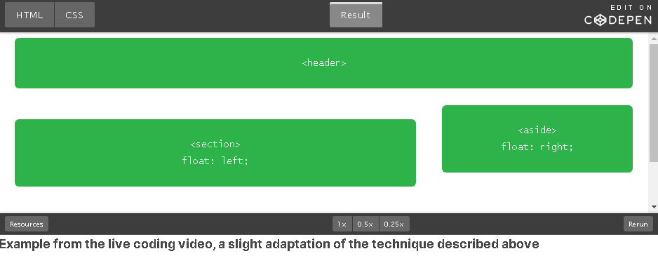

<h5>HTML</h5>
```
<!DOCTYPE html\>
<html lang="en"\>
<head\>
<meta charset="UTF-8"\>
<title\>article and section elements\</title\>
</head\>
<body\>
<article id="ces"\>
<header\>
<h2\>CES 2018\</h2\>
<h3\>Consumer electronics and consumer technology tradeshow\</h3\>
</header\>
<section\>
<h4\>Getting There\</h4\>
<p\>Arriving at the show location proved much harder for me. I couldn't
get a hotel closer to where the show was taking place and so had to rent
a car....\</p\>
</section\>
<section\>
<h4\>Conference Sessions\</h4\>
<p\>I managed to squeeze in 3 conference sessions on the first
day...\</p\>
</section\>
<footer\>
<p\>Written by guest author Nicholas Abc. Read Nicholas's blog
here.\</p\>
</footer\>
</article\>
</body\>
</html\>
```

An article element can use section elements to split its contents into
groups.

### Semantic elements sample

To get a better understanding on the usage of semantic elements in your
Web page, try on
this [CodePen](https://codepen.io/w3devcampus/pen/Wjzjpx):

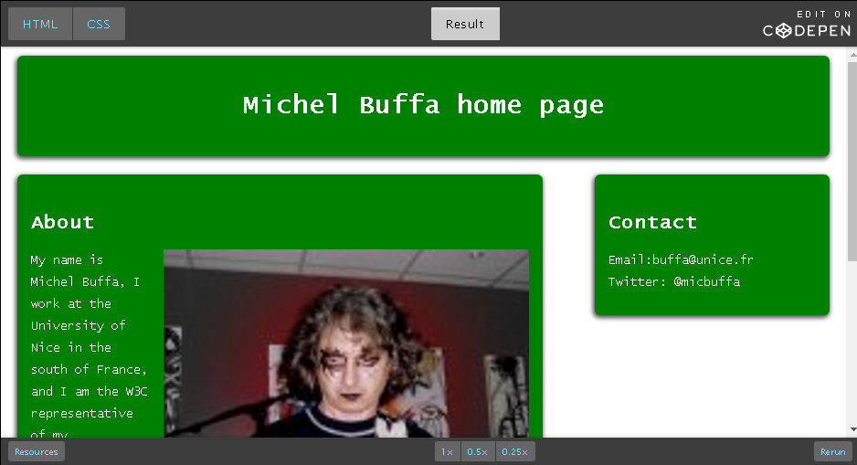

```
<!DOCTYPE html>
<!--HTML5 doctype-->
<html lang="en">
<head>
<meta charset="UTF-8">
<title>Semantic Elements complete example</title>
</head>
<body>
<!--Our global header-->
<header>
<h1>HTML5</h1>
<h2>Table of Contents</h2>
<!-- Navigation can be on its own or within the header element-->
<nav>
<ol>
<li><a href="#intro">Introduction</a></li>
<li><a href="#history">History</a></li>
<li><a href="#features">Features</a></li>
<li><a href="#logo">Logo</a></li>
<li><a href="#ref">References</a></li>
</ol>
</nav>
</header>
<!--The main content of our page starts here-->
<main>
<!-- Our introduction is within an article element because this content
can make sense on its own-->
<article>
<header id="intro">
<h2\>Introduction</h2>
</header>
<p>HTML5 stands for HyperText Markup Language. It is used to create
content on the world wide web like webpages. HTML5 is the fifth revision
of the language's standard. It was published in October 2014, 17 years
after HTML4 was standardized.</p>
<p>HTML5 aims to provide improved support for latest multimedia. It
also reduced dependency on plugins and APIs providing a common interface
making loading elements easier...</p>
<!-- This is an example of aside. The mark element has also been
showcased in the paragraph. -->
<aside>
<h4>API</h4>
<p>API stands for Application Programming Interface. It is a set of
routines, protocols, and tools for building software and applications.
<mark>This content uses the aside element.</mark> This is only for
semantic meaning and so doesn't carry any instructions for presentation.
It will appear like a normal paragraph in your document. If you wish to
include this in a sidebar, you will have to provide the appropriate
markup and styling for it.</p>
</aside>
</article>
<!-- Our history section-->
<section>
<header id="history">
<h2>History</h2>
</header>
<p>HTML5 is based on a position paper presented by Mozilla Foundation
and Opera Software at the W3C workshop in 2004. The Web Hypertext
Application Technology Working Group (WHATWG) was formed to start work
on this...</p>
</section>
<!-- Our features section with smaller headings-->
<section>
<header id="features">
<h2>Features</h2>
<h4>Keeping up with times</h4>
</header>
<p>HTML5 introduced elements and attributes that fits the typical
usage in modern websites. It introduced new semantic elements to replace
generic blocks like div and span. Purely presentation elements such as
font and center have also been completely dropped...</p>
```

<h4>New APIs</h4>

<p>New APIs were introduced to allow cross-document communication,
drag and drop functionality, immediate mode 2D drawing using the canvas
element, webstorage etc...</p>

<h4>Error Handling</h4>

<p>HTML5 provides detailed rules for parsing allowing HTML5 compliant
browsers to produce the same type of behavior when parsing incorrect
syntax. It has been designed for compatibility with older browsers.
Older browsers ignore new HTML5 constructs... </p>
```
</section>
<!-- Our logo section show hows to use the semantic elements figure and
figcaption-->
<section>
<header id="logo">
<h2>Logo</h2>
</header>
<figure>

<figcaption>Fig1. - The HTML5 logo made official in April
2011</figcaption>
</figure>
</section>
<!--Our references section concludes the main content of this page-->
<section>
<header id="ref">
<h2>References</h2>
</header>
<p>Contents of this sample have been adapted from the <a
href="https://en.wikipedia.org/wiki/HTML5" target="_blank">HTML5 page
on Wikipedia</a>
</p>
</section>
</main>
<!--Our global footer where you would typically specify copyright,
author, contact info and a footer navigation bar-->
<footer>
<p>Copyrights information...</p>
<!-- We show our authors and contact details using the details and
summary elements. Expand to show content. -->
<details>
<summary>Authors</summary>
<p>Author1</p>
<p>Author2</p>
</details>
<details>
<summary>Contact</summary>
<!-- Using nav within summary element-->
<nav>
<!-- Styling has been added to make nav menu in a horizontal row-->
<ul style="margin: 0; padding: 0; list-style-type: none;">
<li style="display: inline;"><a href="#" style="text-decoration:
none; padding: .2em 1em;">email</a></li>
<li style="display: inline;"><a href="#" style="text-decoration:
none; padding: .2em 1em;">twitter</a></li>
<li style="display: inline;"><a href="#" style="text-decoration:
none; padding: .2em 1em;">facebook</a></li>
<li style="display: inline;"><a href="#" style="text-decoration:
none; padding: .2em 1em;">GitHub</a></li>
</ul>
</nav>
</details>
</footer>
</body>
</html>
```

It is an example of an informational page about HTML5 using the
following semantic elements: header, nav, main, article, section, aside,
mark, figure, figcaption, details and summary.

Experiment with the sample and try inserting other semantic elements
that you want to try.

<h3 id="ch2-3-6">2.3.6 \<div\> and \<span\> Elements</h3>

\<div\> element

The \<div\> tag is one you will likely see sprinkled all over an HTML
document.  \<div\>, as the Content Division element, is used to define a
division or a section of the document. Div is not a semantic element,
however, it is commonly used when there isn't a better semantic
sectioning element to use.

It is like a **generic container** that can hold a variety of
elements such as paragraphs, images, links, tables, etc. It can be used
to group elements for styling purposes. You can do this by assigning
an id or class attribute to the div element and then applying styles
which will affect all elements in the div container.

It should only be used if you cannot use any other semantic element in
its place.

We will see an example of \<div\> here:

```
1.  <section>
2.    <h2>Week 1</h2>
3.    <p>This week, you will be learning about...week 1 stuff</p>
4.    <div class="code">
5.      <ol>
6.        <li>Line of code</li>
7.        <li>Line of code</li>
8.      </ol>
9.    </div>
10. </section>
11. <section>
12.   <h2>Week 2</h2>
13.   <p>This week, you will be learning about...week 2 stuff</p>
14.   <div class="code">
15.     <ol>
16.       <li>Line of code</li>
17.       <li>Line of code</li>
18.     </ol>
19.   </div>
20. </section>
```

If you want to style all code snippets in your HTML document a certain
way, you can place your code in a div container and apply styles
collectively to it using the class attribute.

\<span\> element

While we are on the topic of the \<div\> tag and semantic elements, one
more important element that comes in handy is \<span\>. Span and Div are
so similar yet so different that there is an entire [wikipedia
page](https://en.wikipedia.org/wiki/Span_and_div) dedicated to it.

<h4>Usage</h4>

What happens when you do not find an appropriate tag to use? Let's look
at this example:

1.  \<p\>Hi everyone! My name is Alexa and I work for ABC Company\</p\>

I want to change the color of only 'ABC Company'? Should I use a
paragraph tag? Let's try that..

1.  \<p\>Hi everyone! My name is Alexa and I work
    for \<p class="company"\>ABC Company\</p\>\</p\>

If you then design your style such that the 'company' class will make
text blue, the output will look like this:

Hi everyone! My name is Alexa and I work for

<h4>ABC Company</h4>

That does not work because \<p\> creates a new line. The HTML above is
also invalid. We will see why shortly. Now, let's try using \<span\>:

1.  \<p\>Hi everyone! My name is Alexa and I work
    for \<span class="company"\>ABC Company\</span\>\</p\>

Hi everyone! My name is Alexa and I work for ABC Company

When can \<span\> be used?

-   when adding styling to part of a sentence (inline),

-   when manipulating part of a sentence using JavaScript,

-   When there isn't a more appropriate HTML element that applies, you
    can use \<span\> (and \<div\>) to add attributes such
    as class and id

Like \<div\>, \<span\> is not a semantic element. You should only
use \<span\> if no other semantic element is
appropriate. \<div\> and \<span\> serve the same purpose but should be
applied at different levels. \<div\> is a block level element (for a
block of space) while \<span\> is an inline element (for within a line
or phrase).

Difference between \<div\> and \<span\>

They are both considered generic elements that don't have any meaning.
But \<div\> is a block level element while \<span\> is an inline
element. 

**Block level elements** - used within body of the page. These occupy a
block of space and start in a new line. They usually have empty lines
above and below the block. They can contain inline elements and other
block level elements. Other examples: \<p\>, \<h1\> - \<h6\>.

**Inline elements **- as the name suggests are 'in-the-line'. They can
start anywhere in a line. They can only contain data (like text) or
other in-line elements. Other examples: \<em\>, \<strong\>.

**Note: **There are several other semantic inline elements such
as \<abbr\>, \<cite\> and \<code\> that should be used in preference
to \<span\> where possible.

<h4>Why two paragraph tags don't work</h4>

In the first \<span\> example, we said that nesting two paragraph
elements was invalid HTML.

\<p\>Hi everyone! My name is Alexa and I work
for \<p class="company"\>ABC Company\</p\>\</p\>

After reading an opening tag \<p\>, if the browser sees another \<p\> or
any other block level element including \<div\>, it will automatically
close the first open \<p\> for you. Nesting one paragraph tag in another
is not valid because the browser will consider them as two
paragraphs one after the other. Even though you close the paragraphs
with two closing tags \</p\>\</p\> at the end, they are ignored.

<h3 id="ch2-3-7">2.3.7 Activities – Semantic Meaning</h3>

Please find below suggested activities to help you practice:

1.  How are \<header\> and \<h1\> related? What is the difference
    between them?

2.  Create a well structured HTML page using as many semantic elements
    as you can.

3.  Write a short HTML page that uses the \<div\> and \<span\> tags. You
    need not style them.

<h3 id="ch2-4-1">2.4.1 Introduction</h3>

The \ tag

In this age of visual culture, what is a Web page without images?
Boring! Pictures and images make everything more interesting and
engaging. 

Here is the most basic \ tag:

1.  \

The image tag has several attributes out of which only src and alt are
required. The rest are useful but optional attributes. 

<h4>*Image*: 'src' attribute</h4>

The source attribute from the \ tag tells us where to fetch the
image from. There are two different types of URLs you can give for
source. 

1.  Path to an image file within your Web site:  
    \

2.  Path to an image file that resides elsewhere on the Web:  
    \

The type of image file format (i.e. png, jpeg, etc.) you should use does
not depend on the img element in HTML5 but on the browser that renders
the content. Some formats like png, jpeg, gif and bmp are widely
supported by browsers and so they are recommended when using images in
your Web site. Here is a [comprehensive list by
Wikipedia](https://en.wikipedia.org/wiki/Comparison_of_web_browsers#Image_format_support) listing
browsers and the image formats they support.

Here is a list of things to keep in mind when using the src attribute:

-   Do not include spaces in your image path.

-   Make sure your image path matches the capitalization of the actual
    path. Your images directory in your Web project might be 'images/'
    but your path might say 'images/' missing the capitalization in 'I'.
    Mismatched capitalization might work in some places but not
    all. *Recommended practice*: use lower case for all directories,
    file names and file extensions.

-   Use Unix (/) path name separator instead of Windows (\\) style. This
    might work on Windows but will fail elsewhere. The path should be
    'images/example.png' and not 'images\\example.png'.

-   When your Web page loads, it is always going to look at the location
    you specified in src for the image. Ensure the image resides in the
    right location or the user is going to get a broken link. This is
    even more crucial when you use a relative path - any path that is
    'relative to' the file. E.g. 'images/test.png' is going to look for
    the 'images' directory in the same level as your html page. Thus,
    you need to ensure your document root doesn't change. The simplest
    is to always keep the images at the same level, or one level down.

-   Absolute paths are not recommended to use because essentially, you
    are hardcoding the entire URL. The URL contains parts to it before
    the actual path - https://example.com/images/test.png like the
    protocol (http) and domain name (example.com). Whereas, relative
    URLs start with a path - '/images/test.png'. The base URL here comes
    from where your HTML document is deployed. This is easier to
    maintain. It will work on localhost or if you switch domain names
    without requiring any changes.

*Image: Formats*

Before you begin using images in your Web site, you are advised to visit
this [Web
page](https://www.smartbugmedia.com/blog/image-file-formats) to get an
understanding of the most common image file types such as jpeg, gif,
bmp, tiff and png, their pros and cons, and when to use them.

When using images in your HTML5, there are a few image format related
information to be aware of.

-   **Image data:** most images, especially JPEG, contain a lot more
    data than is needed for a browser and are too often overly large and
    slow.  You can reduce the size of the image using photo editing
    software that allows you to re-sample an image to reduce its pixel
    data and in turn reducing image size. However, once you re-sample an
    image, do not make change its size (height and width) to make it
    larger as it will become pixelated and blurry.

-   **JPEG** (Joint Photographic Experts Group) images compress well and
    are the standard for photos. But they don’t support any sort of
    animation or transparency.

-   **PNG** (Portable Network Graphics) images support transparency and
    alpha channels. This makes them useful for non-rectangular images
    that may need to overlay different background colors or other
    elements on the page. To make PNG images, a user would need graphics
    editing software (like GIMP, Photoshop, or others). PNG is a [W3C
    Web standard](https://www.w3.org/TR/PNG/) (this is the 2nd edition -
    the 1st edition
    was [published](https://www.w3.org/TR/REC-png-961001) in 1996!).

-   **SVG** (Scalable Vector Graphics) are defined mathematically and
    support animation. Also, since they are defined mathematically  they
    scale to 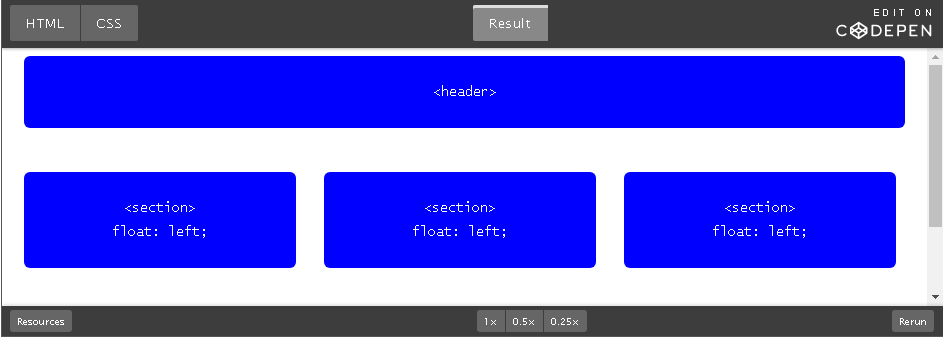any size without
    worrying about pixels, resolution or image data. This makes SVG
    images an excellent format to use, if possible. SVG is great for
    charts, graphs, maps, geometric shapes, and line based
    illustrations.  SVG is also a markup language in its own right and
    is very similar to HTML. Typically, it is created with vector
    graphic software (like Inkscape, Adobe Illustrator,
    and [others](https://developer.mozilla.org/en-US/docs/Web/SVG/Tutorial/Tools_for_SVG)),
    but some people write the markup by hand. Note that SVG 1.1 is
    a [W3C Web standard](https://www.w3.org/TR/SVG/).

<h3 id="ch2-4-2">2.4.2 Attribute alt</h3>

alt stands for *alternate text* for an image.

1.  \

Using this attribute, you can provide a short description of what the
image is about. This description should convey information about the
image or its function in the page. The alt is an important attribute
because it is the text alternative to the image for users who are unable
to see the image, instead using assistive technology like screen readers
that rely on the alt text.  It is also useful to provide relevant
information for search engines. 

Importance of the 'alt' attribute

If you add alt to your image, screen readers will typically announce
that there is an image and read out the contents of the alt attribute.

Your image will not display if the path in your source attribute is
wrong, if you have a slow internet connection, or if the image has been
relocated or renamed. It will show a broken link. It is useful to have
the alternate text display so the user can make sense of the missing
image.

Search engines do not 'see' images. They rely on the alt attribute to
find out what the image is about. If you use your target keyword in alt,
it will optimize the search.

To consume less data, some mobile users turn off images. They need
the alt attribute to find out what the image is about.

alt also contributes to semantic meaning - it offers meaning to the
image and suggests the purpose of the image content.

If the image is purely for presentation or decoration purposes, you
should leave alt empty - \. Assistive technology will then
ignore this content.

<h4>Purpose of the image</h4>

You can use images for various reasons in your Web page like:

represent a concept, illustration or just a photograph that provide
information

background for a button or link

display a quote or message in the form of text in an image

decorative images

Depending on the category the image fits into, the alt text differs.
This W3C [WAI images
Tutorial](https://www.w3.org/WAI/tutorials/images/) is an excellent
resource for deciding the category of your image and for learning how to
write proper alt text for that category.

Here is an example of a tulip image using invalid source (that image is
missing from the 'images' directory) and how it will look in a Web
browser:

1.  \

<!------------------------------------------------------------------------------------------------>
<!------------------------ 38. Supposed to be an image of tulips (108) --------------------------->
<!------------------------------------------------------------------------------------------------>
<p align="center" width="100%">

</p>

<h3 id="ch2-4-3">2.4.3 Attributes: title, height & width</h3>

<h4>The 'title' attribute</h4>

Try this: place your mouse on the image below. Don't click, just rest
your cursor on it. 

<!------------------------------------------------------------------------------------------------>
<!-------------------------------- 39. tulips in a basket (108) ---------------------------------->
<!------------------------------------------------------------------------------------------------>
<p align="center" width="100%">

</p>

Did you see the hidden message 'Tulips from woodburn tulip
festival'? title is a global attribute we have seen before but worth
mentioning again because it is very useful in an \ tag. If you
have a complicated image that could use a tooltip or description, you
will want to use the title attribute.
```
1.  \
```
The alt attribute is meant to be an alternate source of information
while the title attribute should provide additional information about
the image. 

**Note**: For images, you **must** use an alt attribute as there is no
guarantee that the title attribute is presented to assistive technology
users. The title attribute should not be relied upon for important
information, and it should not be used in place of the alt attribute.

The 'height' & 'width' attributes

Not all your images come in the right size for your Web page.
The width and height attributes can be used to resize the image in
pixels without using an external editor.

Here is my original image:

<!------------------------------------------------------------------------------------------------>
<!------------------------------------ 40. html5 logo (109) -------------------------------------->
<!------------------------------------------------------------------------------------------------>
<p align="center" width="100%">

</p>

Clearly too big for the page. The original image dimensions is 345x523
in pixels. Pixel is short for picture element. These are the little dots
that make up your image on a computer display like the monitor or laptop
you are viewing this in. Pixels are generally too small to see (unless
you look really close) and a screen might be made up of millions of
pixels.

Now, if I want to resize the HTML logo above by half:

1.  \

<!------------------------------------------------------------------------------------------------>
<!-------------------------------- 41. html5 logo resized (109) ---------------------------------->
<!------------------------------------------------------------------------------------------------>
<p align="center" width="100%">

</p>

Actually, you don't need to define both width and height. You can just
specify either height or width and the aspect ratio will be adjusted.
For example, the image above can be achieved using the following too:

1.  \

The use of these attributes really depends on how you are using the
image. If it is part of an [image
grid](https://www.imagely.com/wp-content/uploads/2013/03/adding-functionality-justified-image-grid-03.png) or
a list with multiple images of the same size, it is best achieved by
CSS. So you don't have to bother adding the same dimensions to every
image and it will be repetitive. Plus it is generally bad practice to
encode dimensions directly into the HTML.

However, if you are adding the image into some content and it needs to
be a certain size for the visual flow of the reader, then it is best to
add it to HTML using the height and width attributes. This is to avoid
cluttering your CSS with a style for every image in your page. This is
also useful if you are changing or removing the image: you can just
remove it from your HTML and not deal with remembering to remove it
from your CSS too.

<h3 id="ch2-4-4">2.4.4 Decorative images</h3>

Should all images be part of HTML content?

A significant part of images on the Web are not used for any meaning.
They merely serve a decorative purpose and fall under the presentation
category. How do you identify these images? Well, if you have nothing
relevant to put in your alt attribute or if you feel like it is not
important to your or to the prospective reader, it should not be in your
HTML.

We know we should keep content and style separate in HTML. Then how do
we move these images out of content? Well, don't add them using
the \ tag in HTML. Use CSS instead. 

Examples of such images:

-   background images

-   fancy border graphics

-   banner graphics

-   pictures of landscapes or textures that are being used as elements
    behind or surrounding the content

Some pages (especially for video games, fancy magazines, etc) have a lot
of eye-candy imagery that is not core to any of the semantic meaning of
the page.

Can you identify these types of decorative images?

Find out from their tooltips!

<!------------------------------------------------------------------------------------------------>
<!-------------------------------- 42,43,44.  (110) ---------------------------------->
<!------------------------------------------------------------------------------------------------>
<p align="center" width="100%">
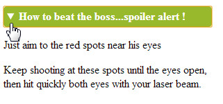


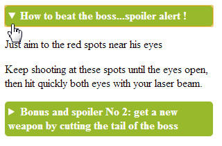
</p>

<h3 id="ch2-4-5">2.4.5 Using \ Tags</h3>

Hi there! In this video, we're going to take a closer look at how we add
images to our HTML pages.

We'll explore how to load an image, and how to give it a good alternate
text value, and a good title value, as well as how to adjust the size of
the image on a page using 'height' and 'width' attributes.

We've all heard the phrase that a picture paints a thousand words.

Well, images are a very important part of any Web page design.

They enhance the visual appeal of a page, can create excitement or
interest about our content, and can have an impact on the message we are
sending our readers.

Let's load our first image.

To define an image on a page, we use the image element.

Now this is a self-closing tag, meaning that it doesn't require an end
tag.

To define the image, we go inside the image tag and we set some
attributes.

One of the key attributes to set is the source attribute, which tells
the browser the location of the image and before I set this let's have a
look at the images on my local machine.

As you can see my "images.html", which is this page, is here on my local
machine.

And at the same level on my desk, I have this "images" folder which is a
good practice for gathering all the images I want to use on my web page
or Web site into this single folder.

Inside this "images" folder, I have lots of images, some of them are png
and jpg files and as you can imagine any modern browser can support
these image types and can show the images.

The image I want to use is located in this "images" folder and it's
called "beach.png".

That's the value I will set here in my HTML page.

I'll set the location to be: "images/beach.png"

That's a relative path, it's telling the browser that they'll find this
image, in an "images" folder and it's called, beach.png.

When I "Save" my file, there you go, I have loaded my first image.

Let's talk now about the 'alt' attribute and why we add alternate text.

The 'alt' attribute is important because it offers an alternate source
of information about this image for those who cannot see the image.

This text is read aloud by screen reader software for those with
impaired vision or disabilities.

And search engines can't see the image either, so they rely on the alt
text to understand what the image is about.

This text is also displayed to the user if, for some reason, the browser
can't display your image.

For all of these reasons make sure you supply a good descriptive alt
text for every image.

Now what text you supply depends on the type of image you are
displaying.

If the image is just a background or a decorative image, you might not
want to describe it with this text and instead let the screen reader
skip over it.

But for functional images or images containing or supporting information
for your page, you should always apply this alt text.

Now, while the image we have in front of us here could be decorative,
what of is being shown on the page that is, renting a beach house, and
this is a view from the backyard.

In that case, I would provide a description that conveys the meaning of
the image.

I think this would be a good alternate attribute value.

Here what I've said is:

"Enjoy the magnificent view of the beach and the sea from this
oceanfront cottage."

Let's show the alt text in action when the browser can't load my image.

To do that, I'm going to break the link on the page by pointing to a
location or file that doesn't exist.

For example, if I have a typo here, and that now is a file that doesn't
exist on my disk, so as you can see, when the link for the image points
to a file that doesn't exist, our alt text is displayed nice and clearly
on the page.

This is the view that you would see.

It's not ideal but at least you still get some information and can
continue with the page.

That's the alt text attribute.

Let's go ahead and repair our link so we can see the image again.

I'll just change it back to the original value, and I'll move this down
so we can see it.

The next attribute that I'd like to talk to you about is the 'title'
attribute.

Now this is a global attribute and it's supported by the image element.

It's used to convey more information about the image.

For example, if I type in, 'title=' and then paste in some descriptive
text it says, "Oceanfront view from the Surfers Paradise rental cottage,
California."

And what happens is, if I sav my page, nothing looks like it happened
over on the page.

But if I hover over the actual image, now I get that information.

This is a visual element that is displaying more information about the
actual image in question.

That's the 'title' attribute.

Now let's have a look at how you adjust the size of the image on our
page.

For that I'm going to need a bigger image.

To save time I'll just "Paste" in a new image and "Save" my page.

And as you can see this is a new image, smiley.jpg and if I scroll down
you can see whooo, this is a very large image.

What can we do?

Well, we can easily fix this with the help of the 'width' and 'height'
attributes.

While I use this attribute 'width', I'll have to define this in pixels.

You may have heard the term pixel before.

It's just a unit of measurement for computer screens.

Each screen is made up of millions of these tiny squares called pixels.

For example, my monitor that you see here is 1920 by 1080, meaning it's
a thousand nine hundred and twenty pixels tall and a thousand eighty
pixels wide.

Let's try 'width' value in pixels and I'll pick something small.

Say, 300, and I'll "Save" my image.

And after I just scroll down you can see my image is actually showing.

Again, if I remove the 'width', "Save" again, you can see the image is
in its native size but if I was to set the 'width', you can see the
image shrinks down to a nice size.

You also notice that I've only defined a new 'width' attribute value but
the height of the image has also been adjusted.

Well that's because the browser tries to maintain the aspect ratio of
the image.

I could define a 'height' attribute as well.

And when I "Save" my image, when I scroll down you can see that the
image height has changed and the image looks squashed because I've
changed the aspect ratio, the height to width ratio.

I'll just remove that once more, and there we have a smaller image.

That's changing the size of an image using the 'width' and 'height'
attributes.

Finally, I'd like to show you how to load remote images.

Up until this point we've loaded images located on a path relative to
our page.

As you can see here the smiley.jpg image is in a folder called "images"
relative to this page called images.html

However, the real power of the Web is to be able to gather information
from across the Internet.

And all we need to do is supply an address.

This time, I'll "Paste" one in and as you can see, this is just a URL
and it's telling the browser to find this image located at this site and
gist.githubsercontent.com/AndrewJburn, etc., etc.

At the end of this long URL is just the name of my image, image001/png.

And when I "Save" my file and we scroll down, you can see that that
image has been loaded from this remote site into our Web page.

That's it.

In this video, we'd fun with images, the image tag and its attributes.

You're all set to spice up your pages with some images. Take care!

<h3 id="ch2-4-6">2.4.6 Activities - images</h3>

Please find below a list of possible activities:

1.  Create a simple Web page that talks about your day using only text
    and images. Include at least three images and add
    the alt and title attributes. 

2.  Look through the Web and your favorite Web sites and identify those
    that you think use a lot of decorative images.

3.  Create a HTML page and add the following types of images:  
    - Informative image that represents concepts and information  
    - Decorative image  
    - images of text

Use the alt attribute to provide alternate text for the images above.   
Refer to the [WAI images
Tutorial](https://www.w3.org/WAI/tutorials/images/) for a guide to
writing alternate text. 

<h3 id="ch2-5-1">2.5.1 Introduction</h3>

<h4>What are hyperlinks?</h4>

In a typical Web page, you may well have seen a sentence like this one:

<b>[Find out more](https://en.wikipedia.org/wiki/Hyperlink) about our
   offers!</b>

Or something like this:
<!------------------------------------------------------------------------------------------------>
<!---------------------- 45. buy now button to illustrate hyperlink (xxx) ------------------------>
<!------------------------------------------------------------------------------------------------>
<p align="center" width="100%">

</p>

Try clicking the blue text or the 'Buy Now!' button, if you haven't
already (make sure to navigate back to the course).

A hyperlink is any text or image that takes you to another place. This
can be:

-   another Web page: e.g. the hyperlinks wiki page
    at https://en.wikipedia.org/wiki/Hyperlink

-   a bookmark (a specific part of a Web page): e.g. the History section
    of the Hyperlinks wiki page
    at https://en.wikipedia.org/wiki/Hyperlink#History**  
    **  
    We learned about using the id attribute as a link target in the unit
    about attributes earlier. If you have a section in your page, you
    can link to that section using the value of its id attribute (e.g.
    History) preceded by the number sign as per *\#History*

-   a local link (link to another part of the same Web page):
    e.g. a_tag.asp is a page that belongs to this Web site

-   an email: e.g. mailto:helloauthor@w3c.com

<h4>Why you should prefer text links over images</h4>

When it comes to hyperlinks, try to use text instead of images when
possible.

-   images are not as well understood or recognized as text.

-   Text is better for accessibility.

-   If you have text in an image like the 'Buy now' button, search
    engines do not recognize text in images. The text alternative for
    the image should convey the action that will be initiated (the
    purpose of the image, e.g, "buy now"), rather than a description of
    the image ("button").

<h4>Best practices</h4>

-   Apply hyperlinks to short phrases. It is unusual to see the link tag
    used around a whole paragraph.

-   Make link phrase meaningful. Avoid phrases like 'Click Here' or
    'Read More'. 'Click here to get help' is redundant when you can
    create a link around the phrase 'Get Help'. The link is an
    indication that it should be clicked.

-   Don't use short link text. It is easy to miss the 'blue' hyperlink
    if it is used on one word or character and is hard for users to
    click using touch screen.

-   Appearance - links have a default appearance in most browsers, blue
    and underlined. Ensure no other text in your page is underlined so
    as to avoid confusing the user. They might get frustrated trying to
    click text that they think is a link.

-   If you choose to have image links, it should have **alternate
    text** that describes the purpose of the link instead of the image
    used - describe the target link.

1.  \<a href="https://www.table-header-cells.com"\>

2.    \

3.  \</a\>

<h4>Anchor element</h4>

The hyperlink tag in html is simply **\<a\>, **and it is called
the** anchor element**. Here is how it is used:

1.  \<a href="https://en.wikipedia.org/wiki/Hyperlink"\>Click
    here\</a\> to go to the Wikipedia Hyperlink page.

Result: **[Click here](https://en.wikipedia.org/wiki/Hyperlink) to go to
the Wikipedia Hyperlink page.**

Note: The anchor element should not be confused with the \<link\> tag.
The \<link\> tag is used to define a link between a document and an
external resource like an external style sheet. You will learn more
about the \<link\> tag in the next chapter.

<h4>States of a hyperlink</h4>

If the link has not been clicked, it will be blue and underlined. Now,
click on the link and you will see that a visited link looks purple and
underlined. Apart from unvisited and visited links, there is also a
status called active link. A link becomes active while the user
is clicking on it. During this time, the link will be red and
underlined.

-   **Unvisited**: blue + underlined

-   **Visited**: purple + underlined

-   **Active**: red + underlined

Usage

The \<a\> tag can surround text or an image. 

1.  \<!-- Text in a hyperlink--\>

2.  \<a href="https://www.qwant.com/"\>If you click on me, I will take
    you to qwant.com\</a\>

3.  \<!-- Paragraph in a hyperlink--\>

4.  \<a href="https://www.qwant.com/"\>\<p\>If you click on me, I will
    take you to qwant.com\</p\>\</a\>

5.  \<!-- Image in a hyperlink--\>

6.  \<a href="https://www.qwant.com/"\>\\</a\>

You can even use the anchor element to add your email address under the
contacts section of your Web page. 

1.  \<p\>Feedback: \<a href="mailto:authors@example.com"\>Send Mail to
    Authors\</a\>\</p\>

Result (try the hyperlink below):

Feedback: [Send Mail to Authors](mailto:authors@example.com)

You can add a subject to the email. 

1.  \<p\>Feedback: \<a href="mailto:authors@example.com?Subject=Hello"\>Send
    Mail to Authors with Subject\</a\>\</p\>

Result (try the hyperlink below)

Feedback: [Send Mail to Authors with
Subject](mailto:authors@example.com?Subject=Hello)

Nevertheless, you should probably avoid using hyperlinks for email
addresses:

-   The email address usually opens up on the default email client on
    the user's computer which they might not use. This defeats the whole
    purpose.

-   Providing your email address in your Web page directly as text or a
    hyperlink will expose your email address. Bots or spam crawlers can
    be used to search the Web to pick up email addresses for spam. You
    should avoid this if possible and use contact forms instead.

<h3 id="ch2-5-2">2.5.2 Attributes: href and target</h3>

<h4>The 'href' attribute</h4>

The only attribute we have seen thus far in this chapter of hyperlinks
is href.   
href points to the URL that the link should jump to. Though it is an
optional attribute, without it, the \<a\> tag will not be a hyperlink
because it obviously has no idea where to jump to.

The href attribute takes a URL. This URL can be in the form of:

-   a link to an external Web site also known as [absolute
    URL](https://www.differencebetween.com/difference-between-an-absolute-and-vs-a-relative-url/).

1.  \<a href="https://qwant.com"\>\</a\>

-   a link to a file or page within the same Web site also known
    as [relative
    URL](https://www.differencebetween.com/difference-between-an-absolute-and-vs-a-relative-url/). 

1.  \<a href="contacts.html"\>\</a\>

-   a link to an element on the same page. The element, is referenced
    using its ID. E.g. If you want to link to a div with id='details',
    the corresponding anchor tag will be:

1.  \<a href="#details"\>\</a\>

-   protocols such as:

\- mailto: \| for email addresses. 

1.  \<a href="mailto:abc@alphabets.com"\>\</a\>

<h4>The 'target' attribute</h4>

target specifies the destination where the linked URL in href should be
opened. It can take a variety of different values, but for our purposes
we'll focus on the two below.

<table>
<colgroup>
<col style="width: 40%" />
<col style="width: 11%" />
<col style="width: 29%" />
<col style="width: 18%" />
</colgroup>
<thead>
<tr class="header">
<th>Destination</th>
<th>Attribute value</th>
<th>Example</th>
<th>Result (try this)</th>
</tr>
</thead>
<tbody>
<tr class="odd">
<td>In the same view where the link resides. If no target is specified,
this is the default behavior.</td>
<td>_self</td>
<td>&lt;a href="https://qwant.com/" target="_self"&gt;&lt;/a&gt;</td>
<td><a href="https://qwant.com/">LINK will open in same
window</a> (Navigate back to the course by clicking Back button in
browser)</td>
</tr>
<tr class="even">
<td><p>In a new window or tab. This is very convenient if you want to
link the user to a Web page without having the current page disappear.
By clicking on the previous window or tab, they can redirect to the page
where the link is.</p>
<p><strong>Note: </strong>It is best to inform users that the page will
open in a new tab or window when using '_blank' as some may not be aware
of the new tab having opened.</p></td>
<td>_blank</td>
<td>&lt;a href="https://qwant.com/" target="_blank"&gt;&lt;/a&gt;</td>
<td><a href="https://qwant.com/">LINK will open in new window</a></td>
</tr>
</tbody>
</table>

<h3 id="ch2-5-3">2.5.3 Attributes: Media and Download</h3>

<h4>The 'media' attribute</h4>

The media attribute was introduced in HTML5. We will look at it briefly
here. It is used to specify what kind of media or device the URL you
linked to in href is optimized for. The URL could be targeted for
special devices like projectors, speech synthesizers or pages meant to
be printed. It is useful if you want to cater your target document that
the URL points to a particular device type.

Imagine you have a page scattered with multiple images and you want to
display this page on a handheld device. Handheld devices are known to
have small screens and limited bandwidth. We want to align the page
better for a small screen and reduce the size of images. So the media
attribute allows us to tell the anchor element that this page is
targeted for handheld devices. You do this by providing a value for the
attribute. This value could be any valid [media
query ](https://www.w3.org/TR/css3-mediaqueries/)and is a combination
of **device type** and **media rendering values**.

Let's look at another example - you could create a print link to a long
content heavy page that will redirect you to a print version of the
same. You want this print version to be formatted into one page ideal
for printing and with resolution of 250 dpi. Here is how the HTML5 code
will look like:

1.  \<a href="https://en.wikipedia.org/wiki/Media_queries?output=print" media="print
    and (resolution:250dpi)"\>Print wiki page about media queries\</a\>

### The 'download' attribute

The download attribute is also new in HTML5 and it makes a link download
a file instead of navigate to another location. It takes in the filename
as value but the value is optional. So the download attribute can be
specified in the following ways:
```xml
1.  <a href="/assets/hello.txt" download>

2.  <a href="/assets/hello.txt" download="new-name-for-text-file">
```
If you do not specify a value for download, it will download the file
with name unchanged. Else it will download the file with file name
modified according to value specified. 
```html
1.  \<a href="/assets/hello.txt" download\>

... will download the file with the same name - 'hello.txt'.

1.  \<a href="/assets/hello.txt" download="new-name-for-text-file"\>

... will download the file after altering its name to -
'new-name-for-text-file.txt'.
```
Example (try the hyperlink below in Google Chrome): 

[Click to
Download](https://courses.edx.org/assets/courseware/v1/6e709b3765de6510e212932331a0bf52/asset-v1:W3Cx+HTML5.0x+3T2020+type@asset+block/hello.txt)

**Note: **the download attribute is [not supported in all
browsers](https://caniuse.com/#search=download). Try
the download attribute in a html file of your own and run it in
different browsers to see how it behaves.

<h3 id="ch2-5-4">2.5.4 Use of Hyperlink Attributes</h3>

<!------------------------------------------------------------------------------------------------>
<!---------------------- 46.  hyperlink (xxx) ------------------------>
<!------------------------------------------------------------------------------------------------>
<p align="center" width="100%">

</p>

In this live coding demo, we're going to dive deep into hyperlinks.

Hyperlinks, or links for short, are what give the Internet its magic.

They allow us to share and connect with other content.

And I'm sure you click on some links on a Web page at least a few times
a day.

For this demo, we have Visual Studio Code open here on the right, and
our browser open on the left.

Now, I'm in the process of creating this page you see before you called
"Page 1".

What I'm going to do is use this fictitious page to create hyperlinks
and demo all of their features.

Let's dive right in.

The first thing to do is to show you what my site looks like on disc.

And as you can see, I have two pages, Page 1, Page 2.

I also have this "assets" folder and I'll get to that later.

But for now, you can see I have two pages and it's quite common on a Web
site that you want to jump from one page to the other.

And I'm demonstrating that here with "See page 2 for more information."

What I actually want to do is make that "page 2" words, make those
clickable.

When the user clicks on them, I jump to Page 2.

Enter hyperlinks.

Over here in my HTML code, I'm going to add an anchor element and define
the page 'href' attribute.

And there I have defined it as "page2.html".

What I was saying is that when you click on this link, please go to
"page2.html".

You can see Page 2 is now enclosed inside this anchor element.

So that will be the hyperlink text and we see that when I save the page.

And over here you see that's now a hyperlink.

If I click on the hyperlink as a user, I go to Page 2.

"Hi from Page 2!"

You may have noticed that when I clicked on this Page 2 hyperlink, Page
1 was replaced with Page 2 in the same tab in my browser.

And that sometimes is not what you want.

Maybe sometimes you want to open up a new tab in your browser, and
that's all

controlled with this target attribute.

So, allow me to demonstrate.

In this next demo, I say, "Open page 2 in a new window."

So here I'm going to make a hyperlink for this new window and when I
click, it will open Page 2 but it won't replace this tab with that page.

I'm going to open a new tab.

To do that, I have to again, define another hyperlink.

It has the same 'href' attribute as the last demo, but this time,

I'm going to use the 'target' property or 'target' attribute", and I'm
going to say the target attribute is "\_blank".

There are multiple target attributes you can define, there's "blank" and
"self".

"self" is the default meaning "Open in the same tab.

"blank" means open in a new tab.

Again, I'll just move my anchor and tag behind my words here, "new
window" and when I save my file, you'll see now that "new window" is
hyperlinked.

And when I click on it, this time Page 2 will open but watch what
happens.

Page 2 is opened in a new tab besides Page 1.

That's often the behavior that you want on your Web site.

Remember that 'target' attribute.

The next thing I want to show you is how do you link out to a page or a
site that's not part of your own Web site.

Well, that's very straightforward.

It's practically the same as the last two only instead of a local
reference to a page like this "page2.html", we're actually going to
enter a location of a page or a site.

So here and this "Remember to Always Be Learning", I'm going to
hyperlink "Always Be learning" and take us somewhere we can maybe take a
course.

I'll again, use my anchor tag and this time, in the 'href' I'll enter a
URL to a Web site.

Now I have my anchor tag defined again, I'll move the end tag to the end
of the words I want to hyperlink and I will save that.

Maybe I'll use the target again

We can see it side by side.

There I have my target defined as well.

Once I save my html code, you can see that this phrase is now
hyperlinked, "Remember to Always Be Learning", and you can see that at
the bottom it's telling me the name of the link is, "www.edx.org".

As you can imagine, when I click this link, I get taken to the edX Web
site.

Now we have three hyperlinks. Let's continue.

In this next example, as its name suggests, I'm going to show you how we
can get the user to download a file.

Let's go back to my folder structure on disk.

As I mentioned, I have this assets folder which is pretty standard in a
Web site to have some folders containing assets you may want to download
or you might want to use on your site.

In here, I have this little file called, "instructions.txt", it's a text
file.

What I want to do is I want to get the user to download it.

Here I have, "Download our instructions on how to be smarter."

I want to hyperlink, "our instructions" and see how to get that to
download.

So back in my Web page here, and my html code, I'm going to add an
anchor and I'll say, 'href=' and if I just say, remember it's a relative
link to that file on my site, so its "assets/instructions.txt".

Let's say that's all I enter, "assets/instructions.txt."

Let's see what happens. Again, I'll move my end tag and I'll save them.

Now we have instructions as a hyperlink, and when I click on that what
happens is, it actually shows those instructions in the browser which is
not what I wanted.

I wanted to download them.

I wanted the user to download them.

To do that, I just use the 'download' attribute.

Just add that attribute, "Save" my file, "Save" my html and at this time
when I click on "instructions", they will ask me, "Do you want to
download it?"

I'll say, "Yes".

And "View" downloads and there you can see I've downloaded this file.

The next thing I want to do is look at hyperlinks that jump around
locally inside your page.

Consider this example, where I have something, a lot of text or content
and I want to get down here.

I want to give the user the ability to jump past some information maybe
or

referring them to something else on the page.

That's a local jump on the page.

What I need to do here in order for this to work is I first have to go
down to where I want to jump to.

In this case, I want to jump to this text which is here on my page.

And what I have to do first of all, is I have to set an 'id' on this
element.

And here, I'll just give it any 'id' I wish, I'll call it, "important
stuff".

Then, I go back up to my page and if I want to hyperlink these words so
that when the user clicks, they jump past all this content and down
here,

I need to create a hyperlink.

And this is special hyperlink because it needs to have a special 'href'.

Here I'll add my anchor and this time, I start my 'href' with a "#"
which is this symbol here and then the 'id' of the element I want to
jump to.

And we named our element, "important stuff".

That's my hyperlink, and as usual, I'll move my end tag. And when I save
my file, I now have a new hyperlink and when I click on it, watch how
the page scrolls.

It jumps all the way down to "You found me!"

That's how you can do a local hyperlink on a page.

That concludes our live coding demo on hyperlinks.

You've seen how to use the attributes on the anchor tag to jump to pages
on our site, visit other sites, download files and even skip around on
the same page.

<h3 id="ch2-5-6">2.5.6 Recipe Project – Module 2</h3>

We are now going to continue building on the recipe project we started
in Module 1.  You can find our version in the CodePen below (and the
live coding video at the end of this page).


HTML
```
\<!DOCTYPE html\>
\<html lang="en"\>
\<head\>
\<meta charset="UTF-8"\>
\<title\>My Favorite Recipes - Module 2\</title\>
\</head\>
\<body\>
\<h1\>My Favorite Recipes\</h1\>
\<nav\>
\<ul\>
\<li\>\<a href="#soup"\>Soup\</a\>\</li\>
\<li\>\<a href="#salad"\>Salad\</a\>\</li\>
\<li\>\<a href="#pizza"\>Pizza\</a\>\</li\>
\</ul\>
\</nav\>
\<article id="soup"\>
\<h2\>Soup\</h2\>
\
\<p\>
Beethoven once said \<q\>Only the pure of heart can make a good
soup\</q\>. Well, here's my attempt at doing just that!

\</p\>
\<ol\>
\<li\>Step 1\</li\>
\<li\>Step 2\</li\>
\<li\>Step 3\</li\>
\<li\>Enjoy!\</li\>
\</ol\>
\</article\>
\<article id="salad"\>
\<h2\>Salad\</h2\>
\

\<h3\>List of ingredients\</h3\>
\<ul\>
\<li\>Ingredient 1\</li\>
\<li\>Ingredient 2\</li\>
\<li\>Ingredient 3\</li\>
\</ul\>
\<p\>
Who can resist a fresh salad ! Here's one of my favorites.
\</p\>
\<ol\>
\<li\>Step 1\</li\>
\<li\>Step 2\</li\>
\<li\>Step 3\</li\>
\<li\>Enjoy!\</li\>
\</ol\>
\</article\>
\<article id="pizza"\>
\<h2\>Pizza\</h2\>
\

\<p\>
Pizza, the king of comfort foods. Try this simple, taste sensation.
\</p\>
\<ol\>
\<li\>Step 1\</li\>
\<li\>Step 2\</li\>
\<li\>Step 3\</li\>
\<li\>Enjoy!\</li\>
\</ol\>
\</article\>
\</body\>
\</html\>
```

Hello, everyone. In this live coding demo, we're going to enhance this
recipe page that was introduced earlier.

We're going to use lots of tags and attributes that we learned about in
this module.

As you probably guessed, this page is going to describe some of my
favorite recipes.

At the moment, as recipe pages go, this is a very bland page.

We're going to spruce it up visually and use some semantic tags to
assist the visually impaired, as well as you, the developer.

We're not introducing anything new here, we're just going to put
together everything we've learned into creating a richer piece of
content. Let's get started.

Okay, I have a very rough outline of my first recipe here and clearly,
we've a lot of work to do.

The first thing I'm going to do is give this first recipe a title.

This one is going to be my soup recipe and so I'll display that in a
'h2' heading element, like so.

Every decent recipe book is filled with pictures of culinary delights,
so our page should be no different.

If you look at the "Explore" panel here in Visual Studio, you can see I
have an images folder already here for this site.

And if you click on the soup image, you can see that's a nice picture of
some delicious soup.

Let's use that for this particular recipe.

To do that, I'll just close that and come back to my HTML, and I'll use
the image tag to define this image.

As you may have seen before, this picture lies in the images folder of
our site so it's a relative path, images/soup.jpg.

After this, I'll add some alt text, as we always recommend: "a nice bowl
of soup".

And you can see I have that bowl of soup, those two bowls of soup now
showing on my page.

One more thing I want to do here is just to use my width attribute, to
make sure that that image sits nicer on the page.

I think that looks a lot better.

Great, so now we have an image for our lovely recipe.

A recipe looks pretty good for now, I'm not going to actually include
real ingredients or actual steps in the recipes just for the sake of
time, but I will recommend that you look at the description here of the
recipe and when you are adding content to a page like this it's always
good to have a light voice to your content.

I just paste an example there of something I might write for this.

I'm also using the quotation element that we came across before to
actually have an inline quote from Beethoven.

There's some nice content for us to introduce the steps for this
particular recipe.

So as the page continues, you can imagine adding more recipes.

And so, what I would do here just to save some time, I think what I will
do is I'll just copy and paste what we have so far and I'll create more
recipes.

The next one might be a salad, and the salad will probably use a salad
image.

Makes more sense.

You can see that's got a salad image, a nice plate of salad, and the
'width' tag for this image element suits me nicely as well.

I'll paste in another descriptive piece of content, just so we can have
some uniqueness to each of our recipes.

I have soup, I have salad.

I think I'll conclude with a nice recipe for pizza.

I'll change my 'h2' tag, I'll add my pizza image, "A warm pizza pie".

And then I will add in some text about this to the recipe.

And when I scroll down, you can see now I have three recipes.

Each one comes with an image, ingredients, little bit of content, and
some steps to create these wonderful meals.

That's what the recipe page now looks like and it looks, you'll agree,
it looks a lot richer.

And so, we won't do much more with a page from a visual perspective.

What I'd like to do finally here is just use some semantic tags that
will aid not just you, the developer, but also the visually impaired as
we move along.

You can imagine developing a page like this and as a developer, it's
really hard to distinguish between each of the various recipes and the
recipes are very standalone, and this means they're a great candidate
for the article semantic tags.

I'll surround each of these recipes with the 'article' semantic tag and
I'll do that as follows.

Just above, for example, the soup recipe, I'll just add 'article', click
the opening tag, and I'll close it.

I'll surround the complete soup recipe with my 'article' tag.

And I'll do the exact same for my salad, and finally for my pizza.

So now, I have three recipes, each distinguished by an article element
inside my page.

And I'll save my page, you can see that that has no effect visually at
the moment on anything but there could be screen readers that would use
this tag in order to help the visually impaired understand the contents
of this page, and possibly as well, in a developer environment, these
tags may be useful for collapsing and expanding articles in this page
content.

And finally, we can use these article tags to extract content that is
independent and use it in other sources such as blog posts or on other
pages.

So that's the use of the semantic tag called 'article'.

Another thing that may be stand out here is, we have multiple recipes,
it might be nice to jump from one recipe to the other or to have a table
of contents at the very top.

Let's go ahead and create a table of contents.

To save some time, I'll paste in a set of links that is my table of
contents.

And as you can see, these are all local links to content on the page
which is recognizable with this hash (#) symbol before these ids.

Now, the articles themselves are actually where we would place ids so
this one would be called 'id=soup', and then we would have set the id
for the salad recipe, and we will set the id for the pizza recipe.

Now, we have the very top of the page, a little table of contents and if
I click, I'll be brought down to each of these recipes.

Now that's what we want, it looks great.

I think that's a great step forward.

But again, if I was developing this page and imagine we had 20 recipes
on this page.

And I come to this as a developer, may not immediately understand the
purpose of this set of links.

And if I'm a screen reader, I, too, might don't know what this group of
links is for so this is where the 'nav' semantic element comes in.

So, by surrounding this list of links with the 'nav' semantic tag, we're
sharing more information about the intent or the meaning of the set of
links.

We're telling the screen readers, we're telling the developers that this
is meant as a navigation element for our page, and perhaps in certain
browsers, these navigation links may show up differently and allow us to
visualize this set of links in a different manner.

So that's it. Now we have our page, I'll just save it.

You can see that it's a richer page from when we started and it has some
of the main elements that I wanted to show you as well as some semantic
tags.

And that concludes this live coding session. Bon appétit !

<h3 id="ch3-1">3.1.1 Welcome to Module 3</h3>

<!------------------------------------------------------------------------------------------------>
<!-------------------------------- 48.  (xxx) ---------------------------------->
<!------------------------------------------------------------------------------------------------>


Hi, my name's Adrian.

And I'd like to welcome you to module 3 of the introduction to HTML5 and
CSS course.

In this module, we will introduce a new language, CSS.

CSS, or Cascading Style Sheets, is used to style each HTML.

<!------------------------------------------------------------------------------------------------>
<!-------------------------------- 49.  (xxx) ---------------------------------->
<!------------------------------------------------------------------------------------------------>


It's how we determine the color, text size, and spacing, as well as
other visual aspects of your Web page.

CSS can also be used to change the layout of your Web page.

We'll see how to include CSS in your Web page, learn the syntax needed
for CSS rules, and introduce a handful of CSS properties with which to
start.

The nice thing about CSS is that it's quite easy, and the immediate
visual impact is very rewarding.

So, prepare to have fun, and let yourself experiment because that's how
you learn, experimentation.

<h3 id="ch3-1-2">3.1.2 Module 3 Content</h3>

1.  **Introduction to Module 3: **Get an overview of what CSS (Cascading
    Style Sheets) can do for your Web pages.

2.  **CSS basic syntax: **Understanding the language of CSS: style tags,
    links tags, rules, and comments.

3.  **CSS properties: **Here, you will be introduced to just a few of
    the many properties that make CSS such a powerful tool.

4.  **Lists and selectors: **List markup tags
    (\<ul\>, &lt;ol\> and &lt;li\>) are some of the most frequently used
    specific purpose tags in HTML, and selectors are what allows you to
    target specific HTML elements and apply style to them

<h3 id="ch3-1-3">3.1.3 The CSS Language</h3>

<h4>CSS stands for 'Cascading Style Sheets'</h4>

<!------------------------------------------------------------------------------------------------>
<!-------------------------------- 50.  (###) ---------------------------------->
<!------------------------------------------------------------------------------------------------>


For now, do not worry about what the 'Cascading' part means and just
focus on the 'Style Sheets'.

Using CSS, we can determine the visual appearance of our HTML elements
independent of the HTML itself.

Recall the metaphor we used for HTML with the journalist and the
publisher. Where HTML represents the author's work, CSS corresponds to
the work the designer does: deciding how things look.

In the early days, there was no CSS, so any control over what the page
looked like was done with tags that controlled the form of the Web page.
Tags like \<font\> to choose a font, \<b\> for bold, \<i\> for italic
were added to have some control, and that let your page be at the mercy
of whatever browser the reader was using. There are several problems
with this approach. First, it violates our paradigm of HTML containing
only content. Second, and more practically, the tags only applied where
they were used.

For instance, if you originally wrote your document with all the
paragraphs indented with a certain amount and then later you were
decided to change the indentation, then you would have to modify every
single paragraph in your document. It would be nice if there were a
central way to set such rules, i.e. one place that said "I want all my
paragraphs to be indented this much", much like master sheets in a word
processor. CSS helps to solve this problem.

<h3 id="ch3-1-4">3.1.4 The W3C CSS Working Group</h3>

The **CSS Working Group** (Cascading Style Sheets Working Group) is
a [working group](https://en.wikipedia.org/wiki/Working_group) created
by the W3C in 1997 to tackle issues that had not been addressed
with [CSS](https://en.wikipedia.org/wiki/CSS) level 1.

The CSS WG
meeting in Lisbon, November 2016. The working group is co-chaired by
Rossen Atanassov and Alan Stearns. (*Photo credit: Marie-Claire Forgue*)

The CSS WG members are working on a [whole range of
specifications](https://www.w3.org/Style/CSS/current-work), but their
core document is [CSS snapshot 2020](https://www.w3.org/TR/css-2020/).
This document collects together into one definition all the specs that
together form the current state of Cascading Style Sheets (CSS) as of
2020. The primary audience is CSS implementers, not CSS authors, as this
definition includes modules by specification stability, not Web browser
adoption rate.

<h3 id="ch3-1-5">3.1.5 An Example</h3>

Let's see CSS in action. Below, we see two identical copies of HTML,
however, styled differently.

Here is the HTML:

1.  \<p\>She looked over the top of her book and whispered &lt;q\>I'm
    hungry.\</q\> My heart stopped.\</p\>

And now two very different looks:

She looked over the top of her book and whispered I'm hungry. My heart
stopped.

> She looked over the top of her book and whisperedi'm hungry.My heart
> stopped.

Both of these use the exact same HTML. It is the CSS that makes them so
different. So let's get started.

<h3 id="ch3-2-1">3.2.1 The &lt;style&gt; and &lt;link&gt; tags</h3>

<h4>The &lt;style&gt; tag</h4>

<!----- *********************** image ***************** ------->
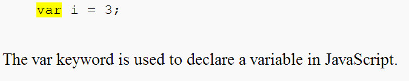

The best practice when working with CSS is to keep it in an external
file using the \<link\> tag, however, when starting, it is simpler to
merely place it directly into the document under edit.  

To place CSS directly into an HTML document, we use the \<style\> tag.
 This tag can appear anywhere in an HTML document, however, the most
common practice is to place it in the \<head\> section.  Such as:
```
1.  <!DOCTYPE html>
2.  <html lang="en">
3.   
4.    <head>
5.      <meta charset="UTF-8">
6.      <title>Style and link tags</title>
7.      <style>
8.        /* CSS will go in this area */
9.      </style>
10.   </head>
11.  
12.   <body>
13. 
14.   </body>
15. </html>
```

<h4>The &lt;link&gt; tag</h4>

While \<style\> is convenient, the better practice is to put the
CSS into a separate file. One of the key advantages of using a separate
file is that the CSS styles can easily be re-used between your different
.html pages.  Many authors further divide their CSS up into different
files (for example: one for text styles and another one for layout).  

Simply put your CSS into a separate file. This file does not need any
HTML markup (i.e., no \<style\> tag required).  Use the .css file
extension and use a \<link\> tag to bind it in. The \<link\> tag must
appear in the \<head\> section.  By convention, css files are kept in a
directory named *css*.

<h5>Use this &lt;link&gt; as a template:</h5>
```
1.  <link rel="stylesheet" href="css/my_styles.css">
```

<h5>Here is an example HTML document.</h5>
```
1.  <!DOCTYPE html>
2.  <html lang="en">
3.   
4.    <head>
5.      <meta charset="UTF-8">
6.      <title>Style and link tags</title>
7.      <link rel="stylesheet" href="css/my_styles.css">
8.    </head>
9.    <body>
10.   </body>
11. </html>
```

<h3 id="ch3-2-2">3.2.2 Rules: selectors and declarations</h3>

At its simplest, CSS is just a list of *rules*.  Each *rule* consists of
a *selector* and a *declaration.  *Here is an example:

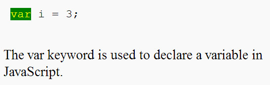

<h4>Selector</h4>

In the above, the *selector* is **p.  **When a selector appears
unprefixed by any punctuation, then it is assumed to match to an HTML
tag.  Thus, the **p** selector will apply the CSS rule to all \<p\> tags
in the document. 

We will cover more selector possibilities in the future.

<h4>Declaration</h4>

The *declaration* part of a CSS rule opens and closes with curly
braces: **{  }**    
And between them, you can put any number of *property* *value* pairs.

<h4>Properties and values</h4>

There are hundreds of different visual properties that may be set via
CSS.  And each property has a range of possible values that it can be
set to.  Syntactically, property value pairs are simple. Each pair
consists of a *property*, followed by a colon **:** followed by
a *value* and terminated by a semi-colon **;**
```
font-size: 12px;
```

<h4>Best practice</h4>

In the example above, the entire CSS rule is written on one line.  This
is not uncommon when the declaration of the CSS rule only has one
property.  If a CSS rule has several properties, then it should be
written to use one line per property value pair. For example:
```
1.  p {
2.    font-size: 12px;
3.    line-height: 15px;
4.    color: #223344;
5.  }
```
<h3 id="ch2-2-3">3.2.3 Comments</h3>

CSS can include "comments" as well, by which you, the developer today,
can leave notes and reminders to you, a different developer tomorrow. Or
to others who might read your CSS.  

Comments begin with /\* and **must** end with \*/ and they can span
several lines. But they **cannot** be nested.
```
1.  p {
2.     font-size: 8px; /\* client insists small text makes them more
    'professional'. \*/
3.     /\* I hope his idea of 'professional' includes paying on time.
    \*/
4.   
5.     line-height: 24px; /\* see above \*/
6.   
7.     /\* none of the stuff below is working. I don't know why.
8.   
9.     margin-top: 5%;
10.    margin-bottom:6%;
11.    \*/
12. }
```
<h3>3.2.4 Knowledge Check</h3>

n/a

<h3>3.2.5 Activity - Use CSS</h3>

Use CSS on the following HTML code. Try various styles, experiment, and
have fun. We have a live coding demonstration in the next page working
with the same source.

You are welcome to edit the
following [CodePen.](https://codepen.io/w3devcampus/pen/QvQgbr)

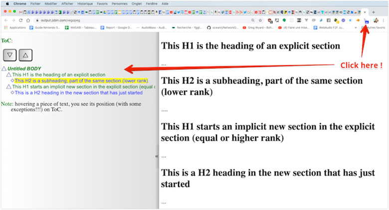

... or work from the lines of code below (to paste in your favorite Web
editor):
```
1.  <!DOCTYPE html>
2.     <html lang="en">
3.       <head>
4.           <meta charset="UTF-8">
5.           <title>On the Inventor of Gunpowder</title>
6.  
7.           <style>
8.              /* CSS */
9.        </style>
10. 
11.     </head>
12.  
13.    <body>
14. 
15.       <h1>On the Inventor of Gunpowder.</h1>
16.  
17.       <address rel="author">By John Milton</address>
18.  
19.       <p>Praise in old time the sage Prometheus won,<br>
20. Who stole ethereal radiance from the sun;<br>
21. But greater he, whose bold invention strove<br>
22. To emulate the fiery bolts of Jove.</p>
23.  
24.    </body>
25. </html>
```
You could also take another short text (such as a poem) and apply the
styles you like on it.

<h3>3.2.6 CSS Rules</h3>

Hi, this is Adrian from Microsoft learning, and we're going to be
learning today about CSS and HTML, and the ways in which they play
together.

If you look at this file that I have opened right now in Visual Studio
Code, it's the Gunpowder file which you should be at least a little bit
familiar with from the lesson, and it's pretty straightforward.

We've got a title, we've got a style section.

This is where we're going to be making changes to the CSS later to make
it look and feel a little bit different.

And we've got our header tag, we've got our address and of course the
poem which is being held in this fantastic paragraph tag.

Before we get started, let's just take a look at what this looks like
here in the Microsoft Edge.

And you can see it's pretty straightforward.

We've got our title, we've got author, and the poem of course.

But I think this looks a little bit boring.

Let's change the way that this looks.

The first thing I want to do is make all the text a little bit bigger.

I'm going to do that.

I'm going to create a new sort of default text size such that everything
in the file is now a little bit bigger, and that everything relative to
that will be bigger as well.

I'm going to do that by creating a new rule for both body and html.

I like to do both here because it eliminates some of the confusion.

Different browsers have different ways of interpreting what is going to
be sort of the default rule.

If you just do both like this, it'll be of ubiquitous in the way that it
handles relative size.

Let's just say we want to make a new font size.

I don't know... 20 pixels.

You could see that Visual Studio Code give me some handy tips for things
that I might be talking about as soon as I typed in the word font, which
is nice because CSS has such a huge vocabulary.

It's good that you don't have to memorize every single little attribute.

We've changed just to 20.

Let's open up the file again and see how that looks.

You can see it's a little bit bigger, but I want to make this 25.

It's not quite big enough yet.

We'll refresh the page, and you can see the size has been changed very
slightly.

That looks good, but I think this by John Milton text is a little bit
too big, so I'm going to create a new rule specifically for that line.

How I'm going to do that is create a new address, rule,

and I'm going to make the font size of that to be 0.7 rem

It's going to be a little bit smaller relative to the sort of default
font size that we've set up here.

You could just do em, just to make it consistent and not relative.

But since we create this from this hard and fast rule for what the page
is supposed to follow, it's good to do everything else relative because
it makes it a little bit easier to change everything if you want to do a
big overhaul.

We've changed that.

Let's see how that looks.

Text becomes a little bit smaller.

That's all well and good.

The next thing I want to do is I think this font is a little bit boring.

What I'm going to do is make it, something maybe a little bit more
modern looking.

I'm going to go into our Body rule here, and what I'm going to do is
change the font family to sans-serif.

You can see that looks a little bit different.

I kind of want this by John Milton part to be the same though, so I'm going to leave that as the default.

Just say font family serif.

And you could see that now it's back to it's serif default and it looks great.

I think the next thing that we're going to do is maybe add a splash of color.

I think black and white is timeless and it's very readable but it's a little bit boring.

And what I'm going to do is make a new rule for the header.

I'm going to make the title a very engaging and interesting color, Chartreuse or Cyan.

Let's pick something a little bit more tasteful than that.

We'll call it Crimson, and you can see that it's a little bit bright, 
but looks better, kind of pops out at you.

And I'm going to do the same thing but the opposite with this By John Milton text.

I think that needs to stand out a little bit less.

We'll call that... there's so many different colors to choose from.

One of my favorites for kind of more background elements is Dim Gray, and you could
see that looks a little bit more subtle, subdued.

I like how that's looking.

And the next change we're going to make is, if you recall previously in the lesson we learned
about an attribute called 'line-height', which essentially encapsulates the distance between lines of text.

We've got all this vertical real estate on the page.

I think we could stand to increase our 'line-height' a little bit,
spread out those lines of text just to make it more readable.

We're going to make a new rule for our paragraph tag that contains the poem, 
and we're going to say 'line-height', I don't know, we'll call it 1.2.

Just a tiny bit bigger than default.

We'll just see how much that changes it.

That's not quite as much as I'd like.

So we'll go back here and we'll call this 2.0.

See how that looks. That's better.

A lot of Web development is trial and error,
just sort of trying things and see how it
looks and going back to the drawing board and experimenting.

So I encourage you to play around with it.

And the last little change that we're going to make is,

I think that this looks interesting,
but if you open it up to full size,
you'll see that this header
is kind of over here on the left,
and I don't really like the way that looks.

So I'm going to go into our 'h1' tag here,
and I am going to say that
the text-align should be in the center.

And what that's going to do is take
this and move it to the center.

One thing you should be aware of is that text-align is
relative to the container
that something is being stored in.

So, you can see that this header is relative to the page.

So if we resize the page,
it actually sort of changes the way that it looks.

So, be mindful of that.

We're in a day and age where
so many different screen sizes are possible to be
used and you kind of have to consider how
something looks for every orientation of a page,
in order to make sure that it looks good for everybody.

So play around with that,
and play around with some of
the other attributes that I didn't
get to in this little demo
because there are so many that we learn in the lesson
and I encourage you to mess around with them,
and just sort of see what each one does.

<h3 id="ch3-3">3.3.1 Common CSS Properties</h3>

There are hundreds of CSS properties for you to use. The [complete
list](https://www.w3.org/Style/CSS/all-properties.en.html) is available
on the W3C Web site (or also, see the [CSS reference page on the MDN Web
site](https://developer.mozilla.org/en-US/docs/Web/CSS/Reference)).

Below we've gathered a more manageable list of the most useful
and common CSS
properties: font-size, line-height, text-align, text-decoration, font-weight, font-style and font-family.

<h4>font-size</h4>

font-size can be used to size the text of a tag.  The value for
the font-size has two parts: a number and a unit.  Some of the most
common units are: px, em, %, vh.  For example:

```
p { font-size: 18px; }  
q { font-size: .8em; }  
blockquote { font-size: 10vh; }
```

These units are discussed below.

Additionally, font-size supports a more readable set of values that many
authors
prefer: xx-small, x-small, small, medium, large, x-large, xx-large    
and relative sizing (relative to the text of the
parent): larger, smaller. For example:

```
p { font-size: medium; }  
q { font-size: small; }  
blockquote { font-size: larger; }
```

line-height

Whereas font-size may drive the size of the text itself,
the line-height property drives the height of the space it is drawn
into.  A large line-height will give the text more spacing. A
small line-height will smash the text lines together.  

For example, all of the Middlemarch text below has font-size:16px;  
But on the left, we see line-height:0.5; and on the
right, line-height:3; 

| **line-height: 0.5;**                                                                   | **line-height: 3;**                                                                     |
|-----------------------------------------------------------------------------------------|-----------------------------------------------------------------------------------------|
| Miss Brooke had that kind of beauty which seems to be thrown into relief by poor dress. | Miss Brooke had that kind of beauty which seems to be thrown into relief by poor dress. |

The used value is this
unitless [\<number\>](https://developer.mozilla.org/en-US/docs/Web/CSS/number) multiplied
by the element's font size. The computed value is the same as the
specified \<number\>. In most cases this is the preferred way to
set line-height with no unexpected results in case of inheritance.
Read [more](https://developer.mozilla.org/en-US/docs/Web/CSS/line-height) on
the MDN Web site.

<h4>text-align</h4>

Anyone familiar with a text editor will be familiar with this property.
It can be used to align the text left, center or right.  There are
additional possible values like justify and justify-all . It usually
defaults to left. However, remember that you shouldn't 
use text-align unnecessarily.

Note that text-align may ***not** *work as expected if applied to
elements that are the same width as their text, or whose width is
determined by the text within them (i.e., inline elements).  The
tags** \<span\>, \<a\>, \<i\>, \<b\>, \<q\> **and others are considered
"inline" because they do not receive their own new line when used.
And text-align is often not useful on these tags.

But it is useful on block level text tags, such
as **\<p\>**, **\<li\>**, **\<ul\>**, **\<ol\>**, **\<div\>**,
and **\<blockquote\>**

```
p { text-align: left; }  
blockquote { text-align: right; }
```

Bear in mind, also, that you should only use text-align when the
alignment really needs to be changed, since it can cause additional work
to reverse all the values when translating into languages that use
Arabic, Hebrew, Thaana scripts, scripts (the default alignment for those
languages is right).  The new values start and end are currently being
implemented in browsers, and those will be a much better choice
than left and right once Internet Explorer supports them.

| **left**                                                                                                                                                                                                                                                                                       | **center**                                                                                                                                                                                                                                                                                     |
|------------------------------------------------------------------------------------------------------------------------------------------------------------------------------------------------------------------------------------------------------------------------------------------------|------------------------------------------------------------------------------------------------------------------------------------------------------------------------------------------------------------------------------------------------------------------------------------------------|
| It was the best of times, it was the worst of times, it was the age of wisdom, it was the age of foolishness, it was the epoch of belief, it was the epoch of incredulity, it was the season of Light, it was the season of Darkness, it was the spring of hope, it was the winter of despair. | It was the best of times, it was the worst of times, it was the age of wisdom, it was the age of foolishness, it was the epoch of belief, it was the epoch of incredulity, it was the season of Light, it was the season of Darkness, it was the spring of hope, it was the winter of despair. |
| **right**                                                                                                                                                                                                                                                                                      | **justify**                                                                                                                                                                                                                                                                                    |
| It was the best of times, it was the worst of times, it was the age of wisdom, it was the age of foolishness, it was the epoch of belief, it was the epoch of incredulity, it was the season of Light, it was the season of Darkness, it was the spring of hope, it was the winter of despair. | It was the best of times, it was the worst of times, it was the age of wisdom, it was the age of foolishness, it was the epoch of belief, it was the epoch of incredulity, it was the season of Light, it was the season of Darkness, it was the spring of hope, it was the winter of despair. |

Note that CSS will in the future provide better support for
justification in languages where words are not separated by spaces, such
as Chinese and Thai, or languages where words are separated by special
marks, such as in Amharic. For more information about different
approaches to justification see [this
article](https://www.w3.org/International/articles/typography/justification).
Once you finish this course, look out for these and other international
features of CSS as you explore its features further.

<h4>text-decoration</h4>

How do I underline text? This is a common question. In CSS, this is done
via the text-decoration property.  The values for this
are: underline, overline, line-through, and none;  They can combined.

```
p { text-decoration: underline; }  
a { text-decoration: none; } /\* hyperlinks are underlined by default,
```

but that can be removed \*/   

```
span { text-decoration: overline; }  
span { text-decoration: underline overline; } /\* apply two with just a
space between the values \*/  
span { text-decoration: underline overline line-through; } /\*
everything \*/
```

| **underline**      | **overline** | **line-through** | **underline overline line-through** |
|--------------------|--------------|------------------|-------------------------------------|
| <u>Middlemarch</u> | Middlemarch  | ~~Middlemarch~~  | ~~<u>Middlemarch</u>~~              |

Note: there are other properties that can help customize the text
decoration, such as text-decoration-color and text-decoration-style, but
they are not well supported across browsers (see [related caniuse
table](https://caniuse.com/#search=text-decoration))

<h4>font-weight (bold)</h4>

Earlier we saw that the \<b\> and \<strong\> tags would make text
bold-faced. However, semantically speaking, that is a mere side-effect
of the tag. Any tag can make the text bolder (or less bold) via
the font-weight CSS property.  While common values
are normal and bold, text can also be made bolder (or less bold) than
its parent with the values bolder and lighter. Lastly,
the font-weight can be set explicitly as a numeric value. The choices
are: 100, 200, 300, 400, 500, 600, 700, 800 and 900.  
normal maps to 400 and bold to 700. However, the different numeric
choices will only work for fonts that support a full range of
font-weights. Many times the numeric weights will simply be mapped back
to bold or normal. 
```
p { font-weight: bold; }  
blockquote { font-weight: 900; }
```
| **normal**           | **bold**                 | **200**              | **500**              | **700**                  | **900**                  |
|----------------------|--------------------------|----------------------|----------------------|--------------------------|--------------------------|
| A Tale of Two Cities | **A Tale of Two Cities** | A Tale of Two Cities | A Tale of Two Cities | **A Tale of Two Cities** | **A Tale of Two Cities** |

<h4>font-style (italic)</h4>

Earlier we saw that the \<i\> and \<em\> tags could make text
italicized. But, just as we saw when discussing font-weight, this can be
changed with CSS, and any tag can make its text italic or oblique with
the font-style property.  The choices of values for this property
are normal and italic.  

| **font-style: normal;**                                                                                                                                    | **font-style: italic;**                                                                                                                                      |
|------------------------------------------------------------------------------------------------------------------------------------------------------------|--------------------------------------------------------------------------------------------------------------------------------------------------------------|
| Many years later, as he faced the firing squad, Colonel Aureliano Buendía was to remember that distant afternoon when his father took him to discover ice. | *Many years later, as he faced the firing squad, Colonel Aureliano Buendía was to remember that distant afternoon when his father took him to discover ice.* |
```
font-family
```
Want to set the font for an item on the page?   The font-family is the
correct property for the task, but there are caveats:

-   the various browsers only guarantee a few standard
    choices: serif, sans-serif, monospace, cursive, and fantasy.

-   any other choice must be already installed on the users machine.

-   or you may use a "Web font", but your choices, while plentiful, may
    not match the choices you are used to.  

-   your favorite font on your machine is probably encumbered by
    licensing limitations and is not available. You can certainly
    specify it to be used, but if the end user doesn't have it
    themselves, they won't see it. And you can't "give" it to them.
    Again, "Web fonts" are the alternative here. 

To help ameliorate these limitations, the font-family property accepts
a *list* of possible font choices.  The browser will start with trying
the first font listed, and if not available (or not having a needed
glyph) it will then proceed to the next font in the list, and so on.
 Here is a typical font-family declaration:
```
p { font-family: "Helvetica", "Verdana", "Arial", sans-serif; }
```
The rule above says to first try the font named "Helvetica". If it isn't
available, try "Verdana", failing that "Arial", and lastly fall back to
the built in sans-serif browser font.

-   each of the named font families is separated by a comma ( , )

-   if the font family name contains any spaces (or certain other
    characters) it **must** be surrounded by quotes. Font names tend to
    be complex, and the exact rules for when quotes are required are
    arcane, so the simplest and best practice is to **always surround
    the font family name in quotes**, excepting the five built-ins
    (serif, sans-serif, etc.)

Web fonts are outside the scope of this course. Google provides a nice
selection of licensed free Web fonts. Type "*google Web font tutorial*"
into any search engine to learn more. 

<h3 id="ch3-3-2">3.3.2 Margin and Color</h3>

<h4>Margin</h4>

We will examine layout in a later unit. But the margin property is the
lynch-pin for positioning elements. Whenever you want to move something
a little the margin property should be your first thought, when having
layout problems, it is the first thing you should check.

The margin can be a bit confusing.  Depending upon context, it will
space an item away from its immediate neighbors (in the HTML) or from
the edges of its parent. Also, there is not only one margin property,
but five:
```
p { margin: 10px; }  /\* a 10 pixel margin will be applied around all
four sides of the item \*/

p {  
 margin-left: 10px;   
 margin-right: 10px;  
 margin-top: 10px;     
 margin-bottom: 10px; }
```
Color

The color property can be used to set the text color of an element.
There are several possible formats for the value.

<h4>Named colors</h4>
```
p { color: blue; }  
b { color: transparent; } /\* transparent \*/  
i { color: lightgrey; }
```
There are scores of different names. The most common English names for
colors are all supported, plus many others.

One of the more interesting is transparent, which will make the text
invisible. However, if you want to make an HTML element invisible, then
the display:none; or visibility:hidden; rules are preferred. They are
discussed in a future section.

<h4>rgb/rgba</h4>
```
p { color: rgb(10, 200, 255); }  
p { color: rgb(0, 0, 0); } /\* 0,0,0 is black \*/  
p { color: rgb(255, 255, 255); } /\* 255,255,255 is white \*/  
b { color: rgba(10, 200, 255, 0.5); }  /\* semi-transparent \*/
```
Generally, any color on a computer is exactly specified by mixing three
components together: red, green, and blue. The amount of each component
falls within a range between 0 and 255.   So the rgb() function can be
used to specify a color.  
```
rgb( red, green, blue);  
```
parenthesis required, commas between each component.

Similarly, the rgba() function can be used for semi-transparent colors.
The fourth value is for the "alpha channel" (thus the "a" in "rgba") and
means the opacity. It is a number between 0 and 1 (for example, 0.5 ).

<h4>Hex code</h4>
```
p { color: #3A2BFF; }
```
Quicker than the lengthy rgb() function is simply providing
an [hexadecimal (hex) code](https://en.wikipedia.org/wiki/Hexadecimal).
This always starts with the pound sign (#) and is followed by three
pairs of hex number, ranging 00 to FF. Constructing rgb triplets is hard
enough, and deciphering and generating hex codes is even harder.
However, almost every editor and color picker will at least show you
red, green and blue values and many have hex code displayed as well.

<h3 id="ch3-3-3">3.3.3 Units</h3>

font-size, line-height, margins and many other CSS properties expect
some sort of dimension value. Dimension values support a wide variety of
units. But the most common and useful ones are: px, em, rem, %,
vh and vw.

<h4>px</h4>

'px' is short for 'pixel', which is a single dot on the screen.   So
text with  font-size:20px   is 20 pixels tall on-screen. In actuality,
due to browser zooming, retina displays, or other factors, this may or
may not match to 20 physical on-screen pixels.

px are useful for both horizontal and vertical dimensions. 

<h4>em</h4>

'em' is a typographic term that has come to the Web. On the Web, em
units are usually used for vertical dimensions.  One 'em' maps to the
height of one capital letter in the* parent context*.   

li { font-size: 0.9em; }  /\* text in a list item is smaller than its
parents \*/  
h1 { font-size: 1.2em; }  /\* but an h1 will be bigger than the
parent \*/  
i  { font-size: 0.5em; }  /\* and any italicized text will be half as
big. \*/

All the text sizes above are relative to the pages base sizes.  You'll
see radically different results on the rest of the page from either of
these rules applied to the body, but relative to one another they'll
remain sized correctly.

| html, body { font-size: 50px; } /\* 50 px base text size \*/ | html, body { font-size: 20px; } /\* 20 px base text size \*/ |
|--------------------------------------------------------------|--------------------------------------------------------------|

<h4>rem</h4>

'rem' is much like 'em', except that 'em' sizes an element relative to
its *parent*, and 'rem' always derives its size relative to
the ***root***.  In an HTML document with lots of nested elements, 'rem'
will generally prove to be more reliable than 'em'.  'rem' is supported
in all modern day browsers, including mobile, but not older ones. 

Using the CSS rules from the em section immediately above, nested list
items (\<li\>birds\<ul\>\<li\>hawk\</li\>\</ul\>\</li\>)would get
increasingly smaller. And if 'rem' units were used, they would be the
same size.

Note: to ensure you are setting the root size,
use ***both*** the html and body selectors.

html, body { font-size: 20px; } 

<h4>%</h4>

Whereas em is a measure relative to the parents text size, the
percentage unit (%) is relative to the parent dimension.  This is a
useful unit for both horizontal and vertical dimensions, though often
more useful in the horizontal.  
```
p {   
  margin-left:  10%;  
  margin-right: 10%;  /\* 10% of parent width will be spent on the two
side margins \*/  
 } 
```
Initially, the percentage unit may seem very handy (and it is), and many
developers fall in love with it. But the love affair is usually short
lived. One of the limitations of this rule is that for it to work
correctly, the parent must have an explicit width or height set. This
limitation is particularly noticeable in the vertical dimension. If the
parent element doesn't have an explicit height set then child
percentages may be percentages of 0. 

<h4>vh / vw</h4>

'vh' stands for viewport height, and 'vw' for viewport width.  The vh
and vw units work much like the percentage ( % ) unit. But instead of
percentage of the parent, it is percentage of the screen (aka viewport).
 Obviously, vh is for vertical dimensions, and vw for horizontal
dimensions.

vh and vw do not suffer the parent limitation that the % unit does.
 Most modern browsers support these units, but there are some exceptions
on older mobile browsers. 
```
p {   
  margin-left:  10vw;  
  margin-right: 10vw;  /\* 10% of screen width will be spent on the two
side margins \*/  
 }
```
<h4>External resources</h4>

The list of CSS units above is not exhaustive. There are various
tutorials and explanations about CSS units on the internet. Here are a
few that you might find helpful.

-   This CSS Tricks article from March 2016: "[Use  for Global Sizing;
    Use  for Local Sizing](https://css-tricks.com/rem-global-em-local/)"

-   [New CSS3 Units: Root EM and Viewport
    Units](https://www.cssmine.com/css3-units)

-   From the W3C specification: [Viewport-percentage
    lengths](https://www.w3.org/TR/css3-values/#viewport-relative-lengths)

<h3 id="ch3-3-4">3.3.4 Accessible Typography</h3>

The CSS rules with which we've started are fun and easily
understandable. They are mostly concerned with typography. Later, we
will see how to use CSS to include decorative images, look at other
decorative properties, and take up the topic of layout.

But even with our modest start we must, once again, take up the topic of
accessibility.  In Module 2, we learned that using the correct tag with
the best semantic meaning is very important for a variety of reasons,
one of which included visitors who may have a disability. If you clearly
put your page navigation in a \<nav\> block, and use the header tags and
others (like \<article\> or \<main\>), then this can greatly enhance the
page experience for certain disabled visitors, like the blind who might
be having the page read aloud to them with a screen reader.

Accessibility concerns are important for CSS usage as well. Perhaps
doubly so. As page authors, if we don't use CSS, then the page visitor
just sees the page with the default typography, and perhaps assisted by
tools that can help zoom in on pages, make text bigger, invert colors
for the light-sensitive, etc. But as we start to customize the look of
the page with CSS, we may unintentionally thwart those tools or make the
reading experience less comfortable for those with vision problems.

<h4>Guidelines</h4>

For accessible typography, there are really just a few things to avoid:

1.  do not make text too small

2.  do not make lines of text too tight

3.  do not use foreground and background colors that are too close to
    one another, in other words, ensure there is good color contrast

4.  do not irregularly space text or make it jump around

Look at those four guidelines. Can you match each guideline to one or
more CSS property from earlier? Take a moment and think about it. We'll
touch on specific rules below.

<h4>Properties</h4>

<h4>font-size</h4>

Misuse of font-size might make text too small. So be wary of that.
Furthermore, in the past the gold standard practice was to use em units
instead of px. This is no longer as true as it was, but the practice of
using em or rem units is definitely to be encouraged and it should be
your default unit when working with text.

<h4>line-height</h4>

An overly small line-height will cause lines to become cramped and
difficult to read. Even the largest text can be rendered unreadable by a
too small line-height. Generally, your line-height should always be at
least one and a half times the font-size (ie, line-height should be
greater than 1.5em ).

<h4>color</h4>

Color contrast can be easily undone by misuse of the color property.
 The exact rules for contrast are rather advanced. For example, "wide
stroke" text is allowed to have less contrast than narrow stroke text.
 But, regardless of rules, the overall concept is easy to understand:
keep your text high contrast to the background. There are further color
guidelines concerning certain combinations (like bright blue text on a
bright red background), but the rule of thumb is that, if the text is at
all hard for you to read, then just assume it is unreadable to someone
with a visual disability. If you are interested, there are tools that
can help such as [Tanaguru
Contrast-Finder](http://contrast-finder.tanaguru.com/) or [Juicy Studio
Luminosity Colour Contrast Ratio
Analyser](http://juicystudio.com/services/luminositycontrastratio.php).

text-align

Any long passage of text should have its alignment match its reading
order. Which means, if the language is English, which is read left to
right, then any long passage of text should be aligned left.  Right
aligned or center aligned text can be very hard for dyslexics.

Obviously, a header or perhaps a menu might be exempt, because they are
not typically long passages of text. So this guideline doesn't mean an
end to good page layout and typography.

Summary

So now, we've seen how typography can affect the accessibility and
applicability of your page. It is not so very difficult. Common sense
and awareness are good companions and will serve you well.

If you are interested in accessibility, there is much more to learn.
These simple guidelines merely scratch the surface.

<h3 id="ch3-4">3.4.1 Styling Lists</h3>

The list markup tags (\<ul\>, \<ol\> and \<li\>) are some of the most
frequently used specific purpose tags in HTML. There are a few CSS style
properties that are available for lists.

<h4>list-style-type</h4>

list-style-type governs the little list marker that is usually
positioned to the left of any list item.  For un-ordered lists (\<ul\>),
there are several popular values: disc, circle, square, and none.
```
li { list-style-type: disc; }
```
<table>
<colgroup>
<col style="width: 21%" />
<col style="width: 15%" />
<col style="width: 15%" />
<col style="width: 15%" />
<col style="width: 15%" />
<col style="width: 15%" />
</colgroup>
<thead>
<tr class="header">
<th><strong>html</strong></th>
<th><strong>default</strong></th>
<th><strong>disc</strong></th>
<th><strong>circle</strong></th>
<th><strong>square</strong></th>
<th><strong>none</strong></th>
</tr>
</thead>
<tbody>
<tr class="odd">
<td><p>&lt;ul&gt;</p>
<p>&lt;li&gt;eggs&lt;/li&gt;</p>
<p>&lt;li&gt;milk&lt;/li&gt;</p>
<p>&lt;li&gt;bread&lt;/li&gt;</p>
<p>&lt;/ul&gt;</p></td>
<td><ul>
<li><p>eggs</p></li>
<li><p>milk</p></li>
<li><p>bread</p></li>
</ul></td>
<td><ul>
<li><p>eggs</p></li>
<li><p>milk</p></li>
<li><p>bread</p></li>
</ul></td>
<td><ul>
<li><p>eggs</p></li>
<li><p>milk</p></li>
<li><p>bread</p></li>
</ul></td>
<td><ul>
<li><p>eggs</p></li>
<li><p>milk</p></li>
<li><p>bread</p></li>
</ul></td>
<td><ul>
<li><p>eggs</p></li>
<li><p>milk</p></li>
<li><p>bread</p></li>
</ul></td>
</tr>
</tbody>
</table>

For ordered lists (\<ol\>) you can choose different ways of having the
numbers
shown: decimal, decimal-leading-zero, lower-roman, upper-roman, lower-alpha, upper-alpha,
as well as several of the worlds
languages: armenian, georgian, simp-chinese-formal, and many others. 

<table>
<colgroup>
<col style="width: 16%" />
<col style="width: 25%" />
<col style="width: 16%" />
<col style="width: 16%" />
<col style="width: 24%" />
</colgroup>
<thead>
<tr class="header">
<th><strong>decimal</strong></th>
<th><strong>decimal-leading-zero</strong></th>
<th><strong>lower-roman</strong></th>
<th><strong>upper-alpha</strong></th>
<th><strong>simp-chinese-formal</strong></th>
</tr>
</thead>
<tbody>
<tr class="odd">
<td><ol type="1">
<li><p>eggs</p></li>
<li><p>milk</p></li>
<li><p>bread</p></li>
</ol></td>
<td><ol type="1">
<li><p>eggs</p></li>
<li><p>milk</p></li>
<li><p>bread</p></li>
</ol></td>
<td><ol type="i">
<li><blockquote>
<p>eggs</p>
</blockquote></li>
<li><blockquote>
<p>milk</p>
</blockquote></li>
<li><blockquote>
<p>bread</p>
</blockquote></li>
</ol></td>
<td><ol type="A">
<li><blockquote>
<p>eggs</p>
</blockquote></li>
<li><blockquote>
<p>milk</p>
</blockquote></li>
<li><blockquote>
<p>bread</p>
</blockquote></li>
</ol></td>
<td><ol type="1">
<li><p>eggs</p></li>
<li><p>milk</p></li>
<li><p>bread</p></li>
</ol></td>
</tr>
</tbody>
</table>

<h4>list-style-position</h4>

Besides choosing the type of marker applied to each list item, you may
also want to govern how closely it is positioned to the list itself.
The list-style-position property handles that.  The two values
are inside and outside.  They govern whether the markers are positioned
inside the box of the list, or outside. This is most evident if a border
or background or similar is applied to the list. Below, we have put a
blue border on the list. 

```
<table>
<colgroup>
<col style="width: 50%" />
<col style="width: 50%" />
</colgroup>
<thead>
<tr class="header">
<th><strong>outside</strong></th>
<th><strong>inside</strong></th>
</tr>
</thead>
<tbody>
<tr class="odd">
<td><ol type="1">
<li><p>eggs</p></li>
<li><p>milk</p></li>
<li><p>bread</p></li>
</ol></td>
<td><ol type="1">
<li><p>eggs</p></li>
<li><p>milk</p></li>
<li><p>bread</p></li>
</ol></td>
</tr>
</tbody>
</table>
```

<h4>list-style-image</h4>

The little markers on a list can also be customized to be an image of
your choosing. This will require you to have a small image in a Web
compatible format (PNG or JPEG recommended) and to know the path from
the place where the CSS is being defined to the image.  Image pathnames
were covered in Module 2, and we'll be discussing them again in the
background-image section. 
```
li { list-style-image: url("my_triangle.png"); }
```
Note that the browser will do little more than draw the image.  There is
no guarantee to scale the image or assist with spacing or alignment.
 Many users find list-style-image to be frustrating and instead use
the background-image CSS property which has more options. There is a
section dedicated to the background-image property.  

<h3 id="ch3-4-2">3.4.2 Selectors</h3>

<!------------------------------------------------------------------------------------------------>
<!----------------------------------- 55.  (###) -------------------------------------->
<!------------------------------------------------------------------------------------------------>
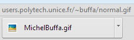

Earlier, we learned that a CSS rule is made up of two parts: the
selector and the declaration. We've seen quite a few different
declarations, but the only selector we've learned is the tag selector.
There are other choices, and they can be composed together in
interesting and useful ways. So let's learn some more CSS selectors.

<h4>tag selector</h4>

We've already seen this one. A CSS selector that consists solely of a
single tag (without punctuation or spacing) will be applied to any
matching tag on the page.

**li **{ list-style-type: circle; }

### id selector

You may remember the id attribute (short for "identifier"). This
attribute can be applied to an HTML tag to uniquely identify the
element. Recall that the value for any given id attribute can only
appear once in a document. No two tags are allowed to have the same id.
You may also recall that the id cannot contain spaces, nor most
punctuation, nor begin with numbers.

In the HTML below, there are two paragraph tags. So, to style them
individually, we can apply unique id attributes to the paragraphs
(id="p18" and id="p19"). In the CSS, we will use the id selector.  The
id selector is simply a hash sign (#) followed directly by the id.  

<h4>CSS:</h4>

**\#p18** { color: blue; }  
**\#p19** { color: green; }

<h5>HTML:</h5>
```
<p id="p18">He is Ulysses, a man of great craft, son of Laertes. He
was born in rugged Ithaca, and excels in all manner of stratagems and
subtle cunning.</p>
<p id="p19">Madam, you have spoken truly.</p>
```
<h4>Result:</h4>

<table>
<colgroup>
<col style="width: 100%" />
</colgroup>
<thead>
<tr class="header">
<th><p>He is Ulysses, a man of great craft, son of Laertes. He was born
in rugged Ithaca, and excels in all manner of stratagems and subtle
cunning.</p>
<p>Madam, you have spoken truly.</p></th>
</tr>
</thead>
<tbody>
</tbody>
</table>

<h4>class selector</h4>

The class attribute is similar to the id. However, whereas the id must
be unique and singular, the values of the class attribute can be shared
by multiple tags. And, multiple classes can be assigned to a tag by
simply separating them with spaces.  

<h5>HTML:</h5>
```
<ul>  
<li class="bird flying">eagle</li>
<li class="bird">ostrich</li>
<li class="insect">ant</li>
<li class="insect flying">moth</li>
</ul>
```
The class selector is simply a period (.) followed by the class name
itself.

<h4>CSS:</h4>
```
<b>.bird</b>   { color: blue; }  
<b>.insect</b> { color: green; }  
<b>.flying</b> { text-decoration: underline; }
```

<h4>Result:</h4>
```xml
<table>
<colgroup>
<col style="width: 100%" />
</colgroup>
<thead>
<tr class="header">
<th><ul>
<li><p><u>eagle</u></p></li>
<li><p>ostrich</p></li>
<li><p>ant</p></li>
<li><p><u>moth</u></p></li>
</ul></th>
</tr>
</thead>
<tbody>
</tbody>
</table>
```
<h3 id="ch3-4-3">3.4.3 Combining Selectors</h3>

Being able to define a CSS selector in terms of a tag, class or id is
very powerful. But it's not practical to place classes on every tag in
your document, much less to put unique ids throughout.  It's also
inconvenient to constantly repeat CSS rules. But by combining composing
selectors, all that can be avoided.  

<h4>Comma separated selectors</h4>

Let's say we want to make all our \<blockquote\> tags, \<q\> tags, and
anything with "speech" in it's class string, to be red italic text.  How
might we do that?  We could make three separate rule sets.  Or, better,
we can separate our selectors with commas (,) before one rule set.  Like
so:

<table>
<colgroup>
<col style="width: 44%" />
<col style="width: 55%" />
</colgroup>
<thead>
<tr class="header">
<th><strong>separate</strong></th>
<th><strong>joined</strong></th>
</tr>
</thead>
<tbody>
<tr class="odd">
<td>blockquote {<br />
  color: red;<br />
  font-style: italic;<br />
}<br />
q          {<br />
  color: red;<br />
  font-style: italic;<br />
}<br />
.speech    {<br />
  color: red;<br />
  font-style: italic;<br />
}</td>
<td>blockquote,<br />
q,<br />
.speech {<br />
   color: red;<br />
   font-style: italic;   <br />
}</td>
</tr>
</tbody>
</table>

The joined version on the right is much easier to read and maintain.  

If the "speech" items need to also be bold, that can simply be added by
an additional rule:
```
blockquote,  
q,  
.speech {  
   color: red;  
   font-style: italic;     
}  
.speech { font-weight: bold; }
```

<h4>Specialized selectors</h4>

If two selectors of different types (like tag and class) appear next to
each other with no spacing separating them, then they form a
specialized selector. To match, a candidate must match **both** rules.
 If a tag selector is used, it must appear first.  

This is most useful with class and tag selectors, like so:
```
blockquote.speech { font-color: green; }
```

In the example above, the blockquote.speech selector is a blockquote tag
selector combined with a .speech class selector.  So this rule will not
necessarily apply to every blockquote, nor every element with the speech
class. Instead, it will only apply to those blockquotes that also have
the speech class.

It isn't unusual to see multiple classes joined this way as well:
```
.insect.flying { text-decoration: underline; font-weight:bold; }
```

<!------------------------------------------------------------------------------------------------>
<!------------------------------ 56. template (##) -------------------------------->
<!------------------------------------------------------------------------------------------------>
<p align="center" width="100%">

</p>

<h4>Descendant selectors</h4>

In the following HTML, we see some paragraphs that have some links
(\<a\>) inside. The link tags are inside the paragraphs, but not
necessarily direct children.  
```
1.  \<section id="intro"\>Welcome
    to \<a href="#palaceland"\>PalaceLand\</a\>, world renown \<q\>Land
    of endless palaces and \<a href="#delight"\>delights\</a\>\</q\>. As
    you make your way about, remember the words of our
    founder \<blockquote\>Shouldn't we
    have \<a href="#chairs"\>chairs\</a\>? Never made much sense
    wandering room a room looking for a place to sit a spell. Folk that
    don't sit are not likely all right in
    the \<a href="#head"\>head\</a\>\</blockquote\>\</section\>

2.  \<section id="guideline"\>There are guidelines to follow while
    in \<a href="#palaceland"\>PalaceLand\</a\>. They are outlined on
    the back of your \<q\>Daring
    Footman \<a href="#trademark"\>(tm)\</a\>\</q\> card. But the spirit
    of the guidelines are best summed up by our
    founder \<blockquote\>Don't just \<a href="#standthere"\>stand
    there\</a\> with your mouth hanging open waiting for a pair of
    nesting birds.\</blockquote\> (and
    no \<a href="#camera_policy"\>flash
    photography\</a\> please.)\</section\>
```

What if we wanted all the links in the introductory section to be red,
but all the link in the guideline section to be green?  That is what
descendant selectors are for. Here is an example for the problem we are
facing:

```css
#intro a { color: red; }  
#guideline a { color: #00FF00; }
```

We merely separate the tag, identifier, or class selectors by a space.

So, in the first rule, we see that the selector will match to any
\<a\> tag that is a descendant of #intro.  The \<a\> tag can appear
directly within #intro, or be buried within its children.  Here is the
result:

<table>
<colgroup>
<col style="width: 100%" />
</colgroup>
<thead>
<tr class="header">
<th><p>Welcome to <a
href="https://courses.edx.org/xblock/block-v1:W3Cx+HTML5.0x+3T2020+type@vertical+block@a45bbd47f6184286ab951aee1ba7fe0f?show_title=0&amp;show_bookmark_button=0&amp;recheck_access=1&amp;view=student_view#palaceland">PalaceLand</a>,
world renown Land of endless palaces and <a
href="https://courses.edx.org/xblock/block-v1:W3Cx+HTML5.0x+3T2020+type@vertical+block@a45bbd47f6184286ab951aee1ba7fe0f?show_title=0&amp;show_bookmark_button=0&amp;recheck_access=1&amp;view=student_view#delight">delights</a>.
As you make your way about, remember the words of our founder</p>
<p>Shouldn't we have <a
href="https://courses.edx.org/xblock/block-v1:W3Cx+HTML5.0x+3T2020+type@vertical+block@a45bbd47f6184286ab951aee1ba7fe0f?show_title=0&amp;show_bookmark_button=0&amp;recheck_access=1&amp;view=student_view#chairs">chairs</a>?
Never made much sense wandering room a room looking for a place to sit a
spell. Folk that don't sit are not likely all right in the <a
href="https://courses.edx.org/xblock/block-v1:W3Cx+HTML5.0x+3T2020+type@vertical+block@a45bbd47f6184286ab951aee1ba7fe0f?show_title=0&amp;show_bookmark_button=0&amp;recheck_access=1&amp;view=student_view#head">head</a></p>
<p>There are guidelines to follow while in <a
href="https://courses.edx.org/xblock/block-v1:W3Cx+HTML5.0x+3T2020+type@vertical+block@a45bbd47f6184286ab951aee1ba7fe0f?show_title=0&amp;show_bookmark_button=0&amp;recheck_access=1&amp;view=student_view#palaceland">PalaceLand</a>.
They are outlined on the back of your Daring Footman <a
href="https://courses.edx.org/xblock/block-v1:W3Cx+HTML5.0x+3T2020+type@vertical+block@a45bbd47f6184286ab951aee1ba7fe0f?show_title=0&amp;show_bookmark_button=0&amp;recheck_access=1&amp;view=student_view#trademark">(tm)</a> card.
But the spirit of the guidelines are best summed up by our founder</p>
<p>Don't just <a
href="https://courses.edx.org/xblock/block-v1:W3Cx+HTML5.0x+3T2020+type@vertical+block@a45bbd47f6184286ab951aee1ba7fe0f?show_title=0&amp;show_bookmark_button=0&amp;recheck_access=1&amp;view=student_view#standthere">stand
there</a> with your mouth hanging open waiting for a pair of nesting
birds.</p>
<p>(and no <a
href="https://courses.edx.org/xblock/block-v1:W3Cx+HTML5.0x+3T2020+type@vertical+block@a45bbd47f6184286ab951aee1ba7fe0f?show_title=0&amp;show_bookmark_button=0&amp;recheck_access=1&amp;view=student_view#camera_policy">flash
photography</a> please.)</p></th>
</tr>
</thead>
<tbody>
</tbody>
</table>

But what if we want the links in the founder blockquote in the intro
section to be bold?  Again, a descendant selector will work.  We add
this:
```
#intro blockquote a { font-weight: bold; } 
```

Any \<a\> tags anywhere inside a \<blockquote\> anywhere inside
the #intro section will now be bold.

<h4>Direct descendant selectors ( &gt; )</h4>

Sometimes you don't want to apply a style to any \_possible\_ child, but
to only to the direct children.  This can be done with
the **\>** symbol.  Use it between selectors to limit the application to
the direct children of the parent. For example, this rule, if applied to
the HTML of the previous selector, would cause the links in the intro
section to be larger, but not the links in any nested quotes or
blockquotes. :

```
#intro > a { font-size: large; }
```

<h4>Everything selector (\*)</h4>

The asterisk (\*) can be used to match **any** tag. By itself, this is
only marginally useful. But combined with other selectors into a
descendant selector, it can be pretty useful.
```
body > * { margin-left: 10px; } /* all the _direct_ children of the
body receive the margin */
p * { text-decoration: underline; } /* the text of the paragraph will
be normal, but any children anywhere inside it will be underlined */
```

<h3 id="ch3-4-4">3.4.4 Cascading: inheritance and precedence</h3>

Now that we've covered several ways of defining CSS selectors, we need
to understand what happens when multiple selectors resolve to the same
element, and how an element can get inherit rules from its parent.

Remember when we said *"For now don't worry about the 'Cascading'
part..."* at the beginning of this module?  Well, that was then, this is
now. From this moment on, you will need to worry about cascading.

Most CSS rules once applied to an element are *also* applied to all the
children of that element, and to their children, and theirs *ad
infinitum*. There are exceptions, notably the layout properties (margin,
padding, position, width, etc.) and the decorative properties (border,
background, etc.) **do not** cascade. This cascading of a CSS property
from parent to child is also called "inheritance". 

Generally, inheritance is a *good* thing. Do you want the whole page to
use your corporate approved Web-font?
 body { font-family: "Soulless", serif; } is all you need.  There is no
need to apply the same font-family property to each and every tag used
within the page.  Thank you, Cascading!

However, sometimes inheritance can be a bad thing.  An element may
suddenly display in a way that you weren't expecting and you can't find
any relevant CSS rule for that element. In this case, one likely culprit
is a CSS rule that has been inherited from a parent. Thanks, Cascading!

Inheritance can be explicitly leveraged. Many CSS properties accept the
value of inherit, which means to inherit the value from the parent. By
smartly leveraging inherit, you can reduce repetition in your CSS rules
and make your project easier to maintain. 

In the sample below, we see a paragraph with children and
grand-children. A CSS rule is applied to the paragraph that sets the
font-family to be monospace, and the padding is set to 40 pixels.  Note
that in the result, the font-family is applied to all the
children, while the padding is only applied to the paragraph itself,
none of its children inherit the padding.
```html5
<table>
<colgroup>
<col style="width: 32%" />
<col style="width: 31%" />
<col style="width: 35%" />
</colgroup>
<thead>
<tr class="header">
<th><strong>HTML</strong></th>
<th><strong>CSS</strong></th>
<th><strong>Result</strong></th>
</tr>
</thead>
<tbody>
<tr class="odd">
<td><p>&lt;p&gt;This paragraph has children
<span> spans</span> and <span>q&lt;/span&gt;, which, in
turn, have their own child &lt;span&gt;spans&lt;/span&gt;.</p>
<p>&lt;q&gt;With this structure, we can see how some CSS
&lt;span&gt;rules&lt;/span&gt; are</p>
<p>&lt;span&gt;applied across a &lt;q&gt;variety&lt;/q&gt;&lt;/span&gt;
of scopes.&lt;/q&gt;</p>
<p>&lt;/p&gt;</p></td>
<td><p>p {</p>
```
<p>/* inherited by children of p */</p>
<p>font-family: monospace;</p>
<p>/* not inherited */</p>
<p>padding: 40px;</p>
<p>}</p></td>
<td>This paragraph has children spans and q, which, in turn, have their
own child spans. With this structure, we can see how some
CSS rules are applied across a variety of scopes.</td>
</tr>
<tr class="even">
<td><strong>Discussion</strong></td>
<td><strong>CSS</strong></td>
<td><strong>Result</strong></td>
</tr>
<tr class="odd">
<td><p>To the right we add another CSS rule, this one instructing that
the padding for spans and q elements should be inherited from their
parent.</p>
<p>Look at the result on the right, the padding is very
evident. </p></td>
<td><p>span, q {</p>
<p>padding: inherit;</p>
<p>}</p></td>
<td>This paragraph has children spans and q, which, in turn, have their
own child spans. With this structure, we can see how some
CSS rules are applied across a variety of scopes.</td>
</tr>
</tbody>
</table>

### Which rules are inheritable?

There is no reliable rule for which CSS properties are inheritable by
default and which are not. However, generally, the properties associated
with positioning and layout are *not* inherited.  Likewise, the
decorative properties (borders, background images, etc.) do not inherit.
 Most properties that begin with text- or font- inherit.

### Precedence

It is possible, and easy, to have several different CSS rules all
applying to the same element.  This is often advantageous because most
CSS properties are *orthogonal* to one another, meaning they do not
interfere with each other. This gives us freedom to organize the CSS
properties in rules in ways that make sense to us as developers, knowing
that they can compose nicely. For example, a bit of text can be made
italic by one rule, bold by another, and underlined by a third. We do
not have to put all those properties into one place if that is not
convenient for us.

However, what happens when there are different rules competing to set
different values for the same property?  This is where
CSS *precedence* comes into play. When rendering CSS, the browser has
some guidelines it follows for resolving conflicting rules. Here is
rough summary, in order:

### 1 - Most specific rule

A more *specific* rule takes precedence over a less specific rule.  A
rule that more tightly matches a particular element than a general rule
will be applied. 

span { color: blue; }

ul li span { color: red; }

In the example above, both rules are attempting to set a span color for
a span inside a list item. However, the second rule will "win" when
there is a conflict (like color in this case). 

### 2 - #id selector is the most specific

Rules with an id selector (e.g.  #someid ) are considered more specific
than rules without.

### 3- .class selector is more specific than a tag selector

Rules employing a class selector (e.g. .someclass ) are considered more
specific than rules without (but not as specific as an \#id selector,
which trumps everything).

### 4- Rules that come later override those that come earlier

This guideline is for two CSS rulesets with the same selector.  Where
there are conflicts, the rules from the later one apply.  

.hortense { color: red; text-decoration: underline; }

.hortense { color: blue; }

In the example above, an element with the .hortense class will be
underlined and its color will be **blue**, because that rule came later
than when it was set red.

### No fear

These guidelines seem fairly straightforward, but situations can quickly
get rather knotty.  For example, what color should we expect in this
situation?

<table>
<colgroup>
<col style="width: 54%" />
<col style="width: 45%" />
</colgroup>
<thead>
<tr class="header">
<th><strong>HTML</strong></th>
<th><strong>CSS</strong></th>
</tr>
</thead>
<tbody>
<tr class="odd">
<td>&lt;p class="forest"&gt;&lt;span
class="tree"&gt;arbol&lt;/span&gt;&lt;/p&gt;</td>
<td><p>p.forest span { color: green; }</p>
<p>p span.tree { color: blue; }</p></td>
</tr>
</tbody>
</table>

What if the order of the CSS rules were reversed? Would it make a
difference?

If this problem seems difficult to figure out, don't worry about it. In
the next section, we will be looking at Chrome Developer Tools. You'll
see how you can use the tools in the browser itself to inspect your
elements and see exactly what CSS rules and properties are being
inherited, applied and what is their precedence.  

### !important

p { color: orange !important; }

Because multiple CSS selectors can resolve to the same element, and
because the rules that govern precedence are complex, you may from time
to time encounter a situation where you need to apply a particular CSS
property and you want it to take precedence over all others, no matter
what.    !important will do that.  

The exclamation point is required, and the whole symbol ( !important )
goes after the value and before the semi-colon ( ; ).  

This may seem like an attractive option, but using it is not
recommended. Once you start to use it, then you'll eventually run into a
conflict with the various rules that are using !important, and from that
conflict there is no escape.  If you are having problems with precedence
the best advice is to fix them directly, rather than using !important.

<h3 id="ch3-4-6">3.4.6 Recipe</h3>

<!------------------------------------------------------------------------------------------------>
<!----------------------------------- 57.  (###) -------------------------------------->
<!------------------------------------------------------------------------------------------------>
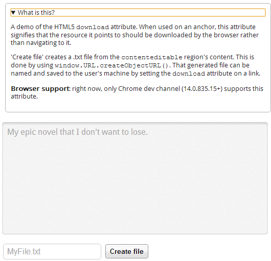

```xml
<!DOCTYPE html\>
<html lang="en"\>
<head\>
<meta charset="UTF-8"\>
<title\>My Favorite Recipes - Module 2\</title\>
</head\>
<body\>
<h1\>My Favorite Recipes\</h1\>
<nav\>
<ul\>
<li\>\<a href="#soup"\>Soup\</a\>\</li\>
<li\>\<a href="#salad"\>Salad\</a\>\</li\>
<li\>\<a href="#pizza"\>Pizza\</a\>\</li\>
</ul\>
</nav\>
<article id="soup"\>
<h2\>Soup\</h2\>

<p\>
Beethoven once said \<q\>Only the pure of heart can make a good
soup\</q\>. Well, here's my attempt at doing just that!
</p\>
<ol\>
<li>Step 1\</li\>
<li>Step 2\</li\>
<li>Step 3\</li\>
<li>Enjoy!\</li\>
</ol>
</article>
<article id="salad">
<h2>Salad</h2>

<h3\>List of ingredients\</h3\>
<ul\>
<li\>Ingredient 1\</li\>
<li\>Ingredient 2\</li\>
<li\>Ingredient 3\</li\>
</ul\>
<p\>
Who can resist a fresh salad ! Here's one of my favorites.
</p\>
<ol\>
<li\>Step 1\</li\>
<li\>Step 2\</li\>
<li\>Step 3\</li\>
<li\>Enjoy!\</li\>
</ol\>
</article\>
<article id="pizza"\>
<h2\>Pizza\</h2\>

<p>
Pizza, the king of comfort foods. Try this simple, taste sensation.
</p>
<ol>
<li>Step 1</li>
<li>Step 2</li>
<li>Step 3</li>
<li>Enjoy!</li>
</ol>
</article>
</body>
</html>
```
<h3 id="ch4-1">4.1.1 Welcome to Module 4</h3>

<!------------------------------------------------------------------------------------------------>
<!----------------------------------- 58.  (###) -------------------------------------->
<!------------------------------------------------------------------------------------------------>


<h3 id="ch4-1">4.1.2 Content</h3>

**4.1 Introduction: **You will now begin learning how to fix your Web
page when it's not doing what you hoped it would do.

**4.2 Tools: **Learn about tools and accessibility and how they relate
to debugging.

**4.3 The Box Model: **Understanding the CSS Box Model and how to
control the spacing of elements on the page.

**4.4 Precedence: **Which style controls what? — using the debugger in
the browser to understand conflicting rules.

**4.5 Give Your Mind a Workout: **Let’s see what you have learned about
debugging your code.

<h3 id="ch4-2">4.2.1 Tools</h3>

It's hard to overestimate the value of tools for programming languages.
There are tools for creation, testing, debugging and even measuring the
performance of a program. HTML pages are really programs, in specific
programming languages, so you need tools for those as well.

One tool that you should, by now, be very familiar with, is the editor.
While traditional text editors allowed you to enter and edit text,
modern editors can actually help you detect and avoid errors, visualize
your program more clearly, and even stick in bits of text for you if it
thinks it knows what you might need, e.g. close tags.

Some of the most ubiquitous tools are in the browser itself, which is
handy because everyone seems to have one. You might have even seen this
yourself if you've ever tried the "Show Source" button, but perhaps the
most important tool that we have yet to explore is the debugger
activated when you "Inspect Element".

### Accessibility

While it's important that your page looks and acts the way you intend,
there are other considerations as well. One important aspect is
"[accessibility](https://www.w3.org/WAI/intro/accessibility.php)". When
talking about Web pages, accessibility means designing your page with
various disabilities in mind. For example, for someone with impaired
vision, you'd want to make sure that your page is zoomable, or make sure
that it makes it easy for screen-readers. Just as wheelchair ramps are a
benefit for many users (ask anyone who's had to drag a stroller up the
stairs), making your Web site accessible can be a benefit for many
users.

Fortunately, there are a number of tools available to help evaluate the
accessibility of your site.  You can evaluate the overall accessibility
of your page, see how it looks to a screenreader and even figure out how
well your background a foreground colors interact.  For a good list of
such tools, check out  [Web Accessibility Evaluations Tools
List](https://www.w3.org/WAI/ER/tools/).

<h4>Debugging</h4>

When you're using a traditional programming language, like JavaScript,
debugging is primarily concerned with values of variables, what path is
being taken through the code, and whether the program crashes, usually
resulting in everything after the crash not happening at all. JavaScript
is what you could call a "Procedural" language, in that things follow a
procedure in order described by the program. Just think of how you might
direct a small child, "Go into the bathroom, stand in front of the sink,
pick up your toothbrush, then put toothpaste on it and put the
toothbrush in your mouth, but don't swallow the toothpaste etc, etc." It
can be a bit tedious, but then you've got a better chance that the end
result will be accomplished.

HTML and CSS are not procedural languages, they are "Declarative". You
declare what you want, and the computer makes it happen. You say "this
is the header, here's a paragraph, I want this to be large, that to be
red, on your mark, get set GO!". You don't proscribe exactly how it's
done, just what you want the result to be. Now you're dealing with
something more like a teenager - "I want to see this room sparkle! And I
should be able to bounce quarters on that bed!". Less tedious,
just sometimes it's a bit tricky to get exactly what you're hoping for.

In either case, you might need some help. With a small child, you might
rely on an older sibling reporting exactly what happened, so you can
correct any unexpected variations that might occur. For teenagers you
can usually listen at some distance and figure out what's happening (or
not happening).

Since we are focusing on HTML and CSS, let's consider what sort of info
may be helpful. There are several things that can go wrong with our
programs. Some text might be missing. Some things will be in the wrong
place. Some things might be too close together, while others are too far
apart. You thought you had everything right, but it doesn't look quite
right. How to figure out where the problem is? That's where Development
tools come in.

Every browser is a bit different, but most of them have ways to examine
the various elements and their properties. It probably began as a way to
see what's going on with particular elements of the HTML page, at least
or so it seems as "Inspect Element" seems to be common to most browsers,
including Microsoft Edge and Firefox.  Note that if all browsers are
likely to have similar capabilities, the user interface may be a bit
different.  Feel free to use whichever "Developers Tools" you prefer.

<h3 id="ch4-2-2">4.2.2 Identifying HTML5 elements</h3>

Remember that elements are the intangible parts of your Web page, which
are described by the text in tags and are rendered on the screen of
whatever device you're looking at your Web page with. The two things
(the text code and the pixels on the screen) correspond to each other,
but it's not always obvious which bit of the screen corresponds to which
bit of text.

There are two opposite directions in which you might need to figure out
in these two different things that both correspond to an element. You
might have some HTML5 code that you've written and want to find out
where on the Web page that code shows up. The other direction can be
needed as well, i.e. given a particular part of the page, what part of
your code produced it?

When you hover over an element in the DOM Explorer window in your
browser developer tools, the corresponding element on the displayed page
is highlighted:

It is also possible to go the other direction, i.e. click on a point on
the displayed page and it will highlight the code in the source that
corresponds to that element. This is helpful when you want to figure out
where something came from and what might be affecting it's styling
(size, color, font, any number of other characteristics).  To do that in
your browser developer tools, use the DOM explorer pane and the "select
element" option, you can also right click on the section on your page
you want to inspect and select "Inspect element" which will bring up the
developer tools and highlights the HTML element or code for that section
on the page.

<h3>4.2.3 Modifying HTML5 elements</h3>

Another handy feature of the developer tools is the ability to make
temporary modifications to your code to try out different things and see
what works the way you want it to.  When you have a visible element
selected in the DOM explorer tab, you can make style changes in the
"Styles" panel, or use the "Computed" panel to see the values for each
property and how they were determined.

It's possible to change things a few different ways.  If you double
click on an element in your HTML5 source code, you can change the source
code.  For example you could click on an attribute to modify it or it's
value, or you can change the type of the tag or even the contents of an
element.

You can use this same approach to add a "style" attribute to a
particular element, which should override any other settings, there is
also an easier way to do that.  In the panel just to the right of the
elements panel is the another panel with tabs including "Styles" and
"Computed" and a few others.  Most of the time we'll want the "Styles"
tab activated.  Once you do that, you can modify CSS properties of the
current element by adding them to the "element.style" box at the top of
the "Styles" panel.

<!------------------------------------------------------------------------------------------------>
<!----------------------------------- 59.  (###) -------------------------------------->
<!------------------------------------------------------------------------------------------------>


Just click in between the two curly braces on the "Inline style" rule at
the top of the Styles panel.  After clicking you should see a little
text entry box with which you can type property value pairs that will
then effect the currently active element.

<!------------------------------------------------------------------------------------------------>
<!----------------------------------- 60.  (###) -------------------------------------->
<!------------------------------------------------------------------------------------------------>


It's important to know that any changes you make in the developer tools
will have no effect on the original Web page. They only affect that
particular instance of that page during that debugging session. If you
navigate to another page and come back, you'll need to make the same
changes again if you want to get back to where you were. It's not that
easy to break the Web!

<h3 id="ch4-3">4.3.1 CSS box model</h3>

Before we get too far into debugging, it's helpful to understand a
couple of things about CSS more deeply.

The placement of elements on a Web page can be fairly complicated. One
of the most basic features that influence where things go on a Web page
is the CSS *Box Model*. The Box Model governs 3 important spacing
features of CSS.  We learned about *margins* previously as the space
between elements.  There are two other similar
notions, *padding* and *borders*.

Perhaps the best way to understand is with a picture.  All elements in
an html document end up being treated as rectangles somewhere in the
window. The *content* of each rectangle corresponds to the innermost
rectangle in the image below.  Just outside the content is the padding.
 This is kind of like an internal margin, meaning that it separates the
contents from the *border*.  The border essentially traces the sides of
the padding rectangle.

It's important to note that the border goes around the *content* and the
padding.  There are sometimes visible things associated with an element
that are not technically part of the content of the element.  One such
example is the list item:

-   I'm in a blue box

The box does not include the bullets because it is outside of the
content.  Sometimes when you see that it might be a bit confusing,
especially because it also affects padding (which is inside the border).

-   padding-left: 1rem;

There is a list-style option , list-style-position, which can be used to
include the bullet as part of the content:

-   list-style-position: inside; padding-left: 1rem;

Now the bullet is inside the border, and padding affects the bullet as
well as the text.

The border property has a lot more options than the padding or margin.
Imagine using a pen to draw the edges of a rectangle.  You can choose
how thick the pen is, and whether you draw a solid or dotted line. You
can even choose how you go around the corners, whether it's a sharp turn
or a more gradual circular shape.  All of these characteristics can be
controlled by CSS properties,
like border-width, border-style and border-radius.

While all of these border properties have default values, there are
three that you'll see most often when specifying a
border: border-width (the size of your imaginary
pen), border-style (dashed, dotted,  solid, etc.) and border-color (the
color of your pen).  In fact these are so commonly specified that there
is a shorthand syntax to set all three in one line:

    border: 5px solid blue;

There are many other shortcuts to learn, but this one is fairly common.
 To draw a border you need to know the width, style and color.  There
are defaults for these values, so you technically don't need to specify
all of them, but it is the minimal info needed and is quite common.

<!------------------------------------------------------------------------------------------------>
<!----------------------------------- 61.  (###) -------------------------------------->
<!------------------------------------------------------------------------------------------------>
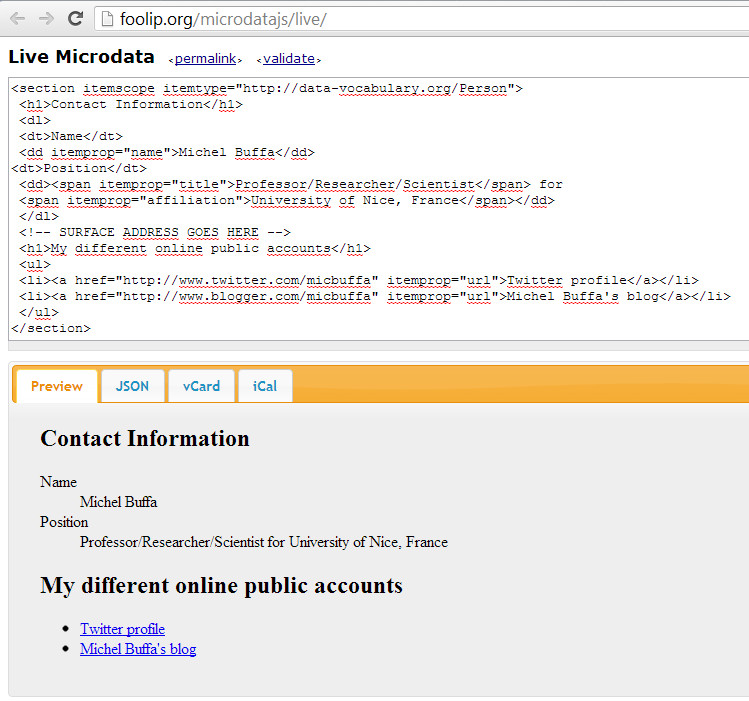

The margin, as we learned earlier, specifies the position of the
element relative to whatever is adjacent to it, either to the right or
left, or top or bottom.  The margin is always transparent, and each side
can be set individually.  The unique thing about the margin is that the
values for any of the sides can be *negative,* even if that means that
it overlaps with another element on the page.  This can be useful when
you want to control where an element is placed on a page.  In the
following pictures, the black rectangles encompass the content:

<!------------------------------------------------------------------------------------------------>
<!----------------------------------- 62/63.  (###) -------------------------------------->
<!------------------------------------------------------------------------------------------------>
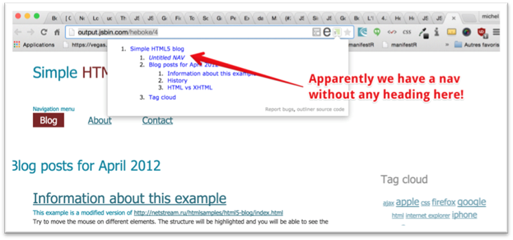

On the left, we see three blocks with no margins between them. On the
right are the same 3 blocks, but now block 2 has a positive margin-left,
creating space between blocks 1 and 2.  Block 3 has a negative
margin-left, causing its left side to overlap with block 2.

The border may be easier to comprehend because it is often visible,
though it doesn't have to be. Unlike the margin (or the padding), there
are many more options controlling the size, shape, color and style of
the border. You can even create a completely or partially transparent
border, or you can match the color of the border to the color of the
background, essentially rendering it invisible.  It's still there,
though, taking up some space on the page and influencing the placement
of elements displayed in the browser.  The width of the border controls
it's size (thickness), so it only makes sense to accept numbers greater
than or equal to 0.  What the browser does if the border-width is less
than 0 is undefined and shouldn't be relied on.

<!------------------------------------------------------------------------------------------------>
<!----------------------------------- 64.  (###) -------------------------------------->
<!------------------------------------------------------------------------------------------------>


Here blocks 1, 2 and 3 all have borders with different widths, but the
margins are zero.  There is no overlap, the borders are up against each
other regardless of their width.  The contents have different positions,
influenced by the width of the border.  If we were to make the borders
invisible (fully transparent), the positioning of the contents would
be the same.

Inside the border is the padding.  This controls the amount of space
between the elements content and the border box (whether it's visible or
not).  If you have no padding, then the contents of the element (maybe
text or image) would be right up against the border, which could be
awkward if you have a visible border.

Like the margin and the border, all four sides can be independently
set.  The background of the padded area matches the background of
element, so the effective visible size of the element includes the
padding.

<!------------------------------------------------------------------------------------------------>
<!----------------------------------- 65.  (###) -------------------------------------->
<!------------------------------------------------------------------------------------------------>
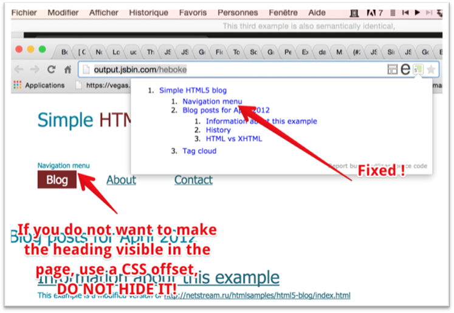

Here we've got a thin border directly around the content to delineate
where the content ends and the padding begins.  Again, the contents are
affected by the width of the padding, but now the background of the
padding is the same as the background of the content.  This makes it
look more like the contents have been expanded.  If we add a thin border
to these, we see that the padding is reflected by empty space between
the contents and the border:

<!------------------------------------------------------------------------------------------------>
<!----------------------------------- 66.  (###) -------------------------------------->
<!------------------------------------------------------------------------------------------------>
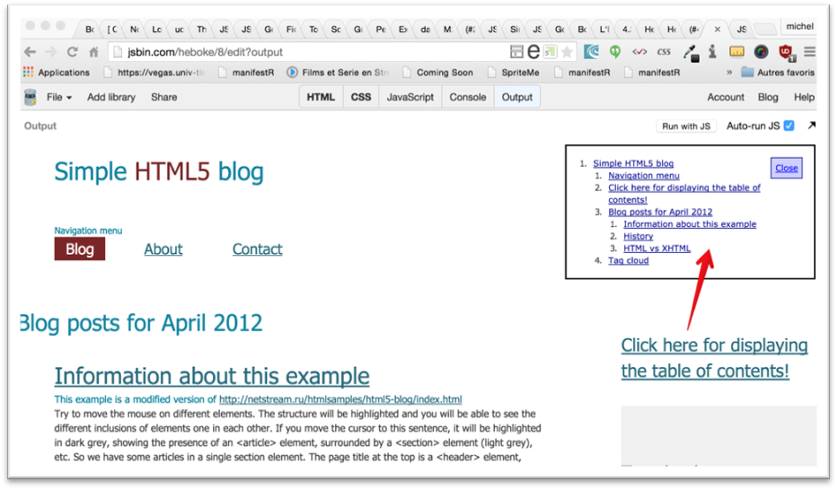

All of these can have a width of 0, which is equivalent to not having
them, thus 'margin: 0;'  is the same as 'margin: none;'.  Each can be
controlled individually with relative or absolute lengths.  While the
padding and borders require non-negative widths, margins can be either
positive or negative.

Using these three settings in combination provides quite a bit of
flexibility in terms of spacing and drawing of borders.  If you have
padding and a visible border, you can control how close the border comes
to the contents.  By setting the margin you can control how close the
border comes to surrounding elements.  You can even give your border
rounded corners using the border-radius setting:

<!------------------------------------------------------------------------------------------------>
<!----------------------------------- 67.  (###) -------------------------------------->
<!------------------------------------------------------------------------------------------------>
<p align="center" width="100%">

</p>

<h3>4.3.2 Debugging with the box model</h3>

In any browser's debugger, you will see a box model diagram. It looks
like this:

<!------------------------------------------------------------------------------------------------>
<!----------------------------------- 68.  (###) -------------------------------------->
<!------------------------------------------------------------------------------------------------>
<p align="center" width="100%">

</p>

This is an example of a diagram of the box model information for a
selected element.    
The innermost box gives the dimensions of the element, outside of that
is the padding, then the border around which is the margin.  On each
side of each corresponding rectangle is the width in pixels of that
side, with "-" when it is 0 (essentially non-existent).  Also, when you
hover over one of the rectangles, that portion of element is highlighted
on the rendered page, so you can see exactly where the margin, the
border, the padding and the element are.

So, in the example above:

-   the centered blue box corresponds to the size of the inspected
    element: width is 536 pixels and height is 118 pixels

-   padding is only defined by padding-left which value is 40 pixels

-   there is a border of 5 pixels on each side

-   margin-left and margin-right are undefined (default value is 0
    pixel)

-   margin-top and margin-bottom are equal to 16 pixels

<h3>4.3.3 Box model</h3>

MS Edge….

<h3 id="ch4-4">4.4.1 CSS Precedence</h3>

As we learned in the last module, in order for the computer to decide
which of several rules may apply to a given element in a particular
context, there is a well defined "precedence" to define which rule
should apply. Theoretically, we should be able to always figure out
which rule applies by using the precedence rules, but in practice, it
can be quite complicated, especially when conflicting rules are in
different .css files.

Nevertheless, that can cause problems when you have different rules that
could apply to the same element. Consider the following example:
<!------------------------------------------------------------------------------------------------>
<!----------------------------------- 69.  (###) -------------------------------------->
<!------------------------------------------------------------------------------------------------>
<p align="center" width="100%">

</p>

<h4>CSS</h4>
```
h1{
color:blue;
font-size: 2rem;
}
article h1{
color: black;
font-size: 1.4rem;
}
section h1{
color:grey;
font-size:1.2rem;
}
```
<h4>HTML</h4>
```
<!DOCTYPE html>
<html lang="en">
<head>
<meta charset="utf-8">
<title>precedence 1</title>
</head>
<body>
<h1>My Book</h1>
<article>
<h1>Chapter 1 </h1>
<section>
<h1>Section 1.1</h1>
<p>...</p>
</section>
<section>
<h1>Section 1.2</h1>
<section>
<article>
</body>
</html>
```
Looking at the style rules we see there are three different
possibilities for the size and color of an \<h1\> element. In this case
the application of the rules seems pretty intuitive. The outermost
heading is neither in a Article or a Section, so it is blue and largest
of the three. The one that's in the Article, but not in the section is
black and of medium size.

Finally, the heading in the section is the smallest and shows up as
grey.

Your intuition may be thinking along these lines - "section h1" is more
specific than "article h1" or "h1", and therefore it takes precedence
resulting in smaller gray text.  However, when you re-arrange the rules
you get a different result:
<!------------------------------------------------------------------------------------------------>
<!-------------------------- 70. my boook chapter 1, section1.1 (###) ---------------------------->
<!------------------------------------------------------------------------------------------------>
<p align="center" width="100%">

</p>

<h4>CSS</h4>
```
section h1{
color:grey;
font-size:1.2rem;
}
article h1{
color: black;
font-size: 1.4rem;
}
h1{
color:blue;
font-size: 2rem;
}
```
<h4>HTML</h4>
```
<!DOCTYPE html>
<html lang="en">
<head>
<meta charset="utf-8">
<title>precedence 2</title>
</head>
<body>
<h1>My Book</h1>
<article>
<h1>Chapter 1 </h1>
<section>
<h1>Section 1.1</h1>
<p>...</p>
</section>
<section>
<h1>Section 1.2</h1>
</section>
</article>
</body>
</html>
```
What happened? To answer that question, we'll turn to the browser's
debugger.

<h3 id="ch4-4-2">4.4.2 Debugging CSS Precedence</h3>

This lesson is using developer tools provided by the Chrome browser.

In the left panel of the debugger, there is the html markup of a page
(check the CodePen at the bottom of this page). In the right panel,
there are several tabs, such as "Styles" and "Computed". Both of these
are helpful in sorting out where a particular style setting is coming
from.  We saw in a previous section that we can add or change CSS
settings in the "Styles" panel, however, there is much more information
there.

<!------------------------------------------------------------------------------------------------>
<!------------------------------ 71. styles in the debugger (###) -------------------------------->
<!------------------------------------------------------------------------------------------------>
<p align="center" width="100%">

</p>

There is a sequence of the panels under "Style" that helps understand
just where a particular CSS rule is coming from. Starting at the top, we
have rules that apply specifically to the currently active element.  In
fact, changes in this top panel are mirrored as settings in the style
attribute of the element:
<!------------------------------------------------------------------------------------------------>
<!----------------------------------- 72.  (###) -------------------------------------->
<!------------------------------------------------------------------------------------------------>
<p align="center" width="100%">

</p>

Under that there are more panels which show where CSS properties for
other elements come from.  Under the top panel, which corresponds to
inline style settings, we find properties for this element that came
from the rules with the selector "article h1".  This may seem odd at
first because the h1 element that we're examining is inside a section,
so you'd think that the "section h1" selector would take precedence.

If we keep going down, we find the overridden rule that applies to all
h1 elements, and then there are the two grayed-out section with the
label "user agent stylesheet".  These are basically the defaults, the
values that the browser will use if nothing else is specified.  Any rule
you provide should override the corresponding rule in the user agent
stylesheet.

Back to our quandary, why does "article h1" take precedence over
"section h1"?  Let's take a look at the first version we tried, before
rearranging, which did what we wanted:
<!------------------------------------------------------------------------------------------------>
<!----------------------------------- 73.  (###) -------------------------------------->
<!------------------------------------------------------------------------------------------------>
<p align="center" width="100%">

</p>

Here we see just the opposite of what we saw before, now "section h1"
takes precedence over "article h1".  What's going on?

Our intuition in this case is deceiving us.  We think of section as
being more specific than article, but that's just because we've
organized it that way.  In fact, we could decide that a section consists
of multiple articles, then we'd want the opposite behavior.

As far as precedence calculations are concerned, though, the computer
sees "tag-type tag-type", which is more specific than just one
"tag-type", but no more specific than any other "tag-type tag-type"
combination.  Since "article h1" and "section h1" are of equal
precedence, the tie is broken by whichever rule came last.  When we
rearrange the rules, we change which of the two comes last, thus causing
the change in the section headers.

We could fix it by just making sure things are in the right order (which
is important) but a more robust solution might be to make use of the
fact that the way we're using \<section\> in fact is more specific
than \<article\>.  We can make this explicit by changing the selector to
"article section h1", so that now the smaller, lighter color will be
used only on a section that is inside an article, which is really what
we want:
<!------------------------------------------------------------------------------------------------>
<!----------------------------------- 74.  (###) -------------------------------------->
<!------------------------------------------------------------------------------------------------>
<p align="center" width="100%">

</p>

<h4>CSS</h4>
```
h1{
color:blue;
font-size: 2rem;
}
article h1{
color: black;
font-size: 1.4rem;
}
section h1{
color:grey;
font-size:1.2rem;
}
```
<h4>HTML</h4>
```
<!DOCTYPE html>
<html lang="en">
<head>
<meta charset="utf-8">
<title>precedence 1</title>
</head>
<body>
<h1>My Book</h1>
<article>
  <h1>Chapter 1 </h1>
  <section>
    <h1>Section 1.1</h1>
    <p>...</p>
  </section>
  <section>
    <h1>Section 1.2</h1>
    </section>
    </article>
  </body>
</html>
```
<h3>4.4.3 Cloud images</h3>

We're working on a Web page about clouds in
the [CodePen](https://codepen.io/w3devcampus/pen/ybqbwJ) below, and we
have some beautiful pictures we'd like to use: one for the top of the
page, and others as examples of different types of clouds.  We include
the pictures but the result is unwieldy:

<!------------------------------------------------------------------------------------------------>
<!----------------------------------- 75. image of cloud (186) ----------------------------------->
<!------------------------------------------------------------------------------------------------>
<p align="center" width="100%">

</p>

<h4>HTML</h4>
```
<!DOCTYPE html>
<html lang="en">
<head>
<meta charset="UTF-8">
<title>Cloud images</title>
</head>
<body>


<h1>Clouds</h1>
<blockquote>
<hr>
“Clouds come floating into my life, no longer to carry rain or usher
storm, but to add color to my sunset sky.”

― Rabindranath Tagore, Stray Birds

<hr>

</blockquote>
<p>Among the many types of clouds are:</p>
<ol>
<li id="cumulus">Cumulus clouds: </li>
<li id="cirrus">Cirrus clouds: </li>
<li id="stratus">Stratus clouds: </li>
</ol>
</body>
</html>
```
When you see the pictures, the text is so small it's unreadable. 
Clearly we have a solution for this.  We can just specify the width of
\ elements.  We can use the debugger to try different sizes,
modifying it in the "Styles" panel and we decide on this:
```
img {
   width: 10rem;
}
```
Giving a much more reasonable page:

<!------------------------------------------------------------------------------------------------>
<!----------------------------------- 76. cloud image (187) -------------------------------------->
<!------------------------------------------------------------------------------------------------>
<p align="center" width="100%">

</p>

<h4>CSS</h4>
```
img {
width: 10rem;
}
```
<h4>HTML</h4>
```
<!DOCTYPE html>
<html lang="en">
<head>
<meta charset="UTF-8">
<title>Cloud images</title>
</head>
<body>
<h1>Clouds</h1>

<blockquote\>
<hr>
“Clouds come floating into my life, no longer to carry rain or usher
storm, but to add color to my sunset sky.”
― Rabindranath Tagore, Stray Birds
<hr>
</blockquote>
<p>Among the many types of clouds are:</p>
<ol>
<li id="cumulus">Cumulus clouds: </li>
<li id="cirrus">Cirrus clouds: </li>
<li id="stratus">Stratus clouds: </li>
</ol>
</body>
</html>
```
So far so good, but we want our top image to be a bit bigger without
changing the other images.  Recall  that an \ tag
includes a width attribute, so we can special case this image
accordingly in the HTML code:
```

```
We look at our page again, and it hasn't changed!  Time to try the
debugger again.

<h4>Debugging image size</h4>

We open up the debugger and choose the \ tag corresponding to our
first picture, then we see this in the Styles section:

<!------------------------------------------------------------------------------------------------>
<!-------------------------------------- 77. debugger (188) -------------------------------------->
<!------------------------------------------------------------------------------------------------>
<p align="center" width="100%">

</p>

The specialized width setting that we added as an img attribute isn't
quite the same as setting the style.  Any style setting for the img
width will take precedence over the attribute setting, so our img
settings intended for the other images will change that one too.  You
could fix this by adding an inline "style" setting, but that's generally
discouraged.  It's better to sit back and think for a moment.  The
images below are in a list, and we want smaller pictures there so we can
scan the list easily.  The banner picture at the top should be big for
more visual impact.  One reasonable way to address this would be to
special case the smaller pictures, and use a larger width by default.
 This would recognize that we really want small images when they are
list elements, otherwise they should be bigger.  So we can change our
code like this:
```
img {
   width: 25rem;
}
li img {
   width: 10rem;
}
```
<h4>That looks better:</h4>

<!------------------------------------------------------------------------------------------------>
<!------------------------------- 78. cloud image-codepen (198) ---------------------------------->
<!------------------------------------------------------------------------------------------------>
<p align="center" width="100%">

</p>

<h4>CSS</h4>
```
img {
width: 25rem;
}
li img {
width: 10rem;
}
```
<h5>HTML</h5>
```
<!DOCTYPE html>
<html lang="en">
<head>
<meta charset="UTF-8">
<title>Cloud images</title>
</head>
<body>
<h1>Clouds\</h1>

<blockquote>
<hr>
“Clouds come floating into my life, no longer to carry rain or usher
storm, but to add color to my sunset sky.”
― Rabindranath Tagore, Stray Birds
<hr>
</blockquote>
<p>Among the many types of clouds are:</p>
<ol>
<li id="cumulus">Cumulus clouds: </li>
<li id="cirrus">Cirrus clouds: </li>
<li id="stratus">Stratus clouds: </li>
</ol>
</body>
</html>
```

There is still the issue of things not being laid out nicely, you'll
learn more about that in the module 6.

<h3 id="ch4-4-4">4.4.4 Shrinking Text</h3>

For this section you can play with
the <a href="http://codepen.io/w3devcampus/pen/wdxegK">CodePen</a> below. The main
content is an outline for an essay and it should look something like
this:

<!------------------------------------------------------------------------------------------------>
<!---------------------------- 79. Easy outline-code results (199) ------------------------------->
<!------------------------------------------------------------------------------------------------>
<p align="center" width="100%">

</p>

<h5>CSS</h5>
```
   section {
   font-size: 24px;
   }
   li {
   font-size: .5em;
  }
```
<h5>HTML</h5>
```
   <!DOCTYPE html>
   <html lang="en">
   <head>
   <meta charset="UTF-8">
   <title>Shrinking text</title>
   </head>
    <body>
    <section>
    <h1>Essay Outline</h1>
    <ol>
    <li>Introduction
    <ol>
    <li>Introduce Subject
    <ul>
    <li>What is it?</li>
    <li>Why is it important</li>
    </ul>
    </li>
    <li>Propose Thesis</li>
    <li>Outline</li>
    </ol>
    </li>
```
As with the cloud pictures, we want the listed items a bit smaller than
the regular text, so we add this styling:
```
   1.  section {
   2.    font-size: 24px;
   3.  }
   4.  section h1 {
   5.    font-size: 28px;
   6.  }
   7.  li {
   8.    font-size: 0.5em;
   9.  }
```
The outermost level is fine, the next level is almost readable but the
innermost level is ridiculously small.  Let's check what's wrong in the
debugger.

<h4>Computed tab</h4>

Looking into the style settings in the chrome browser debugger, at first
glance we don't see anything unusual.  The font-size is .5em as
expected.  One odd thing is that below the user agent stylesheet panels
is the over-ridden font-size setting identical to the current one, i.e.
.5em on \<li\> elements.
<!------------------------------------------------------------------------------------------------>
<!----------------------------------- 80. debugging font-size (###) ------------------------------>
<!------------------------------------------------------------------------------------------------>
<p align="center" width="100%">

</p>

The styles panel doesn't tell us a lot about the actually font-size in
absolute terms.  To determine that we can use the "Computed" tab. 

The "Computed" tab contains the values of all the CSS properties that
apply to the current element.  There are a lot of them, and they're
listed in alphabetical order.  Since the computer considers the
character '-' as coming before 'a' in the alphabet, the first thing
you'll see is a long list of properties starting with '-webkit'.  We're
going to scroll down past those to "font-size" which reveals this:

<!------------------------------------------------------------------------------------------------>
<!----------------------------------- 81.  (###) -------------------------------------->
<!------------------------------------------------------------------------------------------------>
<p align="center" width="100%">

</p>

This tells us that the font-size on the innermost list item is only 3px.
 No wonder it's unreadable!

When we click on the triangle (displayed before font-size: 3px;), we can
expand the details on font-size, which makes a little more clear what's
going on.  We see that the font-size on the body is 24px, but there are
several repetitions of the li .5em.

<!------------------------------------------------------------------------------------------------>
<!----------------------------------- 82.  (###) -------------------------------------->
<!------------------------------------------------------------------------------------------------>
<p align="center" width="100%">

</p>

If we look at the next outer list item, we see that the font-size is
6px, and the one outside of that is 12px.  This doubling makes it clear
what's happening.  Each nested \<li\> element has a font-size 1/2 the
size of its parent, because the em unit is relative measurement,
depending on the current font-size.

Now that we know what's happening, we can fix it in a few different
ways.  We could use an absolute unit like px or pt, but a better
solution would be rem.  This would make the size relative to the
html font-size (the default font-size for the page), not to it's
surroundings.

<h3 id="ch4-4-5">4.4.5 Recipe Project</h3>

We are now going to do some more "beautifying" of our Web page using
what we've learned in the debugger and the CSS box model to figure out
where and what we need to change to tighten things up a bit and add a
little more flair.

Try to make changes to get something like this:

<!------------------------------------------------------------------------------------------------>
<!--------------------------- 83. example: my favorite recipes (205) ----------------------------->
<!------------------------------------------------------------------------------------------------>
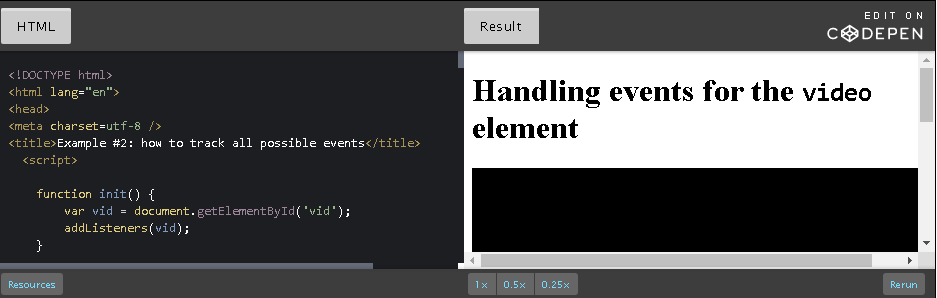

<h5>CSS</h5>

```css
nav {
background: aliceblue;
width: 12rem;
}
img {
width: 300px;
}
article {
margin-left: 3rem;
}
h1 {
text-align: center;
background: blue;
color: white;
}
```

<h5>HTML</h5>

```html5
<!DOCTYPE html>
<html lang="en">
<head>
<meta charset="UTF-8">
<title>My Favorite Recipes - Module 4</title>
<style>
nav{
background: lightgreen;
width: 20em;
}
img{
width: 400px;
border: 5px solid black;
padding: 10px;
}
article{
margin-left: 40px;
}
h1{
background: \#4c6d48;
text-align:center;
margin:0px;
}
nav ul{
padding-left: 25px;
}
body {
margin: 0px;
}
</style>
</head>
<body>
<h1>My Favorite Recipes</h1>
<nav>
<ul>
<li><a href="#soup">Soup</a></li>
<li><a href="#salad">Salad</a></li>
<li><a href="#pizza">Pizza</a></li>
</ul>
</nav>
<article id="soup">
<h2>Soup</h2>

<p>
Beethoven once said <q>Only the pure of heart can make a good
soup</q>. Well, here's my attempt at doing just that!
</p>
<ol>
<li>Step 1</li>
<li>Step 2</li>
<li>Step 3</li>
<li>Enjoy!</li>
</ol>
</article>
<article id="salad">
<h2>Salad</h2>

<h3>List of ingredients</h3>
<ul>
<li>Ingredient 1</li>
<li>Ingredient 2</li>
<li>Ingredient 3</li>
</ul>
<p>
Who can resist a fresh salad ! Here's one of my favorites.
</p>
> <ol>
<li>Step 1</li>
<li>Step 2</li>
<li>Step 3</li>
<li>Enjoy!</li>
</ol>
</article>
<article id="pizza">
<h2>Pizza</h2>

<p>
Pizza, the king of comfort foods. Try this simple, taste sensation.
</p>
<ol>
<li>Step 1</li>
<li>Step 2</li>
<li>Step 3</li>
<li>Enjoy!</li>
</ol>
</article>
</body>
</html>
```

Use the debugger to experiment with settings of margins, padding and
borders, to figure out what needs to change to eliminate some of the
gaps between elements and the side of the window and frame the images.

If you'd like to see what we did for the module 3, you can find it in
the CodePen below:

<!------------------------------------------------------------------------------------------------>
<!----------------------------------- 84.  (###) -------------------------------------->
<!------------------------------------------------------------------------------------------------>
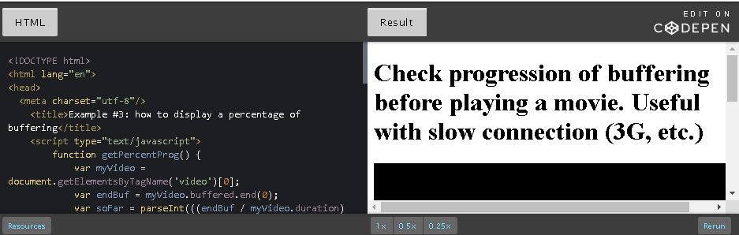

<h5>CSS</h5>
```
> nav {
> background: aliceblue;
> width: 12rem;
> }
> img {
> width: 300px;
> }
> article {
> margin-left: 3rem;
> }
> h1 {
> text-align: center;
> background: blue;
> color: white;
}
```
<h5>HTML</h5>

```
<!DOCTYPE html>
<html lang="en">
<head>
<meta charset="UTF-8">
<title>My Favorite Recipes - Module 3</title>
<style>
nav{
background: lightgreen;
width: 20em;
}
img{
width: 400px;
}
article{
margin-left: 40px;
}
h1{
background: #4c6d48;
text-align:center;
}
</style>
</head>
<body>
<h1>My Favorite Recipes</h1>
<nav>
<ul>
<li><a href="#soup">Soup</a></li>
<li><a href="#salad">Salad</a></li>
<li><a href="#pizza">Pizza</a></li>
</ul>
</nav>
<article id="soup">
<h2>Soup</h2>

<p>
Beethoven once said <q>Only the pure of heart can make a good
soup</q>. Well, here's my attempt at doing just that!
</p>
<ol>
<li>Step 1</li>
<li>Step 2</li>
<li>Step 3</li>
<li>Enjoy!</li>
</ol>
</article>
<article id="salad">
<h2>Salad</h2>

<h3>List of ingredients</h3>
<ul>
<li>Ingredient 1</li>
<li>Ingredient 2</li>
<li>Ingredient 3</li>
<ul>
<p>
Who can resist a fresh salad ! Here's one of my favorites.
</p>
<ol>
<li>Step 1</li>
<li>Step 2</li>
<li>Step 3</li>
<li>Enjoy!</li>
</ol>
</article>
<article id="pizza">
<h2>Pizza</h2>

<p>
Pizza, the king of comfort foods. Try this simple, taste sensation.
</p>
<ol>
<li>Step 1</li>
<li>Step 2</li>
<li>Step 3</li>
<li>Enjoy!</li>
</ol>
</article>
</body>
</html>
```

<h3 id="ch5-1-1">5.1.1 Welcome to Module 5</h3>
<!------------------------------------------------------------------------------------------------>
<!----------------------------------- 85.  (###) -------------------------------------->
<!------------------------------------------------------------------------------------------------>
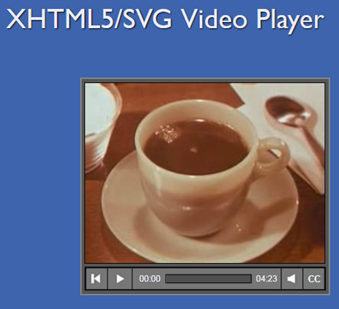

<h3 id="ch5-1-2">5.1.2 Module 5 - Content</h3>

**5.1 Introduction: **You will be combining HTML and CSS to create more
complex pages.

**5.2 Tables: **Tables can be a great way of organizing your content —
learn when to use tables, and when to avoid them.

**5.3 Multimedia: **Learn the best methods for including audio and video
in your page.

**5.4 Embedding content: **Learn about iframes and some advanced image
tag attributes, ismap and usemap. ***Note:** This section is optional
material included for the curious. It will not appear on any graded
question.*

**5.5 CSS tricks: **Here, we will introduce some next level methods for
making awesome Web pages.

**5.5 Recipe project: **Separate your CSS and HTML into their own files
for cleaner, easier coding.

<h3 id="ch5-1-3">5.1.3 A World of Possibilities</h3>

In Module 1, we learned the basics of HTML5. It's a fairly simple
format, just a tree full of elements, which are described by tags,
attributes, and the content inside the tags; the rest is details.

Once you know the list of all the possible tags, the list of available
attributes, and a few special cases like the Document Type Declaration
(DTD), self-closing tags, and meta tags, then you will have the
foundation to code in HTML5.

Putting this all together to form a coherent Web page with the addition
of CSS presents a world of possibilities. In this module, we'll delve
into some of those interesting possibilities. 

<h3 id="ch5-2-1">5.2.1 Introduction to Tables</h3>

Using tables to organize information goes back a way.  A long way. Three
or four thousand years ago, Sumerians were using [tables to calculate
compound interest](http://www.storyofmathematics.com/sumerian.html).
 Even so, tables are not obsolete, in fact HTML5 includes extensive
facilities for describing/building tables. 

Tables are used to arrange data in tabular format - rows and columns of
cells. You can put a variety of data like text, images, forms, links and
even other tables in your table.

You may hear experienced Web developers decrying the use of tables,
giving the impression that tables should be avoided at all costs.  It
might seem off-putting at first, but they're not really talking about
using tables for tabular information.  In earlier days, when layout
options were limited, many developers resorted to tables as a means of
layout.  There's really no need to do that anymore, there are plenty of
layout capabilities in CSS3.  You really don't want to use tables that
way, but there absolutely nothing wrong with using them for their
intended purpose - making tables.

<h4>Separating content and style</h4>

Look at [**this site**](http://create.adobe.com/) that is laid out with
CSS. You might be tempted to do this via tables instead. Or you might
want to just make your whole Web page into one big table: site header in
a table row, left navigation bar on the second row, left column, etc.

<h4>Bad idea! Here's why:</h4>

-   They are semantically incorrect for layout because they represent
    presentation and not content.

-   It puts presentation data in your content making your HTML larger.
    The user must download this unnecessary presentation data for every
    page they visit.

-   Accessibility: tables are not very screen reader friendly. Using
    tables for layout will clutter your HTML making it harder for
    assistive technology to parse your Web page.

-   Redesigns are harder when your HTML is cluttered with presentational
    code that should go into CSS. To change the layout of the page, you
    shouldn't be editing your content. Instead, you should just have to
    make CSS related changes.

-   Using CSS (one or two external stylesheets for your whole Web site)
    is easier to maintain consistency among pages.

Tables were not intended as a layout tool, so it is best to stick to
them only for tabular data.

<h4>Table elements</h4>

Here is a list of all the table elements we will be learning in this
section:

| Type          | Element                         |
|---------------|---------------------------------|
|               | \<table\>                       |
|               | \<caption\>                     |
| Row groups    | \<thead\>, \<tfoot\>, \<tbody\> |
| Column groups | \<colgroup\>, \<col\>           |
| Table row     | \<tr\>                          |
| Table cells   | \<th\>, \<td\>                  |

We will use these elements to build our table as we go.

<h4>The &lt;table&gt; tag</h4>

This tag defines a table in HTML5.

<h4>Attribute:</h4>

-   border - has two values, 0 and 1. It is used to specify a border
    around table cells. 0 - no border, 1 - add border. 0 also suggests
    that it is a layout table.

Other attributes have been deprecated as the same can be achieved
through CSS.
```
1.  <table border=1></table>
```

The code above will not provide any major visual change to your website
yet because we don't have any cells defined.

**Note**: Though there is an attribute for border, the table elements
should be styled using CSS. You can use the CSS border property to do
that instead. 

<h4>&lt;caption&gt;</h4>

It is used to give a title to the table and should be used as the first
child element of \<table\>. It can be used to provide more context to
the table if its content is ambiguous. As a summary of the table
content, a caption can also be helpful for people who have difficulty
understanding the content or use assistive technology.
```
1.  <table border=1>
2.    <caption>
3.      <p>Table 1.0</p>
4.      <p>Student's final exam results 2016</p>
5.    </caption>
6.  </table>
```
<!------------------------------------------------------------------------------------------------>
<!----------------------------------- 86.  (###) -------------------------------------->
<!------------------------------------------------------------------------------------------------>
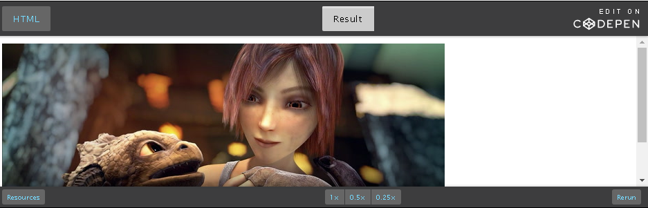

```
<!DOCTYPE html>
<html lang="en">
<head>
<meta charset="UTF-8">
<title>Table elements</title>
</head>
<body>
<table border=1>
<caption>
<p>Table 1.0</p>
<p>Student's final exam results 2016</p>
</caption>
</table>
</body>
</html>
```
<h3 id="ch5-2-2">5.2.2 The &lt;tr&gt;, &lt;th&gt;, &lt;td&gt;, &lt;colgroup&gt;, &lt;col&gt; tags</h3>

Let's now create the most basic table with a few cells.
```
<tr>
```
Creates a table row.
```
<th>
```

There are two types of cells in a table - header and
standard. \<th\> creates table header cells. The content of table header
cells is bold and centered by default.
```
1.  <table border=1>
2.  <tr>
3.  <th>Name</th>
4.  <th>Age</th>
5.  <tr>
6.  <table>
```
<!------------------------------------------------------------------------------------------------>
<!----------------------------------- 87.  (###) -------------------------------------->
<!------------------------------------------------------------------------------------------------>

```
<!DOCTYPE html>
<html lang="en">
<head>
<meta charset="UTF-8">
<title>th</title>
</head>
<body>
<table border=1>
<tr>
<th>Name</th>
<th>Age</th>
</tr>
</table>
</body>
</html>
```

<!------------------------------------------------------------------------------------------------>
<!----------------------------------- 88.  (###) -------------------------------------->
<!------------------------------------------------------------------------------------------------>
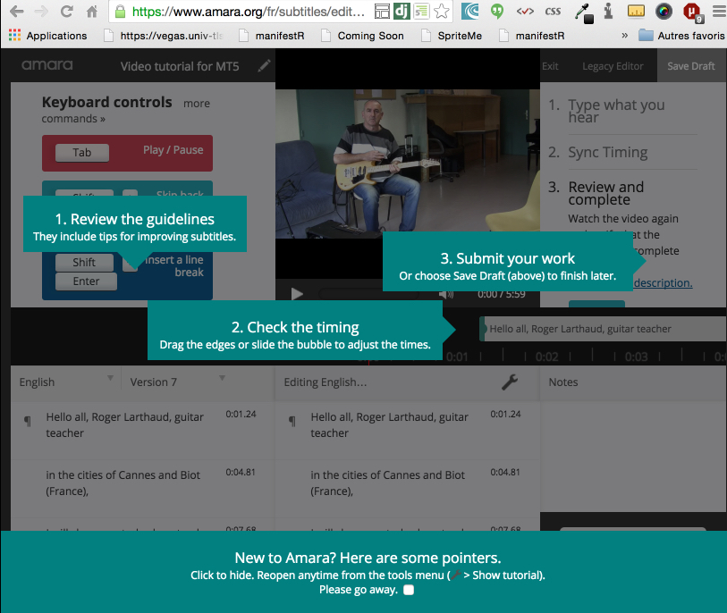

<h4>&lt;td&gt;</h4>

Creates table data (standard) cells. Content of table data cells is
regular and left-aligned by default.

With these tags we can create a simple table.
```
1.  <table border=1>
2.    <tr>
3.      <th scope="col">Name</th>
4.      <th scope="col">Age</th>
5.    </tr>
6.    <tr>
7.      <td>Alexa</td>
8.      <td>23</td>
9.    </tr>
10.   <tr>
11.     <td>James</td>
12.     <td>35</td>
13.   </tr>
14. </table>
```

<!------------------------------------------------------------------------------------------------>
<!----------------------------------- 89.  (###) -------------------------------------->
<!------------------------------------------------------------------------------------------------>
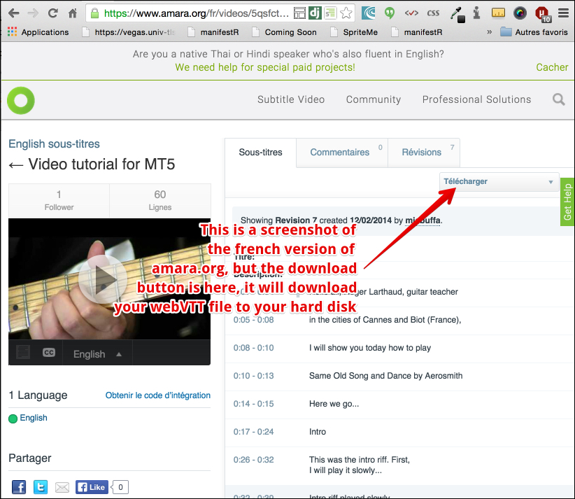

Now, let's have a look at the \<colgroup\> and \<col\> tags

<h4>&lt;colgroup&gt;</h4>

This tag allows you to group columns in a table. Grouping columns is
useful if you want to specify properties for a group of columns like
applying styles to the whole column instead of repeating it for each
cell.

### Attribute:

-   span - takes a positive integer value. It specifies the number of
    columns you want your colgroup to span (cover). The colgroup element
    shares its attributes like style and width with all the columns it
    spans.  Essentially it allows a single cell to stretch to cover
    multiple columns on a particular row.

### \<col\>

Used within \<colgroup\>, the \<col\> tag specifies the column property
for each column within a colgroup. The only element a \<colgroup\> can
contain is \<col\>. 

### Attribute:

-   span - takes a positive integer value. It specifies the number of
    columns you want the col element to span (cover). 

Consider the table above we created using \<tr\>, \<th\> and \<td\>.
Let's say I want the 'name' column to be in green and the 'age' column
to be orange. You need to use the \<colgroup\> and \<col\> tags to
achieve styling effects specific to a column. 

1.  \<body\>

2.    \<table border=1\>

3.      \<colgroup\>

4.        \<col span="1" style="background-color:green"\>

5.        \<col span="1" style="background-color:orange"\>

6.      \</colgroup\>

7.      \<tr\>

8.        \<th\>Name\</th\>

9.        \<th\>Age\</th\>

10.     \</tr\>

11.     \<tr\>

12.       \<td\>Alexa\</td\>

13.       \<td\>23\</td\>

14.     \</tr\>

15.     \<tr\>

16.       \<td\>James\</td\>

17.       \<td\>35\</td\>

18.     \</tr\>

19.   \</table\>

20. \</body\>

<!------------------------------------------------------------------------------------------------>
<!----------------------------------- 90.  (###) -------------------------------------->
<!------------------------------------------------------------------------------------------------>
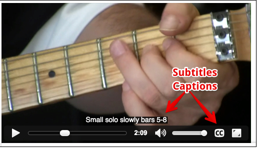

<h3>5.2.3 The \<thead\>, \<tbody\> and \<tfoot\> tags</h3>

Similar to an HTML document, a table in HTML can be split into header,
body and footer. We use these three tags
- \<thead\>, \<tbody\> and \<tfoot\> - to specify parts of a table.

It is very useful to define parts of a table as header, body and footer
because once browsers are able to identify which cells are header and
footer, the body can be allowed to scroll independently of header and
footer catering to a good table viewing experience in small
screens. [This is one such
example](https://www.tjvantoll.com/demos/2012-11-10/). Apart from this,
these elements can also be used to style header, body and footer rows
individually using CSS. 

### \<thead\>

Just like how we use \<colgroup\> to group columns, \<thead\> is used to
group the header content in a HTML table. 

As we learned in the previous unit, header cells are specified
using \<th\> as a child of \<tr\>. Rows specified
within \<thead\> indicate that they are header rows. See the code below:
```xml
  <thead style="color:white">
    <tr>
      <th scope="col">Name</th>
      <th scope="col">Age</th>
    </tr>
  </thead>
```
### \<tbody\>

Following \<thead\>, subsequent rows are considered body rows in a
table. Regular cells are specified using \<td\> as a child of \<tr\>:
```xml
  <tbody>
    <tr>
      <td>Alexa\</td>
      <td>23\</td>
    </tr>
    <tr>
      <td>James</td>
      <td>35</td>
    </tr>
   <tr>
     <td>Trisha</td>
     <td>23\</td>
   </tr>
 </tbody>
```
### \<tfoot\>

The footer is the last to be specified and rows within \<tfoot\> are
considered footer rows at the end of a table:
```xml
  <tfoot>
    <tr>
      <td>3 Unique Name</td>
      <td>2 Unique Ages</td>
    </tr>
  </tfoot>
```
<h4>Putting it all together:</h4>

```xml
  <table border=1>
    <colgroup>
      <col span="1" style="background-color:green">
      <col span="1" style="background-color:orange">
    </colgroup>
    <thead style="color:white">
      <tr>
        <th scope="col">Name</th>
       <th scope="col">Age</th>
     </tr>
   </thead>
   <tbody>
     <tr>
       <td>Alexa</td>
       <td>23</td>
     </tr>
     <tr>
       <td>James</td>
       <td>35</td>
     </tr>
     <tr>
       <td>Trisha</td>
       <td>23</td>
     </tr>
   </tbody>
   <tfoot style="font-style: italic;">
     <tr>
       <td>3 Unique Names</td>
       <td>2 Unique Ages</td>
     </tr>
   </tfoot>
 </table>
```

<!------------------------------------------------------------------------------------------------>
<!----------------------------------- 91.  (###) -------------------------------------->
<!------------------------------------------------------------------------------------------------>
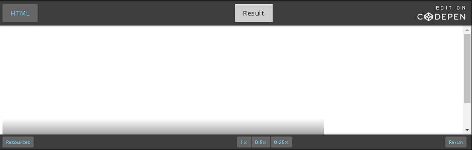

<h3>5.2.4 Styling your table</h3>

We now know how to put a basic table together. However, the tables we
have looked at so far could really use some work in terms of how they
look.

Here, we will look at some useful CSS elements to style your table. All
examples below are using CodePen. Each CodePen has three tabs - Result,
HTML and CSS. Make sure to view each tab to get the HTML and CSS code
for examples. You are also welcome to modify the code for each example
by clicking on 'Edit on CodePen' on the top right corner of the CodePen
(click on "RUN" when you completed your changes).

<h4>border</h4>

Though border is a valid attribute of the table element, it is best
specified in CSS. It is a shorthand property meaning you can set several
CSS properties simultaneously. 

The CSS border property
sets border-width, border-style and border-color in order: 

**table { border: 1px solid black; }**

<!------------------------------------------------------------------------------------------------>
<!----------------------------------- 92.  (###) -------------------------------------->
<!------------------------------------------------------------------------------------------------>
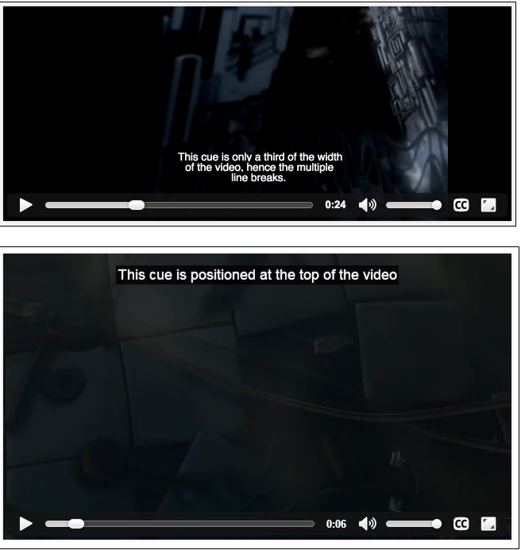

To give a border to \<table\>, \<th\> and \<td\>:

1.  table, th, td { border: 1px solid black; }

<!------------------------------------------------------------------------------------------------>
<!----------------------------------- 93.  (###) -------------------------------------->
<!------------------------------------------------------------------------------------------------>
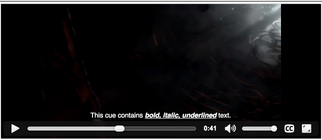

<h4>CSS</h4>

> table.eg1, th.eg1, td.eg1 { border: 1px solid black; }
>
> table.eg2, th.eg2, td.eg2 { border: thin dashed black; }
>
> table.eg3, th.eg3, td.eg3 { border: initial; }
>
> HTML
>
> \<!DOCTYPE html\>
>
> \<html lang="en"\>
>
> \<head\>
>
> \<meta charset="UTF-8"\>
>
> \<title\>Styling your table\</title\>
>
> \</head\>
>
> \<body\>
>
> \<table class="eg1"\>
>
> \<tr\>\<th class="eg1"\>Names\</th\>\<th
> class="eg1"\>Age\</th\>\</tr\>
>
> \<tr\>\<td class="eg1"\>Michael\</td\>\<td
> class="eg1"\>21\</td\>\</tr\>
>
> \</table\>
>
> \<br\>
>
> \<table class="eg2"\>
>
> \<tr\>\<th class="eg2"\>Names\</th\>\<th
> class="eg2"\>Age\</th\>\</tr\>
>
> \<tr\>\<td class="eg2"\>Michael\</td\>\<td
> class="eg2"\>21\</td\>\</tr\>
>
> \</table\>
>
> \<br\>
>
> \<table class="eg3"\>
>
> \<tr\>\<th class="eg3"\>Names\</th\>\<th
> class="eg3"\>Age\</th\>\</tr\>
>
> \<tr\>\<td class="eg3"\>Michael\</td\>\<td
> class="eg3"\>21\</td\>\</tr\>
>
> \</table\>
>
> \</body\>
>
> \</html\>

### border-collapse

We gave a border to the table, table-header and table-data above. This
creates two borders creating a double line. In order to collapse them
all into a single border, we use the border-collapse CSS property:

1.  table { border-collapse: collapse; }

Possible values of this property are: 

-   separate - default value where borders are detached like in the
    example above

-   collapse - border are collapsed into a single border

-   initial - sets to default value (separate)

<!------------------------------------------------------------------------------------------------>
<!----------------------------------- 94.  (###) -------------------------------------->
<!------------------------------------------------------------------------------------------------>

```
table.no-collapse, th.no-collapse, td.no-collapse
{
border: 1px solid black;
}
table.collapse
{
border-collapse: collapse;
}
```

<h4>HTML</h4>
```
<!DOCTYPE html>
<html lang="en">
<head>
<meta charset="UTF-8">
<title>Styling your table</title>
</head>
<body>
<table class="no-collapse">
<tr><th class="no-collapse">Names</th><th class="no-collapse">Age</th></tr>
<tr><td class="no-collapse">Michael</td><td class="no-collapse">21</td></tr>
</table>
<br>
<table class="collapse">
<tr><th class="no-collapse">Names</th><th class="no-collapse">Age</th></tr>
<tr><td class="no-collapse">Michael</td><td class="no-collapse">21</td></tr>
</table>
</body>
</html>
```
<h4>Table width and height</h4>

Browsers automatically set the width and height for the rows and columns
for your table based on the content in your cells. Cells with most
content usually set the height and width of all cells adjacent to
themselves. 

With CSS, you can also explicitly set the dimensions of your cells.
Width and height can be specified in:

-   units of length like pixels, percentage - relative to the table
    width, etc

-   auto: the browser will calculate and select a width for the
    specified element (default value)

It also supports initial (sets property to default value) and inherit
(from parent element). 

width/height of \<td\> of one cell will not only affect that cell but
the whole column/row. If two cells in one column/row have different
widths/heights specified, the larger value is set.

<!------------------------------------------------------------------------------------------------>
<!----------------------------------- 95.  (###) -------------------------------------->
<!------------------------------------------------------------------------------------------------>
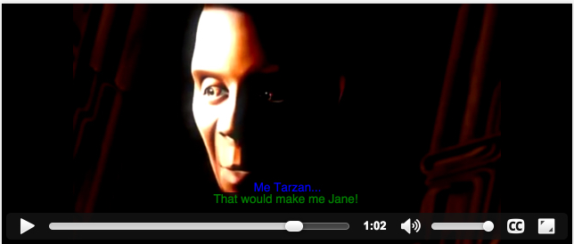

### CSS

table, th, td

{

border: 1px solid black;

border-collapse: collapse;

}

th.eg1

{

width: 25%;

}

th.eg2

{

height: 70px;

}

table.eg3

{

width: 100%;

}

HTML

\<!DOCTYPE html\>

\<html lang="en"\>

\<head\>

\<meta charset="UTF-8"\>

\<title\>Styling your table\</title\>

\</head\>

\<body\>

\<p\>The width of the first whole column is decided by the width of the
cell with most content:\</p\>

\<table\>

\<tr\>\<th\>Names\</th\>\<th\>Profession\</th\>\</tr\>

\<tr\>\<td\>Michael Fernandez\</td\>\<td\>Doctor\</td\>\</tr\>

\<tr\>\<td\>Amy Frank\</td\>\<td \>Computer Engineer\</td\>\</tr\>

\</table\>

\<p\>Specifying the width for one cell will affect the whole column.
Width is set in percentage relative to the whole table:\</p\>

\<table\>

\<tr\>\<th class="eg1"\>Names\</th\>\<th\>Profession\</th\>\</tr\>

\<tr\>\<td\>Michael Fernandez\</td\>\<td\>Doctor\</td\>\</tr\>

\<tr\>\<td\>Amy Frank\</td\>\<td \>Computer Engineer\</td\>\</tr\>

\</table\>

\<p\>Specifying the height for one cell will affect the whole row.
Height is set in fixed pixels:\</p\>

\<table\>

\<tr\>\<th class="eg2"\>Names\</th\>\<th\>Profession\</th\>\</tr\>

\<tr\>\<td\>Michael Fernandez\</td\>\<td\>Doctor\</td\>\</tr\>

\<tr\>\<td\>Amy Frank\</td\>\<td \>Computer Engineer\</td\>\</tr\>

\</table\>

\<p\>Specifying 100% for table width will occupy the whole width of the
parent element:\</p\>

\<table class="eg3"\>

\<tr\>\<th\>Names\</th\>\<th\>Profession\</th\>\</tr\>

\<tr\>\<td\>Michael Fernandez\</td\>\<td\>Doctor\</td\>\</tr\>

\<tr\>\<td\>Amy Frank\</td\>\<td \>Computer Engineer\</td\>\</tr\>

\</table\>

\</body\>

\</html\>

### text-align

This property is used to align the text of \<th\> and \<td\> cells left,
right or center (week 3 recap). 

Default:

-   \<th\> - center

-   \<td\> - left

1.  td { text-align: right;}

### vertical-align

This property is used to align the text of \<th\> and \<td\> cells top,
bottom or middle.

Default:

-   \<th\> - middle

-   \<td\> - middle

1.  th { vertical-align: top; }

### padding

Right now our table looks quite cramped. We use the padding property
on \<th\> and \<td\> to provide some space between border and content in
cell. It takes its value in units of length like px, cm, % - relative to
parent container's width, etc. 

1.  th, td { padding: 15px; }

This will add 15px space around the content on all sides. 

You can also apply different padding styles for four individual sides by
using:

-   padding-top \| th, td { padding-top: 15px; }

-   padding-right \| th, td { padding-right: 25px; }

-   padding-bottom \| th, td { padding-bottom: 35px; }

-   padding-left \| th, td { padding-left: 45px; }

Alternatively, padding can also be provided as a shorthand property
where you can specify all four sides in one go:

1.  th, td { padding: 20px 30px 40px 50px; }

It is specified in the order: top, right, bottom and left padding.

<!------------------------------------------------------------------------------------------------>
<!----------------------------------- 96.  (###) -------------------------------------->
<!------------------------------------------------------------------------------------------------>


### CSS

> table, th, td { border: 1px solid black; }
>
> table { border-collapse: collapse;}
>
> th, td { padding: 20px; }

### HTML

\<!DOCTYPE html\>

> \<html lang="en"\>
>
> \<head\>
>
> \<meta charset="UTF-8"\>
>
> \<title\>Styling your table\</title\>
>
> \</head\>
>
> \<body\>
>
> \<table\>
>
> \<tr\>\<th\>Names\</th\>\<th\>Age\</th\>\</tr\>
>
> \<tr\>\<td\>Michael\</td\>\<td\>21\</td\>\</tr\>
>
> \</table\>
>
> \</body\>
>
> \</html\>

### border-spacing

border-spacing specifies the distance between two cell borders in
pixels. This is different from padding which is space between content in
cell and border. It takes its value in units of length like px, cm, % -
relative to parent container's width, etc. 

It has the inherit property whose default value is 0.

It takes two values for horizontal and vertical spacing. If only one
value is provided, it is used for both horizontal and vertical spacing: 

1.  table { border-spacing: 25px 50px; }

2.  table, td, th { border-spacing: 25px; }

Some things to keep in mind:

-   If you try to provide spacing for only \<th\> and \<td\>, make sure
    there is space from the table border or you will not see a
    difference. 

-   You have to set - table { border-collapse: separate; } for it to
    take effect.

<!------------------------------------------------------------------------------------------------>
<!----------------------------------- 97.  (###) -------------------------------------->
<!------------------------------------------------------------------------------------------------>


<h4>CSS</h4>
```
> table, th, td { border: 1px solid black; }
>
> table { border-collapse: separate;}
>
> table.eg1, th.eg1, td.eg1 { border-spacing: 50px; }
>
> table.eg2, th.eg2, td.eg2 { border-spacing: 25px 50px; }
>
> table.eg3, th.eg3, td.eg3 { border-spacing: 50px 25px; }
```
<h4>HTML</h4>
```
> \<!DOCTYPE html\>
>
> \<html lang="en"\>
>
> \<head\>
>
> \<meta charset="UTF-8"\>
>
> \<title\>Styling your table\</title\>
>
> \</head\>
>
> \<body\>
>
> \<table class="eg1"\>
>
> \<tr\>\<th class="eg1"\>Names\</th\>\<th
> class="eg1"\>Age\</th\>\</tr\>
>
> \<tr\>\<td class="eg1"\>Michael\</td\>\<td
> class="eg1"\>21\</td\>\</tr\>
>
> \</table\>
>
> \<br\>
>
> \<table class="eg2"\>
>
> \<tr\>\<th class="eg2"\>Names\</th\>\<th
> class="eg2"\>Age\</th\>\</tr\>
>
> \<tr\>\<td class="eg2"\>Michael\</td\>\<td
> class="eg2"\>21\</td\>\</tr\>
>
> \</table\>
>
> \<br\>
>
> \<table class="eg3"\>
>
> \<tr\>\<th class="eg3"\>Names\</th\>\<th
> class="eg3"\>Age\</th\>\</tr\>
>
> \<tr\>\<td class="eg3"\>Michael\</td\>\<td
> class="eg3"\>21\</td\>\</tr\>
>
> \</table\>
>
> \</body\>
>
> \</html\>
```
<h4>Side-borders</h4>

The first property border will set a border to all four sides. You can
also set borders to individual sides - top, right, bottom, left:

1.  th, td { border-right: 1px solid black; }

<!------------------------------------------------------------------------------------------------>
<!----------------------------------- 98.  (###) -------------------------------------->
<!------------------------------------------------------------------------------------------------>


<h4>CSS</h4>

> table { border-collapse: collapse;}
>
> table, th, td { padding: 15px;}
>
> table.eg1, th.eg1, td.eg1 { border: 1px solid black; }
>
> table.eg2, th.eg2, td.eg2 { border-bottom: 1px solid black; }

<h4>HTML</h4>

> \<!DOCTYPE html\>
>
> \<html lang="en"\>
>
> \<head\>
>
> \<meta charset="UTF-8"\>
>
> \<title\>Styling your table\</title\>
>
> \</head\>
>
> \<body\>
>
> \<table class="eg1"\>
>
> \<tr\>\<th class="eg1"\>Names\</th\>\<th class="eg1"\>Age\</th\>\<th
> class="eg1"\>Gender\</th\>\</tr\>
>
> \<tr\>\<td class="eg1"\>Michael\</td\>\<td class="eg1"\>21\</td\>\<td
> class="eg1"\>Male\</td\>\</tr\>
>
> \<tr\>\<td class="eg1"\>Amy\</td\>\<td class="eg1"\>37\</td\>\<td
> class="eg1"\>Female\</td\>\</tr\>
>
> \</table\>
>
> \<br\>
>
> \<table class="eg2"\>
>
> \<tr\>\<th class="eg2"\>Names\</th\>\<th class="eg2"\>Age\</th\>\<th
> class="eg2"\>Gender\</th\>\</tr\>
>
> \<tr\>\<td class="eg2"\>Michael\</td\>\<td class="eg2"\>21\</td\>\<td
> class="eg2"\>Male\</td\>\</tr\>
>
> \<tr\>\<td class="eg2"\>Amy\</td\>\<td class="eg2"\>37\</td\>\<td
> class="eg2"\>Female\</td\>\</tr\>
>
> \</table\>
>
> \</body\>
>
> \</html\>

### zebra table

A zebra table has alternating colors for table rows making it easier to
differentiate data between rows. You can specify which rows you want to
differentiate using a different color. Typically, you apply this
property to a set of even or odd table rows to created a striped effect.
You can set odd or even rows a particular color and leave the other rows
white (default color).

1.  tr:nth-child(even) { background-color: grey; }

2.  tr:nth-child(odd) { background-color: #ccff99; }

The '*n*th-child' selector matches every element that is the *n*th child
of the table or any parent element. Therefore,

1.  tr:nth-child(3n) { background-color: grey; } 

will make the every third list item grey.

<!------------------------------------------------------------------------------------------------>
<!----------------------------------- 99.  (###) -------------------------------------->
<!------------------------------------------------------------------------------------------------>
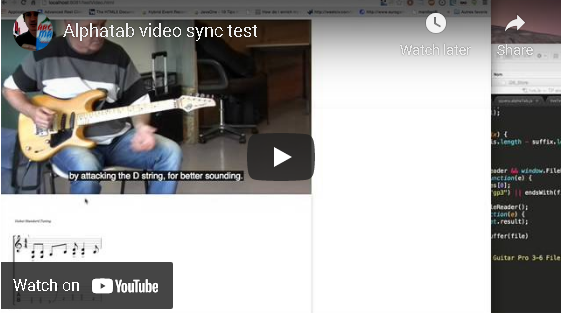

<h4>CSS</h4>

1.  table { border-collapse: collapse; }

2.  table, th, td { padding: 15px; border-bottom: 1px solid black; }

3.  

4.  table.eg1 tr:nth-child(even) { background-color: \#ccff99; }

5.  

6.  table.eg2 tr:nth-child(odd) { background-color: \#ccff99; }

7.  

8.  table.eg3 tr:nth-child(3n) { background-color: \#ccff99; }

### HTML

1.  \<!DOCTYPE html\>

2.  \<html lang="en"\>

3.  

4.  \<head\>

5.  \<meta charset="UTF-8"\>

6.  \<title\>Styling your table\</title\>

7.  \</head\>

8.  \<body\>

9.  \<table class="eg1"\>

10. \<tr\>\<th class="eg1"\>Name\</th\>\<th class="eg1"\>Age\</th\>\<th
    class="eg1"\>Gender\</th\>\</tr\>

11. \<tr\>\<td class="eg1"\>Michael\</td\>\<td
    class="eg1"\>21\</td\>\<td class="eg1"\>Male\</td\>\</tr\>

12. \<tr\>\<td class="eg1"\>Amy\</td\>\<td class="eg1"\>37\</td\>\<td
    class="eg1"\>Female\</td\>\</tr\>

13. \<tr\>\<td class="eg1"\>Mark\</td\>\<td class="eg1"\>32\</td\>\<td
    class="eg1"\>Male\</td\>\</tr\>

14. \</table\>

15. \<br\>\<br\>

16. \<table class="eg2"\>

17. \<tr\>\<th class="eg2"\>Name\</th\>\<th class="eg2"\>Age\</th\>\<th
    class="eg2"\>Gender\</th\>\</tr\>

18. \<tr\>\<td class="eg2"\>Michael\</td\>\<td
    class="eg2"\>21\</td\>\<td class="eg2"\>Male\</td\>\</tr\>

19. \<tr\>\<td class="eg2"\>Amy\</td\>\<td class="eg2"\>37\</td\>\<td
    class="eg2"\>Female\</td\>\</tr\>

20. \<tr\>\<td class="eg2"\>Mark\</td\>\<td class="eg2"\>32\</td\>\<td
    class="eg2"\>Male\</td\>\</tr\>

21. \</table\>

22. \<br\>\<br\>

23. \<table class="eg3"\>

24. \<tr\>\<th class="eg3"\>Name\</th\>\<th class="eg3"\>Age\</th\>\<th
    class="eg3"\>Gender\</th\>\</tr\>

25. \<tr\>\<td class="eg3"\>Michael\</td\>\<td
    class="eg3"\>21\</td\>\<td class="eg3"\>Male\</td\>\</tr\>

26. \<tr\>\<td class="eg3"\>Sarah\</td\>\<td class="eg3"\>37\</td\>\<td
    class="eg3"\>Female\</td\>\</tr\>

27. \<tr\>\<td class="eg3"\>Mark\</td\>\<td class="eg3"\>32\</td\>\<td
    class="eg3"\>Male\</td\>\</tr\>

28. \<tr\>\<td class="eg3"\>Paul\</td\>\<td class="eg3"\>25\</td\>\<td
    class="eg3"\>Male\</td\>\</tr\>

29. \<tr\>\<td class="eg3"\>Jack\</td\>\<td class="eg3"\>26\</td\>\<td
    class="eg3"\>Male\</td\>\</tr\>

30. \<tr\>\<td class="eg3"\>Juliet\</td\>\<td class="eg3"\>55\</td\>\<td
    class="eg3"\>Female\</td\>\</tr\>

31. \</table\>

32. \</body\>

33. \</html\>

### hover to highlight

Using the hover property on your \<tr\>, you can mouse over rows in your
table to highlight them in the color you specify. This is useful to help
users differentiate data between rows. 

1.  tr:hover {background-color: #ccff99; }

### Hover over these tables:

<!------------------------------------------------------------------------------------------------>
<!----------------------------------- 100.  (###) -------------------------------------->
<!------------------------------------------------------------------------------------------------>
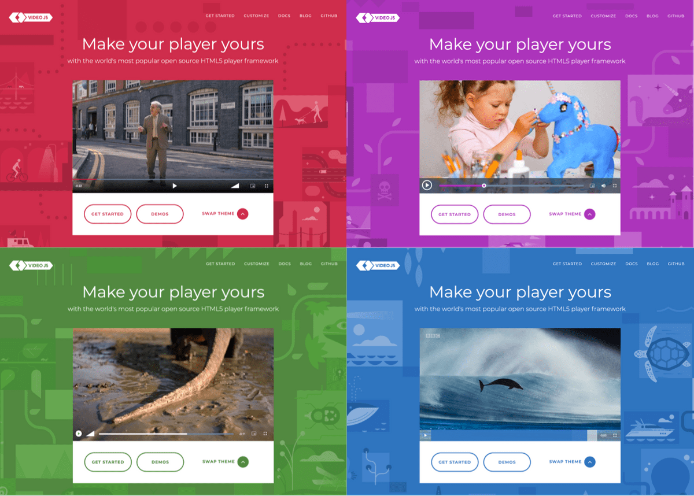

<h4>CSS</h4>
```
1.  table { border-collapse: collapse; }
2.  table, th, td { padding: 15px; border-bottom: 1px solid black; }
3.  
4.  table.eg1 tr:hover { background-color: \#ccff99; }
5.  
6.  table.eg2 tr:hover { background-color: grey; }
```

<h5>HTML</h5>
```
1.  <!DOCTYPE html\>
2.  <html lang="en"\>
3.  
4.  <head\>
5.  <meta charset="UTF-8"\>
6.  <title\>Styling your table\</title\>
7.  </head\>
8.  <body\>
9.  <table class="eg1"\>
10. <tr\><th class="eg1"\>Name\</th\>\<th class="eg1"\>Age\</th\>\<th
    lass="eg1">Gender\</th\>\</tr\>
11. <tr\><td class="eg1"\>Michael\</td\>\<td
    class="eg1">21\</td\>\<td class="eg1"\>Male\</td\>\</tr\>
12. <tr\><td class="eg1"\>Amy\</td\>\<td class="eg1"\>37\</td\>\<td
    class="eg1">Female\</td\>\</tr\>
13. <tr\><td class="eg1"\>Mark\</td\>\<td class="eg1"\>32\</td\>\<td
    class="eg1">Male\</td\>\</tr\>
14. </table>
15. <br><br>
16. <table class="eg2">
17. <tr><th class="eg2"\>Name</th\>\<th class="eg2"\>Age\</th\>\<th
    class="eg2"\>Gender\</th\></tr\>
18. <tr><td class="eg2"\>Michael</td\>\<td
    class="eg2"\>21\</td\><td class="eg2"\>Male\</td\>\</tr\>
19. <tr><td class="eg2"\>Amy</td\>\<td class="eg2"\>37\</td\>\<td
    class="eg2"\>Female\</td>\</tr\>
20. <tr><td class="eg2"\>Mark</td\>\<td class="eg2"\>32\</td\>\<td
    class="eg2">Male</td></tr>
21. </table>
22. </body>
23. </html>
```

<h4>overflow</h4>

With padding, additional columns and rows, your table can easily grow
rather big overflowing out of the \<div\> you had planned for your table
in your Web page. You can use the CSS overflow property to resolve this.
It has four values other than initial (sets the default value) and
inherit (from parent element). 

-   visible - Content that has overflowed is visible outside the parent
    element. Eg: Text in a box overflows outside box and is visible.

-   hidden - Content that has overflowed is hidden. This makes the
    overflowed content inaccessible. 

-   scroll - Content that has overflowed is hidden but a scroll bar is
    added to make it accessible. 

-   auto - Content that has overflowed is hidden but a scroll bar is
    automatically added to view hidden content. 

To address left and right edges of content, you can use overflow-x and
to address top and bottom edges of content, you can use overflow-y.

<!------------------------------------------------------------------------------------------------>
<!----------------------------------- 101.  (###) -------------------------------------->
<!------------------------------------------------------------------------------------------------>


<h5>CSS</h5>
```
1.  table { border-collapse: collapse; }
2.  div { height: 200px; width: 200px; border: 1px solid blue; }
3.  table, th, td { padding: 30px; border-bottom: 1px solid black; }
4.  
5.  div.overflow-hidden { overflow: hidden; }
6.  div.overflow-scroll { overflow: scroll; }
7.  div.overflow-auto { overflow: auto; }
8.  div.overflow-x-auto { overflow-x: auto; overflow-y:hidden; }
```

<h5>HTML</h5>
```
1.  <!DOCTYPE html>
2.  <html lang="en">
3.  
4.  <head>
5.  <meta charset="UTF-8">
6.  <title>Styling your table</title>
7.  </head>
8.  <body>
9.  <p>To better illustrate this property, we are going to place our
   tables inside div elements with width and height set to 200px</p>
10. <h4>Overflow-hidden</h4>
11. <div class="overflow-hidden">
12. <table>
13. <tr>
14. <th>Name</th>
15. <th>Age</th>
16. <th>Gender</th>
17. <th>Occupation</th>
18. </tr>
19. <tr>
20. <td>Amy</td>
21. <td>33</td>
22. <td>Female</td>
23. <td>Fitness Trainer</td>
24. </tr>
25. <tr>
26. <td>Mike</td>
27. <td>52</td>
28. <td>Male</td>
29. <td>Engineer</td>
30. </tr>
31. </table>
32. </div>
33. <br><br>
34. <h4>Overflow-scroll\</h4>
35. <div class="overflow-scroll">
36. <table>
37. <tr>
38. <th>Name</th>
39. <th>Age</th>
40. <th>Gender</th>
41. <th>Occupation</th>
42. </tr>
43. <tr>
44. <td>Amy</td>
45. <td>33</td>
46. <td>Female</td>
47. <td>Fitness Trainer</td>
48. </tr>
49. <tr>
50. <td>Mike\</td>
51. <td>52\</td>
52. <td>Male\</td>
53. <td>Engineer\</td>
54. </tr>
55. </table>
56. </div>
57. <br><br>
58. <h4>Overflow-auto</h4>
59. <div class="overflow-auto">
60. <table>
61. <tr>
62. <th>Name</th>
63. <th>Age</th>
64. <th>Gender</th>
65. <th>Occupation</th>
66. </tr>
67. <tr>
68. <td>Amy</td>
69. <td>33</td>
70. <td>Female</td>
71. <td>Fitness Trainer</td>
72. </tr>
73. <tr>
74. <td>Mike</td>
75. <td>52</td>
76. <td>Male</td>
77. <td>Engineer</td>
78. </tr>
79. </table>
80. </div>
81. <br><br>
82. <h4>Overflow-x-auto</h4>
83. <div class="overflow-x-auto">
84. <table>
85. <tr>
86. <th>Name</th>
87. <th>Age</th>
88. <th>Gender</th>
89. <th>Occupation</th>
90. </tr>
91. <tr>
92. <td>Amy</td>
93. <td>33</td>
94. <td>Female</td>
95. <td>Fitness Trainer</td>
96. </tr>
97. <tr>
98. <td>Mike</td>
99. <td>52</td>
100. <td>Male</td>
101. <td>Engineer</td>
102. </tr>
103. </table>
104. </div>
105. </body>
106. </html>
```

<h4>In summary: a fancy table</h4>

As a conclusion to this tables section, here is a complete table design:


<h5>CSS</h5>
```
1.  table, th, td {
2.  padding: 30px;
3.  border: 1px solid \#DCDCDC;
4.  text-align: center;
5.  }
6.  
7.  table {
8.  border-collapse: collapse;
9.  overflow: auto;
10. font-family: "Ubuntu", "Verdana", "Arial", sans-serif;
11. }
12. 
13. tr:hover {
14. background-color: \#e6e6e6;
15. }
16. 
17. tr.main-heading {
18. line-height: 10%;
19. background-color: \#32B2B2;
20. color: white;
21. }
22. 
23. tr.sub-heading {
24. line-height: 150%;
25. background-color: \#149494;
26. color: white;
27. }
28. 
29. tr.buy-now-footer {
30. line-height: 150%;
31. background-color: \#149494;
32. font-weight: bold;
33. font-size: 20px;
34. }
```

<h5>HTML</h5>
```
1.  <!DOCTYPE html>
2.  <html lang="en">
3.  
4.  <head>
5.  <meta charset="UTF-8">
6.  <title>a fancy table</title>
7.  </head>
8.  <body>
9.  <table>
10. <thead>
11. <tr class="main-heading">
12. <th id="mh-co1" scope="col">Trial</th>
13. <th id="mh-co2" scope="col">Starter</th>
14. <th id="mh-co3" scope="col">Premium</th>
15. <th id="mh-co4" scope="col">VIP</th>
16. </tr>
17. <tr class="sub-heading">
18. <th id="sh-co1" scope="col">Free</th>
19. <th id="sh-co2" scope="col">$5.99<br>per month</th>
20. <th id="sh-co3" scope="col">$15.99<br>per month</th>
21. <th id="sh-co4" scope="col">$29.99<br>per month</th>
22. </tr>
23. </thead>
24. <tbody>
25. <tr>
26. <td headers="mh-co1 sh-co1">2hrs/day</td>
27. <td headers="mh-co2 sh-co2">7hrs/day</td>
28. <td headers="mh-co3 sh-co3">Unlimited</td>
29. <td headers="mh-co4 sh-co4">Unlimited</td>
30. </tr>
31. <tr>
32. <td headers="mh-co1 sh-co1">5 channels</td>
33. <td headers="mh-co2 sh-co2">32 channels</td>
34. <td headers="mh-co3 sh-co3">Booster Pack - 152 channels</td>
35. <td headers="mh-co4 sh-co4">Unlimited\</td>
36. </tr>
37. <tr>
38. <td headers="mh-co1 sh-co1">-</td>
39. <td headers="mh-co2 sh-co2">-</td>
40. <td headers="mh-co3 sh-co3">Free Ello Subscription</td>
41. <td headers="mh-co4 sh-co4">Free Ello Subscription</td>
42. </tr>
43. <tr>
44. <td headers="mh-co1 sh-co1">Email Support</td>
45. <td headers="mh-co2 sh-co2">Email Support</td>
46. <td headers="mh-co3 sh-co3">Email &amp; Call Support</td>
47. <td headers="mh-co4 sh-co4">Unlimited Email &amp; Call
    Support</td>
48. </tr>
49. </tbody>
50. <tfoot>
51. <tr class="buy-now-footer">
52. <td colspan="4"><a href="http://www.example.com"
    target="blank">Buy now!</a></td>
53. </tr>
54. </tfoot>
55. </table>
56. </body>
57. </html>
```

**Note**: This table contains multi-line headers. You can find more
information on the right way to design tables of different header types
on this W3C [Tables
Concepts](https://www.w3.org/WAI/tutorials/tables/) page.

<h3>5.2.6 Creating a Table</h3>

Let's take a look at how to work with tables and manipulate the table
styling within an HTML document.

Now, in this example we have a table displayed in Visual Studio Code
here on the left-hand side, and you can see the output of the table
displayed in our browser on the right-hand side.

Now, we take a look at the way this table is configured.

We have our table tag.

We have given the table a caption with two 'p' tags, with two paragraph
tags labeling it as Figure 1 and weather prediction for May of 2016.

Then we have multiple table rows, with items provided for data in that
table.

The first row, we'll do a slight separation here just so we can visually
determine that there is a bit of a difference.

We take a look at 'th' elements within side 'tr', or "Table Row".

The 'th' element, again specifies that this is a "Table Header".

The day and the temperature become Header information that is displayed
in bold, over here on our Web page.

Then, the remaining entries in that table are all table rows but they're
using the 'td' element, which is "Table Data" or data cell within the
table itself.

Now, looking at the table it's not really all that visually appealing.

It is kind of flat looking.

There's not a lot of alignment in the columns.

We need a little more spacing that's in there.

What we're going to do is start to apply some styling to this table to
make it a little more visually appealing.

We're going to do this using cascading style sheets.

Again, think of your HTML as simply displaying the layout of the page,
but the styling should always be in your CSS.

What we've done is we've created a stylesheet link in our HTML, and in
this case we're pointing to a file called "style.css".

Now when you start working with CSS, naming conventions will be
something that you'll run across.

Some folks prefer to call this "style.css", put them in a "Styles"
folder within the structure for your Web application.

Others may have specific CSS for tables, etc.

We're just going to deal with a generic "style.css" making things much
easier to see and look at.

One of the first things that we want to do, is step into our stylesheet
and we're going to make a change.

We're going to add some borders to give a little bit of style to start
off with on our table.

Let's go ahead and do that.

Okay, so, what we've set up here is a very simple style that we're going
to apply to a table.

And actually, this should have been the "Table Head" and this one should
be a "Table Cell", so the TD.

The style will apply to those three elements within the document.

We're going to set up a single pixel solid black border for the table.

We've applied it on our CSS, but it hasn't taken place over here yet.

We'll need to refresh our browser, and we can see that now the styling
has been applied.

We have the border around the table.

But the problem we're running into here is we've got kind of a double
border going on.

For some, that may be perfectly fine, we think we're okay with that
double border, it looks all right.

But others say, no, I want to change that a little bit.

The reason it looks like a double border is because, remember, we've
applied a border to the table, and we've applied a border to the "Table
Header" and the "Table Cell" objects.

In order to fix that, we can actually add another style in here.

And then what we do with this one here, is we basically collapse the
border.

We can add another style in here to help us deal with that.

In this case what we're going to do is specify that we want the border
to be collapsed, and then that will reduce the number of borders that we
have.

This is what it looks like. All right.

We specified that for the table we want to collapse of the border.

We're using the CSS style to do that.

And when we refresh, we see that indeed we have collapsed the border.

Essentially, all we've done is collapse the border on the table, but
we're leaving the border around all the individual cells.

That gives us a little bit more formatting on the table.

It starts to add a little more visual appeal to it, but we're not
finished yet.

What we're going to do next is, we're going to go back to the table, and
we're going to add a "Footer" in the table, and the footer that we want
to add in the table is going to give us a little bit of an average
temperature rating, if you will.

Let's go back and make some changes to that table.

Down at the bottom, after we've finished with our final table role.

In this case we're going to go ahead and we're going to add another
table role because this is where we're going to put our table footer.

We use a 'tr', and then we will also implement a 'td'.

This is going to be another table "Data Cell".

And then, within that, we will call that "Average Temperature", and
then, we've already done the math on this here and factored out the
average.

It's about 70.5 F.

We're going to use that for 70.5 degrees Fahrenheit.

Now, we're not quite finished yet and the reason I say that is, if we
click a refresh here we see that we do have our "Average Temperature"
row at the bottom, but it looks a little odd.

It's only spanning one row and has kind of extended that date role or
the date column a little bit.

We need to change that, so we'll do that with a "Column Span".

Within the 'td' element, we'll put in a "Column Span", and then within
the "Column Span", we'll tell it how many columns we want this to
actually span across.

Because our table has three columns, if we implement three as the
"Column Span", then we refresh our table.

We can see that now it takes up the entire three columns, looks as
though it is only one column at the bottom.

We've added that little bit to our table now, we've got this average in
here.

But we also want to go through the process of maybe changing how some of
this visual appeal is on the table itself.

First thing we want to do is, maybe go back in and add some padding.

And the reason we want to do that is, you see that within ourselves,
we're kind of but out right up against the borders of the cell.

Let's go back to our stylesheet for a moment, and let's go ahead and add
some padding before we add some other elements to this table.

We'll apply this to the 'th' and the 'td' cells, and then we'll specify
the padding feature.

And then, within the padding we're going to use 10 pixels, just to
provide a little bit of extra spacing between the border and the
contents.

Refresh, and we can see that our table now has that padding.

It's top, bottom, left, right.

It's equally applied all the way around.

There'll be other lessons where you'll talk about how to apply padding
differently depending on where you want the spacing to be: either top,
left, bottom, or right.

But in this case, we'll leave the padding set by default, the 10 pixels
all the way around the table.

Now, one of the things that we can also do to apply some more visual
appeal to this, is actually start getting into applying colors to the
different aspects of the table.

And one way that we can do that, is to start dividing our table elements
if you will, up into more discrete components.

What we're going to do here is, we're actually going to start specifying
different elements for the "Table Head", the "Table Body", and the
"Table Footer".

And then, we'll use the CSS to apply styling to those.

Back at our table, directly underneath the caption, what we're going to
do is, we did this physical separation here of the lines just to show
that we actually had a header row, but it wasn't kind of apparent
exactly what that meant.

This time we're going to create a 'thead' element here.

And the 'thead' element allows us to specify that this will become a
"Table Head" or a "Table Header".

And then, we can use that information to apply CSS stylesheets for how
we want it to look.

So, let's pace that in here.

We'll do a little more document reformatting, just so things look a
little bit better.

We've applied the 'thead' element here to our Header row, and then we're
also going to apply a "Table Body" element.

We'll do a 'tbody'.

Once again, a little bit of document formatting just to make it look a
little bit better.

And then, finally, we'll come down and we'll apply a "Table Footer", and
in this case we use the 'tfoot'.

We set up a 'tfoot' element, and we will apply it to that Table Footer
row, which we created initially to set up our spanning column for the
"Average Temperature" values.

Expand that there, we'll pace in our "Table Footer".

And so, now we have three additional elements to this table.

And then, what we can do with it, is start to apply styling to those
elements themselves.

If we go back and refresh, you can see that nothing really changes so
far in the table itself and in the display that we see.

But what we do want to do, is apply some of those color options or the
styling options to the table by using our CSS.

Let's go back into the "style.css" file.

And in here, we're going to specify a specific styling for the "Table
Header" and for the "Table Footer".

We use the 'thead' and the 'tfoot' classes here.

And then we will set up a background color.

We're going to use the IntelliSense, which saves us a lot of typing and
helps us to make sure we're using the right formatting and the proper
syntax for our code.

And then we're going to specify some colors.

You'll also notice how when we start typing in a color, the first couple
of letters, the IntelliSense built into Visual Studio Code, pops up and
gives us some options based on what it is that we specified for those
initial letters.

Let's choose the "Antique White", for this particular instance, and then
we will close out with our semicolon.

And then, before we add some other color, let's go ahead and take a look
at what that's done to our table.

If we do a refresh, we can see that our "Antique White" has been applied
only to the "Header Row" and to the "Footer Row", again, because we've
specified those classes here.

Let's go ahead and make some changes to the body now, so we can apply
some color to the table body.

We use the 'tbody', and then we'll also specify the background color.

That's the one that we want to deal with specifically again.

So, background color.

And then, in this particular instance, we'll use a slightly different
color.

Again, using IntelliSense, we use the "Floral White".

I'll press "Tab" to complete that, and then put our semi colon in.

Let's refresh one more time on the browser.

And we can see that we have this little "Floral White".

There's just a slight change in it and we can see that we now have two
colors.

We're getting closer to where we want to be but one thing that we want
to finally add to this table, is the ability for users to look at it and
kind of understand or see the different rows individually or more
plainly.

We're going to set up this other functionality within our CSS file.

And this is where we're going to alternate the colors that we have
available in our CSS file.

What we're going to do with that is, we're going to apply an alternating
color to the row.

We do that by starting off with 'tr', and the 'tr' is our "Table Row".

And then we're going to save for the "Nth Child".

Again, letting IntelliSense, our built individual Studio Code help us,
we say we want to use the "Nth Child", and for each even row.

In other words, we're going to alternate but we're going to select the
even rows which would be rows numbered zero, two, four, etc.

What we want to do is we want to change the background color of that.

Once again, we'll come in, we'll specify that background color is the
property we want to change.

And in this case, we'll do something called "BlanchedAlmond", and then
semi colon to finish that out.

And then, let's go refresh and see what our table looks like now.

And you can see that we have alternating rows, and those make the table
a little more visually appealing, and we have the ability to distinguish
one row from the other.

This is just a quick example of how to create tables within your HTML
documents.

And then using CSS, how to apply some styling to make your tables look a
little more visually appealing inside your document.

<h3 id="ch5-2-7">5.2.7 Activities - Tables</h3>

1.  Create a simple 3x3 table with the first row containing header
    cells. You may choose not to add any styling including border. 

2.  Create the following table with same cell content:

| **Attribute** | **Description**                                | **Usage**                         |
|---------------|------------------------------------------------|-----------------------------------|
| src           | Used to specify the URL of the image           | src=“images/test.png"             |
| alt           | Used to specify replacement text for the image | alt=“Test image for HTML5 course” |

3.  Create the following table structure using HTML and CSS following
    the style as closely as possible noting table border, colors, etc.  
    Insert dummy text values for table.  
    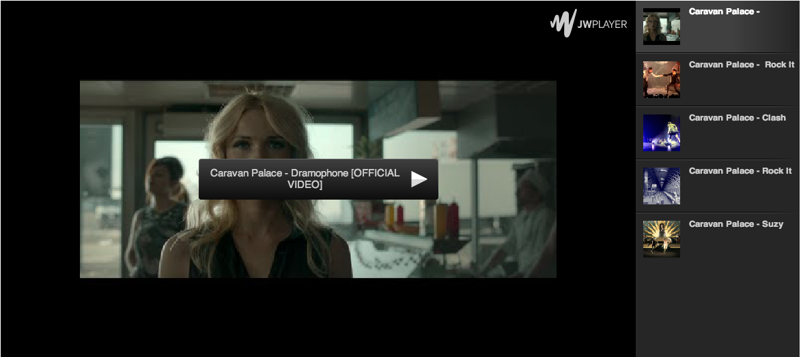

4.  Create the following table structure using HTML and CSS following
    the style as closely as possible noting table border, colors, etc.  
    Make the table cover the entire width of the screen.   
    Insert dummy text values for the table.  
    

5.  Find a table used in a real Web page whose table body can be
    scrolled. 

6.  Create a simple hover to highlight table that makes the background
    color of a row 'yellow' when you hover over a table row.

<h3 id="ch5-3">5.3.1 The &lt;audio&gt; element</h3>

audio and video are new HTML 5 elements that were highly anticipated.
With HTML5 support for multimedia, this has become much easier, than
previous methods. 

<h3>The &lt;audio&gt; tag</h3>

You can use the \<audio\> tag to embed audio in your page.

```
1.  <audio src="sounds/flute.mp3">
2.    Your browser does not support the audio file.
3.  </audio>
```

Any text within the \<audio\> tags will be displayed if the browser does
not support the audio element. You should add such a message to provide
better user experience for your page as it will be viewed in all types
of devices and browsers. 

The audio element has several attributes that can be used to configure
audio playback. The following table lists the audio element's
attributes:

<!------------------------------------------------------------------------------------------------>
<!-------------------------------- 105. table src and type (252) --------------------------------->
<!------------------------------------------------------------------------------------------------>
<p align="center" width="100%">

</p>

If you hit play and didn't hear anything, remember that we have added
the muted attribute. So the audio will be muted when playback begins.
Increase the volume to hear the music. 

<h3>Audio file formats</h3>

Just like image file formats, not all audio file formats are supported
by all browsers. You will want to use common audio file formats for
browser compatibility ensuring the highest probability that your audio
file will play. 

The most common ones are MP3, WAV and Ogg. 

[This
page](https://developer.mozilla.org/en-US/docs/Web/HTML/Supported_media_formats) under
'Browser Compatibility' lists the audio formats supported by
the audio element and their browser support.

Here is some information regarding different types of audio formats and
their compression techniques that can help you decide which audio format
to choose apart from audio element and browser compatibility:

-   There are three major groups of audio file formats - uncompressed
    (eg: WAV), lossless compressed (eg: MPEG-4, WMA Lossless) and lossy
    compressed (eg: Opus, MPC, AAC, WMA Lossy). 

-   In uncompressed audio file formats, no compression is applied to the
    audio file. The memory used for both sound and silence is the same
    though silence contains less information/data.

-   In lossless compression, no data is lost but the file is compressed
    as silence is designed to take up very little space. Compared to
    uncompressed, lossless compression's compression ratio
    is approximately 2:1.

-   Lossy compression provides the greatest compression by simplifying
    the data and removing some audio information resulting in some loss
    of quality. It is also the most popular. There are techniques in
    place to ensure that the parts of sound that is lost has little
    effect on quality. You can also select a range of compression rates.
    The larger the rate of compression, the bigger the loss in quality
    and smaller the file size. 

-   The audio format Ogg Opus has two parts to it. 'Ogg' is a digital
    container format. It is a specification that describes how different
    elements of data and metadata work in an audio file. However, it
    provides no information on how the data is compressed. So a program
    that opens a container file like 'Ogg' might not know how to decode
    it. 'Opus', the second part of the audio format, represents the
    encoding or decoding mechanism for that stream of audio. Opus is a
    lossy audio coding format.

-   If you have an audio file in one format and wish to convert it to
    another, there are a lot of software applications available to help
    you do that. 

### Source element for multiple source files

The source element, also new in HTML5, serves the same purpose as
the src attribute in an audio element. It is used to specify source
files for the audio and video elements. Using the source element, you
can specify multiple source files. The \<source\> tag is self-closing,
therefore, it does not require a closing tag.

### Example:

1.  \<audio controls\>

2.    \<source src="https://courses.edx.org/asset-v1:W3Cx+HTML5.0x+3T2016+type@asset+block@splash.wav" type="audio/wav"\>

3.    \<source src="https://courses.edx.org/asset-v1:W3Cx+HTML5.0x+3T2016+type@asset+block@splash.mp3" type="audio/mpeg"\>

4.    Your browser does not support the audio element.

5.  \</audio\>

### Output for code above (try playing):

The advantage of providing multiple source files in different formats is
that if the browser doesn't support the first format, it will try the
second source file. The browser can select from the list based on its
file format or codec support. In the code snippet example
above, Internet Explorer does not support .wav files. So if you tried to
play the file above in Internet Explorer, the browser would have tried
to play .wav, failed and played the .mp3 version instead. 

The following table lists the \<source\> element's attributes:

<!------------------------------------------------------------------------------------------------>
<!----------------------------------- 107.  (###) -------------------------------------->
<!------------------------------------------------------------------------------------------------>


<h3>5.3.2 The \<video\> Element</h3>

You can use the video element to embed video in your page. You can
specify the location of your video file using the src attribute
or source element (for multiple source files). 

1.  \<video src="multimedia/running.mp4"\>

2.    Your browser does not support the HTML5 video element.

3.  \</video\>

Any text within the \<video\> tags will be displayed if the browser does
not support the video element. You should add such a message to provide
better user experience for your page as it will be viewed in all types
of devices and browsers. 

Similar to the audio element, the video element has several attributes
that can be used to configure playback. The following table lists
the video element's attributes:

<!------------------------------------------------------------------------------------------------>
<!---------------------- 106. table of attributes (description & usage) (253) -------------------->
<!------------------------------------------------------------------------------------------------>
<p align="center" width="100%">

</p>


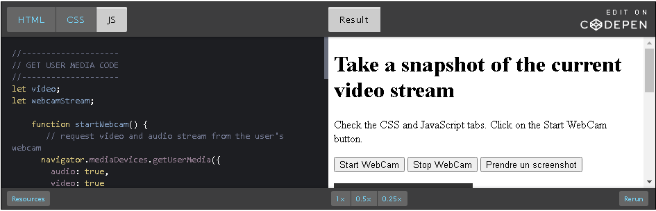


<h3>Poster attribute</h3>

The \<video\> tag has an important attribute that you don't find on
the audio element.  The poster attribute is used to specify what picture
is shown before the video starts playing.  By default, the poster shown
is simply the first frame of the video, but the poster attribute can be
used to specify a different image.  It can specify a particular frame of
the video or, like a real movie poster, it can be an image that doesn't
actually appear in the video. 

<h3>Video file formats</h3>

Just like audio file formats, not all video file formats are supported
by all browsers. You should use common video file formats for browser
compatibility ensuring the highest probability that your video file will
play. 

The most common ones are MP4, WebM and Ogg. 

[This
page](https://developer.mozilla.org/en-US/docs/Web/HTML/Supported_media_formats) under
'Browser Compatibility' lists the video formats supported by
the video element and their browser support for both desktop and mobile.
Using the source element, you will have to provide a combination of
video formats to target most browsers. 

Here is some information regarding different types of video formats and
their compression techniques that can help you decide which video format
to choose apart from video element and browser compatibility:

-   Most videos go through some form of compression to reduce redundancy
    in video files and make them smaller, allowing them to download
    faster. Most also use audio compression techniques to compress sound
    in video files. 

-   Like audio, there are three major groups of video file formats -
    uncompressed, lossless compressed ([list of lossless video
    compression
    formats](https://en.wikipedia.org/wiki/List_of_codecs#Lossless_video_compression))
    and lossy compressed ([list of lossy video compression
    formats](https://en.wikipedia.org/wiki/List_of_codecs#Lossy_compression_2)). 

-   In uncompressed video file formats, no compression is applied to the
    video file. 

-   In lossless compression, no data is lost. If you were to uncompress
    a file compressed using the lossless technique, you will get back
    the exact same data you started with.

-   Most videos use lossy compression as it results in significantly
    smaller video files. Lossy compression provides compression by
    simplifying the data and removing video information resulting in
    some loss of quality. There are techniques in place to ensure that
    the parts of the video that are lost have little effect on quality.
    You can also select a range of compression rates. The larger the
    rate of compression, the bigger the loss in quality and smaller the
    file size. However, if you uncompress a video file that was
    compressed using the lossy technique, you will not be able to
    retrieve the same data you put in. With text or spreadsheets, loss
    of data might be a significant problem. However, with images and
    video losing a bit of quality is not going to affect the file
    because you can still make out what the video is about. 

-   The video format 'H.264 and MP3 in MP4' has three parts to it. H.264
    is a video compression standard. MP3 is an audio coding format that
    uses lossy compression for sound in the video. MP4, like Ogg, is a
    digital container format. It stores audio and video data rather than
    code the information. A program that opens a container file like MP4
    might not know how to decode it. So it requires other standards like
    H.264 and MP3 to dictate how the video will be coded and possibly
    compressed.

-   If you have a video file in one format and wish to convert it to
    another, there are a lot of software applications available to help
    you do that. 

<h2>5.3.3 Video – Source and Track Elements</h2>

The source element that we saw in the previous unit is also used to
specify multiple source files for the video element. The \<source\> tag
is self-closing and so does not require a closing tag.

1.  \<video controls height="320" width="240"\>
2.   
    \<source src="http://techslides.com/demos/sample-videos/small.mp4" type="video/mp4"\>
3.   
    \<source src="http://techslides.com/demos/sample-videos/small.webm" type="video/webm"\>
4.   
    \<source src="http://techslides.com/demos/sample-videos/small.ogv" type="video/ogg"\>
5.    Your browser does not support the HTML5 video element.
6.  \</video\>

The advantage of providing multiple source files in different formats is
that if the browser doesn't support the first format, it will try the
second source file. The browser can select from the list based on its
file format or codec support. There is no one format that is supported
by all browsers. So you will have to use the source element to list
a combination of formats. 

The following table lists the source element's attributes:
<!------------------------------------------------------------------------------------------------>
<!-------------------------------- 109. table src and type (256) --------------------------------->
<!------------------------------------------------------------------------------------------------>
<p align="center" width="100%">

</p>

<h3>Track element for captions and subtitles</h3>

The \<video\> element is very similar to the HTML5 \<audio\> element
except for one addition - the \<track\> element. The \<track\> element
is used to add timed text like subtitles, captions or any text you would
like to display to the user when the video is playing. 

-   Web Video Text Tracks (WebVTT) files are the standard to include
    subtitles or captions. You can learn [how to create them
    here](https://w3c.github.io/webvtt/).

-   Captions and subtitles are not the same. Subtitles are meant to
    translate the language (for those who do not understand the language
    being spoken in the video). Captions are meant for the deaf or
    people who have difficulty hearing. It includes sound effects and
    other significant audio like music and lyrics and is usually in the
    same language as the audio. Read more about their
    difference [here](https://www.alsintl.com/blog/subtitles-captions-difference/). 

-   Like the \<source\> tag, you can add multiple \<track\> tags in your
    video element to add multiple subtitle/caption tracks. This is
    commonly done when providing them in different languages. 

The \<track\> tag is self-closing and so does not require a closing tag.
You specify the \<track\> element as a child element of
your \<video\> tag like this:

1.  \<video width="320" height="240" controls\>

2.    \<source src="module.mp4" type="video/mp4"\>

3.   
    \<track src="module-captions.vtt" kind="captions" srclang="en" label="English" default\>

4.    Your browser does not support the HTML5 video element.

5.  \</video\>

The following table lists the \<track\> element's attributes:

<!------------------------------------------------------------------------------------------------>
<!----------------------------------- 112.  (###) -------------------------------------->
<!------------------------------------------------------------------------------------------------>
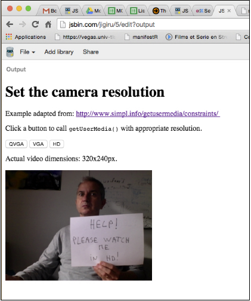

<h3>5.3.4 Audio and Video Elements</h3>

<h3 id="ch5-4">5.4.1 The iframes tag (OPTIONAL)</h3>

***Note:** This section is optional material included for the curious.
It will not appear on any graded question.*

There are tags for all kinds of content in your Web page, text, images,
videos, animations.  There's even a tag that allows you to put another
Web page in your Web page - the \<iframe\> tag (*HTML Inline Frame
Element*).  Why would you want to do this?  Well, it enables a lot of
possibilities.

The popular online code editor [CodePen](https://codepen.io/) has
several iframes in it to display html, css, javascript and output
together. Iframes are generally used in Web pages to show external
content/resources. The type of content is not limited to other Web
pages. You can add YouTube videos or display a PDF file (some browsers
will display the file inline while some older browsers will try to
download it instead). 

An \<iframe\> tag can be as simple as this:
```
1.  \<p\>This is a parent page that will host the iframe.\</p\>
2.  \<iframe src="https://www.w3.org/"\>
3.    \<p\>Your browser does not support iframes.\</p\>
4.  \</iframe\>
```
<!------------------------------------------------------------------------------------------------>
<!----------------------------------- 113.  (###) -------------------------------------->
<!------------------------------------------------------------------------------------------------>
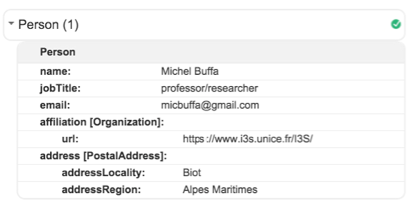

### \<!DOCTYPE html\>

```
> \<html lang="en"\>
>
> \<head\>
>
> \<meta charset="UTF-8"\>
>
> \<title\>The iframes tag\</title\>
>
> \</head\>
>
> \<body\>
>
> \<p\>This is a parent page that will host the iframe.\</p\>
>
> \<iframe src="https://www.w3.org/"\>
>
> \</iframe\>
>
> \</body\>
>
> \</html\>
```

Because iframes are HTML elements, they can be styled just like other
elements, with borders, margins, sizes specified with CSS rules:

<!------------------------------------------------------------------------------------------------>
<!----------------------------------- 114.  (###) -------------------------------------->
<!------------------------------------------------------------------------------------------------>


Here, we've embedded a YouTube video with an iframe like this:
```
1.  <iframe src="https://www.youtube.com/embed/YE7VzlLtp-4"></iframe>
```
And we've added styling like this to get the border and drop-shadow:
```

1.  iframe {
2.    border: 10px solid red;
3.    padding: .5rem;
4.    margin: 1rem;
5.    box-shadow: 20px 20px 10px \#888888;
6.    width: 355;
7.    height: 200;
8.  }
```
There is one significant problem with iframes. Suppose you create your
Web page, containing only an iframe with src="http://foo.com", with no
borders, padding or margin. By all appearances, you would seem to be on
the Web site foo.com. If you don't look at the URL, it might be
difficult to tell. For reasons like this, some Web sites disallow their
inclusion, so if you create an iframe with src="https://google.com",
you'll get a blank frame and an error message in the console.  This
isn't a bug, it's a feature.

There are a number of important attributes for an \<iframe\> tag, but
for now we'll just look at a few of them:

<!------------------------------------------------------------------------------------------------>
<!----------------------------------- 115.  (###) -------------------------------------->
<!------------------------------------------------------------------------------------------------>


**Notes:**

1.  Certain Web sites like Google and Yahoo disallow embedding their Web
    pages in iframes. So you will not be able to use these pages in an
    iframe. 

2.  Not all attributes are supported in all browsers. You are
    encouraged to explore their browser support before adding to your
    HTML.

3.  You can find more details about iframes from the [W3C
    Specification](https://www.w3.org/TR/html5/embedded-content-0.html#the-iframe-element).

Iframes can be very useful:

-   Iframes load separately from the main page. However, they do block
    the main page's load command until its content finishes loading. You
    can avoid this by applying some Javascript. This allows them to load
    independently. Then, if the embedded page you are displaying loads
    slower, you can use your parent page to keep the reader occupied.

-   Sandboxing provides security.

-   Great for third party content like ads.

-   It is convenient to use if you need to have one part of your page
    static while the other is changed - i.e. navigation menus. Helps
    reduce bandwidth and server load because we can avoid loading the
    same content every time a new page is visited in your webpage. 

However, there can be some disadvantages:

-   It is easy to misuse them. It should be considered a piece of
    content in the webpage and not as an integral part of it. 

-   Accessibility of iframes is poor. Screenreaders do not process them
    well but you can proceed to use iframes with a notice for the
    reader. 

-   You have no control over the content in an iframe if you display
    external content. That content can change anytime or can upload
    malicious content without your permission. 

-   Search engines have trouble accessing and in turn indexing the
    content in your iframes. This doesn't help your search ranking. 

<h3>5.4.2 The ismap and usemap attributes (OPTIONAL)</h3>

***Note:** This section is optional material included for the curious.
It will not appear on any graded question.*

**Important:** The attributes we will see in this unit
- ismap and usemap are **image attributes**. Since they use
the \<link\> tag, having learned hyperlinks, now would be a good time to
explore them. Be sure to watch the video at the end of this unit. 

Adding the ismap or usemap attributes to the \ tag means that the
picture is an image with clickable areas. Imagine a picture of a world
map where different countries on the map can be clicked and it navigates
to another page like the country's wikipedia page. Simply put, we say
such an image is mapped. [Here is an
example](http://html.cita.illinois.edu/text/map/map-example.php) of an
image-map.

### The 'ismap' attribute
```
1.  
```
ismap is a **boolean attribute** i.e. its value is either true or false.
Thus, just the presence of the attribute indicates that it is a mapped
image. To be more precise, we say it is a server-side image-map.

An \ tag with the src  and ismap attributes creates an image with
the image source file and indicates it is a server-side image-map. How
will your code know that if you click on a part of your image, i.e.
'Australia in a world map', it should navigate to the country's
Wikipedia page? We need to create a map file with these details and then
add the location of this map file using the anchor element. Here is a
code sample:
```
1.  <a href="/ismap-image/ismap.cgi" target="_self">
2.     
3.  </a>
```
Here, the href attribute points to the location of the map file.
The target attribute indicates where the page it navigates to should
open. '\_self' will open in the same page whereas '\_blank' will open it
in a new tab or window. 

ismap only works if the \ tag is used within the anchor element
like in the code above. This is important because without a link to the
target map file, it has no idea what to do with
your ismap specification.

Let's look at how the code above works.

<!------------------------------------------------------------------------------------------------>
<!----------------------------------- 116.  (###) -------------------------------------->
<!------------------------------------------------------------------------------------------------>


Let's go back to our world map example where clicking on different parts
of the image will take you to a page about the country you clicked on.
The map file '/ismap-image/ismap.cgi' defines target areas. We can
define the image in terms of coordinates. When a user clicks on a part
of the image, we can calculate the exact 'x' and 'y' coordinates of the
image that was clicked. When the user clicks, the browser will consult
with the map file on the server (specified in the anchor tag), by
sending these mouse click coordinates to the server. Based on these
coordinates, the map file will return the Web page it should navigate
to, to the browser. 

Read more about image maps [on
wikipedia](https://en.wikipedia.org/wiki/Image_map). You might be
inclined to assume an image map will only be used for an actual
map. However, there are a lot more use cases for it. The [Atlas
Magazine](http://www.atlasmagazine.com/win98r.html) is a good example.

Try this: Navigate to the [Atlas
magazine](http://www.atlasmagazine.com/win98r.html) and explore the
header image with a 'laughing budha' like image. The image acts as a
site navigator. Clicking on different parts of the image will bring you
to different parts of the Web page. You can use image maps in many
creative ways. 

### The 'usemap' attribute

usemap is a lot like ismap and is more widely used. ismap deals with
server-side image-maps whereas usemap deals with client-side
image-maps. 

-   \>Server-side image-maps: use separate map files that have to be
    downloaded. They depend on the server for translating the request.
    They also create additional network traffic. 

-   Client-side image-maps: reside within an HTML document. The browser
    takes care of the translation (translating mouse coordinates clicked
    to corresponding Web pages). 

Client-side maps are becoming increasingly popular. usemap is NOT of
type boolean. It takes in the name of the map with a '#' character
preceding it.
```
1.  
```
Like ismap, usemap cannot be used by itself. In ismap, we used the
anchor tag to specify the map file. In usemap, we use
the **\<area\>** element as a child of **\<map\>** element to specify
the coordinates and the page it should navigate to. The usemap value
should match the map element's name or id attribute. 
```
1.  
2.  <map name="**navigatormap**">
3.    <area shape="rect" coords="0,0,195,439" href="https://en.wikipedia.org/wiki/Millery" alt="Millery">
4.    <area shape="rect" coords="196,0,390,439" href="https://en.wikipedia.org/wiki/Nomeny" alt="Nomeny">
5.  </map>
```
**\<map\>** - defines a client-side image map and is used to create a
relationship between the image and the map by matching the map name and
usemap's value. It contains a set of area elements.

**\<area\>** - defines the areas that can be clicked and the pages it
should navigate to. Typically takes the shape of the area, coordinates
of the area, URL of the page it should redirect to and the alt attribute
(short description). 

The shape attribute in the \<area\> tag has four values:

-   circle - The clickable area is a circle. You need to
    specify three coordinates. E.g. coords="89,52,6". The first two is
    the coordinate center of the circle and the last is the radius.

-   rect - The clickable area is a rectangle. You need to
    specify four coordinates. E.g. coords="0,0,195,439". This is the x &
    y coordinates of the top left corner and the x & y coordinates of
    the bottom right corner. 

-   poly - The clickable area is a polygon of any number of sides. This
    shape is very flexible and takes as many pairs of coordinates as you
    need to form your polygon.
     E.g. coords="277,85,322,87,275,173,269,138". The last set of
    coordinates can match the first set. If it doesn't, the browser will
    automatically match it for you to close the polygon. 

-   default - The clickable area is the whole image. 

Read more about the [area tag
here](https://www.w3.org/wiki/HTML/Elements/area).

Here is a working example of usemap. 
```
1.  
2.  <map name="**navigatormap**">
3.    <area shape="rect" coords="0,0,195,439" href="https://en.wikipedia.org/wiki/Millery" alt="Millery">
4.    <area shape="rect" coords="196,0,390,439" href="https://en.wikipedia.org/wiki/Nomeny" alt="Nomeny">
5.  </map>
```
Result:

Try this: Click on the left and right side of the images to check out
how usemap works :) Remember to navigate back to the course!

<!------------------------------------------------------------------------------------------------>
<!----------------------------------- 117.  (###) -------------------------------------->
<!------------------------------------------------------------------------------------------------>
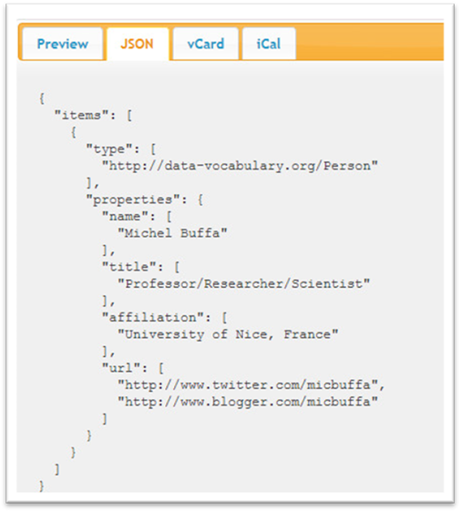

Note: If the \ is inside an \<a\> or \<button\> element, clicking
on it will be interpreted as clicking on the link or button and usemap
will not work.

<h3>5.4.3 Activities - Embedding content (OPTIONAL)</h3>

1.  How can you inform screen readers that you are using an iframe in
    your Web page since iframes have poor accessibility?

2.  Try the following code in your HTML editor:

    1.  \<iframe src="http://facebook.com"\>

    2.  \<p\>Your browser does not support iframes.\</p\>

    3.  \</iframe\>

What happens? Why does it behave the way it does?

<h3 id="ch5-5">5.5.1 Decorative images and backgrounds</h3>

As we saw earlier, the \ tag is meant to be used for semantically
important imagery.  For example, the pictures that accompany a news
story are important to understanding the news story and therefore should
be displayed with the \ tag.  The example of the cool banner with
teletypes and coffee was meant to evoke competence and urgency, however,
that image is **not** essential to understanding the news story. That
image is decorative.

Decorative images are incorporated via CSS.

There are quite a few CSS properties for controlling borders, background
images and colors. Let's look at the most common. Take notice that as
you leverage borders and backgrounds that you will begin to see the
underside of the Web. How big is the area around a link? You might have
never thought about it before, now it'll be visible. Can we make it
larger or smaller? Are these items butted against each other? Can
we space them out, or bring them closer? We will touch on these things
as well.

Let's look at the most common CSS
properties: background-color, background-image, background-repeat, background-size,
and background-position.

background-color

The background-color CSS property will fill the rectangle of the given
element with a solid background color. In addition to the values
of transparent and none, there are all the values of  that we saw
applicable to the color property. 

In the example below we apply a variety of background colors to a
hyperlink (\<a\>), paragraph (\<p\>), unordered list (\<ul\>) and list
items (\<li\>):


### background-image

The background-image property is used to set an external image file as
the background to a particular HTML element.  To bind in an external
file, the value is url, followed by an open parenthesis (, followed by a
quote ", then the path, a closing quote " and a closing parentheses ).
 The path can be a URL, or a path relative from the file the CSS is in. 

div { background-image: url("https://www.w3.org/2008/site/images/logo-w3c-mobile-lg");
}  
div { background-image: url("images/kitten.png"); }

As these are decorative images, there are quite a few different usage
scenarios that can leverage background images. For instance, an image
can be used as repeating tile, or a background image can fit its parent
element, or be a large panoramic image not fully viewed.  These
scenarios can be constructed with other CSS properties,
like background-repeat, background-size, and background-attach (as well
as several others). 


background-repeat

By default, if the rectangular area of an element is bigger than the
image itself, then the image will repeat and fill the space, like tiles.
 For example:


The background-repeat property can be used to control this.  It's more
commonly used values are: repeat, repeat-x, repeat-y, and **no-repeat**.
The no-repeat value is very useful, and bears repeating.

There are advanced uses of this property.  Notice in the above example,
that if the size of the parent element is not exactly a multiple of the
tile, then the image may be "cropped" and bleed off the side.  That can
be managed by centering the tile
(with background-position: center;).  Additionally
the background-repeat property can also be used to control *how* it
repeats. The space value will result in cropped images; it means
"repeat, and add space between the elements so there is no cropping".
 Note that this property does not let you directly manipulate the amount
of spacing. That is calculated for you.


### background-size

When *not* repeating, it is very useful to size a background image to
fit its element.  The background-size can be used for this.  There are
two very useful values:  contain and cover.   The contain value will put
the entire image into the space of the element, however, the space of
the element may not be completely filled if the aspect ratio of the
element and the image do not match.  The cover value is the opposite. It
will completely fill the element but the image may be cropped off two
opposite sides.  Neither contain or cover will distort or squish the
image.  Its aspect ratio is maintained.

Here we demonstrate the difference. A border has been applied to the
paragraph to clearly show the bounds of the parent \<p\> element.


The background-size property can also be used to more exactly size the
image.  When used in this fashion, it takes *two* values separated by a
space. The first governs the width, the second the height.  Examples:

.kittens  { background-size: 100px 120px; } /\* might distort \*/  
.puppies  { background-size: 100px auto; }  /\* auto preserves aspect
ratio, no distorting \*/  
.munchies { background-size: 50% auto; }    /\* % is of percentage of
parent (not of image). \*/

 The px and % units were covered in the units section. Note that other
units (rem, vh, etc.) have no guarantee of support.  

When specifying exact sizes, the auto value is extremely useful. It
allows you to worry only about one dimension, and then the other will
handle it for you. Otherwise there is a risk of stretching/distorting
images. 


### background-position

Like background-size, background-position can be used to place or offset
a background image in the element. It takes two values (x and y)
separated by a space when used to exactly specify a position. 

The most useful is the center value.  It is position the center of the
image in the center of the element. This is useful even with repeating
tiles. 


<h3>5.5.2 Decorative borders and shadows</h3>

In the previous sub-section, we looked at decorative backgrounds and
images. We will continue this theme by examining decorative borders and
shadows.  Like background colors, once we start using borders we will be
directly facing the underpinnings of HTML. Where does a span inside a
paragraph begin and end? How far does it extend? We'll see how the
various techniques for managing decorative CSS in the following
sub-section.

For now, let's look at these new
properties: border-style, border-color, border-width, border
abbreviations, border-radius and text-shadow.

### border-style

p { border-style: solid; }

This property sets the style of a border.  Possible values
include none, hidden, solid, dotted, dashed, double, groove, ridge, inset, and outset.
Here the visible border styles displayed on a gray border:

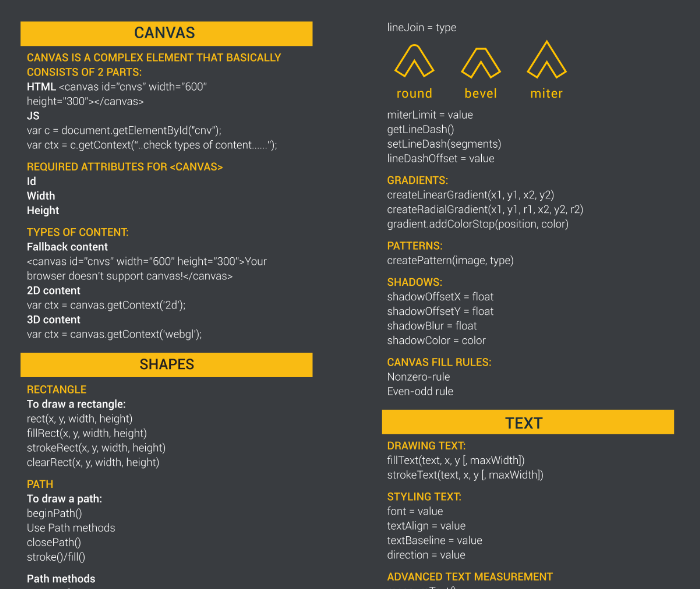

Note that the groove, ridge, inset and outset borders all use black in
addition to any explicit border-color.  So if the border-color is also
black they won't be effective.  Also double, groove and ridge are
usually not satisfactory on thin borders.  They'll require a
fat border-width.

The difference between none and hidden has to do with the sizing and
positioning of the element. An item with a hidden border is positioned
as if it had a border, but the border is not drawn. Whereas
with border-style of none, no space is allocated for the border at all. 

### border-color

Sets the color of the border.  

### border-width

Sets the width of the border.  Supports a variety of units (px, em, rem
).  

### border abbreviations

All border styles just introduced are actually abbreviations that can be
broken out if needed. For example, here we set four different styles for
a border:  

p {  
   border-left-style: solid;  
   border-right-style: dotted;  
   border-bottom-style: dashed;  
   border-left-style: hidden;  
 }

This same thing can be done
with border-width and border-color ( border-left-color, border-top-width,
etc).

Or, going in the other direction, the CSS property border can help
abbreviate even further.  Use the formula  border: \<width\> \<style\>
\<color\>;   separating the values with spaces: 

p { border: 1px solid gray; }

### border-radius

Sometimes it seems that the whole of the World Wide Web consists of
round cornered rectangles.  Join the fun by using
the border-radius property:  


Note this is fun to use with a background color or background image and
no border at all:

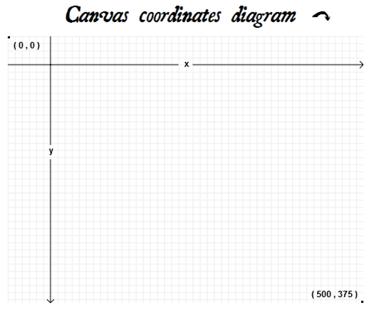

### box-shadow

A shadow effect can be applied to the outlining rectangle of an element
with the box-shadow CSS property.  The box-shadow property is typically
controlled with four values separated by spaces:

box-shadow: \<x-offset\> \<y-offset\> \<blur\> \<color\>;

The offset values are dimension units (px, em, etc) can be positive or
negative. Positive x values place the shadow to the right, and negative
values place the shadow to the left. Similarly positive y values place
the shadow vertically lower than the element and negative values move it
up.

The blur value is also a dimension unit, but can only be 0 or positive.

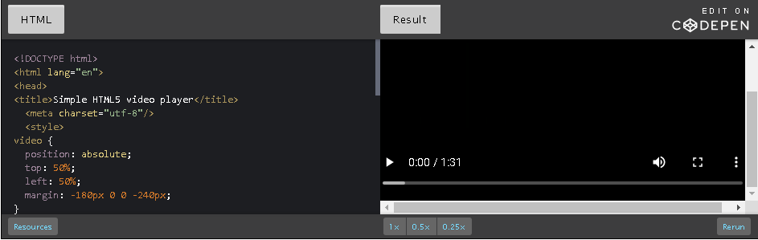

### text-shadow

This CSS property takes the same values as box-shadow, however, the
shadow is applied directly to the text shapes:

text-shadow:  \<x-offset\> \<y-offset\> \<blur\> \<color\>;


<h3 id="ch5-5-3">5.5.3 Managing element size</h3>

As you start to leverage borders, background colors, and the other
decorative CSS properties we have seen in the previous sections you will
need to become more aware of the element size and how to manage it.

The wrong way

A common trap that newbies fall into is to discover
the width, height, left and top CSS properties and to start blindly
using them.

These are useful properties, however, they should **not** be your first
choice.  These CSS properties depend upon *other* properties before they
can even be used, and they can have unintended consequences. We'll
explore them more in next module when covering Layout.  

Here is a simple example of a common error:

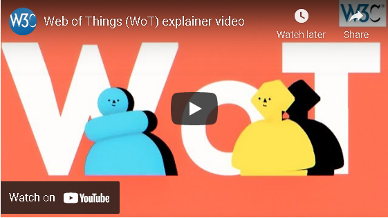

### Padding - The right way

The best way to control an element's size for the purpose of controlling
how a border or background extends relative to the item itself is with
the padding properties.

Padding is a way of making an element a little bigger than it would
normally be.  Similar to margin, there are four padding properties.  The
values are dimension units that can be 0 or a positive value; negative
values are not allowed.

padding-top: 0;

padding-right: 1em;

padding-bottom: 10px;

padding-left: 12px;

Similar to margin, this can be abbreviated with the padding property.

padding: \<top\> \<right\> \<bottom\> \<left\>;

padding: \<top and bottom\> \<right and left\>;

padding: \<all\>;

When decorative CSS is not used by many CSS newbies, use padding like
margin, to space things out. Note: That is not correct. Margins make
space between elements and padding makes an element larger.

In this example, note that the use of padding does not make the text
deviate from the baseline.  In addition, note that in the first
paragraph we apply the same padding to all four sides. However, in the
second paragraph we use different padding for different sides, thus
placing the rectangle of the element relative to the text itself.


I'm confused - are you saying that I shouldn't use the width property to
change the width?

Essentially yes. Let's qualify that a bit so there is no confusion.

This section has been about the decorative CSS properties, like borders,
background colors, background images, and shadows. In the context of
these things users often want to make an element "bigger", or keep the
border a bit away. And in this context the padding property is
absolutely the correct property that should be used to increase the
elements size.  Do not use the width or height properties for this.

Furthermore, there are other issues associated with
the width and height properties. We will discuss these in-depth in the
next module. Here is a quick rundown:

-   height and width properties do not work on inline elements.

-   Many elements have natural behaviors that occur when height and
    width are **not** set. These are generally advantageous. However, by
    setting the width and height you **lose** those advantages. We'll
    understand this in next module.

-   Most Web pages are viewed in a variety of browser sizes, especially
    on mobile devices like phones or tablets. Overuse of explicit width
    and height can make your page unviewable on smaller devices.

-   The flexbox layout system (which we will see next) is incredibly
    powerful, but by over-determining explicit heights and widths you
    reduce its usefulness to you and your viewer.

<h3 id="ch5-5-5">5.5.5 Pseudo classes and cursor (OPTIONAL)</h3>

<h4>Refined CSS selectors - pseudo classes</h4>

If you have a page with some links on it, and you look at them
carefully, you may notice that some of the links that you've visited
before are a different color than those you haven't (purple versus blue,
typically). Plus, if the mouse is brought over a link, it may change
color again, or highlight in some other way. In addition, if you click
down and don't let the mouse down, then maybe the link may change yet
again. Lastly, if you visit some other sites and make these same
explorations, you may observe visual differences from site to site. You
may conclude that the styling of the elements are being changed, and you
will be right. How did the author of the style sheet know which links
you've been to already?

"Pseudo Classes" is a fancy term for simply being able to refine our CSS
selection to something that isn't just another element. Pseudo Classes
allow us to apply styles to the different states of an element. Or to
various children of an element based on their index, or to other
interactions with the browser. Best of all, pseudo classes are easy to
use.

a:visited { color: purple; }

Above us we see a tag selector (a) followed by a pseudo class, which
consists of a colon and a word (e.g. :visited ). This particular CSS
rule will be applied to any \<a\> tag that the user has already visited.
There can be no spaces on either side of the colon. Pseudo classes can
be amended onto *any* CSS selector, not just tag selectors.

A full list of pseudo classes can be
found [here](https://developer.mozilla.org/en-US/docs/Web/CSS/Pseudo-classes). Let's
look at some of the most common ones.

:visited

a:visited { color: purple; }

The :visited pseudo class is usually put on a selector that resolves to
an \<a\> tag. It enables you to define a style for the visited state of
the link. For example, if the user has already been to that Web site,
the :visited style will be applied.

:hover / :active

li:hover  { background-color: red; }  
li:active { background-color: green; }

The :hover pseudo class lets you change the style for an element when
the mouse is hovering above it.  The :active pseudo class is applied
when the mouse is depressed into its area.  Note that the mouse is
rarely hovering or clicking over/into "just one" item. At any given
moment, the mouse is usually over several elements, because if it is
over a child element, it will be over the parent, grandparent, and great
grandparent.  Therefore, if you have two different style rules, such
as li:hover and ul:hover, then they will *both* be activated,  when the
mouse is over one of the list items.  

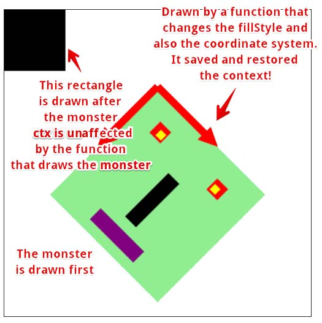

:nth-child

tr:nth-child(odd)  { background-color: lightgray; }  
tr:nth-child(even) { background-color: white; }

The :nth-child pseudo class is very handy.  Unlike the pseudo classes
we've seen so far, it expects a parameter. The pseudo class always ends
with a pair of parentheses with an expression inside.  This expression
is simply the term odd or even, however, there are other more advanced
possibilities with mathematical equations containing the term  n.

This selector is most commonly used to apply "transaction ledger" styles
to tables or lists.

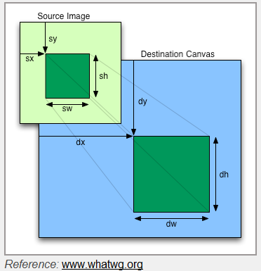

<h4>Cursor property</h4>
```html5
li { cursor: pointer; }
```
Since we've broached the topic of mouse-responding pseudo classes, it
makes sense to also cover the cursor CSS property.

The cursor CSS property lets you change the cursor that is displayed
when the mouse is over the element in question.  This does not have to
be relegated to a :hover style, it can be applied anywhere. Though, if
you want to change the cursor when an element is depressed,  set
the cursor property in the context of an :active style. 

There are many possible values for the cursor property.  Their exact
representation may vary slightly from browser to browser.  Common values
include: default, pointer, text, move and grab.  (Hover over each value
to see). In addition, some browsers support a custom image as
well  ( cursor: url("images/my_pointer.png"); ).

For more information, please visit the [MDN page on
cursor](https://developer.mozilla.org/en-US/docs/Web/CSS/cursor).

<h3 id="ch5-5-6">5.5.6 CSS best practices (OPTIONAL)</h3>

You will find below an excerpt of CSS best practices (see the [full
slide
set](https://fantasai.inkedblade.net/style/talks/best-practices/#title#title))
that were written by  Elika J. Etemad (also known
as [fantasai](https://fantasai.inkedblade.net/)). Elika is an expert on
the [W3C CSS Working Group](https://www.w3.org/Style/CSS/) (since 2004!)
and a longtime contributor to the Mozilla Project. In addition to
editing many of the CSS3 specifications, she’s worked on layout engine
testing and development for Gecko and managing the CSS test suites at
W3C.

<h4>Executive summary</h4>

-   **Logical source order:**  
    The order of the HTML content should make sense even without the
    CSS: for accessibility, mobile optimization, device adaptability,
    and long-term maintainability.

-   **Liquid layouts and relativity:**  
    Use smart relative sizing: to optimize layouts while minimizing
    media query code forks.

-   **Media queries:**  
    Adapt to screen size changes; get font size adaptation free by
    using ems.

-   **Prevent zombie code:**  
    Dead code may come alive as CSS changes. Delete it before it does,
    and ruins your layout.

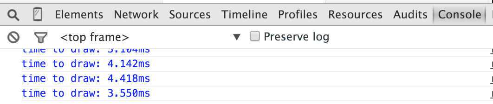
```
<b>Test in multiple browsers:</b>
Your favorite browser is not always right.
<ul>
<li><b>Don't use proprietary features!</b><br/>
    Keep the Web open to everyone! Don't rely on the latest -WebKit-
    invention.</li><br/>
<li><b>Turn off CSS:</b><br/>&nbsp;
    A well-coded page will be understandable without it.</li>
</ul>

<h4>Foundations</h4>

-   Indent your code for readability ease

-   Learn how to code CSS before relying on frameworks (such as
    Bootstrap, etc.)

-   <b>Separate content and style</b>

    -   Use semantic markup, ie., "classes for meaning, not for show".  
        The following article is helpful to understand this
        concept: [Meaningful CSS: Style Like You Mean
        It](https://alistapart.com/article/meaningful-css-style-like-you-mean-it/) (Tim
        Baxter, May 2016 - A list apart).

    -   Use \<table\> for tabular data: don't use tables for layout, but
        if your content is tabular like a catalog, a calendar, or a
        price list, then the table element is the correct markup.

-   **Linearized logical source order  
    **The order of the HTML content should make sense even without the
    CSS.  
    Benefits are numerous as it *works best*:

    -   for long-term site maintainability

    -   for mobile

    -   for accessibility

    -   as a foundation for device adaptation (media queries)

-   **Linguistic variations**: set the language correctly for better
    typography (see the section entitled "Why Internationalization is
    important").

<h4>Testing</h4>

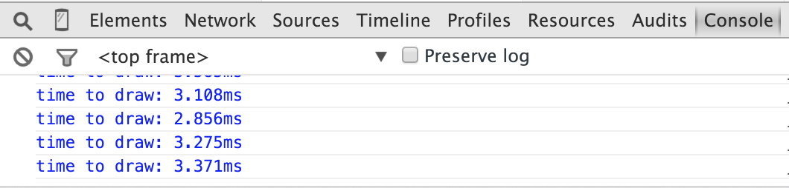

-   **Test without CSS**: turn off CSS, and if the page makes no sense,
    fix your markup.

-   **Test in multiple environments**:

    -   Resize the window

    -   Zoom the text

    -   Try a mobile browser

    -   Navigate by keyboard

-   **Test in multiple browsers**: remember that just testing in Chrome
    does not work for everyone!  ;)

### Adaptability

-   **Media queries**: set media query breakpoints in em or ch, not
    always in px.

-   **Liquid layouts and relativity**: what is your sizing based on?

-   Containing block size? → Use percents.

-   Viewport size? → Use viewport units: vw, vh, vmin, vmax

-   Font height? → Use em or rem.

-   Font pitch? → Use em or ch.

-   Content size? → Use auto or min-content/max-content.

-   Combination of the above? → Use the appropriate layout
    formulas: flex, min-width, max-width, etc.

Absolute units are usually the wrong answer.

### Defensive coding

-   !important means never override- to use with caution

-   Use !important to define overriding rules, not for fixups

-   Duplicate selectors if you need to increase specificity, or

-   Simplify selectors if you need to decrease specificity

-   **Don't over-escalate**: understand your code, and don't overkill.

-   *For example, avoid:  
    *        . z-index: 9999999999999999999999999999999999999;  
            . position: absolute; left: -10000000000px

-   **Drop dead code**: you tried something and it didn't work? Delete
    it right away!

-   Code to Standard

-   Don't rely on proprietary extensions

-   Don't use experimental features in production *or* commit to keeping
    up-to-date.

-   Provide fallbacks / use @supports.

<h3 id="ch5-5-7">5.5.7 Recipe project - Module 5</h3>

Let's up some of our code, as well as improve the look and feel of our
Web page! Try moving all of your CSS code to a separate file (don't
forget to link to it).

We're also going to make the nav element move out of the way when we're
not using it, so that it only slides out when we're hovering on it.

Finally, we'll convert the Ingredients list to a table with ingredients
and amounts.

Give it a try, and when you're done (or if you get stuck), watch the
next video to see what we did.

<h3 id="ch5-5-8">5.5.8 Recipe project - Module 5</h3>

In this next session, we're going to take a look at continuing the work
on a recipe project.

What we're going to do here is apply some more styling to a table.

But one of the things that we want to do is make our application a
little bit more on the professional side by taking a look at how we can
remove the inline styles that we have in our HTML and place them into a
CSS document.

The CSS document will be a separate file.

Again, looking at our HTML document, we have an inline style specified
by the style tags in the header of our document.

What we want to do is remove all of these styling elements out of the
HTML document and into a separate CSS file.

The first thing we're going to do is copy all of the style elements, but
we don't need the style tag, so we'll leave that alone, and then if we
take a look at our folder structure here we have a styles that's CSS
file and we'll paste the information in that CSS file.

Now most organizations will want to use a folder structure where you
actually have a styles folder and then you might have multiple CSS files
within that but for demonstration purposes I'm just leaving it in the
root folder where our HTML file is.

Now that we've got that in a separate CSS file in order to apply the
styles we need to create a link.

We need to link our style sheet into our HTML document.

We do so with the 'link' element inside the 'head' tag.

And then we set it up as a style sheet element and then we specify the
'href' which is the actual file name itself and again if we had a folder
structure we would specify where to find it within that folder
structure.

Then we simply tell it that it is a text CSS file.

Now, what we're going to do is we're going to apply that CSS styling not
just to the Web page, but we're going to make some changes to our list
of ingredients located down here underneath the salad image.

Currently the list of ingredients is a 'ul' tag, and if we scroll into
our HTML document then fine, we see that it's simply a 'ul' tag with
three list items in it.

What we want to do is change this so that we can better represent the
list of ingredients.

Typically, you'll have an ingredient name and a quantity.

In order to work with that successfully, we are going to setup a table.

We will replace this 'ul' element and the three 'li' elements with the
'table' element, and then we'll create three rows and two columns, one
to support the ingredient name and one to support the amount of the
ingredient itself.

Let's go ahead, and start replacing that 'ul' with the 'table' element.

That will create our first table row and then within that first row we
want to have two table cells.

The first 'td' we create, we're actually going to start applying class
names to the table cells.

Each one of the cells will have a different class name.

The first one will specify as ingredient and this will actually contain
the text with the ingredient itself.

We'll put that in place, and then we'll go ahead and we'll create a
second 'td' element and we'll also give this 'td' element a class name.

The class name that we'll specify here is called amount, so that we know
this is for the amount field.

Again, these class names will become important when we start
manipulating the styling in the CSS file.

We had three ingredients listed prior.

What we're going to do is essentially just copy and paste that initial
row into two second rows, and then we'll have three rows altogether.

Now what we're going to do with each individual cell is we're going to
change the text that is in the cell, and we're doing this for a specific
reason.

Because what you'll see after we're done, is how the text doesn't align
very well on the table mostly because of the different widths or the
different quantities of characters that are in each one of the text
items that we have.

This kind of messes the display of our table up a little bit when we
refresh the document, and it's not very visually appealing.

We're going to use the CSS to apply some changes, to style a table to
make it a little more visually appealing.

Now that we've got all of the values entered, again you can see we have
some different text items in each one of these table cells and that will
help illustrate the point when we refresh that we have some alignment
issues within the table and again it doesn't look very nice because
we've got stuff that's pretty much all left aligned, and the text
doesn't look very nice.

We're going to apply some styling to fix that up.

Okay, so let's switch over to our CSS style sheet.

And then we'll get ready to make some changes to that table.

I'm going to scroll to the bottom, and I'm going to work on adding all
of the different styles that I want for the table down here at the
bottom.

The first thing we want to manipulate is the table itself.

We're going to specify a left margin for the table, and then if you
recall, if we allow a border for the whole table, each one of our cells
ends up with a border and we end up with this double style bordering
around the table and we don't want that.

What we're going to do is we'll specify the border collapse style
element in here so that we collapse the border from the table itself.

We're going to apply a bottom border to each one of our table rows and
we'll set it as one pixel for the width, and we use a solid gray color
for this particular border.

Now that's the only styling we'll apply to the row.

Now, let's go ahead and apply some styling to our table cells.

Again, remember, we used class names in our HTML document.

We're going to use those class names in the style sheet itself.

For the first one which was the ingredient class, we want to apply some
more formatting to the text.

We're going to left align the text in our ingredient column and we're
also going to apply some padding.

Now we're going to do a right padding for this, so that we get a little
more space on the right-hand side of that cell.

And it's just going to allow a little more space which adds a little
extra visual appeal when we've realigned our text.

Now, let's apply some styling to the amount column.

We use the 'td.amount' so that amount is our class name.

In this case, we're going to do a right align on the text and then
because we've done a right align, we'll do a left padding, and again we
use the same value.

And this allows us to provide a little more space on the left-hand side
of the text.

Again, just adding that visual separation in the table.

Now that we have the styling applied, let's refresh our page and see
what our table looks like.

There we have it. We've got a border underneath each one of the rows, we
have left aligned text, we have no border around the entire table, left
aligned text in the ingredient column, and then we have right aligned
text in the amount column.

It's a little more visually appealing.

We have better spacing between the text and it looks much better than it
did initially.

Just to recap what we've done, is we've taken our inline styles, move
them out into a separate CSS file, linked that to the HTML document, and
then applied some styling using class names to our table giving a little
more visual appeal to that.

<h3 id="ch6-1-1">6.1.1 Welcome to Module 6</h3>

Hi, and welcome to Module 6.

In this module, we're going to be looking at CSS Layout.

We will begin with understanding Block versus Inline display, which will
help you understand why the browser does what it does when it's laying
out the HTML page.

In the second part, we will be looking at Flexbox, which is a simple
system for giving guidelines to the browser and having it execute your
layout in a neat and easy way.

Another technology that we are going to explore during this week's
learning is CSS Grid, which is a modern technology for laying out Web
pages.

This is the last module of this course.

We hope you have enjoyed the course and have gained new skills and up
and ready to build great Web pages.

<h3 id="ch6-1-2">6.1.2 Module 6 - Content</h3>

<b>6.1 Introduction:</b> Understanding what "layout" means to your Web
programming.

<b>6.2 Concepts:</b> Get an understanding of "display" versus "position" &
"block" versus "inline".  
<i>Note</i>: Positioning and z-index are OPTIONAL material.

<b>6.3 Flexbox:</b> There is more to understand about positioning and
sizing.
<i>Note</i>: Calc is OPTIONAL.

<b>6.4 More flexbox:</b> Main axis & cross axis, justification, alignment
and order — more flexbox concepts.  
<i>Note</i>: This ENTIRE section is OPTIONAL.

<b><i>6.5 CSS Grid:** CSS Grid Layout is another new layout system available
in CSS.  
*Note*: This ENTIRE section is OPTIONAL.

<b><i>6.6 Recipe project:</i><b> Let's get "responsive" — how to make your Web
page look good on differently sized devices.

<h3 id="ch6-1-3">6.1.3 History of layout</h3>

Before we get started working on the topic of layout directly, it is
useful to understand a bit of HTML and CSS history.  

In the not-so-distant-past, most HTML documents were long-form prose
interspersed with lists and sometimes tables of information. HTML was
used to present technical documentation, corporate communication,
instructions and manuals, lists of files, and occasionally emails or
notices. The "layout" needs were minimal to non-existent.

Over time, however, users began to prettify their documents by adjusting
font sizes and font faces. And this was primarily done in HTML itself,
which caused problems. Thus the first impetus for CSS was to separate
any style information from the HTML document itself. However, the use
cases those times were all still primarily text-based.  The goals of CSS
were modeled after the "master sheets" of some word processors. 

Before the first specification for CSS had been agreed upon, Web
developers began a transition to creating different types of documents.
These documents were more like fancy magazine pages - images, not text,
were the centerpiece. Decorative graphics abounded, advertisements
showed up. And even as CSS2 and later CSS3 were being written, Web
development changed again - Web pages became more interactive, the term
"Web application" was coined. Many Web sites bore far more similarity to
the control panel of a microwave than to a magazine article, much less
the page of a book.  And finally along came smart phones and a whole new
"mobile Web" focus for Web sites, Web pages, and Web applications. 

During its short lifetime, CSS has often played "catch up" especially
with respect to layout.  Here is a short list of techniques and CSS
properties used historically for layout:

-   tables and "slicing"

-   absolute positioning

-   floats and clear

-   css columns

-   css tables

-   flexbox

-   grid

Except for some basic required concepts, we are going to skip all of
this and go straight to flexbox. After many stumbles, flexbox finally
brings sanity to the much needed world of layout in CSS.

<h3 id="ch6-2-1">6.2.1 Text baseline and the display property</h3>

When newbie developers are groping around CSS blindly, they often
stumble upon a variety of CSS properties that could be used to alter the
positioning or size of an element such as left, top, and margin.
However, when using the properties,
these developers get confused because the properties fail to behave
consistently. Sometimes the properties work, sometimes they don't,
sometimes they do the *opposite* of what they are doing in a different
rule.  We have not covered properties like left and top yet, but we have
introduced margin and the intrepid readers may have already discovered
in their exercises that margin can have some unexpected behavior. Why is
that?

The answer has to do with the two CSS properties: display and position.
The display property, in particular, has different default values for
different tags. Some tags start with display:block, and others
are display:inline. They behave very differently.  These two properties
(display and position) often change how an element responds to certain
other layout properties.  And when this is not understood, then it may
seem random to a developer struggling to get stuff to work. 

So, let's start with understanding a very important difference between
block and inline display. And that begins with the baseline.

### Baseline

The text "baseline" is a key concept to understanding how the browser
makes its layout decisions.  

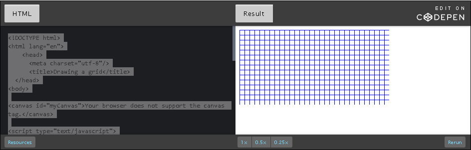

In the image above, we see two text characters placed next to each
other, the blue line indicating the baseline. The baseline determines
how and where the characters are positioned. Note that the tail of the
"g" hangs below the baseline.  

The baseline is never drawn by the browser, it is not exposed directly
to you as a developer, and CSS only may have some properties related
to it. However, the baseline governs the placement of all inline
elements. 

### display: block versus inline

As the browser is rendering your page, every time it encounters the next
tag it has a simple question: "Do I give this element its own line?"  
For example, every \<p\> tag gets a new line, but \<a\> tags do not.   

This is the key distinction between the "block" level elements (like
the \<p\> tag) and the "inline" elements (like the \<a\> tag).   Here is
a quick table of the default values for some of the tags we've already
learned.

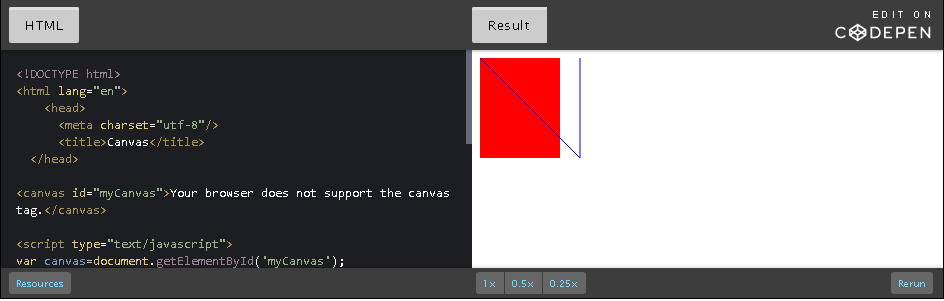

Here are some differences between the block - level and inline elements.

### Block level

The block level:

-   appears below and to the left of their block level neighbors (like a
    carriage return on a typewriter going to the next new line)

-   **will expand to fill the width of the parent container by default**

-   respects all margin properties

-   can have its width property set, which will make it narrower and
    cause its children to wrap, but not crop. (We'll cover this later)

-   takes on the height of all its children (pending certain
    exceptions) as long as its own height is unset. (We will cover
    setting the height later)

-   ignores the vertical-align property

### Inline elements

Inline elements:

-   simply appear to the right of their preceding inline neighbor. They
    do not drop to the next line unless they must "wrap".

-   **by default, the width is simply the width of the content of the
    element, plus any padding**

-   **ignore top and bottom margin settings**

-   **ignore width and height properties**

-   are subject to vertical-align property as well as
    CSS white-space settings

-   support padding, but
    any padding-top or padding-bottom does **not** contribute to the
    calculation of the height of the text line it sits upon

-   cleave to the baseline where they are being placed

The last bullet about inline elements is one of the most important to
understand. *Inline elements cleave to the baseline*.  This is very
important to understand why inline elements are positioned vertically
the way they are. It also contributes to why they ignore top and bottom
margins. Note that making an inline element "bigger" with padding will
certainly keep its neighbors away horizontally. But if there is a
neighboring text line above or below, it can only be kept at bay with
the line-height property, not margins or padding.

Below we see a span that has padding, margin-top, and background-color
applied, but no extra room is being made for it above or below, so its
background is overlapping the lines above and below.

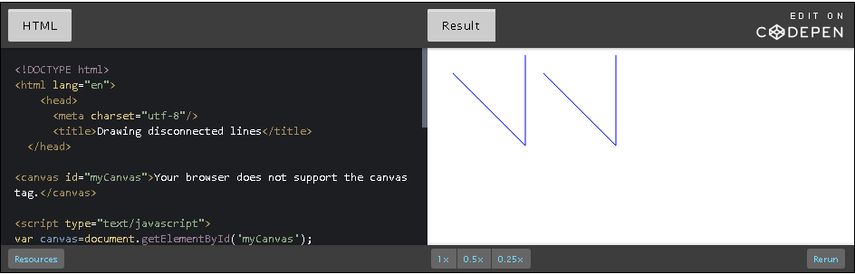

So here we prevent the overlap by setting the line-height of the span.
However, this solution should not be considered optimal.  Better is to
change the span to be display:inline-block, which is discussed below.

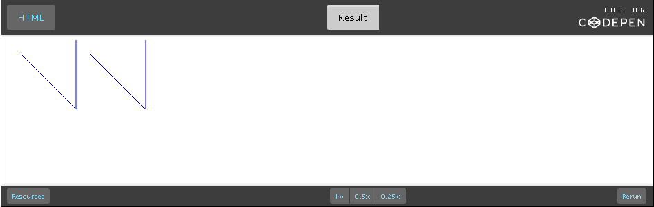

### inline-block

The astute reader may have spotted an obvious omission from the table of
block and inline elements above: \ . Is \ a block level
element or inline?  If you venture to experiment you may conclude
"both", and you will be right.

For historic reasons, the \ tag defaults to display:inline in most
browsers. If you inspect using the browsers inspector, that's what you
will see. However, it does not follow the same rules as other inline
elements. In fact, regardless of what the inspector says, images are
special cased and are inline-block.

Inline-block elements still cleave to the text baseline of the line they
are on. If top or bottom margins or paddings are used, then the entire
line is adjusted to make room. (So the line-height does not need to be
used.)

inline-block elements respect margin-top and margin-bottom

the vertical padding for inline-block elements contributes to the
calculation of the height of the line it falls on

inline-block elements respect width and height properties

In some browsers, some of the form elements default to inline-block
(like \<button\>, \<select\>, and \<input\>)

Here is the overlapping background style presented again, but this time
instead of using line-height to solve the problem, we simply make the
span element display:inline-block.  Note that the margin-top is also
respected. 

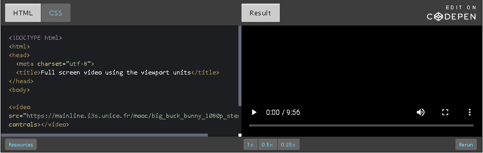

### display property

At long last we arrive at the display property. We have now seen three
of its possible values: block, inline, and inline-block.  There are
others (like none and flex) and we will cover them later.  

.name { display: inline-block; }

A key to not getting confounded by the display property is to have a
grasp on which elements default to which display value and appreciating
the differences between block, inline, and inline-block display.

<h3 id="ch6-2-2">6.2.2 Horizontal and vertical centering</h3>

**Horizontal centering**

Now that we've covered inline versus block display, we can intelligently
discuss centering. Let's start with inline elements.

**inline**

How do you center an inline element?  As we recall, inline elements are
positioned along the baseline, in the natural flow of the text or
content. So for any individual inline element, there is *no CSS
property* you can apply directly to cause this element to center.
You may apply some padding evenly or unevenly to
position its content relative to its own box. But that's not centering
the element itself.

To center an inline element, we use the text-align property of its
parent.   

p { text-align: center; } /\* the text and any inline children of this
element will be centered \*/

If this isn't satisfactory, consider changing the element to be
inline-block or block.

**block**

How do you center a block level element? First, you may recall that
block level elements take the width of their parent by default. If the
element is the same width as its parent, it is already centered.  So the
first step is to limit the width of the element.  Setting the width
property directly is not generally a good practice, but we'll just do
that and discuss sizing at length later.

div { width: 200px; } 

Now that we've sized the element, how to center it?

**margin magic**

If set to auto, then the left and right margins will center the element.
 This is the simplest and best way of centering a block level element.
 So the full solution is to set the width and apply auto to the left and
right margins (or to all margins). 

div { width: 200px; margin: auto; }

Horizontal centering - a better way

Do auto margins seem spooky to you?  There is a better way to achieve
centering and its name is *flexbox*.  We'll read more about it later. 

**Vertical centering**

**inline**

Inline elements respect the vertical-align property. This determines how
the inline element is aligned relative to the baseline it is being laid
upon. This may or may not solve your vertical centering conundrum.

**block**

There is no margin:auto approach to vertical centering. There are some
complicated systems that folk have developed, but the shortest and best
answer to vertical centering: use flexbox. 

<h3 id="ch6-2-3">6.2.3 Key concept: position property</h3>

The 'left', 'top', 'right', and 'bottom' properties

In CSS, there are four properties which can be used to adjust or set the
position of an element. Those properties are: left, top, right,
and bottom. 

However, in one of the best jokes played by the authors of the CSS
specification, using those properties by themselves will have* no
effect* on any element. Surprisingly, most developers struggling with
CSS don't find this funny.   

The reason these properties don't work by default is that they only work
when applied to *positioned* elements. And positioned elements are those
that have had their position property changed from the default. 

### The 'position' property

The CSS position property governs how an element is positioned on the
page and how it responds to the position adjusting properties
(left, top, right, and bottom).  Up to this point in this course, we
have not used this property and so everything we've seen has been the
default position, which is position:static for all elements.  

As of today, the position property has four different values it can
take: static, relative, absolute, and fixed. We will look
at static and fixed.   The options relative and absolute are more
complex, they'll be discussed in an optional advanced section for
completeness, but we aren't going to worry much about them because
flexbox reduces their use cases.

#### static

position: static; /\* the default \*/

A position property of static is the default for all elements. It simply
means that all elements follow the "flowing text"model of layout and the
only properties influencing their position are margins, padding, and the
display property that selects block level layout, inline or
inline-block. Static elements *ignore* the positioning properties we
read about earlier (left, top, right, and bottom).

#### fixed

position: fixed;

A fixed positioned element respects the positioning properties
(left, top, right, and bottom).  A fixed positioned element
is positioned against the *window* rectangle (aka the viewport).  This
means that fixed position elements will not scroll with the rest of the
page.  Fixed position elements can easily "stick" to the side or bottom
or top of the browser. To observe this better, see the Fixed position
activity in the next section.

-   Fixed position elements are positioned against the viewport. 

-   Best practice: use both a horizontal and a vertical positioning
    property on every fixed positioned element.

-   Fixed positioned elements do not contribute to size of the parent.

-   Fixed positioned block level elements do not get the width of their
    parent. 

-   Margins do not work the same.

-   Opposite properties can be used to size an element.

Best practice: use both horizontal and vertical positioning property on
every fixed element

There is a very subtle extension to the previous interpretation problem:
if an element is set to be position:fixed, but has no horizontal
positioning property (that is, left or right), then it will be displayed
in the flow exactly as it would have been.  Except, later,
if left:0px;  is added (for example), then the element may jump to the
left edge of the browser window. The same applies vertically. This is a
bewildering behavior, as most users do not expect there to be a
difference between left:0px and no left property at all. 

Therefore, for any fixed positioned element, the best practice is to
ensure that one of the horizontal positioning properties (that
is, left or right) and one of the vertical properties (top or bottom)
are both set.

Fixed positioned block level elements do not get the width of their
parent

Earlier we learned that the block level element automatically gets
the width of its parent, that is, they extend to become full width. But
this is only true for static and relative positioned elements. Elements
that are fixed positioned (or absolute) do not exhibit this behavior.
Their initial width is simply the width of their content. Though it can
be changed.

Margins do not work the same

For static and relative positioned items, margins can be used to adjust
an element position and keep neighboring siblings "away". That's
our quick assumption about the margins. However, when an
element is fixed positioned, a given margin *might* be able to move the
element but will not move any siblings. Margins cannot be used to keep
siblings "away", to fight crowding.

As a general rule, if a positioning property is being used (like left),
then the matching margin (margin-left) can also be used to additionally
adjust the position of the element. Otherwise, the margin will unlikely
have any effect.

Opposite properties can be used to size element

This is one of the nicer features. Working with preset dimension
properties (height and width) can make your design brittle and reduce
its adaptability. However, fixed positioned items can instead set the
opposite positioning properties (like left and right) and leave the
matching dimensional property (width) unspecified.  The element will
grow or shrink based on the size of the browser window.  Note that this
feature is only available to fixed (and absolute) elements.

<h3 id="ch6-2-5">6.2.5 Positioning (OPTIONAL)</h3>

**Note:** This section is optional material included for the curious. It
will not appear on any graded question.

<h4>Positioned elements</h4>

We read about the positioned elements in an earlier section. There are
five positioning properties (left, top, right, bottom, and z-index) that
can be used to influence the position of an element. But these
properties, by default, will have no effect on any element.  This is
because all elements are position:static by default, and static elements
ignore those positioning properties.  Only positioned elements, which
are elements where the position property is set to something besides
static, respect the properties. 

We saw position:fixed, which is fairly simple: the positioning
properties cause the fixed elements to be positioned relative to the
browser window; they don't even scroll with the content.
 Besides fixed and static, the position property can also be set
to relative and absolute. For these values, the positioning properties
have different interpretations.   

#### relative

position: relative;

The relative value is exactly like static in that the "flowing text"
model of layout is setting the initial position for the element
(including margins and display). However, unlike static, elements with
relative position respect the positioning 
properties (left, top, right, and bottom).  These properties will move
the named edge of the element **from** its initial position. So a value
of top: 20px;  will move the top edge of the element 20 pixels further
down the page.  And similarly, a value of left: 20px; will move an
element 20 pixels from its original left edge, which means move it 20
pixels to the right.

The relative position property has three primary gotchas of which you
should be aware:

-   Items are moved independently of siblings.

-   Opposite positioning properties (like left and right) cannot be used
    simultaneously.

-   There are no automatic size adjustments.

### Independence - margin-top vs top

*IMPORTANT*: The positioning properties (left, top, right, and bottom)
adjust the placement of the element*** independently of its siblings***.
 What does this mean?   Let's imagine we have a list and we want to move
one of the items a little further down the page. Should we
use margin-top to move it? Or position:relative in conjunction with
the top property?  The answer to this question depends on whether you
want any of the other list items to move as well.  If you want the
siblings to move down as well, then use margin-top. 

Here is an example. Suppose we have two lists. We want the third item in
the list to have a background color and to be moved down by 30 pixels.
Compare what happens when we use  margin-top to move it, versus a
positioning property (top).   When we use top, the "Third" item appears
overlapping the Fourth and Fifth items, as they did not move at all. 

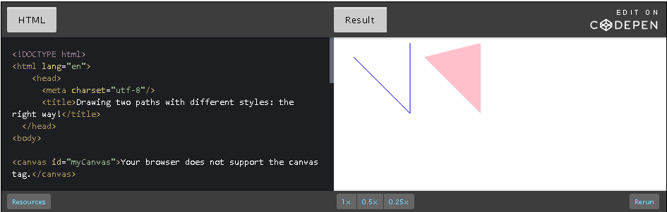

This is why, in our introduction to CSS, we said that margin should be
your "go to" property when you want to adjust position. 

Cannot use opposite properties

When using position:relative if you use the left property you cannot
also use the right property.  And, if you use the top property you
cannot also use the bottom property. If both properties are applied,
then the CSS precedence rules will determine the "winner", which is
usually just the last one applied.

Again, this is unlike margins, where
both margin-right and margin-left can be meaningfully used.

No automatic size adjustments

This follows from the previous limitation. You may recall that block
level elements take the width of their parent (when no width is
specified).  And when using left or right margins on a block level
element that does not have an explicit width, the browser will smartly
size the element down for you to make it fit.  But this size adjustment
does not happen when you
use position:relative and the left or right positional properties. This
is easily illustrated with an example. Below is a block level paragraph
with a border applied to it.  When a margin-left is applied to it, the
paragraph is made smaller and no part goes outside its parent.  But when
it is position:relative and moved with the left property, it can leave
the bounds of its parent, or go offscreen.

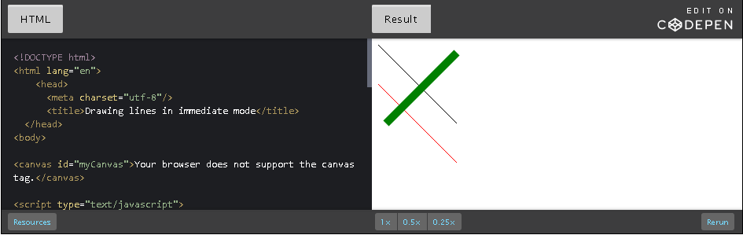

Admittedly, this is not necessarily a "limitation", for many layout
situations preserving the size is exactly what is wanted. 

Absolute

position: absolute; 

Absolute positioning, as it is realized in the browsers via CSS, can be
very powerful and that ease and power is very seductive to many CSS
newbies. But there are some big trade-offs incurred that are often not
appreciated. Many experienced professional CSS developers completely
forswear absolute positioning - they will not use it under any
circumstances. 

An element that is positioned absolutely is taken out of the normal text
"flow" that governs elements positioned statically or relatively.
 Instead, an absolutely positioned element is positioned by
the left, top, right, and/or bottom properties. The size or position of
siblings have no effect on an absolutely positioned element that has
some positioning properties set (left, top, etc.)

Let's take a simple example.  Here we have a paragraph that contains
some text and an inner \<q\>.  For a better illustration, the paragraph
has its height set and a border applied.  The \<q\> is positioned
absolutely.

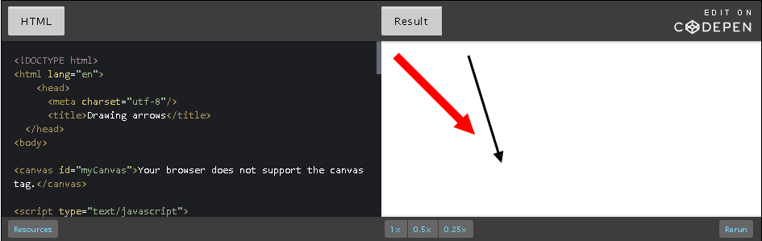

So that seems fairly straightforward and useful. But there are some
subtle caveats and trade-offs of which you must be wary:

-   Interpretation of positioning depends upon parent/grandparent
    elements being positioned elements.

-   Best practice: use both a horizontal and a vertical positioning
    property on every absolute element.

-   Absolutely positioned elements do not contribute to size of the
    parent.

-   Absolute positioned block level elements do not get the width of
    their parent. 

-   Margins do not work the same.

-   Opposite properties can be used to size element.

Interpretation of positioning properties (top, left, etc.) depends ON
parent/grandparent being positioned elements (or not).

*IMPORTANT*: For an absolutely positioned element, ***where*** the left,
top, etc. are calculated ***from* **depends upon the position property
of the parent and grandparents of the element in question. If the parent
of the element is a positioned element (meaning its position is set to
anything except position:static), then an absolutely positioned
child  is positioned relative to that parents rectangle (or grandparent,
or great-grandparent, etc).  But if none of the parents are positioned
elements, the child is positioned relative to the bounds of the
document.  

This means that how the position properties of an absolutely positioned
element are interpreted depends upon the position property of its parent
(and grandparents). For many developers, this is a spooky action at a
distance. Changing the position property on an element may not affect
that element at all, but can cause it children (or great great
grandchildren) to suddenly jump to another part of the page.  

In the example below, someone who did not read the section in the module
3 about how to style list items has decided to use arbitrary numbers.
There are four list items each containing child spans which are
absolutely positioned. Two of the list items are position:relative, so
the spans are positioned starting from their rectangle.  But two of the
list items are position:static (the default), so the spans are moved up
to the \<ul\> (which is also position:relative) where they overlap each
other. (The red 1 is hidden behind the red 2). Borders have been added
in the result below, so you can easily see the rectangle
for  \<li\> versus \<ul\>.

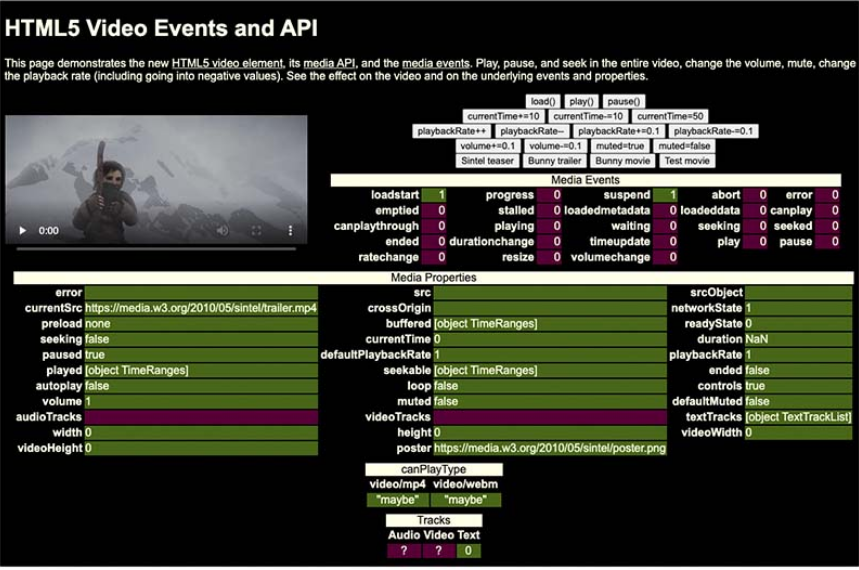

Best practice: use both horizontal and vertical positioning property on
every absolute element

There is a very subtle extension to the previous interpretation problem:
if an element is set to be position:absolute but has no horizontal
positioning property (that is, left or right), then it will be displayed
in the flow exactly as it would have been.  Except, later, if left:0px;
 were added (for example), then the element may jump to the left edge of
the first parent/grandparent that is a positioned element. The same
applies vertically. This is a bewildering behavior, as most users do not
expect there to be a difference between left:0px and no left property at
all. 

Therefore, for any absolutely positioned element, the best practice
is to ensure that one of the horizontal positioning properties (that
is, left or right) and one of the vertical properties (top or bottom)
are set.

Absolutely positioned elements do not contribute to size of parent

Whether you realize it or not, one of the most useful default behaviors
is that the height of a parent element is automatically extended to
include all its children, its content. Designers working in CSS
unconsciously lean on this fact as they plan layouts and adjust element
positions. But this is **not** true for children that are positioned
absolutely.  Absolutely positioned children do not contribute to the
size of the parent element. A parent element that contains only
absolutely positioned children will have a height of 0, has no
"measurable" content and will behave as if it is empty. 

A consequence of this is that as a design starts to use absolute
positioning, it may also have to start explicitly setting the dimensions
of containers, which makes the overall design brittle and less
adaptable.

In the example below, there are two lists (\<ul\>) each with a fat
border. The list on the left is normal - its children contribute to
making the \<ul\> taller and the fat border extends around, enclosing
everything correctly. But the list items (\<li\>) on the right are
positioned absolutely.  So those list items on the right do not
contribute to the height of the parent. As a result, it ends up with a
height of 0, as if it were empty. The fat border just becomes a fat flat
line, and the list items themselves are not enclosed. 

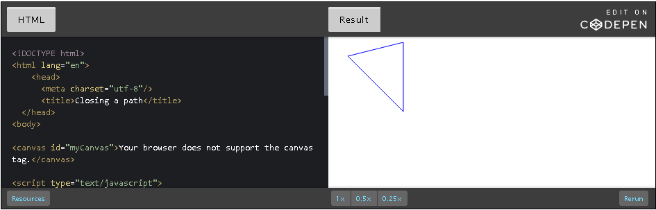

### Absolute positioned block level elements do not get the width of their parent

Earlier we learned that block level elements automatically get the width
of their parent, that is, they extend to become full width. But this is
only true for static and relative positioned elements. Elements that are
absolute positioned (or fixed) do not exhibit this behavior. If you look
at the table above, from the previous point, the individual list items
have a light blue background color. All the list items are block level
elements, and the ones on the left, which are position:static, extend
their rectangle rightward to fill the entire line. But the right column
of absolutely positioned items does not. Their initial size is simply
the size of their content. 

### Margins do not work the same

For static and relative positioned items, margins can be used to adjust
an element position and keep neighboring siblings "away". We make this
quick assumption about margins.  But when an element is absolutely
positioned, a given margin *might* be able to move the element but will
not move any siblings. Margins cannot be used to keep siblings "away",
to fight crowding.

 As a general rule, if a positioning property is being used (like left),
then the matching margin (margin-left) can also be used to additionally
adjust the position of the element. Otherwise, the margin will unlikely
have any effect.

Opposite properties can be used to size element

This is one of the nicer features. Working with preset dimension
properties (height and width) can make your design brittle and reduce
its adaptability. However, absolutely positioned items can instead set
the opposite positioning properties (like left and right) and leave the
matching dimensional property (width) unspecified.  The element will
grow or shrink based on the size of the ancestor it is positioning
against.  Note that this feature is only available to absolute and fixed
positioned elements.

<h3 id="ch6-2-6">6.2.6 'z-index' (OPTIONAL)</h3>

**Note**: this section is optional material included for the curious. It
will not appear on any graded question.

In the previous sections, we named four positioning
properties: left, top, right, and bottom.   With these properties, we
can govern the placement of positioned elements in both the x and y
axis.  But there is a fifth positioning property: z-index.

z-index: 3;

Like the other positioning properties, z-index only applies to
positioned elements (elements that have their position property set
to relative, absolute,or fixed, but not static).  With the z-index you
can control overlapping - whether or not an element is in front of or
behind other *sibling* positioned elements.  The z-index can be an
integer 0 or higher. The higher the number, the more "topmost" or
"overlapping" the element will be.  

In the sample below, we have two lists with relatively positioned list
items and background colors. We are forcing them to overlap by making
them position relative and using negative margins
( margin-bottom:-20px; ). The list on the left has no z-index values
set, so the later elements overlap the earlier ones.  But on the right,
we govern the overlapping with the z-index property. 

<!------------------------------------------------------------------------------------------------>
<!------------------------------ 146.  (xxx) -------------------------------->
<!------------------------------------------------------------------------------------------------>
<p align="center" width="100%">

</p>

<ul>
<li>z-index has no effect on position:static (the default) elements.</li>
<li>If z-index is not set, siblings that appear later in the HTML
    document overlap (are "higher than") earlier siblings.</li>
<li>z-index is relative between siblings, not any arbitrary elements.</li>
</ul>

Siblings and nesting

It is entirely possible that one element with z-index:100 could
appear ***below* **another element with z-index:1;  

This can happen because the z-index is used to figure out which sibling
is higher than another. But if two elements are not siblings, then the
z-index of their respective sibling ancestors will need to be calculated
to figure out which is higher. 

Below is a simple example: there are two overlapping sibling divs,
"Albert" and "Betty". Albert has a red border and is  z-index:1.  Betty
has a blue border, and is z-index:2.  Therefore, Betty and her child
Bernice are *higher* than Albert and his child Alan. Albert's child Alan
has a z-index of 100, which is the highest z-index of any of them, but
because Alan's parent Albert is lower than Betty, Alan remains behind.
Alan's high z-index is only relevant to his siblings, not to cousins
further out in the document.

<!------------------------------------------------------------------------------------------------>
<!------------------------------ 147.  (xxx) -------------------------------->
<!------------------------------------------------------------------------------------------------>
<p align="center" width="100%">

</p>

<h3 id="ch6-3-1">6.3.1 Sizing and dimensions</h3>

We have already touched on the size properties in the various
discussions about display and positioning. But here we'll cover them
properly and add a few more.

<h4>Default behavior</h4>

The default sizing behavior depends upon the display property for an
element.  

<h4>inline</h4>

Inline elements take the size of their content plus any padding.
Additionally, inline elements ***ignore*** any explicit sizing
properties (width, height, etc.) unless they are
also position:absolute or position:fixed.  This leads to a lot of
confusion when newbies are working with inline elements. If you have an
inline element whose size you want to indicate explicitly, you should
probably change it to inline-block.

<h4>inline-block</h4>

Inline-block elements also take the size of their content, plus padding.
However, they respect any explicit sizing properties.  This is handy.

<h4>block</h4>

By default when no sizing properties are used, block level elements take
the width of their parent and the height of their content. Block level
elements respect any explicit sizing properties.

The "width of parent" aspect of block level elements occasionally
surprises developers who might not expect that each animal in a modest
list of pets extends all the way to the right edge of the browser.

These display states are covered in the display section. 

<h4>images - aspect ratio preserving</h4>

images have an interesting behavior in that if only one dimension is
set, the other is automatically calculated so that the original aspect
ratio of the image is preserved.  This is true for both decorative CSS
images and \ tags.

<h4>sizing properties</h4>

There are six sizing properties. They are 

-   width

-   min-width

-   max-width

-   height

-   min-height

-   max-height

The width and height properties are a simple way to explicitly set the
width or height of an element. It is set directly, and the element
maintains that dimension (unless it is inline and ignores these
properties). And certainly, when dealing with images, there is little
reason to pursue anything but the most straightforward approach. 

However, if you look again at the descriptions for inline-block and
block level elements above, you will notice that inline-block elements
are *sized (height and width) to their content*.  And block level
elements take the *width of their parent* and the *height of their
content*. So these elements are fundamentally **variably **sized, and
this variability is one of the most powerful and useful aspects of these
elements.

However, when we use an explicit width or height property, we remove
that variability from the element. This makes it less powerful and less
useful.

The min-width and min-height properties allow us to set a minimum
boundary for that variability, but otherwise the variable sizing of the
element is unimpeded. So if we have min-width:300px; that means the
element will be 300 pixels or possibly wider.

Likewise the max-width and max-height properties allow us to set a
maximum boundary for the variability.

As we move into flexbox based layouts, variability in our design will
become very important.  

Best practice

Unless you have good cause, try to avoid using explicit dimension
properties like width and height.  If you must control the dimensions,
consider using the min- or max- variants. 

Cropping and scrolling: overflow

If the element's dimensions are overdetermined by the sizing properties,
then its content may not fit. In the example below, the width and height
of the paragraph have been set too small for its content.  As a result,
the content overflows the rectangle of the paragraph. We've made this
easier to see by adding a border and background color to the paragraph.
 

This default behavior, that content that doesn't fit is shown anyway,
can be surprising if you weren't expecting it.
<!------------------------------------------------------------------------------------------------>
<!------------------------------ 148.  (xxx) -------------------------------->
<!------------------------------------------------------------------------------------------------>
<p align="center" width="100%">

</p>

<h4>overflow</h4>

The overflow properties govern this situation.  There are three related
properties: overflow, overflow-x, and overflow-y.

p { overflow: auto; }

With common text, overflowing normally only occurs in the vertical
direction (like in the example above). But if your element contains
images, extremely long words, or has adjusted CSS white spacing
properties, then content can overflow horizontally as well.
 The overflow property applies a common policy to both situations, and
the overflow-x and overflow-y properties let you assign different
policies for horizontal versus vertical overflow. 

There are five possible values: unset, auto, visible, hidden,
and scroll. In the example below, the paragraphs are limited to a height
of 100 pixels. 

1.  unset is both the default value when overflow has not been set and a
    value that can be explicitly set. 

2.  The interpretation for the auto value may vary from browser to
    browser. Typically, if a scroll bar is needed, it is shown, but if
    it is not needed, no scroll bar is shown.  In the example below, no
    horizontal scroll bar is needed, so none is shown. If there was less
    content in the paragraph, then no scroll bar would be shown at all.

3.  When the value is scroll, then the scroll bars are *always* shown,
    whether they are needed or not.
<!------------------------------------------------------------------------------------------------>
<!---------------------- 149. (xxx) -------------------------------->
<!------------------------------------------------------------------------------------------------>
<p align="center" width="100%">

</p>

<h4>The box model and box-sizing</h4>

So, if we say that some block level element is supposed to have a height
and width of 100 pixels, does that include the border or the padding?
 This is an excellent question, worthy of some experimentation. The
reader is encouraged to explore this.

The answer is that the default behavior of the browser is that the
sizing properties govern the size of the content area and any padding or
borders are "extra".  But, if this is not the desired behavior, you can
change it. 

Every element has several "boxes" it manages: its own content, padding,
border, and margins.  In CSS parlance, this question is about the "Box
Model" of the element.  Here is an illustration of how the different
boxes are organized (innermost to outermost).

<!------------------------------------------------------------------------------------------------>
<!--------------------------- 150. flex container result (321) ---------------------------->
<!------------------------------------------------------------------------------------------------>
<p align="center" width="100%">

</p>

box-sizing
```
p { box-sizing: border-box; }
```

The box-sizing property determines how the sizing properties are
applied.  It has two values: content-box and border-box.  

The content-box value is default and simply means that the height or
width properties affect the content box of the element and any padding
or border is "additional".  

When border-box is used, the sizing properties are used to set the
"whole" size of the element, and the content size is likely to be less.

This is making my head hurt! How important is this?

Another good question. If you are manipulating items with JavaScript,
then it may be important. If you are using any of the "older" methods
for CSS layout (like floats, tables, etc.), then managing the box model
is of paramount importance.

However, if you are using the flexbox layout (which we begin in the next
section), then the box-model is not that important. The rule of thumb is
that the more you are directly managing the size of items, the more
likely you will need to change the box-sizing property to
be border-box.  

<h3 id="ch6-3-2">6.3.2 Flexbox</h3>

Up to this point, we have covered quite a few different CSS layout
concepts. Inline vs. block level display, different position values,
various positioning properties, six different sizing properties, plus
countless details and interactions.  So by this time, we should know
enough to make a two-column page design, right?  Sadly, we cannot.  The
intrepid among us might be able to cobble something together by
creatively using inline-block, or maybe absolute or fixed positioning,
but ultimately, any design built with just the topics we've covered so
far will likely be brittle or unwieldy. Why is that?

All the layout properties we've looked at have all applied to
an *individual* element.  But performing layout tasks like columnar
layout or anything responsive requires coordinating *multiple* elements.
 This is where the flexbox comes in.  When working with flexbox layout,
there are some CSS properties that are applied to a parent element (also
known as the flex container) and other CSS properties that are applied
to the direct children of that parent (also known as the flex items).
 The flex container will handle laying out of its children. And, best of
all, the flex container will lay out its children smartly, making the
best use of the screen size available to it, while still following the
general guidelines you laid down for it.   As a general rule, layout
with flexbox is pretty easy and the results are great.  So let's get
started.

<h4>The minimum</h4>

The minimum scenario for using flexbox is to make use of two CSS rules,
and better results are achieved with a third.

```
1.  display:flex; on the flex container
2.  flex:1; on the flex items (the children of the flex container)
3.  (better)   flex-flow: row wrap; on the flex container.
```

Here is a series of screen captures showing these minimum options
applied to a parent \<div\> and four identical paragraphs at various
browser sizes, with no other properties applied except some small margin
and padding on the paragraph, and a background color and a border radius
to help visualize.

<!------------------------------------------------------------------------------------------------>
<!------------------------- 151. flex container and flex columns (322) --------------------------->
<!------------------------------------------------------------------------------------------------>
<p align="center" width="100%">

</p>

<h4>flex container</h4>
```
div { display: flex; }
span { display: inline-flex; }
```

To designate an element as a flex container, we simply set
the display property to be flex or inline-flex. A flex element will
itself be a block level element, and an inline-flex element will itself
be an inline element. However, in both cases the element is now a flex
container and will be handling the layout of its children.

<h4>flex-flow</h4>
```
.fc {
display: flex;  /* this is now a flex container */
flex-flow: row wrap;
}
```

Flexbox containers can lay out their children both horizontally, as in a
row, and vertically, as in a column, and *both at the same time*.  This
means that a single flex container not only can help you lay out a three
column design, but also handle the header and footer above and below.
(Did we mention that flexbox rocks?)

But the flexbox container does need a starting rule to follow. Do you
want it to primarily line things up horizontally like a row? Or
vertically like a column? And will you be wanting that row or column to
wrap? The flex-flow property lets you specify both of those things. 

Strictly speaking, the flex-flow property is actually an abbreviation
that replaces two other flexbox container
properties: flex-direction and flex-wrap.  But the row wrap value is so
useful that it will likely be the standard.   

<h4>flex-flow: &lt;flex-direction&gt; &lt;flex-wrap&gt;;</h4>

The possible values for the flex-direction
are: row, row-reverse, column, and column-reverse.

The values for the flex-wrap part are: wrap, wrap-reverse, and nowrap.

There are more properties that we can apply to a flex container and
we'll look at them in the upcoming sections. But these two will take
care of most of what you might want.

<h4>flex items</h4>

The direct children of a flex container are automatically converted into
flex items, with the exception of children that are position-fixed or
position-absolute, which are taken out of the "flow" of the flex
container.  So there is no property needed to designate a child as a
flex item, as it happens automatically. 

One other automatic behavior to be aware of is that empty flex items are
automatically removed from the flex container. Keep that in mind if you
were planning on using an empty \<div\>\</div\> construct as a
placeholder for a CSS background image.

There is an array of flex item properties that can be applied to the
children of a flex container, but there are three that we are not
supposed to use in isolation. These three are: flex-grow, flex-shrink,
and flex-basis.These three properties interrelate, so rather than using
them in isolation the CSS3 specification encourages us to use
the flex property, which can act as an abbreviation for all the three. 

<h4>flex property</h4>

Earlier, we saw that display:flex; can be used to designate a parent
element as a flex container. In that case, the symbol "flex" is used as
a value of the display property.

But flex is also the name of  a property. It is a property that is
applied to flex items, the children of a flex container.  
```
span { flex: \<flex-grow\> \<flex-shrink\> \<flex-basis\>; }
```

The flex property provides a convenient way to abbreviate the three
interrelated properties of flex-grow, flex-shrink, and flex-basis.
 The flex property *also* gives a flex item nice defaults for the
optional properties.
Therefore, flex:1; is **better** than flex-grow:1; . 

<h4>flex-grow</h4>
```
p { flex: **1**; /* rather than use flex-grow, use
flex: **<flex-grow>**; */ }
```

The flex-grow property is set simply to a positive number. In isolation
that number means nothing. However, when the flex container is laying
out its children, for any row (or column) it is processing it may end up
with a little extra space. The flex-grow property determines how much
extra space this flex item should get relative to its siblings.  If one
sibling has a flex-grow value of 2 and another  - flex-grow value of 1,
the former will receive twice as much of the extra space that is divided
among the children. 

A larger flex-grow value does not necessarily mean that an element is
larger than its siblings that have smaller flex-grow values. The content
of each sibling is first accounted for by the flex container when
creating any row or column and only after that has been settled is any
extra space distributed among the children. 

Setting the flex-grow to 0 will prevent the flex item from growing. But
remember, that will cause the item to shed its "flexible size"
super-power. 

<h4>flex-shrink</h4>

```
p { flex: 1 **1**; /* rather than use flex-shrink directly, use flex:
<flex-grow> **<flex-shrink>** */ }
```

The flex-shrink is the opposite of flex-grow. When laying out any row or
column, if the flex container needs to take away some space from the
children, then those with the highest flex-shrink values contribute more
of the needed space.  Again, the flex-shrink value is just a number and
it only has meaning when compared to its sibling flex-shrink values.
And, again, this only occurs in the situation where the flex-container
might need some space from its children.

Note: Like flex-grow, setting the flex-shrink to 0 will prevent the flex
item from shrinking. However, this may *not* be as desirable as it first
seems. Remember the box model from the previous section? If an
item flex-shrink value is 0, then its border or padding may end up
off-screen or pushed out of the parent, because there is a difference
between "fitting" and "fitting nicely", and without the ability to be
shrunk an item might fit but not "fit nicely". If you must
set flex-shrink to 0, then it is recommended that you also set
the box-sizing to border-box.   

<h4>flex-basis</h4>

```
p { flex: 1 1 **87px**;  /* use flex: <flex-grow>
<flex-shrink> **<flex-basis\>** */}
```

The flex-basis can be used instead of the sizing properties on a flex
item. If the flex-direction of the parent flex container
is row or row-reverse, then the flex-basis will govern the width of the
flex item. If the flex-direction is column or column-reverse, it governs
the height.

The flex-basis provides the starting dimension (width or height) for the
flex-item. It may be grown or shrunk from that. If you do not want it to
change at all, then set the flex-grow and flex-shrink to 0, and
the box-sizing to border-box.  However, this is not advisable. Read
the flex-shrink discussion above.  

<h3 id="ch6-3-3">6.3.3 Flexbox advice and best practices</h3>

Here are some quick tips to help you get the most out of flexbox.

<h4>Remember the minimum</h4>

If you have a parent element that contains some child elements, then
putting display:flex; on the parent is all that is needed to get
started. The parent itself behaves like a normal block level element, it
is the flex container, and all of its children are flex items. 

It's not a bad idea to specify the flex-flow for the flex container
(flex-flow: row wrap;), but it isn't required.

It's generally a good idea to also initialize the flex property on the
flex items (e.g. flex:1), but again, this isn't required.

<h4>Use variable dimensions on flex items instead of explicit ones</h4>

This advice may not apply to images and may not be appropriate for every
flex item. However, for most flex items, try to avoid using
explicit width and height properties. Instead, use the flex-basis to set
a desired dimension (e.g. flex: 1 1 **200px**; ).  Or consider
using min-width (or max-width) and min-height (or max-height). 

Doing so will make your flex items a bit more malleable. In CSS
professional parlance, this is called being "responsive". 

<h4>Do not over constrain your flex items. Let the browser work for you.</h4>

This is a follow-on to the previous piece of advice. With flexbox you
give the browser some general guidelines and allow it to figure it out.
(*"Hey, put these in a row, I guess they can wrap. This item should be
80 pixels wide generally, and this item should always be at least 200
pixels wide, and this item should be first."*).  If you overly constrain
the flexbox container by disallowing growing, shrinking, and setting
explicit dimensions, then the results may be not optimal. Don't
micromanage, let the flexbox do its job.

Remember also, that if you overdetermine the dimensions for an element,
then you may also have to start managing its overflow setting and
its box model. Who needs more worry?  Underconstraining is the path to
happiness.

<h4>Thinking of using inline-block? Consider flexbox instead.</h4>

If you are considering changing the display of several elements to
be inline-block, that may indicate that you should be using flexbox
instead. Perhaps their parent should be set to be a flex container and
they should be flex items.  

<h4>Centering? Maybe flexbox</h4>

If you need to center some content horizontally, then the previous
section on centering may help. It discusses the various options for
inline or block level elements.  However, a flex container and a flex
child is also a possible approach. The flex container
property justify-content:center; might help. See the optional section on
that.   Both approaches (flexbox and "traditional") have their
advantages in various situations.  Use your judgement.

If you need to center something vertically, unless it is an inline
element or the content of a table cell, the best answer is almost
certainly flexbox. See the align-content and justify-content properties
in the advanced optional flexbox material.

<h4>AVOID margin: auto on flex items</h4>

margin:auto prevents align-self from working (a very handy flexbox
property covered in the Optional section). There are effective ways of
using auto margins though, just do so with
care: <a href="https://medium.com/@samserif/flexbox-s-best-kept-secret-bd3d892826b6#.wzrvpxpqv">
<https://medium.com/@samserif/flexbox-s-best-kept-secret-bd3d892826b6#.wzrvpxpqv></a>

<h4>Try to keep your flexbox usage simple</h4>

You can see here: <a href="http://caniuse.com/#search=flexbox">http://caniuse.com/#search=flexbox</a> that flexbox is
widely supported across all the modern browsers. However, Internet
Explorer had bugs in its support (but they are fixed in Edge). And the
flexbox standard has had some changes since it was first proposed. For
this reason, try to keep your usage of flexbox close to what is covered
in this course material, and, as with all CSS, be sure to always test in
as many browsers as possible.

<h4>External resources</h4>
<li><a href="https://developer.mozilla.org/en-US/docs/Learn/CSS/CSS_layout/Flexbox">Flexbox documentation</a> on MDN (available in many languages!)
<li><a href="https://www.smashingmagazine.com/2018/08/flexbox-display-flex-container/">What Happens When You Create A Flexbox Flex Container?</a> (by Rachel Andrew - 2 August 2018)
</ul>

<h3 id="ch6-4-1">6.4.1 Main and cross axes</h3>

<b>Note</b>: This material is included for completeness. However, many are
able to use flexbox satisfactorily without it. None of the material here
will appear in any graded question.

<h4>Concepts</h4>

Before we step deeper into flexbox, there are a few concepts we should
make sure to understand.

<h4>Main axis and cross axis</h4>

Every flexbox has two axes. The "main" axis is the major axis along
which all the flex items are being laid. So, when
the flex-direction is row, the main axis is horizontal, running left to
right.  When the flex-direction is column, the main axis is vertical,
running top to bottom.  (Quick quiz: what if
the flex-direction is row-reverse?).  

The "cross" axis runs perpendicular to the main axis. It is the
direction that items might wrap.  So with flex-flow: row wrap; the cross
axis is vertical and runs top to bottom. And with flex-flow:row
wrap-reverse; it is vertical running bottom to top.

<h4>Start and end</h4>

<!------------------------------------------------------------------------------------------------>
<!--------------------------- 152. flex container and flex-flow (324) ---------------------------->
<!------------------------------------------------------------------------------------------------>
<p align="center" width="100%">

</p>

In the illustration above, we see the main and cross axes as they would
be for flex-flow:row wrap;.  And in the same illustration, we also see
the start and end points for both the main and cross axes.  Take a
moment and visualize how both the axes *and* the start and end points
would change for each of these combinations for flex-flow :

<ul>
<li>row wrap</li><br/>
<li>row wrap-reverse</li><br/>
<li>row-reverse wrap</li><br/>
<li>row-reverse wrap-reverse</li><br/>
<li>column wrap</li><br/>
<li>column wrap-reverse</li><br/>
<li>column-reverse wrap</li><br/>
<li>column-reverse wrap-reverse</li><br/>
</ul>

<h4>Main axis for sizing, cross axis for alignment</h4>

The terms *"main"* and *"cross"* appear in the descriptions of flexbox
and in multiple online tutorials you might find. However, they
are **not** used in the names of any CSS properties or values.  The
following properties control behavior along the main axis. We are
already familiar with all of them, except justify-content.

<ul>
<li>flex</li><br/>
<li>flex-grow</li><br/>
<li>flex-shrink</li><br/>
<li>flex-basis</li><br/>
<li>justify-content</li><br/>
</ul>

All the properties above control how a flex item might be *sized*,
except justify-content, which controls how a flexbox container spaces
out and positions flex items. 

And, obversely, the following list of properties controls behavior along
the cross axis:

<ul>
<li>align-content</li><br/>
<li>align-items</li><br/>
<li>align-self</li><br/>
</ul>

These properties all govern how a flex item might be *aligned* or
positioned along the cross axis. They also support a
simple stretch value, which we will see when we cover them. 

<b>Important</b>: Flexbox items can have their size and position influenced
on the main axis, with flex-grow, and others. But on the cross axis,
with the exception of a coarse stretch option, we can only influence
their position. This distinction is very important.  In the cross axis
direction, our ability to influence the sizing is limited. When not
using stretch, we get the normal sizing behavior (block level elements
take vertical size of content, etc.) or use the regular sizing
properties  (min-height, max-height, height, etc.)

<h4>flex-start and flex-end are contextual</h4>

We will begin to see the values flex-start and flex-end in the next
section as we look at alignment and justification.  Just as the terms
"main" and "cross" do not appear as CSS terms, be
aware that flex-start and flex-end are contextual.  When used with
the justify-content property, flex-start and flex-end refer to the "main
start" and "main end" sides (as in the illustration above).   When used
with any of the flexbox align properties, flex-start and flex-end refer
to the "cross start" and "cross end"  sides.

<h3 id="ch6-4-2">6.4.2 Justification and alignment</h3>

<b>Note</b>: This material is included for completeness. However, many are
able to use flexbox satisfactorily without it. None of the material here
will appear in any graded question.

<h4>justify-content</h4>

.fc { justify-content: space-around; }

When all the flex items in a flexbox container are fully resizable, then
there will not be any extra space to put between the items.  However,
when the flex items are fixed size, or cannot grow anymore, then the
flexbox container will put the extra space between or outside the items.
The closest analogue from typography is called "justifying".  Thus,
the justify-content property serves a similar function for flexbox
containers.

The justify-content property is applied to the flex container.  It
governs how any extra space along the main layout axis is distributed
between the flexbox items.  The possible values
are: flex-start, flex-end, center, space-between, and space-around.
 The flex-start, flex-end, and center values do not distribute any space
between the flex items. Instead, these values determine where the flex
items should be positioned within the flex container, and any extra
space is outside them. The space-between and space-around values both
put space evenly between the flex items, but space-between places the
flex items flush against the main start and main ends of the flexbox
container.  Remember that this is only spacing in the direction of the
main axis. justify-content does not affect any spacing or placement in
the direction of the cross axis.

The table below should help illustrate this. It shows the justification
options for a flexbox container with flex-flow:row;

<!------------------------------------------------------------------------------------------------>
<!------------ 153. justification options for a flexbox container with flex-flow (327) ----------->
<!------------------------------------------------------------------------------------------------>
<p align="center" width="100%">

</p>

If the flex-direction were row-reverse, then the only thing to change in
the table above would be that the appearances
of flex-start and flex-end would be reversed.

If the flex-direction were column, then remember that, if the flexbox
container is a block level element, its default size would be that of
its content. Which means there would be no extra vertical space to
distribute. So all the five options above would be identical (a tight
stack of items) *unless* the height of the flexbox container were
explicitly made larger. 

<h4>align-content and align-items</h4>

The align-content and align-items are often confused for one another.
But they are very different.  Both properties only apply if there is
extra space in the cross axis direction. This is important to remember,
because in many situations there isn't any cross axis space. In the
example above (used for justify-content), none of the flexbox containers
has any extra cross axis space (vertical space).  

<h4>align-items</h4>

.fc { align-items: stretch; }

The align-items determines how items are aligned in the cross axis
direction. This is applied to the flexbox container.  The possible
values are stretch, flex-start, flex-end, center, and baseline.    In
the context of alignment, flex-start and flex-end refer to the cross
start and cross end sides, which may be swapped if
the flex-wrap:wrap-reverse option is elected.  align-items defaults
to stretch, if it is not set. The table below should help illustrate
this. It shows a flex container
with flex-flow:row;  and a min-height value that is greater than the
height of any of the items.  

In the example below, each item has a different line-height value, so
you can see how they align to each other.

<!------------------------------------------------------------------------------------------------>
<!------------------------- 154. line height and align items #1 (328) ---------------------------->
<!------------------------------------------------------------------------------------------------>
<p align="center" width="100%">

</p>

<!------------------------------------------------------------------------------------------------>
<!------------------------- 155. line height and align items #2 (328)  --------------------------->
<!------------------------------------------------------------------------------------------------>
<p align="center" width="100%">

</p>

<h4>align-content</h4>

.fc { align-content: space-between; }

align-content is only relevant when the flexbox container supports
wrapping and the flex items are, in fact, wrapping.
 The align-content determines how the *wrapped lines* are positioned or
spaced.  Align-content is not applied to individual items, but rather to
the wrapped lines. The align-content property supports
the stretch value, as well as the same values
as justify-content (flex-start, center, flex-end, space-between, space-around).
This is easier to understand from an example. Below we have a flex
container with  flex-flow:row wrap; and a height value that is greater
than the height of any of the items.
<!------------------------------------------------------------------------------------------------>
<!------------------------- 156. flexbox and flex items align #1 (329) --------------------------->
<!------------------------------------------------------------------------------------------------>
<p align="center" width="100%">

</p>
<!------------------------------------------------------------------------------------------------>
<!------------------------- 157. flexbox and flex items align #2 (329) --------------------------->
<!------------------------------------------------------------------------------------------------>
<p align="center" width="100%">

</p>

<h4>align-self</h4>

.item { align-self: center; }

Unlike the other flexbox align properties, align-self is applied to an
individual flex item, not to a flexbox container.  This allows an
individual flex item to be aligned differently than its siblings.
 Again, this is only true for cross axis alignment, and will only come
into play, if there is extra space in the cross axis direction to be
exploited. 

The values for align-self are stretch, flex-start, center, flex-end,
and baseline. 

align-self is ignored, if any of the four margins on the item is set
to auto.

In the example below, we have a flex container
with flex-flow:row; and align-items:center;.  The individual items have
their align-self property set.
<!------------------------------------------------------------------------------------------------>
<!--------------------------------- 158. flex container  (330) ----------------------------------->
<!------------------------------------------------------------------------------------------------>
<p align="center" width="100%">

</p>

<h3 id="ch6-4-3">6.4.3 Order</h3>

**Note**: This material is included for completeness. However, many are
able to use flexbox satisfactorily without it. None of the material here
will appear in any graded question.

One of the most exciting flexbox properties is also its simplest: order.

.item { order: 2; }

The order property allows you to determine the order in which the item
appears in the flexbox.  This allows you to present the information in
the flexbox layout independent of its order in the HTML itself. This is
very useful, as there are many factors competing to drive the order of
an HTML file.    

For example, semantically, for SEO (Search Engine Optimization), and for
accessibility for disabled visitors, the best practice is to put the
title of an article before the article itself. While that seems simple
enough, if your flexbox layout uses a flex-direction value
of column-reverse, this could be a problem.  

The order property, when applied to an individual flexbox item, lets you
set its order. By default, the first item in a flexbox container has
the order value of 1, the second is 2, etc.  And you can override it.
<!------------------------------------------------------------------------------------------------>
<!---------------------------- 159. order property in flex box (330) ----------------------------->
<!------------------------------------------------------------------------------------------------>
<p align="center" width="100%">

</p>

<h3 id="ch6-4-4">6.4.4 Flexbox resources</h3>

<h4>CSS flexbox resources</h4>

<ul>
<li><a href="https://css-tricks.com/snippets/css/a-guide-to-flexbox/">A complete guide to Flexbox (CSS Tricks) - <b>updated 7 April 2021</b></li><br/>
<li><a href="https://www.smashingmagazine.com/2018/10/flexbox-use-cases/">Use cases for Flexbox (Smashing Magazine) - <b>October 2018</b></li><br/>
<li><a href="https://www.w3.org/TR/css-flexbox/">CSS Flexible Box Layout, the W3C specification</li><br/>
<li><a href="https://flexboxfroggy.com/">Flexbox froggy (game to practice CSS flexbox code)</li><br/>
</ul>

<h3 id="ch6-5-1">6.5.1 CSS Grid Layout</h3>

Have a look at how CSS Grid Layout went from an idea to a reality. The short video below has been shot in August 2017 by the Microsoft team. It features some of the CSS Working Group participants:
The web has always been traditionally very document-centric.
People have always been asking for better layouts. 
Most of the conversations ended up the same way, complaining about all the dirty hacks they had to do.
That hacks that we were employing weren't as powerful as the old methods of just, put it all in a big, old table element.
That was popular for a reason, it let you do powerful, complex layouts.
It was just the worst thing to maintain, and the worst thing for semantics.
I wanted to see some of the technologies that I had worked with previously from the Windows Presentation Foundation, StackPanel, WrapPanel, grid layout.
The flexbox spec filled that StackPanel and WrapPanel gap, so we were left with, how do we fill the gap for grid?
And we're gonna need to make a new spec, and we're gonna need to build it, and so that's what we did.
We wanted grid to be more than what the developer world thought they needed.
What they thought they needed was the things that they could do already.
And we've been working on it since then, for five years or so, actively now.
To make CSS what it was meant to be, which was to be a flexible, robust, powerful, and understandable system for doing layout.
It actually provides web authors with the capability of doing web application layout in a sane, practical manner, without extra markup like tables.
Without hacks like floats, without all the necessary JavaScript overhead that you need with absolute position.
It allows you to do style development in a sort of different way.
You create a template, you create your grid first, you put content into that.
It lets us do amazing page layouts that were previously only really possible to do with table-based stuff.
After reading the spec for the first time, I thought wow, this really has the potential to change everything.
Since I saw that, I was like, this is something that we really need, is this ability to properly lay things out.
I started digging into it and building some kind of examples to show other people.
And I was absolutely determined that grid layout wasn't gonna disappear.
It was gonna be something that other people found out about, and got excited about.
The thing that changed it from a dream to reality here, was getting an implementer deeply interested in it, which in this case was Microsoft first leading with its version of the grid spec.
It takes both the users who are demanding the feature, as well as the browser developers who are dedicating their resources to go and build this.
The developer feedback has been remarkable, with all the major browser vendors implementing it, and shipping it in 2017.
It's not just something we're talking about, they can go use it.
We should've maybe pushed more, I think.
The grid is something we should have had, probably from very early on, maybe from the start of CSS already.

<h3 id="ch6-5-2">6.5.2 CSS Grid</h3>

Have a look at how CSS Grid Layout went from an idea to a reality. The
video below has been shot in August 2017 by the Microsoft team. It
features some of the <a href="https://courses.edx.org/courses/course-v1:W3Cx+CSS.0x+3T2017/courseware/12e8f1585d88470e95f54cf0ff6a1a00/6c9058a29dc5493fbb43332c6bc3b550/4?activate_block_id=block-v1%3AW3Cx%2BCSS.0x%2B3T2017%2Btype%40vertical%2Bblock%40beac75cf51c34b51a0ac0f6e5fad70cc">CSS Working Group
participants</a>:

Rossen Atanassov (Microsoft) ; Tab Atkins Jr. (Google) ; Sergio Villar
Senin (Igalia) ; Bo Cupp (Microsoft) ; Elika Etemad, aka fantasai (W3C
Invited Expert to the CSS WG) ; Greg Whitworth (Microsoft) ; Dr. Bert
Bos (W3C & Co-Creator of CSS) ; Rachel Andrew (W3C Invited Expert to the
CSS WG).

Web layout is always constrained by the limitations of CSS, but future
trends will be able to make use of new tools, such as CSS Flexbox
(officially: CSS Flexible Box Layout) and CSS Grid.

Despite the similarities in concept and syntax, Flexbox and Grid are not
competing layout techniques. Grid arranges in two dimensions, while
Flexbox lays out in one. There is synergy when using the two together.

CSS Grid is a CSS module that defines a two-dimensional grid-based
layout system, optimized for user interface design. In the grid layout
model, the children of an element (the ‘grid container’) can be
positioned into arbitrary slots in a predefined flexible or fixed-size
layout grid.

If that sounds a bit too abstract, here is another way of looking at it.
The idea behind the Grid module is that you split
the [box](https://courses.edx.org/courses/course-v1:W3Cx+HTML5.0x+3T2020/jump_to_id/61920cda43ca49cca2fcf26e763bbe16) that
makes up an element into many individual ‘slots’, arranged in a matrix,
and separated from each other by (invisible) horizontal and vertical
lines. You do that with a property called 'grid', which contains the
desired number of rows and columns and/or their sizes. Each child
element goes into a slot, so that they end up aligned as in a table. But
you have full control over which slot they go into, you can change their
order, they can span more than one row or column, and you can leave some
slots empty.
<!------------------------------------------------------------------------------------------------>
<!----------------------------------- 160. grid module (346) ------------------------------------->
<!------------------------------------------------------------------------------------------------>
<p align="center" width="100%">

</p>

The Grid module provides several different ways to define such a grid
and to place the child elements. Too many, in fact, to present here.

Because they can refer to a previously defined grid of horizontal and
vertical lines, the properties from the CSS Grid module provide more
control over the alignment of elements than most other properties in
CSS, such as the table-related properties or the 'float' and 'clear'
properties, while also allowing elements to be displayed out of order.
As such they are especially appreciated for (Web) applications with user
interfaces that are made with HTML and CSS. The Grid module is not yet
the ‘[design grid](https://en.wikipedia.org/wiki/Grid_(graphic_design))’
that typographers want for the layout of magazines and books, but it is
a first step. (E.g., one obvious thing to do, applying grid properties
to an HTML table, doesn't work, because the properties do not handle
nested elements yet.) Even though this is only level 1 of the module, it
is well worth trying out.

The properties from the Grid module have only been available in major
browsers since mid 2017 (see the [status of browser
support](http://caniuse.com/#feat=css-grid)). But the ideas behind the
Grid module aren't new. From the start of CSS, there have been proposals
to use CSS properties to define a template or matrix to guide the layout
of elements, e.g.: [Frame-based
layout](http://www.w3.org/TR/WD-layout), [Advanced
Layout](http://www.w3.org/TR/2005/WD-css3-layout-20051215/) (later
called [Template Layout](http://www.w3.org/TR/css-template-3/)), [Grid
Style Sheets](https://github.com/gss) and [Constraint
CSS](https://constraints.cs.washington.edu/web/ccss-uwtr.pdf). But only
recently has technology become good enough to support some (not all!) of
those ideas.

<h3 id="ch6-5-3">6.5.3 CSS Grid resources</h3>

If you look at the CSS Grid module, you may notice that it has rather a
large number of properties. That is because it tries to allow different
manners of writing style sheets. There are many shorthand properties and
many alternative ways to define the same grid. In practice, most style
sheet writers will select a set of just three or four properties that
suits their way of working.

When considering the CSS Grid module, also look at the CSS Flexible Box
module. It only provides for alignment of elements in a single row or
column, but has some features that Grid doesn't have (and it has been
around longer and works in older browsers). On the other hand, even for
a single row or column, the Grid properties may turn out easier in some
cases.

<h4>CSS grid resources</h4>
<ul>
<li><a href="https://css-tricks.com/snippets/css/complete-guide-grid/">A complete guide to Grid</a> (CSS Tricks) - <i>updated 10 March 2021</i></li>
<li><a href="https://www.w3.org/TR/css-grid-1/">CSS Grid</a>, the W3C specification -   <a href="https://gridbyexample.com/">Grid by example</a>: this site is a collection of <i>examples</i>, video and other information to help you learn CSS <i>Grid Layout - by Rachel Andrew</i>.</li>
</ul>

<h3 id="ch6-6-1">6.6.1 Recipe project - Module 6</h3>

<h3 id="ch6-6-2">6.6.2 Recipe project</h3>

In this next iteration of our recipe project, we're going to make a few
changes again to our Web page using cascading style sheets.

One of the first things that we want to do is go ahead and increase the
font size on our page.

If you take a look at the font, it seems to be a little bit small.

Maybe we'd like to have it a little bit larger so that the text is
easier to read.

In order to do that, we'll go into the 'body' tag, and we're going to
set our font size to a percentage.

And in this case, we'll increase it by 20 percent.

Setting it to 120 percent does that for us.

Refresh the page, and you can see that our fonts size has increased.

Now, one of the things that we want to do here is change the width of
our page.

We want to do some changes in how the page responds to width as the user
resizes the window.

What we're going to do to change that, is we're going to go through the
process of manipulating some of the elements within our F12 tools just
to get an idea of some of the issues we may run into.

Within the F12, we'll set the width of our page.

And in this case, we're giving it a specific size.

Now, you might notice that what took place was at our header element is
no longer expanding across the entire width of the browser window.

And that's because the whole page element was resized into the smaller
size rates.

We've done this on the 'body' tag.

But we want that header element to be across the entire page.

We know that this creates a problem.

Let's go ahead and clear that style from within the F12 tools, and lets
go make some changes in our CSS file.

The first thing we're going to do, is rather than change the whole body
width, we're going to change the width of the article elements.

This allows us to manipulate only specific items on the page itself.

The first thing we're going to do, is change the minimum width.

Let's go ahead and refresh the page and see what happens as we start
coming down to a smaller size.

You'll see that the article elements will only shrink so much.

We specified a minimum of 30rem on this one here.

It's also good to set the max-width, and we'll set that to 50rem for
this particular instance.

Let's refresh and see how that impacts us.

You'll notice a small change in the article width, and then we can
resize the page and see how are min and max widths work.

Finally, we're going to go through the process of manipulating the
margins a little bit on this page as well, and we'll do it with the
article element.

We're going to specify an auto-margin for this particular instance.
Let's refresh.

You'll notice a slight change in the margins of the articles, and then
you'll see how those change as you resize your document.

Now let's take a look what happens as we scroll our page.

Notice that our banner disappears at the top.

We want to fix that. We'd like to have that banner remain static.

We're going to do that. Because the banner is specified in the 'h1',
we'll go into the CSS, and we'll set the position to fixed.

Then as we do that and refresh the page and scroll, you'll see that it
no longer disappears.

But it's not the right width anymore, so we have to fix that as well.

Let's go back in and specify the width for the 'h1' element.

And because we want it to span the entire page, we'll set it at 100
percent.

There, now the banner's looking a little bit better in the width size,
but notice as we scroll and also now look, there's a little space at the
top. We need to get rid of that.

We can do that in the CSS, and we'll specify a top, setting a value of
zero.

And on the refresh, our banner now positions itself or basically anchors
itself to the top of the page.

Now, our nav menu is partially covered.

We need to fix that. Because our 'nav' element is already specified,
let's give it a specific width, and let's set its position to fixed as
well.

Also, let's change the top so that when we set it to 4rem, it brings
that 'nav' menu down a little bit lower.

And now, we can actually see the whole menu.

The problem is now, that it's covering up our images.

We can fix that too by specifying an opacity value in here.

Setting the opacity gives it somewhat of a transparency.

And if we set it 0.8 and refresh our page, we can see that now we can
look at some of the image behind it, so it's not completely covered up.

But the problem may be that with that opacity, maybe the text isn't easy
to read.

We can fix that by manipulating something called the hover.

Now, we don't have a nav.hover in our cascading style sheet yet, so
we'll go ahead and add that.

Simply, nav and hover, and this basically covers the action for when the
user hovers the most over that 'nav' element.

And what we'll do is simply set the opacity back to 1.0.

Now we can see how the opacity changes when we hover the mouse over our
'nav' menu.

Now, we're almost finished, but notice that we've got some text that,
again, is still hidden behind that 'h1'.

Let's fix that by setting up our margin.

In this case, we want 'margin-top'.

We'll specify a 'margin-top', give it a value, add then refresh the
page.

And now, you can see that.

They've actually scrolled down a little bit more.

We fixed those issues at the top.

These are the final changes to our recipe project for this unit.

<!------------------------------------------------------------------------------------------------>
<!------------------------------ ##. template (##) -------------------------------->
<!------------------------------------------------------------------------------------------------>
<p align="center" width="100%">

</p>

<h3><b>Last Updated 07-29-2022 8:01pm</b></h3>

