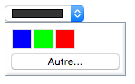
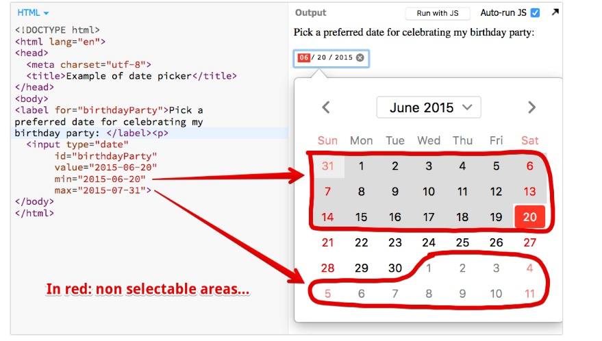
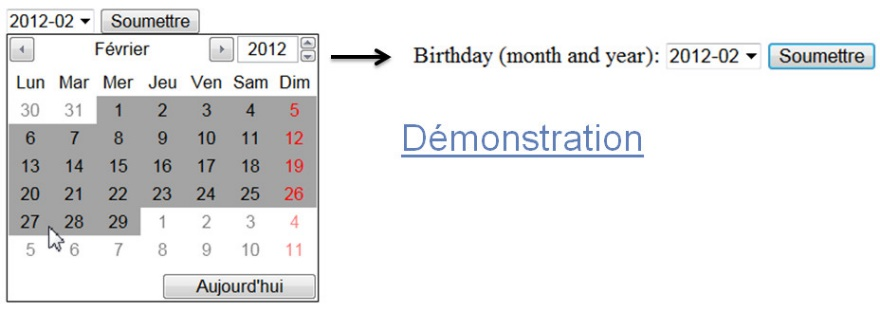

<h2 align="center">W3Cx Front-End Web Developer</h2>
<br/>

<!------------------------------------------------------------------------------------------------>
<!------------------------------- readme.md of W3Cx-3of5-HTML5.1x -------------------------------->
<!------------------------------------------------------------------------------------------------>
<!--------------------------------------- w3cx logo (01) ----------------------------------------->
<!------------------------------------------------------------------------------------------------>
<p align="center" width="100%">

</p>

<h3 align="center">W3Cx-3of5-HTML5.1x - Coding Essentials and Best Practices</h3>
<!------------------------------------------------------------------------------------------------>
<!------------------------------ 01. W3Cx-3of5-HTML5.1x logo (01) -------------------------------->
<!------------------------------------------------------------------------------------------------>
<p align="center" width="100%">

</p>

<!---- :alien:  :sob:  :cold_sweat: :point_up:  :cancer:  :smile:   --->
<!---- right arrow , left arrow , oriental , tilde ---->
<!---- &#955;   &#9658;  &#767;  &#2400;  --->

<!--
<a href="#Put H2 Heading Here">1. Put H2 Heading Here</a>
<a href="#Put H2 Heading Here">2. Put H2 Heading Here</a> 
<a href="#Put H2 Heading Here">3. Put H2 Heading Here</a> 
<a style="margin-left: 2rem;" href="#H3 Sub-Heading">3.1. H3 Sub-Heading</a> 
<a style="margin-left: 2rem;" href="#H3 Sub-Heading">3.2. H3 Sub-Heading</a>
--->

<h2><a href="#table-of-contents">Table of Contents</a></h2>
<ol type="a">
  <li><a href="#cha-1">About W3C and the Web</a></li>
  <li><a href="#cha-2">Why accessibility is important</a></li>
  <li><a href="#cha-3">Why internationalization is important</a></li>
  <li><a href="#cha-4">W3C tools</a></li>
</ol>

<ol type="1">
  <li><a href="#chb">Course Introduction and Practical Information</a></li>
  <li><a style="margin-left: 2rem;" href="#chb-1" Sub-Heading">b.1 Course syllabus</a></li>
  <li><a style="margin-left: 2rem;" href="#chb-2" Sub-Heading">b.2 Getting around the course</a></li>
  <li><a style="margin-left: 2rem;" href="#chb-3" Sub-Heading">b.3 Course tools</a></li>
</ol>

## [**Module 1: HTML5 Basics**](#ch1)
>### 1.1 [**Introduction - Module 1: HTML Basics**](#ch1-1-1)
>### 1.2 [**From HTML1.0 to HTML5**](#ch1-2-1)
>### 1.3 [**Structural element**](#ch1-3-1)
>### 1.4 [**Other elements and attributes**](#ch1-4-1)
>### 1.5 [**Microdata**](#ch1-5-1)

## [**Module 2: HTML5 Multimedia**](#ch2)
>### 2.1 [**Introduction - Module 2**](#ch2-1-1)
>### 2.2 [**Streaming multimedia content: the video and audio elements**](#ch2-2-1)
>### 2.3 [**Subtitles and closed captions**](#ch2-3-1)
>### 2.4 [**Enhanced HTML5 media players and frameworks**](#ch2-4-1)
>### 2.5 [**Webcam, microphone: the getUserMedia API**](#ch2-5-1)
>### 2.6 [**Exercises - Module 2**](#ch2-6-1)

## [**Module 3: HTML5 Graphics**](#ch3)
>### 3.1 [**Introduction - Module 3**](#ch3-1-1)
>### 3.2 [**Basics of HTML5 canvas**](#ch3-2-1)
>### 3.3 [**Immediate drawing mode: rectangles, text, images**](#ch3-3-1)
>### 3.4 [**Path drawing mode: lines, circles, arcs, curves and other path drawing methods**](#ch3-4-1)
>### 3.5 [**Colors, gradients, patterns, shadows, etc.**](#ch3-5-1)
>### 3.6 [**Exercises - Module 3**](#ch3-6-1)

## [**Module 4: HTML5 Animation**](#ch4)
>### 4.1 [**Introduction - Module 4**](#ch4-1-1)
>### 4.2 [**Basic animation techniques**](#ch4-2-1)
>### 4.3 [**Canvas and user interaction (keyboard, mouse)**](#ch4-3-1)
>### 4.4 [**A glimpse of advanced canvas functionalities**](#ch4-4-1)
>### 4.5 [**Exercises - Module 4**](#ch4-5-1)

## [**Module 5: HTML5 Forms**](#ch5)
>### 5.1 [**Introduction - Module 5**](#ch5-1-1)
>### 5.2 [**Introduction to HTML5 Forms**](#ch5-2-1)
>### 5.3 [**Accessible forms**](#ch5-3-1)
>### 5.4 [**New <input> types**](#ch5-4-1)
>### 5.5 [**New forms attributes**](#ch5-5-1)
>### 5.6 [**New elements related to forms**](#ch5-6-1)
>### 5.7 [**Form validation API**](#ch5-7-1)
>### 5.8 [**Exercises - Module 5**](#ch5-8-1)

## [**Module 6: HTML5 Basic APIs**](#ch6)
>### 6.1 [**Introduction - Module 6**](#ch6-1-1)
>### 6.2 [**Introduction to HTML5 APIs**](#ch6-2-1)
>### 6.3 [**HTML5 Cache**](#ch6-3-1)
>### 6.4 [**The Web Storage API**](#ch6-4-1)
>### 6.5 [**The File API**](#ch6-5-1)
>### 6.6 [**The geolocation API**](#ch6-6-1)

<div align="right">
  <b><a href="#table-of-contents">↥ Back To Top</a></b>
</div>
<!--
<head>
<meta name="viewport" content="width=device-width, initial-scale=1">
<style>
.accordion {
  background-color: #eee;
  color: #444;
  cursor: pointer;
  padding: 18px;
  width: 100%;
  border: none;
  text-align: left;
  outline: none;
  font-size: 15px;
  transition: 0.4s;
}
.active, .accordion:hover {
  background-color: #ccc; 
}
.panel {
  padding: 0 18px;
  display: none;
  background-color: white;
  overflow: hidden;
}
</style>
--->

<h2 id-"cha-1">About W3C and the Web</h2>

<h2 id="chb">Course Information</h2>

<h3>Welcome to "HTML5 Coding Essentials and Best Practices"</h3>
<ul>
  <li>Course outline (syllabus)</li>
  <li>Course forums</li>
  <li>Course tools</li>
  <li>About W3C and the Web</li>
</ul>
<p>
W3C has designed a <a href="https://www.edx.org/professional-certificate/front-end-web-developer-9" target="_blank">"Front-End Web Developer" (FEWD) Professional Certificate</a> where you learn all of the necessary skills needed to build interactive and responsive user experiences on the Web. This program deepens your knowledge of the 3 foundational languages that power the Web: HTML5, CSS and JavaScript.

The <b>W3C FEWD</b> program is composed of 5 courses:
</p>

<ol type="1">
  <li>CSS Basics</li>
  <li>5.0x HTML5 and CSS Fundamentals</li>
  <li>This course: <b><i>5.1x HTML5 Coding Essentials and Best Practices</i></b></li>
  <li>5.2x HTML5 Apps and Games</li>
  <li>JavaScript Introduction</li>
</ol>

<p>This course is a natural follow up to the <a href="https://www.edx.org/course/css-basics" target="_blank">CSS Basics</a> and <a href="https://www.edx.org/course/html5-and-css-fundamentals" target="_blank">HTML5 & CSS Fundamentals</a> courses.</p>

<p>As such, required prerequisites are:</p>
<ul>
  <li>Be comfortable putting together an HTML document,</li>
  <li>Have minimal familiarity with CSS,</li>
  <li>Basic knowledge of JavaScript and DOM APis is sufficient, and this course will include a recap of basics. You are also more than welcome to follow the <a href="https://www.edx.org/course/javascript-introduction" target="_blank">JavaScript Introduction</a> course (introductory level).</li>
</ul>

<h4>During this course, you will learn:</h4>
<ul>
  <li>Learn the simplified HTML5 tags, and how to use microdata,</li>
  <li>Play with the audio and video tags,</li>
  <li>Use the Webcam,</li>
  <li>Draw and animate fun Web graphics,</li>
  <li>Discover HTML5 form features,</li>
  <li>Test the basic APIs, such as Web storage and geolocation,</li>
  <li>And most of all, practice coding techniques thanks to multiple interactive examples.</li>
</ul>

<p>The HTML5 course team is thrilled to guide you in your learning experience. We are committed to teach you how to code Web pages, and how to do it the correct way. We encourage you to create Web pages and apps and share them in the discussion forums. Have fun!</p>

<h4 id="cha-4">Online Code Editors:</h4>

<a href="https://jsbin.com" target="_blank">JS Bin</a>

<a href="https://code.tutsplus.com/tutorials/javascript-tools-of-the-trade-jsbin--net-36843" target="_blank">CodePen Tutorial</a>

<a href="https://codepen.io" target="_blank">CodePen</a>

<a href="https://css-tricks.com/video-screencasts/112-using-codepen/" target="_blank">CodePen CSS Tutorial</a>

<h4>Web Editors:</h4>
<p>
While any text editor, like NotePad or TextEdit, can be used to create Web pages, they don't necessarily offer a lot of help towards that end. Other options offer more facilities for error checking, syntax coloring and saving some typing by filling things out for you.

Here are a few possibilities for Web editors:
</p>
<ul>
  <li><a href="https://notepad-plus-plus.org/" target="_blank">Notepad</a> - on Windows PC&apos;s.</li>
  <li><a href="https://code.visualstudio.com/" target="_blank">Visual Studio Code</a> - a free open source editor that can run on any operating system. Many developers are already familiar with Visual Studio Code. Many coding videos in this course are demonstrated using Visual Studio Code.</li>
  <li><a href="https://developer.apple.com/xcode/" target="_blank">XCode</a> - Mac developers may be familiar with XCode.</li>
  <li><a href="https://discussions.apple.com/message/5014514#5014514" target="_blank">TextEdit - this is available on Macs</a>, but be sure you&apos;re [saving as plain text, not as a ".rtf" or ".doc" file.</li>
  <li><a href="https://www.sublimetext.com/" target="_blank">Sublime Text</a> - it is quite popular with developers, though there can be a bit of a learning curve to use its many features.</li>
  <li><a href="http://bluegriffon.org/" target="_blank">BlueGriffon</a> - a WYSIWYG ("What You See Is What You Get") content editor for the World Wide Web. Powered by Gecko, the rendering engine of Firefox, it's a modern and robust solution to edit Web pages in conformance to the latest Web Standards.</li>
  <li><a href="https://atom.io/" target="_blank">Atom</a> - another cross platform editor, created by <a href="https://github.com/">GitHub</a>.</li>
  <li><a href="https://github.com/" target="_blank">GitHub</a> itself - check <a href="https://towardsdatascience.com/how-to-create-a-free-github-pages-website-53743d7524e1">this resource that explains how to create a Web site using GitHub</a>.</li>
  <li><a href="https://www.vim.org/" target="_blank">Vim</a> or <a href="https://www.gnu.org/software/emacs/" target="_blank">Emacs</a> - great editors, but if you&apos;re not already familiar with these, this isn&apos;t the time to try.</li>
</ul>

<div align="right">
  <b><a href="#table-of-contents">↥ Back To Top</a></b>
</div>

<h4>Online Editors:</h4>

<p>To help you practice during the whole duration of the course, we use the following interactive online editors. Pretty much all the course's examples actually use these tools.</p>

<!------------------------------------------------------------------------------------------------>
<!------------------------------------- 02. jsbin logo (04) -------------------------------------->
<!------------------------------------------------------------------------------------------------>
<p align="center">

&nbsp;
<br/>

<ul>
<li><a href="https://jsbin.com/">JS Bin</a></li>
</ul>

<p>JS Bin is an open source collaborative Web development debugging tool. Most of the examples that are in this course are on JSBin.

Tutorials can be found on the Web such as <a href="https://code.tutsplus.com/tutorials/javascript-tools-of-the-trade-jsbin--net-36843" target="_blank">this one</a> or on YouTube. The tool is really simple, just open the link to the provided examples, look at the code, look at the result, etc. And you can modify the examples as you like, you can also modify / clone / save / share them. Keep in mind that it&apos;s always better to be logged in (it&apos;s free) if you do not want to lose your contributions/personal work.</p>

<!------------------------------------------------------------------------------------------------>
<!------------------------------------ 03. codepen logo (04) ------------------------------------->
<!------------------------------------------------------------------------------------------------>
<p align="center">

&nbsp;
<br/>

<ul>
<li><a href="https://codepen.io/">CodePen</a></li>
</ul>
<p>CodePen is an HTML, CSS, and JavaScript code editor that previews/showcases your code bits in your browser.
It helps with cross-device testing, real-time remote pair programming and teaching.

Here&apos;s an article of interest if you use CodePen: <a href="https://codepen.io/brentmiller/post/things-you-can-do-with-codepen" target="_blank">Things you can do with CodePen</a> [Brent Miller, February 6, 2019].

There are many other handy tools such as <a href="https://jsfiddle.net/" target="_blank">JSFiddle</a>, and <a href="https://dabblet.com/" target="_blank">Dabblet</a>. Please share your favorite tool on the discussion forum, and explain why! Share also your own code contributions, such as a nice canvas animation, a great looking HTML5 form, etc.</p>

<div align="right">
  <b><a href="#table-of-contents">↥ Back To Top</a></b>
</div>

<h4>Browser Compatibility:</h4>
<p>
The term browser compatibility refers to the ability of a given Web site to appear fully functional on the browsers available in the market.

The most powerful aspect of the Web is what makes it so challenging to build for: its universality. When you create a Web site, you're writing code that needs to be understood by many different browsers on different devices and operating systems!

To make the Web evolve in a sane and sustainable way for both users and developers, browser vendors work together to standardize new features, whether it's a new <a href="https://developer.mozilla.org/en-US/docs/Web/HTML/Element" target="_blank">HTML element</a>, <a href="https://developer.mozilla.org/en-US/docs/Web/CSS/Reference#Keyword_index">CSS property</a>, or <a href="https://developer.mozilla.org/en-US/docs/Web/API">JavaScript API</a>. But different vendors have different priorities, resources, and release cycles --- so it's very unlikely that a new feature will land on all the major browsers at once. As a Web developer, this is something you must consider if you're relying on a feature to build your site.

We are then providing references to the browser support of HTML5 features presented in this course using 2 resources: <a href="https://caniuse.com/" target="_blank">Can I Use</a> and <a href="https://developer.mozilla.org/en-US/">Mozilla Developer Network (MDN) Web Docs</a>.</p>

<h4>Can I use</h4>

<a href="https://caniuse.com/">Can I Use</a> provides up-to-date tables for support of front-end Web technologies on desktop and mobile Web browsers. Below is a snapshot of what information is given by CanIUse when searching for "CSS3 colors".</a>
<p>
Example of a <a href="./images/image004.png">CanIUse browser</a> support table (using CSS3 colors).
</p>
<!------------------------------------------------------------------------------------------------>
<!---------------------------------- 04. caniuse example (05) ------------------------------------>
<!------------------------------------------------------------------------------------------------>
<p align="center">

&nbsp;
<br/>

<h4>MDN Web Docs</h4>
<!------------------------------------------------------------------------------------------------>
<!---------------------------------- 05. mdn web docs logo (05) ---------------------------------->
<!------------------------------------------------------------------------------------------------>
<p align="center">

&nbsp;
<br/>
<p>
To help developers make these decisions consciously rather than accidentally, <a href="https://developer.mozilla.org/" target="_blank">MDN Web Docs</a> provides browser compatibility tables in its documentation pages, so that when looking up a feature you're considering for your project, you know exactly which browsers will support it.
</p>
<h4>External resources:</h4>

<ul>
<li><a href="https://hacks.mozilla.org/2018/02/mdn-browser-compatibility-data/" target="_blank">MDN browser compatibility data: Taking the guesswork out of web compatibility</a>.</li>
<li><a href="https://hacks.mozilla.org/2019/09/caniuse-and-mdn-compat-data-collaboration/" target="_blank">Caniuse and MDN compatibility data collaboration</a>.</li>
</ul>

<div align="right">
  <b><a href="#table-of-contents">↥ Back To Top</a></b>
</div>

<h3>W3C Validators:</h3>
<p>
For over 15 years, the W3C has been developing and hosting <a href="https://w3c.github.io/developers/" target="_blank">free and open source tools</a> used every day by millions of Web developers and Web designers.

All the tools listed below are Web-based, and are available as downloadable sources or as free services on the <a href="https://w3c.github.io/developers/tools/" target="_blank">W3C Developers tools</a> site.
</p>
<h4>W3C Validator</h4>
<p>
The <a href="https://validator.w3.org/" target="__blank">W3C validator</a> checks the <a href="https://validator.w3.org/docs/help.html#validation_basics" target="_blank">markup validity</a> of various Web document formats, such as HTML. Note that you are automatically directed to the <a href="https://validator.w3.org/nu/" target="_blank">Nu Html Checker</a> when validating an HTML5 document.
</p>
<h4>CSS Validator</h4>
<p>
The <a href="https://jigsaw.w3.org/css-validator/" target="_blank">CSS validator</a> checks Cascading Style Sheets (CSS) and (X)HTML documents that use CSS stylesheets.
</p>
<!------------------------------------------------------------------------------------------------>
<!-------------------------- 06. laptop showing unicorn validator (06) --------------------------->
<!------------------------------------------------------------------------------------------------>
<p align="center">

</p>

<h4>Unicorn</h4>

<a href="https://validator.w3.org/unicorn/" target="_blank">Unicorn</a> is W3C's unified validator, which helps people improve the quality of their Web pages by performing a variety of checks. Unicorn gathers the results of the popular HTML and CSS validators, as well as other useful services, such as Internationalization, RSS/Atom feeds and http headers.

<h3 id="cha-3">Internationalization Checker</h3>
<p>
The <a href="https://validator.w3.org/i18n-checker/" target="_blank">W3C Internationalization Checker</a> provides information about various internationalization-related aspects of your page, including the HTTP headers that affect it. It will also report a number of issues and offer advice about how to resolve them.
</p>
<h4>Link Checker</h4>
<p>
The <a href="https://validator.w3.org/checklink" target="_blank">W3C Link Checker</a> looks for issues in links, anchors and referenced objects in a Web page, CSS style sheet, or recursively on a whole Web site. For best results, it is recommended to first ensure that the documents checked use valid <a href="https://validator.w3.org/" target="_blank">(X)HTML Markup</a> and <a href="https://jigsaw.w3.org/css-validator/" target="_blank">CSS</a>.
</p>
<h4>W3C Cheatsheet</h4>
<p>
The <a href="https://www.w3.org/2009/cheatsheet/" target="_blank">W3C cheatsheet</a> provides quick access to useful information from a variety of specifications published by W3C. It aims at giving in a very compact and mobile-friendly format a compilation of useful knowledge extracted from W3C specifications, completed by summaries of guidelines developed at W3C, in particular Web accessibility guidelines, the Mobile Web Best Practices, and a number of internationalization tips.
</p>
<!------------------------------------------------------------------------------------------------>
<!--------------------------- 07. w3c cheat sheet snapshot image (07) ---------------------------->
<!------------------------------------------------------------------------------------------------>
<p align="center">

</p>
<p>Its main feature is a lookup search box, where one can start typing a keyword and get a list of matching properties/elements/attributes/functions in the above-mentioned specifications, and further details on those when selecting the one of interest.</p>

<h4>The W3C cheatsheet is only available as a <a href="https://dev.w3.org/2009/cheatsheet/doc/" target="_blank">pure Web application</a>.</h4>

<div align="right">
  <b><a href="#table-of-contents">↥ Back To Top</a></b>
</div>

<h4>Help Build the Web Platform</h4>
<p>
Most of the technologies you use when developing Web applications and Web sites are designed and standardized in W3C in a completely open and transparent process.

In fact, all W3C specifications are developed in public <a href="https://github.com/w3c/" target="_blank">GitHub repositories</a>, so if you are familiar with GitHub, you already know how to contribute to W3C specifications! This is all about raising issues (with feedback and suggestions) and/or bringing pull requests to fix identified issues.
</p>
<h4>Contribute</h4>
<p>
Contributing to this standardization process might be a bit scary or hard to approach at first, but understanding at a deeper level how these technologies are built is a great way to build your expertise.
</p>
<!------------------------------------------------------------------------------------------------>
<!----------------------------- 08. github (the octocat) logo (07) ------------------------------->
<!------------------------------------------------------------------------------------------------>
<p align="center">

</p>
<p>
If you're looking to an easy way to dive into this standardization processes, check out which <a href="https://github.com/search?q=org%3Aw3c+label%3A%22good+first+issue%22+state%3Aopen&type=Issues">issues in the W3C GitHub repositories have been marked as "good first issue"</a> and see if you find anything where you think you would be ready to help.
</p>
<h4>Shape the future</h4>

<!------------------------------------------------------------------------------------------------>
<!----------------------- 09. w3c web incubator community group logo (08) ------------------------>
<!------------------------------------------------------------------------------------------------>
<p align="center">

</p>
<p>
Another approach is to go and bring feedback on ideas for future technologies: the <a href="https://wicg.io/" target="_blank">W3C Web Platform Community Incubator Group</a> was built as an easy place to get started to provide feedback on new proposals or bring brand-new proposals for consideration.

Happy Web building!
</p>
<h3 id="cha-1">What is W3C?</h3>
<p>
As steward of global Web standards, W3C's mission is to safeguard the openness, accessibility, and freedom of the World Wide Web from a technical perspective.

W3C's primary activity is to develop protocols and guidelines that ensure long-term growth for the Web. The widely adopted Web standards define key parts of what actually makes the World Wide Web work.
</p>
<h4>A few history bits</h4>

<!------------------------------------------------------------------------------------------------>
<!-------------------------- 10. Tim Berners-Lee, WWW developer (08) ----------------------------->
<!------------------------------------------------------------------------------------------------>
<p align="center">

&nbsp;
<br/>

<h6 align="center">Tim Berners-Lee at his desk in CERN, 1994</h6>
<p>
<a href="https://www.w3.org/People/Berners-Lee/" target="_blank">Tim Berners-Lee</a> wrote a <a href="https://www.w3.org/History/1989/proposal.html" target="_blank">proposal</a> in 1989 for a system called the World Wide Web. He then created the first Web browser, server, and Web page. He wrote the first specifications for URLs, HTTP, and HTML.

In October 1994, Tim Berners-Lee founded the World Wide Web Consortium (W3C) at the Massachusetts Institute of Technology, Laboratory for Computer Science [MIT/LCS] in collaboration with <a href="https://home.cern/" target="_blank">CERN</a>, where the Web originated (see information on the <a href="https://www.w3.org/Daemon/" target="_blank">original CERN Server</a>, with support from DARPA and the <a href="https://ec.europa.eu/index_en.htm" target="_blank">European Commission</a>.

In April 1995, <a href="https://www.inria.fr/" target="_blank">Inria</a> became the first European W3C host, followed by <a href="https://www.keio.ac.jp/" target="_blank">Keio University of Japan</a> (Shonan Fujisawa Campus) in Asia in 1996. In 2003, <a href="https://www.ercim.eu/" target="_blank">ERCIM</a> took over the role of European W3C Host from Inria. In 2013, W3C announced <a href="https://ev.buaa.edu.cn/" target="_blank">Beihang University</a> as the fourth Host.

In addition to these four Host locations that employ W3C staff, there are <a href="https://www.w3.org/Consortium/Offices/staff" target="_blank">W3C Offices</a> around the globe that support the developer communities in their regions and organize local events. Find the one next to your place!
</p>
<h4>A few figures</h4>

<p>As of June 2020, W3C:</p>
<ul>
  <li>Is a <a href="https://www.w3.org/Consortium/Member/List)-driven" target="_blank">member</a>-driven organization composed of nearly 430 companies, universities, start-ups, etc. from all over the world.</li>
  <li>Holds 44 <a href="https://www.w3.org/groups/" target="_blank">technical groups</a>, including Working and Interest Groups where technical specifications are discussed and developed.</li>
  <li>Published over 7,181 <a href="https://www.w3.org/TR/" target="_blank">published technical reports</a>, including 430 Web standards (or W3C Recommendations) - since January 1st,1995.</li>
  <li>Runs a <a href="https://www.w3.org/Consortium/Translation/" target="_blank">translation program</a> to foster the translation of its specifications: see the <a href="https://www.w3.org/Consortium/Translation/matrix.html">translation matrix</a> currently listing 304 available translations of W3C recommendations.</li>
  <li>Hosts 337 <a href="https://www.w3.org/community/groups/" target="_blank">Community and Business Groups</a>, where developers, designers, and anyone passionate about the Web have a place to hold discussions and publish ideas.</li>
  <li>Gathers over 12,912 active participants constituting the W3C community.</li>
  <li>Has a <a href="https://www.w3.org/People/" target="_blank">technical staff</a> composed of 64 people, spread on all five continents.</li>
</ul>

<div align="right">
  <b><a href="#table-of-contents">↥ Back To Top</a></b>
</div>

<h4>The Web is Amazing!</h4>
<p>
People often use the words "Internet" and "Web" interchangeably, but this usage is technically incorrect.

The Web is an application of the Internet. 

The Web is the most popular way of accessing the Internet, but other applications of the Internet are <a href="https://en.wikipedia.org/wiki/Email">e-mail</a> and <a href="https://en.wikipedia.org/wiki/File_Transfer_Protocol">ftp</a> for example. 

One analogy equates the Internet to a road network where the Web is a car, the email is a bicycle, etc.  Read <a href="https://www.lifewire.com/difference-between-the-internet-and-the-web-2483335">this article</a> for more details about the difference between Internet and the Web.
</p>
<h4>Internet</h4>

<ul>
  <li>A global network of networks and computers.</li>
  <li>The network infrastructure.</li>
  <li>Information travels via network protocols.</li>
  <li>Can access through a variety of ways.</li>
</ul>

<h4>Web</h4>

<ul>
  <li>A collection of information accessed through the internet.</li>
  <li>Information travels primarily through HTTP.</li>
  <li>Uses browsers to access documents and web pages.</li>
  <li>Navigation to other pages occurs through hyperlinks.</li>
</ul>
<p>
The internet is a global network of billions of servers, computers, and other <a href="https://www.lifewire.com/computer-hardware-2625895" target="_blank">hardware</a> devices. Each device can connect with any other device as long as both are connected to the internet using a valid <a href="https://www.lifewire.com/what-is-an-ip-address-2625920">IP address</a>. The internet makes the information sharing system known as the web possible.

The web, which is short for <a href="https://www.lifewire.com/around-the-web-4781469" target="_blank">World Wide Web</a>, is one of the ways information is shared on the internet (others include <a href="https://www.lifewire.com/electronic-mail-overview-1164107">email</a>, File Transfer Protocol <a href="https://www.thoughtco.com/ftp-defined-2654479">(FTP)</a>, and <a href="https://www.lifewire.com/what-is-instant-messaging-2483319">instant messaging</a> services. The web is composed of billions of connected digital documents that are viewed in a web browser, such as Chrome, <a href="https://www.lifewire.com/what-is-safari-4173608">Safari</a>, Microsoft Edge, <a href="https://www.lifewire.com/the-history-of-firefox-446233">Firefox</a>, and others.

Think of the internet as a library. Think of the books, magazines, newspapers, DVDs, <a href="https://www.lifewire.com/what-are-audiobooks-2438535" target="_blank">audiobooks</a>, and other media it contains as websites.

Both the internet and the web serve unique purposes but work hand in hand to provide information, entertainment, and other services to the public.

The internet really is the information superhighway. It passes through various kinds of network traffic including, FTP, IRC, and the World Wide Web. Without it, we wouldn't have our favorite and most common way to access websites.

The internet was born in the 1960s under the name ARPAnet. It was an experiment by the U.S. military to find ways to maintain communications in the case of a nuclear strike. With a decentralized network, communications could be maintained even if parts were taken offline. ARPAnet eventually became a civilian effort, connecting university mainframe computers for academic purposes.

As personal computers became mainstream in the 1980s and 1990s and the internet was opened to commercial interests, it grew exponentially. More and more users plugged their computers into the massive network through dial-up connections, then through faster connections such as ISDN, cable, DSL, and other technologies. Today, the internet has grown into a public spiderweb of interconnected devices and networks.

No single entity owns the internet, and no single government has absolute authority over its operation. Some technical rules, and its hardware and software standards, are agreed upon by invested organizations, groups, businesses, and others. These groups help the internet remain functional and accessible. However, for the most part, the internet is a free and open broadcast medium of networked hardware with no single owner.

Most consumers are familiar with and comfortable with the World Wide Web. With its easy-to-use interface, it's the best way to get information in a few clicks.

The World Wide Web was born in 1989. Interestingly enough, the web was built by research physicists so that they could share research findings with one another's computers. Today, that idea has evolved into the greatest collection of human knowledge in history.

The credited inventor of the World Wide Web is Tim Berners-Lee.

You have to access the internet to view the World Wide Web and the web pages or other content it contains. The web is the collective name for all the pages, sites, documents, and other media that are served to visitors.

The web consists of digital documents, referred to as web pages, that are viewable through <a href="https://www.lifewire.com/what-is-a-browser-446234" target="_blank">web browser</a> software on devices like smartphones, tablets, and computers. These pages contain many types of content, including static content like encyclopedia pages, but also dynamic content like <a href="https://www.lifewire.com/a-primer-to-ebay-basics-2483229" target="_blank" rel="noopener noreferrer">eBay</a> sales, stocks, weather, news, and traffic reports.

A collection of connected web pages that are publicly accessible and under a single domain name is referred to as a website.

Web pages are connected using <a href="https://www.lifewire.com/hypertext-transfer-protocol-817944" target="_blank">Hypertext Transfer Protocol</a> (HTTP), the coding language that allows you to visit any public web page. By clicking a <a href="https://www.lifewire.com/how-do-hyperlinks-work-2483287">hyperlink</a> or entering a <a href="https://www.lifewire.com/what-is-a-url-2626035" target="_blank" rel="noopener noreferrer">Uniform Resource Locator</a> (URL), the browser uses this unique address to find and access a web page. <a href="https://www.lifewire.com/best-search-engines-2483352">Search engines</a> like Google make it easy to filter the billions of web pages now populating the web by locating the articles, videos, and other media you want to find based on your search criteria.</p>
</p>
<div align="right">
  <b><a href="#table-of-contents">↥ Back To Top</a></b>
</div>

<h4>Final Verdict: You Can't Have the Web Without the Internet</h4>
<p>
Plain and simple, the internet allows access to the World Wide Web. Without it, we have no way of accessing the thousands of websites out there. For most online needs, however, the web is the easiest to use. Each serves an important purpose.</p>

<h4 id="cha-2">a-2 Why Accessibility is Important</h4>

<i>The power of the Web is in its universality.</i>
<i>Access by everyone regardless of disability is an essential aspect.</i>

<h4>Tim Berners-Lee, W3C Director and inventor of the World Wide Web</h4>
<p>
The Web has become an essential aspect of our daily lives, and everyone should have access to this technology. Web accessibility focuses on ensuring equivalent access for people with disabilities. It is increasingly important to many organizations and governments from around the world, and has many business benefits. Access to information, including on the Web, is also recognized by the UN Convention on the Rights of Persons with Disabilities (CRPD).
</p>
<h4>Who is impacted?</h4>
<p>
Web accessibility addresses all disabilities, including hearing, learning and cognitive, neurological, physical, speech, and visual disabilities. Some examples of Web accessibility features include:
</p>
<ul>
  <li><i>Captions</i> on audio and multimedia content for people who are hard of hearing;</li>
  <li><i>Clear and consistent layout</i> for people with learning and cognitive disabilities;</li>
  <li><i>Keyboard support</i> for people with physical disabilities and who do not use a mouse;</li>
  <li><i>Text alternatives</i> for people with visual disabilities and who are using screen readers;</li>
</ul>

<h4>Web accessibility benefits people with and <i>without</i> disabilities</h4>

<p>Web accessibility features also benefit many more users, such as:</p>

<ul>
  <li>People with temporary situational limitations, such as a broken arm;</li>
  <li>People using mobile devices, televisions, and other access channels;</li>
  <li>People using older computers, with low bandwidth, and other limitations;</li>
  <li>People who are new to computers, to the Web, or to your own Web site;</li>
  <li>People who are not fluent in the language of your particular Web site;</li>
</ul>
<p>
The Web is an increasingly important resource in many aspects of life: education, employment, government, commerce, health care, recreation, and more. When Web pages, Web technologies, Web tools, or Web applications are badly designed, they can create barriers that exclude people from using the Web. More information is available in the <a href="https://www.w3.org/standards/webdesign/accessibility" target="_blank" rel="noopener noreferrer">W3C Accessibility</a> overview.</p>

<h4>First Steps in Web Accessibility</h4>
<p>
There are many simple Web accessibility improvements that you can implement and check right away, even when you are new to this topic.

Remember that when developing or redesigning a website or Web application, it is best to evaluate accessibility early and throughout the development process to identify accessibility problems early, when it is easier to address them.

Two examples are provided below but you can find more tips and information in these 2 resources:</p>

<ul>
  <li><a href="https://www.w3.org/WAI/gettingstarted/tips/" target="_blank" rel="noopener noreferrer">Tips for Getting Started with Web Accessibility.</a></li>
  <li><a href="https://www.w3.org/WAI/test-evaluate/preliminary/" target="_blank" rel="noopener noreferrer">Easy Checks - A First Review of Web Accessibility.</a></li>
</ul>

<h4>Example #1: page title</h4>
<p>
Good page titles are particularly important for orientation --- to help people know where they are and move between pages open in their browser. The first thing screen readers say when the user goes to a different Web page is the page title. In the Web page markup, they are the words &lt;title&gt; within the &lt;head&gt;.</p>

<h5><i>Check #1</i>: There is a title that adequately and briefly describes the content of a page, and it distinguishes the page from other Web pages.</h5>

<i>Example</i>:

```html5
<head>
...
<title>Web Accessibility Initiative (WAI) - home page</title>
...
</head>
```

<h4>Example 2: image text alternatives ("alt text")</h4>
<p>
Text alternatives ("alt text") are a primary way of making visual information accessible, because they can be rendered through any sensory modality (for example, visual, auditory or tactile) to match the needs of the user. Providing text alternatives allows the information to be rendered in a variety of ways by a variety of user agents. For example, a person who cannot see a picture can have the text alternative read aloud using synthesized speech.</p>

<h5><i>Check #2</i>: Every image has alt with appropriate alternative text.</h5>
<p>
<i>Example</i>: See the W3C logo below. It contains a link that points to the W3C Web site. The text alternative is going to be a brief description of the link target.</p>

<!------------------------------------------------------------------------------------------------>
<!-------------------------------------- 11. W3C logo (13) --------------------------------------->
<!------------------------------------------------------------------------------------------------>
<p align="center">

&nbsp;
<br/>

<p align="center"><a href="https://www.w3.org/Icons/w3c_home" target="_blank" rel="noopener noreferrer">W3C Home</a></p>

```
<a href="https://w3.org">

</a>
```

<!------------------------------------------------------------------------------------------------>
<!------------------------------------- 12. html5 logo (13) -------------------------------------->
<!------------------------------------------------------------------------------------------------>
<p align="center">

&nbsp;
<br/>

```
<!DOCTYPE html>
  <html lang="en">
  <head>
    <meta charset="utf-8">
    <title>Page Title</title>
    <link rel="stylesheet" href="style.css">
    <script src="script.js"></script>
  </head>
  <body>
 ... <!-- The rest is content -->
```

<!------------------------------------------------------------------------------------------------>
<!-------------------------- 13. new structural elements in html5 (13) --------------------------->
<!------------------------------------------------------------------------------------------------>
<p align="center">

&nbsp;
<br/>

<h4>History</h4>
<p>
As Web site layouts evolve, HTML5 structural elements such as lists, paragraphs, tables, etc. show their limits. Today, many Web sites offer navigation menus, tabbed panels, headers, footers, and so on. The way these "parts"' are implemented relies heavily on &lt;div&gt; and &lt;span&gt; elements with different id and class attributes, lots of CSS and lots of JavaScript code to apply custom styles and behaviors.

However, there are some issues with this approach:</p>

<ul>
  <li>id and class names differ from one developer to another, from one country to another, etc,</li>
  <li>Even with the same ids and class names, the css rules may be different,</li>
  <li>JavaScript libraries have become increasingly heavy over the years,</li>
  <li>Web pages have become increasingly heavy over the years!</li>
  <li>These elements can not be handled by the Web browser natively...</li>
</ul>
<p>
Even if differences exist between ids, classes and css/js implementations, they also share common behaviors, layouts, and "ways of doing things" that could be guessed at first glance by a human.

So various studies have been conducted in order to identify the most popular ids, class names, widgets, etc. used on the Web:

Quoting from this <a href="https://dev.opera.com/articles/new-structural-elements-in-html5/" target="_blank" rel="noopener noreferrer">article: </a>"During the creation of HTML5, Ian Hickson used Google's tools to mine data from over a billion Web pages, surveying what ids and class names are most commonly used on the real world Web. Opera did a similar study of 3.5 million URLs, calling it MAMA ("Metadata Analysis and Mining Application"). MAMA, as structural Web-paged search engine, had a smaller URL set, but looked at a larger and wider variety of Web page statistics".</p>

<h3>New elements added to the HTML5 set</h3>
<p>
The results of these surveys led to the addition of new structural elements in HTML5. For example, the very popular &lt;div class="header"&gt; led to the creation of a &lt;header&gt; element, &lt;div class="aside"&gt; to a &lt;aside&gt; element, etc.

Finally, the 20 most popular ids and class names found in Hickson's and Opera's surveys gave birth to these new elements (click on the element's name to go to 
the W3C specification about this element):</p>

<h4>HTML5 structural elements with description</h4>
<table>
  <tr>
    <th>HTML5 element</th>
    <th>Description</th>
  </tr>
  <tr>
    <td><a href="https://html.spec.whatwg.org/multipage/sections.html#the-header-element">&lt;header&gt;</a></td>
    <td>Introduction of "sectioning elements": an article, a section, the entire document (header page). Typically the header of a Web site that appears on the top of each page, or a header of a long &lt;article&gt; or of a long &lt;section&gt;.</td>
  </tr>
  <tr>
    <td><a href="https://html.spec.whatwg.org/multipage/sections.html#the-footer-element">&lt;footer&gt;</td>
    <td>Contains the footer of a site, a long &lt;article&gt;, or a long &lt;section&gt;.</td>
  </tr>
  <tr>
    <td><a href="https://html.spec.whatwg.org/multipage/sections.html#the-nav-element">&lt;nav&gt;</td>
    <td>Section that contains the main navigation links (within the document or to other pages).</td>
  </tr>
  <tr>
    <td><a href="https://html.spec.whatwg.org/multipage/sections.html#the-article-element">&lt;article&gt;</td>
    <td>Independent content, which can be individually extracted from the document and syndicated (RSS or equivalent) without penalizing its understanding. Typically a blog post.</td>
  </tr>
  <tr>
    <td><a href="https://html.spec.whatwg.org/multipage/sections.html#the-section-element">&lt;section&gt;</td>
    <td>Generic section used to group different articles for different purposes or subjects, or to define the different sections of a single article. Generally used with a header.</td>
  </tr>
  <tr>
    <td><a href="https://html.spec.whatwg.org/multipage/sections.html#the-time-element">&lt;time&gt;</td>
    <td>Used for marking up times and dates.</td>
  </tr>
  <tr>
    <td><a href="https://html.spec.whatwg.org/multipage/sections.html#the-aside-element">&lt;aside&gt;</td>
    <td>Section whose content is not necessarily directly related to the main content that surrounds it, but can provide additional information.</td>
  </tr>
  <tr>
    <td><a href="https://html.spec.whatwg.org/multipage/sections.html#the-figure-element">&lt;figure&gt; and <a href="https://html.spec.whatwg.org/multipage/sections.html#the-figcaption-element">&lt;figcaption&gt;</td>
    <td>Used to encapsulate a figure as a single item, and contains a caption for the figure, respectively.</td>
  </tr>
  <tr>
    <td><a href="https://html.spec.whatwg.org/multipage/sections.html#the-main-element">&lt;main&gt;</td>
    <td>The main element represents the main content of the body of a document or application. The main content area consists of content that is directly related to or expands upon the central topic of a document or central functionality of an application. <b>There can be only one &lt;main&gt; element in a document</b>.</td>
  </tr>
</table>
<p>
And there is no &lt;content&gt; element even though the &lt;div class="content"&gt; was very popular. Instead, the HTML5 group decided that anything not embedded in one of the elements from the above table is "default content". If the content is of a type that corresponds to one of the elements from the table, i.e. if the content is an article, it should be embedded between &lt;article&gt; and &lt;/article&gt;.

Read also at the end of this section about the new &lt;main&gt; element. This element is <a href="https://www.w3.org/TR/html5/grouping-content.html#the-main-element">part of the HTML5 recommendation</a> and an integral part of the HTML document structure.
</p>
<h4>External resources:</h4>
<ul>
  <li>A Smashing Magazine article: <a href="https://coding.smashingmagazine.com/2013/01/18/the-importance-of-sections/" target="_blank" rel="noopener noreferrer">Structural Semantics: The Importance Of HTML5 Sectioning Elements.</a></li>
  <li>A Dev. Opera article: <a href="https://dev.opera.com/articles/new-structural-elements-in-html5/" target="_blank" rel="noopener noreferrer">New Structural Elements in HTML5.</a></li>
</ul>

<h4>A blog example that uses the structural elements</h4>
<p>
Let's study <a href="https://jsbin.com/bucokav/edit?html,output">an example we put on JsBin</a> (all examples we have cooked up are available on the jsbin.com Web site and can be modified freely: you can save your own version using the "Bins/create milestone" menu, share your version with others in the forums, etc. Don't  hesitate to play with the source code, you will never break anything).</p>

<h4>Use a &lt;header&gt; at the top of the blog</h4>

<!------------------------------------------------------------------------------------------------>
<!----------------------------- 14. image 'Simple HTML5 Blog' (16) ------------------------------->
<!------------------------------------------------------------------------------------------------>
<p align="center">

&nbsp;
<br/>
<p>
This is an example of one way to organize a blog. Here, we have designed the HTML page using a &lt;header&gt; element that contains the "Simple HTML5 blog" text that appears on top of the page.</p>

<h4>HTML code:</h4>

```html5
<!DOCTYPE html>
   <html lang="en">
      <head>
         <meta charset="utf-8"/>
         <title>Simple HTML5 blog</title>
      </head>
      <body>
         <header>
            <h1>Simple <span>HTML5</span> blog</h1>
         </header>
...
```

<h4>The CSS rules we used:</h4>

```css
header {
    color: #007e99;
    font-size: 2.5em;
    padding: 20px 50px
}
header span {
    color: #722
}
```

<h4>Use a &lt;nav&gt; for the navigation menu just below the header</h4>

<!------------------------------------------------------------------------------------------------>
<!----------------------------- 15. image of the navigaton menu (16) ----------------------------->
<!------------------------------------------------------------------------------------------------>
<p align="center">

</p>
<p>
The navigation menu just below the header is a &lt;nav&gt; element. For the purpose of this example we haven't provided any value for the hyperlinks...
</p>
<h4>HTML code:</h4>

<details>
 <summary>Click to expand!</summary>

```html5
<!DOCTYPE html>
<html lang="en">
<head>
   <meta charset="utf-8"/>
   <title>Simple HTML5 blog</title>
</head>
<body>
<header>
   <h1>Simple <span>HTML5</span> blog</h1>
</header>
<nav>
    <ul>
       <li><span>Blog</span></li>
       <li><a href="">About</a></li>
       <li><a href="">Contact</a></li>
    </ul>
</nav>
```

</details>

<h4>And here is the CSS we used in this example for the &lt;nav&gt; element:</h4>

<details>
 <summary>Click to expand!</summary>

```css
nav {
    font-size: 1.5em;
    margin: 5px 0;
    padding: 20px 50px
}
nav li {
    display: inline;
    margin: 0 15px
}
nav li:first-child {
    margin-left: 0
}
* html nav ul {
    margin-left: -15px
}
nav span, nav a {
    padding: 3px 15px 4px
}
nav span {
    background: #722;
    color: #fff
}
```

</details>

<h4>A &lt;section&gt; for each month and an &lt;article&gt; for each post in the blog</h4>

<p>Now, we have one big &lt;section&gt; element that contains a set of &lt;article&gt; elements...</p>

<!------------------------------------------------------------------------------------------------>
<!---------------------- 16. image of sections that contain articles (17) ------------------------>
<!------------------------------------------------------------------------------------------------>
<p align="center">

</p>

<h4>HTML code:</h4>

<details>
 <summary>Click to expand!</summary>

```
<section>
   <article>
    ...
   </article>
   <article>
    ...
   </article>
   <article>
    ...
   </article>
</section>
```

</details>

<h4>And here is the CSS:</h4>

<details>
 <summary>Click to expand!</summary>

```
section {
   float: left;
   padding: 35px 0;
   position: relative;
   width: 70%
}
section article {
   margin: 0 50px 40px;
   padding: 25px 0 0;
   position: relative
}
section header {
   font-size: 1em;
   padding: 0;
}
section h2 {
   font-size: 2.3em;
}
```

</details>

<p>Note that the H2, article, article header, etc. will be styled using these rules.</p>

<h4>Add a &lt;header&gt; at the beginning of each &lt;article&gt;</h4>

<!------------------------------------------------------------------------------------------------>
<!---------------------- 17. image of header at top of each article (18) ------------------------->
<!------------------------------------------------------------------------------------------------>
<p align="center">

&nbsp;
<br/>
<p>
Next, in each article in the section we have a header (to display the article title), paragraphs (article content), and so on.</p>

<h4>Example for the first blog article:</h4>

<details>
 <summary>Click to expand!</summary>

```
<section>
   <article>
     <header>
         <h2><a href="">Information about this example</a></h2>
     </header>
     <p>Try to move the mouse on different elements. The structure will be
     highlighted and you will be able
     to see the different inclusions of elements one in each other. If you
     move the cursor to this sentence, it will be highlighted in dark grey,
     showing the presence of an <article> element, surrounded by a
     <section> element (light grey), etc. So we have some articles in
     a single section element. The page title at the top is a <header>
     element, while the tag cloud on the right is a <aside> element. The
     main menu on top (with Blog, About, Contact) is a <nav> element.</p>
     <figure>
         
         <figcaption>
             Fig. 1 : an example of how new structural elements could
             be used. This page put a <nav> on top, and does not have
             headers and footer for each article, like in this figure,
             but it could... By the way this is a
             <figcaption> inside a <figure> element...
         </figcaption>
    </figure>
   </article>
   ...
</section>
```

</details>

<h4>Use &lt;figure&gt; and &lt;figcaption&gt; and embed &lt;img&gt; inside</h4>
<p>
Also note the way we included a figure using the new "HTML5" method, using a &lt;figure&gt;..&lt;figure&gt; element that embedded a &lt;img src=...&gt; element together with a &lt;figcaption&gt; element.
</p>
<!------------------------------------------------------------------------------------------------>
<!---------------------------------- 18. figure and figcaption (19) ------------------------------>
<!------------------------------------------------------------------------------------------------>
<p align="center">

&nbsp;
<br/>
<p>
Here is the CSS for the &lt;figcaption&gt; element we have used in the example (we did not apply any style to the &lt;figure&gt; element):
</p>

<h4>HTML code:</h4>

```
1.  <figure>
2.  
3.  <figcaption>
    a.  Fig. 1 : an example of how .....
4.  </figcaption>
5.  </figure>
```

<h4>CSS code:</h4>

```
1.  figcaption {
2.  font-style:italic;
3.  font-size: 0.8em;
4.  width: 100%
5.  }
```

<h4>Use an &lt;aside&gt; element to display a tag cloud on the ... side of the main content</h4>
<p>After the long &lt;section&gt; element that contains all the blog articles displayed in the page, we added the HTML code for the tag cloud that is displayed on the right of the page, "aside"! This is done using - you already guessed it - an &lt;aside&gt; element:</p>

<!------------------------------------------------------------------------------------------------>
<!--------------------- 19. image of tag cloud defined as aside element (20) --------------------->
<!------------------------------------------------------------------------------------------------>
<p align="center">

&nbsp;
<br/>

<details>
 <summary>Click to expand!</summary>

```
<section>
.... all <article>... </article> here....
</section>
<aside>
   <h2>Tag cloud</h2>
   <ul class="tag-cloud">
       <li><a href="" rel="tag" class="w2">ajax</a></li>
       <li><a href="" rel="tag" class="w8">apple</a></li>
       <li><a href="" rel="tag" class="w3">css</a></li>
       ...
   </ul>
</aside>
...
```

</details>

<p>We are not going to show the complete CSS here as it uses some tricks to display the list as a "real tag cloud" that uses JavaScript for handling events, etc. Those who are curious can look at <a href="https://jsbin.com/bucokav/edit?html,output" target="_blank">the code of the online example</a>.</p>

<h4>Here is the CSS for the &lt;aside&gt; element:</h4>

<details>
 <summary>Click to expand!</summary>

```
aside {
    float: right;
    padding: 70px 0 30px;
    position: relative;
    width: 25%
}
aside h2 {
    color: #888;
    font-size: 1.8em
}
aside .tag-cloud {
    padding: 15px 35px 10px 0;
    text-align: center
}
...
```

</details>

<p>
We used a float:right CSS rule to put the tag cloud on the right... In the following section we will provide several examples that explain how to make a nice layout with the new structural elements, using simple CSS rules.
</p>

<h4>Here is the result:</h4>

<!------------------------------------------------------------------------------------------------>
<!----------------------------- 20. the aside tag on the right (21) ------------------------------>
<!------------------------------------------------------------------------------------------------>
<p align="center">

&nbsp;
<br/>

<h4>Add a &lt;footer&gt; at the end of the blog</h4>
<!------------------------------------------------------------------------------------------------>
<!------------------------------ 21. image of the blog footer (21) ------------------------------->
<!------------------------------------------------------------------------------------------------>
<p align="center">

</p>

<p>Finally, we added a &lt;footer&gt; element (<i>lines 12-14</i> below) after the tag cloud definition, to display a page footer:</p>

<details>
 <summary>Click to expand!</summary>

```
<html>
...
<body>
...
<section>
...
</section>
<aside>
...
</aside>
<footer>
   <p>&copy; 2009 Some blog</p>
</footer>
</body>
</html>
```

</details>

<h4>With this CSS rule:</h4>

```
footer {
    clear: both;
    color: #777;
    padding: 10px 50px
}
```

<h4>And here is the result at the bottom of the page:</h4>

<!------------------------------------------------------------------------------------------------>
<!------------------- 22. the resulting footer at the bottom of the page (21) -------------------->
<!------------------------------------------------------------------------------------------------>
<p align="center">

</p>

<h4>More on &lt;article&gt; and &lt;section&gt;</h4>

<p>Can an &lt;article&gt; contain a &lt;section&gt;?

<!------------------------------------------------------------------------------------------------>
<!---------------------------------- 23. picture of eisher (22) ---------------------------------->
<!------------------------------------------------------------------------------------------------>
<p align="center">

</p>
<p>It may not be clear whether a &lt;section&gt; may contain one or several &lt;article&gt; elements or if an &lt;article&gt; may contain one or several &lt;section&gt; elements.</p>

<p>The &lt;article&gt; element was designed for stand-alone parts of a document that could eventually be syndicated in RSS streams.</p>

<p>&lt;section&gt; elements are used to cut a logical part into subparts.</p>

<h4>An &lt;article&gt; may be cut into different &lt;section&gt; elements!</h4>
<p>
Example of a blog post defined as a long &lt;article&gt;, that is in turn cut into smaller &lt;section&gt; elements:</p>

<details>
 <summary>Click to expand!</summary>

```
<article id="id1">
   <section id="id1part1">
      <h2>Introduction</h2>
    </section>
    <section id="id1part2">
      <h2>My travel to India</h2>
    </section>
    <section id="id1part3">
      <h2>Return to France</h2>
    </section>
</article>
```

</details>

<p>
The blog example from the previous part of the course, on the other hand, uses a single &lt;section&gt; that contains several &lt;article&gt; elements.

Indeed, we can also have a &lt;section&gt; that regroups all blog posts per month, each one being an &lt;article&gt; element.

A &lt;section&gt; may be cut into different &lt;article&gt; elements, too!

Can you put a &lt;nav&gt; in an &lt;article&gt;?

Yes you can, in case you would like to propose some navigation links with each blog post, for example:</p>

<details>
 <summary>Click to expand!</summary>

```
<article>
  <header>
    <h1>Blog post title</h1>
    <p>Author: Michel</p>
  </header>
  <nav>
    <ul>
      <li><a href="...">Next post</a></li>
      <li><a href="...">Previous post</a></li>
      <li><a href="...">Contact author</a></li>
    </ul>
  </nav>
  <p>Content...</p>
  <footer>
    <p>Posted by Michel, the <time datetime="2012-02-02">February 2,
      2012</time> </p>
  </footer>
</article>
```

</details>

<p>
In that case, the &lt;nav&gt; element proposes navigation links to the next or previous blog post, as well as a link to contact the author of the blog post.

Also note that we used in that example a &lt;footer&gt; element in the blog post.</p>

<h4>What about the &lt;div&gt; element? Is it still useful?</h4>
<p>
The new elements have been primarily designed to better structure the code of HTML pages such as those generated by blog or CMS software, however do not forget that they add new semantics and will be taken into account by:</p>
<ul>
  <li>Browsers natively or browsers extensions, i.e. for automatically generating a table of contents, an outline view of the document, for applying default CSS rules to these elements, etc. See for example the <a href="https://chrome.google.com/webstore/detail/table-of-contents-crx/eeknhipceeelbgdbcmchicoaoalfdnhi?hl=f">table-of-contents-crx extension</a> (Chrome extension). More on that in the next section of the course.</li><br/>
  <li><a href="https://www.w3.org/WAI/perspective-videos/speech/">Text to speech:</a></li><br/>
  <li>Web crawlers, etc.</li><br/>
</ul>
<p>
You can use &lt;div&gt; elements in all cases where the proposed structural elements do not fit your needs: for defining some content that should be styled, for example.

This chart from the <a href="https://html5doctor.com/">HTML5 Doctor Web site&lt;/a&gt; may help you decide whether or not to use a &lt;div&gt;:</p>

<!------------------------------------------------------------------------------------------------>
<!--------------- 24. html5 doctor web site. whether or not to use a <dev> (24) ------------------>
<!------------------------------------------------------------------------------------------------>
<p align="center">

</p>

<h3 id="ch1-3-5">1.3.5 Headings and Structural Elements</h3>
<p>
We will now present some best practices for starting to use &lt;section&gt;, &lt;article&gt;, &lt;nav&gt;, &lt;aside&gt;, in particular concerning the use of headings (h1, h2, h3, h4, h5 and h6).

Use &lt;h1&gt;...&lt;h6&gt; for the headings

Since the very beginning, HTML has had heading elements: &lt;h1&gt;...&lt;h6&gt;. These elements are used to display headings with different sizes by default, when no CSS is used.  The following example shows 6 sentences that are surrounded by &lt;h1&gt;, &lt;h2&gt;, &lt;h3&gt;, &lt;h4&gt;, &lt;h5&gt; and &lt;h6&gt;:
</p>

<h1>This is a H1 heading</h1>

<h2>This is a H2 heading</h2>

<h3>This is a H3 heading</h3>

<h4>This is a H4 heading</h4>

<h5>This is a H5 heading</h5>

<h6>This is a H6 heading</h6>
<p>
These headings define a hierarchy, as shown by the default sizes given by the browser. This hierarchy can also be used to define *an outline of the document*. To illustrate this, we have used a browser extension. 

Here is the result for the previous example:</p>

<!------------------------------------------------------------------------------------------------>
<!------------------ 25. outliner in action from the previous example (25) ----------------------->
<!------------------------------------------------------------------------------------------------>
<p align="center">

</p>

<p>In the above outline, note that we have only used H1... H6 elements, without any new HTML5 structural elements such as &lt;section&gt; or &lt;article&gt;.

Here is a list of browser extensions you can try, for visualizing the outline of a document: <a href="https://chrome.google.com/webstore/detail/table-of-contents-crx/eeknhipceeelbgdbcmchicoaoalfdnhi?hl=f">table-of-contents-crx</a> (Chrome extension) or <a href="https://addons.mozilla.org/fr/firefox/addon/outline-sidebar/?src=search">this Firefox extension</a>.

<h4>Using headings and new sectioning elements (section, article, aside, nav)</h4>

<h4>Definition of heading content and sectioning content</h4>
<p>
The &lt;section&gt;, &lt;article&gt;, &lt;nav&gt; and &lt;aside&gt; elements are called <b>"sectioning elements"</b>. They cut a document into slices we call <b>"sections"</b>.

The HTML5 specification says that "each sectioning element potentially has a heading and has also an outline associated".

&lt;h1&gt;...&lt;h6&gt; are called <b>headings</b>, and define the header of a section (whether explicitly marked up using sectioning content elements, or implied by the heading content itself). This means that:
</p>

```
<body>
  <h1>Title of my document</h1>
  ...
</body>
```

<p>... defines the header of a section <i>implicitly</i>, while:</p>

```
<body>
  ...
  <section>
    <h1>Title of my section</h1>
    ...
  </section>
</body>
```

<p>... defines the heading of <i>the explicit section</i> (its parent element &lt;section&gt ;).</p>

<h4>Use multiple headings of different rank with sectioning content</h4>

<p>The first element of a heading content in an element of sectioning content represents the heading for that section (the &lt;section&gt;&lt;h1&gt;...&lt;/h1&gt;&lt;/section&gt; in the above example).

Subsequent headings of equal or higher rank start new (implied) sections, headings of lower rank start implied subsections that are part of the previous one. In both cases, the element represents the heading of the implied section.

Let's clarify this by looking at some example code:</p>

<details>
 <summary>Click to expand!</summary>

```
<body>
  <section>
    <h1>This H1 is the heading of an explicit section</h1>
      ...
    <h2>This H2 is a subheading, part of the same section
      (lower rank)</h2>
      ....
    <h1>This H1 starts an implicit new section in the explicit
      section (equal or higher rank)</h1>
      ...
    <h2>This is a H2 heading in the new section that has
      just started</h2>
      ...
  </section>
</body>
```

</details>

<h4>The corresponding outline is:</h4>

<!------------------------------------------------------------------------------------------------>
<!---------------------------------- 26. Heading example (26) ------------------------------------>
<!------------------------------------------------------------------------------------------------>
<p align="center">

&nbsp;
<br/>

In the above example, please note two things:
<ol type ="1">
  <li>The outline shows an "Untitled body" at the root of the hierarchy,</li>
  <li>The default size for the H1 and H2 is the same (!). Indeed, when we start a &lt;h1&gt. inside a &lt;section&gt; the browser lowers its default size automatically, as if a new hierarchy level has been added artificially. We will discuss this further in the following sections, as we introduce some best practices.</li>
</ol>

<h4>Best Practices when using Sectioning Elements</h4>

<h4>Best practice #1: always add a heading to explicit sectioning content</h4>

<p>It's always better - mainly for accessibility reasons - to include a heading (a &lt;h1&gt;, &lt;h2&gt;...&lt;h6&gt;) in each sectioning element (&lt;section&gt;, &lt;article&gt;, &lt;nav&gt;, &lt;aside&gt;), but also after the &lt;body&gt; element (called a "sectioning root").</p>

<h4>Here are some examples:</h4>

<h4>Good (heading in each explicit section):</h4>

```html5
<section>
  <h1>Blog post of April 2020</h1>
    ...
</section>
```

<h4>Good (heading in a &lt;header&gt; does not change anything)</h4>

```html5
<section>
  <header>
    <h1>Blog post of April 2020</h1>
    <p>Posted by Michel Buffa...</p>
  </header>
...
</section>
```

<h4>Bad (there is no Hx after the &lt;section&gt; - no heading):</h4>

```
<section>
  <header>
    <p class="article title">Blog post of April 2020</p>
    <p>Posted by Michel Buffa...</p>

  </header>
   ...
</section>
```

<p>
The last example is bad for accessibility reasons. A screen reader that vocalizes the page will just say "Entering section", while in the previous two good examples it would say "entering section with heading Blog Posts of April 2020". You can also check if your headings and sectioning elements are ok by using a browser extension that displays the outline of the document (just search for "html5 outliner" in your browser's extension search engine).

<b>UPDATE :</b> For the course screenshots, we used the Google Chrome HTML5 outliner extension that is no more available (it has been removed by its developer), but you can use any other equivalent extension such as <a href="https://chrome.google.com/webstore/detail/table-of-contents-crx/eeknhipceeelbgdbcmchicoaoalfdnhi?hl=f">table-of-contents-crx</a> for Chrome or <a href="https://addons.mozilla.org/fr/firefox/addon/outline-sidebar/?src=search">Outline sidebar for Firefox</a>.</p>

<h4>The outline of the last example looks like this:</h4>

<!------------------------------------------------------------------------------------------------>
<!---------------------------- 27. outline of previous example (27) ------------------------------>
<!------------------------------------------------------------------------------------------------>
<p align="center">

&nbsp;
<br/>

Notice that &lt;body&gt; is also a sectioning element. It's called a "sectioning root", and would also need a heading.

<h4>Final good version:</h4>

<details>
 <summary>Click to expand!</summary>

```
<body>
  <h1>Example Blog</h1>
  <section>
    <header>
      <h2>Blog post of April 2020</h2>
      <p>Posted by Michel Buffa...</p>
    </header>
    <p>Content of the blog post...</p>
  </section>
</body>
```

</details>

<p>
The sectioning root (&lt;body&gt;) and the sectioning elements (&lt;section&gt; here...), each have a heading.</p>

<h4>To sum up:</h4>
<ul>
  <li>Always use a heading element after a sectioning element, for example &lt;section&gt;&lt;Hx&gt;...&lt;/Hx&gt;...&lt;section&gt;, and after &lt;body&gt;, where <b>x</b> can be 1..6,</li>
  <li>Or, use a &lt;header&gt; element, like in &lt;section&gt;&lt;header&gt;&lt;Hx&gt;...&lt;Hx&gt;.....&lt;header&gt;...&lt;section&gt;</li>
</ul>

<h4>More about the &lt;header&gt; element</h4>

<h4>The &lt;header&gt; element is just a container. It is not taken into account for defining new sections of a document nor does it affect the hierarchy levels.</h4>
<p>
You can use heading elements &lt;h1&gt;...&lt;h6&gt; in a &lt;header&gt; but be careful if you use more than one, as the rules explained in the previous part of the course will apply and may generate implicit "sections" in the header.
</p>
<h4>This example has two headings in the &lt;header&gt;:</h4>

```
<section>
  <header>
    <h1>Some text in a h1 in a header of a section</h1>
    <h2>This a h2 in the header...</h2>
  </header>
</section>
```

<p>Here is the resulting table of contents, notice the two subsections that appear, one for the H1, one for the H2:</p>
<!------------------------------------------------------------------------------------------------>
<!---------------------------- 28. outline of previous example (28) ------------------------------>
<!------------------------------------------------------------------------------------------------>
<p align="center">

&nbsp;
<br/>
<p>
Indeed, HTML does not have a dedicated mechanism for marking up subheadings, alternative titles or taglines. 

If you do not want the subtitles to be included in the table of contents, just use standard markup, for example &lt;p&gt; elements, as shown in the next example. Of course, CSS rules can be applied to change colors, sizes, etc.
</p>

```
<header>
  <h1>HTML 5.1 Nightly</h1>
  <p>A vocabulary and associated APIs for HTML and XHTML</p>
  <p>Editor's Draft 9 May 2013</p>
</header>
```

<p>
<b>Best practice #2</b>: try not to rely on implicit sectioning, use &lt;section&gt;, &lt;article&gt;, etc. instead of just &lt;h1&gt;...&lr;h6&gt;.

The example below defines several implicit "sections" by using &lt;Hx&gt; directly (at <i>lines 7 and 9</i>):
</p>

<h4>Ok version (no explicit sections everywhere):</h4>

<details>
 <summary>Click to expand!</summary>

```
<body>
  <h4>Apples</h4>
  <p>Apples are fruit.</p>
  <section>
    <h2>Taste</h2>
    <p>They taste lovely.</p>
    <h6>Sweet</h6>
    <p>Red apples are sweeter than green ones.</p>
    <h1>Color</h1>
    <p>Apples come in various colors.</p>
  </section>
</body>
```

</details>

<h4>Better version (best practice):</h4>

<details>
 <summary>Click to expand!</summary>

```
<body>
  <h1>Apples</h1>
  <p>Apples are fruit.</p>

  <section>
      <h2>Taste</h2>
      <p>They taste lovely.</p>
    <section>
      <h3>Sweet</h3>
      <p>Red apples are sweeter than green ones.</p>
    </section>
  </section>
  <section>
    <h2>Color</h2>
    <p>Apples come in various colors.</p>
  </section>
</body>
```

</details>

<p>Both of the examples above are semantically identical and produce the same outline:</p>

<!------------------------------------------------------------------------------------------------>
<!---------------------------- 29. outline of previous example (29) ------------------------------>
<!------------------------------------------------------------------------------------------------>
<p align="center">

&nbsp;
<br/>

<h3>1.2.4 The HTML5 Logo</h3>
<p>
Here is the HTML5 logo! It has been <a href="https://www.w3.org/blog/2011/01/an-html5-logo/">unveiled on 18 January 2011</a>, so way before HTML5 became a Web standard. This logo represents HTML5, the cornerstone for modern Web applications.
</p>
<!------------------------------------------------------------------------------------------------>
<!------------------------------------ 30. html5 logo (30) --------------------------------------->
<!------------------------------------------------------------------------------------------------>
<p align="center">

&nbsp;
<br/>

<h3 id="ch1-3">1.3 New Structural Elements</h3>

<p>Changes have been made to particular elements in HTML5 making it simpler to use. In this section, we will look at some examples highlighting these improvements, including:</p>
<ul>
  <li>the new doctype definition;</li>
  <li>the fact that the "type" attribute of elements such as <link> or <script> are now optional;</li>
  <li>the syntax constraints that have been relaxed;</li>
  <li>the new structural elements that have been added, etc.</li>
</ul>

<h4>A minimal HTML5 document</h4>

<details>
 <summary>Click to expand!</summary>

```
<!DOCTYPE html>
<html lang="en">
<head>
  <meta charset="utf-8">
  <title>Page Title</title>
  <link rel="stylesheet" href="style.css">
  <script src="script.js"></script>
</head>
<body>
  ... <!-- The rest is content -->
</body>
</html>
```

</details>

<div align="right">
  <b><a href="#table-of-contents">↥ Back To Top</a></b>
</div>

<h4>Let's compare it to the HTML4 minimal document below (taken from <a href="https://www.sitepoint.com/a-minimal-html-document/" >this source</a>).</h4>

<details>
 <summary>Click to expand!</summary>

```html5
<!DOCTYPE html PUBLIC "-//W3C//DTD HTML 4.01//EN" "https://www.w3.org/TR/html4/strict.dtd">
<html lang="en">
<head>
  <meta http-equiv[="content-type" ]content[="text/html"]charset="utf-8">
  <title>title</title>
  <link rel="stylesheet" type[="text/css"] href="style.css">
  <script type[="text/javascript"] src="script.js"></script>
</head>
<body>
  ...
</body>
</html>
```

</details>

<h4>Simpler character set definition</h4>
<p>
One word about the <meta charset="utf-8"> at line 4 in the HTML5 version: it is a <b>best practice</b> to declare the character set of your document to protect against 
<a href="https://code.google.com/p/doctype-mirror/wiki/ArticleUtf7"> a serious security risk</a>. For more details, please refer to the "Why Internationalization is 
important" section in the Course intro chapter.
</p>
<h4>No more complicated DOCTYPE definitions</h4>
<p>
The "DOCTYPE" (Document Type Declaration) is used by tools such as HTML validators (i.e. <a href="https://validator.w3.org/">the W3C validator</a>), 
and specifies the rules used by  an HTML or an XHTML page. These rules are contained in special documents called "Document Type Definitions" 
(also abbreviated as DTDs), written in a language that may seem a bit barbaric to humans (they are intended to be read by software), and hosted by W3C.

DTDs are not used by current Web browsers to  validate the structure of an HTML page, as  they "read" the code without using the DTD to decipher it, using only "rules" contained in their own "HTML engine", but it is still preferable to indicate the doctype as modern browsers have several rendering engines that are chosen depending on the doctype.

Old HTML1 Web pages will not be rendered the same way as new HTML5 pages, since, in the 90's, some of them were written by hand and may contain errors, embedded HTML elements, etc.
</p>
<h4>With HTML4, doctype definitions looked like this:</h4>

```
<!DOCTYPE HTML PUBLIC "-//W3C//DTD HTML 4.01 Transitional//EN" "https://www.w3.org/TR/html4/loose.dtd">, 
```

<p>which was even more complicated as one had to choose between three different possibilities (doctypes could be transitional, strict, or frameset). Most of the time, the doctype definition was copied and pasted from one document 
to another and was nearly impossible to memorize.</p>

<h4>With HTML5, there is only one way to indicate the doctype, and it's so simple there is no reason to forget it:</h4>

```
<!doctype html>
```

<h4>The "TYPE" attribute is optional</h4>

<p>With a rel="stylesheet" attribute, it is no longer necessary to indicate type="text/css" (from <a href="https://www.w3.org/TR/html5/links.html#link-type-stylesheet"> the 
specification</a>: "the default type for resources given by the <a href="https://dev.w3.org/html5/spec/single-page.html#link-type-stylesheet">stylesheet</a> keyword is text/css.")

The "type" attribute is not needed in HTML5, and even old browsers will use text/css as the default type for stylesheets today. So, either way, you can omit the "type" attribute altogether and use:</p>

```
<link href="file.css" rel="stylesheet"/>
```

<h4>instead of:</h4>

```
<link href="file.css" rel="stylesheet" type="text/css"/>
```

<p>We will not go into detail about the &lt;link&gt; element, but the fact that the type attribute is becoming optional shows the current direction taken by HTML5: towards greater simplicity.</p>

<h4>Please see how to include a JavaScript file in our page:</h4>

```
<script src="script.js"></script>
```

<p>Here again, the type attribute has been omitted. Just as a reminder, the old way to do the same thing is: </p>

```
<script type="text/javascript" src="script.js"></script>
```

<h4>More flexible syntax constraints</h4>
<p>
If you look at the "minimal document" example, or at other examples in this course, you won't find a lot of differences compared to the same code in XHTML: attribute values are surrounded by quotes, all elements are written in lower case, etc. This is because we are used to writing this way, but HTML5 also supports a simplified syntax:</p>
<ul>
  <li>Thanks to HTML5, you can omit quotes (not always, but most of the time) or use uppercase, lowercase or a combination of the two.</li>
  <li>Many elements no longer need a closing tag: &lt;&sol;li&gt;, &lt;&sol;dt&gt;, &lt;&sol;dd&gt;, &lt;&sol;tr&gt;, &lt;&sol;th&gt;, &lt;&sol;td&gt;, &lt;&sol;thead&gt;, &lt;&sol;tfoot&gt;, &lt;&sol;tbody&gt;, &lt;&sol;option&gt;, &lt;&sol;optgroup&gt;, &lt;&sol;p&gt;, (in most cases), &lt;&sol;head&gt;, &lt;&sol;body&gt;, and &lt;&sol;html&gt;. Older browsers often add closing tags automatically at render time. We recommend, however, closing tags that would naturally be closed: the ones that delimit a particular zone in the document.</li>
  <li>Attribute values only need to be quoted if they contain spaces or some non-alphanumeric characters, instead of writing <link rel="stylesheet" href="style.css">, we could have used <link rel=stylesheet href=style.css>. However, for compatibility with older browsers, it is wiser to still use quotes...</li>
</ul>

<h3 id="ch1-3-2">1.3.2 Structural Elements</h3>

<h4>New structural elements</h4>

<!------------------------------------------------------------------------------------------------>
<!------------- 13. some of the new structural elements introducted by html5 (33) ---------------->
<!------------------------------------------------------------------------------------------------>
<p align="center">

&nbsp;
<br/>

<h4>History</h4>
<p>
As Web site layouts evolve, HTML5 structural elements such as lists, paragraphs, tables, etc. show their limits. Today, many Web sites offer navigation menus, tabbed panels, headers, footers, and so on. The way these "parts"' are implemented relies heavily on &lt;div&gt; and &lt;span&gt; elements with different id and class attributes, lots of CSS and lots of JavaScript code to apply custom styles and behaviors.

However, there are some issues with this approach:
</p>
<ul>
  <li>id and class names differ from one developer to another, from one country to another, etc.</li>
  <li>Even with the same ids and class names, the css rules may be different.</li>
  <li>JavaScript libraries have become increasingly heavy over the years.</li>
  <li>Web pages have become increasingly heavy over the years!</li>
  <li>These elements can not be handled by the Web browser natively...</li>
</ul>
<p>
Even if differences exist between ids, classes and css/js implementations, they also share common behaviors, layouts, and "ways of doing things" that could be guessed at first glance by a human.

So various studies have been conducted in order to identify the most popular ids, class names, widgets, etc. used on the Web:

Quoting from this <a href="https://dev.opera.com/articles/new-structural-elements-in-html5/">article:</a>
<blockquote>"During the creation of HTML5, Ian Hickson used Google's 
tools to mine data from over a billion Web pages, surveying what ids and class names are most commonly used on the real world Web. Opera did a similar study of 3.5 
million URLs, calling it MAMA ("Metadata Analysis and Mining Application"). MAMA, as structural Web-paged search engine, had a smaller URL set, but looked at a larger 
and wider variety of Web page statistics".</blockquote>
</p>
<h4>New elements added to the HTML5 set</h4>
<p>
The results of these surveys led to the addition of new structural elements in HTML5. For example, the very popular &lt;div class="header"&gt; led to the creation of a &lt;header&gt; element, &lt;div class="aside"&gt; to a &lt;aside&gt; element, etc.

Finally, the 20 most popular ids and class names found in Hickson's and Opera's surveys gave birth to these new elements (click on the element's name to go to the W3C specification about this element):
</p>
<h4>HTML5 structural elements with descriptions</h4>
<ul>
  <li><b><a href="https://www.w3.org/TR/html5/sections.html#the-header-element" target="_blank">&lt;header&gt;</b></a>Introduction of "sectioning elements": an article, a section, the entire document (header page). Typically the header of a Web site that appears on top of each page, or a header of a long &lt;article&gt; or of a long &lt;section&gt;.</li>
  <li><b><a href="https://www.w3.org/TR/html5/sections.html#the-footer-element" target="_blank">&lt;footer&gt;</b></a>Contains the footer of a site, a long &lt;article&gt;, or a long &lt;section&gt;.</li>
  <li><b><a href="https://www.w3.org/TR/html5/sections.html#the-nav-element" target="_blank">&lt;nav&gt;</b></a>Section that contains the main navigation links (within the document or to other pages).</li>
  <li><b><a href="https://www.w3.org/TR/html5/sections.html#the-article-element" target="_blank">&lt;article&gt;</b></a>Independent content, which can be individually extracted from the document and syndicated (RSS or equivalent) without penalizing its understanding. Typically a blog post.</li>
  <li><b><a href="https://www.w3.org/TR/html5/sections.html#the-section-element" target="_blank">&lt;section&gt;</b></a>Generic section used to group different articles for different purposes or subjects, or to define the different sections of a single article. Generally used with a header.</li>
  <li><b><a href="https://www.w3.org/TR/html5/text-level-semantics.html#the-time-element" target="_blank">&lt;time&gt;</b></a>Used for marking up times and dates.</li>
  <li><b><a href="https://www.w3.org/TR/html5/sections.html#the-aside-element" target="_blank">&lt;aside&gt;</b></a>Section whose content is not necessarily directly related to the main content that surrounds it, but can provide additional information.</li>
  <li><b><a href="https://www.w3.org/TR/html5/grouping-content.html#the-figure-element" target="_blank">&lt;figure&gt;</b></a> and <b><a href="https://www.w3.org/TR/html5/grouping-content.html#the-figcaption-element">&lt;figcaption&gt;</b></a>Used to encapsulate a figure as a single item, and contains a caption for the figure, respectively.</li>
  <li><b><a href="https://www.w3.org/TR/html5/sections.html#the-aside-element" target="_blank">&lt;main&gt;</b></a>The main element represents the main content of the body of a document or application. The main content area consists of content that is directly related to or expands upon the central topic of a document or central functionality of an application. <b>There can be only one &lt;main&gt; element in a document.</b></li>
</ul>
<p>
And there is no &lt;content&gt; element even though the &lt;div class="content"&gt; was very popular. Instead, the HTML5 group decided that anything not embedded in one of the elements from the above table is "default content". If the content is of a type that corresponds to one of the elements from the table, i.e. if the content is an article, it should be embedded between &lt;article&gt; and &lt;article&gt;.

Read also at the end of this section about the new &lt;main&gt; element .  This element is <a href="https://www.w3.org/TR/html5/grouping-content.html#the-main-element" target="_blank">part of the HTML5 recommendation</a> and  an integral part of the HTML document structure.
</p>
<h4>External resources:</h4>
<ul>
  <li>A Smashing Magazine article: <a href="https://coding.smashingmagazine.com/2013/01/18/the-importance-of-sections/" target="_blank">Structural Semantics: The Importance Of HTML5 Sectioning Elements</a></li>
  <li>A Dev. Opera article: <a href="https://dev.opera.com/articles/new-structural-elements-in-html5/" target="_blank">New Structural Elements in HTML5</a></li>
</ul>

<h3 id="ch1-3-3">1.3.3 Mixing All Elements Together: A Blog Example</h3>

<h4>A blog example that uses the structural elements</h4>

<p>Let's study <a href="https://jsbin.com/bucokav/edit?html,output" target="_blank">an example we put on JsBin</a> (all examples we have cooked up are available on the jsbin.com Web site and can be modified freely: you can save your own version using the "Bins/create milestone" menu, share your version with others in the forums, etc. Don't  hesitate to play with the source code, you will never break anything).
</p>
<h4>Use a &lt;header&gt; at the top of the blog</h4>

<!------------------------------------------------------------------------------------------------>
<!---------------- 14. image of the header element at the top of the blog (35) ------------------->
<!------------------------------------------------------------------------------------------------>
<p align="center">

&nbsp;
<br/>
<p>
This is an example of one way to organize a blog. Here, we have designed the HTML page using a &lt;header&gt; element that contains the "Simple HTML5 blog" text that appears on top of the page.
</p>
<h4>HTML code:</h4>

```
<!DOCTYPE html>
<html lang="en">
<head>
  <meta charset="utf-8"/>
  <title>Simple HTML5 blog</title>
</head>
<body>
  <header>
    <h1>Simple <span>HTML5</span> blog</h1>
  </header>
...
```

<h4>The CSS rules we used:</h4>

```
header {
  color: #007e99;
  font-size: 2.5em;
  padding: 20px 50px
}
header span {
  color: #722
}
```

<h4>Use a &lt;nav&gt; for the navigation menu just below the header</h4>

<!------------------------------------------------------------------------------------------------>
<!--------------------------- 15. image of the navigation menu (36) ------------------------------>
<!------------------------------------------------------------------------------------------------>
<p align="center">

&nbsp;
<br/>

<p>The navigation menu just below the header is a &lt;nav&gt; element. For the purpose of this example we haven't provided any value for the hyperlinks...</p>

<h4>HTML code:</h4>

<details>
 <summary>Click to expand!</summary>

```
<!DOCTYPE html>
<html lang="en">
<head>
  <meta charset="utf-8"/>
  <title>Simple HTML5 blog</title>
</head>
<body>
<header>
  <h1>Simple <span>HTML5</span> blog</h1>
</header>
<nav>
  <ul>
    <li><span>Blog</span></li>
    <li><a href="">About</a></li>
    <li><a href="">Contact</a></li>
  </ul>
</nav>
```

</details>

<h4>And here is the CSS we used in this example for the &lt;nav&gt; element:</h4>

<details>
  <summary>Click to expand!</summary>

```
nav {
  font-size: 1.5em;
  margin: 5px 0;
  padding: 20px 50px
}
nav li {
  display: inline;
  margin: 0 15px
}
nav li:first-child {
  margin-left: 0
}
* html nav ul {
  margin-left: -15px
}
nav span, nav a {
  padding: 3px 15px 4px
}
nav span {
  background: #722;
  color: #fff
}
```

</details>

<h4>A &lt;section&gt; for each month and an &lt;article&gt; for each post in the blog</h4>
<p>
Now, we have one big &lt;section&gt; element that contains a set of &lt;article&gt; elements...</p>

<!------------------------------------------------------------------------------------------------>
<!---------------------- 16. image of sections that contain articles (37) ------------------------>
<!------------------------------------------------------------------------------------------------>
<p align="center">

&nbsp;
<br/>

<h4>HTML code:</h4>

```
<section>
  <article>
    ...
  </article>
  <article>
    ...
  </article>
  <article>
    ...
  </article>
</section>
```

<h4>And here is the CSS:</h4>

<details>
  <summary>Click to expand!</summary>

```
section {
  float: left;
  padding: 35px 0;
  position: relative;
  width: 70%
}
section article {
  margin: 0 50px 40px;
  padding: 25px 0 0;
  position: relative
}
section header {
  font-size: 1em;
  padding: 0;
}
section h2 {
  font-size: 2.3em;
}
```

</details>

<p>Note that the H2, article, article header, etc. will be styled using these rules.</p>

<h4>Add a &lt;header&gt; at the beginning of each &lt;article&gt;</h4>

<!------------------------------------------------------------------------------------------------>
<!------------------ 17. image of the header at the top of each article (37) --------------------->
<!------------------------------------------------------------------------------------------------>
<p align="center">

&nbsp;
<br/>
<p>
Next, in each article in the section we have a header (to display the article title), paragraphs (article content), and so on.

Example for the first blog article:
</p>

<details>
 <summary>Click to expand!</summary>

```
<section>
   <article>
     <header>
         <h2><a href="">Information about this example</a></h2>
     </header>
     <p>Try to move the mouse on different elements. The structure will be
     highlighted and you will be able
     to see the different inclusions of elements one in each other. If you
     move the cursor to this sentence, it will be highlighted in dark grey,
     showing the presence of an <article> element, surrounded by a
     <section> element (light grey), etc. So we have some articles in
     a single section element. The page title at the top is a <header>
     element, while the tag cloud on the right is a <aside> element. The
     main menu on top (with Blog, About, Contact) is a <nav> element.</p>
     <figure>
         
         <figcaption>
             Fig. 1 : an example of how new structural elements could
             be used. This page put a <nav> on top, and does not have
             headers and footer for each article, like in this figure,
             but it could... By the way this is a
             <figcaption> inside a <figure> element...
         </figcaption>
    </figure>
   </article>
   ...
</section>
```

</details>

<h4>Use &lt;figure&gt; and &lt;figcaption&gt; and embed &lt;img&gt; inside</h4>
<p>
Also note the way we included a figure using the new "HTML5" method, using a &lt;figure&gt;..&lt;figure&gt; element that embedded a &lt;img src=...&gt; element together with a &lt;figcaption&gt; element.</p>

<!------------------------------------------------------------------------------------------------>
<!----------------- 18. image of figure and figcaption that embed an img (38) -------------------->
<!------------------------------------------------------------------------------------------------>
<p align="center">

&nbsp;
<br/>

<p>Here is the CSS for the &lt;figcaption&gt; element we have used in the example (we did not apply any style to the &lt;figure&gt; element):</p>

<h4>HTML code:</h4>

```
<figure>
    
    <figcaption>
        Fig. 1 : an example of how .....
    </figcaption>
</figure>
```

<h4>CSS code:</h4>

```
figcaption {
    font-style:italic;
    font-size: 0.8em;
    width: 100%
}
```

<h4>Use an &lt;aside&gt; element to display a tag cloud on the... side of the main content</h4>

After the long &lt;section&gt; element that contains all the blog articles displayed in the page, we added the HTML code for the tag cloud that is displayed on the right of the page, "aside"! This is done using - you already guessed it - an &lt;aside&gt; element:

<!------------------------------------------------------------------------------------------------>
<!---------------- 19. image of the tag cloud defined as an aside element (39) ------------------->
<!------------------------------------------------------------------------------------------------>
<p align="center">

&nbsp;
<br/>

<details>
 <summary>Click to expand!</summary>

```
<section>
.... all <article>... </article> here....
</section>
<aside>
   <h2>Tag cloud</h2>
   <ul class="tag-cloud">
       <li><a href="" rel="tag" class="w2">ajax</a></li>
       <li><a href="" rel="tag" class="w8">apple</a></li>
       <li><a href="" rel="tag" class="w3">css</a></li>
       ...
   </ul>
</aside>
...
```

</details>

<p>We are not going to show the complete CSS here as it uses some tricks to display the list as a "real tag cloud" that uses JavaScript for handling events, etc. Those who are curious can look at <a href="https://jsbin.com/bucokav/edit?html,output" target="_blank">the code of the online example</a>.</p>

<h4>Here is the CSS for the &lt;aside&gt; element:</h4>

<details>
 <summary>Click to expand!</summary>

```
aside {
    float: right;
    padding: 70px 0 30px;
    position: relative;
    width: 25%
}
aside h2 {
    color: #888;
    font-size: 1.8em
}
aside .tag-cloud {
    padding: 15px 35px 10px 0;
    text-align: center
}
...
```

</details>

<p>We used a float:right CSS rule to put the tag cloud on the right... In a following section we will provide several examples that explain how to make a nice layout with the new structural elements, using simple CSS rules.
</p>
<h4>Here is the result:</h4>
<!------------------------------------------------------------------------------------------------>
<!---------------- 19. image of the tag cloud defined as an aside element (40) ------------------->
<!------------------------------------------------------------------------------------------------>
<p align="center">

&nbsp;
<br/>

<h4>Add a &lt;footer&gt; at the end of the blog</h4>
<!------------------------------------------------------------------------------------------------>
<!---------------- 20. image of the tag cloud defined as an aside element (40) ------------------->
<!------------------------------------------------------------------------------------------------>
<p align="center">

&nbsp;
<br/>

<h4>Finally, we added a &lt;footer&gt; element (<i>lines 12-14</i> below) after the tag cloud definition, to display a page footer:</h4>

<details>
 <summary>Click to expand!</summary>

```
<html>
...
<body>
...
<section>
...
</section>
<aside>
...
</aside>
<footer>
   <p>&copy; 2009 Some blog</p>
</footer>
</body>
</html>
```

</details>

<h4>With this CSS rule:</h4>

```
footer {
    clear: both;
    color: #777;
    padding: 10px 50px
}
```

<h4><b>And here is the result at the bottom of the page:</b></h4>

<!------------------------------------------------------------------------------------------------>
<!------------------- 22. the resulting footer at the bottom of the page (41) -------------------->
<!------------------------------------------------------------------------------------------------>
<p align="center">

&nbsp;
<br/>

<h3 id="ch1-3-4">1.3.4 More on &lt;article&gt; and &lt;section&gt;</h3>

<h4>Can an &lt;article&gt; contain a &lt;section&gt;?</h4>

<!------------------------------------------------------------------------------------------------>
<!----------------------------- 23. pictures of eisher hands (41) -------------------------------->
<!------------------------------------------------------------------------------------------------>
<p align="center">

&nbsp;
<br/>
<p>
It may not be clear whether a &lt;section&gt; may contain one or several &lt;article&gt; elements or if an &lt;article&gt; may contain one or several &lt;section&gt; elements.
</p>
<ul>
  <li>The &lt;article&gt; element was designed for stand-alone parts of a document that could eventually be syndicated in RSS streams.</li>
  <li> &lt;section&gt; elements are used to cut a logical part into subparts.</li>
</ul>

<h4>An &lt;article&gt; may be cut into different &lt;section&gt; elements!</h4>

<h4>Example of a blog post defined as a long &lt;article&gt;, that is in turn cut into smaller &lt;section&gt; elements:</h4>

<details>
 <summary>Click to expand!</summary>

```
<article id="id1">
   <section id="id1part1">
     <h2>Introduction</h2>
   </section>
   <section id="id1part2">
     <h2>My travel to India</h2>
   </section>
   <section id="id1part3">
     <h2>Return to France</h2>
   </section>
</article>
```

</details>

<p>
The blog example from the previous part of the course, on the other hand, uses a single &lt;section&gt; that contains several &lt;article&gt; elements.

Indeed, we can also have a &lt;section&gt; that regroups all blog posts per month, each one being an &lt;article&gt; element.
</p>
<h4>A &lt;section&gt; may be cut into different &lt;article&gt; elements, too!</h4>

<h4>Can you put a &lt;nav&gt; in an &lt;article&gt;?</h4>

<p>Yes, you can, in case you would like to propose some navigation links with each blog post, for example:</p>

<details>
 <summary>Click to expand!</summary>

```
<article>
   <header>
     <h1>Blog post title</h1>
       <p>Author: Michel</p>
   </header>
   <nav>
       <ul>
           <li><a href="...">Next post</a></li>
           <li><a href="...">Previous post</a></li>
           <li><a href="...">Contact author</a></li>
       </ul>
   </nav>
   <p>Content...</p>
   <footer>
     <p>Posted by Michel, the <time datetime="2012-02-02">February 2,
     2012</time> </p>
   </footer>
</article>
```

</details>

<p>In that case, the &lt;nav&gt; element proposes navigation links to the next or previous blog post, as well as a link to contact the author of the blog post.

Also note that we used in that example a <footer> element in the blog post.</p>

<h4>What about the &lt;div&gt; element? Is it still useful?</h4>
<p>The new elements have been primarily designed to better structure the code of HTML pages such as those generated by blog or CMS software, however do not forget that they add new semantics and will be taken into account by:</p>

<ul>
  <li>Browsers natively or browsers' extensions, i.e. for automatically generating a table of contents, an outline view of the document, for applying default CSS rules to these elements, etc. See for example the <a href="https://chrome.google.com/webstore/detail/table-of-contents-crx/eeknhipceeelbgdbcmchicoaoalfdnhi?hl=f" target="_blank">table-of-contents-crx extension</a> (Chrome extension). More on that in the next section of the course.</li>
  <li>Text to speech: <a href="https://www.w3.org/WAI/perspective-videos/speech/" target="_blank"></a></li>
  <li>Web crawlers, etc.</li>
</ul>

<p>You can use &lt;div&gt; elements in all cases where the proposed structural elements do not fit your needs: for defining some content that should be styled, for example.

This chart from the <a href="https://html5doctor.com/" target="_blank">HTML5 Doctor Web site</a> may help you decide whether or not to use a &lt;div&gt;:</p>

<!------------------------------------------------------------------------------------------------>
<!------------------------- 24. chart from html5 doctor web site (43) ---------------------------->
<!------------------------------------------------------------------------------------------------>
<p align="center">

&nbsp;
<br/>

<h3 id="ch1-3-5">1.3.5 Headings and Structural Elements</h3>

<p>We will now present some best practices for starting to use &lt;section&gt;, &lt;article&gt;, &lt;nav&gt;, &lt;aside&gt;, in particular concerning the use of headings (h1, h2, h3, h4, h5 and h6).</p>

<h4>Use &lt;h1&gt;...&lt;h6&gt; for the headings</h4>
<p>
Since the very beginning, HTML has had heading elements: &lt;h1&gt;...&lt;h6&gt;. These elements are used to display headings with different sizes by default, when no CSS is used.  The following example shows 6 sentences that are surrounded by &lt;h1&gt;, &lt;h2&gt;, &lt;h3&gt;, &lt;h4&gt;, &lt;h5&gt; and &lt;h6&gt;:
</p>

<h1>This is a H1 heading</h1>

<h2>This is a H2 heading</h2>

<h3>This is a H3 heading</h3>

<h4>This is a H4 heading</h4>

<h5>This is a H5 heading</h5>

<h6>This is a H6 heading</h6>

These headings define a hierarchy, as shown by the default sizes given by the browser. This hierarchy can also be used to define an outline of the document. To illustrate this, we have used a browser extension. Here is the result for the previous example:
<!------------------------------------------------------------------------------------------------>
<!--------------------------------- 25. headings 1 thru 6 (44) ----------------------------------->
<!------------------------------------------------------------------------------------------------>
<p align="center">

&nbsp;
<br/>
<p>In the above outline, note that we have only used H1... H6 elements, without any new HTML5 structural elements such as &lt;section&gt; or &lt;article&gt;.

Here is a list of browser extensions you can try, for visualizing the outline of a document: <a href="https://chrome.google.com/webstore/detail/table-of-contents-crx/eeknhipceeelbgdbcmchicoaoalfdnhi?hl=f" target="_blank">table-of-contents-crx</a> Chrome extension or <a href="https://addons.mozilla.org/fr/firefox/addon/outline-sidebar/?src=search" target="_blank">this Firefox extension</a>.</p>

<h4>Using headings and new sectioning elements (section, article, aside, nav)</h4>

<h4>Definition of heading content and sectioning content</h4>

<p>The &lt;section&gt;, &lt;article&gt;, &lt;nav&gt; and &lt;aside&gt; elements are called "sectioning elements". They cut a document into slices we call "sections".

The HTML5 specification says that "each sectioning element potentially has a heading and has also an outline associated".</p>

<h1>...<h6> are called <b>headings</b>, and define the header of a section (whether explicitly marked up using sectioning content elements, or implied by the heading content itself). This means that:

```html5
<body>
    <h1>Title of my document</h1>
    ...
</body>
```

<h4>... defines the header of a section <i>implicitly</i>, while:</h4>

```html5
<body>
   ...
   <section>
      <h1>Title of my section</h1>
      ...
   </section>
</body>
```

<h4>... defines the heading of <i>the explicit section</i> (its parent element &lt;section&gt;)</h4>

<h4>Use multiple headings of different rank with sectioning content</h4>

<p>The first element of a heading content in an element of sectioning content represents the heading for that section (the &lt;section&gt;&lt;h1&gt;...&lt;/h1&gt;&lt;/section&gt; in the above example).

Subsequent headings of equal or higher rank start new (implied) sections, headings of lower rank start implied subsections that are part of the previous one. In both cases, the element represents the heading of the implied section.</p>

<h4>Let's clarify this by looking at some example code:</h4>

<details>
 <summary>Click to expand!</summary>

```html5
<body>
<section>
    <h1>This H1 is the heading of an explicit section</h1>
    ...
       <h2>This H2 is a subheading, part of the same section
            (lower rank)</h2>
             ....
     <h1>This H1 starts an implicit new section in the explicit
         section (equal or higher rank)</h1>
         ...
         <h2>This is a H2 heading in the new section that has
             just started</h2>
             ...
</section>
</body>
```

</details>

<h4>The corresponding outline is:</h4>

<!------------------------------------------------------------------------------------------------>
<!--------------------------- 26. outline of previous example (45) ------------------------------->
<!------------------------------------------------------------------------------------------------>
<p align="center">

&nbsp;
<br/>

<p>In the above example, please note two things:</p>
<ol type="1">
  <li>The outline shows an "Untitled body" at the root of the hierarchy,</li>
  <li>The default size for the H1 and H2 is the same (!). Indeed, when we start a &lt;h1&gt; inside a &lt;section&gt; the browser lowers its default size automatically, as if a new hierarchy level has been added artificially. We will discuss this further in the following sections, as we introduce some best practices.</li>
</ol>

<h3 id="ch1-3-6">1.3.6 Best Practices When Using Sectioning Elements</h3>

<h4>Best practice #1: always add a heading to explicit sectioning content</h4>

<p>It's always better - mainly for accessibility reasons - to include a heading (a &lt;h1&gt;, &lt;h2&gt;...&lt;h6&gt;) in each sectioning element (&lt;section&gt;, &lt;article&gt;, &lt;nav&gt;, &lt;aside&gt;), but also after the &lt;body&gt; element (called a "sectioning root").</p>

<h4>Here are some examples:</h4>

<h4>Good (heading in each explicit section):</h4>

```html5
<section>
    <h1>Blog post of April 2020</h1>
    ...
</section>
```

<h4>Good (heading in a &lt;header&gt; does not change anything)</h4>

```html5
<section>
   <b><header></b>
      <b><h1>Blog post of April 2020</h1></b>
      <b><p>Posted by Michel Buffa...</p></b>
    <b></header></b>
...
</section>
```

<h4>Bad (there is no Hx after the &lt;section&gt; - no heading):</h4>

```html5
<section>
   <header>
      <p class="article title">Blog post of April 2020</p>
      <p>Posted by Michel Buffa...</p>
   </header>
   ...
</section>
```

<p>The last example is bad for accessibility reasons. A screen reader that vocalizes the page will just say "Entering section", while in the previous two good examples it would say "entering section with heading Blog Posts of April 2020". You can also check if your headings and sectioning elements are ok by using a browser extension that displays the outline of the document (just search for "html5 outliner" in your browser's extension search engine).

<b>UPDATE:</b> For the course screenshots, we used the Google Chrome HTML5 outliner extension that is no more available (it has been removed by its developer), but you can use any other equivalent extension such as <a href="https://chrome.google.com/webstore/detail/table-of-contents-crx/eeknhipceeelbgdbcmchicoaoalfdnhi?hl=f">table-of-contents-crx</a> for Chrome or <a href="https://addons.mozilla.org/fr/firefox/addon/outline-sidebar/?src=search">Outline sidebar</a> for Firefox.</p>

<h4>The outline of the last example looks like this:</h4>
<!------------------------------------------------------------------------------------------------>
<!---------------------------- 27. outline of the last example (46) ------------------------------>
<!------------------------------------------------------------------------------------------------>
<p align="center">

&nbsp;
<br/>

<p>Notice that &lt;body&gt; is also a sectioning element. It's called a "sectioning root", and would also need a heading.</p>

<h4>Final good version:</h4>

```html5
<body>
    <b><h1>Example Blog</h1></b>
    <section>
       <header>
          <b><h2>Blog post of April 2020</h2></b>
          <p>Posted by Michel Buffa...</p>
       </header>
      <p>Content of the blog post...</p>
   </section>
</body>
```

<p>The sectioning root (&lt;body&gt;) and the sectioning elements (&lt;section&gt; here...), each have a heading.</p>

<h4>To sum up:</h4>
<ul>
  <li>Always use a heading element after a sectioning element, for example &lt;section&gt;&lt;Hx&gt;...&lt;Hx&gt;...&lt;section&gt;, and after &lt;body&gt;, where x can be 1..6,
  <li>Or, use a &lt;header&gt; element, like in &lt;section&gt;&lt;header&gt;&lt;Hx&gt;...&lt;Hx&gt;.....&lt;header&gt;...&lt;section&gt;
</ul>

<h4>More about the &lt;header&gt; element</h4>

<p>The &lt;header&gt; element is just a container. It is not taken into account for defining new sections of a document nor does it affect the hierarchy levels.

You can use heading elements &lt;h1&gt;...&lt;h6&gt; in a &lt;header&gt; but be careful if you use more than one, as the rules explained in the previous part of the course will apply and may generate implicit "sections" in the header.</p>

<h4>This example has two headings in the &lt;header&gt;:</h4>

```html5
1.  <section>
2.     <header>
3.       <h1>Some text in a h1 in a header of a section</h1>
4.       <h2>This a h2 in the header...</h2>
5.     </header>
6.  </section>
```

<p>Here is the resulting table of contents, notice the two subsections that appear, one for the H1, one for the H2:</p>

<!------------------------------------------------------------------------------------------------>
<!---------------------------- 28. example structural elements (47) ------------------------------>
<!------------------------------------------------------------------------------------------------>
<p align="center">

&nbsp;
<br/>

<p>Indeed, HTML does not have a dedicated mechanism for marking up subheadings, alternative titles or taglines. 

If you do not want the subtitles to be included in the table of contents, just use standard markup, for example &lt;p&gt; elements, as shown in the next example. Of course, CSS rules can be applied to change colors, sizes, etc.</p>

```html5
1.  <header>
2.      <h1>HTML 5.1 Nightly</h1>
3.      <p>A vocabulary and associated APIs for HTML and XHTML</p>
4.      <p>Editor's Draft 9 May 2013</p>
5.  </header>
```

<h4>Best practice #2: try not to rely on implicit sectioning, use &lt;section&gt;, &lt;article&gt;, etc. instead of just &lt;h1&gt;...&lt;h6&gt;</h4>

<p>The example below defines several implicit "sections" by using &lt;Hx&gt; directly (at <i>lines 7 and 9</i>):</p>

<h4>Ok version (no explicit sections everywhere):</h4>

<details>
 <summary>Click to expand!</summary>

```html5
1.  <body>
2.  <h4>Apples</h4>
3.  <p>Apples are fruit.</p>
4.  <section>
5.       <h2>Taste</h2>
6.       <p>They taste lovely.</p>
7.       <h6>Sweet<h6>
8.       <p>Red apples are sweeter than green ones.</p>
9.       <h1>Color</h1>
10.      <p>Apples come in various colors.</p>
11. </section>
12. </body>
```

</details>

<h4>Better version (best practice):</h4>

<details>
 <summary>Click to expand!</summary>
 
```
1.  <body>
2.  <h1>Apples</h1>
3.  <p>Apples are fruit.</p>
4.  <section>
5.       <h2>Taste</h2>
6.       <p>They taste lovely.</p>
7.       <section>
8.           <h3>Sweet</h3>
9.           <p>Red apples are sweeter than green ones.</p>
10.      </section>
11. </section>
12. <section>
13.      <h2>Color</h2>
14.      <p>Apples come in various colors.</p>
15. </section>
16. </body>
```

</details>

<h5>Both of the examples above are semantically identical and produce the same outline:</h5>

<!------------------------------------------------------------------------------------------------>
<!---------------------------- 29. outline of previous example (48) ------------------------------>
<!------------------------------------------------------------------------------------------------>
<p align="center">

&nbsp;
<br/>

<h3 id="ch1-3-7">1.3.7 Embedding a Table of Contents</h3>

<p>Here we propose a small piece of JavaScript code you can use in your documents to display an embedded table of contents. 

This example is a simple document, with a hyperlink that, once clicked, displays the table of contents in an &lt;aside&gt; element in the main &lt;section&gt;. Just look at the source code and copy/paste the link into your own HTML documents.</p>

<a href="https://jsbin.com/tolagec/1/edit?html,css,js,output" target="_blank">Online example at JsBin</a>.

<h4>Extract of source code:</h4>

<details>
 <summary>Click to expand!</summary>

```
1.  <body>
2.  <h1>This is an example of embedded table of content</h1>
3.  <section>
4.       <header>
5.           <h1>First section of the document (this is a h1)</h1>
6.           This is a subheading...
7.       </header>
8.       <h2>First subsection of the first section (a h2)</h2>
9.       <p>Blah Blah...</p>
10. </section>
11. <section>
12.      <h1>Second section of the document (a h1)</h1>
13.      <h2>First subsection (a h2)</h2>
14. </section>
15. <aside>
16.      <h3>Table of contents</h3>
17.      <a href="javascript:(function(){...})();"
18.         title="TableDeMatiere">
19.         Click here to display the table of contents!
20.      </a>
21. </aside>
22. </body>
```

</details>

<p><b>Best practice</b>: visualizing the table of contents is useful for debugging the structure of your page, and checking the presence of headings after sectioning content.

Indeed, tools that generate the table of contents are a good way to debug the structure of your page. Is the hierarchy correct? Is it what I wanted when I designed my page?

They are also useful for checking the presence of headings in each sectioning content. If some headings are missing, the table of contents will display some "untitled entries". Remember that having a heading after each sectioning content is a good practice in terms of accessibility.</p>

<h3 id="ch1-3-8">1.3.8 The &lt;main&gt; Element</h3>

<!------------------------------------------------------------------------------------------------>
<!---------------------------------- 31. the main element (49) ----------------------------------->
<!------------------------------------------------------------------------------------------------>
<p align="center">

</p>

<p>If you use &lt;nav&gt; / &lt;header&gt; / &lt;footer&gt; etc. to structure your document, you can also use &lt;main&gt; to identify the main content of the document. Doing so provides a navigable document structure for assistive technology users as well as styling hooks for devs.

We have seen the different sectioning elements of HTML5, so why didn't we talk about the &lt;main&gt; element earlier in this part of the course? Shouldn't &lt;main&gt;...&lt;/main&gt; be used in place of &lt;div class="main"&gt;...&lt;/div&gt;?

The &lt;main&gt; element is supported by major modern browsers (see the corresponding <a href="https://caniuse.com/#feat=mdn-html_elements_main" target="_blank">support table</a> on CanIUse and <a href="https://developer.mozilla.org/en-US/docs/Web/HTML/Element/main#Browser_compatibility" target="_blank">MDN's brower compatibility page</a>.

This element is subject to some constraints:</p>

<ul>
  <li>There must not be more than one &lt;main&gt; element in a document,</li>
  <li>It must not be a descendant of an &lt;article&gt;,&lt;aside&gt;, &lt;footer&gt;, &lt;header&gt;, or &lt;nav&gt; element.</li>
</ul>
<p>And finally, here are some examples (from <a href="https://www.w3.org/TR/html5/grouping-content.html#the-main-element" target="_blank">the HTML5 specification</a>) that mix the &lt;main&gt; element with the other sectioning elements already seen in the course:</p>

<details>
 <summary>Click to expand!</summary>

```
1.  <!-- other content -->
2.  
3.  <main>
4.  
5.     <h1>Skateboards</h1>
6.     <p>The skateboard helps kids to get around.</p>
7.  
8.     <article>
9.        <h2>Longboards</h2>
10.       <p>Longboards are a type of skateboard with a longer
11. wheelbase and larger, softer wheels.</p>
12.       <p>... </p>
13.       <p>... </p>
14.    </article>
15. 
16.    <article>
17.       <h2>Electric Skateboards</h2>
18.       <p>These no longer require the propelling of the skateboard by means of the feet; rather an electric motor propels the board, fed by an electric battery.</p>
19.       <p>... </p>
20.       <p>... </p>
21.    </article>
22. 
23. </main>
24.  
25. <!-- other content -->
```

</details>

<p>Here is another example (also from the specification). Here the &lt;main&gt; element contains a &lt;nav&gt; element consisting of links to subsections of the main content:</p>

<details>
 <summary>Click to expand!</summary>

```
<!DOCTYPE html>
   <html lang="en">
      <head>
         <meta charset="utf-8"/>
         <title>Graduation Ceremony Summer 2022</title>
      </head>
      <body>
       <header>The Lawson Academy:
         <nav>
            <h2>Click these links to navigate...</h2>
            <ul>
               <li><a href="courses.html">Courses</a></li>
               <li><a href="fees.html">Fees</a></li>
               <li><a>Graduation</a></li>
            </ul>
         </nav>
      </header>
      <main>
         <h1>Graduation</h1>
         <nav>
            <h2>Please choose:</h2>
            <ul>
               <li><a href="#ceremony">Ceremony</a></li>
               <li><a href="#graduates">Graduates</a></li>
               <li><a href="#awards">Awards</a></li>
            </ul>
         </nav>
         <h2 id="ceremony">Ceremony</h2>
         <p>Opening Procession</p>
         <p>Speech by Valedictorian</p>
         <p>Speech by Class President</p>
         <p>Presentation of Diplomas</p>
         <p>Closing Speech by Headmaster</p>
         <h2 id="graduates">Graduates</h2>
         <ul>
            <li>Eileen Williams</li>
            <li>Andy Maseyk</li>
            <li>Blanca Sainz Garcia</li>
            <li>Clara Faulkner</li>
            <li>Gez Lemon</li>
            <li>Eloisa Faulkner</li>
         </ul>
         <h2 id="awards">Awards</h2>
            <ul>
               <li>Clara Faulkner</li>
               <li>Eloisa Faulkner</li>
               <li>Blanca Sainz Garcia</li>
            </ul>
         </main>
      <footer>Copyright 2012 B.lawson</footer>
   </body>
</html>
```

</details>

<h4>Best practice</h4>
<p>For accessibility matters, a best practice is to split your page content into "regions" defined by the five 5 elements (aside, footer, header, main and nav) learned this week. 

We recommend this article written by Steve Faulkner: "<a href="https://www.paciellogroup.com/blog/2015/09/easy-content-organisation-with-html5/" target="_blank">Easy content organisation with HTML5</a>" (24 September 2015). Steve explains in details how to organize an HTML document into "regions" based on the semantic markup elements we have seen so far during Module 1 of this course.</p>

<h4>External resources:</h4>
<ul>
  <li>This <a href="https://www.w3.org/TR/html5/grouping-content.html#the-main-element" target="_blank">document</a> has been written by the W3C HTML5 Working Group, which details the different use-cases for this element.</li>
  <li><a href="https://www.w3.org/html/wg/wiki/User:Sfaulkne/main-usecases" target="_blank">Rationale and use cases for standardizing a 'main content' HTML feature</a>.</li>
  <li>On MDN's Web Docs: the <a href="https://developer.mozilla.org/en-US/docs/Web/HTML/Element/main" target="_blank">main element.</a></li>
</ul>

<h3 id="ch1-3-9">1.3.9 The Blog Example, Applying Best Practices</h3>
<p>
Let's go back to our blog example and see what can be improved:</p>
<ul>
  <li>Do we have a heading after each sectioning element?</li>
  <li>Did we use sectioning elements or implicit sections?</li>
  <li>Can we embed a table of contents?</li>
</ul>
<br/>

<a href="https://jsbin.com/heboke/edit?html,output" target="_blank">The blog example is online at JsBin</a>:  let's see below what the Google Chrome HTML5 Outliner extension showed.

<!------------------------------------------------------------------------------------------------>
<!----------------- 32. image of the blog toc, show an untitled nav entry (52) ------------------->
<!------------------------------------------------------------------------------------------------>
<p align="center">

</p>

<p>Also note that in this example, we used H1s after each sectioning element, and we still get a hierarchy, some H1s are inside an &lt;article&gt; that is in a &lt;section&gt; (this corresponds to the third example given in the "heading and sectioning elements" part of the course):</p>

<details>
 <summary>Click to expand!</summary>

```
<section>
   <header>
     <b><h1>Blog posts for April 2012</h1></b>
   </header>
   <article>
     <header>
       <b><h1><a href="">Information about this example</a></h1></b>
       This example is a modified version of <a href="https://example.com/blog/index.html">https://example.com/blog/index.html</a>
     </header>
     ...
   </article>
</section>
```

</details>

<p>With this technique, parts of the document can be moved more easily, or integrated inside an RSS stream, without the need to renumber the headings.

Beware that this technique will require you to use some CSS styling, and may confuse some screen readers that do not yet take into account this way of computing the heading hierarchy. A simple fix is to use an H1 right after the &lt;body&gt; and use only H2...H6 inside &lt;section&gt;, &lt;article&gt;, &lt;nav&gt; and &lt;aside&gt;.</p>

<h4>Let's fix the missing heading</h4>

<p>We need to add a heading in the &lt;nav&gt; element. This will both fix the outline of the document by removing the untitled entry, and will also make screen readers happy as they will better vocalize the structure of the page (it will say "entering nav" followed by the vocalization of the heading content).</p>

```
<nav>
   <header>
      <h1>Navigation menu</h1>
   <b></header></b>
   <ul>
      <li><span>Blog</span></li>
      <li><a href="">About</a></li>
      <li><a href="">Contact</a></li>
   </ul>
</nav>
```

<h4>Here is the fixed result:</h4>

<!------------------------------------------------------------------------------------------------>
<!---------------------- 33. good outline without the untitled nav (53) -------------------------->
<!------------------------------------------------------------------------------------------------>
<p align="center">

&nbsp;
<br/>
<p>
A common remark from Web designers is: "we do not want a heading content displayed systematically after a &lt;nav&gt;, or an &lt;aside&gt; element..."

<b>BEST PRACTICE #1:</b> In order to NOT display the heading content on screen the recommended technique is described in <a href="https://www.paciellogroup.com/blog/2012/05/html5-accessibility-chops-hidden-and-aria-hidden/" target="_blank">this article by Steve Faulkner</a>. Do not use display:none or visibility:hidden in your CSS stylesheet, as in that case the heading content will never be vocalized by screen readers, and more generally by assistive technologies.

As an illustration of the recommended technique, see <a href="https://jsbin.com/savabo/edit?html,output" target="_blank">this JSBin version of the blog example</a> that hides the &lt;h2&gt;Navigation menu&lt;/h2&gt; from the &lt;nav&gt;...&lt;/nav&gt; element, using the CSS technique explained in the above link.

<b>BEST PRACTICE #2:</b> It is not advised to include interactive content (links, controls etc) that is hidden offscreen it is in fact a violation of the <a href="https://www.w3.org/TR/WCAG20/)" target="_blank">W3C WCAG 2.0 Guidelines</a>. All interactive content must have a visible focus indicator (and be on screen when focused).</p>

<h4>Embedding a table of contents and adding a &lt;main&gt; element</h4>
<p>
In the previous section, we saw how to embed a table of contents using some JavaScript code borrowed from the Google Chrome HTML5 outliner extension.

Let's add this piece of code (we removed the JS details from this extract):</p>

```
<aside>
   <h1>
     <a href="javascript:(function(){...});"
        title="TableOfContents">
        Click here to display the table of contents!
     </a>
   </h1>
</aside>
```

<h4>We also added a &lt;main&gt; element to identify the main content of the page composed of the big section with all blog posts:</h4>

```
<main>
  <section>
     <header>
         <h2>Blog posts for April 2012</h2>
     </header>
     ...
</main>
```

<h4>Use H1 as top level headings only, use H2...H6 in sectioning content</h4>
<p>As explained in the article <a href="https://www.paciellogroup.com/blog/2013/10/html5-document-outline/" target="_blank">HTML5 Document Outline</a> and in <a href="https://www.w3.org/wiki/HTML/Usage/Headings">the W3C HTML Wiki</a>, it is risky to use nested H1s, as browsers do not correctly implement the "outline algorithm".

The blog example uses nested H1's. If you check it with <a href="https://validator.w3.org/nu" target="_blank">the W3C conformance checker</a>, it issues a warning: "<i>Consider using the h1 element as a top-level heading only (all h1 elements are treated as top-level headings by many screen readers and other tools).</i>"

While this is just a warning, we do prefer to use H1s only as top level elements, and replace the H1s we had after &lt;section&gt;, &lt;article&gt;, &lt;nav&gt; and &lt;aside&gt; elements respectively by a H2s and H3s.</p>

<h4>Extract from source code:</h4>

```
<nav>
   <header>
     <h2>Navigation menu</h2>
   </header>
   ...
</nav>
```

<h4>Finally, the fixed example</h4>
<ul>
  <li><a href="https://jsbin.com/heboke/edit?html,output" target="_blank">Check it online with this JsBin</a>.</li>
</ul>

<!------------------------------------------------------------------------------------------------>
<!----------------------- 34. blog with embedded table of contents (55) -------------------------->
<!------------------------------------------------------------------------------------------------>
<p align="center">

&nbsp;
<br/>

<h3 id="ch1-3-10">1.3.10 Examples of Page Layouts</h3>
<p>In this section, we show some "classic" CSS layout techniques for designing an HTML page that uses the new sectioning elements. 

We embed examples from this <a href="https://learn.shayhowe.com/html-css/positioning-content/" target="_blank">very good post about "Positioning content"</a>. This is a recommended reading as it details how to use the CSS float property to layout a Web page.

The 4 examples below are given "as is" to give you some hints. There are lots of other possibilities on using CSS to position element.</p>

<h4>Example #1: a &lt;section&gt; on the left and an &lt;aside&gt; on the right, using the float and width CSS properties</h4>

<p>This example uses the following HTML structure (notice that we use the "HTML entity syntax" for displaying "<" or ">". For example, "&lt;" displays a "<" character).</p>

<details>
 <summary>Click to expand!</summary>

```
<header>
   <code><header></code>
</header>
  
<section>
   <code><section> <br> float: left;</code>
</section>
  
<aside>
   <code> right;</code>
</aside>
  
<footer>
   <code><footer></code>
</footer>
```

</details>

<p>Here we use the CSS rule float:left for the &lt;section&gt; and the CSS rule float:right for the &lt;aside&gt;. When an element floats, it goes out of the normal flow of the HTML element. Then by default it floats to the edge of its parent; and its size depends on the elements it contains. 
In order to fill the whole horizontal space, we prefer here to "force the width" by setting the CSS width property with a percentage.  We took width: 63% for the &lt;section&gt; on the left and width:30% for the &lt;aside&gt; on the right.

You can look at the complete CSS code in the interactive example below (click on the CSS or HTML text in the menu bar below, or click "edit on codepen" to change the code and see the results):</p>

<!------------------------------------------------------------------------------------------------>
<!--------------- 35. header with section float left and aside float right (56) ------------------>
<!------------------------------------------------------------------------------------------------>
<p align="center">

&nbsp;
<br/>

<a href="https://jsbin.com/dufapo/edit?html,css,output" target="_blank">Also available online at JSBin</a>.

<!------------------------------------------------------------------------------------------------>
<!------------------- 36. michel buffa home page - 3 sections centered (56) ---------------------->
<!------------------------------------------------------------------------------------------------>
<p align="center">

&nbsp;
<br/>

<h4>Example #2: three sections centered, of equal size, also using the float and width CSS properties</h4>

<p>Here we show how to make a 3 column layout using the CSS float property.</p>

<h4>HTML code:</h4>

<details>
 <summary>Click to expand!</summary>

```
<header>
   <code><header></code>
</header>
   
<section>
   <code><section> <br> float: left;</code>
</section>
   
<section>
   <code><section> <br> float: left;</code>
</section>
  
<section>
   <code><section> <br> float: left;</code>
</section>
  
<footer>
   <code><footer></code>
</footer>
```

</details>

<p>Instead of having one element with a float:left and one element with a float:right property, we instead use float:left for all three of them, and we give a  width:30% CSS property value to each &lt;section&gt;. We also set a small margin so that the colums have a gap between them.</p>

<h4>Look at the CSS code in the example below:</h4>

<!------------------------------------------------------------------------------------------------>
<!-------------------------- 37. header and three float sections (57) ---------------------------->
<!------------------------------------------------------------------------------------------------>
<p align="center">

&nbsp;
<br/>

<h4>Example #3: same result using the CSS flex property</h4>

<p>This example uses the CSS flex property to achieve a result similar to the one shown in Example 2.
There are many articles on Flexbox and we recommend those from Rachel Andrew on Smashing Magazine: "<a href="https://www.smashingmagazine.com/2018/10/flexbox-use-cases/">Use cases for Flexbox</a>", "<a href="https://www.smashingmagazine.com/2018/09/flexbox-sizing-flexible-box/">Flexbox: how big is that flexible box</a>", etc.</p>

<!------------------------------------------------------------------------------------------------>
<!--------------------- 38. same example using the css flex property (57) ------------------------>
<!------------------------------------------------------------------------------------------------>
<p align="center">

&nbsp;
<br/>

<h4>Example #4: another example written by a student, that uses the flex property</h4>

<p>This example also uses all the structuring elements we saw: main, article, section, etc. It uses only the simplest parts of the FlexBox CSS module, so it should be easy to understand, even for CSS beginners:</p>

<!------------------------------------------------------------------------------------------------>
<!--------------------- 39. another example using the flex property (58) ------------------------->
<!------------------------------------------------------------------------------------------------>
<p align="center">

&nbsp;
<br/>

<h4>External resources</h4>
<ul>
  <li>An article on CSS Tricks: <a href="https://css-tricks.com/all-about-floats/" target="_blank">All about floats</a></li>
  <li>Old but good article on "A List Apart" (ALA): <a href="https://alistapart.com/article/css-floats-101" target="_blank">CSS Floats 101</a></li>
  <li>Another article on Lifewire:<a href="https://www.lifewire.com/understanding-css-float-3466205" target="_blank"> Understanding CSS float</a></li>
  <li>On MDN's Web Docs: the <a href="https://developer.mozilla.org/en-US/docs/Web/CSS/float" target="_blank">float CSS property</a> and the <a href="https://developer.mozilla.org/en-US/docs/Web/CSS/clear" target="_blank">clear CSS property</a></li>
</ul>

<h3 id="ch1-4-1">1.4.1 The &lt;details&gt; and &lt;summary&gt; Elements</h3>

<p>These elements have been introduced for displaying a foldable zone in an HTML document.

In the screenshot below, taken from the W3C specification page, the text next to the horizontal arrow is a &lt;summary&gt; element, and the text displayed when we click on the summary part, is the &lt;details&gt; element. This is a sort of "accordion" with foldable content.</p>

<!------------------------------------------------------------------------------------------------>
<!-------------- 40. example of summary details elements from the w3c specs (59) ----------------->
<!------------------------------------------------------------------------------------------------>
<p align="center">

&nbsp;
<br/>

<p>The &lt;details&gt; element generates a simple widget to show/hide element contents, optionally by clicking on its child &lt;summary&gt; element.

Here is an example of what can be done using these elements: see the <a href="https://jsbin.com/yociyel/1/edit?html,css,js,output" target="_blank">online version on JSBin</a>:

<!------------------------------------------------------------------------------------------------>
<!------------------------- 41. example of folded summary details (59) --------------------------->
<!------------------------------------------------------------------------------------------------>
<p align="center">

&nbsp;
<br/>

<p>And here is what is displayed after clicking on the small arrow-shaped icon to the left of the summary:</p>

<!------------------------------------------------------------------------------------------------>
<!------------------------ 42. Example of summary details unfolded (60) -------------------------->
<!------------------------------------------------------------------------------------------------>
<p align="center">

&nbsp;
<br/>

<h4>Here is the code of this example:</h4>

<details>
 <summary>Click to expand!</summary>
 
```
<!DOCTYPE html>
<html lang="en"> ...
   <body>
      <details>
         <summary>
            How to beat the boss...spoiler alert !
         </summary>
         <p> Just aim to the red spots near his eyes</p>
         <p>Keep shooting at these spots until the eyes open, then hit quickly both eyes with your laser beam.</p>
      </details>
   </body>
</html>
```

</details>

The &lt;summary&gt;...&lt;/summary&gt; is inside a &lt;details&gt;...&lt;/details&gt; element. By clicking on the icon at the left of the summary, the content of the &lt;details&gt; value is displayed/hidden.

&lt;details&gt; blocks can be embedded inside one another, like in this <a href="https://jsbin.com/dejagi/edit?html,css,output" target="_blank">example</a>:

<h5>Step 1: all folded:</h5>

<!------------------------------------------------------------------------------------------------>
<!------------------------------------- 43. all folded (60) -------------------------------------->
<!------------------------------------------------------------------------------------------------>
<p align="center">

&nbsp;
<br/>

<h5>Step 2: click on top level summary icon, the first "hidden" part appears...</h5>

<!------------------------------------------------------------------------------------------------>
<!---------------------------- 44. click top level summary icon (60) ----------------------------->
<!------------------------------------------------------------------------------------------------>
<p align="center">

&nbsp;
<br/>

<h5>Step3: click on embedded summary icon inside the part that has been previously unfolded</h5>

<!------------------------------------------------------------------------------------------------>
<!--------------------------- 45. click on embedded summary icon (61) ---------------------------->
<!------------------------------------------------------------------------------------------------>
<p align="center">

&nbsp;
<br/>

<h5>Source code of this example, see the summary/details inside another one:</h5>

<details>
 <summary>Click to expand!</summary>

```
<details>
   <summary>
      How to beat the boss...spoiler alert !
   </summary>
   <p> Just aim to the red spots near his eyes</p>
   <p>Keep shooting at these spots until the eyes open, then hit quickly both eyes with your laser beam.</p>
   <details>
      <summary>
         Bonus and spoiler No 2: get a new weapon by cutting the tail of the boss.
      </summary>
      <p>Before finishing him, try to cut his trail, you will get a new weapon</p>
      <p>Just try to stay behind him as long as you can, hitting his tail with your melee weapon, 
         after a few hits the trail will fall and you will get a new bonus weapon, then finish the boss.</p>
   </details>
</details>
```

</details>

<h4>CSS pseudo classes for styling summary icons</h4>

<p>There are CSS pseudo classes to style this icon when it is in the open or closed state. Support for these is still incomplete as of June 2020 (works on Google Chrome, Opera, Safari, not in FF).</p>

<h5>Example1 (see <a href="https://jsbin.com/tomehim/1/edit?html,css,output" target="_blank">online example</a>):</h5>

<!------------------------------------------------------------------------------------------------>
<!---------------------- 46. pseudo classes for styling summary icons (61) ----------------------->
<!------------------------------------------------------------------------------------------------>
<p align="center">

&nbsp;
<br/>

<p>The color and background of the icon on the left are specified by the following CSS rule, which uses the pseudo class ::-webkit-details-marker

In this example: red arrow, white background.</p>

```
summary::-webkit-details-marker {
   color:#FF0000;
   background:#FFFFFF;
}
```

<!------------------------------------------------------------------------------------------------>
<!---------------------------------- 47. unfold and style (62) ----------------------------------->
<!------------------------------------------------------------------------------------------------>
<p align="center">

&nbsp;
<br/>

<p>Once opened, the selector details [open] can style the icon when &lt;details&gt; is unfolded. In this example: blue arrow, turquoise background.</p>

<h4>Here is the corresponding CSS rule:</h4>

```
details[open] summary::-webkit-details-marker {
   color:#0000FF;
   background:#00FFFF;
}
```

<p>It is also possible to change the icon itself using the CSS pseudo class :after</p>

<h5>Example 2 (see it <a href="https://jsbin.com/sajusop/edit?html,css,output" target="_blank">online</a>):</h5>

<!------------------------------------------------------------------------------------------------>
<!---------------------- 43. a '+' as a custom open icon for summary (62) ------------------------>
<!------------------------------------------------------------------------------------------------>
<p align="center">

&nbsp;
<br/>

<!------------------------------------------------------------------------------------------------>
<!--------------------------- 48. a '-' as a custom close icon (62) ------------------------------>
<!------------------------------------------------------------------------------------------------>
<p align="center">

&nbsp;
<br/>

<h5>CSS rules used in this example:</h5>

<p>Use a "+" shaped icon, pink, bold, etc... :</p>

```
summary:after {
   content: "+";
   color: #FF00FF;
   float: left;
   font-size: 1.5em;
   font-weight: bold;
   margin: -5px 5px 0 0;
   padding: 0;
   text-align: center;
   width: 20px;
}
```

<p>Use a "-" shaped icon, white, when details are displayed:</p>

```
details[open] summary:after {
content: "-";
color: #FFFFFF
}
```

<h4>Current browser support</h4>
<ul>
  <li>On CanIUse: <a href="https://caniuse.com/#feat=details" target="_blank">compatibility table for details and summary elements</a></li>
</ul>

<h3 id="ch1-4-2">1.4.2 The &lt;time&gt; and &lt;mark&gt; Elements</h3>

<!------------------------------------------------------------------------------------------------>
<!------------------------------- 49. it's about time clock (63) --------------------------------->
<!------------------------------------------------------------------------------------------------>
<p align="center">

&nbsp;
<br/>

<h4>The &lt;time&gt; element</h4>

<p>The &lt;time&gt; element is useful for marking a time or a duration in a document.

It provides both a human readable part (the part between &lt;time&gt; and &lt;/time&gt;) and a machine readable part contained within a datetime attribute. Dates are expressed as YYYY-MM-DD.

The machine readable part adds semantics that can be used by search engines for indexing, by browsers or by browser extensions, or by JavaScript code. Useful scenarios include generating alerts for birthdays, automatically adding dates or events that contain &lt;time&gt; elements in a calendar, etc.</p>

<h4>Examples:</h4>

```
1.  We open at <time>10:00</time> every morning.
2.  I have a meeting the <time datetime="2020-02-14">Monday 14/02/2020.</time>.
3.  Blog posts from the year <time datetime="2020">2020</time>.
4.  Archives, blog posts for <time datetime="2020-04">April 2020</time>
5.  This recipe was published by Michel the <time datetime="2020-04-16">April 16, 2020</time>.
```

<h4>The datetime attribute</h4>

<p>The datetime attribute can be used for indicating a date/time or a duration.</p>

<h5>Date/time values</h5>

<p>Supports different specifications of time such as "a year", "a month in a year", "a week in a year", "a time", etc... </p>

<h4>Here are some examples:</h4>

<h4>Different syntaxes of the datetime attribute</h4>

| datetime attribute values | Interpretation |
| ------------------------- | -------------- |
| &lt;time datetime="2020"&gt; | The year 2020 |
| &lt;time datetime="2020-11"&gt; | November 2020 |
| &lt;time datetime="11-13"&gt; | November 13th (any year) |
| &lt;time datetime="2020-W21"&gt; | Week 21 from year 2020 |
| &lt;time datetime="2020-11-13 09:00"&gt; | November 13th year 2020, time = 9:00 |
| &lt;time datetime="2020-11-13TO9:00"&gt; | Same as prev ex, both syntaxes are supported, with and without the "T" between date and time |
| &lt;time datetime="09:00%"&gt; | 9:00 in the morning, GMT |
| &lt;time datetime="09:00-05"&gt; | 9:00 in the morning, GMT minus 5 hours |
| &lt;time datetime="09:00+05:45"&gt; | 9:00 in the morning, GMT plus 5 hours 45 mins, (for example, Nepal is 5:45 ahead of GMT |

<h4>Duration values</h4>

<p>Duration values use the prefix "P" for "period" as in &lt;time datetime="P4D"&gt; (period = four days)...</p>

<!------------------------------------------------------------------------------------------------>
<!---------------------------------- 50. duration values (64) ------------------------------------>
<!------------------------------------------------------------------------------------------------>
<p align="center">

&nbsp;
<br/>

<p>So you start the attribute string value with a "P", followed by a duration value that ends with another letter indicating the unit used: "D" for "days",  "H" for hours, "M" for minutes and "S" for seconds. 

You can separate the different elements "P", value and unit with spaces, but this is optional. So <time datetime="P4D"> is a duration of 4 days, as is <time datetime="P 4 D">.

Using a "T" after the "P" marker allows you to indicate a more accurate duration time: &lt;time datetime="PT4H 6M 12.55S"&gt; is a duration of 4 hours, 6 minutes and 12.55 seconds.

Alternatively, you could use also a duration time component.

From Bruce Lawson's article : <i>"Whichever you choose, it's represented internally as a number of seconds. Because of this, you can't specify a duration in terms of months, because a month isn't a precise number of seconds; a month can last from 28 to 31 days. Similarly, a year isn't a precise number of seconds; it's 12 months and February sometimes has an extra day.</i>

<i>You still can't represent dates before the Christian era, as years can't be negative. Neither can you indicate date ranges. To mark up From "21/02/2012 to 25/02/2012″, use two separate <time> elements."</i></p>

<h4>Examples:</h4>

```html5
<h2>Recipe:</h2>
<ul>
   <li> Preparation time: <time datetime="PT30M">30 minutes</time> </li>
   <li> Cooking time:     <time datetime="PT10M">10 minutes</time> </li>
</ul>
```

<h4>The &lt;time&gt; element with no attributes</h4>

<p>Used without attributes, the value between the opening &lt;time&gt; and closing &lt;time&gt; should follow the syntax given by the specification so that machines can understand it (same syntax as the one presented for the datetime attribute in the previous section). However it is recommended to use a datetime attribute, as it gives more freedom in the way you can display the date/time/duration in a human-readable form.</p>

<h4>External resources:</h4>
<ul>
  <li><a href="https://html.spec.whatwg.org/multipage/text-level-semantics.html#the-time-element">From the specification:</a></li>
  <li><a href="https://developer.mozilla.org/en-US/docs/Web/HTML/Element/time">On MDN's Web Docs:></a></li>
  <li>MDN's browser compatibility <a href="https://developer.mozilla.org/en-US/docs/Web/HTML/Element/time#Browser_compatibility">table</a> for &lt;time&gt;</li>
  <li><a href="https://www.brucelawson.co.uk/2012/best-of-time">Old but interesting article by Bruce Lawson:</a></li>
  <li>A CSS Tricks' article: "<a href="https://css-tricks.com/time-element/">The 'time' element</a>"</li>
</ul>

<h4>The &lt;mark&gt; element</h4>

<!------------------------------------------------------------------------------------------------>
<!------------------------------- 51. yellow highlighter pen (65) -------------------------------->
<!------------------------------------------------------------------------------------------------>
<p align="center">

&nbsp;
<br/>

The HTML <mark> tag is used for indicating text as marked or highlighted for reference purposes, due to its relevance in another context.

<h4>Some use cases:</h4>
<ul>
  <li>Display search results with search strings highlighted in the results.</li.
  <li>Highlight important parts of a text, such as "quoting parts", etc.</li>
  <li>Replace &lt;strong&gt; and &lt;em&gt; with &lt;mark&gt; when suitable.</li>
</ul>

<h4>Example 1: &lt;https://jsbin.com/tafelic/edit?html,output&gt;</h4>

<h4>Source code:</h4>

```html5
<!DOCTYPE html>
<html lang="en">
   <head>
      <meta charset=utf-8 />
      <title>JS Bin</title>
   </head>
   <body>
      <p>Project is due in <b><mark>.zip format</mark></b> next monday.</p>
   </body>
</html>
```

<h4>Example 2:</h4>

<!------------------------------------------------------------------------------------------------>
<!-------------------------- 52. another example for marking code (66) --------------------------->
<!------------------------------------------------------------------------------------------------>
<p align="center">

&nbsp;
<br/>

<h4>Source code:</h4>

```html5
<body>
   <pre>
      <code><mark>var</mark> i = 3;</code>
   </pre>
   <p>The var keyword is used to declare a variable in JavaScript.</p>
</body>
```

<h4>Change the default style of the &lt;mark&gt; element</h4>

If you don't like the default yellow background, you may use CSS to change the style of the <mark> element:

<h4>For example:</h4>

<!------------------------------------------------------------------------------------------------>
<!-------------------------- 53. style the mark element with CSS (66) ---------------------------->
<!------------------------------------------------------------------------------------------------>
<p align="center">

&nbsp;
<br/>

<h4>... comes with this CSS rule:</h4>

```
mark {
   background-color: green;
   color: yellow;
}
```

<h4>External resources:</h4>
<ul>
  <li>From the specification: https://html.spec.whatwg.org/multipage/text-level-semantics.html#the-mark-element
  <li>On MDN's Web Docs: <a href="https://developer.mozilla.org/en-US/docs/Web/HTML/Element/mark">https://developer.mozilla.org/en-US/docs/Web/HTML/Element/mark</a></li>
  <li>MDN's browser compatibility <a href="https://developer.mozilla.org/en-US/docs/Web/HTML/Element/mark#Browser_compatibility">table</a> for &lt;time&gt;</li>
  <li>An article on Web Platform News: <a href="https://webplatform.news/issues/2019-02-28">The &lt;mark&gt; element could help make your text more scannable</a></li>
</ul>

<h3 id="ch1-4-3">1.4.3 The Download and Translate Attributes</h3>

<h4>The old way to download files using HTML and HTTP</h4>

Everyone knows the classic way to make hyperlinks, using <a href="...">some text</a>. What happens when you click on the hyperlink depends on the MIME type received by the browser. If you link to a file the browser knows how to render (an html page, a gif, jpg, or png image, etc.) there is a good chance that the MIME type received by the browser will be something like this:

```
Content-type: text/html, text/plain, image/gif, image/jpg, etc.
```

<h4>For example, HTML code such as this:</h4>

```
<a href="toto.jpg">
   please right click this link to download
   the toto.jpg picture</a>
```

...will ask the remote HTTP server to send back the toto.jpg file. The browser will receive in the response HTTP header from the server (and by default the browser will display the image in a new tab):

```
1.  ...
2.  Content-type: image/jpg
3.  ...
```

However, if the link points to some PHP code,  Java servlet code, or any kind of script/application on the server side, this remote server code can send in its HTTP response a Content-type that may force the browser to download the image instead of rendering it.

It may also propose a name for the file to be downloaded that may be different from the one that appears in the URL of the href attribute. This can be done by generating, in addition to the Content-type line in the response HTTP header, a Content-Disposition line that looks like this:

```
Content-Disposition: attachment; filename="MyImage.png";
```

Here are some extracts from a Java Servlet that generate a zip file and forces the browser to propose downloading it using a specified name:

<details>
  <summary>Click to expand!</summary>

```
protected void doGet(HttpServletRequest request, HttpServletResponse response)
throws ServletException, IOException {
   try {
     // Build the zip file
       String path = getServletContext().getRealPath("data");
       File directory = new File(path);
       String[] files = directory.list();
       if (files != null && files.length > 0) {
         byte[] zip = zipFiles(directory, files);
         ServletOutputStream sos = response.getOutputStream();

         // generate a HTTP response that forces the download
         [response.setContentType("application/zip");]
         [response.setHeader("Content-Disposition",]
                            ["attachment; filename="DATA.ZIP"");]
         sos.write(zip); sos.flush();
       }
    } catch (Exception e) {
       e.printStackTrace();
    }
}
```

</details>

The above example will cause the browser that invoked this server-side code to start the download of a file named "DATA.ZIP".

<h4>To download a file using an arbitrary name: the download attribute</h4>

<!------------------------------------------------------------------------------------------------>
<!------------------ 54. picture of a road sign with the words 'new way' (68) -------------------->
<!------------------------------------------------------------------------------------------------>
<p align="center">

&nbsp;
<br/>

HTML5 proposes the use of a new attribute named download to download resources rather than navigating to them. The example below shows how to trigger the download of an image by the browser (instead of rendering it, which is the default behavior) with a name different from the name of the resource.

```
<a href="normal.gif" [download]=["MichelBuffa.gif"]>
   download a picture of Michel Buffa
</a>
```

This will indeed force the download of an image with a filename different from its original filename on the server side. Here is a screen capture of the Web browser while downloading the picture. We can see in the status bar the name of the link (the image is "normal.gif") and the downloaded file is "MichelBuffa.gif":

<!------------------------------------------------------------------------------------------------>
<!------------ 55. image saved with another names thanks to the download attribute (68) ---------->
<!------------------------------------------------------------------------------------------------>
<p align="center">

&nbsp;
<br/>

<b>WARNING</b>: since 2015, and for security reasons, <b>the image should be located on the same domain as the HTML page that contains the link</b> (using a relative URL works well, for example, but linking a page on another domain will not work - it will keep its original name).

<h4>Interesting applications: serverless download</h4>

<!------------------------------------------------------------------------------------------------>
<!--------------------------------- 56. no servers picture (68) ---------------------------------->
<!------------------------------------------------------------------------------------------------>
<p align="center">

&nbsp;
<br/>

<h4>Serverless download demo (by E.Bilderman)</h4>

This demo shows the use of the download attribute together with the HTML5 File, FileSystem and FileWriter APIs (to be studied later in this course) for generating on-the-fly content from JavaScript code, and proposing downloading it to a file.  

We won't detail this demo here, but take a look if you are curious to see what can be done with this new download attribute. As the FileWriter and FileSystem APIs are still supported only by Google Chrome (other browsers need polyfills), you will need Google Chrome to try it.

We have also put the simplified <a href="https://jsbin.com/muluwey/1/edit?html,css,js,output">source code of this demo on JSBin.com</a> for you to play with.

<!------------------------------------------------------------------------------------------------>
<!------------------------------ 57. serverless download demo (69) ------------------------------->
<!------------------------------------------------------------------------------------------------>
<p align="center">

&nbsp;
<br/>

<h4>External resources:</h4>
<ul>
  <li>From the specification: <a href="https://www.w3.org/TR/2014/REC-html5-20141028/links.html#downloading-resources">downloading resources</a>.</li>
  <li>From CanIUse: the <a href="https://caniuse.com/#feat=download">browser support of the download attribute</a>.</li>
</ul>

<h4>The HTML5 translate attribute</h4>

HTML5 gives us a new translate attribute. This attribute is used to limit the impact of  translation tools such as <a href="https://translate.google.com/">Google Translate</a> by prohibiting the translation of certain content. In many cases some parts of a document should not be translated.

<h4>Use cases include:</h4>
<ul>
  <li>HTML pages that contain source code: you would certainly not like to see the Java or PHP or whatever programming language parts of your page translated into another spoken language!</li>
  <li>Video game Web sites that propose cheat codes; the codes do not have to be translated,</li>
  <li>Street names, author names in an "about" page must not be translated,</li>
  <li>etc.</li>
</ul>

Both <a href="https://translate.google.com/">Google translate</a> and <a href="https://www.microsofttranslator.com/">Microsoft online translation services</a> already offer the ability to prevent translation of content by adding markup to your content, although they do it in (multiple) different ways. Hopefully, the new attribute will help significantly by providing a standard approach.

<h4>Principle: give hints to translating tools</h4>

<a href="https://www.w3.org/TR/html5/dom.html#the-translate-attribute">The specification about the translate attribute</a> tells us that <i>"The translate attribute is an enumerated attribute that is used to specify whether an element's attribute values and the values of its Text node children are to be translated when the page is localized, or whether to leave them unchanged.</i>

<i>The attribute's keywords are the empty string, yes, and no. The empty string and the yes keyword map to the yes state. The no keyword maps to the no state. In addition, there is a third state, the inherit state, which is the missing value default (and the invalid value default)."</i>

<h4> Example illustrating how to specify parts of an HTML element that should not be translated:</h4>

```
<span <b>[translate="no"]</b> class="author">[Michel Ham]</span>
```

In the above example, a <span> element defines an author (of a blog, for example) who is named Michel Ham. However, his family name is the same as pork and would be translated to "Michel Jambon" in French, or Michel Jamón in Spanish...

Using the translate="no" attribute should prevent this behavior...

```
<span <b>[translate="no"]</b> class="author">[Michel Ham]</span> is a professor
   from the University of Nice,France.
```

<p>Will be correctly translated into French by:</p>

```
"[Michel Ham] est un professeur de l'Université de Nice, France."
```

<p>...where all of the end of the sentence has been translated except the author's name.</p>

<h4>Inheritance between elements</h4>

<p>When you define an element as not being translatable, its children inherit this behavior and are themselves not translatable. The reverse is also true.</p>

```
<p translate="no">This is a text in a paragraph element, that should not be translated: the p element has a translate="no" attribute.<span> This part that is in a span element embedded within the paragraph. It does not have a translate attribute but inherits the translation-mode of the p and will not be translated too</span>. This is the end of the paragraph...</p>
```

<h4>External resources:</h4>
<ul>
  <li>From the specification: <a href="https://html.spec.whatwg.org/multipage/dom.html#the-translate-attribute">the translate attribute</a></li>
  <li>From MDN's Web Docs: <a href="https://developer.mozilla.org/en-US/docs/Web/HTML/Global_attributes/translate"></li>
<ul>
      <li>Its corresponding <a href="https://developer.mozilla.org/en-US/docs/Web/HTML/Global_attributes/translate#Browser_compatibility">browser compatibility table</a></li>
</ul>
  <li>An article from W3C's Internationalization Activity: <a href="https://www.w3.org/International/questions/qa-translate-flag">"Using HTML's translate attribute"</a></li>
</ul>

<!------------------------------------------------------------------------------------------------>
<!------------------------------- chapter 1-5-1. microdata (71) ---------------------------------->
<!------------------------------------------------------------------------------------------------>
<h3 id="ch1-5-1">1.5.1 Microdata</h3>

There are several ways to provide machine-readable content embedded in a classical Web document: <a href="https://www.w3.org/TR/html-rdfa/">HTML+RDFa</a>, <a href="http://microformats.org/">microformats</a>, <a href="https://json-ld.org/">JSON-LD</a>, HTML5 microdata. In this section, we focus on microdata.

Adding microdata to Web pages helps search engines to better understand the pages' content, their topics, etc. The main purpose of microdata is <a href="https://en.wikipedia.org/wiki/Search_engine_optimization">Search Engine Optimization</a>(SEO).

This information is not visible to humans: it is pure *semantic information*. Popular kinds of microdata are events, a person's profile, the description of an organization, the details of a recipe, a product description, a geographical location, etc. 

<h4>Quick example of microdata that describes a person</h4>

<details>
 <summary>Click to expand!</summary>

```
1.  <section [itemscope itemtype="https://schema.org/Person"]>
2.      <h1>Contact Information</h1>
3.      <dl>
4.        <dt>Name</dt>
5.        <dd [itemprop="name"]>Michel Buffa</dd>
6.        <dt>Position</dt>
7.        <dd><span [itemprop="jobTitle"]>
8.             Professor/Researcher/Scientist</span> for
9.            <span [itemprop="affiliation"]>
10.               University of Côte d'Azur, France
11.           </span>
12.       </dd>
13.     </dl>
14.     <!-- SURFACE ADDRESS GOES HERE -->
15.     <h1>My different online public accounts</h1>
16.     <ul>
17.        <li><a href="https://www.twitter.com/micbuffa"
18.               [itemprop="url"]>Twitter profile</a></li>
19.        <li><a href="https://www.blogger.com/micbuffa"
20.               [itemprop="url"]>Michel Buffa's blog</a></li>
21.     </ul>
22. </section>
```

</details>

<p>We can also add another embedded data item in the middle, such as the person's address:</p>

<details>
  <summary>Click to expand!</summary>

```
1.  ...
2.  </dl>
3.  
4.  <!-- SURFACE ADDRESS GOES HERE -->
5.  
6.  <dd [itemprop=]"address"[ itemscope]
7.      itemtype="https://schema.org/PostalAddress">
8.      <span [itemprop=]"streetAddress">10 promenade des anglais</span><br>
9.      <span [itemprop=]"addressLocality">Nice</span>,
10.     <span [itemprop=]"addressRegion">Alpes maritimes, France</span>
11.     <span [itemprop=]"postalCode">06410</span><br>
12.     <span [itemprop=]"addressCountry"[ itemscope]
13.           [itemtype=]"https://schema.org/Country">
14.          <span [itemprop=]"name">France</span>
15.     </span>
16. </dd>
17. 
18. <h1>My different online public accounts</h1>
19. 
20. ...
```

</details>

<p>In the following sections, we look more closely at the itemprop, itemscope and itemtype attributes.</p>

<h4>Data that can be processed, organized, structured, or presented in a given context</h4>

<h4>Different use cases:</h4>
<ul>
  <li>The browser, or a browser extension, may interpret the last example as an address and may propose to send it to a map application,</li>
  <li>A Web crawler may interpret this as an address and display it in its responses using a dedicated presentation layout,</li>
  <li>Some JavaScript code in the page can access this data,</li>
  <li>With other types of microdata, for events, for example, the browser may pop up a calendar application, etc.</li>
</ul>

<b>Note</b>: For advanced users, Microdata is very similar to <a href="http://microformats.org/">microformats</a>, which use HTML classes, or to <a href="https://www.w3.org/TR/xhtml-rdfa-primer/">RDFa</a>, which doesn't validate in HTML4 or HTML5. Because RDFa was considered to be too hard for authors to write, microdata is HTML5's answer to help embed semantics into html documents.

<h4>External resources</h4>
<ul>
  <li><a href="https://www.w3.org/TR/microdata/">W3C's HTML Microdata Working Draft</a>,</li>
  <li>MDN's Web Docs: <a href="https://developer.mozilla.org/en-US/docs/Web/HTML/Microdata">Microdata</a>,</li>
  <li>Very good <a href="https://journal.code4lib.org/articles/6400">Microdata</a> paper from code{4}lib journal,</li>
  <li><a href="https://dev.opera.com/articles/microdata-and-the-microdata-dom-api/">Microdata and the microdata DOM API</a>, old article from dev.opera.com,</li>
  <li><a href="https://diveinto.html5doctor.com/extensibility.html">Chapter from Mark Pilgrim's book about microdata</a>, very detailed introduction about semantic metadata in general, contains full examples with explanations about how to describe a Person, etc.</li>
</ul>
<!------------------------------------------------------------------------------------------------>
<h3 id="ch1-5-2">1.5.2 Testing Tools</h3>
<!------------------------------------------------------------------------------------------------>

<h4>Introduction</h4>

<p>After seeing the principle of embedding microdata in an HTML page, we now present some structured data test tools you can use to check if your data are correct.</p>
<!------------------------------------------------------------------------------------------------>
<!---------------------- 58. picture of diverse tools used by workers (72) ----------------------->
<!------------------------------------------------------------------------------------------------>
<p align="center">

&nbsp;
<br/>

One of the most popular resources for testing microdata (as well as microformats and RDFa) is this <a href="https://developers.google.com/search/docs/guides/intro-structured-data">Google page about understanding how structured data works</a>. This page contains a link to a structured data testing tool that you can use to see how Google recognizes the semantic data you embed in your HTML code.

<h4>Testing a real interactive example with an "about page" for Michel Buffa</h4>

Let's have a look now at a (small) example of an about page. It renders as a very simple paragraph that explains who Michel Buffa is... But we embedded Microdata, so it's interesting to see how a search engine sees it, and how it may produce "augmented search results".

<a href="https://jsbin.com/gunuzus/1/edit?html,output">Online example at JsBin</a>

<h4>Source code:</h4>

<details>
 <summary>Click to expand!</summary>

```
1.  <!DOCTYPE html>
2.  <html lang="en">
3.  <head>
4.  <meta charset=utf-8 />
5.  <title>Michel Buffa</title>
6.  </head>
7.  <body>
8.  <div [itemscope itemtype="https://schema.org/Person"]>
9.      My name is <span itemprop="name">Michel Buffa</span>,
10.     And I'm a <span itemprop="jobTitle">professor/researcher</span> at
11.      <a href="https://www.i3s.unice.fr/" itemprop="affiliation">I3S
12.     Laboratory</a> in the south of France, near the city of Nice. My
13.     email
14.     is : <span itemprop="email">micbuffa@gmail.com</span>.
15.     I live in the city of
16.     <span itemprop="address" itemscope
17.         [itemtype="https://schema.org/PostalAddress"]>
18.          <span itemprop="addressLocality">Biot</span>, in a region named
19.          <span itemprop="addressRegion">Alpes Maritimes</span>
20.     </span>
21. </div>
22. </body>
23. </html>
```

</details>

<h4>Rendering of the page in a browser:</h4>
<!------------------------------------------------------------------------------------------------>
<!------------------------ 59. rendering of michel buffa home page (73) -------------------------->
<!------------------------------------------------------------------------------------------------>
<p align="center">

&nbsp;
<br/>

Here is what Google sees of the page. We just entered its <a href="https://output.jsbin.com/gunuzus/1">URL</a> in the <a href="https://developers.google.com/search/docs/guides/intro-structured-data">Google page about rich snippets and structured data</a>:

<!------------------------------------------------------------------------------------------------>
<!-------------------- 60. microdata of the example, as seen by google (74) ---------------------->
<!------------------------------------------------------------------------------------------------>
<p align="center">

&nbsp;
<br/>

Note that the address is a fully featured embedded object in the Person's description.

<h4>Live Microdata</h4>

The <a href="https://foolip.org/microdatajs/live/">Live Microdata Web site</a> is a bit similar to the previous one except that it shows the extracted metadata as JSON objects: 

<!------------------------------------------------------------------------------------------------>
<!------------------------------- 61. example live microdata (74) -------------------------------->
<!------------------------------------------------------------------------------------------------>
<p align="center">

&nbsp;
<br/>

<h4>And the JSON view of the microdata:</h4>
<!------------------------------------------------------------------------------------------------>
<!---------------------------- 62. json view of the microdata (74) ------------------------------->
<!------------------------------------------------------------------------------------------------>
<p align="center">

&nbsp;
<br/>

<!------------------------------------------------------------------------------------------------>
<!-------------------- Chapter 1-5-3. adding microdata to an html page (75) ---------------------->
<!------------------------------------------------------------------------------------------------>
<h3 id="ch1-5-3">1.5.3 Adding Microdata to an HTML Page</h3>
<!------------------------------------------------------------------------------------------------>

<h4>Basic steps</h4>

<p>Adding microdata to an HTML page is a really simple task and requires only three attributes: <b>itemscope, itemtype</b>  and <b>itemprop</b>.</p>

<h4>1 - Define a container element by adding an itemscope attribute</h4>

<p>First, you need to add an itemscope attribute to an HTML element. This will define the "global object" for which we will define properties. This element can be of different types that we will describe later, but for now let us keep looking at the same example we used in previous sections:</p>

```
<section itemscope itemtype="https://schema.org/Person">
   ...
</section>
```

<p>
We will look at the itemtype attribute later. Now that we have defined a global wrapper object/element (a Person in this case), we can  add properties inside this element to define the first name, last name, etc.
</p>

<h4>2 - Specify the vocabulary used for your microdata with the itemtype attribute of the container element</h4>
<p>
HTML5 proposes semantic elements for representing sections, articles, headers, etc, but it does not propose any specific elements or attributes to describe an address, a product, a person, etc.

We need a special vocabulary to represent a person or a physical address. With microdata you can define your own vocabulary or better, reuse one of the existing popular vocabularies, such as <a href="https://schema.org/">schema.org</a>. 

Microdata works with properties defined as name/value pairs. The names are defined in the corresponding vocabulary. For example, the vocabulary for representing a <a href="https://schema.org/Person">Person</a> defines a set of property names.

As you can see in this small extract from the vocabulary (also called a "schema"), a Person can have a name (some text), an Address (the type is defined by another vocabulary named PostalAddress), an affiliation (defined by another vocabulary named Organization) and so on.

We notice that one property, such as the address of a Person, may use another vocabulary. Yes, a vocabulary may link to another vocabulary! There is also inheritance between vocabularies! The above screenshot shows that the Person vocabulary inherits from a Thing vocabulary, and the five first properties of the table come from this vocabulary that describes things.

If you are a developer and if you are familiar with object oriented programming, think of properties as class attributes and think of vocabularies as classes.
</p>
<h4>Vocabularies are meant to be shared</h4>

<!------------------------------------------------------------------------------------------------>
<!---------------------------- 63. picture of 'time to share' (76) ------------------------------->
<!------------------------------------------------------------------------------------------------>
<p align="center">

&nbsp;
<br/>
<p>
If one of the existing vocabularies available at the schema.org Web site fits your needs, you should reuse it, as the most popular vocabularies are becoming de facto standards and will be taken into account by Web crawlers, browsers, and browser extensions.

However, if you do not find a vocabulary corresponding to your needs, keep in mind that anyone can define a microdata vocabulary and start embedding custom properties in their own Web pages. You need to define a namespace and put a description of your vocabulary in a Web page that has the name of your vocabulary.
</p>
<h4>3 - Add properties using the itemprop attribute in HTML elements inside the container</h4>

<h4>Basics:</h4>

<p>Now that you have defined a container element, you may add properties to the HTML inside:</p>

<details>
  <summary>Click to expand!</summary>

```
1.  <section itemscope itemtype="https://schema.org/Person">
2.       <h1>Contact Information</h1>
3.       <dl>
4.           <dt>Name</dt>
5.           <dd [itemprop="name"]>Michel Buffa</dd>
6.           <dt>Position</dt>
7.           <dd><span [itemprop="jobTitle"]>
8.                 Professor/Researcher/Scientist
9.               </span> for
10.              <span [itemprop="affiliation"]>University of Nice,
11.                     France
12.              </span>
13.           </dd>
14.      </dl>
15.      <h1>My different online public accounts</h1>
16.      <ul>
17.          <li><a href="https://www.twitter.com/micbuffa"
18.              [itemprop="url"]>Twitter profile</a></li>
19.          <li><a href="https://www.blogger.com/micbuffa"
20.              [itemprop="url"]>Michel Buffa's blog</a></li>
21.      </ul>
22. </section>
```

</details>

<p>
In this example, the container is a &lt;section&gt; that corresponds to a Person (we have one clue here: the name of the vocabulary given by the itemtype attribute), and each property defined inside this section is identified by the value of the itemprop attribute of sub-elements.
</p>
<h4>The line:</h4>

```
<dd itemprop="name"Michel Buffa</dd>
```

<p>
...defines a property called "name" that has a value of "Michel Buffa" (the text value between the opening and closing tags of the &lt;dd&gt; element).
</p>

<h4>Nesting microdata items</h4>

<p>As we saw with the Person/Address example at the beginning of this chapter, it is possible to nest microdata items inside one another.

Give an element inside a microdata container its own itemscope attribute with the recommended itemtype attribute for indicating the name of the vocabulary used by the nested microdata.
</p>
<h4>Again, look at the Person/Address example:</h4>

<details>
 <summary>Click to expand!</summary>

```
1.  ...
2.  </dl>
3.  
4.  <!-- SURFACE ADDRESS GOES HERE -->
5.  
6.  <dd itemprop="address"[ itemscope]
7.      [itemtype="https://schema.org/PostalAddress"]>
8.       <span itemprop="streetAddress">10 promenade des anglais</span><br>
9.       <span itemprop="addressLocality">Nice</span>,
10.      <span itemprop="addressRegion">Alpes maritimes, France</span>
11.      <span itemprop="postalCode">06410</span><br>
12.      <span itemprop="addressCountry" itemscope
13.            [itemtype="https://schema.org/Country"]>
14.           <span itemprop="name">France</span>
15.      </span>
16. </dd>
17. 
18. <h1>My different online public accounts</h1>
19. 
20. ...
```

</details>

<p>
The properties at <i>lines 8-12</i> refer to the address nested microdata (they are defined in the Address vocabulary, not the Person vocabulary), and "France" (<i>line 14</i>) is a property that refers to the Country vocabulary.
</p>
<h4>Several properties with the same name but different values</h4>

<p>It is possible to use the same property name several times in one microdata object, but with different values:</p>

```
1.  ...
2.  <h1>My different online public accounts</h1>
3.  <ul>
4.  <li><a href="https://www.twitter.com/micbuffa"[ itemprop="url"]>Twitter
5.        profile</a></li>
6.  <li><a href="https://www.blogger.com/micbuffa"[ itemprop="url"]>Michel
7.        Buffa's blog</a></li>
8.  </ul>
```

<p>
This defines the fact that Michel Buffa has two online accounts, and the two properties have the name url, each with its own value.

<h4>It is possible to set more than one property at once, with the same value</h4>
<p>
Here are some microdata that represent a song. In this example, at line 5 we set  two different properties: genre and keywords with the same value (see the <a href="https://schema.org/MusicRecording">MusicRecording schema definition</a>):
</p>

```
1.  <div itemscope itemtype="https://schema.org/MusicRecording">
2.  <h2>The song I just published</h2>
3.  <ul>
4.  <li>Name: <span itemprop="name">Please buy me on itunes, I need money!</span></li>
5.  <li>Band: <span [itemprop="genre keywords"]>[Punk, Ska]</span></li>
6.  </ul>
7.  </div>
```

<p>And so on...

Now, let's see what elements are compatible with the itemprop attribute and where the values of the properties are located, depending on each element type.</p>
<h4>The HTML elements compatible with the itemprop attribute</h4>

<p>If the itemprop attribute appears on a:</p>

<h4>Elements that can be associated with microdata</h4>

| HTML5 elements | microdata value associated |
| ---------------| ---------------------------|
| &lt;a&gt;; &lt;area&gt;, &lt;audio&gt;, &lt;embed&gt;, &lt;iframe&gt;, &lt;img&gt;, &lt;link&gt;, &lt;object&gt;, &lt;source&gt;, or &lt;video&gt; element | The data is the url in the element's href, src, or data attribute, as appropriate. For example, an image element inside a container of personal contact information can be recognized as that person's photo and downloaded accordingly. |
| &lt;time&gt; element | The data is the time in the element's datetime attribute. This lets you, for example, just say "last week" in your text content but still indicate exact date and time. |
| &lt;meta&gt; element | The data is whatever appears in the content attribute of the &lt;meta&gt; element. This is used when you need to include some data that isn't actually in the text of your page. |
| anything else | The data is whatever is in the text of the element. |
<p>
For example, the value of a property defined in an &lt;img&gt; element will be the value of the src attribute:</p>

```

```

<p>Or, for a &lt;time&gt;, it will be the value of the datetime attribute:</p>

```
<time itemprop="birthday" datetime="1965-04-16">April 16, 1965</time>
```

<p>Or, for an &lt;a&gt; element, the value will be the value of the href attribute:</p>

```
<a href="https://www.twitter.com/micbuffa" itemprop="url">profile</a>
```

<!------------------------------------------------------------------------------------------------>
<h3 id="ch1-5-4">1.5.4 Microdata Tools</h3>
<!------------------------------------------------------------------------------------------------>

<p>There are many tools available (most are free) that you can use for generating, visualizing and debugging microdata. We list some of them in this page, but feel free to share the tools you find / like in the forums.</p>

<h4>Microdata generators</h4>

To automatically generate microdata for describing persons, restaurants, movies, products, organizations, etc., there is a wide variety of microdata generators such as these listed below (but do not hesitate to search for "microdata generators" using your favorite search engine, and you will find lots!):
<ul>
  <li>The <a href="https://webcode.tools/microdata-generator">Ultimate Microdata Generator</a></li>
  <li>The <a href="https://microdatagenerator.org/">MicroData Generator</a></li>
  <li>The <a href="https://technicalseo.com/tools/schema-markup-generator/">Schema Markup Generator (JSON-LD)</a></li>
</ul>

<h4>Example:</h4>

<!------------------------------------------------------------------------------------------------>
<!---------------------------- 64. microdata person generator (80) ------------------------------->
<!------------------------------------------------------------------------------------------------>
<p align="center">

&nbsp;
<br/>

<!------------------------------------------------------------------------------------------------>
<h3 id="ch1-5-5">1.5.5 Examples of Well Structured Documents with Microdata</h3>
<!------------------------------------------------------------------------------------------------>

Here, we propose a few links to Web pages that were created by students of previous editions of this course).

The students had to create a Web page to introduce themselves, with some information including: name, job, employer, location, etc., and of course enrich the page with microdata. They also had to follow the best practices concerning the new structural elements, headings, etc.

Click on these pages and look at the source code...

<h4>Example #1</h4>

Visit the <a href="https://jsbin.com/cuzipa/edit?html,css,output">example #1 online</a>.

<h4>Structure:</h4>

<!------------------------------------------------------------------------------------------------>
<!-------------------------------- 65. microdata example #1 (80) --------------------------------->
<!------------------------------------------------------------------------------------------------>
<p align="center">

&nbsp;
<br/>

<h4>Microdata:</h4>

<!------------------------------------------------------------------------------------------------>
<!----------------------- 66. schema type/properties from microdata  (81) ------------------------>
<!------------------------------------------------------------------------------------------------>
<p align="center">

&nbsp;
<br/>

<h4>Example #2:</h4>

View the <a href="https://jsbin.com/karemi/1/edit?html,output">example #2 online</a>.

<!------------------------------------------------------------------------------------------------>
<!------------------------- 67. example #2 page - shows microdata (81) --------------------------->
<!------------------------------------------------------------------------------------------------>
<p align="center">

&nbsp;
<br/>

<!------------------------------------------------------------------------------------------------>
<h3 id="ch2-1">Module 2: HTML5 Multimedia</h3>
<!------------------------------------------------------------------------------------------------>

<!------------------------------------------------------------------------------------------------>
<h3 id="ch2-2-1">2.2.1 The &lt;video&gt; Element</h3>
<!------------------------------------------------------------------------------------------------>

<p>Until 2012, it was only possible to integrate an audio or video player using the proprietary Flash technology, marketed by the company Macromedia (later acquired by Adobe). The &lt;video&gt; element of HTML5 is one of the three "Flash killers" (the others being &lt;audio&gt; for the sound and &lt;canvas&gt; for drawing and animation).
<i>(Note that Adobe <a href="https://www.adobe.com/products/flashplayer/end-of-life.html">no longer supports Flash Player</a> since December 31, 2020)</i></p>

<h4>Check the HTML code of the following CodePen:</h4>

<!------------------------------------------------------------------------------------------------>
<!-------------------- 68. codepen snapshot: simple html5 video player (82) ---------------------->
<!------------------------------------------------------------------------------------------------>
<p align="center">

&nbsp;
<br/>

<h4>Please note that:</h4>
<ul>
  <li>The controls attribute indicates that a control panel with play/stop/volume/progress widgets should be displayed;</li>
  <li>Usually the browser  will use the first format it recognizes  (in this case, the browser checks whether mp4 is supported, and if not, it will check for the ogg format, and so on). Some browsers may use a different heuristic and choose a "preferred" format;</li>
  <li>The &lt;video&gt; element is a DOM member, so  CSS styling can be applied, as well as manipulation using the DOM API.</li>
</ul>

<p>
You will learn more about the different attributes of the &lt;video&gt; element later on in the course.
</p>

<h4>Current browser support for the &lt;video&gt; element</h4>
<p>
The &lt;video&gt; element is supported by all major browsers. See the <a href="https://caniuse.com/video">support table from CanIUse.</a></p>

<h4>Restriction: you cannot embed a YouTube or DailyMotion video using the &lt;video&gt; element</h4>
<p>
Help! &lt;video src="my youtube video URL"&gt;&lt;/video&gt; does not work! 

<b>BEWARE</b>: you cannot directly embed videos from most of the popular Web sites such as YouTube, Dailymotion, Vimeo, etc. For commercial reasons, and because advertising is automatically added to the videos, these Web sites do not allow "regular" embedding of their videos.

While they use HTML5 to render their videos, these hosting sites (YouTube, etc.) use rather complex techniques in order to prevent you from using them with the &lt;video&gt;element. Instead, you often need to embed an &lt;iframe&gt; that will render the HTML5 videos in your Web site, and of course, the advertising that comes along with them.

Usually you have an "embed" button close to the videos that prompts you with some HTML code that you can copy and paste for embedding.</p>

<h4>An example using YouTube:</h4>

<h4>Here is the HTML code you need to copy and paste in order to embed a video:</h4>

```
<iframe width="560" height="315" src="https://www.youtube.com/embed/WMFXg-kni0U" title="YouTube video player" frameborder="0" allow="accelerometer; autoplay; clipboard-write; encrypted-media; gyroscope; picture-in-picture" allowfullscreen></iframe>
```

<p>The YouTube video embedded in this page by the above code: it's HTML5 but it's not a &lt;video&gt; element directly inserted in the HTML of this page, it's an &lt;iframe&gt;.</p>

<!------------------------------------------------------------------------------------------------>
<!-------------------- 69. web of things (wot) explainer video snapshot (83) --------------------->
<!------------------------------------------------------------------------------------------------>
<p align="center">

&nbsp;
<br/>

<h4>Support for different video CODECS (mp4, ogG, avi, etc.)</h4>

<p>This is one of the main problems encountered in recent years: codec support was not the same from one browser to another, for commercial/economic reasons. For example, between 2010 and 2013, Firefox only supported the ogg/oggm format. It did not support mp3/mp4 encoding for audio/video, while Internet Explorer only supported H.264 encoding. Since 2012, things have changed with browser updates and today most popular formats are supported.

<i>The recommended CODEC, which works in all popular browsers: H264/mp4.</i></p>

<h4>External resources</h4>
<ul>
  <li>From W3C's specification: <a href="https://www.w3.org/TR/html52/semantics-embedded-content.html#the-video-element">The video element</a></li>
  <li>MDN's Web Docs: <a href="(https://developer.mozilla.org/en-US/docs/Web/HTML/Element/video">&lt;video&g;: The Video Embed element</a>)</li>
  <li>From Apple's developer site: <a href="https://developer.apple.com/library/archive/documentation/AudioVideo/Conceptual/Using_HTML5_Audio_Video/ControllingMediaWithJavaScript/ControllingMediaWithJavaScript.html">Safari HTML5 audio and video guide</a>.</li>
  <li>Article from HTML5 Rocks: <a href="https://www.html5rocks.com/en/tutorials/video/basics/">Media</a></li>
</ul>

<!------------------------------------------------------------------------------------------------>
<h3 id="ch2-2-2">2.2.2 The &lt;audio&gt; Element</h3>
<!------------------------------------------------------------------------------------------------>

<h4>HTML5 audio is composed of several layers:</h4>
<ul>
  <li>The &lt;audio&gt; element is useful for embedding an audio player into a Web page. It is dedicated for <b>streamed audio</b>. It is very similar to the &lt;video&gt; element, both in its use and in its API.</li>
  <li>The Web Audio API is designed for musical applications and for adding sound effects to games. This pure JavaScript API supports manipulation of sound samples (loops, etc.), music synthesis and sound generation (oscillators, etc.). It also comes with a set of predefined sound processing modules (reverb, delay, etc.)</li>
</ul>
<!----- https://github.com/bbauska/W3Cx-4of5-HTML5.2x --------->
<p>
This course will focus on the &lt;audio&gt; element. We present the <a href="https://www.w3.org/TR/webaudio/">Web Audio API</a> and other advanced HTML5 features in the <a href="https://www.edx.org/course/html5-apps-and-games">W3Cx HTML5 Apps and Games course</a>.

The attributes, event set and JavaScript API  of the &lt;audio&gt; element are just a "reduced" version of the ones from the &lt;video&gt; element, and here we will only address the differences and peculiarities.
</p>

<h4>The &lt;audio&gt; element, basic usage</h4>
<p>
Here is a simple example (also available <a href="https://jsbin.com/yogojis/edit?html,output">online example from JSBin</a>):

Press play to stream the neigh of a horse: (does not work in git)</p>

<h4>As you can see, the code is very similar to the basic &lt;video&gt; element usage.</h4>

<details>
  <summary>Click to expand!</summary>

```
1.  <!DOCTYPE html>
2.  <html lang="en">
3.     <head>
4.        <meta charset="utf-8"/>
5.        <title>horse song</title>
6.  
7.     </head>
8.     <body>
9.        <audio controls="controls">
10.          <source src="https://mainline.i3s.unice.fr/mooc/horse.ogg" type="audio/ogg" />
11.          <source src="https://mainline.i3s.unice.fr/mooc/horse.mp3" type="audio/mp3" />
12.             Your browser does not support the audio element.
13.             Download the audio/video in
14.          <a href="https://mainline.i3s.unice.fr/mooc/horse.ogg">OGG</a>
15.          or <a href="https://mainline.i3s.unice.fr/mooc/horse.mp3">MP3</a>
16.          format.
17.       </audio>
18. 
19.    </body>
20. </html>
```

</details>

<p>
In this example, just as for the &lt;video&gt; element, we used the controls attribute in order to render the play/stop, time, volume and progress widgets.

Notice the other similarities: between the &lt;audio&gt;...&lt;audio&gt; tags, we added a text message that is displayed if the Web browser doesn't support the &lt;audio&gt; element, and we used several <source>...</source> elements that link to different audio formats for the same file. The browser will use the first format it recognizes.
</p>
<h4>External resources</h4>
<ul>
  <li>From W3C's specification: <a href="https://www.w3.org/TR/html52/semantics-embedded-content.html#the-audio-element">The audio element</a></li>
  <li>From MDN's Web Docs: <a href="https://developer.mozilla.org/en-US/docs/Web/HTML/Element/audio">&lt;audio&gt;: The Embed Audio element</a></li>
</ul>

<!------------------------------------------------------------------------------------------------>
<h3 id="ch2-2-3">2.2.3 Attributes of &lt;video&gt; and &lt;audio&gt;</h3>
<!------------------------------------------------------------------------------------------------>

<h4>Most useful attributes of the &lt;video&gt; element</h4>
<p>
Here are the most common attributes you can use with the &lt;video&gt; element. They are self explanatory...</p>
<ul>
  <li>src: source of the video.</li>
  <li>width and height: size of the video. If unspecified, the default width and height of the video will be used. If you specify one dimension but not the other, the browser will adjust the size of the unspecified dimension to preserve the aspect ratio of the video.</li>
  <li>controls: If this boolean attribute is present, the browser displays its own controls for video playback and volume.</li>
  <li>poster: This attribute allows you to specify an image that the browser will use while video is being downloaded, or until the user starts playing the video. If this attribute is not specified, the first frame of the video will be used instead.</li>
  <li>autoplay: This attribute asks the browser to start playing the video automatically as soon as the page is ready.</li>
  <li>preload:  The preload attribute is used when autoplay is not used. It tells the browser what to do before a user plays a video. This attribute is a hint - the browser may ignore it. While autoplay and preload are mutually exclusive, if both are present, then preload is ignored. Possible values:</li>
<ul>
     <li>none: do nothing. This saves bandwidth, no video will be downloaded in background before a user or a call to the play() method starts playing the video.</li>
   <li>metadata: download metadata, such as length of the video or its format.</li>
   <li>auto (default value): the browser will decide. This will depend on the implementation, and on the kind of connection: wifi, 3G, data roaming etc.</li>
   </ul>
<li>loop: Another boolean attribute that indicates to play the video in loop mode (and it starts again when finished).</li>
</ul>

<h4> Be careful if you target mobile applications or if you have multiple videos on the same page</h4>
<p>
The autoplay attribute is not recommended if your Web site targets mobile applications (actually, it is often ignored by mobile browsers), as it may consume bandwidth even if the user is not interested in watching the proposed video. If you target mobile devices, we recommend using preload=none as well, as the default value for this attribute is auto.

<b>Best practice</b>: do not use autoplay and add preload="none" if you target mobile devices or if you have multiple audio/video files on the same page.  For example, <a href="https://thepaciellogroup.github.io/AT-browser-tests/test-files/audio.html">this page</a> contains many audio elements and it does not make sense to have them preload or autoplay.</p>

<h4>About the poster attribute</h4>
<p>
If the poster attribute is missing, usually the first non-blank frame of the video will be used as the image that is shown when the video is not playing.</p>

<h4>About the autoplay attribute for general use</h4>
<p>
Do not abuse of the autoplay attribute. We talked earlier about mobile applications, but even on desktop applications it's usually a bad idea to use it (except for WebCams and for some animations with small video loops, without sound, or for sites like YouTube, with just videos).

<b>Best practice</b>: think twice before using the autoplay attribute, even for desktop applications.</p>

<h4>Attributes of the &lt;audio&gt; element</h4>
<p>
The attributes you can use with the &lt;audio&gt; element are a subset of those available for the &lt;video&gt; element. Except for the poster attribute, they are all recognized and have the expected meanings: </p>
<ul>
  <li>src: source of an audio stream.</li>
  <li>controls: if this attribute is present, the browser displays its own controls for audio playback and volume.</li>
  <li>autoplay: tells the browser to start playing the audio stream automatically as soon as the page is ready - please read details in the above table.</li>
  <li>preload: tells the browser what to do before a user plays a sound - please read details in the above table.</li>
  <li>loop:  indicates to play the audio stream in loop mode (start again when finished).</li>
</ul>

<p>
As with the &lt;video&gt; element, the same best practice in regard to preload and autoplay attributes should be followed.</p>

<!------------------------------------------------------------------------------------------------>
<h3 id="ch2-2-4">2.2.4 Styling Media Players with CSS</h3>
<!------------------------------------------------------------------------------------------------>
<p>
The &lt;video&gt; and &lt;audio&gt; elements are just like other HTML elements, so CSS can be used for styling, including CSS transitions, animations, etc.
</p>

<h4>An example of an audio player with some style</h4>
<p>
You can try this example <a href="https://jsbin.com/zoquru/2/edit?html,css,output">online at JSBin</a>.

To add some styling to the basic example we saw when we introduced the &lt;audio&gt; element, we just add a &lt;figure&gt; with two children: an &lt;img&gt; and a &lt;figcaption&gt;. Inside the &lt;figcaption&gt; we add the &lt;audio&gt; element from the previous example.

Please move the mouse pointer over this player's elements: (does not work in git)</p>

<h4>HTML</h4>

<details>
  <summary>Click to expand!</summary>

```
1.  <figure id="figaudio1">
2.    
5.    <figcaption id="figcptionaudio1"> Press Play to hear the horse!
6.      <audio controls="controls">
7.         <source src="https://mainline.i3s.unice.fr/mooc/horse.ogg"
8.                 type="audio/ogg" />
9.         <source src="https://mainline.i3s.unice.fr/mooc/horse.mp3"
10.                type="audio/mp3" />
11.        Your browser does not support the audio element.
12.        Download the audio/video in
13.        <a href="https://mainline.i3s.unice.fr/mooc/horse.ogg">OGG</a>
14.      or <a href="https://mainline.i3s.unice.fr/mooc/horse.mp3">MP3</a>
15.         format.
16.    </audio>
17. </figcaption>
18. </figure>
```

</details>
</p>

<!------------------------------------------------------------------------------------------------>
<!-------------------------- 70. two gery-black horses in a field (87) --------------------------->
<!------------------------------------------------------------------------------------------------>
<p align="center">

&nbsp;
<br/>
<p>
Press Play to hear the horse ! (<i><b>does not work</b></i> in git)
</p>
<h4>HTML source code:</h4>

<details>
  <summary>Click to expand!</summary>

```
1.  <figure id="figaudio1">
2.    
5.    <figcaption id="figcptionaudio1"> Press Play to hear the horse!
6.      <audio controls="controls">
7.         <source src="https://mainline.i3s.unice.fr/mooc/horse.ogg"
8.                 type="audio/ogg" />
9.         <source src="https://mainline.i3s.unice.fr/mooc/horse.mp3"
10.                type="audio/mp3" />
11.        Your browser does not support the audio element.
12.        Download the audio/video in
13.        <a href="https://mainline.i3s.unice.fr/mooc/horse.ogg">OGG</a>
14.      or <a href="https://mainline.i3s.unice.fr/mooc/horse.mp3">MP3</a>
15.         format.
16.    </audio>
17. </figcaption>
18. </figure>
```

</details>

<h4>CSS source code:</h4>

<details>
  <summary>Click to expand!</summary>

```
1.  #figaudio1 {
2.      width : 420px;;
3.      text-align:center;
4.      padding : 6px;
5.      background : white;
6.      margin : 0 11px 0px 0;
7.      border :solid 1px #888888;
8.      border-radius : 8px ;
9.  }
10.  
11. #figcptionaudio1 {
12.     font-size : .8em;
13.     padding : 6px 8px;
14.     background : #dddddd;
15.     display :block;
16.     text-align :center;
17.     font-family : georgia, serif;
18.     font-style : italic;
19.     border-radius : 7px ;
20. }
21.  
22. #figaudio1 > img {
23.     background : #eeeeee;
24.     padding : 5px;
25.     border : solid 1px #444444;
26. }
27.  
28. /* For audio and img transitions/animation */
29. audio, #figaudio1 > img {
30.     transition:all 0.5s;
31. }
32.  
33. #figaudio1 > img:hover {
34.     box-shadow: 15px 15px 20px rgba(0,0, 0, 0.4);
35.     transform: scale(1.05);
36. }
37.  
38. audio:hover, audio:focus, audio:active {
39.     box-shadow: 15px 15px 20px rgba(0,0, 0, 0.4);
40.     transform: scale(1.05);
41. }
```

</details>

<h4>Changing the size of a video on the fly using CSS transforms</h4>

<h4>Resizing and rotating a video as the mouse pointer comes over it</h4>
<p>
See this <a href="https://jsbin.com/zoquru/4/edit?html,css,output">example online</a> (where you can modify the code on the fly) or just play the following video, and move the mouse pointer in and out of the video while it's playing.</p>

<!------------------------------------------------------------------------------------------------>
<!------------------------------ 71. pseudo css class: hover (88) -------------------------------->
<!------------------------------------------------------------------------------------------------>
<p align="center">

&nbsp;
<br/>
<p>
This example uses the pseudo CSS class :hover in order to track the mouseover event. On mouseover, it uses a CSS transition property that interpolates the changes in the scale and orientation of the video element (done using a transform CSS property).</p>

<h4>The corresponding HTML source code is:</h4>

```
1.  <video <b>id="w3devCampusVideo"</b> autoplay controls>
2.  
3.       <source src=https://mainline.i3s.unice.fr/mooc/samuraiPizzacat.webm
4.               type=video/webm>
5.       <source src=https://mainline.i3s.unice.fr/mooc/samuraiPizzacat.ogg
6.               type=video/ogg>
7.       <source src=https://mainline.i3s.unice.fr/mooc/samuraiPizzacat.mp4
8.               type=video/mp4>
9.  </video>
```

<h4>... and the CSS source code is as follows:</h4>

```
1.  #w3devCampusVideo {
2.      width: 300px;
3.      <b>transition: all 0.5s ease-in-out;</b>
4.  }
5.   
6.  #w3devCampusVideo</b>:hover</b> {
7.      width:400px;
8.      transform:rotate(-5deg);
9.  }
```

<h4>Fullscreen video that resizes and maintains ratios</h4>
<p>
This is a trendy way of displaying videos.

Below you will find two examples that show how to do this trick. The first is for a "regular" video, using the &lt;video&gt; and &lt;source&gt; elements. This technique can also be used on any YouTube embedded videos (see Example #2 below).

The interesting part is that we use a 100% standard (and really small and simple) JavaScript code here to handle the window resize events and we just set regular CSS properties width and height of the video element, to resize the video.

Example #1: with a regular video

Full width, resizable, borderless video, just using plain CSS and JS DOM events.</p>

<!------------------------------------------------------------------------------------------------>
<!------------------------- 72. full width video like paypal site (97) --------------------------->
<!------------------------------------------------------------------------------------------------>
<p align="center">

&nbsp;
<br/>

<h4>Here is the HTML code. It's really simple, just notice the &lt;body onload="init();"&gt; which calls the JavaScript init() function right after the page is loaded.</h4>

<details>
 <summary>Click to expand!</summary>

```
1.  <!DOCTYPE html>
2.  <html lang="en">
3.  <head>
4.      <meta charset="utf-8">
5.      <title>Full width video like PayPal site</title>
6.  </head>
7.  <body onload="init();">
8.      <video id="myVideo" autoplay>
9.        <source
10.           src=https://mainline.i3s.unice.fr/mooc/samuraiPizzacat.webm
11.           type=video/webm>
12.       <source
13.           src=https://mainline.i3s.unice.fr/mooc/samuraiPizzacat.ogg
14.           type=video/ogg>
15.       <source
16.           src=https://mainline.i3s.unice.fr/mooc/samuraiPizzacat.mp4
17.           type=video/mp4>
18.     </video>
19. </body>
```

</details>

<h4>
Here is the CSS (remove margins, remove padding, hide parts that could overflow from the &lt;body&gt;):</h4>

```
body {
    margin:0;
    padding:0;
    overflow:hidden;
}
```

<h4>And now the JavaScript code:</h4>

```
var video;
function init() {
   // function called when the page is loaded
   video = document.querySelector("#myVideo");
   // For initial value
   video.width = window.innerWidth;
   video.height = window.innerHeight;
   // For dealing with window resize
   window.onresize = function() {
       video.width = window.innerWidth;
       video.height = window.innerHeight;
   };
}
```

<h4>Example #2: with a YouTube video</h4>
<p>
Full width, resizable, borderless YouTube video. To do this: just 100% standard CSS + DOM manipulation using JavaScript.
</p>
<!------------------------------------------------------------------------------------------------>
<!----------------------------- 73. example video cropping (xx) ------------------------------->
<!------------------------------------------------------------------------------------------------>
<p align="center">

&nbsp;
<br/>
<p>
The CSS and JavaScript codes for this example are exactly the same as in Example #1.
</p>
<h4>Full screen video, pure CSS approaches</h4>
<p>
1.  Let's use the video from the PayPal Web site, played full screen using only very simple CSS.

In this example, the video does not rescale; it's just cropped if the browser window is resized. Enlarge your browser and you'll see a man with a phone on the right. Resize your browser and you'll see only part of the video.
</p>

<!------------------------------------------------------------------------------------------------>
<!----------------------------- 74.  (xx) ------------------------------->
<!------------------------------------------------------------------------------------------------>
<p align="center">

&nbsp;
<br/>

<h4>CSS code:</h4>

```
body {
  margin:0;
  padding:0;
  overflow:hidden;
}
 
video {
  width:100%;
  height:auto;
}
```

<p>
2.  Full screen video with CSS effects

This time the video is zoomed in so that it's much bigger than the browser's window. When we resize the browser, the part of the video that is visible adapts itself. It's not "real resize" of the video. Try this [example and read the explanation in this article by Dudley Storey](https://thenewcode.com/777/Create-Fullscreen-HTML5-Page-Background-Video).
</p>
<h4>HTML code:</h4>

<details>
  <summary>Click to expand!</summary>

```
<!DOCTYPE html>
<html lang="en">
<head>
   <meta charset="utf-8">
   <title>Full screen video with CSS effects </title>
</head>
<body>
<header>
 <video autoplay loop=""
  poster="https://mainline.i3s.unice.fr/mooc/polina.jpg"
  id="bgvid">
    <source src="https://mainline.i3s.unice.fr/mooc/polina.webm"
            type="video/webm">
    <source src="https://mainline.i3s.unice.fr/mooc/polina.mp4"
            type="video/mp4">
</video>
</header>
<section>
<h1>Full screen video with CSS effects</h1>
</section>
</body>
</html>
```

</details>

<h4>CSS code:</h4>

<details>
  <summary>Click to expand!</summary>

```
html, body{
    color:white;
    height: 100%;
}
header{
    height: 100%;
    background-image: url('https://mainline.i3s.unice.fr/mooc/dots.png'),                             url('#');
    background-repeat: repeat, no-repeat;
     background-size: auto, cover;
    background-position: center center, top left;
    font-family: sans-serif;
    color: #051a00;
}
header video {
    position:fixed;
    top:50%;
    left:50%;
    min-width:100%;
    min-height:100%;
    width:auto;
    height:auto;
    z-index:-100;
    transform:translateX(-50%) translateY(-50%);
}
```

</details>

<h4>The trick here is that:</h4>
<p>
the video is in the header, and the header has a plotted transparent background image ("dots.png") that is repeated in X and Y (see <i>lines 8</i> and <i>9</i>).

2.  The video is positioned so that it's origin (top left corner) is away from the visible surface (<i>line 25</i>), while it is set to take 100% of the surface (<i>lines 20</i> and <i>21</i>).

Full screen video that resizes and keeps its ratio, using the viewport units.
</p>
<!------------------------------------------------------------------------------------------------>
<!----------------------------- 75.  (xx) ------------------------------->
<!------------------------------------------------------------------------------------------------>
<p align="center">

&nbsp;
<br/>
<p>
This time we obtain the same result as with the first example that used JavaScript and a resize event. The video resizes correctly and keeps its ratio.</p>

<h4>CSS code:</h4>

```css
body {
   margin: 0;
}
video {
   position: absolute;
   width: 100vw;
   height: 100vh;
   object-fit: cover;
   object-position: center center;
}
```

<h4>Discussion: why can't we achieve perfect resizing with only CSS and the use of properties width=100% and height=100%?</h4>
<p>
Let's use the same video to compare the different approaches again:</p>
<ol>
  <li><a href="https://jsbin.com/zowuqey/edit?html,css,js,output">Original approach</a>, using JavaScript. This solution works on any browser, so we will focus on the two following methods, based on pure CSS.</li>
  <li><a href="https://jsbin.com/sakujuv/1/edit?html,css,output">Using CSS 100%</a> width and height properties (no JavaScript).</li>
  <li><a href="https://jsbin.com/xureyu/3/edit?html,css,output">Using CSS viewport</a> units for width and height (no JavaScript).</li>
</ol>
<p>
Resizing the browser window shows that #1 (JavaScript) and #3 (viewport units) behave in the same way: the width or height of the video always fills the window (whichever is smaller), and we always see the whole video.

<b>Conclusion</b>: we can get full size video without JavaScript by using viewport units (vw and vh), unless we need to support some old browsers (see their <a href="https://caniuse.com/#feat=viewport-units">current support on CanIUse</a>).

Setting the video to 100% width and height results in different behavior:
</p>
<ul>
  <li>100% means 100% of the size of the &lt;body&gt; tag.</li>
  <li>The body tag's width is 100% of the browser window width, so the video is always full width.</li>
  <li>The body tag's height, however, is determined by the size of its children: the body tag's height grows and shrinks to accommodate the size of the children.</li>
  <li>If the browser window is made wide and short, the video is full width, the height is taller than the window, and part of the video is not visible. It seems that just using % does not get us the same effect.</li>
</ul>

<!------------------------------------------------------------------------------------------------>
<h3 id="ch2-2-5">2.2.5 Control Players From JavaScript</h3>
<!------------------------------------------------------------------------------------------------>
<p>
The &lt;video&gt; and &lt;audio&gt; elements have methods, properties/attributes and events that can be manipulated with JavaScript. Using the DOM API, it's possible to manipulate an audio or video element as a JavaScript object that has:
</p>
<ul>
  <li><b>Methods</b> for controlling the behavior, such as play(), pause(), etc.</li>
  <li><b>Properties</b> (duration, current position, etc.), either in read/write mode (such as volume), or in read-only mode (such as encoding, duration, etc.)</li>
  <li><b>Events</b> generated during the life cycle of the element that can be processed using JavaScript callbacks. It is also possible to send events to control the video player.</li>
</ul>
<p>
The set of properties/attributes/methods of the &lt;audio&gt; and &lt;video&gt; elements is called an "API" (Application Programming Interface). For example, we will speak here of the "media API" to talk about the associated API.

Like any HTML element, the &lt;video&gt; element can be manipulated/created using the DOM JavaScript API. Here is an example of programmatically creating a &lt;video&gt; element:
</p>

```
1.  var video = document.createElement('video');
2.  video.src = 'video.mp4';
3.  video.controls = true;
4.  document.body.appendChild(video);
```

<p>
This will create a complete video player for the file "video.mp4", with control buttons, and will add it to the &lt;body&gt; element of the page.
</p>
<h4>Example that shows how to call play/pause or rewind a video</h4>
<p>
Please look at this interesting example:
</p>
<!------------------------------------------------------------------------------------------------>
<!----------------------------- 76.  (xx) ------------------------------->
<!------------------------------------------------------------------------------------------------>
<p align="center">

&nbsp;
<br/>
<p>
Note that in order to play the video, you must click on the "vid.play()" text. To pause it, you click on the "vid.pause()" text, and so on. <i>Notice the text at the top of the video, as well as the transparency.</i> The text can be selected, since all the elements displayed are pure DOM objects. You can zoom the page in and out, etc. This was not possible with the Flash technology.
</p>

<b>Conclusion</b>:  you can very easily change the look and feel of the standard video player by using custom CSS and designing your own control widgets. We can find many examples of such video players that offer extended functionalities on the Web. We will present some of them later in the course, but before that, let's see a little more of what we can do using the JavaScript API of the &lt;video&gt; element (it will be an identical approach for the &lt;audio&gt; element, since it shares the same API by a very small margin).

<!------------------------------------------------------------------------------------------------>
<h3 id="ch2-2-6">2.2.6 The JavaScript API</h3>
<!------------------------------------------------------------------------------------------------>

<h4>Methods, properties, and events</h4>
<p>
The JavaScript API gives you powerful tools to manipulate the &lt;video&gt; element, as the video object provides many properties, methods and events.

The complete list of events can be found in the <a href="https://html.spec.whatwg.org/multipage/embedded-content.html#event-definitions">HTML5 living standard specification</a>.

The list of properties can be found at the <a href="https://www.w3.org/2010/05/video/mediaevents.html">W3C HTML5 Video Events and API</a> page. This page is interesting for Web developers because it shows an interactive view of the different values and events changing over time while the video is playing within the page.

Try the <a href="https://www.w3.org/2010/05/video/mediaevents.html">direct link</a>, and play with the different buttons and look at the table of events and properties that will change in real time. The displayed names show the properties, events, and methods from the API.
</p>
<!------------------------------------------------------------------------------------------------>
<!----------------------------- 77. html5 video events and api (95) ------------------------------>
<!------------------------------------------------------------------------------------------------>
<p align="center">

&nbsp;
<br/>

<h4> Here is a table that shows the most interesting methods, properties, and events provided by the &lt;video&gt; element API</h4>

We provide this as a quick reminder - keep in mind that the <a href="https://html.spec.whatwg.org/multipage/media.html#mediaevents">complete list</a> is much longer!

| <b>Methods</b> | <b>Properties</b>          | <b>Events</b>   |
| -------------- | -------------------------- | --------------- |
| <b>play()</b>  | <b>currentSrc</b>          | <b>play</b>     |
| <b>pause()</b> | <b>currentTime</b>         | <b>pause</b>    |
|  load()    |   | startTime (readonly)       | progress        |
|  canPlayType() | videoWidth                 | error           |
|                | videoHeight                | timeupdate      |
|                | duration (readonly)        | ended           |
|                | ended (readonly)           | abort           |
|                | error                      | empty           |
|                | paused (readonly)          | emptied         |
|                | muted                      | waiting         |
|                | seeking                    | loadedmetadata  |
|                | volume                     |                 |
|                | <b>height</b>              |                 |
|                | <b>width</b>               |                 |
|                | <b>seekable (readonly)</b> |                 |
|                | <b>played (readonly)</b>   |                 |

<p>
In the next pages, let's see, through a set of examples, how to use these most important properties, methods, and events...
</p>

<!------------------------------------------------------------------------------------------------>
<h3 id="ch2-2-7">2.2.7 The &lt;video&gt; Element JavaScript API</h3>
<!------------------------------------------------------------------------------------------------>
<p>
The JavaScript API is useful for implementing playlists, making custom user interfaces and many other interesting things. The "enhanced HTML5 multimedia players" lesson presented further on the course relies heavily on this API.
</p>

<h4>Example #1: how to use external buttons to control the player's behavior</h4>
<p>
This example gives the first steps towards writing a custom video player. It shows basic usage of the JavaScript API for adding custom buttons to play/pause the video or to go back to the beginning by setting the currentTime property to zero.
</p>

<h4>Try it online:</h4>

<!------------------------------------------------------------------------------------------------>
<!-------------------------------- 78. example video player (97) -------------------------------->
<!------------------------------------------------------------------------------------------------>
<p align="center">

&nbsp;

<!------------------------------------------------------------------------------------------------>
<!----------------------------- 79. example of custom controls (97) ------------------------------>
<!------------------------------------------------------------------------------------------------>
<p align="center">

&nbsp;

<h4>Source code extract:</h4>

<details>
  <summary>Click to expand!</summary>

```
<video id="vid" controls>
<source src=https://mainline.i3s.unice.fr/mooc/samuraiPizzacat.webm
         type=video/webm>
...
</video>
<p>Example of custom controls:</p>
<button onclick="playVideo();" style="cursor: pointer;">Play</button>
<button onclick="pauseVideo();" style="cursor: pointer;">Pause</button>
<button onclick="rewindVideo();" style="cursor: pointer;">
       Back to beginning</button>
<script>
    vid = document.querySelector("#vid");
    function playVideo() {
       vid.play();
    }
    function pauseVideo() {
       vid.pause();
    }
    function rewindVideo() {
       vid.currentTime = 0;
    }
</script>
```

</details>

<h4>Explanations:</h4>
<ul>
  <li><i>Lines 7, 9 and 11</i>: we add a click listener to each button, in order to call a JavaScript function when each button is clicked.</li>
  <li><i>Line 14</i>: using the DOM API, we get the JavaScript object that corresponds to the video element we inserted in the HTML document. This line is outside a function, it will be executed when the page loads.</li>
  <li><i>Lines 17 and 20</i>: we call methods from the API for playing/pausing the video.</li>
  <li><i>Line 24</i>: we modify the currentTime property in order to rewind the video. Note that vid.load() also rewinds the video, shows the poster image again, but also pauses the video. By using currentTime=0, the playback does not stop.</li>
</ul>

<h4>Example #2: how to detect the end of a video and start another one</h4>
<p>
This example listens to the ended event, and calls a callback function when the video is ended.
</p>
<!------------------------------------------------------------------------------------------------>
<!------------------ 80. example calls a callback function when video ends (98) ------------------>
<!------------------------------------------------------------------------------------------------>
<p align="center">

&nbsp;

<h4>Source code extract:</h4>

<details>
  <summary>Click to expand!</summary>

```
<video src="video.ogv" id="myVideo">
    video not supported
</video>
<script type='text/javascript'>
  var vid = document.querySelector('#myVideo');
  vid.addEventListener('ended', playNextVideo, false);
  function playNextVideo(e) {
     // Whatever you want to do after the event, change the src attribute
     // of the video element, for example, in order to play another video
  }
</script>
```

</details>

<h4>Example #3: how to manage playlists - sequential movies</h4>
<p>
This example detects the end of a video, then loads the next video, changes the src attribute of the video element and plays the video.

Check the online example below: use the progress cursor to go near the end of the first video that is being played, and see how it continues with the next video. 
</p>

<!------------------------------------------------------------------------------------------------>
<!---------------------------------- 81. manage playlists (99) ----------------------------------->
<!------------------------------------------------------------------------------------------------>
<p align="center">

&nbsp;

<h4>Source code:</h4>

<details>
  <summary>Click to expand!</summary>

```
<!DOCTYPE html>
<html lang="en">
  <head>
    <meta charset="utf-8"/>
    <title>Sequential Movies</title>    <script>
      var myVideo;
      var currentVideo = 0;
      var sources = [
        "https://mainline.i3s.unice.fr/mooc/samuraiPizzacat.mp4",
        "https://www.archive.org/download/AnimatedMechanicalArtPiecesAtMit/P1120973_512kb.mp4"
        ];
// Set the src of the video to the next URL in the playlist
// If at the end we start again from beginning (the modulo
// source.length does that)
      function loadNextVideo() {
        myVideo.src = sources[currentVideo % sources.length]
        myVideo.load();
        currentVideo++;
      }
// listener plays the video
    function loadAndplayNextVideo() {
      console.log("playing " + sources[currentVideo % sources.length])
      loadNextVideo();
      myVideo.play();
    }
// Called when the page is loaded
    function init(){
// get the video element using the DOM api
    myVideo = document.querySelector("#myVideo");
// Defines a callback function called each time a video ended
    myVideo.addEventListener('ended', loadAndplayNextVideo, false);
// Loads the first video when the page is loaded
    loadNextVideo();
    }
  </script>
</head>
<body onload="init()">
    <video id="myVideo"
      controls>
    </video>
</body>
</html>
```

</details>

<h4>Explanations:</h4>
<ul>
  <li><i>Line 9</i>: the JavaScript array that contains the URLs of the videos in the playlist. In this example, we've got only two of them, but if the array is larger the example still works.</li>
  <li><i>Line 44</i>: when the page is loaded, an init() function is called.</li>
  <li><i>Lines 34-40</i>: we use the DOM to get the JavaScript object corresponding to the video element, then define a listener for the ended event. Each time a video ends, the loadAndplayNextVideo() callback is called. As the video element has no src attribute by default, we also preload the first video (call to loadNextVideo() at <i>line 38</i>).</li>
  <li><i>Lines 17-21</i>: the loadNextVideo() function uses a variable called currentVideo that corresponds to the index of the current video. By setting myVideo.src = sources [currentVideo % sources.length], we set the src of the video element to sources[0], then to sources[1], and, as we increment the currentVideo index each time (line 19), if it becomes greater than 1, the modulo (the "%" symbol is the modulo in JavaScript) will make it "loop" between 0 and the number of videos in the playlist. In other words, when the last video ends, it starts back to the first one.</li>
</ul>

<!------------------------------------------------------------------------------------------------>
<h3 id="ch2-2-8">2.2.8 [Advanced] Extended Examples</h3>
<!------------------------------------------------------------------------------------------------>
<p>
In this section, we propose five extended examples that use more JavaScript and more complex CSS manipulation. They might be a little hard to understand if you are a JavaScript beginner, but don't be afraid to try and test them, look at the code, etc.

Some examples are given "as is", such as the custom video player that uses SVG (at the end of the page); if you are interested, you may view the code. 
</p>

<h4>Example #1: a player showing the use of every type of CSS3 transformation</h4>
<p>
Please see this example online, originally written by <a href="https://christianheilmann.com/">Chris Heilmann</a>, and tuned by us ;).
</p>

<!------------------------------------------------------------------------------------------------>
<!------------------- 82. 2d transformations: scale, translate  rotate (100) --------------------->
<!------------------------------------------------------------------------------------------------>
<p align="center">

&nbsp;
<p>
Don't forget to click the JavaScript and CSS tabs of the CodePen in order to display the JavaScript code that creates the buttons on the right of the video, and the CSS that processes the different clicks and applies CSS3 transforms.
</p>

<h4>This example shows a lot:</h4>
<ul>
  <li>It uses the HTML5 elements &lt;nav&gt;, &lt;footer&gt;, &lt;header&gt;.</li>
  <li>It shows the use of CSS3 2D transformations (scale, translate, and rotate).</li>
  <li>It shows how to handle DOM events using JavaScript and how to modify CSS properties of the &lt;video&gt; element from JavaScript.</li>
</ul>

<h4>Example #2: how to track all possible events and manipulate many properties</h4>
<p>
This example also shows how to handle failures. See the code and play with this example below:
</p>
<!------------------------------------------------------------------------------------------------>
<!-------------------------------------- 83.  ---------------------------------------->
<!------------------------------------------------------------------------------------------------>
<p align="center">

&nbsp;
<p>
Below is a piece of code for handling errors during video playback:
</p>

<details>
  <summary>Click to expand!</summary>

```
...
vid.addEventListener('error', function(evt) {
    logEvent(evt,'red');
}, false);
...
function logEvent(evt, color) {
    switch (evt.type) {
       ...
       case 'error':
           var error = document.querySelector('video').error;
           switch (error.code) {
             case error.MEDIA_ERR_ABORTED:
                note.innerHTML = "fetching aborted at the user's request";
                break;
             case error.MEDIA_ERR_NETWORK:
                note.innerHTML = "a network error caused the browser to stop fetching the media";
                break;
             case error.MEDIA_ERR_DECODE:
                note.innerHTML = "an error occurred while decoding the media";
                break;
             case error.MEDIA_ERR_SRC_NOT_SUPPORTED:
                note.innerHTML = "the media indicated by the src
                                  attribute was not suitable";
                break;
             default:
                note.innerHTML = "an error occurred";
                break;
           }
           break;
       }
...
}
```

</details>

<h4>Example #3: how to display a percentage of buffering when using a slow connection</h4>
<p>
See the <a href="https://jsbin.com/xororol/3/edit?html,output">example online</a> here too.
</p>
<!------------------------------------------------------------------------------------------------>
<!-------------------------------------- 84.  (xx) ---------------------------------------->
<!------------------------------------------------------------------------------------------------>
<p align="center">

&nbsp;
<p>
Note that on mobile phones, the video does not start until the user presses the play control or clicks on the video picture. Using the "canplaythrough" event is a trick to call a function that starts the video player as soon as the page is loaded on desktop. This event is not supported by mobile devices, so if you try this example on a mobile, the video will not start automatically.

As explained by the <a href="https://developer.apple.com/">Apple Developer Web site</a>:  "The buffered property is a TimeRanges object: an array of start and stop times, not a single value. Consider what happens if the person watching the media uses the time scrubber to jump forward to a point in the movie that hasn't loaded yet---the movie stops loading and jumps forward to the new point in time, then starts buffering again from there. So the buffered property can contain an array of discontinuous ranges. The example simply seeks the end of the array and reads the last value, so it actually shows the percentage into the movie duration for which there is data. "
</p>

<h4>Source code extract:</h4>

<details>
  <summary>Click to expand!</summary>

```
<!DOCTYPE html>
<html lang="en">
  <head>
    <title>JavaScript Progress Monitor</title>
    <meta charset="utf-8"/>
    <script>
      function getPercentProg() {
          var myVideo = document.getElementsByTagName('video')[0];
          var endBuf = myVideo.buffered.end(0);
          var soFar = parseInt(((endBuf / myVideo.duration) * 100));
          document.getElementById("loadStatus").innerHTML = soFar + '%';
      }
      // Will be called as soon as the page is ready on desktop computer,
      // Only when a user clicks on play control or image on mobile
      function myAutoPlay() {
          var myVideo = document.getElementsByTagName('video')[0];
          myVideo.play();
      }
      function addMyListeners(){
          var myVideo = document.getElementsByTagName('video')[0];
          myVideo.addEventListener('progress', getPercentProg, false);
          // Calls autoplay only if the device is adapted
          myVideo.addEventListener('canplaythrough', myAutoPlay, false);
     }
  </script>
</head>
<body onload="addMyListeners()">
    <h1>Check progression of buffering before playing a movie. Useful withy
        slow connexion (3G, etc.)</h1>
    <div>
      <video controls>
          <source src=https://html5doctor.com/demos/video-canvas-magic/video.webm
                  type=video/webm>
          <source src=https://html5doctor.com/demos/video-canvas-magic/video.ogg  
                  type=video/ogg>
          <source src=https://html5doctor.com/demos/video-canvas-magic/video.mp4
                  type=video/mp4>
      </video>
      <p id="loadStatus">Buffering...</p>
    </div>
</body>
</html>
```

</details>

<h4>Example #4: how to use SVG elements as external controllers</h4>
<p>
This is the ultimate way of doing a real custom player: redesign your own controls using SVG shapes! This example (try it <a href="https://www.w3.org/2010/Talks/0430-www2010-plh/video-player.xhtml">online</a>) is given "as is" for those of you who may be curious.
</p>
<!------------------------------------------------------------------------------------------------>
<!-------------------------------------- 85. cup on table ---------------------------------------->
<!------------------------------------------------------------------------------------------------>
<p align="center">

&nbsp;

<h4>Example #5: a custom video player written by a previous student</h4>
<p>
This is more an example than a tutorial. Maurice, a student who followed the precursor version of this MOOC, had the assignment to write a custom video player with playlist, video thumbnails, custom play/pause/next/previous/volume controls, and present it in a Web page that used a nice layout based on the HTML5 structuring elements studied previously.

Here is the online example. We recommend that you look at the source code:
</p>
<!------------------------------------------------------------------------------------------------>
<h3 id="ch2-3-1">2.3.1 HTML5 Captioning</h3>
<!------------------------------------------------------------------------------------------------>
<p>
This section introduces the HTML5 &lt;track&gt; element, useful for adding closed captions, subtitles, descriptions, and metadata to your videos. It comes with a new JavaScript API.

The WebVTT format used for describing a track file is also presented in this chapter.
</p>
<h4>Most of the major desktop browsers support HTML5 captioning</h4>
<p>
Please check the <a href="https://caniuse.com/mdn-html_elements_track">browser support</a> related to the &lt;track&gt; element support by browsers.
</p>
<h4>Some definitions</h4>
<ul>
  <li><b>closed captions</b> describe all relevant audio present in the video (fire, rain, birds, gun fights, etc.).</li>
  <li><b>subtitles</b> are only for spoken words.</li>
</ul>

<br/>
<p>
The accessibility features of TV programs often propose both options for people with hearing deficiencies. 
</p>

<h4>Typical use: add a subtitle/caption track to a &lt;video&gt; element</h4>

<h4>Important warning!!</h4>
<p>
The &lt;track&gt; element cannot be used with a file:// URL. Please use https:// and a Web server. Your server must use a special MIME format for the .vtt files: text/vtt;charset=utf-8 (set by default on most servers now).
</p>
<h4>Examples of the lines to add to an Apache Web server:</h4>

```
<Files mysubtitle.vtt>
2.  ForceType text/vtt;charset=utf-8
3.  </Files>
```

<p>
It is worth mentioning that most browsers work well with WebVTT, even if the MIME type is not defined.

Here is an example of a video element that includes a &lt;track&gt; element in the .vtt (WebVTT) format (<i>line 9</i> in the source code shown below):
</p>
<!------------------------------------------------------------------------------------------------>
<!--------------------------------- 86. example snapshot (104) ----------------------------------->
<!------------------------------------------------------------------------------------------------>
<p align="center">

&nbsp;
<br/>
<p>
The example uses a &lt;track&gt; element to insert basic captions to the video: sounds and music are described, in addition to standard subtitles that correspond to what the different movie characters say.
</p>

```
<video height="272" width="640"
       poster="https://mainline.i3s.unice.fr/mooc/q1fx20VZ-640.jpg"
       crossorigin="anonymous"
       controls>
   <source src="https://mainline.i3s.unice.fr/mooc/sintel.mp4"
           type="video/mp4">
   <source src="https://mainline.i3s.unice.fr/mooc/sintel.webm"
           type="video/webm">
   <track src="https://mainline.i3s.unice.fr/mooc/sintel-captions.vtt"
          kind="captions" label="Closed Captions" default>
</video>
```

<h4>Notes:</h4>
<ul>
  <li>The &lt;track&gt; element at <i>line 9</i> has an attribute named kind that indicates the type of the track that is included. Possible values are: subtitles, captions, descriptions, chapters or metadata.</li>
  <li>The &lt;track&gt; element also has an attribute default that indicates that we want this track to be displayed by default when reading the video.</li>
  <li>We also used an attribute named crossorigin that is necessary just to run this demo, as it is required by the server that hosts the video from this example (server = codepen.io, but as the video and .vtt files come from another origin -another server-, this attribute is necessary).</li>
</ul>

<h4>Multiple tracks may be included in a video element</h4>
<p>
Multiple tracks are needed to support different langages, video captions for the hearing-impaired, subtitles, etc.

Below is an example (<a href="https://html.spec.whatwg.org/multipage/media.html#the-track-element">from the specification</a>) that includes multiple &lt;track&gt; elements (subtitles for three languages and captions only for English):
</p>

<details>
  <summary>Click to expand!</summary>

```
<video src="brave.webm">
   <track kind=subtitles src=brave.en.vtt
          srclang=en
          label="English">
   <track kind=captions src=brave.en.hoh.vtt
          srclang=en
          label="English for the Hard of Hearing">
   <track kind=subtitles src=brave.fr.vtt
          srclang=fr
          lang=fr 
          label="Français">
   <track kind=subtitles src=brave.de.vtt
          srclang=de
          lang=de
          label="Deutsch">
</video>
```

</details>

<p>Note the use of some new attributes in the &lt;track&gt; element:</p>
<ul>
  <li>label: the label value will be displayed in the GUI control that is included in the default HTML5 video player,</li>
  <li>srclang:  gives the language for the text track data. The value must be a valid <a href="https://tools.ietf.org/html/bcp47">BCP 47 language tag</a>. This attribute must be present if <a href="https://www.w3.org/TR/html5/embedded-content-0.html#attr-track-kind">the element's kind attribute</a> is in the <a href="https://www.w3.org/TR/html5/embedded-content-0.html#attr-track-kind-subtitles">subtitles state</a>.</li>
</ul>

<h4>External resources</h4>
<ul>
  <li>From the HTML specification: <a href="https://html.spec.whatwg.org/multipage/media.html#the-track-element">The track element</a></li>
  <li>From the W3C specification: <a href="https://www.w3.org/TR/webvtt1/">WebVTT: The Web Video Text Tracks Format</a></li>
  <li>From MDN's Web Docs: <a href="https://www.3playmedia.com/2017/06/30/how-to-create-a-webvtt-file/">WebVTT</a> and <a href="https://developer.mozilla.org/en-US/docs/Web/Guide/Audio_and_video_delivery/Adding_captions_and_subtitles_to_HTML5_video">Adding captions and subtitles to HTML5 video</a></li>
  <li>An article from 3playmedia: <a href="https://www.3playmedia.com/2017/06/30/how-to-create-a-webvtt-file/">How to create a WebVTT file</a></li>
</ul>

<!------------------------------------------------------------------------------------------------>
<h3 id="ch2-3-2">2.3.2 The WebVTT Format</h3>
<!------------------------------------------------------------------------------------------------>
<p>
The "<a href="http://dev.w3.org/html5/webvtt/">WebVTT: The Web Video Text Tracks Format</a>" defines files that contain text for captions and subtitles, and much more... The WebVTT files are used with the src attribute of the &lt;track&gt; element, that can be used inside a &lt;video&gt;...&lt;/video&gt;.

In the interactive example presented before, we used a file called sintel-captions.vtt:
</p>

```
<video height="272" width="640"
       poster="https://mainline.i3s.unice.fr/mooc/q1fx20VZ-640.jpg"
       crossorigin="anonymous"
       controls>
   ...
   <track src="https://mainline.i3s.unice.fr/mooc/sintel-captions.vtt"
          kind="captions" label="Closed Captions" default>
</video>
```

And here is an extract of the corresponding <a href="https://mainline.i3s.unice.fr/mooc/sintel-captions.vtt">sintel-captions.vtt</a> file:

<details>
 <summary>Click to expand!</summary>

```
1.  WEBVTT
2.  
3.  00:00:01.000 --> 00:00:02.042
4.  (drumbeat)
5.  
6.  00:00:07.167 --> 00:00:12.025
7.  (plaintive violin solo playing)
8.  
9.  00:00:15.000 --> 00:00:18.183
10. (wind whistling)
11. 
12. 00:00:24.167 --> 00:00:27.025
13. (orchestra music swells)
14. 
15. 00:00:43.033 --> 00:00:43.192
16. (weapons clash)
17. 
18. 00:00:44.000 --> 00:00:44.175
19. (gasps)
20. 
21. 00:00:44.183 --> 00:00:45.158
22. (grunts)
23. 
24. 00:00:45.167 --> 00:00:47.058
25. (groaning)
26. 
27. 00:00:54.192 --> 00:00:55.150
28. (blade rings)
29. 
30. 00:00:55.158 --> 00:00:57.008
31. (bellowing)
32. 
33. 00:00:57.017 --> 00:00:58.067
34. (grunting)
35. 
36. 00:00:59.075 --> 00:01:00.133
37. (panting)
38. 
39. 00:01:05.108 --> 00:01:06.125
40. (cries out in agony)
41. 
42. 00:01:08.050 --> 00:01:09.058
43. (panting)
44. 
45. 00:01:12.092 --> 00:01:13.142
46. (panting)
47. 
48. 00:01:14.017 --> 00:01:18.125
49. (orchestra plays ominous low notes)
50. 
51. 00:01:31.058 --> 00:01:35.133
52. (plaintive violin solo returns)
53. 
54. 00:01:46.158 --> 00:01:49.058
55. This blade has a dark past.
56. 
57. 00:01:51.092 --> 00:01:54.108
58. It has shed much innocent blood.
59. 
60. 00:01:57.083 --> 00:02:00.000
61. You're a fool for traveling alone
62. so completely unprepared.
63. 
64. 00:02:01.100 --> 00:02:03.033
65. You're lucky your blood's still flowing.
66. 
67. 00:02:04.183 --> 00:02:06.075
68. Thank you.
```

</details>

<p>This format is rather simple, but we still recommend reading <a href="https://developer.mozilla.org/fr/docs/Web/API/WebVTT_API">this excellent article from Mozilla Developer Network</a> that explains in detail all the different options.

Each "element" in this file has a starting and ending time, plus a value (the text that will be displayed), followed by a blank line (blank lines are separators between elements).

<b>Each element is called "a cue"</b>, and may optionally have an ID that will be useful when using the track element JavaScript API, in particular the getCueById() method of TextTrack objects.</p>

<h4>Example of a .vtt file with numeric IDs:</h4>

```
9
00:00:21.000 --> 00:00:22.000
to hear from you

10
00:00:22.500 --> 00:00:25.000
We want to hear what inspires you as a developer
```

<h4>IDs may also be defined as strings, and values can use HTML as well:</h4>

```
Opening
00:00:00.000 --> 00:00:30.000
Welcome to our <i>nice film</i>
```

The displayed text can span multiple lines, but blank lines are not allowed, as they would be interpreted as a separator:

```
00:01:57.083 --> 00:02:00.000
<p>You're a fool for traveling alone</p>
<p>so completely unprepared.</p>
```

<h4>External resource:</h4>
<ul>
  <li>An unofficial <a href="https://quuz.org/webvtt/">Live WebbVTT format</a></li>
</ul>

<!------------------------------------------------------------------------------------------------>
<h3 id="ch2-3-3">2.3.3 Adding Subtitles to a Video</h3>
<!------------------------------------------------------------------------------------------------>

<p>Let's look at a simple example. First, you need a video on one of the formats/codecs supported by the browsers you target. A recommended codec is mp4/H264, but other formats, such as webm, may have some advantages if the browser supports them. For example, webm allows the video to start playing after a much shorter buffering time. In other words, try if possible to provide the video encoded with more than one codec.

For this, use any sort of open source, free or commercial video encoding software, such as <a href="https://handbrake.fr/">Handbrake</a> (free, open source) or <a href="https://www.erightsoft.com/SUPER.html">Super</a> (free). There are also online video encoding services, and you can even upload your video to YouTube, let it encode your video in several resolutions and codecs, and use a browser extension such as <a href="https://addons.mozilla.org/fr/firefox/addon/video-downloadhelper/">Video DownloadHelper</a> (for Firefox) or <a href="https://jdownloader.org/">JDownloader</a>, to download the video in your chosen formats.

So, let's suppose you have a video like the one below (we included it on YouTube for practical reasons). This video has subtitles (you can activate them in the YouTube player), but the goal of this lesson is to explain how we made them without using the YouTube embedded tools, which do not allow export the subtitle file to be exported in the webVTT format.</p>

<!------------------------------------------------------------------------------------------------>
<!------------------------------ 87. picture guitar picking (108) -------------------------------->
<!------------------------------------------------------------------------------------------------>
<p align="center">

&nbsp;

And if you've also got it in mp4/H264 and in webm formats, here is how you can embed it in your page using the video element:

```
<video id="myVideo" width=500 controls>
  <source
      src="videos/SameOldSongAndDanceRogerLathaudPart1MidRes.mp4"
      type="video/mp4">
  <source
      src="videos/SameOldSongAndDanceRogerLathaudPart1MidRes.webm"
      type="video/webm">

  <track src="videos/subtitles.vtt"
         kind="subtitles" srclang="en" default>
</video>
```

At <i>line 9</i>, we added a &lt;track&gt; element to add English subtitles, as the guitar teacher there is speaking in French. We will now explain how we created this subtitle track.

<h4>Adding subtitles to the video</h4>
<p>
Now, we need to create a WebVTT file for this video. How can we synchronize an English translation of what the guitar teacher says in French?

Many tools - both free and commercial - are available to add subtitles to a video. Most are native applications you need to install on your computer. However, a free and very practical tool is available for doing this 100% in a Web browser: <a href="https://amara.org/en/">amara</a>.

Go to the above Web site, click on the "subtitle a video" link, then follow the different tutorials/instructions. It will ask for a YouTube URL, so it's better to first upload your video to YouTube (even in private mode). Once you have entered the URL of your video, you will have an online subtitles/caption editor. Enter your subtitles and sync them until you are happy with the results.
</p>
<!------------------------------------------------------------------------------------------------>
<!-------------------------- 88. example subtitles and captions (109) ---------------------------->
<!------------------------------------------------------------------------------------------------>
<p align="center">

&nbsp;
<br/>

<p>Once your subtitles/captions are ok, you will be able to upload them to YouTube, or -this is what we wanted first- download them as WebVTT format:</p>
<!------------------------------------------------------------------------------------------------>
<!------------------------------ 99. youtube make subtitles (110) -------------------------------->
<!------------------------------------------------------------------------------------------------>
<p align="center">

&nbsp;
<br/>

<p>Note that YouTube can also help you "make subtitles" with its speech recognition tool, but you will only be able to export in .srt format afterwards. You will have to convert this format afterwards to .vtt.</p>

<h4>Try your subtitled/captioned video</h4>
<!------------------------------------------------------------------------------------------------>
<!--------------------- 90. example guitar picking subtitle captions (110) ----------------------->
<!------------------------------------------------------------------------------------------------>
<p align="center">

&nbsp;
<br/>

<!------------------------------------------------------------------------------------------------>
<h3 id="ch2-3-4">2.3.4 Styling Captions</h3>
<!------------------------------------------------------------------------------------------------>

In this section, we will look at different possibilities for styling and positioning  the text displayed as captions/subtitles while playing a video.

The example below shows how we can do that (play the video for 40s, look at the positions and styles of the subtitles and captions, look at the HTML):
<!------------------------------------------------------------------------------------------------>
<!----------------------------------- 91. blank codepen (111) ------------------------------------>
<!------------------------------------------------------------------------------------------------>
<p align="center">

&nbsp;
<br/>

The WebVTT file is shown below. Notice the new attributes that have been added on the right end of the duration values:

<details>
 <summary>Click to expand!</summary>

```
1.  WEBVTT
2.  
3.  00:00:01.000 --> 00:00:05.000
4.  These captions test some features of the WebVTT formats
5.  
6.  00:00:06.000 --> 00:00:10.000 line:5%
7.  This cue is positioned at the top of the video
8.  
9.  00:00:11.000 --> 00:00:15.000 position:5% align:start
10. This cue is positioned at the left side of the video.
11. 
12. 00:00:16.000 --> 00:00:20.000 position:95% align:end
13. And this one ate the right side.
14. 
15. 00:00:21.000 --> 00:00:25.000 size:33%
16. This cue is only a third of the width of the video, hence the multiple line breaks.
17. 
18. 00:00:26.000 --> 00:00:30.000
19. This cue contains <b>bold</b> text.
20. 
21. 00:00:31.000 --> 00:00:35.000
22. This cue contains <i>italic</i> text.
23. 
24. 00:00:36.000 --> 00:00:40.000
25. This cue contains <u> </u> text.
26. 
27. 00:00:41.000 --> 00:00:45.000
28. This cue contains <b><i><u>bold, italic, underlined</u></i></b> text.
29. 
30. 00:00:46.000 --> 00:00:50.000
31. <c.myclass>This cue contains the class "myclass".
32. Browsers that support ::cue CSS should make it red.</c>
33. 
34. 00:00:51.000 --> 00:00:55.000
35. The following cue contains two voices.
36. Tarzan should be blue and Jane green.
37. 
38. 00:00:56.000 --> 00:01:00.000
39. <v Tarzan>Me Tarzan...
40. <v Jane>That would make me Jane!
41. 
42. bigtext
43. 00:01:01.000 --> 00:01:05.000
44. This cue has a unique id.
45. Using CSS, its font size should be 150%.
46. 
47. 00:01:06.000 --> 00:01:10.000
48. The <00:01:06.333>text <00:01:06.666>in <00:01:07.000>this <00:01:07.333>cue <00:01:07.666>should <00:01:08.000>grow
49. <00:01:08.333>one <00:01:08.666>word <00:01:09.000>at <00:01:09.333>a <00:01:09.666>time
50. 
51. 00:01:11.000 --> 00:01:15.000
52. That's it! For now...
```

</details>

<h4>How to position the subtitles</h4>

<!------------------------------------------------------------------------------------------------>
<!----------------------- 92. example video: positioning subtitles (112) ------------------------->
<!------------------------------------------------------------------------------------------------>
<p align="center">

&nbsp;
<br/>

<p>The video example tests nearly all the possibilities for positioning subtitles/captions, styling (using HTML element wrapping with &lt;b&gt;, &lt;i&gt;,  etc.), voicing (subtitles corresponding to different characters will be displayed in different colors) and CSS styling.

It is possible to locate the cues in the video viewport using absolute or relative values. The attributes that position the text are located on the same line as the cue definition, like at *line 9* of the previous WebVTT example file:</p>

```
9.  00:00:11.000 --> 00:00:15.000<b> position:5% align:start</b>
10. This cue is positioned at the left side of the video.
```

<h4>There are several possible values:</h4>
<ul>
  <li><b>line:5%</b> means "vertical position at a line 5% of the height of the video viewport (it will be located at the top of the video", proportional to its vertical size).</li>
  <li><b>position:5% align:start</b> means "regular location at the bottom of the video, the start of the sentence will be located at 5% of the width of the video", i.e., near the left side.</li>
  <li><b>position:95% align:end</b> means "regular location at the bottom of the video, the end of the sentence will be at 95% of the horizontal width of the video".</li>
  <li><b>size:33%</b> The size of each line will be one third of the size of the video. Since the sentence won't fit, it will be displayed in multiple lines.</li>
</ul>

<p>And so on. Please look at the video as it is self-explanatory.</p>

<h4>Use of &lt;b&gt;, &lt;i&gt;, &lt;u&gt; for styling subtitles / captions</h4>

<p>One can use the HTML elements  &lt;b&gt;, &lt;i&gt;, &lt;u&gt; to modify the rendering of subtitles and captions, as illustrated in the example below:</p>
<!------------------------------------------------------------------------------------------------>
<!----------------------------- 93.  (113) ------------------------------->
<!------------------------------------------------------------------------------------------------>
<p align="center">

&nbsp;
<br/>

<h4>Using CSS classes for styling</h4>

It is possible to style using CSS classes as part of a cue value, using the <c> element. You can specify the CSS class that should be applied by adding "." followed by the name of your CSS class. Here is an example:

```
<c.myclass>This cue contains the class "myclass".
2.  Browsers that support ::cue CSS should make it red.</c>
```

<!------------------------------------------------------------------------------------------------>
<!----------------------------- 94.  (113) ------------------------------->
<!------------------------------------------------------------------------------------------------>
<p align="center">

&nbsp;
<br/>

<h4>CSS rules used in this example:</h4>

```
1.  <style type="text/css">
2.       ::cue(.myclass) { color: red; }
3.       ::cue(v[voice="Tarzan"]) { color: blue; }
4.       ::cue(v[voice="Jane"]) { color: green; }
5.       ::cue(#bigtext) { font-size: 150%; }
6.  </style>
```

The ::cue pseudo element selector is used to match "cues" in the webVTT file. You add parenthesis and a secondary CSS selector to match cues that have a particular id, or a particular CSS class, etc. Look at the CSS above and at the extract from the webVTT file, play the video, you will understand how the above CSS classes affect the rendering of the subtitles for Jane and Tarzan's voices.

Support differs from one browser to another, see <a href="https://caniuse.com/#feat=webvtt">this compatibility table</a> (from CanIuse). Note however that most of the enhanced players presented further on in the course provide full support.

<h4>Using voicing for styling: the &lt;v&gt; element</h4>

Here is an example that shows the voices of the different characters displayed with different colors:
<!------------------------------------------------------------------------------------------------>
<!----------------------------- 95. v tag example (114) ------------------------------->
<!------------------------------------------------------------------------------------------------>
<p align="center">

&nbsp;
<br/>

Using the &lt;v&gt; tag, you will distinguish different voices that should be displayed in different colors (depending on the HTML5 video player implementation). See the CSS presented in the previous section to see how to specify the colors for the different voices.

<h4>Example source code:</h4>

```
00:00:56.000 --> 00:01:04.000
2.  <v Tarzan>Me Tarzan...
3.  <v Jane>That would make me Jane!
```

<!------------------------------------------------------------------------------------------------>
<h3 id="ch2-3-5">2.3.5 Chapter</h3>
<!------------------------------------------------------------------------------------------------>

<p>When you play a movie in DVD or Blu-Ray format, a menu appears on the screen: play a movie, choose subtitles, etc. Usually there is also a "chapters" menu that allows you to quickly access a part of the movie. With videos on the Web, one can also indicate the chapter breakdown, using WebVTT files and a &lt;track&gt; element/tag.

Adding chapters is very similar to adding subtitles/captions. Look at <i>line 5</i> in the code below, where we use an extra &lt;track&gt; element with a kind="chapters" attribute.</p>

```
1.  <video poster="webvtt_talk.png" style="width:100%" preload="metadata">
2.      <source src="webvtt_talk.webm">
3.      <source src="webvtt_talk.mp4">
4.      <source src="webvtt_talk.ogv">
5.      <track id="nav" src="webvtt_talk_navigation.vtt" <b>kind="chapters"<b> srclang="en">
6.      <track id="cc" src="webvtt_talk_captions.vtt" kind="captions"
7.            label="captions" srclang="en" default>
8.  </video>
```

<p>Here is an example of WebVTT files with defined chapters. Each "CUE" at <i>lines 3, 7, 11</i>, ... can bear any name. We use "Chapter 1, Chapter 2, Ending, etc." but you are free to name them as you wish.

What makes them special is that the track has an attribute kind="chapters". 

Often, the &lt;video&gt; elements rendered in standard browsers ignore chapters, but enhanced HTML5 players take them into account, and it's not much of a stretch to make your own enhanced player with a nice chapter presentation, as we'll see in a more advanced chapter of this course.  For example, we'll generate a custom navigation menu, using the &lt;track&gt; JavaScript API (explained later in this section).</p>

<h4>Example of a WebVTT file that defines chapters:</h4>

<details>
  <summary>Click to expand!</summary>

```
1.  WEBVTT FILE
2.   
3.  Chapter 1
4.  00:00:00.000 --> 00:00:10.700
5.  Title Slide
6.   
7.  Chapter 2
8.  00:00:10.700 --> 00:00:47.600
9.  Introduction by Naomi Black
10.  
11. Chapter 3
12. 00:00:47.600 --> 00:01:50.100
13. Impact of Captions on the Web
14.  
15. Chapter 4
16. 00:01:50.100 --> 00:03:33.000
17. Requirements of a Video text format
18.  
19. Ending
20. 00:03:33.000 --> 00:04:57.766
21. Simple WebVTT file
22.  
23. Greetings 6
24. 00:04:57.766 --> 00:06:16.666
25. Styled WebVTT file
```

</details>

An example of what you can achieve using chapters, using the <a href="https://www.jwplayer.com/">JW Player</a>:
<!------------------------------------------------------------------------------------------------>
<!----------------------------- 96. using the jw player (115) ------------------------------->
<!------------------------------------------------------------------------------------------------>
<p align="center">

&nbsp;
<br/>

<!------------------------------------------------------------------------------------------------>
<h3 id="ch2-3-6">2.3.6 Tools for Creating WebVTT Files</h3>
<!------------------------------------------------------------------------------------------------>

Many tools are available to make and edit HTML5 video and caption/subtitles:
<ul>
  <li>Tools for converting existing file formats to WebVTT files, such as <a href="https://atelier.u-sub.net/srt2vtt/">Simple SubRip to WebVTT</a> converter, which is popular in the DivX/AVI/Mkv/mp4 scene. Do a quick Web search and you will get plenty of other results.</li>
  <li>Tools for creating subtitles/captions from scratch. Use these to generate a WebVTT file. You can embed the &lt;track&gt; element in your own videos, on your own Web pages, or upload the WebVTT file to YouTube.  We recommend <a href="https://amara.org/en/">amara</a>. It's a free online tool that is very easy to use. There are also apps such as <a href="https://www.macupdate.com/app/mac/25826/subs-factory">Subs Factory</a> (Mac OS), <a href="https://jubler.org/">Jubler</a> or <a href="https://nikse.dk/SubtitleEdit">Subtitle Edit</a>) (Windows).</li>
  <li>Enhanced HTML5 video players that use the &lt;video&gt;, &lt;source&gt; and &lt;track&gt; elements under the hood. They also provide many extra features, including support for subtitle/caption formats other than WebVTT (by converting on the fly).</li>
</ul>

We do not claim that these are the best tools, so feel free to share your discoveries in the discussion forum!

<!------------------------------------------------------------------------------------------------>
<h3 id="ch2-3-7">2.3.7 The &lt;track&gt; JavaScript API</h3>
<!------------------------------------------------------------------------------------------------>

Most "complex" HTML elements like forms, audio or video players, come with a JavaScript API that allows you to control them programmatically, customize them, etc.

<h4>The &lt;track&gt; element comes with a powerful API that is used to develop many interesting features such as:</h4>
<ul>
  <li>Dynamically building a navigation menu that shows the different chapters of the video,</li>
  <li>Synchronizing page content with timestamps in the WebVTT file (for example: show a map next to the video, that shows the location corresponding to the video content),</li>
  <li>Displaying all the subtitles/captions at once as HTML in the page,</li>
  <li>Making an app for creating on the fly subtitles/captions,</li>
  <li>Etc.</li>
</ul>

<h3>Examples of use</h3>

<h4> Example #1: add a navigation menu to start playing the video at given chapters</h4>

<p>This example shows a video with an enhanced progress bar that displays the different chapters as small "clickable" squares. Furthermore, using the JavaScript API of the &lt;track&gt; element, this Web site builds a navigation menu (on the right of the video):</p>
<!------------------------------------------------------------------------------------------------>
<!------------------ 97. navigation menu using the track javascript api (117) -------------------->
<!------------------------------------------------------------------------------------------------>
<p align="center">

&nbsp;
<br/>

<h4>Example #2: sync video with Google Map and Google Street View</h4>

Check <a href="https://simpl.info/track/map/index.html">this demo</a> (only on Chrome) by <a href="https://samdutton.com/">Sam Dutton</a>: it shows a video that comes with a WebVTT file that contains longitudes and latitudes. When the video plays, JavaScript functions are called at given times and get the longitude and latitude. A Google Map and a Google Street views are updated in real time.
<!------------------------------------------------------------------------------------------------>
<!----------------------------- 98. video sync with map and street views (117) ------------------------------->
<!------------------------------------------------------------------------------------------------>
<p align="center">

&nbsp;
<br/>

<h4> Example #3: sync guitar tablatures and music score with a video</h4>

This example shows how we manage to render music scores in real time as the video plays. 

Some JavaScript code listens to the ontimeupdate event while the video is playing. We use the currentTime property of the video to know exactly where we are in the video. Finally, we also rely on an external library to render in an HTML5 canvas the bars corresponding to the current video explanations. We render in real time guitar pro tablatures using the alphatab.net library.
<!------------------------------------------------------------------------------------------------>
<!---- 99. We render in real time guitar pro tablatures using the alphatab.net library (118) ----->
<!------------------------------------------------------------------------------------------------>
<p align="center">

&nbsp;
<br/>

<!------------------------------------------------------------------------------------------------>
<h3 id="ch2-3-8">2.3.8 Enhanced HTML5 Video Players</h3>
<!------------------------------------------------------------------------------------------------>

There are numerous "enhanced" video players; most are free and open source, some are commercial. They offer lots of features, which are listed below. Not all of these features are available in every player, this list just illustrates what can be added to the standard &lt;video&gt; element. 

We call them "HTML5 enhanced video players" because on top of being based on the &lt;video&gt; element, they come with custom features, custom look'n'feel, chapters, etc., based on a JavaScript API that makes such customization possible.

<h4>Accessible players</h4>

For those of you interested in this particular topic, here is a very good resource that compares most of the players presented in this section, in terms of accessibility. This resource has links to players designed especially for people with disabilities: <a href="https://www.digitala11y.com/accessible-jquery-html5-media-players/">accessible media players and resources</a>.

<h4>Advantages and disadvantages of using a custom player</h4>

<h4>Advantages of enhanced video players:</h4>

<ul>
  <li>Support for all kinds of subtitle formats</li>
  <li>Customizable look'n'feel (add your logo, custom themes, etc.)</li>
  <li>Full screen mode without borders on old browsers (today's implementations of the &lt;video&gt; element support full screen mode)</li>
  <li>Consistent look'n'feel across browsers (menus for subtitles, etc.)</li>
  <li>1.5x, 2x, 3x speeds for fast playback</li>
  <li>Social buttons for sharing on Facebook, Twitter, etc.</li>
  <li>Support for chapters</li>
  <li>Support for scrub bar thumbnails</li>
  <li>Extra features for better accessibility</li>
  <li>And so on...</li>
</ul>

<h4>Advantages of relying only on the &lt;video&gt; element rather than on an enhanced player:</h4>
<ul>
  <li>Total control!</li>
  <li>No need for external dependencies</li>
  <li>Lightweight: no need to download lots of JavaScript and CSS code</li>
</ul>

<h4>Video.js: a framework for building your own custom video player</h4>

Open source, and made for developers, <a href="https://videojs.com/">video.js</a> comes with many plugins (chapters, thumbnails etc.).

<!------------------------------------------------------------------------------------------------>
<!------------------------------ 100. make your player yours (119) ------------------------------->
<!------------------------------------------------------------------------------------------------>
<p align="center">

&nbsp;
<br/>

<h4>Which should I use? the &lt;video&gt; element and my own customization or an out of the box enhanced player?</h4>

Either solution (basic player or enhanced player) is good and HTML5 compliant.

Popular players such as <a href="https://www.jwplayer.com/">JWPlayer</a> have many explanations and examples on their Web sites, and are either free of charge or come with free versions.

<h4>Interesting comparisons and reviews are available on the following Web sites:</h4>

-   Comparison matrix of most of <a href="https://videosws.praegnanz.de/">existing HTML5 video players</a>

-   <a href="https://toppersworld.com/10-html5-video-players-as-alternatives-to-flash-player/">10 HTML5 video players compared</a>

<h4>Example screenshots</h4>

Scrub Bar thumbnails (JWPlayer)

<!------------------------------------------------------------------------------------------------>
<!------------------------------ 101. scrub bar thumbnailes (120) -------------------------------->
<!------------------------------------------------------------------------------------------------>
<p align="center">

&nbsp;
<br/>

Custom look'n'feel and logo (Sublime video player):

<!------------------------------------------------------------------------------------------------>
<!-------------------------- 102. custom look and feel and logo (120) ---------------------------->
<!------------------------------------------------------------------------------------------------>
<p align="center">

&nbsp;
<br/>

Chapters and chapter thumbnails (JWPlayer):

<!------------------------------------------------------------------------------------------------>
<!------------------------- 103. chapters and chapter thumbnails (120) --------------------------->
<!------------------------------------------------------------------------------------------------>
<p align="center">

&nbsp;
<br/>

PayPal accessible player:

<!------------------------------------------------------------------------------------------------>
<!----------------------------- 104. paypal accessible player (121) ------------------------------>
<!------------------------------------------------------------------------------------------------>
<p align="center">

&nbsp;
<br/>

LeanBack (says "free for non-commercial use", licensing is not very clear...):

<!------------------------------------------------------------------------------------------------>
<!--------------------------------- 105. leanback player (121) ----------------------------------->
<!------------------------------------------------------------------------------------------------>
<p align="center">

&nbsp;
<br/>

<!------------------------------------------------------------------------------------------------>
<h3 id="ch2-4-1">2.4.1 Webcam</h3>
<!------------------------------------------------------------------------------------------------>

<h4>Introduction</h4>

HTML5 has introduced, with the getUserMedia and MediaDevices APIs, a way to control webcams and microphones programmatically. This allows, for example, to create an identification form where one can simply click on a button to capture his portrait from the Webcam of his computer or smartphone. It will also allow to record a video or audio extract (for example for a "telephone answering machine" type application), to create video conference applications running in the Web browser, or even musical applications if you plug a guitar into a sound card. The possibilities are numerous.

We will therefore study together how to access the audio and video streams of the hardware on which a Web application is going to run, and how to parameterize them (choice of camera, resolution, etc.).

<h4>The getUserMedia API</h4>

The <a href="https://www.w3.org/TR/mediacapture-streams/">getUserMedia API</a> is useful for controlling a Webcam video stream.

This API is one component of the <a href="https://www.w3.org/TR/webrtc/">WebRTC specification</a>. When using getUserMedia, to manage a webcam with its video stream, we will always use it in conjunction with the &lt;video&gt; element. We could also use it with the &lt;audio&gt; element if we are only interested in using a microphone (i.e. from a computer), or any sound input .

The getUserMedia API, when dealing with video streams, is always used in conjunction with the &lt;video&gt; element.

<!------------------------------------------------------------------------------------------------>
<!---------------------------- 106. simple web camera display (122) ------------------------------>
<!------------------------------------------------------------------------------------------------>
<p align="center">

&nbsp;
<br/>

<h4>Typical use of the getUserMedia API with a Webcam</h4>

The main idea is to set the srcObject attribute of a &lt;video&gt; element to the live video stream object coming out of the Webcam. To get this stream, you'll have to call the navigator.getUserMedia(params) method from the getUserMedia API, that returns an ES6 promise (ES stands for "ECMAScript" and is the scripting language that forms the basis of JavaScript). Do not panic if you do not know ES6's promises! The syntax is very simple, and you'll learn what you need from the provided examples.

The stream is passed as a parameter to the then() method returned by the promise, as in this typical example (you can run it and see the result by clicking on the "CodePen" logo at the top right):

<details>
  <summary>Click to expand!</summary>

```
<video id="myVideo" autoplay>Fallback msg here.</video>
<script>
if (navigator.mediaDevices.getUserMedia) {
// request video and audio stream from the user's webcam
navigator.mediaDevices.getUserMedia({
audio: true,
video: true
}).then((stream) => {
let video = document.querySelector('#myVideo');
video.srcObject = stream;
video.play();
}).catch((error) => {
console.log('navigator.getUserMedia error: ', error);
});
}
</script>
We can also simplify the code by using a writing with async/await of JavaScript:
<video id="myVideo" autoplay>Fallback msg here.</video>
<script>
async function startWebCam() {
// request video and audio stream from the user's webcam
let stream = await navigator.mediaDevices.getUserMedia({
audio: true,
video: true
});
let video = document.querySelector('#myVideo');
video.srcObject = stream;
video.play();
}
startWebCam();
</script>
```

</details>

<b>HTTPS is mandatory:</b> for getUserMedia to work, it is mandatory to access the page that contains the JavaScript code through https://, for security reasons.

Support of getUserMedia/stream is [very good in all modern browsers](https://caniuse.com/stream), including mobile ones. All the video conferencing applications you use that run in a Web browser are based on this API (Google Meet, Jitsi, Bigblue Button), and even Microsoft Teams is a web application in disguise.

<!------------------------------------------------------------------------------------------------>
<h3 id="ch2-4-1">2.4.1 More On getUserMedia</h3>
<!------------------------------------------------------------------------------------------------>

Let's see some more examples of what we can do with the getUserMedia API: start/stop the Webcam, take a screenshot from the current video stream from the Webcam, and apply CSS effects in real time. Below, we give links to some cool examples available on the Web.

<h4>How to stop/release the Webcam</h4>

<!------------------------------------------------------------------------------------------------>
<!----------------------------- 107.  (xx) ------------------------------->
<!------------------------------------------------------------------------------------------------>
<p align="center">

&nbsp;
<br/>

<details>
  <summary>Click to expand!</summary>

```
<!DOCTYPE html>
<html lang="en">
<head>
<meta charset="utf-8">
<title>Webcam start/stop</title>
<script>
let webcamStream;
function startWebcam() {
// request video and audio stream from the user's webcam
navigator.mediaDevices.getUserMedia({
audio: true,
video: true
}).then((stream) => {
let video = document.querySelector('#video');
video.srcObject = stream;
video.play();
webcamStream = stream;
}).catch((error) => {
console.log('navigator.getUserMedia error: ', error);
});
}
function stopWebcam() {
webcamStream.getTracks()[0].stop(); // audio
webcamStream.getTracks()[1].stop(); // video
}
</script>
</head>
<body >
<video width=400 height=400 id="video" controls></video>
<p>
<button onclick="startWebcam();">Start WebCam</button>
<button onclick="stopWebcam();">Stop WebCam</button>
</p>
</body>
</html>
```

</details>

In order to stop the Webcam and make the hardware "unlock it", you need to call the stop() method of the video stream.

<h4>Code source:</h4>

<details>
  <summary>Click to expand!</summary>

```
1.  <!DOCTYPE html>
2.  <html lang="en">
3.  <head>
4.  <meta charset="utf-8">
5.  <title>Webcam start/stop</title>
6.  <script>
7.    let webcamStream;
8.   
9.    function startWebcam() {
10.     // request video and audio stream from the user's webcam
11.     navigator.mediaDevices.getUserMedia({
12.       audio: true,
13.       video: true
14.     }).then((stream) => {
15.       let video = document.querySelector('#video');
16.       video.srcObject = stream;
17.       video.play();
18.  
19.       webcamStream = stream;
20.     }).catch((error) => {
21.         console.log('navigator.getUserMedia error: ', error);
22.     });
23.   }
24.  
25.   function stopWebcam() {
26.     webcamStream.getTracks()[0].stop(); // audio
27.     webcamStream.getTracks()[1].stop(); // video
28.   }
29. </script>
30. </head>
31. <body>
32.   <video width=400 height=400 id="video" controls></video>
33.   <p>
34.   <button onclick="startWebcam();">Start WebCam</button>
35.   <button onclick="stopWebcam();">Stop WebCam</button>
36.   </p>
37. </body>
38. </html>
```

</details>

<h4>Explanations:</h4>
<ul>
  <li><i>Lines 11-13</i>: we call navigator.getUserMedia. The parameters indicate that we want to capture the video and the audio from the current device (default Webcam). The call to getUserMedia returns an ES6 promise: the then(stream) method that follows.</li>
  <li><i>Line 14</i>: the then(stream) method is called in case of success and gets the current audio/video stream as parameter. This is passed by the browser to your JavaScript code.</li>
  <li><i>Lines 15-19</i>: The *line 16 *sets the audio/video stream of the default Webcam to the srcObject attribute of the video element, while *line 18* starts displaying it in the video player (there can be more than one Webcam, we'll see how to select one in particular next). *Line 19* stores the stream in a global variable so that we can use it from another function (for stopping/starting the Webcam...)</li>
  <li><i>Lines 19-23</i> define the catch method called in case of error (it could be that the Webcam cannot be accessed, or authorizations have not been granted).</li>
  <li><i>Lines 25-27</i>: a function for stopping the Webcam. We use the global variable webcamStream here, that has been initialized when we started using the Webcam in *line 19*. We have to stop separately the audio and the video streams.</li>
</ul>

<h4>Other examples that mix what we've seen in previous chapters, but this time with a live video stream</h4>

<h4> Applying CSS effects on a video element with a live webcam</h4>

<!------------------------------------------------------------------------------------------------>
<!--------------------------- 108. example: css filter effects (xx) ------------------------------>
<!------------------------------------------------------------------------------------------------>
<p align="center">

&nbsp;
<br/>

Try this example that shows how to use the getUserMedia API. Note the CSS effects (click on the video to cycle from one effect to another):

<details>
  <summary>Click to expand!</summary>

```
//--------------------
// GET USER MEDIA CODE
//--------------------
let video;
let webcamStream;
function startWebcam() {
// request video and audio stream from the user's webcam
navigator.mediaDevices.getUserMedia({
audio: true,
video: true
}).then((stream) => {
let video = document.querySelector('#video');
video.srcObject = stream;
video.play();
webcamStream = stream;
}).catch((error) => {
console.log('navigator.getUserMedia error: ', error);
});
}
function stopWebcam() {
webcamStream.getTracks()[0].stop(); // audio
webcamStream.getTracks()[1].stop(); // video
}
//------------------------------
// CODE FOR CHANGING CSS FILTERS
//------------------------------
let idx = 0;
let filters = [
'grayscale',
'sepia',
'blur',
'brightness',
'contrast',
'hue-rotate', 'hue-rotate2', 'hue-rotate3',
'saturate',
'invert'
];
function changeFilter(el) {
// Remove all CSS classes for element el
el.className = '';
// Choose a CSS class name
console.log("toggling effect: " + filters[idx  filters.length]);
let effect = filters[idx++ % filters.length];
el.classList.add(effect);
}
```

</details>

<h4>CSS</h4>

<details>
  <summary>Click to expand!</summary>


```
#output {
width: 307px;
height: 250px;
background: rgba(255,255,255,0.5);
border: 1px solid #ccc;
}
#screenshot-stream {
width: initial;
height: initial;
}
#screenshot {
vertical-align: top;
}
.blur {
filter: blur(3px);
}
.brightness {
filter: brightness(5);
}
.contrast {
filter: contrast(8);
}
.hue-rotate {
filter: hue-rotate(90deg);
}
.hue-rotate2 {
filter: hue-rotate(180deg);
}
.hue-rotate3 {
filter: hue-rotate(270deg);
}
.saturate {
filter: saturate(10);
}
.grayscale {
filter: grayscale(1);
}
.sepia {
filter: sepia(1);
}
.invert {
filter: invert(1)
}
```

</details>

<h4>HTML</h4>

<details>
  <summary>Click to expand!</summary>

```
<!DOCTYPE html>
<html lang="en">
<head>
<meta charset="utf-8">
<title>Webcam and CSS effects</title>
</head>
<body>
<h1>Example of CSS effects on a live video stream</h1>
<p>
Click the button "start webcam at the end of this page, then click on the video to toggle the different effects.</p>
</p>
<video onclick="changeFilter(this);" width=400 height=400 id="video" controls autoplay></video>
<p>
<button onclick="startWebcam();">Start WebCam</button>
<button onclick="stopWebcam();">Stop WebCam</button>
</p>
</body>
</html>
```

</details>

<h4>Taking a snapshot from the live Webcam stream</h4>

The trick is to copy and paste the current image from the video stream into a &lt;canvas&gt; element.


<!------------------------------------------------------------------------------------------------>
<!--------------------- 109. take a snapshot from live webcam stream (129) ----------------------->
<!------------------------------------------------------------------------------------------------>
<p align="center">

&nbsp;
<br/>


<h4>JavaScript</h4>

<details>
  <summary>Click to expand!</summary>


```
//--------------------
// GET USER MEDIA CODE
//--------------------
let video;
let webcamStream;
function startWebcam() {
// request video and audio stream from the user's webcam
navigator.mediaDevices.getUserMedia({
audio: true,
video: true
>
}).then((stream) => {
video = document.querySelector('#video');
video.srcObject = stream;
video.play();
webcamStream = stream;
}).catch((error) => {
console.log('navigator.getUserMedia error: ', error);
});
}
function stopWebcam() {
webcamStream.getTracks()[0].stop(); // audio
webcamStream.getTracks()[1].stop(); // video
}
//---------------------
// TAKE A SNAPSHOT CODE
//---------------------
var canvas, ctx;
function init() {
// Get the canvas and obtain a context for
// drawing in it
canvas = document.getElementById("myCanvas");
ctx = canvas.getContext('2d');
}
function snapshot() {
// Draws current image from the video element into the canvas
ctx.drawImage(video, 0,0, canvas.width, canvas.height);
}
```

</details>

<h4>CSS</h4>

```
canvas {
border:1px solid black;
}
```

<details>
  <summary>Click to expand!</summary>


<h4>HTML</h4>

```
<!DOCTYPE html>
<html lang="en">
<head>
<title>WebCam screenshot</title>
<meta charset="utf-8"/>
</head>
<body onload="init();">
<h1>Take a snapshot of the current video stream</h1>
Check the CSS and JavaScript tabs. Click on the Start WebCam button.
<p>
<button onclick="startWebcam();">Start WebCam</button>
<button onclick="stopWebcam();">Stop WebCam</button>
<button onclick="snapshot();">Prendre un screenshot</button>
</p>
<video onclick="snapshot(this);" width=200 height=200 id="video" controls autoplay></video>
<p>
Screenshots : <p>
<canvas id="myCanvas" width="200" height="150"></canvas>
</body>
</html>
```

</details>

We will look at this example in greater detail in the next course section (related to the &lt;canvas&gt; element).

<h4>Impressive demonstrations available on the Web</h4>

-   <a href="https://codepen.io/dlueth/pen/zBhwv">WebCam pixelization! Fun!</a>

-   <a href="https://webcamtoy.com/">Webcam Toy</a>: video effects on Paul Neave's webcam (using WebGL)

<h3>2.4.3 Using the Microphone</h3>

Instead of using the getUserMedia API with: navigator.getUserMedia({video:true}, onSuccess, onError), it is also possible to use {audio:true} for the first parameter. In this case, only the microphone input will be captured. Notice that {video:true, audio:true} is also accepted, if you write a video conferencing system and need to capture both the audio and the video (this is often the case when writing WebRTC applications).

Apart from videoconferencing, microphone input will be used for music Web apps, from the <a href="https://www.w3.org/TR/webaudio/">WebAudio API</a>. This API focuses on real time sound processing and music synthesis. This API is covered in the advanced W3Cx HTML5 course (<a href="https://www.edx.org/course/html5-apps-and-games">HTML5 Apps and Games</a>).

Check out the <a href="https://webaudiodemos.appspot.com/">WebAudio demonstrations</a> written by Chris Wilson, esp. the one called "Input effects".

The image below is taken from <a href="https://webaudiodemos.appspot.com/input/index.html">one of the demonstrations</a>, where the sound captured by the microphone is processed in real time. We get visualizations of the signal in real time as an animated waveform, animated frequencies or animated audiogram. If we connect an electric guitar to the sound card input, then this demonstration shows that we can recreate with WebAudio most of the classic effects used by guitarists (delay, reverb, distortion, chorus, etc.).

<!------------------------------------------------------------------------------------------------>
<!----------------------------- 110. webaudio live processing (131) ------------------------------>
<!------------------------------------------------------------------------------------------------>
<p align="center" width="100%">

</p>

<h3>2.4.4 Webcam Resolution</h3>
<p>
It is possible to set "hints" for the preferred cam/resolution during video capture. This is done by using a ["constraint" object ](https://tools.ietf.org/html/draft-alvestrand-constraints-resolution-00#page-4)that is passed as a parameter to the getUserMedia(...) method. It's just the same object we passed in the basic example: navigator.getUserMedia({video:true}, success, error) except that this time this object is a little more complex by including new properties in addition to video:true or audio:true.

For more information, this <a href="https://developer.mozilla.org/en-US/docs/Web/API/MediaDevices/getUserMedia">article on MDN about the getUserMedia API</a> gives great examples on how to set the camera resolution and/or to choose the front or back camera when using a mobile phone.</p>

<b>Typical use:</b>

<!------------------------------------------------------------------------------------------------>
<!------------------------------ 111. set camera resolution (132) -------------------------------->
<!------------------------------------------------------------------------------------------------>
<p align="center" width="100%">

</p>

<b>JavaScript</b>

<details>
  <summary>Click to expand!</summary>

```
var vgaButton, qvgaButton, hdButton, dimensions, video, stream;
function init() {
vgaButton = document.querySelector('button#vga');
qvgaButton = document.querySelector('button#qvga');
hdButton = document.querySelector('button#hd');
dimensions = document.querySelector('p#dimensions');
video = document.querySelector('video');
// Defines event listeners for the buttons that set the resolution
qvgaButton.onclick = function() {
getMedia(qvgaConstraints);
};
vgaButton.onclick = function() {
getMedia(vgaConstraints);
};
hdButton.onclick = function() {
getMedia(hdConstraints);
};
// Trick: check regularly the size of the video element and display it
// When getUserMedia is called the video element changes it sizes but for
// a while its size is zero pixels... o we check every half a second
video.addEventListener('play', function() {
setTimeout(function() {
displayVideoDimensions();
}, 500);
});
}
// The different values for the constraints on resolution
var qvgaConstraints = {
video: {
width: { max: 320 },
height: { max: 180 }
}
};
var vgaConstraints = {
video: {
width: { max: 640 },
height: { max: 360 }
}
};
var hdConstraints = {
video: {
width: { min: 1280 },
height: { min: 720 }
}
};
// The function that is called when a button has been clicked: starts the video^
// with the preferred resolution^
function getMedia(constraints) {^
if (!!stream) {^
video.srcObject = null;^
stream.getTracks()[0].stop();^
}^
navigator.mediaDevices.getUserMedia(constraints)^
.then((stream) => {^
video.srcObject = stream;^
video.play();^
window.stream = stream;^
})
.catch((error) =>{^
console.log('navigator.getUserMedia error: ', error);^
});^
}^
^// util function that is called by the setInterval(...) every 0.5s, for^
^// displaying the video dimensions^
^function displayVideoDimensions() {^
^dimensions.innerHTML = 'Actual video dimensions: ' + video.videoWidth +^
^'x' + video.videoHeight + 'px.';^
^}^
```

</details>

<h4>CSS</h4>

```
video {
border:1px solid;
}
```

<h4>HTML</h4>

<details>
  <summary>Click to expand!</summary>

```
<!DOCTYPE html>
<html lang="en">
<head>
  <meta charset="utf-8"/>
  <title>getUserMedia constraints for Webcam resolutions</title>
</head>
<body onload="init();">
  <h1>Set the camera resolution</h1>
    Example adapted from:
    <a href="https://www.simpl.info/getusermedia/constraints/">
      https://www.simpl.info/getusermedia/constraints/
    </a>
    <br>
    <p>Click a button to call <code>getUserMedia()</code> with appropriate resolution. </p>
    <div id="buttons">
      <button id="qvga">QVGA</button>
      <button id="vga">VGA</button>
      <button id="hd">HD</button>
      </div>
    <p id="dimensions"></p>
    <video autoplay></video>
</body>
</html>
```

</details>

<!------------------------------------------------------------------------------------------------>
<!------------------------------ 112. function getusermedia (134) -------------------------------->
<!------------------------------------------------------------------------------------------------>
<p align="center" width="100%">

</p>

<h4>Code source extract related to the "constraint" object which specifies the desired resolutions:</h4>

<details>
  <summary>Click to expand!</summary>

```
1.  var vgaConstraints = {
2.     video: {
3.        width: { max: 640 },
4.        height: { max: 360 }
5.     }
6.  };
7.  var hdConstraints = {
8.     video: {
9.        width: { min: 1280 },
10.       height: { min: 720 }
11.    }
12. };
13.  
14. let constraints = hdConstraints;
15. navigator.mediaDevices.getUserMedia(constraints)
16. .then((stream) => {...}
```

</details>

<h4>How to check which resolutions are supported by a browser?</h4>

Use this <a href="https://webrtchacks.github.io/WebRTC-Camera-Resolution/">Web app that</a> systematically tests a set of "preferred resolutions" and compared them to the actual resolutions returned by the browser. Remember that the requested resolution is a hint, and there is no real guarantee that your configuration will allow it.

<h4>Selecting the front or rear camera on smartphones</h4>

Here are some other constraints you can set. In particular, look at the ones for selecting the front or rear camera (smartphones):

<details>
  <summary>Click to expand!</summary>

```
1.  // more on video resolution
2.  constraints = {
3.      video: {
4.          width: { min: 1024, ideal: 1280, max: 1920 },
5.         height: { min: 776, ideal: 720, max: 1080 }
6.      }
7.  }
8.  // Framerate
9.  constraints = { video: { frameRate: { ideal: 10, max: 15 } } };
10.  
11. // front and back camera (mobile), some examples
12. var front = false;
13. 
14. document.getElementById('flip-button').onclick = function() {
        front = !front;
    };
15. // toggle front and back camera (mobile) by clicking a button
16. constraints = { video: { facingMode: (front? "user" : "environment") } };
17.  
18. // prefer front camera
19. constraints = { audio: true, video: { facingMode: "user" } }
20.  
21. // require rear camera
22. constraints = { audio: true, video: { facingMode: { exact: "environment" } } }
```

</details>

<h4>Select input/output for audio and video streams</h4>

-   Resource: <a href="https://webrtc.github.io/samples/src/content/devices/input-output/">WebRTC samples: Select sources & outputs</a>

<!------------------------------------------------------------------------------------------------>
<!---------------- 113. webapp for selecting audio and video input/output (135) ------------------>
<!------------------------------------------------------------------------------------------------>
<p align="center" width="100%">

</p>

<h4>Source code extract:</h4>

<details>
  <summary>Click to expand!</summary>

```
1.  function gotDevices(deviceInfos) {
2.      for (var i = 0; i !== deviceInfos.length; ++i) {
3.          var deviceInfo = deviceInfos[i];
4.          console.log("device with id: " + deviceInfo.deviceId);
5.          // possible values: audioinput, audiooutput, videoinput
6.          console.log("device with kind: " + deviceInfo.kind);
7.          // 'speaker' or 'camera' for example
8.          console.log("device with label: " + deviceInfo.label);
9.          //... should build a menu, test kind/label and set
10.         // audioSource and videoSource variables
11.     }
12. }
13. // ...
14. var constraints = {
15.     audio: {deviceId: audioSource ? {exact: audioSource} : undefined},
16.     video: {deviceId: videoSource ? {exact: videoSource} : undefined}
17. };
18. 
19. navigator.mediaDevices.getUserMedia(constraints).
20. then(gotStream).then(gotDevices).catch(handleError)
```

</details>

<!------------------------------------------------------------------------------------------------>
<h3 id="ch2-4-5">2.4.5 The MediaRecorder API</h3>
<!------------------------------------------------------------------------------------------------>

This MediaRecoredr API allows to record / capture the audio or video stream. There are many sources for audio or video streams, but we will only consider here the streams coming from a WebCam or a sound input (i.e. microphone).

For example, the MediaRecorder API is used to record the video stream from a WebCam as a file saved on the hard disk. Below is a screenshot of an application allowing to record the WebCam. You will be able to run this example a little further, but for security reasons, it cannot run directly in this Web page.

<!------------------------------------------------------------------------------------------------>
<!--------------------------- 114. webrtc samples mediarecorder (136) ---------------------------->
<!------------------------------------------------------------------------------------------------>
<p align="center" width="100%">
	
</p>

Let's record, replay and download the video stream captured using a Webcam. You can test it below by clicking on "CodePen" at the top right:

<h4>JavaScript</h4>

<details>
  <summary>Click to expand!</summary>

```js
var mediaRecorder;
var recordedBlobs;
var gumVideo = document.querySelector('video#gum');
var recordedVideo = document.querySelector('video#recorded');
var recordButton = document.querySelector('button#record');
var playButton = document.querySelector('button#play');
var downloadButton = document.querySelector('button#download');
recordButton.onclick = toggleRecording;
playButton.onclick = play;
downloadButton.onclick = download;
// get stream using getUserMedia
navigator.mediaDevices.getUserMedia({ audio: true,video: true})
.then((stream) => {
recordButton.disabled = false;
console.log('getUserMedia() got stream: ', stream);
window.stream = stream;
gumVideo.srcObject = stream;
})
.catch((error) => {
console.log('navigator.getUserMedia error: ', error);
});
function handleDataAvailable(event) {
if (event.data && event.data.size > 0) {
recordedBlobs.push(event.data);
}
}
function handleStop(event) {
console.log('Recorder stopped: ', event);
}
function toggleRecording() {
if (recordButton.textContent === 'Start Recording') {
startRecording();
} else {
stopRecording();
recordButton.textContent = 'Start Recording';
playButton.disabled = false;
downloadButton.disabled = false;
}
}
// create the media recorder
function startRecording() {
recordedBlobs = [];
try {
mediaRecorder = new MediaRecorder(window.stream);
} catch (e) {
console.error('Exception while creating MediaRecorder: ' + e);
return;
}
console.log('Created MediaRecorder', mediaRecorder);
recordButton.textContent = 'Stop Recording';
playButton.disabled = true;
downloadButton.disabled = true;
mediaRecorder.onstop = handleStop;
mediaRecorder.ondataavailable = handleDataAvailable;
mediaRecorder.start(10); // collect 10ms of data
console.log('MediaRecorder started', mediaRecorder);
}
> function stopRecording() {
> mediaRecorder.stop();
> console.log('Recorded Blobs: ', recordedBlobs);
> recordedVideo.controls = true;
> }
> function play() {
> var superBuffer = new Blob(recordedBlobs, {type: 'video/webm'});
> recordedVideo.src = window.URL.createObjectURL(superBuffer);
> }
> function download() {
> var blob = new Blob(recordedBlobs, {type: 'video/webm'});
> var url = window.URL.createObjectURL(blob);
> var a = document.createElement('a');
> a.style.display = 'none';
> a.href = url;
> a.download = 'test.webm';
> document.body.appendChild(a);
> a.click();
> setTimeout(function() {
> document.body.removeChild(a);
> window.URL.revokeObjectURL(url);
> }, 100);
> }
```

</details>

<h4>CSS</h4>

<details>
  <summary>Click to expand!</summary>

```
/*
* Copyright (c) 2015 The WebRTC project authors. All Rights Reserved.
*
* Use of this source code is governed by a BSD-style license
* that can be found in the LICENSE file in the root of the source
* tree.
*/
button {
margin: 0 3px 10px 0;
padding-left: 2px;
padding-right: 2px;
width: 99px;
}
button:last-of-type {
margin: 0;
}
p.borderBelow {
margin: 0 0 20px 0;
padding: 0 0 20px 0;
}
video {
height: 232px;
margin: 0 12px 20px 0;
vertical-align: top;
width: calc(20em - 10px);
}
video:last-of-type {
margin: 0 0 20px 0;
}
video#gumVideo {
> margin: 0 20px 20px 0;
}
@media screen and (max-width: 500px) {
button {
font-size: 0.8em;
width: calc(33% - 5px);
}
}
@media screen and (max-width: 720px) {
video {
height: calc((50vw - 48px) * 3 / 4);
margin: 0 10px 10px 0;
width: calc(50vw - 48px);
}
video#gumVideo {
margin: 0 10px 10px 0;
}
}
```

</details>

<h4>HTML</h4>

<details>
  <summary>Click to expand!</summary>

```
<!DOCTYPE html>
<html>
<head>
<meta charset="utf-8">
<meta name="viewport" content="width=device-width">
<title>MediaRecorder API usage</title>
</head>
<body>
<div id="container">
<h1><a href="//webrtc.github.io/samples/" title="WebRTC samples homepage">WebRTC example:</a> <span>MediaRecorder</span></h1>
<p>For more info, see the <a href="https://w3c.github.io/mediacapture-record/MediaRecorder.html" title="W3C MediaStream Recording API - Editor's Draft">MediaStream Recording API Editor's Draft</a>.</p>
<video id="gum" autoplay muted></video>
<video id="recorded" loop controls></video>
<div>
<button id="record" disabled>Start Recording</button>
<button id="play" disabled>Play</button>
<button id="download" disabled>Download</button>
</div>
<a href="https://github.com/webrtc/samples/tree/gh-pages/src/content/getusermedia/record" title="View source for this page on GitHub" id="viewSource">View source on GitHub</a>
</div>
</body>
</html>
```

</details>

Click "start recording", then press the play button on the video element on the right of the app. You can also click the "download" button to download a .webm file, playable offline with a media player such as <a href="https://www.videolan.org/">VLC</a> or online in a Web page with the &lt;video&gt; element.

<h4>Five steps are needed to use the mediaRecorder object</h4>

<h4>1 - Create a mediaRecorder from a stream</h4>

<h4>Source code extract:</h4>

```
var options = {mimeType: 'video/webm; codecs=vp9'};
mediaRecorder = new MediaRecorder(stream, options);
```

<p>
... where stream is typically the object returned by the call to getUserMedia (see previous examples).</p>

<h4>2 - Add a "data handler" and call the start() method of the mediaRecorder object</h4>

<h4>Source code extract:</h4>

```
1. var recordedChunks = []; // will hold the recorded stream
2. mediaRecorder.ondataavailable = handleDataAvailable;
3. mediaRecorder.start();
4 
5. function handleDataAvailable(event) {
6.   if (event.data.size > 0) {
7.     recordedChunks.push(event.data);
8.     } else {
9.   // ...
10. }
```
   
<h4>Explanations:</h4>
<ul>
  <li><i>Line 1</i>: we declare an array of bytes that will hold the recorded stream.</li>
  <li><i>Line 2</i>: we declare the callback function that will be called while the stream is being captured. While the Webcam will be used, every xxx seconds, chunks of data will be passed to the handleDataAvailable function.</li>
  <li><i>Lines 5-10</i>: this function collects the chunk of data that corresponds to a few seconds of video, and stores it in the recordedChunks byte array.</li>
</ul>

<h4>3 - When you've finished recording, tell the mediaRecorder to stop</h4>

<p>When you're done, you need to call the stop() method of the mediaRecorder object. This will end the periodic execution of the handleDataAvailable method, and stop the data capture.</p>

```
mediaRecorder.stop();
```

<h4>4 - Create a BLOB (Binary Large Object) with the collected data, and use it to set the src attribute of an HTML5 video player</h4>

<p>This piece of code creates a blob with the recordedChunks array. Use the URL.createObjectURL(recordedChunks) standard method to create another object that can be used as a value to set the src attribute of an HTML5 video element.

Like that, the recorded stream can be played using a standard HTML5 &lt;video&gt; element.</p>

```
function play() {
  var superBuffer = new Blob(recordedChunks);
  videoElement.src =
  window.URL.createObjectURL(superBuffer);
}
```

<h4>5 - Download the captured stream</h4>

<p>A trick consists in creating, on the fly, an invisible link with a download attribute (see Module 1) and a href attribute  that points to the blob object containing the recorded stream encoded using a given codec, then generate programmatically a click event on the link. This will force the browser to download a file of type video/webm to the hard disk.</p>

<details>
 <summary>Click to expand!</summary>

```
1.  function download() {
2.  var blob = new Blob(recordedChunks, {
3.  type: 'video/webm'
4.  });
5.  var url = URL.createObjectURL(blob);
6.  var a = document.createElement('a');
7.  document.body.appendChild(a);
8.  a.style = 'display: none';
9.  a.href = url;
10. a.download = 'test.webm';
11. a.click();
12. window.URL.revokeObjectURL(url);
13. }
```

</details>

<!------------------------------------------------------------------------------------------------>
<h3 id="ch3-1-1">3.1.1 HTML5 Graphics</h3>
<!------------------------------------------------------------------------------------------------>

<h3 id="ch3-2-1">3.2.1 About JavaScript and HTML5</h3>
<!------------------------------------------------------------------------------------------------>
<!--------------------------------- 115. javascript logo (140) ----------------------------------->
<!------------------------------------------------------------------------------------------------>
<p align="center" width="100%">

</p>

HTML5 is composed of new elements, but it also comes with many JavaScript APIs for controlling video and sound, drawing and animating things in the new <canvas> element, for offline applications, persistence, geolocation, orientation, etc.

So yes, during this course, in particular in Modules 3 and 4, you will have to do a bit of JavaScript. <b>But, DON'T PANIC!</b>

Here we provide a basic introduction to JavaScript. If you want to learn more, many resources are available on the Web; this document is simply here to give you a head start. Remember that one great thing about these MOOCs courses is that everybody can help each other. Some students are very good in JavaScript and are usually very happy to help others when they encounter difficulties.

You will learn a lot by looking at examples, tweaking them, cloning and modifying them, etc.</b> Many previous students who were real JavaScript beginners managed to do [all] the assignments (drawing and animating a monster with keyboard/mouse interaction)! And they did this by just studying the provided examples.

<h4>External resources</h4>

-   The <a href="https://www.edx.org/course/javascript-introduction">JavaScript Introduction</a> course on W3Cx!

-   Mozilla Developper Network <a href="https://developer.mozilla.org/en-US/docs/Web/JavaScript/Guide">has a JavaScript guide</a>

<h4>What do you need? How to debug? How to catch errors?</h4>

We will not look at the JavaScript syntax here, but more at "JavaScript in the browser", how it works, how to start writing code, etc.

First of all, you need to find a way to debug your code and see errors. If your work does not produce any results, you must know why!

For that you will use <b>the dev. tools of your browser</b>. Press <i>F12</i> in Windows or <i>cmd-alt-i</i> in Mac to open the dev. tools, then go to the console tab: this is where errors will be displayed, or messages of your own (use the console.log(string) JavaScript function in the JavaScript code embedded in your html page). In the console, you will be able to type any JavaScript command.

Let's look at <a href="https://jsbin.com/visariz/1/edit?html,output">this example on JS Bin</a>:

| #  | html code                                                                                                                                                             |
| -- | --------------------------------------------------------------------------------------------------------------------------------------------------------------------- |
| 1  | <!DOCTYPE html>                                                                                                                                                       |
| 2  | <[<b>html lang="en"</b>](https://december.com/html/4/element/html.html)>                                                                                              |
| 3  | <[<b>head</b>](https://december.com/html/4/element/head.html)>                                                                                                        |
| 4  | <[<b>meta</b>](https://december.com/html/4/element/meta.html) charset=utf-8 />                                                                                        |
| 5  | <[<b>title</b>](https://december.com/html/4/element/title.html)>Web Audio API</[<b>title<b>](https://december.com/html/4/element/title.html)>                         |
| 6  | <[<b>script</b>](https://december.com/html/4/element/script.html)>                                                                                                    |
| 7  |    console.log("Some JavaScript code has been executed");                                                                                                             |
| 8  | </[<b>script</b>](https://december.com/html/4/element/script.html)>                                                                                                   |
| 9  | </[<b>head</b>](https://december.com/html/4/element/head.html)>                                                                                                       |
| 10 | <[<b>body</b>](https://december.com/html/4/element/body.html)>                                                                                                        |
| 11 | <[<b>h1</b>](https://december.com/html/4/element/h1.html)>JavaScript debugging using the dev tool console</[<b>h1<b>](https://december.com/html/4/element/h1.html)>   |
| 12 | </[<b>body</b>](https://december.com/html/4/element/body.html)>                                                                                                       |
| 13 | </[<b>html</b>](https://december.com/html/4/element/html.html)>                                                                                                       |

The simplest way to add JavaScript code in an HTML page, is by using the &lt;script&gt;...&lt;/script&gt; element.

<b>The code in this example is executed sequentially when the page is loaded</b>: the JavaScript code is executed before the browser could see the rest of the page (as the &lt;script&gt;&lt;/script&gt; is located before the &lt;body&gt;).

The H1 element, for example, does not exist in the Document Object Model, and has not yet been displayed when the JavaScript code is executed. If we move the &lt;script&gt;&lt;/script&gt; at the end of the document, then the H1 would have been built before the JavaScript code is executed.

The only line of code we have is console.log("Some JavaScript code has been executed");

This means "display in the JavaScript console the message...". If we open the console tab provided by jsbin.com in a dedicated tab (that redirects all console.log() messages), and re-execute the page (just type a space at the end of a line, this will re-render the page and display the message in the console), we see the message in the console tab, as well as in the dev. tools console. This is illustrated by the image below:
<!------------------------------------------------------------------------------------------------>
<!----------------------- 116. javascript debugging console view (142) --------------------------->
<!------------------------------------------------------------------------------------------------>
<p align="center" width="100%">

</p>

It is also possible to use the "real dev. tool console", and for this I recommend running the application in a single window, not in the JS Bin editor. Press the black arrow on the top right of the output window - this will render the page as a standalone Web page, then press *F12*. You should see:

<!------------------------------------------------------------------------------------------------>
<!------------------ 117. view of the javascript debug devtool console (143) --------------------->
<!------------------------------------------------------------------------------------------------>
<p align="center" width="100%">

</p>

Ok, now, let's make an error: change console.log() into conso<b>lll</b>e.log(). Let's see what happens:

<!------------------------------------------------------------------------------------------------>
<!------------------------- 118. view of the javascript console (143) ---------------------------->
<!------------------------------------------------------------------------------------------------>
<p align="center" width="100%">

</p>

And if we run it standalone and use the dev. tool console:

<!------------------------------------------------------------------------------------------------>
<!------------------------- 119. view of the javascript console (143) ---------------------------->
<!------------------------------------------------------------------------------------------------>
<p align="center" width="100%">

</p>

And if we click on the line number in the right, the dev. tool shows the source code centered on the line that caused the error:

<!------------------------------------------------------------------------------------------------>
<!-------------------------- 120. view of the javascript console (144) --------------------------->
<!------------------------------------------------------------------------------------------------>
<p align="center" width="100%">

</p>

Without such tools, debugging JavaScript code is impossible. So you need to look at some basic tutorials on how to use the dev. tools of your browsers, since they differ from one another in the way they work - although the principles remain the same.

<h4>About the asynchronous nature of JavaScript</h4>

Some of you may not be used to "asynchronous programming", "callbacks" etc. We recommend to read [this article on WikiPedia](https://en.wikipedia.org/wiki/Callback_%28computer_programming%29) and [this thread on StackOverflow](https://stackoverflow.com/questions/8736378/what-is-a-callback-in-java).

<!------------------------------------------------------------------------------------------------>
<h3 id="ch3-2-2">3.2.2 The &lt;canvas&gt; Element</h3>
<!------------------------------------------------------------------------------------------------>

<!------------------------------------------------------------------------------------------------>
<!------------------------------- 121. canvas element logo (144) --------------------------------->
<!------------------------------------------------------------------------------------------------>
<p align="center" width="100%">

</p>

<!------------------------------------------------------------------------------------------------>
<!------------------------------- 121. canvas element logo (144) --------------------------------->
<!------------------------------------------------------------------------------------------------>
<p align="center" width="100%">

</p>
<p>
The &lt;canvas&gt; tag was introduced into the HTML specification around 2010 as a "Flash killer." At the time, popular video games used this proprietary technology and only a few browsers supported it. The HTML canvas allows drawing and animation at 60 frames per second, in 2D or 3D.

<b>The canvas has been designed for pixel-based graphics</b>, while SVG (Scalable Vector Graphics, another W3C standard) is for vector-based graphics.

Indeed, the canvas JavaScript drawing API supports different kind of shapes: lines, rectangles, ellipses, arcs, curves, text, images. Some drawing styles need to be specified that will affect the way shapes are drawn (color, drawing width, shadows, etc.). An alpha channel for drawing in transparent mode is also supported, as well as many advanced drawing modes and global filters (blur, etc.).

The canvas is also used to do animations at 60 frames per second (useful for games), to display videos with special effects, to display a webcam stream, and so on.
</p>
<h4>Examples</h4>

Here are some fun examples that show the interest of the HTML5 canvas.

<h4>Example #1</h4>

[Foot Chinko](https://www.ravalmatic.com/portfolio/footchinko/) is one popular free HTML5 games:

<!------------------------------------------------------------------------------------------------>
<!---------------- 122. foot chinko one of the best html5 2D game of 2015 (145) ------------------>
<!------------------------------------------------------------------------------------------------>
<p align="center" width="100%">

</p>

<h4>Example #2</h4>

Lots of data visualization tools and JavaScript libraries use the HTML5 canvas element for [Data visualization](http://www.creativebloq.com/design-tools/data-visualization-712402):

<!------------------------------------------------------------------------------------------------>
<!--------------- 123. html5 data visualization (146) ------------------->
<!------------------------------------------------------------------------------------------------>
<p align="center" width="100%">

</p>

<h4>Example #3</h4>

A version of the [arcade game Galaxian](https://intersoft.itch.io/galaxian), that runs at 60 frames per second in an HTML5 canvas element:

<!------------------------------------------------------------------------------------------------>
<!------- 124. A version of the game Galaxian that runs at 60 frames/s in a canvas. (146) -------->
<!------------------------------------------------------------------------------------------------>
<p align="center" width="100%">

</p>

Performance is  good and animation is generally very smooth, since most Web browsers (mobile and desktop) support hardware acceleration.

<b>Note</b>: 3D drawing using the WebGL API is also possible in a &lt;canvas&gt;, but will not be covered in this course. For the most curious among you, please have a look at the two popular libraries for doing 3D drawing/animation in a &lt;canvas&gt;: [BabylonJS](https://www.babylonjs.com/) and [ThreeJS](https://threejs.org/).

<h4>External resources</h4>

-   Comprehensive [HTML5 canvas tutorials](https://www.html5canvastutorials.com/)

-   An [HTML Canvas Deep Dive](https://joshondesign.com/p/books/canvasdeepdive/title.html)

-   MDN's Web docs: [&lt;canvas&gt;: The Graphics Canvas element](https://developer.mozilla.org/en-US/docs/Web/HTML/Element/canvas)

-   The &lt;canvas&gt; element is well supported by browsers:

    -   CanIUse: [browser support table](https://caniuse.com/canvas)

    -   MDN's [compatibility table of &lt;canvas&gt;](https://developer.mozilla.org/en-US/docs/Web/HTML/Element/canvas#Browser_compatibility)

<!------------------------------------------------------------------------------------------------>
<h3 id="ch3-2-3">3.2.3 Canvas and Accessibility</h3>
<!------------------------------------------------------------------------------------------------>

The dynamic nature of the &lt;canvas&gt; element has made it difficult to use in applications that need to be accessible to people with disabilities. To be accessible, it must meet the following principles:

-   Providing alternative content for what is drawn on the &lt;canvas&gt;,

-   Exposing the location of shapes, paths, images drawn on the &lt;canvas&gt; to assistive technologies,

-   Visually indicating whether or not a shape in the canvas had keyboard focus.

<h4>Read more on this topic:</h4>

-   An article on [What the canvas element means for accessibility](https://www.creativebloq.com/web-design/canvas-element-accessibility-41514740)

-   From the W3C wiki: [Canvas Element Accessibility Issues](https://www.w3.org/html/wg/wiki/AddedElementCanvas)

<!------------------------------------------------------------------------------------------------>
<h3 id="ch3-2-4">3.2.4 HTML Canvas Cheatsheet</h3>
<!------------------------------------------------------------------------------------------------>

We recommend these 2 quick references (or [cheatsheets](https://en.wikipedia.org/wiki/Cheat_sheet)) below. Do not hesitate to keep your favorite one open in a separate browser ta

1.  As a [PDF file](https://courses.edx.org/assets/courseware/v1/4b7360cab7f3bf439c26782ec47cf7a8/asset-v1:W3Cx+HTML5.1x+2T2020+type@asset+block/Infopgraphic-CanvasCheatSheet-Final2.pdf), this canvas cheatsheet:

<!------------------------------------------------------------------------------------------------>
<!-------------- 125. snapshot of an html canvas cheatsheet from skilled.com (147) --------------->
<!------------------------------------------------------------------------------------------------>
<p align="center" width="100%">

</p>

2.  Another resource, as an [HTML file](https://simon.html5.org/dump/html5-canvas-cheat-sheet.html):

<!------------------------------------------------------------------------------------------------>
<!---------------------- 126. snapshot of a canvas cheatsheet api (148) -------------------------->
<!------------------------------------------------------------------------------------------------>
<p align="center" width="100%">

</p>

<!------------------------------------------------------------------------------------------------>
<h3 id="ch3-2-5">3.2.5 Coordinate System</h3>
<!------------------------------------------------------------------------------------------------>

The coordinate system used for drawing in canvases is similar to the one used by many drawing APIs like Java2D: the (0 , 0) is in the top left corner while the X axis is going to the right and the Y axis to the bottom, as  shown in the following picture:

<!------------------------------------------------------------------------------------------------>
<!-------------------------------- 127. coordinate system (148) ---------------------------------->
<!------------------------------------------------------------------------------------------------>
<p align="center" width="100%">

</p>

-   <b>X</b> axis is horizontal, directed to the right 

-   <b>Y</b> axis is vertical, directed downwards

<!------------------------------------------------------------------------------------------------>
<h3 id="ch3-2-6">3.2.6 Drawing Rectangles in a Canvas</h3>
<!------------------------------------------------------------------------------------------------>

Small errata about what I said in the above video: "So let's get the canvas using the DOM API method document.getElementById() or better, use document.querySelector() that is a more recent method from the DOM API"..

The part is bold is not correct: querySelector, technically, comes from <a href="https://www.w3.org/TR/selectors-api/">Selectors API</a>. Just in case some people would like to check the specification.

<h4>Detailed explanation of the example shown in the above video</h4>

Here are the different steps, in a little more detail, of the example demonstrated in the above video:

<h4>1 - Add the &lt;canvas&gt; element into an HTML page</h4>

```
<canvas id="myCanvas" width="300" height="225">
  Fallback content that will be displayed in case the web browser
  does not support the canvas tag or in case scripting
  is disabled.
</canvas>
```

<p>Place code similar to the above somewhere in an HTML page. This example defines an area of 300 by 225 pixels on which content can be rendered with JavaScript.

Normally you should see nothing as a result; by default canvases are "transparent". <b>Make it visible using CSS!</b>
For example, you can add a border to the canvas (or change the background color, or put an image in the background).
</p>
<h4>The three lines of CSS will create a border around the canvas with id="myCanvas", of 1 pixel width, in black:</h4>

```
<style>
  #myCanvas {
    border:1px solid black;
  }
</style>
```

<h4>2 - Select the <canvas> element for use from JavaScript</h4>

We can have more than one <canvas> in a single page, and canvases will be manipulated with JavaScript like other elements in the DOM.

<h4>For example with:</h4>

```
var canvas = document.getElementById("myCanvas");
```

<h4>... or with the querySelector() method introduced by HTML5, that use the CSS selector syntax for selecting elements:</h4>

```
var canvas = document.querySelector("#myCanvas");
```

<h4>3 - Get a "2D context" associated with the canvas</h4>
<p>
This step is useful for drawing and setting drawing properties (color, etc.)

Once we have a pointer to the &lt;canvas&gt;, we can get a "context". This particular object is the core of the canvas JavaScript API. It provides methods for drawing, like fillRect(x, y, width, height) for example, that draws a filled rectangle, and properties for setting the color, shadows, gradients, etc.
</p>
<h4>So, let's first get the context (do this only once):</h4>

```
var ctx=canvas.getContext('2d');
```

<h4>... then, set the color for drawing filled shapes:</h4>

```
ctx.fillStyle='red';
```

<h4>... and draw a filled rectangle:</h4>

```
ctx.fillRect(0,0,80,100);
```

<h4>Complete example that draws a filled rectangle in red</h4>

<h4>HTML</h4>

<details>
 <summary>Click to expand!</summary>

```
<!DOCTYPE html>
<html lang="en">
<head>
  <style>
    #myCanvas {
    border: 1px solid black;
    }
  </style>
<title>Canvas</title>
<meta charset="utf-8"/>
  <script>
    var canvas, ctx;
    function init() {
    // This function is called after the page is loaded
    // 1 - Get the canvas
    canvas = document.getElementById('myCanvas');
    // 2 - Get the context
    ctx=canvas.getContext('2d');
    // 3 - we can draw
    drawSomething();
    }
    function drawSomething() {
    // draw a red rectangle
    ctx.fillStyle='#FF0000';
    ctx.fillRect(0,0,80,100);
    }
  </script>
</head>
<body onload="init();">
  <canvas id="myCanvas" width="200" height="200">
    Your browser does not support the canvas tag.
  </canvas>
</body>
</html>
```

</details>

<h4>Source code:</h4>

<details>
 <summary>Click to expand!</summary>

```
1.  <!DOCTYPE html>
2.  <html lang="en">
3.     <head>
4.        <style>
5.           #myCanvas {
6.              border: 1px solid black;
7.           }
8.        </style>
9.        <title>Canvas</title>
10.       <meta charset="utf-8"/>
11.       <script>
12.          var canvas, ctx;
13.          function init() {
14. // This function is called after the page is loaded
15. // 1 - Get the canvas
16.          canvas = document.getElementById('myCanvas');
17. // 2 - Get the context
18.          ctx=canvas.getContext('2d');
19. // 3 - we can draw
20.          drawSomething();
21.       }
22.       function drawSomething() {
23. // draw a red rectangle
24.          ctx.fillStyle='#FF0000';
25.          ctx.fillRect(0,0,80,100);
26.       }
27.       </script>
28.    </head>
29.    <body onload="init();">
30.      <canvas id="myCanvas" width="200" height="200">
31.       Your browser does not support the canvas tag.
32.      </canvas>
33.    </body>
34. </html>
```

</details>

<h4>Explanations</h4>

<b>Only access elements when the DOM is ready:</b>

Notice that we wrote an "init" function (<i>line 13</i>) that is called only when the page has been entirely loaded (we say "when the DOM is ready"). There are several ways to do this. In this example we used the &lt;body onload="init();"&gt; method, at <i>line 29</i>.

It's good practice to have such a function, as we cannot access the elements of the page before the page has been loaded entirely and before the DOM is ready.

Another way is to put the JavaScript code at the end of the document (between &lt;script&gt;...&lt;/script&gt;), right before the &lt;/body&gt;. In this case when the JavaScript code is executed, the DOM has already been constructed.

<b>Start by getting the canvas and the context:</b>

Before drawing or doing anything interesting with the canvas, we must first get its drawing "context". The drawing context defines the drawing methods and properties we can use.

Good practice is to get the canvas, the context, the width and height of the canvas and other global objects in this "init" function.

<b>After the context is set, we can draw, but first let's set the current color for filled shapes:</b>

The example shows the use of the fillStyle property at <i>line 24</i> - useful for specifying the way shapes will be filled. In our case this line indicates the color of all the filled shapes we are going to draw:

```
ctx.fillStyle='#FF0000';
```

The context property named fillStyle is used here. This property can be set with a color, a gradient, or a pattern. We will see examples of these later on in the course.

The example says that all filled shapes will use the color "#FF0000", which corresponds to a pure red color using the CSS RGB hexadecimal encoding (we could also have used ctx.fillStyle='red');

<b>Then we can draw:</b>

```
ctx.fillRect(0,0,80,100);
```

This line is a call to the method fillRect(top left X coordinate, top left Y coordinate, width, height), which draws a filled rectangle.

The way the rectangle will be filled depends on the current value of several properties of the context, in particular the value of the fillStyle property. So, in our case, the rectangle will be red.

<h4>Summary of the different steps:</h4>

1.  <b>Declare the canvas,</b> remembering to add an id attribute, and fallback content:  

```
    <canvas id="myCanvas" width="200" height="200">
    ...fallback content...
    </canvas>
```

2.  <b>Get a reference to the canvas in a JavaScript variable</b> using the DOM API:

```
    var canvas=document.getElementById('myCanvas');
```

3.  <b>Get the context for drawing in that canvas</b>:

```
    var ctx=canvas.getContext('2d');
```

4.  <b>Specify some drawing properties</b> (optional):  

```
    ctx.fillStyle='#FF0000';
```

5.  <b>Draw some shapes</b>:

```
    ctx.fillRect(0,0,80,100)
```

<!------------------------------------------------------------------------------------------------>
<h3 id="ch3-2-7">3.2.7 Drawing Principles</h3>
<!------------------------------------------------------------------------------------------------>

<h4>More about the "context" object</h4>

Before we go on, we should take some time to clarify the way we draw on HTML5 canvases. We already mentioned that we use a graphic context for all the main operations. Whenever a shape, a text, or an image is drawn, the current values of the different properties of the graphic context are taken into account. Some are relevant only for certain kinds of shapes or drawing modes, but you must be aware that it is always the current values of these drawing properties that are used.

Later on we'll see that there are ways to save and restore this whole set of values, but for now, let's examine in greater detail some of the properties and methods we've already encountered, and introduce new ones.

<h4>More about properties and methods of the context object</h4>
<ul>
  <li><h4><b>fillStyle</b> is a property of the context, similar in a way to a CSS property</li>
</ul>

<h4>Its value can be one of the following:</h4>
<ul>
  <li>a color,</li>
  <li>a pattern (texture), or</li>
  <li>a gradient.</li>
</ul>

The default value is the color black. Any kind of drawing in "fill mode" will use the value of this property to determine how to render the "filled part" of the drawing: any filled rectangle will be filled black by default, any filled circle will be filled in black, and so on.

As long as we don't modify the value of this property, all drawing commands for filled shapes will use the current value.

Note that we will study in detail how to use colors, gradients and patterns later, but for now we introduce some properties and values so that you can understand the principles of canvas drawing.

fillStyle and the other context properties can be considered to be "global variables" of the context.

-   <h4> fillRect(x, y, width, height):  a call to this method draws a filled rectangle

The two first parameters are the coordinates of the top left corner of the rectangle. This method uses the current value of the fillStyle property to determine how to fill the rectangle.

```
ctx.fillStyle='pink';
ctx.fillRect(10,10,200,200);
```

Produces this result:

<!------------------------------------------------------------------------------------------------>
<!------------------------ 128. filled rectangle with pink color (153) --------------------------->
<!------------------------------------------------------------------------------------------------>
<p align="center" width="100%">

</p>
<!-- ./images/image128.jpeg){width="2.59375in" height="2.5833333333333335in"} -->

-   <h4> strokeStyle is a property of the context similar to fillStyle, but this time for indicating how the shape's outline should be rendered</h4>

The possible values are the same as those for the fillStyle property: a color, a pattern, or a gradient. This property will be taken into account when wireframe shapes are drawn.

-   <h4> strokeRect(x, y, width, height): like fillRect(...), but instead of drawing a filled rectangle the rectangle is drawn in wireframe mode</h4>

```
ctx.strokeStyle='blue';
ctx.strokeRect(10,10,200,200);
```

... gives this result:
<!------------------------------------------------------------------------------------------------>
<!---------------------- 129. stroked rectangle - border is in blue (154) ------------------------>
<!------------------------------------------------------------------------------------------------>
<p align="center" width="100%">

</p>
<!-- ./images/image129.jpeg){width="2.5833333333333335in" height="2.6041666666666665in"}  ->

Only the outline of the rectangle will be drawn, and it will be drawn using the value of the strokeStyle property.

-   <h4> clearRect(x, y, width, height): a call to this method erases the specified rectangle

Actually it draws it in a color called "transparent black" (!) that corresponds to the initial state of the rectangle as if no drawing had occurred.

```
ctx.fillStyle='pink';
ctx.fillRect(10,10,200,200);
ctx.clearRect(50, 50, 20, 20);
```

<h4>The result is:</h4>

<!------------------------------------------------------------------------------------------------>
<!------ 130. the use of clearrrect draws a white rectangle against the pink background (xxx) ---->
<!------------------------------------------------------------------------------------------------>
<p align="center" width="100%">

</p>

<h4>Let's see some simple examples</h4>

<h4> Example #1: draw a wireframe red rectangle, width lineWidth = 3 pixels</h4>

<h4>Extract from the source code (the part that draws the rectangle):</h4>

```
1.  function drawSomething() {
2.       // draw a red rectangle, line width=3 pixels
3.       ctx.lineWidth=3;
4.       ctx.strokeStyle='red';
5.       ctx.strokeRect(10,10,80,100);
6.  }
```

<p>
Here, we used "stroke" instead of "fill" in the property and method names (<i>lines 4 and 5</i>): strokeStyle instead of fillStyle, strokeRect(...) instead of fillRect(...).

We also introduced a new property of the context, that applies only when drawing in "stroke" mode, the lineWidth property (<i>line 3</i>), that is used for setting the width of the shape outline. The value is in pixels.
</p>
<h4> Example #2: draw two filled red rectangles with a blue outline of 5 pixels and some text</h4>
<p>
Let's continue with another example. This time we will draw several shapes that share the same colors - they will be filled in red, with a blue outline. We also show how to draw a text message with a given font.
</p>

<h4>HTML</h4>

<details>
 <summary>Click to expand!</summary>

```
<!DOCTYPE html>
<html lang="en">
<head>
<title>Drawing with outline</title>
<meta charset="utf-8"/>
<style>
#myCanvas {
border: 1px solid black;
}
</style>
<script>
var canvas, ctx;
function init() {
// This function is called after the page is loaded
// 1 - Get the canvas
canvas = document.getElementById('myCanvas');
// 2 - Get the context
ctx=canvas.getContext('2d');
// 3 - we can draw
drawSomething();
}
function drawSomething() {
// set the global context values
ctx.lineWidth=5;
ctx.fillStyle='red';
ctx.strokeStyle='blue'
// font for all text drawing
ctx.font = 'italic 20pt Calibri';
// Draw the two filled red rectangles
ctx.fillRect(10, 30, 70, 150);
ctx.fillRect(110, 30, 70, 150);
// Draw the two blue wireframe rectangles
ctx.strokeRect(10, 30, 70, 150);
ctx.strokeRect(110, 30, 70, 150);
// Draw a message above the rectangles
ctx.fillText("hello", 70, 22);
}
</script>
</head>
<body onload="init();">
<canvas id="myCanvas" width="200" height="200">
Your browser does not support the canvas tag.
</canvas>
</body>
</html>
```

</details>

<h4>Source code extract:</h4>

<details>
 <summary>Click to expand!</summary>

```
1.  function drawSomething() {
2.       // set the global context values
3.      ctx.lineWidth=5;
4.      ctx.fillStyle='red';
5.      ctx.strokeStyle='blue'
6.      // font for all text drawing
7.      ctx.font = 'italic 20pt Calibri';
8.  
9.      // Draw the two filled red rectangles
10.     ctx.fillRect(10, 30, 70, 150);
11.     ctx.fillRect(110, 30, 70, 150);
12. 
13.     // Draw the two blue wireframe rectangles
14.     ctx.strokeRect(10, 30, 70, 150);
15.     ctx.strokeRect(110, 30, 70, 150);
16. 
17.     // Draw a message above the rectangles
18.     ctx.fillText("hello", 70, 22);
19. }
```

</details>

<p>
This example shows the "global" nature of the context properties. Once you set the filled color to red, any shapes you draw in filled mode will be red. This is true for all the context properties. We set some of these properties in <i>lines 3-7</i>, and all following calls to context methods for drawing rectangles or text will depend on them. The two filled rectangles at <i>lines 10-11</i> will be red, the two wireframe rectangles drawn at <i>lines 14-15</i> will be blue, etc.

<i>Line 18</i> shows how to draw a text message at an X position of 70 and a Y position of 22. The font is set at <i>line 7</i> using the font property of the context.  The syntax is the same we use in CSS for using "system fonts".

If you would like to draw the filled text message in green, for example, you should set the ctx.fillStyle property to "green" after you draw the rectangles and before you draw the text (i.e just before <i>line 18</i>).
</p>

<h4>Summary of what we've learned</h4>
<ul>
  <li>"stroke" means "wireframe" or "outlined". It is a prefix for setting properties or calling methods that will affect wireframe shapes.</li>
  <li>"fill" is a prefix for filled shapes.</li>
  <li>To set the properties of wireframe shapes use ctx.<b>stroke</b>Style= ..., for filled shapes use ctx.<b>fill</b>Style=... So far the values we have used are colors, expressed as strings. Example: ctx.strokeStyle  = 'blue';</li>
  <li>To draw a wireframe rectangle use ctx.strokeRect(x, y, width, height), to draw a filled rectangle use ctx.fillRect(x, y, width, height);</li>
  <li>To set the line width of wireframe shapes, use the ctx.lineWidth property. Example ctx.lineWidth = 10; ctx.strokeRect(0, 0, 100, 100);  will draw a 100x100 rectangle in wireframe mode, with an outline width of 10 pixels.</li>
  <li>To draw a text message use ctx.strokeText(message, x, y) or ctx.fillText(message, x, y), for wireframe text or filled text respectively.</li>
  <li>To set the character font use the ctx.font property; the value is a font in CSS syntax, for example:  ctx.font = 'italic 20pt Calibri';</li>
</ul>

<!------------------------------------------------------------------------------------------------>
<h3 id="ch3-2-8">3.2.8 Transformations</h3>
<!------------------------------------------------------------------------------------------------>
<p>
We now introduce the basics of 2D transformations, a powerful tool that will make things easier as soon as you have to:
</p>
<ul>
  <li>Draw complex shapes at given positions, with given orientations and sizes,</li>
  <li>Draw shapes relative to one another.</li>
</ul>
<p>
Let's start with some simple examples before looking at how we use 2D transforms.
</p>
<h4>Examples</h4>
<ul>
  <li>Let's draw three rectangles!</li>
</ul>
<p>
If we draw three rectangles of size 100x200 in a 400x400 canvas, one at (0, 0) and another at (150, 0), and a third at (300, 0), here is the result and the corresponding code:</p>

<h4>HTML</h4>

<details>
 <summary>Click to expand!</summary>

```
<!DOCTYPE html>
<html lang="en">
<head>
<title>Let's draw three rectangles!</title>
<meta charset="utf-8"/>
<style>
#myCanvas {
border: 1px solid black;
}
</style>
<script>
var canvas, ctx;
function init() {
// This function is called after the page is loaded
// 1 - Get the canvas
canvas = document.getElementById('myCanvas');
// 2 - Get the context
ctx=canvas.getContext('2d');
// 3 - we can draw
drawSomething();
}
function drawSomething() {
// draw a red rectangle
ctx.fillStyle='lightgreen';
ctx.fillRect(0,0,100,200);
ctx.fillRect(150,0,100,200);
ctx.fillRect(300,0,100,200);
}
</script>
</head>
<body onload="init();">
<canvas id="myCanvas" width="400" height="400">
Your browser does not support the canvas tag.
</canvas>
</body>
</html>
```

</details>

JavaScript code extract:

```
1.  function drawSomething() {
2.       ctx.fillStyle='lightgreen';
3.   
4.       ctx.fillRect(0,0,100,200);
5.       ctx.fillRect(150,0,100,200);
6.       ctx.fillRect(300,0,100,200);
7.  }
```

<ul>
  <li><h4>Let's modify the code so that we can draw these rectangles at any X and Y position</li>
</ul>

What if we wanted to draw these 3 rectangles at another position, as a group? We would like to draw all of them a little closer to the bottom, for example... Let's add some parameters to the function:  the X and Y position of the rectangles.

<h4>HTML</h4>

<details>
 <summary>Click to expand!</summary>

```
<!DOCTYPE html>
<html>
<head lang="en">
<title>Draw 3 rectangles at any X and Y position</title>
<meta charset="utf-8"/>
<style>
#myCanvas {
border: 1px solid black;
}
</style>
<script>
var canvas, ctx;
function init() {
// This function is called after the page is loaded
// 1 - Get the canvas
canvas = document.getElementById('myCanvas');
// 2 - Get the context
ctx=canvas.getContext('2d');
// 3 - we can draw
drawSomething(0, 100);
}
function drawSomething(x, y) {
// draw a red rectangle
ctx.fillStyle='lightgreen';
ctx.fillRect(x,y,100,200);
ctx.fillRect(x+150,y,100,200);
ctx.fillRect(x+300,y,100,200);
}
</script>
</head>
<body onload="init();">
<canvas id="myCanvas" width="400" height="400">
Your browser does not support the canvas tag.
</canvas>
</body>
</html>
```

</details>

<h4>Code extract:</h4>

<details>
 <summary>Click to expand!</summary>

```
1.  var canvas, ctx;
2.  
3.  function init() {
4.      // This function is called after the page is loaded
5.      // 1 - Get the canvas
6.      canvas = document.getElementById('myCanvas');
7.      // 2 - Get the context
8.      ctx=canvas.getContext('2d');
9.      // 3 - we can draw
10.     drawSomething(0, 100);
11. }
12. 
13. function drawSomething(x, y) {
14.     // draw 3 rectangles
15.     ctx.fillStyle='lightgreen';
16.     ctx.fillRect(x,y,100,200);
17.     ctx.fillRect(x+150,y,100,200);
18.     ctx.fillRect(x+300,y,100,200);
19. }
```

</details>

At <i>line 10</i>, we called the drawSomething(...) function with 0 and 100 as parameters, meaning "please add an offset of 0 in X and 100 in Y directions to what is drawn by the function...

If you look at the code of the modified function, you will see that each call to fillRect(...) uses the x and y parameters instead of hard coded values. In this way, if we call it with parameters (0, 100), then all rectangles will be drawn 100 pixels to the bottom (offset in y). Here is the result:

<!------------------------------------------------------------------------------------------------>
<!-------------- 131. Rectangles are drawn 100 pixels towards the bottom (xx) -------------------->
<!------------------------------------------------------------------------------------------------>
<p align="center">

&nbsp;
<br/>
<ul>
  <li><h4>Now, let's draw a small monster's head with rectangles</li>
</ul>

Now we can start having some fun... let's draw a monster's head using only rectangles:

<h4>HTML</h4>

<details>
 <summary>Click to expand!</summary>

```
<!DOCTYPE html>
<html lang="en">
<head>
<title>Monster's head with rectangles</title>
<meta charset="utf-8"/>
<style>
#myCanvas {
border: 1px solid black;
}
</style>
<script>
var canvas, ctx;
function init() {
// This function is called after the page is loaded
// 1 - Get the canvas
canvas = document.getElementById('myCanvas');
// 2 - Get the context
ctx=canvas.getContext('2d');
// 3 - we can draw
drawMonster(0, 0);
}
function drawMonster(x, y) {
// draw a red rectangle
// head
ctx.fillStyle='lightgreen';
ctx.fillRect(x,y,200,200);
// eyes
ctx.fillStyle='red';
ctx.fillRect(x+35,y+30,20,20);
ctx.fillRect(x+140,y+30,20,20);
// interior of eye
ctx.fillStyle='yellow';
ctx.fillRect(x+43,y+37,10,10);
ctx.fillRect(x+143,y+37,10,10);
// Nose
ctx.fillStyle='black';
ctx.fillRect(x+90,y+70,20,80);
// Mouth
ctx.fillStyle='purple';
ctx.fillRect(x+60,y+165,80,20);
}
</script>
</head>
<body onload="init();">
<canvas id="myCanvas" width="400" height="400">
Your browser does not support the canvas tag.
</canvas>
</body>
</html>
```

</details>

<h4>An extract of the JavaScript source code is:</h4>

<details>
 <summary>Click to expand!</summary>

```
1.  function drawMonster(x, y) {
2.     // head
3.     ctx.fillStyle='lightgreen';
4.     ctx.fillRect(x,y,200,200);
5.  
6.     // eyes
7.     ctx.fillStyle='red';
8.     ctx.fillRect(x+35,y+30,20,20);
9.     ctx.fillRect(x+140,y+30,20,20);
10. 
11.    // interior of eye
12.    ctx.fillStyle='yellow';
13.    ctx.fillRect(x+43,y+37,10,10);
14.    ctx.fillRect(x+143,y+37,10,10);
15. 
16.    // Nose
17.    ctx.fillStyle='black';
18.    ctx.fillRect(x+90,y+70,20,80);
19. 
20.    // Mouth
21.    ctx.fillStyle='purple';
22.    ctx.fillRect(x+60,y+165,80,20);
23. }
```

</details>

As you can see, the code uses the same technique, becomes less and less readable. The Xs and Ys at the beginning of each call makes understanding the code harder, etc.

However, there is a way to simplify this => 2D geometric transformations! 

<h4>Geometric transformations: changing the coordinate system</h4>

The idea behind 2D transformations is that instead of modifying all the coordinates passed as parameters to each call to drawing methods like fillRect(...), we will keep all the drawing code "as is". For example, if the monster of our previous example was drawn at (0, 0), we could just translate (or rotate, or scale) the original coordinate system.

Let's take a piece of code that draws something corresponding to the original coordinate system, located at the top left corner of the canvas:

<details>
 <summary>Click to expand!</summary>

```
1.  function drawMonster(x, y) {
2.     // head
3.     ctx.fillStyle='lightgreen';
4.     ctx.fillRect(0,0,200,200);
5.  
6.     // eyes
7.     ctx.fillStyle='red';
8.     ctx.fillRect(35,30,20,20);
9.     ctx.fillRect(140,30,20,20);
10. 
11.    // interior of eye
12.    ctx.fillStyle='yellow';
13.    ctx.fillRect(43,37,10,10);
14.    ctx.fillRect(143,37,10,10);
15. 
16.    // Nose
17.    ctx.fillStyle='black';
18.    ctx.fillRect(90,70,20,80);
19. 
20.    // Mouth
21.    ctx.fillStyle='purple';
22.    ctx.fillRect(60,165,80,20);
23. 
24.    // coordinate system at (0, 0)
25.    drawArrow(ctx, 0, 0, 100, 0, 10, 'red');
26.    drawArrow(ctx, 0, 0, 0, 100, 10, 'red');
27. }
```

</details>

This code is the just the same as in the previous example except that we removed all Xs and Yx in the code. We also added at the end (<i>lines 25-26</i>) two lines of code that draw the coordinate system. The drawArrow(startX, startY, endX, endY, width, color) function is a utility function that we will present later. You can see it in the JavaScript source code of the pen below:

<h4>JavaScript</h4>

<details>
 <summary>Click to expand!</summary>

```
// Borrowed and adapted from : http://stackoverflow.com/questions/808826/draw-arrow-on-canvas-tag
function drawArrow(ctx, fromx, fromy, tox, toy, arrowWidth, color){
//variables to be used when creating the arrow
var headlen = 10;
var angle = Math.atan2(toy-fromy,tox-fromx);
ctx.save();
ctx.strokeStyle = color;
//starting path of the arrow from the start square to the end square and drawing the stroke
ctx.beginPath();
ctx.moveTo(fromx, fromy);
ctx.lineTo(tox, toy);
ctx.lineWidth = arrowWidth;
ctx.stroke();
//starting a new path from the head of the arrow to one of the sides of the point
ctx.beginPath();
ctx.moveTo(tox, toy);
ctx.lineTo(tox-headlen*Math.cos(angle-Math.PI/7),toy-headlen*Math.sin(angle-Math.PI/7));
//path from the side point of the arrow, to the other side point
ctx.lineTo(tox-headlen*Math.cos(angle+Math.PI/7),toy-headlen*Math.sin(angle+Math.PI/7));
//path from the side point back to the tip of the arrow, and then again to the opposite side point
ctx.lineTo(tox, toy);
ctx.lineTo(tox-headlen*Math.cos(angle-Math.PI/7),toy-headlen*Math.sin(angle-Math.PI/7));
//draws the paths created above
ctx.stroke();
ctx.restore();
}
```

</details>

<h4>HTML</h4>

<details>
 <summary>Click to expand!</summary>

```
<!DOCTYPE html>
<html lang="en">
<head>
<title>Monster's head drawn with 2D transformations</title>
<meta charset="utf-8"/>
<style>
#myCanvas {
border: 1px solid black;
}
</style>
<script>
var canvas, ctx;
function init() {
// This function is called after the page is loaded
// 1 - Get the canvas
canvas = document.getElementById('myCanvas');
// 2 - Get the context
ctx=canvas.getContext('2d');
// 3 - we can draw, try to change these values
drawMonster(0, 0);
}
function drawMonster(x, y) {
// head
ctx.fillStyle='lightgreen';
ctx.fillRect(0,0,200,200);
// eyes
ctx.fillStyle='red';
ctx.fillRect(35,30,20,20);
ctx.fillRect(140,30,20,20);
// interior of eye
ctx.fillStyle='yellow';
ctx.fillRect(43,37,10,10);
ctx.fillRect(143,37,10,10);
// Nose
ctx.fillStyle='black';
ctx.fillRect(90,70,20,80);
// Mouth
ctx.fillStyle='purple';
ctx.fillRect(60,165,80,20);
// coordinate system at (0, 0)
drawArrow(ctx, 0, 0, 100, 0, 10, 'red');
drawArrow(ctx, 0, 0, 0, 100, 10, 'red');
}
</script>
```

</details>

Note that the X and Y parameters are useless for now...

```
-   Translation using ctx.translate(offsetX, offsetY)
```

Now, instead of simply calling drawMonster(0, 0), we will call first ctx.translate(100, 100), and look at the result below:

<h4>JavaScript</h4>

<details>
 <summary>Click to expand!</summary>

```
// Borrowed and adapted from : http://stackoverflow.com/questions/808826/draw-arrow-on-canvas-tag
function drawArrow(ctx, fromx, fromy, tox, toy, arrowWidth, color){
//variables to be used when creating the arrow
var headlen = 10;
var angle = Math.atan2(toy-fromy,tox-fromx);
ctx.save();
ctx.strokeStyle = color;
//starting path of the arrow from the start square to the end square and drawing the stroke
ctx.beginPath();
ctx.moveTo(fromx, fromy);
ctx.lineTo(tox, toy);
ctx.lineWidth = arrowWidth;
ctx.stroke();
//starting a new path from the head of the arrow to one of the sides of the point
ctx.beginPath();
ctx.moveTo(tox, toy);
ctx.lineTo(tox-headlen*Math.cos(angle-Math.PI/7),toy-headlen*Math.sin(angle-Math.PI/7));
//path from the side point of the arrow, to the other side point
ctx.lineTo(tox-headlen*Math.cos(angle+Math.PI/7),toy-headlen*Math.sin(angle+Math.PI/7));
//path from the side point back to the tip of the arrow, and then again to the opposite side point
ctx.lineTo(tox, toy);
ctx.lineTo(tox-headlen*Math.cos(angle-Math.PI/7),toy-headlen*Math.sin(angle-Math.PI/7));
//draws the paths created above
ctx.stroke();
ctx.restore();
}
```

</details>

<h4>HTML</h4>

<details>
 <summary>Click to expand!</summary>

```
<!DOCTYPE html>
<html lang="en">
<head>
<title>Translated monster's head</title>
<meta charset="utf-8"/>
<style>
#myCanvas {
border: 1px solid black;
}
</style>
<script>
var canvas, ctx;
function init() {
// This function is called after the page is loaded
// 1 - Get the canvas
canvas = document.getElementById('myCanvas');
// 2 - Get the context
ctx=canvas.getContext('2d');
// 3 - we can draw, try to change these values
ctx.translate(100, 100);
drawMonster(0, 0);
}
function drawMonster(x, y) {
// head
ctx.fillStyle='lightgreen';
ctx.fillRect(0,0,200,200);
// eyes
ctx.fillStyle='red';
ctx.fillRect(35,30,20,20);
ctx.fillRect(140,30,20,20);
// interior of eye
ctx.fillStyle='yellow';
ctx.fillRect(43,37,10,10);
ctx.fillRect(143,37,10,10);
// Nose
ctx.fillStyle='black';
ctx.fillRect(90,70,20,80);
// Mouth
ctx.fillStyle='purple';
ctx.fillRect(60,165,80,20);
// coordinate system at (0, 0)
drawArrow(ctx, 0, 0, 100, 0, 10, 'red');
drawArrow(ctx, 0, 0, 0, 100, 10, 'red');
}
</script>
</head>
<body onload="init();">
<canvas id="myCanvas" width="400" height="400">
Your browser does not support the canvas tag.
</canvas>
</body>
</html>
```

</details>

<h4>JavaScript code extract:</h4>

```
ctx.translate(100, 100);
drawMonster(0, 0);
```

<i>Line 1</i> changes the position of the coordinate system, <i>line 2</i> draws a monster in the new translated coordinate system. All subsequent calls to drawing methods will be affected and will work in this new system too.

<ul>
  <li><h4>Other transformations: rotate, scale</h4></li>
</ul>

<h5>There are other transformations available:</h5>
<ul>
  <li>ctx.rotate(angle), with angle in radians. Note that the order of transformations is important: usually we translate, then rotate, then scale... If you change this order, you need to know what you are doing...</li>
  <li>ctx.scale (sx, sy), where scale(1, 1) corresponds to "no zoom", scale(2, 2) corresponds to "zooming 2x" and scale(0.5, 0.5) corresponds to zooming out to see the drawings half as big as before. If you do not use the same values for sx and sy, you do "asymmetric scaling", you can distort a shape horizontally or vertically. Try changing the values in the source code of the next online examples.</li>
</ul>
<p>
Here is the previous example, but this time we translated the coordinate system, then rotated it with an angle equal to PI/4 , then we scaled it so that units are half as big:
</p>
<h4>JavaScript</h4>

<details>
 <summary>Click to expand!</summary>

```
// Borrowed and adapted from : http://stackoverflow.com/questions/808826/draw-arrow-on-canvas-tag
function drawArrow(ctx, fromx, fromy, tox, toy, arrowWidth, color){
//variables to be used when creating the arrow
var headlen = 10;
var angle = Math.atan2(toy-fromy,tox-fromx);
ctx.save();
ctx.strokeStyle = color;
//starting path of the arrow from the start square to the end square and drawing the stroke
ctx.beginPath();
ctx.moveTo(fromx, fromy);
ctx.lineTo(tox, toy);
ctx.lineWidth = arrowWidth;
ctx.stroke();
//starting a new path from the head of the arrow to one of the sides of the point
ctx.beginPath();
ctx.moveTo(tox, toy);
ctx.lineTo(tox-headlen*Math.cos(angle-Math.PI/7),toy-headlen*Math.sin(angle-Math.PI/7));
//path from the side point of the arrow, to the other side point
ctx.lineTo(tox-headlen*Math.cos(angle+Math.PI/7),toy-headlen*Math.sin(angle+Math.PI/7));
//path from the side point back to the tip of the arrow, and then again to the opposite side point
ctx.lineTo(tox, toy);
ctx.lineTo(tox-headlen*Math.cos(angle-Math.PI/7),toy-headlen*Math.sin(angle-Math.PI/7));
//draws the paths created above
ctx.stroke();
ctx.restore();
}
```

</details>

<h4>HTML</h4>

<details>
 <summary>Click to expand!</summary>

```
<!DOCTYPE html>
<html lang="en">
<head>
<title>Translated, rotated, and scaled monster's head</title>
<meta charset="utf-8"/>
<style>
#myCanvas {
border: 1px solid black;
}
</style>
<script>
var canvas, ctx;
function init() {
// This function is called after the page is loaded
// 1 - Get the canvas
canvas = document.getElementById('myCanvas');
// 2 - Get the context
ctx=canvas.getContext('2d');
// 3 - we can draw, try to change these values
ctx.translate(100, 100);
ctx.rotate(Math.PI/4);
ctx.scale(0.5, 0.5);
drawMonster(0, 0);
}
function drawMonster(x, y) {
// head
ctx.fillStyle='lightgreen';
ctx.fillRect(0,0,200,200);
// eyes
ctx.fillStyle='red';
ctx.fillRect(35,30,20,20);
ctx.fillRect(140,30,20,20);
// interior of eye
ctx.fillStyle='yellow';
ctx.fillRect(43,37,10,10);
ctx.fillRect(143,37,10,10);
// Nose
ctx.fillStyle='black';
ctx.fillRect(90,70,20,80);
// Mouth
ctx.fillStyle='purple';
ctx.fillRect(60,165,80,20);
// coordinate system at (0, 0)
drawArrow(ctx, 0, 0, 100, 0, 10, 'red');
drawArrow(ctx, 0, 0, 0, 100, 10, 'red');
}
</script>
</head>
<body onload="init();">
<canvas id="myCanvas" width="400" height="400">
Your browser does not support the canvas tag.
</canvas>
</body>
</html>
```

</details>

<h4>And here is the code of the transformations we used, followed by the call to the function that draws the monster:</h4>

```
ctx.translate(100, 100);
ctx.rotate(Math.PI/4);
ctx.scale(0.5, 0.5);
 
drawMonster(0, 0);
```

<ul>
  <li><h4>BEWARE: all drawings to come will be in that modified coordinate system!</h4></li>
</ul>

<p>If we draw two shapes at two different positions, they will be relative to this new coordinate system.</p>

<h4>JavaScript</h4>

<details>
 <summary>Click to expand!</summary>

```
// Borrowed and adapted from : http://stackoverflow.com/questions/808826/draw-arrow-on-canvas-tag
function drawArrow(ctx, fromx, fromy, tox, toy, arrowWidth, color){
//variables to be used when creating the arrow
var headlen = 10;
var angle = Math.atan2(toy-fromy,tox-fromx);
  ctx.save();
  ctx.strokeStyle = color;
  //starting path of the arrow from the start square to the end square and drawing the stroke
  ctx.beginPath();
  ctx.moveTo(fromx, fromy);
  ctx.lineTo(tox, toy);
  ctx.lineWidth = arrowWidth;
  ctx.stroke();
  //starting a new path from the head of the arrow to one of the sides of the point
  ctx.beginPath();
  ctx.moveTo(tox, toy);
  ctx.lineTo(tox-headlen*Math.cos(angle-Math.PI/7),toy-headlen*Math.sin(angle-Math.PI/7));
  //path from the side point of the arrow, to the other side point
  ctx.lineTo(tox-headlen*Math.cos(angle+Math.PI/7),toy-headlen*Math.sin(angle+Math.PI/7));
  //path from the side point back to the tip of the arrow, and then again to the opposite side point
  ctx.lineTo(tox, toy);
  ctx.lineTo(tox-headlen*Math.cos(angle-Math.PI/7),toy-headlen*Math.sin(angle-Math.PI/7));
  //draws the paths created above
  ctx.stroke();
  ctx.restore();
}
```

</details>

<h4>HTML</h4>

<details>
 <summary>Click to expand!</summary>

```
<!DOCTYPE html>
<html lang="en">
  <head>
    <title>2D transformation</title>
    <meta charset="utf-8"/>
    <style>
      #myCanvas {
        border: 1px solid black;
        }
    </style>
    <script>
      var canvas, ctx;
        function init() {
        // This function is called after the page is loaded
        // 1 - Get the canvas
        canvas = document.getElementById('myCanvas');
        // 2 - Get the context
        ctx=canvas.getContext('2d');
        // 3 - we can draw, try to change these values
        ctx.translate(100, 100);
        ctx.rotate(Math.PI/4);
        ctx.scale(0.5, 0.5);
        // Draw the monster at (0, 0)
        drawMonster(0, 0);
         // draw a filled rectagle at (250, 0)
        ctx.fillRect(250, 0, 100, 100);
        drawCoordinateSystem('red', 10);
        }
        function drawMonster(x, y) {
        // head
        ctx.fillStyle='lightgreen';
        ctx.fillRect(0,0,200,200);
        // eyes
        ctx.fillStyle='red';
        ctx.fillRect(35,30,20,20);
        ctx.fillRect(140,30,20,20);
        // interior of eye
        ctx.fillStyle='yellow';
        ctx.fillRect(43,37,10,10);
        ctx.fillRect(143,37,10,10);
        // Nose
        ctx.fillStyle='black';
        ctx.fillRect(90,70,20,80);
        // Mouth
        ctx.fillStyle='purple';
        ctx.fillRect(60,165,80,20);
        }
      function drawCoordinateSystem(color, width) {
      // coordinate system at (0, 0)
      drawArrow(ctx, 0, 0, 100, 0, width, color);
      drawArrow(ctx, 0, 0, 0, 100, width, color);
      }
    </script>
  </head>
  <body onload="init();">
    <canvas id="myCanvas" width="400" height="400">
      Your browser does not support the canvas tag.
    </canvas>
  </body>
</html>
```

</details>

```
ctx.translate(100, 100);
ctx.rotate(Math.PI/4);
ctx.scale(0.5, 0.5);

// Draw the monster at (0, 0)
drawMonster(0, 0);
// Draw a filled rectagle at (250, 0)
ctx.fillRect(250, 0, 100, 100);
```

<h4>How can we reset the coordinate system, how can we go back to the previous one?</h4>

Aha, this is a very interesting question... the answer is in the next page!

<!------------------------------------------------------------------------------------------------>
<h3 id="ch3-2-9">3.2.9 Saving and Restoring the Context</h3>
<!------------------------------------------------------------------------------------------------>

There are two methods for saving and restoring the context properties: ctx.save() and ctx.restore().

What will be saved: fillStyle and strokeStyle, lineWidth, the previous coordinate system, etc. <b>Meaning that ALL properties that affect drawing!</b>

A call to ctx.save() will probably save the context property values in a hardware register on your graphics card. Multiple contexts can be saved consecutively and restored.

Multiple contexts can be backed up consecutively and restored. Contexts saved will be stacked, the last one that has been saved will be restored by the next call to restore(), so it is very important to have one restore for each save.

<b>Best practice</b>: save the context at the beginning of any function
<i>that changes the context, restore it at the end of the function!</i>

<h4>Example of a function that changes the context and restores it after execution</h4>

<h4>JavaScript</h4>

<details>
 <summary>Click to expand!</summary>

```
// Borrowed and adapted from : http://stackoverflow.com/questions/808826/draw-arrow-on-canvas-tag
function drawArrow(ctx, fromx, fromy, tox, toy, arrowWidth, color){
//variables to be used when creating the arrow
var headlen = 10;
var angle = Math.atan2(toy-fromy,tox-fromx);
ctx.save();
ctx.strokeStyle = color;
//starting path of the arrow from the start square to the end square and drawing the stroke
ctx.beginPath();
ctx.moveTo(fromx, fromy);
ctx.lineTo(tox, toy);
ctx.lineWidth = arrowWidth;
ctx.stroke();
//starting a new path from the head of the arrow to one of the sides of the point
ctx.beginPath();
ctx.moveTo(tox, toy);
ctx.lineTo(tox-headlen*Math.cos(angle-Math.PI/7),toy-headlen*Math.sin(angle-Math.PI/7));
//path from the side point of the arrow, to the other side point
ctx.lineTo(tox-headlen*Math.cos(angle+Math.PI/7),toy-headlen*Math.sin(angle+Math.PI/7));
//path from the side point back to the tip of the arrow, and then again to the opposite side point
ctx.lineTo(tox, toy);
ctx.lineTo(tox-headlen*Math.cos(angle-Math.PI/7),toy-headlen*Math.sin(angle-Math.PI/7));
//draws the paths created above
ctx.stroke();
ctx.restore();
}
```

</details>

<h4>HTML</h4>

<details>
 <summary>Click to expand!</summary>

```
<!DOCTYPE html>
<html lang="en">
<head>
<title>Saving and restoring the context</title>
<meta charset="utf-8"/>
<style>
#myCanvas {
border: 1px solid black;
}
</style>
<script>
var canvas, ctx;
function init() {
// This function is called after the page is loaded
// 1 - Get the canvas
canvas = document.getElementById('myCanvas');
// 2 - Get the context
ctx=canvas.getContext('2d');
// 3 - we can draw, try to change these values
drawMonster(200, 100, Math.PI/4, 'lightGreen', 'yellow');
// draw another rectangle at (0, 0), you will see it's black
// (default color), and at the top left corner of the canvas
// (original position of the coordinate system)
ctx.fillRect(0, 0, 80, 80);
}
function drawMonster(x, y, angle, headColor, eyeColor) {
// GOOD PRACTICE : SAVE CONTEXT AND RESTORE IT AT THE END
ctx.save();
// Moves the coordinate system so that the monster is drawn
// at position (x, y)
ctx.translate(x, y);
ctx.rotate(angle)
// head
ctx.fillStyle=headColor;
ctx.fillRect(0,0,200,200);
// eyes
ctx.fillStyle='red';
ctx.fillRect(35,30,20,20);
ctx.fillRect(140,30,20,20);
// interior of eye
ctx.fillStyle=eyeColor;
ctx.fillRect(43,37,10,10);
ctx.fillRect(143,37,10,10);
// Nose
ctx.fillStyle='black';
ctx.fillRect(90,70,20,80);
// Mouth
ctx.fillStyle='purple';
ctx.fillRect(60,165,80,20);
// coordinate system at (0, 0)
drawArrow(ctx, 0, 0, 100, 0, 10, 'red');
drawArrow(ctx, 0, 0, 0, 100, 10, 'red');
// GOOD PRACTICE !
ctx.restore();
}
</script>
</head>
<body onload="init();">
<canvas id="myCanvas" width="400" height="400">
Your browser does not support the canvas tag.
</canvas>
</body>
</html>
```

</details>

We slightly modified the function that draws the monster:
<ul>
  <li>We added parameters for setting the position and orientation of the monster, and added calls to ctx.translate(x, y) and ctx.rotate(angle) in the function.</li>
  <li>We added parameters for the head color and eye color.</li>
  <li>We saved the context at the beginning of the function (BEST PRACTICE),</li>
  <li>We restored it at the end (BEST PRACTICE).</li>
</ul>

<!------------------------------------------------------------------------------------------------>
<!------------------------- 132. laptop showing unicorn validator (xx) --------------------------->
<!------------------------------------------------------------------------------------------------>
<p align="center">

</p>

<p>Source code extract of this function: notice at <i>lines 3</i> and <i>26</i> how we save/restore the context at the beginning/end. Right after saving the context, we modify the coordinate system (<i>lines 7-8</i>). The rest of the code is nearly the same as in the last version of the monster example.</p>

<h4>function drawMonster</h4>

<details>
 <summary>Click to expand!</summary>

```
1.  function drawMonster(x, y, angle, headColor, eyeColor) {
2.      // BEST PRACTICE: SAVE CONTEXT AND RESTORE IT AT THE END
3.      ctx.save();
4.  
5.      // Moves the coordinate system so that the monster is drawn
6.      // at position (x, y)
7.      ctx.translate(x, y);
8.      ctx.rotate(angle);
9.  
10.     // head
11.     ctx.fillStyle=headColor;
12.     ctx.fillRect(0,0,200,200);
13. 
14.     // eyes
15.     ctx.fillStyle='red';
16.     ctx.fillRect(35,30,20,20);
17.     ctx.fillRect(140,30,20,20);
18. 
19.     // interior of eye
20.     ctx.fillStyle=eyeColor;
21.     ctx.fillRect(43,37,10,10);
22.     ctx.fillRect(143,37,10,10);
23.  
24.     ...
25.     // BEST PRACTICE!
26.     ctx.restore();
27. }
```

</details>

<!------------------------------------------------------------------------------------------------>
<h3 id="ch3-3-1">3.3.1 Immediate Mode</h3>
<!------------------------------------------------------------------------------------------------>
<p>
In the previous sections, we learned how to draw filled or wireframe rectangles.

As soon as the ctx.strokeRect(x, y, width, height) or the ctx.fillRect(x, y, width, height) method is called, a rectangle is indeed drawn <i>immediately</i> in the canvas. 

While drawing rectangles with strokeRect or fillRect, drawing text or drawing images, all these shapes will be drawn in <i>immediate mode</i>.

Another mode called "path mode" or "buffered mode" will be seen later in this course, which will be useful for drawing lines, curves, arcs, and also rectangles. Rectangles are the only shapes that have methods for drawing them <i>immediately</i> and also other methods for drawing them in "<i>path/buffered mode</i>".
</p>
<h4>Example: drawing rectangles in immediate mode using best practices</h4>

<p>Let's give an example that draws several rectangles, filled or wireframe, with different colors and line widths:</p>

<h4>HTML</h4>

<details>
 <summary>Click to expand!</summary>

```

<!DOCTYPE html>
<html lang="en">
<head>
<title>Immediate mode</title>
<meta charset="utf-8"/>
<style>
#myCanvas {
border: 1px solid black;
}
</style>
<script>
var canvas, ctx;
window.onload = function () {
canvas = document.getElementById('myCanvas');
ctx = canvas.getContext('2d');
// black rectangle, default color (black)
ctx.fillRect(10, 10, 100, 100);
// outlined rectangle, default color
ctx.strokeRect(150, 10, 100, 100);
// outlined rectangle filled in red, outline blue
ctx.fillStyle = 'red';
ctx.strokeStyle = 'lightBlue';
ctx.lineWidth = 10;
ctx.fillRect(100, 150, 150, 150);
ctx.strokeRect(100, 150, 150, 150);
// A function to automatize previous drawing
var angle = Math.PI / 10;
drawFilledRectangle(300, 150, 150, 150, 'pink', 'green', 10, angle);
drawFilledRectangle(300, 150, 150, 150, 'yellow', 'purple', 10, angle + 0.5);
};
function drawFilledRectangle(x, y, w, h, fillColor, strokeColor, lw, angle) {
// GOOD PRACTICE : save if the function change the context or coordinate
// system
ctx.save();
// position coordinate system
ctx.translate(x, y);
ctx.rotate(angle);
// set colors, line width...
ctx.lineWidth = lw;
ctx.fillStyle = fillColor;
ctx.strokeStyle = strokeColor;
// draw at 0, 0 as we translated the coordinate
// system already
ctx.fillRect(0, 0, w, h);
ctx.strokeRect(0, 0, w, h);
// GOOD PRACTICE : a restore for a save!
ctx.restore();
}
</script>
</head>
<body>
<canvas id="myCanvas" width="578" height="400">
</canvas>
</body>
</html>
```

</details>

<!------------------------------------------------------------------------------------------------>
<h3 id="ch3-3-2">3.3.2 Drawing Text</h3>
<!------------------------------------------------------------------------------------------------>

<p>The canvas API provides two main methods for drawing text: ctx.strokeText(message, x, y) and ctx.fillText(message, x, y).
It also provides a set of context properties for setting the character font and style, for laying out the text, etc.</p>

<h4>Typical use</h4>

<p>Look at the example below, and change the position where the text is drawn, change font attributes, etc.:</p>

<h4>HTML</h4>

<details>
 <summary>Click to expand!</summary>

```
<!DOCTYPE html>
<html>
<head>
<title>Drawing text</title>
<meta charset="utf-8"/>
</head>
<body>
<canvas id="myCanvas" width=500 height=300>Your browser does not support the canvas tag.</canvas>
<script type="text/javascript">
var canvas=document.getElementById('myCanvas');
var context=canvas.getContext('2d');
context.font = "60pt Calibri";
context.lineWidth = 3;
context.strokeStyle = "blue";
context.fillStyle = "red";
context.fillText("Hello World!", 10, 100);
context.strokeText("Hello World!", 10, 100);
</script>
</body>
</html>
```

</details>

<h4>Source code extract:</h4>

```
1.  context.font = "60pt Calibri";
2.  // .. set color, lineWidth, shadow etc.
3.  
4.  // 10, 10 is the start of the baseline, bottom of left leg of the "H" in the
5.  // "Hello World" example.
6.  context.fillText("Hello World!", 10, 10);
7.  // Or
8.  context.strokeText("Hello World!", 10, 10);
```

<h4>Properties and methods useful for drawing text</h4>

<h4>Choosing the font: the context.font property</h4>

<p>It is possible to draw text in a canvas using the font property of the context to specify the font style (plain, bold, italic), the size, and the font name. Other properties such as strokeStyle or fillStyle, as well as other properties that are detailed in the next pages, are also going to be taken into account.

The font property accepts values like: font-style,  font-weight, font-size, font-face.</p>

<h4>Accepted values are:</h4>
<ul>
  <li>font-style: normal, italic, oblique,</li>
  <li>font-weight: normal, bold, bolder, lighter,</li>
  <li>font-size: a size in pixels or in points, such as 60pt, 20px, 36px, etc.,</li>
  <li>font-face:  Arial, Calibri, Times, Courier, etc. Some font faces may not work in all browsers.</li>
</ul>

<h4>Examples:</h4>
<ul>
  <li>context.font = "60pt Calibri";</li>
  <li>context.font = "normal normal 20px Verdana";</li>
  <li>context.font = "normal 36px Arial";</li>
  <li>context.font = "italic bold 36px Arial";</li>
</ul>

<h4>Drawing text in solid or wireframe: the fillText() or strokeText() methods</h4>

The fillText(message, x, y) or strokeText(message, x, y) methods from the context will actually draw a text message at the origin of the baseline position. In the "Hello World" example, this is located at the bottom of the left leg of the "H".

There is a fourth optional parameter maxWidth that forces the text to fit into a given width, distorting it if necessary:

```
context.strokeText("Hello World!", x, y [, maxWidth]);
context.fillText("Hello World!", x, y [, maxWidth]);
```

<h4>Forcing a text not to exceed a certain width: the maxWidth property</h4>

<details>
 <summary>Click to expand!</summary>

```
<!DOCTYPE html>
<html>
<head>
<title>Drawing text: the maxWidth property</title>
<meta charset="utf-8"/>
</head>
<body>
<canvas id="myCanvas" width=500 height=300>Your browser does not support the canvas tag.</canvas>
<script type="text/javascript">
var canvas=document.getElementById('myCanvas');
var context=canvas.getContext('2d');
context.font = "60pt Calibri";
context.lineWidth = 3;
context.strokeStyle = "blue";
context.fillStyle = "red";
context.fillText("Hello World!", 10, 100);
context.strokeText("Hello World!", 10, 100);
// Draw text with constrained width
context.fillText("Hello World!", 10, 160, 250);
context.strokeText("Hello World!", 10, 160, 250);
context.fillText("Hello World!", 10, 220, 150);
context.strokeText("Hello World!", 10, 220, 150);
</script>
</body>
</html>
```

</details>

<h4>Source code extract:</h4>

<details>
 <summary>Click to expand!</summary>

```
1.  ...
2.  context.font = "60pt Calibri";
3.  context.lineWidth = 3;
4.  context.strokeStyle = "blue";
5.  context.fillStyle = "red";
6.  
7.  context.fillText("Hello World!", 10, 100);
8.  context.strokeText("Hello World!", 10, 100);
9.  
10. // Draw text with constrained width of 250 pixels
11. context.fillText("Hello World!", 10, 160, 250);
12. context.strokeText("Hello World!", 10, 160, 250);
13. 
14. // Constrain width to 150 pixels
15. context.fillText("Hello World!", 10, 220, 150);
16. context.strokeText("Hello World!", 10, 220, 150);
```

</details>

<h4>Measuring the width of a given text (bounding box) with the ctx.measureText()method</h4>

The ctx.measureText() method can be used to get the current width in pixels of a given text, taking into account the diverse properties involved such as font, size, shadow, lineWidth, etc.

<h4>HTML</h4>

<details>
 <summary>Click to expand!</summary>

```
<!DOCTYPE html>
<html>
<head>
<title>Drawing text: the ctx.measureText() method</title>
<meta charset="utf-8"/>
</head>
<body>
<canvas id="myCanvas" width=500 height=300>Your browser does not support the canvas tag.</canvas>
<script type="text/javascript">
var canvas=document.getElementById('myCanvas');
var context=canvas.getContext('2d');
context.font = "60pt Calibri";
context.lineWidth = 3;
context.strokeStyle = "blue";
context.fillStyle = "red";
context.fillText("Hello World!", 10, 100);
context.strokeText("Hello World!", 10, 100);
var textMetrics = context.measureText("Hello World!");
var width = textMetrics.width;
context.font = "20pt Arial";
context.fillText("Width of previous text: " + width + "pixels", 10, 150);
// Draw the baseline of the given width
context.moveTo(10, 100);
context.lineTo(width+10, 100);
context.stroke();
</script>
</body>
</html>
```

</details>

<h4>Source code extract from this example:</h4>

<details>
 <summary>Click to expand!</summary>

```
1.  context.font = "60pt Calibri";
2.  context.lineWidth = 3;
3.  context.strokeStyle = "blue";
4.  context.fillStyle = "red";
5.  
6.  context.fillText("Hello World!", 10, 100);
7.  context.strokeText("Hello World!", 10, 100);
8.  
9.  var textMetrics = context.measureText("Hello World!");
10. var width = textMetrics.width;
11. 
12. // Draw a text that displays the width of the previous drawn text
13. context.font = "20pt Arial";
14. context.fillText("Width of previous text: " + width + "pixels", 10, 150);
15. 
16. // Draw the baseline of the given width
17. context.moveTo(10, 100);
18. context.lineTo(width+10, 100);
19. context.stroke();
```

</details>

<h4>Changing the way the text is horizontally drawn: the ctx.textbaseline property</h4>

The textBaseline property of the context is used to specify the different ways one can position the baseline of a given text:

<h4>HTML</h4>

<details>
 <summary>Click to expand!</summary>

```
<!DOCTYPE html>
<html>
<head>
<title>Drawing text: the ctx.textbaseline property</title>
<meta charset="utf-8"/>
</head>
<body>
<canvas id="myCanvas" width=500 height=300>Your browser does not support the canvas tag.</canvas>
<script type="text/javascript">
var canvas=document.getElementById('myCanvas');
var context=canvas.getContext('2d');
context.strokeStyle = "#000000";
context.lineWidth = 1;
context.beginPath();
context.moveTo( 0, 75);
context.lineTo(500, 75);
context.stroke();
context.closePath();
context.font = "16px Verdana";
context.fillStyle = "#000000";
context.textBaseline = "top";
context.fillText("top", 0, 75);
context.textBaseline = "hanging";
context.fillText("hanging", 40, 75);
context.textBaseline = "middle";
context.fillText("middle", 120, 75);
context.textBaseline = "alphabetic";
context.fillText("alphabetic", 200, 75);
context.textBaseline = "ideographic";
context.fillText("ideographic", 300, 75);
context.textBaseline = "bottom";
context.fillText("bottom-glyph", 400, 75);
</script>
</body>
</html>
```

</details>

The example above shows the different possible values for this property and the corresponding results. The default value is "alphabetic" and corresponds to what has been used in the previous "Hello World" example.

<h3>Possible values for the textbaseline property:</h3>

| textBaseline property                           | Description                                                                                               |
| ----------------------------------------------- | --------------------------------------------------------------------------------------------------------- |
| top                                             | The text is aligned based on the top of the tallest glyph in the text.                                    |
| hanging                                         | The text is aligned based on the line the text seems to hang from. This is almost identical to top, and in many cases, you cannot see the difference.                                                                                                                                    |
| middle                                          | The text is aligned according to the middle of the text.                                                  |
| alphabetic                                      | The bottom of vertically oriented glyphs, e.g. western alphabet like the Latin.                           |
| ideographic                                     | The bottom of horizontally oriented glyphs.                                                               |
| bottom                                          | The text is aligned based on the bottom of the glyph in the text, that extends furthest down in the text. |

Typical use (taken from the example above):

```
1.  context.textBaseline = "top";
2.  context.fillText("top", 0, 75);
3.  context.textBaseline = "hanging";
4.  context.fillText("hanging", 40, 75);
5.  context.textBaseline = "middle";
6.  context.fillText("middle", 120, 75);
```

<h4> Setting the horizontal justification of a text with the textAlign property</h4>

The textAlign property of the context tells how the x parameter will be used when calling strokeText("some text", x, y) and fillText("some text", x, y). For example, with textAlign="center", the x parameter gives the position of the vertical center of the text, while in textAlign="right", x corresponds to the rightmost position of the text.

<h4>HTML</h4>

<details>
 <summary>Click to expand!</summary>

```
<!DOCTYPE html>
<html>
<head>
<title>Drawing text: the textAlign property</title>
<meta charset="utf-8"/>
</head>
<body>
<canvas id="myCanvas" width=500 height=120>Your browser does not support the canvas tag.</canvas>
<script type="text/javascript">
var canvas=document.getElementById('myCanvas');
var context=canvas.getContext('2d');
context.stokeStyle = "#000000";
context.lineWidth = 1;
context.beginPath();
context.moveTo( 250, 0);
context.lineTo( 250, 130);
context.stroke();
context.closePath();
context.font = "16px Verdana";
context.fillStyle = "#000000";
context.textAlign = "center";
context.fillText("center", 250, 20);
context.textAlign = "start";
context.fillText("start", 250, 40);
context.textAlign = "end";
context.fillText("end", 250, 60);
context.textAlign = "left";
context.fillText("left", 250, 80);
context.textAlign = "right";
context.fillText("right", 250, 100);
</script>
</body>
</html>
```

</details>

<h4>Typical use (source code taken from the above example):</h4>

<details>
 <summary>Click to expand!</summary>

```
1.  context.textAlign = "center";
2.  context.fillText("center", 250, 20);
3.  context.textAlign = "start";
4.  context.fillText("start", 250, 40);
5.  context.textAlign = "end";
6.  context.fillText("end", 250, 60);
7.  context.textAlign = "left";
8.  context.fillText("left", 250, 80);
9.  context.textAlign = "right";
10. context.fillText("right", 250, 100);
```

</details>

<!------------------------------------------------------------------------------------------------>
<h3 id="ch3-3-3">3.3.3 Drawing Images</h3>
<!------------------------------------------------------------------------------------------------>

Working with images is rather simple, except that we need the images to be fully loaded into memory before drawing them. Loading images is an <i>asynchronous</i> process we need to take care of. Working with multiple images might also be difficult for beginners. We present a multiple image loader later on in this course.

<b>Let's say it once again</b>: To use an image in a canvas, make sure that the image has been loaded by the Web browser before drawing it!

It is also possible to draw images from a video stream, images corresponding to another canvas content, or images that are defined by  HTML elements in the page. We will see that as well in the following parts of this chapter.

But let's start with a basic example!

<h4>Example #1: drawing an image in a canvas</h4>

<h4>Source code:</h4>

<details>
 <summary>Click to expand!</summary>

```
1.  <!DOCTYPE HTML>
2.  <html lang="en">
3.     <head>
4.        <meta charset="utf-8"/>
5.        <title>Simple image drawing in a canvas</title>
6.        <script>
7.           window.onload = function () {
8.  // Necessity to run this code only after the web page has been loaded.
9.           var canvas = document.getElementById("myCanvas");
10.          var context = canvas.getContext("2d");
11.          var imageObj = new Image();
12. // Callback function called by the imageObj.src = .... line
13. //located after this function
14.          imageObj.onload = function () {
15. // Draw the image only when we have the guarantee
16. // that it has been loaded
17.          context.drawImage(imageObj, 0, 0);
18.       };
19.  
20. // Calls the imageObj.onload function asynchronously
21.       imageObj.src =
22.          "https://www.w3.org/html/logo/downloads/HTML5_Logo_512.png";
23.       };
24.       </script>
25.    </head>
26.    <body>
27.       <canvas id="myCanvas" width="512" height="512"></canvas>
28.    </body>
29. </html>
```

</details>

<h4>Explanations:</h4>

1.  We have to create a JavaScript Image object (<i>line 10</i>),

2.  When we set the src attribute of this object with the URL of the image file, then an asynchronous request is sent in the background by the browser. Loading a big image may take some time, so the rest of the JavaScript code continues running. This is why we call it "asynchronous".

3.  When the image file has been loaded, the browser calls the onload callback associated with the image (<i>line 14</i>).

4.  We draw the image only from inside this callback, otherwise we have no guarantee that the image has been loaded and can be usable. The actual drawing here is done <i>line 17</i>.

5.  There are numerous variants of the drawImage(...) context method at <i>line 17</i>

-   drawImage(img, x, y): draws the image at position x, y, keeping the original image size.

-   drawImage(img, x, y, sizeX, sizeY): same as before except that the image drawn is resized.

-   drawImage(img, sx, sy, sw, sh, dx, dy, dw, dh): for drawing sub-images, (sx, sy, sw, sh) define the source rectangle, while dx, dy, dw, sh define the target rectangle. If these rectangles don't have the same size, the source sub-image is resized.

<h4>See picture below:</h4>
<!------------------------------------------------------------------------------------------------>
<!------------------------- 133. simple image drawing in a canvas (182) -------------------------->
<!------------------------------------------------------------------------------------------------>
<p align="center">

&nbsp;
<br/>

<h4>Example #2: different variants of drawImage(...)</h4>

This example illustrates the use of the different variants of the drawImage method:

<h4>HTML</h4>

<details>
 <summary>Click to expand!</summary>

```
<!DOCTYPE HTML>
<html lang="en">
<head>
<meta charset="utf-8"/>
<title>Drawing images: drawImage variants</title>
<script>
window.onload = function() {
var canvas = document.getElementById("myCanvas");
var context = canvas.getContext("2d");
var imageObj = new Image();
imageObj.onload = function() {
// Try commenting/uncommenting the following lines to see the
// effect of the different drawImage variants
// Original, big image
// context.drawImage(imageObj, 0, 10);
// Original image drawn with size = 100x100 pixels
context.drawImage(imageObj, 0, 10, 100, 100);
// with size = 150x150
context.drawImage(imageObj, 80, 10, 150, 150);
// with size = 200x200
context.drawImage(imageObj, 210, 10, 200, 200);
// draw the sub image at 0, 0, width = 512, height = 100
// at position 100, 250, with a width of 256 and a height of 50
context.drawImage(imageObj, 0, 0, 512, 100, 100, 250, 256, 50);
};
imageObj.src = "https://www.w3.org/html/logo/downloads/HTML5_Logo_512.png";
};
</script>
</head>
<body>
<canvas id="myCanvas" width="512" height="512"></canvas>
</body>
</html>
```

</details>

<h4>CSS</h4>

```
#myCanvas {
border:1px solid black;
}
```

<h4>Source code extract:</h4>

<details>
 <summary>Click to expand!</summary>

```
1.  var imageObj = new Image();
2.   
3.  imageObj.onload = function() {
4.     // Try commenting/uncommenting the following lines to see the
5.     // effect of the different drawImage variants
6.  
7.     // Original, big image
8.     // context.drawImage(imageObj, 0, 10);
9.  
10.    // Original image drawn with size = 100x100 pixels
11.    context.drawImage(imageObj, 0, 10, 100, 100);
12.    // with size = 150x150
13.    context.drawImage(imageObj, 80, 10, 150, 150);
14.    // with size = 200x200
15.    context.drawImage(imageObj, 210, 10, 200, 200);
16.  
17.   // draw the sub image at 0, 0, width = 512, height = 100
18.   // at position 100, 250, with a width of 256 and a height of 50
19.   context.drawImage(imageObj, 0, 0, 512, 100, 100, 250, 256, 50);
20. };
21. imageObj.src = "https://www.w3.org/html/logo/downloads/HTML5_Logo_512.png";
22. };
```

</details>

<h4>Example #3: draw an image defined in the page by an &lt;img src="..."&gt; element</h4>

Sometimes, you may want to draw an image that is already declared in the HTML document as an  element. Remember that when you add an  in the document, the browser starts downloading it in background. 

<h4>You could try drawing it using some code like this:</h4>

```
1.  <body>
2.  <canvas id="myCanvas" width="512" height="512"></canvas>
3.  <p>Original image as an  element:</p>
4.  <b>
5.  <b>src="https://fc07.deviantart.net/fs70/f/2013/149/b/8/texture_85_by_voyager168-d670m68.jpg"></b>
6.  <script>
7.       canvas = document.getElementById("myCanvas");
8.       var ctx = canvas.getContext("2d");
9.       var logo = document.querySelector("#logo");
10.      <b>ctx.drawImage(logo, 0, 0, 100, 100);</b>
11. </script>
12. </body>
```

Although you will find many examples on the Web that do it this way, they will only work most of the time with small images, or with images that are in the browser's cache. Remember that you cannot draw an image that has not been fully loaded!

If you try to draw an image that is not loaded or partially loaded, you will have unexpected results!

<p><b>Best practice:</b> only draw an image that is fully loaded, use the onload callback!</p>

The right way to do this is shown in this online example, that starts drawing only from the onload callback function:

<h4>CSS</h4>

```
#myCanvas {
border:1px solid black;
}
```

<h4>HTML</h4>

<details>
 <summary>Click to expand!</summary>

```
<!DOCTYPE HTML>
<html lang="en">
<head>
<meta charset="utf-8"/>
<title>Drawing an image with </title>
<script>
var canvas, context, imageObj;
window.onload = function() {
canvas = document.getElementById("myCanvas");
context = canvas.getContext("2d");
imageObj = document.querySelector("#logo");
drawAllImages();
};
function drawAllImages() {
console.log("image is already loaded, we draw it!");
// Original image drawn with size = 100x100 pixels
context.drawImage(imageObj, 0, 10, 100, 100);
// with size = 150x150
context.drawImage(imageObj, 80, 10, 150, 150);
// with size = 200x200
context.drawImage(imageObj, 210, 10, 200, 200);
// draw the sub image at 0, 0, width = 512, height = 100
// at position 100, 250, with a width of 256 and a height of 50
context.drawImage(imageObj, 0, 0, 512, 100, 100, 250, 256, 50);
}
</script>
</head>
<body>
<p>A canvas with an image that is further in the page, loaded by the  tag. This is not the recommended way to load images, except if the image is already in your page. Use the onload callback to be sure that the image is in the page. </p>
<canvas id="myCanvas" width="512" height="512"></canvas>
<p>Original image is an &lt;img> element:
</p>

</body>
</html>
```

</details>

With large image files, this will not break nor produce unexpected results:

<h4>CSS</h4>

```
#myCanvas {
border:1px solid black;
}
```

<h4>HTML</h4>

<details>
 <summary>Click to expand!</summary>

```
<!DOCTYPE HTML>
<html lang="en">
<head>
<meta charset="utf-8"/>
<title>Using a large image</title>
<script>
let canvas, context;
window.onload = () => {
canvas = document.getElementById("myCanvas");
context = canvas.getContext("2d");
draw();
};
function draw() {
var imageObj = document.querySelector("#logo");
console.log("Image has been loaded, let's draw it!");
// Original image drawn with size = 100x100 pixels
context.drawImage(imageObj, 0, 10, 100, 100);
// with size = 150x150
context.drawImage(imageObj, 80, 10, 150, 150);
// with size = 200x200
context.drawImage(imageObj, 210, 10, 200, 200);
// draw the sub image at 0, 0, width = 512, height = 100
// at position 100, 250, with a width of 256 and a height of 50
context.drawImage(imageObj, 0, 0, 512, 100, 100, 250, 256, 50);
}
</script>
</head>
<body>
<p>It is possible that the drawing in the canvas below appears only after a few seconds, because the image is very large!</p>
<canvas id="myCanvas" width="512" height="512"></canvas>
<p>Very large original image, declared as an &lt;img> element:
</p>

</body>
</html>
```

</details>

The <a href="https://www.w3.org/TR/DOM-Level-2-Events/events.html#Events-eventgroupings-htmlevents">DOM Level 2 Events specification</a></b> says: "<i>The load event occurs when the DOM implementation finishes loading all content within a document, all frames within a FRAMESET, or an OBJECT element.</i>"

<!------------------------------------------------------------------------------------------------>
<h3 id="ch3-3-4">3.3.4 Drawing Images from a Video Stream</h3>
<!------------------------------------------------------------------------------------------------>

The drawImage(...) function can take a video element as its first parameter. The image that will be drawn is the one currently played by the video stream. This can be done at video frequency on most modern computers or mobile devices.

<h4>HTML</h4>

<details>
 <summary>Click to expand!</summary>

```
<!DOCTYPE HTML>
<html lang="en">
<head>
<meta charset="utf-8"/>
<title>Drawing images from a video stream</title>
<style>
body {
margin: 10px;
padding: 0px;
}
#myCanvas {
border: 10px solid red;
}
</style>
<script>
var video;
var canvas, ctx;
var angle = 0;
function init() {
video = document.getElementById('sourcevid');
canvas = document.getElementById('myCanvas');
ctx = canvas.getContext('2d');
setInterval("processFrame()", 25);
}
function processFrame() {
// Uncomment next line for drawing 100% copy of the video content
//ctx.drawImage(video, 0, 0);
// Comment these 4 lines if you uncommented the previous one
ctx.drawImage(video, 0, 0, 320, 180);
drawRotatingVideo(480, 90);
ctx.drawImage(video, 0, 180, 320, 180);
ctx.drawImage(video, 320, 180, 320, 180);
}
function drawRotatingVideo(x, y) {
// Clear thze zone at the top right quarter of the canvas
ctx.clearRect(320, 0, 320, 180);
// We are going to change the coordinate system, save the context !
ctx.save();
// translate, rotate and recenter the image at its "real" center,
//not the top left corner
ctx.translate(x, y);
ctx.rotate(angle += 0.01);
ctx.translate(-80, -45);
ctx.drawImage(video, 0, 0, 160, 90);
// restore the context
ctx.restore();
}
</script>
</head>
<body onload="init()" >
<p>This is a <code>&lt;video></code> element: </p>
<video id="sourcevid" autoplay loop>
<source src="https://mainline.i3s.unice.fr/mooc/BigBuckBunny_640x360.mp4" type="video/mp4" />
<source src="https://mainline.i3s.unice.fr/mooc/BigBuckBunny_640x360.ogv" type="video/ogg"/>
</video>
<p>This is a <code>&lt;canvas></code> element: </p>
<canvas id="myCanvas" width="620" height="360"></canvas>
</body>
</html>
```

</details>

This example shows:
<ul>
  <li>a &lt;video&gt; element on top, and four images drawn in a canvas below.</li>
  <li>The images are drawn every XXX milliseconds using the setInterval(function, delay) method.</li>
</ul>

<h4>Source code extract:</h4>

<details>
 <summary>Click to expand!</summary>

```
1.  <script>
2.     var video;
3.     var canvas, ctx;
4.     var angle = 0;
5.   
6.  function init() {
7.     video = document.getElementById('sourcevid');
8.     canvas = document.getElementById('myCanvas');
9.     ctx = canvas.getContext('2d');
10.  
11.    setInterval("processFrame()", 25); // call processFrame each 25ms
12. }
13.  
14. function processFrame() {
15.     ctx.drawImage(video, 0, 0, 320, 180);
16.     drawRotatingVideo(480, 90);
17.     ctx.drawImage(video, 0, 180, 320, 180);
18.     ctx.drawImage(video, 320, 180, 320, 180);
19. }
20.  
21. function drawRotatingVideo(x, y) {
22.      // Clear the zone at the top right quarter of the canvas
23.     ctx.clearRect(320, 0, 320, 180);
24.  
25.     // We are going to change the coordinate system, save the context!
26.     ctx.save();
27.     // translate, rotate and recenter the image at its "real" center,
28.     //not the top left corner
29.     ctx.translate(x, y);
30.     ctx.rotate(angle += 0.01); // rotate and increment the current angle
31.     ctx.translate(-80, -45);
32.  
33.     ctx.drawImage(video, 0, 0, 160, 90);
34.  
35.     // restore the context
36.     ctx.restore();
37. }
38. </script>
39. </head>
40.  
41. <body onload="init()" >
42. <p>This is a <video><video> element: </p>
43. <video id="sourcevid" autoplay="true" loop="true">
44. <source src="https://mainline.i3s.unice.fr/mooc/BigBuckBunny_640x360.mp4"
45.          type="video/mp4" />
46. <source src="https://mainline.i3s.unice.fr/mooc/BigBuckBunny_640x360.ogv"
47.          type="video/ogg"/>
48. </video>
49. <p>This is a <canvas> element: </p>
50. <canvas id="myCanvas" width="620" height="360"></canvas>
51. </body>
```

</details>

<h4>Explanations:</h4>

-   <i>Line 11</i>: the call to setInterval will make the browser execute the processFrame function each 25ms.

-   <i>Lines 15, 17 and 18</i>: in processFrame, drawImage(...) is called 3 times with the video element passed as first parameter.

-   <i>Line 43</i>: the video element declared at <i>line 43</i> has autoplay=true and loop=true, it starts playing the video as soon as possible and will loop it.

-   <i>Line 21</i>: We implemented a rotating video effect in the drawRotatingVideo. The use of context save/restore is primordial as this function changes the coordinate system at each call, translating and rotating it. Notice the extra translation at <i>line 31</i> that translates the coordinate system backwards with half of the size of the image that is drawn. We did this in order to make the image rotate around the center of the rectangle, instead of around the top left corner at (0, 0) by default. Try commenting out this line in the running example and you will see what we mean.

<!------------------------------------------------------------------------------------------------>
<h3 id="ch3-4-1">3.4.1 Immediate Mode vs. Path Mode</h3>
<!------------------------------------------------------------------------------------------------>

<h4>Immediate mode</h4>

As a reminder: an immediate mode means "executing a call to a drawing method means <i>immediately</i> drawing in the canvas". The drawing appears as soon as the design instruction is executed.

-   In the previous examples, we saw how to draw rectangles using the fillRect(x, y, width, height) and strokeRect(x, y, width, height) methods of the context.

-   We also learned how to draw a text message using the fillText(message, x, y) and strokeText(message, x, y) methods that draws a text in filled and wireframe mode, respectively.

<ul>
  <li>These methods, along with the drawImage(...) method already seen in section 3.3.3, are <i>"immediate methods"</i>: as soon as they are executed, the results are displayed on screen, the drawings are performed, pixels on the canvas area change their colors, etc.</li>
</ul>

Here is an example that draws 1000 random rectangles in a canvas, using immediate mode rectangle drawing calls:

<h4>JavaScript</h4>

<details>
 <summary>Click to expand!</summary>

```
var canvas, ctx, w, h;
function init() {
canvas = document.getElementById('myCanvas');
ctx = canvas.getContext('2d');
w = canvas.width;
h = canvas.height;
console.time("time to draw");
for(var i=0; i < 1000; i++) {
var x = Math.random() * w;
var y = Math.random() * h;
var width = Math.random() * w;
var height = Math.random() * h;
ctx.strokeRect(x, y, width, height);
}
console.timeEnd("time to draw");
}
```

</details>

<h4>HTML</h4>

```
<!DOCTYPE html>
<html lang="en">
<head>
  <meta charset="utf-8"/>
  <title>Canvas</title>
</head>
<body onload = init();>
  <canvas id="myCanvas" width="400" height =400>
    Your browser does not support the canvas tag.</canvas>
</body>
</html>
```

<details>
 <summary>Click to expand!</summary>

```
1.  var canvas, ctx, w, h;
2.  
3.  function init() {
4.      canvas = document.getElementById('myCanvas');
5.      ctx = canvas.getContext('2d');
6.  
7.      w = canvas.width;
8.      h = canvas.height;
9.  
10.     console.time("time to draw");
11. 
12.     for(var i=0; i < 1000; i++) {
13.        var x = Math.random() * w;
14.        var y = Math.random() * h;
15.        var width = Math.random() * w;
16.        var height = Math.random() * h;
17. 
18.        ctx.strokeRect(x, y, width, height);
19.     }
20.     console.timeEnd("time to draw");
21. }
```

</details>

<i>Lines 12-18</i> draw 1000 rectangles of random sizes in immediate mode. We also measure the time using the usual console.time(name_of_timer) and console.timeEnd(name_of_timer) that will write in the browser console the time elapsed. Note that console.time(...) and console.timeEnd(...) display results only in the browser's console, not in the JSBin console.

On a Mac Book Pro from 2015, the result is an average time of 4.034ms for drawing all these rectangles:

<!------------------------------------------------------------------------------------------------>
<!------------ 134. image of the devtool console clocking time to draw rectangles (189) ---------->
<!------------------------------------------------------------------------------------------------>
<p align="center">

&nbsp;
<br/>

<h4>Path mode</h4>

There is another drawing mode called "path drawing mode" where you first send drawing orders to the graphics processor, and these orders are stored in a buffer. Then you call methods to draw the whole buffer at once. There are also methods to erase the buffer's content.

Path drawing mode allows parallelism: if you need to draw 10,000 rectangles, it's better to store the orders in the graphics card, then execute the drawing all at once, rather than doing 10,000 immediate calls to strokeRect(...) for example. With the buffered mode, the Graphic Processing Unit (GPU) of the graphics card hardware will be able to parallelize the computations (modern graphics cards can execute hundreds/thousands of things in parallel).

Same example as before, this time using the buffered mode for drawing rectangles:

<h4>JavaScript</h4>

<details>
 <summary>Click to expand!</summary>

```
var canvas, ctx, w, h;
function init() {
canvas = document.getElementById('myCanvas');
ctx = canvas.getContext('2d');
w = canvas.width;
h = canvas.height;
console.time("time to draw");
for(var i=0; i < 1000; i++) {
var x = Math.random() * w;
var y = Math.random() * h;
var width = Math.random() * w;
var height = Math.random() * h;
ctx.rect(x, y, width, height);
}
ctx.stroke();
console.timeEnd("time to draw");
}
```

</details>

<h4>HTML</h4>

```
<!DOCTYPE html>
<html lang="en">
<head>
<meta charset="utf-8"/>
<title>Canvas</title>
</head>
<body onload = init();>
<canvas id="myCanvas" width="400" height =400>
Your browser does not support the canvas tag.</canvas>
</body>
</html>
```

Extract from source code (the part that draws the rectangles):

```
1.  for(var i=0; i < 1000; i++) {
2.  var x = Math.random() * w;
3.  var y = Math.random() * h;
4.  var width = Math.random() * w;
5.  var height = Math.random() * h;
6.  ctx.rect(x, y, width, height); // store a rectangle in path/buffer
7.  }
8.  ctx.stroke(); // draws the whole buffer (the 1000 rectangles) at once
```

Instead of calling strokeRect(...) or fillRect(...), we just call the rect(...) method of the context (<i>line 7</i>). This is how we can delay the drawing of the rectangles. The 1000 rectangles are stored in a buffer in the hardware.

The call to ctx.stroke() (<i>line 9</i>) or to its sister method ctx.fill() will draw the entire buffer contents in fill or stroke mode.

And here is what the timer gives: a slightly faster execution time. Changing 1000 to 100,000 will give even larger differences.

<b>Path mode is faster than immediate mode! We have now an average time of 3.1ms</b>

<!------------------------------------------------------------------------------------------------>
<!--------- 135. image of the devtool console which shows time path vs immediate (191) ----------->
<!------------------------------------------------------------------------------------------------>
<p align="center">

&nbsp;
<br/>

<h4>Reset the path mode buffer</h4>

A call to ctx.beginPath() will reset the buffer (empty its contents). We will see many more examples of using the path drawing mode in another further section.

```
1.  // start a new buffer / path
2.  ctx.beginPath();
3.  // all these orders are in a buffer/path
4.  ctx.moveTo(10, 10);
5.  ctx.lineTo(100, 100);
6.  ctx.lineTo(150, 70);
7.  // Draw the buffer
8.  ctx.stroke();
```

Summary of path mode principles

1.  Call drawing methods that work in path mode, for example call ctx.rect(...) instead of ctx.strokeRect(...) or ctx.fillRect(...),

2.  Call ctx.stroke() or ctx.fill() to draw the buffer's contents,

3.  Beware that the buffer is never emptied, two consecutive calls to ctx.stroke() will draw the buffer contents twice! Instead, use ctx.beginPath() to empty it if needed,

4.  It is possible to empty the buffer by calling ctx.beginPath(),

5.  Path drawing is faster than immediate drawing (parallelization is possible).

<!------------------------------------------------------------------------------------------------>
<h3 id="ch3-4-2">3.4.2 A Warning</h3>
<!------------------------------------------------------------------------------------------------>

<b>Warning</b>: you do not need to spend too much time on each part of this sub-section.

You do not need to memorize or learn by heart all the examples in the following pages. They are given as references. There will be no quizzes about curves as they are not often done "by hand", but are generated by tools such as Adobe Illustrator or online generators.

-   You need to draw arcs? Then, please use the corresponding section as a reference: you know you will find one or more examples and a detailed explanation.

-   You need to draw lines? Arrows? Curves? Same thing: go to the corresponding pages and look at the examples!

Also, do not forget to use your favorite HTML5 canvas cheatsheet (provided before in the last section). You will find it very helpful when you start playing with the canvas.

<!------------------------------------------------------------------------------------------------>
<h3 id="ch3-4-3">3.4.3 Drawing Lines</h3>
<!------------------------------------------------------------------------------------------------>

We have been drawing rectangles so far.

Now let's go a bit further by introducing the notion of "path drawing". This approach uses the ctx.moveTo(x, y) method of the context, in conjunction with other drawing methods that end in "To", such as ctx.lineTo(x, y).

This makes it easier to draw multiple connected lines. Consecutive calls to ctx.lineTo(x, y) will store in the path/buffer a set of connected lines that we will draw altogether by a single call to ctx.stroke() or ctx.fill().

Here are the 5 different steps:

1.  Put the "pencil" somewhere with a call to ctx.moveTo(x1, y1). This will be the origin of the first line.

2.  Call the ctx.lineTo(x2, y2) method to draw a line from the previous position (previous step) to the position passed as parameters to the lineTo(...) method. This position will serve as the origin for the next line to be drawn.

3.  Call lineTo(x3, y3) again to draw a line that goes from (x2, y2) to (x3, y3). This line will start at the end of the previous one.

4.  Repeat step 3 to draw more connected lines.

5.  Call the ctx.stroke() or the ctx.fill() methods to draw the path defined by the different lines.

Note the call to ctx.stroke() or ctx.fill() will use the current values of the strokeStyle or fillStyle properties. It is possible to call ctx.moveTo(x, y) in the middle of steps 1 through 5 in order to move the pen somewhere else without connecting to the last drawn line.

<h4>Drawing a grid</h4>

<h4>See the example below:</h4>

<!------------------------------------------------------------------------------------------------>
<!---------------------------- 136. draw grid using ctx.stroke (193) ----------------------------->
<!------------------------------------------------------------------------------------------------>
<p align="center">

&nbsp;
<br/>

<h4>HTML</h4>

<details>
 <summary>Click to expand!</summary>

```
<!DOCTYPE html>
<html lang="en">
<head>
<meta charset="utf-8"/>
<title>Drawing a grid</title>
</head>
<body>
<canvas id="myCanvas">Your browser does not support the canvas tag.</canvas>
<script type="text/javascript">
var canvas=document.getElementById('myCanvas');
var ctx=canvas.getContext('2d');
// Vertical lines
for (var x = 0.5; x < 500; x += 10) {
ctx.moveTo(x, 0);
ctx.lineTo(x, 375);
}
// Horizontal lines
for (var y = 0.5; y < 375; y += 10) {
ctx.moveTo(0, y);
ctx.lineTo(500, y);
}
// Draw in blue
ctx.strokeStyle = "#0000FF";
// Before the execution of the next line nothing as been drawn yet !
ctx.stroke();
</script>
</body>
</html>
```

</details>

<h4>Code source extract:</h4>

<details>
 <summary>Click to expand!</summary>

```
1.  var canvas=document.getElementById('myCanvas');
2.  var ctx=canvas.getContext('2d');
3.  
4.  // Vertical lines
5.  for (var x = 0.5; x < 500; x += 10) {
6.      ctx.moveTo(x, 0);
7.      ctx.lineTo(x, 375);
8.  }
9.  
10. // Horizontal lines
11. for (var y = 0.5; y < 375; y += 10) {
12.     ctx.moveTo(0, y);
13.     ctx.lineTo(500, y);
14. }
15.  
16. // Draw in blue
17. ctx.strokeStyle = "#0000FF";
18.  
19. // Until the execution of the next line, nothing has been drawn!
20. ctx.stroke();
```

</details>

In this example, the entire grid is drawn during the execution of the last line of code, with the single call to ctx.stroke().

<h4>Mixing filled and wireframe shapes (and immediate and path modes)</h4>

<h4>Try this:</h4>

<!------------------------------------------------------------------------------------------------>
<!-------------- 137. mix filled & wireframe shapes using different methods (194) ---------------->
<!------------------------------------------------------------------------------------------------>
<p align="center">

&nbsp;
<br/>

<h4>HTML</h4>

<details>
  <summary>Click to expand!</summary>

```
<!DOCTYPE html>
<html lang="en">
<head>
<meta charset="utf-8"/>
<title>Canvas</title>
</head>
<canvas id="myCanvas">Your browser does not support the canvas tag.</canvas>
<script type="text/javascript">
var canvas=document.getElementById('myCanvas');
var ctx=canvas.getContext('2d');
ctx.fillStyle='#FF0000';
ctx.fillRect(0,0,80,100);
ctx.moveTo(0,0);
ctx.lineTo(100, 100);
ctx.lineTo(100,0);
ctx.strokeStyle = "#0000FF";
ctx.stroke();
</script>
</body>
</html>
```

</details>

<h4>Code source:</h4>

<details>
 <summary>Click to expand!</summary>

```
1.  var canvas=document.getElementById('myCanvas');
2.  var ctx=canvas.getContext('2d');
3.  
4.  // a filled rectangle in immediate mode
5.  ctx.fillStyle='#FF0000';
6.  ctx.fillRect(0,0,80,100);
7.  
8.  // two consecutive lines in path mode
9.  ctx.moveTo(0,0);
10. ctx.lineTo(100, 100);
11. ctx.lineTo(100,0);
12. 
13. // draws only the two lines in wireframe mode
14. ctx.strokeStyle = "#0000FF";
15. ctx.stroke();
```

</details>

This example shows that filled and wireframe shapes should be drawn differently (here a filled rectangle is drawn using a call to the fillRect(...) method while a wireframe set of connected lines is drawn using the stroke() method of the context).

<h4>Drawing a single path made with disconnected lines / parts</h4>

Try this:
<!------------------------------------------------------------------------------------------------>
<!----------------- 138. drawing single path made with disconnected lines (195) ------------------>
<!------------------------------------------------------------------------------------------------>
<p align="center">

&nbsp;
<br/>

<h4>Code source:</h4>

<details>
 <summary>Click to expand!</summary>

```
1.  var canvas=document.getElementById('myCanvas');
2.  var ctx=canvas.getContext('2d');
3.  
4.  // first part of the path
5.  ctx.moveTo(20,20);
6.  ctx.lineTo(100, 100);
7.  ctx.lineTo(100,0);
8.  
9.  // second part of the path, moveTo(...) is used to "jump" to another place
10. ctx.moveTo(120,20);
11. ctx.lineTo(200, 100);
12. ctx.lineTo(200,0);
13. 
14. // indicate stroke color + draw the path
15. ctx.strokeStyle = "#0000FF";
16. ctx.stroke();
```

</details>

In this last example, we simply called the moveTo() method between each part of the path (<i>lines 5 and 10</i>). And we called stroke() (<i>line 16</i>) only once to draw the whole path.

<!------------------------------------------------------------------------------------------------>
<h3 id="ch3-4-4">3.4.4 Drawing Lines with Different Styles</h3>
<!------------------------------------------------------------------------------------------------>

<h4>Common mistake: drawing the same path twice</h4>

Let's look at the drawing from the last example of the previous section:
<!------------------------------------------------------------------------------------------------>
<!-------------- 139. example using moveto() and stroke() command functions (196) ---------------->
<!------------------------------------------------------------------------------------------------>
<p align="center">

&nbsp;
<br/>

<h4>HTML</h4>

<details>
 <summary>Click to expand!</summary>

```
<!DOCTYPE html>
<html lang="en">
<head>
<meta charset="utf-8"/>
<title>Drawing disconnected lines</title>
</head>
<canvas id="myCanvas">Your browser does not support the canvas tag.</canvas>
<script type="text/javascript">
var canvas=document.getElementById('myCanvas');
var ctx=canvas.getContext('2d');
// first part of the path
ctx.moveTo(20,20);
ctx.lineTo(100, 100);
ctx.lineTo(100,0);
// second part of the path, moveTo(...) is used to "jump" to another place
ctx.moveTo(120,20);
ctx.lineTo(200, 100);
ctx.lineTo(200,0);
// indicate stroke color + draw the path
ctx.strokeStyle = "#0000FF";
ctx.stroke();
</script>
</body>
</html>
```

</details>

Imagine that we would like to draw them with different styles and colors: the shape on the left will stay as it is now (blue, wireframe), while the shape on the right will be filled, colored in pink. Let's look at how we can do this...

<h4>Drawing two paths with different styles: the WRONG and the right way!</h4>

<h4>First, the <em>wrong</em> way!</h4>

In this example, we will draw the two parts of the path with different styles: the first part in wireframe mode, and the second part in filled mode.

What we will try first is to call stroke() after the first half of the path, then call fill() after the second half of the path:

<!------------------------------------------------------------------------------------------------>
<!-------------- 140. the wrong way to draw two paths with different styles (197) ---------------->
<!------------------------------------------------------------------------------------------------>
<p align="center">

&nbsp;
<br/>

<h4>HTML</h4>

<details>
 <summary>Click to expand!</summary>

```
<!DOCTYPE html>
<html lang="en">
<head>
<meta charset="utf-8"/>
<title>Drawing two paths with different styles: the wrong way!</title>
</head>
<body>
<canvas id="myCanvas">Your browser does not support the canvas tag.</canvas>
<script type="text/javascript">
var canvas=document.getElementById('myCanvas');
var ctx=canvas.getContext('2d');
// first part of the path
ctx.moveTo(20,20);
ctx.lineTo(100, 100);
ctx.lineTo(100,0);
// indicate stroke color + draw first part of the path
ctx.strokeStyle = "#0000FF";
ctx.stroke();
// second part of the path
ctx.moveTo(120,20);
ctx.lineTo(200, 100);
ctx.lineTo(200,0);
// indicate stroke color + draw the path
ctx.fillStyle = "pink";
ctx.fill();
</script>
</body>
</html>
```

</details>

<h4>Here is the code:</h4>

<details>
 <summary>Click to expand!</summary>

```
1.  var canvas=document.getElementById('myCanvas');
2.  var ctx=canvas.getContext('2d');
3.  
4.  // first part of the path
5.  ctx.moveTo(20,20);
6.  ctx.lineTo(100, 100);
7.  ctx.lineTo(100,0);
8.  
9.  // indicate stroke color + draw first part of the path
10. ctx.strokeStyle = "#0000FF";
11. ctx.stroke();
12. 
13. // second part of the path
14. ctx.moveTo(120,20);
15. ctx.lineTo(200, 100);
16. ctx.lineTo(200,0);
17. 
18. // indicate stroke color + draw the path
19. ctx.fillStyle = "pink";
20. ctx.fill();
```

</details>

Hey - it does not work! Weirdly, the two parts of the path are filled in pink! But we called stroke() after the first half of the path was drawn (<i>lines 5-8</i>). Then we called fill() only after the second part of the path was specified (<i>lines 14-19</i>)... so, what happened?

Remember that fill() or stroke() *draws the whole path*, even if it is disconnected, and even if it has already been drawn!

What happened is:

1.  The call to stroke() has drawn the path corresponding to the <i>lines 5-7</i>. Indeed, the first part of the path (on the left) has actually been drawn once in wireframe mode, and in blue.

2.  Then, the call to fill() at <i>line 20</i> has drawn the whole path again, but in pink and in filled mode. But this time the path corresponds to <i>lines 5-7</i> plus <i>lines 14-16</i> that make up the second shape on the right.
    <i>So the path that has been drawn this time is made of both of the triangles.</i>

<b>Important</b>: If you do not want to draw parts of the same path several times, you need to draw two different paths,
using the ctx.beginPath() method, as shown in the next example.

<h4>Now, the <em>right</em> way!</h4>

<!------------------------------------------------------------------------------------------------>
<!-------------- 141. the right way to draw two paths with different styles (198) ---------------->
<!------------------------------------------------------------------------------------------------>
<p align="center">

&nbsp;
<br/>

<h4>HTML</h4>

<details>
 <summary>Click to expand!</summary>

```
<!DOCTYPE html>
<html lang="en">
<head>
<meta charset="utf-8"/>
<title>Drawing two paths with different styles: the right way!</title>
</head>
<body>
<canvas id="myCanvas">Your browser does not support the canvas tag.</canvas>
<script type="text/javascript">
var canvas=document.getElementById('myCanvas');
var ctx=canvas.getContext('2d');
// first part of the path
ctx.moveTo(20,20);
ctx.lineTo(100, 100);
ctx.lineTo(100,0);
// indicate stroke color + draw first part of the path
ctx.strokeStyle = "#0000FF";
ctx.stroke();
// start a new path, empty the current buffer
ctx.beginPath();
// second part of the path
ctx.moveTo(120,20);
ctx.lineTo(200, 100);
ctx.lineTo(200,0);
// indicate stroke color + draw the path
ctx.fillStyle = "pink";
ctx.fill();
</script>
</body>
</html>
```

</details>

<h4>Source code:</h4>

<details>
 <summary>Click to expand!</summary>

```
1.  var canvas=document.getElementById('myCanvas');
2.  var ctx=canvas.getContext('2d');
3.  
4.  // first part of the path
5.  ctx.moveTo(20,20);
6.  ctx.lineTo(100, 100);
7.  ctx.lineTo(100,0);
8.  
9.  // indicate stroke color + draw first part of the path
10. ctx.strokeStyle = "#0000FF";
11. ctx.stroke();
12. 
13. // start a new path, empty the current buffer
14. ctx.beginPath();
15. 
16. // second part of the path
17. ctx.moveTo(120,20);
18. ctx.lineTo(200, 100);
19. ctx.lineTo(200,0);
20. 
21. // indicate stroke color + draw the path
22. ctx.fillStyle = "pink";
23. ctx.fill();
```

</details>

This time, in order to draw the two shapes differently, we defined two separate paths. The way to do this is just to call ctx.beginPath() to start a new path. In this example, the first path has been drawn in wireframe mode, then a new path has been started that is drawn in filled mode.

<!------------------------------------------------------------------------------------------------>
<h3 id="ch3-4-5">3.4.5 Drawing Lines in Immediate Mode</h3>
<!------------------------------------------------------------------------------------------------>

Sometimes, it might be useful to draw just one line.

It's interesting to see how we can write a single "draw line" function that takes the start and end coordinates, the color, the line width, etc., and give the impression of being done in "immediate" mode.

<h4>Here is the code for this "utility" function that you may find useful:</h4>

<details>
 <summary>Click to expand!</summary>

```
1.  function drawLine(x1, y1, x2, y2, color, width) {
2.      ctx.save();
3.  
4.      // set color and lineWidth, if these parameters
5.      // are not defined, do nothing (default values)
6.      if(color)
7.          ctx.strokeStyle = color;
8.  
9.      if(width)
10.         ctx.lineWidth = width;
11. 
12.     // start a new path
13.     ctx.beginPath();
14. 
15.     ctx.moveTo(x1, y1);
16.     ctx.lineTo(x2, y2);
17.     ctx.stroke();
18. 
19.     ctx.restore();
20. }
```

</details>

Notice the save/restore of the context at the beginning/end of the function. This is REALLY a best practice to avoid affecting other functions' context.
<ul>
  <li><i>Line 13</i> starts a new path so that the function will only draw what it is meant to draw: a single line.</li>
  <li><i>Lines 15-17</i> move the "pen" at (x1, y1) then draw a line to (x2, y2), and the stroke at <i>line 17</i> makes it appear on the screen.</li>
</ul>

<h4>Here is an example:</h4>

<!------------------------------------------------------------------------------------------------>
<!------------------------- 142. drawing lines in immediate mode (200) --------------------------->
<!------------------------------------------------------------------------------------------------>
<p align="center">

&nbsp;
<br/>

<h4>HTML</h4>

<details>
 <summary>Click to expand!</summary>

```
<!DOCTYPE html>
<html lang="en">
<head>
<meta charset="utf-8"/>
<title>Drawing lines in immediate mode</title>
</head>
<body>
<canvas id="myCanvas">Your browser does not support the canvas tag.</canvas>
<script type="text/javascript">
var canvas=document.getElementById('myCanvas');
var ctx=canvas.getContext('2d');
drawLine(0, 0, 100, 100);
drawLine(0, 50, 150, 200, 'red');
drawLine(10, 100, 100, 10, 'green', 10);
function drawLine(x1, y1, x2, y2, color, width) {
ctx.save();
// set color and lineWidth, if these parameters
// are not defined, do nothing (default values)
if(color)
ctx.strokeStyle = color;
if(width)
ctx.lineWidth = width;
// start a new path
ctx.beginPath();
ctx.moveTo(x1, y1);
ctx.lineTo(x2, y2);
ctx.stroke();
ctx.restore();
}
</script>
</body>
</html>
```

</details>

<h4>Source code extract:</h4>

```
drawLine(0, 0, 100, 100);
drawLine(0, 50, 150, 200, 'red');
drawLine(10, 100, 100, 10, 'green', 10);
```

<!------------------------------------------------------------------------------------------------>
<h3 id="ch3-4-6">3.4.6 Drawing Arrows</h3>
<!------------------------------------------------------------------------------------------------>

In this section, we present a function that draws arrows in a canvas.

You may find multiple implementations on the Web for drawing arrows in a canvas, but the one we are presenting has the advantage of being rather simple and enables you to set the color and line width of the arrows.

<h3>Examples</h3>

<h4>Example #1:</h4>

<details>
 <summary>Click to expand!</summary>

```
1.  // Adapted from : https://stackoverflow.com/questions/808826/draw-arrow-on-canvas-tag
2.  function drawArrow(ctx, fromx, fromy, tox, toy, arrowWidth, color){
3.      //variables to be used when creating the arrow
4.      var headlen = 10;
5.      var angle = Math.atan2(toy-fromy,tox-fromx);
6.   
7.      ctx.save();
8.      ctx.strokeStyle = color;
9.   
10.     //starting path of the arrow from the start square to the end square
11.     //and drawing the stroke
12.     ctx.beginPath();
13.     ctx.moveTo(fromx, fromy);
14.     ctx.lineTo(tox, toy);
15.     ctx.lineWidth = arrowWidth;
16.     ctx.stroke();
17.  
18.     //starting a new path from the head of the arrow to one of the sides of
19.     //the point
20.     ctx.beginPath();
21.     ctx.moveTo(tox, toy);
22.     ctx.lineTo(tox-headlen*Math.cos(angle-Math.PI/7),
23.                toy-headlen*Math.sin(angle-Math.PI/7));
24.  
25.     //path from the side point of the arrow, to the other side point
26.     ctx.lineTo(tox-headlen*Math.cos(angle+Math.PI/7),
27.                toy-headlen*Math.sin(angle+Math.PI/7));
28.  
29.     //path from the side point back to the tip of the arrow, and then
30.     //again to the opposite side point
31.     ctx.lineTo(tox, toy);
32.     ctx.lineTo(tox-headlen*Math.cos(angle-Math.PI/7),
33.                toy-headlen*Math.sin(angle-Math.PI/7));
34.  
35.     //draws the paths created above
36.     ctx.stroke();
37. 
38.     ctx.restore();
39. }
```

</details>

<h4>Explanations:</h4>

-   An arrow is made of one line (the arrow body) and three connected lines (the arrow head). 

-   As we modify some context properties in this function, we call save() and restore() at the beginning and at the end of the function.

-   This function can be improved in many ways: adding shadows, using fill() instead of stroke(), which gives strange results when the width is too big, etc.

<h4>Example #2</h4>

<!------------------------------------------------------------------------------------------------>
<!----------------------------------- 143. draw arrows (202) ------------------------------------->
<!------------------------------------------------------------------------------------------------>
<p align="center">

&nbsp;
<br/>

<h4>HTML</h4>

<details>
 <summary>Click to expand!</summary>

```
<!DOCTYPE html>
<html lang="en">
<head>
<meta charset="utf-8"/>
<title>Drawing arrows</title>
</head>
<body>
<canvas id="myCanvas">Your browser does not support the canvas tag.</canvas>
<script type="text/javascript">
var canvas=document.getElementById('myCanvas');
var ctx=canvas.getContext('2d');
// Adapted from : http://stackoverflow.com/questions/808826/draw-arrow-on-canvas-tag
function drawArrow(ctx, fromx, fromy, tox, toy, arrowWidth, color){
//variables to be used when creating the arrow
var headlen = 10;
var angle = Math.atan2(toy-fromy,tox-fromx);
ctx.save();
ctx.strokeStyle = color;
//starting path of the arrow from the start square to the end square
//and drawing the stroke
ctx.beginPath();
ctx.moveTo(fromx, fromy);
ctx.lineTo(tox, toy);
ctx.lineWidth = arrowWidth;
ctx.stroke();
//starting a new path from the head of the arrow to one of the sides of
//the point
ctx.beginPath();
ctx.moveTo(tox, toy);
ctx.lineTo(tox-headlen*Math.cos(angle-Math.PI/7),
toy-headlen*Math.sin(angle-Math.PI/7));
//path from the side point of the arrow, to the other side point
ctx.lineTo(tox-headlen*Math.cos(angle+Math.PI/7),
toy-headlen*Math.sin(angle+Math.PI/7));
//path from the side point back to the tip of the arrow, and then
//again to the opposite side point
ctx.lineTo(tox, toy);
ctx.lineTo(tox-headlen*Math.cos(angle-Math.PI/7),
toy-headlen*Math.sin(angle-Math.PI/7));
//draws the paths created above
ctx.stroke();
ctx.restore();
}
drawArrow(ctx, 10, 10, 100, 100, 10, 'red');
drawArrow(ctx, 100, 10, 140, 140, 3, 'black');
</script>
</body>
</html>
```

</details>

<h4>Source code extract:</h4>

```
drawArrow(ctx, 10, 10, 100, 100, 10, 'red');

drawArrow(ctx, 100, 10, 140, 140, 3, 'black');
```

<h4>How to draw nicer arrows?</h4>

On the Web, you will find many different ways to draw arrows.

This <a href="http://www.dbp-consulting.com/tutorials/canvas/CanvasArrow.html">article on drawing lines and arcs with arrow heads</a> is worth reading. It details how to draw arrows with curved heads and different styles for the head. Note, however, that you will need to modify some parts if you want it to support different line widths, etc.

Screenshot from a demo available on the above Web site:

<!------------------------------------------------------------------------------------------------>
<!----------------------------- 144. clock with nicer arrows (204) ------------------------------->
<!------------------------------------------------------------------------------------------------>
<p align="center">

&nbsp;
<br/>

In a later part of the course dedicated to curve drawing in a canvas, we will also show how to draw curved arrows, with very simple code (much simpler than the one used for drawing the clock's hands above).

<!------------------------------------------------------------------------------------------------>
<h3 id="ch3-4-7">3.4.7 Closing a Path</h3>
<!------------------------------------------------------------------------------------------------>

The ctx.closePath() method indicates that we would like a closed path: draw from the last point to the first.

<h4>Try this:</h4>
<!------------------------------------------------------------------------------------------------>
<!------------------------------ 145. example closing a path (204) ------------------------------->
<!------------------------------------------------------------------------------------------------>
<p align="center">

&nbsp;
<br/>

<h4>HTML</h4>

<details>
 <summary>Click to expand!</summary>

```
<!DOCTYPE html>
<html lang="en">
<head>
<meta charset="utf-8"/>
<title>Closing a path</title>
</head>
<body>
<canvas id="myCanvas">Your browser does not support the canvas tag.</canvas>
<script type="text/javascript">
var canvas=document.getElementById('myCanvas');
var ctx=canvas.getContext('2d');
// Path made of three points (defines two lines)
ctx.moveTo(20,20);
ctx.lineTo(100, 100);
ctx.lineTo(100,0);
// Close the path, try commenting this line
ctx.closePath();
// indicate stroke color + draw first part of the path
ctx.strokeStyle = "blue";
ctx.stroke();
</script>
</body>
</html>
```

</details>

<h4>Source code:</h4>

<details>
 <summary>Click to expand!</summary>

```
1.  var canvas=document.getElementById('myCanvas');
2.  var ctx=canvas.getContext('2d');
3.  
4.  // Path made of three points (defines two lines)
5.  ctx.moveTo(20,20);
6.  ctx.lineTo(100, 100);
7.  ctx.lineTo(100,0);
8.  
9.  // Close the path, try commenting this line
10. ctx.closePath();
11. 
12. // indicate stroke color + draw first part of the path
13. ctx.strokeStyle = "blue";
14. ctx.stroke();
```

</details>

<h4>Explanations:</h4>

-   <i>Lines 5-7</i> corresponds to a path made of two consecutive lines. If we just call stroke() after that, two lines will be drawn on the canvas.

-   <i>Line 10</i> indicates that we would like <i>a closed path</i>. In this case, the call to stroke() at <i>line 14</i> will draw the two lines plus an extra line that connects the last point of the path to the first one. It will draw a closed triangle!

Try commenting the <i>line 10</i> in the online example and see the results!

<!------------------------------------------------------------------------------------------------>
<h3 id="ch3-4-8">3.4.8 Drawing Circles and Arcs</h3>
<!------------------------------------------------------------------------------------------------>

The ctx.arc(cx, cy, radius, startAngle, endAngle, drawInverse) method is useful for drawing arcs of circles. It takes the center of the circle/arc, its radius, the starting angle of the arc (turning clockwise), the ending angle of the arc, and an optional parameter we will talk about later.

<i>Note</i>: the figures in this page have been borrowed from the <a href="https://www.html5canvastutorials.com/tutorials/html5-canvas-arcs/">HTML5 Canvas Tutorials</a> Web site.

<!------------------------------------------------------------------------------------------------>
<!------------- 146. html5 canvas arc diagram: drawing circle coordinate system (205) ------------>
<!------------------------------------------------------------------------------------------------>
<p align="center">

&nbsp;
<br/>

<h4>Typical usage</h4>

<h4>Typical usage for drawing an arc/circle/ellipse is:</h4>

```
1.  ctx.arc(centerX, centerY, radius, startAngle, endAngle); // clockwise drawing
2.  
3.  ctx.arc(centerX, centerY, radius, startAngle, endAngle, false);
```

The angles are in radians (between 0 and 2*Math.PI). The arc is drawn clockwise. Beware that this may not seem natural if you're used to the trigonometric order.

The last parameter is optional and has a value of false by default. If true, instead of drawing an arc of circle that corresponds to the parameters, <i>it will draw its complementary</i>. See the examples below to see the difference.

<h3>Examples</h3>

<h4> Example #1: drawing an arc with radius = 50, starting angle = 0, end angle = PI/2</h4>

<h4>Try this example:</h4>
<!------------------------------------------------------------------------------------------------>
<!--------------------- 147. example drawing an arc with radius = 50 (206) ----------------------->
<!------------------------------------------------------------------------------------------------>
<p align="center">

&nbsp;
<br/>

<details>
 <summary>Click to expand!</summary>

```
<!DOCTYPE html>

<html lang="en">
<head>
<meta charset="utf-8"/>
<title>Drawing an arc</title>
</head>
<body>
<canvas id="myCanvas" width="500">Your browser does not support the canvas tag.</canvas>
<script type="text/javascript">
var canvas=document.getElementById('myCanvas');
var ctx=canvas.getContext('2d');
ctx.beginPath();
// try to set the last parameter to true or remove it
ctx.arc(100,75,50,0,Math.PI/2);
ctx.lineWidth=10;
ctx.stroke();
</script>
</body>
</html>
```

</details>

<h4>Code source extract:</h4>

```
1.  ctx.beginPath();
2.  // we ommited the last parameter
3.  ctx.arc(100, 75, 50, 0, Math.PI/2);
4.   
5.  ctx.lineWidth = 10;
6.  ctx.stroke();
```

And if we change the last parameter of the arc function call (<i>line 3</i>) to true (we omitted it, so it took a value of false by default) :

```
1.  ctx.beginPath();
2.  // we omitted the last parameter
3.  ctx.arc(100, 75, 50, 0, Math.PI/2, true);
4.   
5.  ctx.lineWidth = 10;
6.  ctx.stroke();
```

Then, the result is the "complementary" of the previous arc:
<!------------------------------------------------------------------------------------------------>
<!------------------ 148. example arc complementary of the previous arc (207) -------------------->
<!------------------------------------------------------------------------------------------------>
<p align="center">

&nbsp;
<br/>

<h4>Example #2: drawing a Full circle (filled + outlined)</h4>

<!------------------------------------------------------------------------------------------------>
<!---------------------------- 149. example draw a full circle (207) ----------------------------->
<!------------------------------------------------------------------------------------------------>
<p align="center">

&nbsp;
<br/>

<h4>Source code:</h4>
<details>
 <summary>Click to expand!</summary>

```
1.  var canvas = document.getElementById("myCanvas");
2.  var ctx = canvas.getContext("2d");
3.  var centerX = canvas.width / 2;
4.  var centerY = canvas.height / 2;
5.  var radius = 70;
6.  
7.  ctx.beginPath();
8.  
9.  // Add to the path a full circle (from 0 to 2PI)
10. ctx.arc(centerX, centerY, radius, 0, 2*Math.PI, false);
11. 
12. // With path drawing you can change the context
13. // properties until a call to stroke() or fill() is performed
14. ctx.fillStyle = "lightBlue";
15. // Draws the filled circle in light blue
16. ctx.fill();
17. 
18. // Prepare for the outline
19. ctx.lineWidth = 5;
20. ctx.strokeStyle = "black";
21. 
22. // draws the path (the circle) AGAIN, this
23. // time in wireframe
24. ctx.stroke();
25. 
26. // Notice we called ctx.arc() only once ! And drew it twice
27. // with different styles
```

</details>

Notice that we called ctx.arc() only once! And drew it twice, with different styles, with calls to ctx.stroke() and ctx.fill(). Each call drew the defined path in wireframe and in filled mode!

<h4>Proposed projects</h4>

<h4>Project #1: modify the [previous example](https://codepen.io/w3devcampus/pen/YzZBxmO) in order to get:</h4>
<!------------------------------------------------------------------------------------------------>
<!----------------------------------- 150. half circle (208) ------------------------------------->
<!------------------------------------------------------------------------------------------------>
<p align="center">

&nbsp;
<br/>

<h4> Project #2: make a small program that draws a smiling head like this (or make something better!)</h4>

<!------------------------------------------------------------------------------------------------>
<!----------------------------------- 151. smiley face (208) ------------------------------------->
<!------------------------------------------------------------------------------------------------>
<p align="center">

&nbsp;
<br/>

<!------------------------------------------------------------------------------------------------>
<h3 id="ch3-4-9">3.4.9 Drawing Rounded Rectangles</h3>
<!------------------------------------------------------------------------------------------------>

There is another method called ctx.arcTo(x1, y1, x2, y2, radius), which is a bit complex to use, but very practical for drawing rounded rectangles.

In fact, the arcTo(...) method draws an arc of a circle depending on some tangents. Let's look at these pictures for a better understanding:

<!------------------------------------------------------------------------------------------------>
<!---------------------- 152. three diagrams to explain arcto method (209) ----------------------->
<!------------------------------------------------------------------------------------------------>
<p align="center">

&nbsp;
<br/>

<h4>Typical use</h4>

```
1.  ctx.moveTo(x0, y0);
2.  
3.  ctx.arcTo(x1, y1, x2, y2, radius);
```

This method can be confusing. It was defined mainly for drawing rounded shapes like rounded rectangles. We used an excerpt here from the excellent [tutorial on the arcTo(...) method](http://www.dbp-consulting.com/tutorials/canvas/CanvasArcTo.html).

<h4>It works like this:</h4>

```
1.  Draw an imaginary line through (x0,y0) and (x1,y1), draw another imaginary line through (x1,y1) and (x2,y2),
2.  Take an imaginary circle of radius r, and slide it up between the two lines until it just touches both lines. The two points at which the circle touches the lines are called the tangent points.
3.  arcTo(x1, y1, x2, y2, r) will draw a line from the current point (x0,y0) to the first tangent point on the line from (x0,y0) to (x1,y1),
4.  It will also draw an arc from that tangent point to the other tangent point on the line from (x1,y1) to (x2,y2) along the circumference of the circle.
5.  Finally, it adds the tangent point where the arc ends up, on the line from (x1,y1) to (x2,y2) to the path as the new current point on the path.
```

<h4>Examples</h4>

<h4>Example #1: simple use</h4>
<!------------------------------------------------------------------------------------------------>
<!--------------------------- 153. simple use arcto example 1 (209) ------------------------------>
<!------------------------------------------------------------------------------------------------>
<p align="center">

&nbsp;
<br/>

<h4>HTML</h4>

<details>
 <summary>Click to expand!</summary>

```
<!DOCTYPE html>
<html lang="en">
<head>
<meta charset="utf-8"/>
<title>Simple use - arcTo - Example #1</title>
</head>
<body>
<canvas id="myCanvas" height = 400 width="800">Your browser does not support the canvas tag.</canvas>
<script type="text/javascript">
var canvas=document.getElementById('myCanvas');
var context=canvas.getContext('2d');
context.beginPath();
context.moveTo(0, 20);
context.arcTo(100, 100, 200, 20, 50);
context.lineWidth = 5;
context.strokeStyle = "#0000ff";
context.stroke();
</script>
</body>
</html>
```

</details>

<h4>Source code extract:</h4>

```
1.  context.beginPath();
2.  context.moveTo(0, 20);
3.  context.arcTo(100, 100, 200, 20, 50);
4.  
5.  context.lineWidth = 5;
6.  context.strokeStyle = "#0000ff";
7.  context.stroke();
```

<h4>Example #2: draw A rounded rectangle</h4>

<h4>Try this:</h4>
<!------------------------------------------------------------------------------------------------>
<!---------------------------- 154. rounded rectange example 2 (210) ----------------------------->
<!------------------------------------------------------------------------------------------------>
<p align="center">

&nbsp;
<br/>

<h4>HTML</h4>

<details>
 <summary>Click to expand!</summary>

```
<!DOCTYPE html>
<html lang="en">
<head>
<meta charset="utf-8"/>
<title>Canvas</title>
</head>
<body>
<canvas id="myCanvas">Your browser does not support the canvas tag.</canvas>
<script type="text/javascript">
var roundedRect=function(ctx,x,y,width,height,radius,fill,stroke)
{
ctx.beginPath();
// draw top and top right corner
ctx.moveTo(x+radius,y);
ctx.arcTo(x+width,y,x+width,y+radius,radius);
// draw right side and bottom right corner
ctx.arcTo(x+width,y+height,x+width-radius,y+height,radius);
// draw bottom and bottom left corner
ctx.arcTo(x,y+height,x,y+height-radius,radius);
// draw left and top left corner
ctx.arcTo(x,y,x+radius,y,radius);
if(fill){
ctx.fill();
}
if(stroke){
ctx.stroke();
}
}
var canvas=document.getElementById('myCanvas');
var ctx=canvas.getContext('2d');
ctx.strokeStyle='rgb(150,0,0)';
ctx.fillStyle='rgb(0,150,0)';
ctx.lineWidth=7;
roundedRect(ctx,15,15,160,120,20,true,true);
</script>
</body>
```

</details>

<h4>Source code:</h4>

<details>
 <summary>Click to expand!</summary>

```
1.  var roundedRect=function(ctx,x,y,width,height,radius,fill,stroke) {
2.      ctx.beginPath();
3.  
4.     // draw top and top right corner
5.     ctx.moveTo(x+radius,y);
6.     ctx.arcTo(x+width,y,x+width,y+radius,radius);
7.     // draw right side and bottom right corner
8.     ctx.arcTo(x+width,y+height,x+width-radius,y+height,radius);
9.     // draw bottom and bottom left corner
10.    ctx.arcTo(x,y+height,x,y+height-radius,radius);
11.    // draw left and top left corner
12.    ctx.arcTo(x,y,x+radius,y,radius);
13. 
14.    if(fill) {
15.       ctx.fill();
16.    }
17. 
18.    if(stroke){
19.       ctx.stroke();
20.    }
21. }
22. 
23. var canvas = document.getElementById('myCanvas');
24. var ctx    = canvas.getContext('2d');
25. 
26. ctx.strokeStyle = 'rgb(150,0,0)';
27. ctx.fillStyle   = 'rgb(0,150,0)';
28. ctx.lineWidth   = 7;
29. 
30. roundedRect(ctx, 15, 15, 160, 120, 20, true, true);
```

</details>

In this example, each call to ctx.arcTo(...) draws a side plus a corner. This makes us suspect that the arcTo() method has been designed primarily for drawing rounded rectangles...

<h4>Example #3: comparison between lineTo and arcTo</h4>

This example at JS Bin is the same as the previous one, except that we added at the end of the roundedRect function the same lines of code that draw the rounded rectangle, but using lineTo instead of arcTo. Just take a look!
<!------------------------------------------------------------------------------------------------>
<!------------------------------ 155. (xxx) -------------------------------->
<!------------------------------------------------------------------------------------------------>
<p align="center">

&nbsp;
<br/>

<h4>HTML</h4>

<details>
 <summary>Click to expand!</summary>

```
<!DOCTYPE html>
<html lang="en">
<head>
<meta charset="utf-8"/>
<title>Comparison between lineTo and arcTo - Example #3</title>
</head>
<body>
<canvas id="myCanvas">Your browser does not support the canvas tag.</canvas>
<script type="text/javascript">
var roundedRect=function(ctx,x,y,width,height,radius,fill,stroke)
{
ctx.beginPath();
// draw top and top right corner
ctx.moveTo(x+radius,y);
ctx.arcTo(x+width,y,x+width,y+radius,radius);
// draw right side and bottom right corner
ctx.arcTo(x+width,y+height,x+width-radius,y+height,radius);
// draw bottom and bottom left corner
ctx.arcTo(x,y+height,x,y+height-radius,radius);
// draw left and top left corner
ctx.arcTo(x,y,x+radius,y,radius);
if(fill){
ctx.fill();
}
if(stroke){
ctx.stroke();
}
// Draws the square using lineTo instead of arcTo,
// just to compare both methods
ctx.save();
ctx.strokeStyle="pink";
ctx.lineWidth=3; // ou ce que tu veux
ctx.beginPath();
ctx.moveTo(x,y);
ctx.lineTo(x+width, y);
ctx.lineTo(x+width, y+height);
ctx.lineTo(x, y+height);
ctx.closePath();
ctx.stroke();
ctx.restore();
}
var canvas=document.getElementById('myCanvas');
var ctx=canvas.getContext('2d');
ctx.strokeStyle='rgb(150,0,0)';
ctx.fillStyle='rgb(0,150,0)';
ctx.lineWidth=7;
roundedRect(ctx,15,15,160,120,20,true,true);
</script>
</body>
</html>
```

</details>

Red = arcTo and Pink = lineTo

<h4> Example #4: use the unrounded vertices in arcTo</h4>

For drawing a rounded square, this code also works:

```
1.  ctx.moveTo(x+radius, y);
2.  ctx.arcTo(x+width, y,x+width, y+height, radius);
3.  ctx.arcTo(x+width, y+height, x, y+height, radius); 
4.  ctx.arcTo(x, y+height, x, y,radius);
5.  ctx.arcTo(x, y, x+width, y,radius);
```

which might be easier than trying to figure out where the arc will end like this:

```
1.  ctx.moveTo(x+radius, y);
2.  ctx.arcTo(x+width, y, x+width, y+radius, radius);
3.  ctx.arcTo(x+width, y+height, x+width-radius, y+height,radius); 
4.  ctx.arcTo(x, y+height, x, y+height-radius, radius);
5.  ctx.arcTo(x, y, x+radius, y,radius);
```

This could be particularly helpful if you are dealing with something other than a rectangle, like this rounded triangle:

<!------------------------------------------------------------------------------------------------>
<!---------------------------- 156. rounded triangle example (213) ------------------------------->
<!------------------------------------------------------------------------------------------------>
<p align="center">

&nbsp;
<br/>

<h4>HTML</h4>

<details>
 <summary>Click to expand!</summary>

```
<!DOCTYPE html>
<html lang="en">
<head>
<meta charset="utf-8"/>
<title>Use the unrounded vertices in arcTo - Example #4</title>
</head>
<body>
<canvas id="myCanvas">Your browser does not support the canvas tag.</canvas>
<script type="text/javascript">
var roundedTriangle=function(ctx,x1,y1,x2,y2,x3,y3,radius,fill,stroke)
{
ctx.beginPath();
// start at the middle of the side between x1,y1 and x2,y2
ctx.moveTo((x1+x2)/2,(y1+y2)/2);
// go around the x2,y2 vertex
ctx.arcTo(x2,y2,x3,y3,radius);
// go around the x3,y3 vertex
ctx.arcTo(x3,y3,x1,y1,radius);
// go around the x1,y1 vertex
ctx.arcTo(x1,y1,x2,y2,radius);
// and close the triangle with a line to the starting point
ctx.lineTo((x1+x2)/2,(y1+y2)/2);
if(fill){
ctx.fill();
}
if(stroke){
ctx.stroke();
}
}
var canvas=document.getElementById('myCanvas');
var ctx=canvas.getContext('2d');
ctx.strokeStyle='rgb(150,0,0)';
ctx.fillStyle='rgb(0,150,0)';
ctx.lineWidth=7;
roundedTriangle(ctx,200,15,300,150,15,100,20,true,true);
</script>
</body>
</html>
```

</details>

<!------------------------------------------------------------------------------------------------>
<h3 id="ch3-4-10">3.4.10 Quadratic Curves</h3>
<!------------------------------------------------------------------------------------------------>

<h4>Introduction</h4>

<!------------------------------------------------------------------------------------------------>
<!---------------------- 157. html5 canvas quadratic curve diagram (214) ------------------------->
<!------------------------------------------------------------------------------------------------>
<p align="center">

&nbsp;
<br/>

(Picture taken from the [HTML5 Canvas Tutorials](https://www.html5canvastutorials.com/tutorials/html5-canvas-quadratic-curves/) Web site)

Quadratic curves are defined by a starting point (called a "context point"), a control point, and an ending point. The curve fits the tangents between the context and control points and between the control and ending points.

The context point may be defined by a call to the moveTo(x, y) method of the context, or it may be the ending point of a previous path, if we're drawing a path made of several shapes. For example, drawing a line and a quadratic curve will make the endpoint of the line the context point for the quadratic curve.

The control point controls the curvature - if we move the control point farther we get a sharper curve.

<h4>Typical use</h4>

```
1.  context.moveTo(contextX, contextY);
2.  context.quadraticCurveTo(controlX, controlY, endX, endY);
3.  // Optional : set lineWidth and stroke color
4.  context.lineWidth = 5;
5.  context.strokeStyle = "#0000ff";
6.  // Draw!
7.  context.stroke();
```

<h4>Examples</h4>

<h4>Example #1: quadratic curve</h4>

<!------------------------------------------------------------------------------------------------>
<!--------------------------------- 158. quadratic curve (215) ----------------------------------->
<!------------------------------------------------------------------------------------------------>
<p align="center">

&nbsp;
<br/>

<h4>Source code:</h4>

<details>
 <summary>Click to expand!</summary>

```
1.  var canvas=document.querySelector('#myCanvas1');
2.  var context=canvas.getContext('2d');
3.   
4.  context.beginPath();
5.   
6.  context.moveTo(100, 20);
7.  context.quadraticCurveTo(230, 200, 250, 20);
8.   
9.  context.lineWidth = 5;
10. context.strokeStyle = "#0000ff";
11. context.stroke();
```

</details>

We set a starting point in *line 6*: moveTo(...), then set the control and ending points with a call to quadraticCurve(...), at *line 7*, then set some properties for color, thickness, and finally we call the stroke() method for drawing the curve.

<h4>Example #2: lines connected with a quadratic curve</h4>

Try this:

<!------------------------------------------------------------------------------------------------>
<!------------------ 159. example: lines connected with quadratic curve (216) -------------------->
<!------------------------------------------------------------------------------------------------>
<p align="center">

&nbsp;
<br/>

<h4>HTML</h4>

<details>
 <summary>Click to expand!</summary>

```
<!DOCTYPE html>
<html lang="en">
<head>
<meta charset="utf-8"/>
<title>Lines connected with a quadratic curve - Example #2</title>
</head>
<body>
<canvas id="myCanvas1" height = 400 width="800">Your browser does not support the canvas tag.</canvas>
<script type="text/javascript">
var canvas=document.querySelector('#myCanvas1');
var context=canvas.getContext('2d');
context.beginPath();
context.moveTo(100, 20);
context.lineTo(200, 80);
context.quadraticCurveTo(230, 200, 250, 20);
context.lineTo(500, 90);
context.lineWidth = 5;
context.strokeStyle = "#0000ff";
context.stroke();
</script>
</body>
</html>
```

</details>

<h4>Source code:</h4>

<details>
 <summary>Click to expand!</summary>

```
1.  context.beginPath();
2.  
3.  context.moveTo(100, 20);
4.  context.lineTo(200, 80);
5.  context.quadraticCurveTo(230, 200, 250, 20);
6.  context.lineTo(500, 90);
7.  
8.  context.lineWidth = 5;
9.  context.strokeStyle = "#0000ff";
10. context.stroke();
```

</details>

<!------------------------------------------------------------------------------------------------>
<h3 id="ch3-4-11">3.4.11 Curved Arrows</h3>
<!------------------------------------------------------------------------------------------------>

We propose a useful function for drawing curved arrows. See this example:

<!------------------------------------------------------------------------------------------------>
<!---------------- 160. example: useful function for drawing curved arrows (217) ----------------->
<!------------------------------------------------------------------------------------------------>
<p align="center">

&nbsp;
<br/>

<h4>JavaSscript</h4>

<details>
 <summary>Click to expand!</summary>

```
var canvas = document.querySelector('#myCanvas');
var ctx = canvas.getContext('2d');
var contextX = 100;
var contextY = 10;
var endPointX = 200;
var endPointY = 120;
var controlPointX = 35;
var controlPointY = 70;
drawCurvedArrow(contextX, contextY,
endPointX, endPointY,
controlPointX, controlPointY,
3, // arrowWidth, try 30 for example !
20, // width of the arrow head, try smaller values, 10...
'blue');
function drawCurvedArrow(startPointX, startPointY,
endPointX, endPointY,
quadPointX, quadPointY,
lineWidth,
arrowWidth,
color) {
// GOOD PRACTICE: the function changes color and lineWidth -> save context!
ctx.save();
ctx.strokeStyle = color;
ctx.lineWidth = lineWidth;
// angle of the end tangeant, useful for drawing the arrow head
var arrowAngle = Math.atan2(quadPointX - endPointX, quadPointY - endPointY) + Math.PI;
// start a new path
ctx.beginPath();
ctx.moveTo(startPointX, startPointY);
ctx.quadraticCurveTo(quadPointX, quadPointY, endPointX, endPointY);
ctx.moveTo(endPointX - (arrowWidth * Math.sin(arrowAngle - Math.PI / 6)),
endPointY - (arrowWidth * Math.cos(arrowAngle - Math.PI / 6)));
ctx.lineTo(endPointX, endPointY);
ctx.lineTo(endPointX - (arrowWidth * Math.sin(arrowAngle + Math.PI / 6)),
endPointY - (arrowWidth * Math.cos(arrowAngle + Math.PI / 6)));
ctx.stroke();
ctx.closePath();
// GOOD PRACTICE -> restore the context as we saved it at the beginning
// of the function
ctx.restore();
}
```

</details>

<h4>CSS</h4>

```
#myCanvas {
border: 1px solid black;
}
```

<h4>HTML</h4>

<details>
 <summary>Click to expand!</summary>

```
<!DOCTYPE html>
<html lang="en">
<head>
<meta charset="utf-8">
<title>Curved arrows</title>
</head>
<body>
<canvas id="myCanvas" width="250" height="150"></canvas>
</body>
</html>
```

</details>

<h4>Source code of the function that draws a curved arrow:</h4>

<details>
 <summary>Click to expand!</summary>

```
1.  function drawCurvedArrow(startPointX, startPointY,
2.                           endPointX, endPointY,
3.                           quadPointX, quadPointY,
4.                           lineWidth,
5.                           arrowWidth,
6.                           color) {
7.      // BEST PRACTICE: the function changes color and lineWidth -> save context!
8.      ctx.save();
9.  
10.     ctx.strokeStyle = color;
11.     ctx.lineWidth = lineWidth;
12.  
13.     // angle of the end tangeant, useful for drawing the arrow head
14.     var arrowAngle = Math.atan2(quadPointX - endPointX, quadPointY - endPointY) + Math.PI;
15.  
16.     // start a new path
17.     ctx.beginPath();
18. 
19.     // Body of the arrow
20.     ctx.moveTo(startPointX, startPointY);
21.     ctx.quadraticCurveTo(quadPointX, quadPointY, endPointX, endPointY);
22. 
23.     // Head of the arrow
24.     ctx.moveTo(endPointX - (arrowWidth * Math.sin(arrowAngle - Math.PI / 6)),
25.                endPointY - (arrowWidth * Math.cos(arrowAngle - Math.PI / 6)));
26.  
27.     ctx.lineTo(endPointX, endPointY);
28.  
29.     ctx.lineTo(endPointX - (arrowWidth * Math.sin(arrowAngle + Math.PI / 6)),
30.                endPointY - (arrowWidth * Math.cos(arrowAngle + Math.PI / 6)));
31.  
32.     ctx.stroke();
33.     ctx.closePath();
34. 
35.     // BEST PRACTICE -> restore the context as we saved it at the beginning
36.     // of the function
37.     ctx.restore();
38. }
```

</details>

<p>
This function takes as parameters the start and end points, the control point of the curve, the arrow width, the width of the arrow head.

It computes the angle of the arrow at its endpoint (<i>line 14</i>) in order to compute the rotated endpoints of the two lines of the arrow head (<i>lines 24</i> and <i>29</i>).

Notice that once again, as we modify the context properties (color, lineWidth) in the body of the function, we save and restore the context at the beginning / end of the function.
</p>
<!------------------------------------------------------------------------------------------------>
<h3 id="ch3-4-12">3.4.12 Bézier curves</h3>
<!------------------------------------------------------------------------------------------------>

<h4>Introduction</h4>

Bézier curves are interesting. They are mostly used for drawing "S" shapes or asymmetric curves.

<!------------------------------------------------------------------------------------------------>
<!------------------------------- 161. bezier curve in 's' (219) --------------------------------->
<!------------------------------------------------------------------------------------------------>
<p align="center">

&nbsp;
<br/>

(image taken from [SitePoint](https://blogs.sitepointstatic.com/examples/tech/canvas-curves/bezier-curve.html))

Bézier curves are defined by a context point, like quadratic curves, two control points that define two tangents, and an ending point.

The first part of the curve is tangential to the imaginary line defined by the context point and the first control point. The second part of the curve is tangential to the imaginary line defined by the second control point and the ending point.

<!------------------------------------------------------------------------------------------------>
<!--------------------------- 162. bezier curve control points (219) ----------------------------->
<!------------------------------------------------------------------------------------------------>
<p align="center">

&nbsp;
<br/>

(Picture taken from the [HTML5 Canvas Tutorials](https://www.html5canvastutorials.com/tutorials/html5-canvas-bezier-curves/) Web site)

The best way to understand how they work is to check out one of these interactive applications:

-   [Canvas Bézier Curve Example](https://blogs.sitepointstatic.com/examples/tech/canvas-curves/bezier-curve.html)

-   [IvanK Lib graphics demos](http://lib.ivank.net/?p=demos&d=bezier)

-   Nice video tutorial: [Bézier curves under the hood](https://vimeo.com/106757336)

<h4>Typical usage of Bézier curves</h4>

<h4>Source code:</h4>

```
1.  ctx.moveTo(contextX, contextY);
2.  context.bezierCurveTo(controlX1, controlY1, controlX2, controlY2, endX, endY);
3.  // Optional : set lineWidth and stroke color
4.  context.lineWidth = 5;
5.  context.strokeStyle = "#0000ff";
6.  // Draw!
7.  ctx.stroke();
```

<h4>Examples</h4>

<h4>Example #1</h4>

Try this:

<!------------------------------------------------------------------------------------------------>
<!------------------------------ 163. bezier curve: example 1 (220) ------------------------------>
<!------------------------------------------------------------------------------------------------>
<p align="center">

&nbsp;
<br/>

<h4>HTML</h4>

<details>
 <summary>Click to expand!</summary>

```
<!DOCTYPE html>
<html lang="en">
<head>
  <meta charset="utf-8">
  <title>Bézier curve - Example #1</title>
</head>
<body>
  <canvas id="myCanvas1" height = 400 width="800">Your browser does not support the canvas tag.</canvas>
  <script type="text/javascript">
    var canvas=document.querySelector('#myCanvas1');
    var context=canvas.getContext('2d');
    context.beginPath();
    context.moveTo(100, 20);
    // TRY uncommenting these lines !
    //context.lineTo(200, 80);
    //context.quadraticCurveTo(230, 200, 250, 20);
    context.bezierCurveTo(290, -40, 200, 200, 400, 100);
    //context.lineTo(500, 90);
    // TRY TO UNCOMMENT THIS LINE
    //context.closePath();
    context.lineWidth = 5;
    context.strokeStyle = "#0000ff";
    context.stroke();
  </script>
</body>
</html>
```

</details>

<h4>Code source:</h4>

```
1.  context.beginPath();
2.  
3.  context.moveTo(100, 20);
4.  context.bezierCurveTo(290, -40, 200, 200, 400, 100);
5.  
6.  context.lineWidth = 5;
7.  context.strokeStyle = "#0000ff";
8.  context.stroke();
```

<h4>Example #2: path with bezier curve, quadratic curve and line in the same, closed path</h4>

<h4>Try this:</h4>

<!------------------------------------------------------------------------------------------------>
<!-------- 164. path with bezier curve, quadratic curve & line in same, closed path  (221) ------->
<!------------------------------------------------------------------------------------------------>
<p align="center">

&nbsp;
<br/>

<h4>HTML</h4>

<details>
 <summary>Click to expand!</summary>

```
<!DOCTYPE html>
<html lang="en">
<head>
  <meta charset="utf-8">
  <title>Path with Bézier curve, quadratic curve and line in the same, closed path - Example #2</title>
</head>
<body>
  <canvas id="myCanvas1 height = 400 width="800">Your browser does not support the canvas tag.</canvas>
  <script type="text/javascript">
    var canvas=document.querySelector('#myCanvas1');
    var context=canvas.getContext('2d');
    context.beginPath();
    context.moveTo(100, 20);
    context.lineTo(200, 160);
    context.quadraticCurveTo(230, 200, 250, 120);
    context.bezierCurveTo(290, -40, 300, 200, 400, 150);
    context.lineTo(500, 90);
    // TRY TO COMMENT THIS LINE
    context.closePath();
    context.lineWidth = 5;
    context.strokeStyle = "#0000ff";
    context.stroke();
  </script>
</body>
```

</details>

<h4>Extract from source code:</h4>

<details>
 <summary>Click to expand!</summary>

```
1.  context.beginPath();
2.  
3.  context.moveTo(100, 20);
4.  
5.  context.lineTo(200, 160);
6.  context.quadraticCurveTo(230, 200, 250, 120);
7.  context.bezierCurveTo(290, -40, 300, 200, 400, 150);
8.  context.lineTo(500, 90);
9.  
10. // TRY COMMENTING THIS LINE OUT
11. context.closePath();
12. context.lineWidth = 5;
13. context.strokeStyle = "#0000ff";
14. context.stroke();
```

</details>

In this example we use the closePath() method to draw a line between the last path point and the first path point (<i>line 11</i>), so that the drawing looks like a pair of goggles.

Note how the different parts are linked together and make a "path":
<!------------------------------------------------------------------------------------------------>
<!---------------------------- 165. bezier curve maker tool (222) -------------------------------->
<!------------------------------------------------------------------------------------------------>
<p align="center">

&nbsp;
<br/>

<h4>Interesting, interactive tool for generating code that draws Bézier curves</h4>

This Bézier tool ("HTML5 <canvas> bezierCurveTo command generator") is available <a href="https://www.victoriakirst.com/beziertool/">online</a>: try it!

<!------------------------------------------------------------------------------------------------>
<h3 id="ch3-5-1">3.5.1 Canvas Context: Colors</h3>
<!------------------------------------------------------------------------------------------------>

In previous examples, we saw how to set the current color using the strokeStyle and fillStyle properties of the canvas context object.

Let's look at color in a little more detail, and see how we can use gradients or patterns/textures/images (in other words: fill shapes or fill the outline of the shapes with some images that repeat themselves).

<h4>Colors and transparency</h4>

You can use <a href="https://www.w3.org/TR/css3-color/">the same syntax for colors that is supported by CSS3</a>. The next lines show possible values/syntaxes.

```
ctx.strokeStyle = 'red';
ctx.fillStyle = "#00ff00";
ctx.strokeStyle = "rgb(0, 0, 255)";
ctx.fillStyle = "rgba(0, 0, 255, 0.5)";
```

Note that:

-   All values are strings;

-   <i>Line 4</i> defines a "transparent color", the "a" of "rgba" means "alpha channel". Its value is between 0 and 1, where 0 means "completely transparent" and 1 means "opaque".

Here is an example that shows how to draw different filled rectangles in blue, with different levels of transparency:
<!------------------------------------------------------------------------------------------------>
<!------------------------- 166. colors and transparency example (223) --------------------------->
<!------------------------------------------------------------------------------------------------>
<p align="center" width="100%">

</p>

<h4>HTML</h4>

<details>
 <summary>Click to expand!</summary>

```
<!DOCTYPE html>
<html lang="en">
<head>
  <meta charset="utf-8">
  <title>Colors and transparency</title>
  <style>
    #myCanvas {
      border: 1px solid black;
    }
  </style>
<script>
  var canvas, ctx;
  function init() {
    // This function is called after the page is loaded
    // 1 - Get the canvas
    canvas = document.getElementById('myCanvas');
    // 2 - Get the context
    ctx=canvas.getContext('2d');
    // 3 - we can draw
    drawSomething();
  }
  function drawSomething() {
    // set the global context values
    ctx.fillStyle='rgba(0, 0, 255, 0.2)';
    // Draw the two filled red rectangles
    ctx.fillRect(150, 20, 200, 100);
    ctx.fillRect(100, 50, 200, 100);
    ctx.fillStyle = "blue";
    ctx.fillRect(50, 100, 200, 100);
    }
</script>
</head>
<body onload="init();">
  <canvas id="myCanvas" width="400" height="220">
    Your browser does not support the canvas tag.
  </canvas>
</body>
</html>
```

</details>

<!------------------------------------------------------------------------------------------------>
<h3 id="ch3-5-2">3.5.2 Canvas Context: Linear Gradients</h3>
<!------------------------------------------------------------------------------------------------>

It is possible to define the stroke or the fill style as a "gradient", a set of interpolated colors, like in this example below:

<!------------------------------------------------------------------------------------------------>
<!--------------------- 167. define stroke fill style as 'gradient' (224) ------------------------>
<!------------------------------------------------------------------------------------------------>
<p align="center" width="100%">

</p>

<h4>JavaScript</h4>

<details>
  <summary>JavaScript code extract!</summary>

```
var canvas, ctx, grdFrenchFlag;
function init() {
  // Good practice 1: set global vars canvas, ctx, gradients, etc here
  canvas = document.querySelector('#myCanvas1');
  ctx = canvas.getContext('2d');
  // The gradient we create is also a global variable, we
  // will be able to reuse it for drawing different shapes
  // in different functions
  grdFrenchFlag = ctx.createLinearGradient(0, 0, 300, 0);
  // Try adding colors with first parameter between 0 and 1
  grdFrenchFlag.addColorStop(0, "blue");
  grdFrenchFlag.addColorStop(0.5, "white");
  grdFrenchFlag.addColorStop(1, "red");
  draw();
  }
function draw() {
  ctx.fillStyle = grdFrenchFlag;
  ctx.fillRect(0, 0, 300, 200);
  }
```

</details>

<h4>HTML</h4>

<details>
 <summary>Click to expand!</summary>

```
<!DOCTYPE html>
<html lang="en">
<head>
  <meta charset="utf-8">
  <title>Linear gradients</title>
  <style>
    #myCanvas1 {
      border: 1px solid black;
    }
  </style>
</head>
<body onload="init();">
  <canvas id="myCanvas1" width="300" height=200>Your browser does not support the canvas tag.</canvas>
</body>
</html>
```

</details>

<h4>A linear gradient is seen as an "invisible" rectangle in which a set of colors are interpolated along a line.</h4>

The gradient becomes visible when we draw shapes on top of the invisible gradient, and when the fillStyle or strokeStyle property has for value this gradient.

<h4>How to create gradients</h4>

There are 3 steps:

<h4>Step #1: define a linear gradient</h4>

<h4>Syntax:</h4>

```
ctx.createLinearGradient(x0,y0,x1,y1);
```

... where the (x0, y0) and (x1, y1) parameters define "the direction of the gradient" (as a vector with a starting and an ending point). This direction is an invisible line along which the colors that compose the gradient will be interpolated.

<h4>Let's see an example:</h4>

```
grdFrenchFlag = ctx.createLinearGradient(0, 0, 300, 0);
```

This line defines the direction of the gradient: a virtual, invisible line that goes from the top left corner of the canvas (0, 0) to the top right corner of the canvas (300, 0). The interpolated colors will propagate along this line. 

If this gradient is going to be reused by different functions, it is good practice to create/initialize it in a function called when the page is loaded and to store it in a global variable.

<h4>Step #2: add a number of "color stops" to this gradient</h4>

We will add a set of "colors" and "stops" to this gradient. The stops go from 0 (beginning of the virtual line defined just above), to 1 (end of the virtual line). A color associated with a value of 0.5 will be right in the middle of the virtual line.

Here is an example that corresponds to an interpolated version of the French flag, going from blue to white, then to red, with proportional intervals. We define three colors, blue at position 0, white at position 0.5 and red at position 1:

```
grdFrenchFlag.addColorStop(0, "blue");
grdFrenchFlag.addColorStop(0.5, "white");
grdFrenchFlag.addColorStop(1, "red");
```

<h4>Step 3: draw some shapes</h4>

First, let's set the fillStyle or strokeStyle of the context with this gradient, then let's draw some shapes "on top of the gradient".

In our example, the gradient corresponds to an invisible rectangle that fills the canvas. If we draw a rectangle of the canvas size, it should be filled with the entire gradient:

```
ctx.fillStyle = grdFrenchFlag;
ctx.fillRect(0, 0, 300, 200);
```

The result is shown in the <a href="https://codepen.io/w3devcampus/pen/WNpPZVO">above pen</a>: a big rectangle that fills the whole canvas, with colors going from blue (left) to white (middle) to red (right).

<h4>Examples</h4>

<h4>Example #1: changing the direction of the gradient</h4>

If you modify the source code that defines the direction of the gradient as follows...

```
grdFrenchFlag = ctx.createLinearGradient(0, 0, 300, 200);
```

... then you will define a gradient that goes from the top left corner of the canvas to the bottom right of the canvas. Let's see what it does:
<!------------------------------------------------------------------------------------------------>
<!---------------- 168. example 1 draw gradient top left to bottom right (226) ------------------->
<!------------------------------------------------------------------------------------------------>
<p align="center">

&nbsp;
<br/>

<h4>Example #2: drawing shapes that do not cover the whole gradient</h4>

Instead of drawing a filled rectangle that covers the whole surface of the canvas, let's draw several smaller rectangles:
<!------------------------------------------------------------------------------------------------>
<!------------------------ 169. example 2 draw smaller rectangles (226) -------------------------->
<!------------------------------------------------------------------------------------------------>
<p align="center">

&nbsp;
<br/>

<p>Note that the canvas has its default background color where we did not draw anything. And where we have drawn rectangles, we can see "through" and the colors from the gradient are visible.</p>

<h4>Here is the code that draws the checkboard:</h4>

```
ctx.fillStyle = grdFrenchFlag;
ctx.fillRect(0, 0, 50, 50);
ctx.fillRect(100, 0, 50, 50);
ctx.fillRect(200, 0, 50, 50);
ctx.fillRect(50, 50, 50, 50);
ctx.fillRect(150, 50, 50, 50);
ctx.fillRect(250, 50, 50, 50);
ctx.fillRect(0, 100, 50, 50);
ctx.fillRect(100, 100, 50, 50);
ctx.fillRect(200, 100, 50, 50);
ctx.fillRect(50, 150, 50, 50);
ctx.fillRect(150, 150, 50, 50);
ctx.fillRect(250, 150, 50, 50);
```

This code is rather ugly isn't it? It would have been better  to use a loop...

<h4>Here is function that draws a chessboard:</h4>

<details>
 <summary>Click to expand!</summary>

```
// n = number of cells per row/column
function drawCheckboard(n) {
    ctx.fillStyle = grdFrenchFlag;

    var l = canvas.width;
    var h = canvas.height;
 
    var cellWidth = l / n;
    var cellHeight = h / n;

    for(i = 0; i < n; i++) {
       for(j = i % 2; j < n; j++) {
          ctx.fillRect(cellWidth*i, cellHeight*j, cellWidth, cellHeight);
       }
    }
}
```

</details>

The two loops (<i>lines 11-15</i>) draw only one cell out of two (see the j = i % 2 at <i>line 12</i>). i is the column number and if the column is odd or even, either we draw or we do not draw a rectangle.

This code is much more complex than the previous one, taking 16 lines instead of 13, but is much more powerful. Try to call the function with a value of 10, 20, or 2...

<!------------------------------------------------------------------------------------------------>
<!--------------------------------- 170. draw checkboard (227) ----------------------------------->
<!------------------------------------------------------------------------------------------------>
<p align="center">

&nbsp;
<br/>

<h4>JavaScript</h4>

<details>
 <summary>Click to expand!</summary>

```
var canvas, ctx, grdFrenchFlag;
function init() {
// Good practice 1: set global vars canvas, ctx, gradients, etc here
canvas = document.querySelector('#myCanvas1');
ctx = canvas.getContext('2d');
// The gradient we create is also a global variable, we
// will be able to reuse it for drawing different shapes
// in different functions
grdFrenchFlag = ctx.createLinearGradient(0, 0, 300, 200);
// Try adding colors with first parameter between 0 and 1
grdFrenchFlag.addColorStop(0, "blue");
grdFrenchFlag.addColorStop(0.5, "white");
grdFrenchFlag.addColorStop(1, "red");
drawCheckboard(10);
}
// n = number of cells per row/column
function drawCheckboard(n) {
ctx.fillStyle = grdFrenchFlag;
ctx.lineWidth=10;
var l = canvas.width;
var h = canvas.height;
var cellWidth = l / n;
var cellHeight = h / n;
for(i = 0; i < n; i++) {
for(j = i % 2; j < n; j+=2) {
ctx.fillRect(cellWidth*i, cellHeight*j, cellWidth, cellHeight);
}
}
}
```

</details>

<h4>HTML</h4>

<details>
 <summary>Click to expand!</summary>

```
<!DOCTYPE html>
<html lang="en">
<head>
<meta charset="utf-8">
<title>Drawing shapes that do not cover the whole gradient - Example #2 bis</title>
<style>
#myCanvas1 {
border: 1px solid black;
}
</style>
</head>
<body onload="init();">
<canvas id="myCanvas1" width="300" height=200>Your browser does not support the canvas tag.</canvas>
</body>
</html>
```

</details>

<h4>Example #3: drawing outlined shapes with gradients</h4>

Just as we used fillStyle and fillRect for drawing rectangles filled with a gradient, we can also use strokeStyle and strokeRect in order to draw wireframed rectangles. In the next example, which is just a variation of the previous one, we have used the lineWidth property to set the outline of the rectangles at 5 pixels:

<!------------------------------------------------------------------------------------------------>
<!---------- 171. example 3 using strokestyle and strokerect to draw rectangles (228) ------------>
<!------------------------------------------------------------------------------------------------>
<p align="center">

&nbsp;
<br/>

<h4>JavaScript</h4>

<details>
 <summary>Click to expand!</summary>

```
var canvas, ctx, grdFrenchFlag;
function init() {
// Good practice 1: set global vars canvas, ctx, gradients, etc here
canvas = document.querySelector('#myCanvas1');
ctx = canvas.getContext('2d');
// The gradient we create is also a global variable, we
// will be able to reuse it for drawing different shapes
// in different functions
grdFrenchFlag = ctx.createLinearGradient(0, 0, 300, 200);
// Try adding colors with first parameter between 0 and 1
grdFrenchFlag.addColorStop(0, "blue");
grdFrenchFlag.addColorStop(0.5, "white");
grdFrenchFlag.addColorStop(1, "red");
drawCheckboard(5);
}
// n = number of cells per row/column
function drawCheckboard(n) {
ctx.strokeStyle = grdFrenchFlag;
ctx.lineWidth=10;
var l = canvas.width;
var h = canvas.height;
var cellWidth = l / n;
var cellHeight = h / n;
for(i = 0; i < n; i++) {
for(j = i % 2; j < n; j+=2) {
ctx.strokeRect(cellWidth*(i), cellHeight*j, cellWidth, cellHeight);
}
}
```

</details>

<h4>HTML</h4>

<details>
 <summary>Click to expand!</summary>

```
<!DOCTYPE html>
<html lang="en">
<head>
<meta charset="utf-8">
<title>Drawing outlined shapes with gradients - Example #3</title>
<style>
#myCanvas1 {
border: 1px solid black;
}
</style>
</head>
<body onload="init();">
<canvas id="myCanvas1" width="300" height=200>Your browser does not support the canvas tag.</canvas>
</body>
</html>
```

</details>

<h4>Extract from source code:</h4>

<details>
 <summary>Click to expand!</summary>

```
function drawCheckboard(n) {
    ctx.strokeStyle = grdFrenchFlag;
    ctx.lineWidth=10;
    ...
    for(i = 0; i < n; i++) {
        for(j = i % 2; j < n; j++) {
            ctx.strokeRect(cellWidth*i, cellHeight*j, cellWidth, cellHeight);
        }
    }
}
```

</details>

<h4>Example #4: what happens if we define a gradient smaller than the canvas?</h4>

Let's go back to the very first example on this page - the one with the blue-white-red interpolated French flag. This time we will define a smaller gradient. Instead of going from (0, 0) to (300, 0), it will go from (100, 0) to (200, 0), while the canvas remains the same (width=300, height=200).

```
grdFrenchFlag = ctx.createLinearGradient(100, 0, 200, 0);
```

Like in the first example we will draw a filled rectangle that is the same size as the canvas:

<!------------------------------------------------------------------------------------------------>
<!------------------------- 172. example 4 draw filled rectangle (230) --------------------------->
<!------------------------------------------------------------------------------------------------>
<p align="center">

&nbsp;
<br/>

<h4>JavaScript</h4>

<details>
 <summary>Click to expand!</summary>

```
var canvas, ctx, grdFrenchFlag;
function init() {
// Good practice 1: set global vars canvas, ctx, gradients, etc here
canvas = document.querySelector('#myCanvas1');
ctx = canvas.getContext('2d');
// The gradient we create is also a global variable, we
// will be able to reuse it for drawing different shapes
// in different functions
grdFrenchFlag = ctx.createLinearGradient(100, 0, 200, 0);
// Try adding colors with first parameter between 0 and 1
grdFrenchFlag.addColorStop(0, "blue");
grdFrenchFlag.addColorStop(0.5, "white");
grdFrenchFlag.addColorStop(1, "red");
draw();
}
function draw() {
ctx.fillStyle = grdFrenchFlag;
ctx.fillRect(0, 0, 300, 200);
}
```

</details>

<h4>HTML</h4>

<details>
 <summary>Click to expand!</summary>

```
<!DOCTYPE html>
<html lang="en">
<head>
<meta charset="utf-8">
<title>Defining a gradient smaller than the canvas - Example #4</title>
<style>
#myCanvas1 {
border: 1px solid black;
}
</style>
</head>
<body onload="init();">
<canvas id="myCanvas1" width="300" height=200>Your browser does not support the canvas tag.</canvas>
</body>
</html>
```

</details>

We notice that "before" the gradient starts, the first color of the gradient is repeated without any interpolation (columns 0-100 are all blue), then we "see through" and the gradient is drawn (columns 100-200), then the last color of the gradient is repeated without any interpolation (columns 200-300 are red).

<h4>Example #5: what happens if we define a gradient bigger than the canvas?</h4>

Nothing special; we will "see through the drawn shapes", and the parts of the gradient that are located in the canvas area will be shown. You can try this example that defines a gradient twice the size of the canvas: 

```
grdFrenchFlag = ctx.createLinearGradient(0, 0, 600, 400);
```

And if we draw the same rectangle with the canvas size, here is the result:

<!------------------------------------------------------------------------------------------------>
<!------------------------------ 173. example 5 canvas size (231) -------------------------------->
<!------------------------------------------------------------------------------------------------>
<p align="center">

&nbsp;
<br/>

<h4>JavaScript</h4>

<details>
 <summary>Click to expand!</summary>

```
var canvas, ctx, grdFrenchFlag;
function init() {
// Good practice 1: set global vars canvas, ctx, gradients, etc here
canvas = document.querySelector('#myCanvas1');
ctx = canvas.getContext('2d');
// The gradient we create is also a global variable, we
// will be able to reuse it for drawing different shapes
// in different functions
grdFrenchFlag = ctx.createLinearGradient(0, 0, 600, 400);
// Try adding colors with first parameter between 0 and 1
grdFrenchFlag.addColorStop(0, "blue");
grdFrenchFlag.addColorStop(0.5, "white");
grdFrenchFlag.addColorStop(1, "red");
draw();
}
function draw() {
ctx.fillStyle = grdFrenchFlag;
ctx.fillRect(0, 0, 300, 200);
}
```

</details>

<h4>HTML</h4>

<details>
 <summary>Click to expand!</summary>

```
<!DOCTYPE html>
<html lang="en">
<head>
<meta charset="utf-8">
<title>Defining a gradient bigger than the canvas - Example #5</title>
<style>
#myCanvas1 {
border: 1px solid black;
}
</style>
</head>
<body onload="init();">
<canvas id="myCanvas1" width="300" height=200>Your browser does not support the canvas tag.</canvas>
</body>
</html>
```

</details>

The red color is beyond the bottom right corner.... we see only the top left quarter of the gradient.

<h4>Example #6: drawing shapes that share the same gradient as a whole</h4>

This time, we would like to draw the chessboard with the gradient in each cell. How can we do this with one single gradient?

We can't! At least we can't without recreating it for each cell!

It suffices to create a new gradient before drawing each filled rectangle, and set it with the starting and ending point of its direction/virtual line accordingly to the rectangle coordinates. Try this:

<!------------------------------------------------------------------------------------------------>
<!-------------------- 174. example 6 draw shapes that share gradient (232) ---------------------->
<!------------------------------------------------------------------------------------------------>
<p align="center">

&nbsp;
<br/>

<h4>JavaScript</h4>

<details>
 <summary>Click to expand!</summary>

```
var canvas, ctx, grdFrenchFlag;
function init() {
// Good practice 1: set global vars canvas, ctx, gradients, etc here
canvas = document.querySelector(#myCanvas1);
ctx = canvas.getContext('2d');
drawCheckboard(5);
}
function setGradient(x, y, width, height) {
grdFrenchFlag = ctx.createLinearGradient(x, y, width, height);
grdFrenchFlag.addColorStop(0, "blue");
grdFrenchFlag.addColorStop(0.5, "white");
grdFrenchFlag.addColorStop(1, "red");
ctx.fillStyle = grdFrenchFlag;
}
// n = number of cells per row/column
function drawCheckboard(n) {
var l = canvas.width;
var h = canvas.height;
var cellWidth = l / n;
var cellHeight = h / n;
for(i = 0; i < n; i+=2) {
for(j = 0; j < n; j++) {
var x = cellWidth*(i+j%2);
var y = cellHeight*j;
setGradient(x, y, x+cellWidth, y+cellHeight);
ctx.fillRect(x, y, cellWidth, cellHeight);
```

</details>

<h4>HTML</h4>

<details>
 <summary>Click to expand!</summary>

```
<!DOCTYPE html>
<html lang="en">
<head>
<meta charset="utf-8">
<title>Drawing shapes that share the same gradient as a whole - Example #6</title>
<style>
#myCanvas1 {
border: 1px solid black;
}
</style>
</head>
<body onload="init();">
<canvas id="myCanvas1" width="300" height=200>Your browser does not support the canvas tag.</canvas>
</body>
</html>
```

</details>

<h4>Extract from source code:</h4>

<details>
 <summary>Click to expand!</summary>

```
function setGradient(x, y, width, height) {
    grdFrenchFlag = ctx.createLinearGradient(x, y, width, height);
    grdFrenchFlag.addColorStop(0, "blue");
    grdFrenchFlag.addColorStop(0.5, "white");
    grdFrenchFlag.addColorStop(1, "red");
    // set the new gradient to the current fillStyle
    ctx.fillStyle = grdFrenchFlag;
}
 
// n = number of cells per row/column
function drawCheckboard(n) {
   var l = canvas.width;
   var h = canvas.height;
   var cellWidth = l / n;
   var cellHeight = h / n;
   for(i = 0; i < n; i+=2) {
     for(j = 0; j < n; j++) {
        var x = cellWidth*(i+j%2);
        var y = cellHeight*j;
        setGradient(x, y, x+cellWidth, y+cellHeight);
        ctx.fillRect(x, y, cellWidth, cellHeight);
     }
   }
}
```

</details>

We wrote a function setGradient(startX, startY, endX, endY) that creates a gradient and set the fillStyle context property so that any filled shape drawn will have this gradient.

In the drawCheckBoard(...) function we call it just before drawing rectangles. In this way, each rectangle is drawn using its own gradient.

<!------------------------------------------------------------------------------------------------>
<h3 id="ch3-5-3">3.5.3 Canvas Context: Radial Gradients</h3>
<!------------------------------------------------------------------------------------------------>

Radial gradients are for creating gradients that propagate/interpolate colors along circles instead of propagating/interpolating along a virtual line, like linear gradients.

Here is an example of a radial gradient that interpolates the color of the rainbow:
<!------------------------------------------------------------------------------------------------>
<!-------------- 175. example radial gradient interpolates color of rainbow (234) ---------------->
<!------------------------------------------------------------------------------------------------>
<p align="center">


<h4>JavaScript</h4>

<details>
 <summary>Click to expand!</summary>

```
var canvas, ctx, grd;
function init() {
// Good practice 1: set global vars canvas, ctx, gradients, etc here
   canvas = document.querySelector('#myCanvas1');
   ctx = canvas.getContext('2d');
   grd = ctx.createRadialGradient(150, 100, 30, 150, 100, 100);
   grd.addColorStop(0, "red");
   grd.addColorStop(0.17, "orange");
   grd.addColorStop(0.33, "yellow");
   grd.addColorStop(0.5, "green");
   grd.addColorStop(0.666, "blue");
   grd.addColorStop(1, "violet");
   draw();
}
function draw() {
   ctx.fillStyle = grd;
   ctx.fillRect(0, 0, 300, 200);
}
```

</details>

<h4>HTML</h4>

<details>
 <summary>Click to expand!</summary>

```
<!DOCTYPE html>
<html lang="en">
   <head>
      <meta charset="utf-8">
      <title>Radial gradients</title>
      <style>
         #myCanvas1 {
         border: 1px solid black;
      }
      </style>
   </head>
   <body onload="init();">
      <canvas id="myCanvas1" width="300" height=200>Your browser does not support the canvas tag.</canvas>
   </body>
</html>
```

</details>

<h4>The gradient is defined as follows:</h4>

```
var grd = context.createRadialGradient(150, 100, 30, 150, 100, 100);
grd.addColorStop(0, "red");
grd.addColorStop(0.17, "orange");
grd.addColorStop(0.33, "yellow");
grd.addColorStop(0.5, "green");
grd.addColorStop(0.666, "blue");
grd.addColorStop(1, "violet");

context.fillStyle = grd;
```

The method from the context object createRadialGradient(cx1, cy1, radius1, cx2, cy2, radius2) takes as the first three parameters the "starting" circle of the gradient, and as the three last parameters, the "ending circle".

In the above example, the gradients starts at a circle located at (150, 100), with a radius of 30, and propagates to a circle with the same center as the first (150, 100), but with a bigger radius of 100, as shown below:
<!------------------------------------------------------------------------------------------------>
<!------------------------- 176. above example with color stops (235) ---------------------------->
<!------------------------------------------------------------------------------------------------>
<p align="center">

&nbsp;
<br/>

We added color stops using a method similar to that used for linear gradients.

<h4>What happens if the circles are not located at the same place?</h4>

You get some nice effects; here we set the second circle's center 60 pixels to the right of the first circle's center (cx = 210 instead of 150):

```
grd = ctx.createRadialGradient(150, 100, 30, 210, 100, 100);
```

<h4>Here is the result:</h4>
<!------------------------------------------------------------------------------------------------>
<!--- 177.  (xxx) -->
<!------------------------------------------------------------------------------------------------>
<p align="center">

&nbsp;
<br/>

<h4>JavaScript</h4>

<details>
 <summary>Click to expand!</summary>

```
var canvas, ctx, grd;
function init() {
// Good practice 1: set global vars canvas, ctx, gradients, etc here
canvas = document.querySelector('#myCanvas1');
ctx = canvas.getContext('2d');
grd = ctx.createRadialGradient(150, 100, 30, 210, 100, 100);
grd.addColorStop(0, "red");
grd.addColorStop(0.17, "orange");
grd.addColorStop(0.33, "yellow");
grd.addColorStop(0.5, "green");
grd.addColorStop(0.666, "blue");
grd.addColorStop(1, "violet");
draw();
}
function draw() {
ctx.fillStyle = grd;
ctx.fillRect(0, 0, 300, 200);
}
```

</details>

<h4>HTML</h4>

<details>
 <summary>Click to expand!</summary>

```
<!DOCTYPE html>
<html lang="en">
<head>
<meta charset="utf-8">
<title>Radial gradients with offset circles</title>
<style>
#myCanvas1 {
border: 1px solid black;
}
</style>
</head>
<body onload="init();">
<canvas id="myCanvas1" width="300" height=200>Your browser does not support the canvas tag.</canvas>
</body>
</html>
```

</details>

<h4>What happens if the gradient is smaller or larger than the shapes we draw?</h4>

A gradient is an invisible shape on the screen: the radial gradient is made of two circles: an inner and an outer circle. Between these two circles, colors are interpolated.

We call the "first color" the color defined for the inner circle, the "last color" the last color of the gradient, that corresponds to the outer circle:

-   The color inside the first circle will be the first color. In our example above, the first color is red: and the small circle of the gradient in our example is filled in red!

-   The color outside the outer circle will be the last color of the gradient - which is not interpolated. The last color in our example is purple, and it fills the rest of the filled rectangle area "after" the external circle of the gradient.

-   The colors between the two circles will be interpolated.

<h3 id="ch3-5-4">3.5.4 Canvas Context: Patterns/Textures</h3>

<h4>Principle</h4>

The principle of "pattern" drawing is based on repeating an image (if the image is smaller than the surface of the shape you are going to draw) for filling the surface of objects to be drawn (either filled or stroked).

To illustrate this principle, in the next examples, we are going to draw rectangles using a pattern.

There are a few steps we have to take before doing this:

1.  <b>Create a JavaScript image object</b>

```
var imageObj = new Image();
```

2.  <b>Define a callback function that will be called once the image has been fully loaded</b> in memory; we cannot draw before the image has been loaded.

```
imageObj.onload = function(){
...
}
```

3.  <b>Set the source of this image to the URL of the pattern</b>:

```
imageObj.src = "https://www.myserver.com/myRepeatablePattern.png";
```

4.  <b>Create a pattern object from the loaded image:</b>

As soon as step 3 is executed, an HTTP request is sent in background by the browser, and when the image is loaded in memory, the callback defined at step 2 is called. We create a pattern object inside, from the loaded image:

```
// callback called asynchronously, after the src attribute of imageObj is set
imageObj.onload = function(){ 
    // We enter here when the image is loaded, we create a pattern object.
    // It is good practice to set this as a global variable, easier to share
    pattern1 = ctx.createPattern(imageObj, "repeat");
};
```

5.  <b>Inside the callback function (or inside a function called from inside the callback), we can finally draw</b>:

```
// callback called asynchronously, after the src attribute of imageObj is set
imageObj.onload = function(){
    pattern1 = ctx.createPattern(imageObj, "repeat");

    // Draw a textured rectangle
    ctx.fillStyle = pattern1;
    ctx.fillRect(10, 10, 500, 800);
};
```

<h4>Examples</h4>

<h4>Example #1: draw two rectangles with a pattern (one filled, one stroked)</h4>

<p>Here we have two rectangles drawn using a pattern (an image that can be repeated along the X and Y axis). The first is a filled rectangle while the second is "stroked" with a lineWidth of 20 pixels:</p>

<!------------------------------------------------------------------------------------------------>
<!--- 178.  (xxx) -->
<!------------------------------------------------------------------------------------------------>
<p align="center">

&nbsp;
<br/>

<h4>JavaScript</h4>

<details>
 <summary>Click to expand!</summary>

```
var canvas, ctx, pattern1;
function init() {
canvas = document.querySelector('#myCanvas');
ctx = canvas.getContext('2d');
// We need 1) to create an empty image object, 2) to set a callback function
// that will be called when the image is fully loaded, 3) to create a
// pattern object, 4) to set the fillStyle or the strokeStyle property of
// the context with this pattern, 5) to draw something
// WE CANNOT DRAW UNTIL THE IMAGE IS FULLY LOADED -> draw from inside the
// onload callback only !
// Allocate an image
var imageObj = new Image();
// callback called asynchronously, after the src attribute of imageObj is set
imageObj.onload = function(){
// We enter here only when the image has been loaded by the browser
// Pattern creation using the image object
// Instead of "repeat", try different values : repeat-x, repeat-y,
// or no-repeat, You may draw larger shapes in order to see
// different results
// It is a good practice to leave this as a global variable if it
// will be reused by other functions
pattern1 = ctx.createPattern(imageObj, "repeat");
// Draw a textured rectangle
ctx.fillStyle = pattern1;
ctx.fillRect(10, 10, 200, 200);
// And a wireframe one
ctx.lineWidth=20;
ctx.strokeStyle=pattern1;
ctx.strokeRect(230, 20, 150, 100);
};
// This will tell the browser to send an asynchronous request.
// When the browser will get an answer, the callback above will be called
imageObj.src = "https://mainline.i3s.unice.fr/mooc/pattern1.jpg";
}
```

</details>

<h4>HTML</h4>

```
<!DOCTYPE html>
<html lang="en">
<head>
<meta charset="utf-8">
<title>Drawing two rectangles with a pattern - Example #1</title>
</head>
<body onload="init();">
<canvas id="myCanvas" width="500" height="400">
Your browser does not support the canvas tag. </canvas>
</body>
</html>
```

<h4>JavaScript source code:</h4>

<details>
  <summary>Click to expand!</summary>

```
1.  var canvas, ctx, pattern1;
2.   
3.  function init() {
4.     canvas = document.querySelector('#myCanvas');
5.     ctx = canvas.getContext('2d');
6.  
7.     // We need 1) to create an empty image object, 2) to set a callback function
8.     // that will be called when the image is fully loaded, 3) to create a
9.     // pattern object, 4) to set the fillStyle or the strokeStyle property of
10.    // the context with this pattern, 5) to draw something
11.    // WE CANNOT DRAW UNTIL THE IMAGE IS FULLY LOADED -> draw from inside the
12.    // onload callback only !
13. 
14. 
15.    // 1 - Allocate an image
16.    var imageObj = new Image();
17.  
18.    // 2 - callback called asynchronously, after the src attribute of imageObj
19.    // is set
20.    imageObj.onload = function(){
21.       // We enter here only when the image has been loaded by the browser
22.       // 4 - Pattern creation using the image object
23.       // Instead of "repeat", try different values : repeat-x, repeat-y,
24.       // or no-repeat, You may draw larger shapes in order to see
25.       // different results
26.       // It is good practice to leave this as a global variable if it
27.       // will be reused by other functions
28. 
29.       pattern1 = ctx.createPattern(imageObj, "repeat");
30. 
31.       // 5 - Draw things. Here a textured rectangle
32.       ctx.fillStyle = pattern1;
33.       ctx.fillRect(10, 10, 200, 200);
34. 
35.       // ... And a wireframe one
36.       ctx.lineWidth=20;
37.       ctx.strokeStyle=pattern1;
38.       ctx.strokeRect(230, 20, 150, 100);
39.   };
40. 
41.   // 3 - Send the request to load the image
42.   // Setting the src attribute will tell the browser to send an asynchronous
43.   // request.
44.   // When the browser gets an answer, the callback above will be called
45.   imageObj.src = "https://mainline.i3s.unice.fr/mooc/pattern1.jpg";
46. }
```

</details>

<h4>Example 2: the repeatability of a pattern</h4>

<p>To "better" see the repeatability of the pattern, here is the same example with a 1000x1000 pixel wide canvas:</p>

<!------------------------------------------------------------------------------------------------>
<!--- 179.  (xxx) -->
<!------------------------------------------------------------------------------------------------>
<p align="center">

&nbsp;
<br/>

<h4>JavaScript</h4>

<details>
 <summary>Click to expand!</summary>

```
var canvas, ctx, pattern1;
function init() {
canvas = document.querySelector('#myCanvas');
ctx = canvas.getContext('2d');
// We need 1) to create an empty image object, 2) to set a callback function
// that will be called when the image is fully loaded, 3) to create a
// pattern object, 4) to set the fillStyle or the strokeStyle property of
// the context with this pattern, 5) to draw something
// WE CANNOT DRAW UNTIL THE IMAGE IS FULLY LOADED -> draw from inside the
// onload callback only !
// Allocate an image
var imageObj = new Image();
// callback called asynchronously, after the src attribute of imageObj is set
imageObj.onload = function(){
// We enter here only when the image has been loaded by the browser
// Pattern creation using the image object
// Instead of "repeat", try different values : repeat-x, repeat-y,
// or no-repeat, You may draw larger shapes in order to see
// different results
// It is a good practice to leave this as a global variable if it
// will be reused by other functions
pattern1 = ctx.createPattern(imageObj, "repeat");
// Draw a textured rectangle
ctx.fillStyle = pattern1;
ctx.fillRect(10, 10, 500, 800);
// And a wireframe one
ctx.lineWidth=50;
ctx.strokeStyle=pattern1;
ctx.strokeRect(650, 20, 300, 800);
};
// This will tell the browser to send an asynchronous request.
// When the browser will get an answer, the callback above will be called
imageObj.src = "https://mainline.i3s.unice.fr/mooc/pattern1.jpg";
}
```

</details>

<h4>HTML</h4>

```
<!DOCTYPE html>
<html lang="en">
<head>
<meta charset="utf-8">
<title>Repeatability of a pattern - Example #2</title>
</head>
<body onload="init();">
<canvas id="myCanvas" width="1000" height="1000">
Your browser does not support the canvas tag. </canvas>
</body>
</html>
```

<h4>You can change the way the pattern is repeated by modifying the second parameter of this method:</h4>

```
1.  pattern1 = ctx.createPattern(imageObj, "repeat");
```

<p>Please try: repeat-x, repeat-y or no-repeat as acceptable values. Just change this line in the online example and you will see live results.</p>

<!------------------------------------------------------------------------------------------------>
<h3 id="ch3-5-5">3.5.5 A Multiple Image Loader</h3>
<!------------------------------------------------------------------------------------------------>

<h4>Draw with multiple patterns? We need to load all of them before drawing!</h4>

Below are 4 rectangles drawn with 4 different patterns.

<!------------------------------------------------------------------------------------------------>
<!------------------ 180. four rectangles drawn with different patterns (xxx) -------------------->
<!------------------------------------------------------------------------------------------------>
<p align="center">

&nbsp;
<br/>

We said earlier that we cannot draw before the image used by a pattern is loaded. This can become rapidly complicated if we need to draw using multiple patterns. We need a way to load all images and then, *only when all images have been loaded, start drawing*.

JavaScript is an asynchronous language. When you set the src attribute of an image, then an asynchronous request is sent by the browser, and then after a while, the onload callback is called... The difficult part to understand for those who are not familiar with JavaScript is that these requests are done in parallel and we do not know when, and in what order, the images will be loaded.

The solution is to use a multiple image loader that counts the loaded images and calls a function you pass when done!

The trick is to have an array of URLs that will be used by our multiple image loader, and have the onload callback called once per image loaded, so we can count the number of images effectively loaded.

When all images have been loaded, we call a callback function that has been passed to our loader.

The complete example code that produces the result shown at the beginning of this page is the following:

<!------------------------------------------------------------------------------------------------>
<!--- 181.  (xxx) -->
<!------------------------------------------------------------------------------------------------>
<p align="center">

&nbsp;
<br/>

<h4>HTML</h4>

<details>
 <summary>Click to expand!</summary>

```
<!DOCTYPE html>
<html lang="en">
<head>
<meta charset="utf-8">
<title>A multiple image loader</title>
<style>
#myCanvas {
border: 1px solid black;
}
</style>
<script>
var canvas, ctx;
// List of images to load, we used a JavaScript object instead of
// an array, so that named indexes (aka properties)
// can be used -> easier to manipulate
var imagesToLoad = {
flowers: https://i.ibb.co/4NN9Sgn/flowers.jpg,
lion: https://i.ibb.co/3NyqKnY/lion.jpg,
blackAndWhiteLys: https://i.ibb.co/VNLVpcL/final.jpg,
tiledFloor:
https://i.ibb.co/Dt6txmG/repeatable-Pattern.jpg{
};
function loadImages(imagesToBeLoaded, drawCallback) {
var imagesLoaded = {};
var loadedImages = 0;
var numberOfImagesToLoad = 0;
// get num of sources
for(var name in imagesToBeLoaded) {
numberOfImagesToLoad++;
}
for(var name in imagesToBeLoaded) {
imagesLoaded[name] = new Image();
imagesLoaded[name].onload = function() {
if(++loadedImages >= numberOfImagesToLoad) {
drawCallback(imagesLoaded);
} // if
}; // function
imagesLoaded[name].src = imagesToBeLoaded[name];
} // for
} // function
function init() {
// This function is called after the page is loaded
// 1 - Get the canvas
canvas = document.getElementById('myCanvas');
// 2 - Get the context
ctx=canvas.getContext('2d');
loadImages(imagesToLoad, function(imagesLoaded) {
patternFlowers = ctx.createPattern(imagesLoaded.flowers, repeat);
patternLion = ctx.createPattern(imagesLoaded.lion, repeat);
patternBW = ctx.createPattern(imagesLoaded.blackAndWhiteLys, repeat);
patternFloor = ctx.createPattern(imagesLoaded.tiledFloor, repeat);
drawRectanglesWithPatterns();
});
}
function drawRectanglesWithPatterns() {
ctx.fillStyle=patternFloor;
ctx.fillRect(0,0,200,200);
ctx.fillStyle=patternLion;
ctx.fillRect(200,0,200,200);
ctx.fillStyle=patternFlowers;
ctx.fillRect(0,200,200,200);
ctx.fillStyle=patternBW;
ctx.fillRect(200,200,200,200);
}
</script>
</head>
<body onload="init();">
<canvas id="myCanvas" width="400" height="400">
Your browser does not support the canvas tag.
</canvas>
</body>
```

</details>

<h4>Define the list of images to be loaded:</h4>

```
1.  // List of images to load, we used a JavaScript object instead of
2.  // an array, so that named indexes (aka properties)
3.  // can be used -> easier to read
4.  var imagesToLoad = {
5.       flowers: https://i.ibb.co/4NN9Sgn/flowers.jpg,
6.       lion: https://i.ibb.co/3NyqKnY/lion.jpg,
7.       blackAndWhiteLys: https://i.ibb.co/VNLVpcL/final.jpg,
8.       tiledFloor:
9.        https://i.ibb.co/Dt6txmG/repeatable-Pattern.jpg
10. };
```

<p>Notice that instead of using a traditional array, we defined this list as a JavaScript object, with properties whose names will be easier to manipulate (flowers, lion, tiledFloor, etc.).</p>

<h4>The image loader function</h4>

<details>
 <summary>Click to expand!</summary>

```
1.  function loadImages(imagesToBeLoaded, drawCallback) {
2.       var imagesLoaded = {};
3.       var loadedImages = 0;
4.       var numberOfImagesToLoad = 0;
5.  
6.       // get num of images to load
7.       for(var name in imagesToBeLoaded) {
8.           numberOfImagesToLoad++;
9.       }
10. 
11.      for(var name in imagesToBeLoaded) {
12.          imagesLoaded[name] = new Image();
13. 
14.          imagesLoaded[name].onload = function() {
15.              if(++loadedImages >= numberOfImagesToLoad) {
16.                  drawCallback(imagesLoaded);
17.              } // if
18.          }; // function
19.          imagesLoaded[name].src = imagesToBeLoaded[name];
20.       } // for
21. } // function
```

</details>

<b>Explanations:</b>
<ul>
  <li>This function takes as a parameter the list of images to be loaded, and a drawCallback function that will be called only once all images have been loaded. This callback takes as a parameter a new object that is the list of images that have been loaded (see <i>line 16</i>).</li>
  <li>We first count the number of images to load (<i>lines 7-9</i>), then for each image to be loaded we create a new JavaScript image object (<i>line 12</i>) and set its src attribute (<i>line 19</i>) - this will start to load the image.</li>
  <li>When an image comes in, the onload callback is called (<i>line 14</i>) and inside, we increment the number of images loaded (<i>line 15</i>) and test if this number is >=  the total number of images that should be loaded. If this is the case, the callback function is called (<i>line 16</i>).</li>
</ul>

<h4>Example of use of this loader</h4>

```
1.  loadImages(imagesToLoad, function(imagesLoaded) {
2.      patternFlowers = ctx.createPattern(imagesLoaded.flowers, 'repeat');
3.      patternLion    = ctx.createPattern(imagesLoaded.lion, 'repeat');
4.      patternBW = ctx.createPattern(imagesLoaded.blackAndWhiteLys, 'repeat');
5.      patternFloor   = ctx.createPattern(imagesLoaded.tiledFloor, 'repeat');
6.  
7.      drawRectanglesWithPatterns();
8.  });
```

<b>Explanations:</b>

-   <i>Line 1</i> is the call to the image loader, the first parameter is the list of images to be loaded, while the second parameter is the callback function that will be called once all images have been loaded.

-   <i>Lines 2-5</i>: in this callback we create patterns from the loaded images (note the use of the property names imagesLoaded.flowers, etc. that makes the code easier to read).

-   <i>Line 7</i>: then we call a function that will draw the rectangles. 

<h4>Here is the function:</h4>

<details>
 <summary>Click to expand!</summary>

```
1.  function drawRectanglesWithPatterns() {
2.      ctx.fillStyle=patternFloor;
3.      ctx.fillRect(0,0,200,200);
4.  
5.      ctx.fillStyle=patternLion;
6.      ctx.fillRect(200,0,200,200);
7.  
8.      ctx.fillStyle=patternFlowers;
9.      ctx.fillRect(0,200,200,200);
10.  
11.     ctx.fillStyle=patternBW;
12.     ctx.fillRect(200,200,200,200);
13. }
```

</details>

<!------------------------------------------------------------------------------------------------>
<h3 id="ch3-5-6">3.5.6 Drawing Shadows</h3>
<!------------------------------------------------------------------------------------------------>

<h4>Context properties to draw with shadows</h4>

<!------------------------------------------------------------------------------------------------>
<!---------------------------- 182. a green shadow rectangle (xxx) ------------------------------->
<!------------------------------------------------------------------------------------------------>
<p align="center" width="100%">

</p>

<p>There are 4 properties of the canvas context that are useful for indicating that we want to draw shapes with shadows:</p>
<ul type="1">
  <li>shadowColor: color to use for shadows,</li>
  <li>shadowBlur: blur level for shadows,</li>
  <li>shadowOffsetX: horizontal distance of the shadow from the shape,</li>
  <li>shadowOffsetY: vertical distance of the shadow from the shape.</li>
</ul>

<h4>Examples</h4>

<h4>Example #1: simple shadows</h4>

<!------------------------------------------------------------------------------------------------>
<!------------------------------ 183.  (xxx) -------------------------------->
<!------------------------------------------------------------------------------------------------>
<p align="center" width="100%">

</p>

<h4>JavaScript</h4>

<details>
 <summary>Click to expand!</summary>

```
var canvas, ctx;
function init() {
canvas = document.getElementById('myCanvas');
ctx = canvas.getContext('2d');
setShadow();
// first green filled rectangle
ctx.fillStyle = "#22FFDD"; // rectangle color
ctx.fillRect(20, 20, 200, 100);
// second stroked rectangle
ctx.strokeStyle = "purple"; // rectangle color
ctx.lineWidth=10;
ctx.strokeRect(20, 150, 200, 100);
}
function setShadow() {
ctx.shadowColor = "Grey"; // color
ctx.shadowBlur = 20; // blur level
ctx.shadowOffsetX = 15; // horizontal offset
ctx.shadowOffsetY = 15; // vertical offset
}
```

</details>

<h4>HTML</h4>

```
<!DOCTYPE html>
<html lang="en">
<head>
<meta charset="utf-8">
<title>Simple shadows - Example #1</title>
</head>
<body onload = init();>
<canvas id="myCanvas" width="400" height =800>
Your browser does not support the canvas tag.</canvas>
</body>
</html>
```

<h4>JavaScript source code:</h4>

<details>
 <summary>Click to expand!</summary>

```
1.  var canvas, ctx;
2.  
3.  function init() {
4.      canvas = document.getElementById('myCanvas');
5.      ctx = canvas.getContext('2d');
6.  
7.      // call to a function that will set the 4 context properties for shadows
8.      setShadow();
9.      // all drawings that will occur will cast shadows
10. 
11.     // first green filled rectangle
12.     ctx.fillStyle = "#22FFDD"; 
13.     ctx.fillRect(20, 20, 200, 100);
14. 
15.     // second stroked rectangle
16.     ctx.strokeStyle = "purple"; 
17.     ctx.lineWidth=10;
18.     ctx.strokeRect(20, 150, 200, 100);
19. }
20.  
21. // We define the 4 properties in a dedicated function, for clarity
22. function setShadow() {
23.     ctx.shadowColor = "Grey";    // color
24.     ctx.shadowBlur = 20;         // blur level
25.     ctx.shadowOffsetX = 15;      // horizontal offset
26.     ctx.shadowOffsetY = 15;      // vertical offset
27. }
```

</details>

<h4>Explanations:</h4>
<ul>
  <li><i>Lines 21-27</i>: we set the 4 properties that define shadows in a dedicated function, for better clarity.</li>
  <li><i>Line 8</i>: we called this function once before drawing the rectangles.</li>
  <li><i>Lines 11-18</i>: we draw a filled and a stroked rectangle. Both rectangles cast shadows.</li>
</ul>

<h4>Example #2: unwanted shadows!</h4>

<p>Let's take a <a href="https://codepen.io/w3devcampus/pen/YzZBxmO">previous example</a>, the one that draws a filled circle with an outline. And, let's add a shadow to it using the following code:</p>

<details>
 <summary>Click to expand!</summary>

```
1.  ...
2.  ctx.beginPath();
3.  
4.  // Add to the path a full circle (from 0 to 2PI)
5.  ctx.arc(centerX, centerY, radius, 0, 2*Math.PI, false);
6.  
7.  // With path drawing you can change the context
8.  // properties until a call to stroke() or fill() is performed
9.  ctx.fillStyle = "lightBlue";
10. 
11. // add shadows before drawing the filled circle
12. addShadows();
13. 
14. // Draws the filled circle in light blue
15. ctx.fill();
16. 
17. // Prepare for the outline
18. ctx.lineWidth = 5;
19. ctx.strokeStyle = "black";
20. 
21. // draws the path AGAIN (the circle), this
22. // time in wireframe
23. ctx.stroke();
24. 
25. // Notice we only once called context.arc()! And drew it twice
26. // with different styles
27. ...
28.  
29. function addShadows() {
30.     ctx.shadowColor = "Grey"; // color
31.     ctx.shadowBlur = 20;      // blur level
32.     ctx.shadowOffsetX = 15;   // horizontal offset
33.     ctx.shadowOffsetY = 15;   // vertical offset
34. }
```

</details>

<h4>And here is the result:</h4>

<!------------------------------------------------------------------------------------------------>
<!------------------------------ 184.  (xxx) -------------------------------->
<!------------------------------------------------------------------------------------------------>
<p align="center" width="100%">

</p>

<h4>HTML</h4>

<details>
 <summary>Click to expand!</summary>

```
<!DOCTYPE html>
<html lang="en">
<head>
<meta charset="utf-8">
<title>Unwanted shadows - Example #2</title>
<style>
body {
margin: 0px;
padding: 0px;
}
#myCanvas {
border: 1px solid #9C9898;
}
</style>
<script>
var canvas, ctx;
window.onload = function(){
canvas = document.getElementById("myCanvas");
ctx = canvas.getContext("2d");
var centerX = canvas.width / 2;
var centerY = canvas.height / 2;
var radius = 70;
ctx.beginPath();
// Add to the path a full circle (from 0 to 2PI)
ctx.arc(centerX, centerY, radius, 0, 2*Math.PI, false);
// With path drawing you can change the context
// properties until a call to stroke() or fill() is performed
ctx.fillStyle = "lightBlue";
// add shadows before drawing the filled circle
addShadows();
// Draws the filled circle in light blue
ctx.fill();
// Prepare for the outline
ctx.lineWidth = 5;
ctx.strokeStyle = "black";
// draws AGAIN the path (the circle), this
// time in wireframe
ctx.stroke();
// Notice we called context.arc() only once ! And drew it twice
// with different styles
};
function addShadows() {
ctx.shadowColor = "Grey"; // color
ctx.shadowBlur = 20; // blur level
ctx.shadowOffsetX = 15; // horizontal offset
ctx.shadowOffsetY = 15; // vertical offset
}
</script>
</head>
<body>
<canvas id="myCanvas" width="578" height="200">
</canvas>
</body>
</html>
```

</details>

Ah, indeed, the call to ctx.fill() casts a shadow, but the call to ctx.stroke(), that paints the whole path again, casts a shadow too, and this time the outline produces an unwanted shadow... How can we avoid this effect, while using the same technique for drawing the path?

The trick is to save the context before setting the shadow properties, then draw the filled circle, then restore the context (to its previous state: without shadows), then draw the outlined circle by calling ctx.stroke().

<h4>Correct version of the code:</h4>

<details>
 <summary>Click to expand!</summary>

```
1.  ...
2.  // save the context before setting shadows and drawing the filled circle
3.   ctx.save();
4.  
5.  // With path drawing you can change the context
6.  // properties until a call to stroke() or fill() is performed
7.   ctx.fillStyle = "lightBlue";
8.  
9.  // add shadows before drawing the filled circle
10.  addShadows();
11. 
12. // Draws the filled circle in light blue
13.  ctx.fill();
14. 
15. // restore the context to its previous saved state
16.  ctx.restore();
17. ...
```

</details>

<h4>And here is the final result:</h4>
<!------------------------------------------------------------------------------------------------>
<!------------------------------ 185.  (xxx) -------------------------------->
<!------------------------------------------------------------------------------------------------>
<p align="center" width="100%">

</p>

<h4>HTML</h4>

<details>
 <summary>Click to expand!</summary>

```
<!DOCTYPE html>
<html lang="en">
<head>
<meta charset="utf-8">
<title>Unwanted shadows disappear- Example #2 bis</title>
<style>
body {
margin: 0px;
padding: 0px;
}
#myCanvas {
border: 1px solid #9C9898;
}
</style>
<script>
var canvas, ctx;
window.onload = function(){
canvas = document.getElementById("myCanvas");
ctx = canvas.getContext("2d");
var centerX = canvas.width / 2;
var centerY = canvas.height / 2;
var radius = 70;
ctx.beginPath();
// Add to the path a full circle (from 0 to 2PI)
ctx.arc(centerX, centerY, radius, 0, 2*Math.PI, false);
// save the context before setting shadows and drawing the filled circle
ctx.save();
// With path drawing you can change the context
// properties until a call to stroke() or fill() is performed
ctx.fillStyle = "lightBlue";
// add shadows before drawing the filled circle
addShadows();
// Draws the filled circle in light blue
ctx.fill();
// restore the context to its previous saved state
ctx.restore();
// Prepare for the outline
ctx.lineWidth = 5;
ctx.strokeStyle = "black";
// draws AGAIN the path (the circle), this
// time in wireframe
ctx.stroke();
// Notice we called context.arc() only once ! And drew it twice
// with different styles
};
function addShadows() {
ctx.shadowColor = "Grey"; // color
ctx.shadowBlur = 20; // blur level
ctx.shadowOffsetX = 15; // horizontal offset
ctx.shadowOffsetY = 15; // vertical offset
}
</script>
</head>
<body>
<canvas id="myCanvas" width="578" height="200">
</canvas>
</body>
</html>
```

</details>

<!------------------------------------------------------------------------------------------------>
<h3 id="ch3-5-7">3.5.7 Styling Lines</h3>
<!------------------------------------------------------------------------------------------------>

Several context properties can be used to set the thickness of the shape outlines, the way line end caps are drawn, etc.

They apply to all shapes that are drawn in path mode (lines, curves, arcs) and some also apply to rectangles.

<h4>Examples of line styles</h4>

<h4>Example #1: changing the line thickness</h4>

We have seen this before. This is done by changing the value (in pixels) of the lineWidth property of the context:

```
1.  <b>ctx.lineWidth = 10;</b> // set the thickness of every shape drawn in stroke/wireframe mode to 10 pixels
```

<p>Here is a complete example where we draw with a lineWidth of 20 pixels:</p>

<!------------------------------------------------------------------------------------------------>
<!------------------------------ 186. image186.png (xxx) -------------------------------->
<!------------------------------------------------------------------------------------------------>
<p align="center" width="100%">

</p>

<h4>Source code:</h4>

<details>
 <summary>Click to expand!</summary>

```
1.  <!DOCTYPE html>
2.  <html lang="en">
3.    <head>
4.      <meta charset="utf-8">
5.      <title>A simple example of lineWidth property use</title>
6.  
7.    </head>
8.    <body>
9.      <canvas id="myCanvas" width="500">Your browser does not support the canvas tag.</canvas>
10.     <script>
11.       var canvas = document.getElementById('myCanvas');
12.       var ctx = canvas.getContext('2d');
13.  
14. // first path
15.       ctx.moveTo(20, 20);
16.       ctx.lineTo(100, 100);
17.       ctx.lineTo(100, 0);
18.  
19.  
20. // second part of the path
21.       ctx.moveTo(120, 20);
22.       ctx.lineTo(200, 100);
23.       ctx.lineTo(200, 0);
24.  
25. // indicate stroke color + draw first part of the path
26.       ctx.strokeStyle = "#0000FF";
27. // Current line thickness is 20 pixels
28.       ctx.lineWidth = 20;
29.       ctx.stroke();
30.  
31. // Draws a rectangle
32.       ctx.strokeRect(230, 10, 100, 100);
33.       </script>
34.  
35.     </body>
36. </html>
```

</details>

<h4>Example #2: changing the end caps of a line</h4>

The lineCap property of the context indicates the way line end caps are rendered. Possible values are butt (default), round, square (from top to bottom in the next illustration). Note that a value of "round" or "square" makes the lines slightly longer than the default value "butt".
<!------------------------------------------------------------------------------------------------>
<!--- 187.  (xxx) -->
<!------------------------------------------------------------------------------------------------>
<p align="center">

   alt="Line cap values." />
&nbsp;
<br/>

<h4>Try this:</h4>
<!------------------------------------------------------------------------------------------------>
<!--- 188.  (xxx) -->
<!------------------------------------------------------------------------------------------------>
<p align="center">

&nbsp;
<br/>

<h4>HTML</h4>

<details>
 <summary>Click to expand!</summary>

```
<!DOCTYPE html>
<html lang="en">
<head>
<meta charset="utf-8">
<title>Changing the end caps of a line - Example #2</title>
</head>
<body>
<canvas id="myCanvas" width="500">Your browser does not support the canvas tag.</canvas>
<script>
var canvas = document.getElementById('myCanvas');
var ctx = canvas.getContext('2d');
// first path
ctx.moveTo(20, 20);
ctx.lineTo(100, 100);
ctx.lineTo(100, 30);
// second part of the path
ctx.moveTo(120, 20);
ctx.lineTo(200, 100);
ctx.lineTo(200, 30);
// indicate stroke color + draw first part of the path
ctx.strokeStyle = "#0000FF";
// Current line thickness is 20 pixels
ctx.lineWidth = 20;
// Try different values : butt, square, round
ctx.lineCap = "round";
ctx.stroke();
// Draws a rectangle
ctx.strokeRect(230, 10, 100, 100);
</script>
</body>
</html>
```

</details>

Note that in this example, the rectangle is not affected. It has no line ends visible - all its sides meet. However, the next property we're going to look at will have an effect on rectangles!

<h4>Example #3: setting the type of corner when two lines meet</h4>

<p>The lineJoin property of the context indicates the way corners are rendered, when two lines meet. Possible values are miter (the default) for creating sharp corners, round, or bevel for "cut corners".</p>

<h4>Try this:</h4>

<!------------------------------------------------------------------------------------------------>
<!------------------------------ 189.  (xxx) -------------------------------->
<!------------------------------------------------------------------------------------------------>
<p align="center" width="100%">

</p>

<details>
 <summary>Click to expand!</summary>

```
<!DOCTYPE html>
<html lang="en">
<head>
<meta charset="utf-8">
<title>Setting the type of corner when two lines meet - Example #3</title>
</head>
<body>
<canvas id="myCanvas" width="500">Your browser does not support the canvas tag.</canvas>
<script>
var canvas = document.getElementById('myCanvas');
var ctx = canvas.getContext('2d');
// first path
ctx.moveTo(20,20);
ctx.lineTo(100, 100);
ctx.lineTo(100,30);
// second part of the path
ctx.moveTo(120,20);
ctx.lineTo(200, 100);
ctx.lineTo(200,30);
// indicate stroke color + draw first part of the path
ctx.strokeStyle = "#0000FF";
// Current line thickness is 20 pixels
ctx.lineWidth = 20;
// Try different values : miter(default), bevel, round
ctx.lineJoin="round";
ctx.stroke();
// Draws a rectangle
ctx.strokeRect(230, 10, 100, 100);
</script>
</body>
</html>
```

</details>

<h4>Example #4: specific case of lineJoin="miter", the miterLimit property, a way to avoid looooooong corners!</h4>

The miterLimit property value corresponds to the maximum miter length: the distance between the inner corner and the outer corner where two lines meet. When the angle of a corner between two lines gets smaller, the miter length grows and can become too long.

In order to avoid this situation, we can set the miterLimit property of the context to a threshold value. If the miter length exceeds the miterLimit value, then the corner will be rendered as if the lineJoin property had been set to "bevel" and the corner will be "cut".
<!------------------------------------------------------------------------------------------------>
<!--- 190.  (xxx) -->
<!------------------------------------------------------------------------------------------------>
<p align="center">

&nbsp;
<br/>

<h4>You can try an interactive example here:</h4>

<!------------------------------------------------------------------------------------------------>
<!------------------------------ 191. (xxx) -------------------------------->
<!------------------------------------------------------------------------------------------------>
<p align="center" width="100%">

</p>

In the example, try different values for the miterLimit property. You'll see that the way the corners are rendered changes at values around 2 and 3.

<!------------------------------------------------------------------------------------------------>
<h3 id="ch4-1-1">4.1.1 Video Intro -- Module 4</h3>
<!------------------------------------------------------------------------------------------------>

1:17 video explaining animation.

<!------------------------------------------------------------------------------------------------>
<h3 id="ch4-2-1">4.2.1 Animation Techniques</h3>
<!------------------------------------------------------------------------------------------------>

In order to perform an animation, we need to:

1.  Clear the content of the canvas: this can be done using the ctx.clearRect(0, 0, canvasWidth, canvasHeight) method;

2.  Draw some shapes: use any of the drawing methods we have seen so far;

3.  Move the shapes: modify the position and/or orientation, size and color of the shapes;

4.  Repeat (go to step 1).

These are the basic steps for animating objects in a canvas. The order of the steps can be changed (i.e. you can move the shapes before drawing them), but, the principle is the same: clear-draw-move-repeat.

Step 1 could be avoided if you redraw the whole canvas content during step 2.

<h4>Before HTML5</h4>

Even before HTML5 and the introduction of the canvas element, people created HTML games. They used CSS backgrounds inside &lt;div&gt; elements, and used to change the CSS top, left, width and height properties of the divs to animate graphic images on the screen.

During the late 1990s and early 2000s, JavaScript became increasingly popular. The community created a first 'umbrella term' describing a collection of technologies used together to create interactive and animated Web sites - [DHTML (Dynamic HTML)](https://en.wikipedia.org/wiki/Dynamic_HTML). For example, check the [games developed at this time by Brent Silby](https://def-logic.com/) (they all use DHTML).

<!------------------------------------------------------------------------------------------------>
<!------------------------------ 192. (xxx) -------------------------------->
<!------------------------------------------------------------------------------------------------>
<p align="center" width="100%">

</p>

For animation, the setInterval(function, ms) and setTimeout(function, ms) methods were the only solutions. Both methods take a function as the first parameter, and a number of milliseconds as the second parameter.

The only difference is that the code provided to setInterval will run every n milliseconds whereas the code in setTimeout will run only once after n milliseconds (meaning that we will have to repeat a call to setTimeout at step 4 above).

<h4>After HTML5</h4>

The methods described above are now completed by a new method that comes with multiple advantages: the requestAnimationFrame API.

We will compare the old methods with the new one, and implement the same  example with each of them to highlight the differences.

<!------------------------------------------------------------------------------------------------>
<h3 id="ch4-2-2">4.2.2 Basic Animation Techniques</h3>
<!------------------------------------------------------------------------------------------------>

Below is the example shown in the video, with source code:

<h4>HTML</h4>

<details>
 <summary>Click to expand!</summary>

```
<!DOCTYPE html>
<html lang="en">
<head>
<meta charset="utf-8">
<title>Animation</title>
<style>
#myCanvas {
border: 1px solid black;
}
</style>
<script>
var canvas, ctx;
var rectangleX = 0;
var colors = ['red', 'blue', 'green'];
var currentColor = 0;
var speed = 3;
function init() {
// This function is called after the page is loaded
// 1 - Get the canvas
canvas = document.getElementById('myCanvas');
// 2 - Get the context
ctx=canvas.getContext('2d');
// 3 - we can draw
//setInterval(animate, 100);
//setTimeout(animate, 100);
requestAnimationFrame(animate);
setInterval(changeColor, 1000);
}
function animate() {
// - 1 clear canvas
ctx.clearRect(0, 0, canvas.width, canvas.height);
// 2 - draw a red rectangle
ctx.fillRect(rectangleX,0,80,100);
// 3 - move the shapes
rectangleX = rectangleX +speed;
if((rectangleX+80 > 200) || (rectangleX <= 0)){
speed = -speed;
}
// Call again the anilate function after 100ms
//setTimeout(animate, 100);
requestAnimationFrame(animate);
}
function changeColor() {
ctx.fillStyle= colors[currentColor%3];
currentColor += 1;
// Comment next line if you do not want to change the speed at
// each bounce
speed += Math.sign(speed)*1;
console.log("speed = " + speed)
}
</script>
</head>
<body onload="init();">
<canvas id="myCanvas" width="200" height="200">
Your browser does not support the canvas tag.
</canvas>
</body>
</html>
```

</details>

<b>Errata</b>: in the video, we use speed +=1; in order to increment the speed of the rectangle each time it bounces (in the changeColor() function). This is not correct as speed can be negative. The online example fixes this by using speed += Math.sign(speed) * 1; instead this will add +1 or -1 depending on the sign of speed.

<!------------------------------------------------------------------------------------------------>
<h3 id="ch4-2-3">4.2.3 Animating Using setInterval()</h3>
<!------------------------------------------------------------------------------------------------>

The setInterval(...) function is still popular on the Web, and even though this is not the recommended way to do 60 frames/second canvas animation, it is worth understanding how it works.

Syntax: setInterval(function, ms);

The setInterval(...) function calls another function or evaluates an expression at specified intervals of time (in milliseconds), and returns the unique id of the action. You can always stop it by calling the clearInterval(id) function with the interval identifier as an argument.

<h4>Basic example that shows how to animate a DIV using the DOM API</h4>

This is how pre-HTML5 games were written. Before the introduction of the canvas element, developers made games using div elements. By changing their background color, top and left CSS positions, it was possible to animate characters in games. The animation was created by calling repeatedly a function that did the drawing, using the JavaScript setInterval or setTimeout functions.

Please try this example that moves/animates a div using setInterval:

<h4>HTML</h4>

<details>
 <summary>Click to expand!</summary>

```
<!DOCTYPE html>
<html lang="en">
<head>
<meta charset="utf-8">
<title>setInterval for animation</title>
<style>
#animatedDIV {
position:absolute;
background-color:red;
color:white;
height:100px;
}
</style>
</head>
<body>
<button onclick="start()">Start animation</button>
<button onclick="stop()">Stop animation</button>
<div>
<div id="animatedDIV">Animated DIV :-)</div>
</div>
<script>
var elm = document.getElementById("animatedDIV");
var requestId;
var x = 0;
function render(time) {
elm.style.left = x++ + "px";
}
function start() {
requestId = setInterval(render, 10);
}
function stop() {
if (requestId) {
clearInterval(requestId);
}
}
</script>
</body>
</html>
```

</details>

<h4>Extract from the source code:</h4>

<details>
 <summary>Click to expand!</summary>

```
1.  <body>
2.     <div id="animatedDIV">Animated DIV :-)</div>
3.  
4.     <button onclick="start()">Start animation</button>
5.     <button onclick="stop()">Stop animation</button>
6.  
7.     <script>
8.         var elm = document.getElementById("animatedDIV");
9.         var requestId;
10.        var x = 0;
11. 
12.        function render(time) {
13.            elm.style.left = x++ + "px";
14.        }
15. 
16.        function start() {
17.            r/equestId = setInterval(render, 10);
18.        }
19. 
20.        function stop() {
21.            if (requestId) {
22.                clearInterval(requestId);
23.            }
24.        }
25.     </script>
26. </body>
```

</details>

Here, we define a &lt;div&gt; element, (see the online source code for the CSS properties involved), and we use the setInterval method (<i>line 17</i>) to call every 10ms the render() method that will just increment the position of this element. Notice that since we're using the DOM, the horizontal position of the div is modified by changing its left CSS property.

The call to setInterval returns an id we can use to stop the animation, by calling clearInterval (<i>line 22</i>).

<h4>Animate a monster in a canvas, using setInterval</h4>

We use the drawMonster() function:

<h4>HTML</h4>

<details>
 <summary>Click to expand!</summary>

```
<!DOCTYPE html>
<html lang="en">
<head>
<meta charset="utf-8">
<title>setInterval and monster animation</title>
<style>
<style>
#myCanvas {
border: 1px solid black;
}
</style>
</head>
<body onload="init();">
<canvas id="myCanvas" width="400" height="400">
Your browser does not support the canvas tag.
</canvas>
<p>
<button onclick="start()">Start animation</button>
<button onclick="stop()">Stop animation</button>
<script>
var canvas, ctx;
var monsterX=100, monsterY=100, monsterAngle=0;
function init() {
// This function is called after the page is loaded
// 1 - Get the canvas
canvas = document.getElementById('myCanvas');
// 2 - Get the context
ctx=canvas.getContext('2d');
}
function animationLoop() {
// 1 - Clear the canvas
ctx.clearRect(0, 0, canvas.width, canvas.height);
// 2 Draw the monster using variables for pos, angle, etc.
drawMonster(monsterX, monsterY, monsterAngle, 'green', 'yellow');
// 3 Move the monster (change pos, angle, size, etc.)
monsterX += 10;
monsterX %= canvas.width
monsterAngle+= 0.01;
}
function drawMonster(x, y, angle, headColor, eyeColor) {
// GOOD PRACTICE : SAVE CONTEXT AND RESTORE IT AT THE END
ctx.save();
// Moves the coordinate system so that the monster is drawn
// at position (x, y)
ctx.translate(x, y);
ctx.rotate(angle)
// head
ctx.fillStyle=headColor;
ctx.fillRect(0,0,200,200);
// eyes
ctx.fillStyle='red';
ctx.fillRect(35,30,20,20);
ctx.fillRect(140,30,20,20);
// interior of eye
ctx.fillStyle=eyeColor;
ctx.fillRect(43,37,10,10);
ctx.fillRect(143,37,10,10);
// Nose
ctx.fillStyle='black';
ctx.fillRect(90,70,20,80);
// Mouth
ctx.fillStyle='purple';
ctx.fillRect(60,165,80,20);
// GOOD PRACTICE !
ctx.restore();
}
function start() {
// Start the animation loop, change 20 for bigger values
requestId = setInterval(animationLoop, 20);
}
function stop() {
if (requestId) {
clearInterval(requestId);
}
}
</script>
</body>
</html>
```

</details>

<h4>Source code:</h4>

<details>
 <summary>Click to expand!</summary>

```
1.  <body onload="init();">
2.      <canvas id="myCanvas" width="400" height="400">
3.          Your browser does not support the canvas tag.
4.      </canvas>
5.      <p>
6.      <button onclick="start()">Start animation</button>
7.      <button onclick="stop()">Stop animation</button>
8.  
9.      <script>
10.         var canvas, ctx;
11.         var monsterX=100, monsterY=100, monsterAngle=0;
12. 
13.         function init() {
14.             // This function is called after the page is loaded
15.             // 1 - Get the canvas
16.             canvas = document.getElementById('myCanvas');
17.             // 2 - Get the context
18.             ctx=canvas.getContext('2d');
19.         }
20. 
21.         function animationLoop() {
22.             // 1 - Clear the canvas
23.             ctx.clearRect(0, 0, canvas.width, canvas.height);
24. 
25.             // 2 Draw the monster using variables for pos, angle, etc.
26.            drawMonster(monsterX, monsterY, monsterAngle, 'green', 'yellow');
27. 
28.            // 3 Move the monster (change pos, angle, size, etc.)
29.            monsterX += 10;
30.            monsterX %= canvas.width
31.            monsterAngle+= 0.01;
32.         }
33. 
34.         function drawMonster(x, y, angle, headColor, eyeColor) {
35.         // BEST PRACTICE: SAVE CONTEXT AND RESTORE IT AT THE END
36.         ctx.save();
37. 
38.         // Moves the coordinate system so that the monster is drawn
39.         // at position (x, y)
40.         ctx.translate(x, y);
41.         ctx.rotate(angle)
42. 
43.         // head
44.         ctx.fillStyle=headColor;
45.         ctx.fillRect(0,0,200,200);
46.         ...
47. 
48.         // BEST PRACTICE!
49.         ctx.restore();
50.      }
51. 
52.      function start() {
53.          // Start the animation loop, change 20 for bigger values
54.          requestId = setInterval(animationLoop, 20);
55.      }
56. 
57.      function stop() {
58.          if (requestId) {
59.              clearInterval(requestId);
60.          }
61.      }
62. </script>
63. </body>
```

</details>

<h4>Explanations:</h4>
<ul>
  <li><i>Lines 52-61</i>: The code for launching and stopping the animation is similar to that from the previous example.</li>
  <li><i>Lines 34-50</i>: The code that draws the monster is that which we saw earlier when we presented the 2D transformations. Best practice is to save and restore the context at the beginning and end of each function that changes the context.</li>
  <li><i>Lines 21-32</i>: <b>The most interesting part is the animation loop</b> that implements the basic animation steps: clear-draw-move. In order to make a shape "movable", we use some "state variables" for its position and angle, and we modify them at each iteration (<i>lines 29-32</i>). We will see later on how to modify the value of these variables on user interactions (keyboard, mouse, etc.).</li>
</ul>

<h4>Problems with setInterval</h4>

While the above example works, there are several reasons not to use setInterval for doing smooth animations.

<h4>Running several animations simultaneously</h4>

The setInterval function may become hard to debug, particularly if you run several animations simultaneously. For example, if you have two intervals, one running every 100 milliseconds, the other every second, and if you want to debug the second one, the first one will constantly be run at regular intervals, making step by step debugging really difficult.

<h4>A single animation may be interrupted by itself to become two simultaneous animations</h4>

setInterval will execute the function passed as first parameter every n milliseconds regardless of when the function was last called or how long the function takes to execute. If the function takes longer than the interval, then setInterval might queue too many function executions back to back when the interval is too short, leading to unpredictable results. 

<b>BEST PRACTICE</b>: AVOID using setInterval for animating in a canvas,
except for trivial cases (change a color every second).

<!------------------------------------------------------------------------------------------------>
<h3 id="ch4-2-4">4.2.4 Animating Using setTimeout()</h3>
<!------------------------------------------------------------------------------------------------>

One thing you should always remember about using setInterval: if we set number of milliseconds at - let's say 20ms - it will call our game loop function EACH 20ms, even if the previous one is not yet finished. This may lead to many problems (incomplete rendering, etc.).

That's where we can use another function: 

-   setTimeout(function, ms);

This function works like setInterval(...) with one difference: it calls your function ONCE and <i>AFTER a given amount of time</i>.

<h4>Example of the monster animated in a canvas with setTimeout</h4>

Check the example below (click on start animation):

<h4>HTML</h4>

<details>
 <summary>Click to expand!</summary>

```
<!DOCTYPE html>
<html lang="en">
<head>
<meta charset="utf-8">
<title>Monster animated in a canvas with setTimeout</title>
<style type="text/css">
canvas {
border:1px solid black;
}
</style>
</head>
<body onload="init();">
<canvas id="myCanvas" width="400" height="400">
Your browser does not support the canvas tag.
</canvas>
<p>
<button onclick="start()">Start animation</button>
<button onclick="stop()">Stop animation</button>
<script>
var canvas, ctx;
var monsterX=100, monsterY=100, monsterAngle=0;
function init() {
// This function is called after the page is loaded
// 1 - Get the canvas
canvas = document.getElementById('myCanvas');
// 2 - Get the context
ctx=canvas.getContext('2d');
}
function animationLoop() {
// 1 - Clear
ctx.clearRect(0, 0, canvas.width, canvas.height);
// 2 Draw
drawMonster(monsterX, monsterY, monsterAngle, 'green', 'yellow');
// 3 Move
monsterX += 10;
monsterX %= canvas.width
monsterAngle+= 0.01;
// call again mainloop after 20ms
requestId = setTimeout(animationLoop, 20);
}
function drawMonster(x, y, angle, headColor, eyeColor) {
// GOOD PRACTICE : SAVE CONTEXT AND RESTORE IT AT THE END
ctx.save();
// Moves the coordinate system so that the monster is drawn
// at position (x, y)
ctx.translate(x, y);
ctx.rotate(angle)
// head
ctx.fillStyle=headColor;
ctx.fillRect(0,0,200,200);
// eyes
ctx.fillStyle='red';
ctx.fillRect(35,30,20,20);
ctx.fillRect(140,30,20,20);
// interior of eye
ctx.fillStyle=eyeColor;
ctx.fillRect(43,37,10,10);
ctx.fillRect(143,37,10,10);
// Nose
ctx.fillStyle='black';
ctx.fillRect(90,70,20,80);
// Mouth
ctx.fillStyle='purple';
ctx.fillRect(60,165,80,20);
// GOOD PRACTICE !
ctx.restore();
}
function start() {
// Start the animation loop, change 20 for bigger
// values
requestId = setTimeout(animationLoop, 20);
}
function stop() {
if (requestId) {
clearTimeout(requestId);
}
}
</script>
</body>
</html>
```

</details>

This is similar to the previous example except that we called setTimeout(function, delay) instead of setInterval(function, period). As setTimeout runs the function passed as the first parameter only once, we also have to call it at the end of the loop.

<h4>Extract from source code:</h4>

<details>
 <summary>Click to expand!</summary>

```
1.  function animationLoop() {
2.     // 1 - Clear
3.     ctx.clearRect(0, 0, canvas.width, canvas.height);
4.  
5.     // 2 Draw
6.     drawMonster(monsterX, monsterY, monsterAngle, 'green', 'yellow');
7.  
8.     // 3 Move
9.     monsterX += 10;
10.    monsterX %= canvas.width
11.    monsterAngle+= 0.01;
12. 
13.    // call mainloop again after 20ms
14.    requestId = setTimeout(animationLoop, 20);
15. }
16.  
17. function start() {
18.    // Start the animation loop, change 20 for bigger
19.    // values
20.    requestId = setTimeout(animationLoop, 20);
21. }
22. 
23. function stop() {
24.    if (requestId) {
25.       clearTimeout(requestId);
26.    }
27. }
```

</details>

This function is certainly more suitable for doing graphic animation, such as for writing an HTML5 game. It will never interrupt an ongoing animation, even if the instructions inside the animation loop take too long.

<h4>Problems with setInterval() and setTimeout()</h4>

setTimeout does not "wait"  during the timeout period. It lets the rest of the JavaScript code run. It schedules a new call to the function passed as first parameter with a timer running in the background. This might cause it to take slightly longer than the expected timeout period to start executing. 

This problem also occurs with setInterval, the timing is not "very" reliable. If you plan to run a function every 20ms, and if you measure precisely the real timing, sometimes you will discover big differences between what is scheduled and what is performed. This is because these methods were designed a long time ago, when high precision timers and 60 frames per second animation were not an option.

Here comes the [requestAnimationFrame API,](https://www.w3.org/TR/html51/webappapis.html#animation-frames) a very good companion to the canvas API!

<b>BEST PRACTICE</b>: AVOID using setTimeout for animating in a canvas, except for trivial cases.

For 60 frames/second animation, use requestAnimationFrame!

<!------------------------------------------------------------------------------------------------>
<h3 id="ch4-2-5">4.2.5 The requestAnimationFrame API</h3>
<!------------------------------------------------------------------------------------------------>

The best way to make animation at 60 frames per second: requestAnimationFrame!

The requestAnimationFrame(animationLoop) is very similar to setTimeout:

-   It targets 60 frames/s: requestAnimationFrame asks the browser to schedule a call to the animationLoop function passed as parameter in 1/60th of a second (equivalent to 16.6ms). Keep in mind that most monitors cannot display more than 60 frames per second (FPS). Note that whether humans can tell the difference among high frame rates depends on the application, most games are acceptable above 30 FPS, and virtual reality might require 75 FPS to achieve a natural feel. Some gaming monitors go up to 144 FPS (pro players in e-sport train themselves at Counter Strike with a 150 frames/s rate).

-   It calls the function only ONCE, so if you want a continuous animation, like with setTimeout, you need to call again requestAnimationFrame at the end of the animationLoop function.

It has, however, several advantages over setInterval and setTimeout:

-   The scheduling is much more accurate: if the code inside the function can be executed in less than 16.6ms, then the average error between the scheduled time and the real time will be much smaller than with the old functions.

-   High resolution timer: even if this difference is small, the function that is called after 16.6ms has an extra parameter that is a high resolution time, very useful for writing games that do[ time-based animation](https://blog.sklambert.com/using-time-based-animation-implement/). Time-based animation will be studied in detail in the HTML5 Part 2 course at W3Cx. It is a technique that comprises measuring the amount of time elapsed between two frames, then computing the distance in pixels to move objects on screen so that the visible speed for a human eye remains constant, even if the frame rate is not.

-   Multiple animations are merged: browsers can bundle animations happening at the same time into a single paint redraw (thus happening faster/with less CPU cycles), solving the problems that can occur with simultaneous setInterval calls.

-   CPU/GPU optimization, battery saved on mobiles:  if the JavaScript execution is occurring in a tab/window which is not visible, it doesn't have to be drawn. However the animation loop is still executed (objects will be moved, not drawn). This is the same when a mobile phone or tablet screen is black or if the application is put in background.

<h4>Typical use</h4>

You will note that  requestAnimationFrame(function) is used like setTimeout(function, delay). A call to requestAnimationFrame just asks the browser to call the function passed as a parameter ONCE, and the target delay is fixed, and corresponds to a 60 frames/s frame rate (16.6ms). Notice that an id is used for stopping an animation with cancelAnimationFrame(id).

<h4>Source code:</h4>

<details>
 <summary>Click to expand!</summary>

```
1.  <body onload="init();">
2.  <script>
3.  var canvas, ctx;
4.  
5.  function init() {
6.     // This function is called after the page is loaded
7.     // 1 - Get the canvas
8.     canvas = document.getElementById('myCanvas');
9.     // 2 - Get the context
10.    ctx=canvas.getContext('2d');
11. 
12.    // 3 - start the animation
13.    startAnimation();
14. }
15.  
16.  var id;
17.  function animationLoop(timeStamp) {
18.    // 1 - Clear
19.    ctx.clearRect(0, 0, canvas.width, canvas.height);
20.    // 2 Draw
21.    drawShapes(...);
22.    // 3 Move
23.    moveShapes(...);
24.    // call mainloop  again after 16.6ms (corresponds to 60 frames/second)
25.    id = requestAnimationFrame(animationLoop);
26. }
27.  
28.  function startAnimation() {
29.    id = requestAnimationFrame(animationLoop);
30. }
31.  function stopAnimation() {
32.    if (id) {
33.       cancelAnimationFrame(id);
34.    }
35. }
36. </script>
37. </body>
```

</details>

<h4>Example: animate the monster with requestAnimationFrame</h4>

<h4>Check the example below:</h4>

<h4>Source code extract - please compare with the previous example that used setInterval():</h4>

<details>
 <summary>Click to expand!</summary>

```
1.  function animationLoop(timeStamp) {
2.      // 1 - Clear
3.      ctx.clearRect(0, 0, canvas.width, canvas.height);
4.   
5.      // 2 - Draw
6.      drawMonster(monsterX, monsterY, monsterAngle, 'green', 'yellow');
7.   
8.      // 3 - Move
9.      monsterX += 10;
10.     monsterX %= canvas.width
11.     monsterAngle+= 0.01;
12.  
13.     // call mainloop again after 16.6 ms (60 frames/s)
14.     requestId = requestAnimationFrame(animationLoop);
15. }
16. 
17. function start() {
18.     // Start the animation loop, targets 60 frames/s, this
19.     // calls animationLoop only ONCE!
20.     requestId = requestAnimationFrame(animationLoop);
21. }
22. 
23. function stop() {
24.     if (requestId) {
25.         cancelAnimationFrame(requestId);
26.     }
27. }
```

</details>

Notice that calling requestAnimationFrame(animationLoop) at <i>line 19</i>, and after that from within the loop at line 14, asks the browser to call the animationLoop function so that the delta between calls will be as close as possible to 16.6ms  (this corresponds to 1/60th of a second).

<h4>Is the 16.6ms delay really accurate? Can we trust it?</h4>

This target may be hard to reach if:

-   The animation loop content is too complex,

-   The target device that runs the animation is a low end phone or an old computer,

-   The scheduler may be a bit late or a bit in advance (even if this kind of error is much smaller with requestAnimationFrame than with setInterval or setTimeout).

Many HTML5 games perform what we call a "time-based animation". For this, we need an accurate timer that will tell us the elapsed time between each animation frame.

Depending on this time, we can compute the distances that must be achieved by each object on the screen in order to move at a constant speed (for a human eye), independently of the CPU or GPU of the computer or mobile device that is running the game.

The timeStamp parameter of the animationLoop function (*line 1* in the above code) is useful for exactly that: it gives a high resolution time. By measuring deltas between two consecutive calls of the animationLoop, we will know exactly, with a sub-millisecond accuracy, the elapsed time between two frames.

Using time-based animation, and more generally, using the canvas element for writing HTML5 games, is part of the W3Cx HTML5 Apps and Games course.

Current <a href="https://caniuse.com/requestanimationframe">support</a> is really good and all modern browsers support this API.

<!------------------------------------------------------------------------------------------------>
<h3 id="ch4-3-1">4.3.1 Events: Input and Output</h3>
<!------------------------------------------------------------------------------------------------>

In JavaScript, we treat events made by users as an input, and we manipulate the DOM structure as an output. Most of the time in games/animations, we will change state variables of moving objects, such as position or speed of an alien ship, and the animation loop will take care of these variables to move the objects.

The events are called <i>DOM events</i>, and we use the <i>DOM JavaScript API</i> to create <i>event handlers</i>.

<h4>There are three ways to manage events in the DOM structure</h4>

<h4>First method: declare event handlers in the HTML code</h4>

You will often find this in examples on the Web:

```
1.  <div id="someDiv" onclick="alert('clicked!');">
2.      content of the div
3.  </div>
```

Note: this is not the recommended way to handle events, even if it's very easy to use. Mixing the 'visual layer' (HTML) and the 'logic layer' (JavaScript) in one place is ok for small examples (we have used this in some examples in this course) but is not the recommended way for full scale applications where a clean separation is best.

<h4>Second method: add an event handler to an HTML element in JavaScript</h4>

<h4>Here is an example:</h4>

```
1.  document.getElementById('someDiv').onclick = function(evt) {
2.    alert('clicked!');
3.  }
```

This method is fine, but  you will not be able to attach several listener functions. If you need to do this, the preferred version is the next one.

<h4>Third method: register a callback to the event listener with the addEventListener method</h4>

<h4>This is how we do it:</h4>

```
1.  document.getElementById('someDiv').addEventListener('click', function(evt) {
2.      alert('clicked!');
3.  }, false);
```

The third parameter is not important for now, just set it to false, or simply do not add a third parameter.

<h4>The DOM event that is passed to the event listener function</h4>

When you create an EventListener and attach it to an element,  an event object will be passed as a parameter to your callback, just like this:

```
1.  element.addEventListener('click', function(<b>event</b>) {
2.     <b>// now you can use the event object inside the callback</b>
3.  }, false);
```

Depending on the type of event you are listening to, we will use different properties from the event object in order to get useful information like: "what keys have been pressed down?", "what is the position of the mouse cursor?", "which mouse button is down?", etc.

Let's see next how to deal with the keyboard and the mouse. In the <a href="https://www.edx.org/course/html5-apps-and-games">W3Cx HTML5 Apps and Games</a>, we look at additional APIs such as <a href="https://www.w3.org/TR/gamepad/">the gamePad API</a> for using USB or wireless gamepads/joysticks/game controllers.

<h4>Source code for the knowledge check 4.3.1</h4>

<a href="http://jsbin.com/korele/edit" target="_blank">Online example on JS Bin</a>

<details>
 <summary>Click to expand!</summary>

```
1.  <!DOCTYPE html>
2.  <html lang="en">
3.  <head>
4.  <meta charset="utf-8">
5.  <title>Click on button</title>
6.  </head>
7.  <body>
8.     <button id="myButton">Click me!</button>
9.  <script>
10.    var button = document.getElementById('myButton');
11.    // Define a click listener on the button
12.    button.addEventListener('click', processClick;
13. 
14.    // callback
15.    function processClick(event) {
16.       console.log("Button clicked");
17. 
18.       // What is the event parameter?
19.    }
20. </script>
21. </body>
22. </html>
```

</details>

<!------------------------------------------------------------------------------------------------>
<h3 id="4-3-2">4.3.2 Keyboard Interaction, Key Events</h3>
<!------------------------------------------------------------------------------------------------>

When you listen to keyboard related events (keydown, keyup or keypressed), the event parameter passed to the listener function will contain the code of the key that fired the event. Then it is possible to test what key has been pressed or released, like this:

```
1.  window.addEventListener('keydown', function(event) {
2.     if (event.keyCode === 37) {
3.       //left arrow was pressed
4.     }
5.  }, false);
```

At <i>line 2</i>, the value "37" is the key code that corresponds to the left arrow. It might be difficult to know the correspondences between real keyboard keys and codes, so here are handy pointers:

-   Try key codes with this [interactive test page](http://www.asquare.net/javascript/tests/KeyCode.html)

-   And find a list of keyCodes in this [CSS Tricks article](https://css-tricks.com/snippets/javascript/javascript-keycodes/#keycode-values))

<h4>Examples</h4>

<h4>Example #1: adding a key listener to the window object</h4>

A lot of people think that the canvas element is not able to get key events. Many examples on the Web handle key events on canvas by adding a listener to the window object directly, like this:
<!------------------------------------------------------------------------------------------------>
<!------------------------------ 193. (xxx) -------------------------------->
<!------------------------------------------------------------------------------------------------>
<p align="center" width="100%">

</p>

```
<!DOCTYPE html>
<html lang="en">
<head>
<meta charset="utf-8">
<title>Adding a key listener to the window object - Example #1</title>
<style>
#myCanvas {
border: 1px solid black;
}
</style>
<body onload="init();">
<p>
```

This example shows how to handle key events in a canvas by adding a key listener to the window object. Like that, all key press in the document will trigger the event listener function.</p>

<details>
 <summary>Click to expand!</summary>

```
<canvas id="myCanvas" width="350" height="200">
</canvas>
<script>
var canvas;
function init() {
// This will work when you press a key, anywhere on the document
window.addEventListener('keydown', handleKeydown, false);
}
function handleKeydown(e){
alert('keycode: '+e.keyCode);
return false;
};
</script>
</body>
</html>
```

</details>

<h4>Code source extract:</h4>

<details>
 <summary>Click to expand!</summary>

```
1.  <canvas id="myCanvas" width="350" height="200">
2.  </canvas>
3.   
4.  <script>
5.  
6.  function init() {
7.      // This will work when you press a key, anywhere on the document
8.      window.addEventListener('keydown', handleKeydown, false);
9.  }
10.  
11.  
12. function handleKeydown(e){
13.     alert('keycode: '+e.keyCode);
14.     return false;
15. };
16. </script>
```

</details>

Indeed this solution works well if you write a game, and want to detect events wherever the mouse cursor is, and without worrying about what HTML element has the focus, etc...

<h4>Example #2: moving the monster with the keyboard</h4>
<!------------------------------------------------------------------------------------------------>
<!------------------------------ 194. (xxx) -------------------------------->
<!------------------------------------------------------------------------------------------------>
<p align="center" width="100%">

</p>

<h4>HTML</h4>

<details>
 <summary>Click to expand!</summary>

```
<!DOCTYPE html>
<html lang="en">
<head>
<meta charset="utf-8">
<title>Moving the monster with the keyboard - Example #2</title>
<style type="text/css">
canvas {
border:1px solid black;
}
</style>
</head>
<body onload="init();">
<canvas id="myCanvas" width="400" height="400">
Your browser does not support the canvas tag.
</canvas>
<p>
<script>
var canvas, ctx;
var monsterX=100, monsterY=100, monsterAngle=0;
var incrementX = 0;
function init() {
// This function is called after the page is loaded
// 1 - Get the canvas
canvas = document.getElementById('myCanvas');
// 2 - Get the context
ctx=canvas.getContext('2d');
// 3 add key listeners to the window element
window.addEventListener('keydown', handleKeydown, false);
window.addEventListener('keyup', handleKeyup, false);
// 4 - start the animation
requestId = requestAnimationFrame(animationLoop);
}
function handleKeydown(evt) {
if (evt.keyCode === 37) {
//left key
incrementX = -1;
} else if (evt.keyCode === 39) {
// right key
incrementX = 1;
}
}
function handleKeyup(evt) {
incrementX = 0;
}
function animationLoop() {
// 1 - Clear
ctx.clearRect(0, 0, canvas.width, canvas.height);
// 2 Draw
drawMonster(monsterX, monsterY, monsterAngle, 'green', 'yellow');
// 3 Move
monsterX += incrementX;
// call again mainloop after 16.6 ms (60 frames/s)
requestId = requestAnimationFrame(animationLoop);
}
function drawMonster(x, y, angle, headColor, eyeColor) {
// GOOD PRACTICE : SAVE CONTEXT AND RESTORE IT AT THE END
ctx.save();
// Moves the coordinate system so that the monster is drawn
// at position (x, y)
ctx.translate(x, y);
ctx.rotate(angle)
// head
ctx.fillStyle=headColor;
ctx.fillRect(0,0,200,200);
// eyes
ctx.fillStyle='red';
ctx.fillRect(35,30,20,20);
ctx.fillRect(140,30,20,20);
// interior of eye
ctx.fillStyle=eyeColor;
ctx.fillRect(43,37,10,10);
ctx.fillRect(143,37,10,10);
// Nose
ctx.fillStyle='black';
ctx.fillRect(90,70,20,80);
// Mouth
ctx.fillStyle='purple';
ctx.fillRect(60,165,80,20);
// GOOD PRACTICE !
ctx.restore();
}
function start() {
// Start the animation loop, targets 60 frames/s
requestId = requestAnimationFrame(animationLoop);
}
function stop() {
if (requestId) {
cancelAnimationFrame(requestId);
}
}
</script>
</body>
</html>
```

</details>

<h4>Code:</h4>

<details>
 <summary>Click to expand!</summary>

```
1.  <script>
2.  var canvas, ctx;
3.  var monsterX=100, monsterY=100, monsterAngle=0;
4.  var incrementX = 0;
5.  
6.  function init() {
7.      // This function is called after the page is loaded
8.   
9.      // 1 - Get the canvas
10.     canvas = document.getElementById('myCanvas');
11.  
12.     // 2 - Get the context
13.     ctx=canvas.getContext('2d');
14.  
15.     // 3 add key listeners to the window element
16.     window.addEventListener('keydown', handleKeydown, false);
17.     window.addEventListener('keyup', handleKeyup, false);
18. 
19.     // 4 - start the animation
20.     requestId = requestAnimationFrame(animationLoop);
21. }
22. 
23. function handleKeydown(evt) {
24.     if (evt.keyCode === 37) {
25.        //left key
26.        incrementX = -1;
27.     } else if (evt.keyCode === 39) {
28.        // right key
29.        incrementX = 1;
30.     }
31. }
32. function handleKeyup(evt) {
33.     incrementX = 0;
34. }
35. 
36. function animationLoop() {
37.     // 1 - Clear
38.     ctx.clearRect(0, 0, canvas.width, canvas.height);
39.  
40.     // 2 Draw
41.     drawMonster(monsterX, monsterY, monsterAngle, 'green', 'yellow');
42.  
43.     // 3 Move
44.     monsterX += incrementX;
45.  
46.     // call again mainloop after 16.6 ms (60 frames/s)
47.     requestId = requestAnimationFrame(animationLoop);
48. }
49. </script>
```

</details>

<h4>Example #3: what if I want to listen to key events only in my canvas?</h4>

If you add a key listener to a canvas element, the problem is that it will get events only when it has the focus. And by default, it will never have the focus!

The tabindex attribute of the canvas element makes it focusable. Without it, it will never get the focus!

The trick is to declare the canvas like this:

```
1.  <canvas id="myCanvas" width="350" tabindex="1" height="200">
2.  </canvas>
```

And we force the canvas to get the focus with:

```
1.  canvas=document.getElementById('myCanvas');
2.  ...
3.  canvas.focus();
```

Now, if we try an example with the above canvas declaration, we show when an HTML element has the focus: a border is added to it.

<!------------------------------------------------------------------------------------------------>
<!------------------------------ 195. (xxx) -------------------------------->
<!------------------------------------------------------------------------------------------------>
<p align="center" width="100%">

</p>

<h4>HTML</h4>

<details>
 <summary>Click to expand!</summary>

```
<!DOCTYPE html>
<html lang="en">
<head>
<meta charset="utf-8">
<title>Listening to key events only in the canvas - Example #3</title>
<style type="text/css">
canvas {
border:1px solid black;
}
</style>
</head>
<body onload="init();">
This example shows how to handle key events in a canvas by adding a key listener to the canvas object (see the blue border around the canvas... it shows that the canvas has the focus. Try to click outside of the canvas: it will lose the focus).
<p>
If you don't want a border to appear when you click on the canvas, set its style to outline: none
</p>
<p>Press a key when the canvas has the focus: an alert will display the keycode of the key you pressed. Problem: if the canvas looses the focus, key press are no more detected...</p>
<canvas id="myCanvas" width="350" tabindex="1" height="200">
</canvas>
<script>
var canvas;
function init() {
canvas=document.getElementById('myCanvas');
// This will work only if the canvas has the focus
canvas.addEventListener('keydown', handleKeydown, false);
// We can set the focus on the canvas like that:
//canvas.focus();
// ... but it will stop working if we click somewhere else
// in the document
}
function handleKeydown(e){
alert('keycode: '+e.keyCode);
return false;
};
</script>
</body>
</html>
```

</details>

Note that the line that forces the focus to the canvas is commented by default. Try to click on the canvas, then press a key, then click out of the canvas, then press a key: this time nothing happens!

<!------------------------------------------------------------------------------------------------>
<!------------------------------ 196. (xxx) -------------------------------->
<!------------------------------------------------------------------------------------------------>
<p align="center" width="100%">

</p>

<h4>Extract from the code:</h4>

<details>
 <summary>Click to expand!</summary>

```
1.  var canvas;
2.  
3.  function init() {
4.       canvas=document.getElementById('myCanvas');
5.   
6.       // This will work only if the canvas has the focus
7.       canvas.addEventListener('keydown', handleKeydown, false);
8.  
9.       // We can set the focus on the canvas like this:
10.      //canvas.focus();
11. 
12.      // ... but it will stop working if we click somewhere else
13.      // in the document
14. }
15.  
16.  
17. function handleKeydown(e){
18.      alert('keycode: '+e.keyCode);
19.      return false;
20. };
```

</details>

<i>Line 10</i> is useful to initially set the focus on the canvas, but this trick will not work if we click somewhere else in the HTML page.

<h4>Example #4: a better way: set the focus when the mouse cursor enters the canvas</h4>

A better way to manage key events on a canvas is to set the focus when the mouse is over the canvas, and to un-focus it otherwise.

Here is a modified version of the "move monster example" seen earlier. This time, you move the monster with the left and right arrow only when the mouse cursor is over the canvas. We added two mouse event listeners on the canvas: one for the mouseenter event and the other for the mouseout event.

When the mouse enters the canvas we call canvas.focus() to set the focus to the canvas, and when the mouse cursor goes out of the canvas, we call canvas.blur() to unset the focus.

<!------------------------------------------------------------------------------------------------>
<!----------- 197.  (xxx) ------------>
<!------------------------------------------------------------------------------------------------>
<p align="center">

&nbsp;
<br/>

<h4>HTML</h4>

<details>
 <summary>Click to expand!</summary>

```
<!DOCTYPE html>
<html lang="en">
<head>
<meta charset="utf-8">
<title>Setting the focus when the mouse cursor enters the canvas - Example #4</title>
<style type="text/css">
canvas {
border:1px solid black;
}
</style>
</head>
<body onload="init();">
<canvas id="myCanvas" tabindex="1" width="400" height="400">
Your browser does not support the canvas tag.
</canvas>
<p>
<script>
var canvas, ctx;
var monsterX=100, monsterY=100, monsterAngle=0;
var incrementX = 0;
function init() {
// This function is called after the page is loaded
// 1 - Get the canvas
canvas = document.getElementById('myCanvas');
// 2 - Get the context
ctx=canvas.getContext('2d');
// 3 add key listeners to the window element
canvas.addEventListener('keydown', handleKeydown, false);
canvas.addEventListener('keyup', handleKeyup, false);
canvas.addEventListener('mouseenter', setFocus, false);
canvas.addEventListener('mouseout', unsetFocus, false);
// 4 - start the animation
requestId = requestAnimationFrame(animationLoop);
}
function setFocus(evt) {
canvas.focus();
};
function unsetFocus(evt) {
canvas.blur();
incrementX = 0; // I added this line
};
function handleKeydown(evt) {
if (evt.keyCode === 37) {
//left key
incrementX = -1;
} else if (evt.keyCode === 39) {
// right key
incrementX = 1;
}
}
function handleKeyup(evt) {
incrementX = 0;
}
function animationLoop() {
// 1 - Clear
ctx.clearRect(0, 0, canvas.width, canvas.height);
// 2 Draw
drawMonster(monsterX, monsterY, monsterAngle, 'green', 'yellow');
// 3 Move
monsterX += incrementX;
// call again mainloop after 16.6 ms (60 frames/s)
requestId = requestAnimationFrame(animationLoop);
}
function drawMonster(x, y, angle, headColor, eyeColor) {
// GOOD PRACTICE : SAVE CONTEXT AND RESTORE IT AT THE END
ctx.save();
// Moves the coordinate system so that the monster is drawn
// at position (x, y)
ctx.translate(x, y);
ctx.rotate(angle)
// head
ctx.fillStyle=headColor;
ctx.fillRect(0,0,200,200);
// eyes
ctx.fillStyle='red';
ctx.fillRect(35,30,20,20);
ctx.fillRect(140,30,20,20);
// interior of eye
ctx.fillStyle=eyeColor;
ctx.fillRect(43,37,10,10);
ctx.fillRect(143,37,10,10);
// Nose
ctx.fillStyle='black';
ctx.fillRect(90,70,20,80);
// Mouth
ctx.fillStyle='purple';
ctx.fillRect(60,165,80,20);
// GOOD PRACTICE !
ctx.restore();
}
function start() {
// Start the animation loop, targets 60 frames/s
requestId = requestAnimationFrame(animationLoop);
}
function stop() {
if (requestId) {
cancelAnimationFrame(requestId);
}
}
</script>
</body>
</html>
```

</details>

<h4>Code:</h4>

<details>
 <summary>Click to expand!</summary>

```
1.  function init() {
2.     // This function is called after the page is loaded
3.     // 1 - Get the canvas
4.     canvas = document.getElementById('myCanvas');
5.     // 2 - Get the context
6.     ctx=canvas.getContext('2d');
7.  
8.     // 3 - Add key listeners to the window element
9.     canvas.addEventListener('keydown', handleKeydown, false);
10.    canvas.addEventListener('keyup', handleKeyup, false);
11. 
12.    canvas.addEventListener('mouseenter', setFocus, false);
13.    canvas.addEventListener('mouseout', unsetFocus, false);
14. 
15.    // 4 - Start the animation
16.    requestId = requestAnimationFrame(animationLoop);
17. }
18. 
19. function setFocus(evt) {
20.     canvas.focus();
21. };
22. 
23. 
24. function unsetFocus(evt) {
25.    canvas.blur();
26.    incrementX = 0; // stop the monster if the mouse exists the canvas
27. };
```

</details>

The third parameter (false) of <i>lines 12</i> and <i>13</i> means "we do not want to propagate the event to the ancestors of the canvas in the DOM." 

<!------------------------------------------------------------------------------------------------>
<h3 id="ch4-3-3">4.3.3 Mouse Interaction, Mouse Events</h3>
<!------------------------------------------------------------------------------------------------>

Detecting mouse events in a canvas is quite straightforward: you add an event listener to the canvas, and the browser invokes that listener when the event occurs.

The example below is about listening to mouseup and mousedown events (when a user presses or releases any mouse button):

```
1.  canvas.addEventListener('mousedown', function (evt) {
2.  // do something with to the mousedown event
3.  });
```

The event received by the listener function will be used for getting the button number or the coordinates of the mouse cursor. Before looking at different examples, let's look at the different event types we can listen to.

<h4>The different mouse events</h4>

<!------------------------------------------------------------------------------------------------>
<!----------- 198. mouse events illustrated (xxx) ------------>
<!------------------------------------------------------------------------------------------------>
<p align="center">

&nbsp;
<br/>

We saw in the last example how to detect the mouseenter and mouseout events.

There are other events related to the mouse:

-   mouseleave: similar to mouseout, fired when the mouse leaves the surface of the element. The difference between mouseleave and mouseout is that mouseleave does not fire when the cursor moves over descendant elements, and mouseout is fired when the element moved is outside of the bounds of the original element or is a child of the original element.

-   mouseover: the mouse cursor is moving over the element that listens to that event. A mouseover event occurs on an element when you are over it - coming from either its child OR parent element*, but a mouseenter event only occurs when the mouse *moves from the parent element to the child element.

-   mousedown: fired when a mouse button is pressed.

-   mouseup: fired when a mouse button is released.

-   mouseclick: fired after a mousedown and a mouseup have occured.

-   mousemove: fired while the mouse moves over the element. Each time the mouse moves, a new event is fired, unlike with mouseover or mouseenter, where only one event is fired.

<h4>The tricky part: accurately getting the mouse position relative to the canvas</h4>

When you listen to any of the above events, the event object (we call it a "DOM event"), passed to the listener function, has properties that correspond to the mouse coordinates: clientX and clientY.

However, these are what we call "window coordinates". Instead of being relative to the canvas itself, they are relative to the window (the page).

Most of the time you need to work with the mouse position relative to the canvas, not to the window, so you must convert the coordinates between the window and the canvas. This will take into account the position of the canvas, and the CSS properties that may affect the canvas position (margin, etc.).

Fortunately, there exists a method for getting the position and size of any element in the page: getBoundingClientRect().

Play with the example below that show the problem:

<!------------------------------------------------------------------------------------------------>
<!----------- 199.  (xxx) ------------>
<!------------------------------------------------------------------------------------------------>
<p align="center">

&nbsp;
<br/>

<h4>JavaScript</h4>

<details>
 <summary>Click to expand!</summary>

```
var canvas, ctx, mousePos, mouseButton;
window.onload = function init() {
canvas = document.getElementById('myCanvas');
ctx = canvas.getContext('2d');
canvas.addEventListener('mousemove', function (evt) {
mousePos = getMousePos(canvas, evt);
var message = 'Mouse position: ' + mousePos.x + ',' + mousePos.y;
writeMessage(canvas, message);
}, false);
canvas.addEventListener('mousedown', function (evt) {
mouseButton = evt.button;
var message = "Mouse button " + evt.button + " down at position: " + mousePos.x + ',' + mousePos.y;
writeMessage(canvas, message);
}, false);
canvas.addEventListener('mouseup', function (evt) {
var message = "Mouse up at position: " + mousePos.x + ',' + mousePos.y;
writeMessage(canvas, message);
}, false);
};
function writeMessage(canvas, message) {
ctx.save();
ctx.clearRect(0, 0, canvas.width, canvas.height);
ctx.font = '18pt Calibri';
ctx.fillStyle = 'black';
ctx.fillText(message, 10, 25);
ctx.restore();
}
function getMousePos(canvas, evt) {
// necessary to take into account CSS boudaries
var rect = canvas.getBoundingClientRect();
return {
x: evt.clientX - rect.left,
y: evt.clientY - rect.top
};
}
```

</details>

<h4>CSS</h4>

```css
canvas {
border:1px solid black
}
```

<h4>HTML</h4>

<details>
 <summary>Click to expand!</summary>

```
<!DOCTYPE html>
<html lang="en">
<head>
<meta charset="utf-8">
<title>Mouse event - Good code</title>
<style>
body {
margin: 20px;
padding: 0px;
}
</style>
</head>
<body>
This is a canvas:<p></p>
<canvas id="myCanvas" width="578" height="200"></canvas>
</body>
</html>
```

</details>

<h4>JavaScript</h4>

```
function getMousePos(canvas, evt) {
   // necessary to take into account CSS boundaries
   var rect = canvas.getBoundingClientRect();
   return {
      x: evt.clientX - rect.left,
      y: evt.clientY - rect.top
   };
}
```

<h4>WRONG code:</h4>

<details>
 <summary>Click to expand!</summary>

```
1.  ...
2.  canvas.addEventListener('mousemove', function (evt) {
3.      mousePos = getMousePos(canvas, evt);
4.      var message = 'Mouse position: ' + mousePos.x + ',' + mousePos.y;
5.      writeMessage(canvas, message);
6.  }, false);
7.   
8.  ...
9.  function getMousePos(canvas, evt) {
10.    // WRONG!!!
11.    return {
12.       x: evt.clientX,
13.       y: evt.clientY
14.    };
15. }
```

</details>

<h4>Here is the result, when the mouse is approximately at the top left corner of the canvas:</h4>

<!------------------------------------------------------------------------------------------------>
<!----------- 200.  (xxx) ------------>
<!------------------------------------------------------------------------------------------------>
<p align="center">

&nbsp;
<br/>

<h4>GOOD version of the code:</h4>

<!------------------------------------------------------------------------------------------------>
<!----------- 201.  (xxx) ------------>
<!------------------------------------------------------------------------------------------------>
<p align="center">

&nbsp;
<br/>

```
function getMousePos(canvas, evt) {
   // necessary to take into account CSS boundaries
   var rect = canvas.getBoundingClientRect();
   return {
      x: evt.clientX - rect.left,
      y: evt.clientY - rect.top
   };
}
```

<h4>Result (the cursor is approximately at the top left corner):</h4>

<!------------------------------------------------------------------------------------------------>
<!----------- 202.  (xxx) ------------>
<!------------------------------------------------------------------------------------------------>
<p align="center">

&nbsp;
<br/>

<h4>How to display the mouse position, and the mouse button that has been pressed or released</h4>

<p>This example uses the previous function for computing the mouse position correctly. It listens to mousemove, mousedown and mouseup events, and shows how to get the mouse button number using the evt.button property.</p>

<!------------------------------------------------------------------------------------------------>
<!----------- 203.  (xxx) ------------>
<!------------------------------------------------------------------------------------------------>
<p align="center">

&nbsp;
<br/>

<!------------------------------------------------------------------------------------------------>
<!----------- 204.  (xxx) ------------>
<!------------------------------------------------------------------------------------------------>
<p align="center">

&nbsp;
<br/>

<h4>Extract from source code:</h4>

<details>
 <summary>Click to expand!</summary>

```
1.  var canvas, ctx, mousePos, mouseButton;
2.   
3.  window.onload = function init() {
4.      canvas = document.getElementById('myCanvas');
5.      ctx = canvas.getContext('2d');
6.   
7.      canvas.addEventListener('mousemove', function (evt) {
8.          mousePos = getMousePos(canvas, evt);
9.          var message = 'Mouse position: ' + mousePos.x + ',' + mousePos.y;
10.         writeMessage(canvas, message);
11.     }, false);
12.  
13.     canvas.addEventListener('mousedown', function (evt) {
14.         mouseButton = evt.button;
15.         var message = "Mouse button " + evt.button + " down at position: " + mousePos.x + ',' + mousePos.y;
16.         writeMessage(canvas, message);
17.     }, false);
18.  
19.     canvas.addEventListener('mouseup', function (evt) {
20.         var message = "Mouse up at position: " + mousePos.x + ',' + mousePos.y;
21.         writeMessage(canvas, message);
22.     }, false);
23. };
24.   
25. function writeMessage(canvas, message) {
26.    ctx.save();
27.    ctx.clearRect(0, 0, canvas.width, canvas.height);
28.    ctx.font = '18pt Calibri';
29.    ctx.fillStyle = 'black';
30.    ctx.fillText(message, 10, 25);
31.    ctx.restore();
32. }
33.  
34. function getMousePos(canvas, evt) {
35.    // necessary to take into account CSS boudaries
36.    var rect = canvas.getBoundingClientRect();
37.    return {
38.       x: evt.clientX - rect.left,
39.       y: evt.clientY - rect.top
40.    };
41. }
```

</details>

<h4>More examples</h4>

<h4>Example #1: move the monster with the mouse, rotate it when a mouse button is pressed</h4>

This example shows an animation at 60 frames/s using requestAnimationFrame, were the monster is drawn at the mouse position, and if a mouse button is pressed, the monster starts rotating around its center. If we release the mouse button, the rotation stops:

<!------------------------------------------------------------------------------------------------>
<!----------- 205.  (xxx) ------------>
<!------------------------------------------------------------------------------------------------>
<p align="center">

&nbsp;
<br/>

<h4>Code:</h4>

<details>
 <summary>Click to expand!</summary>

```
var canvas, ctx;
var monsterX=100, monsterY=100, monsterAngle=0;
var incrementX = 0;
var incrementAngle =0;
var mousePos;

function init() {
    ...
    // 3bis - Add mouse listeners
    canvas.addEventListener('mousemove', handleMousemove, false);
    canvas.addEventListener('mousedown', handleMousedown, false);
    canvas.addEventListener('mouseup', handleMouseup, false);
    // 4 - Start the animation
    requestId = requestAnimationFrame(animationLoop);
}
function handleMousemove(evt) {
    // The mousePos will be taken into account in the animationLoop
    mousePos = getMousePos(canvas, evt);
}
function handleMousedown(evt) {
   // the increment on the angle will be
   // taken into account in the animationLoop
   incrementAngle = 0.1;
}
function handleMouseup(evt) {
    incrementAngle = 0;  // stops the rotation
}
function getMousePos(canvas, evt) {
 ... // same as before
}
...
function animationLoop() {
   // 1 - Clear
   ctx.clearRect(0, 0, canvas.width, canvas.height);
   // 2 - Draw
   drawMonster(monsterX, monsterY, monsterAngle, 'green', 'yellow');
   // 3 - Move
   if(mousePos !== undefined) { // test necessary, maybe the mouse is not yet on canvas
      monsterX = mousePos.x;
      monsterY = mousePos.y;
      monsterAngle += incrementAngle;
   }
   ...
   // call again mainloop after 16.6 ms (60 frames/s)
   requestId = requestAnimationFrame(animationLoop);
}
```

</details>

<p>This example shows one very important good practice when doing animation and interaction: if you want to achieve a smooth animation, set the state variables 60 times/s inside the animation loop (lines 45-49), depending on increments you set in event listeners (lines 23-31).</p>

<h4>Example #2: draw in a canvas as if you were using a pencil</h4>

<!------------------------------------------------------------------------------------------------>
<!----------- 206.  (xxx) ------------>
<!------------------------------------------------------------------------------------------------>
<p align="center">

&nbsp;
<br/>

<h4>Source code:</h4>

<details>
 <summary>Click to expand!</summary>

```
...
<script>
var canvas, ctx, previousMousePos;
...

function drawLineImmediate(x1, y1, x2, y2) {
    // a line is a path with a single draw order
    // we need to do this in this example otherwise
    // at each mouse event we would draw the whole path
    // from the beginning. Remember that lines
    // normally are only usable in path mode
    ctx.beginPath();
    ctx.moveTo(x1, y1);
    ctx.lineTo(x2, y2);
    ctx.stroke();
}
function handleMouseMove(evt) {
     var mousePos = getMousePos(canvas, evt);
     // Let's draw some lines that follow the mouse pos
     if (!started) {
         previousMousePos = mousePos; // get the current mouse position
         started = true;
     } else {
         // We need to have two consecutive mouse positions before drawing a line
         drawLineImmediate(previousMousePos.x, previousMousePos.y,
                           mousePos.x,         mousePos.y);
         previousMousePos = mousePos;
     }
}
 window.onload = function () {
   ...
   started = false;
   canvas.addEventListener('mousemove', handleMouseMove, false);
};
</script>
```

</details>

<p>We had to define a variable started=false; as we cannot draw any line before the mouse moved (we need at least two consecutive positions). This is done in the test at <i>line 21</i>.</p>

<h4>Example #3: same as example #2 but we draw only when a mouse button is pressed</h4>

<!------------------------------------------------------------------------------------------------>
<!----------- 207.  (xxx) ------------>
<!------------------------------------------------------------------------------------------------>
<p align="center">

&nbsp;
<br/>

We just added mouseup and  mousedown listeners, extract from the source code:

<details>
 <summary>Click to expand!</summary>

```
1.  function handleMouseMove(evt) {
2.       var mousePos = getMousePos(canvas, evt);
3.   
4.       // Let's draw some lines that follow the mouse pos
5.       if (painting) {
6.           drawLineImmediate(previousMousePos.x, previousMousePos.y,
7.                             mousePos.x,         mousePos.y);
8.           previousMousePos = mousePos;
9.       }
10. }
11. 
12. function clicked(evt) {
13.     previousMousePos = getMousePos(canvas, evt);
14.     painting = true;
15. }
16.  
17. function released(evt) {
18.     painting = false;
19. }
20.  
21.  window.onload = function () {
22.     canvas = document.getElementById('myCanvas');
23.     ctx = canvas.getContext('2d');
24.     painting = false;
25.  
26.     canvas.addEventListener('mousemove', handleMouseMove, false);
27.     canvas.addEventListener('mousedown', clicked);
28.     canvas.addEventListener('mouseup', released);
29. };
```

</details>

<!------------------------------------------------------------------------------------------------>
<h3 id="ch4-3-4">4.3.4 Responsive Canvas</h3>
<!------------------------------------------------------------------------------------------------>

Resizing a canvas can be tricky if we don't know a few rules that might not be easily guessed:

-   Changing the width or height property of a canvas in JavaScript erases its content and resets its context,

-   Using percentages (%) in the CSS width and height properties of a canvas does not change its number of pixels/resolution*[.] Instead, it scales the existing pixels without erasing the content, giving a blurry effect when a canvas becomes larger, for example.

Before looking at how best to handle canvas resizing, let's see some examples below:

<h4>Examples</h4>

<h4>Example #1: changing the size of a canvas on the fly erases its content!</h4>

<!------------------------------------------------------------------------------------------------>
<!----------- 208.  (xxx) ------------>
<!------------------------------------------------------------------------------------------------>
<p align="center">

&nbsp;
<br/>

<h4>Code:</h4>

<details>
 <summary>Click to expand!</summary>

```
1.  <script>
2.  ...
3.  function resizeCanvas() {
4.       canvas.width = 300;
5.  }
6.   
7.  </script>
8.  ...
9.  <button onclick="resizeCanvas();">
10.     Click this button to resize the canvas and erase it!
11. </button>
```

<h4>Example #2 : resize a canvas using CSS width and height properties with percentages</h4>

This time we are using a similar example as above, but we removed the button for resizing it, and we set the size of the canvas to 100x100 pixels. Instead of drawing inside, we draw two lines that join the diagonals.

<!------------------------------------------------------------------------------------------------>
<!----------- 209.  (xxx) ------------>
<!------------------------------------------------------------------------------------------------>
<p align="center">

&nbsp;
<br/>

Then, we added this CSS rule:

<!------------------------------------------------------------------------------------------------>
<!----------- 210. (xxx) ------------>
<!------------------------------------------------------------------------------------------------>
<p align="center">

&nbsp;
<br/>

<p>It's the same example as before, just adding this CSS code:</p>

```
1.  <style>
2.      #myCanvas {
3.         border: 1px solid black;
4.         width:100%
5.      }
6.  </style>
```

And the result shows clearly that the resolution is still the same, only the pixels are bigger!

<b><i>BEST PRACTICE: never use CSS percentages on a canvas width or height!</i></b>

<h4>Example #3: a responsive canvas using a resize listener +  a parent element</h4>

This is the trick to create a really responsive canvas:

1.  Embed it in a &lt;div&gt; or in any parent container,

2.  Use CSS with percentages on the width and the height CSS properties <b>of the parent,</b>

3.  Use a resize listener on the  parent of the canvas,

4.  Change the width and height properties of the canvas [from the JavaScript resize listener function] (content will be erased),

5.  Redraw the content, scaled accordingly to the size of the parent.

Yep, this is not a straightforward process...

<!------------------------------------------------------------------------------------------------>
<!----------- 211. div and canvas inside; div has css width=100% and height=50% (xxx) ------------>
<!------------------------------------------------------------------------------------------------>
<p align="center">

&nbsp;
<br/>

<h4>HTML code:</h4>

```
1.  <div id="parentDiv">
2.      <canvas id="myCanvas" width="100" height="100" ></canvas>
3.  </div>
```

<h4>CSS code:</h4>

<details>
 <summary>Click to expand!</summary>

```
<style>
    #parentDiv {
        width:100%;
        height:50%;
        margin-right: 10px;
        border: 1px solid red;
    }
 
    canvas {
       border: 2px solid black;
    }
</style>
```

</details>

<h4>JavaScript code for the resize event listener:</h4>

<details>
 <summary>Click to expand!</summary>

```
function init() {
   ...
   // IMPORTANT: there is NO WAY to listen to a DIV's resize
   // listen to the window instead.
   window.addEventListener('resize',     
                            resizeCanvasAccordingToParentSize, false);
   ...
}
 
function resizeCanvasAccordingToParentSize() {
     // adjust canvas size, take parent's size, this erases content
     canvas.width = divcanvas.clientWidth;
     canvas.height = divcanvas.clientHeight;
     ...
     // draw something, taking into account the new canvas size
}
```

</details>

<h4>See the complete example that corresponds to the above code:</h4>

<!------------------------------------------------------------------------------------------------>
<!------------------------------------- 212.  (xxx) -------------------------------------->
<!------------------------------------------------------------------------------------------------>
<p align="center">


<h4>Example #4: the same example with the monster</h4>

<!------------------------------------------------------------------------------------------------>
<!------------------------------------- 213. (xxx) -------------------------------------->
<!------------------------------------------------------------------------------------------------>
<p align="center">

&nbsp;
<br/>

When the canvas is resized, its width became smaller than the monster's size. We scale down the monster (using ctx.scale!)

The code is very similar to the previous example, we just replaced drawDiagonals() by drawMonster(...), and we added a test in the drawMonster(...) function for scaling the monster if it's bigger than the canvas width (look at <i>lines 10-16</i>), this is a common trick:

<details>
 <summary>Click to expand!</summary>

```
1.  function drawMonster(x, y, angle, headColor, eyeColor) {
2.       // GOOD PRACTICE: SAVE CONTEXT AND RESTORE IT AT THE END
3.       ctx.save();
4.  
5.       // Moves the coordinate system so that the monster is drawn
6.       // at position (x, y)
7.       ctx.translate(x, y);
8.       ctx.rotate(angle);
9.  
10.      // Adjust the scale of the monster (200x200) if the canvas
11.      // is too small
12.      if(canvas.width < 200) {
13.          var scaleX = canvas.width/200;
14.          var scaleY = scaleX;
15.      }
16.      ctx.scale(scaleX, scaleY);
17. 
18.      // head
19.      ctx.fillStyle=headColor;
20.      ctx.fillRect(0,0,200,200);
21.      ...
22. }
```

</details>

<!------------------------------------------------------------------------------------------------>
<h3 id="ch4-3-5">4.3.5 Advanced Canvas</h3>
<!------------------------------------------------------------------------------------------------>

The canvas API is a "big beast", and we have presented all the essential techniques for drawing and animating. However, we could not fit everything in this course. Exotic features that are rarely used by developers, or advanced techniques that require more than 20 lines of JavaScript, have been put aside for [the W3Cx HTML5 Apps and Games course](https://www.edx.org/course/html5-apps-and-games).

In that course, you will learn:

<ul>
  <li>Techniques useful for writing HTML5 games: time-based animation, advanced user interactions (detecting multiple keys plus mouse plus gamepad plus touch events all at the same time in a single version of the code), sprite based animation, collision detection, particle animation;</li><br/>
  <li>Pixel-level operations: special FX like blue-screen videos and augmented reality;</li><br/>
  <li>And many other things, such as: masking/clipping, stacking canvases in layers, composition modes, saving and restoring canvas contents, saving canvas content to disk client-side, drawing a canvas into a canvas, etc.</li><br/>
</ul>

<h4>Examples studied in the HTML5 Apps and Games course</h4>

<ul>
  <li>Small game framework / object oriented JavaScript / advanced event handling / collision detection / time based animation - see <a href="https://jsbin.com/jifutoj/1/edit?html,js,console,output">example online</a>.</li>
  <li>Sprite based animation: like this <a href="https://jsbin.com/libakum/1/edit?html,js,console,output">one</a> (this is ugly code to demonstrate the principle - in the course we develop a clean, sprite animation framework). Use the arrow keys after clicking in the canvas. It's better to try in standalone mode (click on the small black arrow in the top right of the JSBin window).</li><br/>
</ul>

<!------------------------------------------------------------------------------------------------>
<!---------------------------------- 214. sprite sheet (xxx) ------------------------------------->
<!------------------------------------------------------------------------------------------------>
<p align="center">

&nbsp;
<br/>

<!------------------------------------------------------------------------------------------------>
<h3 id="ch5-1-1">5.1.1 Video Intro - Module 5</h3>
<!------------------------------------------------------------------------------------------------>

Congratulations! You made it to module 5.

Welcome this time to the wonderful world of HTML5 forms.

There have been no improvements since 1997 to HTML forms.

HTML5 this time comes with a set of new input fields for entering dates, colors, entering phone numbers, URLs, and so on.

New attributes related to form validation have also been introduced, and they are related to a new build-in validation system that make things easier than before without the need to use JavaScript.

However, JavaScript validation API is also available for people who would like to write their own customized validation system.

These additions are very handy when used on mobile devices but raised many critics from Web designers, mainly related to their desktop implementations.

The course discusses all the cases and recommend solutions and good practices. Of course, like usual, many examples will be provided that you can run directly this time in the course pages, but also as standalone examples hosted on the JS Bin Web site. If you try to modify them or creates your own examples, please share in the discussion forums as usual. Have fun!

<!------------------------------------------------------------------------------------------------>
<h3 id="ch5-2-1">5.2.1 Introduction</h3>
<!------------------------------------------------------------------------------------------------>

With HTML5, forms, which had shown little improvement since 1997, evolved considerably.  To achieve this, Web developers relied on many popular JavaScript frameworks for validating input formats, providing various input GUIs, such as calendars for dates, sliders, etc. Frameworks such as jQueryUI, Dojo, and Sencha, all provide a widget set for improving forms. Furthermore, it was time to take into account the specifics of mobile web applications, where the GUI of a date chooser cannot be the same as a 400x400 pixel wide calendar on a desktop. Contextual virtual keyboards provided the way forward on smartphones and tablets thanks to Apple, Google and others.

HTML5 took all this into account and thus provides:
<ul>
  <li>A set of input fields that include a validation API and visual feedback, contextualized keyboards, etc. Of course the look and feel depends on the web browser's implementations, but the HTML5 forms specification introduced 13 new <input type=.../> fields:  email, tel, color, url, date, datetime, datetime-local, month, week, time, range, number and search.</li><br/>
  <li>Built-in validation system: JavaScript API for custom validation, CSS pseudo classes that are useful for changing an input field style depending on the validity of the input.</li><br/>
  <li>Other goodies, such as the option to set an input field out of a &lt;form&gt;, new elements such as <datalist> for autocompletion, <output> for feedback, etc.</li><br/>
</ul>

Examples of contextual keyboards are shown above; they differ depending on the type of  <input> fields in the &lt;form&gt;. 
In the examples, we can see: email, URL, and phone number. Look at the different keyboard layouts. The last picture is a date picker from an IOS phone.

<h4>External resources:</h4>

-   From the specification: <a href="https://html.spec.whatwg.org/multipage/forms.html">Forms</a>

-   From MDN's Web Docs: <a href="https://developer.mozilla.org/en-US/docs/Web/HTML/Element/form">&lt;form&gt;</a>

<!------------------------------------------------------------------------------------------------>
<h3 id="ch5-2-2">5.2.2 Example</h3>
<!------------------------------------------------------------------------------------------------>

There is a lot of course content covered this week, and before we get into all the details of the elements and attributes introduced by HTML5, we suggest playing with running examples of full featured forms.

This example was created by a learner (by Mels Le N.) from a previous version of this course.
It uses the geolocation API presented in Module 6 for auto-filling the address input fields.

Feel free to look at the source code in the <a href="https://jsbin.com/sivula/edit"?online example</a>:

<!------------------------------------------------------------------------------------------------>
<!------------------------------------- 215.  (xxx) -------------------------------------->
<!------------------------------------------------------------------------------------------------>
<p align="center">

&nbsp;
<br/>

<!------------------------------------------------------------------------------------------------>
<h3 id="ch5-2-3">5.2.3 Input Elements and Attributes</h3>
<!------------------------------------------------------------------------------------------------>

<h4>Live coding video 1: using input elements as widgets to control a Web application</h4>

<here>

<h4>Live coding video 2: creating GUI elements dynamically</h4>

&lt;and here&gt;

Input elements, in particular the elements introduced by HTML5, can be used as widgets to control the behavior of a Web application. In this situation, they do not need to be inside a &lt;form&gt; element. We just bind event listeners to them and we use them as client-side widgets.

<h4>Examples</h4>

GUI: Graphical User Interface

<h4>Example #1: choose the color, line width and speed of an animation</h4>

-   <a href="https://jsbin.com/ciwefo/1/edit?html,css,output">Bouncing rectangle without GUI</a>

-   <a href="https://jsbin.com/newojij/1/edit?html,css,output">Bouncing rectangle with GUI</a> (see screenshot at the top right of this page)

<h4>Example #2: data visualization control</h4>

-   <a href="https://jsbin.com/UxuCOPa/3/edit?html,js,output">Simple chart without a GUI</a>

-   <a href="https://jsbin.com/gesive/edit?html,js,console,output">Simple chart with a GUI</a> (see screenshot on the right)

-   <a href="https://jsbin.com/ralonem/1/edit?html,js,output">Final version with different types of charts and a GUI</a> (see screenshot below)

<!------------------------------------------------------------------------------------------------>
<h3 id="ch5-2-4">5.2.4 Best Practices</h3>
<!------------------------------------------------------------------------------------------------>

<h4>Live coding video 3: HTML5 forms - best practices</h4>

&lt;here&gt;

The example used in the video is available <a href="https://jsbin.com/jagodi/edit?html,css,output">online at JSBin</a>. A screenshot of the resulted form is shown on the right.

Forms are a way to get user input which is sent to a remote server. This section of the course focuses on the HTML5 additions to forms, and as such will only cover the client-side part.

On the server side, you may have PHP, Java, C#, Ruby, Python, etc. components. There are several ways to collect server-side data from a form in a Web page: REST Web services, servlets, Microsoft ASP pages, etc.

On the client side, the forms indicate to which server and how the data should be sent,  using the action and method attributes respectively. A <button type="submit"> or an <input type=submit> field is used to submit the form content.

For example: <form action="myServerCode.php" method="POST">...</form>. Here, we set the URL of the server side code (myServerCode.php), and the HTTP method that will be used by the browser for sending the form content (POST).

Another approach is to use JavaScript for sending the form content with <a href="https://en.wikipedia.org/wiki/Ajax_(programming)">Ajax</a>. This is covered in W3Cx HTML5 Apps and Games course.

This week, let's study the elements and attributes offered by HTML5, as well the HTML5 form validation API. 

The example shown in the video shows some best practices for writing accessible forms and does some basic layout using CSS.

The following additional example shows the same best practices but presents a more complete form with CSS rules to make a nice layout. See it [online](https://jsbin.com/zubitex/1/edit?html,output), and illustrated with the screenshot below. It is adapted from <a href="https://developer.mozilla.org/en-US/docs/Web/Guide/HTML/Forms/How_to_structure_an_HTML_form">this very good MDN's article "How to structure a web form"</a>.

<!------------------------------------------------------------------------------------------------>
<!------------------------------------- 212. form layout example -------------------------------------->
<!------------------------------------------------------------------------------------------------>
<p align="center">

&nbsp;
<br/>

<!------------------------------------------------------------------------------------------------>
<h3 id="ch5-3-1">5.3.1 Accessible Forms</h3>
<!------------------------------------------------------------------------------------------------>

Forms are commonly used to enable user interaction in Web sites and Web applications. For example, they are used for login, registering, commenting, and purchasing.

Since HTML5 provides functionalities to assist with accessibility, developers should make a concerted effort to mark up Web based forms. The following two guidelines are to give you a good start to make your forms accessible:

1.  For every form field, ensure that a descriptive label is provided and use the <label> element to identify each form control.

2.  For larger or complex forms, use the <fieldset> and <legend> elements to respectively group and associate related form controls.

Examples for each of these two basic guidelines are given in the following pages.

<h4>Further reading</h4>

The WAI Web site hosts a <a href="https://www.w3.org/WAI/tutorials/forms/">Forms tutorial</a> where to find all guidelines to follow in order to make your forms truly accessible: labeling controls, grouping controls, form instructions, validating input, user notifications, multi-page forms, and custom controls.

<!------------------------------------------------------------------------------------------------>
<h3 id="ch5-3-2">5.3.2 Why is this Important?</h3>
<!------------------------------------------------------------------------------------------------>

Forms can be visually and cognitively complex and difficult to use. Accessible forms are easier to use for everyone, including people with disabilities.

-   People with cognitive disabilities can better understand the form and how to complete it, as making forms accessible improves the layout structure, instructions, and feedback.

-   People using speech input can use the labels via voice commands to activate controls and move the focus to the fields that they need to complete.

-   People with limited dexterity benefit from large clickable areas that include the labels, especially for smaller controls, such as radio buttons and checkboxes.

-   People using screen readers can identify and understand form controls more easily because they are associated with labels, field sets, and other structural elements.

<!------------------------------------------------------------------------------------------------>
<h3 id="ch5-3-3">5.3.3 Labeling Controls</h3>
<!------------------------------------------------------------------------------------------------>

<h4>Labels need to describe the purpose of the form control</h4>

Form fields and other form controls usually have visible labels, such as "E-mail Address:" as the label for a text field (see figure below).

<!------------------------------------------------------------------------------------------------>
<!---------------------------------- 217. form label text (xxx) ---------------------------------->
<!------------------------------------------------------------------------------------------------>
<p align="center">

&nbsp;
<br/>

When these labels are marked up correctly, people can interact with them using only the keyboard, using voice input, and using screen readers. Also, the label itself becomes clickable, which enables a person who has difficulty clicking on small radio buttons or checkboxes to click anywhere on the label text.

<h4>Associating labels explicitly</h4>

Whenever possible, use the label element to explicitly associate text with form elements. The for attribute of the label must exactly match the id of the form control. 

<h4>Example #1</h4>

Click on the label, not on the input field to see the effect.

Top of Form

First name:

<h4>Source code:</h4>

<p>Bottom of Form</p>

```
1.  <label for="first_name">Your First Name</label>
2.  <input id="first_name" type="text" name="fname"/>
```

<h4>Example #2</h4>
<p>
Note that you can also include the &lt;input&gt; element inside the &lt;label&gt;...&lt;label&gt; element, and also add a &lt;span lang="en"&gt; for example, to indicate the language used in the label. Sometimes, <a href="https://developer.mozilla.org/en-US/docs/Learn/Forms/How_to_structure_a_web_form#The_%3Clabel%3E_element">[nesting labels and inputs can also make CSS styling easier and produce better results with screen readers</a>.
</p>
<h4>Source code (with &lt;input&gt; inside the &lt;label&gt;):</h4>

```
<label for=first_name"><span lang=en">Your First Name</span>
  <input id="first_name" type="text" name="fname"/>
</label>
```

<h4>Example #3</h4>
<p>
Click on the label "Subscribe to newsletter" to see what this does.
</p>

First name:
Subscribe to newsletter

<h4>Source code:</h4>

Bottom of Form

```
<label for="firstname">First name:</label>
<input type="text" name="firstname" id="firstname"><br>

<label for="subscribe">Subscribe to newsletter</label>
<input type="checkbox" name="subscribe" id="subscribe">
```

<h4>Labeling buttons</h4>

The label of a <button> element is set inside the element and can include markup. This allows advanced accessibility hints to be included, such as marking up language change. Example: <button>Mon <span lang="fr">bouton</span></button>,for a button with a label in French.

When using the <input> element to create buttons, the label is set in the value attribute of the element. Example: <input type="submit" value="Please submit">, renders a button.

<h4>Source code for the "Submit" and "Cancel" buttons example:</h4>

```
<button type="submit">Submit</button>
<button type="button">Cancel</button>
 
<input type="submit" value="Submit">
<input type="button" value="Cancel">
```

These give the same results:

<i>Lines 1 and 2</i> render as:
Submit Cancel

... while li*nes 3 and 4* render as:
 

<h4>Labeling text areas</h4>

Enter your address:


<h4>Source code:</h4>

```
<label for="address">Enter your address:</label><br> <textarea id="address" name="addresstext"></textarea>
```

<!------------------------------------------------------------------------------------------------>
<h3 id="ch5-3-4">5.3.4 Grouping Controls</h3>
<!------------------------------------------------------------------------------------------------>

Groupings of form controls, typically groups of related checkboxes and radio buttons, sometimes require a higher level description. Grouping related form controls makes forms more understandable for all users, as related controls are easier to identify.

<h4>Associating related controls with fieldset</h4>

Grouping needs to be carried out visually and in the code, for example, by using the <fieldset> and <legend> elements to associate related form controls. The <fieldset> identifies the entire grouping and <legend> identifies the grouping's descriptive text.

<h4>Example #1: radio buttons</h4>

In the example below, there are three radio buttons that allow the user to choose an output format. Radio button groups should always be grouped using <fieldset>.

Output format:

Text file

CSV file

HTML file

Bottom of Form

<h4>Source code:</h4>

<details>
 <summary>Click to expand!</summary>

```
<fieldset>
  <legend>Output format</legend>
  <div>
    <input type="radio" name="format" id="txt" value="txt" checked>
    <label for="txt">Text file</label>
  </div>
  <div>
    <input type="radio" name="format" id="csv" value="csv">
    <label for="csv">CSV file</label>
  </div>
  [...]
</fieldset>
```

</details>

<h4>Example #2: checkboxes</h4>

In the example below, there are three checkboxes that are all part of an opt-in function for receiving different types of information.

Top of Form

I want to receive

The weekly newsletter

Offers from the company

Offers from associated companies

Bottom of Form

<h4>Source code:</h4>

<details>
 <summary>Click to expand!</summary>

```
<fieldset>
  <legend>I want to receive</legend>
    <div>
      <input type="checkbox" name="newsletter" id="check_1">
      <label for="check_1">The weekly newsletter</label>
    </div>
 [...]
</fieldset>
```

</details>

<h4>Associating related controls with WAI-ARIA</h4>

WAI-ARIA provides a grouping role that functions similarly to fieldset and legend. For example, a div element can have role=group to indicate that the contained elements are members of a group.

WAI-ARIA roles are very important in the accessibility world, and we invite you to see an example provided in the [associated WAI tutorial](https://www.w3.org/WAI/tutorials/forms/grouping/#associating-related-controls-with-wai-aria). See also this MDN's article about about [WAI-ARIA roles](https://developer.mozilla.org/en-US/docs/Web/Accessibility/ARIA/Roles).

<!------------------------------------------------------------------------------------------------>
<h3 id="ch5-4-1">5.4.1 Input Types</h3>
<!------------------------------------------------------------------------------------------------>

In this section, we briefly present the input types, attributes, and elements related to the forms that came with HTML5. Details are given later, illustrated by multiple interactive examples.

Compared to HTML4, HTML5 introduced 13 new input types, covering most of the needs of  Web developers. HTML5 packages some of the "form best practices" in its specification. Web browsers providing native implementation give a boost in performance, and reduce the size of JavaScript embedded in complex Web pages.

MDN's Web docs [article on <input> types](https://developer.mozilla.org/en-US/docs/Web/HTML/Element/input#%3Cinput%3E_types) lists all input types and highlights those that came with HTML5.

Now, let's play with some of these input types and attributes.

<!------------------------------------------------------------------------------------------------>
<!------------------------------------- 223. form layout example -------------------------------------->
<!------------------------------------------------------------------------------------------------>
<p align="center">

&nbsp;
<br/>

<!------------------------------------------------------------------------------------------------>
<h3 id="ch5-4-2">5.4.2 "color"</h3>
<!------------------------------------------------------------------------------------------------>

For years, we used hundreds of lines of JavaScript for selecting colors. Now, it's bundled in the browser!

Here is how it looks on some mobile devices:

<!------------------------------------------------------------------------------------------------>
<!------------------------- 224. html input type color - android (xxx) --------------------------->
<!------------------------------------------------------------------------------------------------>
<p align="center">

&nbsp;
<br/>

<h4>Typical use</h4>

<h4>Inserting a color chooser is as simple as:</h4>

```
<!DOCTYPE html>
<html lang="en"><head>...</head>
  <body>
    Choose a color : <b><input type="color" value="#FF00F"/></b>
  </body>
</html>
```

<i>Note</i>: In this chapter we are simplifying the examples, as we usually embed input elements in a &lt;form&gt;...</form>.

Try <input type="color"> online with this <a href="https://jsbin.com/cajuzob/1/edit?html,output">JSBin example</a>. Or do it here in your browser: just click on the purple square below : 

Here is the result on Google Chrome (works with other browsers too, though the <i>look and feel</i> may differ):

<!------------------------------------------------------------------------------------------------>
<!--------------------------- 225. input type color ---------------------------->
<!------------------------------------------------------------------------------------------------>
<p align="center">

&nbsp;
<br/>

<h4>Example: changing the background color of the page</h4>

The <input type="color"> can fire change or input events. Here is an example that changes the background color of the page when a color is chosen. [Try it online at JSBin](https://jsbin.com/jozuter/1/edit?html,css,js,console,output).

<!------------------------------------------------------------------------------------------------>
<!--------------------------- 226. change backgound color of the body ---------------------------->
<!------------------------------------------------------------------------------------------------>
<p align="center">

&nbsp;
<br/>

Source code:

<details>
 <summary>Click to expand!</summary>

```
<!DOCTYPE html>
<html lang="en"><head></head>
  <body>
    Select a color : <input type="color" id="colorChooser"/>
    <script>
      var colorInputField = document.querySelector("#colorChooser");

      colorInputField.addEventListener('input', function(evt) {
          document.body.style.backgroundColor = this.value;
      }, false);
    </script>
  </body>
</html>
```

</details>

<h4>Offer a limited choice of colors</h4>

By default, the color selector offers many options that may either frighten some users or just not be appropriate for the purpose of the application. 

<i>Good news</i>: it is possible to restrict the choices, and also simplify the user interface, by using a &lt;datalist&gt; with some &lt;option&gt; elements inside.

Example: click the black rectangle on the right:  . The following should be displayed:

<!---- ************************************************* image 227 ****************************** ----->
{width="3.0in" height="1.872483595800525in"}

<a href="https://jsbin.com/lahapu/edit?html,output">Online example at JSBin</a>

<h4>Source code extract:</h4>

```
<input type="color" value="#333333" **list="colors"**>
  
<datalist **id="colors"**>
   <option>#0000FF</option>
   <option>#00FF00</option>
   <option>#FF0000</option>
</datalist>
```

Note that the id of the <datalist> element should be the same as the value of the list attribute of the input field.

<h4>What are the main problems with this element?</h4>

The main criticism that Web designers make about this element is related to its default appearance being strongly dependent on the browser and its underlying operating system. Changing the *look and feel* is not possible, except with the use of the options we saw in the previous sections of this page. This problem is also true for other input elements that renders as complex widgets, like <input type="date"> and its variants.

Another problem is that there is no way to control where the dialog that contains the color chooser will appear - no positioning via CSS or JavaScript is possible. The specification does not say anything about how to position it over the page, thus the result is vendor specific.

The solution proposed by the W3C and its contributors is called *Web Components*, a new approach for designing HTML5 widgets, that is covered in the W3Cx HTML5 Apps and Games course.

<!------------------------------------------------------------------------------------------------>
<h3 id="ch5-4-3">5.4.3 "date"</h3>
<!------------------------------------------------------------------------------------------------>

For years, date and time pickers in HTML forms made Web developers rely heavily on JavaScript based widgets. The process is simpler in HTML5, which provides a special control to handle this specific kind of data natively.

Below are a few screenshots of the HTML5 date picker on several mobile devices. Note that the native date pickers of the operating systems are used:

<!------------------------------------------------------------------------------------------------>
<!--------------- 228.  (xxx) ------------------->
<!------------------------------------------------------------------------------------------------>
<p align="center" width="100%">

</p>
<!------------------------------------------------------------------------------------------------>
<!--------------- 229.  (xxx) ------------------->
<!------------------------------------------------------------------------------------------------>
<p align="center" width="100%">

</p>
<!------------------------------------------------------------------------------------------------>
<!--------------- 230.  (xxx) ------------------->
<!------------------------------------------------------------------------------------------------>
<p align="center" width="100%">

</p>

The problem is different on a desktop. While it's great to have native support for a date picker, Web developers would sometimes prefer 100% control over the *look and feel* of the date picker widget. For this purpose, the solution undoubtedly lies with the new [Web Components](https://webcomponents.org/) (a way to make custom reusable widgets in HTML/CSS/JS), to be detailed in the W3Cx HTML5 Apps and Games course

Why don't you try it yourself? Just click on this input field:    

With Firefox, it shows this date picker widget:

<!------------------------------------------------------------------------------------------------>
<!--------------- 231.  (xxx) ------------------->
<!------------------------------------------------------------------------------------------------>
<p align="center" width="100%">

</p>

On non-supported browsers, it defaults to an <input type="text"> input field.

<h4>Typical use of &lt;input type="date"&gt;</h4>

<h4>Default use</h4>

The default usage is something like:

```
<label for="birthday">Choose birthday party date: </label>
<input type="date" id="birthday">
```

Result:             Choose birthday party date:      

Most of the time you will add other attributes to give some restrictions (choose a date in the past, in the future, only on a Saturday, etc.).

<h4>Restrict choice to an interval of dates: attributes min, max and value</h4>

The <input type="date"> comes with several useful attributes. In particular the value, min and max attributes are used to propose a default date, a min and a max date, or for defining an interval of acceptable values.

Try this example: just click the next input field: , or <a href="https://jsbin.com/faluta/1/edit?html,output">try it online on JSBin</a> if you want to tweak the source code: 

<!------------------------------------------------------------------------------------------------>
<!--------------- 232. only dates between min and max are selectable (xxx) ------------------->
<!------------------------------------------------------------------------------------------------>
<p align="center" width="100%">

</p>
<!-----
{width="4.0in" height="2.2641021434820647in"}
----->

<h4>Source code:</h4>

```
...
<input type="date"
   id="birthdayParty"
   value="2015-06-20"
   min="2015-06-20"
   max="2015-06-30">
...
```

<h4>Choosing one day in a given week, etc. with the step: attribute</h4>

Using the value attribute for setting a date, and using step=7 for example, will make acceptable only the day of the week that corresponds to the value's day (e.g.: only Mondays). Using step=2 will make acceptable only every other day, etc.

Example: we want to celebrate birthday parties only on Saturdays, [check this on JSBin](https://jsbin.com/hudafo/1/edit?html,output)! (screenshot from Chrome).

<!------------------------------------------------------------------------------------------------>
<!--------------- 233.  (xxx) ------------------->
<!------------------------------------------------------------------------------------------------>
<p align="center" width="100%">

</p>

<h4>Extract from source code:</h4>

```
<input type="date"
  id="birthdayParty"
  value="2015-06-20"
  min="2015-06-20"
  max="2015-06-30"
  step="7">
```

<h4>Combining with the <datalist> element to restrict the choice of possible values</h4>

<a href="https://jsbin.com/gezawe/1/edit?html,output">Online example at JSBin</a> (screenshot from Chrome).

<!------------------------------------------------------------------------------------------------>
<!--------------- 234.  (xxx) ------------------->
<!------------------------------------------------------------------------------------------------>
<p align="center" width="100%">

</p>

<h4>Extract from source code:</h4>

```
<input type="date"
  id="birthdayParty"
  list="birthdayPartyPossibleDates"
  value="2015-06-20">
<datalist id="birthdayPartyPossibleDates">
  <option label="Best for me">2015-06-20</option>
  <option label="Ok for me too ">2015-06-27</option>
  <option label="This one is a sunday, hmmm">2015-06-28</option>
</datalist>
```

<b>The list attribute of the input element must match the id attribute of the datalist element.</b>

<b>If you use the min, max, or step attributes with a list attribute, it may filter the restricted list even more.</b> Check <a href="https://jsbin.com/gucuxon/1/edit?html,output">this example on JSBin</a> (tested with Google Chrome), that has a restricted list of three elements, one of which is filtered because it is not in in the min/max range.

<h4>Responding to date changes, trying date/time and other variants</h4>

<h4>Listening to the input event</h4>

Here is <a href="https://jsbin.com/ganipuv/edit?html,output">an interactive example at JSBin</a> where you can change the type of date/time chooser. It also shows how to listen to the input event when a date/time is chosen.

<h4>Source code:</h4>

<details>
 <summary>Click to expand!</summary>

```
1.  <!DOCTYPE html>
2.  <html lang="en"><head>...</head>
3.  <body>
4.  Testing the new date input field.<p>
5.  Choose a date/time : <input type="date" id="date" /></p>
6.  <p>
7.  You picked: <span id="pickedDate"></span>
8.  </p>
9.  After you have tried the first example, change the value of the "type" attribute to:
10. <ul>
11.   <li>datetime</li>
12.   <li>datetime-local</li>
13.   <li>time</li>
14.   <li>week</li>
15.   <li>month</li>
16. </ul>
17. And see the result.
18. <script>
19. var field = document.querySelector("#date");
20. var result = document.querySelector("#pickedDate");
21. field.oninput = function(evt) {
22. var date = this.value;
23. pickedDate.innerHTML = "<b>"+date+"</b>";
24. }
25. </script>
26. </body>
27. </html>
```

</details>

<i>Lines 20-26</i> show how we can detect a date change using JavaScript.

<h4>Checking if the chosen date is in the past or in the future using the valueAsDate property</h4>

The object returned to the input event handler has a useful property named valueAsDate. This is a JavaScript date object that can be compared to other JavaScript date objects, in particular to the date of the day we can get with var date = new Date();

<a href="https://jsbin.com/renevaf/edit?html,output">The following example at JSBin</a> shows how to ascertain whether a date is in the past or in the future: 

<!------------------------------------------------------------------------------------------------>
<!--------------- 235.  (xxx) ------------------->
<!------------------------------------------------------------------------------------------------>
<p align="center" width="100%">

</p>

While if we enter a date in the future:

<!------------------------------------------------------------------------------------------------>
<!--------------- 236.  (xxx) ------------------->
<!------------------------------------------------------------------------------------------------>
<p align="center" width="100%">

</p>

<h4>Extract from source code:</h4>

<details>
 <summary>Click to expand!</summary>

```
1.  <body>
2.  <label for="birthDate">Enter your birth date: </label><p>
3.  **<input type="date" id="birthDate" >**
4.  <p>
5.  You picked: <span id="pickedDate"></span><p>
6.  <span id="pastFuture"></span>
7.  </p>
8.  <script>
9.  var field = document.querySelector("#birthDate");
10. var result = document.querySelector("#pickedDate");
11. var pastFuture = document.querySelector("#pastFuture");
12. **field.oninput **= function(evt) {
13. **var date = this.value;**
14. pickedDate.innerHTML = "<b>"+date+"</b>";
15. **if(date.valueAsDate <= new Date())** {
16. pastFuture.style.color = 'green';
17. pastFuture.innerHTML = "<b>Date in the past, ok!</b>"
18. } else {
19. pastFuture.style.color = 'red';
20. pastFuture.innerHTML = "<b>Date in the future, you're not even born!</b>"
21. }
22. }
23. </script>
24. </body>
```

</details>

<i>Lines 17-23</i> show how we can compare the date picked in the calendar widget with the current date. Note that we can compare any given dates using JavaScript. To check that the chosen date is before 2000 we would do this:

```
if(this.valueAsDate <= new Date(2000,1,1)) {
...
}
<input type="datetime">, "week", "month", "datetime-local", etc.
```

The HTML5 specification indicates that we can use <input type="date"> and <input type="time"> while for some years (before the specification became a frozen standard in October 2014), other variants were also present, such as type=datetime, datetime-local, month and week.

[Here is an interactive example at JSBin](https://jsbin.com/supope/1/edit) where you can change the type of date chooser and try all the different possible values for the type attribute of date pickers.

<h4>Some screenshots from Opera desktops and Safari IOS:</h4>

```
<input type="time">:
```

<!------------------------------------------------------------------------------------------------>
<!--------------- 237.  (xxx) ------------------->
<!------------------------------------------------------------------------------------------------>
<p align="center" width="100%">

</p>
<!------------------------------------------------------------------------------------------------>
<!--------------- 238.  (xxx) ------------------->
<!------------------------------------------------------------------------------------------------>
<p align="center" width="100%">

</p>

<input type="datetime">
<!------------------------------------------------------------------------------------------------>
<!--------------- 239.  (xxx) ------------------->
<!------------------------------------------------------------------------------------------------>
<p align="center" width="100%">

</p>

<!------------------------------------------------------------------------------------------------>
<!--------------- 240.  (xxx) ------------------->
<!------------------------------------------------------------------------------------------------>
<p align="center" width="100%">

</p>

<input type="datetime-local">
<!------------------------------------------------------------------------------------------------>
<!--------------- 241.  (xxx) ------------------->
<!------------------------------------------------------------------------------------------------>
<p align="center" width="100%">

</p>

<input type="week">:
<!------------------------------------------------------------------------------------------------>
<!--------------- 240.  (xxx) ------------------->
<!------------------------------------------------------------------------------------------------>
<p align="center" width="100%">

</p>
<input type="month">:
<!------------------------------------------------------------------------------------------------>
<!--------------- 243.  (xxx) ------------------->
<!------------------------------------------------------------------------------------------------>
<p align="center" width="100%">

</p>
{width="4.0in" height="1.4222222222222223in"}
<!------------------------------------------------------------------------------------------------>
<!--------------- 244.  (xxx) ------------------->
<!------------------------------------------------------------------------------------------------>
<p align="center" width="100%">

</p>

<!------------------------------------------------------------------------------------------------>
<h3 id="ch5-4-4">5.4.4 "e-mail", "tel", "URL", and "search"</h3>
<!------------------------------------------------------------------------------------------------>

Let's study 4 input types: email", "tel", "URL" and "search".

<input type="email">

This input type is relatively straightforward to use. In mobile applications, this new input type pops up a keyboard layout adapted to email input. Note the "@" key, the "." key, etc.
<!------------------------------------------------------------------------------------------------>
<!--------------- 245.  (xxx) ------------------->
<!------------------------------------------------------------------------------------------------>
<p align="center" width="100%">

</p>

This input type is very interesting as it provides default validation behaviors:

If the value entered looks like an email address (contains a "@"...), the field is *valid*, and gets the pseudo CSS class  :valid

If the value entered does not contain an "@", and does not look like an email address, the field is *invalid* and gets the pseudo CSS class :invalid

See the next example to see this in action. More details will be presented in a later section dedicated to form validation.

Typical use:
<a href="https://codepen.io/w3devcampus/pen/aWXKWR">Online example at CodePen</a>

<!------------------------------------------------------------------------------------------------>
<!--------------- 246.  (xxx) ------------------->
<!------------------------------------------------------------------------------------------------>
<p align="center" width="100%">

</p>

Try it on your browser:                         Enter your email: 

<details>
 <summary>Click to expand!</summary>

```
1.  <!DOCTYPE html>
2.  <html lang="en">
3.  <head>
4.  <meta charset="utf-8">
5.  <title>Example of input type=email</title>
6.  <style>
7.  input:invalid {
8.  background-color:pink;
9.  }
10. </style>
11. </head>
12. <body>
13. <label for="email">Enter your email </label>
14. <input type="email" id="email">
15. </body>
16. </html>
```

</details>

Note the CSS rule that turns the background color of the email input field to pink if a user enters an invalid address (*lines 7-8*). Also note that the validation is based only on matching a regular expression (the address should contain a "@",  a ".", etc.). It does not check if the address is an existing one.

<input type="tel">

This input field is really useful on smartphones and tablets, as it makes the browser pop up a keyboard layout suitable for entering phone numbers:

<!------------------------------------------------------------------------------------------------>
<!--------------- 247.  (xxx) ------------------->
<!------------------------------------------------------------------------------------------------>
<p align="center" width="100%">

</p>
<!------------------------------------------------------------------------------------------------>
<!--------------- 248.  (xxx) ------------------->
<!------------------------------------------------------------------------------------------------>
<p align="center" width="100%">

</p>

This input type is often used with the new placeholder and pattern attributes that are detailed in another section of this course. It is supported by all recent major Web browsers, on mobile devices and desktops.

<a href="https://codepen.io/w3devcampus/pen/Njozvd">Online example on CodePen</a>

<!------------------------------------------------------------------------------------------------>
<!--------------- 249.  (xxx) ------------------->
<!------------------------------------------------------------------------------------------------>
<p align="center" width="100%">

</p>

Try it in your browser (we used the same CSS for changing the background-color when the input value is invalid):

Enter a telephone number: 

<h4>Source code:</h4>

<details>
 <summary>Click to expand!</summary>

```
1.  <!DOCTYPE html>
2.  <html lang="en">
3.  <head>
4.  <meta charset="utf-8">
5.  <title>Example of input type=tel</title>
6.  <style>
7.  input:invalid {
8.  background-color:pink;
9.  }
10. </style>
11. </head>
12. <body>
13. <label for="tel">Enter a telephone number:</label>
14. <input type="tel" id="tel"
15. placeholder="(555) 555-5555"
16. pattern="^(?d{3})?[-s]d{3}[-s]d{4}.*?)"/>
17. </body>
18. </html>
```

</details>

<input type="URL"> 

This input field is really useful on smartphones and tablets, as it makes the browser pop up a keyboard layout suitable for entering URLs:

<!------------------------------------------------------------------------------------------------>
<!--------------- 250.  (xxx) ------------------->
<!------------------------------------------------------------------------------------------------>
<p align="center" width="100%">

</p>

This field is also compatible with *the validation API* (more on this in another section).

Here is an online example that shows the use of the placeholder and pattern attributes for entering only URLs that start with ftp:// or https://

Or try it here in your browser:

Enter a URL (default validation): 

Enter a URL (custom validation, must start with http, https or ftp): 

<h4>Source code:</h4>

<details>
 <summary>Click to expand!</summary>

```
1.  <!DOCTYPE html>
2.  <html lang="en">
3.  <head >
4.  <meta charset="utf-8">
5.  <title>Example of input type=url</title>
6.  <style>
7.  input:invalid {
8.  background-color: lightPink;
9.  }
10. </style>
11. </head>
12. <body>
13. <label for="url1">Enter a URL (default validation):</label>
14. <input type="url" id="url1"/>
15. <p>
16. <label for="url2">Enter a URL (custom validation, must start with http, https or ftp):</label>
17. <input id="url2" type="url" placeholder="https://www.domain.com"
18. pattern="(http|https|ftp)://[a-zA-Z0-9-./]*"/><p>
19. </body>
20. </html>
```

</details>

*Lines 16-17* show the use of a pattern attribute with a JavaScript regexp that accepts only URLs starting with http, https or ftp. More details on the pattern attribute are given in the section that presents the new HTML5 form attributes.

<input type="search">

The search type is used for search fields (i.e., for a search engine). A search field behaves like a regular text field, except that it may provide some feedback GUI for stopping the current request and emptying the search field, or it may provide a drop-down list of recent search results.

The specification does not state what the GUI should look like, so current implementations show variations in the look and feel.
<!------------------------------------------------------------------------------------------------>
<!--------------- 251.  (xxx) ------------------->
<!------------------------------------------------------------------------------------------------>
<p align="center" width="100%">

</p>

<h4>Typical use:</h4>

```
<label for="search1">Simple search: </label>
   <input type=search id="search1">
   <p>
   <label for="search2">Search with attribute <code>results=5</code> (try with Safari): </label>
   <input type=search id="search2" results=5>
```

Results on Chrome and Opera desktop - notice the small cross on the right when one enters a value:

<!------------------------------------------------------------------------------------------------>
<!--------------- 252.  (xxx) ------------------->
<!------------------------------------------------------------------------------------------------>
<p align="center" width="100%">

</p>

Same example with Safari desktop, this time the second line with an attribute results=5 shows a small icon on the left:

<!------------------------------------------------------------------------------------------------>
<!--------------- 253.  (xxx) ------------------->
<!------------------------------------------------------------------------------------------------>
<p align="center" width="100%">

</p>

Example that shows a drop down list of recent searches (Safari screenshot borrowed from [this excellent site about HTML5 forms that is worth reading](https://www.wufoo.com/html5/types/5-search.html)):

<!------------------------------------------------------------------------------------------------>
<!--------------- 254.  (xxx) ------------------->
<!------------------------------------------------------------------------------------------------>
<p align="center" width="100%">

</p>

<h4>Source code for the knowledge check below</h4>

<details>
 <summary>Click to expand!</summary>

```
<!DOCTYPE html>
<html>
  <head>
  <meta charset="utf-8">
    <title>Example of input type=email</title>
    <style>
       input:? {
       background-color:pink;
       }
       input:?? {
       background-color:lightGreen;
       }
    </style>
  </head>
  <body>
    <label for="email">Enter your email:</label>
    <input type="email" id="email">
  </body>
</html>
```

</details>

<!------------------------------------------------------------------------------------------------>
<h3 id="ch5-4-5">5.4.5 "number"</h3>
<!------------------------------------------------------------------------------------------------>

This input field is useful for entering numerical values (integer or float), but not for entering zip codes. On desktop implementations and on some mobile implementations, it provides a user interface with small vertical arrows for incrementing/decrementing the current value, while on mobiles it will display a numeric keyboard.

For zip codes, a &lt;input type="text" pattern="......"&gt; is preferable. See examples given in the pattern attribute section of this course.

Example: **<input type="number" value="25" min="0" step="5" max="500"/>**

<h4>Screenshot example taken with a mobile device:</h4>

<!------------------------------------------------------------------------------------------------>
<!--------------- 255.  (xxx) ------------------->
<!------------------------------------------------------------------------------------------------>
<p align="center" width="100%">

</p>

Examples on desktop (the width will be adjusted depending on the min and max attributes):

<!------------------------------------------------------------------------------------------------>
<!--------------- 256.  (xxx) ------------------->
<!------------------------------------------------------------------------------------------------>
<p align="center" width="100%">

</p>

<h4>Typical usage</h4>

```
<input type="number" value="25" min="0" step="5" max="500"/>
```

This field accepts specific attributes max, min, step, value (default displayed value). 

This input type is very interesting as it provides default validation behaviors:

If the value entered using a keyboard is not a valid number, or is not in the range defined by the min and max attributes, the field is *invalid* and gets the pseudo CSS class :invalid.

If the difference between the value you enter and min is a multiple of step, then it gets the CSS pseudo class :valid , otherwise it will be *invalid*. Example: if min=1 and step=5, the field will be valid with value=1, 6, 11, 16 etc. if min=0, with value=0, 5, 10, 15 etc.

**WARNING 1**: **Using a step attribute with an integer value will make the arrows increment/decrement the current value with the step value, and [make the input field valid only when ]the difference between the value you enter and min is a multiple of step. **

**WARNING 2: by default, omitting the step attribute is equivalent to step="1", [so for entering float values, it is necessary to use step="any" or step equal to a floating point value such as step="0.1"].**

**With step="any", floating point values are valid, but vertical arrows will increment/decrement the value by one. If step="0.1", arrows will increment/decrement by 0.1, etc.**

<a href="https://codepen.io/w3devcampus/pen/GJrQzP):">Online example in CodePen</a> try changing the attribute values, use step="any" and try float values, etc).

<!------------------------------------------------------------------------------------------------>
<!--------------- 257.  (xxx) ------------------->
<!------------------------------------------------------------------------------------------------>
<p align="center" width="100%">

</p>

Or, do it here in your browser (Manually enter a value that is not in the range, or not a multiple of 5, try the up and down arrows, etc.):

Quantity (between 0 and 500, should be a multiple of 5 otherwise it's invalid): 

<h4>Source code:</h4>

<details>
 <summary>Click to expand!</summary>

```
1.  <!DOCTYPE html>
2.  ....
3.  <style>
4.  #number:invalid {
5.  background-color:pink;
6.  }
7.  #number:valid {
8.  background-color:lightGreen;
9.  }
10. </style>
11. </head>
12. <body>
13. Example of <code><input type=number></code>:<p>
14. <label for="number">Quantity (between 0 and 500, should be a multiple of 5 otherwise it's invalid): </label>
15. <input type="number" id="number" value="25" min="0" step="5" max="500"/>
16. <p>
17. Change the different values for attributes step, max, min, value. Don't forget to try step="any" for float values...
18. </body>
19. </html>
```

</details>

<!------------------------------------------------------------------------------------------------>
<h3 id="ch5-4-6">5.4.6 "range"</h3>
<!------------------------------------------------------------------------------------------------>

<!------------------------------------------------------------------------------------------------>
<!--------------- 258.  (xxx) ------------------->
<!------------------------------------------------------------------------------------------------>
<p align="center" width="100%">

</p>

This input type renders as a slider. It accepts the same attributes as the <input type="number"> : min, max, step and value.

<h4>Example of rendering on a desktop:</h4>

<!------------------------------------------------------------------------------------------------>
<!--------------- 259.  (xxx) ------------------->
<!------------------------------------------------------------------------------------------------>
<p align="center" width="100%">

</p>

<h4>And on mobile devices:</h4>

<!------------------------------------------------------------------------------------------------>
<!--------------- 260.  (xxx) ------------------->
<!------------------------------------------------------------------------------------------------>
<p align="center" width="100%">

</p>
<!------------------------------------------------------------------------------------------------>
<!--------------- 261.  (xxx) ------------------->
<!------------------------------------------------------------------------------------------------>
<p align="center" width="100%">

</p>

<h4>Typical use</h4>

<p>The basic use is to specify at least the value, min and max attributes, and eventually the step attribute, too:</p>

```
<input id="slider6" type="range" min="0" max="10" step="2" value="5">
```

<p>But most of the time, you will need a visual feedback that shows the current value selected by the slider.</p>

<h4><a href="https://codepen.io/w3devcampus/pen/BRMVGW">This online example on CodePen</a> shows how to add a visual feedback using a very short JavaScript function and an &lt;output&gt; element. Just click and drag the small cursor of the slider (or use up and down arrow keys when the field has the focus):</h4>

<!------------------------------------------------------------------------------------------------>
<!--------------- 262.  (xxx) ------------------->
<!------------------------------------------------------------------------------------------------>
<p align="center" width="100%">

</p>

<h4>Source code:</h4>

<details>
 <summary>Click to expand!</summary>

```
1.  <!DOCTYPE html>
2.  <html lang="en">
3.  <head>
4.  <meta charset="utf-8">
5.  <title>Example of input type=tel</title>
6.  <style>
7.  #rangeValue1 {
8.  border:1px solid black;
9.  padding:2px;
10. }
11. </style>
12. <script>
13. window.onload = function() {
14. // Called when the page is loaded, for displaying initial value in the output
15. printValue('slider1','rangeValue1');
16. }
17. function printValue(sliderId, outputId) {
18. var x = document.getElementById(outputId);
19. var y = document.getElementById(sliderId);
20. x.value = y.value;
21. }
22. </script>
23. </head>
24. <body>
25. <form >
26. <label for="slider1">Select a value:</label>
27. <input id="slider1" type="range"
28. min="100" max="500" step="10" value="150"
29. oninput="printValue('slider1','rangeValue1')"/>
30. <output id="rangeValue1"></output>
31. </form>
32. <br/>
33. Play with attributes: value, min, max, step...
34. </body>
35. </html>
```

</details>

<h4>Snapping behavior and the step attribute</h4>

<!------------------------------------------------------------------------------------------------>
<!--------------- 263.  (xxx) ------------------->
<!------------------------------------------------------------------------------------------------>
<p align="center" width="100%">

</p>

When you click and drag the slider, it "jumps" to some snap points corresponding to the integer values of the range defined by the min and max attributes. The "size of the jumps" depends on the value of the step attribute.

Try these examples in your browser and look at their behavior:

```
value=5 min=0, max=10 step=1:  
value=12 min=10, max=50 step=4:  
```

Note that in the previous example, the default value displayed is 14, not 12 (the value just above min plus an integer step value). 12 is not possible so it's been "snapped" to 14.

```
value=5 min=0, max=10 step="0.5":  
```

In the previous example, it's necessary to add quotes for setting step="0.5" (while HTML5 authorizes not using quotes for setting integer values to attributes).

```
value=5 min=0, max=10 step="any":  
```

**WARNING**: Using a step attribute with an integer value will make the slider jump corresponding to the step value. By default, omitting the step attribute is equivalent to step="1".
So, for accepting float values, it is necessary to use step="any", or step equal to a floating point value, such as step="0.5".

Adding "ticks" to the range slider using a &lt;datalist&gt; element

<!------------------------------------------------------------------------------------------------>
<!--------------- 264.  (xxx) ------------------->
<!------------------------------------------------------------------------------------------------>
<p align="center" width="100%">

</p>

<h4>Using the &lt;datalist&gt; element, it's possible to display "ticks" above the range slider, at given positions.</h4>

<details>
 <summary>Click to expand!</summary>

```
1.  <label for="slider2">value=5 min=0, max=10 step=1, ticks at 2, 4, 6, 8 and 10:</label>
2.  <input id="slider2" type="range"
3.  list="ticks2"
4.  min="0" max="10" step="1" value="5"/>
5.  <datalist id=ticks2>
6.  <option>0</option>
7.  <option>2</option>
8.  <option>4</option>
9.  <option>6</option>
10. <option>8</option>
11. <option>10</option>
12. </datalist>
```

</details>

<h4>Try the sliders below:</h4>

```
value=5 min=0, max=10 step=1, ticks at 2, 4, 6, 8 and 10:  
value=20 min=10, max=50 step=5, ticks at 0, 10, 20, 30, 40 and 50:  
value=5 min=0, max=10 step="0.5", ticks at 0, 0.5, 1, 2, 4, 8:  
value=5 min=0, max=10 step="any", ticks at 0, 5 and 10:  
```

<h4>External resources</h4>
<ul>
  <li>You can use CSS for "standard" styling (size, color, background color, etc.) . However, some custom attributes are available. Check <a href="https://css-tricks.com/styling-cross-browser-compatible-range-inputs-css/">this article from CSS tricks</a>.</li>
  <li>A script that automatically generates ticks, depending on the min, max and step attributes (Codepen from Dudley Storey): <a href="https://codepen.io/dudleystorey/pen/Klnzy">Auto-Generated HTML5 range input Ticks</a></li>
  <li>From CSS{Portal}, a CSS generator help you style the html input range tag, very easy to use: <a href="https://www.cssportal.com/style-input-range/">Style Input Range</a></li>
</ul>

+----------------------------------------------------------------------------------+---------------------------------------+
| ### **HTML4**                                                                    | ### **HTML5**                         |
+==================================================================================+=======================================+
| -   **name**                                                                     | -   **form**                          |
|                                                                                  |                                       |
| -   **disabled***                                                               | -   **readonly**                      |
|                                                                                  |                                       |
| -   **type**                                                                     | -   **autocomplete**                  |
|                                                                                  |                                       |
| -   **maxlength**                                                                | -   **autofocus**                     |
|                                                                                  |                                       |
| -   **readonly**                                                                 | -   **list**                          |
|                                                                                  |                                       |
| -   **size**                                                                     | -   **pattern**                       |
|                                                                                  |                                       |
| -   **value**                                                                    | -   **required***                    |
|                                                                                  |                                       |
| -   **alt**                                                                      | -   **placeholder**                   |
|                                                                                  |                                       |
| -   **src**                                                                      | -   **multiple**                      |
|                                                                                  |                                       |
| -   **height**                                                                   | -   **list**                          |
|                                                                                  |                                       |
| -   **width**                                                                    | -   **min**                           |
|                                                                                  |                                       |
| -   **checked***                                                                | -   **max**                           |
|                                                                                  |                                       |
| -   **align ****                                                               | -   **step**                          |
|                                                                                  |                                       |
|                                                                                  | -   **formaction**                    |
|                                                                                  |                                       |
|                                                                                  | -   **formenctype**                   |
|                                                                                  |                                       |
|                                                                                  | -   **formmethod**                    |
|                                                                                  |                                       |
|                                                                                  | -   **formtarget**                    |
|                                                                                  |                                       |
|                                                                                  | -   **formnovalidate**                |
+----------------------------------------------------------------------------------+---------------------------------------+
| *   pseudoclasses CSS target with :disabled and :checked or :required selectors |                                       |
|                                                                                  |                                       |
| ** align is deprecated, CSS rules should be used instead                       |                                       |
+----------------------------------------------------------------------------------+---------------------------------------+
<ul>
  <li>MDN's Web Docs: <a href="https://developer.mozilla.org/en-US/docs/Web/HTML/Element/input/range">&lt;input type=range&gt;</a></li>
</ul>

<!------------------------------------------------------------------------------------------------>
<h3 id="ch5-5-1">5.5.1 Form Attributes</h3>
<!------------------------------------------------------------------------------------------------>

<p>In this chapter, we go over the form attributes that have been introduced by HTML5.</p>

<!------------------------------------------------------------------------------------------------>
<!--------------- 265.  (xxx) ------------------->
<!------------------------------------------------------------------------------------------------>
<p align="center" width="100%">

</p>

We have already seen the use of pseudo CSS classes used together with the input field and form validation (pattern attribute, input:invalid CSS rule). We also briefly looked at the use of the placeholder attributes for displaying a helper message in the input field.

In this section, we cover the rest of the form attributes and provide further examples of using the previously discussed attributes. 

In another part of the course, about form validation and visual feedback using CSS, we examine some of the most useful attributes in even greater detail.

<!------------------------------------------------------------------------------------------------>
<h3 id="ch5-5-2">5.5.2 form</h3>
<!------------------------------------------------------------------------------------------------>

This attribute is useful for putting input fields outside the form itself. The form attribute of an external input field must share the same value as the id of the form the field belongs to. This is useful when using <fieldset> elements for making the page/form layout easier.

<h4>Typical use</h4>
<p>
<a href="http://codepen.io/w3devcampus/pen/jmdpyv)">Try this interactive example in CodePen</a>, or try it directly in your browser:

Enter your name (field outside the form): </p>

<h4>Top of Form</h4>

Choose optionFree registeringPremium Send form

Bottom of Form

<h4>Source code:</h4>

<details>
 <summary>Click to expand!</summary>

```
1.  <!DOCTYPE html>
2.  <html lang="en">
3.    <head>
4.      <meta charset="utf-8">
5.      <title>Example of input type=tel</title>
6.   
7.    </head>
8.    <body>
9.      <label for="yourName">Enter your name:</label>
10.     <input type="text" id="yourName" name="yourName" form="form1"/>
11.     <p>
12.     <form id="form1" action="sumit.php" method="post">
13.       <fieldset>
14.         <legend>Choose option</legend>
15.         <label for="free">Free registering</label>
16.         <input type="checkbox" id="free"/>
17.         <label for="premium">Premium</label>
18.         <input type="checkbox" id="premium"/>
19. 
20.         <button type="submit">Send form</button>
21.       </fieldset>
22.     </form>
23.   </body>
24. </html>
```

</details>

*Lines 12* and *22* shows the form attribute. Make sure that its value matches the id of the form!

<!------------------------------------------------------------------------------------------------>
<h3 id="5-5-3">5.5.3 autocomplete</h3>
<!------------------------------------------------------------------------------------------------>

This attribute applies either to the &lt;form&gt; element or on individual &lt;input&gt; elements. It specifies when input fields must autocomplete the user's input based on the user's typing history. 

Possible values of this attribute: on/off.

<!------------------------------------------------------------------------------------------------>
<!------------------------------- 267. on off funny picture (xxx) -------------------------------->
<!------------------------------------------------------------------------------------------------>
<p align="center" width="100%">

</p>

If applied to the &lt;form&gt; element, all input fields attached to the form (inside or linked to it using the form attribute), will have auto-completion set by default to the value of the autocomplete attribute of the form.

This default behavior can be overridden by setting it individually to any input field inside. In other words: it is possible to have autocomplete "on" for the form, and "off" for specific input fields, or vice-versa.

Sometimes this autocomplete behavior is disabled by default in some Web browsers, and will need to be adjusted in the preferences/settings. 

This attribute targets most input types (those that allow typing in them).

<h4>Typical use</h4>

<!------------------------------------------------------------------------------------------------>
<!------------- 268. example of use of autocomplete attribute (xxx) ------------->
<!------------------------------------------------------------------------------------------------>
<p align="center" width="100%">

</p>

Try it in your browser here:

Top of Form

Examples of use of the autocomplete attributeEnter your email (autocomplete=off, this overrides the form's autocomplete=on attribute):

Enter your address (autocomplete=on by inheritance of the form's autocomplete=on attribute):

Submit

Bottom of Form

To see auto-completion in action: enter something in both fields and submit the form. Then enter the same thing: you will see that only the second input field offers auto-completion.

<h4>Source code extract:</h4>

<details>
 <summary>Click to expand!</summary>

```
1.  <form submit="test.php" method="post" **autocomplete="on"**>
2.      ...
3.      <label for="address">Enter your address (autocomplete off, **overrides the**
4.             **form's autocomplete=on attribute**):</label>
5.      <input type="text" id="address" **autocomplete="off"**>
6.      <p>
7.      <label for="address1">Enter your address (**autocomplete on by inheritance** of
8.             the form's autocomplete=on attribute):</label>
9.      <input type="text" id="address1">
10.     <p>
11.     <button type="submit">Submit</button>
12.     ...
13. </form>
```

</details>

<!------------------------------------------------------------------------------------------------>
<h3 id="ch5-5-4">5.5.4 autofocus</h3>
<!------------------------------------------------------------------------------------------------>

This attribute is useful for transferring the focus to a field other than the first field in a page/form (by default the first input field has the focus).

<i>Attention</i>: there must not be more than one element in the document with the autofocus attribute specified!

This example below illustrates the use of the autofocus attribute: the focus is put on the second input field of the page. It also shows the use of  required, placeholder and pattern attributes.

The required attribute makes the input field invalid if kept empty. 

Here is the result in your browser:

Top of Form

Example of use of the autofocus attributeThis is an input field:

Enter at least 6 chars, max 9 chars (this field has the autofocus attribute):

Bottom of Form

Notice that the focus in on the second input field, thanks to the autofocus attribute.

<h4>Extract from source code:</h4>

<details>
 <summary>Click to expand!</summary>

```
1.  <form>
2.      ...
3.      <input type="text" id="test"/><p>
4.      ...
5.      <input id="name" name="inputName"
6.             placeholder="6 to 9 chars please..."
7.             pattern="w{6,9}"
8.             required
9.             autofocus
10.            type="text"/>
11.     ...
12. </form>
```

</details>

<h4>Note about Boolean attributes syntax</h4>

Important: : For "Boolean" attributes, such as autofocus, required, optional, etc., you are able to either write autofocus="autofocus", or just use the attribute name "autofocus" without setting a value.

Read [these explanations](https://html.spec.whatwg.org/multipage/common-microsyntaxes.html#boolean-attributes) for a complete description of the syntax of Boolean attributes.

<h4>Source code for the knowledge check 5.5.4</h4>

<details>
 <summary>Click to expand!</summary>

```
1.  <!DOCTYPE html>
2.  <html lang="en">
3.  <head><meta charset="utf-8">
4.  <title>Example for a knowledge check</title>
5.  </head>
6.  <body>
7.  <form>
8.     <label for="studentID">Student ID (disabled field, cannot type in it): </label>
9.     <input type="text" value="S134356" id="studentID" disabled/><p>
10. 
11.    <label for="name">First name: </label>
12.    <input type="text" id="firstName"
13.           placeholder="John"
14.           autofocus
15.    />
16. 
17.    <label for="lastName">Last name: </label>
18.    <input type="text" id="lastName"
19.           placeholder="Smith"
20.           autofocus
21.    />
22. </form>
23. </body>
24. </html>
```

</details>

<!------------------------------------------------------------------------------------------------>
<h3 id=ch5-5-5">5.5.5 list</h3>
<!------------------------------------------------------------------------------------------------>

This attribute works together with the new <datalist> element we already studied when we saw the color and date input fields.

This attribute's value must match the id of a <datalist> element. It is useful for providing local auto-completion to some input fields, or for restricting the possible values on some others like <input type=date> or <input type=color>.

Here is a small code extract from a more complete example shown in the section about the new <datalist> element (see next unit).

Please try it in your  browser (Type "F", "E", "O", C" etc., or just click inside the field and use the drop down menu). Note that you can also enter any value; if it does not start with one of these letters it will be accepted but will not trigger auto-completion.

Top of Form

List attributePreferred browser 

Bottom of Form

Source code extract:

<details>
 <summary>Click to expand!</summary>

```
1.  <form>
2.      ...
3.      <input **list="browsers"** id="mybrowser" />
4.  
5.      <datalist **id="browsers"**>
6.         <option value="Internet Explorer">
7.         <option value="Firefox">
8.         <option value="Chrome">
9.         <option value="Opera">
10.        <option value="Safari">
11.     </datalist>
12. ...
13. </form>
```

</details>

At *lines 3* and *5*, the value of the list attribute of the input field must match the one of the id of the <datalist> element.

<!------------------------------------------------------------------------------------------------>
<h3 id="ch5-5-6">5.5.6 pattern</h3>
<!------------------------------------------------------------------------------------------------>

The pattern attribute enables the validation of the user's input on the fly (also at submission time), based on **regular expressions**. It applies to the text, search, url, tel, email, and password input types. 

The pattern attribute follows the syntax of [JavaScript regular expressions](https://developer.mozilla.org/en-US/docs/Web/JavaScript/Guide/Regular_Expressions). 

A **must read**: a good catalog of ready-to-go patterns is available at html5pattern.com, an excellent Web site that proposes plenty of JavaScript patterns for the pattern attribute of HTML5 forms. The left hand menu proposes categorized patterns for [postal codes](http://html5pattern.com/Postal_Codes), [dates](http://html5pattern.com/Dates), [phones](http://html5pattern.com/Phones), etc. 

You can also try [this online JavaScript RegExps tester](https://regex101.com/#javascript), and follow [this tutorial about "using JavaScript RegExps"](https://regexone.com/) that has step by step exercises and explanations.

<!------------------------------------------------------------------------------------------------>
<!------------- 271. html5patterns.com: menu left, categories & patterns right (xxx) ------------->
<!------------------------------------------------------------------------------------------------>
<p align="center" width="100%">

</p>

<h4>Typical use</h4>

Just add a pattern attribute with a value that is the JavaScript regular expression that must match the entire string entered in the field. Note that the empty string is valid by default (except if the required attribute is used - this makes empty fields invalid).

It's best practice to systematically add a title attribute with a value that indicates what constitutes a valid entry. More on this in the section of this course dedicated to form validation.

```
1.  <input type="text" name="country_code"
2.         pattern="[A-Za-z]{3}"
3.         title="3 letter country code"
4.  />
```

<h4>Examples</h4>

<h4>Example #1</h4>

Try this <a href="https://jsbin.com/xeyuqux/1/edit?html,output">online example at JSBin</a> or directly in your browser below:

Please enter a 3 letter country code (green = valid, pink = invalid): 

With the previous example, until the value of the input field is equal to 3 alphabetic characters, the field is invalid.

As seen in the previous examples, we used some CSS pseudo classes for automatically setting the background-color of the input field as we type.

<h4>Complete source code:</h4>

<details>
 <summary>Click to expand!</summary>

```
1.  <!DOCTYPE html>
2.  <html lang="en">
3.  <head>
4.  <meta charset="utf-8">
5.  <title>Example of the pattern attribute</title>
6.  <style>
7.      input:invalid {
8.          background-color: lightPink;
9.      }
10.     input:valid {
11.         background-color: lightGreen;
12.     }
13. </style>
14. </head>
15. <body>
16.   <label for="code">Please enter a 3 letter country code:</label>
17.   <input type="text" name="country_code"
18.          pattern="[A-Za-z]{3}"
19.          title="3 letter country code"
20.          id="code"/>
21. </body>
22. </html>
```

</details>

<h4>Example #2: mixing several other attributes with the pattern attribute</h4>

Try this <a href="https://jsbin.com/bozudeg/1/edit?html,output">example online</a> or in your browser below:

Attributes used: placeholder (for displaying a ghost example value), pattern, required (empty field = invalid)...

Enter a pseudo (6-12 characters): 

Complete source code:

<details>
 <summary>Click to expand!</summary>

```
1.  <!DOCTYPE html>
2.  <html lang="en">
3.  <head> <meta charset="utf-8">
4.    <title>Example of use of new HTML5 input field attributes</title>
5.    <style>
6.        input:focus:invalid { background-color: lightPink;}
7.        input:valid { background-color:lightGreen; }
8.        input:required {border: 2px solid red; }
9.        input:optional {border: 2px solid green; }
10.   </style>
11. </head>
12. <body>
13. <p>Attributes used: placeholder (for displaying a ghost example value), pattern, required (empty = invalid)...
14. <p>
15. <label for="inputID">Enter a pseudo (6-12 characters): </label>
16. <input id="inputID" name="Name"
17.        placeholder="Name"
18.        pattern="w{6,12}"
19.        required
20.        title="6-12 characters allowed please"
21.        type="text" />
22. </body>
23. </html>
```

</details>

<h4>Example #3: an <input type="url"> element with a pattern attribute allowing only certain protocols</h4>

<a href="https://jsbin.com/nulahey/1/edit?html,output)or">Online example at JSBin</a> try it in your browser:

Enter the URL of your repository (http, https or ftp): 

<h4>Source code extract:</h4>

```
1.  <input
2.      id="website"
3.      name="url"
4.      type="url"
5.      placeholder="http://www.domain.com"
6.      title="http, https or ftp allowed"
7.      pattern="(http|https|ftp)://[a-zA-Z0-9-./]"
8.  />
```

<!------------------------------------------------------------------------------------------------>
<h3 id="ch5-5-7">5.5.7 min, max and step</h3>
<!------------------------------------------------------------------------------------------------>

These attributes are useful for several input types such as number, range, date and  time (and other variants).

The min and max attributes are used to set ranges to input fields that accept numerical values or a date/time.

Their detailed use with these input fields have already been explained in section 5.4 of this course dedicated to these particular input field types.

<h4>Typical use</h4>

<details>
 <summary>Click to expand!</summary>

```
1.  <input id="mydate" name="mydate"
2.         type="date"
3.        ** min="2012-01-01"**
4.         **max="2013-01-01"**
5.         value="2012-01-01"
6.  />
7.   
8.  <input name="time" id="time" type="time"
9.          **min="09:00"**
10.         **max="17:00"**
11.         value="12:00"
12. />
13.  
14. <input id="range" name="range" type="range" **min="0" max="100" step="5"**/>
```

</details>

<!------------------------------------------------------------------------------------------------>
<h3 id="ch5-5-8">5.5.8 multiple</h3>
<!------------------------------------------------------------------------------------------------>

The multiple attribute is used with email and file input types. It's a Boolean attribute, so here are the different syntax possibilities:

-   <input type="email|file" multiple>

-   <input type="email|file" multiple="multiple">

-   <input type="email|file" multiple="">

With <input type="email">

With the <input type="email">, this attribute enables the user to enter *a set of addresses, separated by a comma* instead of a single address. Entering several addresses will keep the input field *valid*.

<a href="https://jsbin.com/mexirif/1/edit?html,output">Online example at JSBin</a>

Or try it below in your browser: type in a list of email addresses separated by a comma, then look at the input field background color (pink = invalid, green = valid), and then submit:

This form uses: <input type="email" name="myemail" multiple>

Top of Form

With the multiple attributeEnter several email addresses: Submit

Bottom of Form

This form does not use the multiple attribute:

Top of Form

Without the multiple attributeEnter several email addresses: Submit

Bottom of Form

<h4>Complete source code:</h4>

<details>
 <summary>Click to expand!</summary>

```
1.  <!DOCTYPE html>
2.  <html lang="en">
3.     <head>
4.        <meta charset="utf-8">
5.        <title>Jsbin</title>
6.        <style>
7.           input:invalid {
8.           background-color: lightPink;
9.           }
10.          input:valid {
11.          background-color: lightGreen;
12.          }
13.          fieldset {
14.          border:1px solid;
15.          padding:20px;
16.          }
17.       </style>
18.    </head>
19. 
20.    <body>
21.       <p>This form uses: <code><input type="email" name="myemail" <b>multiple</b>></code></p>
22. 
23.       <form>
24.          <fieldset>
25.             <legend>With the multiple attribute </legend>
26.             <label>Enter several email addresses: </label>
27.             <input type="email" name="myemail" title="you can enter multiple emails addresses, separated by a comma" multiple/>
28.             <button>Submit</button>
29.          </fieldset>
30.       </form>
31.    <p>
32.       <p>This form does not use the multiple attribute:</p>
33. 
34.       <form>
35.          <fieldset>
36.             <legend>Without the multiple attribute </legend>
37.             <label>Enter several email addresses: </label>
38.             <input type="email" name="myemail" title="only one address please!"/>
39.             <button>Submit</button>
40.          </fieldset>
41.       </form>
42.    <p>
43.       Type in a list of email addresses separated by a comma. Look at the input field background color (pink = invalid, green = valid), try to submit. </p>
44.    </body>
45. </html>
46.  
```

</details>

<b>Best practice:  add a title attribute indicating what you expect as a valid entry</b> (<i>lines 25</i> and <i>38</i>). If you enter bad values and submit, you will see in the error message the string value of the title attribute.

With <input type="file">

With this type of input field, multiple files can be chosen (whereas before HTML5, only a single file could be chosen).

Typical use: <input type=file multiple>

Try these in your browser, look at the small variations (text in the buttons, messages):

Example with <input type=file multiple>

                    Select one or more files: 

Example without the multiple attribute:

                    Select only one file: 

Use the standard key modifiers (shift, control, command) for selecting multiple files when the file chooser dialog popup.

<!------------------------------------------------------------------------------------------------>
<h3 id="ch5-5-9">5.5.9 a warning</h3>
<!------------------------------------------------------------------------------------------------>

In the following pages, we present a set of rarely used attributes introduced by HTML5. 

You might just glance at them and/or try the examples. The next pages cover their usage and you are welcome to use them for future reference (for those of you who like to cover the topics completely).

<!------------------------------------------------------------------------------------------------>
<h3 id="ch5-5-10">5.5.10 formaction and formmethod</h3>
<!------------------------------------------------------------------------------------------------>

These attributes are targeted to the <input type="submit"> input fields. They are rarely used.

```
1.  <input type="submit"
2.  formaction="preview.php" formmethod="get" value="Preview">
```

When you use an <input type="submit"> field with the formaction attribute, the action attribute value of the form is overridden. The form will be submitted to the URL / value of the formaction attribute of the  <input type="submit"> field.

The formmethod attribute does the same with the POST/GET method attribute of the form. If an <input type="submit"> has a formmethod attribute, it overrides the value of the method attribute of the form.

<h4>Typical use</h4>

```
1.  <form action="post.php" method="post">
2.       <input type="submit"
3.              formaction="preview.php" formmethod="get"
4.              value="Preview">
5.       <input type="submit" value="Send">
6.  </form>
```

<i>Line 3</i> overrides the values set in <i>line 1</i>.

<h4>Examples</h4>

Here are two online examples at JSBin:
<ul>
  <li><a href="https://jsbin.com/tequkak/2/edit?html,output">Example 1</a></li>
  <li><a href="https://jsbin.com/tequkak/2/edit?html,output">Example 2</a></li>
</ul>

The first shows a form with two submit buttons: 
<ul>
  <li>the first button submits to the default URL specified by the action attribute of the form,</li>
  <li>the second button submits to another action specified by its formaction attribute.</li>
</ul>
<!------------------------------------------------------------------------------------------------>
<!----------------------------- 272.  (xx) ------------------------------->
<!------------------------------------------------------------------------------------------------>
<p align="center">

&nbsp;
<br/>

The second example shows a form with two submit buttons:

-   the first button submits using a GET,

-   the second button using a POST:

<!------------------------------------------------------------------------------------------------>
<!----------------------------- 273.  (xx) ------------------------------->
<!------------------------------------------------------------------------------------------------>
<p align="center">

&nbsp;
<br/>

<!------------------------------------------------------------------------------------------------>
<h3 id="ch5-5-11">5.5.11 formnovalidate</h3>
<!------------------------------------------------------------------------------------------------>

The formnovalidate attribute is targeted to the <input type="submit"> input fields. This attribute is rarely used, so there will be no questions about it in the end of the week's exercises.

This atrribute allows the submission of a form even if it contains  <i>invalid</i> fields. For example:  a form that has an <input type="email"> field or a field required and which are not filled. 

In general, such forms have two submit buttons, one with the formnovalidate attribute set to a non null value and one without.

Typical use ([online example at JSBin](https://jsbin.com/doceje/1/edit?html,output)):

<details>
 <summary>Click to expand!</summary>

```
1.  <form action="form.php">
2.     <fieldset>
3.       <legend>Example of formnovalidate attribute</legend>
4.       <label for="email">E-mail:</label>
5.       <input type="email" name="email" id="email"/><br>
6.       <input type="submit" value="Submit" /><br>
7.       <input type="submit"
8.              formnovalidate
9.              value="Submit without validation" />
10. </fieldset>
11. </form>
```

</details>

<!------------------------------------------------------------------------------------------------>
<h3 id="ch5-5-12">5.5.12 formtarget</h3>
<!------------------------------------------------------------------------------------------------>

The formtarget attribute is targeted to the &lt;input type="submit"&gt; input fields. This attribute is rarely used.

This attribute's value indicates where the response from the form submission should be displayed. 

<h4>Typical use</h4>

```
1.  <input type="submit"
2.         formtarget="_blank"
3.         value="Submit but show results in a new window/tab">
```

<h4>Possible values for the formtarget attributes are:</h4>
<ul>
  <li> _blank: the response is displayed in a new window or tab,</li>
  <li> _self: the response is displayed in the same frame (this is default),</li>
  <li> _parent: the response is displayed in the parent frame,</li>
  <li> _top: the response is displayed in the full body of the window,</li>
  <li>framename: the response is displayed in a named iframe.</li>
</ul>

<h4>Complete example</h4>

[Online example at JSBin ](https://jsbin.com/godice/2/edit?html,output)or try it in your browser below:

Top of Form

Given name: 
Family name: 
<!------------------------------------------------------------------------------------------------>
<!----------------------------- 00.  (xx) ------------------------------->
<!------------------------------------------------------------------------------------------------>
<p align="center">

&nbsp;
<br/>
 

<h4>Source code:</h4>

```
1.  <form action="defaultAction.php">
2.       <label for="givenName">Given name:</label>
3.       <input type="text" name="givenName" id="givenName"><br>
4.       <label for="familyName">Family name:</label>
5.       <input type="text" name="familyName" id="familyName"><br>
6.       <input type="submit" value="Submit as usual">
7.       <input type="submit"
8.             **formtarget="_blank"**
9.             value="Submit but show results in a new window/tab">
10. </form>
```

<!------------------------------------------------------------------------------------------------>
<h3 id="ch5-5-13">5.5.13 formenctype</h3>
<!------------------------------------------------------------------------------------------------>

A word about the enctype attribute of the &lt;form&gt; element

The enctype attribute existed before HTML5. It is often used together with forms that contain file input fields. For sending files to a remote server, we use **"*multipart*" forms**. This special encoding of forms needs to be specified using the enctype attribute, as shown in the example below:

[Online example at JSBin](https://jsbin.com/magexat/3/edit?html,output):

```
1.  <!DOCTYPE html>
2.  <html lang="en">
3.    <head>
4.      <meta charset="utf-8">
5.      <title>Jsbin</title>
6.    </head>
7.    <body>
8.      <form action="default.php" method="post" enctype="multipart/form-data">
9.        Given name: <input type="text" name="gname"><br>
10.       Family name: <input type="text" name="fname"><br>
11.       <input type="submit" value="Submit">
12.     </form>
13.   </body>
14. </html>
```

Note that when you send form content using Ajax, this attribute is not needed, as you will specify the type of data sent to the remote server in JavaScript, using the [FormData object](https://developer.mozilla.org/en-US/docs/Web/API/FormData/Using_FormData_Objects).

<h4>As an attribute of the <input type="submit" enctype=...> element</h4>

Since HTML5, this attribute can also be used in <input type="submit"> input fields.

If an <input type="submit"> field has this attribute, then, **when submitted using method=POST**, the browser will send the form content encoded with the method specified by the formenctype attribute. And this overrides the value of the enctype attribute specified in the <form enctype=...> element (or its default value, if not present).

<h4>Typical use</h4>

```
1.  <form action="defaultAction.php">
2.     ...
3.     **<input type="submit" formenctype="multipart/form-data"**
4.            **value="Submit as Multipart/form-data">**
5.  </form>
```

The possible values for this field are:

-   application/x-www-form-urlencoded: all characters are escaped/encoded before submission, for example, spaces become "+", accentuated characters are transformed into hexadecimal, etc.

-   multipart/form-data: encoding is not done. Usually we use this value for submitting binary data such as images, files, etc.

-   text/plain: some encoding is done on standard characters like space (that becomes a "+"), nothing is done for special characters.

<h4>Example</h4>

<a href="https://jsbin.com/lokukam/4/edit?html,output">Try this online example at JSBin</a>

<!------------------------------------------------------------------------------------------------>
<!----------------------------- 276.  (xx) ------------------------------->
<!------------------------------------------------------------------------------------------------>
<p align="center">

&nbsp;
<br/>

Source code:

<details>
 <summary>Click to expand!</summary>

```
1.  <!DOCTYPE html>
2.  <html lang="en">
3.    <head>
4.      <meta charset="utf-8">
5.      <title>Jsbin</title>
6.    </head>
7.    <body>
8.      <form action="defaultAction.php" method="post"
9.        enctype="application/x-www-form-urlencoded">
10.       <label for="givenName">Given name:</label>
11.       <input type="text" name="givenName" id="givenName"><br>
12.       <label for="familyName">Family name:</label>
13.       <input type="text" name="familyName" id="familyName"><br>
14.       <input type="submit" value="Submit">
15.       <input type="submit"
16.         formenctype="multipart/form-data"
17.         value="Submit as Multipart/form-data">
18.     </form>
19.     <p><b>Note:</b> The formenctype attribute is not supported by all browsers.</p>
20.   </body>
21. </html>
```

</details>

<h4>Explanations and how to see the difference between the two kinds of formenctype values</h4>

If you run [this example in the JSBin](https://jsbin.com/lokukam/4/edit?html,output) standalone mode (click the black arrow on the top right of the output tab, in JSBin), you should see this:

<!------------------------------------------------------------------------------------------------>
<!----------------------------- 277.  (xx) ------------------------------->
<!------------------------------------------------------------------------------------------------>
<p align="center">

&nbsp;
<br/>

Then, open the devtools and go to the "Network" tab, click on the POST request. Once done, click on the right on the "Header" tab to see the HTTP headers, and scroll down, you should see the form-data entries in the header, like in this screenshot:


<!------------------------------------------------------------------------------------------------>
<!----------------------------- 278.  (xx) ------------------------------->
<!------------------------------------------------------------------------------------------------>
<p align="center">

&nbsp;
<br/>

And if you start again and click on the left submit button, the one without the formenctype attribute, you should see that the form content has been submitted "normally" (default value is "urlencoded", spaces are replaced by "+", etc.). Here is a screenshot of what you should see:

<!------------------------------------------------------------------------------------------------>
<h3 id="ch5-6-1">5.6.1 HTML5 Forms Elements</h3>
<!------------------------------------------------------------------------------------------------>

Let's look at the HTML5 elements related to forms (specifically: <datalist>, <output>, &lt;meter&gt;  and <progress> elements).

+-------------------------------------------+-----------------------------------+
| HTML4                                     | HTML5                             |
+===========================================+===================================+
| -   &lt;form&gt;                              | -   <datalist>                  |
|                                           |                                   |
| -   <fieldset>                          | -   <output>                    |
|                                           |                                   |
| -   <legend>                            | -   &lt;meter&gt;                     |
|                                           |                                   |
| -   <textarea>                          | -   <progress>                  |
|                                           |                                   |
| -   <label>                             | -   <keygen> *                 |
|                                           |                                   |
| -   <select>                            |                                   |
|                                           |                                   |
| -   <option>                            |                                   |
|                                           |                                   |
| -   <optgroup>                          |                                   |
|                                           |                                   |
| -   <input>                             |                                   |
|                                           |                                   |
| -   <button>                            |                                   |
+-------------------------------------------+-----------------------------------+
| * Not really useful for most developers. |                                   |
+-------------------------------------------+-----------------------------------+

<!------------------------------------------------------------------------------------------------>
<h3 id="ch5-6-2">5.6.2 <output></h3>
<!------------------------------------------------------------------------------------------------>

The output element represents the result of a computation or user action. You can see it as a "specialized &lt;div&gt; or <span>" for displaying interactive results.

<!------------------------------------------------------------------------------------------------>
<!----------------------------- 279.  (xx) ------------------------------->
<!------------------------------------------------------------------------------------------------>
<p align="center">

&nbsp;
<br/>

Typical use / interactive examples

[Do not hesitate to play with the source code of these examples online at JSBin](https://jsbin.com/yuvani/1/edit?html,output).

<h4>Example #1</h4>

```
1.  <form oninput="o.value=a.valueb.value">
2.       <input type="number" name="a" id="a" value="2"> x
3.       <input type="number" name="b" id="b" value="3"> =
4.       <output for="a b" name="o">6</output>
5.  </form>
```

The oninput event handler directly uses the <output> element using the value of its name attribute.

Result (do change the input field values):

Top of Form

 x  = 6

Explanations about the attributes specific to the &lt;output&gt; element:

-   for: a space-separated list containing the elements ids whose values went into the calculation.

-   name: the name of the element.

-   form:  associates the &lt;output&gt; element with its form owner. The value must be the id of a form in the same document. This allows you to place an &lt;output&gt; element outside of the &lt;form&gt; with which it is associated.

<h4>Example #2</h4>

Top of Form

50 + =

Bottom of Form

<h4>Source code:</h4>

```
1.  <form >
2.     <input name="a" value="50" type="range"
3.            oninput="x.value = a.valueAsNumber + b.valueAsNumber;
4.            y.value = this.value;"/>
5.     <output id="y">50</output> +
6.     <input name="b" value="50" type="number" /> =
7.     <output name="x" id="x" for="a b"></output>
8.  </form>
```

HTML5 has introduced new input field properties: valueAsNumber and valueAsDate.The last example is similar to the previous one except that we use an addition instead of a multiplication.

As input field values are considered as strings by JavaScript, using x.value = a.value + b.value would result in a string concatenation instead of an addition. That's why we use the valueAsNumber property.

This is why we used the valueAsNumber property also introduced by HTML5 for some input fields such as <input type="range"> and <input type="number">, we also encountered the valueAsDate properties when we studied <input type="date">.

<!------------------------------------------------------------------------------------------------>
<h3 id="ch5-6-3">5.6.3 &lt;meter&gt;</h3>
<!------------------------------------------------------------------------------------------------>

The &lt;meter&gt; element displays colored bars to represent numeric values.

It can be useful to display a colored gauge to show disk usage, to highlight the relevance of a query result, or the fraction of a voting population that favours a particular candidate, etc. This element is often used with the <input type="range"> field as an instant feedback indicator.

<!------------------------------------------------------------------------------------------------>
<!----------------------------- 280.  (xx) ------------------------------->
<!------------------------------------------------------------------------------------------------>
<p align="center">

&nbsp;
<br/>

The &lt;meter&gt; element should not be used to indicate progress. You should instead use a &lt;progress&gt; element.

<h4>Typical use</h4>

```
Storage space used: <meter value=75 min=0 low=20 high=80 max=100 optimum=50></meter>
```

The &lt;meter&gt; element uses the easy-to-understand value, min, max, low, high and optimum attributes. The optimum attribute, along with min, low, high and max attributes will affect the color of the bar, and of course the constraint min < low < high < max should be respected.

More explanations about the colors and the meaning of the optimum attribute will come further in this lesson.

<h4>Interactive example</h4>

[Try the next example online at JSBin](https://jsbin.com/jumahox/1/edit?html,output) or just play with it in your browser by dragging the slider below:

```
<meter value=75 min=0 low=20 high=80 max=100 optimum=19></meter>
```

Grades:  

<h4>Source code of the example:</h4>

```
1.  <p>Grades: **<meter id="meter2" value="75" min="0" low="20" high="80" max="100"></meter>**
2.  
3.  <input min="0" max="100" value="75" id="meter2range"
4.         oninput="effect('meter2', 'meter2range')" type="range">
5.  <output id="meter2val" for="meter2range"></output></p>
6.  <script>
7.  function effect(meter, meterrange) {
8.       var currVal = document.getElementById(meterrange).value;
9.       document.getElementById(meter).value = currVal;
10.      document.getElementById(meter+ "val").innerHTML = currVal;
11. }
12. </script>
```

<h4>Explanations:</h4>

{width="6.5in" height="2.1131944444444444in"}

The link between the slider (an <input type=range>) and the meter element is done using an input event handler (oninput="effect(...)") at li*ne 4*.

The effect JavaScript function will change the current value of the &lt;meter&gt; element (<i>line 9</i>) and update the displayed html content of the <output> element (<i>line 10</i>).

The color of the gauge changes depending on the attribute's values

The optimum attribute indicates the optimal numeric value and gives an indication where along the range is considered preferable. Just think of the &lt;meter&gt; ranges as follows:

-   Range 1: between min and low

-   Range 2: between low and high

-   Range 3: between high and max

... and depending on the value you set to optimum attribute, one of the ranges above becomes the "good (optimum)" range.

So in the previous example, with the value of the optimum attribute set to 19, a number between min and low (not inclusive), the Range 1 (between min=0 and low=20) becomes the "good (optimum)" range (displayed in green), the Range 3 (between high=80 and max=100) becomes the "bad" (displayed in red color) range, and the Range 2, in the middle, will be displayed in yellow (not optimum, not bad).

So, a &lt;meter&gt; element used for displaying blood pressure might be a good candidate for setting the optimum value to "Range 2", and a &lt;meter&gt; element used for displaying memory usage might be a good candidate for setting the optimum value to "Range 1", meaning that a low memory usage is "good".

<h4>External resources</h4>

-   From MDN's Web  Docs: [The HTML Meter element](https://developer.mozilla.org/en-US/docs/Web/HTML/Element/meter)

-   Good blog post: [How to use and style the meter element](https://www.hongkiat.com/blog/style-html5-meter/)

<!------------------------------------------------------------------------------------------------>
<h3 id="ch5-6-4">5.6.4 <progress></h3>
<!------------------------------------------------------------------------------------------------>

The <progress> element is similar to &lt;meter&gt; but it is used for progress bars (i.e., the percentage of a file being uploaded, etc.):

```
<progress id=pr value=50 min=0 max=100>
```

<!------------------------------------------------------------------------------------------------>
<!----------------------------- 282.  (xx) ------------------------------->
<!------------------------------------------------------------------------------------------------>
<p align="center">

&nbsp;
<br/>

Gives:  

The browser calculates the percentage corresponding to the value, min and max attributes and adjusts the length of the progress bar accordingly.

If no value attribute is set, the progress bar will display an "indeterminate look", that may slightly vary among different browser implementations. 

<!------------------------------------------------------------------------------------------------>
<!----------------------------- 283.  (xx) ------------------------------->
<!------------------------------------------------------------------------------------------------>
<p align="center">

&nbsp;
<br/>

<h4>Typical use</h4>

[Here is an online example at JSBin](https://jsbin.com/hebiju/edit?html,output), or try it below in your browser:  

This example uses some JavaScript to simulate a download progress by changing in real time the value attribute.

The progress below is defined like this:

```
<progress id=pr value=100 max=1000>
```

Download progress: 

<h4>Source code:</h4>

```
1.  Download progress: <progress id=pr value=100 min=0 max=1000></progress>
2.  <script>
3.     var i=0;
4.     setInterval(function () {
5.         i = (i+1) %1000;
6.         document.getElementById(pr).value = i;
7.     },1);
8.  </script>
```

<!------------------------------------------------------------------------------------------------>
<h3 id="ch5-6-5">5.6.5 &lt;datalist&gt;</h3>
<!------------------------------------------------------------------------------------------------>

The <datalist> form element is useful for linking a list of choices to an input element.

<!------------------------------------------------------------------------------------------------>
<!----------------------------- 284.  (xx) ------------------------------->
<!------------------------------------------------------------------------------------------------>
<p align="center">

&nbsp;
<br/>
<!------------------------------------------------------------------------------------------------>
<!----------------------------- 285.  (xx) ------------------------------->
<!------------------------------------------------------------------------------------------------>
<p align="center">

&nbsp;
<br/>

We have already seen this element in action with different <input> elements, such as <input type="color">, <input type="date">, or <input type="range">.

<!------------------------------------------------------------------------------------------------>
<!----------------------------- 227.  (xx) ------------------------------->
<!------------------------------------------------------------------------------------------------>
<p align="center">

&nbsp;
<br/>
<!------------------------------------------------------------------------------------------------>
<!----------------------------- 286.  (xx) ------------------------------->
<!------------------------------------------------------------------------------------------------>
<p align="center">

&nbsp;
<br/>
<!------------------------------------------------------------------------------------------------>
<!----------------------------- 287.  (xx) ------------------------------->
<!------------------------------------------------------------------------------------------------>
<p align="center">

&nbsp;
<br/>

It is often "linked" to input fields either for restricting the value set that can be proposed  (i.e., restricted set of colors or possible dates, or for displaying slider ticks, as shown above), but it may also be used in a more general way, for providing client-side auto-completion without the need to use JavaScript.

It works with the new list attribute of input fields introduced by HTML5. The id of the &lt;datalist&gt; must match the value of the list attribute in the input field. A datalist can be shared by several input fields. It suffices that their list attribute matches the id of the datalist element.

The input field is related to the datalist that will propose auto-completion based on &lt;datalist&gt; values.

<h4>Typical use for auto-completion</h4>

Here is an [online example at JSBin](https://jsbin.com/tiqexel/1/edit?html,output), or try it here in your browser (type the name of your favorite browser):

<!------------------------------------------------------------------------------------------------>
<!----------------------------- 288.  (xx) ------------------------------->
<!------------------------------------------------------------------------------------------------>
<p align="center">

&nbsp;
<br/>

<h4>Source code of this example:</h4>

<details>
 <summary>Click to expand!</summary>

```
1.  <form action="demo_form.asp" method="get">
2.       <input list="browsers" name="browser" />
3.  
4.       <datalist id="browsers">
5.           <option value="Internet Explorer">
6.           <option value="Firefox">
7.           <option value="Chrome">
8.           <option value="Opera">
9.           <option value="Safari">
10.      </datalist>
11.      <input type="submit" />
12. </form>
```

</details>

As you can see at l*ines 2* and *4*, the id and list attributes match. The <datalist> element is wrapped around a set of  <option> that are available for selection by another form control (in this example the input field from <i>line 2</i>).

<!------------------------------------------------------------------------------------------------>
<h3 id="ch5-7-1">5.7.1 Introduction</h3>
<!------------------------------------------------------------------------------------------------>

In this section of the course, we will look at CSS pseudo classes that are useful for giving instant feedback when the user's input is not valid. We will also look at the new JavaScript API introduced by HTML5 for validating forms and form elements.

In the following pages, we will first illustrate the concept of form validation with the <input type="email"/> field. It can be generalized to all kind of input types, such as url, number, etc. Some form attributes, such as pattern,  will also affect input field validity!

Form validation is [supported](https://caniuse.com/#feat=form-validation) by all modern browsers.

<!------------------------------------------------------------------------------------------------>
<h3 id="ch5-7-2">5.7.2 Automate Visual Feedback While Typing</h3>
<!------------------------------------------------------------------------------------------------>

Most modern browsers propose default behavior for validating input fields and forms.

The built-in validation system that comes with HTML5 automatically adds a CSS pseudo class to all input fields. Invalid fields (i.e. a badly worded email address in an <input type="email"> input field), will inherit the :invalid pseudo class, valid fields will inherit the :valid pseudo class.

A first step to improve your HTML form is to add some CSS rules to your input fields. This adds visual feedback to the validity of input fields values - while the user is typing - such as changing the color of the border of input fields, or green/red icons on the right of the field, as shown in the small picture at the top right of this page.

Also, at the time of submitting the form, some extra messages may be displayed as pop up text bubbles.

<!------------------------------------------------------------------------------------------------>
<!----------------------------- 289.  (xx) ------------------------------->
<!------------------------------------------------------------------------------------------------>
<p align="center">

&nbsp;
<br/>
The default bubble message and visual feedback differ from one implementation to another, but they may be customized, with some limitations that will be explained later.

For example, browsers may provides default feedback on the input field's border (red = invalid, green = ok). This default behavior can be overridden by CSS rules as illustrated in the section about new input type attributes.

<h4>Examples</h4>

<h4>Example #1: styling "required", "valid" and" invalid" fields using CSS3 pseudo-classes</h4>

Here is an <a href="https://jsbin.com/palifuy/edit?html,output">online example at JSBin</a>, or try it below in your browser:

Top of Form

Type invalid values and submit form to see the resultE-mail: 
Homepage (URL): 
Phone number: 
Submit form

<b>Bottom of Form</b>

<h4>Source code extract:</h4>

<details>
 <summary>Click to expand!</summary>

```
1.  <!DOCTYPE html>
2.  <html lang="en">
3.    <head>
4.      <meta charset="utf-8">
5.      <title>CSS3 pseudo-classes for form validation visual feedback</title>
6.      <style>
7.   
8.        input:invalid { background-color: lightPink;}
9.        input:valid { background-color:lightGreen; }
10.       input:required {border: 2px solid red;}
11.       input:optional {border: 2px solid green;}
12.       fieldset {
13.         border:1px solid;
14.         padding:20px;
15.         }
16.       .formLabel { display: inline-block; width: 140px; text-align: right; }
17.     </style>
18.   </head>
19.   <body>
20.  
21.     <form>
22.         <fieldset>
23.           <legend>Type invalid values and see the result</legend>
24.           <label for="myEmail" class="formLabel">E-mail:</label> <input type="email" id="myEmail" required/><br>
25.           <label for="myURL" class="formLabel">Homepage (URL):</label> <input type="url" id="myURL" required/><br>
26.           <label for="myPhone" class="formLabel">Phone number:</label> <input type="tel" id="myPhone" pattern="[0-9]{3}-?[0-9]{3}-?[0-9]{4}"        placeholder="e.g. 416-555-1234" required/><br>
27.           <button>Submit form</button><br />
28.         </fieldset>
29.     </form>
30.   <p>
31.  
32.   </body>
33. </html>
34.  
```

</details>

Try the online example with different Web browsers, both with and without the CSS rules. See the differences between FireFox/Chrome/Opera in the default visual feedback behavior. Don't worry: all default behavior can be overridden if you provide your own CSS rules.

Best practice:  We recommend that you ALWAYS provide default CSS rules that give visual feedback to the user's input.

Example #2: add CSS transitions + an icon/marker to the right of the input fields

Try this [online example at JSBin](https://jsbin.com/zaxije/2/edit) or try it here in your browser. This example adds a small icon that changes depending on the validity of the input field:

Top of Form

Type invalid values and see the resultE-mail: 
Homepage (URL): 
Phone number: 
Submit form

Bottom of Form

<h4>Source code extract:</h4>

<details>
 <summary>Click to expand!</summary>

```
1.  .myForm input:focus {
2.     padding-right:70px;
3.  }
4.  .myForm input {
5.     transition: padding .25s;
6.  }
7.  
8.  .myForm input:required:valid {
9.     background:url(https://i.imgur.com/BJolppS.png) no-repeat right top;
10. }
11. .myForm input:required {
12.    background:url(https://i.imgur.com/7pIN7wz.png) no-repeat right top;
13. }
```

</details>

This time, we just added an attribute class="myForm" to our form, in order to avoid interfering with the other examples on this page, and we tweaked the CSS rules a little.

The rule at <i>line 1</i> says that any time we click on an input field, it will enlarge itself to the right, while the rule at <i>line 4</i> will make it animated.

The rules at <i>lines 8</i> and <i>11</i> target the input fields with a required attribute. They will change the background by displaying a small green or red icon, corresponding to the valid/invalid status of the input field.

<h4>Use the title attribute for specifying a custom message</h4>

You can simply use the input's title attribute to provide a message for pattern-mismatches, and more generally for all validation errors. This solution is really neat and doesn't require JavaScript!

Try the <a href="https://jsbin.com/locedoy/1/edit?html,output">online example at JSBin</a>, or try it here in your browser (type invalid values and look at the custom messages):

Top of Form

Type invalid values and see the result, this time with custom messages! E-mail: 
Homepage (URL): 
Phone number: 
Submit form

<h4>Bottom of Form</h4>

<h4>Extract from source code:</h4>

<details>
 <summary>Click to expand!</summary>

```
1.  <form class="myForm">
2.    <fieldset>
3.      <legend>Type invalid values and see the result</legend>
4.      <label for="myEmail" class="formLabel">E-mail:</label>
5.      <input type="email" id="myEmail"
6.             **title="You don't know what an email address looks like, do you?"**
7.             required/><br>
8.  ...
9.      <button>Submit form</button><br />
10.   </fieldset>
11. </form>
```

</details>

<i>Beware</i> that browser implementations may differ. Chrome, Opera will display the title attribute value in error message bubbles when the form is submitted, while Safari and FireFox (desktop and mobile) will simply ignore it.

You must also take care of the different languages, otherwise you will get error message bubbles that show some parts in the local language, and the message from the title attribute "as is".

Google Chrome on a French desktop computer:

<!------------------------------------------------------------------------------------------------>
<!----------------------------- 290.  (xx) ------------------------------->
<!------------------------------------------------------------------------------------------------>
<p align="center">

&nbsp;
<br/>

Same example on FireFox, the title attribute is ignored:

<!------------------------------------------------------------------------------------------------>
<!----------------------------- 291.  (xx) ------------------------------->
<!------------------------------------------------------------------------------------------------>
<p align="center">

&nbsp;
<br/>

<h4>The built-in validation system is an improvement on what existed before HTML5 (i.e., nothing), but additional work is required if you want fully localized, hand-made validation feedback.</h4>

<h4>We will show solutions in the last section of this week's course.</h4>

<!------------------------------------------------------------------------------------------------>
<h3 id=ch5-7-3">5.7.3 JavaScript Form Validation API</h3>
<!------------------------------------------------------------------------------------------------>

There is a JavaScript API for form validation. This API will let you use your own validation algorithm (i.e. check that you have entered the same password in two different input fields), and customize error messages. Also, together with some HTML/CSS/JavaScript you will be able to make your own message bubbles.

<h4>Typical use</h4>

<!------------------------------------------------------------------------------------------------>
<!----------------------------- 00.  (xx) ------------------------------->
<!------------------------------------------------------------------------------------------------>
<p align="center">

&nbsp;
<br/>
be careful to try this example in JS Bin standalone mode (click the small black arrow on the top right of the output tab).

Or you may try it here in your browser:

Top of Form

Example use of the validation API, enter different passwords and submit Password: 

Repeat password: 

Submit

Bottom of Form

<h4>Extract from source code:</h4>

<details>
 <summary>Click to expand!</summary>

```
1.  <!DOCTYPE html>
2.  <html lang="en">
3.    <head>
4.      <meta charset="utf-8">
5.      <title>Example of using the validation API</title>
6.      <style>
7.        .myForm input:invalid { background-color: lightPink;}
8.        .myForm input:valid { background-color:lightGreen; }
9.        .myForm input:required {border: 2px solid red;}
10.       .myForm input:optional {border: 2px solid green;}
11.       .myForm label { display: inline-block; width: 140px; text-align: right; }
12.     </style>
13.   </head>
14.   <body>
15.     <form class="myForm">
16.       <fieldset>
17.         <legend>Example use of the validation API</legend>
18.         <label for="password1" >Password:</label> <input type="password" id="password1" oninput="checkPasswords()" required>
19.         <p>
20.         <label for="password2">Repeat password:</label> <input type="password" id="password2" oninput="checkPasswords()" required>
21.         <p>
22.         <button>Submit</button>
23.       </fieldset>
24.     </form>
25.  
26.   <script>
27.   function checkPasswords() {
28.     var password1 = document.getElementById('password1');
29.     var password2 = document.getElementById('password2');
30.     if (password1.value != password2.value) {
31.       password2.setCustomValidity('Passwords non identiques');
32.      } else {
33.         password2.setCustomValidity('');
34.       }
35.     }
36.   </script>
37.   </body>
38. </html>
```

</details>

<h4>Explanations:</h4>

The validity API proposes a setCustomValidity() method available on input DOM objects. This method allows you to customize error messages. It takes a string parameter. When this string is empty, the element is considered <i>valid</i>, when the string is not empty, the field is <i>invalid</i> and the validation error message displayed in the bubble will be equal to that string.

At <i>lines 18</i> and <i>20</i> we added an input event listener: each time a key is typed, the checkPasswords() function is called.

<i>Lines 28</i> and <i>29</i> get the input fields' values, and <i>lines 30-35</i> check if the passwords are the same and set the validity of the field using the validation API's method setCustomValidity(error_message).

<!------------------------------------------------------------------------------------------------>
<h3 id="ch5-7-4">5.7.4 The validity property of input fields</h3>
<!------------------------------------------------------------------------------------------------>

The validity property of input fields helps to get error details when the field is <i>invalid</i>. This property tests the different types of validation error.

Here is how to get the validity property of an input field:

```
1.  var input = document.getElementById('IdOfField');
2.  
3.  var validityState_object = <b>input.validity;</b>
```

The possible values for the validity property are: 
<ul>
  <li>valueMissing</li><br/>
  <li>typeMismatch</li><br/>
  <li>patternMismatch</li><br/>
  <li>tooLong</li><br/>
  <li>rangeUnderflow</li><br/>
  <li>rangeOverflow</li><br/>
  <li>stepMismatch</li><br/>
  <li>valid</li><br/>
  <li>customError</li><br/>
</ul>

Here is <a href="https://jsbin.com/nalaxeg/1/edit?html,output">an example at JSBin that shows how to test the different types of validation errors</a>, or you may try it here in your browser (enter bad values, too big, too small, enter invalid characters, etc.):

<!------------------------------------------------------------------------------------------------>
<!----------------------------- 292.  (xx) ------------------------------->
<!------------------------------------------------------------------------------------------------>
<p align="center">

&nbsp;
<br/>

<h4>Source code:</h4>

<details>
 <summary>Click to expand!</summary>

```
1.  <!DOCTYPE html>
2.  <html lang="en">
3.  ...
4.  <body>
5.  
6.  <script>
7.  function validate() {
8.       var input = document.getElementById('b');
9.      ** var validityState_object = input.validity;**
10.  
11.      if(validityState_object.valueMissing) {
12.          input.setCustomValidity('Please set an age (required)');
13.      } else if (validityState_object.rangeUnderflow) {
14.          input.setCustomValidity('Your value is too low');
15.      } else if (validityState_object.rangeOverflow) {
16.          input.setCustomValidity('Your value is too high');
17.      } else if (validityState_object.typeMismatch) {
18.          input.setCustomValidity('Type mismatch');
19.      } else if (validityState_object.tooLong) {
20.          input.setCustomValidity('Too long');
21.      } else if (validityState_object.stepMismatch) {
22.          input.setCustomValidity('stepMismatch');
23.      } else if (validityState_object.patternMismatch) {
24.          input.setCustomValidity('patternMismatch');
25.      } else {
26.          input.setCustomValidity('');
27.      }
28. }
29. </script>
30. <form class="myForm">
31. <label for="b">Enter a value between 10 and 20: </label>
32.  
33. <input type="number" name="text" id="b" min="10" max="20"
34.         required **oninput='validate();'**/>
35. <button>Submit</button>
36. </form>
37. 
38. </body>
39. </html>
```

</details>

<h4>The validationMessage property</h4>

It is also possible to get the validation error message, using the validationMessage property of input fields.

```
1.  var input = document.getElementById(b);
2.   
3.  console.log("Validation message = " + input.validationMessage);
```

This is useful for making custom error messages. More about this topic in the next section of the course.

<!------------------------------------------------------------------------------------------------>
<h3 id="ch5-7-5">5.7.5 Changing the default behavior</h3>
<!------------------------------------------------------------------------------------------------>

Custom validation: changing the default behavior, aggregating error messages, removing bubbles, etc.

<!------------------------------------------------------------------------------------------------>
<!----------------------------- 293.  (xx) ------------------------------->
<!------------------------------------------------------------------------------------------------>
<p align="center">

&nbsp;
<br/>

<h4>Criticism of the default behavior of HTML5 built-in validation</h4>

The techniques we have seen so far for enhancing HTML forms are powerful and provide interesting features, but are also criticized by Web developers:

-   Browser support is still not 100% complete (Safari and Internet Explorer still lack several important features),

-   It is not possible to aggregate error messages.  On submission, browsers show an error bubble next to the first invalid field, and there is no built-in way to <i>display all error messages for all invalid fields at the same time</i>,

-   You cannot style the bubbles.

However, the validation API gives enough power to make your own validation behavior, overriding the default when necessary.

Here is [an adaptation of work presented at the developer.telerik.com Web site](https://www.telerik.com/blogs/building-html5-form-validation-bubble-replacements).  This link is really worth reading, as it presents different approaches and gives external references for those who would like to go further.

<h4>Example that shows aggregation of error messages + overriding default behavior</h4>

Try the [online example at JSBin,](https://jsbin.com/povekur/1/edit?html,output) or try it here in your browser: enter invalid values and submit with one or two invalid fields.

<!------------------------------------------------------------------------------------------------>
<!----------------------------- 294.  (xx) ------------------------------->
<!------------------------------------------------------------------------------------------------>
<p align="center">

&nbsp;
<br/>

<h4>Complete source code:</h4>

```
1.  <!DOCTYPE html>
2.  <html lang="en">
3.  <head>
4.     <meta charset="utf-8">
5.     <title>Aggregating error messages</title>
6.     <style>
7.         input:invalid { background-color: lightPink;}
8.         input:valid { background-color:lightGreen; }
9.         input:required {border: 2px solid red;}
10.        input:optional {border: 2px solid green;}
11.  
12.        .error-messages {
13.            display: none;
14.            margin: 0 10px 15px 10px;
15.            padding: 8px 35px 8px 30px;
16.            color: #B94A48;
17.            background-color: #F2DEDE;
18.            border: 2px solid #EED3D7;
19.            border-radius: 4px;
20.        }
21.        fieldset {
22.           border:1px solid;
23.           padding:20px;
24.        }
25.     </style>
26. </head>
27. <body>
28. <form>
29.      <fieldset>
30.          <legend>Submit with one or two invalid fields</legend>
31. 
32.          <ul class="error-messages"></ul>
33. 
34.          <label for="name">Name:</label>
35.          <input id="name" name="name" required>
36.          <p>
37.          <label for="email">Email:</label>
38.          <input id="email" name="email" type="email" required>
39.          <p>
40.          <button>Submit</button>
41.      </fieldset>
42. </form>
43.  
44. <script>
45.     function replaceValidationUI(form) {
46.        // Suppress the default bubbles
47.           form.addEventListener("invalid", function (event) {
48.           event.preventDefault();
49.        }, true);
50.  
51.        // Support Safari, iOS Safari, and the Android browser --- each of which
52.        // do not prevent form submissions by default
53.        form.addEventListener("submit", function (event) {
54.           if (!this.checkValidity()) {
55.              event.preventDefault();
56.           }
57.        });
58.  
59.        // Container that holds error messages. By default it has a CSS
60.        // display:none property
61.        var errorMessages = form.querySelector(".error-messages");
62.  
63.        var submitButton = form.querySelector("button:not([type=button]),
64.                                               input[type=submit]");
65.  
66.        submitButton.addEventListener("click", function (event) {
67.            var invalidFields = form.querySelectorAll("input:invalid");
68.            var listHtml = "";
69.            var errorMessagesContainer = form.querySelector(".error-messages");
70.            var label;
71.  
72.            // Get the labels' values of their name attributes + the validation error
73.            // message of the corresponding input field using the validationMessage
74.            // property of input fields
75.            // We build a list of <li>...</li> that we add to the error message container
76.            for (var i = 0; i < invalidFields.length; i++) {
77.                label = form.querySelector("label[for=" + invalidFields[ i ].id + "]");
78.                listHtml += "<li>" +
79.                            label.innerHTML +
80.                            " " +
81.                            invalidFields[ i ].validationMessage +
82.                            "</li>";
83.            }
84.  
85.            // Update the list with the new error messages
86.            errorMessagesContainer.innerHTML = listHtml;
87.  
88.            // If there are errors, give focus to the first invalid field and show
89.            // the error messages container by setting its CSS property display=block
90.            if (invalidFields.length > 0) {
91.               invalidFields[ 0 ].focus();
92.               errorMessagesContainer.style.display = "block";
93.            }
94.        });
95.    }
96.  
97.    // Replace the validation UI for all forms
98.    var forms = document.querySelectorAll("form");
99. 
100.    for (var i = 0; i < forms.length; i++) {
101.        replaceValidationUI(forms[ i ]);
102.    }
103. </script>
104. </body>
105. </html>
```

Explanations:

-   <i>Line 32</i>: we added an empty unnumbered list (<ul>..</ul>) to the form, with the CSS class="error-messages". We will use this class attribute for styling, and hiding by default, the error messages using CSS (see lines <i>12-20</i>, <i>line 13</i> hides the messages by default).
-   <i>Lines 97-102</i> look at all forms in the document and call a function that will replace the default validation behavior for all of them: the replaceValidationUI(form) function.
-   This function first disables all default behavior (no more display of bubbles during form submission), this is done at <i>lines 45-57</i>.
-   <i>Line 66</i>: we add a click listener to the submit button of the current form.
-   <i>Line 67</i> gets all invalid input fields for that form,
-   <i>Lines 76-83</i>: For each invalid field, we get the value of the name attribute of the corresponding label, we also get the validation error message, and we build a list item(<li>...</li>).
-   <i>Line 86</i>: Then we add this list element (a formatted error message corresponding to an invalid input field) to the error message container.
-   <i>Lines 90-93</i>: The focus is given to the first invalid field that shows an error message.

<!------------------------------------------------------------------------------------------------>
<h3 id="ch6-1-1">6.1.1 Video Intro -- Module 6</h3>
<!------------------------------------------------------------------------------------------------>

Final week!

Congratulations to all of you. Here, it's summer and it's hot, it's time to get holidays, but before that we need to finish the course. I'm talking from the very nice park of the University of Nice in the south of France where I work. And I want you to be as happy as I am today to teach you this final week. We will look this time at the HTML5 persistence, notably at the HTML5 cache that is useful for creating Web sites and Web applications that work offline. We will also study the web storage API that is useful for saving and restoring data on the client side directly in browser.

It can be useful for setting some preferences for Web application, or for remembering what you typed in a form, for example. We will also look at another form of persistence using the file API. This JavaScript API is quite simple and can be used together with file choosers.

For example, you choose some pictures, some images you want to send to a server and using this API you can visualize them directly in the page before sending them to the server.

Finally, we will look at the geolocation API that is useful for locating the person that is using the browser. So you can provide a customized service that take into account the geolocation, or you can also display the position of the person in a map, we will see example that work with Google Map and with OpenStreetMap. Another classic use is automatic filling of the address input fields in a form.

Instead of typing the zip code, entering the city, entering the country, you can guess that automatically and propose the form that is already filled with the address. I really enjoyed teaching you this HTML5 basic course and I'm looking forward to meeting you the next HTML5 part-2 course that would address more advanced topics

<!------------------------------------------------------------------------------------------------>
<h3 id="6-1-2">6.1.2 HTML5 JavaScript APIs</h3>
<!------------------------------------------------------------------------------------------------>

We have already studied some of the HTML5 JavaScript APIs, including:

-   The canvas API,

-   The form validation API,

-   The audio and video elements API, the getUserMedia API (also related to audio and video elements),

However, HTML5 also comes with several APIs that are not directly related to HTML elements, namely: the Orientation API; the Geolocation API; most APIs related to client-side persistence; the Web Storage API; the Web Workers API; and some other APIs that are not in the HTML5 specification, but are related to it, such as the GamePad API, the Web Audio API, etc.

This week, we will look at some of the most useful APIs. Others will be covered in the <a href="https://www.edx.org/course/html5-apps-and-games">W3C HTML5 Apps and Games course</a>:
<ul>
  <li><b>The "Web Storage" API, sort of "super cookies", for storing pairs of key/values client side.</b> This API is useful for enabling Web sites to save/restore their state, or for writing *serverless* applications. You will see a small contact manager that stores its data locally, without the need for a remote Web server.</li>
  <li><b>The File API, that enables Web applications to work with local files</b>. For example, a picture editor, or ./images player that can work with your music and video files - the ones on your phone or your hard disk! With this API you will also be able to preview image files directly in your page - there is no need to send them to a remote server.</li>
</ul>

<!------------------------------------------------------------------------------------------------>
<!------------------------------- 295. 'you are here' sign (353) --------------------------------->
<!------------------------------------------------------------------------------------------------>
<p align="center">

&nbsp;
<br/>

<ul>
  <li><b>The Geolocation API for obtaining data such as longitude, latitude, altitude (when available), and speed</b>. You will learn how to write applications in combination with interactive maps. You will also learn how to guess the address of a user, for example for pre-filling a registration form with the city, country, and zip code that corresponds with the current location.</li>
</ul>

<!------------------------------------------------------------------------------------------------>
<h3 id="ch6-2-1">6.2.1 The Web storage API</h3>
<!------------------------------------------------------------------------------------------------>

<p>The Web storage API introduces "two related mechanisms, similar to HTTP session cookies, for storing structured data on the client side".

Indeed, Web Storage provides two interfaces - sessionStorage and localStorage - whose main difference is data longevity. This specification defines an API for persistent data storage of key-value pair data in Web clients.

<b>With localStorage the data will remain until it is deleted, whereas with sessionStorage the data is erased when the tab/browser is closed.</b>

For convenience, we will mainly illustrate the localStorage object. Just change "local" to "session" and it should work (this time with a session lifetime).</p>

<!------------------------------------------------------------------------------------------------>
<!--------------------------------- 296. key value pairs (354) ----------------------------------->
<!------------------------------------------------------------------------------------------------>
<p align="center">

&nbsp;
<br/>

<h4>Simple key-value stores, one per domain (following the same origin policy)!</h4>

localStorage is a simple key-value store, in which the keys and values are strings. There is only one store per domain. This functionality is exposed through the globally available localStorage object. The same applies to sessionStorage.

<h4>Example:</h4>

<details>
 <summary>Click to expand!</summary>

```
1.  // Using localStorage
2.  
3.  // store data
4.  localStorage.lastName = "Bunny";
5.  localStorage.firstName = "Bugs";
6.  localStorage.location = "Earth";
7.  
8.  // retrieve data
9.  var lastName = localStorage.lastName;
10. var firstName = localStorage.firstName;
11. var location = localStorage.location;
```

</details>

<p>This data is located in a store attached to the origin of the page. We created <a href="https://jsbin.com/povuqa/1/edit">a JSBin example in which we included the above code</a>.

Once opened in your browser, the JavaScript code is executed. With the browser dev. tools, we can check what has been stored in the localStorage for this domain:</p>

<!------------------------------------------------------------------------------------------------>
<!----------------------------- 297. example of localStorage (355) ------------------------------->
<!------------------------------------------------------------------------------------------------>
<p align="center">

&nbsp;
<br/>

<p>Here is a view of the devtools. In more recent versions of Google Chrome, the "Resources" tab is named "Applications":</p>

<!------------------------------------------------------------------------------------------------>
<!----------------------------- 298. view of the devtools (355) ------------------------------->
<!------------------------------------------------------------------------------------------------>
<p align="center">

&nbsp;
<br/>

<h4>Differences with cookies?</h4>

<p>Cookies are also a popular way to store key-value pairs. Web Storage, however, is a more powerful technique than cookies. The main difference is in size limits: cookies are limited to a few KBytes whereas Web Storage may extend to several MBytes. Also cookies generate additional HTTP request traffic (whether to request a Web page, an image, a stylesheet, a JavaScript file, etc.).

Objects managed by Web Storage are no longer carried on the network and HTTP, and are easily accessible (read, change and delete) from JavaScript, using the Web Storage API.</p>

<h4>External resources</h4>

<ul>
  <li>From W3C's specification: <a href="https://www.w3.org/TR/webstorage/">The W3C Web Storage API recommendation</a></li>
  <li>An Interesting article on Web.dev: <a href="https://web.dev/storage-for-the-web/">Storage for the Web</a></li>
  <li>From MDN's Web Docs: <a href="https://developer.mozilla.org/en-US/docs/Web/API/Web_Storage_API">Web Storage API</a></li>
</ul>
<!------------------------------------------------------------------------------------------------>
<h3 id="ch6-2-2">6.2.2 Example 1</h3>
<!------------------------------------------------------------------------------------------------>

You can start filling this form and come back another day and complete it. It doesn't matter if you closed your browser before coming back. The form never loses what you entered, even if you reload the page, or press "backspace" by mistake. **This form auto saves/restores its content**.

In this example, we use the most simple way to use localStorage:

-   **Save with the localStorage.key = value syntax. **For example, localStorage.firstName = 'Michel' will save the value "Michel" with the access key being 'firstName'

-   **Restore with the var value = localStorage.key syntax**. For example, var fn = localStorage.firstName; will set fn with the value 'Michel' if this value has been previously saved as in the example from the line above.

<h4>Saving the form content on the fly</h4>

Open this [online example at JSBin](https://jsbin.com/pulurir/edit?html,js,output), and use F12 or cmd-alt-i (Mac OS) to look at the dev. tools. As you type in the different input fields, their content is updated in the localStorage.

We just added input event listeners to each input field. For example, in order to save the first name input field's content, we just added:

```
oninput="localStorage.firstName=this.value;"
```

Where firstName in red is the key and this.value the current value of the input field.

{width="6.5in" height="3.7506944444444446in"}

In the same way, we added an input listener to all the input fields in this example's form.

<h4>Restoring the form content on page load/reload</h4>

This time, we want the form content to be restored on page load/reload. We will add a restoreFormContent() function in the JavaScript code that will be called each time the page is loaded. In this function, we will read the saved data and set the input fields' values.

[Complete example on JSBin](https://jsbin.com/yivocuz/edit?html,js,output): enter data and press reload at any time. The form content is restored!

<h4>Source code extract (only addition to the previous example):</h4>

<details>
 <summary>Click to expand!</summary>

```
1.  // Called when the page is loaded
2.  window.onload = restoreFormContent;
3.   
4.  function restoreFormContent() {
5.     console.log("restoring form content from localStorage");
6.  
7.     if(localStorage.firstName !== undefined)
8.       document.getElementById("firstName").value = localStorage.firstName;
9.  
10.    if(localStorage.lastName !== undefined)
11.      document.getElementById("lastName").value = localStorage.lastName;
12. 
13.    if(localStorage.email !== undefined)
14.      document.getElementById("email").value = localStorage.email;
15.  
16.    if(localStorage.age !== undefined)
17.      document.getElementById("age").value = localStorage.age;
18. 
19.    if(localStorage.date !== undefined)
20.      document.getElementById("date").value = localStorage.date;
21. }
```

</details>

The tests at *lines 7, 10, 13*, etc., verify that data has been saved, before trying to restore it. Without these tests, it would put the "undefined" string as the value of input fields with no corresponding data to restore.

<!------------------------------------------------------------------------------------------------>
<h3 id="ch6-2-3">6.2.3 localStorage and sessionStorage</h3>
<!------------------------------------------------------------------------------------------------>

This time we will look at another example that uses new methods from the API:

-   localStorage.setItem(...),

-   localStorage.getItem(...),

-   localStorage.removeItem(...),

-   localStorage.clear().

<h4>Getting/setting values using the getItem(key) and setItem(key, value) methods</h4>

If you want to keep a simple counter of the number of times a given user has loaded your application, you can use the following code (just to show how to use setItem/removeItem methods):

```
1.  var counter = localStorage.getItem("count") || 0;
2.  counter++;
3.  localStorage.setItem("count", counter);
```

As you can easily guess from the above, we use var value = getItem(key) to retrieve a key's value and setItem(key, value) to set it. This is similar to what we saw in the examples of the page above, except that this time:

-   The key can contain spaces, for example we can write: localStorage.setItem("Instructor's name", "Michel"); and var name =  localStorage.getItem("Instructor's name");, while var name = localStorage.Instructor's name; will not work!

-   In a loop or in an iterator, sometimes we need to set/get localStorage values using this syntax, for example: 

```
1.  var inputField = document.getElementById("firstName");
2.  saveInputFieldValue(inputField);
3.  ... 
4.  function saveInputFieldValue(field) {
5.      localStorage.setItem(field.id, field.value);
6.  }
```

<h4>Deleting a key with removeItem(key), or all keys with clear()</h4>

Deleting a key can be performed through removeItem(). And if you wish to reset the entire store, simply call localStorage.clear().

Note that it will probably only be the rare occasion that you will want the entire store to be cleared by the user in production software (since that effectively deletes their entire data). However, it is a rather a common operation needed during development, since bugs may store faulty data the persistence of which can break your application, since the way you store data may evolve over time, or simply because you also need to test the experience of the user when first using the application.

One way of handling this is to add a user interface button that calls clear() when clicked, but you must then remember to remove it when you ship! The recommended approach  to use (whenever possible) is to simply open the dev. tool's console and type localStorage.clear() there --- it's safer and works just as well.

<h4>Iterating local stores</h4>

Local stores (localStorage or sessionStorage) can also be iterated through in order to list all the content that they contain. The order is not guaranteed, but this may be useful at times (if only for debugging purposes!). The following code lists everything in the current store:

```
1.  for (var i = 0, n = localStorage.length; i < n; i++) {
2.      var k = localStorage.**key(i)**;
3.      console.log(k + ": " +** localStorage[k]**); // get the ith value, the one with a key that is in the variable k.
4.  }
```

Students may note that something seems a bit off in the example above: instead of calling localStorage.getItem(k), we simply access localStorage[k]. Why? Because keys in the local store can also be accessed as if the store were a simple JavaScript object. So instead of localStorage.getItem("foo") and localStorage.setItem("foo", "bar"), one can write localStorage.foo and localStorage.foo = "bar". Of course there are limitations to this mapping: any string can serve as a key, so that localStorage.getItem("one two three") works, whereas that string would not be a valid identifier after the dot (but it could still work as localStorage["one two three"]).

<!------------------------------------------------------------------------------------------------>
<!----------------------------- 300.  (xx) ------------------------------->
<!------------------------------------------------------------------------------------------------>
<p align="center">

&nbsp;
<br/>

<h4>Example that shows all the methods of the local storage API in action</h4>

[Online example at JSBin](https://jsbin.com/nedigi/edit?html,css,output), run it, then click on the first button to show all key/values in the localStorage. Open the URL in another tab, and see that the data is shared between tabs, as local stores are attached to an origin.

Then click on the second button to add data to the store, click on the third to remove data. Finally, the last one clears the whole data store.

<details>
 <summary>Click to expand!</summary>

<h4>Source code:</h4>
```
1.  <!DOCTYPE html>
2.  <html lang="en">
3.  <head>
4.  <meta charset=utf-8 />
5.  <title>Example of localStorare API use</title>
6.  <script>
7.     // Using localStorage
8.     var counter = localStorage.getItem("count") || 0;
9.     counter++;
10.    localStorage.setItem("count", counter);
11. 
12.    function getCountValue() {
13.       // retrieve data
14.       document.querySelector("#counter").innerHTML = localStorage.count;
15.    }
16. 
17.    function seeAllKeyValuePairsStored() {
18.       // clear list first
19.       document.querySelector('#list').innerHTML="";
20. 
21.       for (var i = 0, n = localStorage.length; i < n; i++) {
22.          var key = localStorage.key(i);
23.          var value = localStorage[key];
24.          console.log(key + ": " + value);
25. 
26.          var li = document.createElement('li');
27.          li.innerHTML = key + ": " + value;
28.          document.querySelector('#list').insertBefore(li, null);
29.       }
30.    }
31. 
32.    function resetStore() {
33.         // erase all key values from store
34.         localStorage.clear();
35.         // reset displayed list too
36.        document.querySelector('#list').innerHTML="";
37.    }
38. 
39.    function addSomeData() {
40.       // store data
41.       localStorage.lastName = "Buffa";
42.       localStorage.firstName = "Michel";
43.       // refresh display
44.       seeAllKeyValuePairsStored();
45.    }
46. 
47.    function removeSomeData() {
48.       // store data
49.       localStorage.removeItem("lastName");
50.       localStorage.removeItem("firstName");
51.       // refresh display
52.       seeAllKeyValuePairsStored();
53.    }
54. </script>
55. </head>
56. <body onload="getCountValue()">
57.    <h1>Number of times this page has been seen on this browser: <span id="counter"></span></h1>
58. 
59.    <button onclick="seeAllKeyValuePairsStored()">Show all key value pairs stored in localStorage</button><br/>
60.    <output id="list"></output>
61.  
62.    <button onclick="addSomeData()">Add some data to the store</button><br/>
63.    <button onclick="removeSomeData()">Remove some data</button><br/>
64.    <button onclick="resetStore()">reset store (erase all key/value pairs)</button>
65. </body>
66. </html>
```

</details>

You can check in the Chrome dev. tools user interface that the content of the localStorage changes as you click on the buttons.

<!------------------------------------------------------------------------------------------------>
<h3 id="ch6-2-4">6.2.4 Example 2</h3>
<!------------------------------------------------------------------------------------------------>

Local stores are also useful for** saving/restoring user preferences** of Web Applications. For example, the JS Bin tool you have been using since the beginning of this course uses localStorage to store the list of tabs you open, and their width:

<!------------------------------------------------------------------------------------------------>
<!----------------------------- 00.  (xx) ------------------------------->
<!------------------------------------------------------------------------------------------------>
<p align="center">

&nbsp;
<br/>

This way, the next time you come back to JSBin, "it will remember your last settings".

Another example is a guitar FX processor / amp simulator your instructor is writing with some of his students. It uses localStorage to save/restore presets values:

<!------------------------------------------------------------------------------------------------>
<!----------------------------- 302.  (xx) ------------------------------->
<!------------------------------------------------------------------------------------------------>
<p align="center">

&nbsp;
<br/>

<h4>Save/restore preferences</h4>

<!------------------------------------------------------------------------------------------------>
<!----------------------------- 303. animate rectangle with gui (xx) ------------------------------->
<!------------------------------------------------------------------------------------------------>
<p align="center">

&nbsp;
<br/>

Original example on JSBin:

we can change the color, size and speed of the animated rectangle. However, each time we come back to the page, default values are restored.

We would like to save the current values and find them back as they were when we come back to the page.

[Here is a modified example that saves/restores its state, you can try it at JSBin](https://jsbin.com/cebavo/edit?html,js,console,output). In this modified version of the animated rectangle example, you can set the color, size, speed, etc. And if you reload the page, the state of the different input field is restored, but also the internal variables. Check the source code in the JS Bin example and read the following explanations.

We used the same generic code for saving/restoring input fields' values we saw in the first example that used localStorage. The only difference is that we renamed the two generic functions so that they correspond better to their role here (instead of saveFormContent we called the function restorePreferences).

The function initPreferences is executed when the page is loaded.

<h4>Source code extract:</h4>

<details>
 <summary>Click to expand!</summary>

```
function initPreferences() {
   console.log("Adding input listener to all input fields");
   // add an input listener to all input fields
   var listOfInputsInForm = document.querySelectorAll("input");
   for(var i= 0; i < listOfInputsInForm.length; i++) {
      addInputListener(listOfInputsInForm[i]);
   }
   // restore preferences
   restorePreferences();
   applyGUIvalues(); // Use the input fields' values we just restored to set internal 
                     // size, incX, color, lineWidth variables
}
function addInputListener(inputField) {
// same as before
}
function restorePreferences() {
// same as old restoreFormContent
}
function applyGUIvalues() {
   // Check restored input field content to set the size of the rectangle
   var sizeWidget = document.getElementById("size");
   size = Math.sign(incX)*parseInt(sizeWidget.value);
   // also update the outline element's value
   document.getElementById("sizeValue").innerHTML = size;
   // Check restored input field content to set the color of the rectangle
   var colorWidget = document.getElementById("color");
   ctx.fillStyle = colorWidget.value;
   // Check restored input field content to set the speed of the rectangle
   var speedWidget = document.getElementById("speed");
   incX = Math.sign(incX)*parseInt(speedWidget.value);
   // also update the outline element's value
   document.getElementById("speedValue").innerHTML = Math.abs(incX);
   // Check restored input field content to set the lineWidth of the rectangle
   var lineWidthWidget = document.getElementById("lineWidth");
   ctx.lineWidth = parseInt(lineWidthWidget.value);
}
```

</details>

<!------------------------------------------------------------------------------------------------>
<h3 id="6-2-5">6.2.5 Example 3</h3>
<!------------------------------------------------------------------------------------------------>

[Online example at JSBin](https://jsbin.com/zowise/edit?html,js,output)

This time, using the setItem and getItem method we saw earlier in the course, we could write some generic functions for saving/restoring input fields' content, without having advance knowledge about the number of fields in the form, their types, their ids, etc.

Furthermore, we removed all input listeners in the HTML, making it cleaner (no more oninput="localStorage.firstName = this.value;'...)

Define listeners + restore old values after the page is loaded, use generic functions

We start writing an init() function that is called when the page is loaded. This function will:

1.  Define input listeners for all input fields

2.  Restore the last saved value for each input field, if present.

<h4>Source code:</h4>

```
// Called when the page is loaded
window.onload = init;
 
function init() {
   console.log("Adding input listener to all input fields");
   // add an input listener to all input fields
   var listOfInputsInForm = document.querySelectorAll("input");
   for(var i= 0; i < listOfInputsInForm.length; i++) {
      addInputListener(listOfInputsInForm[i]);
   }
   // restore form content with previously saved values
   restoreFormContent();
}
```

And here is the addInputListener(inputField) function. It takes an input field as parameter and attaches an oninput listener to it, that will save the field's content each time a value is entered. The key will be the id of the input field (*line 3*):

```
function addInputListener(inputField) {
    inputField.addEventListener('input', function(event) {
        localStorage.setItem(inputField.id, inputField.value);
     }, false);
}
```

Note that at *line 2*, we use addEventListener (that is not using the oninput property here). adddEventListener doesnot replace existing oninput definitions and keep all existing listeners unchanged.

<h4>Restore all input fields' content using a generic function</h4>

We have seen how to save all input fields' content on the fly. Now, let's see how we can restore saved values and update the form. This is done using the function restoreFormContent():

<details>
 <summary>Click to expand!</summary>

```
function restoreFormContent() {
   console.log("restoring form content from localStorage");
   // get the list of all input elements in the form
   var listOfInputsInForm = document.querySelectorAll("input");
   // For each input element,
   // - get its id (that is also the key for it's saved content
   // in the localStorage)
   // - get the value associated with the id/key in the local
   // storage
   // - If the value is not undefined, restore the value
   // of the input field
   for(var i= 0; i < listOfInputsInForm.length; i++) {
     var fieldToRestore = listOfInputsInForm[i];
     var id = fieldToRestore.id;
     var savedValue = localStorage.getItem(id);
     if(savedValue !== undefined) {
        fieldToRestore.value = savedValue;
     }
   }
}
```

</details>

In this function, we first get the list of input fields (*line 5*), then iterate on it (*line 14*). For each input field, we get its id, which value is the key in localStorage for the previous data saved for this field (*lines 15-16*). Then if the value is not undefined, we restore it by setting the value of the input field (*lines 19-20*).

These generic functions can be used in many different projects

Indeed, if you look carefully, you will see that these functions are really useful. You may easily embed them in your own projects, or perhaps adapt them for a particular need (i.e. for saving input type="checkboxes" that work a bit differently), etc.

<!------------------------------------------------------------------------------------------------>
<h3 id="ch6-2-6">6.2.6 Size limitations, etc.</h3>
<!------------------------------------------------------------------------------------------------>

Few things to remember, from the Web storage specification:

-   User agents (browsers) should limit the total amount of space allowed for storage areas.

-   User agents may prompt the user when quotas are reached, allowing the user to grant more space to a site. This enables sites to store many user-created documents on the user's computer, for instance.

-   User agents should allow users to see how much space each domain is using.

-   A mostly arbitrary limit of five megabytes per origin is recommended (translation: give at least 5Mb per origin).

**In many cases, local storage is all that your application will need for saving/loading data on demand**. More complex ways to do it exist, such as IndexedDB, a No SQL database, that proposes transactions and usually comes with far more available space than local storage. IndexedDB usage is for advanced users and will be covered in the W3Cx HTML5 Apps and Games.

Additionally, there will be a limit on the amount of data that you can store there. Browsers enforce quotas that will prevent you from cluttering your users' drives excessively. These quotas can vary from platform to platform, but are usually reasonably generous for simple cases (around 5MB), so **if you are careful not to store anything huge there, you should be fine.**

**Finally, keep in mind that this storage is not necessarily permanent.** Browsers are inconsistent in how they allow for it to be wiped, but in several cases it gets deleted with cookies --- which is logical when you think of how it can be used for tracking in a similar fashion.

For serious applications, you might want to synchronize existing data with the server on a regular basis, in order to avoid data loss (and in general, because users enjoy using the same service from multiple devices at once). This is a rather complex feat, and frameworks such as Firebase can help. Such techniques are beyond the scope of this course and will not be covered.

sessionStorage key/values instead of cookies?

Note that if all you need is to store session-based data in a manner that is more powerful than cookies, you can use the sessionStorage object which works in exactly the same way as localStorage, but the lifetime is limited to a single browser session (lifetime of your tab/window).

**Also note that in addition to being more convenient and capable of storing more data than cookies, it has the advantage of being scoped to a given browser tab (or similar execution context).**

**Cookies' security drawback: **if a user has two tabs open to the same site, they will share the same cookies. Which is to say that if you are storing information about a given operation using cookies in one tab, that information will leak to the other side --- this can be confusing if the user is performing different tasks in each.

<b>By using sessionStorage, the data you store will be scoped and therefore not leak across tabs!</b>

<!------------------------------------------------------------------------------------------------>
<h3 id="ch6-2-7">6.2.7 Storing more than strings? Use JSON!</h3>
<!------------------------------------------------------------------------------------------------>

Storing strings is all well and good, but it quickly becomes limiting: you may want to store more complex data with at least a modicum of structure.

There are some simple approaches, such as creating your own minimal record format (e.g. a string with fields separated with a given character, using join() on store and split() upon retrieval) or using multiple keys (e.g. post_17_title, post_17_content, post_17_author, etc.). But these are really hacks. Thankfully, there's a better way,  JSON.stringify() and JSON.parse() methods.

<a href="https://www.json.org/">JSON</a> provides a great way of encoding and decoding data that is a really good match for JavaScript. You have to be careful not to use circular data structures or non-serializable objects, but in the vast majority of cases, plugging JSON support into your local store is straightforward.

<h4>Typical usage</h4>

```
locaStorage.key = JSON.stringify(object); // or...
localStorage.setItem(key, JSON.stringify(object));
```

Let's try a simple toy example (<a href="https://jsbin.com/ciricis/2/edit?html,console,output">online at JSBin</a>).  The example below saves a JavaScript object in JSON, then restores it and checks that the object properties are still there!

<!------------------------------------------------------------------------------------------------>
<!----------------------------- 304. json save/load in local storage (xx) ------------------------------->
<!------------------------------------------------------------------------------------------------>
<p align="center">

&nbsp;
<br/>

<h4>Source code:</h4>

<details>
 <summary>Click to expand!</summary>

```
<!DOCTYPE html>
<html lang="en">
<head>
<meta charset=utf-8 />
<title>Storing JSON Objects with Local Storage</title>
<script>
    var personObject= {'givenName': 'Michel', 'familyName': 'Buffa'};
    // Store the object as a JSON String
    localStorage.setItem('testObject', JSON.stringify(personObject));
    // Retrieve the object from storage
    var retrievedObject = JSON.parse(localStorage.getItem('testObject'));
    console.log(retrievedObject.firstName + " " + retrievedObject.lastName);
   // then you can use retrievedObject.givenName, retrievedObject.familyName...
</script>
</head>
<body>
</body>
</html>
```

</details>

<h4>Explanations:</h4>

-   <i>Line 7</i>: we built a JavaScript object that contains a person.

-   <i>Line 10</i>: we store it in localStorage as a JSON string object, with a key equal to testObject.

-   <i>Line 13</i>: we restore it from localStorage as a string, and the JSON.parse methods turns it back into a JavaScript object.

-   <i>Line 15</i>: we print the values of the object properties.

<h4>Examples</h4>

<h4>Example #1: showing how we can save a form's content in JSON</h4>

<a href="https://jsbin.com/nejewiw/2/edit?html,js,console,output">Online example on JSBin that saves in localStorage an array of contacts in JSON</a>

<!------------------------------------------------------------------------------------------------>
<!----------------------------- 305. local storage json (xx) ------------------------------->
<!------------------------------------------------------------------------------------------------>
<p align="center">

&nbsp;
<br/>

<h4>Example #2: a form and a table that displays the contacts stored in localStorage</h4>

<a href="https://jsbin.com/karoboj/3/edit?html,css,console,output">Example on JSBin</a>

Add contacts using the form, see how the HTML table is updated. Try to reload the page: data are persisted in localStorage. 

<!------------------------------------------------------------------------------------------------>
<!----------------------------- 306. serverless contact manager (xx) ------------------------------->
<!------------------------------------------------------------------------------------------------>
<p align="center">

&nbsp;
<br/>

Examine the localStorage:

<!------------------------------------------------------------------------------------------------>
<!------------------- 307. localStorage view in devtools shows the data (xxx) -------------------->
<!------------------------------------------------------------------------------------------------>
<p align="center">

&nbsp;
<br/>

The source code for this example is a bit long, and we suggest that you examine it in the JS Bin tool. We extensively commented it. It uses:

Well structured pages with the new elements seen during Module 1 (section, article, nav, aside, etc.)

HTML5 form elements with builtin and custom validation (the date cannot be in the past, the firstName and lastName fields do not accept &, #, ! or $ characters), localStorage for saving / restoring an array of contacts in JSON.

It shows how to use the DOM API for dynamically updating the page content (build the HTML table from the array of contacts, add a new line when a new contact is submitted, etc.)

<!------------------------------------------------------------------------------------------------>
<h3 id="ch6-3-1">6.3.1 Introduction</h3>
<!------------------------------------------------------------------------------------------------>

The objective of this chapter is to provide an overview of the File API.

<!------------------------------------------------------------------------------------------------>
<!-------------------------- 308. sound sample editor serverless (xxx) ----------------------------->
<!------------------------------------------------------------------------------------------------>
<p align="center">

&nbsp;

Before HTML5, file management was limited to multipart forms and to Ajax for sending/requesting files to/from a remote Web server.

Possible actions were limited, both for the developer and the user. However, HTML5 now comes with an API called "File" that holds features for accessing file metadata (name, size, type) from client-side JavaScript. The API also has methods for reading file contents directly in the browser. This is particularly interesting for displaying preview of images before uploading them, or - and this is much more interesting - for developing Web applications that work with local files without the need for a server.

Imagine a multimedia player that accesses (in read-only) your file system, reads your audio and video files, etc., such as the [Remo Music player](https://chrome.google.com/webstore/detail/remo-music-player/ajilpdcmebalpffmjjopcingplogifhb) below, or an application that edits the audio content of local mp3 files, for example, the [HYA-WAVE sound editor](https://wav.hya.io/#/fx) (screenshot above).

<!------------------------------------------------------------------------------------------------>
<!-------------------------- 309. audio player that plays local files (xxx) ----------------------------->
<!------------------------------------------------------------------------------------------------>
<p align="center">

&nbsp;

<!------------------------------------------------------------------------------------------------>
<!-------------------------- 310. polarr photo editor uses the File API (xxx) ----------------------------->
<!------------------------------------------------------------------------------------------------>
<p align="center">

&nbsp;

<h4>External resources</h4>

-   From W3C's specification: [File API](https://www.w3.org/TR/FileAPI/)

-   An article from Web.dev: [Read files in JavaScript](https://web.dev/read-files/)

-   MDN's Web Docs: [Using files from web applications](https://developer.mozilla.org/en-US/docs/Web/API/File/Using_files_from_web_applications)

<!------------------------------------------------------------------------------------------------>
<h3 id="ch6-3-2">6.3.2 Working with local files</h3>
<!------------------------------------------------------------------------------------------------>

Hi! Welcome for this second video of module 6, in which we will talk about the file Javascript API.

This is an API that has been designed for working with files on the client side in Javascript.

Before HTML5, there was no mean to know the the size, the name, the modification date of a file without sending it to a remote server. It was not possible also to read the content of a file, for example for previewing an image before uploading it into a remote server, or if you wanted to play a local audio file, or a video file without streaming and downloading it from a remote server. It was not possible.

I'm going first to show you some example of server less applications. I mean applications

written using HTML, CSS and Javascript that do not rely on data located on a remote server.

For example, I can show you this. This is a wave. This is an audio file editor that works with local files. I open the page, and from here I can drop a music file directly. Let's go to get some music somewhere. Some AC/DC song! I can just drop the song and I can edit the song. I can play the song. I can cut, I can save locally, etc.

Another example is an application, a Chrome application that is also written using Web technologies but doesn't run using HTTP. So it's quite easy to write such applications, because there are regular Web applications using HTML, CSS and Javascript except that you've got to package them for putting them on the Chrome store.

I'm going first to show you a local audio file player that is called Remo.

I can just open files, choose one or several, open the files, I've got a playlist and I can play the songs. Normally it works... yes, OK.

Finally, I'm going to show you an image editor that has been written by one of the students from this course. This is an example of Instagram-like filters that have been written by @GeorgianaB from the discussion forum. It's a regular Web application except that you can upload an image, a local image. Ok, no, this one is too small maybe. You can upload an image... it's me with a strange head ;) Then you can apply Instagram filters or add borders. You can even download the result to your local disk.

We saw how to do this when we look at the download attributes in Module 1.

All these examples work with local files. Let's go back to the course and now I'm going to show you how we can, for example, read images using an input type=file like this.

Select several files, open, and look at the preview directly in the page.

So, here, I just read the files using the File API, I read them as what we call data URL and I created some img elements we added in the page.

First, before writing the application, I want to talk a little bit about data URLs.

So data URLs are strange set of characters like that ,and if you select them and paste them in the address bar you can see a small red icon. And you can use this everywhere where you would have use an http://URL. So if I use this image here, I can using it in JSBin for example, and if I add the image here I can see that the content of the image, the pixels, are encoded in the URL itself. How can you make such URLs? You've got plenty of Web sites, look for data URL with a search engine and you've got plenty of them.

The first one here is called DATAURL.net and it included 'Data URL Maker' so you can just open a file, any sort of file, here I take a JPG file and it will produce the data URL that corresponds. But you can also use with mp3 file, or mp4 file video or any sort of file encoding. This was to introduce this new sort of URL that maybe you've never heard about before. Now, how can we write this?

I'm going to explain with the source code here because it's simpler.

After that I will code it live. What we do is that we use an input type=file for reading the files. We define an event listener that will call this function 'read files and display preview' once the user has chosen some files.

In this callback, we iterate, we've got a 'for' loop, about the files. For each file, we build a file reader, that is a special object, that has a function called 'readAsDataURL', that will take a file descriptor as a parameter here.

When the file is read, because that can take some time if the file is big, then each file is read, the onload callback is executed. It's exactly the same principle we saw with images as reading an image can take some time. You can only work with that image in an onload callback. So, when we enter this function that means that one file has been read and we can get the content of the file through the event using the 'e.target.result' property. Each time I read a file I can get its content here and it's a data URL that contains all the pixels.

What we do in that example, is that we create a <span>. In the span with the innerHTML, we add an image that has for src attribute the content of the image we read as a data URL.

And finally, we just insert this image in the document and this is when we see it.

I'm going to live code this one, maybe a simpler version so that you can see the different steps in real time. First, I add an 'input type=file multiple' for selecting multiple files. This is what's happening and here I can select several images. I'm going to add an 'onchange' listener:

'onchange=readImagesAndPreview()'.

And I'm going to pass the set of file descriptors that have been selected: 'this.files' is the correct way to send the selected files to a Javascript function.

Now, I'm going to start writing some script. But before, I will add a space, let's say

'div id=thumbnails'. This is an empty container that will be used for inserting the preview of the images. Now I'm going in the script part. In the script part, we're going to write this function 'readImagesAndPreview()' and it takes as parameter the files that will be sent. And here if I want just to read the first file I will just show you how it works. I create a reader object, like that, and I ask

the reader to 'readAsDataURL' the first file. What is happening is that this may take some time and I need to declare, before reading the files, a callback that will be code only once the file would have been read - 'reader.onload'

And here, what can I do with the file that has been read, I will create an image element.

So i created an image element, I set the source of this element with the file content that is in the 'e.target.value'. So I created an image. Then, I will add the image to the container here. I'm going to declare the container here. How can I add an element: 'container.appendChild' and I add the image I created.

Let's try it, maybe I made some mistakes. I select several files, I open them and here, apparently, I make a small mistake.

Let's open an image and now read the image and I can see the preview.

If you look carefully, it's just a few lines of code.

So now I'm going to show you how we could work with not only one single image, but several images. The trick consists in adding a 'for' loop.

We will iterate on the length of the file's variable here. If we got 3 files, we do 3

loops. I'm going to define a variable called 'f' that will correspond to the current file. What we are going to read this time is the current file 'f'. So this loop here, will first read files, for each one we do read as data URL, when the file is read we enter the onload callback, we create an image with the result. I'm going just to add some constraints on the size, because when I tried earlier I had big images that could not fit on the screen.

I constraint the width to 100px and the height will just follow.

Like this, let's try. If I select several pictures, two of them,

I can see the two pictures. If I select more, then I can see the whole set of pictures that are coming as previews. You can see that the number of lines of code is really small and this is quiet powerful. So if you want to write for example a Web site that will upload pictures, you can preview them, select them and then upload them.

I show you earlier the application by one of the students that can do Instagram like

filters, but you can also find some new on the Chrome store. I installed one that is called Polarr that is using HTML for all the functionalities. So you can just import a picture, let's say this one. Then you can select filters, you can do some corrections on it and so on, and finally you can export it and that's all.

All this here is HTML5, this is canvas, these are form elements we saw the last week, some canvas here, or image elements and so on.

<!------------------------------------------------------------------------------------------------>
<!-------------------------- 311.  (xxx) ----------------------------->
<!------------------------------------------------------------------------------------------------>
<p align="center">

&nbsp;

<h4>Source code:</h4>

<details>
 <summary>Click to expand!</summary>

```
<!DOCTYPE html>
<html lang="en">
<head>
<meta charset="utf-8">
<title>Example of using readAsDataURL</title>
</head>
<body>
<input type="file" multiple onchange="readImagesAndPreview(this.files);">
<p>
<div id="thumbnails"></div>
<script>
   var container = document.getElementById("thumbnails");
   function readImagesAndPreview(files) {
      for(var i=0; i < files.length; i++) {
         var f = files[i];
         var reader = new FileReader();
         reader.onload = function(e) {
            var img = document.createElement("img");
            img.src = e.target.result;
            img.width = 100;
            container.appendChild(img);
         }
         reader.readAsDataURL(f);
     }
}
 </script>
</body>
</html>
```

</details>

<!------------------------------------------------------------------------------------------------>
<h3 id="ch6-3-3">6.3.3 Reading File Metadata</h3>
<!------------------------------------------------------------------------------------------------>

Imagine you have an input field like this:

1.  Select one or more files: <input type="file" id="input"/>

This renders as a "select files" or "browse files" button. If you select one file in the file chooser dialog that has popped up, before HTML5 you couldn't do anything with it in the client-side: no access from JavaScript. With the File API, you can read what we call "file metadata": name, size, type and last modification date.

Look at the code below: the file API defines a files property on the DOM node corresponding to the <input type="file".../> input field. This property is an array.

In the example below, we get in the selectedFile variable, the metadata related to the first selected file:

```
var selectedFile = document.getElementById('input').files[0];
// do something with selectedFile.name, selectedFile.size, selectedFile.type
// selectedFile.lastModifiedDate
...
```

<h4>Examples</h4>

<h4>Example #1: read metadata of the first selected file</h4>

[Here is a complete example on JSBin](https://jsbin.com/terocu/edit?html,output) that uses the code above to get details about the first selected file. Please try it below on your browser (click on the button and choose one file):

<h4>Select one or more files:</h4>

-   File name:

-   File size:

-   File type:

-   File last modification date:

<h4>Complete source code:</h4>

<details>
 <summary>Click to expand!</summary>

```
<!DOCTYPE html>
<html lang="en">
<head>
<meta charset=utf-8 />
<title>Reading file metadata</title>
<script>
     function displayFirstSelectedFileMetadata() {
        var selectedFile = document.getElementById('input').files[0];
        document.querySelector("#singleName").innerHTML = selectedFile.name;
        document.querySelector("#singleSize").innerHTML = selectedFile.size + " bytes";
        document.querySelector("#singleType").innerHTML = selectedFile.type;
        document.querySelector("#singleDate").innerHTML = selectedFile.lastModifiedDate;
}
</script>
</head>
<body>
   Select one or more files: <input type="file" id="input"
                                    onchange="displayFirstSelectedFileMetadata();"/>
<p>
<ul>
    <li>File name: <span id="singleName"></span></li>
    <li>File size: <span id="singleSize"></span></li>
    <li>File type: <span id="singleType"></span></li>
    <li>File last modification date: <span id="singleDate"></span></li>
</ul>
</body>
</html>
```

</details>

<h4>Example #2: display metadata of multiple files, use a filter on the file type</h4>

This example is a bit more complicated, as it will display details about all files selected (not only the first) and allows only images to be selected, using the accept attribute of the input field: <input type="file" accept="image/*".../>.

<a href="https://jsbin.com/deboja/edit?html,output">Example on JSBin</a>, or try it in your browser: click on the button, and select multiple image files. Notice that in the file selector, files that are not images will be greyed and non selectable.

<h4>Select several images:</h4>

...

<h4>Source code extract:</h4>

Select several images: <input type="file" accept="image/*" multiple onchange="filesProcess(this.files)" name="selection"/>

<details>
 <summary>Click to expand!</summary>

```
<p>
<div id="result">...</div>
<script>
  function filesProcess(files) {
      var selection = "<table><tr><th>Name</th><th>Bytes</th><th>MIME Type</th>
                       <th>Last modified date</th></tr>";
      for(i=0; i<files.length ;i++){
          file = files[i];
          selection += "<tr><td>"+file.name+"</td><td style="text-align:right">"
                    +file.size+"</td><td>"
                    +file.type+"</td><td> "+file.lastModifiedDate+"</td></tr>";
      }
      selection += "</table>";
      document.getElementById("result").innerHTML = selection;
  }
</script>
```

</details>

<h4>Explanations:</h4>

<ul>
  <li><i>Line1:</i> we used the multiple attribute to allow the selection of multiple files in the file chooser (using shift or control keys). The accept="image/"  attribute is a filter that restricts selection to images only. Finally, the onchange listener will call the filesProcess(...) function, passing as parameter the list of selected files for the current element (this.files).</li><br/>
  <li><i>Lines 7 and 12:</i> we prepare the HTML code for building a <table> with the results.</li><br/>
  <li><i>Line 10:</i> this for loop builds all the rows that compose the table, adding HTML code to the selection string variable. At the end of the loop, this variable contains all the HTML code that corresponds to the table of results.</li><br/>
  <li><i>Line 18:</i> the table is added to the page. We use the innerHTML attribute of the DOM element corresponding to the <div id="result"> in order to insert the table as its child in the DOM tree. As such, the table appears on the page dynamically.</li><br/>
</ul>

<!------------------------------------------------------------------------------------------------>
<h3 id="ch6-3-4">6.3.4 Blob and File</h3>
<!------------------------------------------------------------------------------------------------>

The <a href="https://www.w3.org/TR/FileAPI/">HTML5 File API specification</a> introduces several interfaces:
<ul>
  <li>the <a href="https://www.w3.org/TR/FileAPI/#filelist-section">FileList</a> interface (we already met it) the files property is a FileList,</li>
  <li>the <a href="https://www.w3.org/TR/FileAPI/#file-section">File</a> interface that is useful for getting details about a file (the file variable in the for loop of the last example illustrates this),</li>
  <li>the <a href="https://www.w3.org/TR/FileAPI/#blob-section">Blob</a> interface helps read binary data (only) that is accessed slice by slice (as chunks of data, each one being a "Blob"),</li>
  <li>and the <a href="https://www.w3.org/TR/FileAPI/#APIASynch">FileReader</a> interface for reading file content (we will see how to use it in the next section of the course).</li>
</ul>

We will not use all of these interfaces, but let's explain the difference between Blob and File, as most of the methods exposed by the FileReader interface take indiscriminately a Blob or a File as parameter.

<!------------------------------------------------------------------------------------------------>
<!-------------------------- 312. the blob movie poster (xxx) ----------------------------->
<!------------------------------------------------------------------------------------------------>
<p align="center">

&nbsp;

<h4>The Blob object</h4>

<b>An object of type Blob is a structure that represents binary data available as read-only.</b> Most of the time, you will only encounter these objects when you handle files.

Blob objects have two properties, namely:size and type, which respectively retrieve the size in bytes of the data handled by the Blob and their MIME type.

<h4>The File object</h4>

**File objects are useful for manipulating... files!** They inherit the properties and methods of Blob objects, and have two additional properties that are name, for the file name, and lastModifiedDate to get the date of the last modification of the file (in the form of a JavaScript Date object, obviously) .

Most of the time, we will work with File objects. Blob objects will have real interest when you download binary files using Ajax (see example below).

<h4>[Advanced]</h4>

If you are interested in seeing how Blob objects can be used, [here is an example "as is" that shows how to download an image using Xhr2](https://jsbin.com/jefitop/1/edit?html,output) (Xml Http Request version 2). The examples uses a <progress> element to show the download progress, and uses xhr.responseType = 'blob'; to indicate that the file we are going to download is a binary file (a blob). Try the example, then comment the line with responseType='blob'. In this case, you will notice that the image file is not properly decoded by the browser and is not displayed in the page. We explain Xhr2 in the [W3C HTML5 Apps and Games](https://www.edx.org/course/html5-apps-and-games) course.

<h3>6.3.5 Reading file content</h3>

In order to read the content of a file, different steps required. Let's see how to do it.

<h4>Typical use is made of three steps</h4>

<h4>Step #1: create a FileReader object</h4>

The file API proposes several methods for reading file content, each taken from the FileReader interface. Here is how you create a FileReader object:

1.  var reader = new FileReader();

<h4>Steps #2 and #3: first call a method of the FileReader object for reading the file content, then get the file content in an onload callback</h4>

There are three different methods available for reading a file's content: readAsText, readAsArrayBuffer for binary data and also as readAsDataURL (the content will be a URL you will use to set the src field of an , &lt;audio&gt;, &lt;video&gt;, and also with all existing methods/properties that accept a URL).

All these methods take as a unique parameter a File object (for example, a file chosen by a user after clicking on a <input type=file> input field). Below, we use, as an example, the readAsText method:

<details>
 <summary>Click to expand!</summary>

```
function readFileContent(f) {
   // Executed last: called only when the file content is loaded, e.target.result is
   // The content
   reader.onload = function(e) {
       var content = e.target.result;
       // do something with the file content
       console.log("File " + f.name + " content is: " + content);
   };
   // Executed first: start reading the file asynchronously, will call the
   // reader.onload callback only when the file is read entirely
   reader.readAsText(f);
}
```

</details>

<p>The above code shows how a file can be read as text. The function is called, for example by clicking on the button corresponding to a <input type="file" id="file"  onchange="readFileContent(this.files)"/>, and by choosing a file.</p>
<ul>
  <li><i>Line 12</i> is executed first, and asks the Reader object to read the file f as text. As this takes some time, it's an asynchronous operation that will be executed by the browser in the background. When the file is read, the reader.onload callback function is called.</li>
  <li><i>Line 4</i> is executed after *line 12*, and is called only when the file content is available. This callback takes an event e as a unique parameter, and e.target.result is the file content.</li>
</ul>
Try a variation of the above code in your browser, that displays the file content in a text area. This example is detailed further in the course. Click and select a text file below:

Choose a text file:

<!------------------------------------------------------------------------------------------------>
<!-------------------------- 313.  (xxx) ----------------------------->
<!------------------------------------------------------------------------------------------------>
<p align="center">

&nbsp;

In the following pages, we look at different examples that read file contents as text, dataURL and binary.

<!------------------------------------------------------------------------------------------------>
<h3 id="ch6-3-6">6.3.6 Read file content as text</h3>
<!------------------------------------------------------------------------------------------------>

Let's start by reading a pure text file

<h4>Examples</h4>

<h4>Example #1: read a single file's content</h4>

<a href="https://jsbin.com/xewemi/edit?html,output">Example at JSBin</a>, or try it below in your browser:

<!------------------------------------------------------------------------------------------------>
<!-------------------------- 314.  (xxx) ----------------------------->
<!------------------------------------------------------------------------------------------------>
<p align="center">

&nbsp;
<br/>

<h4>Complete source code:</h4>

<details>
 <summary>Click to expand!</summary>

```
1.  <!DOCTYPE html>
2.  <html lang="en">
3.  <head>
4.  <meta charset="utf-8">
5.  <title>Example of use of FileReader with a text file</title>
6.  </head>
7.  <body>
8.  <label for="files">Choose a text file:</label><input type="file" id="file"
9.                             onchange="readFileContent(this.files)"/><br/>
10. <p>
11. <textarea rows=15 cols=50 id="fileContent"></textarea>
12. 
13. <script>
14. function readFileContent(files) {
15.      console.log("In readFileContent");
16.      var reader = new FileReader();
17. 
18.     // Executed last: called when the file content is loaded, e.target.result is
19.     // The content
20.     reader.onload = function(e) {
21.         // display content in the textarea with id="fileContent"
22.         document.getElementById("fileContent").value=** e.target.result;**
23.     };
24. 
25.     console.log("Reading file:" + files[0].name);
26. 
27.     // Executed first: start reading the file asynchronously , will call the onload
28.     // callback when the file is read
29.     reader.readAsText(files[0]);
30. }
31. </script>
32. </body>
33. </html>
```

</details>

This example is the one at the end of the previous page. This time, we show the complete source code above. Remember that the instruction at *line 29* is executed first, then when the file is read, the browser will call asynchronously the onload callback at *line 20*.

<h4>Example #2: a variation of the previous one, using multiple files</h4>

<a href="https://jsbin.com/zaheyu/edit?html,output">Example on JSBin</a>, or try it below in your browser.
This time, please select multiple text files (using shift for multiple selection):

<!------------------------------------------------------------------------------------------------>
<!-------------------------- 315.  (xxx) ----------------------------->
<!------------------------------------------------------------------------------------------------>
<p align="center">

&nbsp;
<br/>

<h4>Source code:</h4>

<details>
 <summary>Click to expand!</summary>

```
1.  <!DOCTYPE html>
2.  <html lang="en">
3.  <head>
4.  <meta charset="utf-8">
5.  <title>Example of use of FileReader with a text file</title>
6.  </head>
7.  <body>
8.  <label for="files">Choose multiple text files:</label>
9.  <input type="file" id="files"
10.        multiple onchange="readFilesAndDisplayAsText(this.files);"/><br/>
11. <p>
12. <textarea rows=30 cols=50 id="filesContent"></textarea>
13. 
14. <script>
15. var filesContent = document.getElementById("filesContent");
16. 
17. function readFilesAndDisplayAsText(files) {
18.      console.log("dans read files");
19.      // Loop through the FileList
20.      for (var i = 0, f; f = files[i]; i++) {
21. 
22.          var reader = new FileReader();
23. 
24.          // Add an onload listener to the reader
25.          addOnLoadListener(reader, f.name);
26.          // start reading, will call the listener later, when the file f is read
27.          reader.readAsText(f);
28. 
29.      }
30. }
31. 
32. function addOnLoadListener(reader, name) {
33.      // Add an onload listener that will be able to print the name of the
34.      // file...
35.      reader.onload = function(e) {
36.          filesContent.value += "###### READING FILE " + name + " ######";
37.          filesContent.value += e.target.result;
38.      };
39. }
40. </script>
41. </body>
42. </html>
```

</details>

<h4>Explanations</h4>

This example is similar to the previous one, except that this time we read multiple files.

<i>Line 20:</i> this is the for loop that will iterate on the files object passed as parameter by the onchange listener declaration at <i>line 10.</i>

<i>Line 25:</i> instead of declaring the onload listener with a reader.onload =... directly in the loop, this time we preferred to write a separate function that will do this. This technique is useful when you want the listener to work with extra variables computed in the loop (in our case, the name of the file).

<h4>About charter encoding</h4>

Note that you can optionally indicate the encoding of the file you are going to read (default is UTF-8):

```
reader.readAsText(file, 'UTF-8');
reader.readAsText(file, 'ISO-8859-1');
...
```

<!------------------------------------------------------------------------------------------------>
<h3 id="ch6-3-7">6.3.7 Read file content as binary</h3>
<!------------------------------------------------------------------------------------------------>

<p>This method is rarely used, except for loading "raw" binary data. For images you would like to see in your HTML page using the &lt;img src= tag&gt; or for drawing in a canvas, or for audio and video files that you would like to play using the &lt;audio&gt; or &lt;video&gt; elements, it would be preferable to use the readAsDataURL method presented on the next page of the course.

readAsArrayBuffer is often used for purposes such as reading audio samples that should be loaded in memory and played using the WebAudio API, or for loading textures that you will use with WebGL for 3D animations.</p>

<h4>Example: read a local audio file and play it with the WebAudio API</h4>

<p>The WebAudio API is useful for reading audio sound samples from memory (no streaming), and has been designed for music application and games. This example shows how a local audio file can be read and played directly in the browser, without the need for a server!

<a href="https://jsbin.com/xepexuy/1/edit?html,output">Example on JSBin</a> (does not work on IE, as it does not support the WebAudio API). We could not embed it here on the edX platform as it prevents code that uses Ajax to run in its pages.</p>

<!------------------------------------------------------------------------------------------------>
<!---------------- 316. webaudio api - does not work with microsoft shit (382) ------------------->
<!------------------------------------------------------------------------------------------------>
<p align="center">

&nbsp;
<br/>

<h4>Source code extract:</h4>

<details>
 <summary>Click to expand!</summary>

```
// User selects file. Read it as an ArrayBuffer and pass to the API.
var fileInput = document.querySelector('input[type="file"]');
fileInput.addEventListener('change', function(e) {
   var reader = new FileReader();
   reader.onload = function(e) {
      initSound(e.target.result);
   };
   // THIS IS THE INTERESTING PART!
   reader.readAsArrayBuffer(this.files[0]);
}, false);
```

</details>

<h4>Explanations:</h4>
<ul>
  <li><i>Line 2:</i>we get a pointer to the file selector, the variable fileInput.</li>
  <li><i>Line 4:</i>we define a change listener. In this example, we use an anonymous function directly included in the listener definition (the listener is the function(e) {...}).</li>
  <li><i>Line 11:</i>when a user chooses a file, the listener will be executed. Line 11 will start the reading of the file content, as a binary file (this is what readAsArrayBuffer means: read as binary!). Once the file will be entirely read, the onload callback will be asynchronously called by the browser.</li>
  <li><i>Line 7:</i>is the onload callback, executed when the file content is loaded in memory. We pass the file content to the initSound function (see JSBin example for complete source code) that uses WebAudio to decode it (it may be a compressed file - an mp3 for example - and WebAudio works only with uncompressed audio formats in memory), and to play it.</li>
</ul>

<!------------------------------------------------------------------------------------------------>
<h3 id="ch6-3-8">6.3.8 Read file content as dataURL</h3>
<!------------------------------------------------------------------------------------------------>

<h4>What is a data URL?</h4>

<p>A data URL is a URL that includes type and content at the same time. It is useful, for example,  for in-lining images or videos in the HTML of a Web page (on mobile devices, this may speed up the loading of the page by reducing the number of HTTP requests).

Here is an example of a red square, as a data URL. Copy and paste it in the address bar of your browser, and you should see the red square:

data:image/png;base64,iVBORw0KGgoAAAANSUhEUgAAAAUAAAAFCAYAAACNbyblAAAAHElEQVQI12P4//8/w38GIAXDIBKE0DHxgljNBAAO9TXL0Y4OHwAAAABJRU5ErkJggg==
</p>
<h4>This data URL in a browser address bar should look like this:</h4>

<!------------------------------------------------------------------------------------------------>
<!-------------------- 317. data url in address bar shows a red cirle (383) ---------------------->
<!------------------------------------------------------------------------------------------------>
<p align="center">

&nbsp;
<br/>

<p>If we set the src attribute of an image element  with the data URL of the above screenshot, it will work exactly as if you used a URL that started with https://

In your browser, you will see a small red circle rendered by this source code:</p>

```

```

<h4>And here is the result:</h4>
<!------------------------------------------------------------------------------------------------>
<!----------------------------------- 318. red splotch (383) ------------------------------------->
<!------------------------------------------------------------------------------------------------>
<p align="center">

&nbsp;
<br/>

This dataURL format enables file content to be stored in a base64 format (as a string), and adds the MIME type specification of the content. The dataURL can therefore store a file as a URL readable with modern browsers. It is becoming more commonly used on the Web, especially for mobile applications, as inlining images reduces the number of HTTP requests and makes the Web page load faster.

You will find lots of Web sites and tools for generating dataURL from files, such as <a href="https://ezgif.com/image-to-datauri">Image to Data URI converter</a> (screenshot below):

<!------------------------------------------------------------------------------------------------>
<!------------ 319. Online service that converts uploaded images to data uris... ----------------->
<!-------------- we see an image and its ascii encoded data uri version (384) -------------------->
<!------------------------------------------------------------------------------------------------>
<p align="center">

</p>

With the above example, you can copy and paste the characters on the left and use them with an . Just set the src attribute with it!

Notice that you can encode any type of file as dataURL, but this format is most frequently used with ./images files (images, audio, video).

Example of HTML5 logo embedded in a document without any real image, just a dataURL and CSS:

<!------------------------------------------------------------------------------------------------>
<!- 320. screenshot of jsbin examle shows the html5 logo insterted before a div using css (xxx) -->
<!------------------------------------------------------------------------------------------------>
<p align="center">

&nbsp;
<br/>

<h4>Examples</h4>

<h4>Example #1: read images as data URL and display previews in the page</h4>

This first example is useful for forms that allow the user to select one or more pictures. Before sending the form, you might want to get a preview of the pictures in the HTML page. The reader.readAsDataUrl method is used for that.

<a href="https://jsbin.com/laseye/edit?html,output">Example on JSBin</a> or try it below in your browser:

<!------------------------------------------------------------------------------------------------>
<!------------------------------ 332. preview of selected images --------------------------------->
<!------------------------------------------------------------------------------------------------>
<p align="center">

&nbsp;
<br/>

<h4>Preview of selected images:</h4>

<h4>Source code extract:</h4>

<details>
 <summary>Click to expand!</summary>

```
1. <label for="files">Choose multiple files:</label>
2. <input type="file" id="files" multiple
3.         onchange="readFilesAndDisplayPreview(this.files);"/><br/>
4. <p>Preview of selected images:</p>
5. <output id="list"></output>
6. <script>
7.   function readFilesAndDisplayPreview(files) {
8.     // Loop through the FileList and render image files as thumbnails.
9.     for (var i = 0, f; f = files[i]; i++) {
10.    // Only process image files.
11.      if (!f.type.match('image.*')) {
12.           continue;
13.      }
14.      var reader = new FileReader();
15.   
16.      //capture the file information.
17.      reader.onload = function(e) {
18.          // Render thumbnail. e.target.result = the image content
19.          // as a data URL
20.         // create a span with CSS class="thumb", for nicer layout
21.         var span = document.createElement('span');
22.         // Add an img src=... in the span, with src= the dataURL of
23.         // the image
24.         span.innerHTML = "";
26.         // Insert the span in the output id=list
27.         document.getElementById('list').insertBefore(span, null);
28.     };
29.    // Read in the image file as a data URL.
30.    reader.readAsDataURL(f);
31.   }
32.  }
```

</details>

<h4>Explanations:</h4>
<ul>
  <li><i>Line 30:</i> starts the reading of the file f. When f is read, the onload callback will be called.</li>
  <li><i>Lines 24-30:</i> we build, using the DOM API, a <span class="thumb">...</span> and inside we add an  element with its src attribute equal to 
  the url of the image that has been read (the image content as dataURL is in e.target.result). Finally, at <i>line 27</i>, we insert the span in the document before the 
  current children of the <output id="list"> element (declared at <i>line 5</i>).</li>
</ul>
<h4>Example #2: read a single local image file and use it with drawImage in a canvas</h4>

<a href="https://jsbin.com/miciqu/edit?html,output">Try it on JSBin</a>

<!------------------------------------------------------------------------------------------------>
<!-------------------------- 322.  (xxx) ----------------------------->
<!------------------------------------------------------------------------------------------------>
<p align="center">

&nbsp;
<br/>

<p><i>Errata</i>: the above screenshot says "choose multiple files", but the example only works with a single file.</p>

<h4>Source code extract:</h4>

<details>
 <summary>Click to expand!</summary>

```
function drawImage(imageFile) {
   var reader = new FileReader();
 
   //capture the file information.
   reader.onload = function(e) {
      // For drawing an image on a canvas we
      // need an image object
      var img = new Image();
      // Even if the file has been read, decoding
      // the dataURL format may take some time
      // so we need to use the regular way of
      // working with images: onload callback    
      // that will be called after setting the src attribute
      img.onload = function(e) {
         // draw the image!
         ctx.drawImage(img, 0, 0, 400, 400);
      }
      // e.target.result is the dataURL, so we set the
      // src if the image with it. This will call
      // asynchonously the onload callback
      img.src= e.target.result;
  };
  // Read in the image file as a data URL.
  reader.readAsDataURL(imageFile);
}
function readFileAndDraw(files) {
    drawImage(files[0]);
}
```

</details>

<h4>Explanations:</h4>

Remember how we worked with images on a canvas. We had to create an empty image object (<i>line 8</i>), set the src attribute of the image object (<i>line 23</i>), then use an image.onload callback (<i>line 15</i>), and we could only draw from inside the callback (*line 17*). This time, it's exactly the same, except that the URL comes from e.target.result in the reader.onload callback (*line 23*).

<h4>Example #3 (advanced): an instagram-like photo filter application</h4>

Another very impressive example, has been developed by @GeorgianaB, a student of the first iteration of this course (see her [other creations/examples](https://codepen.io/giana/)). This Web application reads local image files, draws them into a canvas element and proposes different filters. This example is given "as is" for those of you who would like to go further. Just click on the link (or on the image below) and look at the source code.

<a href="https://gianablantin.github.io/CanvasFilters/">Try this example online on gitHub</a>.

<h4>Introduction</h4>

This chapter presents the new Geolocation API and illustrates its use with several examples.

<!------------------------------------------------------------------------------------------------>
<!-------------------------- 323.  (xxx) ----------------------------->
<!------------------------------------------------------------------------------------------------>
<p align="center">

&nbsp;
<br/>

<p>The Geolocation HTML5 JavaScript API is implemented by most modern Web browsers, and uses different means to get the current location: GPS, GSM/3G triangulation, Wifi, IP address, etc.

It is possible to prompt the user to activate the GPS (this is what most GPS navigation software does on mobile phones), or ask for a particular mean among those available. It is also possible to track the current position when it changes. This is useful for writing a navigation application or for tracking in real time the position of different participants in the case of an application that involves several persons at the same time (using WebSockets, for example).

<a href="https://caniuse.com/#feat=geolocation">Browser support for the Geolocation API</a> is excellent, both on mobile and on desktop devices.</p>

<h4>Typical use</h4>

<details>
 <summary>Click to expand!</summary>

```
navigator.geolocation.getCurrentPosition(showPosition, onError);
 
function showPosition(position) {
    console.log("latitude is: " + position.coords.latitude);
    console.log("longitude is: " + position.coords.longitude);
}
 
function onError(err) {
    console.log("Could not get the position");
}
```

</details>

<p>
<a href="https://jsbin.com/toyeley/1/edit?html,output">This online example at JSBin</a> shows how to get the current longitude and latitude and display them in an HTML page. Try it below in your browser:

Click the button to get your coordinates:

Where am I ?

Note that the first time you execute this example, for privacy reasons, the browser will ask if you agree to share your position with the application.
</p>
<h4>Source code of this typical example:</h4>

<details>
 <summary>Click to expand!</summary>

```
<!DOCTYPE html>
<html lang="en">
<head>
<meta charset="utf-8">
<title>Basic example of use of the geolocation API</title>
</head>
<body>
<p id="msg">Click the button to get your coordinates:</p>
<button onclick="getLocation()">Where am I ?</button>
<script>
var displayCoords=document.getElementById("msg");
function getLocation() {
if (navigator.geolocation) {
navigator.geolocation.getCurrentPosition(showPosition);
} else {
displayCoords.innerHTML="Geolocation API not supported by your browser.";
}
}
function showPosition(position) {
displayCoords.innerHTML="Latitude: " + position.coords.latitude +
"<br />Longitude: " + position.coords.longitude;
}
</script>
</body>
</html>
```

</details>

<!------------------------------------------------------------------------------------------------>
<!----------------------- 324. geolocation callback illustration (xxx) --------------------------->
<!------------------------------------------------------------------------------------------------>
<p align="center">

</p>

<h4>Explanations:</h4>
<ul>
  <li><i>Line 14</i> checks if the Web browser supports the geolocation API by testing the variable navigator.geolocation. If not null, then the geolocation API is supported.</li>
  <li><i>Line 15</i> calls navigator.geolocation.getCurrentPosition(showPosition) passing a callback function as a parameter (in this example we did not specify a callback in case of error). When a current position is available, the callback function will be called asynchronously, and the input parameter of this callback function will be the current position, like in the function showPosition(position) of the example.</li>
  <li><i>Line 22</i> the position objects has a coords property that is the object that holds the longitude and the latitude.</li>
</ul>

<h4>External resources:</h4>

-   The W3C specification: [Geolocation API](https://www.w3.org/TR/geolocation-API/)

-   MDN's Web Docs: [Geolocation API](https://developer.mozilla.org/en-US/docs/Web/API/Geolocation_API)

-   Browser support tables:

    -   on CanIuse: [Geolocation](https://caniuse.com/#feat=geolocation)

    -   on MDN: [Geolocation API](https://developer.mozilla.org/en-US/docs/Web/API/Geolocation_API#Browser_compatibility)

<!------------------------------------------------------------------------------------------------>
<h3 id="ch6-4-2">6.4.2 The coords object properties</h3>
<!------------------------------------------------------------------------------------------------>
<p>
In the previous example, we used the coords property of the position passed as an input parameter to the callback function. This coords object has many properties:
</p>
<!------------------------------------------------------------------------------------------------>
<!------------------------------- 325.  (xxx) ---------------------------------->
<!------------------------------------------------------------------------------------------------>
<p align="center">

</p>
<p>
Not all these values may be available in all Web browsers. When one of these properties is null, it means that it is not available (often the case of the altitudeAccuracy)
</p>
<!------------------------------------------------------------------------------------------------>
<h3 id="ch6-4-3">6.4.3 Geolocation error codes</h3>
<!------------------------------------------------------------------------------------------------>
<p>
In the last example, we used the navigator.geolocation. getCurrentPosition(showPosition) with only one callback function (in the case of success), but it is also possible to pass a second parameter that is another callback function called in the case of error.

A slightly different version of the previous example <a href="https://jsbin.com/bafusik/edit?html,output">shows how to properly check against the different possible errors</a>. Try it, then turn your WiFi off or unplug your Ethernet cable (or turn off GPS and 3G/4G on a mobile phone). You should see an error message Error during geolocation: Location could not be obtained though the available means":
</p>
<!------------------------------------------------------------------------------------------------>
<!-------------------------------- 326. geolocation error (xxx) ---------------------------------->
<!------------------------------------------------------------------------------------------------>
<p align="center">

</p>

<h4>Source code of the example:</h4>

<details>
 <summary>Click to expand!</summary>

```
<!DOCTYPE html>
<html lang="en">
<head>
<meta charset="utf-8">
<title>Basic example of use of the geolocation API</title>
</head>
<body>
<p id="msg">Click the button to get your coordinates:</p>
<button onclick="getLocation()">Where am I ?</button>
<script>
   var displayCoords=document.getElementById("msg");
   function getLocation() {
      if (navigator.geolocation) {
         navigator.geolocation.getCurrentPosition(showPosition, errorPosition);
      } else {
        displayCoords.innerHTML="Geolocation API not supported by your browser.";
      }
   }
   function showPosition(position) {
      displayCoords.innerHTML="Latitude: " + position.coords.latitude +
                               "<br />Longitude: " + position.coords.longitude;
   }
   function errorPosition(error) {
      var info = "Error during geolocation: ";
      switch(error.code) {
         case error.TIMEOUT:
            info += "Timeout !";
            break;
         case error.PERMISSION_DENIED:
            info += "Permission denied, geolocation could not be obtained...";
            break;
         case error.POSITION_UNAVAILABLE:
            info += "Location could not be obtained though the available means...";
            break;
         case error.UNKNOWN_ERROR:
            info += "Unknown error";
            break;
      }
      displayCoords.innerHTML = info;
    }
</script>
</body>
</html>
```

</details>

<!------------------------------------------------------------------------------------------------>
<h3 id="ch6-4-4">6.4.4 Tracking a position</h3>
<!------------------------------------------------------------------------------------------------>

In order to track the current position, the geolocation API provides a method similar to the getCurrentPosition(onSuccess, onError) named watchPosition(onSuccess, onError). 

When getCurrentPosition gives a position when called, watchPosition does the following:

-   It gets the callback function only when the current position changes. If you stay in the same location, the callback function won't be called regularly.

-   It returns an id so that you can use the clearWatch(id) method to stop the current tracking.

<h3>Typical use</h3>

```
// get an id of the current tracking, the showPosition callback is like the one we saw in earlier examples.
var watchPosId = navigator.geolocation.watchPosition(showPosition);
...
// stop the tracking
navigator.geolocation.clearWatch(watchPosId);
```

<p>
As a test, you may just try to change getCurrentPosition to watchPosition in the previous examples, and try this code using a mobile phone or tablet, walk for 20 meters and see the position changing.

<h4>Options available when using the geolocation API, in particular real time tracking</h4>

Several options are available when using HTML5 geolocation. We can pass a third parameter to the getCurrentPosition and watchPosition methods, that will hold one or several of the following options:
</p>
<!------------------------------------------------------------------------------------------------>
<!--------------------------- 327. example/test openstreetmap (4xx) ------------------------------>
<!------------------------------------------------------------------------------------------------>
<p align="center">

</p>

<h4>Example of use</h4>

<h4>Source code:</h4>

<details>
 <summary>Click to expand!</summary>

```
// Just ask to turn GPS on, if available
navigator.geolocation.getCurrentPosition(onSuccess, onError,
                                     {enableHighAccuracy:true});
// maximumAge = 10 mins, the position can be cached for 10 mins,
// useful when in tunnels...When the device tries to get
// a position, if it does not succeed, then go on error
// immediately
navigator.geolocation.getCurrentPosition(onSuccess, onError,
                                {maximumAge:600000, timeout:0});
// Position will never come from the cache (maximumAge: 0), and
// if after 0.1s the position could not be computed, then go on
// error
navigator.geolocation.getCurrentPosition(onSuccess, onError,
                                   {maximumAge:0, timeout:100});
// Ask for GPS, cache for 30s, 27s before going on error...
watchId=navigator.geolocation.watchPosition(onSuccess, onError,
    {enableHighAccuracy:true, maximumAge:30000, timeout:27000});
```

</details>

<p>Look for the explanations in the lines of comment.</p>

<!------------------------------------------------------------------------------------------------>
<h3 id="ch6-4-5">6.4.5 Geolocation and maps</h3>
<!------------------------------------------------------------------------------------------------>
<p>
This section presents an example of how to get an interactive map, using <a href="https://leafletjs.com/reference-1.6.0.html">the Leaflet API for OpenStreetMap</a>, and gives links to more resources. Did you know that you can even get an estimation of a physical address from the longitude and latitude, using online Web services?

How to get a map centered on your longitude and latitude.
</p>
<!------------------------------------------------------------------------------------------------>
<!------------------------------- 328. openstreetmap test (444) ---------------------------------->
<!------------------------------------------------------------------------------------------------>
<p align="center">

</p>

<p>This example is just given "as is", as there are so many possibilities for rendering a map with <a href="/leafletjs.com/reference-1.6.0.html">the Leaflet API for OpenStreetMaps</a>https:/. However, we think having such a basic example might be useful.</p>

<!------------------------------------------------------------------------------------------------>
<!------------------------------- 329. openstreetmap test (444) ---------------------------------->
<!------------------------------------------------------------------------------------------------>
<p align="center">

</p>

<h4>JavaScript</h4>

<details>
  <summary>Click to expand!</summary>

```
function getLocation(e) {
e.preventDefault();
if (!navigator.geolocation) {
alert("Browser doesn't support geolocation");
} else {
navigator.geolocation.getCurrentPosition(success, error);
}
}
// Get current position successfully
function success(position) {
var map, marker,
latitude = position.coords.latitude,
longitude = position.coords.longitude;
// Instance map using leaflet
map = L.map('map').setView([latitude, longitude], 13);
// Tile layer using key api at cloudmade.com
L.tileLayer('https://{s}.tile.openstreetmap.org/{z}/{x}/{y}.png', {
key: '760506895e284217a7442ce2efe97797',
styleId: 103288,
maxZoom: 16
}).addTo(map);
// Marker using leaflet
marker = L.marker([latitude, longitude]).addTo(map);
// Popup in leaflet
marker.bindPopup('<p>Your location</p>').openPopup();
}
// Get current position fail
function error() {
alert('Get current position fail. Please access codepen to get geolocation.');
}
```

</details>

<h4>CSS</h4>

<details>
  <summary>Click to expand!</summary>

```
html, body {
height: 100%
}
.map {
height: 300px;
}
.btn {
background-color: rgba(10, 10, 230, .5);
border: 0;
color: #fff;
padding: 10px;
text-shadow: 0 0 1px rgba(0, 0, 0, .3);
text-decoration: none;
margin: 0.5rem 0 1rem;
display: inline-block;
}
```

</details>

<h4>HTML</h4>

<details>
 <summary>Click to expand!</summary>

```
<html>
<head>
  <meta charset="utf-8">
  <title>OpenStreetMap Example</title>
  <link rel="stylesheet" href="https://unpkg.com/leaflet@1.0.3/dist/leaflet.css">
  <script src="https://unpkg.com/leaflet@1.0.3/dist/leaflet.js"></script>
</head>
<body>
  <button class="btn" onclick="getLocation(event)">Click to show your location with OpenStreetMap</button>
  <div id="map" class="map"></div>
</body>
</html>
```

</details>

<h4>Source code extract:</h4>

<h4>HTML part:</h4>

<details>
 <summary>Click to expand!</summary>

```
1.  <html>
2.  <head>
3.    <meta charset="utf-8">
4.    <title>OpenStreetMap Example</title>
5.    <link rel="stylesheet" href="https://unpkg.com/leaflet@1.0.3/dist/leaflet.css">
6.    <script src="https://unpkg.com/leaflet@1.0.3/dist/leaflet.js"></script>
7.  </head>
8.  <body>
9.    <button class="btn" onclick="getLocation(event)">Click to show your location with OpenStreetMap</button>
10.   <div id="map" class="map"></div>
11. </body>
12. </html>
```

</details>

<ul>
  <li><i>Lines 5 and 6</i> are the required files to use the Leaflet API (this is the official name of the OpenStreetMaps API),</li>
  <li><i>Line 10</i> is the &lt;div&gt; container that will be used to display the interactive map.</li>
</ul>

<h4>JavaScript part:</h4>

<details>
 <summary>Click to expand!</summary>

```
1.  function getLocation(e) {
2.    e.preventDefault();
3.    if (!navigator.geolocation) {
4.      alert("Browser doesn't support geolocation");
5.    } else {
6.      navigator.geolocation.getCurrentPosition(success, error);
7.    }
8.  }
9.  // Get current position successfully
10.  function success(position) {
11.    var map, marker,
12.   latitude = position.coords.latitude,
13.   longitude = position.coords.longitude;
14.   // Instance map using leaflet
15.   map = L.map('map').setView([latitude, longitude], 13);
16.   // Tile layer using key api at cloudmade.com
17.   L.tileLayer('https://{s}.tile.openstreetmap.org/{z}/{x}/{y}.png', {
18.     key: '760506895e284217a7442ce2efe97797',
19.     styleId: 103288,
20.     maxZoom: 16
21.   }).addTo(map);
22.   // Marker using leaflet
23.   marker = L.marker([latitude, longitude]).addTo(map);
24.   // Popup in leaflet
25.   marker.bindPopup('<p>Your location</p>').openPopup();
26. }
27. // Get current position fail
28. function error() {
29.   alert('Get current position fail. Please access codepen to get geolocation.');
30. }
```

</details>

<ul>
  <li><i>Line 6</i> uses the <a href="https://www.w3.org/TR/geolocation-API/">Geolocation API</a> to get the current position, in case of success it calls the success function, passing the location as parameter,</li>
  <li><i>Lines 12 and 13></i> show how to get the longitude and latitude properties from the location,</li>
  <li>The rest is a basic use of the Leaflet API. Notice at <i>line 15</i> that 'map' is the id of the &lt;div&gt; from the HTML part of the code.</li>
</ul>

<!------------------------------------------------------------------------------------------------>
<h3 id="ch6-4-6">6.4.6 Reverse geocoding</h3>
<!------------------------------------------------------------------------------------------------>
<p>
Different Web services can be used to get an address from longitude and latitude. Most are free of charge, but they will ask you to register an API key and enter your credit card number. If you send too many requests, you will be charged.  Such a service is the <a href="https://developers.google.com/maps/documentation/javascript/examples/geocoding-reverse">Google Reverse Geocoding JavaScript API</a>. For those of you who are really interested to know how this API works, please read the Google documentation and tutorials.

There is also an interesting Leaflet plugin (an extension to Leaflet) based on the <a href="https://www.gisgraphy.com/">Gisgraphy</a> (free open source framework) service, that comes with a <a href="https://services.gisgraphy.com/static/leaflet/index.html">nice demo of reverse geocoding</a>.

Let's see some examples of use.

Example #1: how to get a physical address from the longitude and latitude

Google reverse geocoding example (screenshot only):</p>
<!------------------------------------------------------------------------------------------------>
<!------------------------ 330. google reverse geocoding example (447) --------------------------->
<!------------------------------------------------------------------------------------------------>
<p align="center">

</p>

<p>Source code of this example (in order to run it, you need a Google API key, used at <i>line 6</i>).</p>

<details>
 <summary>Click to expand!</summary>

```
<!DOCTYPE html>
<html lang="en">
<head>
<meta charset="utf-8">
<title>Js bin </title>
    <script src="https://maps.googleapis.com/maps/api/js?key=PUT_HERE_YOUR_API_KEY&v=3.exp&sensor=false"></script>
<script>
// p elements for displaying lat / long and address
var displayCoords, myAddress;
// used with the google apis
var geocoder;
var map;
var infowindow = new google.maps.InfoWindow();
var marker;
// Called when the page is loaded
function init() {
    displayCoords=document.getElementById("msg");
    myAddress = document.getElementById("address");
    geocoder = new google.maps.Geocoder();
    // In order to show something even before a user clicks on the button
    var latlng = new google.maps.LatLng(34.0144, -6.83);
    var mapOptions = {
       zoom: 8,
       center: latlng,
       mapTypeId: 'roadmap'
    }
    map = new google.maps.Map(document.getElementById('map_canvas'), mapOptions);
} // end of init()
// Called when the button is clicked
function getLocation() {
    if (navigator.geolocation) {
       navigator.geolocation.getCurrentPosition(showPosition);
    } else {
       displayCoords.innerHTML="Geolocation API not supported by your browser.";
    }
}
// Called when a position is available
function showPosition(position) {
    displayCoords.innerHTML="Latitude: " + position.coords.latitude +
                            "<br />Longitude: " + position.coords.longitude;
    // Display the map
    showOnGoogleMap(new google.maps.LatLng(position.coords.latitude,       
                                           position.coords.longitude));
 }
 function showOnGoogleMap(latlng) {
   // Ask google geocoder for an address once we get a longitude and
   // a latitude. In fact, the reverse geocoder sends back an array of "guesses"
   // i.e. not just one address object, but several. Each entry in this array
   // has several properties such as street, city, etc. We use the "formatted_address"
   // one here, but it might be interesting to get the detailed properties in other
   // applications like a form with street, city, zip code etc.
   geocoder.geocode({'latLng': latlng},reverseGeocoderSuccess);
   function reverseGeocoderSuccess(results, status) {
     if (status == google.maps.GeocoderStatus.OK) {
        if (results[1]) {
           map.setZoom(11);
           marker = new google.maps.Marker({
                                position: latlng,
                                map: map
                        });
           infowindow.setContent(results[1].formatted_address);
           infowindow.open(map, marker);
           // Display address as text in the page
           myAddress.innerHTML="Adress: " + results[0].formatted_address; 
        } else {
           alert('No surface address found');
        }
      } else {
         alert('Geocoder failed due to: ' + status);
      }
    } // end of reverseGeocoderSuccess
} // end of showOnGoogleMap
</script>
</head>
<body onload="init()">
<title>HTML5 + Geolocalisation + Google Maps API Reverse Geocoding</title>
<p id="msg">Click the button to get your coordinates:</p>
<p id="address"></p>
<button onclick="getLocation()">Where am I ?</button>
<div id="map_canvas" style="width: 500px; height: 300px"></div>
</body>
</html>
```

</details>

Gisgraphy (free service) reverse geocoding example (screenshot only, click on it to see [the demo on the Gisgraphy website](https://services.gisgraphy.com/static/leaflet/index.html)):

<!------------------------------------------------------------------------------------------------>
<!------------------------------------ 331. gisgraphy (449) -------------------------------------->
<!------------------------------------------------------------------------------------------------>
<p align="center">

</p>

<h4><b>Example #2:</b> reverse geocoding + OpenStreetMap</h4>

<p><b>Important note:</b> these examples below rely on an external <a href="https://github.com/perliedman/leaflet-control-geocoder">GitHub resource</a>. No related questions are asked in this module's exercises or final exam.

Please, pan and zoom on the map and click. The longitude and latitude are computed from your click and a free reverse geocoding service is used to convert to a physical address.</p>
<!------------------------------------------------------------------------------------------------>
<!------------------------ 332. reverse geocoding - openstreetmap (449) -------------------------->
<!------------------------------------------------------------------------------------------------>
<p align="center">

</p>

<h4>HTML</h4>

<details>
 <summary>Click to expand!</summary>

```
<!DOCTYPE html>
<html>
<head>
  <title>Leaflet Control Geocoder</title>
  <meta charset="utf-8" />
  <meta
  name="viewport"
  content="width=device-width, user-scalable=no initial-scale=1, maximum-scale=1"
  />
  <link rel="stylesheet" href="https://unpkg.com/leaflet@latest/dist/leaflet.css" />
  <link rel="stylesheet" href="https://unpkg.com/leaflet-control-geocoder/dist/Control.Geocoder.css" />
  <script src="https://unpkg.com/leaflet@latest/dist/leaflet-src.js"></script>
  <script src="https://unpkg.com/leaflet-control-geocoder/dist/Control.Geocoder.js"></script>
  <style type="text/css">
  body {
  margin: 0;
  }
  #map {
    position: absolute;
    width: 100%;
    height: 100%;
    }
    </style>
    </head>
    <body>
    <div id="map"></div>
    <script type="text/javascript">
    var map = L.map('map').setView([0, 0], 2);
    var geocoder = L.Control.Geocoder.nominatim();
    if (URLSearchParams && location.search) {
    // parse /?geocoder=nominatim from URL
    var params = new URLSearchParams(location.search);
    var geocoderString = params.get('geocoder');
    if (geocoderString && L.Control.Geocoder[geocoderString]) {
    console.log('Using geocoder', geocoderString);
    geocoder = L.Control.Geocoder[geocoderString]();
    } else if (geocoderString) {
    console.warn('Unsupported geocoder', geocoderString);
    }
    }
    var control = L.Control.geocoder({
    query: 'Moon',
    placeholder: 'Search here...',
    geocoder: geocoder
    }).addTo(map);
    var marker;
    setTimeout(function() {
    control.setQuery('Earth');
    }, 12000);
    L.tileLayer('https://{s}.tile.osm.org/{z}/{x}/{y}.png', {
    attribution: '&copy; <a href="https://osm.org/copyright">OpenStreetMap</a> contributors'
    }).addTo(map);
    map.on('click', function(e) {
    console.log(e.latlng)
    geocoder.reverse(e.latlng, map.options.crs.scale(map.getZoom()), function(results) {
    var r = results[0];
    if (r) {
    if (marker) {
    marker
    .setLatLng(r.center)
    .setPopupContent(r.html || r.name)
    .openPopup();
    } else {
    marker = L.marker(r.center)
    .bindPopup(r.name)
    .addTo(map)
    .openPopup();
    }
    }
    });
    });
    </script>
</body>
 </html>
```

</details>

<h4>Example #3: shows the address on the map, from your current longitude and latitude</h4>

<h4>HTML</h4>

<details>
 <summary>Click to expand!</summary>

```
<!DOCTYPE html>
<html>
<head>
  <title>Leaflet Control Geocoder</title>
  <meta charset="utf-8" />
  <meta
    name="viewport"
    content="width=device-width, user-scalable=no initial-scale=1, maximum-scale=1"
    />
  <link rel="stylesheet" href="https://unpkg.com/leaflet@latest/dist/leaflet.css" />
  <link rel="stylesheet" href="https://unpkg.com/leaflet-control-geocoder/dist/Control.Geocoder.css" />
  <script src="https://unpkg.com/leaflet@latest/dist/leaflet-src.js"></script>
  <script src="https://unpkg.com/leaflet-control-geocoder/dist/Control.Geocoder.js"></script>
  <style type="text/css">
    body {
    margin: 0;
    }
    #map {
    position: absolute;
    width: 100%;
    height: 100%;
    }
  </style>
</head>
<body>
  <div id="map"></div>
  <script type="text/javascript">
    var geocoder = L.Control.Geocoder.nominatim();
    var map, marker, latitude, longitude;
    function getLocation() {
	  if (!navigator.geolocation) {
	    alert("Browser doesn't support geolocation");
	  } else {
	    navigator.geolocation.getCurrentPosition(success, error);
	  }
	}
    // Get current position successfully
    function success(position) {
      latitude = position.coords.latitude;
      longitude = position.coords.longitude;
      // Instance map using leaflet
      map = L.map('map').setView([latitude, longitude], 13);
      // Tile layer using key api at cloudmade.com
      L.tileLayer('https://{s}.tile.openstreetmap.org/{z}/{x}/{y}.png', {
      key: '760506895e284217a7442ce2efe97797',
      styleId: 103288,
      maxZoom: 16
      }).addTo(map);
      // Marker using leaflet
      marker = L.marker([latitude, longitude]).addTo(map);
      // Popup in leaflet
      marker.bindPopup('<p></p>').openPopup();
      getPhysicalAddress({lat:latitude, lng:longitude});
      }
    // Get current position fail
  function error() {
	alert('Get current position fail. Please access codepen to get geolocation.');
	}
    var marker;
  function getPhysicalAddress(latlong) {
	geocoder.reverse(latlong, map.options.crs.scale(map.getZoom()), function(results) {
    var r = results[0];
	if (r) {
	if (marker) {
    marker
	.setLatLng(r.center)
	.setPopupContent(r.html || r.name)
	.openPopup();
	  } else {
    marker = L.marker(r.center)
	.bindPopup(r.name)
	.addTo(map)
	.openPopup();
	}
	  }
   });
  }
  getLocation();
</script>
  </body>
</html>
```

</details>

<h4>Example #4: use of geolocation, map and reverse geocoder in a HTML form</h4>

<p>This is just a variation of the previous examples. We embedded the interactive map in a form, and we display the results of the reverse geocoder in a form field. This example might be useful if you want to pre-fill the address of a registration form, depending on the current location of the person who is registering.

Click on the Codepen logo (on the top right) so to run the <a href="https://codepen.io/w3devcampus/pen/MWKEJqM">online example</a> (for security reasons the embedded version cannot run in this page):</p>

<h4>HTML</h4>

<details>
 <summary>Click to expand!</summary>

```
<!DOCTYPE html>
<html>
  <head>
    <title>Gimmee My Location</title>
    <meta charset="utf-8" />
    <meta name="viewport"
    content="width=device-width, user-scalable=no initial-scale=1, maximum-scale=1" />
    <link rel="stylesheet" href="https://unpkg.com/leaflet@latest/dist/leaflet.css" />
    <link rel="stylesheet" href="https://unpkg.com/leaflet-control-geocoder/dist/Control.Geocoder.css" />
    <script src="https://unpkg.com/leaflet@latest/dist/leaflet-src.js"></script>
    <script src="https://unpkg.com/leaflet-control-geocoder/dist/Control.Geocoder.js"></script>
  </head>
  <body onload="getLocation();">
    <h1>Example of the use of reverse geocoder in a form</h1>
    <form>
    <fieldset>
      <legend>Form example with map and address...</legend>
      <div id="map" style="width: 500px; height: 300px"></div>
    </fieldset>
    <fieldset>
      <legend>Surface address</legend>
      <input id="surfaceAddress" size=110 type="text">
    <fieldset>
    <form>
      <div id="map"></div>

      <script type="text/javascript">
      var geocoder = L.Control.Geocoder.nominatim();
      var map, marker, latitude, longitude;
      function getLocation() {
      if (!navigator.geolocation) {
        alert("Browser doesn't support geolocation");
        } else {
        navigator.geolocation.getCurrentPosition(success, error);
        }
      }
    // Get current position successfully
    function success(position) {
    latitude = position.coords.latitude;
    longitude = position.coords.longitude;
    // Instance map using leaflet
    map = L.map('map').setView([latitude, longitude], 13);
    // Tile layer using key api at cloudmade.com
  L.tileLayer('https://{s}.tile.openstreetmap.org/{z}{x}{y}.png', {
  key: '760506895e284217a7442ce2efe97797',
  styleId: 103288,
  maxZoom: 16
  }).addTo(map);
  // Marker using leaflet
  marker = L.marker([latitude, longitude]).addTo(map);
  // Popup in leaflet
  marker.bindPopup('<p></p>').openPopup();
  getPhysicalAddress({lat:latitude, lng:longitude});
}
// Get current position fail
function error() {
  alert('Get current position fail. Please access codepen to get geolocation.');
}
var marker;
function getPhysicalAddress(latlong) {
  geocoder.reverse(latlong, 500000, function(results) {
  var r = results[0];
  console.log(r.name);
  document.querySelector("#surfaceAddress").value = r.name;
  if (r) {
    if (marker) {
    marker
      .setLatLng(r.center)
      .setPopupContent(r.html || r.name)
      .openPopup();
    } else {
      marker = L.marker(r.center)
      .bindPopup(r.name)
      .addTo(map)
      .openPopup();
      }
      }
      });
    }
    </script>
  </body>
</html>
```

</details>

<h3 id="ch6-4-7">6.4.7 Discussion and projects</h3>

<h4>Optional projects</h4>

Here are a few project ideas. Your classmates and the team who prepared the course will be glad to try them and offer feedback. Please post URLs in this discussion forum. These projects are optional, meaning that they won't be graded. However, it is important to complete them to ensure good understanding of the material.
-  Project 1 (easy): Add a map showing your location to one of your Web pages. Start with a simple, static map, then try with an interactive map. Reuse the examples from the course.
-  Project 2 (a bit harder): The examples provided in the course used OpenStreetMap, but why don't you try to do the same with GoogleMaps? Some services are free of charge, but will ask you to get an API key (see this YouTube tutorial about how to get such a key).

. . .The end.

<!--- last updated 10-08-22 7:28pm --->
