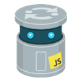

<h1>JS Intermediate JS</h1>
<!--~~~~~~~~~~~~~~~~~~~~~~~~~~~~~~~~~~~~~~~~~~~~~~~~~~~~~~~~~~~~~~~~~~~~~~~~~~~~~~~~~~~~~~~~~~~~-->
<!--~~~~~~~~~~~~~~~~~~~~~~~~~~~~~ readme.md of js-intermediate-js ~~~~~~~~~~~~~~~~~~~~~~~~~~~~~~-->
<!--~~~~~~~~~~~~~~~~~~~~~~~~~~~~~~~~~~~~~~~~~~~~~~~~~~~~~~~~~~~~~~~~~~~~~~~~~~~~~~~~~~~~~~~~~~~~-->
<h3 align="center">JS Intermediate JS</h3>

<h2>Intermediate/advanced material - 8 categories</h2>

<ul>
  <li><a href="https://www.patterns.dev/posts/classic-design-patterns/">
    JavaScript Design Patterns</a></li>
  <li><a href="https://mostly-adequate.gitbook.io/mostly-adequate-guide/">
    Professor Frisby's Mostly Adequate Guide to Functional Programming</a></li>
  <li><a href="https://www.youtube.com/watch?v=8aGhZQkoFbQ">
    What the heck is the event loop anyway?</a> -- JS Conf talk about the event loop</li>
  <li><a href="https://exploringjs.com/deep-js/index.html">
    Deep JavaScript: Theory &amp; Techniques</a></li>
</ul>

<h3>Key Concepts:</h3>

<ul>
  <li><b>Objects</b>:<br>
    Objects are the fundamental building blocks of JavaScript. They are collections of 
	key-value pairs, where keys are properties (variables) and values can be any data 
	type, including functions (methods).</li>
  <li><b>Prototypes</b>:<br>
    Every object in JavaScript has a prototype, which is another object from which it 
	inherits properties and methods. This allows for efficient sharing of behavior and 
	data between objects.</li>
  <li><b>Constructors</b>:<br>
    Constructors are special functions used to create objects with specific properties 
	and methods. They act as blueprints for objects.</li>
  <li><b>Classes (ES6)</b>:<br>
    Introduced in ECMAScript 2015 (ES6), classes provide a more syntactically familiar 
	way to define objects and their behavior. However, under the hood, they still 
	utilize prototypes.</li>
</ul>

<ol type="1">
  <li><h2>Advanced Data Types and Manipulation:</h2>
    <ul>
	  <li>Explore advanced data types like Sets, Maps, and Symbols.</li>
	  <li>Learn how to manipulate arrays and objects using advanced techniques such as 
	    destructuring, spreading, and rest parameters.</li>
	  <li>Understand how to use the Array methods like map, filter, reduce, and forEach 
	    effectively.</li>
    </ul>
  </li>
  <li><h2>Asynchronous JavaScript:</h2>
    <ul>
	  <li>Dive into asynchronous programming concepts like callbacks, promises, and 
	    async/await.</li>
	  <li>Learn how to handle asynchronous operations using techniques like chaining 
	    promises and error handling.</li>
	  <li>Understand how to make API calls and handle responses asynchronously.</li>
	</ul>
  </li>
  <li><h2>Object-Oriented Programming (OOP):</h2>
    <ul>
	  <li>Learn about OOP principles like encapsulation, inheritance, and polymorphism.</li>
	  <li>Explore how to create and use classes, constructors, and prototypes in 
	    JavaScript.</li>
	  <li>Understand the concept of "this" and how it behaves in different contexts.</li>
	</ul>
  </li>
  <li><h2>Functional Programming:</h2>
    <p>Functional programming in JavaScript is all about treating your code as a set of 
      independent, reusable functions that operate on data without side effects</p>
	<ul>
	  <li>Explore functional programming concepts like higher-order functions, pure 
	    functions, and immutability.</li>
	  <li>Learn how to use functional programming techniques like map, filter, and reduce 
	    to solve problems.</li>
	  <li>Understand the benefits of functional programming and how it can improve code 
	    readability and maintainability.</li>
	</ul>
  </li>
  <li><h2>Error Handling and Debugging:</h2>
    <ul>
	  <li>Learn how to handle and throw errors effectively in JavaScript.</li>
	  <li>Explore debugging techniques using browser developer tools and console statements.</li>
	  <li>Understand how to use try-catch blocks to handle exceptions and prevent 
	    application crashes.</li>
	</ul>
  </li>
  <li><h2>Modules and Bundlers:</h2>
    <ul>
	  <li>Learn how to organize your code into modules for better code organization and 
	    reusability.</li>
      <li>Explore popular module systems like CommonJS and ES modules.</li>
	  <li>Understand how to use bundlers like Webpack or Rollup to bundle and optimize 
	    your JavaScript code.</li>
	</ul>
  </li>
  <li><h2>Testing and Test-Driven Development (TDD):</h2>
    <ul>
	  <li>Learn how to write unit tests using frameworks like Jest or Mocha.</li>
      <li>Understand the principles of TDD and how to write tests before implementing 
        functionality.</li>
      <li>Explore techniques like mocking and stubbing to isolate dependencies during 
	    testing.</li>
	</ul>
  </li>
  <li><h2>Browser APIs and DOM Manipulation:</h2>
    <ul>
	  <li>Learn how to interact with the Document Object Model (DOM) using JavaScript.</li>
	  <li>Explore browser APIs like Fetch API, Local Storage, and Geolocation.</li>
	  <li>Understand how to manipulate HTML elements, handle events, and create dynamic 
	    web applications.</li>
	</ul>
  </li>
</ol>

<p>Remember, practice is key to mastering JavaScript. Work on small projects, solve 
coding challenges, and build real-world applications to solidify your understanding of 
these concepts. Good luck with your intermediate JavaScript education!</p>

<h3>Here are more details on each of the 8 topics:</h3>

<ol type="1">
  <li><h2>Advanced Data Types and Manipulation:</h2>
    <ul>
	  <li>Sets: Learn about the Set data structure, which allows you to store unique 
	    values of any type.<li>
	  <li>Maps: Explore the Map data structure, which stores key-value pairs and 
	    provides efficient lookup and manipulation.</li>
	  <li>Symbols: Understand the Symbol data type, which is used to create unique 
	    identifiers.</li>
	</ul>
  </li>
  <li><h2>Asynchronous JavaScript:</h2>
    <ul>
	  <li>Callbacks: Learn how to use callbacks to handle asynchronous operations by 
	    passing functions as arguments.</li>
	  <li>Promises: Understand the concept of promises, which represent the eventual 
	    completion or failure of an asynchronous operation.</li>
      <li>Async/Await: Explore the async/await syntax, which provides a more readable and 
	    synchronous-like way to write asynchronous code.</li>
	</ul>
  </li>
  <li><h2>Object-Oriented Programming (OOP):</h2>
    <ul>
	  <li>Encapsulation: Learn how to encapsulate data and behavior within objects using 
	    properties and methods.</li>
	  <li>Inheritance: Understand how to create class hierarchies and inherit properties 
	    and methods from parent classes.</li>
	  <li>Polymorphism: Explore the concept of polymorphism, which allows objects of 
	    different classes to be treated as the same type.</li>
	</ul>
  </li>
  <li><h2>Functional Programming:</h2>
    <ul>
	  <li>Higher-Order Functions: Learn how to work with functions as first-class citizens, 
	    allowing them to be passed as arguments or returned from other functions.</li>
	  <li>Pure Functions: Understand the concept of pure functions, which always produce 
	    the same output for the same input and have no side effects.</li>
	  <li>Immutability: Explore the benefits of immutability, where data cannot be changed 
	    once created, leading to more predictable and maintainable code.</li>
	</ul>
  </li>
</ol>

5.  Error Handling and Debugging:

    -   Throwing Errors: Learn how to throw custom errors using
        the throw keyword and handle them using try-catch blocks.

    -   Debugging Techniques: Explore techniques like console logging,
        breakpoints, and stepping through code to identify and fix
        issues.

    -   Error Handling Best Practices: Understand how to handle errors
        gracefully and provide meaningful error messages to users.

6.  Modules and Bundlers:

    -   Modules: Learn how to organize your code into separate files and
        export/import functionality using module systems like CommonJS
        or ES modules.

    -   Bundlers: Understand how bundlers like Webpack or Rollup can
        bundle your JavaScript modules into a single file, optimizing
        performance and handling dependencies.

7.  Testing and Test-Driven Development (TDD):

    -   Unit Testing: Learn how to write tests for individual units of
        code to ensure they behave as expected.

    -   Test Frameworks: Explore popular test frameworks like Jest or
        Mocha, which provide utilities for writing and running tests.

    -   Mocking and Stubbing: Understand how to create mock objects or
        stub functions to isolate dependencies and test specific parts
        of your code.

8.  Browser APIs and DOM Manipulation:

    -   DOM Manipulation: Learn how to access and manipulate HTML
        elements using JavaScript to create dynamic and interactive web
        pages.

    -   Browser APIs: Explore various browser APIs like Fetch API for
        making HTTP requests, Local Storage for client-side data
        storage, and Geolocation for retrieving user location.

Remember to practice each topic by building small projects or solving
coding challenges. This hands-on experience will help solidify your
understanding and improve your skills as an intermediate JavaScript
developer.

Certainly! Let's delve deeper into **Advanced Data Types and
Manipulation** in JavaScript, specifically focusing on Sets, Maps, and
Symbols. Additionally, I'll provide guidance on how to use GitHub for
managing your code and collaborating on projects related to these
topics.

1. Advanced Data Types

**Sets**

-   **Definition**: A Set is a collection of values where each value
    must be unique. It can store any type of data (primitive values or
    object references).

-   **Key Methods**:

    -   new Set(iterable): Creates a new Set. You can initialize it with
        an array or another iterable.

    -   add(value): Adds a new element to the Set.

    -   delete(value): Removes an element from the Set.

    -   has(value): Checks if a value exists in the Set.

    -   clear(): Removes all elements from the Set.

    -   size: Returns the number of elements in the Set.

**Example**:

<h4>javascript</h4>

<pre>
  const mySet = new Set(&lbrack;1, 2, 3, 4&rbrack;);
  mySet.add(5);
  mySet.delete(2);
  console.log(mySet.has(3)); // true
  console.log(mySet.size);   // 4
</pre>

<h5>Maps</h5>
  <ul>
    <li><b>Definition</b>: A Map is a collection of key-value pairs where keys can be of 
    any type (including objects), and each key must be unique.</li>
    <li><b>Key Methods</b>:
	<ul>
      <li>new Map(iterable): Creates a new Map. You can initialize it with
        an array of key-value pairs.</li>
	  <li>set(key, value): Adds a new key-value pair to the Map.</li>
	  <li>get(key): Retrieves the value associated with the key.</li>
	  <li>delete(key): Removes the key-value pair from the Map.</li>
	  <li>has(key): Checks if a key exists in the Map.</li>
	  <li>clear(): Removes all key-value pairs from the Map.</li>
	  <li>size: Returns the number of key-value pairs in the Map.</li>
	</ul>
	</li>
  </ul>
	

**Example**:

> **javascript**

<pre>
const myMap = new Map();
myMap.set(&apos;name&apos;, &apos;Alice&apos;);
myMap.set(&apos;age&apos;, 25);
console.log(myMap.get(&apos;name&apos;)); // Alice
console.log(myMap.size); // 2
</pre>

**Symbols**

-   **Definition**: A Symbol is a unique and immutable primitive value
    that can be used as an identifier for object properties.

-   **Key Characteristics**:

    -   Symbols are created using the Symbol() function.

    -   Each Symbol is unique, even if they have the same description.

    -   They are often used to avoid name clashes in object properties.

**Example**:

> **javascript**

<pre>
const sym1 = Symbol(&apos;description&apos;);
const sym2 = Symbol(&apos;description&apos;);
console.log(sym1 === sym2); // false
const obj = {
&lbrack;sym1&rbrack;: &apos;value1&apos;,
&lbrack;sym2&rbrack;: &apos;value2&apos;
};
console.log(obj&lbrack;sym1&rbrack;); // value1
</pre>

**2. Manipulating Advanced Data Types**

-   **Using Sets**: You can perform operations like union, intersection,
    and difference by combining Sets.

-   **Using Maps**: Maps can be used to create dictionaries or
    associative arrays, allowing for efficient data retrieval.

-   **Using Symbols**: Symbols can be used to create private properties
    in objects, enhancing encapsulation.

**3. Using GitHub for Code Management**

**Creating a Repository**

1.  **Sign in to GitHub**: Go to [GitHub](https://github.com/) and sign
    in or create an account.

2.  **Create a New Repository**:

    -   Click on the &quot;+&quot; icon in the top right corner and select &quot;New
        repository.&quot;

    -   Give your repository a name (e.g., advanced-data-types).

    -   Optionally, add a description and choose whether it should be
        public or private.

    -   Click &quot;Create repository.&quot;

**Cloning the Repository**

-   Use Git to clone the repository to your local machine:

> **bash**

<pre>
git clone https://github.com/yourusername/advanced-data-types.git
cd advanced-data-types
</pre>

**Adding Code**

-   Create a new JavaScript file (e.g., sets.js, maps.js, symbols.js)
    and implement examples of Sets, Maps, and Symbols.

-   Use git add to stage your changes:

> **bash**

<pre>
git add sets.js maps.js symbols.js
</pre>

**Committing Changes**

-   Commit your changes with a meaningful message:

> **bash**

<pre>
git commit -m &quot;Add examples for Sets, Maps, and Symbols&quot;
</pre>

**Pushing to GitHub**

-   Push your changes to the remote repository:

> **bash**

<pre>
git push origin main
</pre>

**Collaborating**

-   If you&apos;re working with others, you can create branches for new
    features or fixes:

> **bash**

<pre>
git checkout -b feature/sets-implementation
</pre>

-   After making changes, push the branch and create a pull request on
    GitHub for review.

**4. Resources for Learning**

-   **MDN Web Docs**: Comprehensive documentation
    on [Sets](https://developer.mozilla.org/en-US/docs/Web/JavaScript/Reference/Global_Objects/Set), [Maps](https://developer.mozilla.org/en-US/docs/Web/JavaScript/Reference/Global_Objects/Map),
    and [Symbols](https://developer.mozilla.org/en-US/docs/Web/JavaScript/Reference/Global_Objects/Symbol).

-   [**JavaScript.info**](http://javascript.info/): A great resource for
    in-depth tutorials on advanced JavaScript topics.

By using GitHub to manage your code, you can easily track changes,
collaborate with others, and showcase your work. This approach will help
you solidify your understanding of advanced data types in JavaScript
while also gaining experience with version control and collaboration
tools.

**[2. Asynchronous JavaScript]{.mark}
**Asynchronous JavaScript is a programming paradigm that allows
JavaScript to perform tasks without blocking the execution of other
code. This is particularly important in web development, where you want
to maintain a responsive user interface while performing tasks like
fetching data from a server or reading files.

To understand asynchronous JavaScript, we can break it down into several
sub-problems:

> **1. Understanding the Event Loop**

**What is the Event Loop?**

-   The event loop is a mechanism that allows JavaScript to perform
    non-blocking operations by using a single-threaded model.

> **How does it work?**

-   JavaScript executes code in a call stack. When asynchronous
    operations are initiated (like fetching data), they are sent to the
    Web APIs (like the browser&apos;s networking layer).

-   Once the operation completes, a callback function is placed in the
    message queue.

-   The event loop continuously checks the call stack and the message
    queue, executing the callback when the call stack is empty.

> **2. Callback Functions**
>
> **What are callbacks?**

-   A callback is a function passed as an argument to another function,
    which is then executed after some operation has been completed.

> **Example of a callback:**
>
> **javascript**
>
<pre>
**function fetchData(callback) {**
**setTimeout(() =&gt; {**
**const data = &apos;Data received&apos;;**
**callback(data);**
**}, 1000);**
**}**
**fetchData((data) =&gt; {**
**console.log(data); //** Outputs: Data received
**});**
</pre>

> **3. Promises**
>
> **What are Promises?**

-   A Promise is an object representing the eventual completion (or
    failure) of an asynchronous operation and its resulting value.

> **States of a Promise:**

-   Pending: The initial state, neither fulfilled nor rejected.

-   Fulfilled: The operation completed successfully.

-   Rejected: The operation failed.

> **Creating and using a Promise:**
>
> **javascript**
<pre>
> const fetchData = () =&gt; {
> return new Promise((resolve, reject) =&gt; {
> setTimeout(() =&gt; {
> const success = true; // Simulate success or failure
> if (success) {
> resolve(&apos;Data received&apos;);
> } else {
> reject(&apos;Error fetching data&apos;);
> }
> }, 1000);
> });
> };
> fetchData()
> .then(data =&gt; console.log(data)) // Outputs: Data received
> .catch(error =&gt; console.error(error));
</pre>

> **javascript, another example**
<pre>
> let myPromise = new Promise((resolve, reject) =&gt; {
> setTimeout(() =&gt; {
> resolve (&apos;Promise resolved&apos;);
> },2000);
> });
> myPromise.then((result) =&gt; {
> console.log(result); // Output after 2 seconds : &apos;Promise resolved&apos;
> });
</pre>

> **4. Async/Await**
>
> **What is Async/Await?**

-   Async/Await is a syntactic sugar built on top of Promises that
    allows you to write asynchronous code in a more synchronous fashion.

> **How to use Async/Await:**

-   You define a function with the async keyword, and within that
    function, you can use the await keyword to pause execution until the
    Promise is resolved.

> **Example:**
>
> **javascript**

<pre>
const fetchData = () =&gt; {
  return new Promise((resolve) =&gt; {
    setTimeout(() =&gt; {
      resolve(&apos;Data received&apos;);
    }, 1000);
  });
};

const getData = async () =&gt; {
  try {
    const data = await fetchData();
    console.log(data); // Outputs: Data received
  } catch (error) {
    console.error(error);
  }
};
getData();
</pre>

**5. Error Handling**
-   **Error handling in callbacks:**

    -   Typically done by passing an error as the first argument to the
        callback.

-   **Error handling in Promises:**

    -   Use .catch() to handle errors.

-   **Error handling with Async/Await:**

    -   Use try&hellip;catch blocks to handle errors.

**6. Practical Use Cases**

-   **Fetching data from APIs:**

    -   Use fetch() or libraries like Axios to make HTTP requests.

-   **Handling user interactions:**

    -   Use asynchronous code to respond to user actions without
        blocking the UI.

-   **Working with timers and intervals:**

    -   Use setTimeout and setInterval for delayed or repeated
        execution.

**Conclusion**

Asynchronous JavaScript is essential for building responsive web
applications. By understanding the event loop, callbacks, promises,
async/await, and error handling, you can effectively manage asynchronous
operations in your code.

[3. Object-Oriented Programming (OOP):]

Object-Oriented Programming (OOP) is a programming paradigm that uses
&quot;objects&quot; to represent data and methods to manipulate that data. OOP
is designed to improve code organization, reusability, and
maintainability. To understand OOP, we can break it down into several
key concepts and principles:

**1. Key Concepts of OOP**

**a. Objects**

-   **Definition:** An object is an instance of a class that contains
    properties (attributes) and methods (functions) that define its
    behavior.

-   **Example:**

> **javascript**

<pre>
const car = {
make: &apos;Toyota&apos;,
model: &apos;Corolla&apos;,
year: 2020,
start: function() {
console.log(&apos;Car started&apos;);
}
};
</pre>

**b. Classes**

-   **Definition:** A class is a blueprint for creating objects. It
    defines properties and methods that the created objects will have.

-   **Example:**

> **javascript**

<pre>
class Car {
constructor(make, model, year) {
this.make = make;
this.model = model;
this.year = year;
}
start() {
console.log(&apos;Car started&apos;);
}
}
const myCar = new Car(&apos;Toyota&apos;, &apos;Corolla&apos;, 2020);
</pre>

**2. OOP Principles**

**a. Encapsulation**

-   **Definition:** Encapsulation is the bundling of data (attributes)
    and methods (functions) that operate on that data within a single
    unit (class). It restricts direct access to some of an object&apos;s
    components.

-   **Example:** Using private properties in a class:

> **javascript**

<pre>
class BankAccount {
#balance; // Private property
constructor(initialBalance) {
this.#balance = initialBalance;
}
deposit(amount) {
this.#balance += amount;
}
getBalance() {
return this.#balance;
}
}
const account = new BankAccount(100);
account.deposit(50);
console.log(account.getBalance()); // Outputs: 150
</pre>

**b. Inheritance**

-   **Definition:** Inheritance allows a class (child class) to inherit
    properties and methods from another class (parent class). This
    promotes code reusability.

-   **Example:**

> **javascript**

<pre>
class Vehicle {
constructor(make, model) {
this.make = make;
this.model = model;
}
start() {
console.log(&apos;Vehicle started&apos;);
}
}
class Car extends Vehicle {
constructor(make, model, year) {
super(make, model); // Call the parent class constructor
this.year = year;
}
honk() {
console.log(&apos;Honk! Honk!&apos;);
}
}
const myCar = new Car(&apos;Toyota&apos;, &apos;Corolla&apos;, 2020);
myCar.start(); // Outputs: Vehicle started
myCar.honk(); // Outputs: Honk! Honk!
</pre>

**c. Polymorphism**

-   **Definition:** Polymorphism allows methods to do different things
    based on the object it is acting upon. It can be achieved through
    method overriding (inherited classes can provide a specific
    implementation of a method).

-   **Example:**

> **javascript**

<pre>
class Animal {
speak() {
console.log(&apos;Animal speaks&apos;);
}
}
class Dog extends Animal {
speak() {
console.log(&apos;Woof! Woof!&apos;);
}
}
class Cat extends Animal {
speak() {
console.log(&apos;Meow!&apos;);
}
}
const myDog = new Dog();
const myCat = new Cat();
myDog.speak(); // Outputs: Woof! Woof!
myCat.speak(); // Outputs: Meow!
</pre>

**d. Abstraction**

-   **Definition:** Abstraction is the concept of hiding the complex
    implementation details and showing only the essential features of an
    object. It can be achieved through abstract classes or interfaces.

-   **Example:**

> **javascript**

<pre>
class Shape {
area() {
throw new Error(&apos;Method &quot;area()&quot; must be implemented&apos;);
}
}
class Rectangle extends Shape {
constructor(width, height) {
super();
this.width = width;
this.height = height;
}
area() {
return this.width &ast; this.height;
}
}
const myRectangle = new Rectangle(5, 10);
console.log(myRectangle.area()); // Outputs: 50
</pre>

**3. Benefits of OOP**

-   **Modularity:** Code is organized into classes and objects, making
    it easier to manage.

-   **Reusability:** Classes can be reused across different parts of an
    application or in different projects.

-   **Maintainability:** Changes to a class can be made without
    affecting other parts of the code.

-   **Flexibility:** OOP allows for the creation of more flexible and
    adaptable code through inheritance and polymorphism.

**4. Practical Use Cases**

-   **Game Development:** OOP is widely used in game development to
    represent entities like players, enemies, and items.

-   **Web Development:** Frameworks like React and Angular use OOP
    principles to create reusable components.

-   **Software Engineering:** OOP is used in designing complex software
    systems, making them easier to understand and maintain.

**Conclusion**

Object-Oriented Programming is a powerful paradigm that helps in
organizing code, promoting reusability, and enhancing maintainability.
By understanding the key concepts and principles of OOP, developers can
create robust and scalable applications.

4.Functional Programming:

**Introduction**

Functional programming is a powerful paradigm that has gained
significant popularity in recent years, and it&apos;s a valuable approach to
writing clean, maintainable, and bug-free code in JavaScript.

In this article, we will explore the core concepts of functional
programming and provide practical JavaScript examples to help you grasp
these concepts more effectively.

**Understanding Functional Programming**

Imagine your JavaScript code as a series of cooking instructions. In the
traditional, imperative approach, you might follow a recipe step by
step, using various ingredients, tools, and changing the state of the
dish as you go. This is similar to how procedural code works.

Functional programming, on the other hand, is more like cooking with
functional ingredients. Each function takes some ingredients and
transforms them into a new dish without altering the original
ingredients. This immutability is a fundamental concept in functional
programming.

**First-Class Functions and Higher-Order Functions**

In JavaScript, functions are first-class citizens, which means they can
be assigned to variables, passed as arguments, and returned from other
functions. This is a crucial concept in functional programming. Consider
this analogy:

<pre>
// Function as a first-class citizen
const square = (x) =&gt; x &ast; x;
const add = (a, b) =&gt; a + b;
const mathOperation = square;
console.log(mathOperation(5)); // Output: 25
</pre>

Here, mathOperation is a variable that holds a reference to the square
function. It&apos;s like storing a cooking recipe for later use.

Higher-order functions are functions that operate on other functions,
either by taking them as arguments or returning them as results. This is
akin to having a recipe that asks for another recipe.

<pre>
// Function as a first-class citizen
const square = (x) =&gt; x &ast; x;
const add = (a, b) =&gt; a + b;
const mathOperation = square;
console.log(mathOperation(5)); // Output: 25
</pre>

In this example, the calculate function takes an operation (a function)
and two arguments. It&apos;s like creating a new dish by following the
instructions of another recipe.

**Immutability and Pure Functions**

In functional programming, immutability is key. Think of your data as an
unchangeable ingredient, and functions as your cooking instructions.
Avoid modifying the original data; instead, create new data structures
with the changes.

<pre>
// Immutability
const originalArray = &lbrack;1, 2, 3&rbrack;;
const newArray = originalArray.map((item) =&gt; item &ast; 2);
console.log(newArray); // Output: &lbrack;2, 4, 6&rbrack;
console.log(originalArray); // Output: &lbrack;1, 2, 3&rbrack;
</pre>

Pure functions are functions that always return the same output for the
same input and have no side effects. They&apos;re like well-defined recipes
that don&apos;t vary their outcome based on the chef&apos;s mood or external
factors.

<pre>
// Pure function
const double = (x) =&gt; x &ast; 2;
console.log(double(3)); // Output: 6
console.log(double(3)); // Output: 6
</pre>

**Map, Filter, and Reduce**

Map, filter, and reduce are fundamental array methods in JavaScript that
can greatly simplify your code and are core tools in functional
programming.

Imagine an array as a collection of ingredients. Mapping is like
transforming each ingredient into something else and creating a new
collection. Filtering is like picking specific ingredients that meet
your criteria, and reducing is like mixing all the ingredients to create
a final dish.

<pre>
// Using map, filter, and reduce
**const ingredients = &lbrack;1, 2, 3, 4, 5&rbrack;;**
**const transformedIngredients = ingredients.map((item) =&gt; item &ast;
2);**
**const filteredIngredients = ingredients.filter((item) =&gt; item % 2
=== 0);**

**const reducedIngredients = ingredients.reduce((acc, item) =&gt; acc +
item, 0);**

**console.log(transformedIngredients); //** Output: &lbrack;2, 4, 6, 8, 10&rbrack;

**console.log(filteredIngredients); //** Output: &lbrack;2, 4&rbrack;

**console.log(reducedIngredients); //** Output: 15
</pre>

**Conclusion**

Functional programming in JavaScript is all about treating your code as
a set of independent, reusable functions that operate on data without
side effects. By understanding first-class functions, higher-order
functions, immutability, pure functions, and using tools like map,
filter, and reduce, you can write more readable, maintainable, and
bug-free code.

Just like a skilled chef, functional programmers use the right
ingredients and techniques to create exquisite dishes. So, next time you
write JavaScript code, think of it as crafting a gourmet meal with
functional ingredients -- your code will be not only delicious but also
easy to maintain and extend.

Functional programming is a paradigm of building computer programs using
expressions and functions without mutating state and data.

By respecting these restrictions, functional programming aims to write
code that is clearer to understand and more bug resistant. This is
achieved by avoiding using flow-control statements
(for, while, break, continue, goto) which make the code harder to
follow. Also, functional programming requires us to write pure,
deterministic functions which are less likely to be buggy.

In this article, we will talk about doing functional programming using
JavaScript. We will also explore various JavaScript methods and features
that make it possible. In the end, we will explore different concepts
associated with functional programming and see why they are so powerful.

Before getting into functional programming, though, one needs to
understand the difference between pure and impure functions.

**Pure vs. Impure Functions**

Pure functions take some input and give a fixed output. Also, they cause
no side effects in the outside world.

<pre>
const add = (a, b) =&gt; a + b;
</pre>

Here, add is a pure function. This is because, for a fixed value
of a and b, the output will always be the same.

<pre>
const SECRET = 42;
const getId = (a) =&gt; SECRET &ast; a;
</pre>

getId is not a pure function. The reason being that it uses the global
variable SECRET for computing the output. If SECRET were to change,
the getId function will return a different value for the same input.
Thus, it is not a pure function.

<pre>
let id_count = 0;
const getId = () =&gt; ++id_count;
</pre>

This is also an impure function, and that too for a couple of
reasons---(1) it uses a non-local variable for computing its output, and
(2) it creates a side effect in the outside world by modifying a
variable in that world.
<!--~~~~~~~~~~~~~~~~~~~~~~~~~~~~~~~~~~~~~~~~~~~~~~~~~~~~~~~~~~~~~~~~~~~~~~~~~~~~~~~~~~~~~~~~~~~~-->
<!--~~~~~~~~~~~~~~~~~~~~~~~~~~ 01. getid is impure illustration (01) ~~~~~~~~~~~~~~~~~~~~~~~~~~~-->
<p align="center">

</p>
<!--  -->
<!-- {width="5.0in" height="1.66292760279965in"} -->

This can be troublesome if we had to debug this code.

What's the current value of id_count? Which other functions are
modifying id_count? Are there other functions relying on id_count?

Because of these reasons, we only use pure functions in functional
programming.

Another benefit of pure functions is that they can be parallelized and
memoized. Have a look at the previous two functions. It's impossible to
parallelize or memoize them. This helps in creating performant code.

The Tenets of Functional Programming

So far, we have learned that functional programming is dependent on a
few rules. They are as follows.

1.  Don't mutate data

2.  Use pure functions: fixed output for fixed inputs, and no side
    effects

3.  Use expressions and declarations

When we satisfy these conditions, we can say our code is functional.

**Functional Programming in JavaScript**

JavaScript already has some functions that enable functional
programming.
Example: [String.prototype.slice](https://developer.mozilla.org/en-US/docs/Web/JavaScript/Reference/Global_Objects/String/slice), [Array.protoype.filter](https://developer.mozilla.org/en-US/docs/Web/JavaScript/Reference/Global_Objects/Array/filter), [Array.prototype.join](https://developer.mozilla.org/en-US/docs/Web/JavaScript/Reference/Global_Objects/Array/join).

On the other
hand, [Array.prototype.forEach](https://developer.mozilla.org/en-US/docs/Web/JavaScript/Reference/Global_Objects/Array/forEach), [Array.prototype.push](https://developer.mozilla.org/en-US/docs/Web/JavaScript/Reference/Global_Objects/Array/push) are
impure functions.

One can argue that Array.prototype.forEach is not an impure function by
design but think about it---it's not possible to do anything with it
except mutating non-local data or doing side effects. Thus, it's okay to
put it in the category of impure functions.

Also, JavaScript has
a [const](https://developer.mozilla.org/en-US/docs/Web/JavaScript/Reference/Statements/const) declaration,
which is perfect for functional programming since we won't be mutating
any data.

**Pure Functions in JavaScript**

Let's look at some of the pure functions (methods) given by JavaScript.

**Filter**

As the name suggests, this filters the array.

array.filter(condition);

The condition here is a function that gets each item of the array, and
it should decide whether to keep the item or not and return the truthy
boolean value for that.

<pre>
const filterEven = x =&gt; x%2 === 0;
&lbrack;1, 2, 3&rbrack;.filter(filterEven);
// &lbrack;2&rbrack;
</pre>

Notice that filterEven is a pure function. If it had been impure, then
it would have made the entire filter call impure.

**Map**

map maps each item of array to a function and creates a new array based
on the return values of the function calls.

<pre>
array.map(mapper)
</pre>

mapper is a function that takes an item of an array as input and returns
the output.

<pre>
const double = x =&gt; 2 &ast; x;
&lbrack;1, 2, 3&rbrack;.map(double);
// &lbrack;2, 4, 6&rbrack;
</pre>

**Reduce**

reduce reduces the array to a single value.

<pre>
array.reduce(reducer);
</pre>

reducer is a function that takes the accumulated value and the next item
in the array and returns the new value. It is called like this for all
values in the array, one after another.

<pre>
const sum = (accumulatedSum, arrayItem) =&gt; accumulatedSum + arrayItem
&lbrack;1, 2, 3&rbrack;.reduce(sum);
// 6
</pre>
<!--~~~~~~~~~~~~~~~~~~~~~~~~~~~~~~~~~~~~~~~~~~~~~~~~~~~~~~~~~~~~~~~~~~~~~~~~~~~~~~~~~~~~~~~~~~~~-->
<!--~~~~~~~~~~~~~~~~~~~~~~~~~~~~ 02. reduce call illustration (xx) ~~~~~~~~~~~~~~~~~~~~~~~~~~~~~-->
<p align="center">

</p>
<!--  -->
<!-- {width="5.0in" height="2.616453412073491in"} -->

**Concat**

concat adds new items to an existing array to create a new array. It's
different from push() in the sense that push() mutates data, which makes
it impure.

<pre>
&lbrack;1, 2&rbrack;.concat(&lbrack;3, 4&rbrack;)
// &lbrack;1, 2, 3, 4&rbrack;
</pre>

You can also do the same using
the [spread](https://developer.mozilla.org/en-US/docs/Web/JavaScript/Reference/Operators/Spread_syntax) operator.

<pre>
&lbrack;1, 2, &hellip;&lbrack;3, 4&rbrack;&rbrack;
</pre>

Object.assign

Object.assign copies values from the provided object to a new object.
Since functional programming is predicated on immutable data, we use it
to make new objects based on existing objects.

<pre>
const obj = {a : 2};
const newObj = Object.assign({}, obj);
newObj.a = 3;
obj.a;
// 2
</pre>

With the advent of [ES6](http://es6-features.org/), this can also be
done using the spread operator.

<pre>
const newObj = {&hellip;obj};
</pre>

**Creating Your Own Pure Function**

We can create our pure function as well. Let's do one for duplicating a
string n number of times.

<pre>
const duplicate = (str, n) =&gt;
n &lt; 1 ? &apos;&apos; : str + duplicate(str, n-1);
</pre>

This function duplicates a string n times and returns a new string.

<pre>
duplicate(&apos;hooray!&apos;, 3)
// hooray!hooray!hooray!
</pre>

**Higher-order Functions**

Higher-order functions are functions that accept a function as an
argument and return a function. Often, they are used to add to the
functionality of a function.

<pre>
const withLog = (fn) =&gt; {
return (&hellip;args) =&gt; {
console.log(&grave;calling &dollar;{fn.name}&grave;);
return fn(&hellip;args);
};
};
</pre>

In the above example, we create a withLog higher-order function that
takes a function and returns a function that logs a message before the
wrapped function runs.

<pre>
const add = (a, b) =&gt; a + b;
const addWithLogging = withLog(add);
addWithLogging(3, 4);
// calling add
// 7
</pre>

withLog HOF can be used with other functions as well and it works
without any conflicts or writing extra code. This is the beauty of a
HOF.

<pre>
const addWithLogging = withLog(add);
const hype = s =&gt; s + &apos;!!!&apos;;
const hypeWithLogging = withLog(hype);
hypeWithLogging(&apos;Sale&apos;);
// calling hype
// Sale!!!
</pre>

One can also call it without defining a combining function.

<pre>
withLog(hype)(&apos;Sale&apos;);
// calling hype
// Sale!!!
</pre>

**Currying**

Currying means breaking down a function that takes multiple arguments
into one or multiple levels of higher-order functions.

Let's take the add function.

<pre>
const add = (a, b) =&gt; a + b;
</pre>

When we are to curry it, we rewrite it distributing arguments into
multiple levels as follows.

<pre>
const add = a =&gt; {
return b =&gt; {
return a + b;
};
};
add(3)(4);
// 7
</pre>

The benefit of currying is memoization. We can now memoize certain
arguments in a function call so that they can be reused later without
duplication and re-computation.

<pre>
// assume getOffsetNumer() call is expensive
const addOffset = add(getOffsetNumber());
addOffset(4);
// 4 + getOffsetNumber()
addOffset(6);
</pre>

This is certainly better than using both arguments everywhere.

<pre>
// (X) DON&quot;T DO THIS
add(4, getOffsetNumber());
add(6, getOffsetNumber());
add(10, getOffsetNumber());
</pre>

We can also reformat our curried function to look succinct. This is
because each level of the currying function call is a single line return
statement. Therefore, we can use [arrow
functions](https://developer.mozilla.org/en-US/docs/Web/JavaScript/Reference/Functions/Arrow_functions) in
ES6 to refactor it as follows.

<pre>
const add = a =&gt; b =&gt; a + b;
</pre>

**Composition**

In mathematics, composition is defined as passing the output of one
function into input of another so as to create a combined output. The
same is possible in functional programming since we are using pure
functions.

To show an example, let's create some functions.

The first function is range, which takes a starting number a and an
ending number b and creates an array consisting of numbers from a to b.

<pre>
const range = (a, b) =&gt; a &gt; b ? &lbrack;&rbrack; : &lbrack;a, &hellip;range(a+1, b)&rbrack;;
</pre>

Then we have a function multiply that takes an array and multiplies all
the numbers in it.

<pre>
const multiply = arr =&gt; arr.reduce((p, a) =&gt; p &ast; a);
</pre>

We will use these functions together to calculate factorial.

<pre>
const factorial = n =&gt; multiply(range(1, n));
factorial(5);
// 120
factorial(6);
// 720
</pre>

The above function for calculating factorial is similar to f(x) =
g(h(x)), thus demonstrating the composition property.

5.Error Handling and Debugging:

Error handling and debugging are crucial aspects of JavaScript
development that help identify and resolve issues in the code. Proper
error handling ensures that unexpected errors are caught and gracefully
handled, while effective debugging techniques help developers find and
fix bugs during the development process.

When any error occurs, JavaScript will stop and generate an error
message. The throw statement lets you create your own custom error.
Technically you can throw your custom exception (throw an error). The
exception can be a JavaScript Number, String, Boolean, or Object.

**Debugging Techniques in Programming:**

1.  Breakpoints: By setting breakpoints in the code, you can pause the
    program at specific points, check variables, and closely examine the
    program&apos;s current state. &hellip;

2.  Step Through: Examining the code line by line aids in identifying
    the precise location of an error. &hellip;

3.  Watch Variables:

There are three main types of errors that can occur while compiling a
JavaScript program: syntax errors, runtime errors, and logical errors.
The most common type of errors are syntax errors, in which something
incorrect in the syntax of the program body raises this error.

One of the simplest ways to debug JavaScript code is by using
console. log() statements to output variable values or messages to the
console. This can help you identify the point at which your code starts
to break down or behave unexpectedly. console.

Expert developers expect the unexpected. If something can go wrong, it
will go wrong --- *typically, the moment the first user accesses your
new web system*.

We can avoid some web application errors like so:

-   A good editor or linter can catch syntax errors.

-   Good validation can catch user input errors.

-   Robust test processes can spot logic errors.

Yet errors remain. Browsers may fail or not support an API we're using.
Servers can fail or take too long to respond. Network connectivity can
fail or become unreliable. Issues may be temporary, but we can't code
our way around such problems. However, we can anticipate problems, take
remedial actions, and make our application more resilient.

**Showing an Error Message is the Last Resort**

Ideally, users should never see error messages.

We may be able to ignore minor issues, such as a decorative image
failing to load. We could address more serious problems such as Ajax
data-save failures by [storing data
locally](https://www.sitepoint.com/client-side-storage-options-comparison/) and
uploading later. An error only becomes necessary when the user is at
risk of losing data --- *presuming they can do something about it*.

It's therefore necessary to catch errors as they occur and determine the
best action. Raising and catching errors in a JavaScript application can
be daunting at first, but it's possibly easier than you expect.

**How JavaScript Processes Errors**

When a JavaScript statement results in an error, it's said to **throw an
exception**. JavaScript creates and throws an Error object describing
the error. We can see this in action in [this CodePen
demo](https://codepen.io/craigbuckler/pen/JjBJJPO?editors=0011). If we
set the **decimal places** to a negative number, we'll see an error
message in the console at the bottom. (*Note that we're not embedding
the CodePens in this tutorial, because you need to be able to see the
console output for them to make sense.*)

The result won't update, and we'll see a RangeError message in the
console. The following function throws the error when dp is negative:

<pre>
// division calculation
function divide(v1, v2, dp) {
return (v1 / v2).toFixed(dp);
}
</pre>

After throwing the error, the JavaScript interpreter checks
for exception handling code. None is present in the divide() function,
so it checks the calling function:

<pre>
// show result of division
function showResult() {
result.value = divide(
parseFloat(num1.value),
parseFloat(num2.value),
parseFloat(dp.value)
);
}
</pre>

The interpreter repeats the process for every function on the call stack
until one of these things happens:

-   it finds an exception handler

-   it reaches the top level of code (which causes the program to
    terminate and show an error in the console, as demonstrated in the
    CodePen example above)

**Catching Exceptions**

We can add an exception handler to the divide() function with
a [try...catch
block](https://developer.mozilla.org/docs/Web/JavaScript/Reference/Statements/try%E2%80%A6catch):

<pre>
// division calculation
function divide(v1, v2, dp) {
try {
return (v1 / v2).toFixed(dp);
}
catch(e) {
console.log(&grave;
error name : &dollar;{ e.name }
error message: &dollar;{ e.message }
&grave;);
return &apos;ERROR&apos;;
}
}
</pre>

This executes the code in the try {} block but, when an exception
occurs, the catch {} block executes and receives the thrown error
object. As before, try setting the **decimal places** to a negative
number in [this CodePen
demo](https://codepen.io/SitePoint/pen/oNMqJjz?editors=1011).

The **result** now shows **ERROR**. The console shows the error name and
message, but this is output by the console.log statement and doesn't
terminate the program.

*Note: this demonstration of a try&hellip;catch block is overkill for a
basic function such as divide(). It's simpler to ensure dp is zero or
higher, as we'll see below.*

We can define an optional finally {} block if we require code to run
when either the try or catch code executes:

<pre>
function divide(v1, v2, dp) {
try {
return (v1 / v2).toFixed(dp);
}
catch(e) {
return &apos;ERROR&apos;;
}
finally {
console.log(&apos;done&apos;);
}
}
</pre>

The console outputs &quot;done&quot;, whether the calculation succeeds or raises
an error. A finally block typically executes actions which we'd
otherwise need to repeat in both the try and the catch block --- such as
cancelling an API call or closing a database connection.

A try block requires either a catch block, a finally block, or both.
Note that, when a finally block contains a return statement, that value
becomes the return value for the whole function; other return statements
in try or catch blocks are ignored.

**Nested Exception Handlers**

What happens if we add an exception handler to the
calling showResult() function?

<pre>
// show result of division
function showResult() {
try {
result.value = divide(
parseFloat(num1.value),
parseFloat(num2.value),
parseFloat(dp.value)
);
}
catch(e) {
result.value = &apos;FAIL!&apos;;
}
}
</pre>

The answer is ... *nothing!* This catch block is never reached, because
the catch block in the divide() function handles the error.

However, we could
programmatically [throw](https://developer.mozilla.org/en-US/docs/Web/JavaScript/Reference/Statements/throw) a
new Error object in divide() and optionally pass the original error in
a cause property of the second argument:

<pre>
function divide(v1, v2, dp) {
try {
return (v1 / v2).toFixed(dp);
}
catch(e) {
throw new Error(&apos;ERROR&apos;, { cause: e });
}
}
</pre>

This will trigger the catch block in the calling function:

<pre>
// show result of division
function showResult() {
try {
//&hellip;
}
catch(e) {
console.log( e.message ); // ERROR
console.log( e.cause.name ); // RangeError
result.value = &apos;FAIL!&apos;;
}
}
</pre>

**Standard JavaScript Error Types**

When an exception occurs, JavaScript creates and throws an object
describing the error using one of the following types.

**SyntaxError**

An error thrown by syntactically invalid code such as a missing bracket:

<pre>
if condition) { // SyntaxError
console.log(&apos;condition is true&apos;);
}
</pre>

*Note: languages such as C++ and Java report syntax errors during
compilation. JavaScript is an interpreted language, so syntax errors
aren't identified until the code runs. Any good code editor or linter
can spot syntax errors before we attempt to run code.*

**ReferenceError**

An error thrown when accessing a non-existent variable:

<pre>
function inc() {
value++; // ReferenceError
}
</pre>

Again, good code editors and linters can spot these issues.

**TypeError**

An error thrown when a value isn't of an expected type, such as calling
a non-existent object method:

<pre>
const obj = {};
obj.missingMethod(); // TypeError
</pre>

**RangeError**

An error thrown when a value isn't in the set or range of allowed
values. The [toFixed()
method](https://developer.mozilla.org/en-US/docs/Web/JavaScript/Reference/Global_Objects/Number/toFixed) used
above generates this error, because it expects a value typically between
0 and 100:

<pre>
const n = 123.456;
console.log( n.toFixed(-1) ); // RangeError
</pre>

**URIError**

An error thrown by URI-handling functions such
as [encodeURI()](https://developer.mozilla.org/en-US/docs/Web/JavaScript/Reference/Global_Objects/encodeURI) and [decodeURI()](https://developer.mozilla.org/en-US/docs/Web/JavaScript/Reference/Global_Objects/decodeURI) when
they encounter malformed URIs:

<pre>
const u = decodeURIComponent(&apos;%&apos;); // URIError
</pre>

**EvalError**

An error thrown when passing a string containing invalid JavaScript code
to the [eval()
function](https://developer.mozilla.org/en-US/docs/Web/JavaScript/Reference/Global_Objects/eval):

<pre>
eval(&apos;console.logg x;&apos;); // EvalError
</pre>

*Note: please don't use eval()! Executing arbitrary code contained in a
string possibly constructed from user input is far too dangerous!*

**AggregateError**

An error thrown when several errors are wrapped in a single error. This
is typically raised when calling an operation such
as [Promise.all()](https://developer.mozilla.org/en-US/docs/Web/JavaScript/Reference/Global_Objects/Promise/all),
which returns results from any number of promises.

**InternalError**

A non-standard (Firefox only) error thrown when an error occurs
internally in the JavaScript engine. It's typically the result of
something taking too much memory, such as a large array or "too much
recursion".

**Error**

Finally, there is a generic Error object which is most often used when
implementing our own exceptions ... which we'll cover next.

**Throwing Our Own Exceptions**

We can throw our own exceptions when an error occurs --- *or should
occur*. For example:

-   our function isn't passed valid parameters

-   an Ajax request fails to return expected data

-   a DOM update fails because a node doesn't exist

The throw statement actually accepts any value or object. For example:

<pre>
throw &apos;A simple error string&apos;;
throw 42;
throw true;
throw { message: &apos;An error&apos;, name: &apos;MyError&apos; };
</pre>

Exceptions are thrown to every function on the call stack until they're
intercepted by an exception (catch) handler. More practically, however,
we'll want to [create and throw
an Error object](https://developer.mozilla.org/en-US/docs/Web/JavaScript/Reference/Global_Objects/Error/Error) so
they act identically to standard errors thrown by JavaScript.

We can create a generic Error object by passing an optional message to
the constructor:

<pre>
throw new Error(&apos;An error has occurred&apos;);
</pre>

We can also use Error like a function without new. It returns
an Error object identical to that above:

<pre>
throw Error(&apos;An error has occurred&apos;);
</pre>

We can optionally pass a filename and a line number as the second and
third parameters:

<pre>
throw new Error(&apos;An error has occurred&apos;, &apos;script.js&apos;, 99);
</pre>

This is rarely necessary, since they default to the file and line where
we threw the Error object. *(They're also difficult to maintain as our
files change!)*

We can define generic Error objects, but we should use a [standard Error
type](https://www.sitepoint.com/javascript-error-handling/#standardjavascripterrortypes) when
possible. For example:

<pre>
throw new RangeError(&apos;Decimal places must be 0 or greater&apos;);
</pre>

All Error objects have the following properties, which we can examine in
a catch block:

-   .name: the name of the Error type --- such as Error or RangeError

-   .message: the error message

The following non-standard properties are also supported in Firefox:

-   .fileName: the file where the error occurred

-   .lineNumber: the line number where the error occurred

-   .columnNumber: the column number on the line where the error
    occurred

-   .stack: a stack trace listing the function calls made before the
    error occurred

We can change the divide() function to throw a RangeError when the
number of decimal places isn't a number, is less than zero, or is
greater than eight:

<pre>
// division calculation
function divide(v1, v2, dp) {
if (isNaN(dp) &vert;&vert; dp &lt; 0 &vert;&vert; dp &gt; 8) {
throw new RangeError(&apos;Decimal places must be between 0 and 8&apos;);
}
return (v1 / v2).toFixed(dp);
}
</pre>

Similarly, we could throw an Error or TypeError when
the **dividend** value isn't a number to prevent NaN results:

<pre>
if (isNaN(v1)) {
throw new TypeError(&apos;Dividend must be a number&apos;);
}
</pre>

We can also cater for **divisors** that are non-numeric or zero.
JavaScript
returns [Infinity](https://developer.mozilla.org/en-US/docs/Web/JavaScript/Reference/Global_Objects/Infinity) when
dividing by zero, but that could confuse users. Rather than raising a
generic Error, we could create a custom DivByZeroError error type:

<pre>
// new DivByZeroError Error type
class DivByZeroError extends Error {
constructor(message) {
super(message);
this.name = &apos;DivByZeroError&apos;;
}
}
</pre>

Then throw it in the same way:

<pre>
if (isNaN(v2) &vert;&vert; !v2) {
throw new DivByZeroError(&apos;Divisor must be a non-zero number&apos;);
}
</pre>

Now add a try&hellip;catch block to the calling showResult() function. It
can receive any Error type and react accordingly --- in this case,
showing the error message:

<pre>
// show result of division
function showResult() {
try {
result.value = divide(
parseFloat(num1.value),
parseFloat(num2.value),
parseFloat(dp.value)
);
errmsg.textContent = &apos;&apos;;
}
catch (e) {
result.value = &apos;ERROR&apos;;
errmsg.textContent = e.message;
console.log( e.name );
}
}
</pre>

Try entering invalid non-numeric, zero, and negative values into [this
CodePen demo](https://codepen.io/SitePoint/pen/QWBmzdz?editors=0011).

The final version of the divide() function checks all the input values
and throws an appropriate Error when necessary:

<pre>
// division calculation
function divide(v1, v2, dp) {
if (isNaN(v1)) {
throw new TypeError(&apos;Dividend must be a number&apos;);
}
if (isNaN(v2) &vert;&vert; !v2) {
throw new DivByZeroError(&apos;Divisor must be a non-zero number&apos;);
}
if (isNaN(dp) &vert;&vert; dp &lt; 0 &vert;&vert; dp &gt; 8) {
throw new RangeError(&apos;Decimal places must be between 0 and 8&apos;);
}
return (v1 / v2).toFixed(dp);
}
</pre>

It's no longer necessary to place a try&hellip;catch block around the
final return, since it should never generate an error. If one did occur,
JavaScript would generate its own error and have it handled by
the catch block in showResult().

**Asynchronous Function Errors**

We can't catch exceptions thrown by callback-based asynchronous
functions, because an error is thrown after the try&hellip;catch block
completes execution. This code looks correct, but the catch block will
never execute and the console displays an Uncaught Error message after
one second:

<pre>
function asyncError(delay = 1000) {
setTimeout(() =&gt; {
throw new Error(&apos;I am never caught!&apos;);
}, delay);
}
try {
asyncError();
}
catch(e) {
console.error(&apos;This will never run&apos;);
}
</pre>

The convention presumed in most frameworks and server runtimes such as
Node.js is to return an error as the first parameter to a callback
function. That won't raise an exception, although we could manually
throw an Error if necessary:

<pre>
function asyncError(delay = 1000, callback) {
setTimeout(() =&gt; {
callback(&apos;This is an error message&apos;);
}, delay);
}
asyncError(1000, e =&gt; {
if (e) {
throw new Error(&grave;error: &dollar;{ e }&grave;);
}
});
</pre>

**Promise-based Errors**

Callbacks can become unwieldy, so it's preferable to
use [promises](https://www.sitepoint.com/overview-javascript-promises/) when
writing asynchronous code. When an error occurs, the
promise's reject() method can return a new Error object or any other
value:

<pre>
function wait(delay = 1000) {
return new Promise((resolve, reject) =&gt; {
if (isNaN(delay) &vert;&vert; delay &gt; 0) {
reject( new TypeError(&apos;Invalid delay&apos;) );
}
else {
setTimeout(() =&gt; {
resolve(&grave;waited &dollar;{ delay } ms&grave;);
}, delay);
}
})
}
</pre>

*Note: functions must be either 100% synchronous or 100% asynchronous.
This is why it's necessary to check the delay value inside the returned
promise. If we checked the delay value and threw an
error **before** returning the promise, the function would become
synchronous when an error occurred.*

The [Promise.catch()
method](https://www.sitepoint.com/overview-javascript-promises/#thecatchmethod) executes
when passing an invalid delay parameter and it receives to the
returned Error object:

<pre>
// invalid delay value passed
wait(&apos;INVALID&apos;)
.then( res =&gt; console.log( res ))
.catch( e =&gt; console.error( e.message ) )
.finally( () =&gt; console.log(&apos;complete&apos;) );
</pre>

Personally, I find promise chains a little difficult to read.
Fortunately, we can use await to call any function which returns a
promise. This must occur inside an async function, but we can capture
errors using a standard try&hellip;catch block.

The following (immediately invoked) async function is functionally
identical to the promise chain above:

<pre>
(async () =&gt; {
  try {
    console.log( await wait(&apos;INVALID&apos;) );
  }
  catch (e) {
    console.error( e.message );
  }
  finally {
    console.log(&apos;complete&apos;);
  }
})();
</pre>

**Exceptional Exception Handling**

Throwing Error objects and handling exceptions is easy in JavaScript:

<pre>
try {
throw new Error(&apos;I am an error!&apos;);
}
catch (e) {
console.log(&grave;error &dollar;{ e.message }&grave;)
}
</pre>

Building a resilient application that reacts appropriately to errors and
makes life easy for users is more challenging. Always expect the
unexpected.

**Further information:**

-   [MDN Control Flow and Error
    Handling](https://developer.mozilla.org/en-US/docs/Web/JavaScript/Guide/Control_flow_and_error_handling)

-   [MDN
    try...catch](https://developer.mozilla.org/docs/Web/JavaScript/Reference/Statements/try%E2%80%A6catch)

-   [MDN Error
    object](https://developer.mozilla.org/en-US/docs/Web/JavaScript/Reference/Global_Objects/Error)

**Frequently Asked Questions (FAQs) on JavaScript Error Handling**

**What are the different types of errors in JavaScript?**

JavaScript has three types of errors: Syntax Errors, Runtime Errors, and
Logical Errors. Syntax Errors occur when there is an issue with the
structure of your code, such as a missing bracket or semicolon. Runtime
Errors happen when the code is syntactically correct but fails to
execute due to unforeseen circumstances like referencing an undefined
variable. Logical Errors are the most challenging to debug as they occur
when the code runs without crashing, but it doesn't produce the expected
outcome.

**How can I handle errors in JavaScript?**

JavaScript provides several mechanisms for error handling, including
try-catch-finally blocks, throwing exceptions, and using error events.
The try-catch-finally block is the most common method. It allows you to
"try" a block of code and "catch" any errors that occur. The "finally"
block will execute regardless of whether an error was thrown.

**What is the purpose of the 'throw' statement in JavaScript?**

The 'throw' statement allows you to create custom error messages in
JavaScript. It's useful when you want to generate an error that the
JavaScript engine wouldn't typically produce. For example, you might
want to throw an error if a function argument is not of the expected
type.

**How can I create a custom error in JavaScript?**

You can create a custom error in JavaScript by defining a new object
that inherits from the Error constructor. This new object can then be
thrown using the 'throw' statement. This is useful when you want to
provide more specific error information than the standard Error types
provide.

**What is the difference between 'null' and 'undefined' in JavaScript?**

In JavaScript, 'null' and 'undefined' both represent the absence of
value. However, they are used in slightly different contexts.
'Undefined' means a variable has been declared but has not yet been
assigned a value. On the other hand, 'null' is an assignment value that
represents no value or no object.

**How can I debug JavaScript errors?**

Debugging JavaScript errors can be done using various tools and
techniques. Most modern browsers come with built-in developer tools that
include a JavaScript console, which displays errors and allows you to
interact with your code. You can also use breakpoints to pause code
execution and inspect the current state.

**What is 'strict mode' in JavaScript and how does it help with error
handling?**

Strict mode' is a feature in JavaScript that helps catch common coding
mistakes and "unsafe" actions. For example, in strict mode, variables
must be declared with 'var', 'let', or 'const'. Trying to use an
undeclared variable will result in an error. This can help prevent bugs
that are difficult to detect.

**What is the difference between a 'TypeError' and a 'ReferenceError' in
JavaScript?**

A 'TypeError' occurs when an operation could not be performed, typically
when a value is not of the expected type. A 'ReferenceError' is thrown
when trying to dereference a variable that has not been declared.

**How can I handle asynchronous errors in JavaScript?**

Asynchronous errors can be handled using promises or async/await.
Promises have 'catch' and 'finally' methods similar to try-catch-finally
blocks. With async/await, you can use a try-catch block to handle errors
in asynchronous code.

**What is the 'onerror' event handler in JavaScript?**

The 'onerror' event handler is a global event handler in JavaScript that
catches errors that occur in the window context. It can be used to log
uncaught exceptions or to handle them in a custom way.

Throwing Error objects and handling exceptions is easy in JavaScript:


<pre>
try {
throw new Error(&apos;I am an error!&apos;);
}
catch (e) {
console.log(&grave;error &dollar;{ e.message }&grave;)
}
</pre>

6. Modules and Bundlers:

In JavaScript, modules and bundlers play a crucial role in organizing
and optimizing code for modern web development. Here&apos;s a breakdown:

**Modules:**

-   What they are:

Modules are self-contained units of code that encapsulate
functionality. They allow you to break down your code into smaller,
manageable pieces, making it easier to maintain and reuse.

-   Benefits:

    -   Organization: Modules help you organize your code by separating
        concerns into logical units.

    ```{=html}
    <!-- -->
    ```
    -   Reusability: You can easily reuse modules across different parts
        of your application or even in other projects.

    ```{=html}
    <!-- -->
    ```
    -   Encapsulation: Modules hide their internal implementation
        details, exposing only what&apos;s necessary.

-   Syntax:

JavaScript supports two main module formats:

-   CommonJS: Used primarily in Node.js, it uses require to import
    modules and module.exports to export them.

```{=html}
<!-- -->
```
-   ES Modules: The standard module format in modern JavaScript, it
    uses import and export statements.

**Example (ES Modules):**

**JavaScript**

<pre>
// module1.js
export function greet(name) {
console.log(&grave;Hello, &dollar;{name}!&grave;);
}

// app.js
import { greet } from &apos;./module1.js&apos;;
greet(&apos;World&apos;);
</pre>

**Bundlers:**

-   What they are:

Bundlers are tools that take multiple JavaScript modules and combine
them into a single file (or a few files) that can be efficiently loaded
by a browser.

-   Benefits:

    -   Reduced network requests: Browsers have limitations on the
        number of simultaneous requests they can make. Bundling reduces
        the number of files to be fetched, improving performance.

    ```{=html}
    <!-- -->
    ```
    -   Dependency management: Bundlers automatically resolve
        dependencies between modules, ensuring that all required code is
        included in the final bundle.

    ```{=html}
    <!-- -->
    ```
    -   Code transformations: Bundlers can perform transformations like
        transpiling (e.g., Babel for converting modern JavaScript to
        older versions) and minification (reducing file size).

-   Popular Bundlers:

    -   Webpack: A powerful and flexible bundler with a wide range of
        features and plugins.

    ```{=html}
    <!-- -->
    ```
    -   Rollup: A fast and efficient bundler focused on producing small,
        optimized bundles.

    ```{=html}
    <!-- -->
    ```
    -   Parcel: A zero-configuration bundler that aims to be simple and
        easy to use.

    ```{=html}
    <!-- -->
    ```
    -   Vite: A fast development server and build tool that leverages
        native ES modules for lightning-fast development. 

What are Module Bundlers used for?

Module bundlers are used for several other purposes, including:

-   Transpiling, minifying, and optimizing code to improve performance.

-   Resolving naming conflicts and removing unused code via tree
    shaking.

-   Enabling the use of new JavaScript features, even if the targeted
    browser does not yet support them.

-   Providing a development environment with features such as live
    reloading and hot module replacement for faster development
    iterations.

-   Supporting the use of modern JavaScript features such as ES modules
    and JSX.

-   Enabling the creation of libraries and frameworks that can be easily
    distributed and used in other projects.

**Popular Module Bundlers**

**Webpack**

Webpack is one of the most popular module bundlers in the JavaScript
community. It&apos;s highly configurable and can handle a wide variety of
use cases. Additionally, it has a large community and a wide range of
plugins available.

-   **Pros**: Highly configurable, a wide range of plugins available,
    large community.

-   **Cons**: May be difficult to set up and configure and can produce
    large bundle sizes.

**Esbuild**

Esbuild is a relatively new module bundler that aims to provide a very
fast and efficient bundling. It&apos;s written in Go and focuses on
providing great performance, even for large projects. It has a plugin
system and can be used with other tools like Rollup.

-   **Pros**: It&apos;s very fast, efficient, and lightweight.

-   **Cons**: Relatively new and not as widely adopted as other options.

**Rollup**

Rollup is particularly well-suited for library development. It produces
smaller bundle sizes than some other bundlers, which can be beneficial
for libraries that are intended to be distributed widely. Additionally,
Rollup has a plugin-based architecture that allows for a high degree of
customization.

-   **Pros**: Well-suited for library development, produces smaller
    bundle sizes.

-   **Cons**: May not be as well-suited for large, complex projects.

**Parcel**

Parcel is a relatively new module bundler that aims to provide a simple
and easy-to-use experience. It has a minimal configuration and can
handle most common use cases out of the box. Moreover, Parcel has a
built-in development server, which can be useful for testing and
debugging.

-   **Pros**: Minimal configuration, built-in development server.

-   **Cons**: May fall short for some advanced use cases.

**Vite**

Vite is a lightweight module bundler that is designed for development
speed. It uses native ES modules in the browser and has a hot module
replacement feature that allows for fast development iterations.

-   **Pros**: It&apos;s lightweight, has fast development iterations, and
    it&apos;s easy to set up.

-   **Cons**: Limited in older browser support, and needs more community
    traction to become sustainable.

**Setting up a Module Bundler**

We&apos;ll use Webpack as an example, to show you how to set up a module
bundler for a simple project:

1.  First, install Webpack and the necessary loaders and plugins by
    running the following command:

npm install webpack webpack-cli &minus;-save-dev

2.  Next, create a **webpack.config.js** file in the root of your
    project. This file will contain the configuration for Webpack. The
    example below contains a configuration file that tells Webpack to
    use the **babel-loader** to transpile JavaScript files:

<pre>
const path = require(&apos;path&apos;);
module.exports = {
  entry: &apos;./src/index.js&apos;,
  output: {
    path: path.resolve(&lowbar;&lowbar;dirname, &apos;dist&apos;),
    filename: &apos;bundle.js&apos;
  },
    module: {
    rules: &lbrack;
    {
      test: /\&period;js&dollar;/,
      exclude: /node_modules/,
      use: {
        loader: &apos;babel-loader&apos;
      }
    }
  &rbrack;
  }
};
</pre>

3.  Then, in your **package.json**, add a script to run Webpack:

<pre>
&quot;scripts&quot;: {

&quot;build&quot;: &quot;webpack&quot;

},
</pre>

4.  Finally, you can run the build script by running **npm run
    build** in your terminal, and webpack will create
    a **bundle.js** file in the **dist** directory.

**Naming Conflicts**

Module bundlers can potentially introduce naming conflicts. They occur
when two or more modules use the same variable or function name. These
conflicts can cause unexpected behavior and errors in your code. To
resolve these conflicts, you can use a technique called &quot;tree
shaking&quot;, which is a way of removing unused code from the final bundle.
Many module bundlers support the use of namespaces or scoping to reduce
the chance of naming conflicts.

**Popular Module Bundlers**

-   Webpack.

-   Esbuild.

-   Rollup.

    7. Testing and Test-Driven Development (TDD):

Test-Driven Development (TDD) is a software development method in which
testing is done before coding is written. This means that development
begins with writing tests that define how a particular function or
module should work.

In layman's terms, Test Driven Development (TDD) is a software
development practice that focuses on creating unit test cases before
developing the actual code. It is an iterative approach combining
programming, unit test creation, and refactoring.

-   The TDD approach originates from the Agile manifesto principles and
    Extreme programming.

-   As the name suggests, the test process drives software development.

-   Moreover, it's a structuring practice that enables developers and
    testers to obtain optimized code that proves resilient in the long
    term.

-   In TDD, developers create small test cases for every feature based
    on their initial understanding. The primary intention of this
    technique is to modify or write new code only if the tests fail.
    This prevents duplication of test scripts.

**Test Driven Development (TDD) Examples**

1.  **Calculator Function**: When building a calculator function, a TDD
    approach would involve writing a test case for the "add" function
    and then writing the code for the process to pass that test. Once
    the "add" function is working correctly, additional test cases would
    be written for other functions such as "subtract", "multiply" and
    "divide".

2.  **User Authentication**: When building a user authentication system,
    a TDD approach would involve writing a test case for the user login
    functionality and then writing the code for the login process to
    pass that test. Once the login functionality works correctly,
    additional test cases will be written for registration, password
    reset, and account verification.

3.  **E-commerce Website**: When building an e-commerce website, a TDD
    approach would involve writing test cases for various features such
    as product listings, shopping cart functionality, and checkout
    process. Tests would be written to ensure the system works correctly
    at each process stage, from adding items to the cart to completing
    the purchase.

**Three Phases of Test Driven Development**

1.  **Create precise tests:** Developers need to create exact [unit
    tests](https://www.browserstack.com/guide/unit-testing-a-detailed-guide) to
    verify the functionality of specific features. They must ensure that
    the test compiles so that it can execute. In most cases, the test is
    bound to fail. This is a meaningful failure as developers create
    compact tests based on their assumptions of how the feature will
    behave.

2.  **Correcting the Code:** Once a test fails, developers must make the
    minimal changes required to update the code to run successfully when
    re-executed.

3.  **Refactor the Code:** Once the test runs successfully, check for
    redundancy or any possible code optimizations to enhance overall
    performance. Ensure that refactoring does not affect the external
    behavior of the program.

**The image below represents a high-level TDD approach toward
development:**
<!--~~~~~~~~~~~~~~~~~~~~~~~~~~~~~~~~~~~~~~~~~~~~~~~~~~~~~~~~~~~~~~~~~~~~~~~~~~~~~~~~~~~~~~~~~~~~-->
<!--~~~~~~~~~~~~~~~~~~~~~~~~~~ 03. tdd (0#) ~~~~~~~~~~~~~~~~~~~~~~~~~~~-->
<p align="center">

</p>
<!--  -->
<!-- {width="3.0in" height="3.607843394575678in"} -->

8. Browser APIs and DOM Manipulation:

JavaScript interacts with the browser and web pages through Browser APIs
and DOM Manipulation.

**Browser APIs:**

-   These are built-in interfaces provided by the browser that allow you
    to access various functionalities like:

    -   DOM API: Manipulate the structure, content, and style of a web
        page (more details below).

    -   Fetch API: Make network requests to retrieve data from servers.

    -   Web Storage API: Store data locally in the browser (e.g., Local
        Storage, Session Storage).

    -   Geolocation API: Access the user&apos;s geographic location.

    -   Canvas API: Draw graphics and animations on the page.

    -   Web Audio API: Work with audio data in the browser.

    -   WebRTC API: Enable real-time communication (e.g., video calls).

**DOM Manipulation:**

-   The Document Object Model (DOM) represents the HTML structure of a
    web page as a tree-like structure, where each HTML element is a node
    in the tree.

-   JavaScript can use the DOM API to:

    -   Select elements: Access specific elements using methods
        like getElementById, querySelector, and querySelectorAll.

    -   Modify content: Change the text content of an element using
        properties like innerText or textContent.

    -   Manipulate attributes: Add, remove, or modify attributes of
        elements (e.g., src, class, id).

    -   Change styles: Modify the visual appearance of elements by
        manipulating their CSS styles.

    -   Add/remove elements: Dynamically create new elements and insert
        them into the DOM, or remove existing elements.

    -   Handle events: Respond to user interactions like clicks, mouse
        movements, and keyboard presses.

**Example:**

**JavaScript**

<pre>
// Select an element by its ID
const myElement = document.getElementById(&quot;myElement&quot;);

// Change the text content of the element
myElement.textContent = &quot;Hello, world!&quot;;

// Add a new class to the element
myElement.classList.add(&quot;highlight&quot;);

// Add an event listener to the element
myElement.addEventListener(&quot;click&quot;, function() {
alert(&quot;Element clicked!&quot;);
});
</pre>

**Important Points:**

-   DOM Manipulation can be expensive: Excessive DOM manipulation can
    negatively impact website performance.

-   Modern JavaScript frameworks: Libraries like React, Vue, and Angular
    provide more efficient ways to manage the DOM by using a virtual
    DOM.

-   Understanding CSS selectors: Being proficient in CSS selectors is
    crucial for effectively selecting elements in the DOM.

**Practical Examples Comparing the BOM and DOM:**

-   Accessing Window Properties with the BOM:

<pre>
// Get the width and height of the browser window
const windowWidth = window.innerWidth &vert;&vert;
document.documentElement.clientWidth;
const windowHeight = window.innerHeight &vert;&vert;
document.documentElement.clientHeight;
console.log(&grave;Window dimensions: &dollar;{windowWidth} x &dollar;{windowHeight}&grave;);
// Scroll to a specific position
window.scrollTo(0, 0);
</pre>

-   Manipulating DOM Elements with the DOM:

<pre>
// Change the background color of an element
const element = document.getElementById(&quot;myElement&quot;);
element.style.backgroundColor = &quot;blue&quot;;
// Create a new element and append it to the document
const newElement = document.createElement(&quot;div&quot;);
newElement.textContent = &quot;New Element&quot;;
document.body.appendChild(newElement);
</pre>

# JS-Intermediate-JS
JavaScript - intermediate (vanilla and more). Using sublime text.
Because you cannot have parentheses after the function names in event handlers or listeners, passing arguments requires a workaround.
Usually, when a function needs some information to do its job, you pass arguments within the parentheses that follow the
function name. When the interpreter sees the parentheses after a function call, it runs the code straight away. 

In an event handler, you want it to wait until the event triggers it. Therefore, if you need to pass arguments to a function that is
called by an event handler or listener, you wrap the function call in an anonymous function. 
Event name
Start of anonymous function
The named function.-Li includes parentheses 
el .add Event Listener(' blur' , function()

The anonymous function is used containing the -- chec kUsername ( 5) ;
parameter after the } f l ), a se ;
function name.
I ~nd of statement 
End of addEventl i stener() method 
Event flow Boolean (see p260)
End of anonymous function
The named function that requires the arguments lives inside the anonymous function.
8 EVENTS
Although the anonymous function has parentheses, it only runs when the evenUs triggered.
as the second argument. It "wraps around" the named function.
The named function can use arguments as it only runs if the anonymous function is called.
