<h2 align="center">W3Cx Front-End Web Developer</h2>
<br/>
<!------------------------------------------------------------------------------------------------>
<!------------------------------- readme.md of W3Cx-4of5-HTML5.2x -------------------------------->
<!------------------------------------------------------------------------------------------------>
<!--------------------------------------- w3cx logo (01) ----------------------------------------->
<!------------------------------------------------------------------------------------------------>
<p align="center" width="100%">

</p>

<h3 align="center">W3Cx-4of5-HTML5.2x - Apps and Games</h3>
<!------------------------------------------------------------------------------------------------>
<!------------------------------ 01. W3Cx-4of5-HTML5.2x logo (01) -------------------------------->
<!------------------------------------------------------------------------------------------------>
<p align="center" width="100%">

</p>

## [Table of contents](#table-of-contents)

## [<b>About W3C and the Web</b>](#cha)
>### - [<b>About W3C and the Web</b>](#cha-1)
>### - [<b>Why accessibility is important</b>](#cha-2)
>### - [<b>Why internationalization is important</b>](#cha-3)

## [<b>Course information</b>](#chb)
>### * [<b>Welcome to "HTML5.2x - Apps and Games"</b>](#chb-1)
>### * [<b>Course outline, grading and due dates</b>](#chb-2)
>### * [<b>Course practical information</b>](#chb-3)
>### * [<b>Course tools</b>](#chb-4)

## [<b>Module 1: Advanced HTML5 Multimedia</b>](#ch1)
>### 1.1. [<b>Video introduction - Module 1</b>](#ch1-1-1)
>### 1.2. [<b>The Timed Text Track API</b>](#ch1-2-1)
>### 1.3. [<b>Advanced features for audio and video players</b>](ch1-3-1)
>### 1.4. [<b>Creating tracks on the fly, syncing HTML content with a video</b>](#ch1-4-1)
>### 1.5. [<b>The Web Audio API</b>](#ch1-5-1)

## [<b>Module 2: Game programming with HTML5</b>](#ch2)
>### 2.1. [<b>Video introduction - Module 2</b>](#ch2-1-1)
>### 2.2. [<b>Basic concepts of HTML5 game development</b>](#ch2-2-1)
>### 2.3. [<b>A simple game framework: graphics, animations and interactions</b>](#ch2-3-1)
>### 2.4. [<b>Time-based animation</b>](#ch2-4-1)
>### 2.5. [<b>Animating multiple objects, collision detection</b>](#ch2-5-1)
>### 2.6. [<b>Sprite-based animation</b>](#ch2-6-1)
>### 2.7. [<b>Game states</b>](#ch2-7-1)

## [<b>Module 3: HTML5 file upload and download</b>](#ch3)
>### 3.1. [<b>Video introduction</b>](#ch3-1-1)
>### 3.2. [<b>File API and Ajax / XHR2 requests</b>](#ch3-2-1)
>### 3.3. [<b>Drag and drop: the basics</b>](#ch3-3-1)
>### 3.4. [<b>Drag and drop: working with files</b>](#ch3-4-1)
>### 3.5. [<b>Forms and files</b>](#ch3-5-1)
>### 3.6. [<b>IndexedDB</b>](#ch3-6-1)
>### 3.7. [<b>Conclusion on client-side persistence</b>](#ch3-7-1)

## [<b>Module 4: Web components and other HTML5 APIs</b>](#ch4)
>### 4.1.[<b>Video introduction</b>](#ch4-1-1)
>### 4.2.[<b>Web Components</b>](#ch4-2-1)
>### 4.3.[<b>Web Workers</b>](#ch4-3-1)
>### 4.4.[<b>The Orientation and Device Motion APIs</b>](#ch4-4-1)
>### 4.5. [<b>Where to from here?</b>](#ch4-5-1)

<b>W3Cx-4of5-HTML5.2x – Apps and Games</b>
<a href="https://github.com/bbauska/W3Cx-4of5-Apps-and-Games.git">HTML5.2x Apps and Games - git</a>

<h3>Course outline</h3>

During this course, you will discover advanced HTML5 techniques to help
you develop innovative projects and applications. Please try to work on
one of the many proposed optional projects, to be found at the end of
each section. Remember that if you are not comfortable with JavaScript,
no worries. Just start creating from one of the provided examples or
follow our <a href="https://www.edx.org/course/javascript-introduction">JavaScript
Introduction</a> course.
And most of all, have fun!
<ul>
<li>Play with audio and video in "<b>Module 1</b>: Advanced HTML5
    multimedia".</li>
<li>Start programming an HTML5-based game of your own in <b>Module 2</b>!
    Learn the core techniques for writing 2D video games that run at 60
    frames/s. Discover basic game development concepts, set up a single
    game framework, understand time-based animation, animate multiple
    objects, use sprite sheets, detect collisions, deal with gamepad
    events, and many more.</li>
<li><b>Module 3</b> is about drag and drop, upload/download files with
    Ajax/XHR2 and IndexedDB. The Indexed Database API is a recommended
    standard interface for a local database of records holding simple
    values and hierarchical objects. Note that IndexedDB is also useful
    for storing your HTML5 game scores!</li>
<li>This is the last set of lectures! <b>Module 4</b> gives a lot of space
    to Web components as they help build Web pages using ready to use
    standardized building blocks. Web components comprise Custom
    Elements, Shadow DOM and HTML Imports and Templates.</li>
<li>These specifications are under continuous development at W3C.</li>
</ul>

This module also gives you a flavor of other HTML5 APIs such as the
Orientation API which is useful for monitoring and controlling games and
other activities; and Web Workers which introduce the power of parallel
processing to Web apps.

This HTML5 Apps and Games course is part of the <a href="https://www.edx.org/professional-certificate/w3cx-front-end-web-developer">Front-End Web
Developer" (FEWD) Professional
Certificate</a> program.
To get this FEWD certificate, you will need to successfully pass all 5
courses that compose that program. Find out more
on <a href="https://w3cx.org/">w3cx.org</a>!

If you already have a verified certificate in one or more of these
courses, you <i>do NOT need to re-take that course</i>.

<h4>Additional information:</h4>
<ul>
<li>If you are new to the edX platform, we encourage you to (<b><a href="https://www.edx.org/course/demox">check
    out DemoX</a></b>], a quick walk-through of an edX experience. It will help answer basic “how
    to's” on taking an edX course.</li>
<li>As an alternative, do not hesitate to browse the <b><a href="https://support.edx.org/hc/en-us/categories/115002269607-Courses"> courses' FAQs
    in edX Help Center</a></b>.</li>
</ul>

<h2>Contents</h2>

[Advanced HTML5 Multimedia [26](#module-1-1)](#module-1-1)

[1.2.1 The Timed Text Track API
[26](#intro-to-the-timed-text-track-api)](#intro-to-the-timed-text-track-api)

[The Timed Text Track JavaScript API
[31](#the-timed-text-track-javascript-api)](#the-timed-text-track-javascript-api)

[1.2.2 The HTML Track Element, getting the status of a track
[34](#the-html-track-element-getting-the-status-of-a-track)](#the-html-track-element-getting-the-status-of-a-track)

[The HTML track element
[35](#the-html-track-element)](#the-html-track-element)

[Let's go back to our example. Below is the HTML code:
[35](#lets-go-back-to-our-example.-below-is-the-html-code)](#lets-go-back-to-our-example.-below-is-the-html-code)

[Getting the status of an HTML track
[35](#getting-the-status-of-an-html-track)](#getting-the-status-of-an-html-track)

[Example at JSBin that displays the different elements we can get from
an HTML track: [35](#_Toc98696550)](#_Toc98696550)

[Here is the JavaScript source code:
[36](#here-is-the-javascript-source-code)](#here-is-the-javascript-source-code)

[The code is rather straightforward:
[37](#the-code-is-rather-straightforward)](#the-code-is-rather-straightforward)

[Possible values for the readyState attribute of HTML tracks:
[37](#possible-values-for-the-readystate-attribute-of-html-tracks)](#possible-values-for-the-readystate-attribute-of-html-tracks)

[1.2.3 The TextTrack Object
[38](#the-texttrack-object)](#the-texttrack-object)

[Example source code: [40](#example-source-code)](#example-source-code)

[1.2.4 Working With Cues [44](#working-with-cues)](#working-with-cues)

[1.2.5 Listening to Events
[47](#listening-to-events)](#listening-to-events)

[Example of cuechange listener on TextTrack
[48](#example-of-cuechange-listener-on-texttrack)](#example-of-cuechange-listener-on-texttrack)

[Source code extract: [50](#source-code-extract)](#source-code-extract)

[Source code extract:
[51](#source-code-extract-1)](#source-code-extract-1)

[1.3 Advanced Features for <audio> and <video> Players
[52](#advanced-features-for-audio-and-video-players)](#advanced-features-for-audio-and-video-players)

[1.3.1 With a Clickable Transcript on the Side
[52](#with-a-clickable-transcript-on-the-side)](#with-a-clickable-transcript-on-the-side)

[1.3.2 Captions, Descriptions, Chapters and Metadata
[66](#captions-descriptions-chapters-and-metadata)](#captions-descriptions-chapters-and-metadata)

[Extract from HTML code:
[67](#extract-from-html-code)](#extract-from-html-code)

[JavaScript code: [69](#javascript-code)](#javascript-code)

[1.3.4 With a Simple Chapter Navigation Menu
[73](#with-a-simple-chapter-navigation-menu)](#with-a-simple-chapter-navigation-menu)

[HTML code: [80](#html-code-1)](#html-code-1)

[1.4.2 Update the Document in Sync with a Media Playing
[91](#update-the-document-in-sync-with-a-media-playing)](#update-the-document-in-sync-with-a-media-playing)

[1.5.1 Introduction [97](#introduction-1)](#introduction-1)

[1.5.2 Working with Streamed Content
[106](#working-with-streamed-content)](#working-with-streamed-content)

[1.5.3 Most Useful Filter Nodes
[108](#most-useful-filter-nodes)](#most-useful-filter-nodes)

[1.5.4 Writing an Equalizer
[118](#writing-an-equalizer)](#writing-an-equalizer)

[1.5.5 Waveforms [121](#waveforms)](#waveforms)

[1.5.9 Load and play sound samples
[140](#load-and-play-sound-samples)](#load-and-play-sound-samples)

[1.5.10 Sound samples and effects
[148](#sound-samples-and-effects)](#sound-samples-and-effects)

[1.5.11 Useful third party libraries
[150](#useful-third-party-libraries)](#useful-third-party-libraries)

[2. Game Programming with HTML5 [151](#module-2)](#module-2)

[2.2.1 History of JavaScript games
[152](#history-of-javascript-games)](#history-of-javascript-games)

[2.2.2 Elements and APIs useful for writing games
[154](#elements-and-apis-useful-for-writing-games)](#elements-and-apis-useful-for-writing-games)

[Interacting: dealing with keyboard and mouse events, the GamePad API
[156](#interacting-dealing-with-keyboard-and-mouse-events-the-gamepad-api)](#interacting-dealing-with-keyboard-and-mouse-events-the-gamepad-api)

[2.2.3 The "game loop" [158](#the-game-loop)](#the-game-loop)

[2.3.1 A game framework skeleton
[162](#a-game-framework-skeleton)](#a-game-framework-skeleton)

[2.3.2 Introducing graphics
[166](#introducing-graphics)](#introducing-graphics)

[HTML5 canvas basic usage: drawing a monster
[167](#html5-canvas-basic-usage-drawing-a-monster)](#html5-canvas-basic-usage-drawing-a-monster)

[2.3.3 User interaction and event handling
[173](#user-interaction-and-event-handling)](#user-interaction-and-event-handling)

[2.3.4 Adding key listeners
[175](#adding-key-listeners)](#adding-key-listeners)

[2.3.5 Adding mouse listeners
[181](#adding-mouse-listeners)](#adding-mouse-listeners)

[2.3.6 Gamepad events [190](#gamepad-events)](#gamepad-events)

[Detecting gamepads [193](#detecting-gamepads)](#detecting-gamepads)

[External resources [204](#external-resources-2)](#external-resources-2)

[2.3.7 Move the monster! [204](#move-the-monster)](#move-the-monster)

[2.4.1 Introduction [212](#introduction-2)](#introduction-2)

[How to measure time when we use requestAnimationFrame?
[214](#how-to-measure-time-when-we-use-requestanimationframe)](#how-to-measure-time-when-we-use-requestanimationframe)

[Example #1: no use of time-based animation
[215](#example-1-no-use-of-time-based-animation)](#example-1-no-use-of-time-based-animation)

[Example #2: simulating a low-end device
[217](#example-2-simulating-a-low-end-device)](#example-2-simulating-a-low-end-device)

[2.4.2 Measuring time between frames
[218](#measuring-time-between-frames)](#measuring-time-between-frames)

[Method #1: using the JavaScript Date object
[218](#method-1-using-the-javascript-date-object)](#method-1-using-the-javascript-date-object)

[Method #2: using the new HTML5 high-resolution timer
[223](#method-2-using-the-new-html5-high-resolution-timer)](#method-2-using-the-new-html5-high-resolution-timer)

[Method #3: using the optional timestamp parameter of the callback
function of requestAnimationFrame
[225](#method-3-using-the-optional-timestamp-parameter-of-the-callback-function-of-requestanimationframe)](#method-3-using-the-optional-timestamp-parameter-of-the-callback-function-of-requestanimationframe)

[2.4.3 Setting the frame rate
[228](#setting-the-frame-rate)](#setting-the-frame-rate)

[Same technique with the bouncing rectangle
[230](#same-technique-with-the-bouncing-rectangle)](#same-technique-with-the-bouncing-rectangle)

[Can we use setInterval?
[233](#can-we-use-setinterval)](#can-we-use-setinterval)

[2.4.4 Adding time-based animation
[234](#adding-time-based-animation)](#adding-time-based-animation)

[2.5.1 Animating multiple objects
[237](#animating-multiple-objects)](#animating-multiple-objects)

[Animating multiple balls which bounce off horizontal and vertical walls
[239](#animating-multiple-balls-which-bounce-off-horizontal-and-vertical-walls)](#animating-multiple-balls-which-bounce-off-horizontal-and-vertical-walls)

[Similar example but with the ball direction as an angle, and a single
velocity variable
[243](#similar-example-but-with-the-ball-direction-as-an-angle-and-a-single-velocity-variable)](#similar-example-but-with-the-ball-direction-as-an-angle-and-a-single-velocity-variable)

[2.5.2 Adding balls to the game framework
[245](#adding-balls-to-the-game-framework)](#adding-balls-to-the-game-framework)

[2.5.3 Collision detection
[248](#collision-detection)](#collision-detection)

[Circle collision test
[248](#circle-collision-test)](#circle-collision-test)

[Which yields: [249](#which-yields)](#which-yields)

[Let's test this idea [249](#lets-test-this-idea)](#lets-test-this-idea)

[The collision test occurs in the main loop:
[250](#the-collision-test-occurs-in-the-main-loop)](#the-collision-test-occurs-in-the-main-loop)

[[Advanced technique] Use several bounding circles for complex shapes,
recompute bounding circles when the shape changes over time (animated
objects)
[251](#advanced-technique-use-several-bounding-circles-for-complex-shapes-recompute-bounding-circles-when-the-shape-changes-over-time-animated-objects)](#advanced-technique-use-several-bounding-circles-for-complex-shapes-recompute-bounding-circles-when-the-shape-changes-over-time-animated-objects)

[Rectangle (aligned along X and Y axis) detection test
[253](#rectangle-aligned-along-x-and-y-axis-detection-test)](#rectangle-aligned-along-x-and-y-axis-detection-test)

[From this: [253](#from-this)](#from-this)

[Try this online demonstration of rectangle - rectangle detection
[253](#_Toc98696616)](#_Toc98696616)

[Many real games use aligned rectangle collision tests
[257](#many-real-games-use-aligned-rectangle-collision-tests)](#many-real-games-use-aligned-rectangle-collision-tests)

[Other collision tests
[259](#other-collision-tests)](#other-collision-tests)

[To go further... video game physics!
[261](#to-go-further...-video-game-physics)](#to-go-further...-video-game-physics)

[2.5.4 Adding collision detection to the game framework
[261](#adding-collision-detection-to-the-game-framework)](#adding-collision-detection-to-the-game-framework)

[2.6.1 Introduction [263](#introduction-3)](#introduction-3)

[2.6.2 Different sorts of sprite sheets
[264](#different-sorts-of-sprite-sheets)](#different-sorts-of-sprite-sheets)

[Multiple postures on a single sprite sheet
[264](#multiple-postures-on-a-single-sprite-sheet)](#multiple-postures-on-a-single-sprite-sheet)

[One posture per sprite sheet
[265](#one-posture-per-sprite-sheet)](#one-posture-per-sprite-sheet)

[Hybrid sprite sheets
[266](#hybrid-sprite-sheets)](#hybrid-sprite-sheets)

[2.6.3 Sprite extraction and animation
[267](#sprite-extraction-and-animation)](#sprite-extraction-and-animation)

[Principle [267](#principle)](#principle)

[Example #1 [267](#example-1)](#example-1)

[Try it at JSBin: [268](#_Toc98696629)](#_Toc98696629)

[HTML code: [268](#html-code-4)](#html-code-4)

[Explanations: [272](#explanations-8)](#explanations-8)

[Example #2 [272](#example-2)](#example-2)

[2.6.4 A small sprite animation framework
[273](#a-small-sprite-animation-framework)](#a-small-sprite-animation-framework)

[The SpriteImage object and sprite models
[275](#the-spriteimage-object-and-sprite-models)](#the-spriteimage-object-and-sprite-models)

[Same example but with the walking woman sprite sheet
[277](#same-example-but-with-the-walking-woman-sprite-sheet)](#same-example-but-with-the-walking-woman-sprite-sheet)

[Moving the sprites, stopping the sprites
[278](#moving-the-sprites-stopping-the-sprites)](#moving-the-sprites-stopping-the-sprites)

[External resource [278](#external-resource)](#external-resource)

[2.6.5 Adding sprites to the game framework
[278](#adding-sprites-to-the-game-framework)](#adding-sprites-to-the-game-framework)

[How to add sprites to the game framework...
[279](#how-to-add-sprites-to-the-game-framework...)](#how-to-add-sprites-to-the-game-framework...)

[2.7.1 Menus, high score tables, etc.
[283](#menus-high-score-tables-etc.)](#menus-high-score-tables-etc.)

[Game states:menus, high score tables, etc.
[286](#game-statesmenus-high-score-tables-etc.)](#game-statesmenus-high-score-tables-etc.)

[2.7.2 Splitting the game into several JS files
[290](#splitting-the-game-into-several-js-files)](#splitting-the-game-into-several-js-files)

[Start with a simple structure
[291](#start-with-a-simple-structure)](#start-with-a-simple-structure)

[Isolate the ball function constructor
[292](#isolate-the-ball-function-constructor)](#isolate-the-ball-function-constructor)

[Isolate the time based animation functions into a separate file
[293](#isolate-the-time-based-animation-functions-into-a-separate-file)](#isolate-the-time-based-animation-functions-into-a-separate-file)

[Isolate the part that counts the number of frames per second
[295](#isolate-the-part-that-counts-the-number-of-frames-per-second)](#isolate-the-part-that-counts-the-number-of-frames-per-second)

[Let's continue and isolate the event listeners
[296](#lets-continue-and-isolate-the-event-listeners)](#lets-continue-and-isolate-the-event-listeners)

[Isolate the collision tests
[297](#isolate-the-collision-tests)](#isolate-the-collision-tests)

[Final downloadable version and conclusion
[297](#final-downloadable-version-and-conclusion)](#final-downloadable-version-and-conclusion)

[2.7.3 Discussion and projects
[299](#discussion-and-projects)](#discussion-and-projects)

[Suggested topics of discussion:
[299](#suggested-topics-of-discussion)](#suggested-topics-of-discussion)

[Optional projects: create your own game!
[299](#optional-projects-create-your-own-game)](#optional-projects-create-your-own-game)

[3 File Upload and Download
[301](#module-3.-html5-file-upload-and-download)](#module-3.-html5-file-upload-and-download)

[3.2.1 Ajax and XHR2 [302](#ajax-and-xhr2)](#ajax-and-xhr2)

[3.2.2 Ajax/XHR2 and binary files
[303](#ajaxxhr2-and-binary-files)](#ajaxxhr2-and-binary-files)

[Ajax and binary files - downloading files and monitoring progress
[304](#ajax-and-binary-files---downloading-files-and-monitoring-progress)](#ajax-and-binary-files---downloading-files-and-monitoring-progress)

[Monitoring uploads or downloads using a progress event
[308](#monitoring-uploads-or-downloads-using-a-progress-event)](#monitoring-uploads-or-downloads-using-a-progress-event)

[Complete example: monitoring the download of a song file
[310](#complete-example-monitoring-the-download-of-a-song-file)](#complete-example-monitoring-the-download-of-a-song-file)

[3.2.3 Uploading files and monitoring progress
[311](#uploading-files-and-monitoring-progress)](#uploading-files-and-monitoring-progress)

[Monitor the upload progress
[313](#monitor-the-upload-progress)](#monitor-the-upload-progress)

[3.2.4 Discussion and projects
[315](#discussion-and-projects-1)](#discussion-and-projects-1)

[Suggested topics of discussion:
[315](#suggested-topics-of-discussion-1)](#suggested-topics-of-discussion-1)

[Optional projects: [315](#optional-projects)](#optional-projects)

[3.3.1 Introduction [315](#introduction-4)](#introduction-4)

[External resources [315](#external-resources-3)](#external-resources-3)

[3.3.2 Drag detection [316](#drag-detection)](#drag-detection)

[3.3.3 Drop detection [319](#drop-detection)](#drop-detection)

[Complete example [320](#complete-example)](#complete-example)

[3.3.4 A few words about data-* attributes
[323](#a-few-words-about-data--attributes)](#a-few-words-about-data--attributes)

[JavaScript API: the dataset property
[323](#javascript-api-the-dataset-property)](#javascript-api-the-dataset-property)

[Using CSS pseudo elements ::before and ::after with the attr() function
to display the value of data-* attributes
[325](#using-css-pseudo-elements-before-and-after-with-the-attr-function-to-display-the-value-of-data--attributes)](#using-css-pseudo-elements-before-and-after-with-the-attr-function-to-display-the-value-of-data--attributes)

[3.3.5 Add visual feedback
[326](#add-visual-feedback)](#add-visual-feedback)

[Add visual feedback when you drag something, when the mouse enters a
drop zone, etc.
[327](#add-visual-feedback-when-you-drag-something-when-the-mouse-enters-a-drop-zone-etc.)](#add-visual-feedback-when-you-drag-something-when-the-mouse-enters-a-drop-zone-etc.)

[3.3.6 The dropEffect property
[333](#the-dropeffect-property)](#the-dropeffect-property)

[More feedback using the dropEffect property: changing the cursor's
shape
[333](#more-feedback-using-the-dropeffect-property-changing-the-cursors-shape)](#more-feedback-using-the-dropeffect-property-changing-the-cursors-shape)

[Complete online example
[335](#complete-online-example)](#complete-online-example)

[3.3.7 Drag and drop HTML elements
[336](#drag-and-drop-html-elements)](#drag-and-drop-html-elements)

[Drag and drop images or any HTML element within a document
[336](#drag-and-drop-images-or-any-html-element-within-a-document)](#drag-and-drop-images-or-any-html-element-within-a-document)

[3.3.8 Drag and drop a text selection
[338](#drag-and-drop-a-text-selection)](#drag-and-drop-a-text-selection)

[3.3.9 Discussion and projects
[340](#discussion-and-projects-2)](#discussion-and-projects-2)

[Suggested topics of discussion:
[340](#suggested-topics-of-discussion-2)](#suggested-topics-of-discussion-2)

[Optional projects: [340](#optional-projects-1)](#optional-projects-1)

[3.4.1 Introduction [341](#introduction-5)](#introduction-5)

[Drag and drop files from the desktop to the browser: the files property
of the clipboard
[341](#drag-and-drop-files-from-the-desktop-to-the-browser-the-files-property-of-the-clipboard)](#drag-and-drop-files-from-the-desktop-to-the-browser-the-files-property-of-the-clipboard)

[Prevent the browser's default behavior
[342](#prevent-the-browsers-default-behavior)](#prevent-the-browsers-default-behavior)

[External resources [344](#external-resources-4)](#external-resources-4)

[3.4.2 Drag and drop files in a drop zone
[344](#drag-and-drop-files-in-a-drop-zone)](#drag-and-drop-files-in-a-drop-zone)

[Example: drag and drop files to a drop zone, display file details in a
list
[345](#example-drag-and-drop-files-to-a-drop-zone-display-file-details-in-a-list)](#example-drag-and-drop-files-to-a-drop-zone-display-file-details-in-a-list)

[3.4.3 Images with thumbnails
[349](#images-with-thumbnails)](#images-with-thumbnails)

[3.4.4 Mixing drag and drop and input type=file
[355](#mixing-drag-and-drop-and-input-typefile)](#mixing-drag-and-drop-and-input-typefile)

[Complete interactive example with source code
[357](#complete-interactive-example-with-source-code)](#complete-interactive-example-with-source-code)

[3.4.5 Files upload using Ajax/XHR2
[362](#files-upload-using-ajaxxhr2)](#files-upload-using-ajaxxhr2)

[3.4.6 Discussion and projects
[365](#discussion-and-projects-3)](#discussion-and-projects-3)

[Suggested topics of discussion:
[365](#suggested-topics-of-discussion-3)](#suggested-topics-of-discussion-3)

[Optional projects: [365](#optional-projects-2)](#optional-projects-2)

[3.5.1 Introduction [366](#introduction-6)](#introduction-6)

[The problem [366](#the-problem)](#the-problem)

[Serial approach: upload the files as soon as they are selected or
dragged and dropped
[366](#serial-approach-upload-the-files-as-soon-as-they-are-selected-or-dragged-and-dropped)](#serial-approach-upload-the-files-as-soon-as-they-are-selected-or-dragged-and-dropped)

[Packaged approach: send all form content, including files, only when
the form is submitted
[367](#packaged-approach-send-all-form-content-including-files-only-when-the-form-is-submitted)](#packaged-approach-send-all-form-content-including-files-only-when-the-form-is-submitted)

[3.5.2 Installation guide
[368](#installation-guide)](#installation-guide)

[3.5.3 Serial approach [369](#serial-approach)](#serial-approach)

[Example #1: auto-loading of the files, regular form submission,
benefits of the HTML5 form validation system
[369](#example-1-auto-loading-of-the-files-regular-form-submission-benefits-of-the-html5-form-validation-system)](#example-1-auto-loading-of-the-files-regular-form-submission-benefits-of-the-html5-form-validation-system)

[Example #2: similar example but using drag and drop instead of a file
selector
[370](#example-2-similar-example-but-using-drag-and-drop-instead-of-a-file-selector)](#example-2-similar-example-but-using-drag-and-drop-instead-of-a-file-selector)

[And here is the PHP code for the server-side part of examples #1 and
#2
[371](#and-here-is-the-php-code-for-the-server-side-part-of-examples-1-and-2)](#and-here-is-the-php-code-for-the-server-side-part-of-examples-1-and-2)

[3.5.4 Package approach [372](#package-approach)](#package-approach)

[Example #3: uploading everything at once using a file selector
[372](#example-3-uploading-everything-at-once-using-a-file-selector)](#example-3-uploading-everything-at-once-using-a-file-selector)

[Example #4: uploading using drag and drop
[373](#example-4-uploading-using-drag-and-drop)](#example-4-uploading-using-drag-and-drop)

[PHP code for the single-packaged examples (with and without drag and
drop, the PHP is the same)
[374](#php-code-for-the-single-packaged-examples-with-and-without-drag-and-drop-the-php-is-the-same)](#php-code-for-the-single-packaged-examples-with-and-without-drag-and-drop-the-php-is-the-same)

[3.5.5 Discussion [375](#discussion)](#discussion)

[Suggested topics of discussion:
[375](#suggested-topics-of-discussion-4)](#suggested-topics-of-discussion-4)

[3.6.1 Concepts (part 1) [375](#concepts-part-1)](#concepts-part-1)

[External resources [379](#external-resources-5)](#external-resources-5)

[3.6.2 Concepts (part 2) [380](#concepts-part-2)](#concepts-part-2)

[Detailed overview [381](#detailed-overview)](#detailed-overview)

[Example of a transaction:
[382](#example-of-a-transaction)](#example-of-a-transaction)

[3.6.3 Definitions [384](#definitions)](#definitions)

[Database [385](#database)](#database)

[Object store [385](#object-store)](#object-store)

[Version [386](#version)](#version)

[Transaction [387](#transaction)](#transaction)

[Request [388](#request)](#request)

[Index [388](#index)](#index)

[Key and values [389](#key-and-values)](#key-and-values)

[Range and scope [390](#range-and-scope)](#range-and-scope)

[3.6.4 Using IndexedDB [391](#using-indexeddb)](#using-indexeddb)

[External resources [391](#external-resources-6)](#external-resources-6)

[3.6.5 Creating and deleting a database
[392](#creating-and-deleting-a-database)](#creating-and-deleting-a-database)

[Creating a database [394](#creating-a-database)](#creating-a-database)

[JavaScript code from the example:
[396](#javascript-code-from-the-example-1)](#javascript-code-from-the-example-1)

[Explanations: [397](#explanations-10)](#explanations-10)

[Deleting a database [398](#deleting-a-database)](#deleting-a-database)

[3.6.6 Working with data [400](#working-with-data)](#working-with-data)

[3.6.7 Inserting data [401](#inserting-data)](#inserting-data)

[Example #1: basic steps
[403](#example-1-basic-steps)](#example-1-basic-steps)

[Example #2: adding a form and validating inputs
[407](#example-2-adding-a-form-and-validating-inputs)](#example-2-adding-a-form-and-validating-inputs)

[3.6.8 Removing data [411](#removing-data)](#removing-data)

[3.6.9 Modifying data [413](#modifying-data)](#modifying-data)

[3.6.10 Getting data [416](#getting-data)](#getting-data)

[First method: getting data when we know its key
[416](#first-method-getting-data-when-we-know-its-key)](#first-method-getting-data-when-we-know-its-key)

[Second method: getting more than one piece of data
[420](#second-method-getting-more-than-one-piece-of-data)](#second-method-getting-more-than-one-piece-of-data)

[3.6.11 Limiting the range of values in a cursor
[427](#limiting-the-range-of-values-in-a-cursor)](#limiting-the-range-of-values-in-a-cursor)

[Complete example [428](#complete-example-1)](#complete-example-1)

[3.6.12 Discussion and projects
[430](#discussion-and-projects-4)](#discussion-and-projects-4)

[Suggested topics of discussion:
[430](#suggested-topics-of-discussion-5)](#suggested-topics-of-discussion-5)

[Optional projects: [431](#optional-projects-3)](#optional-projects-3)

[Conclusion [431](#conclusion)](#conclusion)

[External resources [432](#external-resources-7)](#external-resources-7)

[Module 4
[432](#module-4.-web-components-and-other-html5-apis)](#module-4.-web-components-and-other-html5-apis)

[4.2.1 Web components in video
[433](#web-components-in-video)](#web-components-in-video)

[Example from the video
[435](#example-from-the-video)](#example-from-the-video)

[4.2.2 Introduction [435](#introduction-7)](#introduction-7)

[Web components availability
[437](#web-components-availability)](#web-components-availability)

[Current support [438](#current-support)](#current-support)

[4.2.3 HTML templates [439](#html-templates)](#html-templates)

[To use a template, clone its content!
[441](#to-use-a-template-clone-its-content)](#to-use-a-template-clone-its-content)

[Example [442](#example)](#example)

[4.2.4 Shadow DOM [443](#shadow-dom)](#shadow-dom)

[Example using the Shadow DOM: the <video> element
[447](#example-using-the-shadow-dom-the-video-element)](#example-using-the-shadow-dom-the-video-element)

[Another simple example
[450](#another-simple-example)](#another-simple-example)

[4.2.5 Shadow DOM: encapsulate code
[452](#shadow-dom-encapsulate-code)](#shadow-dom-encapsulate-code)

[An example that mixes templates and shadow DOM
[452](#an-example-that-mixes-templates-and-shadow-dom)](#an-example-that-mixes-templates-and-shadow-dom)

[Internal CSS does not apply outside the template/shadow DOM
[454](#internal-css-does-not-apply-outside-the-templateshadow-dom)](#internal-css-does-not-apply-outside-the-templateshadow-dom)

[4.2.6 Shadow DOM: insert content
[456](#shadow-dom-insert-content)](#shadow-dom-insert-content)

[External resources [457](#external-resources-8)](#external-resources-8)

[4.2.7 HTML Custom elements
[457](#html-custom-elements)](#html-custom-elements)

[Full example [460](#full-example)](#full-example)

[External resources [461](#external-resources-9)](#external-resources-9)

[4.2.8 HTML Imports [461](#html-imports)](#html-imports)

[<b><i> Important note </i></b>
[461](#important-note)](#important-note)

[If you want to know what HTML Imports were about...
[463](#if-you-want-to-know-what-html-imports-were-about...)](#if-you-want-to-know-what-html-imports-were-about...)

[External resource [463](#external-resource-1)](#external-resource-1)

[4.2.9 Web Components as JavaScript Modules
[463](#web-components-as-javascript-modules)](#web-components-as-javascript-modules)

[Here is an example : [464](#here-is-an-example)](#here-is-an-example)

[Explanations: [464](#explanations-13)](#explanations-13)

[Explanations: [465](#explanations-14)](#explanations-14)

[4.2.10 Discussion and projects
[465](#discussion-and-projects-5)](#discussion-and-projects-5)

[Suggested topics of discussion:
[465](#suggested-topics-of-discussion-6)](#suggested-topics-of-discussion-6)

[Optional projects: [466](#optional-projects-4)](#optional-projects-4)

[4.3.1 Introduction [467](#introduction-8)](#introduction-8)

<!------------------------------------------------------------------------------------------------>
<!------------------------------- 02. script not reesponding (xx) -------------------------------->
<!------------------------------------------------------------------------------------------------>

</p>

[467](#scriptnotresponding1)](#scriptnotresponding1)

[An example that does not use Web Workers
[468](#an-example-that-does-not-use-web-workers)](#an-example-that-does-not-use-web-workers)

[Thread safety problems? Not with Web Workers!
[469](#thread-safety-problems-not-with-web-workers)](#thread-safety-problems-not-with-web-workers)

[Different kinds of Web Workers
[470](#different-kinds-of-web-workers)](#different-kinds-of-web-workers)

[External resources:
[470](#external-resources-10)](#external-resources-10)

[4.3.2 Use cases [471](#use-cases)](#use-cases)

[Use case #1: a "parent HTML5 page" creates workers from a script
[471](#use-case-1-a-parent-html5-page-creates-workers-from-a-script)](#use-case-1-a-parent-html5-page-creates-workers-from-a-script)

[Use case #2: you manage a worker by communicating with it using
"messages"
[471](#use-case-2-you-manage-a-worker-by-communicating-with-it-using-messages)](#use-case-2-you-manage-a-worker-by-communicating-with-it-using-messages)

[Use case #3: a complete example
[471](#use-case-3-a-complete-example)](#use-case-3-a-complete-example)

[Use case #4: handling errors
[472](#use-case-4-handling-errors)](#use-case-4-handling-errors)

[4.3.3 Examples [473](#examples-1)](#examples-1)

[Example #1: compute prime numbers in the background while keeping the
page user interface responsive
[473](#example-1-compute-prime-numbers-in-the-background-while-keeping-the-page-user-interface-responsive)](#example-1-compute-prime-numbers-in-the-background-while-keeping-the-page-user-interface-responsive)

[Explanations: [474](#explanations-15)](#explanations-15)

[The code of the worker (worker.js):
[474](#the-code-of-the-worker-worker.js)](#the-code-of-the-worker-worker.js)

[Try an improved version of the first example yourself
[475](#try-an-improved-version-of-the-first-example-yourself)](#try-an-improved-version-of-the-first-example-yourself)

[HTML code: [476](#html-code-5)](#html-code-5)

[Here is the worker1.js code:
[476](#here-is-the-worker1.js-code)](#here-is-the-worker1.js-code)

[Example #2: how to stop/kill a worker after a given amount of time
[477](#example-2-how-to-stopkill-a-worker-after-a-given-amount-of-time)](#example-2-how-to-stopkill-a-worker-after-a-given-amount-of-time)

[HTML code: [477](#html-code-6)](#html-code-6)

[worker2.js is the same as in the last example:
[478](#worker2.js-is-the-same-as-in-the-last-example)](#worker2.js-is-the-same-as-in-the-last-example)

[To sum up, there are 3 different ways to kill a Web Worker:
[478](#to-sum-up-there-are-3-different-ways-to-kill-a-web-worker)](#to-sum-up-there-are-3-different-ways-to-kill-a-web-worker)

[A web worker can include external scripts
[478](#a-web-worker-can-include-external-scripts)](#a-web-worker-can-include-external-scripts)

[worker.js: [478](#worker.js)](#worker.js)

[Limitations of Web Workers
[478](#limitations-of-web-workers)](#limitations-of-web-workers)

[Objects available in Web Workers:
[479](#objects-available-in-web-workers)](#objects-available-in-web-workers)

[Workers do NOT have access to:
[479](#workers-do-not-have-access-to)](#workers-do-not-have-access-to)

[WOW! This is a lot! So, please be careful!
[479](#wow-this-is-a-lot-so-please-be-careful)](#wow-this-is-a-lot-so-please-be-careful)

[This is well illustrated below:
[479](#this-is-well-illustrated-below)](#this-is-well-illustrated-below)

[Debugging Web Workers
[480](#debugging-web-workers)](#debugging-web-workers)

[4.3.4 Demos [481](#demos)](#demos)

[Demo #1 [481](#demo-1)](#demo-1)

[Demo #2 [482](#demo-2)](#demo-2)

[Other demos [483](#other-demos)](#other-demos)

[4.3.5 Discussion and projects
[483](#discussion-and-projects-6)](#discussion-and-projects-6)

[Suggested topics of discussion:
[483](#suggested-topics-of-discussion-7)](#suggested-topics-of-discussion-7)

[Optional projects: [483](#optional-projects-5)](#optional-projects-5)

[4.4.1 The Orientation API
[484](#the-orientation-api)](#the-orientation-api)

[External resources:
[484](#external-resources-11)](#external-resources-11)

[4.4.2 The coordinate system
[485](#the-coordinate-system)](#the-coordinate-system)

[Rotate the device frame around its z axis by alpha degrees,
with alpha in [0, 360]
[485](#rotate-the-device-frame-around-its-z-axis-by-alpha-degrees-with-alpha-in-0-360)](#rotate-the-device-frame-around-its-z-axis-by-alpha-degrees-with-alpha-in-0-360)

[Rotate the device frame around its x axis by beta degrees,
with beta in[-180, 180]
[487](#rotate-the-device-frame-around-its-x-axis-by-beta-degrees-with-beta-in-180-180)](#rotate-the-device-frame-around-its-x-axis-by-beta-degrees-with-beta-in-180-180)

[Rotate the device frame around its y axis by gamma degrees,
with gamma in [-90, 90]
[489](#rotate-the-device-frame-around-its-y-axis-by-gamma-degrees-with-gamma-in--90-90)](#rotate-the-device-frame-around-its-y-axis-by-gamma-degrees-with-gamma-in--90-90)

[4.4.3 Get different angles
[491](#get-different-angles)](#get-different-angles)

[Typical use using the JavaScript HTML5 orientation API
[491](#typical-use-using-the-javascript-html5-orientation-api)](#typical-use-using-the-javascript-html5-orientation-api)

[Another example that shows how to orient the HTML5 logo using the
orientation API + CSS3 3D rotations
[495](#another-example-that-shows-how-to-orient-the-html5-logo-using-the-orientation-api-css3-3d-rotations)](#another-example-that-shows-how-to-orient-the-html5-logo-using-the-orientation-api-css3-3d-rotations)

[Code from the example:
[496](#code-from-the-example-1)](#code-from-the-example-1)

[A simple level tool using device orientation
[497](#a-simple-level-tool-using-device-orientation)](#a-simple-level-tool-using-device-orientation)

[Other interesting uses: mix orientation API and WebSockets
[498](#other-interesting-uses-mix-orientation-api-and-websockets)](#other-interesting-uses-mix-orientation-api-and-websockets)

[4.4.4 The Device Motion API
[498](#the-device-motion-api)](#the-device-motion-api)

[Basic usage [499](#basic-usage-1)](#basic-usage-1)

[Basics about acceleration
[499](#basics-about-acceleration)](#basics-about-acceleration)

[Common steps [500](#common-steps)](#common-steps)

[Common processing with acceleration values
[501](#common-processing-with-acceleration-values)](#common-processing-with-acceleration-values)

[Complete examples [502](#complete-examples)](#complete-examples)

[Move the HTML5 logo [502](#move-the-html5-logo)](#move-the-html5-logo)

[Code from this example:
[502](#code-from-this-example)](#code-from-this-example)

[Code from the example:
[504](#code-from-the-example-2)](#code-from-the-example-2)

[Move a ball on the screen
[506](#move-a-ball-on-the-screen)](#move-a-ball-on-the-screen)

[Code from this example:
[506](#code-from-this-example-1)](#code-from-this-example-1)

[External resources
[509](#external-resources-12)](#external-resources-12)

[4.4.5 Discussion and projects
[509](#discussion-and-projects-7)](#discussion-and-projects-7)

[Suggested topics of discussion:
[509](#suggested-topics-of-discussion-8)](#suggested-topics-of-discussion-8)

[Optional projects: [509](#optional-projects-6)](#optional-projects-6)

[The end. [509](#the-end.)](#the-end.)

Welcome!

This course is one of the courses composing the <a href="https://www.edx.org/professional-certificate/front-end-web-developer-9">"Front-End Web
Developer”</a>

<h4>Professional Certificate program.</h4>

You will dive into <b>advanced techniques</b>, combining HTML5, CSS and
JavaScript, to create your own HTML5 app and/or game.

<h3>During this course, you will notably learn:</h3>
<ul>
<li>Advanced multimedia features with the Track and Audio APIs</li>
<li>HTML5 games techniques</li>
<li>More APIs, including Web Workers and Service Workers</li>
<li>Web components</li>
<li>Persistence techniques for data storage including IndexedDB, File
    System API and Drag and Drop</li>
</ul>

<h3>Web Browsers and Editors</h3>

<h4>Web browsers</h4>

<!------------------------------------------------------------------------------------------------>
<!----------------------------------- 03. which browser? (xx) ------------------------------------>
<!------------------------------------------------------------------------------------------------>
<p align="center" width="100%">

</p>

Not surprisingly, it would be helpful to have a browser (short for "Web
Browser") installed so that you can see the end result of your source
code. Most common browsers
are [Edge ](https://www.microsoft.com/en-us/edge)(and
IE), [Firefox](https://www.mozilla.org/en-US/firefox/new/), [Chrome](https://www.google.com/chrome/), [Safari](http://www.apple.com/safari/),
etc.

Look for the [history of Web
browsers](https://en.wikipedia.org/wiki/Web_browser#History) (on
Wikipedia). An interesting resource is the [market and platform market
share](https://www.w3counter.com/globalstats.php) (updated regularly).

<h4>Web editors</h4>

While any text editor, like NotePad or TextEdit, can be used to create
Web pages, they don't necessarily offer a lot of help towards that end.
Some others offer more facilities for error checking, syntax coloring
and saving some typing by filling things out for you. Check the
following sample:

-   [Sublime Text](https://www.sublimetext.com/) is quite popular with
    developers, though there can be a bit of a learning curve to use its
    many features.

-   [Notepad](https://notepad-plus-plus.org/) - on Windows PC's.

-   [Visual Studio](https://visualstudio.microsoft.com/) - on Windows
    PC's, many developers are already familiar with it.

-   TextEdit - This is available on Macs, but be sure you're [saving as
    plain text](https://discussions.apple.com/message/5014514#5014514),
    not as a .rtf or .doc file.

-   [BlueGriffon](http://bluegriffon.org/) is a WYSIWYG ("What You See
    Is What You Get") content editor for the World Wide Web. Powered by
    Gecko, the rendering engine of Firefox, it's a modern and robust
    solution to edit Web pages in conformance to the latest Web
    Standards.

-   [XCode](https://developer.apple.com/xcode/) - Mac developers may be
    familiar with XCode.

-   [Atom](https://atom.io/) is another cross platform editor, created
    by [GitHub](https://github.com/).

-   [Vim](https://www.vim.org/) or [Emacs](https://www.gnu.org/software/emacs/) are
    great editors on which the Web was built, but if you're not already
    familiar with these, this isn't the time to try.

To help you practice during the whole duration of the course, you will
use the following online editor tools. Pretty much all the course's
examples will actually use these.

<h4>JS Bin</h4>

<!------------------------------------------------------------------------------------------------>
<!------------------------------- 04. js bin logo (xx) -------------------------------->
<!------------------------------------------------------------------------------------------------>
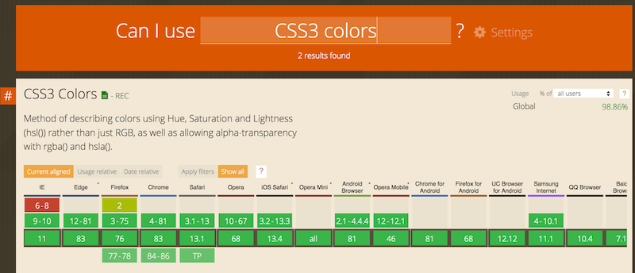
</p>

<a href="http://jsbin.com/">JS Bin</a> is an open source
collaborative Web development debugging tool. This tool is really
simple, just open the link to the provided examples, look at the code,
look at the result, etc. And you can modify the examples as you like,
you can also modify / clone / save / share them.  
  
Tutorials can be found on the Web (such as <a href="https://code.tutsplus.com/tutorials/javascript-tools-of-the-trade-jsbin--net-36843">this
one</a>)
or on YouTube. Keep in mind that it's always better to be logged in (it's free) if you do not want to lose your contributions/personal work.

<h4>CodePen</h4>

<!------------------------------------------------------------------------------------------------>
<!------------------------------------ 05. codepen logo (xx) ------------------------------------->
<!------------------------------------------------------------------------------------------------>

</p>

<a href="http://codepen.io/">CodePen</a> is an HTML, CSS, and
JavaScript code editor that previews/showcases your code bits in your
browser. It helps with cross-device testing, real-time remote pair
programming and teaching.

This is a great service to get you started quickly as it doesn't require
you to download anything and you can access it, along with your saved
projects from any Web browser. Here's an article which will be
of-interest if you use CodePen: <a href="https://codepen.io/brentmiller/post/things-you-can-do-with-codepen">Things you can do with
CodePen</a> [Brent Miller, February 6, 2019].

There are many other handy tools such as JSFiddle, and Dabblet (Lea
Verou's tool that we will use extensively in a future CSS course).
Please share your favorite tool on the discussion forum, and explain
why! Share also your own code contributions, such as a nice canvas
animation, a great looking HTML5 form, etc. Sharing them using JS Bin,
or similar tools, would be really appreciated.

<h4>W3C Validators</h4>

For over 20 years, the W3C has been developing and
hosting <a href="https://w3c.github.io/developers/">[<b><u>free</u></b> and <b><u>open
source</u></b> tools</a> used every day
by <b>millions of Web developers and Web designers<b>. All the tools
listed below are Web-based, and are available as downloadable sources or
as free services on the <a href="https://w3c.github.io/developers/tools/">W3C Developers tools</a> site.

<h4>W3C Validator</h4>

<!------------------------------------------------------------------------------------------------>
<!------------------------------------ 06. w3c validator (xx) ------------------------------------->
<!------------------------------------------------------------------------------------------------>

</p>

The <a href="https://validator.w3.org/">W3C validator</a> checks the <a href="https://validator.w3.org/docs/help.html#validation_basics">markup
validity</a> of various Web document formats, such as HTML.

<h4>CSS Validator</h4>

The [CSS validator](https://jigsaw.w3.org/css-validator/) checks
Cascading Style Sheets (CSS) and (X)HTML documents that use CSS
stylesheets.

<!------------------------------------------------------------------------------------------------>
<!----------------------------------- 07. css validator (xx) ------------------------------------->
<!------------------------------------------------------------------------------------------------>

</p>

<h4>Unicorn</h4>

<a href="https://validator.w3.org/unicorn/">Unicorn</a> is W3C's unified validator,
which helps people improve the quality of their Web pages by performing
a variety of checks. Unicorn gathers the results of the popular HTML and
CSS validators, as well as other useful services, such as RSS/Atom feeds
and http headers.

<h4>Link Checker</h4>

The <a href="https://validator.w3.org/checklink">W3C Link Checker</a> looks for
issues in links, anchors and referenced objects in a Web page, CSS style
sheet, or recursively on a whole Web site. For best results, it is
recommended to first ensure that the documents checked use valid <a href="https://validator.w3.org/) and [CSS](https://jigsaw.w3.org/css-validator/">HTML
Markup</a>.

<h4>Internationalization Checker</h4>

The <a href="https://validator.w3.org/i18n-checker/">W3C Internationalization
Checker</a> provides information about various internationalization-related aspects of your page,
including the HTTP headers that affect it. It also reports a number of
issues and offers advice about how to resolve them.

<h4>W3C CheatSheet</h4>

The <a href="https://www.w3.org/2009/cheatsheet/">W3C cheatsheet</a> provides quick
access to useful information from a variety of specifications published
by W3C. It aims at giving in a very compact and mobile-friendly format a
compilation of useful knowledge extracted from W3C specifications,
completed by summaries of guidelines developed at W3C, in particular Web
accessibility guidelines, the Mobile Web Best Practices, and a number of
internationalization tips.

<!------------------------------------------------------------------------------------------------>
<!------------------------------ 08. w3c lookup (11) -------------------------------->
<!------------------------------------------------------------------------------------------------>
<p align="center" width="100%">

</p>

Its main feature is a lookup search box, where one can start typing a
keyword and get a list of matching
properties/elements/attributes/functions in the above-mentioned
specifications, and further details on those when selecting the one of
interest.

The W3C cheatsheet is only available as a <a href="https://dev.w3.org/2009/cheatsheet/doc/">pure Web
application</a>.

<h4>Browser Compatibility</h4>

The term browser compatibility refers to the ability of a given Web site
to appear fully functional on the browsers available in the market.

The most powerful aspect of the Web is what makes it so challenging to
build for: its universality. When you create a Web site, you’re writing
code that needs to be understood by many different browsers on different
devices and operating systems!

To make the Web evolve in a sane and sustainable way for both users and
developers, browser vendors work together to standardize new features,
whether it’s a new <a href="https://developer.mozilla.org/en-US/docs/Web/HTML/Element">HTML
element</a>, <a href="https://developer.mozilla.org/en-US/docs/Web/CSS/Reference#Keyword_index">CSS property</a>,
or <a href="https://developer.mozilla.org/en-US/docs/Web/API">JavaScript API</a>.
But different vendors have different priorities, resources, and release
cycles — so it’s very unlikely that a new feature will land on all the
major browsers at once. As a Web developer, this is something you must
consider if you’re relying on a feature to build your site.

We are then providing references to the browser support of HTML5
features presented in this course using 2 resources: <a href="https://caniuse.com/">Can I
Use</a> and <a href="https://developer.mozilla.org/en-US/">Mozilla Developer Network (MDN) Web
Docs</a>.

<h4>Can I use</h4>

<a href="https://caniuse.com/">Can I Use</a> provides up-to-date tables for support
of front-end Web technologies on desktop and mobile Web browsers. Below
is a snapshot of what information is given by CanIUse when searching for
"CSS3 colors".

<!------------------------------------------------------------------------------------------------>
<!---------- 09. Example of a CanIUse browser support table (using CSS3 colors) (xx) ------------->
<!------------------------------------------------------------------------------------------------>
<p align="center" width="100%">

</p>

<h3>MDN Web Docs</h3>

<!------------------------------------------------------------------------------------------------>
<!---------------------------------- 10. mdn web docs logo (xx) ---------------------------------->
<!------------------------------------------------------------------------------------------------>
<p align="center" width="100%">

</p>

To help developers make these decisions consciously rather than
accidentally,

<a href="https://developer.mozilla.org/">MDN Web Docs</a> provides browser
compatibility tables in its documentation pages,

so that when looking up a feature you’re considering for your project,
you know exactly which browsers will support it.

<h4>External resources:</h4>

-   <a href="https://hacks.mozilla.org/2018/02/mdn-browser-compatibility-data/">MDN browser compatibility data: Taking the guesswork out of web
    compatibility</a>

-   <a href="https://hacks.mozilla.org/2019/09/caniuse-and-mdn-compat-data-collaboration/">Caniuse and MDN compatibility data
    collaboration</a>

<h4>Help Build the Web Platform</h4>

Most of the technologies you use when developing Web applications and
Web sites are designed and standardized in W3C in a completely open and
transparent process.

In fact, all W3C specifications are developed in public <a href="https://github.com/w3c/">GitHub
repositories</a>, so if you are familiar with
GitHub, you already know how to contribute to W3C specifications! This
is all about raising issues (with feedback and suggestions) and/or
bringing pull requests to fix identified issues.

Contribute

Contributing to this standardization process might be a bit scary or
hard to approach at first, but understanding at a deeper level how these
technologies are built is a great way to build your expertise.


If you're looking to an easy way to dive into this standardization
processes, check out which [issues in the W3C GitHub repositories have
been marked as "good first
issue"](https://github.com/search?q=org%3Aw3c+label%3A%22good+first+issue%22+state%3Aopen&type=Issues) and
see if you find anything where you think you would be ready to help.

Shape the future


Another approach is to go and bring feedback on ideas for future
technologies: the [W3C Web Platform Community Incubator
Group](https://wicg.io/) was built as an easy place to get started to
provide feedback on new proposals or bring brand-new proposals for
consideration.

Happy Web building!

### What is W3C?


<b>As steward of global Web standards, W3C's mission is to safeguard the
openness, accessibility, and freedom of the World Wide Web from a
technical perspective.<b>

W3C's primary activity is to develop protocols and guidelines that
ensure long-term growth for the Web. The widely adopted Web standards
define key parts of what actually makes the World Wide Web work.

A few history bits

In March 1989, while at CERN, <a href="https://www.w3.org/People/Berners-Lee/">Sir Tim
Berners-Lee</a> wrote “<a href="https://www.w3.org/History/1989/proposal.html">Information
Management: A Proposal</a>”
outlining the World Wide Web. Tim’s memo was about to revolutionize
communication around the globe. He then created the first Web browser,
server, and Web page. He wrote the first specifications for URLs, HTTP,
and HTML.


<i>Tim Berners-Lee at his desk in CERN, 1994</i>

In October 1994, Tim Berners-Lee founded the World Wide Web Consortium
(W3C) at the Massachusetts Institute of Technology, Laboratory for
Computer Science [MIT/LCS] in collaboration
with [CERN](https://home.cern/), where the Web originated (see
information on the [original CERN Server](https://www.w3.org/Daemon/)),
with support from DARPA and the [European
Commission](https://ec.europa.eu/index_en.htm).

In April 1995, Inria became the first European W3C host, followed
by [Keio University of Japan](https://www.keio.ac.jp/) (Shonan Fujisawa
Campus) in Asia in 1996. In 2003, [ERCIM](https://www.ercim.eu/) took
over the role of European W3C Host from Inria. In 2013, W3C
announced Beihang University as the fourth Host.

<h4>A few figures</h4>

As of August 2020, W3C:

Is a [member](https://www.w3.org/Consortium/Member/List)-driven
organization composed of approx 430 companies, universities, start-ups,
etc. from all over the world.

Holds 46 [technical groups](https://www.w3.org/groups/),
including [Working Groups](https://www.w3.org/groups/wg/) and [Interest
Groups](https://www.w3.org/groups/ig/) where technical specifications
are discussed and developed.

Published over 7,254 [published technical
reports](https://www.w3.org/TR/), including 434 Web standards (or W3C
Recommendations) - since January 1st,1995.

Runs a [translation
program](https://www.w3.org/Consortium/Translation/) to foster the
translation of its specifications: see the [translation
matrix](https://www.w3.org/Consortium/Translation/matrix.html) currently
listing 309 available translations of W3C recommendations.

Hosts 338 [Community and Business
Groups](https://www.w3.org/community/groups/), where developers,
designers, and anyone passionate about the Web have a place to hold
discussions and publish ideas.

Gathers over 13,129 active participants constituting the W3C community.

Has a [technical staff](https://www.w3.org/People/) composed of 64
people, spread on all five continents

<h4>W3C's core values</h4>

Committed to core values of an open Web that promotes innovation,
neutrality, and interoperability, W3C and its community are setting the
vision and standards for the Web, ensuring the building blocks of the
Web are open, accessible, secure, international and have been developed
via the collaboration of global technical experts.

<h4>Essential Steps in Web i18n</h4>

You find below three examples (and checks!) to help you to ensure that
your Web page works for people around the world, and to make it work
differently for different cultures, where needed. Let's meet the words
'charset' and 'lang', soon to become your favorite markup ;)

<h4>Example #1: character encoding declaration</h4>

A character encoding declaration is <i>vital to ensure that the text in
your page is recognized by browsers around the world</i>, and not garbled.
You will learn more about what this is, and how to use it as you work
through the course.  For now, just ensure that it's always there.

<b><i>Check #1</i>: There is a character encoding declaration near the start
of your source code, and its value is UTF-8.</b>

```
1.  <head>
2.  <meta charset="utf-8"/>
3.  ...
4.  </head>
```

<h4>Example #2: primary language declaration</h4>

For a wide variety of reasons, it's important for a browser to know what
language your page is written in, including font selection,
text-to-speech conversion, spell-checking, hyphenation and automated
line breaking, text transforms, automated translation, and more. <i>You
should always indicate the primary language of your page in the &lt;html&gt;
tag</i>. Again you will learn how to do this during the course.  You will
also learn how to change the language, where necessary, for parts of
your document that are in a different language.

<b><i>Check #2</i>: The HTML tag has a lang attribute which correctly
indicates the language of your content.</b>

This example below indicates that the page is in French.

```
5.  <!doctype html>
6.  <html lang="fr">
7.  <head>
8.  ...
```

<h4>Example #3: cultural bias</h4>

People around the world don't always understand cultural references that
you are familiar with, for example the concept of a 'home run' in
baseball, or a particular type of food. You should be careful when using
examples to illustrate ideas. Also, people in other cultures don't
necessarily identify with pictures that you would recognize, for
example, hand gestures can have quite unexpected meanings in other parts
of the world, and photos of people in a group may not be representative
of populations elsewhere.  When creating forms for capturing personal
details, you will quickly find that your assumptions about how personal
names and addresses work are very different from those of people from
other cultures.

<b><i>Check #3</i>: If your content will be seen by people from diverse
cultures, check that your cultural references will be recognized and
that there is no inappropriate cultural bias.</b>

Don't worry!

The following 7 quick tips summarize some important concepts of
international Web design. They will become more meaningful as you work
through the course, so come back and review this page at the end.

1.  <b>Encoding</b>: use the UTF-8 (Unicode) character encoding for
    content, databases, etc. Always declare the encoding.

2.  <b>Language</b>: declare the language of documents and indicate
    internal language changes.

3.  <b>Navigation</b>: on each page include clearly visible navigation to
    localized pages or sites, using the target language.

4.  <b>Escapes</b>: use characters rather than escapes (e.g. &#xE1; &#225;
    or &aacute;) whenever you can.

5.  <b>Forms</b>: use UTF-8 on both form and server. Support local formats
    of names/addresses, times/dates, etc.

6.  <b>Localizable styling</b>: use CSS styling for the presentational
    aspects of your page. So that it's easy to adapt content to suit the
    typographic needs of the audience, keep a clear separation between
    styling and semantic content, and don't use 'presentational' markup.

7.  <b>Images, animations & examples</b>: if your content will be seen by
    people from diverse cultures, check for translatability and
    inappropriate cultural bias.

You will find more quick tips on the <a href="https://www.w3.org/International/quicktips/">Internationalization quick
tips</a> page. Remember that these tips do not constitute complete guidelines.

Internationalization checker

When you start creating Web pages, you can also run them through the
W3C's [Internationalization
Checker](https://validator.w3.org/i18n-checker/).  If there are
internationalization problems with your page, this checker explains what
they are and what to do about it.

<h3 id="ch1-1-1">Module 1 Advanced HTML5 multimedia</h3>

In the [W3Cx HTML5 Coding Essentials and Best
Practices](https://www.edx.org/course/html5-coding-essentials-and-best-practices) course,
we saw that &lt;video&gt; and <audio> elements can
have &lt;track&gt; elements. A &lt;track&gt; can have a label,
a kind (subtitles, captions, chapters, metadata, etc.), a language
(srclang attribute), a source URL (src attribute), etc.

Here is a small example of a video with 3 different tracks
("......" masks the real URL here, as it is too long to fit in this page
width!):

```
1.  <video id="myVideo" preload="metadata" controls crossOrigin="anonymous">
2. <source src="https://...../elephants-dream-medium.mp4" type="video/mp4">
3. <source src="https://...../elephants-dream-medium.webm" type="video/webm">
4.     <b><track label="English    subtitles" kind="subtitles" srclang="en"</b>
5. <b>src="https://</b>.....<b>/elephants-dream-subtitles-en.vtt"></b>
6. <b>    <track label="Deutsch subtitles" kind="subtitles" srclang="de"</b>
7. <b>src="https://</b>.....<b>/elephants-dream-subtitles-de.vtt" default></b>
8. <b>    <track label="English chapters" kind="chapters" srclang="en"</b>
9. <b>src="https://</b>.....<b>/elephants-dream-chapters-en.vtt"></b>
10. </video>
```

And here is how it renders in your current browser (please play the
video and try to show/hide the subtitles/captions):

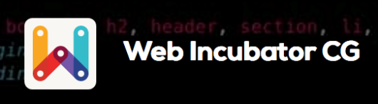

Notice that the support for multiple tracks may differs significantly
from one browser to another, in particular if you are using old
versions. Here is a quick summary (as in May 2020).

-   Safari provides a menu you can use to choose which subtitle/caption
    track to display. If one of the defined text tracks has
    the default attribute set, then it is loaded by default. Otherwise,
    the default is off.


-   Chrome and Opera both provide a subtitle menu and load the text
    track set that matches the browser language. If none of the
    available text tracks match the browser’s language, then it loads
    the track with the default attribute, if there is one. Otherwise, it
    loads none. Let's say that support is very incomplete (!).

-   Firefox provides also a subtitle menu but will show the first
    defined text track <i>only if</i> it has default set. It will load all
    tracks in memory as soon as the page is loaded.

Also, there is [a Timed Text Track API in the HTML5/HTML5.1
specification](https://www.w3.org/TR/html51/semantics-embedded-content.html#timed-text-tracks) that
enables us to manipulate &lt;track&gt; contents from JavaScript. Do you
recall that text tracks are associated with WebVTT files? As a quick
reminder, let's look at a WebVTT file:

WEBVTT

```
19. 
<!-- -->
1.  1
2.  00:00:15.000 --> 00:00:18.000 align:start
3.  <v Proog>On the left we can see...</v>
<!-- -->
20. 
<!-- -->
4.  2
5.  00:00:18.167 --> 00:00:20.083 align:middle
6.  <v Proog>On the right we can see the...</v>
<!-- -->
21. 
<!-- -->
7.  3
8.  00:00:20.083 --> 00:00:22.000
9.  <v Proog>...the <c.highlight>head-snarlers</c></v>
<!-- -->
22. 
<!-- -->
10. 4
11. 00:00:22.000 --> 00:00:24.417 align:end
12. <v Proog>Everything is safe. Perfectly safe.</v>
```

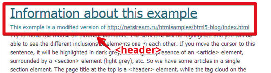

The different time segments are called "cues" and each cue has an id (1,
2, 3 and 4 in the above example), a startTime and an endTime, and
a text content that can contain HTML tags for styling (<b>, etc...)
or be associated with a "voice" as in the above example. In this case,
the text content is wrapped
inside <v <i>name_of_speaker</i>>...</v> elements.

It's now time to look at the JavaScript API for manipulating tracks,
cues, and events associated with their life cycle. In the following
lessons, we will look at different examples which use this API to
implement missing features such as:

-   how to build a menu for choosing the subtitle track language to
    display,

-   how to display a synchronized description of a video (useful for
    disabled people, for example),

-   how to display a clickable transcript aside the video (similar to
    what the edX video player does),

-   how to show chapters,

-   how to use JSON encoded cue contents (useful for showing external
    resources in the HTML document while a video is playing),

-   etc.

<h2 id="ch1">Module 1</h2>

Hi! Welcome to Part 2 of the W3C HTML5 course. How about we start by
looking at advanced HTML5 multimedia features? First, we will look at
the Web Audio API that helps processing and synthesizing audio in Web
applications. You will be able to load sound samples into memory and
play them, loop them, process them through a chain of sound effects such
as reverberation, delay, graphic equalizer, compressor, distortion, etc.
You can also write nice real time visualizations like dancing frequency graphs, animated waveforms that dance with the
music, or generate music programmatically.

The Web Audio API is particularly suited for games or for music
applications.

A second nice multimedia feature is the Track API.

With it, you will be able to synchronize a video with elements in your
document.

For example: display a Google Map, an HTML description or a Wikipedia
page aside the video, while it’s playing.

As always, do not hesitate to practice coding looking at the interactive
examples, and then please share your own creations in the discussion
forum!

We hope you will enjoy this first week and we wish you the best!

<h3 id="ch1-2-1">1.2.1 Intro to the Timed Text Track API</h3>

Hi, today I've prepared for you a small example of a video that is
associated with three different tracks.


Two for subtitles, in English and in German, and one track for chapters.

First, before going further, let's look at how this is rendered in
different browsers. With Google Chrome, we've got a CC button here, that
will enable or disable subtitles. What we can see is that by default the
subtitles that are displayed are in German (in this example).

And I can just switch them on and off. It loaded the first track that
has the default attribute. And I have no menu for choosing what track, what language I
want to be displayed here …

If we look at FireFox, it's even worse!

We don't have any menu at all, no CC button. I cannot switch on the
subtitles, because as of December 2015, FireFox will load only the first
track, if it has the default attribute.

This is not the case, so we don't have any subtitles and we cannot
display them.

With Safari, on my Mac, it's better because I've got a subtitle menu and
I can choose between the different tracks. I can switch to English
subtitles, and english subtitles will be displayed.

I'm on a MacIntosh so I cannot show you... but with other browsers like
Internet Explorer or Microsoft Edge, there are situations similar to
Safari.

What can we do to increase the features of the default player? We can
use what we call the Track API, for asking which tracks are available,
activating them, and so on. Now, I would like to remind you the
structure of a track. I'm just going to display the content of one of
these tracks.


The tracks are made of cues and what we call a cue is a kind of time
segment that is defined with a starting time and an ending time. And the
cue can have an ID, in that case it is a numeric ID (1, 2, 3), and a
content that can be HTML with bold, italic elements and it can also be a
voice so when you see "v" followed by the name of the character that is
speaking, it’s a voice.

We are going to look at what we can do with such tracks during the
course and we will see how to handle a chapter menu, how to display a
nice transcript on the side of the video, that you can click to jump at
the exact time the video tells the words that are on the transcript. And
we will see also how to choose the subtitle or caption track language
for the video.


This is finished for this small introduction video, I will just conclude
by this thing

here: explaining this crossOrigin="anonymous". We saw that during the
HTML5 Part 1 course and many people asked questions about this. This is
because of security constraints.

In browsers, when you've got the HTML page that is on a different
location than the video file and the tracks files, you will have
security constraints errors. And if your server is configured for
accepting different origins, then you can add this attribute
crossOrigin="anonymous" in your HTML document and it is going to work.


The server here: mainline.i3s.unice.fr has been configured for allowing
external HTML pages to include the videos it hosts and the subtitles it
hosts, this is the reason. You can use the DropBox public directory here
because Dropbox also enables cross origin requests.

This is all for this first video, I’ll see you in the next one!

<h4>The Timed Text Track JavaScript API</h4>

In the <a href="https://www.edx.org/course/html5-coding-essentials-and-best-practices">W3Cx HTML5 Coding Essentials and Best
Practices</a> course,
we saw that <video> and <audio> elements can
have &lt;track&gt; elements. A &lt;track&gt; can have a label,
a kind (subtitles, captions, chapters, metadata, etc.), a language
(srclang attribute), a source URL (src attribute), etc.

Here is a small example of a video with 3 different tracks
("......" masks the real URL here, as it is too long to fit in this page
width!):

```
1.  <video id="myVideo" preload="metadata" controls crossOrigin="anonymous">
2.   <source src="https://...../elephants-dream-medium.mp4" type="video/mp4">
3.   <source src="https://...../elephants-dream-medium.webm" type="video/webm">
4.  <b><track label="English subtitles" kind="subtitles" srclang="en"</b>
5.  <b>src="https://</b>.....<b>/elephants-dream-subtitles-en.vtt"></b>
6.  <b><track label="Deutsch subtitles" kind="subtitles" srclang="de"</b>
7.  <b>src="https://</b>.....<b>/elephants-dream-subtitles-de.vtt" default></b>
8.  <b><track label="English chapters" kind="chapters" srclang="en"</b>
9.  <b>src="https://</b>.....<b>/elephants-dream-chapters-en.vtt"></b>
10. </video>
```

And here is how it renders in your current browser (please play the
video and try to show/hide the subtitles/captions):


Notice that the support for multiple tracks may differs significantly
from one browser to another, in particular if you are using old
versions.

You can read [this article by Ian Devlin: "HTML5 Video Captions –
Current Browser
Status"](http://www.iandevlin.com/blog/2015/04/html5/html5-video-captions-current-browser-status),
written in April 2015, for further details.

Here is a quick summary:

-   Safari provides a menu you can use to choose which subtitle/caption
    track to display. If one of the defined text tracks has
    the default attribute set, then it is loaded by default. Otherwise,
    the default is off.

    -    alt="screenshot of safari menu fr choosing subtitle track" />

-   Chrome and Opera both provide a subtitle menu and load the text
    track set that matches the browser language. If none of the
    available text tracks match the browser’s language, then it loads
    the track with the default attribute, if there is one. Otherwise, it
    loads none. Let's say that support is very incomplete (!).

-   Firefox provides a subtitle menu but will show the first defined
    text track <i>only if</i> it has default set. It will load all tracks in
    memory as soon as the page is loaded.

There is [a Timed Text Track API in the HTML5/HTML5.1
specification](https://www.w3.org/TR/html51/semantics-embedded-content.html#timed-text-tracks) that
enables us to manipulate &lt;track&gt; contents from JavaScript. Do you
recall that text tracks are associated with WebVTT files? As a quick
reminder, let's look at a WebVTT file:

```
1.  WEBVTT
2.   
3.  1
4.  00:00:15.000 --> 00:00:18.000 align:start
5.  <v Proog>On the left we can see...</v>
6.   
7.  2
8.  00:00:18.167 --> 00:00:20.083 align:middle
9.  <v Proog>On the right we can see the...</v>
10.  
11. 3
12. 00:00:20.083 --> 00:00:22.000
13. <v Proog>...the <c.highlight>head-snarlers</c></v>
14.  
15. 4
16. 00:00:22.000 --> 00:00:24.417 align:end
17. <v Proog>Everything is safe. Perfectly safe.</v>
```

The different time segments are called "cues" and each cue has an id (1,
2, 3 and 4 in the above example), a startTime and an endTime, and
a text content that can contain HTML tags for styling (<b>, etc...)
or be associated with a "voice" as in the above example. In this case,
the text content is wrapped
inside <v <i>name_of_speaker</i>>...</v> elements.

It's now time to look at the JavaScript API for manipulating tracks,
cues, and events associated with their life cycle. In the following
lessons, we will look at different examples which use this API to
implement missing features such as:

-   how to build a menu for choosing the subtitle track language to
    display,

-   how to display a synchronized description of a video (useful for
    disabled people, for example),

-   how to display a clickable transcript aside the video (similar to
    what the edX video player does),

-   how to show chapters,

-   how to use JSON encoded cue contents (useful for showing external
    resources in the HTML document while a video is playing),

-   etc.

<h3 id="ch1-2-2">1.2.2 The HTML Track Element, getting the status of a track</h3>

Hi, in this video I will show you how we can work with the track
elements from JavaScript, just to know which track has been loaded and
which track is active.

For that, we will manipulate different properties of the HTML track
element from JavaScript.

The first thing I am going to do is to add a small div at the end of the
document for

displaying the different track statuses. I added a div here called
trackStatusesDiv with a heading... I am going to add some CSS to
visualize this area.

Like that, we will have the description of the track here. I added a
border and some margins and so on. From JavaScript, we can not do
anything before the page has been loaded, so I am adding a window.onload
listener, and all the treatments will be in this function. The first
thing I am going to do is get these track elements here... and I am
going to get them in a variable called htmlTracks. How can I get them?

I'm going to stop the automatic refresh on JSBin for the moment.

So, querySelectorAll is a function that will return a collection with
all the tracks, an array with all the tracks, all the HTML elements. So
there, I am going to call a function called displayTrackStatuses that I
write here. I will first iterate on these tracks and display in the
console the different values. We are doing a loop.

I will first just display something in the console.

I am going to add a current track, it will be easier.

I can write currentTrack.label for example, that will display the value
of the different attributes.

This is just for checking that my code is OK.

Open the console, I have got one error...

If I click here "Run with JS" I can see that it's working.

What I can display is the label, I can also display the kind... you
remember the kind: subtitles, subtitles, chapters for the different
track subtitles, subtitles and chapters and I can also display the
language with srclang. So English, Deutsch (for German).

I can also display what is called the status. It is readyState, this is
a property you can use only from JavaScript. It says that for track
number 1, the value is 0, for track number 2 is 2, for track number 3,
it's 0. 2 means that the track is loaded and 0 means that the track is
not available.

We've got the first track, the English subtitles are not available:
status readyState 0 and we've got the German subtitles that have been
loaded because it has the default attribute, and we showed that in
Google Chrome the track with the default attribute is loaded when the
page is loaded.

This is how we can consult the different statuses of a track from
JavaScript.

I am going to copy and paste some code for just displaying this in a
nicer way here.

This is how we can display the different statuses and I can add a button
that will call this just to refresh the different statuses. Let's add a
button, we call it refresh, and when we click on it, we will call
displayTrackStatuses. If I click here... just checking there is no
error…it will refresh this thing. So now I am going to try this code
with Safari; because you remember Safari has a menu for changing the
different tracks. I prepared that already, so here I can start playing
the same video that has Deutsch subtitles loaded by default, you can see
that here. If I choose English subtitles now, and I refresh track
statuses: you can see that the English subtitles are loaded now and the
Deutsch subtitles are also available. So, we are going to use these
different attributes for forcing some tracks to load programmatically
from JavaScript and this will enable us to make a sort of menu for
choosing the different tracks. I will explain that in a next video.

<h4>The HTML track element</h4>

<h4>Let's go back to our example. Below is the HTML code:</h4>

```
1.  <video id="myVideo" preload="metadata" controls crossOrigin="anonymous">
2.   <source src="https://...../elephants-dream-medium.mp4" type="video/mp4">
3.   <source src="https://...../elephants-dream-medium.webm" type="video/webm">
4.      <b><track label="English subtitles" kind="subtitles" srclang="en"</b>
> <b>         
>  src="https://</b>.....<b>/elephants-dream-subtitles-en.vtt" ></b>
5.  <b>    <track label="Deutsch
    subtitles" kind="subtitles" srclang="de"</b>
>  <b>src="https://</b>.....<b>/elephants-dream-subtitles-de.vtt" default></b>
6.  <b>    <track label="English
    chapters" kind="chapters" srclang="en"</b>
7.  <b>src="https://</b>.....<b>/elephants-dream-chapters-en.vtt"></b>
8.  </video>
9.  
10. <div id="trackStatusesDiv">
11.     <h3>HTML track descriptions</h3>
12. </div>
```

This example defines three &lt;track&gt; elements. From JavaScript, we can
manipulate these elements as "HTML elements" - we will call them the
"HTML views" of tracks.

<h4>Getting the status of an HTML track</h4>

<h4>[<span id="_Toc98696550" class="anchor"></span>Example at JSBin that displays the different elements we can get from an HTML track](https://jsbin.com/kuqevegapi/2/edit?html,css,output):</h4>


<h4>Here is the JavaScript source code:</h4>

```
1.  var video, htmlTracks;
2.  var trackStatusesDiv;
3.  
4.  window.onload = function() {
5.  // called when the page has been loaded
6.  video = document.querySelector("#myVideo");
7.  trackStatusesDiv = document.querySelector("#trackStatusesDiv");
8.  
9.  // Get the tracks as HTML elements
10. htmlTracks = document.querySelectorAll("track");
11. 
12. // displays their statuses in a div under the video
13. displayTrackStatuses(htmlTracks);
14. };
15. 
16. function displayTrackStatuses(htmlTracks) {
17. // displays track info
18. for(var i = 0; i < htmlTracks.length; i++) {
19. var currentHtmlTrack = htmlTracks[i];
20. 
21. var label = "<li>label = " + currentHtmlTrack.label + "</li>";
22. var kind = "<li>kind = "   + currentHtmlTrack.kind + "</li>";
23. var lang = "<li>lang = "   + currentHtmlTrack.srclang + "</li>";
24. var readyState = "<li>readyState = " 
25. + currentHtmlTrack.readyState + "</li>"
26. 
27. trackStatusesDiv.innerHTML += "<li><b>Track:" + i + ":</b></li>"
28. + "<ul>" + label + kind + lang + readyState + "</ul>";
29. }
30. }
<!-- -->
23. 
```

<h4>The code is rather straightforward:</h4>

-   We cannot access any HTML element before the page has been loaded.
    This is why we do all the work in the window.onload listener,

-   <i>Line 6</i> we get a pointer to the div with id=trackStatusesDiv, that
    will be used to display track statuses,

-   <i>Line 10</i>: we get all the track elements in the document. They are
    HTML track elements,

-   <i>Line 14</i>: we call a function that will build some HTML to
    display the track status in the div we got from <i>line 7</i>.

-   <i>Lines 16-22</i>: we iterate on the HTML tracks, and for each track we
    get the label, the kind and the srclang attribute values. Notice,
    at <i>line 24</i>, the use of the readyState attribute, only used from
    JavaScript, that will give the current HTML track state. 

You can see on the screenshot (or [from the JSBin
example)](https://jsbin.com/higebo/1/edit?html,css,js,output) that the
German subtitle file has been loaded, and that none of the other tracks
have been loaded. 

<h4>Possible values for the readyState attribute of HTML tracks:</h4>

-   <b>0 = NONE</b> ; the text track's cues have not been obtained

-   <b>1 = LOADING</b> ; the text track is loading with no errors yet.
    Further cues can still be added to the track by the parser

-   <b>2 = LOADED</b> ; the text track has been loaded with no errors

-   <b>3 = ERROR</b> ; the text track was enabled, but when the user agent
    attempted to obtain it, something failed. Some or all of the cues
    are likely missing and will not be obtained

Now, it's time to look at the twin brother of an HTML track: the
corresponding TextTrack object!

<h3 id="ch1-2-3">1.2.3 The TextTrack Object</h3>

Hi! Now we are preparing ourselves for reading the content of the
different text tracks and display them.

But before that, I must introduce what we call the TextTrack object that
is a JavaScript object that is associated to the HTML elements. A track
has two different views... maybe it is simpler to say that it has got a
HTML view that means you can do a getElementById and manipulate the HTML
element, this track element here, from JavaScript. Or we can also work
with its twin brother that is a text track, and this new view is the one
we are going to use for forcing a track to be loaded, and for reading
its content. And for forcing subtitles or caption track to be displayed.
We just slightly modify the previous example by displaying the mode

The mode is a property from the TextTrack, not from the HTML track. And
this mode can be "disabled", "showing" or "hidden". And when it is
disabled, reading the video will not fire any event related to the
track. We will talk about events later but a disabled track is the same
if we have no track at all.

A track that is "showing" is displayed in the video, if the
implementation of the video player supports that. And a track that is
"hidden" is just not displayed.

How did we manipulate and access this mode property?

The displayTrackStatuses function, that we wrote earlier, displayed the
different properties of the HTML track, like the label, the kind or the language.
This time, we accessed his twin brother, the TextTrack by using the
track property.

Every HTML track element has a track property that is a TextTrack.

Here, from the current HTML track, I am getting the TextTrack
(currentTextTrack).

This is the object we use to access the mode and display it here.
Another interesting thing is that if we set the mode, if we modify the
value of the mode, from "disabled" to "showing" or to "hidden", it will
force the track to be loaded asynchronously in the background by the
browser. We added in this example two buttons, "force load track 0" and
"force load track 2" because by default, the track 0, the English
subtitles, is not loaded. And the chapters, in track number 2, are 
not loaded either. We are going to force the track 0 to be loaded.

If I click here "force load track 0", you see that the status changes -
the mode changes to "hidden" and the track now is loaded. What happened
in the background?

Let's have a look at the code we wrote. I am going to zoom a little
bit...

The button we clicked is this one: "force load track 0" here, called a
function named forceLoadTrack(0) that I prepared.

What does this function do?

It will call another function called getTrack that will check if the
track is already loaded.

If it is already loaded, then the second parameter here, is a callback
function,

It will be called because the track is ready to be read.

In the case the track has not been loaded, we will set the mode to
"hidden" and then we will trigger the browser so that it will load
asynchronously, in the background, the track.

And when the track is ready, then, and only then, we will call
readContent.

Let's have a look at this getTrack function that we wrote. It says
getTrack, please load me the TextTracks corresponding to the HTML track
number n.

So here is the function. The first thing we do is that from the HTML
track, we get the text track.

Then we check on the HTML track if it is already loaded.

If it is the case, then we will call the function that has been passed
as the second parameter: it's the readContent. And the readContent is just here, for
the moment it will not read the content really, but it will just update the
status.

If I click on « force load track 2 » for example, it will load the track
and when the track is arrived, it will call the displayStatus() that
will show the updated status of the track.

In the case the track is not here, the readyState is not equal to 2,
then we will force the track to be loaded. By doing this we set the mode to "hidden".

This may will take some time: you understand that the browser is loading
on the Web the track. It may take 2 seconds for example. We need to have
a listener that will listen to the load event. 

So htmlTrack.addEventListenner('load'...) will trigger only when the track has been loaded, and only in that case we will call
the callback function: the readContent that has been passed in the
second parameter, in order to read the track.

If I look at the console, and if I start again the application. Only the
second track has been loaded, I click "force load track 0", it says "forcing the track to
be loaded", it loads the track and it calls the callback "reading content of loaded
track".

If I click again the same button, it says "the text track is already
loaded" and I am going to read it now. We cannot load a track several
times, if it is already loaded, we must just use it. In the next video,
we will show how we can effectively read the content of the track and do
something with it.

The object that contains the cues (subtitles or captions or chapter
description from the WebVTT file) is not the HTML track itself. It is
another object that is associated with it: a TextTrack object!

The TextTrack JavaScript object has different methods and properties for
manipulating track content, and is associated with different events. But
before going into detail, let's see how to obtain a TextTrack object.

Obtaining a TextTrack object that corresponds to an HTML track

<b>First method:</b> get a TextTrack from its associated HTML track.

The HTML track element has a track property which returns the associated
TextTrack object.

<h4>Example source code:</h4>

```
1. // HTML tracks
2. var htmlTracks = document.querySelectorAll("track");
3. 
4. 
5. // The TextTrack object associated with the first HTML track
6. var textTrack = htmlTracks[0].track;
7. var kind = textTrack.kind;
8. var label = textTrack.label;
9. var lang = textTrack.language;
10. // etc.
```

Note that once we get a TextTrack object, we can manipulate
the kind, label, language attributes (be careful, it's not srclang,
like the equivalent attribute name for HTML tracks). Other attributes
and methods are described later in this lesson.

<b>Second method:</b> get TextTrack from the HTML video element.

The <video> element (and <audio> element too) has
a TextTrack property accessible from JavaScript:

```
1.  var videoElement = document.querySelector("#myVideo");
<!-- -->
1.  <b>var textTracks = videoElement.textTracks; // one TextTrack for
   each HTML track element</b>
2.  var textTrack = textTracks[0]; // corresponds to the first track
    element
3.  var kind = textTrack.kind // e.g. "subtitles"
4.  var mode = textTrack.mode // e.g. "disabled", "hidden" or "showing"
```

The mode property of TextTrack objects TextTrack objects have a
mode property, that is set to one of:

1.  "showing": the track is either already loaded, or is being loaded by
    the browser. As soon as it is completely loaded, subtitles or
    captions will be displayed in the video. Other kinds of track will
    be loaded but will not necessarily show anything visible in the
    document. <i>All tracks that have mode="showing" will fire events
    while the video is being played.</i>

2.  "hidden"<i>: the track is either already loaded, or is being loaded by
    the browser. All tracks that have mode="hidden" will fire events
    while the video is being played. Nothing will be visible in the
    standard video player GUI.</i>

3.  "disabled": this is the mode where tracks are not being loaded. If a
    loaded track has its mode set to "disabled", it will stop firing
    events, and if it was in mode="showing" the subtitles or captions
    will stop being displayed in the video player.

TextTrack content can only be accessed if a track has been loaded! Use
the mode property to force a track to be loaded!

<b>BE CAREFUL: you cannot access a TextTrack content if the corresponding
HTML track has not been loaded by the browser!  
<b>It is possible to force a track to be loaded by
setting the mode property of the TextTrack object to "showing" or
"hidden".   
Tracks that are not loaded have their mode property of "disabled". 

Here is an example that will test if a track has been loaded, and if it
hasn't, will force it to be loaded by setting its mode to "hidden". We
could have used "showing"; in this case, if the file is a subtitle or a
caption file, then the subtitles or captions will be displayed on the
video as soon as the track has finished loading.

[Try the example at
JSBin](https://jsbin.com/bubeye/1/edit?html,console,output)

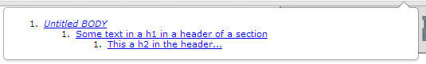

Here is what we added to the HTML code:

```
1.  <button id="buttonLoadFirstTrack"
2.          onclick="forceLoadTrack(0);"
3.          disabled>
4.     Force load track 0
5.  </button>
6.  <button id="buttonLoadThirdTrack"
7.          onclick="forceLoadTrack(2);"
8.          disabled>
9.     Force load track 2
10. </button>
```

The buttons will call a function named forceLoadTrack(trackNumber) that
takes as a parameter the number of the track to get (and force load if
necessary).

Here are the additions we made to the JavaScript code from the previous
example:

```
1.  function readContent(track) {
2.     console.log("reading content of loaded track...");
3.     displayTrackStatuses(htmlTracks); // update document with new
    track statuses
4.  }
5.   
6.  function getTrack(htmlTrack, callback) {
7.     // TextTrack associated to the htmlTrack
8.     var textTrack = htmlTrack.track;
9.  
10.    if(htmlTrack.readyState === 2) {
11.       console.log("text track already loaded");
12.       // call the callback function, the track is available
13.       callback(textTrack);
14.    } else {
15.       console.log("Forcing the text track to be loaded");
16.  
17.       // this will force the track to be loaded
18.       textTrack.mode = "hidden";  
          // loading a track is asynchronous, we must use an event listener
19.       htmlTrack.addEventListener('load', function(e) {
20.          // the track is arrived, call the callback function
21.          callback(textTrack);
22.       });
23.    }
24. }
25. 
26. function forceLoadTrack(n) {
27.     // first parameter = track number,
28.     // second = a callback function called when the track is loaded,
29.     // that takes the loaded TextTrack as parameter
30.     getTrack(htmlTracks[n], readContent);
31. }
```

Explanations:

-   <i>Lines 26-31</i>: the function called when a button has been clicked.
    This function in turn calls the getTrack(trackNumber,
    callback) function. It passes the readContent callback function as a
    parameter. This is typical JavaScript asynchronous programming:
    the getTrack() function may force the browser to load the track and
    this can take some time (a few seconds), then when the track has
    downloaded, we ask the getTrack function to call the function we
    passed (the readContent function, which is known as
    a <i>callback</i> function), with the loaded track as a parameter.

-   <i>Line 6</i>: the getTrack function. It first checks if the HTML track
    is already loaded (<i>line 10</i>). If it is, it calls the callback
    function passed by the caller, with the loaded TextTrack as a
    parameter. If the TextTrack is not loaded, then it sets its mode to
    "hidden". This will instruct the browser to load the track. Because
    that may take some time, we must use a load event listener on the
    HTML track before calling the callback function. This allows us to
    be sure that the track is really completely loaded.

-   <i>Lines 1-4</i>: the readContent function is only called with a loaded
    TextTrack. Here we do nothing special for the moment except that we
    refresh the different track statuses in the HTML document.

<h3 id="ch1-2-4">1.2.4 Working With Cues</h3>

Hi! We will continue the last example from the previous video, and this
time when we will click on the "force load track 0" or "force load track
2" buttons.

You remember the track number 0 (the English subtitles) was not loaded,
readyState=0 here says the track is not loaded. Track 2 also was not
loaded: it contains the English chapters of the video. This time, I will
explain how we can read the content of the file. If I click on "force load track 0", I see here
the content of the WebVTT file. I didn't read it as pure text, I used
the track API for accessing individually each cue, each one of these
elements here is a cue, and I access the id, the start time, the end
time and the content, that we call the text content of each cue. If I
click on "force load track 2", I see the chapters definitions here, so
chapter 1 of the video goes from 0 to 26 seconds, and it corresponds to
the introduction part of the video.

How did we do that? We just completed the readContent function that
previously just showed the statuses of the different tracks. Remember
that when we clicked on a button, we forced the text track corresponding
to the HTML track to be loaded in memory, and then we can read it. A
TextTrack object has different properties and the most important one is called cues. The cues is the list of every
cue inside the VTT file, and each cue corresponds to a time segment, has
an id and a text content.

If you do track.cues, you've got the list of the cues and you can
iterate on them.

For each cue, we are going to get its id: cue.id here. It corresponds to
the id of the cue number i. In my example, I have got an index in the loop, I get the
current cue,

I get the id of this cue. I can also get the start time, the end time
and the text. So, cue.text corresponds exactly at this sentence
highlighted here. This is the only thing I wanted to show you, because
the next time we are going to do something really interesting with this
content here, we are going to display on the side of the video a
clickable transcript. And when we will click on it, the video will jump
to the corresponding position. This is exactly what the edX video player
does, the one you are watching at right now.

A TextTrack object has different properties and methods

-   kind: equivalent to the kind attribute of HTML track elements. Its
    value is either "subtitles", "caption", "descriptions", "chapters",
    or "metadata". We will see examples of chapters, descriptions  and
    metadata tracks in subsequent lessons.

-   label: the label of the track, equivalent of the label attribute of
    HTML track elements.

-   language: the language of the text track, equivalent to
    the srclang attribute of HTML track elements (be careful: it's not
    the same spelling!)

-   mode: explained earlier. Can have values equal to:
    "disabled"|"hidden"|"showing". Can force a track to be loaded (by
    setting the mode to "hidden" or "showing").

-   cues: get a list of cues as a TextTrackCueList object. This is the
    complete content of the WebVTT file!

-   activeCues: used in event listeners while the video is playing.
    Corresponds to the cues located in the current time segment. The
    start and end times of cues can overlap. In reality this may
    rarely happen, but this property exists in case it does, returning
    a  TextTrackCueList object that contains all active tracks at a
    given time.

-   addCue(cue): add a cue to the list of cues.

-   removeCue(cue): remove a cue from the list of cues.

-   getCueById(id): returns the cue with a given id (not implemented by
    all browsers - a polyfill is given in the examples from the next
    lessons).

A TextTrackCueList is a collection of cues, each of which has different
properties and methods

-   id: the cue id as written in the line that starts cues in the WebVTT
    file.

-   startTime and endTime: define the time segment for the cue, in
    seconds, as a floating point value. It is not the formatted String
    we have in the WebVTT file (see screenshot below),

-   text: the cue content.

-   getCueAsHTML(): a method that returns an HTML version of the cue
    content, not as plain text.

-   Others such as align, line, position, size, snapToLines, etc., that
    correspond to the position of the cue, as specified in the WebVTT
    file. See the HTML5 course Part 1 about cue positioning.


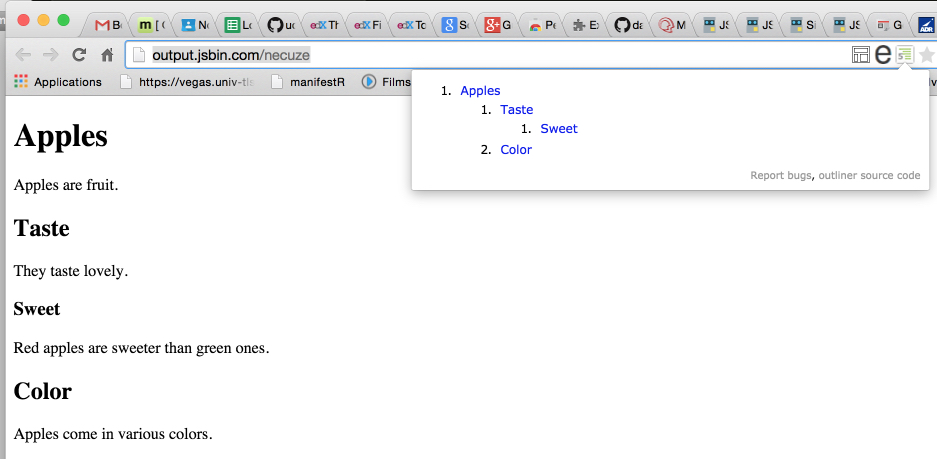

<h4>Example that displays the content of a track</h4>

[Here is an example at JSBin that displays the content of a
track](https://jsbin.com/teruhay/1/edit?html,css,js,output):


We just changed the content of the readContent(track) method from the
example in the previous lesson:

```
1.  function readContent(track) {
2.     console.log("reading content of loaded track...");
3.     //displayTrackStatuses(htmlTracks);
4.     // instead of displaying the track statuses, we display
5.     // in the same div, the track content//
6.     // first, empty the div
7.     trackStatusesDiv.innerHTML = "";
8.  
9.     // get the list of cues for that track   
10.    var cues = track.cues;
11.    // iterate on them
12.    for(var i=0; i < cues.length; i++) {
13.       // current cue
14.       var cue = cues[i];
15.       var id = cue.id + "<br>";
16.       var timeSegment = cue.startTime + " => " + cue.endTime + "<br>";
17.       var text = cue.text + "<P>"
18.       trackStatusesDiv.innerHTML += id + timeSegment + text;
19.    }
20. }
```

As you can see, the code is simple: you first get the cues for the given
TextTrack (it must be loaded; this is the case since we took care of it
earlier), then iterate on the list of cues, and use the
id, startTime, endTime and text properties of each cue.

This technique will be used in one of the next lessons, and we will show
you how to make a clickable transcript on the side of the video
- something quite similar to what the edX video player does.

<h3 id="ch1-2-5">1.2.5 Listening to Events</h3>

Ok. This time we will talk about track events and cue events.

First, let's start by a small demonstration. If I play this video, the
video is going on and I can listen to events like 'cuenter' and 'cueexit'.

Each time a new cue is entered, we will display it here, and each time
it is exited, we will display it here. We saw that we can display them
in sync with the video now. Each time a cue is reached, it means that
the current time entered a new time segment defined by the starting and
ending time of a cue. Let's have a look again at one of the VTT files.
Each cue holds a start time and a end time so when the time enters the
15th second, we've got a cueenter event and we can get this content and show it on the HTML page. When we go out of this time period, when
we go further than 18 seconds, we exit this cue and we enter this cue.
How are these events handled in the JavaScript code? Everything is done
in the readContent method that we saw earlier. This time instead of
iterating on different cues of the TextTrack, we will just, for each cue
individualy, we will iterate on the cues and add a listener on that cue,
an exist listener and an enter listener. So what do we do? We iterate in
the cues called addCueListenners for the current cue. This method,
addCueListeners, it will define two listeners: the cue enter listener
and the cue exit event listener.

On the cue enter listener we just create a string "entered cue id=" and
"text=" that

will correspond to the text displayed when a cue is just reached.

We display the id and we display the text. The same thing is done when
we exit. When we exit, we just display the id "exited cue id=". This is
how we can have individual enter and exit listeners for each cue. It
will enable us to highlight the current cue in a transcript while the
video is playing. The only problem is that as of December 2015,

FireFox still does not recognize these sorts of listeners.

The implementation is not done yet, so you can use a fallback. You can
use a listener on the track that will listen to the 'cuechange' event.
If I just comment the function addCueListeners and I uncomment this
piece of code that has a cueChange listener on the track itself, then
instead of knowing that we entered of exited and individual cue, we can
get, for every new time segment, the list of the cues that are
triggered, that should be activated and displayed for this time segment.
As the different cues can overlap, the time segments can overlap -it is
not often the case but it may occur- what the callback function from
this listener gives is a list of active cues. Most of the time you have
got only one.

Anyway, you can just work with the list of the cues. Here we just take
the first active cue because we are assuming that the cues are not
overlapping. I added a small test here because sometimes we've got some
strange ghost cues that are active and not defined. I do not exactly
what was the problem when I test it but I added this test here to avoid
some error messages...

We have got the first active cue and we just display it. We get the id,
we get the text

and this is all. In that case, if I run the application again, instead
of having enter and exit, I will just have cue change events.

It starts at 15 seconds. I had a small bug here, it is not this.id but
cue.id.... we can start again. This is a fallback for FireFox if you
want to display the cues in sync with the video. The next video will
show how to display a transcript here with the current cue highlighted
and you can click on them in order to jump to the right place in the
video. After that I think we will have seen the most useful properties,
methods, events you can use with tracks and cues...

Instead of reading the whole content of a track at once, like in the
previous example, it might be interesting to process the track content
cue by cue, while the video is being played. For example, you choose
which track you want - say, German subtitles - and you want to display
the subtitles in sync with the video, below the video, with your own
style and animations... Or you display the entire set of subtitles to
the side of the video and you want to highlight the current one... For
this, you can listen for different sorts of events.

The two types of cue event are:

1.  enter and exit events fired for cues.

2.  cuechange events fired for TextTrack objects (good support).

<h4>Example of cuechange listener on TextTrack</h4>

```
1.  // track is a loaded TextTrack
2.  track.addEventListener("cuechange", function(e) {
3.     var cue = this.activeCues[0];
4.     console.log("cue change");
5.     // do something with the current cue
6.   });
```

In the above example, let's assume that we have no overlapping cues for
the current time segment. The above code listens for cue change
events: when the video is being played, the time counter increases. And
when this time counter value reaches time segments defined by one or
more cues, the callback is called. The list of cues that are in the
current time segments are in this.activeCues; where this represents the
track that fired the event.

In the following lessons, we show how to deal with overlapping cues
(cases where we have more than one active cue).

Example of enter and exit event listeners on a track's cues

```
1.   // iterate on all cues of the current track
2.   var cues = track.cues;
3.   for(var i=0, len = cues.length; i < len; i++) {
4.     // current cue, also add enter and exit listeners to it
5.     var cue = cues[i];
6.     addCueListeners(cue);
7.  
8.     ...
9.   }
10.  
11. function addCueListeners(cue) {
12.   cue.onenter = function(){
13.     console.log('enter cue id=' + this.id);
14.     // do something
15.   };
16. 
17.   cue.onexit = function(){
18.     console.log('exit cue id=' + cue.id);
19.      // do something else
20.   };
21. } // end of addCueListeners...
```

Showing real examples of event listeners

<a href="https://jsbin.com/dohilo/1/edit?html,output">Here is an example at JSBin that shows how to listen
for cuechange events</a>:

<!------------------------------------------------------------------------------------------------>
<!---------- 31. example that displays cue contents with cuechange even listeners (xx) ----------->
<!------------------------------------------------------------------------------------------------>
<p align="center" width="100%">

</p>
<!----
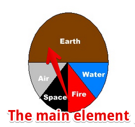
---->

<h4>Source code extract:</h4>

```
1.  function readContent(track) {
2.     console.log("adding cue change listener to loaded track...");
3.     trackStatusesDiv.innerHTML = "";
4.  
5.     <b>// add a cue change listener to the TextTrack</b>
6.  <b>   track.addEventListener("cuechange", function(e) {</b>
7.  <b>      var cue = this.activeCues[0];</b>
8.  <b>      if(cue !== undefined)</b>
9.  <b>         trackStatusesDiv.innerHTML += "cue change: text =
   " + cue.text + "<br>";</b>
10. <b>   });</b>
11. 
12.    video.play();
13. }
```

<a href="https://jsbin.com/xawajoh/1/edit?html,css,js,output">And here is another modified version of this example at JSBin, that
shows how to use enter and exit events on cues</a>:

<!------------------------------------------------------------------------------------------------>
<!- 32. example that displays message in enter and exit cue listeners of the selected track (xx) ->
<!------------------------------------------------------------------------------------------------>
<p align="center" width="100%">

</p>

<h4>Source code extract:</h4>

```
1.  function readContent(track) {
2.     console.log("adding enter and exit listeners to all cues of this
    > track");
3.  
4.     trackStatusesDiv.innerHTML = "";
5.  
6.     // get the list of cues for that track
7.     var cues = track.cues;
8.     // iterate on them
9.     for(var i=0; i < cues.length; i++) {
10.       // current cue
11.       var cue = cues[i];   
12.      <b> addCueListeners(cue);</b>
13.  }
14. 
15. video.play();
16. }
17.  
18. function addCueListeners(cue) {
19.    cue.onenter = function(){
20.       trackStatusesDiv.innerHTML += 'entered cue id=' + this.id + "
    > "
21.                                  + this.text + "<br>";
22.    };
23.    cue.onexit = function(){
24.       trackStatusesDiv.innerHTML += 'exited cue
    > id=' + this.id + "<br>";
25.    };
26. } // end of addCueListeners...
```

<h3 id="ch1-3">1.3 Advanced Features for <audio> and <video> Players</h3>

<h3 id="ch1-3-1">1.3.1 With a Clickable Transcript on the Side</h3>

Hi! This time, we will just go a little bit further than in the previous
examples.

When we click on a button, we will force the loading of the track, we
will read the content, add cue listeners in order to trigger events when
the video is played and we will display them on the side this time, and
there are hyperlinks you can click and if I click somewhere, the video
starts at the corresponding location and you can see that the cues are
highlighted in black as the video advances. There are not a lot of
subtitles at this location but... you can see that the transcript is
highlighted as the video is playing.

What have we added to the previous example? The first thing is that we
just defined a rectangular area here: it is just a div with an
id="transcript", and we added some CSS here, for locating the video and
the transcript on the same horizontal position, so that the video can
grow and the transcript too. We use floating positions, I put
‘float:left;’ for the transcript that is on the right because if I put
'right' it will grow but it will be aligned on the right... and I prefer
it on the left.

We can give a look at the CSS, there is nothing complicated and this can
scroll because of the overflow:auto; rule we added to the div. When we
click on the buttons here, we call a function called loadTranscript(),
instead of forceLoadTrack(0) and forceLoadTrack(1), this time we just
ask for a particular language and, it's implicit, but we are also
looking for track files that are not chapters. Let's have a look at this
loadTranscript() function here. So the loadTranscript() function has a
parameter that is the language. The first thing we do is that we clear the div, we
are just setting the content to null and then we disable all the tracks:
we set the mode of the all the tracks ‘disabled’ because when we click here and we can
change the language of the transcript, we need to disable all track and
enable just the one we are interested in. How can we locate the right
track with the language? We just iterate on the tracks... this is the
text tracks object... and we get the current track as an HTML element
and as a TextTrack and using the TextTrack, we just check the language
and the kind. And if the language is equal to the one we are looking
for, and if the kind is different than chapters, then this is the track
we would like. By forcing the mode to "showing", in case the track has
not already been loaded, it will trigger (it will ask the browser) to
load the file.

This is where we test if the file is already been loaded, it is exactly
the same test we did in the previous example. If the track is already
loaded, just display the cues in sync with the video and if the track
has not been loaded, display the cues after the track has been loaded.
This is the same function as the getContent we had, except that we
renamed it. This takes the track as an HTML element and the TextTrack as
parameters. Let's have a look at how it is done.

"displayCuesAfterTrackLoaded" just waits for the load event to be
triggered and then it called display the cues function that will display
the cues in sync.

Either we call it directly if the track is loaded, or we know that the
loading has been triggered if necessary, and we just wait in the load event listener.

Let's have a look at what displayCues function does.

The displayCues function is exactly the same as the readContent we had
earlier.

It gets the cue list for the given track, add listeners to the track.
And instead of just displaying the plain text below the video as we did earlier, we will
just make a nice format and we will add the id of the cue in the element we are creating.

Let's have a look... I'm calling the inspector... let's have a look at
one of the list items here.

You can see that in the list item we use the CSS class called cues, just
for the formatting, for putting them in blue and adding an underline when the
mouse is over, and we use the id of the cue in the list item. So the id
is 10, and we also created an onclick listener that calls the function
we will detail later, that is call jumpTo.

And here is the starting time of the cue. What we did is that we created
a list item with a given id and if we click on it, it has a click listener that will call the jumpTo with the time as the parameter. This is the trick, this onclick listener that will make the video jump to the right position.

How did we create that? We use classical techniques. We created a string
called clickableTransText that is just an HTML list item with the id,
the onclick listener that is built with the start time of the cue and we
just add this list item to the div.

This function here, addToTranscriptDiv, just adds in the DOM the HTML
fragment.

We can give a look at addToTranscriptDiv. It just does
transcriptDiv.innerHTML += this text.

The jumpTo method that makes the video jump... in order to jump to a
particular time in the video we are just setting the currentTime
property of the video element and we want it to start playing as soon as
the jump is done. So video = document.querySelector("#myVideo") is just
the video HTML element.

I recommend to look slowly at the code, it is a bit longer because we
added some formatting for the voices and so on, but it is not
complicated. Take your time and look at how it's done....

Foreword about the set of five examples presented in this section: the
code of the examples is larger than usual, but each example integrates
blocks of code already presented and detailed in the previous lessons.

Example #1: create an accessible player with a clickable transcript of
the video presentation.

It might be interesting to read the content of a track before playing
the video. This is what the edX video player does: it reads a single
subtitle file and displays it as a transcript on the right. In the
transcript, you can click on a sentence to make the video jump to the
corresponding location. We will learn how to do this using the track
API.


<!------------------------------------------------------------------------------------------------>
<!------------------------ 33.  (xx) ---------------------------->
<!------------------------------------------------------------------------------------------------>
<p align="center" width="100%">

</p>

Read the WebVTT file at once using the track API and make a clickable
transcript

Here we decided to code something similar, except that we will offer a
choice of track/subtitle language. Our example offers English or German
subtitles, and also another track that contains the chapter descriptions
(more on that later). Using a button to select a language (track), the
appropriate transcript is displayed on the right. Like the edX player,
we can click on any sentence in order to force the video to jump to the
corresponding location. While the video is playing, the current text is
highlighted.

Some important things here:

1.  Browsers do not load all the tracks at the same time, and the way
    they decide when and which track to load differs from one browser to
    another. So, when we click on a button to choose the track to
    display, we need t<i>o enforce the loading of the track, if it has not
    been loaded yet<i>.

2.  When a track file is loaded, then we iterate on the different cues
    and generate the transcript as a set of <li>...</li> elements.
    One <li> per cue/sentence. 

3.  We define the id attribute of the <li> to be the same as
    the cue.id value. In this way, when we click on a <li> we can get
    its id and find the corresponding cue start time, and make the video
    jump to that time location.

4.  We add an enter and an exit listener to each cue. These will be
    useful for highlighting the current cue. Note that these listeners
    are not yet supported by FireFox (you can use a cuechange event
    listener on a TextTrack instead - the source code for FireFox is
    commented in the example).

[Try this example at
JSBin](https://jsbin.com/sodihux/1/edit?html,css,js,output):

<!------------------------------------------------------------------------------------------------>
<!------------------------ 34.  (xx) ---------------------------->
<!------------------------------------------------------------------------------------------------>
<p align="center" width="100%">

</p>

<h4>HTML code:</h4>

```
1.  <section id="all">
2.  <button disabled id="buttonEnglish"
3.           onclick="loadTranscript('en');">
4.      Display English transcript
5.   </button>
6.  <button disabled id="buttonDeutsch"
7.           onclick="loadTranscript('de');">
8.      Display Deutsch transcript
9.  </button>
10. </p>
11. <video id="myVideo" preload="metadata" controls crossOrigin="anonymous">
12.      <source src="https://...../elephants-dream-medium.mp4"
13.              type="video/mp4">
14.      <source src="https://...../elephants-dream-medium.webm"
15.              type="video/webm">
16.      <track label="English subtitles"
17.             kind="subtitles"
18.             srclang="en"
19.             src="https://...../elephants-dream-subtitles-en.vtt" >
20.      <track label="Deutsch subtitles"
21.             kind="subtitles"
22.             srclang="de"
23.             src="https://...../elephants-dream-subtitles-de.vtt"
24.             <b>default</b>>
25.      <track label="English chapters"
26.             kind="chapters"
27.             srclang="en"
28.             src="https://...../elephants-dream-chapters-en.vtt">
29. </video>
30. <div id="transcript"></div>
31. </section>
```

<h4>CSS code:</h4>

```
1.  #all {
2.     background-color: lightgrey;
3.     border-radius:10px;
4.     padding: 20px;
5.     border:1px solid;
6.     display:inline-block;
7.     margin:30px;
8.     width:90%;
9.  }
10.  
11. .cues {
12.    color:blue;
13. }
14.  
15. .cues:hover {
16.    text-decoration: underline;
17. }
18.  
19. .cues.current {
20.    color:black;
21.    font-weight: bold;
22. }
23.  
24. #myVideo {
25.    display: block;
26.    float : left;
27.    margin-right: 3%;
28.    width: 66%;
29.    background-color: black;
30.    position: relative;
31. }
32.  
33. #transcript {
34.    padding: 10px;
35.    border:1px solid;
36.    float: left;
37.    max-height: 225px;
38.    overflow: auto;
39.    width: 25%;
40.    margin: 0;
41.    font-size: 14px;
42.    list-style: none;
43. }
```

<h4>JavaScript code:</h4>

```
1.  var video, transcriptDiv;
2.  // TextTracks, html tracks, urls of tracks
3.  var tracks, trackElems, tracksURLs = []; 
4.  var buttonEnglish, buttonDeutsch;
5.   
6.  window.onload = function() {
7.     console.log("init");
8.     // when the page is loaded, get the different DOM nodes
9.     // we're going to work with
10.    video = document.querySelector("#myVideo");
11.    transcriptDiv = document.querySelector("#transcript");
12. 
13.    // The tracks as HTML elements
14.    trackElems = document.querySelectorAll("track");
15. 
16.    // Get the URLs of the vtt files
17.    for(var i = 0; i < trackElems.length; i++) {
18.       var currentTrackElem = trackElems[i];
19.       tracksURLs[i] = currentTrackElem.src;
20.    }
21. 
22.    buttonEnglish = document.querySelector("#buttonEnglish");
23.    buttonDeutsch = document.querySelector("#buttonDeutsch");
24. 
25.    // we enable the buttons only in this load callback,
26.    // we cannot click before the video is in the DOM
27.    buttonEnglish.disabled = false;
28.    buttonDeutsch.disabled = false;
29. 
30.    // The tracks as TextTrack JS objects
31.    tracks = video.textTracks;
32. };
33.  
34. function loadTranscript(lang) {
35.   // Called when a button is clicked
36. 
37.   // clear current transcript
38.   clearTranscriptDiv();
39. 
40.   // set all track modes to disabled. We will only activate the
41.   // one whose content will be displayed as transcript
42.   disableAllTracks();
43. 
44.   // Locate the track with language = lang
45.   for(var i = 0; i < tracks.length; i++) {
46.     // current track
47.     var track = tracks[i];
48.     var trackAsHtmlElem = trackElems[i];
49. 
50.     // Only subtitles/captions are ok for this example...
51.     if((track.language === lang) && (track.kind !== "chapters")) {
52.        track.mode="showing";
53.  
54.        if(trackAsHtmlElem.readyState === 2) {
55.           // the track has already been loaded
56.           displayCues(track);
57.        } else {
58.           displayCuesAfterTrackLoaded(trackAsHtmlElem, track);
59.        }
60. 
61.        /<i> Fallback for FireFox that still does not implement cue
    enter and exit events
62.          track.addEventListener("cuechange", function(e) {
63.              var cue = this.activeCues[0];
64.              console.log("cue change");
65.              var transcriptText = document.getElementById(cue.id);
66.              transcriptText.classList.add("current");
67.          });
68.       </i>/
69.     }
70.   }
71. }
72. 
73. function displayCuesAfterTrackLoaded(trackElem, track) {
74.   // Create a listener that will only be called once the track has
75.   // been loaded. We cannot display the transcript before
76.   // the track is loaded
77.    trackElem.addEventListener('load', function(e) {
78.       console.log("track loaded");
79.       displayCues(track);
80.    });
81. }
82. 
83. function disableAllTracks() {
84.   for(var i = 0; i < tracks.length; i++)
85.      // the track mode is important: disabled tracks do not fire
   events
86.      tracks[i].mode = "disabled"; 
87. }
88.  
89. function displayCues(track) { 
90.    // displays the transcript of a TextTrack

91.    var cues = track.cues;

92. 

93.    // iterate on all cues of the current track

94.    for(var i=0, len = cues.length; i < len; i++) {

95.       // current cue, also add enter and exit listeners to it

96.       var cue = cues[i];

97.       addCueListeners(cue);

98.  

99.       // Test if the cue content is a voice <v speaker>....</v>

100.       var voices = getVoices(cue.text);

101.       var transText="";

102.       if (voices.length > 0) {

103.          for (var j = 0; j < voices.length; j++) { // how many
     voices?

104.             transText += voices[j].voice + ':
     ' + removeHTML(voices[j].text);

105.          }

106.       } else

107.          transText = cue.text; // not a voice text

108. 

109.       var clickableTransText = "<li class='cues' id=" + cue.id

110.                                + " onclick='jumpTo("

111.                                + cue.startTime + ");'" + ">"

112.                                + transText + "</li>";

113.  

114.       addToTranscriptDiv(clickableTransText);

115.    }

116. }

117.  

118. function getVoices(speech) { 

119.    // takes a text content and check if there are voices

120.    var voices = []; // inside

121.    var pos = speech.indexOf('<v'); // voices are like <v Michel>
     ....

122.    while (pos != -1) {

123.       endVoice = speech.indexOf('>');

124.       var voice = speech.substring(pos + 2, endVoice).trim();

125.       var endSpeech = speech.indexOf('</v>');

126.       var text = speech.substring(endVoice + 1, endSpeech);

127.       voices.push({

128.           'voice': voice,

129.           'text': text

130.       });

131.       speech = speech.substring(endSpeech + 4);

132.       pos = speech.indexOf('<v');

133.   }

134.   return voices;

135. }

136.  

137. function removeHTML(text) {

138.   var div = document.createElement('div');

139.   div.innerHTML = text;

140.   return div.textContent || div.innerText || '';

141. }

142. 

143. function jumpTo(time) {

144.   // Make the video jump at the time position + force play

145.   // if it was not playing

146.   video.currentTime = time;

147.   video.play();

148. }

149.  

150. function clearTranscriptDiv() {

151.   transcriptDiv.innerHTML = "";

152. }

153.  

154. function addToTranscriptDiv(htmlText) {

155.   transcriptDiv.innerHTML += htmlText;

156. }

157.  

158. function addCueListeners(cue) {

159.   cue.onenter = function(){

160.      // Highlight current cue transcript by adding the

161.      // cue.current CSS class

162.      console.log('enter id=' + this.id);

163.      var transcriptText = document.getElementById(this.id);

164.      transcriptText.classList.add("current");

165. };

166.  

167. cue.onexit = function(){

168.    console.log('exit id=' + cue.id);

169.    var transcriptText = document.getElementById(this.id);

170.    transcriptText.classList.remove("current");

171. };

172. 

173. } // end of addCueListeners...

Load a WebVTT file using Ajax/XHR2 and parse it manually.

This is an old example written in 2012 at a time when the track API was
not supported by browsers. It downloads WebVTT files using Ajax and
parses it "by hand". Notice the complexity of the code, compared to the
previous example that uses the track API instead. We give this example
as is. Sometimes, bypassing all APIs can be a valuable solution,
especially when support for the track API is sporadic, as was the case
in 2012...

[<u>Here is an example at JSBin that displays the values of the
cues</u>](https://jsbin.com/vedelequso/edit?html,js,output) in the
different tracks:


This example, adapted from an example from (now offline) dev.opera.com,
uses some JavaScript code that takes a WebVTT subtitle (or caption) file
as an argument, parses it, and displays the text on screen, in an
element with an id of transcript.

<h4>Extract from HTML code:</h4>

```
1.  ...
2.  <video preload="metadata" controls >
3.   <source src="https://..../elephants-dream-medium.mp4" type="video/mp4">
4.   <source src="https://..../elephants-dream-medium.webm" type="video/webm">
5.      <track label="English subtitles" kind="subtitles" srclang="en"
6.           src="https://..../elephants-dream-subtitles-en.vtt" default>
7.      <track label="Deutsch subtitles" kind="subtitles" srclang="de"
8.             src="https://..../elephants-dream-subtitles-de.vtt">
9.      <track label="English chapters" kind="chapters" srclang="en"
10.            src="https://..../elephants-dream-chapters-en.vtt">
11. </video>
12.  ...
13.    <h3>Video Transcript</h3>
14.    <button onclick="loadTranscript('en');">English</button>
15.    <button onclick="loadTranscript('de');">Deutsch</button>
16.     </div>
17.     <div id="transcript"></div>
18. ...
```

<h4>JavaScript code:</h4>

```
1.  // Transcript.js, by dev.opera.com
2.  function loadTranscript(lang) {
3.     var url = "https://mainline.i3s.unice.fr/mooc/" +
4.         'elephants-dream-subtitles-' + lang + '.vtt';
5.  
6.     // Will download using Ajax + extract subtitles/captions   
7.     loadTranscriptFile(url); 
8.  }
9.   
10. function loadTranscriptFile(webvttFileUrl) {
11.    // Using Ajax/XHR2 (explained in detail in Module 3)
12.    var reqTrans = new XMLHttpRequest();
13. 
14.    reqTrans.open('GET', webvttFileUrl);
15. 
16.    // callback, called only once the response is ready
17.    reqTrans.onload = function(e) { 
18. 
19.        var pattern = /^([0-9]+)$/;
20.      var patternTimecode = /^([0-9]{2}:[0-9]{2}:[0-9]{2}[,.]{1}[0-9]{3})    --> ([0-9]
21.                             {2}:[0-9]{2}:[0-9]{2}[,.]{1}[0-9]{3})(.</i>)$/;
22. 
23.        var content = this.response; // content of the webVTT file
24. 
25.        var lines = content.split(/r?n/); // Get an array of text lines
26.        var transcript = '';
27.        for (i = 0; i < lines.length; i++) {
28.          var identifier = pattern.exec(lines[i]);
29. 
30.          // is there an id for this line, if it is, go to next line
31.          if (identifier) { 
32.            i++;
33.            var timecode = patternTimecode.exec(lines[i]); 
34.            // is the current line a timecode?
35.            if (timecode && i < lines.length) {      
36.               // if it is go to next line     
37.               i++;
38.               // it can only be a text line now
39.               var text = lines[i];  
40.                         
41.               // is the text multiline?
42.               while (lines[i] !== '' && i < lines.length) {   
43.                  text = text + 'n' + lines[i];
44.                  i++;
45.               }
46. 
47.               var transText = '';
48.               var voices = getVoices(text);
49.               // is the extracted text multi voices ? 
50.               if (voices.length > 0) {
51.                  // how many voices ?
52.                  for (var j = 0; j < voices.length; j++) { 
53.                  transText += voices[j].voice + ': '
54.                            + removeHTML(voices[j].text)
55.                            + '<br />';
56.               }
57.           } else 
58.              // not a voice text
59.              transText = removeHTML(text) + '<br />'; 
60. 
61.          transcript += transText;
62.        }
63.      }
64. 
65.      var oTrans = document.getElementById('transcript');
66.      oTrans.innerHTML = transcript;
67.    }
68. };
69.  reqTrans.send(); // send the Ajax request
70. }
71.  
72. function getVoices(speech) {  // takes a text content and check if there are voices 
73.   var voices = [];            // inside
74.   var pos = speech.indexOf('<v'); // voices are like <v Michel> ....
75. 
76.   while (pos != -1) {
77.     endVoice = speech.indexOf('>');
78.     var voice = speech.substring(pos + 2, endVoice).trim();
79.     var endSpeech = speech.indexOf('</v>');
80.     var text = speech.substring(endVoice + 1, endSpeech);
81.     voices.push({
82.        'voice': voice,
83.        'text': text
84.     });
85.     speech = speech.substring(endSpeech + 4);
86.     pos = speech.indexOf('<v');
87.   }
88.   return voices;
89. }
90.  
91. function removeHTML(text) {
92.   var div = document.createElement('div');
93.   div.innerHTML = text;
94.   return div.textContent || div.innerText || '';
95. }
```

## 1.3.2 Captions, Descriptions, Chapters and Metadata

Example #2: showing video description while playing, listening to
events, changing the mode of a track.

Each track has a mode property (and a mode attribute) that can
be: <i>"disabled"</i>, <i>"hidden"</i> or <i>"showing"</i>. More than one track at a
time can be in any of these states.  The difference
between <i>"hidden"</i> and <i>"disabled"</i> is that hidden tracks can fire
events (more on that at the end of the first example) whereas disabled
tracks do not fire events.


[Here is an example at
JSBin](https://jsbin.com/bixoru/1/edit?html,css,js,output) that shows
the use of the <i>mode</i> property, and how to listen for <i>cue events</i> in
order to capture the current subtitle/caption from JavaScript. You can
change the mode of each track in the video element by clicking on its
button. This will toggle the mode of that track. All tracks with
mode="showing" or mode="hidden" will have the content of their cues
displayed in real time in a small area below the video.

In the screen-capture below, we have a WebVTT file displaying a scene's
captions and descriptions.

<h4>Extract from HTML code:</h4>

```
1. <html lang="en">
2. ...
3. <body onload="init();">
4. ...
5. <p>
6. <video id="myVideo" preload="metadata"
7. poster ="https://...../sintel.jpg"
8. crossorigin="anonymous"
9. controls="controls"
10. width="640" height="272">
11. 
12. <source src="https://...../sintel.mp4"
13. type="video/mp4" />
14. <source src="https://...../sintel.webm"
15. type="video/webm" />
16. <track src="https://...../sintel-captions.vtt"
17. kind="captions"
18. label="English Captions"
19. <b>default</b>/>
20. <track src="https://...../sintel-descriptions.vtt"
21. kind="descriptions"
22. label="Audio Descriptions" />
23. <track src="https://...../sintel-chapters.vtt"
24. kind="chapters"
25. label="Chapter Markers" />
26. <track src="https://...../sintel-thumbs.vtt"
27. kind="metadata"
28. label="Preview Thumbs" />
29. </video>
30. </p>
31. 
32. <p>
33. <div id="currentTrackStatuses"></div>
34. <p>
35. <p>
36. <div id="subtitlesCaptions"></div>
37. </p>
38. 
39. <p>
40. <button onclick="clearSubtitlesCaptions();">
41. Clear subtitles/captions log
42. </button>
43. </p>
44. 
45. <p>Click one of these buttons to toggle the mode of each track:</p>
46. <button onclick="toggleTrack(0);">
47. Toggle english caption track mode
48. </button>
49. <br>
50. <button onclick="toggleTrack(1);">
51. Toggle audio description track mode
52. </button>
53. <br>
54. <button onclick="toggleTrack(2);">
55. Toggle chapter track mode
56. </button>
57. <br>
58. <button onclick="toggleTrack(3);">
59. Toggle preview thumbnail track modes
60. </button>
61. 
62. </body>
63. </html>
```

<h4>JavaScript code:</h4>

```
var tracks, video, statusDiv, subtitlesCaptionsDiv;
 
function init() {
    video = document.querySelector("#myVideo");
    statusDiv = document.querySelector("#currentTrackStatuses");
       subtitlesCaptionsDiv = document.querySelector("#subtitlesCaptions");
    tracks = document.querySelectorAll("track");
 
    video.addEventListener('loadedmetadata', function() {
       console.log("metadata loaded");
 
       // defines cue listeners for the active track; we can do this     only after the video metadata have been loaded
       for(var i=0; i<tracks.length; i++) {
          var t = tracks[i].track;
          if(t.mode === "showing") {
             t.addEventListener('cuechange', logCue, false);
          }
        }
        // display in a div the list of tracks and their status/mode value
        displayTrackStatus();  
     });
 }
  
 function displayTrackStatus() {
     // display the status / mode value of each track.
     // In red if disabled, in green if showing
     for(var i=0; i<tracks.length; i++) {
        var t = tracks[i].track;
        var mode = t.mode;
 
        if(mode === "disabled") {
           mode = "<span style='color:red'>" + t.mode + "</span>";
        } else if(mode === "showing") {
           mode = "<span style='color:green'>" + t.mode + "</span>";
        }
        appendToScrollableDiv(statusDiv, "track " + i + ":" + t.label
                                         + " " + t.kind+" in "
                                         + mode + " mode");
     }
 }
 function appendToScrollableDiv(div, text) {
    // we've got two scrollable divs. This function
    // appends text to the div passed as a parameter
    // The div is scrollable (thanks to CSS overflow:auto)
    var inner = div.innerHTML;
    div.innerHTML = inner + text + "<br/>";
    // Make it display the last line appended
    div.scrollTop = div.scrollHeight;
 }
  
 function clearDiv(div) {
    div.innerHTML = '';
 }
  
 function clearSubtitlesCaptions() {
    clearDiv(subtitlesCaptionsDiv);
 }
 
 function toggleTrack(i) {
    // toggles the mode of track i, removes the cue listener
157.    // if its mode becomes "disabled"
158.    // adds a cue listener if its mode was "disabled"
159.    // and becomes "hidden"
160.    var t = tracks[i].track;
161.    switch (t.mode) {
162.       case "disabled":
163.          t.addEventListener('cuechange', logCue, false);
164.          t.mode = "hidden";
165.          break;
166.       case "hidden":
167.          t.mode = "showing";
168.          break;
169.       case "showing":
170.          t.removeEventListener('cuechange', logCue, false);
171.          t.mode = "disabled";
172.          break;
173.     }
174.     // updates the status
175.     clearDiv(statusDiv);
176.     displayTrackStatus();
177.     appendToScrollableDiv(statusDiv,"<br>" + t.label+" are now " +t.mode);
178. }
179.  
180. function logCue() {
181.    // callback for the cue event
182.    if(this.activeCues && this.activeCues.length) {
183.       var t = this.activeCues[0].text; // text of current cue
184.       appendToScrollableDiv(subtitlesCaptionsDiv, "Active "
185.                                           + this.kind + " changed to: " + t);
186.    }
187. }
```

<h3 id="ch1-3-3">1.3.3 With Buttons for Choosing the Subtitle Language</h3>

Example #3: adding buttons for choosing the subtitle/caption track

You might have noticed that with some browsers, before 2018, the
standard implementation of the video element did not let the user choose
the subtitle language. Now, recent browsers offers a menu to choose the
track to display. 

However, before it was available, it was easy to implement this feature
using the Track API.

[Here is a simple example at
JSBin](https://jsbin.com/balowuq/1/edit?html,css,js,output): we added
two buttons below the video to enable/disable subtitles/captions and let
you choose which track you prefer. 


<h4>HTML code:</h4>

```
1.  ...
2.  <body onload="init()">
3.   ...
4.  <video id="myVideo" preload="metadata" controls crossOrigin="anonymous" >
5.       <source src="https://...../elephants-dream-medium.mp4"
6.               type="video/mp4">
7.       <source src="https://...../elephants-dream-medium.webm"
8.               type="video/webm">
9.       <track  label="English subtitles"
10.              kind="subtitles"
11.              srclang="en"
12.              src="https://...../elephants-dream-subtitles-en.vtt"
13.              <b>default</b>>
14.      <track  label="Deutsch subtitles"
15.              kind="subtitles"
16.              srclang="de"
17.              src="https://...../elephants-dream-subtitles-de.vtt">
18.      <track  label="English chapters"
19.              kind="chapters"
20.              srclang="en"
21.              src="https://...../elephants-dream-chapters-en.vtt">
22. </video>
23. <h3>Current track: <span id="currentLang"></span></h3>
24. <div id="langButtonDiv"></div>
25. </section>
26. ...
```

<h4> JavaScript code:

```
1.  var langButtonDiv, currentLangSpan, video;
2.   
3.  function init() {
4.     langButtonDiv = document.querySelector("#langButtonDiv");
5.     currentLangSpan = document.querySelector("#currentLang");
6.     video = document.querySelector("#myVideo");
7.  
8.     console.log("Number of tracks = "
9.                 + video.textTracks.length);
10.    // Updates the display of the current track activated
11.    currentLangSpan.innerHTML = activeTrack();
12.    // Build the buttons for choosing a track
13.    buildButtons();
14. }
15.  
16. function activeTrack() {
17.    for (var i = 0; i < video.textTracks.length; i++) {
18.       if(video.textTracks[i].mode === 'showing') {
19.          return video.textTracks[i].label + " ("
20.                 + video.textTracks[i].language + ")";
21.       }
22.    }
23.    return "no subtitles/caption selected";
24. }
25.  
26. function buildButtons() {
27.    if (video.textTracks) { // if the video contains track elements
28.       // For each track, create a button
29.       for (var i = 0; i < video.textTracks.length; i++) {
30.          // We create buttons only for the caption and subtitle
    tracks
31.          var track = video.textTracks[i];
32.        
     if((track.kind !== "subtitles") && (track.kind !== "captions"))
33.             continue;
34. 
35.          // create a button for track number i         
36.          createButton(video.textTracks[i]); 
37.       }
38.    }
39. }
40. 
41. function createButton(track) {
42.    // Create a button
43.    var b = document.createElement("button");
44.    b.value=track.label;
45.    // use the lang attribute of the button to keep trace of the
46.    // associated track language. Will be useful in the click
   listener
47.    b.setAttribute("lang", track.language); 
48.    b.addEventListener('click', function(e) {
49.      // Check which track is the track with the language
    we're looking for
50.      // Get the value of the lang attribute of the clicked button
51.      var lang = this.getAttribute('lang'); 
52. 
53.      for (var i = 0; i < video.textTracks.length; i++) {
54.        if (video.textTracks[i].language == lang) {
55.           video.textTracks[i].mode = 'showing';
56.        } else {
57.           video.textTracks[i].mode = 'hidden';
58.        }
59.      }
60.      // Updates the span so that it displays the new active track
61.     currentLangSpan.innerHTML = activeTrack();
62.   });
63.   // Creates a label inside the button
64.   b.appendChild(document.createTextNode(track.label));
65.   // Add the button to a div at the end of the HTML document
66.   langButtonDiv.appendChild(b);
67. }
68. 
```

<h4> External resources

-   If you are interested in building a complete custom video player,
    MDN offers an online tutorial with further information
    about [styling and integrating a "CC"
    button](https://developer.mozilla.org/en-US/Apps/Build/Audio_and_video_delivery/Adding_captions_and_subtitles_to_HTML5_video)

-   The MDN documentation on [Web Video Text Tracks
    Format](https://developer.mozilla.org/fr/docs/Web/API/WebVTT_API) (WebVTT)

<h3 id="ch1-3-4">1.3.4 With a Simple Chapter Navigation Menu</h3>

Example #4: making a simple chapter navigation menu


We can use WebVTT files to define chapters. The syntax is exactly the
same as for subtitles/caption .vtt files. The only difference is in the
declaration of the track. Here is how we declared a chapter track in one
of the previous examples (in bold in the example below):

<h4>HTML code:</h4>

```
 <video id="myVideo" preload="metadata" controls crossOrigin="anonymous">
 <source src=<https://...../elephants-dream-medium.mp4>
 type="video/mp4">
 <source src=<https://...../elephants-dream-medium.webm>
 type="video/webm">
 <track label="English subtitles"
 kind="subtitles"
 srclang="en"
 src="https://...../elephants-dream-subtitles-en.vtt" >
 <track label="Deutsch subtitles"
 kind="subtitles"
 srclang="de"
 src=<https://...../elephants-dream-subtitles-de.vtt>
 default>
 <track label="English chapters"
 kind="chapters"
 srclang="en"
 src="https://...../elephants-dream-chapters-en.vtt">
 </video>
```

If we try this code in an HTML document, nothing special happens. No
magic menu, no extra button!

Currently, no browser takes chapter tracks into account. You could use
one of the enhanced video players presented during the HTML5 Part 1
course, but as you will see in this lesson: making your own chapter
navigation menu is not complicated.

Let's start by examining the sample .vtt file

[elephant-dream-chapters-en.vtt](https://mainline.i3s.unice.fr/mooc/elephants-dream-chapters-en.vtt):

```
1.  WEBVTT
2.  
3.  chapter-1
4.  00:00:00.000 --> 00:00:26.000
5.  Introduction
6.  
7.  chapter-2
8.  00:00:28.206 --> 00:01:02.000
9.  Watch out!
10. 
11. chapter-3
12. 00:01:02.034 --> 00:03:10.000
13. Let's go
14. 
15. chapter-4
16. 00:03:10.014 --> 00:05:40.000
17. The machine
18. 
19. chapter-5
20. 00:05:41.208 --> 00:07:26.000
21. Close your eyes
22. 
23. chapter-6
24. 00:07:27.125 --> 00:08:12.000
25. There's nothing there
26. 
27. chapter-7
28. 00:08:13.000 --> 00:09:07.500
29. The Colossus of Rhodes
```

There are 7 cues (one for each chapter). Each cue id is the word
"chapter-" followed by the chapter number, then we have the start and
end time of the cue/chapter, and the cue content. In this case: the
description of the chapter ("Introduction", "Watch out!", "Let's go",
etc...).

Hmm... let's try to open this chapter track with [the example we wrote
in a previous lesson - the one that displayed the clickable transcript
for subtitles/captions on the right of the
video](https://jsbin.com/zeqoleq/1/edit?html,css,js,output). We need to
modify it a little bit:

1.  We add a "show English chapters" button with a click event listener
    > similar to this :

```
 <button disabled id="buttonEnglishChapters" <b>onclick="loadTranscript('en', 'chapters');"</b>>
 Display English chapter markers
 </button>
```

We modify the loadTranscript function from the previous example, so that it matches both the srclang and
 the kind attribute of the track.  

Here is a new version: in bold are the source code lines we
modified.

```
 function loadTranscript(lang, kind) {
 ...
 // Locate the track with lang and kind that match the parameters
 for(var i = 0; i < tracks.length; i++) {
 ...
 if((track.language === lang) && (track.kind === kind)) {
 // display it contents...
 }
 }
 }
```

Simple approach: chapters as clickable text on the right of the video

[Try it on JSBin](https://jsbin.com/rifekik/edit?html,css,js); this
version includes the modifications we presented earlier - nothing more.
Notice that we kept the existing buttons to display a clickable
transcript:


Look at the JavaScript and HTML tab of the JSBin example to see the
source code. It's the same as in the clickable transcript example,
except for the small changes we explained earlier.

Chapter navigation, illustrated in the video player below, is fairly
popular.


In addition to the clickable chapter list, this one displays an enhanced
progress bar created using a canvas. The small squares are drawn
corresponding to the chapter cues' start and end times. You could modify
the code provided, in order to add such an enhanced progress indicator.

However, we will see how we can do better by using JSON objects as cue
contents. This will be the topic of the next two lessons!

<h3 id="ch1-3-5">1.3.5 With Thumbnails, Using JSON Cues</h3>

Example #5: create a chapter menu with image thumbnails

Instead of using text (optionally using HTML for styling, multi lines,
etc.), it is also possible to use JSON objects as cue values that can be
manipulated from JavaScript. JSON means "JavaScript Object Notation".
It's an open standard for describing JavaScript objects as plain text.

Here is an example cue from a WebVTT file encoded as JSON instead of
plain text. JSON is useful for describing "structured data"', and
processing such data from JavaScript is easier than parsing plain text.

```
1.  WEBVTT
2.  Wikipedia
3.  00:01:15.200 --> 00:02:18.800
4.  {
5.  "title": "State of Wikipedia",
6.  "description": "Jimmy Wales talking ...",
7.  "src": "https://upload.wikimedia.org/...../120px-Wikipedia-logo-
8.  v2.svg.png",
9.  "href": "https://en.wikipedia.org/wiki/Wikipedia"
10. }
```

This JSON object (in bold green) is a JavaScript object encoded as a
text string. If we listen for cue events or if we read a WebVTT file as
done in previous examples, we can extract this text content using the
 cue.text property. For example:

```
1.  var videoElement = document.querySelector("#myvideo");
2.  var textTracks = videoElement.textTracks; // one for each track
    element
3.  var textTrack = textTracks[0]; // corresponds to the first track
    element
4.  
5.  var cues = textTrack.cues;
6.  var cue = cues[0]; // first cue
7.  
8.  // cue.text is in JSON format, with JSON.parse we turn it back
9.  // to a real JavaScript object
10. var obj = JSON.parse(cue.text); 
11. 
12. var title = obj.title; // "State of Wikipedia"
13. var description = obj.description; // Jimmy Wales talking...
14. etc...
```

This is a powerful way of embedding metadata, especially when used in
conjunction with listening for cue and track events.

Improved approach: make a nicer chapter menu by embedding a richer
description of chapter markers

Earlier we saw [an example that could display chapter markers as
clickable text on the right of a
video](https://jsbin.com/jiyodit/edit?html,css,js,output).


<h4> This example used only standard plain text content for the cues:

```
1.  WEBVTT
2.  
3.  chapter-1
4.  00:00:00.000 --> 00:00:26.000
5.  Introduction
6.  
7.  chapter-2
8.  00:00:28.206 --> 00:01:02.000
9.  Watch out!
10. ...
```

We used this example to manually capture the images from the video that
correspond to each of the seven chapters:

-   We clicked on each chapter link on the right, then paused the video,

-   then we used a screen capture tool to grab each image that
    corresponds to the beginning of chapter,

-   Finally, we resized the images with Photoshop to approximately
    200x400 pixels.

(For advanced users: it's possible to semi-automatize this process using
the ffmepg command line tool, see for
example [this](https://trac.ffmpeg.org/wiki/Create%20a%20thumbnail%20image%20every%20X%20seconds%20of%20the%20video) and [that](https://stackoverflow.com/questions/8679390/ffmpeg-extracting-20-images-from-a-video-of-variable-length)).

Here are the images which correspond to the seven chapters of the video
from the previous example:

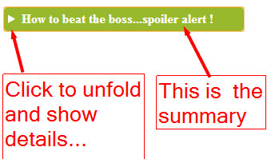

To associate these images with its chapter description, we will use JSON
objects as cue contents:

[elephants-dream-chapters-en-JSON.vtt](https://mainline.i3s.unice.fr/mooc/elephants-dream-chapters-en-JSON.vtt):

```
1.  WEBVTT
2.   
3.  chapter-1
4.  00:00:00.000 --> 00:00:26.000
5.  {
6.  "description": "Introduction",
7.  "image": "introduction.jpg"
8.  }
9.   
10.  
11. chapter-2
12. 00:00:28.206 --> 00:01:02.000
13. {
14. "description": "Watch out!",
15. "image": "watchOut.jpg"
16. }
17. ...
```

Before explaining the code, we propose that you [try this example at
JSBin that uses this new .vtt
file](https://jsbin.com/pulefe/1/edit?html,css,js,output):


<h4>HTML code:</h4>

```
1.  ...
2.  <video id="myVideo" preload="metadata" controls crossOrigin="anonymous">
3.  <source src="https://...../elephants-dream-medium.mp4"
4.           type="video/mp4">
5.  <source src="https://...../elephants-dream-medium.webm"
6.           type="video/webm">
7.  <track label="English subtitles"
8.          kind="subtitles"
9.  srclang="en" src="https://...../elephants-dream-subtitles-en.vtt" >
10. <track label="Deutsch subtitles"
11.         kind="subtitles"
12. srclang="de" src="https://...../elephants-dream-subtitles-de.vtt" default>
13. <b><track label="English chapters"</b>
14. <b>         kind="chapters"</b>
15. <b>srclang="en" src="https://...../elephants-dream-chapters-en-JSON.vtt"></b>
16. </video>
17. <h2>Chapter menu</h2>
18. <b><div id="chapterMenu"></div></b>
19.  ...
```

It's the same code we had in the first example, except that this time we
use a new WebVTT file that uses JSON cues to describe each chapter. For
the sake of simplicity, we also removed the buttons and all the code for
displaying a clickable transcript of the subtitles/captions on the right
of the video.

<h4> JavaScript code:</h4>

```
1.  var video, chapterMenuDiv;
2.  var tracks, trackElems, tracksURLs = [];
3.   
4.  window.onload = function() {
5.     console.log("init");
6.     // When the page is loaded
7.     video = document.querySelector("#myVideo");
8.     chapterMenuDiv = document.querySelector("#chapterMenu");
9.  
10.    // Get the tracks as HTML elements
11.    trackElems = document.querySelectorAll("track");
12.    for(var i = 0; i < trackElems.length; i++) {
13.       var currentTrackElem = trackElems[i];
14.       tracksURLs[i] = currentTrackElem.src;
15.    }
16. 
17.    // Get the tracks as JS TextTrack objects
18.    tracks = video.textTracks;
19. 
20.    <b>// Build the chapter navigation menu for the given lang and kind</b>
21. <b>   buildChapterMenu('en', 'chapters');</b>
22. };
23.  
24. function buildChapterMenu(lang, kind) {
25.   // Locate the track with language = lang and kind="chapters"
26.   for(var i = 0; i < tracks.length; i++) {
27.      // current track
28.      var track = tracks[i];
29.      var trackAsHtmlElem = trackElems[i];
30. 
31.      if((track.language === lang) && (track.kind === kind)) {
32.         // the track must be active, otherwise it will not load
33.         track.mode="showing"; // "hidden" would work too
34.  
35.         if(trackAsHtmlElem.readyState === 2) {
36.            // the track has already been loaded
37.            displayChapterMarkers(track);
38.         } else {
39.          displayChapterMarkersAfterTrackLoaded(trackAsHtmlElem, track);
40.         }
41.      }
42.    }
43. }
44.  
45. function displayChapterMarkers(track) {
46.    var cues = track.cues;
47. 
48.    // We must not see the cues on the video
49.    track.mode = "hidden";
50. 
51.    // Iterate on cues
52.    for(var i=0, len = cues.length; i < len; i++) {
53.       var cue = cues[i];
54.  
55.      <b> var cueObject = JSON.parse(cue.text);</b>
56. <b>      var description = cueObject.description;</b>
57. <b>      var imageFileName = cueObject.image;</b>
58.    var imageURL = "https://mainline.i3s.unice.fr/mooc/" + imageFileName;
59. 
60.       // Build the marker. It's a figure with an img and a figcaption inside.
61.       // The img has an onclick listener that will make the video jump
62.       // to the start time of the current cue/chapter
63.       var figure = document.createElement('figure');
64.       figure.classList.add("img");
65. 
66.       figure.innerHTML = "<figcaption class='desc'>"
69.                          + description + "</figcaption></figure>";
70.       // Add the figure to the chapterMenuDiv
71.       chapterMenuDiv.insertBefore(figure, null);
72.     }
73. }
74.  
75. function displayChapterMarkersAfterTrackLoaded(trackElem, track) {
76.   // Create a listener that will only be called when the track has
77.   // been loaded
78.   trackElem.addEventListener('load', function(e) {
79.      console.log("chapter track loaded");
80.      displayChapterMarkers(track);
81.   });
82. }
83.  
84. function jumpTo(time) {
85.   video.currentTime = time;
86.   video.play();
87. }
88.  
```

<h4><b>Explanations:</b></h4>

-   <i>Lines  4-18</i>: when the page is loaded, we assemble all of the track
    HTML elements and their corresponding TextTrack objects.

-   <i>Line 19</i>: using that we can build the chapter navigation menu. All
    is done in the window.onload callback, so nothing happens until the
    DOM is ready.

-   <i>Lines 24-43</i>: the buildChapterMenu function first locates the
    chapter track for the given language, then checks if this track has
    been loaded by the browser. Once it has been confirmed that the
    track is loaded, the function displayChapters is called. 

-   <i>Lines 45-65</i>: the displayChapters(track) function will iterate over
    all of the cues within the chapter track passed as its parameter.
    For each cue, the JSON content is re-formatted back into a
    JavaScript object (line 55) and the image filename and description
    of the chapter/cue are extracted (lines 56-57). Then an HTML
    description for the chapter is built and added to the div element
    with id=chapterMenu. 
	
<h4>Here is the HTML code for one menu marker:</h4>

```
1.  <figure class="img">
2.      >  
3.     <figcaption class="desc">
4.        Introduction
5.     </figcaption>
6.  </figure>
```

Notice that we add a click listener to each thumbnail image. Clicking a
chapter thumbnail will cause the video to jump to the chapter time
location (the example above is for the first chapter with start time =
0).

We also added CSS classes "img", "thumb" and "desc", which make it easy
to style and position the thumbnails using CSS.

<h4>CSS source code extract:</h4>

```
1.  #chapterMenuSection {
2.     background-color: lightgrey;
3.     border-radius:10px;
4.     padding: 20px;
5.     border:1px solid;
6.     display:inline-block;
7.     margin:0px 30px 30px 30px;
8.     width:90%;
9.  }
10.  
11. figure.img {
12.   margin: 2px;
13.   float: left;
14. }
15.  
16. figcaption.desc {
17.   text-align: center;
18.   font-weight: normal;
19.   margin: 2px;
20. }
21.  
22. .thumb {
23.   height: 75px;
24.   border: 1px solid #000;
25.   margin: 10px 5px 0 0;
26.   box-shadow: 5px 5px 5px grey;
27.   transition: all 0.5s;
28. }
29.  
30. .thumb:hover {
31.   box-shadow: 5px 5px 5px black;
32. }
```

A sample menu marker is shown below (it's also animated - hover your
mouse over the thumbnail to see its animated shadow):


<h4>Introduction</h4>

Combining techniques: a clickable transcript and a chapter menu

This example is the same as the previous one except that we have kept
the features that we saw previously: the buttons for displaying a
clickable transcript. The code is longer, but it's just a combination of
the "clickable transcript" example from the previous lesson, and the
code from earlier in this lesson.

<a href="https://jsbin.com/zewemaj/edit?html,js,output">Try it at JSBin</a>


<h3 id="ch1-4-1">1.4.1 Creating Tracks on the Fly</h3>

In this lesson, we are going to show:

-   The addTextTrack method for adding a TextTrack to an
    html &lt;track&gt; element, 

-   The VTTCue constructor, for creating cues programmatically, and 

-   the addCue method for adding cues on the fly to a TextTrack etc.

These methods will allow us to create TextTrack objects and cues on the
fly, programatically.

The presented example shows how we can create "<b>sound sprites</b>": small
sounds that are parts of a mp3 file, and that can be played separately.
Each sound will be defined as a cue in a track associated with
the <audio> element.

Let's create on the fly a WebVTT file with many cues, in order to cut a
big sound file into segments and play them on demand

<a href="https://jsbin.com/lodiju/edit?html,js,output">This JsBin demonstration</a>, adapted
from an original demo by Sam Dutton, uses <a href="https://mainline.i3s.unice.fr/mooc/animalSounds.mp3">a single mp3 file that contains recorded animal sounds</a>.

<h4> Below is the sound file. You can try to play it:</h4>


<h4><b>Explanations:</b></h4>

The demo uses a JavaScript array for defining the different animal
sounds in this audio file:

```
1.   var sounds = [
1.      {
2.         id: "purr",
3.         startTime: 0.200,
4.         endTime: 1.800
5.      },
6.      {
7.         id: "meow",
8.         startTime: 2.300,
9.         endTime: 3.300
10.     },
11.     {
12.        id: "bark",
13.        startTime: 3.900,
14.        endTime: 4.300
15.     },
16.     {
17.        id: "baa",
18.        startTime: 5.000,
19.        endTime: 5.800
20.     }
21.     ...
22. ];
```

The idea is to create a track on the fly, then add cues within this
track. Each cue will be created with the id, the start and end
time taken from the above JavaScript object. In the end, we will have a
track with individual cues located at the time location where an animal
sound is in the mp3 file.

Then we generate buttons in the HTML document, and when the user clicks
on a button, the getCueById method is called, then the start and end
time properties of the cue are accessed and the sound is played (using
the currentTime property of the audio element).

<b>Polyfill for getCueById:</b> Note that this method is not available on
all browsers yet. A simple polyfill is used in the examples
presented. If the getCueById method is not implemented (this is the case
in some browsers), it's easy to use this small polyfill:

```
1.   // for browsers that do not implement the getCueById() method
2.  
3.   // let's assume we're adding the getCueById function to a TextTrack object
4.   //named "track"
5.  if (typeof track.getCueById !== "function") {
6.     track.getCueById = function(id) {
7.       var cues = track.cues;
8.       for (var i = 0; i != track.cues.length; ++i) {
9.         if (cues[i].id === id) {
10.          return cues[i];
11.        }
12.      }
13.   };
14.  }
```

<h4>Techniques</h4>

To add a TextTrack to a track element, use
the <a href="https://www.w3.org/TR/html5/embedded-content-0.html#text-track-api">addTextTrack method</a> (of the
audio or video element). The function's signature is
addTextTrack(kind[,label[,language]]) where kind is our familiar
choice between subtitles, captions, chapters, etc. The optional label is
any text you'd like to use describing the track; and the
optional <i>language</i> is from our usual list of BCP-47 abbreviations, eg
'de', 'en', 'es', 'fr' (etc).

The VTTCue constructor enables us to create our own cue class-instances
programmatically. We create a cue instance by using the new keyword. The
constructor function expects three familiar arguments, thus: new
VTTCue(startTime, endTime, id) - more detail is available from <a href="https://developer.mozilla.org/en-US/docs/Web/API/Web_Video_Text_Tracks_Format">the
MDN</a> and <a href="https://w3c.github.io/webvtt/#the-vttcue-interface">the
W3C's two applicable groups</a>.

To add cue-instances to a TextTrack on-the-fly, use the track object's
addCue method, eg track.addCue(cue). The argument is a <i>cue instance</i> -
as above. Note that the track <b>must</b> be a <i>TextTrack</i> object because
addCue does <b>not</b> work with <i>HTMLTrackElement</i> Objects.

<h4>HTML source code extract:</h4>

```
1.  ...
2.  <h1>Playing audio sprites with the track element</h1>
3.   <p>A demo by Sam Dutton, adapted for JsBin by M.Buffa</p>
4.   
5.  <div id="soundButtons" class="isSupported"></div>
6.  ...
```

```
1.   window.onload = function() {
2.      // Create an audio element programmatically
3.   var audio = newAudio("https://mainline.i3s.unice.fr/mooc/animalSounds.mp3");
4.   
5.      audio.addEventListener("loadedmetadata", function() {
6.        <b>// When the audio file has its metadata loaded, we can add</b>
7.  <b>      // a new track to it, with mode = hidden. It will fire events</b>
8.  <b>      // even if it is hidden</b>
9.        <b>var track = audio.addTextTrack("metadata", "sprite track", "en");</b>
10.       <b>track.mode = "hidden";</b>
11.  
12.       // for browsers that do not implement the getCueById() method
13.       if (typeof track.getCueById !== "function") {
14.          track.getCueById = function(id) {
15.             var cues = track.cues;
16.             for (var i = 0; i != track.cues.length; ++i) {
17.                if (cues[i].id === id) {
18.                return cues[i];
19.             }
20.          }
21.       };
22.    }
23.  
24.    var sounds = [
25.       {
26.         id: "purr",
27.         startTime: 0.200,
28.         endTime: 1.800
29.       },
30.       {
31.         id: "meow",
32.         startTime: 2.300,
33.         endTime: 3.300
34.       },
35.       ...
36.    ];
37.  
38.    for (var i = 0; i !== sounds.length; ++i) {
39.       // for each animal sound, create a cue with id, start and end time
40.       var sound = sounds[i];
41.    <b>var cue = new VTTCue(sound.startTime, sound.endTime, sound.id); </b>
42.       <b>cue.id = sound.id;**
43.       **// add it to the track**
44.       **track.addCue(cue);**
45.       // create a button and add it to the HTML document
46.       document.querySelector("#soundButtons").innerHTML += 
47.                        "<button class='playSound' id=" 
48.                        + sound.id + ">" +sound.id 
49.                        + "</button>";  }
50.  
51.    var endTime;
52.    audio.addEventListener("timeupdate", function(event) {
53.       // When we play a sound, we set the endtime var.
54.       // We need to listen when the audio file is being played, 
55.       // in order to pause it when endTime is reached.
56.       if (event.target.currentTime > endTime)
57.          event.target.pause();
58.    });
59.  
60.    function playSound(id) {
61.      // Plays the sound corresponding to the cue with id equal
62.      // to the one passed as a parameter. We set the endTime var
63.      // and position the audio currentTime at the start time
64.      // of the sound
65.      **var cue = track.getCueById(id);**
66.      audio.currentTime = cue.startTime;
67.      endTime = cue.endTime;
68.      audio.play();
69.   };
70.   // create listeners for all buttons
71.   var buttons = document.querySelectorAll("button.playSound");
72.   for(var i=; i < buttons.length; i++) {    
73.      buttons[i].addEventListener("click", function(e) {
74.         playSound(this.id);
75.      });
76.   }
77.  });
78. };
```

<h3 id="ch1-4-2">1.4.2 Update the Document in Sync with a Media Playing</h3>

Mixing JSON cue content with track and cue events, makes the
synchronization of elements in the HTML document (while the video is
playing) much easier.

Example of track event listeners that use JSON cue contents

Here is a small code extract that shows how we can capture the JSON
content of a cue when the video reaches its start time. We do this
within a cuechange listener attached to a TextTrack:

```
1.  textTrack.oncuechange = function (){
2.      // "this" is the textTrack that fired the event.
3.      // Let's get the first active cue for this time segment
4.      var cue = this.activeCues[0]; 
5.      var obj = JSON.parse(cue.text);
6.      // do something
7.  }
```
<p>
Here is <a href="https://simpl.info/track/map/index.html">a very impressive demo by Sam Dutton that uses JSON cues
containing the latitude and longitude of the camera used for filming the
video, to synchronize two map views</a>: every time the active cue changes, the Google map and equivalent Google street view are updated. 

WARNING: as this Google service is no longer free of charge, you might
see "for development purpose only" messages during the execution of this
demo. You'll need a valid Google API key in order to remove these
messages.</p>


<h4>Example of a cue content from this demonstration:</h4>

```
1.  {"lat":37.4219276, "lng":-122.088218, "t":1331363000}
```

<h4>Cue events and cue content:</h4>

<p>We can acquire a cue DOM object using the techniques we have seen
previously, or by using the new HTML5 TextTrack getCueById() method.</p>

```
1.  var videoElement = document.querySelector("#myvideo");
2.  var textTracks = videoElement.textTracks; // one for each track element
3.  var textTrack = textTracks[0]; // corresponds to the first track element
4.  
5.  <b>// Get a cue with ID="wikipedia"**
6.  <b>var cue = textTrack.getCueById("Wikipedia"); **
```

<h4>And once we have a cue object, it is possible to add event listeners to it:</h4>

```
1.  cue.onenter = function(){
2.     // display something, play a sound, update any DOM element...
3.  };
4.  
5.  cue.onexit = function(){
6.     // do something else
7.  };
```

<p>If the getCueById method is not implemented (this is the case in some
browsers), we use the @@polyfill presented in the previous section:</p>

```
1.   // for browsers that do not implement the getCueById() method
2.  
3.   // let's assume we're adding the getCueById function to a TextTrack object
4.   //named "track"
5.  if (typeof track.getCueById !== "function") {
6.     track.getCueById = function(id) {
7.       var cues = track.cues;
8.       for (var i = 0; i != track.cues.length; ++i) {
9.         if (cues[i].id === id) {
10.          return cues[i];
11.        }
12.      }
13.   };
14.  }
```

<h4>Example that displays a wikipedia page and a google map while a video is playing</h4>

<a href="https://jsbin.com/gucutiyoyu/2/edit?html,js,output">Try the example at JSBin</a>


<h4>HTML code extract:</h4>

```
1.  <!DOCTYPE html>
2.  <html lang="en">
3.  <head>
4.  <meta charset="utf-8">
5.  <title>Example syncing element of the document with video metadata in webVTT file</title>
6.  </head>
7.  <body >
8.  <main>
9.  <video id="myVideo" controls crossorigin="anonymous" >
10.       <source src="https://mainline.i3s.unice.fr/mooc/samuraiPizzacat.mp4"
11.            type="video/mp4">
12.    ...
13.    </source>
14. <track label="urls track"
15.         src="https://...../SamuraiPizzaCat-metadata.vtt"
16.         kind="metadata" >
17.  </track>
18. </video>
19.    <b> <div id="map"></div>**
20. </main>
21.  
22. <aside>
23.        <b><iframe sandbox="allow-same-origin" id="myIframe" > </iframe>**
24. </aside>
25. <h3>Wikipedia URL: <span id="currentURL"> Non défini </span></h3>
26.  
27. <script src="https://maps.google.com/maps/api/js?sensor=false"></script>
28. ...
```

<h4>JavaScript code:</h4>

```
1.  window.onload = function() {
2.      var videoElement = document.querySelector("#myVideo");
3.      var myIFrame = document.querySelector("#myIframe");
4.      var currentURLSpan = document.querySelector("#currentURL");
5.  
6.      var textTracks = videoElement.textTracks; // one for each track element
7.      var textTrack = textTracks[0]; // corresponds to the first track element
8.     
9.      // change mode so we can use the track
10.     textTrack.mode = "hidden";
11.     // Default position on the google map
12.     var centerpos = new google.maps.LatLng(48.579400,7.7519);
13.  
14.     // default options for the google map
15.     var optionsGmaps = {
16.        center:centerpos,
17.        navigationControlOptions: {style:
18.                  google.maps.NavigationControlStyle.SMALL},
19.        mapTypeId: google.maps.MapTypeId.ROADMAP,
20.        zoom: 15
21.     };
22.  
23.     // Init map object
24.     var map = new google.maps.Map(document.getElementById("map"),
25.                                   optionsGmaps);
26.  
27.     // cue change listener, this is where the synchronization between
28.     // the HTML document and the video is done
29.     textTrack.oncuechange = function (){
30.        // we assume that we have no overlapping cues
31.        var cue = this.activeCues[0];
32.        if(cue === undefined) return;
33. 
34.        // get cue content as a JavaScript object
35.        var cueContentJSON = JSON.parse(cue.text);
36. 
37.        // do different things depending on the type of sync (wikipedia, gmap)
38.        switch(cueContentJSON.type) {
39.          case'WikipediaPage':
40.             var myURL = cueContentJSON.url;
41.             var myLink = "<a href="" + myURL + "">" + myURL + "</a>";
42.             currentURLSpan.innerHTML = myLink;
43. 
44.             myIFrame.src = myURL; // assign url to src property
45.             break;
46.          case 'LongLat':
47.             drawPosition(cueContentJSON.long, cueContentJSON.lat);
48.             break;
49.        }
50.    };
51.  
52.    function drawPosition(long, lat) {
53.       // Make new object LatLng for Google Maps
54.       var latlng = new google.maps.LatLng(lat, long);
55.  
56.       // Add a marker at position
57.       var marker = new google.maps.Marker({
58.           position: latlng,
59.           map: map,
60.           title:"You are here"
61.       });
62. 
63.       // center map on longitude and latitude
64.       map.panTo(latlng);
65.    }
66. };
```

All the critical work is done by the cuechange event listener, *lines
27-50*. We have only the one track, so we set its mode to "hidden"
(*line 10*)  in order to be sure that it will be loaded, and that
playing the video will fire cuechange events on it. The rest is just
Google map code and classic DOM manipulation for updating HTML content
(a span that will display the current URL, *line 42*).

<h3 id="ch1-5-1">1.5.1 Introduction</h3>

Welcome to the WebAudio API lesson! I personnally love this API, playing
with it is a lot of fun as you will discover! I hope you will like it as
much as I do!

The audio and video elements are used for playing streamed content, but
we do not have a real control on the audio. They come with a powerful
API as we saw during the previous course and the previous lessons of
this course: we can build a custom user interface, make our own play, stop, pause buttons. 

We can control the video from JavaScript, listen to events and manage playlists, etc. However, we have no real control on the audio
signal: fancy visualizations are impossible to do. The ones that dance
with the music, and sound effects such as reverberation, delay, make an
equalizer, control the stereo, put the signal on the left or on the
right is impossible. Furthermore, playing multiple sounds in sync is
nearly impossible due to the streamed nature of the signal. For video
games, we will need to play very fast different sounds, and you cannot
wait for the stream to arrive before starting playing it.

Web Audio is the solution to all these needs and with Web Audio you will
be able to get the output signal from the audio and video elements, and
process it with multiple effects. You will be able to work with samples
loaded in memory. This will enable perfect syncing, accurate loops, you
will be able to mix sounds, etc. You can also generate music
programmatically for creating synthetic sounds or virtual instruments.
This part will not be covered by this course even if I give links to
interesting libraries and demos that do that.

Let’s have a look at some applications. The first thing I wanted to show
you is just want we can do with the standard audio element.

This is the standard audio element [music] that just plays a guitar
riff that is coming from a server, but we can get control on the audio 
stream and do such things like that [music]. As you can see I control
the stereo balancing here, and we have a real time waveform and volume
meters visualization.

Another thing we can do is that we can load samples in memory.

This is an application I wrote for playing multitracks songs. So we are
loading MP3s and decoding them in memory so that we can click anywhere
on the song, I can make loops like this [music].

As you can see, we can isolate the tracks, we can mix them in real time.

Another application that works with samples in memory is this small
example you will learn how to write it in the course: we loaded two
different short sounds [sounds] in memory and we can play them
repeatedly [sounds] or we can add effects like changing the pitch,
changing the volume with some random values and play them with random
intervals [sounds].

We can see that the application to video games is straightforward.

Another thing you can do is use synthetics sounds, we will not cover the
techniques, but you can use some libraries. This is a library that works
with synthetic sounds, you do not have to load a file for having these
sounds [sounds].

This is a library for making 8 bits sounds like the very first computers
and video games in the 80's used to produce. You can also make very
complex application, like a vocoder [sounds], or a synthesizer music instrument [sounds].
Ok you have got the idea.

This is all the interesting things you can do, and you can also learn
how to debug such applications. I will make a video especially for that,
but using FireFox, you can activate, in the setting of the dev tools,
the Web Audio debug tab.

I clicked here on Web Audio, and this added a new tab here Web Audio,
and if I reload the page, I can see the graph corresponding to the route
of the signal.

Here we have got a source -this is called the audio graph- so we've got
the source, and we've got a destination. The source is the original sound. In that
case it is a mediaElementAudioSource node that corresponds to the audio
element here.

The signal goes to another node that is provided by the Web Audio API
and implemented natively in your browser, it is a StereoPanner for
separating the sound between left and right.

Then it goes to an analyzer here that will draw the blue waveform and
finally to the destination, and the destination is the speakers. I also routed the
signal to another part of the graph just for displaying two different
analyzers corresponding to the left and right channels. This is for the
volume meters here [music].

And if you click on a node, you can see that some node have parameters.

On the stereoPanner, that enables me to balance the sound to the left or
to the right, you can see if I change that and click again, I can debug
the different properties of each node. You will learn how to build this
graph, how to assemble the different nodes, what are the most useful
nodes for adding effects, controlling the volume, controlling the
stereo, making a equalizer, creating fancy visualizations, and so on.

Welcome to the Web Audio world and during a few lessons, you will learn
step by step how to do such an application.

Shortcomings of the standard APIs that we have discussed so far...

In Module 2 of the HTML5 Coding Essentials course, you learned how to
add an audio or video player to an HTML document, using the &lt;audio&gt;
and &lt;video&gt; elements. 

<h4>For example:</h4>

```
1.  <audio src="https://mainline.i3s.unice.fr/mooc/LaSueur.mp3" controls>
```

<p>... render like this in your document:</p>

<h4>Under the hood, this HTML code:</h4>
<ol type="1">
<li>initiates a network request to stream the content,</li>
<li>deals with decoding/streaming/buffering the incoming data,</li>
<li>renders audio controls,</li>
<li>updates the progress indicator, time, etc.</li>
</ol>
<p>You also learned that it's possible to write a custom player: to make
your own controls and use the JavaScript API of
the <audio> and <video> elements; to call play() and pause(); to
read/write properties such as currentTime; to listen to events
(ended, error, timeupdate, etc.); and to manage a playlist, etc.</p>

<h4>However, there are many things we still cannot do, including:</h4>
<ul>
<li>Play multiple sounds or music in perfect sync,</li>
<li>Play non-streamed sounds (this is a requirement for games: sounds
    must be loaded in memory),</li>
<li>Output directly to the speakers; adding special effects, equalizer,
    stereo balancing, reverb, etc.</li>
<li>Any fancy visualizations that dance with the music (e.g. waveforms
    and frequencies).</li>
</ul>

<p>The Web Audio API fulfills such missing parts, and much more.

In this course, we do not cover the whole <a href="https://webaudio.github.io/web-audio-api/">Web Audio API
specification</a>. Instead, we
focus on the parts of the API that can be useful for writing enhanced
multimedia players (that work with streamed audio or video), and on
parts that are useful for games (i.e. parts that work with small sound
samples loaded in memory). There is the API that specializes in music
synthesis and scheduling notes, that we will not study oin this course.

Here's a screenshot from one example we will study: an audio player with
animated waveform and volume meters that 'dance' with the music:
</p>


</h4>Web Audio concepts</h4>

<p>The audio context

The canvas used a graphic context for drawing shapes and handling
properties such as colors and line widths.

The Web Audio API takes a similar approach, using an AudioContext for
all its operations. 

Using this context, the first thing we do when using this API is to
build an "audio routing graph" made of "audio nodes" which are linked
together (most of the time in the course, we are going to call it the
"audio graph"). Some node types are for "audio sources", another
built-in node is for the speakers, and many other types exist, that
correspond to audio effects (delay, reverb, filter, stereo panner,
etc.), audio analysis (useful for creating fancy visualizations of the
real time signal). Others, which are specialized for music synthesis,
are not studied in this course.

The AudioContext also exposes various properties, such as sampleRate,
currentTime (in seconds, from the start of AudioContext creation),
destination, and the methods for creating each of the various audio
nodes.

The easiest way to understand this principle is to look <b><a href="https://jsbin.com/gaduqojeke/edit?html,js">at a first example at
JSBin</a>.</b>
</p>


<p>
This example is detailed in the next lesson. For the moment, all you
need to know is that it routes the signal from an <audio> element
using a special node that bridges the "streamed audio" world  to the Web
Audio World, called a MediaElementSourceNode, then this node is
connected to a GainNode which enables volume control. This node is then
connected to the speakers. We can look at the audio graph of this
application using a recent version of FireFox. This browser is the only
one (@@as at November 2015) to provide a view of the audio graph, which
is very useful for debugging:

Use the Audio Chrome extension to see the WebAudio graph in devtools

For a long time, FireFox had a very good WebAudio debugger built in its
devtools, but it has been discontinued in 2019. Meanwhile you can use a
Google Chrome extension named "WebAudio Inspector" (or "Audion").  You
can install it <a href="https://chrome.google.com/webstore/detail/web-audio-inspector/cmhomipkklckpomafalojobppmmidlgl">from the Chrome Web Store]</a>.
</p>


Once installed, open a Web page that contains some WebAudio code ([this
one for example](https://output.jsbin.com/gaduqojeke)), open the
Developer Tools (function key F12, then the gear-wheel), and locate the
“Web Audio” (Editor) option. Once enabled, return to Developer Tools and
open the Web Audio tab. Then reload the target webpage so that all Web
audio activity can be monitored by the tool. You can click on the
WebAudio graph nodes to see their properties' values.


Note that JSBin examples should be opened in standalone mode (not in
editor mode).


Audio nodes are linked via their inputs and outputs, forming a chain
that starts with one or more sources, goes through one or more nodes,
then ends up at a destination (although you don't have to provide a
destination if you just want to visualize some audio data, for example).

The AudioDestination node above corresponds to the speakers. In this
example, the signal goes from left to right: from
the MediaElementSourceNode (we will see in the code that it's the audio
stream from an <audio> element), to a Gain node (and by adjusting
the gain property we can set the volume of the sound that outputs from
this node), then to the speakers.

Typical code to build an audio routing graph (the one used in the above
example)

<h4>HTML code extract:</h4>

```
1.  <audio src="https://mainline.i3s.unice.fr/mooc/drums.mp3"
2.          id="gainExample"
3.          controls loop
4.          crossorigin="anonymous">
5.  </audio>
6.  <br>
7.  <label for="gainSlider">Gain</label>
8.  <input type="range" min="0" max="1" step="0.01" value="1" id="gainSlider" />
```

<h4>JavaScript source code:</h4>

```
1.  // This line is a trick to initialize the AudioContext
2.  // that will work on all recent browsers
3.  var ctx = window.AudioContext || window.webkitAudioContext;
4.  var audioContext;
5.  
6.  var gainExemple, gainSlider, gainNode;
7.   
8.  window.onload = function() {
9.  
10.   // get the AudioContext
11.   audioContext = new ctx();
12.  
13.   // the audio element
14.   player = document.querySelector('#gainExample');
15.   player.onplay = () => {
16.      audioContext.resume();
17.   }
18.   gainSlider = document.querySelector('#gainSlider');
19.  
20.   <b>buildAudioGraph();**
21. 
22.   // input listener on the gain slider
23.   gainSlider.oninput = function(evt){
24.     gainNode.gain.value = evt.target.value;
25.   };
26. };
27.  
28. <b>function buildAudioGraph() {</b>
29.   // create source and gain node
30.   var gainMediaElementSource = audioContext.createMediaElementSource(player);
31.   gainNode = audioContext.createGain();
32. 
33.   <b>// connect nodes together</b>
34. <b>  gainMediaElementSource.connect(gainNode);</b>
35. <b>  gainNode.connect(audioContext.destination);</b>
36. }
37.  
```

<h4>Explanations:</h4>

### Here we applied a commonly used technique:

-   As soon as the page is loaded: initialize the audio context (<i>line
    11</i>). Here we use a trick so that the code works on all browsers:
    Chrome, FF, Opera, Safari, Edge. The trick at <i>line 3</i> is required
    for Safari, as it still needs the WebKit prefixed version of the
    AudioContext constructor.

-   Then we build a graph (<i>line 20</i>).

-   The build graph function first builds the nodes, then connects them
    to build the audio graph. Notice the use
    of audioContext.destination for the speakers (<i>line 35</i>). This is a
    built-in node. Also, the MediaElementSource node "gainexample" which
    is the HTML's audio element.

### Example of bigger graphs

Web Audio nodes are implemented natively in the browser. The Web Audio
framework has been designed to handle a very large number of nodes. It's
common to encounter applications with several dozens of nodes: some,
such as this [Vocoder
application](https://webaudiodemos.appspot.com/Vocoder/index.html), use
hundreds of nodes (the picture below has been taken while the WebAudio
debugger was still included in FireFox, you should get similar results
with the Chrome WebAudio Inspector extension).


<h3 id="ch1-5-2">1.5.2 Working with Streamed Content</h3>

Hello! Using Web Audio with streamed content is really easy. I’m going
to show you the most simple example we can do, directly on JSBin.

I first create an audio element, using the standard way.

Here we are, ok, [music] so this is just the standard audio element. I
will add the “crossOrigin=anonymous” attribute because when we stream
audio content and we control it with Web Audio, we need to follow the
“same origin policy” constraint. That means that the HTML page and the
JavaScript code that manipulate the content of the stream, should be
normally located on the same server as the audio file. This is not the
case here because the HTML I’m typing is hosted on jsbin.com. By adding
the “crossOrigin=anonymous” attribute, this will send different HTTP
headers to the mainline.i3s.unice.fr server.

And this server has been configured for accepting external requests. So
this will make the example work.

From JavaScript, if I want to get the audio stream, I must first wait
until the page is loaded.

I’m writing a window.onload event listener, and the first thing I do is
to get a handle on the audio player. I need to add an id attribute here…
Ok, like that!

Like the canvas, that is using a graphic context, here, with Web Audio,
we use an audio context.

I created the context. Now, I can create a special source node using
context.createMediaElementSource, that takes as a single parameter a
video or an audio element. I’m using the player variable here, that
corresponds to the audio element.

Now, I connect this source to the destination. A destination is a
special node that corresponds to the speakers.

Each node has a connect and a disconnect method. I’m using the connect
method here, and I’m using ctx.destination as the destination node.

If I play it [music], the stream is going directly to the speakers.
And if I comment this line, the string is disconnected and nothing is
outputed. Once you got an handle on the audio stream, using
createMediaElementSource, the behavior of the audio element is changed;
all the signal, the audio signal, is routed to your own audio graph, not
to the default route that goes to the speakers.

And I can visualize this graph. With JsBin, I need to be in standalone
mode, like that.

I open the devtools, I check that Web Audio is activated, here, and now
I can go to the Web Audio tab, reload the page, and I can see my graph
here.

Ok, that was all for this very first lesson. You learnt how to make the
simplest audio graph possible, and how to visualize the graph. In the
next lesson, we will add in the middle, here, different nodes for
processing the sound like having control over the stereo, making
filters... like an equalizer, and things like that...

The MediaSourceElement node In the previous lesson, we encountered
the MediaElementSource node that is used for routing the sound from
a <video> or <audio> element stream. The above video shows how to
make a simple example step by step, and how to setup FireFox for
debugging Web Audio applications and visualize the audio graph.

### Typical use: 

[Example at JSBin](https://jsbin.com/mifaqa/edit?html,js,output)

<h4>HTML:</h4>

```
1.  <audio <b>id="player"** controls crossorigin="anonymous" loop>
2.     <source src="https://mainline.i3s.unice.fr/mooc/guitarRiff1.mp3">
3.     Your browser does not support the audio tag.
4.  </audio>
```

<h4>JavaScript:</h4>

```
1.  var ctx = window.AudioContext || window.webkitAudioContext;
2.  var context = new ctx();
3.  
4.  var mediaElement = document.querySelector('<b>#player**');
5.  var sourceNode = context.createMediaElementSource(mediaElement);
6.  sourceNode.connect(context.destination); // connect to the speakers
```

<b>The MediaElementSource node  is built**
using context.createMediaElementSource(elem), where elem is
an <audio> or a <video> element.

Then we connect this source Node to other nodes. If we connect it
directly to context.destination, the sound goes to the speakers with no
additional processing.

In the following lessons, we will see the different nodes that are
useful with streamed audio and with the MediaElementSource node. Adding
them in the audio graph will enable us to change the sound in many
different ways.

<h3 id="ch1-5-3">1.5.3 Most Useful Filter Nodes</h3>

All definitions come from the [Mozilla Developer Network (MDN) pages
giving details about the Web Audio
API](https://developer.mozilla.org/en-US/docs/Web/API/Web_Audio_API). 

Let's study the most useful filter nodes: gain, stereo panner, filter,
convolver (reverb).

Gain node

Useful for setting volume... see the [Gain node's
documentation](https://developer.mozilla.org/en-US/docs/Web/API/GainNode).

Definition: "*The *GainNode* interface represents a change in volume. It
is an AudioNode audio-processing module that causes a given gain to be
applied to the input data before its propagation to the output.
A *GainNode* always has exactly one input and one output, both with the
same number of channels.*"

[Example at
JSBin](https://jsbin.com/davebu/edit?html,js,console,output), or try it
in your browser:

###   Gain 

### Source code extract:

```
1.  /* Gain Node */
2.   
3.  var gainExample = document.querySelector('#gainExample');
4.  var gainSlider = document.querySelector('#gainSlider');
5.   
6.  var gainMediaElementSource = audioContext.createMediaElementSource(gainExample);
7.  var gainNode = audioContext.createGain();
8.   
9.  gainMediaElementSource.connect(gainNode);
10. gainNode.connect(audioContext.destination);
11.  
12. gainSlider.oninput = function(evt){
13.    gainNode.gain.value = evt.target.value;
14. };
```

The gain property (*line 13* in the above code) corresponds to the
multiplication we apply to the input signal volume. A value of 1 will
keep the volume unchanged. A value < 1 will lower the volume (0 will
mute the signal), and a value > 1 will increase the global volume, with
a risk of clipping. With gain values > 1, we usually add a compressor
node to the signal chain to prevent clipping. You will see an example of
this when we discuss the compressor node.

Stereo panner

See the [Stereo Panner node's
documentation](https://developer.mozilla.org/en-US/docs/Web/API/StereoPannerNode).

Definition: *"The *StereoPannerNode* interface of the Web Audio API
represents a simple stereo panner node that can be used to pan an audio
stream left or right. The *pan* property takes a value between -1 (full
left pan) and 1 (full right pan)."*

[Example at JSBin,](https://jsbin.com/jarimu/edit?html,js,output) or try
it in your browser:

###  Balance 

### Source code extract:

```
1.  // the audio element
2.  playerPanner = document.querySelector('#pannerPlayer');
3.  pannerSlider = document.querySelector('#pannerSlider');
4.   
5.  // create nodes
6.  var source = audioContext.createMediaElementSource(playerPanner);
7.  pannerNode = audioContext.createStereoPanner();
8.  
9.  // connect nodes together
10. source.connect(pannerNode);
11. pannerNode.connect(audioContext.destination);
12.  
13. // input listener on the gain slider
14. pannerSlider.oninput = function(evt){
15.   pannerNode.pan.value = evt.target.value;
16. };
```

### Biquad filter

Definition: "*The *BiquadFilterNode* interface represents a simple
low-order filter, and is created using
the *AudioContext.createBiquadFilter()* method. It is an AudioNode that
can represent different kinds of filters, tone control devices, and
graphic equalizers. A *BiquadFilterNode* always has exactly one input
and one output.*"

See also the Biquad Filter node's documentation.

[Example at JSBin](https://jsbin.com/tuvaxar/edit?html,js,output), or
try it in your browser, with a lowpass filter, only the frequency slider
will have a noticeable effect:

Frequency  Detune  Q  Type        

The most useful slider is the frequency slider (that changes
the frequency value property of the node). The meaning of the
different properties (frequency, detune and Q) differs depending on
the type of the filter you use (click on the dropdown menu to see the
different types available). Look at [this
documentation](https://developer.mozilla.org/en-US/docs/Web/API/BiquadFilterNode) for
details on the different filters and how
the frequency, detune and Q properties are used with each of these
filter types.

Here is [a nice graphic application that shows the frequency responses
to the various
filters](https://webaudioapi.com/samples/frequency-response/), you can
choose the type of filters and play with the different property values
using sliders:


Multiple filters are often used together. We will make a multi band
equalizer in a next lesson, and use six filters with type=peaking. 

<h4>Source code extract:</h4>

```
1.  var ctx = window.AudioContext || window.webkitAudioContext;
2.  var audioContext = new ctx();
3.   
4.  /* BiquadFilterNode */
5.   
6.  var biquadExample = document.querySelector('#biquadExample');
7.  var biquadFilterFrequencySlider =
8.        document.querySelector('#biquadFilterFrequencySlider');
9.  var biquadFilterDetuneSlider =
10.       document.querySelector('#biquadFilterDetuneSlider');
11. var biquadFilterQSlider =
12.       document.querySelector('#biquadFilterQSlider');
13. var biquadFilterTypeSelector =
14.       document.querySelector('#biquadFilterTypeSelector');
15.  
16. var biquadExampleMediaElementSource =
17.       audioContext.createMediaElementSource(biquadExample);
18.  
19. var filterNode = audioContext.createBiquadFilter();
20.  
21. biquadExampleMediaElementSource.connect(filterNode);
22.  
23. filterNode.connect(audioContext.destination);
24.  
25. biquadFilterFrequencySlider.oninput = function(evt){
26.    filterNode.frequency.value = parseFloat(evt.target.value);
27. };
28.  
29. biquadFilterDetuneSlider.oninput = function(evt){
30.    filterNode.detune.value = parseFloat(evt.target.value);
31. };
32.  
33. biquadFilterQSlider.oninput = function(evt){
34.    filterNode.Q.value = parseFloat(evt.target.value);
35. };
36.  
37.  
38. biquadFilterTypeSelector.onchange = function(evt){
39.     filterNode.type = evt.target.value;
40. };
```

Convolver node: useful for convolution effects such as reverberation

Definition: "The <i>ConvolverNode</i> interface is an AudioNode that
performs a Linear Convolution on a given AudioBuffer, <b>often used to
achieve a reverb effect</b>. A ConvolverNode always has exactly one input
and one output."

See the Convolver node's documentation.

[Example at
JSBin](https://jsbin.com/belide/edit?html,js,console,output), THIS
EXAMPLE DOES NOT WORK IN YOUR BROWSER as the edX platforms disables Ajax
loading in its HTML pages. Try it at JSBin!

Reverb (Dry/Wet) 

[From Wikipedia](https://en.wikipedia.org/wiki/Convolution): a
convolution is a mathematical process which can be applied to an audio
signal to achieve many interesting high-quality linear effects. Very
often, the effect is used to simulate an acoustic space such as a
concert hall, cathedral, or outdoor amphitheater. It can also be used
for complex filter effects, like a muffled sound coming from inside a
closet, sound underwater, sound coming through a telephone, or playing
through a vintage speaker cabinet. This technique is very commonly used
in major motion picture and music production and is considered to be
extremely versatile and of high quality.

<b>Each unique effect is defined by an impulse response.</b> An impulse
response can be represented as an audio file and can be recorded from a
real acoustic space such as a cave, or can be synthetically generated
through a wide variety of techniques. We can find many high quality
impulses on the Web (for example @@TJS
OK? [here](https://www.kvraudio.com/forum/viewtopic.php?p=2102159)). The
impulse used in the example is the one recorded at the opera: La Scala
Opera of Milan, in Italy. It's a .wav file.

Try[ this demo](https://webaudioapi.com/samples/room-effects/) to see
the difference between different impulse files!


So before building the audio graph, we need to download the impulse. For
this, we use an Ajax request (this will be detailed during Module 3),
but for the moment, just take this function as it is... The Web Audio
API requires that impulse files should be decoded in memory before use.
Accordingly, once the requested file has downloaded, we call the
decodeAudioData method. Once the impulse is decoded, we can build the
graph. So typical use is as follows:

```
1.  var impulseURL = "https://mainline.i3s.unice.fr/mooc/Scala-Milan-Opera-Hall.wav";
<!-- -->
1.  var decodedImpulse;
2.  ...
3.  loadImpulse(impulseURL, function() {
4.     // we only get here once the impulse has finished
5.     // loading and is decoded
6.     buildAudioGraphConvolver();
7.  });
8.   
9.  ...
10. function loadImpulse(url, callback) {
11. 
12.    ajaxRequest = new XMLHttpRequest();
13.    ajaxRequest.open('GET', url, true);
14.    ajaxRequest.responseType = 'arraybuffer'; // for binary transfer
15.  
16.    ajaxRequest.onload = function() {
17.       // The impulse has been loaded
18.       var impulseData = ajaxRequest.response;
19.       // let's decode it.
20.       audioContext.decodeAudioData(impulseData, function(buffer) {
21.          // The impulse has been decoded
22.          decodedImpulse = buffer;
23.          // Let's call the callback function, we're done!
24.          callback();
25.      });
26.    };
27. 
28.    ajaxRequest.onerror = function(e) {
29.       console.log("Error with loading audio data" + e.err);
30.    };
31. 
32.    ajaxRequest.send();
33. }
```

Now let's consider the function which builds the graph. In order to set
the quantity of reverb we would like to apply, we need two separate
routes for the signal:

1.  One "dry" route where we directly connect the audio source to the
    destination,

2.  One "wet" route where we connect the audio source to the convolver
    node (that will add a reverb effect), then to the destination,

3.  At the end of both routes, before the destination, we add a gain
    node, so that we can specify the quantity of dry and wet signal
    we're going to send to the speakers.

The audio graph will look like this (picture taken with the now
discontinued FireFox WebAudio debugger, you should get similar results
with the Chrome WebAudio Inspector extension):


### And here is the function which builds the graph:

```
1.  function buildAudioGraphConvolver() {
2.    // create the nodes
3.    var source = audioContext.createMediaElementSource(playerConvolver);
4.    <b>convolverNode = audioContext.createConvolver();</b>
5.  <b>  // Set the buffer property of the convolver node with the
    decoded impulse</b>
6.  <b>  convolverNode.buffer = decodedImpulse;</b>
7.  
8.    convolverGain = audioContext.createGain();
9.    convolverGain.gain.value = 0;
10. 
11.   directGain = audioContext.createGain();
12.   directGain.gain.value = 1;
13. 
14. 
15.   // direct/dry route source -> directGain -> destination
16.   source.connect(directGain);
17.   directGain.connect(audioContext.destination);
18. 
19.   // wet route with convolver: source -> convolver
20.   // -> convolverGain -> destination
21.   source.connect(convolverNode);
22.   convolverNode.connect(convolverGain);
23.   convolverGain.connect(audioContext.destination);
24. }
```

Note that at *line 6* we use the decoded impulse. We could not have done
this before the impulse was loaded and decoded.

The Dynamics Compressor node

Definition: "*The DynamicsCompressorNode interface provides a
compression effect, which lowers the volume of the loudest parts of the
signal in order to help prevent clipping and distortion that can occur
when multiple sounds are played and multiplexed together at once. This
is often used in musical production and game audio.*"

It's usually a good idea to insert a compressor in your audio graph to
give a louder, richer and fuller sound, and to prevent clipping. See
the [Dynamics Compressor node's
documentation.](https://developer.mozilla.org/en-US/docs/Web/API/DynamicsCompressorNode)

[Example you can try on
JSBin](https://jsbin.com/momixok/edit?html,js,console,output) or try it
here in your browser:

Gain  Turn compressor On

In this example we set the gain to a very high value that will make a
saturated sound. To prevent clipping, it is sufficient to add a
compressor right at the end of the graph! Here we use the compressor
with all default settings.

NB: This course does not go into detail about the different properties
of the compressor node, as they are largely for musicians with the
purpose of enabling the user to set subtle effects such as release,
attack, etc.

Audio graph with the compressor activated (picture taken with the now
discontinued FireFox WebAudio debugger, you should get similar results
with the Chrome WebAudio Inspector extension):


### Extract of the HTML code:

```
1.  <audio src="https://mainline.i3s.unice.fr/mooc/guitarRiff1.mp3"
<!-- -->
1.          id="compressorExample" controls loop
<!-- -->
1.          crossorigin="anonymous"></audio>
2.  <br>
3.  <label for="gainSlider1">Gain</label>
4.  <input type="range" min="0" max="10" step="0.01"
5.          <b>value="8"</b> id="gainSlider1" />
6.  <button id="compressorButton">Turn compressor On</button>
```

### JavaScript source code:

```
1.  // This line is a trick to initialize the AudioContext
2.  // that will work on all recent browsers
3.  var ctx = window.AudioContext || window.webkitAudioContext;
4.  var audioContext;
5.  var compressorExemple, gainSlider1, gainNode1, compressorNode;
6.  var compressorButton;
7.  var compressorOn = false;
8.   
9.  window.onload = function() {
10. 
11.   // get the AudioContext
12.   audioContext = new ctx();
13.  
14.   // the audio element
15.   compressorExemple = document.querySelector('#compressorExample');
16.   gainSlider1 = document.querySelector('#gainSlider1');
17.   // button for turning on/off the compressor
18.   compressorButton = document.querySelector('#compressorButton');
19. 
20.   buildAudioGraph();
21. 
22.   // input listener on the gain slider
23.   gainSlider1.oninput = function(evt) {
24.     gainNode1.gain.value = evt.target.value;
25.   };
26. 
27.   compressorButton.onclick = function(evt) {
28.      if(compressorOn) {
29.         // disconnect the compressor and make a
30.         // direct route from gain to destination
31.         compressorNode.disconnect(audioContext.destination);
32.         gainNode1.disconnect(compressorNode);
33.         gainNode1.connect(audioContext.destination);
34.         compressorButton.innerHTML="Turn compressor: On";
35.      } else {
36.         // compressor was off, we connect the gain to the compressor
37.         // and the compressor to the destination
38.         gainNode1.disconnect(audioContext.destination);
39.         gainNode1.connect(compressorNode);
40.         compressorNode.connect(audioContext.destination);
41.         compressorButton.innerHTML="Turn compressor: Off";
42.      }
43.      compressorOn = !compressorOn;
44.    };
45. };
46.  
47. function buildAudioGraph() {
48.    // create source and gain node
49.    var gainMediaElementSource =
50.       audioContext.createMediaElementSource(compressorExemple);
51.    gainNode1 = audioContext.createGain();
52.    gainNode1.gain.value = parseFloat(gainSlider1.value);
53. 
54.    // do not connect it yet
55.    compressorNode = audioContext.createDynamicsCompressor(); //  connect nodes together
56.    gainMediaElementSource.connect(gainNode1);
57.    gainNode1.connect(audioContext.destination);
58. }
```

### Explanations:

There is nothing special here compared to the other examples in this
section, except that we have used a new method disconnect (*line
32* and *line 38*), which is available on all types of nodes
(except ctx.destination)  to modify the graph on the fly. When the
button is clicked, we remove  or add a compressor in the audio graph
(*lines 28-42*) and to achieve this, we disconnect and reconnect some of
the nodes.

<h3 id="ch1-5-4">1.5.4 Writing an Equalizer</h3>

Example #1: an audio equalizer with an <audio> element

[Example
at JSBin,](https://jsbin.com/loquwih/edit?html,css,js,output) here is a
screenshot:


This example uses six BiquadFilter nodes with type="peaking".

If you [read the description of this filter
type](https://developer.mozilla.org/en-US/docs/Web/API/BiquadFilterNode): *"Frequencies
inside the range get a boost or an attenuation; frequencies outside it
are unchanged." *This is exactly what we need to write a multi band
equalizer! We're going to use several sliders, each of which boosts one
range of frequency values.

The definition says that:

-   the frequency property value of a filter will indicate the middle of
    the frequency range getting a boost or an attenuation, each slider
    corresponds to a filter whose frequency will be set to 60Hz, 170Hz,
    350Hz, 1000Hz, 3500Hz, or 10000Hz.

-   the gain property value of a filter corresponds to the boost, in dB,
    to be applied; if negative, it will be an attenuation. We will code
    the sliders' event listeners to change the gain value of the
    corresponding filter.

-   the Q property values control the width of the frequency band. The
    greater the Q value, the smaller the frequency band. We'll ignore it
    for the purposes of this example.

<h4>HTML code extract:</h4>

```
1.  <h2>Equalizer made with the Web Audio API</h2>
2.   
3.  <div class="eq">
4.    <audio id="player" controls crossorigin="anonymous" loop>
5.       <source src="https://mainline.i3s.unice.fr/mooc/drums.mp3">
6.       Your browser does not support the audio tag.
7.    </audio>
8.  
9.    <div class="controls">
10.     <label>60Hz</label>
11.     <input type="range"
12.            value="0" step="1" min="-30" max="30"
13.            oninput="changeGain(this.value, 0);">
14.     </input>
15.     <output id="gain0">0 dB</output>
16.   </div>
17. 
18.   <div class="controls">
19.    <label>170Hz</label>
20.    <input type="range"
21.           value="0" step="1" min="-30" max="30"
22.           oninput="changeGain(this.value, 1);">
23.    </input>
24.    <output id="gain1">0 dB</output>
25.   </div>
26. 
27.   <div class="controls">
28.     <label>350Hz</label>
29.     <input type="range"
30.            value="0" step="1" min="-30" max="30"
31.            oninput="changeGain(this.value, 2);">
32.     </input>
33.     <output id="gain2">0 dB</output>
34.   </div>
35. ...
36. </div>
```

<h4>JavaScript code:</h4>

```
1.  //Builds an equalizer with multiple biquad filters
2.   
3.  var ctx = window.AudioContext || window.webkitAudioContext;
4.  var context = new ctx();
5.   
6.  var mediaElement = document.getElementById('player');
7.  var sourceNode = context.createMediaElementSource(mediaElement);
8.   
9.  // Creates the equalizer, comprised of a set of biquad filters
10.  
11. var filters = [];
12.  
13. // Set filters
14. [60, 170, 350, 1000, 3500, 10000].forEach(function(freq, i) {
15.    var eq = context.createBiquadFilter();
16.    eq.frequency.value = freq;
17.    eq.type = "peaking";
18.    eq.gain.value = 0;
19.    filters.push(eq);
20. });
21.  
22. // Connects filters in sequence
23. sourceNode.connect(filters[0]);
24. 
25. for(var i = 0; i < filters.length - 1; i++) {
26.    filters[i].connect(filters[i+1]);
27. }
28.  
29. // Connects the last filter to the speakers
30. filters[filters.length - 1].connect(context.destination);
31.  
32. // Event listener called by the sliders
33. function changeGain(sliderVal,nbFilter) {
34.    var value = parseFloat(sliderVal);
35.   filters[nbFilter].gain.value = value;
36. 
37.   // Updates output labels
38.   var output = document.querySelector("#gain"+nbFilter);
39.   output.value = value + " dB";
40. }
```

Here is the final audio graph (picture taken with the now discontinued
FireFox WebAudio debugger, you should get similar results with the
Chrome WebAudio Inspector extension):


Example #2: equalizer with a <video> element

We cloned the previous example and simply changed
the <audio>...</audio> part of the HTML code by:

```
1.  <video id="player" width="320" height="240" controls crossOrigin="anonymous">
2.  <source src="https://mainline.i3s.unice.fr/mooc/elephants-dream-medium.mp4" >
3.  </video>
```

And the example works in the same way, but this time with a video. Try
moving the sliders to change the sound!

[Example at JSBin](https://jsbin.com/kukupot/edit?html,css,js,output):


<h3 id="ch1-5-5">1.5.5 Waveforms</h3>

Hi, Today I will show you how to write a waveform that will danse with
the music. I prepared a small skeleton that is just composed of an audio
element with a mp3 file that will be streamed when I press the play
button.

The sound is captured in an audio graph using a media element source
like we explained in a previous lesson.

Let's start from the beginning and look at this example. When the page
is loaded, we go to the onload listener, we create an audio context
because we are going to work with the Web Audio API, and then we are
just using the standard way for using a canvas.

We get the canvas, and we get the canvas context, so we are ready to
draw things in the canvas here. Then we build an audio graph and then we
start an animation... and for the moment the animation just draws an
horizontal line 60 times per seconds. We will look at it later.

Let's have a look at the audio graph. The audio graph is made of a
source node that is the media element source. It corresponds to the audio element.

Then we create an analyser, this is a special node that will provide on
demand the time domain and frequency domain analysis data, and this data
will be useful for drawing a waveform or for drawing frequencies that
will dance with the music, or for drawing volume meters, or for doing
beat detection. We will see examples in the next lessons.

When you create an analyser node, you specify the size of the Fast
Fourier Transform (FFT), do not worry if you do not know exactly what
this technique is. It is just the size that will have an influence on
the number of data you will have to draw.

Here for waveform, classical values are 1024 or 2048. They must be
powers of 2.

The number of data we will get depends on this size: it is exactly the
FFT size divided by 2. In this example I set the FFT size to 1024 so I
will get 512 data...

Here is how we can declare a buffer that will get the data. It is called
dataArray here and we will use it in the animation loop.

I've got a source node that corresponds to the audio stream, an analyser
node that

will analyse the stream, and then I connect the source to the analyser,
and the analyser to the destination, and the destination is the
speakers.

Let's have a look at the animation loop! We clear the canvas, and in the
end we call

again the animation loop, so that the animation will be done 60 times
per seconds... and the way we will draw the waveform is just a set of
connected line that we call "a path".

The "path" is a way of drawing that we presented during the HTML5 Part 1
course.

So here, for drawing an horizontal, flat waveform, we just do a loop on
the number

of data. Here, we are not using the real data but we will do a loop 512
times and we

compute an increment in x, so that depending on the width of the canvas
and on the number of data we have got to draw, we will add this
increment to the x coordinate.

And the y coordinate here is just faked because we use height/2.

I can add a random element here if you like, and we will see that I can
just fake some data to be drawn. So, instead of drawing this, I will use
the real values. How can we get the data? In the animation loop, 60
times per seconds, we call the analyser.getByteTimeDomainData and we
pass the dataArray of the correct size.

And just after this call, the dataArray will contain the data we want to
draw. And what is interesting here, is the value of each data... and we
will compute the y coordinate depending on that. I'm just declaring a
variable that will get the value. This value is between 0 and 255
because we are working with bytes, and bytes are 8 bits encoded data and
the value is between 0 and 255. I will normalize it. So now it's between
0 and 1. Then, in order to compute the y value, I just have to scale it
to the height of the canvas, like this...

And now if I play the sound, I've got the waveform that is animated.

These 3 lines are very straightforward, just in order to transform a
value between

0 and 255 and scale it to the height of the canvas...

Do try on and study the code in [the JSBin example created during the
Live Coding Video](https://jsbin.com/sequtas/edit)

WebAudio offers an Analyser node that provides real-time frequency and
time-domain analysis information. It leaves the audio stream unchanged
from the input to the output, but allows us to acquire data about the
sound signal being played. This data is easy for us to
process since complex computations such as Fast Fourier Transforms are
being executed, behind the scenes.

Example #1: audio player with waveform visualization

[Example at JSBin](https://jsbin.com/sufatup/edit?html,js,output)


Do things in order!

First, select the audio context and the canvas context, then build the
audio graph, and finally run the animation loop.

Typical operations to perform once the HTML page is loaded:

```
1.  window.onload = function() {
2.     // get the audio context
3.     audioContext= ...;
4.  
5.     // get the canvas, its graphic context...
6.     canvas = document.querySelector("#myCanvas");
7.     width = canvas.width;
8.     height = canvas.height;
9.     canvasContext = canvas.getContext('2d');
10. 
11.    // Build the audio graph with an analyser node at the end
12.    buildAudioGraph();
13. 
14.    // starts the animation at 60 frames/s
15.    requestAnimationFrame(visualize);
16. };
```

Step #1: build the audio graph with an analyser node at the end

If we want to visualize the sound that is coming out of the speakers, we
have to put an analyser node at almost the end of the sound graph.
Example #1 shows a typical use: an <audio> element,
a MediaElementElementSource node connected to an Analyser node, and the
analyser node connected to the speakers (audioContext.destination). The
visualization is a graphic animation that
uses the requestAnimationFrame API presented in teh W3C HTML5 Coding
Essentials and Best Practices course (Module 4).

<h4>Typical code for building the audio graph:</h4>

<h4>HTML code:</h4>

```
1.  <audio src="https://mainline.i3s.unice.fr/mooc/guitarRiff1.mp3"
2.      id="player" controls loop crossorigin="anonymous">
3.  </audio>
4.  <canvas id="myCanvas" width=300 height=100></canvas>
```

<h4>JavaScript code:</h4>

```
1.  function buildAudioGraph() {
2.     var mediaElement = document.getElementById('player');
3.     var sourceNode = audioContext.createMediaElementSource(mediaElement);
4.  
5.     // Create an analyser node
6.     analyser = audioContext.createAnalyser();
7.  
8.     // set visualizer options, for lower precision change 1024 to 512,
9.     // 256, 128, 64 etc. bufferLength will be equal to fftSize/2
10.    analyser.fftSize = 1024;
11.    bufferLength = analyser.frequencyBinCount;
12.    dataArray = new Uint8Array(bufferLength);
13. 
14.    sourceNode.connect(analyser);
15.    analyser.connect(audioContext.destination);
16. }
```

With the exception of *lines 8-12*, where we set the analyser options
(explained later), we build the following graph (picture taken with the
now discontinued FireFox WebAudio debugger, you should get similar
results with the Chrome WebAudio Inspector extension):


Step #2: write the animation loop

The visualization itself depends on the options which we set for the
analyser node. In this case we set the FFT size to 1024 (FFT is a kind
of accuracy setting: the bigger the value, the more accurate the
analysis will be. 1024 is common for visualizing waveforms, while
lower values are preferred for visualizing frequencies). Here is what we
set in this example:

1.  analyser.fftSize = 1024;

2.  bufferLength = analyser.frequencyBinCount;

3.  dataArray = new Uint8Array(bufferLength);

-   *Line 2*: we set the size of the FFT,

-   *Line 3*: this is the byte array that will contain the data we want
    to visualize. Its length is equal to fftSize/2.

When we build the graph, these parameters are set - effectively as
constants, to control the analysis during play-back.

Here is the code that is run 60 times per second to draw the waveform:

```
1.  function visualize() {
2.    // 1 - clear the canvas
3.    // like this: canvasContext.clearRect(0, 0, width, height);
4.  
5.    // Or use rgba fill to give a slight blur effect
6.    canvasContext.fillStyle = 'rgba(0, 0, 0, 0.5)';
7.    canvasContext.fillRect(0, 0, width, height);
8.  
9.    // 2 - Get the analyser data - for waveforms we need time domain data
10.   analyser.getByteTimeDomainData(dataArray);
11.  
12.   // 3 - draws the waveform
13.   canvasContext.lineWidth = 2;
14.   canvasContext.strokeStyle = 'lightBlue';
15.  
16.   // the waveform is in one single path, first let's
17.   // clear any previous path that could be in the buffer
18.   canvasContext.beginPath();
19. 
20.   var sliceWidth = width / bufferLength;
21.   var x = 0;
22.  
23.   for(var i = 0; i < bufferLength; i++) {
24.     // dataArray values are between 0 and 255,
25.     // normalize v, now between 0 and 1
26.     var v = dataArray[i] / 255;
27.     // y will be in [0, canvas height], in pixels
28.     var y = v * height;
29.  
30.     if(i === 0) {
31.       canvasContext.moveTo(x, y);
32.     } else {
33.       canvasContext.lineTo(x, y);
34.     }
35.  
36.     x += sliceWidth;
37.   }
38.  
39.   canvasContext.lineTo(canvas.width, canvas.height/2);
40. 
41.   // draw the path at once
42.   canvasContext.stroke();
43. 
44.   // once again call the visualize function at 60 frames/s
45.   requestAnimationFrame(visualize)Explanations:
```

-   *Lines 9-10*: we ask for the time domain analysis data. The call
    to getByteTimeDomainData(dataArray) will fill the array with values
    corresponding to the waveform to draw. The returned values are
    between 0 and 255. See the [specification for details about what
    they represent exactly in terms of audio
    processing.](https://webaudio.github.io/web-audio-api/#widl-AnalyserNode-getByteTimeDomainData-void-Uint8Array-array)

Below are other examples that draw waveforms.

Example #2: video player with waveform visualization

Using a <video> element is very similar to using an <audio> element.
We have made no changes to the JavaScript code here; we Just
changed "audio" to "video" in the HTML code. 

[Example at
JSBin](https://jsbin.com/fuyejuz/edit?html,js,console,output):


Example #3: both previous examples, this time with the graphic
equalizer

Adding the graphic equalizer to the graph changes nothing, we visualize
the sound that goes to the speakers. Try lowering the slider values -
you should see the waveform changing.

[Example at JSBin](https://jsbin.com/qijujuz/edit?html,js,output)


[Example at JSBin](https://jsbin.com/jafoboh/edit?js,console,output):


<h3 id="ch1-5-6">1.5.6 Frequencies</h3>

### First typical example

[Example at JSBin](https://jsbin.com/wenuvub/edit?js,output):


This time, instead of a waveform we want to visualize an animated bar
chart. Each bar will correspond to a frequency range and 'dance' in
concert with the music being played.

-   The frequency range depends upon the sample rate of the signal (the
    audio source) and on the FFT size. While the sound is being played,
    the values change and the bar chart is animated.

-   The number of bars is equal to the FFT size / 2 (left screenshot
    with size = 512, right screenshot with size = 64).

-   In the example above, the Nth bar (from left to right) corresponds
    to the frequency range N * (samplerate/fftSize). If we have a
    sample rate equal to 44100 Hz and a FFT size equal to 512, then the
    first bar represents frequencies between 0 and 44100/512 = 86.12Hz.
    etc. As the amount of data returned by the analyser node is half the
    fft size, we will only be able to plot the frequency-range to half
    the sample rate. You will see that this is generally enough as
    frequencies in the second half of the sample rate are not relevant.

-   The height of each bar shows the strength of that specific frequency
    bucket. It's just a representation of how much of each frequency is
    present in the signal (i.e. how "loud" the frequency is).

You <b>do not</b> have to master the signal processing 'plumbing'
summarised above - just plot the reported values!

Enough said! Let's study some extracts from the source code. 

This code is very similar to the first example given at the top of this
page. We've set the FFT size to a lower value, and rewritten the
animation loop to plot frequency bars instead of a waveform:

```
1.  function buildAudioGraph() {
2.    ...
3.    // Create an analyser node
4.    analyser = audioContext.createAnalyser();
5.  
6.  **  // Try changing to lower values: 512, 256, 128, 64...**
7.  **  // Lower values are good for frequency visualizations,**
8.  **  // try 128, 64 etc.? **
9.  **  analyser.fftSize = 256;**
10. **  ...**
11. }
```

This time, when building the audio graph, we have used a smaller FFT
size. Values between 64 and 512 are very common here. Try them in the
JSBin example! Apart from the lines in bold, this function is exactly
the same as in the first example.

The new visualization code:

```
1.  function visualize() {
2.    // clear the canvas
3.    canvasContext.clearRect(0, 0, width, height);
4.  
5.  **  // Get the analyser data**
6.  **  analyser.getByteFrequencyData(dataArray);**
7.   
8.    var barWidth = width / bufferLength;
9.    var barHeight;
10.   var x = 0;
11. 
12.   // values go from 0 to 255 and the canvas heigt is 100. Let's    rescale
13.   // before drawing. This is the scale factor
14.   heightScale = height/128;
15. 
16.   for(var i = 0; i < bufferLength; i++) {
17.     // between 0 and 255
18.     barHeight = dataArray[i];
19.  
20.     // The color is red but lighter or darker depending on the value
21.     canvasContext.fillStyle = 'rgb(' + (barHeight+100) + ',50,50)';
22.     // scale from [0, 255] to the canvas height [0, height]    pixels
23.     barHeight *= heightScale;
24.     // draw the bar
25.        canvasContext.fillRect(x, height-barHeight/2, barWidth, barHeight/2);
26.  
27.     // 1 is the number of pixels between bars - you can change it
28.     x += barWidth + 1;
29.   }
30. 
31.   // once again call the visualize function at 60 frames/s
32.   requestAnimationFrame(visualize);
33. }
```

**Explanations: **

-   *Line 6*: this is different to code which draws a waveform! We ask
    for byteFrequencyData (vs byteTimeDomainData earlier) and it returns
    an array of fftSize/2 values between 0 and 255.

-   *Lines 16-29*: we iterate on the value. The x position of each bar
    is incremented at each iteration (*line 28*) adding a small interval
    of 1 pixel between bars (you can try different values here). The
    width of each bar is computed at *line 8*.

-   *Line 14*: we compute a scale factor to be able to display the
    values (ranging from 0 to 255) in direct proportion to the height of
    the canvas. This scale factor is used in *line 23*, when we compute
    the height of the bars we are going to draw.

Other examples: achieving more impressive frequency visualization

[Example at
JSBin](https://jsbin.com/muzifi/edit?html,css,js,output) with a
different look for the visualization: please read the source code
and try to understand how the drawing of the frequency is done.


[Last example at
JSBin](https://jsbin.com/fekorej/edit?html,js,output) with this time the
graphic equalizer, a master volume (gain) and a stereo panner node just
before the visualizer node:


And here is the audio graph for this example (picture taken with the now
discontinued FireFox WebAudio debugger, you should get similar results
with the Chrome WebAudio Inspector extension):


Source code from this example's the buildAudioGraph function:

```
1.  function buildAudioGraph() {
2.     var mediaElement = document.getElementById('player');
3.        var sourceNode = audioContext.createMediaElementSource(mediaElement);
4.  
5.     // Create an analyser node
6.    analyser = audioContext.createAnalyser();
7.  
8.    // Try changing for lower values: 512, 256, 128, 64...
9.    analyser.fftSize = 1024;
10.   bufferLength = analyser.frequencyBinCount;
11.   dataArray = new Uint8Array(bufferLength);
12. 
13.   // Create the equalizer, which comprises a set of biquad filters
14.   // Set filters
15.   [60, 170, 350, 1000, 3500, 10000].forEach(function(freq, i) {
16.      var eq = audioContext.createBiquadFilter();
17.      eq.frequency.value = freq;
18.      eq.type = "peaking";
19.      eq.gain.value = 0;
20.      filters.push(eq);
21.    });
22.  
23.    // Connect filters in sequence
24.    sourceNode.connect(filters[0]);
25.    for(var i = 0; i < filters.length - 1; i++) {
26.      filters[i].connect(filters[i+1]);
27.    }
28. 
29.    // Master volume is a gain node
30.    masterGain = audioContext.createGain();
31.    masterGain.value = 1;
32. 
33.    // Connect the last filter to the speakers
34.    filters[filters.length - 1].connect(masterGain);
35. 
36.   ** // for stereo balancing, split the signal**
37. **   stereoPanner = audioContext.createStereoPanner();**
38. **   // connect master volume output to the stereo panner**
39. **   masterGain.connect(stereoPanner);**
40. 
41.    // Connect the stereo panner to analyser and analyser to    destination
42.    stereoPanner.connect(analyser);
43.    analyser.connect(audioContext.destination);
44. }
```

<h3 id="ch1-5-7">1.5.7 Volume Meters</h3>

**Important note:** the volume meter implementations below use rough
approximations and cannot be taken as the most accurate way to compute
an exact volume. See at the end of the page for some extra explanations,
as well as links to better (and more complex) implementations. 

Example #1: add a single volume meter to the audio player

[Try it at JSBin](https://jsbin.com/kuciset/edit?html,css,js,output):


In order to have a "volume meter" which traces upward/downward with the
intensity of the music, we will compute the average intensity of our
frequency ranges, and draw this value using a nice gradient-filled
rectangle.

Here are the two functions we will call from the animation loop:

```
1.  function drawVolumeMeter() {
2.    canvasContext.save();
3.  
4.    **analyser.getByteFrequencyData(dataArray);**
5.    var average = getAverageVolume(dataArray);
6.  
7.    // set the fill style to a nice gradient
8.    canvasContext.fillStyle=gradient;
9.  
10.   // draw the vertical meter
11.   canvasContext.fillRect(0,height-average,25,height);
12. 
13.   canvasContext.restore();
14. }
15.  
16. function getAverageVolume(array) {
17.   var values = 0;
18.   var average;
19. 
20.   var length = array.length;
21. 
22.   // get all the frequency amplitudes
23.   for (var i = 0; i < length; i++) {
24.     values += array[i];
25.   }
26. 
27.   average = values / length;
28.   return average;
29. }
```

Note that we are measuring intensity (<i>line 4</i>) and once the frequency
analysis data is copied into the dataarray, we
call the getAverageVolume function (<i>line 5</i>) to compute the average
value which we will draw as the volume meter.

This is how we create the gradient:

```
1.  // create a vertical gradient of the height of the canvas
2.  gradient = canvasContext.createLinearGradient(0,0,0, height);
3.  gradient.addColorStop(1,'#000000');
4.  gradient.addColorStop(0.75,'#ff0000');
5.  gradient.addColorStop(0.25,'#ffff00');
6.  gradient.addColorStop(0,'#ffffff');
```

And here is what the new animation loop looks like (for the sake of
clarity, we have moved the code that draws the signal waveform to a
separate function):

```
1.  function visualize() {
2.  
3.    clearCanvas();
4.  
5.    drawVolumeMeter();
6.    drawWaveform();
7.   
8.     // call again the visualize function at 60 frames/s
9.    requestAnimationFrame(visualize);
10. }
```

Notice that we used the best practices seen in week 3 of the HTML5 part
1 course: we saved and restored the context in all functions that change
something in the canvas context (see
function drawVolumeMeter and drawWaveForm in the source code).

Example #2: draw two volume meters, one for each stereo channel

This time, let's split the audio signal and create a separate analyser
for each output channel. We retain the analyser node that is being used
to draw the waveform, as this works on the stereo signal
(and is connected to the destination in order to hear full audio).

We added a stereoPanner node right after the source and a left/right
balance slider to control its pan property. Use this slider to see how
the left and right volume meter react.

In order to isolate the left and the right channel (for creating
individual volume meters), we used a new node called a Channel Splitter
node. From this node, we created two routes, each going to a separate
analyser (<i>lines 46 and 47</i> of the example below)

-   See the ChannelSplitterNode's documentation. Notice that there is
    also a ChannelMergerNode for merging multiple routes into a single
    stereo signal.

-   Use the connect method with extra parameters to connect the
    different outputs of the channel splitter node:

-   connect(node, 0, 0) to connect the left output channel to another
    node,

-   connect(node, 1, 0) to connect the right output channel to another
    node,

[Example at JSBin](https://jsbin.com/qezevew/edit?html,css,js,output):


This is the audio graph we've built (picture taken with the now
discontinued FireFox WebAudio debugger, you should get similar results
with the Chrome WebAudio Inspector extension):


As you can see there are two routes: the one on top sends the output
signal to the speakers and uses an analyser node to animate the
waveform, meanwhile the one at the bottom splits the signal and send its
left and right parts to separate analyser nodes which draw the two
volume meters. Just before the split, we added a stereoPanner to enable
adjustment of the left/right balance with a slider.

<h4>Source code extract:</h4>

```
1.  function buildAudioGraph() {
2.    var mediaElement = document.getElementById('player');
3.    var sourceNode = audioContext.createMediaElementSource(mediaElement);
4.  
5.   ** // connect the source node to a stereo panner**
6.  **  stereoPanner = audioContext.createStereoPanner();**
7.  **  sourceNode.connect(stereoPanner);**
8.  
9.    // Create an analyser node for the waveform
10.   analyser = audioContext.createAnalyser();
11. 
12.   // Use FFT value adapted to waveform drawing
13.   analyser.fftSize = 1024;
14.   bufferLength = analyser.frequencyBinCount;
15.   dataArray = new Uint8Array(bufferLength);
16. 
17.   // Connect the stereo panner to the analyser
18.   stereoPanner.connect(analyser);
19.    // and the analyser to the destination
20.   analyser.connect(audioContext.destination);
21. 
22. **  // End of route 1.  We start another route from the**
23. **  // stereoPanner node, with two analysers for the meters**
24. 
25.   // Two analysers for the stereo volume meters
26.   // Here we use a small FFT value as we're gonna work with
27.   // frequency analysis data
28.   analyserLeft = audioContext.createAnalyser();
29.   analyserLeft.fftSize = 256;
30.   bufferLengthLeft = analyserLeft.frequencyBinCount;
31.   dataArrayLeft = new Uint8Array(bufferLengthLeft);
32. 
33.   analyserRight = audioContext.createAnalyser();
34.   analyserRight.fftSize = 256;
35.   bufferLengthRight = analyserRight.frequencyBinCount;
36.   dataArrayRight = new Uint8Array(bufferLengthRight);
37.  
38.  ** // Split the signal**
39. **  splitter = audioContext.createChannelSplitter();**
40. 
41.   // Connect the stereo panner to the splitter node
42.   stereoPanner.connect(splitter);
43. 
44.   // Connect each of the outputs from the splitter to
45.   // the analysers
46.   splitter.connect(analyserLeft,0,0);
47.   splitter.connect(analyserRight,1,0);
48. 
49.   // No need to connect these analysers to something, the sound
50.   // is already connected through the route that goes through
51.   // the analyser used for the waveform
52. }
```

### And here is the new function for drawing the two volume meters:

```
1.  function drawVolumeMeters() {
2.    canvasContext.save();
3.  
4.    // set the fill style to a nice gradient
5.    canvasContext.fillStyle=gradient;
6.  
7.    // left channel
8.    analyserLeft.getByteFrequencyData(dataArrayLeft);
9.    var averageLeft = getAverageVolume(dataArrayLeft);
10. 
11.   // draw the vertical meter for left channel
12.   canvasContext.fillRect(0,height-averageLeft,25,height);
13. 
14.   // right channel
15.   analyserRight.getByteFrequencyData(dataArrayRight);
16.   var averageRight = getAverageVolume(dataArrayRight);
17. 
18.   // draw the vertical meter for left channel
19.   canvasContext.fillRect(26,height-averageRight,25,height);
20. 
21.   canvasContext.restore();
22. }
```

The code is very similar to the previous one. We draw two rectangles
side-by-side, corresponding to the two analyser nodes - instead of the
single display in the previous example.

### Extra explanations and resources

Indeed, the proposed examples are ok for making things "dancing in
music" but rather inaccurate if you are looking for a real volume meter.
Results may also change if you modify the size of the fft in the
analyser node properties. There are accurate implementations of volume
meters in WebAudio (see this [volume meter
example](https://github.com/cwilso/volume-meter)) but they use nodes
that were out of the scope for this course. Also, a student from this
course named "SoundSpinning" proposed also another approximation that
gives more stable results. Read below:

*** *SoundSpinning*: "The only half close way I found for the meter
levels is to use getFloatTimeDomainDatadata from the analyser, which
seems to give a normalized array between -1 and 1. Then just plot the
actual wave level values as we loop in the canvas rendering. This is
still not great, since the canvas works at 60Hz while (most of the
times) audio sampling is 44.1kHz, but it is closer. This also keeps the
same levels no matter whatFFTsizeyou apply."  
Here is a codepen with my proposed meters. ***

<h3 id="ch1-5-8">1.5.8 Sound Samples Loaded in Memory</h3>

For some applications, it may be necessary to load sound samples into
memory and uncompress them before they can be used.

No streaming/decoding in real time means less CPU is used,

With all samples loaded in memory, it's possible to play them in sync
with great precision,

It's possible to make loops, add effects, change the playback rate, etc.

And of course, if they are in memory and uncompressed, there is no wait
time for them to start playing: they are ready to be used immediately!

These features are useful in video games: where a library of sounds may
need to ready to be played. By changing the playback rate or the
effects, many different sounds can be created, even with a limited
number of samples (for instance, an explosion played at different speed,
with different effects).

Let's try some demos!

Here is a first [example at
JSBin](https://jsbin.com/gojuxo/edit?html,js,console,output): click on
the different buttons. Only two minimal sound samples are used in this
example: [shot1.mp3](https://mainline.i3s.unice.fr/mooc/shoot1.mp3) and [shot2.mp3](https://mainline.i3s.unice.fr/mooc/shoot2.mp3).
You can download many free sound samples like these from
the [freesound.org](https://freesound.org/) Web site.

Here is how the WebAudio graph looks like (picture taken with the now
discontinued FireFox WebAudio debugger, you should get similar results
with the Chrome WebAudio Inspector extension):


Music applications such as Digital Audio Workstations (GarageBand-like
apps) will need to play/record/loop music tracks in memory.

[Try this impressive DAW](https://remixxer.com/app/) that uses free
sound samples from freesound.org! Each instrument is a small audio file
that contains all the notes played on a real instrument. When you play a
song (midi file) the app will play-along, selecting the same musical
note from the corresponding instrument audio sample. This is all done
with Web Audio and samples loaded in memory:


The author of this course wrote a multitrack audio player: it loads
different mp3 files corresponding to different instruments and play/loop
them in sync.

[You can try](https://mainline.i3s.unice.fr/) it or [get the sources on
GitHub](https://github.com/squallooo/MT5). The documentation is in the
help menu.


Try also this small demonstration that uses the [Howler.js
library](https://goldfirestudios.com/blog/104/howler.js-Modern-Web-Audio-Javascript-Library) for
loading sound samples in memory and playing them using WebAudio (we'll
discuss this library later). Click on the main window and notice how
fast the sound effects are played. Click as fast as you can!

[Try the explosion demo at JSBin](https://jsbin.com/gefezu/edit):

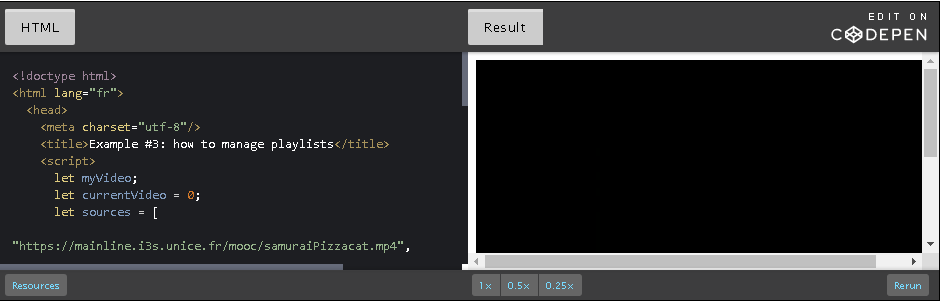

<h3 id="ch1-5-9">1.5.9 Load and play sound samples</h3>

Use an AudioBufferSourceNode as the source of the sound sample in the
Web Audio graph.

There is a special node in Web Audio for handling sound samples, called
an AudioBufferSourceNode.

This node has different properties:

-   buffer: the decoded sound sample.

-   loop: should the sample be played as an infinite loop - when the
    sample has played to its end, it is re-started from the beginning.
    (default is True), it also depends on the two next properties.

-   loopStart: a double value indicating, in seconds, in the buffer
    sample playing must restart. Its default value is 0.

-   loopEnd: a double value indicating, in seconds, at what point in the
    buffer sample playing must stop (and eventually loop again). Its
    default value is 0.

-   playbackRate: the speed factor at which the audio asset will be
    played. Since no pitch correction is applied on the output, this can
    be used to change the pitch of the sample.

-   detune: not relevant for this course.

##### Loading and decoding a sound sample

**Before use, a sound sample must be loaded using Ajax, decoded, and set
to the buffer property of an AudioBufferSourceNode.**

[Try the example at
JSBin](https://jsbin.com/botagas/edit?html,js,console,output):


In this example, as soon as the page is loaded, we send an Ajax request
to a remote server in order to get the file shoot2.mp3. When the file is
loaded, we decode it. Then we enable the button (before the sample was
not available, and thus could not be played). Now you can click on the
button to make the noise.

Notice in the code that each time we click on the button, we rebuild the
audio graph.

> **This is because AudioBufferSourceNodes can be used only once!   
> **  
> But don't worry, Web Audio is optimized for handling thousands of
> nodes...

##### HTML code extract:

```
1.  <button id="playButton" disabled=true>Play sound</button>
```

##### JavaScript source code:

```
1.  var ctx;
2.   
3.  var soundURL =
4.  'https://mainline.i3s.unice.fr/mooc/shoot2.mp3';
5.  var decodedSound;
6.   
7.  window.onload = function init() {
8.     // The page has been loaded
9.  
10.    // To make it work even on browsers like Safari, that still
11.    // do not recognize the non prefixed version of AudioContext
12.  var audioContext = window.AudioContext || window.webkitAudioContext;
13.  
14.    ctx = new audioContext();
15.  
16.    loadSoundUsingAjax(soundURL);
17. 
18.    // By default the button is disabled, it will be
19.    // clickable only when the sound sample will be loaded
20.    playButton.onclick = function(evt) {
21.       playSound(decodedSound);
22.    };
23. };
24.  
25. function loadSoundUsingAjax(url) {
26.    var request = new XMLHttpRequest();
27. 
28.    request.open('GET', url, true);
29.    // Important: we're loading binary data
30.    request.responseType = 'arraybuffer';
31.  
32.    // Decode asynchronously
33.    request.onload = function() {
34.       console.log("Sound loaded");
35. 
36.       // Let's decode it. This is also asynchronous
37.       ctx.decodeAudioData(request.response,
38.           function(buffer) { // success
39.              console.log("Sound decoded");
40.              decodedSound = buffer;    
41.              // we enable the button
42.              playButton.disabled = false;
43.           },
44.           function(e) { // error
45.              console.log("error");
46.           }
47.       ); // end of decodeAudioData callback
48.     };   // end of the onload callback
49. 
50.     // Send the request. When the file will be loaded,
51.     // the request.onload callback will be called (above)
52.     request.send();
53. }
54.  
55. function playSound(buffer){
56.     // builds the audio graph, then start playing the source
57.     var bufferSource = ctx.createBufferSource();
58.     bufferSource.buffer = buffer;
59.     bufferSource.connect(ctx.destination);
60.     bufferSource.start(); // remember, you can start() a source only once!
61. }
```

##### **Explanations:**

-   When the page is loaded, we first call
    the loadSoundUsingAjax function for loading and decoding the sound
    sample (*line 16*), then we define a click listener for the play
    button. Loading and decoding the sound can take some time, so it's
    an asynchronous process. This means that the call
    to loadSoundUsingAjax will return while the downloading and decoding
    is still in progress. We can define a click listener on the button
    anyway, as it is disabled by default (see the HTML code). Once the
    sample has been loaded and decoded, only then will the button be
    enabled (*line 42*).

-   The loadSoundUsingAjax function will first create
    an XmlHttpRequest using the "new version of Ajax called XhR2"
    (described in detail during week 3). First we create the request
    (*lines 26-30*): notice the use of 'arrayBuffer' as
    a responseType for the request. This has been introduced by Xhr2
    and is necessary for binary file transfer. Then the request is sent
    (*line 52*).

-   Ajax is an asynchronous process: once the browser receives the
    requested file, the request. onload callback will be called (it is
    defined at *line 33*), and we can decode the file (an mp3, the
    content of which must be uncompressed in memory). This is done by
    calling ctx.decodeAudioData(file, successCallback, errorCallback).
     When the file is decoded, the success callback is called (*lines
    38-43*). We store the decoded buffer in the variable decodedSound,
    and we enable the button.

-   Now, when someone clicks on the button, the playSound function will
    be called (*lines 55-61*). This function builds a simple audio
    graph: it creates an AudioBufferSourceNode (*line 57*), sets
    its buffer property with the decoded sample, connects this source to
    the speakers (*line 59*) and plays the sound. **Source nodes can
    only be used once (a "fire and forget" philosophy), so to play the
    sound again, we have to rebuild a source node and connect that to
    the destination. This seems strange when you learn Web Audio, but
    don't worry - it's a very fast operation, even with hundreds of
    nodes.**

##### Loading and decoding multiple sounds: the BufferLoader utility

#### The problem: AJax requests are asynchronous

The asynchronous aspect of Ajax has always been problematic for
beginners. For example, if our applications use multiple sound samples
and we need to be sure that all of them are loaded and decoded, using
the code we presented in the earlier example will not work as is. We
cannot call:

1.  loadSoundSample(urlOfSound1);

2.  loadSoundSample(urlOfSound2);

3.  loadSoundSample(urlOfSound3);

4.  etc...

... because we will never know exactly when all the sounds have finished
being loaded and decoded. All these calls will run operations in the
background yet return instantly.

#### The BufferLoader utility object: useful for preloading sound and image assets

There are different approaches for dealing with this problem. During the
HTML5 Coding Essentials and Best Practices course, we presented utility
functions for loading multiple images. Here we use the same approach and
have packaged the code into an object called the BufferedLoader.

[Example at JSBin that uses the BufferLoader
utility](https://jsbin.com/javoger/edit?html,js,console,output):


##### HTML code:

```
1.  <button id="shot1Normal" disabled=true>Shot 1</button>
2.  <button id="shot2Normal" disabled=true>Shot 2</button>
```

##### JavaScript code extract (does not contain the BufferLoader utility code):

```
1.  var listOfSoundSamplesURLs = [
2.  'https://mainline.i3s.unice.fr/mooc/shoot1.mp3',
3.  'https://mainline.i3s.unice.fr/mooc/shoot2.mp3'
4.  ];
5.   
6.  window.onload = function init() {
7.    // To make it work even on browsers like Safari, that still
8.    // do not recognize the non prefixed version of AudioContext
9.   var audioContext = window.AudioContext || window.webkitAudioContext;
10.  
11.   ctx = new audioContext();
12. 
13.   loadAllSoundSamples();
14. };
15.  
16. function playSampleNormal(buffer){
17.   // builds the audio graph and play
18.   var bufferSource = ctx.createBufferSource();
19.   bufferSource.buffer = buffer;
20.   bufferSource.connect(ctx.destination);
21.   bufferSource.start();
22. }
23.  
24.  
25. function onSamplesDecoded(buffers){
26.    console.log("all samples loaded and decoded");
27.    // enables the buttons
28.    shot1Normal.disabled=false;
29.    shot2Normal.disabled=false;
30. 
31.    // creates the click listeners on the buttons
32.    shot1Normal.onclick = function(evt) {
33.       playSampleNormal(buffers[0]);
34.    };
35. 
36.    shot2Normal.onclick = function(evt) {
37.       playSampleNormal(buffers[1]);
38.    };
39. }
40.  
41. function loadAllSoundSamples() {
42.   // onSamplesDecoded will be called when all samples
43.   // have been loaded and decoded, and the decoded sample will
44.   // be its only parameter (see function above)
45.  bufferLoader = new BufferLoader(ctx, listOfSoundSamplesURLs,onSamplesDecoded);
46. 
47.   // starts loading and decoding the files
48.   bufferLoader.load();
49. }
```

After the call to loadAllSoundSamples() (*line 13*), when all the sound
sample files have been loaded and decoded, a callback will be initiated
to onSamplesDecoded(decodedSamples), located at *line 25*. The array of
decoded samples is the  parameter of the onSamplesDecoded function.

The BufferLoader utility object is created at *line 45* and takes as
parameters: 1) the audio context, 2) an array listing the URLs of the
different audio files to be loaded and decoded, and 3) the callback
function which is to be called once all the files have been loaded and
decoded. This callback function should accept an array as its parameter:
the array of decoded sound files.

To study the source of the BufferLoaded object, look at the JavaScript
tab in [the example at
JSBin](https://jsbin.com/gegita/edit?html,js,console,output).

Playing the two sound samples at various playback rates, repeatedly

This is a variant of the previous example (picture taken with the now
discontinued FireFox WebAudio debugger, you should get similar results
with the Chrome WebAudio Inspector extension).

[Example at
JSBin](https://jsbin.com/zebokeg/edit?html,js,console,output):


In this example, we added a function (borrowed and adapted from [this
article on
HTML5Rocks)](https://www.html5rocks.com/en/tutorials/webaudio/games/):

-   makeSource(buffer)

##### Here is the source code of this function:

```
1.  function makeSource(buffer) {
2.     // build graph source -> gain -> compressor -> speakers
3.     // We use a compressor at the end to cut the part of the signal
4.     // that would make peaks
5.     // create the nodes
6.     var source = ctx.createBufferSource();
7.     var compressor = ctx.createDynamicsCompressor();
8.     var gain = ctx.createGain();
9.  
10.    // set their properties
11.    // Not all shots will have the same volume
12.    gain.gain.value = 0.2 + Math.random();
13. 
14.    source.buffer = buffer;
15. 
16.    // Build the graph
17.    source.connect(gain);
18.   gain.connect(compressor);
19.   compressor.connect(ctx.destination);
20. return source;
21. }
```

And this is the function that plays different sounds in a row,
eventually creating random time intervals between them and random pitch
variations:

```
1.  function playSampleRepeated(buffer, rounds, interval, random, random2) {
2.     if (typeof random == 'undefined') {
3.        random = 0;
4.     }
5.     if (typeof random2 == 'undefined') {
6.        random2 = 0;
7.     }
8.  
9.     var time = ctx.currentTime;
10.    // Make multiple sources using the same buffer and play in quick succession.
11.    for (var i = 0; i < rounds; i++) {
12.       var source = makeSource(buffer);
13.       source.playbackRate.value = 1 + Math.random() * random2;
14.       source.start(time + i * interval + Math.random() * random);
15.   } 
16. }
```

<h4>Explanations:</h4>

-   <i>Lines 11-15</i>: we make a loop for building multiple routes in the
    graph. The number of routes corresponds to the number of times that
    we want the same buffer to be played. Note that
    the random2 parameter enables us to randomize the playback rate of
    the source node that corresponds to the pitch of the sound. 

-   <i>Line 14</i>: this is where the sound is being played. Instead of
    calling source.start(), we call source.start(delay), this tells the
    Web Audio scheduler to play the sound after a certain time. 

-   The makeSource function builds a graph from one decoded sample to
    the speakers. A gain is added that is also randomized in order to
    generate shot sounds with different volumes (between 0.2 and 1.2 in
    the example). A compressor node is added in order to limit the max
    intensity of the signal in case the gain makes it peak.

<h3 id="ch1-5-10">1.5.10 Sound samples and effects</h3>

Any of the effects that discussed during these lectures (gain, stereo
panner, reverb, compressor, equalizer, analyser node for visualization,
etc.) may be added to the audio graphs that we have built in our
sound sample examples.

Below, we have mixed the code from two previous examples:

[This one at JSBin](https://jsbin.com/vejocav/edit?html,css,js,output):


[And this one at
JSBin](https://jsbin.com/nazega/edit?html,js,console,output) (picture
taken with the now discontinued FireFox WebAudio debugger, you should
get similar results with the Chrome WebAudio Inspector extension):


And here is the result ([try it at
JSBin](https://jsbin.com/coraso/edit?html,js,console,output)):


Here is the audio graph of this example (picture taken with the now
discontinued FireFox WebAudio debugger, you should get similar results
with the Chrome WebAudio Inspector extension):


Look at the source code on JSBin, it's a quick merge of the two previous
examples.

<h3 id="ch1-5-11">1.5.11 Useful third party libraries</h3>

It's best practice to know the Web Audio API itself. Many of the
examples demonstrated during this course may be hard to write using
high-level libraries. However, if you don't have too many custom needs,
such libraries can make your life simpler! Also, some libraries use
sound synthesis that we did not cover in the course and are fun to use
- for example, adding 8-bit sounds to your HTML5 game!

Many JavaScript libraries have been built on top of WebAudio. We
recommend the following:

-   [HowlerJS](https://goldfirestudios.com/howler-js-modern-web-audio-javascript-library):
    useful for loading and playing sound sample in video games. Can
    handle audio sprites (multiple sounds in a single audio file),
    loops, spatialization. Very simple to use. Try [this very simple
    example we prepared for you at
    JsBin](https://jsbin.com/wuteqo/edit?html,js,output) that uses
    HowlerJS!

-   [Webaudiox, and in particular a helper built with this library,
    jsfx](https://blog.jetienne.com/blog/2014/02/27/webaudiox-jsfx/) for
    adding 8-bit procedural sounds to video games, without the need to
    load audio files. [Try the
    demo](https://jeromeetienne.github.io/webaudiox/examples/jsfx.html)!
    There is also[ a sound
    generator](https://egonelbre.com/project/jsfx/) you can try. When
    you find a sound you like, just copy and paste the parameter values
    into your code.

-   For writing musical applications, take a look at ToneJS !

<h2 id="ch2">Module 2</h2>

Hi! When I was 14, I was fan of the Ramones. I bought an electric guitar
and I played in a rock band in my school. A few years later, I wanted to become a game
creator. This is how I became a scientist in computer engineering. During this week, I
went back in time, because

I'm going to teach you how to write HTML5 games.

During this week, you will greatly improve your knowledge of the HTML5
canvas API by learning the core techniques for writing 2D games that run at 60
frames/s.

We’ll teach you how to create a low level game framework that provides
all the basic blocks you need for writing a video game: game loop with time based
animation - this is an important technique that will enable your game to run at the same
speed on different devices.

We will look at richer interactions with keyboard, mouse, gamepad, and also we will learn how to animate multiple objects
on screen.

Not to forget learning about efficient collision detection, managing
game states (start menu, game itself with different levels, game over at the end).

We will look also at the sprite based animation technique, that consists
in extracting small images of a character posture and by drawing the
different sub-images.

It gives the impression of the character moving. We will provide a
sprite engine that will help you greatly use this technique. And finally we will look at how we
can add music and sound effects with the Web Audio API seen during Week 1.

This is one of the most funny weeks of this course so we hope you will
share your own creations and enjoy this funny part of the course.

<h3 id="ch2-2-1">2.2.1 History of JavaScript games</h3>

There is a widely-held belief that games running in Web browsers and
without the help of plugins are a relatively new phenomenon. This is not
true: back in 1998, Donkey Kong ran in a browser (screenshot below). It
was a game by Scott Porter, written using only standard Web technologies
(HTML, JavaScript, and CSS) .


Just a few years after the Web was born, JavaScript appeared -  a simple
script language with C-like syntax for interacting and changing the
structure of documents - together with HTML, the [HyperText Markup
Language](https://en.wikipedia.org/wiki/Html) used for describing text
documents. For the first time, particular elements could be moved across
a browser's screen. This was noticed by Scott Porter who, in 1998,
created the first JavaScript game library with the very original name,
'Game Lib'. At this time, Porter focused largely on creating ports of
old NES and Atari games using animated gifs, but he also developed
a Video Pool game in which he emulated the angle of a cue with [a sprite
of 150 different
positions](https://web.archive.org/web/20070104175757/http:/www.smashcat.org/arcade/pool/cue.gif)!

During the late 1990s and early 2000s, JavaScript increased in
popularity, and the community coined the term 'DHTML' ([Dynamic
HTML](https://en.wikipedia.org/wiki/Dhtml)), which was to be the first
umbrella term describing a collection of technologies used together to
create interactive and animated Web sites. Developers of the DHTML era
hadn't forgotten about Porter's 'Game Lib', and within a couple of
years, [Brent Silby](https://def-logic.com/) presented 'Game Lib 2'. It
is still possible to play many games created with that library on his
Web site.


The DHTML era was a time when JavaScript games were as good as those
made in Flash. Developers made many DOM libraries that were useful for
game development, such as Peter Nederlof's Beehive with its
outstanding [Rotatrix](https://peterned.home.xs4all.nl/games.html#rotatrix) (which,
personally, I think is one of the best HTML games EVER). The first very
polished browser games were also developed; Jacob Sidelin, creator of
14KB Mario (screenshot on the right), created [the very first page
dedicated to JavaScript
games](https://web.archive.org/web/20090519005306/http:/www.javascriptgaming.com/).


And then came 2005: 'the year
of [AJAX](https://en.wikipedia.org/wiki/Ajax_%28programming%29)'.
Even though 'AJAX' just stands for 'Asynchronous JavaScript and XML', in
practice it was another umbrella term describing methods, trends and
technologies used to create a new kind of Web site -[ Web
2.0](https://en.wikipedia.org/wiki/Web_2.0).

Popularization of new JavaScript patterns introduced the ability to
create multiplayer connections or even true emulators of old computers.
The best examples of this time were 'Freeciv' (screenshot on the left)
by Andreas Rosdal - a port of Sid Meier's Civilization,
and[ Sarien.net](http://sarien.net/) by Martin Kool, an emulator of old
Sierra games. 


And now we are entering a new era in the history of the Web: "HTML5"!

<h3 id="ch2-2-2">2.2.2 Elements and APIs useful for writing games</h3>

In the W3Cx [HTML5 Coding Essentials and Best
Practices](https://www.edx.org/course/html5-coding-essentials-and-best-practices) course,
we study the canvas, drawing, and animation elements. These are going to
be revisited in more details in this section.

Here, we present some elements that are useful in writing games.

##### Drawing: the &lt;canvas&gt; element


The &lt;canvas&gt; is a new HTML element described as "*a
resolution-dependent bitmap canvas which can be used for rendering
graphs, game graphics, or other visual images on the fly*." It's a
rectangle included in your page where you can draw using scripting with
JavaScript. It can, for instance, be used to draw graphs, make photo
compositions or do animations. This element comprises a drawable region
defined in HTML code with height and width attributes.

You can have multiple canvas elements on one page, even stacked one on
top of another, like transparent layers. Each will be visible in the DOM
tree and has it's own state independent of the others. It behaves like a
regular DOM element.

The canvas has [a rich JavaScript
API](https://www.w3.org/TR/2dcontext/) for drawing all kinds of shapes;
we can draw wireframe or filled shapes and set several properties such
as color, line width, patterns, gradients, etc. It also supports
transparency and pixel level manipulations. It is supported by all
browsers, on desktop or mobile phones, and on most devices it will take
advantage of hardware acceleration. 

It is undoubtedly the most important element in the HTML5 specification
from a game developer's point of view, so we will discuss it in greater
detail later in the course.

The W3C [HTML Working
Group](https://www.w3.org/html/wg/) published [HTML Canvas 2D
Context](https://www.w3.org/TR/2dcontext/) as W3C Recommendation (i.e.,
Web standard status).

##### Animating at 60 fps: the requestAnimationFrame API 

The requestAnimationFrame API targets 60 frames per second animation in
canvases. This API is quite simple and also comes with a high resolution
timer. Animation at 60 fps is often easy to obtain with simple 2D games
on major desktop computers. This is the preferred way to perform
animation, as the browser will ensure that animation is not
performed when the canvas is not visible, thus saving CPU resources.

##### Videos and animated textures: the <video> element


The HTML5 <video> element was introduced in the HTML5 specification
for the purpose of playing *streamed* videos or movies, partially
replacing the object element.  The JavaScript API is nearly the same
as the one of the <audio> element and enables full control from
JavaScript.

By combining the capabilities of the <video> and <canvas> elements,
it is possible to manipulate video data to incorporate a variety of
visual effects  in real time, and conversely, to use images from videos
as "animated textures" over graphic objects.

##### Audio (streamed audio and real time sound effects): the <audio> element and the Web Audio API


##### The <audio> element

<audio> is an HTML element that was introduced to give a consistent
API for playing *streamed* sounds in browsers. File format support
varies between browsers, but MP3 works in nearly all browsers today.
Unfortunately, the <audio> element is only for streaming compressed
audio, so it consumes CPU resources, and is not adapted for sound
effects where you would like to change the playing speed or add real
time effects such as reverberation or doppler. For this,  [the Web Audio
API](https://www.w3.org/TR/webaudio/) is preferable.

##### The Web Audio API

This is a 100% JavaScript API designed for working in real time with
uncompressed sound samples or for generating procedural music. Sound
samples will need to be loaded into memory and decompressed prior to
being used. Up to 12 sound effects are provided natively by browsers
that support the API (all major browsers except IE, although Microsoft
Edge supports it).

### **Interacting**: dealing with keyboard and mouse events, the GamePad API


User inputs will rely on several APIs, some of which are well
established, such as the DOM API that is used for keyboard, touch or
mouse inputs. There is also a [Gamepad
API](https://www.w3.org/TR/gamepad/)  (in W3C Working Draft status) that
is already implemented by some browsers, which we will also cover in
this course. The Gamepad specification defines a low-level interface
that represents gamepad devices.

##### Multi-participants feature: WebSockets

IMPORTANT INFORMATION: NOT COVERED IN THIS COURSE

Using [the WebSockets
technology](https://fr.wikipedia.org/wiki/WebSocket) (which is not part
of HTML5 but comes from the
W3C [WebRTC](https://www.w3.org/TR/webrtc/) specification - "Real-time
Communication Between Browsers"), you can create two-way communication
sessions between multiple browsers and a server. The WebSocket API, and
useful libraries built on top of it such
as [socket.io](https://socket.io/), provide the means for sending
messages to a server and receiving event-driven responses without having
to poll the server for a reply. 


<h3 id="ch2-2-3">2.2.3 The "game loop"</h3>


The "game loop" is the main component of any game. It separates the game
logic and the visual layer from a user's input and actions.

Traditional applications respond to user input and do nothing without
it - word processors format text as a user types. If the user doesn't
type anything, the word processor is waiting for an action.

Games operate differently: a game must continue to operate regardless of
a user's input!

The game loop allows this. The game loop is computing events in our game
all the time. Even if the user doesn’t make any action, the game will
move the enemies, resolve collisions, play sounds and draw graphics as
fast as possible. 

Different implementations of the 'Main Game Loop'

There are different ways to perform animation with JavaScript. A very
detailed comparison of three different methods has already been
presented in the W3Cx HTML5 Coding Essentials course. Below is a quick
reminder of the methods, illustrated with new, short, online examples.

Performing animation using the JavaScript setInterval(...) function

Syntax: setInterval(function, ms);

The setInterval function calls a function or evaluates an expression at
specified intervals of time (in milliseconds), and returns a unique id
of the action. You can always stop this by calling
the clearInterval(id) function with the interval identifier as an
argument.

[Try an example at JSBin](https://jsbin.com/qopefu/edit) : open the
HTML, JavaScript and output tabs to see the code.


Source code extract:

```
1.  var addStarToTheBody = function(){
2.     document.body.innerHTML += "*";
3.  };
4.  
5.  **//this will add one star to the document each 200ms (1/5s)**
6.  **setInterval(addStarToTheBody, 200);**
```

WRONG:

```
1.  setInterval(‘addStarToTheBody()’, 200);
2.  setInterval(‘document.body.innerHTML += “*”;’, 200);
```

GOOD:

```
1.  setInterval(function(){
2.     document.body.innerHTML += “*”;
3.  }, 200);
```

or like we did in the example, with an external function.

Reminder from the HTML5 Coding Essentials course: with setInterval - if
we set the number of milliseconds at, say, 200, it will call our game
loop function EACH 200ms, <u>even if the previous one is not yet
finished</u>.  Because of this disadvantage, we might prefer to use
another function, better suited to our goals.

##### Using setTimeout() instead of setInterval()

-   Syntax: setTimeout(function, ms);

The setTimeout function works like setInterval but with one little
difference: it calls your function AFTER a given amount of time.

[Try an example at JSBin](https://jsbin.com/vuvitu/edit): open the HTML,
JavaScript and output tabs to see the code. This example does the same
thing as the previous example by adding a "*" to the document every
200ms.

Source code extract:

```
1.  var addStarToTheBody = function(){
2.      document.body.innerHTML += "*";
3.      // calls again itself AFTER 200ms
4.      setTimeout(addStarToTheBody, 200);
5.  };
6.  
7.  // calls the function AFTER 200ms
8.  setTimeout(addStarToTheBody, 200);
```

This example will work like the previous example. However, it is a
definite improvement, because the timer waits for the function to finish
everything inside before calling it again. 

For several years, setTimeout was the best and most popular JavaScript
implementation of game loops. This changed when Mozilla presented the
requestAnimationFrame API, which became the reference W3C standard API
for game animation.

Using the requestAnimationFrame API

Note: using requestAnimationFrame was covered in detail in the W3Cx
HTML5 Coding Essentials course.

When we use timeouts or intervals in our animations, the browser doesn’t
have any information about our intentions -- do we want to repaint the
DOM structure or a  canvas during every loop? Or maybe we just want to
make some calculations or send requests a couple of times per second?
For this reason, it is really hard for the browser’s engine to optimize
the loop.

And since we want to repaint the game (move the characters, animate
sprites, etc.) every frame, Mozilla and other contributors/developers
introduced a new approach which they called requestAnimationFrame.

This approach helps the browser to optimize all the animations on the
screen, no matter whether  Canvas, DOM or WebGL. Also, if the animation
loop is running in a browser tab that is not currently visible, the
browser won't keep it running.

Basic usage, [online example at
JSBin](https://jsbin.com/geqija/1/edit?html,js,output).

Source code extract:

```
1.  window.onload = function init() {
2.     // called after the page is entirely loaded
3.     requestAnimationFrame(mainloop);
4.  };
5.  
6.  function mainloop(timestamp) {
7.     document.body.innerHTML += "*";
8.  
9.     // call back itself every 60th of second
10.    requestAnimationFrame(mainloop);
11. }
```

Notice that calling requestAnimationFrame(mainloop) at *line 10*, asks
the browser to call the mainloop function every 16.6 ms: this
corresponds to 60 times per second (16.6 ms = 1/60 s).

**This target may be hard to reach; the animation loop content may take
longer than this, or the scheduler may be a bit early or late.**

**Many "real action games" perform what we call *time-based
animation***. For this, we need an accurate timer that will tell us the
elapsed time between each animation frame. Depending on this time, we
can compute the distances each object on the screen must achieve in
order to move at a given speed, independently of the CPU or GPU of the
computer or mobile device that is running the game. 

The timestamp parameter of the mainloop function is useful for
exactly that: it gives a high resolution time.

We will cover this in more detail, later in the course.

<h3 id="ch2-3-1">2.3.1 A game framework skeleton</h3>

We are going to develop a game - not all at once, let's divide the whole
job into a series of smaller tasks. The first step is to create
a foundation or basic structure.

Let's start by building the skeleton of a small game framework, based
on [the Black Box Driven Development in
JavaScript](https://hacks.mozilla.org/2014/08/black-box-driven-development-in-javascript/) methodology.
In other words: a game framework skeleton is a simple object-based model
that uses encapsulation to expose only useful methods and properties.

We will evolve this framework throughout the lessons in this course, and
cut it in different files once it becomes too large to fit within one
single file.

##### Here is the starting point:

```
1.  var GF = function(){
2.  
3.    var mainLoop = function(time){
4.      //Main function, called each frame
5.      requestAnimationFrame(mainLoop);
6.    };
7.  
8.    var start = function(){
9.      requestAnimationFrame(mainLoop);
10.   };
11. 
12.   // Our GameFramework returns a public API visible from outside its scope
13.   // Here we only expose the start method, under the "start" property name.
14.   return {
15.     start: start
16.   };
17. };
```

##### With this skeleton, it's very easy to create a new game instance:

```
1.  var game = new GF();
2.  
3.  // Launch the game, start the animation loop, etc.
4.  game.start();
```

##### Examples

Let's put something into the mainLoop function, and check if it works

[Try this online example at JSBin](https://jsbin.com/tatowa/edit), with
a new mainloop:  (check the JavaScript and output tabs). This page
should display a different random number every 1/60 second. We don't
have a real game yet, but we're improving our game engine :-)

##### Source code extract:

```
1.  var mainLoop = function(time){
2.    // main function, called each frame
3.    document.body.innerHTML = Math.random();
4.  
5.    // call the animation loop every 1/60th of second
6.    requestAnimationFrame(mainLoop);
7.  };
```

##### Let's measure that animation's frame rate

Every game needs to have a function which measures the actual frame rate
achieved by the code.

The principle is simple:

1.  Count the time elapsed by adding *deltas* in the mainloop.

2.  If the sum of the *deltas* is greater or equal to 1000, then 1s has
    elapsed since we started counting.

3.  If at the same time, we count the number of *frames* that have been
    drawn, then we have the *frame rate* - measured in number of frames
    per second. Remember, it should be around 60 fps!

**Quick glossary:** the word *delta* is the name of a Greek
letter (uppercase **Δ**, lowercase **δ** or **𝛿).** The upper-case
version is used in mathematics as an abbreviation for measuring
the *change* in some object, over time - in our case, how quickly the
mainloopis running. This dictates the maximum speed at which the game
display will be updated. This maximum speed could be referred to as
the *rate of change*. We call what is displayed at a single
point-in-time, a *frame*. Thus the *rate of change*  can be measured in
frames per second (*fps*). Accordingly, our game's *delta,* determines
the achievable frame rate - the **shorter** the *delta* (measured in
mS), the **faster** the possible *rate of change* (in *fps*).

Here is a screenshot of an example and the code we added to our game
engine, for measuring FPS ([try it online at
JSBin](https://jsbin.com/noqibu/edit)):


<h4>Source code extract:</h4>

```
1.     // vars for counting frames/s, used by the measureFPS function
2.  var frameCount = 0;
3.  var lastTime;
4.  var fpsContainer;
5.  var fps;
6.  
7.  var measureFPS = function(newTime){
8.  
9.     // test for the very first invocation
10.    if(lastTime === undefined) {
11.      lastTime = newTime;
12.      return;
13.    }
14. 
15.    // calculate the delta between last & current frame
16.    var diffTime = newTime - lastTime;
17. 
18.    if (diffTime >= 1000) {
19.      fps = frameCount;
20.      frameCount = 0;
21.      lastTime = newTime;
22.    }
23. 
24.    // and display it in an element we appended to the
25.    // document in the start() function
26.    fpsContainer.innerHTML = 'FPS: ' + fps;
27.    frameCount++;
28. };
```

Now we can call the measureFPS function from inside the animation loop,
passing it the current time, given by the high resolution timer that
comes with the requestAnimationFrame API:

```
1.  var mainLoop = function(time){
2.    // compute FPS, called each frame, uses the high resolution time parameter 
3.    // given by the browser that implements the requestAnimationFrame API
4.    measureFPS(time);
5.  
6.    // call the animation loop every 1/60th of second
7.    requestAnimationFrame(mainLoop);
8.  };
```

And the &lt;div&gt; element used to display FPS on the screen is created in
this example by the start() function:

```
1.  var start = function(){
2.    // adds a div for displaying the fps value
3.    fpsContainer = document.createElement(div);
4.    document.body.appendChild(fpsContainer);
5.  
6.    requestAnimationFrame(mainLoop);
7.  };
```

Hack:  achieving more than 60 fPS? It's possible but to be avoided
except in hackers' circles!

We also know methods of implementing loops in JavaScript which achieve
even more than 60fps (this is the limit using requestAnimationFrame).

My favorite hack uses the onerror callback on an &lt;img&gt; element like
this:

```
1.  function mainloop(){
2.    var img = new Image;
3.  
4.    img.onerror = mainloop;
5.    img.src = 'data:image/png,' + Math.random();
6.  }
```

What we are doing here, is creating a new image on each frame and
providing invalid data as a source of the image. The image cannot be
displayed properly, so the browser calls the onerror event handler that
is the mainloop function itself, and so on.

Funny right? Please [try this and check the number of FPS displayed with
this JSBin example](https://jsbin.com/notupe/edit).


<h4>Source code extract of this example:</h4>

```
1.  var mainLoop = function(){
2.    // main function, called each frame
3.  
4.    measureFPS(+(new Date()));
5.  
6.    // call the animation loop every LOTS of seconds using previous hack method
7.    var img = new Image();
8.    img.onerror = mainLoop;
9.    img.src = 'data:image/png,' + Math.random();
10. };
```

<h3 id="ch2-3-2">2.3.2 Introducing graphics</h3>

[*Note*: drawing within a canvas is studied in detail during the [W3C
HTML5 Coding Essentials and Best Practices
course](https://www.edx.org/course/html5-coding-essentials-and-best-practices),
in module 3.]

Is this really a course about games? Where are the graphics?  
Good news! We will add graphics to our game engine in this lesson!
 To-date we have talked of "basic concepts"; so without further ado,
let's draw something, animate it, and move shapes around the screen :-)

Let's do this by including into our framework the same "monster" we used
during the [W3C HTML5 Coding Essentials and Best Practices
course](https://www.edx.org/course/html5-coding-essentials-and-best-practices).

### HTML5 canvas basic usage: drawing a monster

How to draw a monster in a canvas: [you can try it online at
JSBin](https://jsbin.com/ponaki/edit).


##### HTML code (declaration of the canvas):

```
1.  <!DOCTYPE html>
2.  <html lang="en">
3.  <head>
4.     <meta charset="utf-8">
5.     <title>Draw a monster in a canvas</title>
6.  </head>
7.  <body>
8.     **<canvas id="myCanvas" width="200" height="200"></canvas>**
9.  </body>
10. </html>
```

The canvas declaration is at* line 8*. Use attributes to give
it a width and a height, but unless you add some CSS properties, you
will not see it on the screen because it's transparent!

Let's use CSS to reveal the canvas, for example, add a 1px black border
around it:

```
1.  canvas {
2.     border: 1px solid black;
3.  }
```

And here is a reminder of best practices when using the canvas, as
described in the HTML5 Part 1 course:

1.  Use a function that is called AFTER the page is fully loaded (and
    the DOM is ready), set a pointer to the canvas node in the DOM.

2.  Then, get a 2D graphic context for this canvas (the context is an
    object we will use to draw on the canvas, to set global properties
    such as color, gradients, patterns and line width).

3.  Only then can you can draw something,

4.  Do not forget to use global variables for the canvas and context
    objects. I also recommend keeping the width and height of the canvas
    somewhere. These might be useful later.

5.  For each function that will change the context (color, line width,
    coordinate system, etc.), start by saving the context, and end by
    restoring it.

Here is JavaScript code which implements those best practices:

```
1.  // useful to have them as global variables
2.  var canvas, ctx, w, h;
3.   
4.   
5.  window.onload = function init() {
6.    // Called AFTER the page has been loaded
7.    canvas = document.querySelector("#myCanvas");
8.  
9.    // Often useful
10.   w = canvas.width;
11.   h = canvas.height;
12. 
13.   // Important, we will draw with this object
14.   ctx = canvas.getContext('2d');
15. 
16.   // Ready to go!
17.   // Try to change the parameter values to move
18.   // the monster
19.   drawMyMonster(10, 10);
20. };
21.  
22. function drawMyMonster(x, y) {
23.   // Draw a big monster!
24.   // Head
25. 
26.   // BEST practice: save the context, use 2D transformations
27.   ctx.save();
28. 
29.   // Translate the coordinate system, draw relative to it
30.   ctx.translate(x, y);
31. 
32.   // (0, 0) is the top left corner of the monster.
33.   ctx.strokeRect(0, 0, 100, 100);
34. 
35.   // Eyes
36.   ctx.fillRect(20, 20, 10, 10);
37.   ctx.fillRect(65, 20, 10, 10);
38. 
39.   // Nose
40.   ctx.strokeRect(45, 40, 10, 40);
41. 
42.   // Mouth
43.   ctx.strokeRect(35, 84, 30, 10);
44. 
45.   // Teeth
46.   ctx.fillRect(38, 84, 10, 10);
47.   ctx.fillRect(52, 84, 10, 10);
48. 
49.   // BEST practice: restore the context
50.   ctx.restore();
51. }
```

In this small example, we used the context object to draw a monster
using the default color (black) and wireframe and filled modes:

-   ctx.fillRect(x, y, width, height): draws a rectangle whose top left
    corner is at (x, y) and whose size is specified by
    the width and height parameters; and both outlined by, and filled
    with, the default color.

-   ctx.strokeRect(x, y, width, height): same but in wireframe mode.

-   Note that we use (*line 30*) ctx.translate(x, y) to make it easier
    to move the monster around. So, all the drawing instructions are
    coded as if the monster was in (0, 0), at the top left corner of the
    canvas (look at *line 33*). We draw the body outline with a
    rectangle starting from (0, 0). Calling context.translate "changes
    the coordinate system" by moving the "old (0, 0)" to (x, y) and
    keeping other coordinates in the same position relative to the
    origin.

-   *Line 19*: we call the drawMonster function with (10, 10) as
    parameters, which will cause the original coordinate system to be
    translated by (10, 10).

-   And if we change the coordinate system (this is what the call
    to ctx.translate(...) does) in a function, it is a best practice to
    always save the previous context  at the beginning of the function
    and restore it at the end of the function (*lines 27 and 50*).

##### Animating the monster and including it in our game engine

Ok, now that we know how to move the monster, let's integrate it into
our game engine:

1.  add the canvas to the HTML page,

2.  add the content of the init() function to the start() function of
    the game engine,

3.  add a few global variables (canvas, ctx, etc.),

4.  call the drawMonster(...) function from the mainLoop,

5.  add a random displacement to the x, y position of the monster to see
    it moving,

6.  in the main loop, do not forget to clear the canvas before drawing
    again; this is done using the ctx.clearRect(x, y, width,
    height) function.

[You can try this version online at
JSBin](https://jsbin.com/xuruja/edit). 


<h4>HTML code:</h4>

```
1.  <!DOCTYPE html>
2.  <html lang="en">
3.  <head>
4.  <meta charset="utf-8">
5.  <title>Trembling monster in the Game Framework</title>
6.  </head>
7.  <body>
8.  **<canvas id="myCanvas" width="200" height="200"></canvas>**
9.  </body>
10. </html>
```

<h4>JavaScript complete code:</h4>

```
1.  // Inits
2.  window.onload = function init() {
3.    var game = new GF();
4.    game.start();
5.  };
6.   
7.   
8.  // GAME FRAMEWORK STARTS HERE
9.  var GF = function(){
10.   **// Vars relative to the canvas**
11.   **var canvas, ctx, w, h;**
12.  
13.   ...
14. 
15.   var measureFPS = function(newTime){
16. 
17.     ...
18. };
19. 
20. // Clears the canvas content
21. function clearCanvas() {
22.    ctx.clearRect(0, 0, w, h);
23. }
24. 
25. // Functions for drawing the monster and perhaps other objects
26. function drawMyMonster(x, y) {
27.    ...
28. }
29. 
30. var mainLoop = function(time){
31.     // Main function, called each frame
32.     measureFPS(time);
33. 
34.    ** // Clear the canvas**
35.     **clearCanvas();**
36. 
37.     **// Draw the monster**
38.     **drawMyMonster(10+Math.random()*10, 10+Math.random()*10);**
39. 
40.     // Call the animation loop every 1/60th of second
41.     requestAnimationFrame(mainLoop);
42. };
43.  
44. var start = function(){
45.     ...
46. 
47.     **// Canvas, context etc.**
48.     **canvas = document.querySelector("#myCanvas");**
49. 
50.     **// often useful**
51. **    w = canvas.width;**
52. **    h = canvas.height;**
53. 
54. **    // important, we will draw with this object**
55. **    ctx = canvas.getContext('2d');**
56.  
57.     // Start the animation
58.     requestAnimationFrame(mainLoop);
59. };
60.  
61. //our GameFramework returns a public API visible from outside its scope
62. return {
63.    start: start
64. };
65. };
```

<h4>Explanations:</h4>

-   Note that we now start the game engine in a window.onload callback
    (*line 2*), so only after the page has been loaded.

-   We also moved 99% of the init() method from the previous example
    into the start() method of the game engine, and added the canvas,
    ctx, w, h variables as global variables to the game framework
    object.

-   Finally, in the main loop we added a call to
    the drawMonster() function, injecting randomicity through the
    parameters:  the monster is drawn with an x,y offset of between 0
    and 10, in successive frames of the animation.

-   And we clear the previous canvas content before drawing the current
    frame (*line 35*).

If you try the example, you will see a trembling monster. The canvas is
cleared and the monster drawn in random positions, at around 60 times
per second!

Next, let's see how to interact with it using the mouse or the keyboard.

<h3 id="ch2-3-3">2.3.3 User interaction and event handling</h3>

##### Input & output: how do events work in Web apps & games?

##### HTML5 events

There is no input or output in JavaScript. We treat *events* caused by
user actions as inputs, and we manipulate the DOM structure as
output. Usually in games, we will maintain state variables representing
moving objects like the position and speed of an alien ship, and the
animation loop will refer to these variables in determining the movement
of such objects.

In any case, the events are called DOM events, and we use the DOM APIs
to create *event handlers*.

#### How to listen to events

There are three ways to manage events in the DOM structure. You could
attach an event inline in your HTML code like this:

##### Method #1: declare an event handler in the HTML code

```
1.  <div id="someDiv" **onclick**="alert('clicked!')"> content of the
    div </div>
```

This method is very easy to use, but it is not the recommended way to
handle events. Indeed, It works today but is *deprecated* (will probably
be abandoned in the future). Mixing 'visual layer' (HTML) and 'logic
layer' (JavaScript) in one place is really bad practice and causes a
host of problems during development.

##### Method #2: attach an event handler to an HTML element in JavaScript

```
1.  document.getElementById('someDiv').**onclick **= function() {
2.     alert('clicked!');
3.  }
```

This method is fine, but  you will not be able to attach
multiple *listener* functions. If you need to do this, use the version
shown below.

##### Method #3: register a callback to the event listener with the addEventListener method (preferred  method)

```
1.  document.getElementById('someDiv').**addEventListener**('click', function() {
2.     alert('clicked!');
3.  }, false);
```

Note that the third parameter describes whether the *callback* has to be
called during the captured phase. This is not important for now, just
set it to false.

##### Details of the DOM event are passed to the event listener function

When you create an *event listener* and attach it to an element, the
listener will create an *event object* to describe what happened. This
object is provided as a parameter of the callback function:

```
1.  element.addEventListener('click', function(**event**) {
2.     **// now you can use event object inside the callback**
3.  }, false);
```

Depending on the type of event you are listening to, you will consult
different properties from the event object in order to obtain useful
information such as: "which keys are pressed down?", "what is the
location of the mouse cursor?", "which mouse button has been clicked?",
etc.

In the following lessons, we will remind you now how to deal with the
keyboard and the mouse (previously covered during the HTML5 Part 1
course) in the context of a game engine (in particular, how to manage
multiple events at the same time), and also demonstrate how you can
accept input from a game pad using the new Gamepad API.

##### Further reading

In the method #1 above, we mentioned that "Mixing 'visual layer' (HTML)
and 'logic layer' (JavaScript) ... bad practice", and this is similarly
reflected in many style features being deprecated in HTML5 and moved
into CSS3. The management philosophy at play here is called "the
separation of concerns" and applies in several ways to software
development - at the code level, through to the management of staff.
It's not part of the course, but professionals may find the following
references useful:

-   [Separation of concerns - Wikipedia, the free
    encyclopedia](https://en.wikipedia.org/wiki/Separation_of_concerns)

<h3 id="ch2-3-4">2.3.4 Addi key listeners</h3>

##### A few reminders

This has been something of a nightmare for years, as different browsers
had different ways of handling key events and key codes ([read this if
you are fond of JavaScript
archaeology](https://unixpapa.com/js/key.html)). Fortunately, it's much
improved today and we can rely on methods that should work in any
browser less than four years old.

After a keyboard-related event (eg keydown or keyup), the code of the
key that fired the event will be passed to the listener function. It is
possible to test which key has been pressed or released, like this:

```
1.  window.addEventListener('keydown', function(event) {
2.     if (event.keyCode === 37) {
3.       // Left arrow was pressed
4.     }
5.  }, false);
```

At *line 2, *the key code of *37* corresponds to the left arrow key.

You can try key codes [with this interactive
example](http://www.asquare.net/javascript/tests/KeyCode.html), and here
is a list of keyCodes (from [CSS
Tricks](https://css-tricks.com/snippets/javascript/javascript-keycodes/)


##### Game requirements: managing multiple keypress / keyrelease events

In a game, we often need to check which keys are being used, at a very
high frequency - typically from inside the game loop that is looping at
up to 60 times per second.

If a spaceship is moving left, chances are you are keeping the left
arrow down, and if it's firing missiles at the same time you must also
be pressing the space bar like a maniac, and maybe pressing the shift
key to release smart bombs.

Sometimes these three keys might be down at the same time, and the game
loop will have to take these three keys into account: move the ship
left, release a new missile if the previous one is out of the screen or
if it reached a target, launch a smart bomb if conditions are met, etc.

##### Keep the list of pertinent keys in a JavaScript object

The typical method used is: store the list of the keys (or mouse button
or whatever game pad button...) that are up or down at a given time in a
JavaScript object. For our small game engine we will call this object
"inputStates".

We will update its content inside the different input event listeners,
and later check its values inside the game loop to make the game react
accordingly.

##### Add this to our game framework:

So, these are the changes to our small game engine prototype (which is
far from finished yet):

1.  We add an empty inputStates object as a global property of the game
    engine,

2.  In the start() method, we add event listeners for
    each keydown and keyup event which controls the game.

3.  In each listener, we test if an arrow key or the space bar has been
    pressed or released, and we set the properties of the inputStates
    object accordingly. For example, if the space bar is pressed, we
    set inputStates.space=true; but if it's released, we reset
    to inputStates.space=false.

4.  In the main loop (to prove everything is working), we add tests to
    check which keys are down; and if a key is down, we print its name
    on the canvas.

[Here is the online example you can try at
JSBin](https://jsbin.com/razeya/edit)


##### And here is the complete source code:

```
1.  // Inits
2.  window.onload = function init() {
3.    var game = new GF();
4.    game.start();
5.  };
6.  
7.  
8.  // GAME FRAMEWORK STARTS HERE
9.  var GF = function(){
10.    ... 
11. 
12.    **// vars for handling inputs**
13. **   var inputStates = {};**
14. 
15.    var measureFPS = function(newTime){
16.       ...
17.    };
18. 
19.    // Clears the canvas content
20.    function clearCanvas() {
21.      ctx.clearRect(0, 0, w, h);
22.    }
23. 
24.    // Functions for drawing the monster and perhaps other objects
25.    function drawMyMonster(x, y) {
26.       ...
27.    }
28. 
29.    var mainLoop = function(time){
30.      // Main function, called each frame
31.      measureFPS(time);
32. 
33.      // Clears the canvas
34.      clearCanvas();
35. 
36.      // Draws the monster
37.      drawMyMonster(10+Math.random()*10, 10+Math.random()*10);
38.  
39.  **   // check inputStates**
40. **    if (inputStates.left) {**
41. **      ctx.fillText("left", 150, 20);**
42. **    }**
43. **    if (inputStates.up) {**
44. **      ctx.fillText("up", 150, 50);**
45. **    }**
46. **   if (inputStates.right) {**
47. **      ctx.fillText("right", 150, 80);**
48. **   }**
49. **   if (inputStates.down) {**
50. **     ctx.fillText("down", 150, 120);**
51. **   }**
52. **   if (inputStates.space) {**
53. **     ctx.fillText("space bar", 140, 150);**
54. **   }**
55. 
56.    // Calls the animation loop every 1/60th of second
57.    requestAnimationFrame(mainLoop);
58. };
59. 
60. var start = function(){
61.     ...
62.     // Important, we will draw with this object
63.     ctx = canvas.getContext('2d');
64.     // Default police for text
65.     ctx.font="20px Arial";
66. 
67. **    // Add the listener to the main, window object, and update the states**
68. **    window.addEventListener('keydown', function(event){**
69. **      if (event.keyCode === 37) {**
70. **        inputStates.left = true;**
71. **      } else if (event.keyCode === 38) {**
72. **        inputStates.up = true;**
73. **      } else if (event.keyCode === 39) {**
74. **        inputStates.right = true;**
75. **      } else if (event.keyCode === 40) {**
76. **        inputStates.down = true;**
77. **      } else if (event.keyCode === 32) {**
78. **        inputStates.space = true;**
79. **      }**
80. **    }, false);**
81. 
82. **    // If the key is released, change the states object**
83. **    window.addEventListener('keyup', function(event){**
84. **      if (event.keyCode === 37) {**
85. **        inputStates.left = false;**
86. **      } else if (event.keyCode === 38) {**
87. **        inputStates.up = false;**
88. **      } else if (event.keyCode === 39) {**
89. **        inputStates.right = false;**
90. **      } else if (event.keyCode === 40) {**
91. **        inputStates.down = false;**
92. **      } else if (event.keyCode === 32) {**
93. **        inputStates.space = false;**
94. **      }**
95.     }, false);
96. 
97. 
98.    // Starts the animation
99.    requestAnimationFrame(mainLoop);
100.  };
101. 
102. // our GameFramework returns a public API visible from outside its scope
103. return {
104.    start: start
105. };
106. };
```

You may notice that on some computers / operating systems, it is not
possible to simultaneously press the up and down arrow keys, or left and
right arrow keys, because they are mutually exclusive. However space +
up + right should work in combination.

<h3 id="ch2-3-5">2.3.5 Adding mouse listeners</h3>

##### A few reminders


Working with mouse events requires detecting whether a mouse button is
up or down, identifying that button, keeping track of mouse movement,
getting the x and y coordinates of the cursor, etc.

Special care must be taken when acquiring mouse coordinates because the
HTML5 canvas has default (or directed) CSS properties which could
produce false coordinates. The trick to get the right x and y mouse
cursor coordinates is to use this method from the canvas API:

// necessary to take into account CSS boundaries

var rect = canvas.getBoundingClientRect();

The width and height of the rect object must be taken into account.
These dimensions correspond to the padding / margins / borders of the
canvas. See how we deal with them in the getMousePos() function in the
next example.

Here is [an online example at JSBin](https://jsbin.com/metavu/edit) that
covers all cases correctly.


Move the mouse over the canvas and press or release mouse buttons.
Notice that we keep the state of the mouse (position, buttons up or
down) as part of the inputStates object, just as we do with the keyboard
(per previous lesson).

<h4>Below is the JavaScript source code for this small example:</h4>

```
1.  var canvas, ctx;
2.  **var inputStates = {};**
3.  
4.  window.onload = function init() {
5.     canvas = document.getElementById('myCanvas');
6.     ctx = canvas.getContext('2d');
7.  
8.     **canvas.addEventListener('mousemove', function (evt) {**
9.        **inputStates.mousePos = getMousePos(canvas, evt);**
10.       var message = 'Mouse position:
    ' + inputStates.mousePos.x + ',' +                                 
      inputStates.mousePos.y;
11.       writeMessage(canvas, message);
12.    }, false);
13. 
14.    **canvas.addEventListener('mousedown', function (evt) {**
15.       **inputStates.mousedown = true;**
16.       **inputStates.mouseButton = evt.button;**
17.       var message = "Mouse button " + evt.button + " down at position: " + 
18.                    
    inputStates.mousePos.x + ',' + inputStates.mousePos.y;
19.       writeMessage(canvas, message);
20.    }, false);
21. 
22.    **canvas.addEventListener('mouseup', function (evt) {**
23.       **inputStates.mousedown = false;**
24.       var message = "Mouse up at position: " + inputStates.mousePos.x + ',' +     
25.                     inputStates.mousePos.y;
26.       writeMessage(canvas, message);
27.    }, false);
28. };
29. 
30. function writeMessage(canvas, message) {
31.   var ctx = canvas.getContext('2d');
32.   ctx.save();
33.   ctx.clearRect(0, 0, canvas.width, canvas.height);
34.   ctx.font = '18pt Calibri';
35.   ctx.fillStyle = 'black';
36.   ctx.fillText(message, 10, 25);
37.   ctx.restore();
38. }
39. 
40. **function getMousePos(canvas, evt) {**
41. **  // necessary to take into account CSS boudaries**
42. **  var rect = canvas.getBoundingClientRect();**
43. **  return {**
44. **     x: evt.clientX - rect.left,**
45. **     y: evt.clientY - rect.top**
46. **  };**
47. **}**
```

##### Making an object follow the mouse cursor

<a href="https://jsbin.com/soduko/edit?js,output">Try this example at JsBin</a>

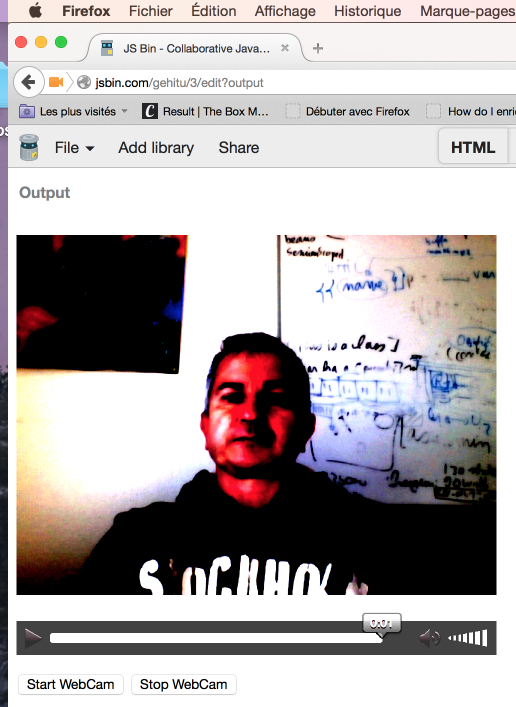

<h4>Source code:</h4>

```
1.  var canvas, ctx, width, height;
2.  var rect = {x:40, y:40, rayon: 30, width:80, height:80, v:1};
3.  var mousepos = {x:0, y:0};
4.   
5.  function init() {
6.      canvas = document.querySelector("#myCanvas");
7.      ctx = canvas.getContext('2d');
8.      width = canvas.width;
9.      height = canvas.height;
10. 
11.     canvas.addEventListener('mousemove', function (evt) {
12.        mousepos = getMousePos(canvas, evt);
13.     }, false);
14. 
15.     mainloop();
16. }
17.  
18. function mainloop() {
19.    // 1) clear screen
20.    ctx.clearRect(0, 0, canvas.width, canvas.height);
21. 
22.    // 2) move object
23.     var dx = rect.x - mousepos.x;
24.     var dy = rect.y - mousepos.y;
25.     **var angle = Math.atan2(dy, dx);**
26. 
27.     **rect.x -= rect.v*Math.cos(angle);**
28. **    rect.y -= rect.v*Math.sin(angle);**
29. 
30.     // 3) draw object
31.     drawRectangle(angle);
32. 
33.     // request new frame
34.     window.requestAnimationFrame(mainloop);
35. }
36. 
37. function drawRectangle(angle) {
38.    ctx.save();
39. 
40.    **// These two lines move the coordinate system**
41. **   ctx.translate(rect.x, rect.y);**
42. **   ctx.rotate(angle);**
43. **   // recenter the coordinate system in the middle**
44. **   // the rectangle. Like that it will rotate around**
45. **   // this point instead of top left corner**
46. **   ctx.translate(-rect.width/2, -rect.height/2);**
47. 
48.    ctx.fillRect(0, 0, rect.width, rect.height);
49.    ctx.restore();
50. }
51.  
52. function getMousePos(canvas, evt) {
53.    // necessary to take into account CSS boudaries
54.    var rect = canvas.getBoundingClientRect();
55.    return {
56.       x: evt.clientX - rect.left,
57.       y: evt.clientY - rect.top
58.    };
59. }
```

<h4>Explanations:</h4>

-   <i>Line 25</i> calculates the <i>angle</i> between mouse cursor and the
    rectangle,

-   <i>Lines 27-28</i> <i>move</i> the rectangle v pixels along a line between the
    rectangle's current position and the mouse cursor,

-   <i>Lines 41-46</i> <i>translate</i> the rectangle, <i>rotate</i> it, and recenter
    the <i>rotational point</i> to the center of the rectangle (in its new
    position).

<h4>Adding mouse listeners to the game framework</h4>

Now we will include these listeners into our game framework. Notice that
we changed some parameters (no need to pass the canvas as a parameter of
the getMousePos() function, for example).

[The new online version of the game engine can be tried at
JSBin](https://jsbin.com/rizuyah/edit):


Try pressing arrows and space keys, moving the mouse, and pressing the
buttons, all at the same time. You'll see that the game framework
handles all these events simultaneously because the global variable
named inputStates is updated by keyboard and mouse events, and consulted
to direct movements every 1/60th second.

<h4>JavaScript source code:</h4>

```
1.  // Inits
2.  window.onload = function init() {
3.    var game = new GF();
4.    game.start();
5.  };
6.  
7.  
8.  // GAME FRAMEWORK STARTS HERE
9.  var GF = function(){
10.   ...
11. 
12.   // Vars for handling inputs
13.   var inputStates = {};
14. 
15.   var measureFPS = function(newTime){
16.      ...
17.   };
18. 
19.   // Clears the canvas content
20.   function clearCanvas() {
21.     ctx.clearRect(0, 0, w, h);
22.   }
23. 
24.   // Functions for drawing the monster and perhaps other objects
25.   function drawMyMonster(x, y) {
26.     ...
27.   }
28. 
29.   var mainLoop = function(time){
30.    // Main function, called each frame
31.    measureFPS(time);
32. 
33.    // Clears the canvas
34.    clearCanvas();
35. 
36.    // Draws the monster
37.    drawMyMonster(10+Math.random()*10, 10+Math.random()*10);
38.    // Checks inputStates
39.    if (inputStates.left) {
40.      ctx.fillText("left", 150, 20);
41.    }
42.    if (inputStates.up) {
43.      ctx.fillText("up", 150, 40);
44.    }
45.    if (inputStates.right) {
46.      ctx.fillText("right", 150, 60);
47.    }
48.    if (inputStates.down) {
49.      ctx.fillText("down", 150, 80);
50.    }
51.    if (inputStates.space) {
52.      ctx.fillText("space bar", 140, 100);
53.    }
54.    if (inputStates.mousePos) {
55.      ctx.fillText("x = " + inputStates.mousePos.x + " y = " +
56.                            inputStates.mousePos.y, 5, 150);
57.    }
58.    if (inputStates.mousedown) {
59.      ctx.fillText("mousedown b" + inputStates.mouseButton, 5, 180);
60.    }
61. 
62.    // Calls the animation loop every 1/60th of second
63.    requestAnimationFrame(mainLoop);
64.   };
65. 
66. 
67.   function getMousePos(evt) {
68.     // Necessary to take into account CSS boudaries
69.     var rect = canvas.getBoundingClientRect();
70.     return {
71.       x: evt.clientX - rect.left,
72.       y: evt.clientY - rect.top
73.     };
74.   }
75. 
76.   var start = function(){
77.     ...
78.     // Adds the listener to the main window object, and updates the states
79.     window.addEventListener('keydown', function(event){
80.       if (event.keyCode === 37) {
81.         inputStates.left = true;
82.       } else if (event.keyCode === 38) {
83.         inputStates.up = true;
84.       } else if (event.keyCode === 39) {
85.         inputStates.right = true;
86.       } else if (event.keyCode === 40) {
87.         inputStates.down = true;
88.       } else if (event.keyCode === 32) {
89.         inputStates.space = true;
90.       }
91.     }, false);
92. 
93.     // If the key is released, changes the states object
94.    window.addEventListener('keyup', function(event){
95.       if (event.keyCode === 37) {
96.         inputStates.left = false;
97.       } else if (event.keyCode === 38) {
98.        inputStates.up = false;
99.       } else if (event.keyCode === 39) {
100.        inputStates.right = false;
101.       } else if (event.keyCode === 40) {
102.        inputStates.down = false;
103.       } else if (event.keyCode === 32) {
104.         inputStates.space = false;
105.       }
106.    }, false);
107. 
108.    // Mouse event listeners
109.    canvas.addEventListener('mousemove', function (evt) {
110.      inputStates.mousePos = getMousePos(evt);
111.    }, false);
112. 
113.    canvas.addEventListener('mousedown', function (evt) {
114.      inputStates.mousedown = true;
115.      inputStates.mouseButton = evt.button;

116.    }, false);

117. 
118.    canvas.addEventListener('mouseup', function (evt) {
119.      inputStates.mousedown = false;
120.    }, false);
121. 
122. 
123.    // Starts the animation
124.    requestAnimationFrame(mainLoop);
125.   };
126. 
127.   // Our GameFramework returns a public API visible from outside its scope
128.   return {
129.     start: start
130.   };
131. };
```

<h3 id="ch2-3-6">2.3.6 Gamepad events</h3>

Hi! In this lesson we will look at how we can manage such an input
device! This is a Microsoft xbox 360 controller -a wired one- with an USB plug. And we
will see how we can

use the gamepad API that is available on modern browsers... except a few
ones... So, the first thing you can do is to add some even listeners for the gamepadconnect
and gamepaddisconnected events.

If I plug in the game pad (I’m using Google Chrome for this demo), I
plug it in...

here we are! I need to press a button, for the gamepad to be detected.
If I just plug it in: it won't be detected. On FireFox, I tried too... and it has been
detected as soon as I plugged it in. 

Once it's plugged, you can get a property of the event that is called gamepad... and you can get the number of buttons,
and the number of axes. 

Here, it says it's got 4 axes... the axes are for the joysticks... horizontal and vertical axes. We will see how to manage that in a minute. And it's
got 17 buttons.

We can also detect when we disconnect it. So... I just unpluged it and
it's also detected...

But, in order to scan... in order to know in real time the state of the
different buttons...

and you've got some analogic buttons like these triggers... and you've
got axes... they

are the joysticks here... and buttons... you need to scan at a very fast
frequency the

state of the gamepad. This is done in another example here, where I can
press some buttons

and you see that the buttons are detected. And in case of an analogic
button, I'm using

a progress HTML element to draw/show the pressure... So, how do you
manage these values?

You've got to have a mainloop that is very similar to the animation loop
(or you can

do this in the animation loop). And we call a method, a function called
scanGamepads that

will ask for the gamepad 60 times per second. Here we say "Navigator!
Hey browser! Give

me all the gamepads you've got!" And you've got a gamepad array... if
the gamepad is detected,

it's non null and you can use it. In this example we use just one
gamepad. So the first

gamepad that is defined will be used for setting the "gamepad" global
variable. This is the

variable we check in the loop: "please, give me an updated status of the
gamepad!", by

calling the scanGamepad()... then we're going to check the buttons that
are pressed... so

how do we check the buttons? We get the number of buttons:
gamepad.buttons, we do an iteration

on them, we get the current button and check if its pressed or not. This
is a boolean property: "pressed".

And in the case there is a "value" that is defined, it means it's for an
analogic

buttons, like the triggers here... and the value will be between 0
and 1. And this is

what we draw here. If you want to try another demo and look at

the code for managing multiple gamepads, I added a link to this demo
that has been

done by people from Mozilla... If you plug a second gamepad (I’ve got
only one here),

it will display another row for checking the state of the second
gamepad. So... another

thing that is interesting is to detect the joystick values here... you
can see the progress

bars moving. The joystick returns values between -1 and +1, 0 is the
neutral position here.

The way you detect that is that instead of doing an iteration on the
buttons: you do

an iteration on the axes... the checkAxes function proposed in the
course will just

iterate on the axes array you get from the gamepad object.
gamepad.axes[i] here will

returns the status... the value of the current axis. So axes[0] means
horizontal here, axes[1]

means vertical for the left joystick, axes[2] will mean left/right for
the second joystick

and axes[3] for the up/down. This is how we manage that. Look at the
code, it's very

simple. And in the course you will see how we can

make the small monster move using the gamepad. It's, I think, in the
next lesson... I gave

an example at the end, for moving the monster with the gamepad. We just
reused the functions

I've shown. And here we can make the monster move using the gamepad as
you can see... with

the left joystick. We just added scanGamepads() in the mailoop...
updateGamepadStatus()...

and updateGamepadStatus() will scan the gamepads, check the buttons, and
check the axes 60 times

per second... the rest of the code is the same as I presented earlier.
So I hope you

enjoyed this part of the course and that you will use a gamepad in the
small game you are

going to develop during this week. Bye! Bye!

Some games, mainly arcade/action games, are designed to be used with a
gamepad:


[The Gamepad API ](https://w3c.github.io/gamepad/)is currently
supported by all major browsers (including Microsoft Edge), except
Internet Explorer - see the [up to date version of this feature's
compatbility table](https://caniuse.com/#feat=gamepad). Note that the
API is still a draft and may change in the future. We recommend using a
Wired Xbox 360 Controller or a PS2 controller, both of which
should work *out of the box* on Windows XP, Windows Vista, Windows, and
Linux desktop distributions. Wireless controllers are supposed to work
too, but we haven't tested the API with them. You may find someone who
has managed but they've probably needed to install an operating
system driver to make it work.

### Detecting gamepads

#### Events triggered when the gamepad is plugged in or unplugged

Let's start with a 'discovery' script to check that the GamePad is
connected, and to see the range of facilities it can offer to
JavaScript.

If the user interacts with a controller (presses a button, moves a
stick)
a [gamepadconnected](https://w3c.github.io/gamepad/#event-gamepadconnected) event
will be sent to the page. NB the page must be visible! The event object
passed to the gamepadconnected listener has a gamepad property which
describes the connected device.

[Example on JSBin](https://jsbin.com/kiduwu/edit?console,output)

```
1.  window.addEventListener("gamepadconnected", function(e) {
2.     var gamepad = e.gamepad;
3.     var index = gamepad.index;
4.     var id = gamepad.id;
5.     var nbButtons = gamepad.buttons.length;
6.     var nbAxes = gamepad.axes.length;
7.  
8.     console.log("Gamepad No " + index +
9.                 ", with id " + id + " is connected. It has " +
10.                nbButtons + " buttons and " +
11.                nbAxes + " axes");
12. });
```


If a gamepad is disconnected (you unplug it),
a [gamepaddisconnected](https://w3c.github.io/gamepad/#event-gamepaddisconnected) event
is fired. Any references to the gamepad object will have
their connected property set to false.

```
1.  window.addEventListener("gamepaddisconnected", function(e) {
2.     var gamepad = e.gamepad;
3.     var index = gamepad.index;
4.  
5.     console.log("Gamepad No " + index + " has been disconnected");
6.  });
```


#### Scanning for gamepads

If you reload the page, and if the gamepad has already been detected by
the browser, it will not fire the gamepadconnected event again. This can
be problematic if you use a global variable for managing the gamepad, or
an array of gamepads in your code. As the event is not fired, these
variables will stay undefined...

So, you need to regularly scan for gamepads available on the system. You
should still use that event listener if you want to do something special
when the system detects that a gamepad has been unplugged.

Here is the code to use to scan for a gamepad:

```
1.  var gamepad;
2.   
3.  function mainloop() {
4.     ...
5.     scangamepads();
6.   
7.     // test gamepad status: buttons, joysticks etc.
8.     ...
9.     requestAnimationFrame(mainloop);
10. }
11.  
12. function scangamepads() {
13.   // function called 60 times/s
14.  ** // the gamepad is a "snapshot", so we need to set it**
15. **  // 60 times / second in order to have an updated status**
16.   var gamepads = navigator.getGamepads();
17. 
18.   for (var i = 0; i < gamepads.length; i++) {
19.     // current gamepad is not necessarily the first
20.     if(gamepads[i] !== undefined)
21.        gamepad = gamepads[i];
22.     }
23. }
```

In this code, we check every 1/60 second for newly or re-connected
gamepads, and we update the gamepad global var with the first gamepad
object returned by the browser. We need to do this so that we have an
accurate "snapshot" of the gamepad state, with fixed values for the
buttons, axes, etc. If we want to check the current button and joystick
statuses, we must poll the browser at a high frequency  and call for an
updated snapshot.

From the specification: *"getGamepads retrieves a snapshot of the data
for the currently connected and interacted with gamepads."*

This code will be integrated (as well as the event listeners presented
earlier) in the next JSBin examples.

To keep things simple, the above code works with a single gamepad
- [here's a good example of managing multiple
gamepads](https://github.com/luser/gamepadtest).

#### Detecting button status and axes values (joysticks)

##### Properties of the gamepad object

The gamepad object returned in the event listener [has different
properties](https://w3c.github.io/gamepad/#gamepad-interface):

-   id: a string indicating the id of the gamepad. Useful with
    > the mapping property below.

-   index: an integer used to distinguish multiple controllers (gamepad
    > 1, gamepad 2, etc.).

-   connected: true if the controller is still connected, false if it
    > has been disconnected.

-   mapping: not implemented yet by most browsers. It will allow the
    > controllers of the gamepad to be remapped. A layout map is
    > associated with the id of the gamepad. By default, and before they
    > implement support for different mapping, all connected
    > gamepads [use a standard default
    > layout](https://w3c.github.io/gamepad/#remapping).

[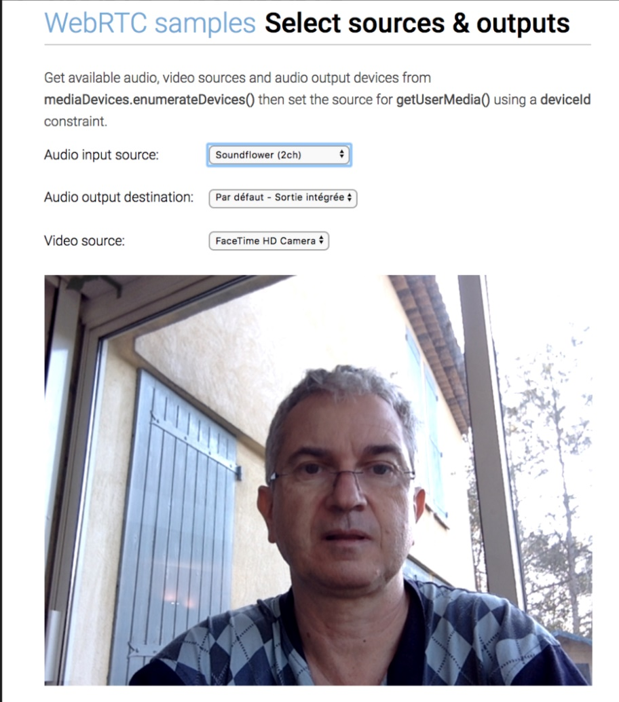<u>  
</u>](https://courses.edx.org/assets/courseware/v1/5a634bfb4d73130fbd4edb3ec19f4d1f/asset-v1:W3Cx+HTML5.2x+2T2020a+type@asset+block/standardGPLayout.jpg)Click
the above image to open a large view in another window/tab.

-   axes: an array of floating point values containing the state of each
    > axis on the device. Usually these represent the analog sticks,
    > with a pair of axes giving the position of the stick in its X and
    > Y axes. Each axis is normalized to the range of -1.0...1.0, with
    > -1.0 representing the up or left-most position of the axis, and
    > 1.0 representing the down or right-most position of the axis.

-   buttons: an array
    > of [GamepadButton](https://w3c.github.io/gamepad/#idl-def-GamepadButton) objects
    > containing the state of each button on the device. Each
    > GamepadButton has a pressed and a value property.

-   The pressed property is a Boolean property indicating whether the
    > button is currently pressed (true) or unpressed (false).

-   The value property is a floating point value used to enable
    > representing analog buttons, such as the triggers, on many modern
    > gamepads. The values are normalized to the range 0.0...1.0, with
    > 0.0 representing a button that is not pressed, and 1.0
    > representing a button that is fully depressed.

##### Detecting whether a button is pressed

Digital, on/off buttons evaluate to either one or zero (respectively).
Whereas analog buttons will return a floating-point value between zero
and one.

[Example on JSBin](https://jsbin.com/heriqej/edit). You might also give
a look at at this demo that does the same thing but with multiple
gamepads.

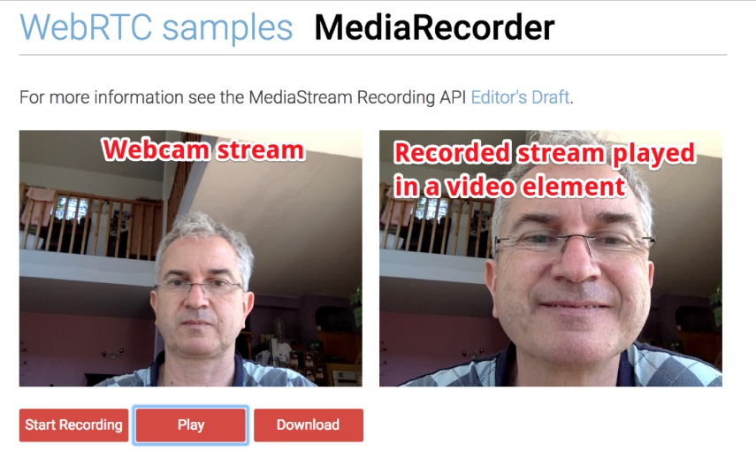

Code for checking if a button is pressed:

```
1.  function checkButtons(gamepad) {
2.     for (var i = 0; i < gamepad.buttons.length; i++) {
3.        // do nothing is the gamepad is not ok
4.        if(gamepad === undefined) return;
5.        if(!gamepad.connected) return;
6.  
7.        var b = gamepad.buttons[i];
8.  
9.        if(b.pressed) {
10.          console.log("Button " + i + " is pressed.");
11.          if(b.value !== undefined)
12.              // analog trigger L2 or R2, value is a float in [0,
    1]
13.              console.log("Its value:" + b.val);
14.       }
15.    }
16. }
```

In *line 11*, notice how we detect whether the current button is an
analog trigger (L2 or R2 on Xbox360 or PS2/PS3 gamepads). 

Next, we'll integrate it into the mainloop code. Note that we also need
to call the scangamepads function from the loop, to generate fresh
"snapshots" of the gamepad with updated properties. Without this call,
the gamepad.buttons will return the same  states every time.

```
1.  function mainloop() {
2.     // clear, draw objects, etc...
3.     ...
4.     scangamepads();
5.     // Check gamepad button states
6.     checkButtons(gamepad);
7.  
8.     // animate at 60 frames/s
9.     requestAnimationFrame(mainloop);
10. }
```

##### Detecting axes (joystick) values

[Example on JSBin](https://jsbin.com/yaxika/edit)


Code for detecting the axes' values:

```
1.  // detect axis (joystick states)
2.  function checkAxes(gamepad) {
3.     if(gamepad === undefined) return;
4.     if(!gamepad.connected) return;
5.  
6.     for (var i=0; i<gamepad.axes.length; i++) {
7.       var axisValue = gamepad.axes[i];
8.       // do something with the value
9.       ...
10.    }
11. }
```

##### Detecting the direction (left, right, up, down, diagonals) and angle of the left joystick

We could add an inputStates object similar to the one we used in the
game framework, and check its values in the mainloop to decide whether
to move the player up/down/left/right, including diagonals - or maybe
we'd prefer to use the current angle of the joystick. Here is how we
manage this:

[JSBin example](https://jsbin.com/vuxoqo/edit?js,output):


Source code extract:

```
1.  **var inputStates = {};**
2.  ...
3.  function mainloop() {
4.     // clear, draw objects, etc...
5.     // update gamepad status
6.     scangamepads();
7.    // Check gamepad button states
8.    checkButtons(gamepad);
9.    // Check joysticks states
10.   checkAxes(gamepad);
11. 
12.   **// Move the player, taking into account**
13. **  // the gamepad left joystick state**
14. **  updatePlayerPosition();**
15. 
16.   // We could use the same technique in
17.   // order to react when buttons are pressed
18.   //...
19. 
20.   // animate at 60 frames/s
21.   requestAnimationFrame(mainloop);
22. }
23.  
24. function updatePlayerPosition() {
25.    directionDiv.innerHTML += "";
26.   ** if(inputStates.left)** {
27.       directionDiv.innerHTML = "Moving left";
28.    }
29.    **if(inputStates.right)** {
30.       directionDiv.innerHTML = "Moving right";
31.    }
32.    **if(inputStates.up)** {
33.       directionDiv.innerHTML = "Moving up";
34.    }
35.    **if(inputStates.down)** {
36.       directionDiv.innerHTML = "Moving down";
37.    }
38.    // Display the angle in degrees, in the HTML page
39.  angleDiv.innerHTML = Math.round((**inputStates.angle***180/Math.PI));
40. }
41.  
42. // gamepad code below
43. // -------------------------
44. // detect axis (joystick states)
45. function checkAxes(gamepad) {
46.   if(gamepad === undefined) return;
47.   if(!gamepad.connected) return;
48. 
49.   ...
50. 
51.  ** // Set inputStates.left, right, up, down**
52. ** inputStates.left = inputStates.right = inputStates.up = inputStates.down = false;**
53. 
54. **  // all values between [-1 and 1]**
55.  ** // Horizontal detection**
56. **  if(gamepad.axes[0] > 0.5) {**
57. **     inputStates.right=true;**
58. **     inputStates.left=false;**
59. **  } else if(gamepad.axes[0] < -0.5) {**
60. **     inputStates.left=true;**
61. **     inputStates.right=false;**
62. **  }**
63. 
64. **  // vertical detection**
65. **  if(gamepad.axes[1] > 0.5) {**
66. **    inputStates.down=true;**
67. **    inputStates.up=false;**
68. **  } else if(gamepad.axes[1] < -0.5) {**
69. **    inputStates.up=true;**
70. **    inputStates.down=false;**
71. **  }**
72.  
73.   // compute the angle. gamepad.axes[1] is the
74.   // sinus of the angle (values between [-1, 1]),
75.   // gamepad.axes[0] is the cosinus of the angle.
76.   // we display the value in degree as in a regular
77.   // trigonometric circle, with the x axis to the right
78.   // and the y axis that goes up.
79.   // The angle = arcTan(sin/cos); We inverse the sign of
80.   // the sinus in order to have the angle in standard
81.   // x and y axis (y going up)
82.   **inputStates.angle = Math.atan2(-gamepad.axes[1], gamepad.axes[0]);**
83. }
```

#### Other gamepads and joysticks tested

#### Logitech Attack 3 Joystick on Linux

*Hi (=dn reports): Have successfully installed a Logitech Attack
3 joy-stick on my Thinkpad running Linux Mint 17.1. It runs all of the
code presented here correctly, reporting 11 buttons and 3 axes (the
knurled rotating knob (closest to my pen) is described as a 'throttle'
or 'accelerator')).*

*Traditionally Linux has been described as 'for work only' or 'no
games', so it was a pleasant surprise to see how easy things were - no
"driver" to install (it seems important to uninstall any existing
connection between a device and the x-server), installed "joystick"
testing and calibration tool, and the "jstest-gtk" configuration and
testing tool; and that was 'it' - no actual configuration was
necessary!*

### External resources

-   [THE BEST resource: this paper from smashingmagazine.com tells you
    > everything about the GamePad
    > API](https://www.smashingmagazine.com/2015/11/gamepad-api-in-web-games/).
    > Very complete, explains how to set a dead zone, a keyboard
    > fallback, etc.

-   [Good article about using the gamepad API on the Mozilla Developer
    > Network site](https://hacks.mozilla.org/2013/12/the-gamepad-api/)

-   [An interesting article on the gamepad support, published on the
    > HTML5 Rocks Web
    > site](https://www.html5rocks.com/en/tutorials/doodles/gamepad/)

-   [gamepad.js ](https://github.com/neogeek/gamepad.js)is a Javascript
    > library to enable the use of gamepads and joysticks in the
    > browser. It smoothes over the differences between browsers,
    > platforms, APIs, and a wide variety of gamepad/joystick devices.

-   [Another library we used in our team for controlling a mobile robot
    > (good support from the
    > authors)](https://github.com/kallaspriit/HTML5-JavaScript-Gamepad-Controller-Library)

-   [Gamepad Controls for HTML5
    > Games](https://blog.teamtreehouse.com/gamepad-controls-html5-games)

## 2.3.7 Move the monster!

Hi, This time, I will show you in that video what

we have done so far. We started from one of the examples from the HTML5

Part 1 course, the one that just use the canvas to draw small monster.

So we have a canvas here, and in a function called when the page is
loaded in the window.onload callback,

we get the canvas, we get the context of the canvas and we called the
draw monster

function. Here we have got just a function that is called

once after the page is loaded and this function just draws the monster
using translate, stroke,

fillRect and so on. Then, in order to turn this into a small game

framework and in order to draw the monster 60 times per seconds, we
introduced what is

called the black box model for creating JavaScript objects.

Instead of having functions, we have got objects. We create an object
that is the game framework:

game = new GF() with capital letters, this is called a constructor
function.

In JavaScript, when you start a function with capital letters, it means
that it is meant

to be use with a new. Then we call just some parts of the game framework

that are exposed to an external user. So here we can call game.start but
we can

not call anything. And in this way to design object, the internals of
the game framework

that are exposed are located in an object we return at the end of the
object.

So in the end of the game framework constructor function, we do return
start, this is the

name of the property we will able to use from the outside, and start
here is the name of

an internal function. So game.start will call this start function

inside the game framework. In this function we do the initialization

so we will create a div for displaying the number of frame per seconds,
we get the canvas,

the context, and we call requestAnimationFrame(mainLoop) in order to
start the animation.

The mainLoop is a private function inside the game framework because it
is not exposed,

we do not return its name here so it is a sort of private function.

And what do we do in the mainLoop? We clear the canvas, we draw the
monster and we call

again requestAnimationFrame(mainLoop). In addition, we also measure the
frames per

seconds taking into account the current time. So in order to measure the
number of FPS,

we pass the time and we compute deltas in this function here, that is
also a private function

that has been presented previously in the course.

So, this is a very small skeleton and then we can build on that by
adding new methods, by

adding new properties. The properties are the local variables that are
usable only inside

the game framework. In the current lesson, we are adding user
interaction

like detecting the mouse buttons that are pressed, the mouse position or
the different keys that

can be pressed. You can notice that the diagonal movements

are very smooth because we can manage different key presses at the same
time and also I can

press a key and a button and the monster will move faster.

So multiple events are managed using a global status variable, that we
called inputStates,

and that is checked 60 times per seconds from inside the mainLoop. So
the event listeners,

the key event listeners and the mouse event listeners will just add
properties to this

variable. Let me show you how it is done. It is done in the start method
that is called

when you want to initialize the game framework, we declare the event
listener and in case

we have got a keydown and if this key is the left arrow for example, we
set the left property

to the inputStates to left. And in the animation loop, we call a method
called updateMonsterPosition

that will check for this global inputStates and if the left key is
pressed, we will display

a message "left key pressed" and we will modify the speed of the
monster. And this variable

‘speedX’ is taken into account to increment the x coordinate.

And this is how we can get a smooth animation because this
updateMonsterPosition is called

60 times per seconds. So if I keep a key pressed, it is not important

if the key is repeated, if I have got several keys pressed, because the
status of the left

key in the inputStates will be unchanged and my monster will keep moving
on the left.

Take time to look at the code, read slowly the explanation in the page
and I will meet

you in the next video in which we will add enemies and obstacles and
detect collisions.

#### Make the monster move using the arrow keys, and to increase its speed by pressing a mouse button

To conclude this topic about events, we will use the arrow keys to move
our favorite monster up/down/left/right, and make it accelerate when we
press a mouse button while it is moving. Notice that pressing two keys
at the same time will make it move diagonally.

[Check this online example at JSBin](https://jsbin.com/yebufu/edit):
we've changed very few lines of code from the previous evolution!

#### Add a JavaScript object to describe the monster

1.  // The monster!

2.  var monster = {

3.    x:10,

4.    y:10,

5.    speed:1

6.  };

Where monster.x and monster.y define the monster's
current position and monster.speed corresponds to the number of pixels
the monster will move between animation frames.

*Note*: this is not the best way to animate objects in a game; we will
look at a far better solution - *"time based animation" - *in another
lesson.

#### We modified the game loop as follows:

```
1.  var mainLoop = function(time){
2.    // Main function, called each frame
3.    measureFPS(time);
4.  
5.    // Clears the canvas
6.    clearCanvas();
7.  
8.    **// Draws the monster**
9.  **  drawMyMonster(monster.x, monster.y);**
10. 
11.   **// Checks inputs and moves the monster**
12. **  updateMonsterPosition();**
13. 
14.   // Calls the animation loop every 1/60th of second
15.   requestAnimationFrame(mainLoop);
16. };
```

We moved all the parts that check the input states in
the updateMonsterPosition() function:

```
1.  function updateMonsterPosition() {
2.    monster.speedX = monster.speedY = 0;
3.  
4.    // Checks inputStates
5.    if (inputStates.left) {
6.      ctx.fillText("left", 150, 20);
7.      monster.speedX = -monster.speed;
8.    }
9.    if (inputStates.up) {
10.     ctx.fillText("up", 150, 40);
11.     monster.speedY = -monster.speed;
12.   }
13.   if (inputStates.right) {
14.     ctx.fillText("right", 150, 60);
15.     monster.speedX = monster.speed;
16.   }
17.   if (inputStates.down) {
18.     ctx.fillText("down", 150, 80);
19.     monster.speedY = monster.speed;
20.   }
21.   if (inputStates.space) {
22.     ctx.fillText("space bar", 140, 100);
23.   }
24.   if (inputStates.mousePos) {
25.     ctx.fillText("x = " + inputStates.mousePos.x + " y = " +
26.                           inputStates.mousePos.y, 5, 150);
27.   }
28.   if (inputStates.mousedown) {
29.     ctx.fillText("mousedown b" + inputStates.mouseButton, 5, 180);
30.     monster.speed = 5;
31.   } else {
32.   // Mouse up
33.   monster.speed = 1;
34.   }
35. 
36.   monster.x += monster.speedX;
37.   monster.y += monster.speedY;
38. }
```

**Explanations**:

-   In this function, we added two properties to
    the monster object: speedX and speedY which will correspond to the
    number of pixels we will add to the x and y position of the monster
    at each new frame of animation.

-   We first set these to zero (*line 2*), then depending on the
    keyboard input states, we set them to a value equal
    to monster.speed or -monster.speed modified by the keys that are
    being pressed at the time (*lines 4-20*).

-   Finally, we add speedX and speedY pixels to the x and/or y position
    of the monster (*lines 36 and 37*).

-   When the function is called by the game loop,
    if speedX and/or speedY are non-zero they will change
    the x and y position of the monster in successive frames, making it
    move smoothly.

-   If a mouse button is pressed or released we set
    the monster.speed value to +5 or to +1. This will make the
    monster move faster when a mouse button is down, and return to its
    normal speed when no button is down.

Notice that two arrow keys and a mouse button can be pressed down at the
same time. In this situation, the monster will take a diagonal direction
and accelerate. This is why it is important to keep all the input states
up-to-date, and not to handle single events individually.

#### Gamepad enhancements

Let's add the gamepad utility functions from the previous lesson (we
tidied them a bit too, removing the code for displaying the progress
bars, buttons, etc.), added a gamepad property to the game framework,
and added one new call in the game loop for updating the gamepad status:

[Check the result on JSBin:](https://jsbin.com/yidohe/edit)


The new updated mainloop:

```
1.  var mainLoop = function(time){
2.     //main function, called each frame
3.     measureFPS(time);
4.  
5.     // Clear the canvas
6.     clearCanvas();
7.  
8.    ** // gamepad**
9.  **   updateGamePadStatus();**
10. 
11.    // draw the monster
12.    drawMyMonster(monster.x, monster.y);
13. 
14.    // Check inputs and move the monster
15.    updateMonsterPosition();
16. 
17.    // Call the animation loop every 1/60th of second
18.    requestAnimationFrame(mainLoop);
19. };
```

And here is the updateGamePadStatus function (the inner function calls
are to gamepad utility functions detailed in the previous lesson):

```
1.  function updateGamePadStatus() {
2.    // get new snapshot of the gamepad properties
3.    scangamepads();
4.    // Check gamepad button states
5.    checkButtons(gamepad);
6.    // Check joysticks
7.    checkAxes(gamepad);
8.  }
```

The checkAxes function updates the left, right, up, down properties of
the inputStates object we previously used with key events. Therefore,
without changing any code in the updatePlayerPosition function, the
monster moves by joystick command!

## 2.4.1 Introduction

Hi! This time I will talk to you about what is

called time-based animation. Here, we have got a simple example of a
bouncing

rectangle and the animation is done in an animationLoop that is called
60 times per

seconds using the requestAnimationFrame. We clear the rectangle that
corresponds to

the canvas area, and we add a fixed increment to the x position.

If x is just bounces on the side, we just reverse the speed.

The speed is a fixed value of 3px per frame. What is happening if we run
this application

on a low end-smartphone or a Raspberry Pi, a low end-computer with a not
very powerful

GPU? We can simulate what would happen by just

adding a big loop here to slow down artificially the animation.

This is what I have done here. Here I count up to 70 millions in the
loop. So this takes

time and slows down the animation. The rectangle is just moving 3px
every frame, but as the

the frame rate drops down a lot, the actual speed on the screen of the
rectangle is much slower

than what I have got here. And here I added also a loop so this is a

normal speed. What we can do in order not to have the speed

going down? We will compute the time between two consecutive

frames. So here I am using the date object from JavaScript

to get the current time and I compute a delta that is a difference
between the current time

and the time at the previous animation. So the delta is the number of
milliseconds

elapsed since the last animation. And then we will compute the distance
instead

of using 3px per frame, the number of pixels we move the rectangle will
increase if the

time between frames increases. So we have got a function that is
explained

in the course that will compute the distance taking into account the
time elapsed since

the last frame and the speed we want to achieve in pixels per seconds,
not in pixels per frames,

but in pixels per seconds. This time, we are adding the increment but

it is adjusted at each frame of animation. Here is an example that I
slow down and if

I change the time that this will take you can see that it goes from
smooth to a bit

jerky… to really jerky, but the speed on the screen is the same.

It takes the same time to bounce from on side to another.

This is what is done in real games. I wanted to show you also another
thing,

Instead of using the date object from JavaScript that gives the time in
milliseconds,

but as we are animating at 60 times per seconds, having an high
resolution timer that has

a sub-millisecond accuracy is much better and was asked by game
developers.

The callback function that is called when you use requestAnimationFrame
can have an

extra parameter that we have not used until now.

So you can add a parameter here that will be a high resolution time.

And then you compute the delta using this time that is automatically
passed to you by

the requestAnimationFrame API. Here, I added this technique to the game
framework.

So, I am in the mainLoop from the last example we used with the game
framework for moving

the small monster using the keys. I artificially slowed down the
animation. So if I do this,

I have got 8 frames per seconds, and you can see that the monster moves,
but it jumps with

larger steps between two consecutive frames. If I remove this artificial
part of the code

that slows down the animation, I go up to 60 FPS and I have got a smooth
animation.

That means that this example will be usable on many different devices as
the animation

will be adapted depending on the power of the device. So this is
time-based animation.

Let's study an important technique known as *"time-based animation"*,
that is used by nearly all "real" video games.

This technique is useful when:

-   **Your application runs on different devices, and where 60 frames/s
    are definitely not possible.** **More generally, you want your
    animated objects to move at the same speed on screen, regardless of
    the device that runs the game.**  
      
    For example, imagine a game or an animation running on a smartphone
    and on a desktop computer with a powerful GPU. On the phone, you
    might achieve a maximum of 20 fps with no guarantee that this number
    will be constant; whereas on the desktop, you will reliably achieve
    60 fps. If the application is a car racing game, for example, your
    car will take 30s to make a complete loop on the race track when
    running on a desktop, whilst on a smartphone it might take 5
    minutes.  
      
    The way to address this is to run at a lower frame-rate on the
    phone. This will enable the car to race around the track in the same
    amount of (real) time as it does on a powerful desktop computer.  
      
    **Solution**: you need to compute the amount of time that has
    elapsed between the last frame that was drawn and the current one;
    and depending on this delta of time, adjust the distance the car
    must move across the screen. We will see several examples of this
    later.

-   **You want to perform some animations only a few times per
    second.** For example, in sprite-based animation (drawing different
    images as a character moves, for example), you will not change the
    images of the animation 60 times/s, but only ten times per second.
    Mario will walk on the screen in a 60 fps animation, but his posture
    will not change every 1/60th of second.

-   **You may also want to accurately set the framerate**, leaving some
    CPU time for other tasks. Many games consoles limit
    the *frame-rate* to 1/30th of a second, in order to allow time for
    other sorts of computations (physics engine, artificial
    intelligence, etc.)

### How to measure time when we use requestAnimationFrame?

Let's take a simple example with a small rectangle that moves from left
to right. At each animation loop, we erase the canvas content, calculate
the rectangle's new position, draw the rectangle, and call the animation
loop again. So you animate a shape as follows (note: steps 2 and 3 can
be swapped):

1.  erase the canvas,

2.  draw the shapes,

3.  move the shapes,

4.  go to step 1.

When we use requestAnimationFrame for implementing such an animation, as
we did in the previous lessons, the browser tries to keep the frame-rate
at 60 fps, meaning that the ideal time between frames will be 1/60
second = 16.66 ms.

### Example #1: no use of time-based animation

[Online example at JSBin](https://jsbin.com/dibuze/edit)


1.  <!DOCTYPE html>

2.  <html lang="en">

3.  <head>

4.    <meta charset=utf-8 />

5.    <title>Small animation example</title>

6.    <script>

7.      var canvas, ctx;

8.      var width, height;

9.      var x, y;

10.     var speedX;

11. 

12.     // Called after the DOM is ready (page loaded)

13.     function init() {

14.        // init the different variables

15.        canvas = document.querySelector("#mycanvas");

16.        ctx = canvas.getContext('2d');

17.        width = canvas.width;

18.        height = canvas.height;

19. 

20.        x=10; y = 10;

21. 

22.        // Move 3 pixels left or right at each frame

23.        speedX = 3;

24. 

25.        // Start animation

26.        animationLoop();

27.     }

28. 

29.     function animationLoop() {

30.        // an animation involves: 1) clear canvas and 2) draw shapes,

31.        // 3) move shapes, 4) recall the loop with
    requestAnimationFrame

32. 

33.        // clear canvas

34.        ctx.clearRect(0, 0, width, height);

35. 

36.        ctx.strokeRect(x, y, 10, 10);

37. 

38.        // move rectangle

39.        x += speedX;

40. 

41.        // check collision on left or right

42.        if(((x+5) > width) || (x <= 0)) {

43.           // cancel move + inverse speed

44.           x -= speedX;

45.           speedX = -speedX;

46.        }

47. 

48.        // animate.

49.        requestAnimationFrame(animationLoop);

50.     }

51. </script>

52. </head>

53. 

54. <body onload="init();">

55. <canvas id="mycanvas" width="200" height="50" style="border: 2px solid
    black">

56.  </canvas>

57. </body>

58. </html>

If you try this example on a low-end smartphone (use
this [URL](https://jsbin.com/dibuze) for the example in stand-alone
mode) and if you run it at the same time on a desktop PC, it is obvious
that the rectangle moves faster on the desktop computer screen than on
your phone.

This is because the frame rate differs between the computer and the
smartphone: perhaps 60 fps on the computer and 25 fps on the phone. As
we only move the rectangle in the animationLoop, in one second the
rectangle will be moved 25 times on the smartphone compared with 60
times on the computer! Since we move the rectangle the same number of
pixels each time, the rectangle moves faster on the computer!

## Example #2: simulating a low-end device

Here is the same example to which we have added a loop that wastes time
right in the middle of the animation loop. It will artificially extend
the time spent inside the animation loop, making the 1/60th of second
ideal impossible to reach.

[Try it on JsBin](https://jsbin.com/remide/edit) and notice that the
square moves much slower on the screen. Indeed, its speed is a direct
consequence of the extra time spent in the animation loop.

1.  function animationLoop() {

2.      ...

3.      **for(var i = 0; i < 50000000; i++) {**

4.  **       // slow down artificially the animation**

5.  **    }**

6.      ...

7.      requestAnimationFrame(animationLoop);

8.  }

## 2.4.2 Measuring time between frames

Let's find out how to measuring time between frames to achieve a
constant speed on screen, even when the frame rate changes.

### Method #1: using the JavaScript Date object

Let's modify the example from the previous lesson slightly by adding
a *time-based animation*.  Here we use the "standard JavaScript" way for
measuring time, using JavaScript's Date object:

1.  var time = new Date().getTime();

The getTime() method returns the number of milliseconds since midnight
on January 1, 1970. This is the number of milliseconds that have elapsed
during the Unix epoch (!).

There is an alternative. We could have called:

1.  var time = Date.now();

So, if we measure the time at the beginning of each animation loop, and
store it, we can then compute the delta of times elapsed between two
consecutive loops.

We then apply some simple math to compute the number of pixels we need
to move the shape to achieve a given speed (in pixels/s).

#### Example #1: using time based animation: the bouncing square

[Online example at JSBin](https://jsbin.com/riferi/edit):


Source code from the example:

```
1.  <!DOCTYPE html>
2.  <html lang="en">
3.  <head>
4.    <meta charset=utf-8 />
5.    <title>Move rectangle using time based animation</title>
6.    <script>
7.      var canvas, ctx;
8.      var width, height;
9.      var x, y, incX; // incX is the distance from the previously > drawn
10.                     // rectangle to the new one
11.     **var speedX; // speedX is the target speed of the rectangle, in > pixels/s**
12. 
13.     **// for time based animation**
14.     **var now, delta;**
15.     **var then = new Date().getTime();**
16. 
17.     // Called after the DOM is ready (page loaded)
18.     function init() {
19.       // Init the different variables
20.       canvas = document.querySelector("#mycanvas");
21.       ctx = canvas.getContext('2d');
22.       width = canvas.width;
23.       height = canvas.height;
24. 
25.       x=10; y = 10;
26.       // Target speed in pixels/second, try with high values, 1000, > 2000...
27.       speedX = 200;
28. 
29.       // Start animation
30.      animationLoop();
31.    }
32. 
33.    function animationLoop() {
34.      **// Measure time**
35.      **now = new Date().getTime();**
36.  
37.      // How long between the current frame and the previous one?
38.      **delta = now - then;**
39.      //console.log(delta);
40.      // Compute the displacement in x (in pixels) in function of the > time elapsed and
41.      // in function of the wanted speed
42.      **incX = calcDistanceToMove(delta, speedX);**
43. 
44.      // an animation involves: 1) clear canvas and 2) draw shapes,
45.      // 3) move shapes, 4) recall the loop with  > requestAnimationFrame
46. 
47.      // clear canvas
48.      ctx.clearRect(0, 0, width, height);
49. 
50.      ctx.strokeRect(x, y, 10, 10);
51. 
52.      // move rectangle
53.      x += incX;
54. 
55.      // check collision on left or right
56.      if((x+10 >= width) || (x <= 0)) {
57.         // cancel move + inverse speed
58.         x -= incX;
59.         speedX = -speedX;
60.      }
61. 
62.      **// Store time**
63.      **then = now;**
64. 
65.      requestAnimationFrame(animationLoop);
66.  }
67. 
68. 
69. 
70.  // We want the rectangle to move at a speed given in pixels/second
71.  // (there are 60 frames in a second)
72.  // If we are really running at 60 frames/s, the delay between
73.  // frames should be 1/60
74.  // = 16.66 ms, so the number of pixels to move = (speed * > del)/1000.
75.  // If the delay is twice as
76.  // long, the formula works: let's move the rectangle for twice as > long!
77. ** var calcDistanceToMove = function(delta, speed) {**
78. **     return (speed * delta) / 1000;**
79. ** }**
80. 
81.  </script>
82. </head>
83. 
84. <body onload="init();">
85.  <canvas id="mycanvas" width="200" height="50" style="border: 2px solid > black"></canvas>
86. </body>
87. </html>
```

In this example, we only added a few lines of code for measuring the
time and computing the time elapsed between two consecutive frames
(see *line 38*). Normally, requestAnimationFrame(callback) tries to call
the callback function every 16.66 ms (this corresponds to 60
frames/s)... *but this is never exactly the case*. If you do
a console.log(delta)in the animation loop, you will see that even on a
very powerful computer, the delta is "very close" to 16.6666 ms, but 99%
of the time it will be slightly different.

The function calcDistanceToMove(delta, speed) takes two parameters: 1)
the time elapsed in ms, and 2) the target speed in pixels/s. 

Try this example on a smartphone, use
this [link](https://jsbin.com/jeribi) to run the JSBin example in
stand-alone mode. Normally you should see no difference in speed, but it
may look a bit jerky on a low-end smartphone or on a slow
computer. *This is the correct behavior.*

Or you can try the next example that simulates a complex animation loop
that takes a long time to draw each frame...

#### Example #2: using a simulation that spends a lot of time in the animation loop, to compare with the previous example

[Try it on JsBin](https://jsbin.com/jeribi/edit):

We added a long loop in the middle of the animation loop. This time, the
animation should be very jerky. However, notice that the apparent speed
of the square is the same as in the previous example: the animation
adapts itself!

```
1.  function animationLoop() {
2.     // Measure time
3.    now = new Date().getTime();
4.   
5.    // How long between the current frame and the previous one ?
6.    delta = now - then;
7.    //console.log(delta);
8.    // Compute the displacement in x (in pixels) in function of the time elapsed and
9.    // in function of the wanted speed
10.   incX = calcDistanceToMove(delta, speedX);
11. 
12.   // an animation is : 1) clear canvas and 2) draw shapes,
13.   // 3) move shapes, 4) recall the loop with requestAnimationFrame
14. 
15.   // clear canvas
16.   ctx.clearRect(0, 0, width, height);
17. 
18.   **for(var i = 0; i < 50000000; i++) {**
19. **    // just to slow down the animation**
20. **  }**
21. 
22.   ctx.strokeRect(x, y, 10, 10);
23. 
24.   // move rectangle
25.   x += incX;
26. 
27.   // check collision on left or right
28.   if((x+10 >= width) || (x <= 0)) {
29.    // cancel move + inverse speed
30.    x -= incX;
31.    speedX = -speedX;
32.   }
33. 
34.   // Store time
35.   then = now;
36. 
37.   requestAnimationFrame(animationLoop);
38. }
```

### Method #2: using the new HTML5 high-resolution timer

Since the beginning of HTML5, game developers, musicians, and
others have asked for a sub-millisecond timer to be able to avoid some
glitches that occur with the regular JavaScript timer. This API is
called the "[High Resolution Time API](https://www.w3.org/TR/hr-time/)".

This API is very simple to use - just do:

```
1.  var time = performance.now();
```

... to get a sub-millisecond time-stamp. It is similar to Date.now()
except that the accuracy is much higher and that the result is not
exactly the same. The value returned is a floating point number, not an
integer value!

From [this article that explains the High Resolution Time
API](https://www.sitepoint.com/discovering-the-high-resolution-time-api/):
 "*The only method exposed is now(), which returns a DOMHighResTimeStamp
representing the current time in milliseconds. The timestamp is very
accurate, with precision to a thousandth of a millisecond. Please note
that while Date.now() returns the number of milliseconds elapsed since 1
January 1970 00:00:00 UTC, performance.now() returns the number of
milliseconds, with microseconds in the fractional part, from
performance.timing.navigationStart(), the start of navigation of the
document, to the performance.now() call. Another important difference
between Date.now() and performance.now() is that the latter is
monotonically increasing, so the difference between two calls will never
be negative.*"

To sum up:

-   performance.now() returns the time since the load of the document
    (it is called a DOMHighResTimeStamp), with a sub mill-second
    accuracy, as a floating point value, with very high accuracy.

-   Date.now() returns the number of mill-seconds since the Unix epoch,
    as an integer value.

Support for this API is quite good - see the compatibility
table [online](https://caniuse.com/#feat=high-resolution-time).

Here is [a version on JSBin of the previous example with the bouncing
rectangle, that uses the high resolution
timer](https://jsbin.com/wecaho/edit).

Source code of the example:

1.  ...
2.  <script>
3.    ...
4.    var speedX; // speedX is the target speed of the rectangle in pixels/s
5. 
6.    // for time based animation
7.    var now, delta;
8.    **// High resolution timer**
9.    **var then = performance.now();**
10. 
11.    // Called after the DOM is ready (page loaded)
12.    function init() {
13.      ...
14.    }
15. 
16.    function animationLoop() {
17.      **// Measure time, with high resolution timer**
18.      **now = performance.now();**
19.  
20.      // How long between the current frame and the previous one?
21.     delta = now - then;
22.     //console.log(delta);
23.     // Compute the displacement in x (in pixels) in function
24.     // of the time elapsed and
25.     // in function of the wanted speed
26.     incX = calcDistanceToMove(delta, speedX);
27.     //console.log("dist = " + incX);
28.     // an animation involves: 1) clear canvas and 2) draw shapes,
29.     // 3) move shapes, 4) recall the loop with requestAnimationFrame
30. 
31.     // clear canvas
32.    ctx.clearRect(0, 0, width, height);
33. 
34.    ctx.strokeRect(x, y, 10, 10);
35. 
36.    // move rectangle
37.    x += incX;
38. 
39.    // check collision on left or right
40.    if((x+10 >= width) || (x <= 0)) {
41.       // cancel move + inverse speed
42.       x -= incX;
43.       speedX = -speedX;
44.    }
45. 
46.    // Store time
47.    then = now;
48. 
49.    // call the animation loop again
50.    requestAnimationFrame(animationLoop);
51.  }
52.  ...
53. 
54.  </script>
```

Only two lines have changed but the accuracy is much higher, if you
uncomment the console.log(...) calls in the main loop. You will see the
difference.

### Method #3: using the optional timestamp parameter of the callback function of requestAnimationFrame

> **This is the recommended method!**

There is an optional parameter that is passed to the callback function
called by requestAnimationFrame: a timestamp!

[The requestAnimationFrame API
specification](https://www.w3.org/TR/animation-timing/)  says that this
timestamp corresponds to the time elapsed since the page has been
loaded.

It is similar to the value sent by the high resolution timer
using performance.now().

Here is a running example of the animated rectangle, that uses this
timestamp parameter.

[Online example at JSBin](https://jsbin.com/kuvumu/edit):

**Source code of the example:**

277. <!DOCTYPE html>

278. <html lang="en">

279. <head>

280. <meta charset=utf-8 />

281. <title>Time based animation using the parameter of the
     requestAnimationFrame callback</title>

282.  <script>

283.    var canvas, ctx;

284.    var width, height;

285.    var x, y, incX; // incX is the distance from the previously
     drawn rectangle

286.                    // to the new one

287.    var speedX;     // speedX is the target speed of the rectangle
     in pixels/s

288. 

289.    // for time based animation

290.    var now, delta=0;

291.    // High resolution timer

292.    var oldTime = 0;

293. 

294.    // Called after the DOM is ready (page loaded)

295.    function init() {

296.      // init the different variables

297.      canvas = document.querySelector("#mycanvas");

298.      ctx = canvas.getContext('2d');

299.      width = canvas.width;

300.      height = canvas.height;

301. 

302.      x=10; y = 10;

303.      // Target speed in pixels/second, try with high values, 1000,
     2000...

304.      speedX = 200;

305. 

306.      // Start animation

307.      requestAnimationFrame(animationLoop);

308.    }

309. 

310.    function animationLoop(**currentTime**) {

311.      // How long between the current frame and the previous one?

312.      **delta = currentTime - oldTime;**

313. 

314.      // Compute the displacement in x (in pixels) in function of
     the time elapsed and

315.      // in function of the wanted speed

316.      incX = calcDistanceToMove(delta, speedX);

317. 

318.      // clear canvas

319.      ctx.clearRect(0, 0, width, height);

320. 

321.      ctx.strokeRect(x, y, 10, 10);

322. 

323.      // move rectangle

324.      x += incX;

325. 

326.      // check collision on left or right

327.      if(((x+10) > width) || (x < 0)) {

328.        // inverse speed

329.        x -= incX;

330.        speedX = -speedX;

331.      }

332. 

333.      // Store time

334.      oldTime = currentTime;

335. 

336.      // asks for next frame

337.      requestAnimationFrame(animationLoop);

338.    }

339. 

340.    var calcDistanceToMove = function(delta, speed) {

341.      return (speed * delta) / 1000;

342.    }

343. 

344.  </script>

345. </head>

346. 

347. <body onload="init();">

348.  <canvas id="mycanvas" width="200" height="50" style="border: 2px solid
     black"></canvas>

349. </body>

350. </html>

## 2.4.3 Setting the frame rate

Principle: even if the mainloop is called 60 times per second, ignore
some frames in order to reach the desired frame rate.

It is also possible to set the frame rate using time based animation. We
can set a global variable that corresponds to the desired frame rate and
compare the elapsed time between two executions of the animation loop:

-   If the time elapsed is too short for the target frame rate: do
    nothing,

-   If the time elapsed exceeds the delay corresponding to the chosen
    frame rate: draw the frame and reset this time to zero.

Here is the [online example at JSBin](https://jsbin.com/bonutur/edit).

**Try to change the parameter value of the call to: **

1.  <sup>setFrameRateInFramesPerSecond(5); // try other values!</sup>


**Source code of the example:**

351. <!DOCTYPE html>

352. <html lang="en">

353.  <head>

354.  <meta charset=utf-8 />

355.  <title>Set framerate using a high resolution timer</title>

356.  </head>

357.  <body>

358.  <p>This example measures and sums deltas of time between
     consecutive frames of animation. It includes
     a <code>setFrameRateInFramesPerSecond</code> function you can
     use to reduce the number of frames per second of the main
     animation.</p>

359.  

360.  <canvas id="myCanvas" width="700" height="350">

361.  </canvas>

362.  <script>

363.    var canvas = document.querySelector("#myCanvas");

364.    var ctx = canvas.getContext("2d");

365.    var width = canvas.width, height = canvas.height;

366.    var lastX = width * Math.random();

367.    var lastY = height * Math.random();

368.    var hue = 0;

369.  

370.    **// Michel Buffa: set the target frame rate. TRY TO CHANGE THIS
     VALUE AND SEE**

371. **   // THE RESULT. Try 2 frames/s, 10 frames/s, 60 frames/s
     Normally there**

372. **   // should be a limit of 60 frames/s in the browser's
     implementations.**

373. **   setFrameRateInFramesPerSecond(60);**

374.  

375.   // for time based animation. DelayInMS corresponds to the target
     framerate

376.   var now, delta, delayInMS,** totalTimeSinceLastRedraw = 0;**

377.  

378.   // High resolution timer

379.   var then = performance.now();

380.  

381.   // start the animation

382.   requestAnimationFrame(mainloop);

383.  

384.   **function setFrameRateInFramesPerSecond(frameRate) {**

385. **    delayInMs = 1000 / frameRate;**

386. **  }**

387.  

388.   // each function that is going to be run as an animation should
     end by

389.   // asking again for a new frame of animation

390.   function mainloop(time) {

391.     // Here we will only redraw something if the time we want
     between frames has

392.     // elapsed

393.     // Measure time with high resolution timer

394.     now = time;

395.  

396.     // How long between the current frame and the previous one?

397.     delta = now - then;

398.     // TRY TO UNCOMMENT THIS LINE AND LOOK AT THE CONSOLE

399.     // console.log("delay = " + delayInMs + " delta = " + delta + "
     total time = " +

400.     // totalTimeSinceLastRedraw);

401.  

402.     // If the total time since the last redraw is > delay
     corresponding to the wanted

403.     // framerate, then redraw, else add the delta time between the
     last call to line()

404.     // by requestAnimFrame to the total time..

405.     if (totalTimeSinceLastRedraw > delayInMs) {

406.        // if the time between the last frame and now is > delay
     then we

407.        // clear the canvas and redraw

408.  

409.        ctx.save();

410.  

411.        // Trick to make a blur effect: instead of clearing the
     canvas

412.        // we draw a rectangle with a transparent color. Changing
     the 0.1

413.        // for a smaller value will increase the blur...

414.        ctx.fillStyle = "rgba(0,0,0,0.1)";

415.        ctx.fillRect(0, 0, width, height);

416.  

417.        ctx.translate(width / 2, height / 2);

418.        ctx.scale(0.9, 0.9);

419.        ctx.translate(-width / 2, -height / 2);

420.  

421.        ctx.beginPath();

422.        ctx.lineWidth = 5 + Math.random() * 10;

423.        ctx.moveTo(lastX, lastY);

424.        lastX = width * Math.random();

425.        lastY = height * Math.random();

426.  

427.        ctx.bezierCurveTo(width * Math.random(),

428.                          height * Math.random(),

429.                          width * Math.random(),

430.                          height * Math.random(),

431.                          lastX, lastY);

432.  

433.        hue = hue + 10 * Math.random();

434.        ctx.strokeStyle = "hsl(" + hue + ", 50%, 50%)";

435.        ctx.shadowColor = "white";

436.        ctx.shadowBlur = 10;

437.        ctx.stroke();

438.  

439.        ctx.restore();

440.  

441.        **// reset the total time since last redraw**

442. **       totalTimeSinceLastRedraw = 0;**

443.     } else {

444.        **// sum the total time since last redraw**

445. **       totalTimeSinceLastRedraw += delta;**

446.     }

447.  

448.     // Store time

449.     then = now;

450.  

451.     // request new frame

452.     requestAnimationFrame(mainloop);

453.   }

454.  </script>

455.  </body>

456. </html>

### Same technique with the bouncing rectangle

See how we can set both the speed (in pixels/s) and the frame-rate using
a high-resolution time with this [modified version on JSBin of the
example with the rectangle that also uses this
technique](https://jsbin.com/momeci/edit). 

**Source code:**

1.  <!DOCTYPE html>

2.  <html lang="en">

3.  <head>

4.  <meta charset=utf-8 />

5.  <title>Bouncing rectangle with high resolution timer and
    adjustable frame rate</title>

6.   <script>

7.     var canvas, ctx;

8.     var width, height;

9.     var x, y, incX; // incX is the distance from the previously drawn
    rectangle

10.                    // to the new one

11.    var speedX; // speedX is the target speed of the rectangle in
    pixels/s

12. 

13.    // for time based animation, DelayInMS corresponds to the target
    frame rate

14.    var now, delta, delayInMS, totalTimeSinceLastRedraw=0;

15.    // High resolution timer

16.    var then = performance.now();

17. 

18.    // Michel Buffa: set the target frame rate. TRY TO CHANGE THIS
    VALUE AND SEE

19.    // THE RESULT. Try 2 frames/s, 10 frames/s, 60, 100 frames/s
    Normally there

20.    // should be a limit of 60 frames/s in the browser's
    implementations, but you can 

21.    // try higher values

22.    setFrameRateInFramesPerSecond(25);

23. 

24.    function setFrameRateInFramesPerSecond(framerate) {

25.      delayInMs = 1000 / framerate;

26.    }

27. 

28.    // Called after the DOM is ready (page loaded)

29.    function init() {

30.      // init the different variables

31.      canvas = document.querySelector("#mycanvas");

32.      ctx = canvas.getContext('2d');

33.      width = canvas.width;

34.      height = canvas.height;

35. 

36.      x=10; y = 10;

37.      // Target speed in pixels/second, try with high values, 1000,
    2000...

38.      speedX = 2000;

39. 

40.      // Start animation

41.      requestAnimationFrame(animationLoop)

42.    }

43. 

44.    function animationLoop(time) {

45.      // Measure time with high resolution timer

46.      now = time;

47.  

48.      // How long between the current frame and the previous one?

49.      delta = now - then;

50. 

51. **     if(totalTimeSinceLastRedraw > delayInMs) {**

52.        // Compute the displacement in x (in pixels) in function of
    the time elapsed

53.        // since the last draw and

54.        // in function of the wanted speed. This time, instead of
    delta we

55.        // use totalTimeSinceLastRedraw as we're not always drawing
    at

56.        // each execution of mainloop

57.      
     incX = calcDistanceToMove(**totalTimeSinceLastRedraw**, speedX);

58. 

59.        // an animation involves: 1) clear canvas and 2) draw shapes,

60.        // 3) move shapes, 4) recall the loop with
    requestAnimationFrame

61. 

62.        // clear canvas

63.        ctx.clearRect(0, 0, width, height);

64. 

65.        ctx.strokeRect(x, y, 10, 10);

66. 

67.        // move rectangle

68.        x += incX;

69. 

70.       // check collision on left or right

71.       if((x+10 >= width) || (x <= 0)) {

72.         // cancel move + inverse speed

73.         x -= incX;

74.         speedX = -speedX;

75.       }

76.      ** // reset the total time since last redraw**

77. **      totalTimeSinceLastRedraw = delta;**

78.    } else {

79.      // sum the total time since last redraw

80.      totalTimeSinceLastRedraw += delta;

81.    }

82.    // Store time

83.    then = now;

84.  

85. 

86.    // animate. 

87.    requestAnimationFrame(animationLoop);

88.  }

89. 

90.  var calcDistanceToMove = function(delta, speed) {

91.     return (speed * delta) / 1000;

92.  }

93. 

94.  </script>

95. </head>

96. 

97. <body onload="init();">

98.  <canvas id="mycanvas" width="200" height="50" style="border: 2px solid
    black"></canvas>

99. </body>

100. </html>

### Can we use setInterval?

It's quite possible to use setInterval(function, interval) if you do not
need an accurate scheduling.

To animate a monster at 60 fps but blinking his eyes once per second,
you would use a mainloop with requestAnimationFrame and target a 60 fps
animation, but you would also have a call to setInterval(changeEyeColor,
1000); and the changeEyeColor function will update a global
variable, eyeColor, every second, which will be taken into account
within the drawMonster function, called 60 times/s from the mainloop.

## 2.4.4 Adding time-based animation

To add time-based animation to our game engine, we will be using the
technique discussed in the previous lesson. This technique is now widely
supported by browsers, and adds time-based animation to our game
framework, through the timestamp parameter passed to the callback
function (mainLoop) by the call to requestAnimationFrame(mainLoop).

[Here is an online example of the game framework at
JSBin](https://jsbin.com/xacebu/edit): this time, the monster has a
speed in pixels/s and we use time-based animation. Try it and verify the
smoothness of the animation; the FPS counter on a Mac Book Pro core i7
shows 60 fps.


[Now try this slightly modified
version](https://jsbin.com/gazatuquya/edit?html,js,output) in which we
added a delay inside the animation loop. This should slow down the frame
rate.  On a Mac Book Pro + core i7, the frame-rate drops down to 37 fps.
However, if you move the monster using the arrow keys, its speed on the
screen is the same, excepting that it's not as smooth as in the previous
version, which ran at 60 fps.


Here are the parts we changed:

-   Declaration of the monster object - now the speed is in pixels/s
    instead of in pixels per frame

1.  // The monster !

2.  var monster = {

3.     x:10,

4.     y:10,

5.     **speed:100, // pixels/s this time !**

6.  };

-   We added a timer(currentTime) function that returns the delta of the
    time elapsed since its last call

We refer to it from the game loop, to measure the time between frames.
Notice that here we pass the delta as a parameter to
the updateMonsterPosition call:

```
1.  **function timer(currentTime) {**
2.  **   var delta = currentTime - oldTime;**
3.  **   oldTime = currentTime;**
4.  **   return delta;**
5.  **}**
6.  
7.  var mainLoop = function(**time**){
8.     //main function, called each frame
9.     **measureFPS(time);**
10. 
11.    **// number of ms since last frame draw**
12. **   delta = timer(time);**
13. 
14.    // Clear the canvas
15.    clearCanvas();
16. 
17.    // draw the monster
18.    drawMyMonster(monster.x, monster.y);
19. 
20.    **// Check inputs and move the monster**
21. **   updateMonsterPosition(delta);**
22. 
23.    // call the animation loop every 1/60th of second
24.    requestAnimationFrame(mainLoop);
25. };
```

-   Finally, we use the time-delta in
    the updateMonsterPosition(...) function

```
1.  function updateMonsterPosition(**delta**) {
2.     ...
3.     // Compute the incX and inY in pixels depending
4.     // on the time elapsed since last redraw
5.     **monster.x += calcDistanceToMove(delta, monster.speedX);**
6.    ** monster.y += calcDistanceToMove(delta, monster.speedY);**
7.   }
```

## 2.5.1 Animating multiple objects

Hi, welcome! Let me show you how we can add many animated

objects to the game framework. You can imagine them as being the enemies

the player should fight or whatever. For the sake of this example, we
are using

black balls, but you can imagine small images or small monsters or
whatever.

Using here a constructor function is interesting because we can design a
sort of class.

I mean a bit like Java classes or C# classes, if we make a comparison
with other objected oriented languages. So we just say that the ball has
a x position and a y position, an angle, a speed (the ‘v’ here if for he
speed), and a radius.

We also said that each ball will be able to move and to be drawn on the
screen.

It is a way to encapsulate in one single function the properties and the
methods for manipulating the balls. And the advantage is that now we can
create many balls using the new operator and passing different
parameters.

Let's have a look at a function that will build a certain amount of
balls with different

parameters. We called it createBalls: it takes as parameters a number of
balls and will, in a loop, create new balls. The new ball here will
create a ball with a random x position, a random y position, a random
angle between 0 and 2*PI, and a random speed and a given size. So I can
change the size here, I can use another size so the reduce is a fixe
parameter here. Every ball is added to an array, so we have got a
variable called ballArray that contains all the balls.

At the initialization, when the page is loaded we call this createBalls
function that will fill the ball array. The mainLoop is called 60 times
per seconds and goes along the whole ballArray and for each ball in the
array, we will call ‘move’ that will change the x and y position
depending on the angle and the speed of the ball and we will draw the
balls.

In the middle we test if the ball is colliding with a side and we change
the angle.

I can just call createBalls with a large number: here I created 100
balls, 1000 balls, and I can change some of their properties. This small
example, that is 50 lines of code long, we can just take the function
and add them inside the game framework.

So here, what we did is that we just added the ballArray variable inside
the game framework, we called createBalls in the start function of the
game framework, start function, I am inside here, so I create 160 balls
or 1 ball so I can do whatever I like.

And we call the draw ball and move ball from inside the animation loop.

If you look at the animation loop, we clear the canvas, we draw the
monster and we update the monster position to take into account the
keys. If I press some keys the monster moves. So we call updateBalls
that will move all the balls and draw all the balls.

What we have is that we got the last example with the moving monster
plus a set

of enemies that are animated.

In this section, we will see how we can animate and control not only the
player but also other objects on the screen.

Let's study a simple example: animating a few balls and detecting
collisions with the surrounding walls. For the sake of simplicity, we
will not use time-based animation in the first examples.

### Animating multiple balls which bounce off horizontal and vertical walls

[Online example at JSBin](https://jsbin.com/fikomik/edit?js,output):


In this example, we define *a constructor function* for creating balls.
This is a way to design JavaScript "pseudo classes" as found in other
object-oriented languages like Java, C# etc. It's useful when you plan
to create many objects of the same class. Using this we could animate
hundreds of balls on the screen.

Each ball has an x and y position, and in this example, instead of
working with angles, we defined two "speeds" - horizontal and vertical
speeds - in the form of the increments we will add to
the x and y positions at each frame of animation. We also added a
variable for adjusting the size of the balls: the radius.

Here is the constructor function for building balls:

```
1.  // Constructor function for balls
2.  function Ball(x, y, vx, vy, diameter) {
3.    // property of each ball: a x and y position, speeds, radius
4.    this.x = x;
5.    this.y = y;
6.    this.vx = vx;
7.    this.vy = vy;
8.    this.radius = diameter/2;
9.  
10.   // methods
11.   this.draw = function() {
12.     ctx.beginPath();
13.     ctx.arc(this.x, this.y, this.radius, 0, 2*Math.PI);
14.     ctx.fill();
15.   };
16. 
17.   this.move = function() {
18.     // add horizontal increment to the x pos
19.     // add vertical increment to the y pos
20.     this.x += this.vx;
21.     this.y += this.vy;
22.  };
23. }
```

Using a constructor function makes it easy to build new balls as
follows:

```
1.  var b1 = new Ball(10, 10, 2, 2, 5); // x, y, vx, vy, radius
2.  var b1 = new Ball(100, 130, 4, 5, 5); 
3.  etc...
```

We defined two methods in the constructor function for moving the ball
and for drawing the ball as a black filled circle. Here is the syntax
for moving and drawing a ball:

```
1.  b1.draw();
2.  b1.move();
```

We will call these methods from inside the mainLoop, and as you'll see,
we will create many balls. This object-oriented design makes it easier
to handle large quantities.

Here is the rest of the code from this example:

```
1.  var canvas, ctx, width, height;
2.  
3.  **// array of balls to animate**
4.  **var ballArray = [];**
5.  
6.  function init() {
7.    canvas = document.querySelector("#myCanvas");
8.    ctx = canvas.getContext('2d');
9.    width = canvas.width;
10.   height = canvas.height;
11. 
12.   **// try to change this number**
13. **  createBalls(16);**
14. 
15.   requestAnimationFrame(mainLoop);
16. }
17. 
18. function createBalls(numberOfBalls) {
19.   for(var i=0; i < numberOfBalls; i++) {
20. 
21.     **// Create a ball with random position and speed.**
22. **    // You can change the radius**
23. **    var ball = new Ball(width*Math.random(),**
24. **                        height*Math.random(),**
25. **                        (10*Math.random())-5,**
26. **                        (10*Math.random())-5,**
27. **                        30);**
28. 
29. **    // add the ball to the array**
30.     **ballArray[i] = ball;**
31.    }
32. }
33. 
34. function mainLoop() {
35.   // clear the canvas
36.   ctx.clearRect(0, 0, width, height);
37. 
38.   **// for each ball in the array**
39. **  for(var i=0; i < ballArray.length; i++) {**
40. **    var ball = ballArray[i]; **
41. 
42. **    // 1) move the ball**
43. **    ball.move();**
44. 
45. **    // 2) test if the ball collides with a wall**
46. **    testCollisionWithWalls(ball);**
47. 
48. **    // 3) draw the ball**
49. **    ball.draw();**
50. **  }**
51.   // ask for a new frame of animation at 60f/s
52.   window.requestAnimationFrame(mainLoop);
53. }
54. 
55. function testCollisionWithWalls(ball) {
56.   // left
57.   if (ball.x < ball.radius) { // x and y of the ball are at the center of the circle
58.     ball.x = ball.radius;     // if collision, we replace the ball at a position
59.     ball.vx *= -1;            // where it's exactly in contact with the left border
60.   }                           // and we reverse the horizontal speed
61.   // right
62.   if (ball.x > width - (ball.radius)) {
63.     ball.x = width - (ball.radius);
64.     ball.vx *= -1;
65.   }
66.   // up
67.   if (ball.y < ball.radius) {
68.     ball.y = ball.radius;
69.     ball.vy *= -1;
70.   }
71.   // down
72.   if (ball.y > height - (ball.radius)) {
73.     ball.y = height - (ball.radius);
74.     ball.vy *= -1;
75.   }
76. }
```

**Notice that:**

-   All the balls are stored in an array (*line 4*),

-   We wrote a createBalls(nb) function that creates a given number of
    balls (and stores them in the array) with random values for position
    and speed (*lines 18-32*)

-   In the mainLoop, we iterate on the array of balls and for each ball
    we: 1) move it, 2) test if it collides with the boundaries of the
    canvas (in the function testCollisionWithWalls), and 3) we draw the
    balls (*lines 38-50*). The order of these steps is not critical and
    may be changed.

-   The function that tests collisions is straightforward (*lines
    55-76*).  We did not use "if... else if" since a ball may sometimes
    touch two walls at once (in the corners). In that rare case, we need
    to invert both the horizontal and vertical speeds. When a ball
    collides with a wall, we need to replace it in a position where it
    is no longer against the wall (otherwise it will collide again
    during the next animation loop execution).

### Similar example but with the ball direction as an angle, and a single velocity variable

[Try this example at JSBin](https://jsbin.com/begaci/edit): it behaves
in the same way as the previous example.

Note that we just changed the way we designed the balls and computed the
angles after they rebound from the walls. The changes are highlighted in
bold:

```
1.  var canvas, ctx, width, height;
2.  
3.  // Array of balls to animate
4.  var ballArray = [];
5.  
6.  function init() {
7.    ...
8.  }
9.  
10. function createBalls(numberOfBalls) {
11.   for(var i=0; i < numberOfBalls; i++) {
12. 
13.     // Create a ball with random position and speed.
14.     // You can change the radius
15.     var ball = new Ball(width*Math.random(),
16.                         height*Math.random(),
17.               **(2*Math.PI)*Math.random(), // angle**
18.               **(10*Math.random())-5,      // speed**
19.                         30);
20. 
21.    // We add it in an array
22.    ballArray[i] = ball;
23.   }
24. }
25. 
26. function mainLoop() {
27.   ...
28. }
29. 
30. function testCollisionWithWalls(ball) {
31.   // left
32.   if (ball.x < ball.radius) {
33.      ball.x = ball.radius;
34.      **ball.angle = -ball.angle + Math.PI;**
35.   }
36.   // right
37.   if (ball.x > width - (ball.radius)) {
38.     ball.x = width - (ball.radius);
39.     **ball.angle = -ball.angle + Math.PI;**
40.   }
41.   // up
42.   if (ball.y < ball.radius) {
43.     ball.y = ball.radius;
44.     **ball.angle = -ball.angle;**
45.   }
46.   // down
47.   if (ball.y > height - (ball.radius)) {
48.     ball.y = height - (ball.radius);
49.    ** ball.angle =-ball.angle;**
50.   }
51. }
52. 
53. // constructor function for balls
54. function Ball(x, y, angle, v, diameter) {
55.   this.x = x;
56.   this.y = y;
57.   **this.angle = angle;**
58. **  this.v = v;**
59.   this.radius = diameter/2;
60. 
61.   this.draw = function() {
62.    ...
63.   };
64. 
65.   this.move = function() {
66.    // add horizontal increment to the x pos
67.    // add vertical increment to the y pos
68. 
69.    **this.x += this.v * Math.cos(this.angle);**
70. **   this.y += this.v * Math.sin(this.angle);**
71.   };
72. }
```

Using angles or horizontal and vertical increments is equivalent.
However, one method might be preferable to the other: for example, to
control an object that follows the mouse, or that tracks another object
in order to attack it, angles would be more practical input to the
computations required.

## 2.5.2 Adding balls to the game framework

This time, let's extract the source code used to create the balls, and
include it in our game framework. We are also going to use time-based
animation. The distance that the player and each ball should move is
computed and may vary between animation frames, depending  on the
time-delta since the previous frame.

[Online example at JSBin](https://jsbin.com/tehuve/edit).

Try to move the monster with arrow keys and use the mouse button while
moving to change the monster's speed. Look at the source code and change
the parameters controlling the creation of the balls: number, speed,
radius, etc. Also, try changing the monster's default speed. See the
results.


For this version, we copied and pasted some code from the previous
example and we also modified the mainLoop to make it more readable. In a
next lesson, we will split the game engine into different files and
clean the code-base to make it more manageable. But for the moment,
jsbin.com is a good playground to try-out and test things...

The new mainLoop :

```
1.  var mainLoop = function(time){
2.    //main function, called each frame
3.    measureFPS(time);
4.  
5.    // number of ms since last frame draw
6.    delta = timer(time);
7.  
8.    // Clear the canvas
9.    clearCanvas();
10. 
11.   // Draw the monster
12.   drawMyMonster(monster.x, monster.y);
13. 
14.   // Check inputs and move the monster
15.   updateMonsterPosition(delta);
16. 
17.   // Update and draw balls
18.   updateBalls(delta);
19. 
20.   // Call the animation loop every 1/60th of second
21.   requestAnimationFrame(mainLoop);
22. };
```

As you can see, we draw the player/monster, we update its position; and
we call an updateBalls function to do the same  for the balls: draw and
update their position.

1.  function updateMonsterPosition(delta) {
2.    monster.speedX = monster.speedY = 0;
3.    // check inputStates
4.    if (inputStates.left) {
5.      monster.speedX = -monster.speed;
6.    }
7.    if (inputStates.up) {
8.      monster.speedY = -monster.speed;
9.    }
10.   ...
11. 
12.   // Compute the incX and incY in pixels depending
13.   // on the time elapsed since last redraw
14.   monster.x += calcDistanceToMove(delta, monster.speedX);
15.   monster.y += calcDistanceToMove(delta, monster.speedY);
16. }
17. 
18. function updateBalls(delta) {
19.   // for each ball in the array
20.   for(var i=0; i < ballArray.length; i++) {
21.    var ball = ballArray[i];
22. 
23.    // 1) move the ball
24.    ball.move();
25. 
26.    // 2) test if the ball collides with a wall
27.    testCollisionWithWalls(ball);
28. 
29.    // 3) draw the ball
30.    ball.draw();
31. }
32. }
```

Now, in order to turn this into a game, we need to create some
interactions between the player (the monster) and the obstacles/enemies
(balls, walls)... It's time to take a look at collision detection.

## 2.5.3 Collision detection

In this chapter, we explore some techniques for detecting collisions
between objects. This includes moving and static objects. We first
present three "classic" collision tests, and follow them with brief
sketches of more complex algorithms.

### Circle collision test


Collision between circles is easy. Imagine there are two circles:

1.  Circle c1 with center (x1,y1) and radius r1;

2.  Circle c2 with center (x2,y2) and radius r2.

Imagine there is a line running between those two center points. The
distances from the center points to the edge of each circle is, by
definition, equal to their respective radii. So:

-   if the edges of the circles touch, the distance between the centers
    is r1+r2;

-   any greater distance and the circles don't touch or collide; whereas

-   any less and they do collide or overlay.

> In other words: if the distance between the center points is less than
> the sum of the radii, then the circles collide.

Let's implement this as a JavaScript function step-by-step:

```
1.  function circleCollideNonOptimised(x1, y1, r1, x2, y2, r2) {
2.  var dx = x1 - x2;
3.  var dy = y1 - y2;
4.  **var distance = Math.sqrt(dx * dx + dy * dy);**
```

<!-- -->
457. 

<!-- -->

```
5.  return (distance < r1 + r2);
6.  }
```

This could be optimized a little averting the need to compute a square
root:

```
1.  (x2-x1)^2 + (y1-y2)^2 <= (r1+r2)^2
```

### Which yields:

```
1.  function circleCollide(x1, y1, r1, x2, y2, r2) {
2.  var dx = x1 - x2;
3.  var dy = y1 - y2;
4.  return ((dx * dx + dy * dy) < (r1 + r2)*(r1+r2));
5.  }
```

This technique is attractive because a "bounding circle" can often be
used with graphic objects of other shapes, providing they are not too
elongated horizontally or vertically.

### Let's test this idea

[Try this example at JSBin](https://jsbin.com/ciyiko/edit): move the
monster with the arrow keys and use the mouse to move "the player": a
small circle. Try to make collisions between the monster and the circle
you control.


This online example uses the game framework (without time-based
animation in this one). We just added a "player" (for the moment, a
circle that follows the mouse cursor), and a "monster". We created two
JavaScript objects for describing the monster and the player, and these
objects both have a boundingCircleRadius property:

```
// The monster!
var monster = {
  x:80,
  y:80,
  width: 100,
  height : 100,
  speed:1,
 ** boundingCircleRadius: 70**
};

var player = {
  x:0,
  y:0,
  **boundingCircleRadius: 20**
};
```

### The collision test occurs in the main loop:

```
var mainLoop = function(time){
//main function, called each frame
measureFPS(time);
// Clear the canvas
clearCanvas();
// Draw the monster
  drawMyMonster();
// Check inputs and move the monster
updateMonsterPosition();
updatePlayer();
checkCollisions();
// Call the animation loop every 1/60th of second
requestAnimationFrame(mainLoop);
};
function updatePlayer() {
// The player is just a circle drawn at the mouse position
// Just to test circle/circle collision.
if(inputStates.mousePos) {            // Move the player and draw it as a circle
  player.x = inputStates.mousePos.x;  // when the mouse moves
  player.y = inputStates.mousePos.y;
  ctx.beginPath();
  ctx.arc(player.x, player.y, player.boundingCircleRadius, 0, 2*Math.PI);
  ctx.stroke();
  }
}
function checkCollisions() {
if(circleCollide(player.x, player.y, player.boundingCircleRadius,
   monster.x, monster.y, monster.boundingCircleRadius))** {  
   // Draw everything in red
   ctx.fillText("Collision", 150, 20);
   ctx.strokeStyle = ctx.fillStyle = 'red';
  } else {  
// Draw in black
  ctx.fillText("No collision", 150, 20);

  ctx.strokeStyle = ctx.fillStyle = 'black';
  }
}
function circleCollide(x1, y1, r1, x2, y2, r2) {
   var dx = x1 - x2;
   var dy = y1 - y2;
   return ((dx * dx + dy * dy) < (r1 + r2)*(r1+r2));
}
```

### [Advanced technique] Use several bounding circles for complex shapes, recompute bounding circles when the shape changes over time (animated objects)

This is an advanced technique: you can use a list of bounding circles or
better still, a hierarchy of bounding circles in order to reduce the
number of tests. The image below of an "arm" can be associated with a
hierarchy of bounding circles. First, test against the "big one" on the
left that contains the whole arm, then if there is a collision, test for
the two sub-circles, etc... this recursive algorithm will not be covered
in this course, but it's a classic optimization.


In 3D, you can use spheres instead of circles:


The famous game Gran Turismo 4 on the PlayStation 2 uses bounding
spheres for detecting collisions between cars:


### Rectangle (aligned along X and Y axis) detection test

Let's look at a simple illustration:


### From this:

> To detect a collision between two aligned rectangles, we project the
> horizontal and vertical axis of the rectangles over the X and Y axis.
> If both projections overlap, there is a collision!

### [<span id="_Toc98696616" class="anchor"></span>Try this online demonstration of rectangle - rectangle detection](https://silentmatt.com/rectangle-intersection/)

1 - Only horizontal axis projections overlap: no collision between
rectangles


2 - Only vertical axis projections overlap: no collision between
rectangles


3 - Horizontal and vertical axis projections overlap: collision
detected!


Here is a JavaScript implementation of a rectangle - rectangle (aligned)
collision test:

523. // Collisions between aligned rectangles

524. function rectsOverlap(x1, y1, w1, h1, x2, y2, w2, h2) {

525.   

526.   if ((x1 > (x2 + w2)) || ((x1 + w1) < x2))

527.     return false; // No horizontal axis projection overlap

528. 

529.   if ((y1 > (y2 + h2)) || ((y1 + h1) < y2))

530.     return false; // No vertical axis projection overlap

531. 

532.   return true;    // If previous tests failed, then both axis
     projections

533.                   // overlap and the rectangles intersect

534. }

#### Let's test this method

[Try this example at JSBin](https://jsbin.com/fubima/edit): move the
monster with the arrow keys and use the mouse to move "the player": this
time a small rectangle. Try to make collisions between the monster and
the circle you control. Notice that this time the collision detection is
more accurate and can work with elongated shapes.


Here is what we modified (in bold) in the code:

1.  ...

2.  // The monster!

3.  var monster = {

4.  x: 80,

5.  y: 80,

6.  width: 100,

7.  height: 100,

8.  speed: 1,

9.  boundingCircleRadius: 70

10. };

11. 

12. var player = {

13. x: 0,

14. y: 0,

15. boundingCircleRadius: 20

16. };

17. ...

18. 

19. function updatePlayer() {

20. // The player is just a square drawn at the mouse position

21. // Just to test rectangle/rectangle collisions.

22. 

23. if (inputStates.mousePos) {

24. player.x = inputStates.mousePos.x;

25. player.y = inputStates.mousePos.y;

26. 

<!-- -->

535. 1.  **// draws a rectangle centered on the mouse position**

     2.  **// we draw it as a square.**

     3.  **// We remove size/2 to the x and y position at drawing time
         in**

     4.  **// order to recenter the rectangle on the mouse pos
         (normally**

     5.  **// the 0, 0 of a rectangle is at its top left corner)**

     6.  **var size = player.boundingCircleRadius;**

     7.  **ctx.fillRect(player.x - size / 2, player.y - size / 2, size, size);**

<!-- -->

27. }

28. }

<!-- -->

536. 

<!-- -->

29. function checkCollisions() {

30. **// Bounding rect position and size for the player. We need to
    translate**

31. **// it to half the player's size**

32. **var playerSize = player.boundingCircleRadius;**

33. **var playerXBoundingRect = player.x - playerSize / 2;**

34. **var playerYBoundingRect = player.y - playerSize / 2;**

35. **// Same with the monster bounding rect**

36. **var monsterXBoundingRect = monster.x - monster.width / 2;**

37. **var monsterYBoundingRect = monster.y - monster.height / 2;**

<!-- -->

537. 

<!-- -->

38. **if (rectsOverlap(playerXBoundingRect, playerYBoundingRect,**

    1.  **playerSize, playerSize,**

    2.  **monsterXBoundingRect, monsterYBoundingRect,**

    3.  **monster.width, monster.height)) {**

    <!-- -->

    1.  ctx.fillText("Collision", 150, 20);

    2.  ctx.strokeStyle = ctx.fillStyle = 'red';

39. } else {

    1.  ctx.fillText("No collision", 150, 20);

    2.  ctx.strokeStyle = ctx.fillStyle = 'black';

40. }

41. }

<!-- -->

538. 

<!-- -->

42. **// Collisions between aligned rectangles**

43. **function rectsOverlap(x1, y1, w1, h1, x2, y2, w2, h2) {**

<!-- -->

539. 

<!-- -->

44. **if ((x1 > (x2 + w2)) || ((x1 + w1) < x2))**

    1.  **return false; // No horizontal axis projection overlap**

<!-- -->

540. 

<!-- -->

45. **if ((y1 > (y2 + h2)) || ((y1 + h1) < y2))**

    1.  **return false; // No vertical axis projection overlap**

<!-- -->

541. 

<!-- -->

46. **return true; // If previous tests failed, then both axis
    projections**

    1.  **// overlap and the rectangles intersect**

47. **}**

### Many real games use aligned rectangle collision tests

Testing "circle-circle" or "rectangle-rectangle collisions is *cheap* in
terms of computation. "Rectangle-rectangle" collisions are used in many
2D games, such as Dodonpachi (one of the most famous and enjoyable
shoot'em'ups ever made - you can play it using the MAME arcade game
emulator):


You could also try the free Genetos shoot'em up game (Windows only) that
retraces the history of the genre over its different levels ([download
here](https://tatsuya-koyama.com/works/games/genetos/)). Press the G key
to see the bounding rectangles used for collision test. Here is a
screenshot:


These games run at 60 fps and can have hundreds of bullets moving at the
same time. Collisions have to be tested: did the player's bullets hit an
enemy, AND did an enemy bullet (for one of the many enemies) hit the
player? These examples demonstrate the efficiency of such collision test
techniques.

### Other collision tests

In this section, we only give sketches and examples of more
sophisticated collision tests. For further explanation, please follow
the links provided.

#### Aligned rectangle-circle

There are only two cases when a circle intersects with a rectangle:

1.  Either the circle's center lies inside the rectangle, or

2.  One of the edges of the rectangle intersects the circle.

We propose this function (implemented after reading [this Thread at
StackOverflow](https://stackoverflow.com/questions/401847/circle-rectangle-collision-detection-intersection)):

1.  // Collisions between rectangle and circle

2.  function circRectsOverlap(x0, y0, w0, h0, cx, cy, r) {

3.     var testX=cx;

4.     var testY=cy;

5.  

6.     if (testX < x0) testX=x0;

7.     if (testX > (x0+w0)) testX=(x0+w0);

8.     if (testY < y0) testY=y0;

9.     if (testY > (y0+h0)) testY=(y0+h0);

10. 

11.    return (((cx-testX)*(cx-testX)+(cy-testY)*(cy-testY))< r*r);

12. }

[Try this function in this example on
JSBin](https://jsbin.com/acohiv/845/edit?html,output).


### [ADVANCED] Collision between balls (pool like)

-   Math and physics: please read [this external resource (for math), a
    great article that explains the physics of a pool
    game](https://web.archive.org/web/20181231090226/http:/archive.ncsa.illinois.edu/Classes/MATH198/townsend/math.html).

-   [Example of colliding balls at JSBin (author:
    M.Buffa)](https://jsbin.com/juzefa/edit), and also [try this example
    that does the same with a blurring
    effect](https://jsbin.com/nopefe/edit)


The principle behind collision resolution for pool balls is as follows.
You have a situation where two balls are colliding, and you know their
velocities (step 1 in the diagram below). You separate out each ball’s
velocity (the solid blue and green arrows in step 1, below) into two
perpendicular components: the "normal" component heading towards the
other ball (the dotted blue and green arrows in step 2) and the
"tangential" component that is perpendicular to the other ball (the
dashed blue and green arrows in step 2). We use "normal" for the first
component as its direction is along the line that links the centers of
the balls, and this line is perpendicular to the collision plane (the
plane that is tangent to the two balls at collision point).

The solution for computing the resulting velocities is to swap the
components between the two balls (as we move from step 2 to step 3),
then finally recombine the velocities for each ball to achieve the
result (step 4):


The above picture has been borrowed from [this interesting article about
how to implement in C# pool like collision
detection](https://sinepost.wordpress.com/2012/09/05/making-your-balls-bounce/).

Of course, we will only compute these steps if the balls collide, and
for that test we will have used the basic circle collision test outlined
earlier.

To illustrate the algorithm, [here is an example at JSBin that displays
the different vectors in real time, with only two
balls](https://jsbin.com/vuqeti/6/edit). The math for the collision test
have also been expanded in the source code to make computations clearer.
Note that this is not for beginners: advanced math and physics are
involved!

### To go further... video game physics!

For the ones who are not afraid by some math and physics and would like
to learn how to do collision detection in a more realistic way (using
physics modeling), we recommend [this tutorial, that is the first of a
three-part series  about  video game
physics](https://www.toptal.com/game/video-game-physics-part-i-an-introduction-to-rigid-body-dynamics).

## 2.5.4 Adding collision detection to the game framework

Our previous lesson enabled us to animate balls in the game framework
([this example](https://jsbin.com/tehuve/edit)).

Now we can add the functionality presented in the last lesson, to
perform collision tests between a circle and a rectangle. It will be
called 60 times/s when we update the position of the balls. If there is
a collision between a ball (circle) and the monster (rectangle), we set
the ball color to red.

[Try the example at JsBin!](https://jsbin.com/bohebe/edit?js,output)


### Source code extract:

1.  function updateBalls(delta) {

2.     // for each ball in the array

3.     for(var i=0; i < ballArray.length; i++) {

4.       var ball = ballArray[i];

5.  

6.       // 1) move the ball

7.       ball.move();

8.  

9.       // 2) test if the ball collides with a wall

10.      testCollisionWithWalls(ball);

11.  

12.      **// 3) Test if the monster collides**

13. **     if(circRectsOverlap(monster.x, monster.y,**

14. **                         monster.width, monster.height,**

15. **                        ball.x, ball.y, ball.radius)) {**

16. 

17. **        //change the color of the ball**

18. **        ball.color = 'red';**

19. **     }**

20. 

21.      // 3) draw the ball

22.      ball.draw();

23.   }

24. }

The only additions are: *lines 13-19* in the updateBalls function, and
the circRectsOverlap function!

## 2.6.1 Introduction

In this lesson, we learn how to animate images - which are known as
"sprites". This technique uses components from a collection of animation
frames. By drawing different component images, rapidly,
one-after-the-other, we obtain an animation effect.

Here is an example of a *spritesheet*, where each line animates a woman
walking in a particular direction:


The first line corresponds to the direction we called "south", the
second "south west", the third "west", etc. The 8 lines cover movement
in all eight cardinal directions.

Each line is composed of 13 small images which together comprise an
"animated" sprite. If we draw each of the 13 animations of the first
line, in turn; we will see a woman who seems to move towards the screen.
And if we draw each sprite a little closer to the bottom of the screen,
we obtain a woman who appears to approach the bottom of the screen,
swinging her arms and legs, as she walks!

Try it yourself: here is [a quick and dirty example to try at
JSBin](https://jsbin.com/jokodod/edit?html,js,console,output) working
with the above sprite sheet.  Use the arrow keys and take a look! We
accentuated the movement by changing the scale of the sprite as the
woman moves up (further from us) or down (closer to us).


We have not yet investigated how this works, nor have we built it into
the small game engine we started to build in earlier chapters. First,
let's explain how to use "sprites" in JavaScript and canvas.

## 2.6.2 Different sorts of sprite sheets

There are different sorts of *sprite sheets*. See some examples below.

### Multiple postures on a single sprite sheet

A sprite sheet with different "sprite" sets that correspond to different
"postures": this is the case for the walking woman we just saw in the
previous lesson. This sprite sheet contains 8 different sets of sprites,
or postures, each corresponding to a direction. In this example, each
posture comprises exactly 13 sprites, aligned in a single row across the
sprite sheet.


## One posture per sprite sheet

Some sprite sheets have a single sprite set, spreading over multiple
lines; like this walking robot:


This is an example that you will see a lot around the Internet, in many
sprite sheets. For the full animation of the robot, we will need
multiple sprite sheets: one for each posture.

As another example, here is the "jumping robot" sprite sheet:


Whereas the walking robot posture is made of 16 sprites, the jumping
robot needs 26!

### Hybrid sprite sheets

You will also find sprite sheets that contain completely different sets
of sprites (this one comes from [the famous Gridrunner IOS game by Jeff
Minter](https://www.youtube.com/watch?v=1tLNcj1ygFA)):


So, when we think about writing a "sprite engine", we need to consider
how to support different layouts of sprite sheet.

## 2.6.3 Sprite extraction and animation

### Principle

Before doing anything interesting with the sprites, we need to:

1.  Load the sprite sheet(s),

2.  Extract the different postures and store them in an array of
    sprites,

3.  Choose the appropriate one, and draw it within the animation loop,
    taking into account elapsed time. We cannot draw a different image
    of the woman walking at 60 updates per second. We will have to
    create a realistic "delay" between each change of sprite image.

In this lesson, let's construct an interactive tool to present the
principles of sprite extraction and animation.

### Example #1

In this example, we'll move the slider to extract the sprite indicated
by the slider value. See the red rectangle? This is the sprite image
currently selected! When you move the slider, the corresponding sprite
is drawn in the small canvas. As you move the slider from one to the
next, see how the animation is created? 

### [<span id="_Toc98696629" class="anchor"></span>Try it at JSBin](https://jsbin.com/yukacep/edit?html,js,output):


### HTML code:

1.  <html lang="en">

2.   <head>

3.   <title>Extract and draw sprite</title>

4.   <style>

5.     canvas {

6.        border: 1px solid black;

7.      }

8.   </style>

9.   </head>

10.  <body>

11.    Sprite width: 48, height: 92, rows: 8, sprites per
    > posture: 13<p>

12.    <label for="x">x: <input id="x" type="number" min=0><br/>

13.    <label for="y">y: <input id="y" type="number" min=0><br/>

14.    <label for="width">width: <input
    > id="width" type="number" min=0><br/>

15.    <label for="height">height: <input
    > id="height" type="number" min=0><p>

16. 

17. Select current sprite: <input type=range
    > id="spriteSelect" value=0> <output id="spriteNumber">

18. 

19.  <p/>

20.    <canvas id="canvas" width="48" height="92" />

21.  </p>

22.    <canvas id="spritesheet"></canvas>

23.  </body>

24. </html>

Notice that we use an <input type="range"> to select the current
sprite, and we have two canvases: a small one for displaying the
currently-selected sprite, and a larger one that contains the sprite
sheet and in which we draw a red square to highlight the selected
sprite.

Here's an extract from the JavaScript. You don't have to understand all
the details, just look at the part in bold which extracts the individual
sprites:

1.  **var SPRITE_WIDTH = 48;   // Characteristics of the sprites and
    > spritesheet**

2.  **var SPRITE_HEIGHT = 92;**

3.  **var NB_ROWS = 8;**

4.  **var NB_FRAMES_PER_POSTURE = 13;**

5.   

6.  // the different input and output fields

7.  var xField, yField, wField, hField, spriteSelect, spriteNumber;

8.  // The two canvases and respective contexts

9.  var canvas, canvasSpriteSheet, ctx1, ctx2;

10.  

11. window.onload = function() {

12.     canvas = document.getElementById("canvas");

13.     ctx1 = canvas.getContext("2d");

14.     canvasSpriteSheet = document.getElementById("spritesheet");

15.     ctx2 = canvasSpriteSheet.getContext("2d");

16. 

17.     xField = document.querySelector("#x");

18.     yField = document.querySelector("#y");

19.     wField = document.querySelector("#width");

20.     hField = document.querySelector("#height");

21.     spriteSelect = document.querySelector("#spriteSelect");

22.     spriteNumber = document.querySelector("#spriteNumber");

23.     

24.     // Update values of the input fields in the page

25.     wField.value = SPRITE_WIDTH;

26.     hField.value = SPRITE_HEIGHT;

27.     xField.value = 0;

28.     yField.value = 0;

29.     // Set attributes for the slider depending on the number of
    > sprites on the 

30.     // sprite sheet

31.     spriteSelect.min = 0;

32.     spriteSelect.max=NB_ROWS*NB_FRAMES_PER_POSTURE - 1;

33.     // By default the slider is disabled until the sprite sheet is
    > fully loaded

34.     spriteSelect.disabled = true;

35.     spriteNumber.innerHTML=0;

36. 

37.     // Load the spritesheet

38.     spritesheet = new Image();

39.     spritesheet.src="https://i.imgur.com/3VesWqx.png";

40. 

41.    ** // Called when the spritesheet has been loaded**

42.     spritesheet.onload = function() {

43.       // enable slider

44.       spriteSelect.disabled = false;

45. 

46.       // Resize big canvas to the size of the sprite sheet image

47.       canvasSpriteSheet.width = spritesheet.width;

48.       canvasSpriteSheet.height = spritesheet.height;

49. 

50.      // Draw the whole spritesheet

51.      ctx2.drawImage(spritesheet, 0, 0);

52.      // Draw the first sprite in the big canvas, corresponding to
    > sprite 0

53.      // wireframe rectangle in the sprite sheet

54.    
    >  drawWireFrameRect(ctx2, 0 , 0, SPRITE_WIDTH, SPRITE_HEIGHT, 'red', 3);

55.    
    >      // small canvas, draw sub image corresponding to sprite 0

56.      ctx1.drawImage(spritesheet, 0, 0, SPRITE_WIDTH, SPRITE_HEIGHT,

57.                                  0, 0, SPRITE_WIDTH, SPRITE_HEIGHT);

58.    };

59. 

60.    // input listener on the slider

61.    spriteSelect.oninput = function(evt) {

62.      // Current sprite number from 0 to NB_FRAMES_PER_POSTURE *
    > NB_ROWS

63.      var index = spriteSelect.value;

64. 

65. **     // Computation of the x and y position that corresponds to
    > the sprite**

66. **     // number index as selected by the slider**

67. **     var x = index * SPRITE_WIDTH % spritesheet.width;**

68. **   
    >  var y = Math.floor(index / NB_FRAMES_PER_POSTURE) * SPRITE_HEIGHT;**

69. 

70.      // Update fields

71.      xField.value = x;

72.      yField.value = y;

73. 

74.      // Clear big canvas, draw wireframe rect at x, y, redraw
    > stylesheet

75.    
    >  ctx2.clearRect(0, 0, canvasSpriteSheet.width, canvasSpriteSheet.height);

76.      ctx2.drawImage(spritesheet, 0, 0);

77.    
    >  drawWireFrameRect(ctx2, x , y, SPRITE_WIDTH, SPRITE_HEIGHT, 'red', 3);

78.  

79.      // Draw the current sprite in the small canvas

80.      ctx1.clearRect(0, 0, SPRITE_WIDTH, SPRITE_HEIGHT);

81.      ctx1.drawImage(spritesheet, x, y, SPRITE_WIDTH, SPRITE_HEIGHT,

82.                                  0, 0, SPRITE_WIDTH, SPRITE_HEIGHT);

83.  

84.      // Update output elem on the right of the slider

85.      spriteNumber.innerHTML = index;

86.   };

87. };

88.  

89. function drawWireFrameRect(ctx, x, y, w, h, color, lineWidth) {

90.   ctx.save();

91.   ctx.strokeStyle = color;

92.   ctx.lineWidth = lineWidth;

93.   ctx.strokeRect(x , y, w, h);

94.   ctx.restore();

95. }

96.  

### **Explanations**:

-   *Lines 1-4*: characteristics of the sprite sheet. How many rows,
    i.e., how many sprites per row, etc.

-   *Lines 11-39*: initializations that run just after the page has been
    loaded. We first get the canvas and contexts. Then we set the
    minimum and maximum values of the slider (an <input type=range>)
    at *lines 31-32*, and disable it at *line 34* (we cannot slide it
    before the sprite sheet image has been loaded). We display the
    current sprite number 0 in the <output> field to the right of the
    slider (*line 35*).  Finally, *in lines 37-39*, we load the sprite
    sheet image.

-   *Lines 42-58*: this callback is run once the sprite sheet image has
    been loaded. We enable the slider, set the big canvas to the size of
    the loaded image, and then draw it (*line 51*). We also draw the
    first sprite from the sprite sheet in the small canvas and draw a
    red wireframe rectangle around the first sprite in the sprite sheet
    (*lines 52-58*).

-   *Lines 61-87*: the input listener callback, called each time the
    slider moves. *Lines 65-68* are the most important ones here: we
    compute the x and y position of the sprite selected with the slider.
    We take into account the number of sprites per posture, the number
    of rows, and the dimensions of each sprite. Then, as in the previous
    step, we draw the current sprite in the small canvas and highlight
    the current sprite with a red rectangle in the sprite sheet.

-   The code is generic enough to work with different kinds of sprite
    sheets. Adjust the global parameters in bold at* lines 1-5* and try
    the extractor.

### Example #2

542. This is the same application with another sprite sheet.  
     We just changed these parameter values: try the same code but with
     another sprite sheet (the one with the robot) - see [on
     JSBin.](https://jsbin.com/jeledoq/edit?html,js,output)


543. Now it's time to see how we can make a small sprite animation
     framework!

## 2.6.4 A small sprite animation framework

Now that we have presented the principle of sprite extraction (sprites
as sub-images of a single composite image), let's write a small sprite
animation framework.

Here is how you would create and animate a sprite:

1.  **var robot;**

2.   

3.  window.onload = function() {

4.     canvas = document.getElementById("canvas");

5.     ctx = canvas.getContext("2d");

6.  

7.    // Load the spritesheet

8.    spritesheet = new Image();

9.    spritesheet.src = SPRITESHEET_URL;

10. 

11.   // Called when the spritesheet has been loaded

12.   spritesheet.onload = function() {

13.     ...

14.     **robot = new Sprite();**

15. **    // 1 is the posture number in the sprite sheet. We have**

16. **    // only one with the robot.**

17. **    robot.extractSprites(spritesheet, NB_POSTURES, 1,**

18. **                         NB_FRAMES_PER_POSTURE,**

19. **                         SPRITE_WIDTH, SPRITE_HEIGHT);**

20. **    robot.setNbImagesPerSecond(20);**

21. 

22.     requestAnimationFrame(mainloop);

23.  }; // onload

24. };

25.  

26. function mainloop() {

27.   // Clear the canvas

28.   ctx.clearRect(0, 0, canvas.width, canvas.height);

29.   **// draw sprite at 0, 0 in the small canvas**

30. **  robot.draw(ctx, 0, 0, 1);**

31. 

32.   requestAnimationFrame(mainloop);

33. }

[Try the example on JSBin that uses this framework
first!](https://jsbin.com/rugosu/edit?js,output) Experiment by
editing *line 20*: **robot.setNbImagesPerSecond(20); **changing the
value of the parameter and observing the result.


### The SpriteImage object and sprite models

In this small framework we use "SpriteImage ", a JS object we build to
 represent one sprite image. Its properties are: the global sprite sheet
to which it belongs, its position in the sprite sheet, and its size. It
also has a draw method for drawing the sprite image at an xPos,
yPos position, and at anappropriate size. 

1.  function SpriteImage(img, x, y, width, height) {

2.     this.img = img; // the whole image that contains all sprites

3.     this.x = x;     // x, y position of the sprite image in the whole
    > image

4.     this.y = y;

5.     this.width = width; // width and height of the sprite image

6.     this.height = height;

7.    

8.     this.draw = function(ctx, xPos, yPos, scale) {

9.        ctx.drawImage(this.img,

10.         this.x, this.y, // x, y, width and height of img to extract

11.         this.width, this.height,

12.         xPos, yPos, // x, y, width and height of img to draw

13.         this.width*scale, this.height*scale);

14.  };

15. }

We define the Sprite model. This is the one we used to create the small
robot in the previous example.

-   A Sprite is defined by an array of SpriteImage objects.

-   It has a method for extracting all SpriteImages from a given sprite
    sheet and filling the above array.

-   It has a draw method which will draw the current SpriteImage.
    A Sprite is an animated object, therefore, calling draw multiple
    times will involve an automatic change of the
    current SpriteImage being drawn.

-   The number of different images to be drawn per second is a parameter
    of the sprite.

**Here is the code of the Sprite model:**

1.  function Sprite() {

2.    this.spriteArray = [];

3.    this.currentFrame = 0;

4.    this.delayBetweenFrames = 10;

5.  

6.    this.extractSprites = function(spritesheet,

7.                                   nbPostures, postureToExtract,

8.                                   nbFramesPerPosture,

9.                                   spriteWidth, spriteHeight) {

10.     // number of sprites per row in the spritesheet

11.  
    >   var nbSpritesPerRow = Math.floor(spritesheet.width / spriteWidth);

12. 

13.     // Extract each sprite

14.     var startIndex = (postureToExtract -1) * nbFramesPerPosture;

15.     var endIndex = startIndex + nbFramesPerPosture;

16.     for(var index = startIndex; index < maxIndex; index++) {

17.     // Computation of the x and y position that corresponds to the
    > sprite

18.       // index

19.       // x is the rest of index/nbSpritesPerRow * width of a sprite

20.       var x = (index % nbSpritesPerRow) * spriteWidth;

21.       // y is the divisor of index by nbSpritesPerRow * height of a
    > sprite

22.       var y = Math.floor(index / nbSpritesPerRow) * spriteHeight;

23. 

24.       // build a spriteImage object

25.    
    >   var s = new SpriteImage(spritesheet, x, y, spriteWidth, spriteHeight);

26. 

27.       this.spriteArray.push(s);

28.     }

29.   };

30. 

31.   this.then = performance.now();

32.   this.totalTimeSinceLastRedraw = 0;

33. 

34.   this.draw = function(ctx, x, y) {

35.     // Use time based animation to draw only a few images per second

36.     var now = performance.now();

37.     var delta = now - this.then;

38. 

39.     // Draw currentSpriteImage

40.     var currentSpriteImage = this.spriteArray[this.currentFrame];

41.     // x, y, scale. 1 = size unchanged

42.     currentSpriteImage.draw(ctx, x, y, 1);

43. 

44.     // if the delay between images is elapsed, go to the next one

45.     if (this.totalTimeSinceLastRedraw > this.delayBetweenFrames) {

46.     // Go to the next sprite image

47.       this.currentFrame++;

48.       this.currentFrame %= this.spriteArray.length;

49. 

50.     // reset the total time since last image has been drawn

51.       this.totalTimeSinceLastRedraw = 0;

52.     } else {

53.       // sum the total time since last redraw

54.       this. totalTimeSinceLastRedraw += delta;

55.     }

56. 

57.     this.then = now;

58.   };

59. 

60.   this.setNbImagesPerSecond = function(nb) {

61.     // delay in ms between images

62.     this.delayBetweenFrames = 1000 / nb;

63.   };

64. }

### Same example but with the walking woman sprite sheet

[Try this JsBin](http://jsbin.com/fekacu/edit?js,output)


This time, we have changed the parameters of the sprites and sprite
sheet. Now you can select the index of the posture to extract: the woman
sprite sheet has 8 different postures, so you can call:

1.  womanDown.extractSprites(spritesheet, NB_POSTURES, **1**,

2.                           NB_FRAMES_PER_POSTURE,

3.                           SPRITE_WIDTH, SPRITE_HEIGHT);

4.   

5.  womanDiagonalBottomLeft.extractSprites(spritesheet, NB_POSTURES, **2**,

6.                          NB_FRAMES_PER_POSTURE,

7.                          SPRITE_WIDTH, SPRITE_HEIGHT);

8.   

9.  womanLeft.extractSprites(spritesheet, NB_POSTURES, **3**,

10.                          NB_FRAMES_PER_POSTURE,

11.                          SPRITE_WIDTH, SPRITE_HEIGHT);

12. // etc...

### Moving the sprites, stopping the sprites

[Example at JsBin](https://jsbin.com/muwoje/edit?js,output)


As usual, we used key listeners, an inputStates global object, and this
time we created 8 woman sprites, one for each direction.

Notice that we added a drawStopped method in the Sprite model in order
to stop animating the woman when no key is pressed for moving her.

### External resource

-   Game development tutorial (5 May 2020): [Draw images and sprite
    animations](https://spicyyoghurt.com/tutorials/html5-javascript-game-development/images-and-sprite-animations)

## 2.6.5 Adding sprites to the game framework

Let us use the animated woman example and take the sprite utility
functions and some predefined values, such as the sprite sheet URL, the
size of the sprites, the number of postures, etc., and add it all to one
of the examples that used the game framework (the last one from the time
based animation lesson (to keep things simple, we did not use the ones
with gamepad, etc)).

**First, try this [example at
JsBin](https://jsbin.com/mifeva/edit?js,console,output)**


### How to add sprites to the game framework...

1.  We declare a woman object, similar to the monster object, with x, y,
    speed, width properties. We add a direction property that
    corresponds to a posture's index (so direction = 2 corresponds to
    the sprite animation for the woman moving to the left, whereas
    direction = 6 corresponds to the posture of the woman moving to the
    right...)

2.  We add the Sprite and SpriteImage objects to the game framework,

3.  We write a loadAssets(callback) function which: a) loads the sprite
    sheet, b) extracts all the woman sprites and builds
    the womanSprites array, and c) calls the callback function passed as
    a parameter once finished,

4.  We call the loadAssets function from the game
    framework start function, and we start the animation loop only when
    the loadAssets function has completed loading and extracting the
    sprites. In a real game the loadAssets function would also load the
    sounds, and perhaps other sprite sheets or resources etc. In this
    function, you could use the BufferLoader utility for loading
    multiple resources asynchronously, as  discussed during Module 1.

Source code extract:

```
1.  // Inits
2.  window.onload = function init() {
3.  var game = new GF();
4.  game.start();
5.  };
6.   
7.  // GAME FRAMEWORK STARTS HERE
8.  var GF = function(){
9.     ...
10.    // Woman object and sprites
11.    // sprite index corresponding to posture
12.    var WOMAN_DIR_RIGHT = 6;
13.    var WOMAN_DIR_LEFT = 2;
14.    var woman = {
15.       x:100,
16.       y:200,
17.       width:48,
18.       speed:100, // pixels/s this time!
19.       direction: WOMAN_DIR_RIGHT
20.    };
21.  
22.    var womanSprites = [];
23.  
24. **   var mainLoop = function(time){**
25. **     ...**
26. **     // Draw a woman moving left and right**
27. **    womanSprites[woman.direction].draw(ctx, woman.x, woman.y);**
28. **    updateWomanPosition(delta);**
29. **    ...**
30. **  };**
31. 
32.   function updateWomanPosition(delta) {
33.     // check collision on left or right
34.     if(((woman.x+woman.width) > canvas.width) || (woman.x < 0)) {
35.       // inverse speed
36.       woman.speed = -woman.speed;
37.     }
38. 
39.     // change sprite direction
40.     if(woman.speed >= 0) {
41.       woman.direction = WOMAN_DIR_RIGHT;
42.     } else {
43.       woman.direction = WOMAN_DIR_LEFT;
44.     }
45.     woman.x += calcDistanceToMove(delta, woman.speed);
46.   }
47.  
48.   /*---------------------------------------*/
49.   /* SPRITE UTILITY FUNCTIONS              */
50.   /*---------------------------------------*/
51.   function SpriteImage(img, x, y, width, height) {
52.     ...
53.     this.draw = function(ctx, xPos, yPos, scale) {...};
54.   }
55.  
56.   function Sprite() {
57.     ...
58.     this.extractSprites = function(...) {...};
59.     this.drawStopped = function(ctx, x, y) {...};
60.     this.draw = function(ctx, x, y) {...};
61.     this.setNbImagesPerSecond = function(nb) {...};
62.   }
63.   /*---------------------------------------*/
64.   /* EN OF SPRITE UTILITY FUNCTIONS        */
65.   /*---------------------------------------*/
66. 
67. var loadAssets = function(callback) {
68.     var SPRITESHEET_URL = "https://i.imgur.com/3VesWqx.png";
69.     var SPRITE_WIDTH = 48;
70.     var SPRITE_HEIGHT = 92;
71.     var NB_POSTURES=8;
72.     var NB_FRAMES_PER_POSTURE = 13;
73. 
74.     // load the spritesheet
75.     var spritesheet = new Image();
76.     spritesheet.src = SPRITESHEET_URL;
77. 
78.     // Called when the spritesheet has been loaded
79.     spritesheet.onload = function() {
80.       // Create woman sprites
81.       for(var i = 0; i < NB_POSTURES; i++) {
82.         var sprite = new Sprite();
83. 
84.         sprite.extractSprites(spritesheet, NB_POSTURES, (i+1),
85.                               NB_FRAMES_PER_POSTURE,
86.                               SPRITE_WIDTH, SPRITE_HEIGHT);
87.         sprite.setNbImagesPerSecond(20);
88.         womanSprites[i] = sprite;
89.       }
90.       // call the callback function passed as a parameter,
91.       // we're done with loading assets and building the sprites
92.       callback();
93.     };
94.   };
95. 
96.   var start = function(){
97.     ...
98.     **// Load sounds and images, then when this is done, start the  mainLoop**
99. **    loadAssets(function() {**
100. **       // We enter here only when all assets have been loaded**
101. **       requestAnimationFrame(mainLoop);**
102. **    });**
103.   };
104.   ...
105.  };
106.  
```

<h3 id="ch2-7-1">2.7.1 Menus, high score tables, etc.</h3>

With our game framework handling the basics, we can make things more
exciting by causing something to happen when a collision occurs - maybe
the player 'dies', balls are removed, or we should add to your score?
Usually, we add extra properties to the player and enemy objects. For
example, a boolean dead property that will record if an object is dead
or alive: if a ball is marked "dead", do not draw it! If all balls are
dead: go to the next level with more balls, faster balls, etc.

Let's try adding a dead property to balls and consult it before drawing
them. We could also test to see if all the balls are dead, in which case
we recreate them and add one more ball. Let's update the score whenever
the monster eats a ball. And finally, we should add a test in
the createBalls function to ensure that no balls are created on top of
the monster.

[Try this jsBin!](https://jsbin.com/jixolu/edit?js,console,output)


Source code extract:

```
1.  function updateBalls(delta) {
2.     **// for each ball in the array**
3.  **   var allBallDead = true;**
4.  
5.     for(var i=0; i < ballArray.length; i++) {
6.       var ball = ballArray[i];
7.  
8.      ** if(ball.dead) continue; // do nothing if the ball is dead**
9.  
10.     ** // if we are here: the ball is not dead**
11. **     allBallDead = false;**
12. 
13.      // 1) move the ball
14.      ball.move();
15. 
16.      // 2) test if the ball collides with a wall
17.      testCollisionWithWalls(ball);
18.  
19.      // Test if the monster collides
20.      if(circRectsOverlap(monster.x, monster.y,
21.                          monster.width, monster.height,
22.                          ball.x, ball.y, ball.radius)) {
23. 
24.         //change the color of the ball
25.         ball.color = 'red';
26.         **ball.dead = true;**
27.         // Here, a sound effect would greatly improve
28.         // the experience!
29. 
30.        ** currentScore+= 1;**
31.      }
32. 
33.      // 3) draw the ball
34.      ball.draw();
35.   }
```

<!-- -->

```
1.   ** if(allBallDead) {**
2.  **     // reset all balls, create more balls each time**
3.  **     // as a way of increasing the difficulty**
4.  **     // in a real game: change the level, play nice music!**
5.  **     nbBalls++;**
6.  **     createBalls(nbBalls);**
7.  **   }**
8.  }
```

### Game states:menus, high score tables, etc.

In this example, let's make use of a global gameState variable for
managing the life-cycle of the game. Usually, there is a main menu with
a "start new game" option, then we play the game, and if we 'die' we
suffer a game-over screen, etc...

Ah!... you think that the game has been too easy? Let's reverse the
game: now you must survive without being touched by a ball!!!

Also, every five seconds a next level will start: the set of balls
is re-created, and each level has two more than before. How long can you
survive?

[Try this JsBin](https://jsbin.com/yatopunuje/edit?html,js,output), then
look at the source code. Start from the mainloop!

currentGameState = gameStates.gameOver:


currentGameState = gameStates.gamerunning:


Game state management in the JavaScript code:

```
1.  ...
2.  // game states
3.  var gameStates = {
4.     mainMenu: 0,
5.     gameRunning: 1,
6.     gameOver: 2
7.  };
8.   
9.  var currentGameState = gameStates.gameRunning;
10. var currentLevel = 1;
11. var TIME_BETWEEN_LEVELS = 5000; // 5 seconds
12. var currentLevelTime = TIME_BETWEEN_LEVELS;
13. ...
14. var mainLoop = function (time) {
15.    ...
16.    // number of ms since last frame draw
17.    delta = timer(time);
18.  
19.    // Clear the canvas
20.    clearCanvas();
21.  
22.    // monster.dead is set to true in updateBalls when there
23.    // is a collision
24.    **if (monster.dead) {**
25. **      currentGameState = gameStates.gameOver;**
26. **   }**
27.  
28.    **switch (currentGameState) {**
29. **      case gameStates.gameRunning:**
30.         // draw the monster
31.         drawMyMonster(monster.x, monster.y);
32.  
33.         // Check inputs and move the monster
34.         updateMonsterPosition(delta);
35.  
36.         // update and draw balls
37.         updateBalls(delta);
38.  
39.         // display Score
40.         displayScore();
41.  
42.         // decrease currentLevelTime. Survive 5s per level
43.         // When < 0 go to next level
44.        currentLevelTime -= delta;
45.  
46.        if (currentLevelTime < 0) {
47.           goToNextLevel();
48.        }
49.        break;
50.     **case gameStates.mainMenu:**
51.        // TO DO! We could have a main menu with high scores etc.
52.        break;
53.     **case gameStates.gameOver:**
54.        ctx.fillText("GAME OVER", 50, 100);
55.        ctx.fillText("Press SPACE to start again", 50, 150);
56.        ctx.fillText("Move with arrow keys", 50, 200);
57.        ctx.fillText("Survive 5 seconds for next level", 50, 250);
58.  
59.        if (inputStates.space) {
60.           startNewGame();
61.        }
62.        break;
63.     }
64.      ...
65.    };
66. ... 
```

And below are the functions for starting a new level, starting a new
game, and the updateBalls function that determines when a player loses
and changes the current game-state to GameOver:

```
1.  function startNewGame() {
2.      monster.dead = false;
3.      currentLevelTime = 5000;
4.      currentLevel = 1;
5.      nbBalls = 5;
6.      createBalls(nbBalls);
7.      **currentGameState = gameStates.gameRunning;**
8.  }
9.   
10. function goToNextLevel() {
11.     // reset time available for next level
12.     // 5 seconds in this example
13.    currentLevelTime = 5000;
14.    currentLevel++;
15.    // Add two balls per level
16.    nbBalls += 2;
17.    createBalls(nbBalls);
18. }
19.  
20. function updateBalls(delta) {
21.     // Move and draw each ball, test collisions,
22.     for (var i = 0; i < ballArray.length; i++) {
23.        ...
24.        // Test if the monster collides
25.        if (circRectsOverlap(monster.x, monster.y,
26.                             monster.width, monster.height,
27.                             ball.x, ball.y, ball.radius)) {
28.  
29.            //change the color of the ball
30.            ball.color = 'red';
31.           ** monster.dead = true;**
32.            // Here, a sound effect greatly improves
33.            // the experience!
34.            plopSound.play();
35.        }
36.  
37.        // 3) draw the ball
38.        ball.draw();
39.     }
40. }
```

<h3 id="ch2-7-2">2.7.2 Splitting the game into several JS files</h3>

JSBin is a great tool for sharing code, for experimenting, etc. But as
soon as the size of your project increases, you'll find that the tool is
not suited for developing large systems. 

In order to keep working on this game framework, we recommend that
you modularize the project and split the JavaScript code into several
JavaScript files:

-   Review the different functions and isolate those that have no
    dependence on the framework. Obviously, the sprite utility
    functions, the collision detection functions, and the ball
    constructor function can be separated from the game framework, and
    could easily be reused in other projects. Key and mouse listeners
    also can be isolated, gamepad code too...

-   Look at what you could change to reduce dependencies: add a
    parameter in order to make a function independent from global
    variables, for example.

-   In the end, try to limit the game.js file to the core of the game
    framework (init function, mainloop, game states, score, levels), and
    separate the rest into functional groupings, eg utils.js,
    sprites.js, collision.js, listeners.js, etc.

Let's do this together!

### Start with a simple structure

First, create a game.html file that contains the actual HTML code:

game.html:

1.  <!DOCTYPE html>

2.  <html lang="en">

3.  <head>

4.  <meta charset="utf-8">

5.  <title>Nearly a real game</title>

6.   **<!-- External JS libs -->**

7.  <script src="https://cdnjs.cloudflare.com/ajax/libs/howler/1.1.25/howler.min.js"></script>

8.   **<!-- CSS files for your game -->**

9.   <link rel="stylesheet" href="css/game.css">

10. **<!-- Include here all game JS files-->**

11. ** <script src="js/game.js"></script>**

12. </head>

13. <body>

14. <canvas id="myCanvas" width="400" height="400"></canvas>

15. </body>

16. </html>

Here is the game.css file (very simple):

1.  canvas {

2.     border: 1px solid black;

3.  }

Let's take the JavaScript code from the last JSBin example, save it to a
file called game.js, and locate it in a subdirectory js under the
directory where the game.html file is located. Similarly, we'll keep the
CSS file in a css subdirectory:


Try the game: open the game.html file in your browser. If the game does
not work, open devtools, look at the console, fix the errors, try again,
etc. You may have to do this several times when you split your files and
encounter errors.

### Isolate the ball function constructor

Put the Ball constructor function in a js/ball.js file, include it in
the game.html file, and try the game: oops, it doesn't work! Let's open
the console:

Ball.js:

1.  // constructor function for balls

2.  function Ball(x, y, angle, v, diameter) {

3.     ...

4.      this.draw = function () {

5.         **ctx**.save();

6.         ...

7.      };

8.      this.move = function () {

9.        ...

10.       this.x +=** calcDistanceToMove**(delta, incX);

11.       this.y +=** calcDistanceToMove**(delta, incY);

12.     };

13. }

### Isolate the time based animation functions into a separate file

Hmmm... the calcDistanceToMove function is used here, but is defined in
the game.js file, inside the GF object and will certainly raise an
error... Also, the ctx variable should be added as a parameter to
the draw method, otherwise it won't be recognized... 

Just for fun, let's try the game without fixing this, and look at the
devtools console:


Aha! The calcDistanceToMove function is indeed used by the Ball
constructor in ball.js at *line 2*7 (it moves the ball using time-based
animation). If you look carefully, you will see that it's also used for
moving the monster, etc. In fact, there are parts in the game framework
related to time-based animation. Let's move them all into
a timeBasedAnim.js file!!

Fix: extract the utility functions related to time-based animation and
add a ctx parameter to the draw method of ball.js. Don't forget to add
it in game.js where ball.draw() is called. The call should be
now ball.draw(**ctx**); instead of ball.draw() without any parameter.

timeBasedAnim.js:

1.  var delta, oldTime = 0;

2.   

3.  function timer(currentTime) {

4.     var delta = currentTime - oldTime;

5.     oldTime = currentTime;

6.     return delta;

7.  }

8.   

9.  var calcDistanceToMove = function (delta, speed) {

10.    //console.log("#delta = " + delta + " speed = " + speed);

11.    return (speed * delta) / 1000;

12. };

### Isolate the part that counts the number of frames per second

We need to add a small initFPS function for creating the <div> that
displays the FPS value... this function will be called from
the GF.start() method. There was code in this start method that has been
moved into the initFPS function we created and added into
the fps.js file.

fps.js:

1.  // vars for counting frames/s, used by the measureFPS function

2.  var frameCount = 0;

3.  var lastTime;

4.  var fpsContainer;

5.  var fps;

6.   

7.  var initFPSCounter = function() {

8.     // adds a div for displaying the fps value

9.     fpsContainer = document.createElement('div');

10.    document.body.appendChild(fpsContainer);

11. }

12. 

13. var measureFPS = function (newTime) {

14.  

15.    // test for the very first invocation

16.    if (lastTime === undefined) {

17.       lastTime = newTime;

18.       return;

19.    }

20.  

21.    //calculate the difference between last & current frame

22.    var diffTime = newTime - lastTime;

23.  

24.    if (diffTime >= 1000) {

25.       fps = frameCount;

26.       frameCount = 0;

27.       lastTime = newTime;

28.    }

29.  

30.    //and display it in an element we appended to the

31.    // document in the start() function

32.    fpsContainer.innerHTML = 'FPS: ' + fps;

33.    frameCount++;

34. };

At this stage, the structure looks like this:


### Let's continue and isolate the event listeners

Now, consider the code that creates the listeners, can we move it from
the GF.start() method into a listeners.js file? We'll have to pass the
canvas as an extra parameter (to resolve a dependency) and we also move
the getMousePos method into there. 

### listeners.js:

544. function addListeners(inputStates, canvas) {

545.    //add the listener to the main, window object, and update the
     states

546.    window.addEventListener('keydown', function (event) {

547.       if (event.keyCode === 37) {

548.          inputStates.left = true;

549.       } else if (event.keyCode === 38) {

550.          inputStates.up = true;

551.       } ...

552.    }, false);

553.  

554.    //if the key is released, change the states object

555.    window.addEventListener('keyup', function (event) {

556.       ...

557.    }, false);

558.  

559.    // Mouse event listeners

560.    canvas.addEventListener('mousemove', function (evt) {

561.       inputStates.mousePos = getMousePos(evt, canvas);

562.    }, false);

563. ...

564. }

565.  

566. function getMousePos(evt, canvas) {

567.    ...

568. }

### Isolate the collision tests

Following the same idea, let's put these into a collisions.js file:

569. // We can add the other collision functions seen in the

570. // course here...

571. 

572. // Collisions between rectangle and circle

573. function circRectsOverlap(x0, y0, w0, h0, cx, cy, r) {

574.    ...

575. }

576.  

577. function testCollisionWithWalls(ball, w, h) {

578.    ...

579. }

We added the width and height of the canvas as parameters to
the testCollisionWithWalls function to resolve dependencies. The other
collision functions (circle-circle and rectangle-rectangle) presented
during the course, could be put into this file as well.

### Final downloadable version and conclusion

After all that, we reach this tidy structure:


### Final game.html file:

1.  <!DOCTYPE html>

2.  <html lang="en">

3.  <head>

4.  <meta charset="utf-8">

5.  <title>Nearly a real game</title>

6.  **<link rel="stylesheet" href="css/game.css">**

7.  <script src="https://cdnjs.cloudflare.com/ajax/libs/howler/1.1.25/howler.min.js"></script>

8.  <!-- Include here all JS files -->

9.  **<script src="js/game.js"></script>**

10. **<script src="js/ball.js"></script>**

11. **<script src="js/timeBasedAnim.js"></script>**

12. **<script src="js/fps.js"></script>**

13. **<script src="js/listeners.js"></script>**

14. **<script src="js/collisions.js"></script>**

15. </head>

16. <body>

17. <canvas id="myCanvas" width="400" height="400"></canvas>

18. </body>

19. </html>

We could go further by defining a monster.js file, turning all the code
related to the monster/player into a well-formed object, with draw and
move methods, etc. There are many potential improvements you could make.
JavaScript experts are welcome to make a much fancier version of this
little game :-)

[Download the zip for this
version](https://courses.edx.org/assets/courseware/v1/478683feac813a20439115e55e2b55d3/asset-v1:W3Cx+HTML5.2x+2T2020a+type@asset+block/gameForMooc.zip),
just open the game.html file in your browser!

Our intent this week was to show you the primary techniques/approaches
for dealing with animation, interactions, collisions, managing with game
states, etc. 

The quizzes for this week are not so important. *We're keen to see you
write your own game*! You are welcome to freely re-use the examples
presented in the lessons and modify them, improve the code structure,
playability, add sounds, better graphics, more levels, etc. We like to
give points for style and flair, but most especially because we've been
(pleasantly) surprised!

## 2.7.3 Discussion and projects

Here is the discussion forum for this part of the course. Please either
post your comments/observations/questions or share your creations.

### Suggested topics of discussion:

-   What additional content would you like to see in this part of the
    course?

-   Did you notice we gave you (without saying) a small particle engine
    during Week 1? This is very useful for simulating explosions or
    bullet impacts...

### Optional projects: create your own game!

Try to make your own game, either by modifying/completing the given
example (change the scenario, add levels, colors, sound effects,
sprites, shots, etc.) or by writing your own using the methods explained
in the course.  
To inspire you, here are some examples written by Michel's students.
Some of them are based on the framework presented in the course.

-   [The Wanted](https://output.jsbin.com/cuwuso/): escape the Police
    and steal as many gold coins as you can! This game did not really
    follow the game framework presented in the course, but the final
    game is fun and is an interesting variation on examples presented in
    the course.


-   Duck Hunt (by Benjamin Reale and Anthony Caron). [Get the whole game
    at this GitHub
    link](https://github.com/Ben06/ASCI-CARON-REALE-Duck-Hunt/) + just
    grab the sprite sheet and sounds[ in this archive and try to make
    the game
    yourself](https://courses.edx.org/assets/courseware/v1/a48a111288de4f3583b4fd9ae352cc12/asset-v1:W3Cx+HTML5.2x+2T2020a+type@asset+block/DuckHuntSpriteAndSounds.zip) (500k).
    This one started with the game framework presented in the course.


-   Shoot em up (by Max Chazarra) (sources [on the GitHub
    site](https://github.com/MaxChazarra/MIAGE-Jeu-JS/tree/5e78fa85d257b81116fd784460848172040b3b71)).
    This one started with the game framework presented in the course:


-   Gameboy Tetris (written starting from the game framework presented
    in the course). [Download the
    sources](https://courses.edx.org/assets/courseware/v1/b3fc2d6c5c519aaa5986f58e064a6426/asset-v1:W3Cx+HTML5.2x+2T2020a+type@asset+block/Tetris.rar) (author
    Maxime Demetrio)


-   A small "kill the ninjas" game (by Tristan Poilvet). This game used
    the game framework presented in the course as a starting
    point. [Sources available
    here.](https://courses.edx.org/assets/courseware/v1/19ecac62725b07966804bb28031f0fba/asset-v1:W3Cx+HTML5.2x+2T2020a+type@asset+block/snna.zip)


## Module 3. HTML5 File Upload and Download

Hi. This week, we will talk about the new version of Ajax called XHR2
for XMLHttpRequest Level 2 that plays an important role in today's
modern complex Web apps.

XHR2 introduces new capabilities like cross-origin requests, uploading
progress events, and support for uploading/downloading binary data.

You will learn how to download and upload files using XHR2, monitoring
the upload/download progress, etc.

The course will provide full examples of HTML5 forms that handle files

with client and server side code provided. Drag’n’drop will be covered
as well, between elements inside an HTML document but also with files
from and to the desktop.

The second part of the week will show you how to use IndexedDB, a
powerful NoSQL database located in your browser, client side. Many
examples will be provided that will help you create, research, update
and delete data in that database.

We encourage you to use IndexedDB for saving and restoring the high
scores

in the small game you have certainly wrote during week 2. Enjoy!

<h3 id="ch3-2-1">3.2.1 Ajax and XHR2</h3>

We present below a short history of Ajax: an introduction to
XMLHttpRequest level 2 (XHR2).

**Wikipedia definition**: *"Ajax, short for Asynchronous JavaScript and
XML), is a group of interrelated Web development techniques used on the
client-side to create asynchronous Web applications. With Ajax, Web
applications can send data to and retrieve from a server asynchronously
(in the background) without interfering with the display and behavior of
the existing page. Data can be retrieved using
the XMLHttpRequest object. Despite the name, the use of XML is not
required (JSON is often used), and the requests do not need to be
asynchronous."*

Ajax appeared around 2005 with Google Maps, and is now widely used. We
are not going to teach you Ajax programming, but instead focus on the
relationships between "the new version of Ajax", known as XHR2 (for
XmlHttpRequest level 2) and the [File
API](https://www.w3.org/TR/FileAPI/) (seen in the W3Cx [HTML5 Coding
Essentials and Best
Practices](https://www.edx.org/course/html5-coding-essentials-and-best-practices) MOOC).
Also, you will discover that the HTML5 <progress> element is of great
use for monitoring the progress of file uploads (or downloads).

We recommend reading [this article from
HTML5Rocks.com](https://www.html5rocks.com/en/tutorials/file/xhr2/) that
presents the main features of XHR2.

Briefly, these improvements include:

-   New, easier to use syntax,

-   In-browser encoding/decoding of binary files,

-   Progress monitoring of uploads and downloads.

The following sections of this course present a few examples of file
downloads/uploads together with the file API and show how to monitor
progress.

The current support of XHR2 is excellent: see [related CanIUse's browser
compatibility table](https://caniuse.com/#feat=xhr2).

<h3 id="ch3-2-2">3.2.2 Ajax/XHR2 and binary files</h3>

Hi everyone! In this lesson, I will present you how we can manage file

uploads and file downloads with nice visualization of the progression.

In this example, I'm downloading directly binary files into the browser
and as you will notice, we've got some progression bars that move in
real time.

Earlier, before XHR2, the new version of Ajax, it was possible to do
this but we had to ask at regular intervals of time the cerver. « Hey
server! how many bytes did you receive from my Browser? » Now,
monitoring the progression is made much easier because we've got
progression callbacks that are called by the browser while it's
uploading or downloading a file.

This small multitrack player I've already shown during the week one,
about Web Audio, is downloading binary files, monitoring progress, and
so on.

Let's start with a very simple example.

Here I will download a song that is located on one of my servers here...

mainline.i3s.unice.fr

When I will click on the download (button) and play the example song, it
will start the download.

Let's look at the downloadSoundFile function, that is called when we
click on the button.

How do we use XHR2?

We first start by creating an object that is an XML HTTP request.

We set the method: GET is for downloading a file, the URL, and the last
parameter "true", leave it like that.

Then, as we are going to download a binary file, we set the response
type to "arrayBuffer", and this is new. It was not possible with the previous
version of Ajax, that was available in the browsers. HTTP is a text based transfer
protocol.

The text encoded files needed to be decoded in the browser or in the
server.

And when we manually, programmatically, in the JavaScript code, used
Ajax, we had two decode this by hand.

Now, we ask the browser: "please, decode this for me" and give me
directly, automatically, a binary file.

We prepared the request here, then we send the request: xhr.send() will
send asynchronously the request.

That means that the server will handle this in the background.

This message "Ajax request sent...", will be displayed as soon as this
instruction is executed.

And if the file we are going to download is big, is large, then it can
take from dozens of seconds, or maybe one minute.

And when the file is arrived the callback, xhr.onload callback, will be
called by the browser.

Then, we call the initSound() function that will decode in memory the
mp3 file, and then enable the start and stop buttons, so that we can
play the song using Web Audio. Before looking at the initSound (function) let's
start it. I click…

You can see that the message "Ajax request sent" is displayed first,
then "song downloaded".

This is on the onload callback, and then we call the initSound function
that will decode the file and display the rest of the messages.

And now I can play the song.

In this example, we are using Web Audio: it's not streaming the sound.

It’s playing a sample directly in memory so… you can give a look at the
code.

It uses what we saw during the first week.

The playSound function builds a small graph with the decoded buffer as a
source and directly to the speakers (to the destination).

If you want to monitor progress during download (so, this is the same
example), it's very easy.

Just use a progress HTML element with a value of zero, and it will grow
depending on the number of bytes the browser will have sent to the
remote server.

Or will have downloaded... in case of a download.

When we started the request, we added a xhr.onprogress callback here
that gets in event sent by the browser, that has two properties.

One is called "total", that is a total number of bytes in the files we
are downloading,

and "loaded" is the number of bytes we have actually downloaded.

And we can set these two properties directly to the "value" property of
the progress element and to the "max" property.

And if we try this (download the file), we can see the progress bar
growing because this onprogress callback is called regularly by the
browser every second or something like that.

It's very easy to monitor the progress.

You can put vertically this bar using CSS, change the style.

Refer to the HTML5 Part 1 course for that.

### Ajax and binary files - downloading files and monitoring progress

HTTP is a text based protocol, so when you upload/download images,
videos or any binary file, they must first be text encoded for
transmission, then decoded on-the-fly upon receipt by the server or
browser. For a long time, when using Ajax, these binary files had to be
decoded "by hand", using JavaScript code. Not recommended!

We won't go into too much detail here, but  all browsers (> 2012)
support *XHR2*. XHR2 adds the option to directly download binary
data. With XHR2, you can ask the browser to encode/decode the file you
send/receive, natively. To do this, when you use XMLHttpRequest to send
or receive a file, you must set the xhr.responseType as arrayBuffer.

Below is a function that loads a sound sample using XMLHttpRequest level
2.

*Note*: 1) the simple and concise syntax, and 2) the use of the
new arrayBuffer type for the expected response (*line 5*):

```
1.  // Load a binary file from a URL as an ArrayBuffer.
2.  function loadSoundFile(url) {
3.  var xhr = new XMLHttpRequest();
4.  xhr.open('GET', url, true);
5.  xhr.responseType = 'arraybuffer';
6.  xhr.onload = function(e) {
7.  initSound(this.response); // this.response is an ArrayBuffer.
8.  };
9.  xhr.send();
10. }
```

#### Example: download a binary song file using XHR2 and responseType='arraybuffer', and play it using Web Audio

[Try this example on
JSBin](https://jsbin.com/mecakaz/edit?html,js,console,output):

In this example, instead of reading the file from disk, we download it
using XHR2.


**Complete source code:**

```
1.  <!DOCTYPE html>
2.  <html lang="en">
3.   <head>
4.     <title>XHR2 and binary files + Web Audio API</title>
5.   </head>
6.  <body>
7.  <p>Example of using XHR2 and <code>xhr.responseType =
    'arraybuffer';</code> to download a binary sound file
8.  and start playing it on user-click using the Web Audio API.</p>
9.  
10. <p>
11. <h2>Load file using Ajax/XHR2 and the arrayBuffer response
    type</h2>
12. <button **onclick="downloadSoundFile('https://myserver.com/song.mp3');**">
13.      Download and play example song.
14.  </button>
15. <button onclick="playSound()" disabled>Start</button>
16. <button onclick="stopSound()" disabled>Stop</button>
17. <script>
18.   // WebAudio context
19.   var context = new window.AudioContext();
20.   var source = null;
21.   var audioBuffer = null;
22.  
23.   function stopSound() {
24.     if (source) {
25.        source.stop();
26.     }
27.   }
28.  
29.   function playSound() {
30.     // Build a source node for the audio graph
31.     source = context.createBufferSource();
32.     source.buffer = audioBuffer;
33.     source.loop = false;
34.     // connect to the speakers
35.     source.connect(context.destination);
36.     source.start(0); // Play immediately.
37.   }
38.  
39.   function initSound(audioFile) {
40.     // The audio file may be an mp3 - we must decode it before
    playing it from memory
41.     context.decodeAudioData(audioFile, function(buffer) {
42.       console.log("Song decoded!");
43.       // audioBuffer the decoded audio file we're going to work with
44.       audioBuffer = buffer;
45. 
46.       // Enable all buttons once the audio file is
47.       // decoded
48.       var buttons = document.querySelectorAll('button');
49.       buttons[1].disabled = false; // play
50.       buttons[2].disabled = false; // stop
51.       alert("Binary file has been loaded and decoded, use play /
    stop buttons!")
52.     }, function(e) {
53.        console.log('Error decoding file', e);
54.     });
55.   }
56.  
57.   // Load a binary file from a URL as an ArrayBuffer.
58.   function downloadSoundFile(url) {
59.     var xhr = new XMLHttpRequest();
60.     xhr.open('GET', url, true);
61.  
62.     **xhr.responseType = 'arraybuffer'; // THIS IS NEW WITH HTML5!**
63.     xhr.onload = function(e) {
64.        console.log("Song downloaded, decoding...");
65.        initSound(this.response); // this.response is an ArrayBuffer.
66.     };
67.     xhr.onerror = function(e) {
68.       console.log("error downloading file");
69.     }
70.  
71.     xhr.send();
72.        console.log("Ajax request sent... wait until it downloads
    completely");
73.   }
74. </script>
75. </body>
76. </html>
```

**Explanations**: 

-   *Line 12*: a click on this button will call
    the downloadSoundFile function, passing it the URL of a sample mp3
    file.

-   *Lines 58-73*: this function sends the Ajax request, and when the
    file has arrived, the xhr.onload callback is called (*line 63*).

-   *Lines 39-55*: The initSound function decodes the mp3 into memory
    using the WebAudio API, and enables the play and stop buttons.

-   When the play button is enabled and clicked (*line 15*) it calls
    the playSound function. This builds a minimal Web Audio graph with
    a BufferSource node that contains the decoded sound (*lines 31-32*),
    connects it to the speakers (*line 35*), and then plays it.

### Monitoring uploads or downloads using a progress event


#### 1 - Declare a progress event handler

XHR2 now provides progress event attributes for monitoring data
transfers. Previous implementations of XmlHttpRequest didn't tell us
anything about how much data has been sent or received.
The ProgressEvent interface adds 7 events relating to uploading or
downloading files.

| **attribute**  | **type**     | **Explanation**                                                                                            |
|----------------|--------------|------------------------------------------------------------------------------------------------------------|
| onloadstart    | loadstart    | When the request starts.                                                                                   |
| **onprogress** | **progress** | **While loading and sending data.**                                                                        |
| onabort        | abort        | When the request has been aborted, either by invoking the abort() method or navigating away from the page. |
| onerror        | error        | When the request has failed.                                                                               |
| onload         | load         | When the request has successfully completed.                                                               |
| ontimeout      | timeout      | When the author specified timeout has passed before the request could complete.                            |
| onloadend      | loadend      | When the request has completed, regardless of whether or not it was successful.                            |

The syntax for declaring progress event handlers is slightly different
depending on the type of operation: a download (using the GET HTTP
method), or an upload (using POST).

**Syntax for download:**

```
1.  var xhr = new XMLHttpRequest();
2.  xhr.open('GET', url, true);
3.  ...
4.  xhr.onprogress = function(e) {
5.  // do something
6.  }
580. 
<!-- -->
7.  xhr.send();
```

Note that an alternative syntax such as xhr.addEventListener('progress',
callback, false) also works.

**Syntax for upload:**

```
1.  var xhr = new XMLHttpRequest();
2.  xhr.open('POST', url, true);
3.  ...
4.  **xhr.upload.onprogress = function(e) {**
5.  **// do something**
6.  **}**
7.   
8.  xhr.send();
```

Notice that the only difference is the "upload" added after the name of
the request object: with GET we use xhr.onprogress and with POST we
use xhr.upload.onprogress.

Note that an alternative syntax such
as xhr.upload.addEventListener('progress', callback, false) also works.

#### 2 - Get progress values (how many bytes have been downloaded) and the total file size

The event e passed to the onprogress callback has two pertinent
properties:

1.  loaded which corresponds to the number of bytes that have been
    downloaded or uploaded by the browser, so far, and

2.  total which contains the file's size (in bytes).

Combining these with a <progress> element, makes it very easy to
render an animated *progress bar*. Here is a source code extract that
does this for a download operation:

<h4>HTML</h4>

```
1.  <progress id="downloadProgress" value=0><progress>
```

<h4>Script:</h4>

```
1.  // progress element
2.  **var progress = document.querySelector('#downloadProgress');**
3.   
4.  function downloadSoundFile(url) {
5.    var xhr = new XMLHttpRequest();
6.    xhr.open('GET', url, true);
7.   
8.    ...
9.    xhr.onprogress = function(e) {
10.     **progress.value = e.loaded;**
11.     **progress.max = e.total;**
12.   }
13.   xhr.send();
14. }
```

**Explanations**: by setting the value and max attributes of
the <progress> element with the current number of bytes downloaded by
the browser and the total size of the file (*lines 10-11*), it will
reflect the actual proportions of the file downloaded/still to come.

For example, with a file that is 10,000 bytes long, if the current
number of bytes downloaded is 1000, then <progress value=1000
max=10000> will look like this: 
<!------------------------------------------------------------------------------------------------>
<!------------------------------ 169 (##) -------------------------------->
<!------------------------------------------------------------------------------------------------>
<p align="center" width="100%">

</p>
<!-------
style="width:2.66667in;height:0.57292in" alt="progress bar 10%" />
--------->

And a current download of 2000 bytes will define <progress value=2000
max=10000> and will look like this:

<!------------------------------------------------------------------------------------------------>
<!------------------------------ 170.  (##) -------------------------------->
<!------------------------------------------------------------------------------------------------>
<p align="center" width="100%">

</p>
<!---------
style="width:2.66667in;height:0.5in"
----------->

### Complete example: monitoring the download of a song file

<!------------------------------------------------------------------------------------------------>
<!------------------------------ 171.  (##) -------------------------------->
<!------------------------------------------------------------------------------------------------>
<p align="center" width="100%">

</p>
<!---------
style="width:5in;height:1.11271in"
---------->

This is a variant of the previous example that uses the progress event
and a <progress> HTML5 element to display an animated progression bar
while the download is going on.

[Try it on JSBin](https://jsbin.com/nuxanaf/edit?html,output) - look at
the code, which includes the previous source code extract.

<h3 id="ch3-2-3">3.2.3 Uploading files and monitoring progress</h3>

We saw how to download files. Let's see now how we can upload files!

Uploading a file means sending it to a remote server. In this example,
we will just look at the simplest possible thing: uploading one single file.
Later on, in the course, course you will see how to upload multiple files, including form input
fields and so on. We've got a file selector here: an input type=file, and we will
select one file.

For example, here I'm selecting an mp3 song. As soon as the file has
been selected, in this example, you see that the file is uploaded to a
remote server.

Let's look at how we can get the file we selected and send it.

We attached to the file selector a change event listener, that will be
called as soon as we select the file. In this callback we create an XML
HTTP request and we indicate that it's a POST request.

POST is used for sending data to a remote server. We are using JSBin,
and the upload.html.

You see, here, is the URL of a fake server. We don't have a remote
server ready in this example, however JSBin handles that and pretends
that the server exists.

We created the request, indicated the method and the URL of the server.
Then, we will prepare an object that is a FormData object.

It's a container in which you can append files or append any sort of
data.

And the data are key/value pairs. Here I added an object called "file"
with a value that is the file I have selected earlier using the file
input type=file element.

And when I send the request, I pass the FormData object that contains
the file.

And then, as soon as the send method is called, the browser will handle
the upload in background.

And this may take some time.

Let's start again here... if I select a file, you see that it takes some
time before it's uploaded.

And when the upload you see the "upload complete message" because when
the upload is complete the browser will call to onload callback for your
request.

And during the upload, it will call the xhr.upload.onprogress callback.

That's a function that works exactly like the xhr.onprogress callback we
used for downloading.

It's just this ".upload" that you write before the "onprogress" here.
That's the only difference with monitoring progress with download.

And here you can see that the "upload complete" message appears. If we
want to send multiple files, we can append multiple files here.

That's all for this video! Bye! Bye!

Here is an example that uses a FormData object for uploading one or more
files to an HTTP server.

Notice that the URL of the server is fake, so the request will fail.
However, the simulation takes time, and it is interesting to see how it
works.

Later on, we will show full examples of real working code with
server-side PHP source, during the “File API, drag and drop and XHR2”
lecture.

[Try the example on JSBin](https://jsbin.com/pidusap/edit):

<!------------------------------------------------------------------------------------------------>
<!------------------------------ 172. file update example 1 (##) -------------------------------->
<!------------------------------------------------------------------------------------------------>
<p align="center" width="100%">

</p>
<!------------
style="width:3.96875in;height:2.21875in" alt="file upload example 1" />
------------->

### Source code of the example:

```
1.  <!DOCTYPE html>
2.  <html lang="en">
3.  <head>
4.     <meta charset="utf-8" />
5.     <title>File upload with XMLHttpRequest level 2 and
    HTML5</title>
6.  </head>
7.   
8.  <body>
9.  <h1>Example of XHR2 file upload</h1>
10.   Choose a file and wait a little until it is uploaded (on a fake  
11.   server). A message should pop up once the file is uploaded 100%.
12. <p>
13. <input id="file" type="file" />
14. </p>
15. <script>
16. var fileInput = document.querySelector('#file');
17.  
18. fileInput.onchange = function() {
19.    var xhr = new XMLHttpRequest();
20.    xhr.open('POST', 'upload.html'); // With FormData,
21.                                     // POST is mandatory
22.  
23.    **xhr.onload = function() {**
24.      **alert('Upload complete !');**
25.    **};**
26.  
27.    **var form = new FormData();**
28.    **form.append('file', fileInput.files[0]);**
29.    // send the request
30.    xhr.send(form);
31. };
32. </script>
33. </body>
34. </html>
```

### **Explanations**:

-   *Line 18*: callback called when the user selects a file.

-   *Lines 19-20*: preparation of the XHR2 request.

-   *Lines 27-30*: a FormData object is created (this will contain the
    (MIME) multipart form-data which will be sent by the POST request).

-   *Line 30:* the request is sent, with the FormData object passed as a
    parameter (all data is sent).

-   *Line 23*: when the file is completely uploaded, the onload listener
    is called and an alert message is displayed.

### Monitor the upload progress

Here is a more user-friendly example. It is basically the same, but this
time, we'll monitor the progress of the upload using a method similar to
that used for monitoring file downloads:

-   We use a <progress> element and its two attributes value and max.

-   We also bind an event handler to the progress event that an
    XMLHttpRequest will trigger. The event has two
    properties: loaded and total that respectively correspond to the
    number of bytes that have been uploaded, and to the total number of
    bytes we need to upload (i.e., the file size).

<!------------------------------------------------------------------------------------------------>
<!------------------------------ 173. file upload with progress bar (##) -------------------------------->
<!------------------------------------------------------------------------------------------------>
<p align="center" width="100%">

</p>
<!------------
style="width:3.89583in;height:1.28125in"
------------->

Here is the code of such an event listener:

```
1. xhr.upload.onprogress = function(e) {
2.   progress.value = e.loaded; // number of bytes uploaded
3.   progress.max = e.total;    // total number of bytes in the file
4. };
```

### [Try the example on JSBin](https://jsbin.com/qedaja/edit?html,css,output):

### Code from this example (nearly the same as previous example's code):

```
1.  <!DOCTYPE html>
2.  <html lang="en">
3.  <head>
4.     <meta charset="utf-8" />
5.     <title>HTML5 file upload with monitoring</title>
6.  </head>
7.   
8.  <body>
9.  <h1>Example of XHR2 file upload, with progress bar</h1>
10. Choose a file and wait a little until it is uploaded (on a fake
    server).
11. <p>
12. <input id="file" type="file" />
13. <br/><br/>
14. **<progress id="progress" value=0></progress>**
15.  
16. <script>
17.    var fileInput = document.querySelector('#file'),
18.    **progress = document.querySelector('#progress');**
19.  
20.    fileInput.onchange = function() {
21.      var xhr = new XMLHttpRequest();
22.      xhr.open('POST', 'upload.html');
23.  
24.      **xhr.upload.onprogress = function(e) {**
25.        **progress.value = e.loaded;**
26.        **progress.max = e.total;**
27.      **};**
28. 
29.      xhr.onload = function() {
30.      alert('Upload complete!');
31.    };
32.  
33.    var form = new FormData();
34.    form.append('file', fileInput.files[0]);
35.  
36.    xhr.send(form);
37. };
38. </script>
39. </body>
40. </html>
```

The only difference between these two worked-examples is
the onprogress listener which updates the progress
bar's value and max attributes. 

<h3 id="ch3-2-4">3.2.4 Discussion and projects</h3>

Here is the discussion forum for this part of the course. Please either
post your comments/observations/questions or share your creations.

### Suggested topics of discussion:

-   Did you hear about [the Fetch API](https://davidwalsh.name/fetch)?
    This APIs  is easier to use than XhR2, but monitoring progress is a
    bit trickier and will require the use of the streams API. Monitoring
    upload is not yet supported. [See for example this
    article](https://javascript.info/fetch-progress).

-   Did you note that using XHR2 for monitoring progress is really
    simple and efficient?  What is your experience? Please share ;)

-   How can we monitor the speed of an upload/download in bytes per
    second? What would you propose? Did you find any interesting
    resources on the Web that explain that?

### Optional projects:

-   If you know how to program server-side code, please make a small app
    that will upload files, monitor the progress of the upload, save the
    files server-side, and send back a message containing the URLs of
    the files. Better: create a Web page that displays links to the
    uploaded files.

-   Try to write an assetLoader function that will download a set of
    images and sound (maybe using the BufferUtility seen during Module
    1), but this time with a progress bar. This could be useful for a
    game, or for a Web app that needs to load resources before starting.

## 3.3.1 Introduction

From [the W3C HTML 5.1
specification](https://www.w3.org/TR/html51/editing.html#dnd): *"the
drag and drop API defines an event-based drag-and-drop mechanism, it
does not define exactly what a drag-and-drop operation actually is"*.

We decided to present this API in a section about HTML5 client-side
persistence, as it is very often used for dragging and dropping files.
However, we will also address drag and drop of elements within an HTML
document.

We will start by presenting the API itself, and then we will focus on
the particular case of drag and dropping files.

### External resources

-   MDN article about [HTML Drag and Drop
    API](https://developer.mozilla.org/en-US/docs/Web/API/HTML_Drag_and_Drop_API).

-   Medium article entitled "[How to Drag & Drop HTML Elements and Files
    using
    Javascript](https://medium.com/@ralzohairi/how-to-drag-drop-html-elements-and-files-using-javascript-d31d15279369)"

-   Nice [shopping cart
    demo](https://nettutsplus.s3.amazonaws.com/64_html5dragdrop/demo/index.html).

<h3 id="ch3-3-2">3.3.2 Drag detection</h3>

Hi! Welcome to the drag and drop lesson. So, the first thing is that
before looking at examples is that

you must know that not all elements in an HTML document are draggable

by default. By default, a text selection is draggable, as you can see...
An image

is draggable too, but you cannot drag a H1 or drag a list item without
adding first a draggable=true attribute.

In the examples we are going to detail. We added draggable=true to the
elements that will be candidate for drag and drop. Also, the first this
you must do, before doing anything, is to detect that an element has
been dragged. 

For this we are using the ondragstartstart event listener, so either as an attribute
here, or in the JavaScript. And, in that case we use a dragstart listener on the
numbered list, and children will inherit this event listener.
This is another particularity: you can define event listeners, for the drag and
drop on parents. And the children inherit this listener.

Let's look at a small example with drag and drop of list items. The code
we have here on CodePen is the same as (the one) I've just showed in the course.
We've got a list with an ondragstart event handler, and we've got list
items with draggable=true.

The code from the drastart handler is just showing an alert. If I click
and start to drag one item while maintaining the button pressed, it
displays a dragstart event. What we show here is that we display the
alert (the event.target), that means "the element that raised, that
fired the event". ".innerHTML », so it displays the content. Instead of
using "innerHTML" to get the HTML content here (the text inside the list
item), I can also use the dataset interface that is also an addition
from HTML5. And we can now add "data attributes" that start with "data"
followed by a minus sign, and this is the name of the data attribute
("value"- in this case), so I can use the dataset interface followed by
the name of the attribute, and it will produce the same thing:
fruit-apple. And I can name it as I like: I can call it "data-fruit"
and, use it here... and it works too. I can get the content!

And these attributes, these data attributes, are all valid! I go back to
the initial code.

Once we managed to detect a drag, and can get some values... some interesting values from the dragged
object, now we will detect a drop!

What do we do when we want to drag something and drop it somewhere, and
make something happen in the drop zone? We need to copy, in the
dragstart handler, some data that will be obtained back in the drop handler. 

There is a clipboard called event.dataTransfer, that is specialized for drag and
drop. 
And it's got a setData method for writing in it a key/value pair,
so here we copy, with the name "fruit", the value of the data attribute
of the dragged object.

And in the drop handler, we will get back the data that was copied in the drag and drop clipboard, using getData.

We wrote a value with a key="fruit", we get this value back here. And in
the drop handler, in that case, we create a list item element and then
we initialize, we set the text content of the list item, with the value
corresponding to the value we got back from the clipboard.

And then, we just add to do drop zone...
(#droppedFruits)...appendChild() the list item. Let's look at how the drop zone was defined: the drop zone in that
example is a div. We've got an ondrop listener, that calls the drop callback we just saw.

And we also added an ondragover="return false" listener. This will avoid
the propagation of the event, because when we drag over the drop zone, each
mouse movement will fire a lot of dagover events and this can slow down
the browser... so in that case we just returned false for performance
reasons.

So, when I drop it, I'm in the drop handler, I get back "Apples », I creates a list item, I set the list item content with
"Apples", and I append the list item to the drop, to the div.
That's all for this video! You understood the main steps for doing drag and drop:
detect a drag, copy some data in the clipboard, detect a drop, get back the data and do something.

And avoid firing too many events by just stopping the propagation with an ondragover="return false";

See you for the next video! I will explain how to give a nice visual feedback when we drag and drop things.

In order to make any visible element *draggable*, add the draggable="true" attribute to any visible HTML5 element.
Notice that some elements are draggable by default, such as  elements.

In order to detect a drag, add an event listener for the dragstart event:

```
1.  <ol **ondragstart="dragStartHandler(event)"**>
2.     <li **draggable="true"** data-value="fruit-apple">Apples</li>
3.   
    <li **draggable="true"** data-value="fruit-orange">Oranges</li>
4.     <li **draggable="true"** data-value="fruit-pear">Pears</li>
5.  </ol>
```

In the above code, we made all of the <li> elements draggable, and we
detect a dragstart event occurring to any item within the ordered
list: <ol ondragstart="dragStarthandler(event)">.

> When you put an ondragstart handler on an element, each of its
> draggable children could fire the event! It's a sort of "inheritance
> of handlers"... In the above example, the handler is declared at
> the <ol> level, so any subordinate <li> element will fire the
> event.

Try the following interactive example in your browser (just click and
drag one of the list items) or [play with it at
CodePen](https://codepen.io/w3devcampus/pen/MaWKZb).

### Screenshot:
<!------------------------------------------------------------------------------------------------>
<!------------------------------ 174.  (##) -------------------------------->
<!------------------------------------------------------------------------------------------------>
<p align="center" width="100%">

</p>
<!-----------
style="width:5in;height:1.60844in"
------------->

### Complete code from the example:

```
1.  <!DOCTYPE html>
2.  <html lang="en">
3.  <head>
4.     <script>
5.       function dragStartHandler(event) {
6.           alert('dragstart event, target:
   ' + event.target.innerHTML);
7.       }
8.     </script>
9.  </head>
10. <body>
11.   <p>What fruits do you like? Try to drag an element!</p>
12.   <ol ondragstart="dragStartHandler(event)">
13.       <li draggable="true" data-value="fruit-apple">Apples</li>
14.       <li draggable="true" data-value="fruit-orange">Oranges</li>
15.       <li draggable="true" data-value="fruit-pear">Pears</li>
16.   </ol>
17. <p>Drop your favorite fruits below:</p>
18.  <body>
19. <html>
```

In this script, the event handler will only display an alert showing the
name of the target element that launched the event. 

<h3 id="ch3-3-3">3.3.3 Drop detection</h3>

Let's continue to develop the example. We show how to drag an element
and detect a drop, receiving a value which corresponds to the dragged
element. Then we change the page content accordingly.

#### Step #1: in the dragstart handler, copy a value in the drag and drop clipboard for later use

When a draggable <li> element is being dragged, in
the dragstart handler [get the value of its data-value
attribute](https://html5doctor.com/html5-custom-data-attributes/) and
copy it to *the "drag and drop clipboard" *for later use.

When data is copied to this clipboard, a key/value pair must be given.
The data copied to the clipboard is associated with this name.

The variable event.target at *line 5* below is the <li> element that
has been dragged, and event.target.dataset.value is the value of its
data-value attribute (in our case "apples", "oranges" or "pears"):

```
1.  function dragStartHandler(event) {
2.      console.log('dragstart event, target:
    ' + event.target.innerHTML);
3.  
4.      // Copy to the drag'n'drop clipboard the value of the
5.      // data* attribute of the target,
6.      // with a type "Fruit".
7.   **event.dataTransfer.setData("Fruit", event.target.dataset.value);**
8.  }
```

#### Step #2: define a "drop zone"

Any visible HTML element may become a "drop zone"; if we attach an event
listener for the drop event. Note that most of the time, as events may
be propagated, we will also listen for dragover or dragend events and
stop their propagation. More on this later...

```
1.  <div **ondragover="return false"** **ondrop="dropHandler(event);**">
2.  Drop your favorite fruits below:
3.  <ol id="droppedFruits"></ol>
4.  </div>
```

Whenever the mouse is moving above a (any) drop zone, dragover events
will fire. Accordingly, a large number of dragover events may need to be
handled before the element is finally dropped. The ondragover handler is
used to avoid propagating dragover events. This is done by returning
the false value at *line 1*.

#### Step #3: write a drop handler, fetch content from the clipboard, and do something with it

```
1.  function dropHandler(event) {
2.     console.log('drop event, target: ' + event.target.innerHTML);
3.  
4.     ...
5.  
6.     // get the data from the drag'n'drop clipboard,GET
7.     // with a type="Fruit"
8.     var data = event.dataTransfer.getData("Fruit");
9.  
10.    // do something with the data
11.    ...
12. }
```

Typically, in the drop handler, we need to acquire data about the
element that has been dropped (we get this from the clipboard at *lines
6-8,* the data was copied there during step 1 in the dragstart handler).

### Complete example

<!------------------------------------------------------------------------------------------------>
<!------------------------------ 175.  (##) -------------------------------->
<!------------------------------------------------------------------------------------------------>
<p align="center" width="100%">

</p>
<!---------
style="width:3.90625in;height:3.22917in" alt="drag n drop fruits" />
----------->

### Try it in your browser below or [play with it at CodePen](https://codepen.io/w3devcampus/pen/YyzWKy?editors=110):

### Source code:

```
1.  <!DOCTYPE html>
2.  <html>
3.  <head>
4.     <script>
5.        function dragStartHandler(event) {
6.            console.log('dragstart event, target: ' +
7.                         event.target.innerHTML);
8.            // Copy to the drag'n'drop clipboard the value
9.            // of the data* attribute of
10.           // the target, with a type "Fruits".
11.           event.dataTransfer.setData("Fruit",
12.                                 event.target.dataset.value);
13.       }
14. 
15.       function dropHandler(event) {
16.          console.log('drop event, target: ' +
17.                                 event.target.innerHTML);
18.          var li = document.createElement('li');
19.          // get the data from the drag'n'drop clipboard,
20.          // with a type="Fruit"
21.          var data = event.dataTransfer.getData("Fruit");
22. 
23.          if (data == 'fruit-apple') {
24.             li.textContent = 'Apples';
25.          } else if (data == 'fruit-orange') {
26.             li.textContent = 'Oranges';
27.          } else if (data == 'fruit-pear') {
28.             li.textContent = 'Pears';
29.          } else {
30.             li.textContent = 'Unknown Fruit';
31.          }
32.          // add the dropped data as a child of the list.
33.          document.querySelector("#droppedFruits").appendChild(li);
34.       }
35.   </script>
36. </head>
37. <body>
38.    <p>What fruits do you like? Try to drag an element!</p>
39.    <ol ondragstart="dragStartHandler(event)">
40.       <li draggable="true" data-value="fruit-apple">Apples</li>
41.       <li draggable="true" data-value="fruit-orange">Oranges</li>
42.       <li draggable="true" data-value="fruit-pear">Pears</li>
43.    </ol>
44.    <div ondragover="return false" ondrop="dropHandler(event);">
45.        Drop your favorite fruits below:
46.        <ol id="droppedFruits"></ol>
47.    </div>
48. <body>
49. <html>
```

### In the above code, note:

-   *Line 44*: we define the drop zone (ondrop=...), and when a drag
    enters the zone we prevent event propagation (ondragover="return
    false")

-   When we enter the dragstart listener (*line 5*), we copy the
    dragged-element's data-value attribute to the drag and
    drop clipboard with a name/key equal to "Fruit" (*line 11*),

-   When a drop occurs in the "drop zone" (the <div> at *line 44*),
    the dropHandler(event) function is called. This always occurs after
    a call to the dragstart handler. In other words: when we enter
    the drop handler, there must always be something on the clipboard!
    We use an event.dataTransfer.setData(...) in the dragstart handler,
    and an event.dataTransfer.getData(...) in the drop handler.

-   The dropHandler function is called (*line 15*), we get the
    object with a name/key equal to "Fruit" (*line 21*) from the
    clipboard , we create a <li> element (*line 18*), and set its
    value according to the value in that clipboard object (*lines
    23-31*),

-   Finally we add the <li> element to the <ol> list within the drop
    zone <div>.

Notice that we use some CSS to set aside some screen-space for the drop
zone (not presented in the source code above, but available in the
online example):

```
1.  div {
2.     height: 150px;
3.     width: 150px;
4.     float: left;
5.     border: 2px solid #666666;
6.     background-color: #ccc;
7.     margin-right: 5px;
8.     border-radius: 10px;
9.     box-shadow: inset 0 0 3px #000;
10.    text-align: center;
11.    cursor: move;
12. }
13. 
14. li:hover {
15.    border: 2px dashed #000;
16. }
```

<h3 id="ch3-3-4">3.3.4 A few words about data-* attributes</h3>

Microdata is a powerful way to add structured data into HTML code, but
HTML5 has also added the possibility of adding arbitrary data to an HTML
element. For example, adding an attribute to specify the name of the
photographer (or painter?) of a picture, or any kind of information that
does not be fit within the regular attributes of the  element,
like alt.

Suppose you coded: ****? It would **not** be valid!

However, with HTML5 we may add attributes that start with data- followed
by any string literal (WITH NO UPPERCASE) and it will be treated as
a storage area for private data. This can later be accessed in your
JavaScript code.

Valid HTML5 code: ****. You can set the data- attribute to any
value.

The reason for this addition is that, in a bid to keep the HTML code
valid, some classic attributes like alt, rel and title have often been
misused for storing arbitrary data. The data-*attributes of HTML5 are
an "official" way to add arbitrary data to HTML elements that is also
valid HTML code.

The specification says: "Custom data attributes are intended to store
custom data private to the page or application, for which there are no
more appropriate attributes or elements."

**Data attributes are meant to be used by JavaScript and eventually by
CSS rules: embed initial values for some data, or use data- attributes
instead of JavaScript variables for easier CSS mapping, etc.**

### JavaScript API: the dataset property

Data attributes can be created and accessed using the dataset property
of any HTML element.

Here is [an online at
JsBin](https://jsbin.com/yowimebawo/edit?html,css,js,output) example: 


In this example, when you click on the sentence that starts with "John
Says", the end of the sentence changes, and the values displayed
are taken from data­-* attributes of the <li> element.

### HTML code from the example:

```
1.  <li class="user" **data-name="John Resig"** **data-city="Boston"**
2.      **data-lang="js"** **data-food="Bacon"**>
3.  <b>John says:</b> <span>Hello, how are you?</span>
4.  </li>
```

We just defined four data‐ attributes. 

### JavaScript code from the example:

```
1.  <script>
2.    var user = document.getElementsByTagName("li")[0];
3.    var pos = 0, span = user.getElementsByTagName("span")[0];
4.    var phrases = [
5.      {name: "city", prefix: "I am from "},
6.      {name: "food", prefix: "I like to eat "},
7.      {name: "lang", prefix: "I like to program in "}
8.    ];
9.    user.addEventListener( "click", function(){
10.     // Pick the first, second or third phrase
11.     var phrase = phrases[ pos++ % 3 ];
12. 
13.     // Use the .dataset property depending on the value of phrase.name
14.     // phrase.name is "city", "food" or "lang"
15.     span.innerHTML = phrase.prefix + user.dataset[ phrase.name ];
16. 
17.     // could be replaces by old way..
18.     // span.innerHTML = phrase.prefix + user.getAttribute("data-" + phrase.name );
19.   }, false);
20. </script>
```

All data‐ attributes are accessed using the dataset property of the HTML
element: in this example, user.dataset[phrase.name] is
either user.dataset.city, user.dataset.food, or user.dataset.lang.

### Using CSS pseudo elements ::before and ::after with the attr() function to display the value of data-* attributes

This example shows how data-* attributes can be added on the fly by
JavaScript code and accessed from a CSS rule using
the attr() CSS function.

Try [the online example at JsBin](https://jsbin.com/alunuk/6/edit). 

<!------------------------------------------------------------------------------------------------>
<!------------------------------ 177. using css attr() function (##) -------------------------------->
<!------------------------------------------------------------------------------------------------>
<p align="center" width="100%">

</p>
<!------------
style="width:3.17708in;height:0.85417in"
------------->

### HTML code from this example:

```
1.  <input type="range" min="0" max="100" value="25">
```

This is just one of the new input types introduced by HTML5.

### JavaScript code from this example:

```
1.  <script>
2.  var input = document.querySelector('input');
3.   
4.  input.dataset.myvaluename = input.value; // Set an initial value.
5.   
6.  input.addEventListener('change', function(e) {
7.      this.dataset.myvaluename = this.value;
8.  });
9.  </script>
```

### CSS code from this example:

```
1.  <style>
2.  input::after {
3.      color:red;
4.      content:** attr(data-myvaluename)** '/' attr(max);
5.      position: relative;
6.      left: 100px; top: -15px;
7.  }
8.  </style>
```

The attr() function takes an attribute name as a parameter and returns
its value. Here we used the name of the attribute we added on the fly.

<h3 id="ch3-3-5">3.3.5 Add visual feedback</h3>

Hi! Let's add some visual feedback to the drag and drop operations.

In this example, you can see that when we drag elements, the look and
feel is green with a dashed border around the dragged element.

And when I enter the drop zone, or drag over the drop zone, you can see
different things: first, the drop zone is affected: it becomes green
with a dashed border and also you get a "+" sign that appears, you see
this? These are things you can configure. The way we do that, is that we
added to the drop zone a ‘dragenter’ event listener, a ‘dragleave’ event
listener, a ‘dragover’ event listener. "enter" and "leave" are
straightforward, and the ‘dragover’ listener is for stopping the
propagation of the event.

I explained in the previous video that it's good for performance
reasons.

On the ‘dragstart’ handler, when we start to drag the element, we will
copy the data we need to get back once we dropped the elements, but we
will also change some of the style (the CSS style) of the dragged
element. And to remove this style, we also listen to the ‘dragend’
event. Let's have a look at the CSS. In the CSS, we defined two classes:

one is called "dragged" and the other "draggedOver". I just discovered
that they are

the same… so there is certainly a way to simplify this example... So,
the "dragged" and the "draggedOver" classes just add a border (2 pixels
dashed black) and change the background color to green.

Let's have a look at the JavaScript: let's look at the ‘dragenter’, the
‘dropleave’ and the ‘dropenter’ handlers. What do we do when we enter
the drop zone?

When we enter the drop zone, we use the classList interface, that was
also an HTML5 addition, and with this classList interface you can remove
CSS classes or add CSS classes.

When we enter the drop zone, we add, to the element we entered, the
"draggedOver" CSS class, that corresponds to a border and a background
color.

This is how, when I enter the drop zone, the div becomes green. And when
I leave (this is a ‘dragleave’ handler), that will remove the class. And
the same with the the dragstart handler.

When I start

to drag an element, I add the class here. And I exaggerate the opacity,

the transparency, by setting a higher value for the opacity. Because
when you drag and drop elements, they are a bit lighter than normal, and
here we accentuate this effect. We can go further by using some
properties called the "dropEffect" and the "allowEffect" properties. So
in that case, when we start moving here, we can change the cursor and
the "+" sign that you see here, can be also customized by setting the
dropEffect property in the ‘dropenter listener’. Let's look at how we
can do that: in the ‘dragstart’ listener, here... in the
dragStartHandler, we create an image, we set it to a source, we give it
a width, and we use the dataTransfert.setDragImage(dragIcon). This is
the name of the image I created (it's the HTML5 logo).

We can also proposes an offset relative to the cursor, the mouse cursor.
When I enter (in the dragEnterHandler), by setting the dropEffect
property of the dataTransfer object, it produces a "+" sign. You can use
different values for the allowEffect and dropEffect, that I explained in
the course for producing small icons similar to the ones you've got on
Windows when making shortcuts or just moving a file from one folder to
another. Bye bye!

### Add visual feedback when you drag something, when the mouse enters a drop zone, etc.

We can associate some CSS styling with the lifecycle of a drag and drop.
This is easy to do as the drag and drop API provides many events we can
listen to, and can be used on the draggable elements as well as in the
drop zones:

-   **dragstart**: this event, which we discussed in a previous
    section, is used on draggable elements. We used it to get a value
    from the element that was dragged, and copied it onto the clipboard.
    It's a good time to add some visual feedback - for example, by
    adding a CSS class to the draggable object.

-   **dragend**: this event is launched when the drag has ended (on a
    drop or if the user releases the mouse button outside a drop zone).
    In both cases, it is a best practice to reset the style of the
    draggable object to default.

The next screenshot shows the use of CSS styles (green background +
dashed border) triggered by the start of a drag operation. As soon as
the drag ends and the element is dropped, we reset the style of the
dragged object to its default. The full runnable online example is a bit
further down the page (it includes, in addition, visual feedback on the
drop zone):

<!------------------------------------------------------------------------------------------------>
<!------------------------------ 178.  (##) -------------------------------->
<!------------------------------------------------------------------------------------------------>
<p align="center" width="100%">

</p>
<!----------
style="width:5in;height:2.57746in"
----------->

### Source code extract:

```
1.  ...
2.  <style>
3.    .dragged {
4.       border: 2px dashed #000;
5.       background-color: green;
6.    }
7.  </style>
8.  <script>
9.    function dragStartHandler(event) {
10.      // Change CSS class for visual feedback
11.      event.target.style.opacity = '0.4';
12.      event.target.classList.add('dragged');
13. 
14.      console.log('dragstart event, target: ' + event.target);
15.      // Copy to the drag'n'drop clipboard the value of the data* attribute of the target,
16.      // with a type "Fruits".
17.      event.dataTransfer.setData("Fruit", event.target.dataset.value);
18.   }
19. 
20.   function dragEndHandler(event) {
21.      console.log("drag end");
22.      // Set draggable object to default style
23.      event.target.style.opacity = '1';
24.      event.target.classList.remove('dragged');
25.   }
26. </script>
27. ...
28. <ol ondragstart="dragStartHandler(event)" ondragend="dragEndHandler(event)" >
29.     <li draggable="true" data-value="fruit-apple">Apples</li>
30.     <li draggable="true" data-value="fruit-orange">Oranges</li>
31.     <li draggable="true" data-value="fruit-pear">Pears</li>
32. </ol>
```

Notice at *lines 12 and 24* the use of the classlist property that has
been introduced with HTML5 in order to allow CSS class manipulation from
JavaScript.

### Other events can also be handled:

-   **dragenter**: usually we bind this event to the drop zone. The
    event occurs when a dragged object enters a drop zone. So, we could
    change the look of the drop zone.

-   **dragleave**: this event is also used in relation to the drop zone.
    When a dragged element leaves the drop zone (maybe the user changed
    his mind?), we must set the look of the drop zone back to normal.

-   **dragover**: this event is also generally bound to elements that
    correspond to a drop zone. A best practice here is to prevent the
    propagation of the event, and also to prevent the default behavior
    of the browser (i.e. if we drop an image, the default behavior is to
    display its full size in a new page, etc.)

-   **drop**: also on the drop zone. This is when we actually process
    the drop (get the value from the clipboard, etc). It's also
    necessary to reset the look of the drop zone to default.

#### Complete example with visual feedback on draggable objects and the drop zone

The following example shows how to use these events in a droppable
zone. 

Try it in your browser below or [directly at
CodePen](https://codepen.io/w3devcampus/pen/ojNLEL):

Complete source code (for clarity's sake, we put the CSS and JavaScript
into a single HTML page):

```
1.  <!DOCTYPE html>
2.  <html>
3.  <head>
4.     <style>
5.       div {
6.          height: 150px;
7.          width: 150px;
8.          float: left;
9.          border: 2px solid #666666;
10.         background-color: #ccc;
11.         margin-right: 5px;
12.         border-radius: 10px;
13.         box-shadow: inset 0 0 3px #000;
14.         text-align: center;
15.         cursor: move;
16.      }
17. 
18.      .dragged {
19.         border: 2px dashed #000;
20.         background-color: green;
21.      }
22. 
23.      .draggedOver {
24.         border: 2px dashed #000;
25.         background-color: green;
26.      }
27. </style>
28. <script>
29.      function dragStartHandler(event) {
30.         // Change css class for visual feedback
31.         event.target.style.opacity = '0.4';
32.         event.target.classList.add('dragged');
33. 
34.         console.log('dragstart event, target: ' + event.target.innerHTML);
35.         // Copy in the drag'n'drop clipboard the value of the data* attribute of the target,
36.         // with a type "Fruits".
37.            event.dataTransfer.setData("Fruit", event.target.dataset.value);
38.      }
39. 
40.      function dragEndHandler(event) {
41.         console.log("drag end");
42.         event.target.style.opacity = '1';
43.         event.target.classList.remove('dragged');
44.      }
45. 
46.      function dragLeaveHandler(event) {
47.         console.log("drag leave");
48.         event.target.classList.remove('draggedOver');
49.      }
50. 
51.      function dragEnterHandler(event) {
52.         console.log("Drag enter");
53.         event.target.classList.add('draggedOver');
54.      }
55. 
56.      function dragOverHandler(event) {
57.         //console.log("Drag over a droppable zone");
58.         event.preventDefault(); // Necessary. Allows us to drop.
59.      }
60. 
61.      function dropHandler(event) {
62.         console.log('drop event, target: ' + event.target);
63.         // reset the visual look of the drop zone to default
64.         event.target.classList.remove('draggedOver');
65. 
66.         var li = document.createElement('li');
67.         // get the data from the drag'n'drop clipboard, with a type="Fruit"
68.         var data = event.dataTransfer.getData("Fruit");
69. 
70.         if (data == 'fruit-apple') {
71.             li.textContent = 'Apples';
72.         } else if (data == 'fruit-orange') {
73.             li.textContent = 'Oranges';
74.         } else if (data == 'fruit-pear') {
75.             li.textContent = 'Pears';
76.         } else {
77.             li.textContent = 'Unknown Fruit';
78.      }
79.      // add the dropped data as a child of the list.
80.      document.querySelector("#droppedFruits").appendChild(li);
81.    }
82.   </script>
83. </head>
84. <body>
85. <p>What fruits do you like? Try to drag an element!</p>
86. <ol ondragstart="dragStartHandler(event)" ondragend="dragEndHandler(event)" >
87.     <li draggable="true" data-value="fruit-apple">Apples</li>
88.     <li draggable="true" data-value="fruit-orange">Oranges</li>
89.     <li draggable="true" data-value="fruit-pear">Pears</li>
90. </ol>
91. <div id="droppableZone" ondragenter="dragEnterHandler(event)" ondrop="dropHandler(event)"
92.          ondragover="dragOverHandler(event)" ondragleave="dragLeaveHandler(event)">
93.       Drop your favorite fruits below:
94.       <ol id="droppedFruits"></ol>
95.  </div>
96. <body>
97. <html>
```

<h3 id="ch3-3-6">3.3.6 The dropEffect property</h3>

### More feedback using the dropEffect property: changing the cursor's shape

It is possible to change the cursor's shape during the drag process. The
cursor will turn into a "copy", "move" or "link" icon, depending on the
semantic of your drag and drop, when you enter a drop zone during a
drag. For example, if you "copy" a fruit into the drop zone, as we did
in the previous example, a "copy" cursor like the one below would be
appropriate:

<!------------------------------------------------------------------------------------------------>
<!------------------------------ 179.  (##) -------------------------------->
<!------------------------------------------------------------------------------------------------>
<p align="center" width="100%">

</p>
<!------------
style="width:2.39583in;height:0.78125in" alt="dropEffect" />
------------->

If you are "moving" objects, this style of cursor would be appropriate:


And if you are making a "link" or a "shortcut", a cursor would be
looking like this:

<!------------------------------------------------------------------------------------------------>
<!------------------------------ 181.  (##) -------------------------------->
<!------------------------------------------------------------------------------------------------>
<p align="center" width="100%">

</p>
<!------------
style="width:2.65625in;height:0.9375in"
------------->

Alternatively, you could use any custom image/icon you like:

<!------------------------------------------------------------------------------------------------>
<!------------------------------ 182.  (##) -------------------------------->
<!------------------------------------------------------------------------------------------------>
<p align="center" width="100%">

</p>
<!------------
style="width:5.13542in;height:4.35417in" alt="drop effect with image" />
-------------->

To give this visual feedback, we use
the effectAllowed and dropEffect properties of the dataTransfer object.
To set one of the possible predefined cursors, we specify an effect in
the dragstart handler, and we set the effect (to "move", "copy", etc.)
in the dragEnter or dragOver handler.

Here is an extract of the code we can add to the example we saw earlier:

```
1.  function dragStartHandler(event) {
2.      **// Allow a "copy" cursor effect**
3.      **event.dataTransfer.effectAllowed = 'copy';**
4.      ...
5.  }
```

And here is where we can set the cursor to a permitted value:

```
1.  function dragEnterHandler(event) {
2.     **// change the cursor shape to a "+"**
3.     **event.dataTransfer.dropEffect = 'copy';**
4.     ...
5.  }
```

To set a custom image, we also do the following in
the dragstart handler:

```
1.  function dragStartHandler(event) {
2.     // allowed cursor effects
3.     event.dataTransfer.effectAllowed = 'copy';
4.  
5.     **// Load and create an image**
6.     var dragIcon = document.createElement('img');
7.     dragIcon.src = 'anImage.png';
8.     dragIcon.width = 100;
9.  
10.    **// set the cursor to this image, with an offset in X, Y**
11.    **event.dataTransfer.setDragImage(dragIcon, -10, -10);**
12.    ...
13. }
```

### Complete online example

Here is the previous example (with apples, oranges, etc) that sets a
"copy" cursor and a custom image. Try it in your browser below (start to
drag and wait a few seconds for the image to be loaded. You might have
to try twice before it works) or [play with it at
CodePen](https://codepen.io/w3devcampus/pen/ZbEpEE):

Here are the various possible values for cursor states (your browser
will not necessarily support all of these; we noticed that copyMove,
etc. had no effect with Chrome, for example). The values of "move",
"copy", and "link" are widely supported.

All possible values for dropEffect and effectAllowed:

-   **dataTransfer.effectAllowed** can be set to the following
    values: none, copy, copyLink, copyMove, link, linkMove, move, all,
    and uninitialized.

-   **dataTransfer.dropEffect **can take on one of the following
    values: **none**, **copy**, **link**, **move**.

<h3 id="ch3-3-7">3.3.7 Drag and drop HTML elements</h3>

### Drag and drop images or any HTML element within a document

We saw the main principles of HTML5 drag and drop in the previous
sections. There are other interesting uses that differ in the way we
copy and paste things to/from the clipboard. The clipboard is accessed
through the dataTransfer property of the different events:

```
1.  event.dataTransfer.setData("Fruit", event.target.dataset.value);
2.  ...
3.  var data = event.dataTransfer.getData("Fruit");
```

####  elements are all draggable by default!

Normally, to make an element draggable, you must add
the draggable=true attribute.  elements are an exception: they
are draggable by default! The next example shows how to drag and drop an
image from one location in the document to another.

#### Example: move images as an HTML subtree

Try this example (adapted
from [braincracking.org](https://web.archive.org/web/20160219080616/http:/html5demo.braincracking.org/demo/dragNDrop.php) (in
French)) in your browser below or [play with it at
CodePen](https://codepen.io/w3devcampus/pen/xwxEZg):

Code from the example:

1.  <html lang="en">
2.  <head>
3.  <style>
4.     .box {
5.        border: silver solid;
6.        width: 256px;
7.        height: 128px;
8.        margin: 10px;
9.        padding: 5px;
10.       float: left;
11.    }
12. </style>
13. <script>
14.     function drag(target, evt) {
15.         evt.dataTransfer.setData("Text", target.id);
16.     }
17.     function drop(target, evt) {
18.         var id = evt.dataTransfer.getData("Text");
19.         target.appendChild(document.getElementById(id));
20.         // prevent default behavior
21.         evt.preventDefault();
22.     }
23. </script>
24. </head>
25. <body>
26. Drag and drop browser images in a zone:<br/>
27.   
29.   
31.   
33.   
35.   <br/>
37. 
38.  <div class="box" ondragover="return false" ondrop="drop(this, event)">
39.         <p>Good web browsers</p>
40.    </div>
41.   <div class="box" ondragover="return false" ondrop="drop(this, event)">
42.         <p>Bad web browsers</p>
43.    </div>
44. </body>
45. </html>
```

The trick here is to only work on the DOM directly. We used a variant of
the event handler proposed by the DOM API. This time, we used handlers
with two parameters (the first parameter, target, is the element that
triggered the event, and the second parameter is the event itself). In
the dragstart handler we copy just the id of the element in the DOM
(*line 15*).

In the drop handler, we just move the element from one part of the DOM
tree to another (under the <div> defined at *line 38*, that is the
drop zone). This occurs at *line 18* (get back the id from the
clipboard), and *line 19* (make it a child of the div. Consequently, it
is no longer a child of the <body>, and indeed we have "moved"
one  from its initial position to another location in the page).

<ch id="ch3-3-8">3.3.8 Drag and drop a text selection</h3>

<!------------------------------------------------------------------------------------------------>
<!------------------------------ 183.  (##) -------------------------------->
<!------------------------------------------------------------------------------------------------>
<p align="center" width="100%">

</p>
<!----------
style="width:5in;height:1.75374in" />
----------->

**There is no need to add a dragstart handler on an element that
contains text.** Any selected text is automatically added to the
clipboard with a name/key equal to "text/plain". Just add a drop event
handler on the drop zone and fetch the data from the clipboard using
"text/plain" as the access key:

```
1.  function drop(target, event) {
2.     event.preventDefault();
3.     target.innerHTML = event.dataTransfer.getData(**'text/plain'**);
4.  };
```

#### Example: select some text and drag and drop the selection in the drop zone

Try it in your browser below (select text, then drag and drop it into
the drop zone) or [play with it at
CodePen](https://codepen.io/w3devcampus/pen/vNYXyR):

Complete source code from the example:

```
1.  <html lang="en">
2.  <head>
3.  <style>
4.     .box {
5.        border: silver solid;
6.        width: 256px;
7.        height: 128px;
8.        margin: 10px;
9.        padding: 5px;
10.       float: left;
11.    }
12. 
13.    .notDraggable {
14.       user-select: none;
15.    }
16. </style>
17. <script>
18.     function drop(target, event) {
19.        event.preventDefault();
20.        target.innerHTML = event.dataTransfer.getData('text/plain');
21.     };
22. </script>
23. </head>
24. <body>
25. <p id="text">
26.     <b>Drag and drop a text selection from this paragraph</b>. Drag and drop any
27.     part of this text to
28.     the drop zone. Notice in the code: there is no need for a dragstart handler in case of
29.     text selection:
30.     the text is added to the clipboard when dragged with a key/name equal to "text/plain".
31.     Just write a
32.     drop handler that will do an event.dataTransfer.getData("text/plain") and you are
33.     done!
34.  </p>
35. 
36. **<p class="notDraggable">**
37.      This paragraph is not selectable however. Look at the CSS in the source code.
38. </p>
39. 
40. <div class="box" ondragover="return false" ondrop="drop(this, event)">
41.      <p>Drop some text selection here.</p>
42. </div>
43. </body>
44. </html>
```

Here, we use a CSS trick to make the second paragraph non-selectable, by
setting the user-selected property to none.

In the next chapter, we will see how to drag and drop files!

<h3 id="ch3-3-9">3.3.9 Discussion and projects</h3>

Here is the discussion forum for this part of the course. Please either
post your comments/observations/questions or share your creations.

<h4>Suggested topics of discussion:</h4>

-   If you find interesting drag and drop examples on the Web, please
    share them in the forum.

-   What other example(s) would you like to be added to the course (drag
    and drop of files is covered in the next lesson)?

<h4>Optional projects:</h4>

-   Code an illustrative drag and drop demo, and share it in the forum.
    For example, try to add something similar to the "what is your
    preferred fruit" or "what is your preferred browser" to a form.

-   Order a set of images by dragging and dropping them. A sort of
    picture gallery, you drag one picture (an  element) from its
    current position and drop it at another location in the gallery (a
    grid). In the meantime, the other pictures will have to move to give
    some room for the picture you dropped.

<h3 id="ch3-4-1">3.4.1 Introduction</h3>

In these lectures, we will learn how to *drag and drop files* between
the browser and the desktop. The process shares similarities with the
methods for *dragging and dropping elements* within an HTML document,
but it's even simpler!

### Drag and drop files from the desktop to the browser: the files property of the clipboard

The principle is the same as in the examples from the previous section
(drag and drop basics), except that we do not need to worry about
a dragstart handler. **Files will be dragged from the desktop, so the
browser only has to copy their content from the clipboard** and make it
available in our JavaScript code.

Indeed, **the main work will be done in the drop handler**, where we
will use the *files property* of the *dataTransfer object* (aka the
clipboard). This is where the browser will copy the files that have been
dragged from the desktop. 

This *files object* is the same one we saw in the chapter about the File
API in the "HTML5 part 1" course: it is a collection
of *file objects* >(sort of file descriptors). From each file object,
we will be able to extract the name of the file, its type, size, last
modification date, read it, etc.

In this source code extract we have a *drop* handler that works on files
which have been dragged and dropped from the desktop to a drop zone
associated with this handler with
an ondrop=dropHandler(event); attribute:

```
1.  function dropHandler(event) {
2.     // Do not propagate the event
3.     event.stopPropagation();
4.     // Prevent default behavior, in particular when we drop images or links
5.     event.preventDefault();
6.  
7.     **// get the dropped files from the clipboard**
8.     **var files = event.dataTransfer.files;**
9.  
10.    var filenames = "";
11. 
12.    // do something with the files...here we iterate on them and log the filenames
13.    for(var i = 0 ; i < files.length ; i++) {
14.        filenames += 'n' + files[i].name;
15.    }
16. 
17.    console.log(files.length + ' file(s) have been dropped:n' + filenames);
18. }
```

At <i>lines 7-8</i>, we get the files that have been dropped.

<i>Lines 12-15</i> iterate over the collection and build a string which
contains the list of file names.

<i>Line 17</i> displays this string on the debugging console.

Complete working examples are to be presented later on...

<h4>Prevent the browser's default behavior</h4>

If we drop an image into an HTML page, the browser will open a new tab
and display the image. With a .mp3 file, it will open it in a new tab
and a default player will start streaming it, etc. We need to prevent
this behavior in order to customisethe processing of the dropped files
(i.e. display an image thumbnail, add entries to a music playlist,
etc.). So, when dragging and dropping images or links, we need to
prevent the browser's default behavior.

At the beginning of the drop handler in the previous piece of code, you
can see the lines of code (<i>lines 2-5</i>) that stop the propagation of the
drop event and prevent the default behavior of the browser. Normally
when we drop an image or an HTTP link onto a web page, the browser will
display the image or the web page pointed by the link, in a new
tab/window. This is not what we would like in an application using the
drag and drop process. These two lines are necessary to prevent the
default behavior of the browser:

```
1.  // Do not propagate the event
2.  event.stopPropagation();
3.  // Prevent default behavior, in particular when we drop images or links
4.  event.preventDefault();
```

> **Best practice**: add these lines to the drop handler AND
> to the dragOver handler attached to the drop zone!

<h4>... like in this example:</h4>

```
1.  function dragOverHandler(event) {
2.     // Do not propagate the event
3.     event.stopPropagation();
4.  
5.     // Prevent default behavior, in particular when we drop images or links
6.     event.preventDefault();
7.     ...
8.  }
9.  
10. function dropHandler(event) {
11.    // Do not propagate the event
12.    event.stopPropagation();
13. 
14.    // Prevent default behavior, in particular when we drop images or links
15.    event.preventDefault();
16.    ...
17. }
```

<h4>External resources</h4>

-   Web.dev article: "[Using the HTML5 drag and drop
    API](https://web.dev/drag-and-drop/)"

-   HTML Goodies article: "[Drag Files Into the Browser From the Desktop
    with
    HTML5](https://www.htmlgoodies.com/html5/javascript/drag-files-into-the-browser-from-the-desktop-HTML5.html)"

<h3 id="ch3-4-2">3.4.2 Drag and drop files in a drop zone</h3>

Hi! This time let's look at how we can drag and

drop files into a document. So, the first thing you must know is that, 
by default, the browser does things when you drag and drop.

If I drag and drop an image, it just shows the image in full size in a
new tab.

If I drag and drop a video, the browser will just play it using a
default player.

So, if you want to drag and drop some multimedia files, we will have to
take care and prevent this default behavior. So first, let's look at a more simple example.

We will just drag and drop files, one or multiple files into a drop zone.

The first thing you must know… (ok, I wanted to drag and drop multiple
files but I missed the multiple selection…) OK, it work with multiple files.

So the first thing you must know is that we can't have a dragstart
handler, there is no need for a dragstart handler. As soon as you drop files in a document,
the file descriptors are copied in the drag and drop clipboard. The source code is much
simpler than the one we saw in the previous videos. So here we define a drop zone, a div
called droppableZone, with a dragenter, drop, dragover and dragleave event listeners.

We also created an empty numbered list inside the div … this is the container that will
be used to display the file names here. What do we do in order to prevent this default
behavior?

Because if I drag and drop an image in this div without taking some precautions, it will just open a new tab with
the image.

So, in the different drop and dragover handlers we will have to call
event.preventDefault() for preventing this default behavior and we also call stopPropagation(),
so that the event will not go to the parents of the div... and in case they will also have
this default behavior triggered. As we don't have any dragstart handler, and the files are copied directly into the drag and drop clipboard, we get
back the files using event.dataTransfer.files. 

We are not using a key to get the value
here, it is just files. It is the same name and the same content we got when
we use an onchange listener on an input type="file". Each element (from files) has the same
properties we saw in the HTML5 Part 1 course about forms, and in particular about
the input type="file".

We get the files that have been copied into the clipboard and then we do
a loop on the files, we get the current file name here, and we create a list item and
we just set the text content. 

Then we append the list item that has the file name as
its content, to the dropped zone. That's all, it is very easy, you drag and drop files... in the drop handler you stop the propagation, prevent the
default behavior, get the files property with all the files copied, do a loop and process
them. That's all. Bye, bye!

### Example: drag and drop files to a drop zone, display file details in a list


Try the example below directly in your browser (just drag and drop
files to the greyish drop zone), or [play with it at
CodePen](https://codepen.io/w3devcampus/pen/JYjpqV?editors=111):

Complete source code from the example:

```
1.  <!DOCTYPE html>
2.  <html lang="en">
3.  <head>
4.     <style>
5.        div {
6.           height: 150px;
7.           width: 350px;
8.           float: left;
9.           border: 2px solid #666666;
10.          background-color: #ccc;
11.          margin-right: 5px;
12.          border-radius: 10px;
13.          box-shadow: inset 0 0 3px #000;
14.          text-align: center;
15.          cursor: move;
16.       }
17. 
18.       .dragged {
19.          border: 2px dashed #000;
20.          background-color: green;
21.       }
22. 
23.       .draggedOver {
24.          border: 2px dashed #000;
25.          background-color: green;
26.       }
27.  
28.     </style>
29.     <script>
30.       function dragLeaveHandler(event) {
31.           console.log("drag leave");
32.           // Set style of drop zone to default
33.           event.target.classList.remove('draggedOver');
34.       }
35. 
36.       function dragEnterHandler(event) {
37.           console.log("Drag enter");
38.           // Show some visual feedback
39.           event.target.classList.add('draggedOver');
40.       }
41. 
42.       function dragOverHandler(event) {
43.           //console.log("Drag over a droppable zone");
44.           // Do not propagate the event
45.           event.stopPropagation();
46.           // Prevent default behavior, in particular when we drop images or links
47.           event.preventDefault();
48.       }
49. 
50.       function dropHandler(event) {
51.           console.log('drop event');
52. 
53.           // Do not propagate the event
54.           event.stopPropagation();
55.           // Prevent default behavior, in particular when we drop images or links
56.           event.preventDefault();
57. 
58. 
59.           // reset the visual look of the drop zone to default
60.           event.target.classList.remove('draggedOver');
61. 
62. 
63.           // get the files from the clipboard
64.           var files = event.dataTransfer.files;
65.           var filesLen = files.length;
66.           var filenames = "";
67. 
68.           // iterate on the files, get details using the file API
69.           // Display file names in a list.
70.           for(var i = 0 ; i < filesLen ; i++) {
71.               filenames += 'n' + files[i].name;
72.               // Create a li, set its value to a file name, add it to the ol
73.               var li = document.createElement('li');
74.                 li.textContent = files[i].name; document.querySelector("#droppedFiles").appendChild(li);
75.           }
76.           console.log(files.length + ' file(s) have been dropped:n' + filenames);
77.       }
78.   </script>
79. </head>
80. <body>
81.   <h2>Drop your files here!</h2>
82.   <div id="droppableZone" ondragenter="dragEnterHandler(event)" ondrop="dropHandler(event)" 
83.                           ondragover="dragOverHandler(event)"  ondragleave="dragLeaveHandler(event)">
84.      Drop zone
85.      <ol id="droppedFiles"></ol>
86.   </div>
87. <body>
88. <html>
```

Note that:

-   We prevented the browser default behavior in
    the drop and dragover handlers Otherwise, if we dropped a media file
    (an image, an audio of video file), the browser would try to
    display/play it in a new window/tab. We also stop the  propagation
    for performance reasons, because when we drag an object it can
    raise many events within the parents of the drop zone element as
    well.

-   *Lines 73-74* create a <li> element. Its value is initialized with
    the file name of the current file in the collection, and added to
    the <ol> list.

In principle, this example is very similar to the "fruit" examples we
worked through earlier, except that this time we're working with
files. *And when we work with files, it is important to prevent the
browser's default behavior.*

<h3 id="ch3-4-3">3.4.3 Images with thumbnails</h3>

This time, let's reuse the readFilesAndDisplayPreview() method (studied
in the W3Cx HTML5 Coding Essentials and Best Practices course). We have
reproduced the example here - please review the source code to refresh
your memory (click on the JS tab or [look at the example at
CodePen](https://codepen.io/w3devcampus/pen/ZbExbM)).

Click the "Choose files" button (an <input type="file"> element),
select one or more images -- and you should see image thumbnails
displayed in the open space beneath it:


Source code extract (the part that reads the image file content and
displays the thumbnails):

```
1.  function readFilesAndDisplayPreview(files) {
2.     // Loop through the FileList and render image files
3.     // as thumbnails.
4.     for (var i = 0, f; f = files[i]; i++) {
5.  
6.       // Only process image files.
7.       if (!f.type.match('image.*')) {
8.          continue;
9.       }
10. 
11.      var reader = new FileReader();
12. 
13.      //capture the file information.
14.      reader.onload = function(e) {
15.          // Render thumbnail.
16.          var span = document.createElement('span');
17.          span.innerHTML = "";
19.          document.getElementById('list').insertBefore(span, null);
20.      };
21. 
22.      // Read the image file as a data URL. Will trigger
23.      // a call to the onload callback above
24.      // only once the image is completely loaded
25.      reader.readAsDataURL(f);
26.    }
27. }
```

At <i>line7</i>, there is a test that will avoid processing non image files.
The "!" is the NOT operator in JavaScript. The call to continue at *line
8* will make the for loop go to its end and process the next file. See
the HTML5 part 1 course about the file API for more details (each file
has a name, type, lastModificationDate and size attribute. The call
to match(...) here is a standard way in JavaScript to match a string
value with a regular expression).

At <i>line 19</i>, we insert the &lt;img&gt; element that was created and
initialized with the dataURL of the image file, into the HTML list with
an id of "list".

So, let's add this method to our code example, to display file details
once dropped, and also add an <output id="list"></output> to the
HTML of this example.

#### Complete example of drag and drop + thumbnails of images


Try it below in your browser (drag'n'drop image files into the drop
zone) or play with it at CodePen:

<h4>Complete source code:</h4>

```
1.  <!DOCTYPE html>
2.  <html lang="en">
3.  <head>
4.      <style>
5.         div {
6.            height: 150px;
7.            width: 350px;
8.            border: 2px solid #666666;
9.            background-color: #ccc;
10.           margin-right: 5px;
11.           border-radius: 10px;
12.           box-shadow: inset 0 0 3px #000;
13.           text-align: center;
14.           cursor: move;
15.        }
16. 
17.        .dragged {
18.           border: 2px dashed #000;
19.           background-color: green;
20.        }
21. 
22.        .draggedOver {
23.           border: 2px dashed #000;
24.           background-color: green;
25.        }
26. 
27.      </style>
28.      <script>
29.        function dragLeaveHandler(event) {
30.           console.log("drag leave");
31.           // Set style of drop zone to default
32.           event.target.classList.remove('draggedOver');
33.        }
34. 
35.        function dragEnterHandler(event) {
36.           console.log("Drag enter");
37.           // Show some visual feedback
38.           event.target.classList.add('draggedOver');
39.        }
40. 
41.        function dragOverHandler(event) {
42.           //console.log("Drag over a droppable zone");
43.           // Do not propagate the event
44.           event.stopPropagation();
45.           // Prevent default behavior, in particular when we drop images or links
46.           event.preventDefault();
47.        }
48. 
49.        function dropHandler(event) {
50.           console.log('drop event');
51. 
52.           // Do not propagate the event
53.           event.stopPropagation();
54.           // Prevent default behavior, in particular when we drop images or links
55.           event.preventDefault();
56. 
57.           // reset the visual look of the drop zone to default
58.           event.target.classList.remove('draggedOver');
59. 
60. 
61.           // get the files from the clipboard
62.           var files = event.dataTransfer.files;
63.           var filesLen = files.length;
64.           var filenames = "";
65. 
66.           // iterate on the files, get details using the file API
67.           // Display file names in a list.
68.           for(var i = 0 ; i < filesLen ; i++) {
69.              filenames += 'n' + files[i].name;
70.              // Create a li, set its value to a file name, add it to the ol
71.              var li = document.createElement('li');
72.              li.textContent = files[i].name;
73.                 document.querySelector("#droppedFiles").appendChild(li);
74.           }
75.           console.log(files.length + ' file(s) have been dropped:n' + filenames);
76. 
77.           readFilesAndDisplayPreview(files);
78.        }
79. 
80.        function readFilesAndDisplayPreview(files) {
81.           // Loop through the FileList and render image files as  thumbnails.
82.           for (var i = 0, f; f = files[i]; i++) {
83. 
84.           // Only process image files.
85.           if (!f.type.match('image.*')) {
86.              continue;
87.           }
88. 
89.           var reader = new FileReader();
90. 
91.           //capture the file information.
92.           reader.onload = function(e) {
93.              // Render thumbnail.
94.              var span = document.createElement('span');
95.              span.innerHTML = "";
96.                 document.getElementById('list').insertBefore(span, null);
97.           };
98. 
99.           // Read the image file as a data URL. Will trigger the    call to the above callback when
100.           // the image file is completely loaded
101.           reader.readAsDataURL(f);
102.        }
103.     }
104.   </script>
105. </head>
106. <body>
107. <h2>Drop your files here!</h2>
108. <div id="droppableZone" ondragenter="dragEnterHandler(event)" ondrop="dropHandler(event)"
109.                          ondragover="dragOverHandler(event)"       ondragleave="dragLeaveHandler(event)">
110.     Drop zone
111.     <ol id="droppedFiles"></ol>
112. </div>
113. <br/>
114. <output id="list"></output>
115. <body>
116. <html>
```

Above, we added the readFilesAndDisplayPreview() method detailed
earlier. We called it at the end of the drop handler (*line 77*), and we
added the <output> element as a container for the  elements
(constructed by the JavaScript code *lines 94-96*) which will display
the thumbnails (*line 114*).

<h3 id="ch3-4-4">3.4.4 Mixing drag and drop and input type=file</h3>

Let's go further and also add an <input type="file">

The example below allows files to be selected using a file chooser or by
drag  and dropping them, like in the screenshot below (the interactive
example is a bit further down the page):


In the above screenshot, which is derived from the example detailed
later in this page, we selected some files using the first button (which
is an <input type="file" multiple.../>),then we used the second button
(which is an <input type="file" webkitdirectory>) to select a
directory that contained 11 files. We then dragged and dropped some
other images to the drop zone. Each time, thumbnails were displayed.
Both methods (file selector or drag and drop) produced the same result.

#### Idea: reuse the same code for reading image files and displaying thumbnails

If you look (again) at [the very first example that displayed
thumbnails, without drag and
drop)](https://codepen.io/w3devcampus/pen/ZbExbM), you will notice that
the event handler we used to track the selected files using <input
type="file"/> looks like this:

```
1.  <script>
2.     function handleFileSelect(evt) {
3.         var files = evt.target.files; // FileList object
4.         // do something with files... why not call    readFilesAndDisplayPreview!
5.         <b>readFilesAndDisplayPreview(files);</b>
6.     }
7.  
8.        document.getElementById('files').addEventListener('change', handleFileSelect, false);
9.  </script>
10. ...
11. <body>
12.    Choose multiple files    :<input type="file" id="files" multiple /><br/>
13. </body>
```

It calls readFilesAndDisplayPreview()at *line 5*! The same function with
the same parameters is also used by [the example that used drag and drop
that we discussed on a previous page of this
course.](https://codepen.io/w3devcampus/pen/XmWEMQ) 

Let's mix both examples: add to our drag'n'drop example an <input
type="file"> element, and the above handler. This will allow us to
select files either with drag'n'drop or by using a file selector.

Just for fun, we also added [an experimental "directory chooser" that is
thus far only implemented by Google
Chrome](https://www.youtube.com/watch?v=WaSP-rdQA_c) (notice, <input
type="file" webkitdirectory> is <b>not</b> in the HTML5 specification.
Drag and drop functionality will work through a file chooser in any
modern browser, but the directory chooser will only work with Google
Chrome).

### Complete interactive example with source code

Try it in your browser below (use all three functions: firstly using
the file selector, secondly the directory selector, and finally to drag
and drop image files into the drop zone), or [play with it at
CodePen](https://codepen.io/w3devcampus/pen/BoavPb):

Complete source code:

```
1.  <!DOCTYPE html>
2.  <html lang="en">
3.  <head>
4.     <style>
5.        div {
6.            height: 150px;
7.            width: 350px;
8.            border: 2px solid #666666;
9.            background-color: #ccc;
10.           margin-right: 5px;
11.           border-radius: 10px;
12.           box-shadow: inset 0 0 3px #000;
13.           text-align: center;
14.           cursor: move;
15.       }
16.  
17.       .dragged {
18.           border: 2px dashed #000;
19.           background-color: green;
20.       }
21. 
22.       .draggedOver {
23.           border: 2px dashed #000;
24.           background-color: green;
25.       }
26.  
27. </style>
28. <script>
29.       function dragLeaveHandler(event) {
30.          console.log("drag leave");
31.          // Set style of drop zone to default
32.          event.target.classList.remove('draggedOver');
33.       }
34. 
35.       function dragEnterHandler(event) {
36.          console.log("Drag enter");
37.          // Show some visual feedback
38.          event.target.classList.add('draggedOver');
39.       }
40. 
41.       function dragOverHandler(event) {
42.          //console.log("Drag over a droppable zone");
43.          // Do not propagate the event
44.          event.stopPropagation();
45.          // Prevent default behavior, in particular when we drop
46.          // images or links
47.          event.preventDefault();
48.       }
49. 
50.       function dropHandler(event) {
51.          console.log('drop event');
52. 
53.          // Do not propagate the event
54.          event.stopPropagation();
55.          // Prevent default behavior, in particular when we drop
56.          // images or links
57.          event.preventDefault();
58. 
59. 
60.          // reset the visual look of the drop zone to default
61.          event.target.classList.remove('draggedOver');
62. 
63. 
64.          // get the files from the clipboard
65.          var files = event.dataTransfer.files;
66.          var filesLen = files.length;
67.          var filenames = "";
68. 
69.          // iterate on the files, get details using the file API
70.          // Display file names in a list.
71.          for(var i = 0 ; i < filesLen ; i++) {
72.             filenames += 'n' + files[i].name;
73.             // Create a li, set its value to a file name, add it to the ol
74.             var li = document.createElement('li');
75.             li.textContent = files[i].name;
76.             document.querySelector("#droppedFiles").appendChild(li);
77.          }
78.          console.log(files.length + ' file(s) have been dropped:n' + filenames);
79. 
80.          <b>readFilesAndDisplayPreview(files);</b>
81.       }
82. 
83.       function readFilesAndDisplayPreview(files) {
84.          // Loop through the FileList and render image files as
85.          // thumbnails.
86.          for (var i = 0, f; f = files[i]; i++) {
87. 
88.             // Only process image files.
89.             if (!f.type.match('image.*')) {
90.                continue;
91.             }
92. 
93.             var reader = new FileReader();
94. 
95.             //capture the file information.
96.             reader.onload = function(e) {
97.                // Render thumbnail.
98.                var span = document.createElement('span');
99.                span.innerHTML = "";
101.              document.getElementById('list').insertBefore(span, null);
102.             };            
103.            // Read the image file as a data URL.
104.            reader.readAsDataURL(f);
105.         }
106.      }
107. 
108.      <b>function handleFileSelect(evt) {</b>
109.         <b>var files = evt.target.files; // FileList object</b>
110.         <b>// do something with files... why not call</b>
111. <b>        // readFilesAndDisplayPreview!</b>
112.        <b>readFilesAndDisplayPreview(files);</b>
113.      }
114.   </script>
115. </head>
116. <body>
117. <h2>Use one of these input fields for selecting files</h2>
118. <p>Beware, the directory choser  may overload
119. your browser memory if there are too many big images in the
120. directory you choose.</p>
121. <b>Choose multiple files:</b> <b><input type="file" id="files" multiple</b>
122. <b>                             onchange="handleFileSelect(event)"/></b>
123. </p>
124. <b><p>Choose a directory (Chrome only): <input type="file"</b>
125. <b>                                      id="dir" webkitdirectory</b>
126. <b>                                      onchange="handleFileSelect(event)"/></b>
127. </p>
128.  
129. <h2>Drop your files here!</h2>
130.     <div id="droppableZone" ondragenter="dragEnterHandler(event)"
131.                             ondrop="dropHandler(event)"
132.                             ondragover="dragOverHandler(event)"
133.                             ondragleave="dragLeaveHandler(event)">
134.         Drop zone
135.         <ol id="droppedFiles"></ol>
136.      </div>
137. <br/>
138. <output id="list"></output>
139. <body>
140. <html>
```

The parts that we have added are in bold. As you can see, all methods
share the same code for previewing the images.

<h3 id="ch3-4-5">3.4.5 Files upload using Ajax/XHR2</h3>

This time, let us mash-up a couple of examples. Let's combine the upload
of files using XHR2, with progress monitoring (we worked on in the 3.2
lectures) with one of our drag and drop examples. To achieve this, we
re-use the method calleduploadAllFilesUsingAjax() and add
a <progress> element to the drag and drop example.

[Try this interactive example at
JSBin](https://jsbin.com/conigekoda/edit) (this example does not work on
CodePen. We are using a fake remote server and it cancels the connection
as soon as we try to connect):
<!------------------------------------------------------------------------------------------------>
<!------------------------------ 188.  (01) -------------------------------->
<!------------------------------------------------------------------------------------------------>
<p align="center" width="100%">

</p>

<h4>Source code extract (we omitted the CSS):</h4>

```
1.  <!DOCTYPE html>
2.  <html>
3.  <head>
4.     <style>
5.       ...
6.     </style>
7.     <script>
8.       function dragLeaveHandler(event) {
9.         console.log("drag leave");
10.        // Set style of drop zone to default
11.        event.target.classList.remove('draggedOver');
12.      }
13. 
14.      function dragEnterHandler(event) {
15.        console.log("Drag enter");
16.        // Show some visual feedback
17.        event.target.classList.add('draggedOver');
18.      }
19. 
20.      function dragOverHandler(event) {
21.        //console.log("Drag over a droppable zone");
22.        // Do not propagate the event
23.        event.stopPropagation();
24.        // Prevent default behavior, in particular when we drop images
25.        // or links
26.        event.preventDefault();
27.      }
28. 
29.      function dropHandler(event) {
30.        console.log('drop event');
31. 
32.        // Do not propagate the event
33.        event.stopPropagation();
34.        // Prevent default behavior, in particular when we drop images
35.        // or links
36.        event.preventDefault();
37. 
38.        // reset the visual look of the drop zone to default
39.        event.target.classList.remove('draggedOver');
40. 
41. 
42.        // get the files from the clipboard
43.        var files = event.dataTransfer.files;
44.        var filesLen = files.length;
45.        var filenames = "";
46. 
47.        // iterate on the files, get details using the file API
48.        // Display file names in a list.
49.        for(var i = 0 ; i < filesLen ; i++) {
50.           filenames += 'n' + files[i].name;
51.           // Create a li, set its value to a file name, add it to the ol
52.           var li = document.createElement('li');
53.           li.textContent = files[i].name;
54.           document.querySelector("#droppedFiles").appendChild(li);
55.        }
56.        console.log(files.length + ' file(s) have been dropped:n'
57.                                 + filenames);
58. 
59.        uploadAllFilesUsingAjax(files);
60.      }
61. 
62.      function uploadAllFilesUsingAjax(files) {
63.        var xhr = new XMLHttpRequest();
64.        xhr.open('POST', 'upload.html');
65. 
66.        xhr.upload.onprogress = function(e) {
67.           progress.value = e.loaded;
68.           progress.max = e.total;
69.        };
70. 
71.        xhr.onload = function() {
72.          alert('Upload complete!');
73.        };
74. 
75.        var form = new FormData();
76.        for(var i = 0 ; i < files.length ; i++) {
77.           form.append('file', files[i]);
78.        }
79.  
80.        // Send the Ajax request
81.        xhr.send(form);
82.      }
83.   </script>
84. </head>
85. <body>
86. <h2>Drop your files here!</h2>
87. <div id="droppableZone" ondragenter="dragEnterHandler(event)"
88.                          ondrop="dropHandler(event)"
89.                          ondragover="dragOverHandler(event)"     
90.                          ondragleave="dragLeaveHandler(event)">
91.      Drop zone
92.      <ol id="droppedFiles"></ol>
93. </div>
94. <br/>
95.  Uploading progress: <progress id="progress"></progress>
96. <body>
97. <html>
```

We have highlighted the interesting parts in the example!

We build *(line 75)* an object of type FormData (this comes from the
standard JavaScript DOM API level 2), we fill this object with the file
contents (*line 77*), then we send the Ajax request (*line 81*), and
monitor the upload progress (*lines 66-69*).

Instead of uploading all the files at once, it might be interesting to
upload one file at a time with visual feedback, such as: "uploading file
MichaelJackson.jpg.....". We will leave this exercise up to you.

<h3 id="ch3-4-6">3.4.6 Discussion and projects</h3>

Here is the discussion forum for this part of the course. Please either
post your comments/observations/questions or share your creations.

### Suggested topics of discussion:

-   Did you know that it was possible to gain control over the process
    of dragging a file out of a page, and dropping it onto the desktop
    (for example)?

### Optional projects:

-   If a user were to drag and drop the same file to a drop zone several
    times, this would be confusing. Try to modify some of the examples
    to avoid duplication (i.e.: not uploading the same file twice).

-   Try to modify the example that played a song loaded in memory, using
    Web Audio, for allowing a song file to be dragged and dropped.

-   Combine these topics with the talents you developed earlier, working
    with canvas: instead of a progress 'thermometer' to measure XHR2
    upload progress, try modifying the appearance of the thumbnail to
    show the proportion of the graphic file as it is transferred
    (alternatively, if you have style-sheet skills, you could try this
    using CSS transitions).

<h3 id="ch3-5-1">3.5.1 Introduction</h3>

We had many questions about how to submit a form with regular input
fields AND benefit from the HTML5 built-in validation AND upload files
AND monitor the file upload progress with a progress bar.

Many solutions proposed on the Web rely on jQuery plugins. However,
coding such a behavior using only HTML5 APIs is easy AND faster AND has
a lower *page weight*, as we will see.

This part of the course will describe different approaches for
implementing file uploads associated with a form.

We have included PHP server-side code: this course focuses on HTML5 and
front-end development - so, the PHP code is given "as is".

### The problem

Imagine that we have a regular HTML5 form, but as well as the input
fields for entering a name, address, age, etc., we also want to select
and upload multiple files (which might include images). 

### Serial approach: upload the files as soon as they are selected or dragged and dropped

Let's design an XHR2/Ajax, a form with an <input type=file
multiple> input field, and one or more <progress> elements for
monitoring file uploads. The form will also have input fields of
different types.

An example of this kind of form is shown below: when the user drags and
drops files, they will start being uploaded immediately. However,  the
form will only be sent when all the fields are valid. 


This approach is similar to Gmail's behavior when you compose a message
and add an attachment. The attachments are uploaded as soon as they are
selected or dropped into the message window, but the message will only
be sent when you press the "send" button. An empty field with
a required attribute, if left empty, will cause an error message pop
up in a bubble, and the form will not be submitted. Nice!

However, on the server side, we need a way to "join" the files that have
been asynchronously uploaded with the rest of the form's values. This
is easier to do than it sounds. Look at the provided PHP code provided
with each of the examples.

### Packaged approach: send all form content, including files, only when the form is submitted

-   This method enables us to send all of the form's content (regular
    input field values + files selected) at once, *using a single Ajax
    request* (we will need only one progress bar),

-   or we may *use multiple Ajax requests*, which we don't start until
    the submit button has been clicked.


The difference between this and the first approach is that we are
sending everything *at the same time* using Ajax/JavaScript: the regular
input field content and the selected files.

The next page provides the source code of several examples, as well as
the server-side PHP code.

<h3 id="ch3-5-2">3.5.2 Installation guide</h3>

Please download all examples (authors: Michel Buffa, improvements and
fixes by Vincent Mazenod): [Zip file containing all examples (html +
css + js + php +
readmes)](https://courses.edx.org/assets/courseware/v1/5909531330a0343fa4499895a2de137d/asset-v1:W3Cx+HTML5.2x+2T2020a+type@asset+block/forms_php_upload.zip)

The examples can be tried online at JSBin (see in the following pagesà,
but the upload is "faked". These online examples do not use a real
server, but are useful for playing with the code and understanding how
it works. You can try them and see uploads' progress, etc.

However, we also provide complete source code for these examples,
including the server-side PHP code. The course is about HTML5, not PHP,
so we provide this code "as is": it is only a few lines long per
example, and has been tested with the latest version of PHP.  It should
run out of the box with most WAMP, LAMP, and MAMP distributions (Apache
/ PHP).

Unzip the archive and follow the included READMEs. These examples
propose <b>different implementations of the two approaches</b> presented in
the previous lecture, and both with an <input type=file> and drag and
drop.

The HTML part of the examples is also using a technique, seen during the
W3Cx HTML5 Coding Essentials course, that saves the input fields'
content as you type, using LocalStorage. You can reload the page any
time without losing what you typed. Initially, the examples all used a
FormData object but at the time we encountered some incompatibilities
with older versions of PHP, so we had to manually set a component of the
HTTP header.

This part of the lesson is optional and is mainly useful for students
who are also involved in the server side of the Web development.

<h3 id="ch3-5-3">3.5.3 Serial approach</h3>

We made two examples that rely on the serial approach:

1.  one that uses only a file selector,

2.  one that uses drag and drop.

We could have merged file selector + drag and drop, as we did in
examples earlier in the course, but the code would have been longer and
more difficult to follow.

### Example #1: auto-loading of the files, regular form submission, benefits of the HTML5 form validation system

Example using a file selector (<input type="file">):


[Try the online example at
JSBin](https://jsbin.com/rozanow/edit?html,css,js,output) (this one does
not have the PHP code running, but works anyway, even if the files are
not uploaded - it "fakes the upload"). Look at the online example for
the code and the following explanations.

In this example, the "send" button is disabled and becomes enabled as
soon as all the files are completely uploaded. Also, note that the form
is saved as the user types, by using localStorage. Accordingly, it can
be restored on page reload, as in the example from the localStorage
topic of the HTML5 Part 1 course.

Note that the full working source code of this example corresponds to
"example 1" [in the zip archive that contains all
examples](https://courses.edx.org/assets/courseware/v1/e694f9e43a0ef0139fb57f71fae0d0ed/asset-v1:W3Cx+HTML5.2x+2T2020a+type@asset+block/upload.zip).

### Example #2: similar example but using drag and drop instead of a file selector

Here is much the same code, but this time it uses drag and drop to
collect the filenames, not an input field. [Try it at
JSBin](https://jsbin.com/qijoza/edit?html,css,js,output) and look at the
source code - there are plenty of comments.


### And here is the PHP code for the server-side part of examples #1 and #2

<h3>This code is given "as is":</h3>

```
1.  <?php
2.  
3.  if (isset($_POST['givenname']) && isset($_POST['familyname'])) {
4.     echo $_POST['givenname'].' '.$_POST['familyname'].' uploaded file(s).<br />';
5.  }
6.  
7.  if (isset($_POST['namesAllFiles']) && $_POST['namesAllFiles'] != "") {
8.    $folderName = date("m.d.Y");
9.    if (!is_dir('upload/'.$folderName)) {
10.      mkdir('upload/'.$folderName);
11. }
12. 
13. $filesName = explode("::", $_POST['namesAllFiles']);
14.   for ($i=0; $i < count($filesName); $i++) {
15.     copy('upload/RecycleBin/'.$filesName[$i],
16.          'upload/'.$folderName.'/'.$filesName[$i]);
17.     unlink('upload/RecycleBin/'.$filesName[$i]);
18.     echo "$filesName[$i] uploaded<br />";
19.   }
20. }
21. 
22. $fn = (isset($_SERVER['HTTP_X_FILENAME']) ?

23.              $_SERVER['HTTP_X_FILENAME'] : false);
24. 
25. if ($fn) {
26.   if (!is_dir('upload/RecycleBin')) {
27.     mkdir('upload/RecycleBin');
28.   }
29.   file_put_contents('upload/RecycleBin/'.$fn,     
30.                     file_get_contents('php://input'));
31.   exit();
32. }
33. 
34. ?>
```

<b>Explanations</b>:

-   When files are first uploaded, they are stored in a directory
    called upload/RecycleBin. If it does not exist, this directory is
    created (<i>lines 22-32</i>).

-   When the form is submitted, a directory whose name is today's date
    is created, and the files located in the RecycleBin directory are
    moved to that directory. If it does not already exist, the directory
    will be created  (<i>lines 7-20</i>).

<h3 id="ch3-5-4">3.5.4 Package approach</h3>

Let's use the previous two examples as a basis for two further examples:

1.  one that uses only a file selector,

2.  one that uses drag and drop.

### Example #3: uploading everything at once using a file selector

A file selector (<input type="file">).

This time, we add the files to an HTML5 FormData object before sending
XHR2 Ajax requests to the server (one for each file + one for the rest
of the form).  The uploads only start once the form is submitted.

You can [try this example at
JSBin](https://jsbin.com/quzohi/edit?html,css,js,output), and look at
the source code and comments for details.


### Example #4: uploading using drag and drop

[Try the example at
JSBin](https://jsbin.com/xonemow/edit?html,css,output) and look at
source code and comments.


### PHP code for the single-packaged examples (with and without drag and drop, the PHP is the same)

This code is given "as is". The principle is the same as with the
examples given in the previous section, except that this time we do not
have to deal with a temporary "RecycleBin" directory.

```
1.  <?php
2.  
3.  if (isset($_POST['givenname']) && isset($_POST['familyname'])) {
4.      echo $_POST['givenname'] . ' ' . $_POST['familyname'] . ' try to upload
5.           file(s).';
6.  }
7.  
8.  $folderName = date("m.d.Y");
9.  if (!is_dir('upload/'.$folderName)) {
10.     mkdir('upload/'.$folderName);
11. }
12. 
13. $fn = (isset($_SERVER['HTTP_X_FILENAME']) ? $_SERVER['HTTP_X_FILENAME'] :
14.                                             false);
15. if ($fn)
16. {
17.     file_put_contents('upload/' . $folderName . '/' . $fn,     
18.                       file_get_contents('php://input'));
19.     echo "$fn uploaded";
20.     exit();
21. }
22. else {
23. if (isset($_FILES) && is_array($_FILES) && array_key_exists('formFiles',
24.                                               $_FILES)) {
25.       $number_files_send = count($_FILES['formFiles']['name']);
26.       $dir = realpath('.') . '/upload/' . $folderName . '/';
27. 
28.       if ($number_files_send > 0) {
29.          for ($i = 0; $i < $number_files_send; $i++) {
30.             echo '<br/>Reception of : ' . $_FILES['formFiles']['name'][$i];
31.            $copy = move_uploaded_file($_FILES['formFiles']['tmp_name']
32.                    [$i], $dir . $_FILES['formFiles']['name'][$i]);
33.             if ($copy) {
34.               echo '<br />File ' . $_FILES['formFiles']['name'][$i] .
35.                    ' copy';
36.             }
37.             else {
38.               echo '<br />No file to upload';
39.             }
40.         }
41.      }
42.    }
43. }
44. 
45. ?>
```

<h3 id="ch3-5-5">3.5.5 Discussion</h3>

Here is the discussion forum for this part of the course.

### Suggested topics of discussion:

-   The given examples come with PHP code. If you adapt them to work
    with another server side languages, please share!

-   There are many possible improvements to the provided examples in the
    client code: monitoring the speed of upload/downloads, canceling an
    upload, etc. The examples are given "as is"... if you improve them,
    as usual, share them in the forum!

<h3 id="ch3-6-1">3.6.1 Concepts (part 1)</h3>

Hello everyone! Today I will talk about IndexedDB.

In this first video, we will present the main concepts of this
client-based NoSQL database.

IndexedDB is a front-end database. It means that it runs directly in
your browser contrarily to

MySQL, Postgres or Oracle databases that run on the server side.

In our case, we've got a NoSQL database, it means that we will not be
able to use SQL.

And in the NoSQL world of databases, we will find different kinds of
databases...

Some use graph representations, some use object representations.

In our case, we will store directly JavaScript objects.

Here is an example; in this case, you've got a person defined by two
properties:

firstName and lastName. It is designed to work with huge amount of

data with also very good performances. You can use indexes. So an index
system allows you to specify that some properties will be ‘indexes’ and this will make
requests on these properties much faster. For example, if I've got 100 000 people in my
database, and I am looking for all the people with the last name equal
to ‘Buffa’.

If the lastName is an index, the retrieval will be very very fast.

And also, remember that in the JavaScript world, all operations are
asynchronous.

So we will see in the next video that we will that we use callbacks
everywhere.

You open a video, you will need to check that it has been correctly
opened in a callback.

You insert data, you will need to check in a callback that the insert
has been performed correctly.

So databases, when you store objects inside are called ‘object stores’, they have a name and they are attached to a
domain.

You can imagine they are attached to a Web app.

So let's look at some examples. The first very popular example is Google
Drive.

So Google Drive stores lots of documents, spreadsheets, presentations…
and if you are offline, it works! So I just open the dev tools and you can see
that Google Drive relies a lot on IndexedDB. So we've got different data
stores here and the different data stores will hold, for example, the synced documents
I've got in my repository.

And these documents are JavaScript objects, you can see the brackets
here that are typical of JavaScript objects, and you have got properties like the data, the
viewMode and so on.

Another example is a guitar pedalboard I wrote for processing in real
time the sound of the guitar. You can see that we have got different categories…

and we can select different presets, and each preset is attached with
some values or a position…

and if I reload the application it remembers exactly the settings
because every time I am doing an action, I am storing the current state in an IndexedDB
database, here... and I am storing directly JavaScript object with the preset values and so on.

And we are synchronizing this database that is located in the browser
with a MongoDB database that is located on the server side and that holds also JavaScript
objects.

So having the same representation for data -JavaScript objects-, is
really comfortable.

So in the course, you will see a lot of small examples that we prepared
on JSBin, and each of these examples show an individual operation, a very core operation
like creating a Customer database.

So if I click on the "create CustomerDB database" (button), and if I open the devtools console, and I go to IndexedDB, I can see
that the CustomerDB database I created appeared here, and I can see that the objects are
stored: people with an age, email, name and a social security number. So you will see examples for
creating a database, for working with data, for inserting data, removing data, modifying
data, getting data and so on. And each of these small examples will provide very useful code that you can reuse in your own examples.

In the course, you will also find more complete examples like this one
that shows how you can make requests to collect just some subset of data using what we called
‘bounds’.

So, for example, if you want to get just one single result, you can
interactively try this

application, or if you want all the data running from ‘Batman’ to
‘Curry’, you can also try this…

These examples should be good starting points for writing big scale
application.

In the next video, we will complete the presentation of the main
concepts, so see you there, bye!

IndexedDB is presented as an alternative to the WebSQL Database, which
the W3C deprecated on November 18, 2010 (while still available in some
browsers, it is no longer in the HTML5 specification). Both are
solutions for storage, but they do not offer the same functionalities.
WebSQL Database is *a relational database access system*,
whereas </b>IndexedDB is *an indexed table system</b>*.

From [the W3C specification about
IndexedDB](https://www.w3.org/TR/IndexedDB/): "*User agents (apps
running in browsers) may need to store large numbers of objects locally
in order to satisfy off-line data requirements of Web applications.
Where WebStorage (as seen in the HTML5 part 1 course -localStorage and
sessionStorage) is useful for storing pairs of keys and their
corresponding values, IndexedDB provides in-order retrieval of keys,
efficient searching of values, and the storage of duplicate values for a
key*". 

The W3C specification provides a concrete API to perform advanced
key-value data management that is at the heart of most sophisticated
query processors. It does so by using *transactional databases* to store
keys and their corresponding values (one or more per key), and providing
a means of traversing keys in a deterministic order. This is often
implemented through the use of persistent B-tree data structures which
are considered efficient for insertion and deletion, as well as for
in-order traversal of very large numbers of data records.

<b>To sum up:</b>

1.  <b>IndexedDB is a transactional Object Store in which you will be
    able to store JavaScript objects.</b>

2.  <b>Indexes on some properties of these objects facilitate faster
    retrieval and search.</b>

3.  <b>Applications using IndexedDB can work both online and offline.</b>

4.  <b>IndexedDB is transactional: it manages concurrent access to
    data.</b>

#### Examples of applications where IndexedDB should be considered


-   A catalog of DVDs in a lending library.

-   Mail clients, to-do lists, notepads.

-   Data for games: high-scores, level definitions, etc.

-   Google Drive uses IndexedDB extensively...

### External resources

Much of this chapter either builds on or is an adaptation of articles
posted on the Mozilla Developer Network (MDN) Web site
(IndexedDB, [Basic Concepts of
IndexedDB](https://developer.mozilla.org/en-US/docs/IndexedDB/Basic_Concepts_Behind_IndexedDB) and [Using
IndexedDB](https://developer.mozilla.org/en-US/docs/IndexedDB/Using_IndexedDB)).

-   [W3C specification about
    IndexedDB](https://www.w3.org/TR/IndexedDB/)

-   [MDN's page about the IndexedDB
    API](https://developer.mozilla.org/en/IndexedDB)

-   [Getting Started with Persistent Offline Storage with
    IndexedDB](https://itnext.io/getting-started-with-persistent-offline-storage-with-indexeddb-1af66727246c)

[Current support is excellent](https://caniuse.com/#search=indexed) both
on mobile and desktop browsers.

## 3.6.2 Concepts (part 2)

Among the concepts used by IndexedDB is the concept of transactions.

A transactional database ensures that concurrent access to data would
not compromise this data.

It uses a locking system, that means that when an instance of your Web
application is modifying

some data and another instance or another application on the same domain
is reading this data, there won't be anything wrong regarding to this
data.

When do we need such a mechanism? When you have multiple tabs opened on
the same WebApp or WebApps from the same domain. Or you have got
multiple games that store high scores and they are all coming from
the"MyBeautifulGame.com" domain. They will share the same database

You need to have some security system. But remember also that HTML5 is
also used for writing applications that run outside of the traditional
browser, like on a game console…the PS4, the Xbox One... your Windows
desktop uses also applications written in HTML5.

All these applications will belong to the same default domain and if
they need to store data, in an IndexedDB database -there is an IndexedDB
database in your Xbox or in your PlayStation-!

Then, in that case all these applications will have to fight for
accessing the data and you need transactions.

Another concept is called the KeyPath.

The KeyPath is like a unique ID attached to each data in your database.

And this KeyPath is either one explicit property, in that case the
social security number, it's a unique ID attached to each data in your
data store and it is called the KeyPath, it should be unique. It can be
explicit or implicit, if you do not specify any KeyPath when you create
your database another extra property will be added to your object. It's
a bit like the auto-incremented primary keys in the SQL world.

You can also have flexible schemas for your data.

All your data need to share the unique ID I just talked about, but they
can have some variable properties... you can have some contacts for
example, in your data store, that have one single phone number or
multiple phone numbers, or a description, or an age, or a name attached
to them…

… but not all objects must share the same schema like what you have got
in relational tables in a relational databases. Another concept we find
in most databases

is the concept of ‘indexes’. You can specify that a property of your
object you store in a database is an index. In that case, the retrieval
of data using this index will be much faster. And indexes, contrarily to
KeyPath, can be unique or non unique. For example if my object has a
lastName,

I can have several objects with lastName being Buffa, my family name,
and I can send a request

to the database asking for all the people whose lastName is equal to
Buffa.

And in that case, the retrieval will be much faster than if lastName was
not an index.

To sum up: IndexedDB is a NoSQL database, that stores JavaScript
objects. It runs in your browser (client side), it uses transactions -
so several tabs or several applications on the same domain can access
with a lot of security a same data at the same time.

It uses indexes for faster retrieval, and finally it can hold huge
amount of data.

Thanks for your attention, in the next videos we will look at some
pieces of code to learn how to program some application that will use
IndexedDB. Bye bye!

IndexedDB is very different from SQL databases, but don't be afraid if
you've only used SQL databases: IndexedDB might seem complex at first
sight, but it really isn't.

Let's quickly look at the main concepts of IndexedDB, as we will go into
detail later on:

-   IndexedDB stores and retrieves objects which are indexed by a "key".

-   Changes to the database happen [within
    transactions](https://en.wikipedia.org/wiki/Database_transaction).

-   IndexedDB follows [a same-origin
    policy](https://www.w3.org/Security/wiki/Same_Origin_Policy). So
    while you can access stored data within a domain, you cannot access
    data across different domains.

-   It makes extensive use of an asynchronous API: most processing will
    be done in callback functions - and we mean *LOTS of callback
    functions*!

### Detailed overview

<b>IndexedDB databases store key-value pairs.</b> The values can be complex
structured objects (hint: think in terms of JSON objects), and keys can
be properties of those objects. You can create indexes that use any
property of the objects for faster searching, as well as ordering
results.

Example of data (we reuse a sample from this MDN tutorial: "[Using
IndexedDB](https://developer.mozilla.org/en-US/docs/IndexedDB/Using_IndexedDB))":

// This is what our customer data looks like.

const customerData = [

{ ssn: "444-44-4444", name: "Bill", age: 35, email: "bill@company.com" },

{ ssn: "555-55-5555", name: "Donna", age: 32, email: "donna@home.org" }

];

Where customerData is an array of  "customers", each customer having
several properties: ssn for the social security number, a name,
an age and an email address.

<b>IndexedDB is built on a transactional database model.</b> Everything you
do in IndexedDB happens in [the context of a
transaction](https://developer.mozilla.org/en-US/docs/IndexedDB/Basic_Concepts_Behind_IndexedDB#gloss_transaction).
The IndexedDB API provides lots of objects that represent indexes,
tables, cursors, and so on, but each is tied to a particular
transaction. Thus, you cannot execute commands or open cursors outside a
transaction.

### Example of a transaction:

1.  // Open a transaction for reading and writing on the DB "customer"

2.  var transaction = db.transaction(["customers"], "readwrite");

3.  

4.  // Do something when all the data is added to the database.

5.  transaction.oncomplete = function(event) {

6.     alert("All done!");

7.  };

8.  

9.  transaction.onerror = function(event) {

10.    // Don't forget to handle errors!

11. };

12. 

13. // Use the transaction to add data...

14. var objectStore = transaction.objectStore("customers");

15.  

16. for (var i in customerData) {

17.    var request = objectStore.add(customerData[i]);

18. 

19.    request.onsuccess = function(event) {

20.       // event.target.result == customerData[i].ssn

21. };

22. }

Transactions have a well-defined lifetime. Attempting to use a
transaction after it has completed throws an exception.

*Transactions auto-commit, and cannot be committed manually.*

This transaction model is really useful when you consider what might
happen if a user opened two instances of your web app in two different
tabs simultaneously. Without transactional operations, the two instances
might stomp all over each others' modifications. 

<b>The IndexedDB API is mostly asynchronous.</b> The API doesn't give you
data by returning values; instead, you have to pass a callback function.
You don't "store" a value in the database, or "retrieve" a value out of
the database through synchronous means. Instead, you "request" that a
database operation happens. You are notified by a DOM event when the
operation finishes, and the type of event lets you know if the operation
succeeded or failed. This may sound a little complicated at first, but
there are some sanity measures baked-in. After all, you are a JavaScript
programmer, aren't you? ;-)

So, please review the previous code extracts noting: transaction.
oncomplete, transaction. onerror, request. onsuccess, etc.

<b>IndexedDB uses requests all over the place.</b> Requests are objects
that receive the success or failure DOM events mentioned previously.
They have onsuccess and onerror properties, and you can
call addEventListener() and removeEventListener() on them. They also
have readyState, result, and errorCode properties which advise the
status of a request.

The result property is particularly magical, as it can be many different
things, depending on how the request was generated (for example,
an IDBCursor instance, or the key for a value that you just inserted
into the database). We will see this in detail during a future lecture:
"Using IndexedDB".

<b>IndexedDB uses DOM events to notify you when results are
available.</b> DOM events always have a type property (in IndexedDB, it is
most commonly set to "success" or "error"). DOM events also have
a target property that shows where the event is headed. In most cases,
the target of an event is the IDBRequest object that was generated as a
result of doing some database operation. Success events don't bubble up
and they can't be cancelled. Error events, on the other hand, do bubble,
and can be cancelled. This is quite important, as error events abort the
transaction, unless they are cancelled.

<b>IndexedDB is object-oriented</b>. IndexedDB is not a relational
database, which has tables with collections of rows and columns. This
important and fundamental difference affects the way you design and
build your applications. IndexedDB is an Object Store!

In a traditional relational data store, you would have a table that
stores a collection of rows of data and columns of named types of data.
IndexedDB, on the other hand, requires you to create an object store for
a type of data and simply persist JavaScript objects to that store. Each
object store can have a collection of indexes (corresponding to the
properties of the JavaScript object you store in the store) that enable
efficient querying and iteration.

<b>IndexedDB does not use Structured Query Language (SQL).</b> It phrases a
query in terms of an index, that produces a cursor, which you use to
iterate through the result set. If you are not familiar with NoSQL
systems, read [the Wikipedia article on
NoSQL](https://en.wikipedia.org/wiki/NoSQL).

<b>IndexedDB adheres to a same-origin policy.</b> An origin consists of the
domain, the application layer protocol, and the port of a URL of the
document where the script is being executed. Each origin has its own
associated set of databases. Every database has a name that identifies
it within an origin. Think of it as: "an application + a Database".

The concept of "same origin" is defined by the combination of all three
components mentioned earlier (domain, protocol, port). For example, an
app in a page with the URL https://www.example.com/app/, and a second
app at https://www.example.com/dir/, may both access the same IndexedDB
database because they have the *same origin* (https, example.com, and
80). Whereas apps at https://www.example.com:8080/dir/ (different
port) or https://www.example.com/dir/ (different protocol), do not
satisfy the *same origin* criteria (port or protocol differ
from https://www.example.com)

See this article from MDN about [the same-origin
policy](https://developer.mozilla.org/en-US/docs/Web/Security/Same-origin_policy) for
further details and examples.

## 3.6.3 Definitions

> This chapter can be read as is, but it is primarily given as a
> reference. We recommend you skim read it, then do the next section
> ("using IndexedDB"), then come back to this page if you need any
> clarification.

These definitions come from [the W3C
specification](https://www.w3.org/TR/IndexedDB/#database-api). Please
read this page to familiarize yourself with the terms.

### Database

-   Each [origin](https://www.w3.org/TR/IndexedDB/#dfn-origin) (you may
    consider as "each application") has an associated set
    of [databases](https://www.w3.org/TR/IndexedDB/#dfn-database).
    A *database* comprises one or more [object
    stores](https://www.w3.org/TR/IndexedDB/#dfn-object-store) which
    hold the data stored in the database.

-   Every database has a *name* that identifies it within a specific
    origin. The name can be any string value, including the empty
    string, and stays constant for the lifetime of the database.

-   Each database also has a current version. When a database is first
    created,
    its [version](https://www.w3.org/TR/IndexedDB/#dfn-version) is 0, if
    not specified otherwise.  Each database can only have one version at
    any given time. A database can't exist in multiple versions at once.

-   The act of opening a database creates *a connection*. There may be
    multiple [connections](https://www.w3.org/TR/IndexedDB/#dfn-connection) to
    a given database at any given time.

### Object store

-   An object store is the mechanism by which data is stored in the
    database. 

-   Every object store has *a name*. The name is unique within the
    database to which it belongs.

-   The object store persistently holds records (JavaScript objects),
    which are key-value pairs. One of these keys is  a kind of "primary
    key" in the SQL database sense. This "key" is a property that every
    object in the datastore *must* contain. Values in the object store
    are structured, but this structure may vary between objects (i.e.,
    if we store persons in a database, and use the email as "the key all
    objects must define", some may have first name and last name, others
    may have an address or no address at all, etc.)

-   Records within an object store are sorted according
    to [keys](https://developer.mozilla.org/en-US/docs/IndexedDB/Basic_Concepts_Behind_IndexedDB#gloss_key), in
    ascending order.

-   Optionally, an object store may also have a* [key
    generator](https://www.w3.org/TR/IndexedDB/#dfn-key-generator) *and
    a [*key
    path*](https://www.w3.org/TR/IndexedDB/#dfn-object-store-key-path).
    If the object store has a key path, it is said to use in-line keys.
    Otherwise, it is said to use *out-of-line* keys.

-   The object store can derive [the
    key](https://www.w3.org/TR/IndexedDB/#key-construct) from one of
    three sources:

    1.  A key generator. A key generator generates a monotonically
        increasing number every time a key is needed. This
        is somewhat similar to auto-incremented primary keys in a SQL
        database.

    2.  Keys can be derived via a key path.

    3.  Keys can also be explicitly specified when [a
        value](https://www.w3.org/TR/IndexedDB/#value-construct) is
        stored in the object store.s

Further details will be given in the next chapter "Using IndexedDB".

### Version

-   When a database is first created, its version is the integer 0. Each
    database has one version at a time; a database can't exist in
    multiple versions at once.

-   The only way to change the version is by opening it with a higher
    version number than the current one. This will start
    a versionchange transaction and fire an upgradeneeded event. The
    only place where the schema of the database can be updated is inside
    the handler of that event.

This definition describes[ the most recent
specification](https://w3c.github.io/IndexedDB/), which is only
implemented in up-to-date browsers. Old browsers implemented the now
deprecated and removed IDBDatabase.setVersion() method.

### Transaction

From the specification: "*A transaction is used to interact with the
data in a database. Whenever data is read or written to the database,
this is done by using [a
transaction](https://www.w3.org/TR/IndexedDB/#dfn-transaction).*

*All transactions are created through [a
connection](https://www.w3.org/TR/IndexedDB/#dfn-connection), which is
the transaction's connection. The transaction has [a
mode](https://www.w3.org/TR/IndexedDB/#dfn-mode) (read, readwrite or versionchange)
that determines which types of interactions can be performed upon that
transaction. The mode is set when the transaction is created and remains
fixed for the life of the transaction. The transaction also has a scope
that determines the object stores with which the transaction may
interact*."

A transaction in IndexedDB is similar to a transaction in a SQL
database. It defines: "*An atomic and durable set of data-access and
data-modification operations*". Either all operations succeed or all
fail. 

A database connection can have several active transactions associated
with it at a time, but these write transactions cannot have
overlapping [scopes](https://developer.mozilla.org/en-US/docs/IndexedDB/Basic_Concepts_Behind_IndexedDB#scope) (*they
cannot work on the same data at the same time*). The scope of a
transaction, which is defined at creation time, determines which
concurrent transactions can read or write the same data (multiple reads
can occur, while writes will be sequential, only one at a time), and
remains constant for the lifetime of the transaction.

So, for example, if a database connection already has a writing
transaction with a scope that covers only the flyingMonkey object store,
you can start a second transaction with a scope of
the unicornCentaur and unicornPegasus object stores. As for reading
transactions, you can have several of them, and they may even overlap. A
"versionchange" transaction never runs concurrently with other
transactions (reminder: we usually use such transactions when we create
the object store or when we modify the schema).

Generally speaking, the above requirements mean that "readwrite"
transactions which have overlapping scopes always run in the order they
were [created](https://www.w3.org/TR/IndexedDB/#dfn-transaction-create),
and never run in parallel. A "versionchange" transaction is
automatically created when a database version number is provided that is
greater than the current database version. This transaction will be
active inside the onupgradeneeded event handler, allowing the creation
of new object stores
and [indexes](https://www.w3.org/TR/IndexedDB/#dfn-index).

### Request

The operation by which reading and writing on a database is done. Every
request represents one read or one write operation. Requests are always
run within a transaction. The example below adds a customer to the
object store named "customers".

```
1.  // Use the transaction to add data...
2.  var objectStore = transaction.objectStore("customers");
3.  for (var i in customerData) {
4.      <b>var request = objectStore.add(customerData[i]);</b>
5.      <b>request.onsuccess </b>= function(event) {
6.          // event.target.result == customerData[i].ssn
7.  };
8.  }
```

<h4>Index</h4>

It is sometimes useful to
retrieve [records](https://www.w3.org/TR/IndexedDB/#dfn-record) from an
object store through means other than their key.

An *index* allows the user to look up records in an object store using
the properties of the values in the object store's records. Indexes are
a common concept in databases. Indexes can speed up object retrieval and
allow multi-criteria searches. For example, if you store persons in your
object store, and add an index on the "email" property of each person,
then searching for some person using his/her email address will be much
faster.

An index is a specialized persistent key-value storage and has
a *referenced* object store. For example, with our "persons" object
store, that is the referenced data store. Then, a reference store may
have an index store associated with it, that contains indexes which map
email values to key values in the reference store (for example).

An index is *a list of records* which holds the data stored in the
index. The records in an index are automatically populated whenever
records in [the referenced object
store](https://www.w3.org/TR/IndexedDB/#dfn-referenced) are inserted,
updated or deleted. There may be several indexes referencing the same
object store, in which case changes to the object store cause all such
indexes to update.

An index contains *a unique flag*. When this flag is set to true, the
index enforces the rule that no two records in the index may have the
same key. If a user attempts to insert or modify a record in the index's
referenced object store, such that an indexed attribute's value already
exists in an index, then the attempted modification to the object store
fails.

<h4>Key and values</h4>

<h5>Key</h5>

A data value by which stored values are organized and retrieved in the
object store. The object store can derive the key from one of three
sources: [a key
generator](https://developer.mozilla.org/en-US/docs/IndexedDB/Basic_Concepts_Behind_IndexedDB#gloss_keygenerator), [a
key
path](https://developer.mozilla.org/en-US/docs/IndexedDB/Basic_Concepts_Behind_IndexedDB#gloss_keypath),
and an explicitly specified value.

The key must be of a data type that has a number that is greater than
the one before. Each record in an object store must have a key that is
unique within the same store, so you cannot have multiple records with
the same key in a given object store.

<b>A key can be one of the following
types: [string](https://developer.mozilla.org/en/JavaScript/Reference/Global_Objects/String), [date](https://developer.mozilla.org/en/JavaScript/Reference/Global_Objects/Date), float, </b>and</b> [array](https://developer.mozilla.org/en/JavaScript/Reference/Global_Objects/Array)</b>.
For arrays, the key can range from an empty value to infinity. And you
can include an array within an array.

Alternatively, you can also look up records in an object store
using [ an
index](https://developer.mozilla.org/en-US/docs/IndexedDB/Basic_Concepts_Behind_IndexedDB#gloss_index).

<h5>Key generator</h5>

A mechanism for producing new keys in an ordered sequence. If an object
store does not have a key generator, then the application must provide
keys for records being stored. Similar to auto-generated primary keys in
SQL databases.

<h5>In-line key</h5>

A key that is stored as part of the stored value. Example: the email of
a person or a student number in an object representing a student in a
student store. It is found using *a key path*. An in-line key could be
generated using a generator. After the key has been generated, it can
then be stored in the value using the key path, or it can also be used
as a key.

<h5>Out-of-line key</h5>

A key that is stored separately from the value being stored, for
instance, an auto-incremented id that is not part of the object.
Example: you store persons {name:Buffa,
firstName:Michel} and {name:Forgue, firstName: Marie}, each will have a
key (think of it as a primary key, an id...) that can be auto-generated
or specified, but that is not part of the object stored.

<h5>Key path</h5>

Defines where the browser should extract the key from a value in the
object store or index. <b>A valid key path can include one of the
following: an empty string, a JavaScript identifier, or multiple
JavaScript identifiers separated by periods. It cannot include spaces.</b>

<h5>Value</h5>

Each record has a value, which could include anything that can be
expressed in JavaScript,
including: [boolean](https://developer.mozilla.org/en/JavaScript/Reference/Global_Objects/Boolean), [number](https://developer.mozilla.org/en/JavaScript/Reference/Global_Objects/Number), [string](https://developer.mozilla.org/en/JavaScript/Reference/Global_Objects/String), [date](https://developer.mozilla.org/en/JavaScript/Reference/Global_Objects/Date), [object](https://developer.mozilla.org/en/JavaScript/Reference/Global_Objects/Object), [array](https://developer.mozilla.org/en/JavaScript/Reference/Global_Objects/Array), [regexp](https://developer.mozilla.org/en/JavaScript/Reference/Global_Objects/RegExp), [undefined](https://developer.mozilla.org/en/JavaScript/Reference/Global_Objects/undefined),
and null.

When an object or an array is stored, the properties and values in that
object or array can also be anything that is a valid value.

Blobs and files can be stored, (supported by all major browsers, IE >
9). The example in the next chapter stores images using blobs.

<h4>Range and scope</h4>

<h5>Scope</h5>

The set of object stores and indexes to which a transaction applies. The
scopes of read-only transactions can overlap and execute at the same
time. On the other hand, the scopes of writing transactions cannot
overlap. You can still start several transactions with the same scope at
the same time, but they just queue up and execute one after another.

<h5>Cursor</h5>

A mechanism for iterating over multiple records within a *key range*.
The cursor has a source defining which index or object store it is
iterating. It has a position within the range, and retrieves records
sequentially according to the value of their keys in either increasing
or decreasing order. For the reference documentation on cursors,
see IDBCursor.

<h5>Key range</h5>

A continuous interval over some data type used for keys. Records can be
retrieved from object stores and indexes using keys or a range of keys.
You can limit or filter the range using lower and upper bounds. For
example, you can iterate over all the values of a key between x and y.

For the reference documentation on key range, see IDBKeyRange.

<h3 id="ch3-6-4">3.6.4 Using IndexedDB</h3>

This page and the following one, entitled "Using IndexedDB",
provide simple examples for creating, adding, removing, updating, and
searching data in an IndexedDB database. They explain the basic steps to
perform such common operations, while explaining the
programming principles behind IndexedDB.

<b>In the "Using IndexedDB" pages of this course, you will learn about:</b>

-   Creating and populating a database,

-   Working with data,

-   Using transactions,

-   Inserting, deleting, updating and getting data,

-   Creating and populating a database.

<h4>External resources</h4>

Additional information is available on these Web sites. Take a look at
these!

-   MDN's documentation on "[Using
    IndexedDB](https://developer.mozilla.org/en-US/docs/Web/API/IndexedDB_API/Using_IndexedDB)"

-   [Storing images and files in
    IndexedDB](http://robertnyman.com/2012/03/06/storing-images-and-files-in-indexeddb/)

-   [Working with
    IndexedDB](https://developers.google.com/web/ilt/pwa/working-with-indexeddb)

-   [How to view IndexedDB content in
    Firefox](https://stackoverflow.com/questions/9846013/how-to-view-indexeddb-content-in-firefox)

<h3 id="ch3-6-5">3.6.5 Creating and deleting a database</h3>

Hi! Let's look now at some pieces of code and examples that will explain
how to really program an IndexedDB application.

So… one of the first thing is that you need to create or to open an existing database before working with data.

All operations are asynchronous and, if you want to open a database, you
use IndexedDB.open(…).

You specify the name of the database and the version. Each database is
versioned... and

if the "CustomerDB" database -from this example- exists with a version
"2", it will just open it. If it exists, but with a previous, lower version, it will
be "upgraded".

This is why we need to define, on the object that is returned by
open(...), some event listeners.

The "onsuccess" listener is called when the database has been opened.
"onerror" (listener) if there is an error, and "onupgradeneeded" (listener) will be called
only if we are creating a new version of the database. It's the case when the database does not
exist.

So the database has a version, and the first version is "0". You can
have the same database that exists in different versions at a time, but the very common way is to
define the two listeners I talked about, and create the database and the schema in the "onupgradeneeded" event
listener.

And work with data on the "onsuccess" listener… because when you enter
in the "onsuccess », it means that the database exists.

Be careful because on the Web you will find lots and lots of old
tutorials that use a previous, deprecated version of the API. You can identify that if it
uses the setVersion() method on an object called IDBDatabase. In that case look for a more
recent tutorial!

Here is an example of a database creation: you indicate a name...
"customerDB", you try to open it with version "2", and if the database does not exist,
you will enter the "onupgradeneeded" listener. If it exists, you go to the "onsuccess"
listener.

The result (the event.target.result) will be the database itself. We
will work with this object for inserting, deleting, modifying or looking for data.

Now, let's zoom a little bit on what happens in this listener here,
because this is where we are going to create the database.

For creating and populating a new object datastore - a new object
database -, here is how we proceed:

in the "onupgradeneeded" listener, we get the database itself... Then
you create an object store in it, and you need to indicate the name of the object store -
"customers" - and the name of the "KeyPath". Remember, the KeyPath is a unique ID that
will be attached to all objects stored in the database (!: correction -> datastore).

And we can also create "indexes". Here, we are saying that every object
that will be stored in the database (!: correction -> datastore), will have a property
called "name", that will not be necessarily unique, and we will have a property called "email"
that will be unique.

Just after creating it, we are populating the objectstore with some test
data. Here we

are iterating on the customerData object, that has been defined here.
It's an array,

that contains two persons (two customers) inside: one is "Bill", age 35,
with an email and a

unique ID that is its social security number. Let's try this one: it
comes from

the example called "creating and deleting a database". I open it, I open
the devtools,

and I look at "Resources" (tab). I open the "IndexedDB" (item). You can
see that the

datastore and the database are not present here. I click on the "create
customer database" …

this will run the code I just explained. And if I refresh the IndexedDB,

I can see that the database called "CustomerDB" has been created, with
inside

an object store called "customers", that contains two persons (two
customers), and I can see

here the indexes. I can open also the objects. If I want to delete the
database, I can do

it in my own program, or I can do it in the console. I run
IndexedDB.deleteDatabase(...),

and I indicate the database - "customerDB" - . If I go back to the
"Resources" tab, and

refresh the databases, heu.. if I refresh IndexedDB (databases)
-sorry-... normally,

ok I run it again... normally, it disappears... sometimes the refresh
does not work correctly,

but the database is really deleted.

### Creating a database

[Our online example at JSBin](https://jsbin.com/govuci) shows how to
create and populate an object store named "CustomerDB". This example
should work on both mobile and desktop versions of all major post-2012
browsers.

We suggest that you follow what is happening using Google
Chrome's developer tools. Other browsers offer equivalent means for
debugging Web applications that use IndexedDB.

With Chrome, please open the JSBin example and activate the Developer
tool console (F12 or cmd-alt-i). Open the JavaScript and HTML tabs on
JSBin.

Then, click the "Create CustomerDB" button in the HTML user interface of
the example: it will call the createDB() JavaScript function that:

1.  creates a new IndexedDB database and an object store in it
    ("customersDB"), and

2.  inserts two javascript objects (look at the console in your
    devtools - the Web app prints lots of traces in there, explaining
    what it does under the hood). Note that the social security number
    is the "Primary key", called *a key path* in the IndexedDB
    vocabulary (red arrow on the right of the screenshot).

<b>Chrome DevTools (F12 or cmd-alt-i) shows the IndexedDB databases,
object stores and data:</b>


Normally, when you create a database for the first time, the console
should show this message:


This message comes from the JavaScript request.onupgradeneeded callback.
Indeed, the first time we open the database we ask for a specific
version (in this example: version 2) with:

1.  var request = indexedDB.open(dbName, 2);

...and if there is no version "2" of the database, then we enter
the onupgradeneeded callback where we actually create the database.

You can try to click again on the button "CreateCustomerDatabase", if
database version "2" exists, this time the request.onsuccess callback
will be called. This is where we will add/remove/search data (you should
see a message on the console).

Notice that the version number cannot be a float: "1.2" and "1.4" will
automatically be rounded to "1".

### JavaScript code from the example:

1.  var db; // the database connection we need to initialize

2.   

3.  function createDatabase() {

4.  

5.    if(!window.indexedDB) {

6.       window.alert("Your browser does not support a stable version

7.                     of IndexedDB");

8.    }

9.  

10.   // This is what our customer data looks like.

11.   var customerData = [

12.     { ssn: "444-44-4444", name: "Bill", age: 35, email:

13.                                            "bill@company.com" },

14.     { ssn: "555-55-5555", name: "Donna", age: 32, email:

15.                                            "donna@home.org" }

16.   ];

17.   var dbName = "CustomerDB";

18. 

19.   // version must be an integer, not 1.1, 1.2 etc...

20.   var request = indexedDB.open(dbName, 2);

21. 

22.   request.onerror = function(event) {

23.      // Handle errors.

24.      console.log("request.onerror
    errcode=" + event.target.error.name);

25.   };

26.   request.onupgradeneeded = function(event) {

27.       console.log("request.onupgradeneeded, we are creating a

28.                    new version of the dataBase");

29. 

30.       db = event.target.result;

31. 

32.       // Create an objectStore to hold information about our

33.       // customers. We're going to use "ssn" as our key path because

34.       //  it's guaranteed to be unique

35.       var objectStore = db.createObjectStore("customers",

36.                                                { keyPath: "ssn" });

37. 

38.       // Create an index to search customers by name. We may have  
             

39.       // duplicates so we can't use a unique index.

40.       objectStore.createIndex("name", "name", { unique: false });

41. 

42.       // Create an index to search customers by email. We want to

43.       // ensure that no two customers have the same email, so use a

44.       // unique index.

45.       objectStore.createIndex("email", "email", { unique: true });

46. 

47.       // Store values in the newly created objectStore.

48.       for (var i in customerData) {

49.           objectStore.add(customerData[i]);

50.       }

51.   }; // end of request.onupgradeneeded

52. 

53.   request.onsuccess = function(event) {

54.      // Handle errors.

55.      console.log("request.onsuccess, database opened, now we can add

56.                   / remove / look for data in it!");

57. 

58.      // The result is the database itself

59.      db = event.target.result;

60.   };

61. } // end of function createDatabase

### <b>Explanations:</b>

All the "creation" process is done in the onupgradeneeded callback
(*lines 26-50*):

-   *Line 30*: get the database created in the result of the dom
    event: db = event.target.result;

-   *Line 35*: create an object store named "customers" with the primary
    key being the social security number ("ssn" property of the
    JavaScript objects we want to store in the object store): var
    objectStore = db.createObjectStore("customers", {keyPath: "ssn"});

-   *Lines 39 and 44*: create indexes on the "name" and "email"
    properties of JavaScript objects: objectStore.createIndex("name",
    "name", {unique: false});

-   *Lines 48-50*: populate the database: objectStore.add(...).

> Note that we did not create any transaction, as
> the onupgradeneeded callback on a create database request is always in
> a default transaction that cannot overlap with another transaction at
> the same time.

If we try to open a database version that exists, then
the request.onsuccess callback is called. This is where we are going to
work with data. The DOM event result attribute is the database itself,
so it is wise to store it in a variable for later use: db=
event.target.result;

### Deleting a database

You can delete a database simply by running this command: 

indexedDB.deleteDatabase("databaseName");

A common practice, while learning how IndexedDB works, is to type this
command in the devtool console. For example, we can delete the
CustomerDB database used in all examples of this course section by
opening one of the JsBin examples , then opening the devtool console,
then executing indexedDB.deleteDatabase("CustomerDB"); in the console:


## 3.6.6 Working with data

Explicit use of a transaction is necessary:

> <b>All operations in the database should occur within a transaction!</b>

While the creation of the database occurred in a transaction that ran
"under the hood" without explicit use of the "transaction"
keyword, <b>for adding/removing/updating/retrieving data, explicit use of
a transaction is required.</b>

We generate a transaction object from the database, indicate with which
object store the transaction will be associated, and specify an access
mode .

Source code example for creating a transaction associated with the
object store named "customers":

1.  <b>var transaction = db.transaction(["customers"], "readwrite");</b> //
    or "read"...

Transactions, when created, must have a mode set that is
either readonly, readwrite or versionchange (this last mode is only for
creating a new database or for modifying its schemas: i.e. changing the
primary key or the indexes).

> When you can, use readonly mode. Concurrent read transactions will
> become possible.

In the following pages, we will explain how to insert, search, remove,
and update data. A final example that merges all examples together will
also be shown at the end of this section.

## 3.6.7 Inserting data

So, about inserting data… Here this is what we did during the creation
of the database.

We used objectStore.add(...). This is a particular case because when we
are creating the database,

nobody can do the same operation at the same time. So we don't need to
protect the insertion

of the data by a transaction. But usually, when you insert data, you
need

to create a transaction. This is what is done here: we create a
transaction on the dataStore

called "customers », and we are indicating that we are going to read
data, and also write

data. You need to have listeners -callbacks- in case there is an error
during the creation

of the transaction. Then, if everything went ok, and using this object
store transaction,

you will add data. The fact that we are using the transaction here,
means that if somebody

is trying to access the same data (at the same time), somebody will have
to wait until

the other one finished its operation. In case of success, you need to
make callbacks,

on the request this time - on the add request. We can display "ok,
customer with the social

serial (security) number has been added", or we display an error.

Here, I shortened the error messages. In the course Web page the code is
more complete.

Here, the code is rather long… it takes 20 lines of code, but you
shorten this by

using the "." operator and with chaining requests (operations). You
create a transaction on the database,

then you create the same transaction on the object store, and you add,
with a request, a new customer.

This is much more concise, much shorter, but you cannot spot

with a lot of precision, the errors that can come. Is it an error during

this operation? During the transaction? When you try to open the
database in read / write

mode? You don't know!

Deleting data is really similar. So, the only thing that changes is the
name here,

of the operation you do on the request transaction. So, if you do a
"delete", and specify the

KeyPath of the data you want to delete, then it will delete the object
with social serial

(security) number 444., blah blah blah…

For modifying data it's the same thing: you use the "put" method on

the transaction, but this time you need to indicate an object -a
JavaScript object- whose

social security number -whose KeyPath- is valid: if this object exists
in the database

(datastore), we will update the new age for this customer.

Looking for data: you can look for a given data using "get" on the
transaction. In the

request, you specify the KeyPath… and in case of success the result (the
event.target.result)

that is passed to the callback, to the "onsuccess" callback, will be the
complete object whose key (KeyPath) is 1234 blah blah blah.

Getting more than one piece of data will be performed using a concept
called "cursors".

If we are looking for more than one result… in this example, we are
looking for multiple

results, then instead of having an "onsuccess" callback, you've got an
objectStore.openCursor().onsuccess

And in that case, what you've got as a result is a "cursor". A cursor is
like

a pointer on a collection of results, and by calling cursor.continue(),
you will go

from one result to the next one. And the cursor itself is the object,
the "current" object.

So, if we're getting a collection, then the current cursor.key, the
current cursor.value.name,

the current cursor.value.age, will be the values from the data you
retrieved, and by calling

cursor.continue(), you go to the next result. When the cursor is "null"
then there is no

more entries and you finish processing all your results.

You can also use indexes. Instead of using the "get" method, you first
indicate which

index you are going to use for getting data, on the objectStore
transaction you call a

method called "index(…) », and you pass as a parameter the index name.
Then, on the

index itself, you do a "get(...)". In that case it means "please, look
for data whose

name is equal to Bill, and the name is an index!". In that case, in the
callback, the

event.target.result is the resulting data you've just looked for.

You can also look for more than one result. In that case, you do just
"index.openCursor().onsuccess"…

instead of "index.onsuccess" and you will get a collection of data. The
cursor will

point to the current data (in the collection). Then you iterate using
cursor.continue(),

on the collection of results, exactly the same way we explained earlier
with the previous

case when we got multiple results, this time it wasn't using an index.

### Example #1: basic steps

[Online example at JSBin](https://jsbin.com/jukifo):

Execute this example and look at the IndexedDB object store content from
the Chrome dev tools (F12 or cmd-alt-i). One more customer should have
been added.

<b>Be sure to click on the "create database" button before clicking the
"insert new customer" button.</b>


The next screenshot shows the IndexedDB object store in Chrome dev.
tools (use the "Resources" tab). Clicking the "Create CustomerDB"
database creates or opens the database, and clicking "Add a new
Customer" button adds a customer named "Michel Buffa" into the object
store:


<b>Code from the example, explanations:</b>

We just added a single function into the example from the previous
section - the function AddACustomer() that adds one customer:

1.  <b>{ ssn: "123-45-6789", name: "Michel Buffa", age: 47, email:</b> 
     <b>"buffa@i3s.unice.fr" }</b>

Here is the complete source code of the addACustomer function:

1.  function addACustomer() {

2.     // 1 - get a transaction on the "customers" object store

3.     // in readwrite, as we are going to insert a new object

4.     var transaction = db.transaction(["customers"], "readwrite");

5.  

6.     // Do something when all the data is added to the database.

7.     // This callback is called after transaction has been completely

8.     // executed (committed)

9.     transaction.oncomplete = function(event) {

10.        alert("All done!");

11.    };

12. 

13.    // This callback is called in case of error (rollback)

14.    transaction.onerror = function(event) {

15.       console.log("transaction.onerror
    errcode=" + event.target.error.name);

16.    };

17. 

18.    // 2 - Init the transaction on the objectStore

19.    var objectStore = transaction.objectStore("customers");

20. 

21.    // 3 - Get a request from the transaction for adding a new object

22.    var request = objectStore.add({ ssn: "123-45-6789",

23.                                    name: "Michel Buffa",

24.                                    age: 47,

25.                                    email: "buffa@i3s.unice.fr" });

26. 

27.    // The insertion was ok

28.    request.onsuccess = function(event) {

29.        console.log("Customer with ssn= " + event.target.result + "

30.                     added.");

31.    };

32. 

33.    // the insertion led to an error (object already in the store,

34.    // for example)

35.    request.onerror = function(event) {

36.        console.log("request.onerror, could not insert customer,

37.                     errcode = " + event.target.error.name);

38.    };

39. }

<b>Explanations:</b>

In the code above, *lines 4, 19 and 22* show the main calls you have to
perform in order to add a new object to the store:

1.  Create a transaction.

2.  Map the transaction onto the object store.

3.  Create an "add" request that will take part in the transaction.

The different callbacks are in *lines 9 and 14* for the transaction, and
in *lines 28 and 35* for the request.

You may have several requests for the same transaction. Once all
requests have finished, the transaction.oncomplete callback is called.
In any other case the transaction.onerror callback is called, and the
datastore remains unchanged.

Here is the trace from the dev tools console:


### Example #2: adding a form and validating inputs

[Online example available at JSBin](https://jsbin.com/jayida):


You can try this example by following these steps:

1.  Press first the "Create database" button

2.  then add a new customer using the form

3.  click the "add a new Customer" button

4.  then press F12 or cmd-alt-i to use the Chrome dev tools and inspect
    the IndexedDB store content. Sometimes it is necessary to refresh
    the view (right click on IndexedDB/refresh), and sometimes it is
    necessary to close/open the dev. tools to have a view that shows the
    changes (press F12 or cmd-alt-i twice). Chrome dev. tools are a bit
    strange from time to time.

This time, we added some tests for checking that the database is open
before trying to insert an element, and we added a small form for
entering a new customer.

Notice that the insert will fail and display an alert with an error
message if:

-   The ssn is already present in the database. This property has been
    declared as the keyPath (a sort of primary key) in the object store
    schema, and <u>it should be
    unique</u>: db.createObjectStore("customers", { keyPath: "ssn" });

-   The email address is already present in the object store. Remember
    that in our schema, the email property is an index that we declared
    as unique: objectStore.createIndex("email", "email", { unique: true
    });

-   Try to insert the same customer twice, or different customers with
    the same ssn. An alert like this should pop up:


<b>Here is the updated version of the HTML code of this example:</b>

1.  <fieldset>

2.    SSN: <input type="text" id="ssn" placeholder="444-44-4444"

3.                required/><br>

4.    Name: <input type="text" id="name"/><br>

5.    Age: <input type="number" id="age" min="1" max="100"/><br>

6.    Email:<input type="email" id="email"/> reminder, email must be

7.                 unique (we declared it as a "unique" index)<br>

8.  </fieldset>

9.  

10. <button <b>onclick="addACustomer();"</b>>Add a new
    Customer</button>

<b>And here is the new version of the addACustomer() JavaScript
function:</b>

1.  function addACustomer() {

2.     if(db === null) {

3.        alert('Database must be opened, please click the Create

4.               CustomerDB Database first');

5.        return;

6.     }

7.  

8.     var transaction = db.transaction(["customers"], "readwrite");

9.  

10.    // Do something when all the data is added to the database.

11.    transaction.oncomplete = function(event) {

12.      console.log("All done!");

13.    };

14. 

15.    transaction.onerror = function(event) {

16.      console.log("transaction.onerror
    errcode=" + event.target.error.name);

17.    };

18. 

19.    var objectStore = transaction.objectStore("customers");

20. 

21.    // adds the customer data

22.    var newCustomer={};

23.    newCustomer.ssn = document.querySelector("#ssn").value;

24.    newCustomer.name = document.querySelector("#name").value;

25.    newCustomer.age = document.querySelector("#age").value;

26.    newCustomer.email = document.querySelector("#email").value;

27.    alert('adding customer ssn=' + newCustomer.ssn);

28.  

29.    var request = objectStore.add(newCustomer);

30. 

31.    request.onsuccess = function(event) {

32.      console.log("Customer with ssn= " + event.target.result + "

33.                   added.");

34.      };

35.  

36.   request.onerror = function(event) {

37.      alert("request.onerror, could not insert customer, errcode = "

38.            + event.target.error.name +

39.            ". Certainly either the ssn or the email is already

40.            present in the Database");

41.   };

42. }

It is also possible to shorten the code of the above function by
chaining the different operations using the "." operator (getting a
transaction from the db, opening the store, adding a new customer,
etc.).

Here is the short version:

1.  var request = db.transaction(["customers"], "readwrite")

2.  .objectStore("customers")

3.  .add(newCustomer);

The above code does not perform all the tests, but you may encounter
such a way of coding (!).

Also, note that it works if you try to insert empty data:


Indeed, entering an empty value for the keyPath or for indexes is a
valid value (in the IndexedDB sense). In order to avoid this, you should
add more JavaScript code. We will let you do this as an exercise.

## 3.6.8 Removing data

Let's move to the next [online example at
JSBin](https://jsbin.com/bavifa):


See the changes in Chrome dev. tools: refresh the view (right
click/refresh) or press F12 or cmd-alt-i twice. There is a bug in the
refresh feature with some versions of Google Chrome.

How to try the example:

1.  Be sure to click the "create database button" to open the existing
    database.

2.  Then use Chrome dev tools  to check that the customer
    with ssn=444-44-444 exists. If it's not there, just insert into the
    database like we did earlier in the course.

3.  Right click on indexDB in the Chrome dev tools and refresh the
    display of the IndexedDB's content if necessary if you cannot see
    customer with ssn=444-44-444. Then click on the "Remove Customer
    ssn=444-44-4444(Bill)" button. Refresh the display of the database.
    The 'Bill' object should have disappeared!

Code added in this example:

1.  function removeACustomer() {

2.     if(db === null) {

3.        alert('Database must be opened first, please click the

4.               Create CustomerDB Database first');

5.        return;

6.     }

7.  

8.     var transaction = db.transaction(["customers"], "readwrite");

9.  

10.    // Do something when all the data is added to the database.

11.    transaction.oncomplete = function(event) {

12.       console.log("All done!");

13.    };

14. 

15.    transaction.onerror = function(event) {

16.       console.log("transaction.onerror errcode=" +

17.                    event.target.error.name);

18.    };

19. 

20.    var objectStore = transaction.objectStore("customers");

21. 

22.    alert('removing customer ssn=444-44-4444');

23.    <b>var request = objectStore.delete("444-44-4444");</b>

24. 

25.    request.onsuccess = function(event) {

26.       console.log("Customer removed.");

27.    };

28. 

29.    request.onerror = function(event) {

30.       alert("request.onerror, could not remove customer, errcode

31.             = " + event.target.error.name + ". The ssn does not

32.             exist in the Database");

33.    };

34. }

Notice that after the deletion of the Customer (*line 23*),
the request.onsuccess callback is called. And if you try to print the
value of the event.target.result variable, it is "undefined".

<b>Short way of doing the delete:</b>

It is also possible to shorten the code of the above function a lot by
concatenating the different operations (getting the store from the db,
getting the request, calling delete, etc.). Here is the short version:

1.  var request = db.transaction(["customers"], "readwrite")

2.  .objectStore("customers")

3.  .delete("444-44-4444");

## 3.6.9 Modifying data

We used request.add(object) to add a new customer
and request.delete(keypath) to remove a customer. Now, to modify data
from an object store with IndexedDB, we use request.put(keypath) to
update a customer!

[Online example at JSBin](https://jsbin.com/zugowe):


The above screenshot shows how we added an empty customer with ssn="",
(we just clicked on the open database button, then on the "add a new
customer button" with an empty form).

Now, we fill the name, age and email input fields to update the object
with ssn="" and click on the "update data about an existing customer"
button. This updates the data in the object store, as shown in this
screenshot:


Here is the new code added to our example:

```
1.  function updateACustomer() {
2.     if(db === null) {
3.       alert('Database must be opened first, please click the Create
4.              CustomerDB Database first');
5.       return;
6.     }
7.  
8.     var transaction = db.transaction(["customers"], "readwrite");
9.  
10.    // Do something when all the data is added to the database.
11.    transaction.oncomplete = function(event) {
12.      console.log("All done!");
13.    };
14. 
15.    transaction.onerror = function(event) {
16.      console.log("transaction.onerror errcode=" + event.target.error.name);
17.    };
18. 
19.    var objectStore = transaction.objectStore("customers");
20. 
21.    var customerToUpdate={};
22.    customerToUpdate.ssn = document.querySelector("#ssn").value;
23.    customerToUpdate.name = document.querySelector("#name").value;
24.    customerToUpdate.age = document.querySelector("#age").value;
25.    customerToUpdate.email = document.querySelector("#email").value;
26.  
27.    alert('updating customer ssn=' + customerToUpdate.ssn);
28.    <b>var request = objectStore.put(customerToUpdate);</b>
29. 
30.    request.onsuccess = function(event) {
31.      console.log("Customer updated.");
32.    };
33.  
34.    request.onerror = function(event) {
35.      alert("request.onerror, could not update customer, errcode= " +
36.         event.target.error.name + ". The ssn is not in the
37.         Database");
38.   };
39. }
```

The update occurs at *line 28*.

<h3 id="ch3-6-10">3.6.10 Getting data</h3>

There are several ways to retrieve data from a data store.

### First method: getting data when we know its key

The simplest function from the API is the request.get(key) function. It
retrieves an object when we know its key/keypath.

[Online example at JSBin](https://jsbin.com/saquru):

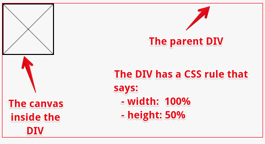

If the ssn exists in the object store, then the results are displayed in
the form itself (the code that gets the results and that updates the
form is in the request.onsuccess callback).


Here is the code added to that example:

```
1.  function searchACustomer() {
2.     if(db === null) {
3.       alert('Database must be opened first, please click the Create
4.              CustomerDB Database first');
5.       return;
6.     }
7.  
8.     var transaction = db.transaction(["customers"], "readwrite");
9.  
10.    // Do something when all the data is added to the database.
11.    transaction.oncomplete = function(event) {
12.      console.log("All done!");
13.    };
14. 
15.    transaction.onerror = function(event) {
16.      console.log("transaction.onerror errcode=" + event.target.error.name);
17.    };
18. 
19.    var objectStore = transaction.objectStore("customers");
20. 
21.    // Init a customer object with just the ssn property initialized
22.    // from the form
23.    <b>var customerToSearch={};</b>
24.    <b>customerToSearch.ssn = document.querySelector("#ssn").value;</b>
25. 
26.    alert('Looking for customer ssn=' + customerToSearch.ssn);
27. 
28.    // Look for the customer corresponding to the ssn in the object
29.    // store
30.    <b>var request = objectStore.get(customerToSearch.ssn);</b>
31. 
32.    request.onsuccess = function(event) {
33.      <b>console.log("Customer found" + event.target.result.name);</b>
34.      document.querySelector("#name").value=event.target.result.name;
35.      document.querySelector("#age").value = event.target.result.age;
36.      document.querySelector("#email").value
37.                                         =event.target.result.email;
38.    };
39.  
40.    request.onerror = function(event) {
41.      alert("request.onerror, could not find customer, errcode = " + 
                event.target.error.name + ".
42.             The ssn is not in the Database");
43.   };
44. }
```

The search is inititated at *line 30*, and the callback in the case of
success is request.onsuccess, *lines 32-38*. event.target with result as
the retrieved object (*lines 33 to 36*).

Well, this is a lot of code, isn't it? We can considerably abbreviate
this function (though, admittedly it won't take care of all possible
errors). Here is the shortened version:

```
1.  function searchACustomerShort() {
2.    db.transaction("customers").objectStore("customers")
3.  .get(document.querySelector("#ssn").value).onsuccess =   
4.     function(event) {
5.        document.querySelector("#name").value =
6.                                            event.target.result.name;
7.        document.querySelector("#age").value =
8.                                            event.target.result.age;
9.        document.querySelector("#email").value =
10.                                           event.target.result.email;
11.   }; // end of onsuccess callback
12. }
```

You can try it on JSBin: this [version of the online example using this
shortened version](https://jsbin.com/rifate) (the function is at the end
of the JavaScript code):

```
1.  function searchACustomerShort() {
2.     if(db === null) {
3.        alert('Database must be opened first, please click the Create
4.               CustomerDB Database first');
5.        return;
6.     }
7.  
8.     db.transaction("customers").objectStore("customers")
9.       .get(document.querySelector("#ssn").value)
10.      .onsuccess = 
11.        function(event) {
12.           document.querySelector("#name").value =
13.                                      event.target.result.name;
14.           document.querySelector("#age").value =
15.                                      event.target.result.age;
16.           document.querySelector("#email").value =
17.                                      event.target.result.email;
18.        };
19. }
```

<b>Explanations:</b>

-   Since there's only one object store, you can avoid passing a list of
    object stores that you need in your transaction and just pass the
    name as a string (*line 8*),

-   We are only reading from the database, so we don't need a
    "readwrite" transaction. Calling transaction() with no mode
    specified gives a "readonly" transaction (*line 8*),

-   We don't actually save the request object to a variable. Since the
    DOM event has the request as its target we can use the event to get
    to the result property (*line 9*).

### Second method: getting more than one piece of data

#### Getting all of the data from the datastore: using a cursor

Using get() requires that you know which key you want to retrieve. If
you want to step through all the values in your object store, or just
between those in a certain range, then you must use *a cursor*.

Here's what it looks like:

```
1.  function listAllCustomers() {
2.     var objectStore =   
3.       db.transaction("customers").objectStore("customers");
4.  
5.     <b>objectStore.openCursor().onsuccess </b>= function(event) {
6.       // we enter this callback for each object in the store
7.  
8.       <b>// The result is the cursor itself</b>
9.       <b>var cursor = event.target.result;</b>
10. 
11.      if (cursor) {
12.        alert("Name for SSN " +<b> cursor.key </b>+ " is " +
13.               <b>cursor.value.name</b>);
14.        // Calling continue on the cursor will result in this callback
15.        // being called again if there are other objects in the store
16.        <b>cursor.continue();</b>
17.      } else {
18.        alert("No more entries!");
19.      }
20.   }; // end of onsuccess...
21. } // end of listAllCustomers()
```

[You can try this example on JSBin](https://jsbin.com/xetumu).

It adds a button to our application. Clicking on it will display a set
of alerts, each showing details of an object in the object store:


The openCursor() function can take several (optional) arguments.

-   First, you can limit the range of items that are retrieved by using
    a key range object - we'll get to that in a minute.

-   Second, you can specify the direction that you want to iterate.

In the above example, we're iterating over all objects in ascending
order. The onsuccess callback for cursors is a little special. <b>The
cursor object itself is the result property of the request</b> (above
we're using the shorthand, so it's event.target.result). Then <b>the
actual key and value can be found on the key and value properties of the
cursor object</b>. If you want to keep going, then you have to
call cursor.continue() on the cursor.

When you've reached the end of the data (or if there were no entries
that matched your openCursor() request) you still get
a success callback, but the result property is undefined.

One common pattern with cursors is to retrieve all objects in an object
store and add them to an array, like this:

```
1.  function listAllCustomersArray() {
2.    var objectStore =   
3.        db.transaction("customers").objectStore("customers");
4.  
5.    var customers = []; // the array of customers that will hold
6.                        // results
7.  
8.    objectStore.openCursor().onsuccess = function(event) {
9.      var cursor = event.target.result;
10. 
11.     if (cursor) {
12.       customers.push(cursor.value); // add a customer in the
13.                                     // array
14.       cursor.continue();
15.     } else {
16.       alert("Got all customers: " + customers);
17.     }
18.  }; // end of onsuccess
19. } // end of listAllCustomersArray()
```

[You can try this version on JSBin](https://jsbin.com/bitoqa).

#### Getting data using an index

Storing customer data using the ssn as a key is logical since
the ssn uniquely identifies an individual. If you need to look up a
customer by name, however, you'll need to iterate over every ssn in the
database until you find the right one.

Searching in this fashion would be very slow. So instead we use *an
index*.

Remember that we defined two indexes in our data store:

1.  one on the name (non-unique) and

2.  one on the email properties (unique).

Here is a function that examines by name the person-objects in the
object store, and returns the first one it finds with a name equal to
"Bill":

```
1.  function getCustomerByName() {
2.     if(db === null) {
3.       alert('Database must be opened first, please click the Create
4.              CustomerDB Database first');
5.       return;
6.     }
7.  
8.     var objectStore =   
9.        db.transaction("customers").objectStore("customers");
10. 
11.    <b>var index = objectStore.index("name");</b>
12. 
13.    <b>index.get("Bill").onsuccess </b>= function(event) {
14.       alert("Bill's SSN is " + <b>event.target.result.ssn </b>+
15.             " his email is " + <b>event.target.result.email</b>);
16.    };
17. }
```

The search by index occurs at *lines 11 and 13*: *line 11* creates an
"index" object that corresponds to the "name" property. *Line 13* calls
the get() method on this index-object to retrieve all of
the person-objects from the dataStore which have a name equal to "Bill".

[Online example you can try at JsBin](https://jsbin.com/gituxa)


The above example retrieves only the first object that has a name/index
with the value="Bill". Notice that there are two "Bill"s in the object
store.

<b>Retrieving more than one result when using an index</b>

In order to get all the "Bills", once again we have to use *a cursor*.

When we work with indexes, we can open two different types of cursors on
indexes:

```
1.  <b>A normal cursor</b> which maps the index property to the object in the object store, or,
2.  <b>A key cursor</b> which maps the index property to the key used to store the object in the object store.
```

The differences are illustrated below.

Normal cursor:

```
1.  <b>index.openCursor().onsuccess </b>= function(event) {
2.    <b>var cursor = event.target.result;</b>
3.    if (cursor) {
4.      // cursor.key is a name, like "Bill", and <b>cursor.value is  the</b>
5.      // <b>whole object.</b>
6.      alert("Name: " +<b> cursor.key </b>+ ", SSN: " +<b> cursor.value.ssn </b>+ ",
7.             email: " +<b> cursor.value.email</b>);
8.      <b>cursor.continue();</b>
9.  }
10. };
```

Key cursor:

```
1.  <b>index.openKeyCursor().onsuccess </b>= function(event) {
2.     var cursor = event.target.result;
3.     if (cursor) {
4.       // cursor.key is a name, like "Bill",<b> and cursor.value is the</b>
5.  <b>     </b>//<b> SSN (the key)</b>.
6.       // No way to directly get the rest of the stored object.
7.       alert("Name: " + cursor.key + ", "SSN: " + <b>cursor.value</b>);
8.       cursor.continue();
9.     }
10. };
```

Can you see the difference? 

You can try [an online example at JSBin that uses the above
methods](https://jsbin.com/kubuwof):

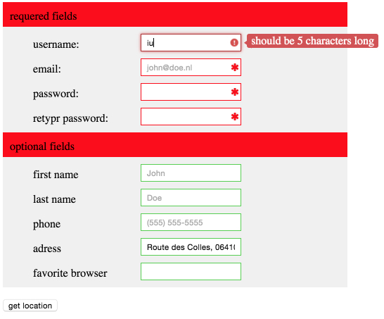

How to try this example:

1.  Press the create/Open CustomerDB database,

2.  Add some more customers,

3.  Then press the last button "look for all customers with name=Bill
    ...". This will iterate over all the customers in the object store
    whose name is equal to "Bill". There should be two "Bills", if this
    is not the case, add two customers with a name equal to "Bill", then
    press the last button again.

Source code extract from this example:

```
1.  function getAllCustomersByName() {
2.    if(db === null) {
3.      alert('Database must be opened first, please click the Create
4.             CustomerDB Database first');
5.      return;
6.    }
7.  
8.    var objectStore =
9.       db.transaction("customers").objectStore("customers");
10. 
11.   <b>var index = objectStore.index("name");</b>
12. 
13.   // Only match "Bill"
14.   <b>var singleKeyRange = IDBKeyRange.only("Bill");</b>
15. 
16.   <b>index.openCursor(singleKeyRange).onsuccess </b>= function(event) {
17. 
18.     var cursor = event.target.result;
19. 
20.     if (cursor) {
21.       // cursor.key is a name, like "Bill", and cursor.value is the
22.       // whole object.
23.       alert("Name: " + cursor.key + ", SSN: " + cursor.value.ssn ",
24.              + email: " + cursor.value.email);
25.       cursor.continue();
26.    }
27. };
28. }
```

<h3 id="ch3-6-11">3.6.11 Limiting the range of values in a cursor</h3>

How to specify the range and direction of cursors with IndexedDB?

It is possible to use a special object called IDBKeyRange, for
"IndexedDB Key Range", and pass it as the first argument
to openCursor() or openKeyCursor(). We can specify the bounds of the
data we are looking for, by using methods such as upperBound() or
lowerBound(). The bound may be "closed" (i.e., the key range includes
the given value(s)) or "open" (i.e., the key range does not include the
given value(s)). 

Let's look at some examples ([adapted from this MDN
article](https://developer.mozilla.org/en-US/docs/Web/API/IndexedDB_API/Using_IndexedDB#Specifying_the_range_and_direction_of_cursors)):

```
1.  // Only match "Donna"
2.  var singleKeyRange = IDBKeyRange.only("Donna");
3.   
4.  // Match anything past "Bill", including "Bill"
5.  var lowerBoundKeyRange = IDBKeyRange.lowerBound("Bill");
6.   
7.  // Match anything past "Bill", but don't include "Bill"
8.  var lowerBoundOpenKeyRange = IDBKeyRange.lowerBound("Bill", true);
9.   
10. // Match anything up to, but not including, "Donna"
11. var upperBoundOpenKeyRange = IDBKeyRange.upperBound("Donna", true);
12.  
13. // Match anything between "Bill" and "Donna", but not including "Donna"
14. var boundKeyRange = IDBKeyRange.bound("Bill", "Donna", false, true);
15.  
16. // To use one of the key ranges, pass it in as the first argument of openCursor()/openKeyCursor()
17. index.openCursor(boundKeyRange).onsuccess = function(event) {
18.     var cursor = event.target.result;
19.     if (cursor) {
20.         // Do something with the matches.
21.         cursor.continue();
22.     }
23. };
```

### Complete example

Adapted from an example on gitHub, today no more available ([original
URL](https://github.com/mdn/IDBKeyRange-example/blob/gh-pages/index.html)):

Try [the online example at JsBin](https://jsbin.com/lawaju/edit) (enter
"Gaming", "Batman" etc. as key range values):

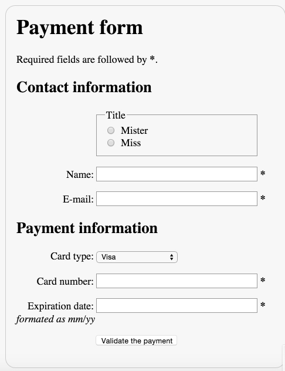


<h3 id="ch3-6-12">3.6.12 Discussion and projects</h3>

Here is the discussion forum for this part of the course. Please post
your comments/observations/questions and share your creations.

### Suggested topics of discussion:

-   IndexedDB is certainly the most complex API presented in this
    course. However, using it is rather simple once you've climbed the
    learning curve. If you have prior experience with databases, can you
    tell your feelings in the forum?

-   If you found handy tools for using IndexedDB, or other external
    tutorials and examples, please share!

### Optional projects:

-   Start from the examples provided in the IndexedDB course and adapt
    them in order to manage a database of the HTML5 interactive examples
    (also provided in this course). For example, objects stores in the
    datastore may be composed of:

    -   the jsbin.com URL of the example,

    -   a description,

    -   the name of the week in which the example has been presented,
        and,

    -   the name of the lesson in the chapter,

    -   eventually, a screenshot for the example (URL, or if you are a
        bit of a geek, image content).

<!-- -->

-   Produce an HTML page which contains your application. When loaded,
    it must populate the indexedDB database with at least 10 different
    examples, and display them in a table or in a list. The GUI must
    also provide a search form for retrieving all the examples from a
    given chapter. 

## Conclusion

The two W3Cx courses, [HTML5 Coding Essentials and Best
Practices](https://www.edx.org/course/html5-coding-essentials-and-best-practices) and
this one (HTML5 Apps and Games), have covered a lot of material, and you
may have trouble identifying which of the different techniques you have
learned best suit your needs.

To sum up:

-   <b>If you need to work with transactions</b> (in the database sense:
    protect data against concurrent access, etc.), or do some searches
    on a large amount of data, if you need indexes, etc., <b>then use
    IndexedDB</b>

<!-- -->

-   <b>If you need a way to store simple strings or JSON objects, then
    use localStorage/sessionStorage</b>. *Example*: store HTML form
    content as you type, store a game's hi-scores, preferences of an
    application, etc.

-   <b>If you need to manipulate files (read or download/upload), then
    use the File API and XHR2.</b>

-   If you need to manipulate a file system, there is a FileSystem and a
    FileWriter API which are very poorly supported and will certainly be
    replaced in HTML 5.1. We decided not to discuss these in the course
    because they lack agreement within the community and browser
    vendors.

-   If you need an SQL database client-side: No! Forget this idea,
    please! There was once a WebSQL API, but it disappeared rapidly.

> <b>Note that the above points may be used in any combination</b>: you may
> have a Web app that uses localStorage and IndexedDB to cache its
> resources so that it can run in offline mode.

### External resources

-   You might be interested by [the Cache
    API](https://developers.google.com/web/fundamentals/instant-and-offline/web-storage/cache-api) to
    make your application data available offline (in other terms: making
    your Web page or your Web app. available offline). 

<!-- -->

-   Read also [this article that covers all different options for
    storing data in the browser and gives another look at what has been
    presented in this chapter of the
    course](https://web.dev/storage-for-the-web/).

## Module 4. Web Components and other HTML5 APIs

Hi! This is the final week of the course! And this time we will look at
what the future holds by presenting you the Web components. This is a
set of specifications that will allow you for the creation of reusable
components and widgets in your Web documents and in your Web
applications.

Today, if you’re looking for an enhanced calendar or an enhanced video
player, or component that will vocalize what you type for example, you
need to include lots of JavaScript and CSS.

You need to look for some code written by somebody on the Web and read
documentation, and reusing it is rather complex. With Web components, it's as easy as
importing in an HTML5 another HTML5, that defines all the plumbery for creating
the new components.

And it also defines custom elements. For example, you import a
super-calendar

in HTML5 in your document and then you just use « < « mysupercalendar »
> ». It’s just a custom

HTML element and hop! As easy at it sounds, you've got a custom calendar
in your document.

The goal of Web components is to reduce complexity by isolating a
related group of HTML, CSS, and JavaScript in an HTML5 you import to
perform a common function within the context of a single page.

As such, Web Components are nicer, cleaner, and easier to use than, for
example, jQuery plugins that are really popular today. In this week, you
will learn how to use existing components and how to write your own
components.

Finally, I would like to thank you all for sharing your creations in the
forum. It has always been a great pleasure to try them, and also
interacting with the students is really what makes me happy. I hope you
enjoyed the course and see you maybe for a next one on W3Cx. Bye-bye!

<h3 id="ch4-2-1">4.2.1 Web components in video</h3>

Hi! Today, I am going to talk about Web components, that are reusable
widgets.

You need an animated gif player with lots of options? Don't worry, just
add this line of code in your HTML file! It’s a custom HTML element
(that is valid) and you will have an animated gif renderer in your Web
page. And you will have also tons of options for setting the speed,
making it loop and so on. So, how can you use this custom element?

This is brand new: you will import an HTML file in your HTML document!
The same way you import a CSS style sheet. So, the principle of Web
components is this one: import an HTML file that will come with HTML,
CSS and JavaScript code encapsulated, and then you can reuse it. Let's
see an example: we will add an animated gif player in our Web page.

If you go to webcomponents.org, you’ve got links to some repositories. I
use customElements.io, look for « animated gif » and find this x-gif Web
component. So here is the demo page… you can also click directly on the
page that presents the element in the gallery.

Here, it says: ‘OK you want to use it? download the ZIP’. I download a
ZIP file, uncompress it, and then I’ve got the x-gif distribution.

If you read the README, it says that the components you need to use are
located in the « dist » directory.

I prepared a nearly empty Web page:

I just included a polyfill for Web components and prepared some headings
for the Web components I am going to use.

We can try this page… here is how it renders.

I downloaded the ZIP file for the animated gif, and if you read the
README, it says that the component you need to use is located in the
dist directory.

Let's copy this in the same directory as my HTML page and I rename it
x-gif.

Now, in my example.html file, I will import the Web component.

And for that, I just read the documentation that says that to use x-gif,
you need to import the x-gif.html file. So let's add it to our Web page.

And you remember that I put it in the x-gif directory.. and I will copy
just an example (of x-gif use).

Let's copy this one that has a ping pong effect with the animation, it
plays it back and forth.

I save, and I reload my page, and now I’ve got an animated gif.

If I want to use another component for speech synthesis, I do the same
thing.

I go to the webcomponent.org Web site, go to customElements.io
repository and I look for custom Web components that can do speech
synthesis.

Let's try with this one: ‘voice-elements’.

The same thing: I download the ZIP, I look inside the ZIP… ‘voice
elements’.

If I read the documentation, I will see that the elements I need to
import (the HTML files I need to import) are located in the src
directory.

I copy it to my directory, and I rename it ‘voice’. Then I can read the
documentation.

I need to import voice-player and if I wanted to use voice recognition I
would import this one… I add the import for this voice-player, and then
I can look at the demonstration and at the documentation.

I prepared something already… This is just a voice-player element that
will say an ‘Hi!’ sentence to you my students and I added a button.

When I click on the button it will call the speak method from this Web
component.

Ok let's try it. Reload. Now, I’ve got the button and listen! [Hi,
students from the HTML5 Part 2 course. A Web component is speaking]

That's all, you saw how you can reuse existing components.

Easy! Bye bye!

<b>Important note about the above text
video:</b> [webcomponents.org](https://www.webcomponents.org/) and
customelements.io have been merged in 2017!

The video uses the customelements.io Web site when searching for Web
Components. It has now been merged with
the [webcomponents.org](https://www.webcomponents.org/) Web Site. The
search field from webcomponents.org is equivalent to the search field
that was available on the customelements.io.

The zip file from the video is available for download in the section
below.

### Example from the video

You can download an archive of the example mentioned in the video
lecture
from: [VideoUsingWebComponents2020.zip](https://courses.edx.org/assets/courseware/v1/3d550fbef1593961559d28aa6e373d97/asset-v1:W3Cx+HTML5.2x+2T2020a+type@asset+block/VideoUsingWebComponents2020.zip)

You need to unarchive it in the Web server htdocs directory of your
WAMP/MAMP/LAMP http distribution, for example. Then open
the index.html file located in that directory.


<h3 id="ch4-2-2">4.2.2 Introduction</h3>

Web components provide a standard way to build your own
widgets/components using similar methods to those used by browser
developers to construct the <video>, <audio>, and <input
type="date"> elements, for example.

Web components enable you* to use custom HTML elements in your HTML
documents*, that render as complex widgets: a better-looking calendar,
an input text with vocal recognition, a nice chart, etc.

Let's start with an example! This code...:

1.  <x-gif src="https://i.imgur.com/iKXH4E2.gif" ping-pong></x-gif>

... renders an animated GIF, and it loops forever in ping-pong mode: the
order of the animation is reversed when the last image is reached and
again when the animation goes back to the first image.


Click on the image to run the animated GIF demo, or visit [this Web
site](https://geelen.github.io/x-gif/#/https://i.imgur.com/iKXH4E2.gif).

If you look at the source of the demo page, you note the following at
the top of the page:

1.  <link rel="import" href="dist/x-gif.html">

It's called an "HTML import". If your browser supports *HTML imports*,
you can now import *another HTML document, *that will come with its own
HTML, CSS, and JavaScript code-base, into your HTML page . The code
for the animated GIF player, rendered when the browser encounters
the* custom HTML element* <x-gif>,  is located in the imported HTML
file (and this HTML file can in turn include or define CSS and
JavaScript content).

Even more impressive: if you use the devtools or the right click context
menu to view the source of the page, you will not see the DOM of this
animated GIF player:


...*and your document will still be valid.* Looking at the source code
or at the DOM with the devtool's inspector will not reveal the source
code (HTML/JavaScript/CSS) used for creating it.

### Web components availability

There are already hundreds of Web components made by others that you can
use. On the [webcomponents.org](https://www.webcomponents.org/) Web
site, you will find lots of them. Usually, you need to import the HTML
file that defines the components you want to use, and [maybe also a
polyfill ](https://www.webcomponents.org/polyfills)if you want to use
them with browsers that do not yet support Web Components.

*Example*: let's go to the the [Web Components Web
site](https://www.webcomponents.org/).

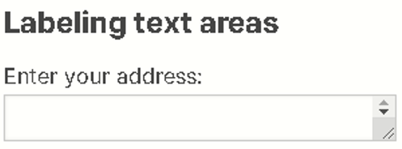

We then search for Web components tagged with the "voice" tag and find
input fields with voice recognition, and a text area that could vocalize
the text:

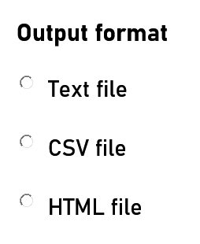

Now, please try a [demonstration of this
component](https://zenorocha.github.io/voice-elements)!

As you see, re-using Web components is easy :-)

Notice that Google, with its [Polymer
project](https://www.polymer-project.org/) and Mozilla, with its [X-Tag
library](https://x-tag.github.io/), also offer huge sets of
components for creating rich UIs with a common look and feel.

### Current support

#### Web components are built on four different APIS

In this lesson, we are talking about "Web components". Note that this is
not a single API - rather it's what we call an "umbrella API", <b>built
on top of 4 W3C specifications, </b>which are going to be detailed
in subsequent lessons.

The main W3C Web Components resource is
on [GitHub](https://github.com/w3c/webcomponents):

1.  [The HTML Templates
    specification](https://www.w3.org/TR/html-templates/)

2.  [The Shadow DOM
    specification](https://www.w3.org/TR/shadow-dom/) (Working Group
    Note, part of the DOM specification) - see also this MDN's
    documentation "[Using shadow
    DOM"](https://developer.mozilla.org/en-US/docs/Web/Web_Components/Using_shadow_DOM)

3.  The Custom Elements specification is being incorporated into the W3C
    DOM specification and the WHATWG DOM Standard, the W3C HTML
    specification and the WHATWG HTML Standard, and other relevant
    specifications. Please check the W3C [Web Components
    repository](https://github.com/w3c/webcomponents/) for continuing
    discussions about this subject.

4.  [The HTML Imports
    specification](https://w3c.github.io/webcomponents/spec/imports/) (HTML
    imports have been deprecated, see further material in this chapter)

You can check the current support for these APIs here: [Microsoft Edge's
Web
Components](https://developer.microsoft.com/en-us/microsoft-edge/platform/status/?q=webcomponents) and
on CanIuse:

-   HTML templates are supported by nearly all modern browsers,
    including mobile browsers (see also this support
    table [online](https://caniuse.com/#feat=template)).

-   Shadow DOM v1 is supported by Chrome and Opera, and FireFox/Safari
    offers partial support (see
    also [online](https://caniuse.com/#feat=shadowdomv1)).

-   Custom Elements is supported by Chrome and Opera, and FireFox/Safari
    offers partial support. Edge is implementing them (see
    also [online](https://caniuse.com/#feat=custom-elementsv1)).

-   HTML Imports is deprecated, but can be used with polyfills . A new
    way to import Web Components using JavaScript imports is under
    consideration. More about that in the "HTML imports" material later
    on.

HTML imports have been replaced by a more standard way involving
JavaScript imports
(see [discussions](https://github.com/w3c/webcomponents/blob/gh-pages/proposals/HTML-Imports-and-ES-Modules.md)).

<h3 id="ch4-2-3">4.2.3 HTML templates</h3>

Hi! In this lesson, I am going to talk about the template API. You must
know that Web components are what we call ‘an umbrella API’ that is
built on four W3C specifications.

One is the template specification about how to make HTML code that will
be duplicated each time you will need to create a new widget. It is a
sort of ’inert code’: if it includes videos they will not be played; if
it includes JavaScript, it will not be executed, until you clone this template and add it to your document.

The other APIs we will present in the course are the shadow DOM
specification that will make encapsulations. In other words, it will hide the JavaScript,

the HTML and the CSS from your widget to the external world. If you do
’view source’ in a page, you will not see anything. And if you use CSS in your
document, it will not cross the boundaries of the different Web components.

The two last APIs are much more simpler. One is for designing custom
elements like the x-gif Web component element we saw in the previous lesson.

You will add new custom elements and the browser will render them.

The last one enables the browser to import in an HTML document another
HTML document.

Here is a small example that defines a template. So you define a
template using a template element, and usually you give it an id because you will use this id from
JavaScript in order to clone its content and to add it to the document.

So, this code is not rendered: it is just a skeleton. And this skeleton,
we are going to work with it from JavaScript! In order to clone a template and make
it live, we need first to select it: document.querySelector('#mytemplate') (we
select the template with the given id), then we can complete its
content.

I told you this is a skeleton: in that case it is an image with a
caption, and the src attribute of the image is kept empty in the
skeleton.

We can set it from the template object we got in JavaScript. The
’t.content’ property corresponds to the DOM of the template.

We can use querySelector to select an image in the template and set its
src to the HTML5 logo (URL).

Once we completed the content of the template, we can clone it using
‘document.importNode’.

The last parameter ‘true’ means deep cloning.

We can have templates that includes templates, and so on.

And then once you cloned the content of the template, you add it to the
document: ‘document.body.appendChild’, with the cloned template, will do that. 

Let's try it, I put a button in the document that calls the instantiate function from JavaScript, that does all the
different steps I detailed just earlier. If I click on the button, it
will add all the HTML code from the template, and I can do that as many
times as I want.

This instantiation process is how we create a new skeleton for our
future Web components.

I hope you liked this video. Bye! Bye!

HTML templates are an important building-block of Web components. When
you use a custom element like <x-gif....>, the browser will (before
rendering the document) clone and add  some HTML/CSS/JS code to your
document, thanks to the HTML template API that is used behind the
scenes.

HTML templates define fragments of code (HTML, JavaScript and CSS
styles) that can be reused.

These parts of code are<i> inert</i> (i.e., CSS will not be applied,
JavaScript will not be executed, images will not be loaded, videos will
not be played, etc.) until the template is used.

Here is an example of code that defines a template:

```
1.  <template id="mytemplate">
2.     
3.     <div class="comment"></div>
4.  </template>
```

Note that it's ok to have the <b>src</b> attribute empty here, we will
initialize it when the template is activated.

### To use a template, clone its content!

A template has "content" (the lines of code
between &lt;template&gt; and &lt;/template&gt;), and to manipulate it we use the
DOM API and the content attribute of the DOM node that corresponds to a
given template (<i>line 3</i> of the source code example below).

In order to use a template's content, we clone it using
the document.importNode(templateContent, true) method, where the node is
the template's content and true means "deep copy" the content.

A template is typically used like this:

```
1.  var t = document.querySelector('#mytemplate');
2.  // Populate the src at runtime.
3.  t.content.querySelector('img').src = 'https://webcomponents.github.io/img/logo.svg';
4.  
5.  // Clone the template, sort of "instantiation"!
6.  var clone = document.importNode(t.content, true);
7.  document.body.appendChild(clone);
```

<h4>Explanations</h4>:

-   In this example, <i>line 1</i> assigns the DOM node corresponding to the
    template we defined to variable t.

-   t.content (<i>line 3</i>) is the root of the subtree in the template (in
    other words, the lines of HTML code inside the template element)

-   Note that we set the value of the src attribute of the image inside
    the template at <i>line 3</i>, using a CSS selector on the template's
    content.

-   <i>Lines 5 and 6</i> clone the template's content and add it to
    the &lt;body&gt; of the document.

### Example

Here is [an online example at JSBin](https://jsbin.com/dozele/edit) that
uses exactly the code presented:


And here is the complete source code...

The HTML part:

1.  <template id="mytemplate">

2.     

3.     <div class="comment">hello</div>

4.  </template>

5.  

6.  <body>

7.     <button onclick="instantiate()">Instantiate the
    template</button><br>

8.  </body>

The JavaScript part:

1.  function instantiate() {

2.     var t = document.querySelector('#mytemplate');

3.     // Populate the src at runtime.

4.     t.content.querySelector('img').src =

5.                  'https://webcomponents.github.io/img/logo.svg';

6.  

7.     var clone = document.importNode(t.content, true);

8.     document.body.appendChild(clone);

9.  }

## 4.2.4 Shadow DOM

Hello! Let's talk about the shadow DOM. What is the

Shadow DOM? Let's first look at a video. You know the

video element, we already used many times in this course.

If you look at the source of the video element, or if you try to select
it using the devtools,

you can only select it at once, you can't select individually the
buttons, or the progress

element, and so on. Look at the video, you see the video controls,

autoplay, source elements, and so on. But you can’t look at the
internals because

this video is a Web component. Web components have been used by browser
developers before

the APIs went public. You can enable in the settings (I am using

Google Chrome here), you can enable the visualization of the user agent
shadow DOM.

When this option is enabled, then you will see a shadow root in the
debugger, when you

look for a Web component. This time, if I open the shadow root in the
debugger, and if

I move the inspector, I can see how the Web component is made. I

can see its internals. I can look at the play button for example.

The shadow DOM is a way to hide HTML code from the end user. If you do
‘view source’,

you will not see how a Web Component is made, except if you set the
correct debugging settings option.

More than that, the Web component may include

some CSS files and the CSS of the Web component will only apply to its
own elements.

Let's look at an example. Here, we(ve got a button that is called ‘a
shadow host’.

This is our Web component. For the moment we are not using custom
elements, we are just

associating a shadow DOM with the button element here.

This one is called ’the host’, and as you can see it is not rendered
because it

has a shadow DOM. So, the way we add a shadow DOM to an element

is that we first select the host, and then we create a shadow root.

Once you got the shadow root, you can start adding content in this node,
in order to make

the shadow DOM. So here, ‘root.textContent’ will add this text

to the shadow DOM and if you look at the button, this is the text that
is rendered: ’Hello’.

If I inspect this element using the devtools, I will see a button, and a
shadow root associated.

In another example in the course, we will talk about templates and
shadow DOM.

Instead of adding just text in the shadow DOM using textContent or
innerHTML, we can

clone a template. So in this example, I’ve got a template

that contains a ‘H1’. This is a ‘shadowed H1’ and some CSS style defined
in the template.

When I create the root element for the shadow DOM, I can append the
cloned code of

the template. In this case I have got a skeleton: the template.

I instantiate it and I add it to the shadow DOM.

Look at the result here! I have got my host (that is a ‘H1’), and if I

type things it is not rendered. What is rendered is the content here of
the template

I instantiated. And this template contains an ‘H1’ that is white on red.

But look: I have got a global CSS that says that all ‘H1s’ must be
green, and this one is

not affected, it does not cross the boundaries of the Web component.

The same thing is true for the style in the Web component, that says
that all ‘H1s’ must be

white on red, and it does not affect the ‘H1’ in the page.

I added an ‘H1’ that is not associated with the shadow DOM and this one
is impacted by

the normal CSS style that says that the color is green for each ‘H1’.
This one is green but

not the once inside the shadow DOM. So it is good for encapsulation: you
can protect

your widget (your Web component) so that external CSS will not affect
it.

In the next lesson, we will see how we can allow some style to cross the
boundaries,

but under control. This is all for this video! Bye! Bye!

The Shadow DOM API provides DOM encapsulation: it serves to hide what is
not necessary to see!

If you are new to programming or object-oriented terminology you may
find these references a helpful start:

1.  [Wikipedia offers a
    description](https://en.wikipedia.org/wiki/Encapsulation_(computer_programming)) especially
    of the "information hiding" aspect

2.  MDN offers a [tutorial in programming JavaScript
    objects](https://developer.mozilla.org/en-US/docs/Learn/JavaScript/Objects)

It is not obvious but the Shadow DOM API is already used by browsers'
developers for <audio> or <video> elements, and also for the
new <input type="date">, <input type="color"> elements, etc.

<b>The three rules of Shadow DOM:</b>

1.  With Shadow DOM, elements are associated with a new kind of node: *a
    shadow root*.

2.  An element that has a shadow root associated with it is called *a
    shadow host*.

3.  *The content of a shadow host isn’t rendered; the content of the
    shadow root is rendered instead.*

NB: Because other browsers do not offer the tool-set, all of the
examples we discuss on this subject use Google Chrome or Chromium.

### Example using the Shadow DOM: the <video> element

Let's have a look at a simple <video> element.

Open [this JSBin example](https://jsbin.com/mojoqaw/edit?html,output) in
your browser, and fire up the devtools console (F12 on Windows/Linux,
Cmd-Alt-i on Mac OS):

Click on the "Elements" tab in the devtools, or use the magnifying glass
and click on the video, to look at the the DOM view of the video
element. You will see the exact HTML code that is in this example, but
you cannot see the elements that compose the control bar. You don't have
access to the play button, etc.


Let's take a look behind the scenes, and see the Shadow DOM associated
with the <video> element.

First, click on the Settings icon (three vertical dots) and select
Settings in the drop down menu:


Then scroll down until you see the "Show user agent shadow DOM" option
and check it. Close the panel.


Now, look for the video element again and within the DOM view you should
see something new:


Open this shadow root by clicking on it, and move the mouse pointer over
the different elements:


Chrome developers are already using the shadow DOM to define their own
Web Components, such as <video> or <audio> elements! And they use
the Shadow DOM to hide the internal plumbing.

Furthermore, there is a kind of "boundary" around the <video> element,
so that external CSS cannot interfere. The content of
the <video> element is *sandboxed* (protected from external CSS
selectors, for example, or cannot be accessed
using document.querySelector(), nor inspected by default, using a DOM
inspector). Find further reading on the [concept of
sandboxing](https://en.wikipedia.org/wiki/Sandbox_(computer_security)).

> Browser developers have been using Web Components for a while, and now
> it's available to every Web developer!

### Another simple example

Let's have a look at a very simple example:

1.  <div>Hello this is not rendered!</div>

2.  <script>

3.      // the div is the Shadow Host. Its content will not be rendered

4.      var host = document.querySelector('div');

5.  

6.      // Create the shadow ROOT, the root node of the shadow DOM

7.      // using mode:open makes it available, mode:close would return
    null

8.      const shadowRoot = host.attachShadow({mode: 'open'});

9.  

10.     // insert something into the shadow DOM, this will be rendered

11.     shadowRoot.innerHTML = '<h1>Hello Shadow DOM</h1>'; // Could
    also use appendChild().

12. </script>

*Lines 8 and 11* show how to associate a shadow root with an existing
HTML element. In this example, the <div> defined at* line 1* is a
shadow host, and it is associated with the shadow root which
contains three words of text (*line 11*).


This example illustrates the three rules of the shadow DOM. Let's look
at them again:

#### <b>The three rules of Shadow DOM:</b>

1.  With Shadow DOM, elements are associated with a new kind of node: *a
    shadow root*.

2.  An element in the HTML which has a shadow root associated with it is
    called *a shadow host*.

3.  *The content of a shadow host doesn’t appear; the content of the
    shadow root is rendered instead.*

And indeed, the above example (try [the online version here at
JSBin](https://jsbin.com/peyuxuq/edit?html,console,output)) renders the
content of the shadow root, not the content of the button. In the online
example, try to change the text of the div (*line 1*), and you will
notice that nothing changes. Then modify the text at *line 11* and
observe the result


## 4.2.5 Shadow DOM: encapsulate code

By mixing templates and the shadow DOM, it is possible to hide a
template's content by embedding it in the shadow root. In this scenario,
it's easy to encapsulate CSS styles and/or JavaScript code so that it
will affect <b>only</b> the content of the shadow root. Conversely,
external CSS will not apply inside the shadow root.

This is an important feature: the content of a new "widget" that is
hidden in a shadow root is protected from external CSS, scripts, etc.

### An example that mixes templates and shadow DOM

HTML part:

1.  <template id="mytemplate">

2.     <style>

3.       h1 {color:white; background:red}

4.     </style>

5.     <h1>This is a shadowed H1</h1>

6.  </template>

The JavaScript part:

1.  // Instanciate the template

2.  var t = document.querySelector('#mytemplate');

3.   

4.  // Create a root node under our H1 title

5.  var host = document.querySelector('#withShadowDom');

6.   

7.  const shadowRoot = host.attachShadow({mode: 'open'});

8.  

9.  // insert something into the shadow DOM, this will be rendered

10. shadowRoot.appendChild(document.importNode(t.content, true));

[Online example at JSBin](https://jsbin.com/quguwa/edit?html,js,output):


Note that once again, the content shown is the shadow root + the styles
applied. The styles applied are those defined *in the template's
content* that has been cloned and put inside the shadow root.

NB a little bit of French squeezed past our filters. "Instanciate" in
French (and other languages) means "Instantiate" in English. We hope
you'll translate, as appropriate; but if you seek definitions or use the
word in web-searches, then the English spelling will help!

### Internal CSS does not apply outside the template/shadow DOM

The CSS inside the template will not affect any other H1 elements on the
page. This CSS rule (*lines 2-4* in the HTML part) will only apply to
the template's content, with no side-effects on other elements outside. 

Look at [this example at
JSBin](https://jsbin.com/jopabat/edit?html,css,js,output) that uses two
H1s in the document: one is associated  with a shadow root (defined in a
template with an embedded CSS that selects H1 elements and makes them
white on red); whereas the other is located in the body of the document
and is not affected by the CSS within the Web Component.

The HTML part:

1.  <template id="mytemplate">

2.     <style>

3.       h1 {color:white; background:red}

4.     </style>

5.     <h1>This is a shadowed H1</h1>

6.  </template>

7.  

8.  <body>

9.     <h1 id="withShadowDom">This is a text header</h1>

10. 

11.    <h1>Normal header with no shadow DOM associated.</h1>

12. </body>

We added a new H1 at *line 11*. 

And here is the result:


The second H1 is not affected by the CSS defined in the template used by
the first H1. Try to add this CSS rule to this example :

1.  h1 {

2.      color:green;

3.  }

And you should see something like that:


In which the "regular" CSS rule changed the color of the H1 located in
the body of the document, not the color of the H1 encapsulated in the
Shadow DOM.

## 4.2.6 Shadow DOM: insert content

Let's see how to insert content from the host element within the Shadow
DOM using slots.

It is possible to define a part of the template into which external HTML
content will be "injected". For this, we use
the <slot>...</slot> element, as shown below:

1.  <template id="mytemplate">

2.      <h1 part='heading'>This is a shadowed H1</h1>

3.      <p part="paragraph">

4.          <slot name="my-text">My default text</slot>

5.      </p>

6.  </template>

7.   

8.  <body>

9.  <h1 id="myWidget">

10.     <span slot="my-text">Injected content using slot elem</span>

11. </h1>

12. </body>

### <b>Explanations</b>:

-   Look at *line 4*, this is the "injection point"'!

-   And *line 10* is the content which will be injected into the
    template code. So, when the classic template instantiation and its
    addition to a shadow host node in the page is done, the HTML
    produced will contain "Injected Content" instead of <slot
    mname="my-text"></slot>.

### See [the complete online example at JSBin](https://jsbin.com/jepucoz/edit?html,js,output):


### External resources

-   An MDN article on "[Using templates and
    slots](https://developer.mozilla.org/en-US/docs/Web/Web_Components/Using_templates_and_slots)"

-   Medium articles:

-   "[Add Flexibility to Web Components With
    Slots](https://medium.com/better-programming/2020-008-add-flexibility-to-web-components-with-slots-c07ce2620952)"

-   "[Creating Web Components — Templates and
    Slots](https://levelup.gitconnected.com/creating-web-components-templates-and-slots-bd6905a7092a)"

## 4.2.7 HTML Custom elements

HTML Custom Elements is another API described as HTML Web components. It
allows you to extend HTML by defining new elements, and to tell the
browser how to render them.

### Basic usage:

1.  customElements.define('my-widget', MyWidget);

### This is done using JavaScript and there are some constraints:

1.  The element's new name should have a dash
    (ex: <my-calendar>, <app-list>, etc.)

2.  The second parameter is a JavaScript class object that defines the
    behavior of the element. See further examples.

Optionally, a third parameter can be used: a JavaScript object
containing an extends property, which specifies the built-in element
your element inherits from if any:

1.  customElements.define('my-widget', MyWidget, { extends: 'p' });

"Inheritance" is another aspect of object-oriented programming. If it is
new to you, please see earlier reference material.

Here is an example which defines a new element named <my-widget>, that
will render as an instance of a template with a shadow DOM:

### HTML code for the use of the custom element:

1.  <body>

2.  <my-widget>

3.     <span slot="my-title">Title injected</span>

4.     <span slot="my-paragraph">Paragraph injected</span>

5.  </my-widget>

6.  </body>

Look at *lines 2 *and* 5*...

HTML code for the declaration of the template (the same as in one of the
previous examples):

1.  <template id="mytemplate">

2.    <style>

3.      h1 {

4.        color:white;

5.        background:red;

6.      }

7.    </style>

8.    <h1>

9.      <slot name="my-title">My default text</slot>

10.   </h1>

11.   <p>

12.     <slot name="my-paragraph">My default text</slot

13.   </p>

14. </template>

### JavaScript code:

1.  // TIP : use "document.currentScript" here to select

2.  // the "local document", the one corresponding to this page.

3.  // this may avoid problems when multiple WebComponents files

4.  // are inserted in the same document. See below...

5.  var localDoc = document.currentScript.ownerDocument;

6.   

7.  class MyWidget extends HTMLElement {

8.    constructor() {

9.      super(); // mandatory

10.     const shadowRoot = this.attachShadow({mode: 'open'});

11. 

12.     // instanciate template

13.     let t = localDoc.querySelector('#mytemplate');

14.     // add it to the shadow DOM

15. 

16.     shadowRoot.appendChild(document.importNode(t.content, true));

17.   }

18. }

19.  

20. try {

21.   // Define the custom element to the browser

22.   <b>customElements.define('my-widget', MyWidget);</b>

23.   console.log("Element defined");

24. } catch (error) {

25.   console.log(error);

26. }

### <b>Explanations</b>: 

-   *Line 5: *we use this particular selector for safety. It means
    "select the element only in the HTML of the document that is
    attached to this JavaScript. Web Components might be included in
    other HTML pages, as we will see in the next pages of this course. A
    good practice is to select elements only in the HTML page of the Web
    Component, not in the document that will import the Web Component.

-   *Line 7*: definition of the Web Component class attached to the
    custom element <my-widget>

-   *Lines 8-17*:  the constructor definition for the class always
    starts by calling super() so that the correct prototype chain is
    established. Inside the constructor, we define all the functionality
    the element will have. Very often this starts by cloning a template
    in the Shadow DOM.

-   *Lines 22*: registration of a new custom element
    named <my-widget>. When the browser
    encounters <my-widget> within an HTML document, it will create an
    instance of the MyWidget class and render the shadow DOM of the Web
    Component.

### Full example

Now, we can use the newly created element and inject content.  The
template used here is the last one we studied in a previous lesson about
HTML templates. Check [the full example online at
JSBin](https://jsbin.com/cacuvuf/edit?html,js,console,output): 


### External resources

This lesson is only an introduction to custom elements. Here are a few
pointers for learners who would like to see how a custom element can
inherit from another custom element.

-   MDN article: [Using Custom
    Elements](https://developer.mozilla.org/en-US/docs/Web/Web_Components/Using_custom_elements)

-   From Google devs: [Custom Elements v1: Reusable Web
    Components](https://developers.google.com/web/fundamentals/web-components/customelements)

## 4.2.8 HTML Imports

### ****** Important note ****

As of 2020, HTML imports have been dropped, and there is no clear
replacing solution. While you can use polyfills to use existing
WebComponents that use them (like the ones from section 4.2.1 - the
component that displays animated GIFs, or the voice component), we
propose some ways to import WebComponents using JavaScript in the next
part of this chapter.

HTML imports have been implemented so far only by Google Chrome. But
Google announced that this feature is obsolete since Chrome 73. Although
it may still work in some browsers, its use is discouraged since it
could be removed at any time. Try to avoid using it!

The reason other browser vendors did not agree to implement them is the
merge of ES6 imports and modules. Mozilla, for example, do not want to
re-implement something that existed for its main features, covered by
ES6 modules (read this [discussion about HTML
imports](https://hacks.mozilla.org/2015/06/the-state-of-web-components/)).

When we created this course, Web Components were a hot topic and imports
were the only way to reuse external components. Many Web sites still use
them, such as YouTube. And Google itself is struggling to replace them,
as there is no easy way today to do something 100% equivalent to what
HTML imports does today.

There is also an interesting [discussion on the Chromium-dev mailing
list](https://groups.google.com/a/chromium.org/forum/#!msg/blink-dev/h-JwMiPUnuU/sl79aLoLBQAJ) about
how HTML imports should be replaced, and about what you can do today to
keep your applications working (you will note that I'm part of this
discussion too ;-) ).

So... is there a replacement for HTML imports today? The answer is
clearly NO. But <b>there are ways to still use HTML imports</b> or to use a
more complicated "JavaScript bundler". Also, the people at W3C working
on Web Components talk a lot about a future "HTML module" that would do
something similar to HTML imports, but this is not even in a
specification yet...

### Here is where we are:

-   <b>RECOMMENDED</b>: There is a polyfill for HTML imports that works
    very well. Just include it and your code that use HTML imports will
    work out of the box on recent browsers
    (see [ref.](https://github.com/webcomponents/html-imports#dynamic-imports)).
    We use it on our own applications and it works 100% with cascading
    imports, imports created dynamically, etc. Very solid.

-   <b>RECOMMENDED</b>: The above polyfill is also integrated in the "Web
    Component polyfill" that will also emulate other Web Components
    features (see webcomponentsjs). It is  the one used in the course's
    examples. This "global" polyfill has been made to make apps that use
    Web Components cross-browser compatible. If you have old Web
    Components code that use the version 0 of the APIs, you can use its
    v0 branch and your old code will work on modern browsers . There are
    also other alternative polyfills for each feature,
    like AshleyScirra’s  but we haven't tried these...

-   <b>WORKS BUT REQUIRES EXTRA WORK</b>: You can bundle the code of your
    Web Components into a single JavaScript file, using bundlers
    like [webpack](https://webpack.js.org/) or [parcel](https://parceljs.org/),
    then use JavaScript modules (<script type="module" src=...>). 
    This is what the Polymer 3 Web Component framework dev team did when
    they had to remove HTML imports. 

-   <b>MAYBE A FUTURE STANDARD WAY?</b> There is a lot of debate in W3C
    about future "HTML modules" that would do something close to HTML
    imports did, but while this topic has been under discussion since
    2017, it's still not even in a specification. See [the
    discussion.](https://github.com/w3c/webcomponents/blob/gh-pages/proposals/HTML-Imports-and-ES-Modules.md)

### If you want to know what HTML Imports were about...

HTML Imports is the simplest API from Web components :-)

Add a <link rel="import" href="your_html_file"> and all the
html/css/js code, that defines a Web component you plan to use, will be
imported:

-   It is similar to including CSS in your page!

-   Package your components into an HTML page (can include CSS, JS, etc)
    and import it!

It is as simple as:

1.  <head>

2.     <b> <link rel="import" href="components/myComponents.html"></b>

3.  </head>

4.  <body>

5.    <my-widget>

6.      <span slot="my-title">Title injected</span>

7.      <span slot="my-paragraph">Paragraph injected</span>

8.    </my-widget>

9.  </body>

Look at *line 2*: this is where the importation of the HTML, CSS and JS
code of new "components" is done. The HTML+JS+CSS code that defines
templates, attachment to a shadow host, CSS, and registering of new
custom HTML elements is located in myComponents.html.

You could create a my-widget.html file, add the HTML template and the
JavaScript code to that file, and import my-widget.html into your
document and use <my-widget>...</my-widget> from the last lesson
directly!

### External resource

-   MDN's documentation: [HTML
    Imports](https://developer.mozilla.org/en-US/docs/Web/Web_Components/HTML_Imports)

## 4.2.9 Web Components as JavaScript Modules

In the previous section, we said that the proposed way to import Web
Components, the so-called HTML Imports API, has been removed from the
standard. So.... how can you define a complete Web Component (HTML, CSS,
JavaScript) and use it in a HTML page or within the HTML of another
component?

Well, if you want to rely only on the Web languages (HTML/CSS/JS), you
will have to embed the HTML template part of your component, the CSS
part for the styling of your component, in the JavaScript part of your
component. Then, you will be able to include the JavaScript that defines
your Web Component, as a regular JavaScript file, using <script
src="yourComponent.js"></script> or using the new EcmaScript import
statement and import the file as a ES Module.

### Here is an example :

index.html (the host html page that imports and instantiates the Web
Components) :

```
1.  <!DOCTYPE html>
2.  <html lang="en">
3.  <head>
4.    <meta charset="UTF-8">
5.    <title>WebComponent as aJavaScript module</title>
6.  <b> 
    <script type="module" src="./mycomponent/index.js"></script></b>
7.  </head>
8.  <body>
9.    <b><my-component name="Michel Buffa"></my-component></b>
10. <b>  <my-component name="Marie-Claire Forgue"></my-component></b>
11. </body>
12. </html>
```

### <b>Explanations</b>:

-   *Line 6*: In this example, the Web Component is in a single
    JavaScript file (./mycomponent/index.js), that is imported as
    JavaScript module (<script type="module"....>).

-   *Lines 9 and 10*: it can then be used like any Web Component, by
    adding it with its custom HTML tag (<my-components>). The
    components have one HTML attribute "name".

### And here is the code of the Web Component (in ./mycomponent/index.js):

```
1.  customElements.define(
2.  "my-component",
3.  class extends HTMLElement {
4.      constructor() {
5.          super();
6.          this.root = this.attachShadow({ mode:  });
7.          this.name = this.getAttribute(); // get the "name" attribute
    value
8.      }
9.   
10.     connectedCallback() {
11.         // called when the component is added to the DOM of its host
12.         // css+html
13.         this.css = `
14.             #div_menu {
15.                 border : 1px solid black;
16.             }
17.             h1 {
18.                 color: red;
19.             }
20.         `;
21.         this.html = `
22.             <div id='div_menu'>
23.                 <h1>${this.name}
24.             </div>
25.         `;
26.         this.root.innerHTML = "<style>${this.css}</style><div
    id='wrapper'>${this.html}</div>";
27.     }
28. });
```

### <b>Explanations</b>:

-   *Line 1*: we call customElements.define and pass as the first
    parameter the name of the Web Component (here <my-component), and
    as a second parameter the JavaScript class that defines the Web
    Component. Instead of using the className, in this example, the
    class itself is embedded in the call to define(....).

-   *Line 10*: we used the connectedCallback method that is called
    automatically when  the component is created and connected to the
    DOM of its host. In this method we use [JavaScript template
    literals](https://developer.mozilla.org/en-US/docs/Web/JavaScript/Reference/Template_literals) to
    embed the HTML template of the component and its CSS associated
    style in the class properties this.html and this.css. This is a
    convenient way to define in a single line both the HTML and the CSS
    for the component (this is done in *line 26*).

-   Of course, we could have defined a more complex component. This
    simple example shows how we can embed the CSS and HTML template in
    the JavaScript code of the component.

<h3 id="ch4-2-10">4.2.10 Discussion and projects</h3>

Here is the discussion forum for this part of the course. Please post
your comments/observations/questions and share your creations.

### Suggested topics of discussion:

-   If you've followed the course, then you've visited
    the [webcomponents.org](https://www.webcomponents.org/) Web site and
    browsed some Web components galleries. Did you find any super cool
    components? Did you try them? Please share your findings in the
    forum!

-   What Web component would you like to use and could not find out of
    the box?

### Optional projects:

-   Try-out [these WebAudio control widgets that look incredibly
    good](https://github.com/g200kg/webaudio-controls) (I used them
    with [my Guitar Amp
    Simulator](https://mainline.i3s.unice.fr/AmpSim5/)). And use them in
    your audio player or other applications that would look cool with
    rotating knobs, switches, LEDs, etc.

-   

-   Try making your own Web component! For example: an enhanced audio
    player that uses Web Audio. 

-   How about building a <gamepad-tester> component which will display
    progress bars and the states of the different buttons/joysticks
    - reuse the example from the course! I couldn't find any Web
    component like this! Another challenge ;)

-   Try writing a small tutorial about reusing and customizing a super
    cool Web component you have found!

<h3 id="ch4-3-1">4.3.1 Introduction</h3>

In the browser, 'normal' JavaScript code is run in a single thread (a
thread is a light-weight CPU process, see [this Wikipedia page for
details](https://en.wikipedia.org/wiki/Thread_(computing))). This means
that the browser GUI, the JavaScript, and other tasks are competing for
processor time. If you run an intensive CPU task, everything else
is *blocked*, including the user interface. You have no doubt observed
something like this during your Web browsing experiences:

### With Internet Explorer:

# 

### Or maybe:


A solution for this problem, offered by HTML5, is to run certain
CPU-intensive tasks in separate threads from the one managing the
graphical user interface. So, if you don't want to block the user
interface, you can perform computationally intensive tasks in one or
more background threads, using the *HTML5 Web Workers*. Web Workers =
CPU threads, in JavaScript.

Terminology check: if the terms *background* and <i>foreground* and the
concept of <i>multi-tasking* are new to you, please review [PC Mag's
definition of foreground
and background](https://www.pcmag.com/encyclopedia/term/foregroundbackground).

### An example that does not use Web Workers

This example will block the user interface unless you close the
tab. [Try it at JSBin](https://jsbin.com/qipegi/edit?html,output) but DO
NOT CLICK ON THE BUTTON unless you are prepared to kill your
browser/tab, because this routine will consume 100% of CPU time,
completely blocking the user interface: 


<h4>Code from the example:</h4>

```
1.  <!DOCTYPE HTML>
2.  <html>
3.  <head>
4.  <title>Worker example: One-core computation</title>
5.  </head>
6.  <body>
7.  <button id="startButton">Click to start discovering prime
    numbers</button><p> Note that this will make the page
    unresponsive, you will have to close the tab in order to get back your CPU!
8.  <p>The highest prime number discovered so far is: <output id="result"></output></p>
9.  <script>
10.    function computePrime() {
11.       var n = 1;
12.       search: <b>while (true)</b> {
13.          n += 1;
14.          for (var i = 2; i <= Math.sqrt(n); i += 1)
15.          if (n % i == 0)
16.          continue search;
17.          // found a prime!
18.          document.getElementById('result').textContent = n;
19.       }
20.     }
21.    document.querySelector("#startButton").addEventListener('click', computePrime);
22. </script>
23. </body>
24. </html>
```

Notice the infinite loop in the function computePrime (<i>line 12</i>, in
bold). This is guaranteed to block the user interface. If you are brave
enough to click on the button that calls the computePrime() function,
you will notice that the *line 18* execution (that should normally
modify the DOM of the page and display the prime number that has been
found) does nothing visible. The UI is unresponsive. <i>This is</i> really,
really, bad JavaScript programming - and should be <b>avoided</b> at all
costs.

Shortly we will see a "good version" of this example that uses Web
Workers.

### Thread safety problems? Not with Web Workers!

When programming with multiple threads, a common problem is "thread
safety". This is related to the fact that several concurrent tasks may
share the same resources (eg JavaScript variables) at the same time. If
one task is modifying the value of a variable while another one is
reading it, this may result in some strange behavior. Imagine that
thread number 1 is changing the first bytes of a 4 byte variable, and
thread number 2 is reading it at the same time: the read value will be
wrong (1st byte that has been modified + 3 bytes not yet modified).

With Web Workers, the carefully controlled communication points with
other threads mean that it's actually very hard to cause concurrency
problems. There's no access in a worker to non-thread safe components or
to the DOM. We must to pass specific data into and out of a thread
through serialized objects. The separate threads* share different
copies</i> so the problem with the four bytes variable, explained in the
previous paragraph, cannot occur.

### Different kinds of Web Workers

There are two different kinds of Web Workers described in the
specification:

-   <b>Dedicated Web Workers</b>: threads that are dedicated to one single
    page/tab. Imagine a page with a given URL that runs a Web Worker
    that counts in the background 1-2-3- etc.  It will be duplicated if
    you open the same URL in two different tabs. So each independent
    thread will start counting from 1 at startup time (when the tab/page
    is loaded).

-   <b>Shared Web Workers</b>: these are threads which may be shared
    between different pages of tabs (they must conform to the
    same-origin policy) on the same client/browser. These threads will
    be able to communicate, exchange messages, etc. For example, a
    shared worker, that counts in the background 1-2-3- etc. and
    communicates its current value.  All the pages/tabs which share its
    communication channel  will display the same value! Also, if you
    refresh each of those pages, they will return displaying the same
    value as each other. The pages don't need to be the same (with the
    same URL). However, they must conform to the "same origin" policy.

Shared Web Workers are not studied in this course. They are not yet
supported by major browser vendors, and a proper study would require a
whole module's worth of material. We may cover this topic in a future
version of this course when implementations are more stable/available.

### External resources:

-   [W3C specification about Web
    Workers](https://www.w3.org/TR/workers/)

-   [Web Workers concepts and
    usage](https://developer.mozilla.org/en-US/docs/Web/API/Web_Workers_API) (from
    MDN's documentation)

-   [Using Web
    Workers](https://developer.mozilla.org/en-US/docs/Web/API/Web_Workers_API/Using_web_workers) (from
    MDN's documentation)

-   Browser support:

    -   [Web Workers' feature on
        CanIUse](https://caniuse.com/#feat=webworkers)

    -   [Shared Web Workers on
        CanIUse](https://caniuse.com/#feat=sharedworkers) (not studied)

<h3 id="ch4-3-2">4.3.2 Use cases</h3>

### Use case #1: a "parent HTML5 page" creates workers from a script 

The HTML5 Web Worker API provides the Worker JavaScript interface for
loading and executing a script in the background, in a different thread
from the UI. The following instruction  loads and creates a worker:

587. var worker = new Worker("worker0.js");

More than one worker can be created/loaded by a parent page. This is
parallel computing after all :-)

### Use case #2: you manage a worker by communicating with it using "messages"

Messages can be strings or objects, as long as they can be serialized in
JSON format (this is the case for most JavaScript objects, and is
handled by the Web Worker implementation of recent browser versions).

Terminology
check: [serialized](https://en.wikipedia.org/wiki/Serialization)

1.  Messages can be sent by the parent page to a worker using this kind
    of code:

<!-- -->

```
1.  var worker = new Worker("worker0.js");
2.  
3.  // String message example
4.  worker.postMessage("Hello");
5.  
6.  // Object message example
7.  var personObject = {'firstName': 'Michel', 'lastName':'Buffa'};
8.  worker.postMessage(personObject );
```

> (2) Messages (like the object message example, above) are received
> from a worker using this method (code located in the JavaScript file
> of the worker):

```
1.  onmessage = function (event) {
2.     // do something with event.data
3.    alert('received ' + event.data.firstName);
4.  };
```

> (3) The worker will then send messages back to the parent page (code
> located in the JavaScript file of the worker):

1.  postMessage("Message from a worker !");

> (4) And the parent page can listen to messages from a worker like
> this:

```
1.  worker.onmessage = function(event){
2.      // do something with event.data
3.  };
```

### Use case #3: a complete example

The "Parent HTML page" of a simplistic example using a dedicated Web

Worker:

```
1.  <!DOCTYPE HTML>
2.  <html>
3.  <head>
4.  <title>Worker example: One-core computation</title>
5.  </head>
6.  <body>
7.  <p>The most simple example of Web Workers</p>
8.  <script>
9.     // create a new worker (a thread that will be run in the background)
10.    var worker = new Worker("worker0.js");
11. 
12.    // Watch for messages from the worker
13.    worker.onmessage = function(e){
14.      // Do something with the message from the client: e.data
15.      alert("Got message that the background work is finished...")
16.    };
17. 
18.    // Send a message to the worker
19.    worker.postMessage("start");
20. </script>
21. </body>
22. </html>
```

The JavaScript code of the worker (worker0.js):

```
1.  onmessage = function(e){
2.     if ( e.data === "start" ) {
3.        // Do some computation that can last a few seconds...
4.        // alert the creator of the thread that the job is finished
5.        done();
6.      }
7.  };
8.  
9.  function done(){
10.     // Send back the results to the parent page
11.     postMessage("done");
12. }
```

### Use case #4: handling errors

The parent page can handle errors that may occur inside its workers, by
listening for an onError event from a worker object:

```
1.  var worker = new Worker('worker.js');
2.  worker.onmessage = function (event) {
3.      // do something with event.data
4.  };
5.  
6.  worker.onerror = function (event) {
7.      console.log(event.message, event);
8.  };
9.  }
```

See also the section "how to debug Web Workers" on next page.

<h3 id="ch4-3-3">4.3.3 Examples</h3>

<i>Dedicated Workers</i> are the simplest kind of Workers. Once created, they
remain linked to their <i>parent page</i> (the HTML5 page that created them).
An implicit "communication channel" is opened between the Workers and
the parent page, so that messages can be exchanged.

### Example #1: compute prime numbers in the background while keeping the page user interface responsive

Let's look at [the first example, taken from the W3C
specification](https://www.w3.org/TR/workers/#examples): "<i>The simplest
use of workers is for performing a computationally expensive task
without interrupting the user interface. In this example, the main
document spawns a worker to (naïvely) compute prime numbers, and
progressively displays the most recently found prime number</i>."

This is the example we tried earlier, without Web Workers, and it froze
the page. This time, we'll use a Web Worker. Now you will notice that
the prime numbers it computes in the background are displayed as soon as
the next prime number is found.

[Try this example
online](https://codepen.io/w3devcampus/project/editor/ZynNvX/) using
CodePen. Note that we cannot run this example on JsBin as Workers need
to be defined in a separate JavaScript file.


<h4>The HTML5 page code from this example that uses a Web Worker:</h4>

```
1.  <!DOCTYPE HTML>
2.  <html>
3.  <head>
4.  <title>Worker example: One-core computation</title>
5.  </head>
6.  <body>
7.  <p>The highest prime number discovered so far is: <output id="result"></output></p>
8.  <script>
9.      <b>var worker = new Worker('worker.js');</b>
10.     <b>worker.onmessage = function (event)</b> {
11.         document.getElementById('result').textContent = event.data;
12. };
13. </script>
14. </body>
15. </html>
```

<h4>Explanations:</h4>

-   the Web Worker is created at <i>line 9</i>

-   its code is in the worker.js file

-   <i>Lines 10-12</i> process messages sent asynchronously by the worker

-   event.data is the message content.

Workers can only communicate with their parent page using messages. See
the code of the worker below to see how the message has been sent.

<h4>The code of the worker (worker.js):</h4>

```
1.  var n = 1;
2.  search: while (true) {
3.      n += 1;
4.      for (var i = 2; i <= Math.sqrt(n); i += 1)
5.      if (n % i == 0)
6.      continue search;
7.      // found a prime!
8.     <b> postMessage(n);</b>
9.  }
```

There are a few interesting things to note here:

1.  There is an infinite loop in the code at <i>line 2</i> (while true...).
    This is not a problem as it runs in the background.

2.  When a prime number is found, it is <i>posted</i> to the <i>creator</i> of the
    Web Worker (aka the <i>parent HTML page</i>), using
    the postMessage(...) function (<i>line 8</i>).

3.  Computing prime numbers using such a weak algorithm is very CPU
    intensive. However, the Web page is still responsive: you can
    refresh it and the "script not responding"  error dialog box will
    not appear, etc. There is a demo in the next section of this course
    chapter in which some graphic animation has been added to this
    example, and you can verify that the animation is not affected by
    the computations in the background.

### Try an improved version of the first example yourself

We can improve this example a little by testing whether the browser
supports Web Workers, and by displaying some additional messages.

> <b>CAREFUL</b>: for security reasons you cannot try the examples using a
> file:// URL. <b>You need an HTTP web server that will serve the
> files</b>. Here is what happens if you do not follow this constraint:


This occurs with Opera, Chrome and Firefox. With Chrome, Safari or
Chromium, you can run the browser using some command line options to
override these security constraints. Read, for example, [this blog post
that explains this method in
detail](https://suretalent.blogspot.fr/2011/04/javascript-web-workers-local-chrome.html).

Ok, back to our improved version! This time, we test if the browser
supports Web Workers, and we also use a modified version of the
worker.js code for displaying a message and have it wait 3 seconds
before starting the computation of prime numbers.

You can download this
example: [WebWorkersExample1.zip](https://courses.edx.org/assets/courseware/v1/4af4dd2326f40b5d5d55aa15bbb12d70/asset-v1:W3Cx+HTML5.2x+2T2020a+type@asset+block/WebWorkersExample1.zip)

<h4>HTML code:</h4>

```
1.  <!DOCTYPE HTML>
2.  <html>
3.  <head>
4.  <title>Worker example: One-core computation</title>
5.  </head>
6.  <body>
7.  <p>The highest prime number discovered so far
    is: <output id="result"></output></p>
8.  <script>
9.      if(window.Worker){
10.        // web workers supported by the browser
11.        var worker=new Worker("worker1.js");
12.        worker.onmessage=function(event){
13.          
    document.getElementById('result').textContent = event.data;
14.        };
15.     }else{
16.        // the browser does not support web workers
17.        alert("Sorry, your browser does not support Web Workers");
18.     }
19. </script>
20. </body>
21. </html>
```

<i>Line 9</i> shows how to test if the browser can run JavaScript code that
uses the HTML5 Web Workers API.

<h4>Here is the worker1.js code:</h4>

```
1.  postMessage("Hey, in 3s, I'll start to compute prime numbers...");
2.  
3.  setTimeout(function() {
4.      // The setTimeout is just useful for displaying the message in
    line 1 for 3 seconds and
5.      // making it visible
6.      var n = 1;
7.      search: while (true) {
8.         n += 1;
9.         for (var i = 2; i <= Math.sqrt(n); i += 1)
10.        if (n % i == 0)
11.        continue search;
12.        // found a prime!
13.        postMessage(n);
14.      }
15. }, 3000);
```

In this example, we just added a message that is sent to the "parent
page" (<i>line 1</i>) and we use the standard JavaScript method setTimeout()
to delay the beginning of the prime number computation by 3s.

### Example #2: how to stop/kill a worker after a given amount of time

So far, we have created and used a worker. Now we will see how to kill
it!

A worker is a thread, and a thread uses resources. If you no longer need
its services,<i> it is best practice to release the used
resources, </i>especially since some browsers may run very badly when
excessive memory consumption occurs. <i>Even if we unassign the variable
that was used to create the worker, the worker itself continues to live
-</i> it does not stop! Worse: the worker continues in its task (therefore
memory and other resources are still allocated) but it becomes
inaccessible. In this situation, we cannot do anything but close the
tab/page/browser.

The Web Worker API provides a terminate() method that we can use on any
worker, to end its life. After a worker has been killed, it is not
possible to undo its termination. The only option is to create a new
worker.

<h4>HTML code:</h4>

```
1.  <!DOCTYPE HTML/image0>
2.  <html>
3.  <head>
4.  <title>Worker example: One-core computation</title>
5.  </head>
6.  <body>
7.  <p>The highest prime number discovered so far is: <output id="result"\>\</output\>\</p\>
8.  <script>
9.      if(window.Worker){
10.        // web workers supported by the browser
11.        var worker=new Worker("worker2.js");
12.        worker.onmessage=function(event){
13.           document.getElementById('result').textContent = event.data;
14.        };
15.     }else{
16.        // the browser does not support web workers
17.        alert("Sorry, your browser does not support Web Workers");
18.     }
19. 
20.     setTimeout(function(){
21.        // After 10 seconds, we kill the worker
22.       <b> worker.terminate();</b>
23. 
24.        document.body.appendChild(document.createTextNode("Worker killed, 10 seconds elapsed !")
25.     );}, 10000);
26. </script>
27. </body>
28. </html>
```

Notice at <i>line 22</i> the call to worker.terminate(), that kills the
worker after 10000ms.

<h4>worker2.js is the same as in the last example:</h4>

```
1.  postMessage("Hey, in 3s, I'll start to compute prime numbers...");
2.  
3.  setTimeout(function() {
4.       // The setTimeout is just useful for displaying the message in
    line 1 for 3 seconds and
5.       // making it visible
6.       var n = 1;
7.       search: while (true) {
8.           n += 1;
9.           for (var i = 2; i <= Math.sqrt(n); i += 1)
10.          if (n % i == 0)
11.          continue search;
12.          // found a prime!
13.          postMessage(n);
14.      }
15. }, 3000);
```

A Web worker can also kill itself by calling the close() method in the
worker's JavaScript file:

### <b>To sum up, there are 3 different ways to kill a Web Worker:</b>

1.  Close the tab/window of the parent. This will kill all workers that
    have been created by this parent tab/window.

2.  In the parent's JavaScript file: call the terminate() method on a
    worker instance. Example: worker.terminate();

3.  Call the close() method in a Worker's JavaScript file. This will
    kill the current Worker that is running this code.

### A web worker can include external scripts

External scripts can be loaded by workers using
the importScripts() function.

### worker.js:

```
1.  <b>importScripts('script1.js');</b>
2.  <b>importScripts('script2.js');</b>
3.  
4.  // Other possible syntax
5.  importScripts('script1.js', 'script2.js');
```

The included scripts must follow [the same-origin
policy](https://developer.mozilla.org/en-US/docs/JavaScript/Same_origin_policy_for_JavaScript?redirectlocale=en-US&redirectslug=Same_origin_policy_for_JavaScript).

The scripts are loaded synchronously and the
function importScripts() doesn’t return until all the scripts have been
loaded and executed. If an error occurs during a script importing
process, a NETWORK_ERROR is thrown by the importScripts function and the
code that follows won’t be executed.

<h4>Limitations of Web Workers</h4>

Debugging threads may become a nightmare when working on the same object
(see the "thread security" section at the beginning of this page). To
avoid such a pain, the Web Workers API does several things:

1.  When a message is sent, it is <i>always a copy</i> that is received: no
    more thread security problems.

2.  Only predefined thread-safe objects are available in workers, this
    is a subset of those usually available in standard JS scripts.

### Objects available in Web Workers:

-   The navigator object

-   The location object (read-only)

-   XMLHttpRequest

-   setTimeout()/clearTimeout() and setInterval()/clearInterval()

-   The [Application
    Cache](https://www.html5rocks.com/tutorials/appcache/beginner/)

-   Importing external scripts using the importScripts() method

-   [Spawning other Web
    Workers](https://www.html5rocks.com/en/tutorials/workers/basics/?redirect_from_locale=fr#toc-enviornment-subworkers)

### Workers do NOT have access to:

-   The DOM (it's not thread-safe)

-   The window object

-   The document object

-   The parent object

## WOW! This is a lot! So, please be careful!

### This is well illustrated below:


<b>Note that:</b>

1.  Chrome has already implemented a new way for transferring objects
    from/to Web Workers by reference, in addition to the standard "by
    copy" method. This is[ in the HTML 5.1 draft specification from the
    W3C](https://www.w3.org/TR/html51/infrastructure.html#transferable-objects) -
    look for "transferable" objects! 

2.  The canvas is not usable from Web Workers, however, [HTML 5.1
    proposes a canvas
    proxy.](https://www.w3.org/TR/html51/semantics.html#proxying-canvases-to-workers) 

### Debugging Web Workers

-   Like other multi-threaded applications, debugging Web Workers can be
    a tricky task, and having a good tool-kit makes this process much
    easier.

-   <b>Chrome</b> provides tools for debugging Web Workers. See [Debug
    Background Services With Chrome
    DevTools](https://developers.google.com/web/tools/chrome-devtools/javascript/background-services).

When you open a page with Web Workers, open the Chrome Dev Tools (F12),
look on the right at the Workers tab, check the radio box and reload the
page. This will pop-up a small window for tracing the execution of each
worker. In these windows, you can set breakpoints, inspect variables,
log messages, etc. Here is a screenshot of a debugging session with the
prime numbers example:


-   <b>FireFox</b> has similar tools, see [Firefox developer
    tools](https://developer.mozilla.org/en-US/docs/Tools).

<h3 id="ch4-3-4">4.3.4 Demos</h3>

### Demo \#1

This is a variation of the prime number example (previous lecture) which
shows that an interaction in the parent page is not affected by the
background computation of prime numbers. Try
it [online](https://michaeltreat.github.io/Web-Worker-Demo/html/no-web-worker.html).
Open the devtool console, click the BEGIN button , then the CHANGE COLOR
button. Without the use ow Workers, the color will change only after the
computations are completed and the page GUI is not reactive. Click
the WITH WORKERS button: this will run the code that computes prime
numbers in a Web Worker. Now, try to change the color of the button, it
reacts instantly...


### Demo \#2

Do ray tracing using a variable number of Workers, and try
it [online](https://nerget.com/rayjs-mt/rayjs.html) (if you've not heard
of it before, [here's an
explanation](https://www.cs.unc.edu/~rademach/xroads-RT/RTarticle.html) that
tells you more than you will ever want to know about ray tracing!)

In this demo, you can select the number of Web Workers which will
compute parts of the image (pixels). If you use too many Web Workers,
the performance decreases because too much time is spent exchanging data
between workers and their creator, instead of computing in parallel.


### Other demos

[Try these other impressive demos at the MDN demo
repository!](https://developer.mozilla.org/en-US/docs/Web/Demos_of_open_web_technologies#Web_APIs)

<h3 id="ch4-3-5">4.3.5 Discussion and projects</h3>

Here is the discussion forum for this part of the course. Please post
your comments/observations/questions and share your creations.

### Suggested topics of discussion:

-   Did you try the demos from the last lesson? Do you understand why
    using Web Workers can be a savior in some situations?

-   Can you find some explanations on the Web about multi core
    architectures and Web Workers (e.g., about threads/workers
    benefiting from multi core processors, leading to greater
    performance). Please share any relevant articles in the forum!

### Optional projects:

-   Please write a small Web app. that uses Web Workers.

-   There is a wonderful demonstration of a [fountain
    animation](https://testdrive-archive.azurewebsites.net/Graphics/WorkerFountains/Default.html) using <i>particles</i>,
    made by Microsoft. Can you write something similar, but perhaps with
    fewer options? The idea was the following: compute <i>particle
    movements</i> in separate <i>workers</i>, and when a new array
    of <i>particles</i> is ready to be drawn, post it from the Web Worker.
    The main page has a mainloop for animating at 60 frames per second.
    When a new set of <i>particles</i> is ready (posted by a <i>Worker</i>), it
    is drawn and animated. The demo had up to 10 <i>workers</i> operating
    in <i>parallel</i>, in the <i>background</i>.


<h3 id="ch4-4-1">4.4.1 The Orientation API</h3>

This section covers the <a href="https://www.w3.org/TR/screen-orientation/">HTML5 orientation API</a>: a way to use angle
measures provided by accelerometers from mobile devices or laptops such
as MacBooks.

<b>Beware</b>: all examples must be run on a device with an orientation
sensor and/or with an accelerometer. Furthermore, Chrome/Safari and
Mozilla support this API, but Opera mobile doesn't (yet) at the time of
writing.

If it provides a "mobile device emulation mode", you can use the
devtools of a desktop browser to fake the orientation values (see the
support table below, the columns for desktop versions of browsers are
about the support for this emulation mode).

<h4>External resources:</h4>

-   The W3C specification: [The Screen Orientation
    API](https://www.w3.org/TR/screen-orientation/)

-   Article on HTML5Rocks.com about device orientation: [Device
    Orientation and
    Motion](https://www.html5rocks.com/en/tutorials/device/orientation/)

-   Browser compatibility:

-   [DeviceOrientation & DeviceMotion
    events](https://caniuse.com/#feat=deviceorientation) on CanIUse

-   [DeviceOrientationEvent](https://developer.mozilla.org/en-US/docs/Web/API/Detecting_device_orientation#Browser_compatibility) and [DeviceMotionEvent](https://developer.mozilla.org/en-US/docs/Web/API/Detecting_device_orientation#Browser_compatibility) on
    MDN

<h3 id="ch4-4-2">4.4.2 The coordinate system</h3>

Transformations between the Earth coordinate frame and the device
coordinate frame uses the following system of rotations.

Rotations use the right-hand convention, such that positive rotation
around an axis is clockwise when viewed along the positive direction of
the axis. When considering <i>rotations</i>, always think in terms of looking
down: either at your feet on the ground or at a device (or map) lying
flat on a table. We count <i>clockwise</i> rotation as a <i>positive</i> number,
and <i>anti-clockwise</i> as <i>negative</i>. In this case, <i>rotations</i> are
measured in <i>degrees</i>.

If you are not familiar with using a compass to navigate, here is an
illustrated explanation of [relating compass readings to the
real-world/a map](https://www.wikihow.com/Use-a-Compass).

As well as the (2D) left/right, forward/backward directions on a map (or
HTML5 canvas!), we need to consider other types of movements.

For example, height/depth: there might be a huge difference in position
between being at the top or the bottom of a cliff, and yet the
horizontal distance from one to the other is small. 

Another direction that is not apparent when we assume our world is as
flat as a map, is to tilt. If you've ever ridden a motor-cycle you will
know that it is easier to change its direction by leaning over, than by
trying to turn the handlebar. Imagine then, tilting or twisting your
device to steer your character in a motorcycle or airplane game!

Before making use of a <i>location</i>-aware device, we must align its
understanding of <i>direction</i> with our own view of 'the Earth'. Once we
have a unified <i>coordinate system</i>, we apply rotations in the following
order:

### Rotate the device frame around its z axis by alpha degrees, with alpha in \[0, 360\]

<table>
<colgroup>
<col style="width: 23%" />
<col style="width: 76%" />
</colgroup>
<thead>
<tr class="header">
<th>Device in the initial position, with Earth (XYZ) and<br />
body (xyz) frames aligned.</th>
<th></th>
</tr>
</thead>
<tbody>
<tr class="odd">
<td>Device rotated through angle alpha about z axis,<br />
with previous locations of x and y axes shown as x<sub>0</sub> and
y<sub>0</sub>.</td>
<td></td>
</tr>
</tbody>
</table>

### Rotate the device frame around its x axis by beta degrees, with beta in\[-180, 180\]

<table>
<colgroup>
<col style="width: 21%" />
<col style="width: 78%" />
</colgroup>
<thead>
<tr class="header">
<th>Device in the initial position, with Earth (XYZ) and<br />
body (xyz) frames aligned.</th>
<th></th>
</tr>
</thead>
<tbody>
<tr class="odd">
<td>Device rotated through angle beta about new x axis,<br />
with previous locations of y and z axes shown as y<sub>0</sub> and
z<sub>0</sub>.</td>
<td></td>
</tr>
</tbody>
</table>

### Rotate the device frame around its y axis by gamma degrees, with gamma in \[-90, 90\]

<table>
<colgroup>
<col style="width: 18%" />
<col style="width: 81%" />
</colgroup>
<thead>
<tr class="header">
<th>Device in the initial position, with Earth (XYZ) and<br />
body (xyz) frames aligned.</th>
<th></th>
</tr>
</thead>
<tbody>
<tr class="odd">
<td>Device rotated through angle gamma about new y axis,<br />
with previous locations of x and z axes shown as x<sub>0</sub> and
z<sub>0</sub>.</td>
<td></td>
</tr>
</tbody>
</table>

<h3 id="ch4-4-3">4.4.3 Get different angles</h3>

<h4>Typical use using the JavaScript HTML5 orientation API</h4>

The use of this API is very straightforward:

1.  Test if your browser supports the orientation API
    (window.DeviceOrientationEvent is not null),

2.  Define a listener for the 'deviceorientation' event as
    follows: window.addEventListener('deviceorientation', callback,
    false); with the callback function accepting the event object as its
    single input parameter,

3.  Extract the angles from the event (use its
    properties: alpha, beta, gamma).

4.  [Here's an example on JsBin](https://jsbin.com/limugat/edit). Try it
    with  a smartphone, a tablet, or a device with an accelerometer: 

(If using a mobile device,  [open the page in standalone
mode](https://jsbin.com/limugat) (without the JsBin editor) )


<!------------------------------------------------------------------------------------------------>
<!-------------------------------- 251. orientation api 2 (###) ---------------------------------->
<!------------------------------------------------------------------------------------------------>
<p align="center" width="100%">

</p>

The above screenshot came from an iPad laying immobile on a desk.
Theoretically, all the angle values will be zero when the device is laid
flat, providing it has not been moved since the page loaded. However,
depending on the hardware, these values may change even if the device is
stationary: a very sensitive sensor might report constantly changing
values. This is why, in the example, we round the returned values
with Math.round() at display time (see code).

If we change the orientation of the device here are the results:

<!------------------------------------------------------------------------------------------------>
<!-------------------------------- 252. orientation api 3 (###) ---------------------------------->
<!------------------------------------------------------------------------------------------------>
<p align="center" width="100%">

</p>

<!------------------------------------------------------------------------------------------------>
<!-------------------------------- 253. orientation api 1 (###) ---------------------------------->
<!------------------------------------------------------------------------------------------------>
<p align="center" width="100%">

</p>

<!------------------------------------------------------------------------------------------------>
<!-------------------------------- 254. orientation api 2 (###) ---------------------------------->
<!------------------------------------------------------------------------------------------------>
<p align="center" width="100%">

</p>

<h4>Typical use / code from the above example:</h4>

```
1.  ...
2.  <h2>Device Orientation with HTML5</h2>
3.  You need to be on a mobile device or use a laptop with
    accelerometer/orientation
4.  device.
5.  <p>
6.  <div id="LR"></div>
7.  <div id="FB"></div>
8.  <div id="DIR"></div>
9.  <script type="text/javascript">
10.    if (window.DeviceOrientationEvent) {
11.       console.log("DeviceOrientation is supported");
12.       <b>window.addEventListener('deviceorientation', function(eventData) {</b>
13.          // gamme is for left/right inclination
14.          var LR =<b> eventData.gamma;</b>
15.          // beta is for front/back inclination
16.          var FB =<b> eventData.beta;</b>
17.          // alpha is for orientation
18.          var DIR =<b> eventData.alpha;</b>
19.          // display values on screen
20.          deviceOrientationHandler(LR, FB, DIR);
21.       }, false);
22.    } else {
23.       alert("Device orientation not supported on your device or browser. Sorry.");
24.    }
25. 
26. function deviceOrientationHandler(LR, FB, DIR) {
27.    document.querySelector("#LR").innerHTML = "gamma :    " + Math.round(LR);
28.    document.querySelector("#FB").innerHTML = "beta :    " + Math.round(FB);
29.    document.querySelector("#DIR").innerHTML = "alpha :    " + Math.round(DIR);
30. }
31. </script>
32.  ...
```

<h4>Another example that shows how to orient the HTML5 logo using the orientation API + CSS3 3D rotations</h4>

This is just a variation of the previous example, [try it at
JsBin](https://jsbin.com/manobezoji/edit?html,js,output)

<!------------------------------------------------------------------------------------------------>
<!---------------------------- 255. orientation api example 3 (###) ------------------------------>
<!------------------------------------------------------------------------------------------------>
<p align="center" width="100%">

</p>

Results on the iPad: the logo rotates when we change the iPad's
orientation. This is a good "visual feedback" for an orientation
controlled game...

<!------------------------------------------------------------------------------------------------>
<!------------------------------------- 256. logo 1 (###) ---------------------------------------->
<!------------------------------------------------------------------------------------------------>
<p align="center" width="100%">

</p>


<!------------------------------------------------------------------------------------------------>
<!-------------------------------------- 257. logo 2 (###) --------------------------------------->
<!------------------------------------------------------------------------------------------------>
<p align="center" width="100%">

</p>

<!------------------------------------------------------------------------------------------------>
<!------------------------------------- 258. logo 3 (###) ---------------------------------------->
<!------------------------------------------------------------------------------------------------>
<p align="center" width="100%">

</p>

This example is also
on [video](https://www.youtube.com/watch?v=OrNLhOAGSdE).

<h4>Code from the example:</h4>

```
1.  ...
2.  <h2>Device Orientation with HTML5</h2>
3.  You need to be on a mobile device or use a laptop with
    accelerometer/orientation
4.  device.
5.  <p>
6.  <div id="LR"></div>
7.  <div id="FB"></div>
8.  <div id="DIR"></div>
9.  
12. <script type="text/javascript">
13.    if (window.DeviceOrientationEvent) {
14.       console.log("DeviceOrientation is supported");
15.      
    window.addEventListener('deviceorientation', function(eventData) {
16.           var LR = eventData.gamma;
17.           var FB = eventData.beta;
18.           var DIR = eventData.alpha;
19.           deviceOrientationHandler(LR, FB, DIR);
20.       }, false);
21.    } else {
22.       alert("Not supported on your device or browser. Sorry.");
23.    }
24. 
25.    function deviceOrientationHandler(LR, FB, DIR) {
26.       // USE CSS3 rotations for rotating the HTML5 logo
27.       //for webkit browser
28.       document.getElementById("imgLogo").style.webkitTransform =
29.       "rotate(" + LR + "deg) rotate3d(1,0,0,    " + (FB * -1) + "deg)";
30. 
31.       //for HTML5 standard-compliance
32.       document.getElementById("imgLogo").style.transform =
33.       "rotate(" + LR + "deg) rotate3d(1,0,0,    " + (FB * -1) + "deg)";
34. 
35.       document.querySelector("#LR").innerHTML = "gamma :    " + Math.round(LR);
36.       document.querySelector("#FB").innerHTML = "beta :    " + Math.round(FB);
37.       document.querySelector("#DIR").innerHTML = "alpha :    " + Math.round(DIR);
38. }
39. </script>
40.  ...
```

<h4>A simple level tool using device orientation</h4>

This example works in Firefox, Chrome, and IOS Safari. Created by [Derek
Anderson](https://twitter.com/derekanderson) @[Media
Upstream](https://imagesupstream.com/). Original source code
available [GitHub](https://github.com/imagesupstream/levelToolJS).

[We adapted the source code so that you can tweak it in
JsBin](https://jsbin.com/quboge/edit), or [test it in standalone
mode](https://jsbin.com/quboge) (using a mobile device).

<!------------------------------------------------------------------------------------------------>
<!----------------------- 259. level tool using device orientation (###) ------------------------->
<!------------------------------------------------------------------------------------------------>
<p align="center" width="100%">

</p>

<h4>Other interesting uses: mix orientation API and WebSockets</h4>

You can imagine the above example that sends the current orientation of
the device to a server using WebSockets. The server in turn updates the
logo and position on a PC screen. If multiple devices connect, they can
chat together and take control of the 3D Logo.

This video shows one of the above examples slightly modified: the
JavaScript code running in the Web page on the iPad sends in real time
the device orientation using the Web Sockets API to a server that in
turns sends the orientation to a client running on a desktop browser. In
this way the tablet "controls" the HTML5 logo that is shown on the
desktop browser:

Click on the image to see the YouTube video:

<!------------------------------------------------------------------------------------------------>
<!--------------------------- 260. orientation api + websockets (###) ---------------------------->
<!------------------------------------------------------------------------------------------------>
<p align="center" width="100%">

</p>

<h3 id="ch4-4-4">4.4.4 The Device Motion API</h3>

This section presents the Device Motion API which is used in a similar
manner to the device orientation API discussed earlier.

The deviceMotion API deals with <i>accelerations</i> instead
of <i>orientation </i>only.

Use cases proposed by the specification are:

-   <b>Controlling a game</b>: a gaming Web application monitors the
    device's orientation and interprets tilting in a certain direction
    as a means to control an on-screen sprite.

-   <b>Gesture recognition</b>: a Web application monitors the device's
    acceleration and applies signal processing in order to recognize
    certain specific gestures. For example, using a shaking gesture to
    clear a web form.

-   <b>Mapping</b>: a mapping Web application uses the device's orientation
    to correctly align the map with reality.

<h4>Basic usage</h4>

```
1. function handleMotionEvent(event) {
2. 
3.    var x = event.accelerationIncludingGravity.x;
4.    var y = event.accelerationIncludingGravity.y;
5.    var z = event.accelerationIncludingGravity.z;
6. 
7.    // Process ...
8. }
9. 
10. window.addEventListener("devicemotion", handleMotionEvent, true);
```

<h4>Basics about acceleration</h4>

The deviceMotion API is rather straightforward and is very similar to
the orientation API except that it returns more than just
the <i>rotation</i> information, it also
returns <a href="https://en.wikipedia.org/wiki/Acceleration)information">acceleration</a> reflecting the device's actual movement.

The <i>acceleration</i> is in three parts:

1.  along the X axis

2.  along the Y axis

3.  along the Z axis

Each value is measured in [meters per second
squared](https://en.wikipedia.org/wiki/Metre_per_second_per_second) (m/s<sup>2</sup>) -
multiply by 3.281 if you'd prefer an <i>approximation</i> in feet per second
per second.

The acceleration is returned by the API as an <i>acceleration event</i>. The
two pertinent properties
are: accelerationIncludingGravity and acceleration. The latter excludes
the effects of gravity.

Why are there two different values? Because some devices have the
capability of excluding the effects
of <a href="https://en.wikipedia.org/wiki/Gravity">gravity, eg if equipped with
a gyroscope. Indeed <a href="https://en.wikipedia.org/wiki/Acceleration_of_gravity">there is acceleration due implicitly to
gravity</a>, see
also this: <a href="https://en.wikipedia.org/wiki/Acceleration_of_gravity#Earth.27s_gravity">Acceleration of Gravity on
Earth</a>... 

If the device doesn't have a gyroscope, the acceleration property will
be returned as <i>null</i>. In this case, you have no choice but to use
the accelerationIncludingGravity property. Note that all IOS devices, so
far, are equipped with a gyroscope.

The <i>device motion</i> <i>event</i> is a superset of the <i>device orientation
event</i>; it returns <i>rotation</i> as well as <i>acceleration</i> information from
the device. 

<h4>Example of acceleration values</h4>

If a laptop is in its normal position with the screen facing up, the
data returned would be <a href="https://developers.google.com/web/fundamentals/native-hardware/device-orientation/">(info taken from
this [article]</a>):

<!------------------------------------------------------------------------------------------------>
<!------------------------------- 261. acceleration values 1 (xxx) ------------------------------->
<!------------------------------------------------------------------------------------------------>

</p>

<p>A mobile phone rotated along the x-axis so the screen is perpendicular
to its normal position would return:</p>

<!------------------------------------------------------------------------------------------------>
<!------------------------------- 262. acceleration values 2 (xxx) ------------------------------->
<!------------------------------------------------------------------------------------------------>

</p>

<h4>Remember the coordinate system for a mobile phone:</h4>
<!------------------------------------------------------------------------------------------------>
<!------------------------- 263. telephone coordinates system (xxx) ------------------------------>
<!------------------------------------------------------------------------------------------------>

</p>

<h4>Common steps</h4>

<h4>The principles are the same as for the orientation API:</h4>

1.  Test if the API is supported by the browser,
2.  Add a listener for 'devicemotion' events,
3.  Get the acceleration values from the DOM event that has been passed
    to the listener,
4.  Process the data.

<h4>Common processing with acceleration values</h4>

Test the value of the acceleration.z property: If \> 0 then the device
is facing up, otherwise it is facing down. This would be useful if you
wanted to play <a href="https://en.wikipedia.org/wiki/Coin_flipping">heads or
tails</a> with your phone ;-)

```
1.  // For example, if acceleration.z is \> 0 then the phone is facing up
2.  var facingUp = -1;
3.  if (acceleration.z \> 0) {
4.     facingUp = +1;
5.  }
```

Compute the angle corresponding to the Left / Right and Front / Back
tilts. This example uses the accelerationIncludingGravity property of
the event.

```
1.  function deviceMotionHandler(eventData) {
2.     // Grab the acceleration including gravity from the results
3.     var acceleration = eventData.accelerationIncludingGravity;
4.  
5.     // Convert the value from acceleration to degrees
6.     // acceleration.x|y is the acceleration according
7.     //  to gravity, we'll assume we're on  Earth and divide
8.     // by 9.81 (earth gravity) to get a percentage value, 
9.     // and then multiply that by 90 to convert to degrees.
10.    var tiltLR = Math.round(((acceleration.x) / 9.81) * -90);
11.    var tiltFB = Math.round(((acceleration.y + 9.81) / 9.81) * 90 * facingUp);
12. 
13.    // ... do something
14. }
```

Compute the vertical (direction of the sky) - this extract comes from a
complete example further down this page...

```
1.  ...
2.  var angle = Math.atan2(accel.y,accel.x);
3.  
4.  var canvas = document.getElementById('myCanvas');
5.  var ctx = canvas.getContext('2d');
6.   
7.  ctx.moveTo(50,50);
8.  // Draw sky direction in the canvas
9.  ctx.lineTo(50-50\*Math.cos(angle),50+50\*Math.sin(angle));
10. ctx.stroke();
```

Use acceleration values to move a ball on the screen of a tablet when
the tablet is tilted front / back or left / right (complete example
later on)...

```
1.  ...
2.  
3.  ball.x += acceleration.x;
4.  ball.y += acceleration.y;
5.  
6.  ...
```

<h4>Complete examples</h4>

<h4>Move the HTML5 logo</h4>

<a href="https://jsbin.com/pasoboyucu/edit?html,js,output">Online example at JsBin</a>.

<!------------------------------------------------------------------------------------------------>
<!----------------------------- 264. devicemotion api example (xxx) ------------------------------>
<!------------------------------------------------------------------------------------------------>

</p>

<h4>Code from this example:</h4>

```
1.  <!doctype html>
2.  <html>
3.  
4.     <head></head>
5.  
6.     <body>
7.        <h2>Device Orientation with HTML5</h2>
8.        You need to be on a mobile device or use a laptop with accelerometer/orientation
9.        device.
10.       <p>
11.       <div id="rawAccel"></div>
12.       <div id="tiltFB"></div>
13.       <div id="tiltLR"></div>
14.       <div id="upDown"></div>
15.       
16.       <script type="text/javascript">
17.          if (window.DeviceMotionEvent != undefined) {
18.          console.log("DeviceMotion is supported");
19. 
20.          window.addEventListener('devicemotion', function(eventData) {
21.             // Grab the acceleration including gravity from the results
22.             var acceleration = eventData.accelerationIncludingGravity;
23.             // Display the raw acceleration data
24.             var rawAcceleration = "[" + Math.round(acceleration.x) + ", " + Math.round(acceleration.y) 
25.             + ", " + Math.round(acceleration.z) + "]";
26. 
27.             // Z is the acceleration in the Z axis, and if the device
28.             // is facing up or down
29.             var facingUp = -1;
30.             if (acceleration.z > 0) {
31.                facingUp = +1;
32.             }
33. 
34.             // Convert the value from acceleration to degrees
35.             // acceleration.x|y is the acceleration according to gravity,
36.             //  we'll assume we're on Earth and divide
37.             // by 9.81 (earth gravity) to get a percentage value,  
38.             // and then multiply that by 90 to convert to degrees.
39.             var tiltLR = Math.round(((acceleration.x) / 9.81) * -90);
40.             var tiltFB = Math.round(((acceleration.y + 9.81) / 9.81) * 90 * facingUp);
41. 
42.             document.querySelector("#rawAccel").innerHTML =
43.                                "Raw acceleration" + rawAcceleration;
44.             document.querySelector("#tiltFB").innerHTML =
45.                                "Tilt front/back : " + tiltFB;
46.             document.querySelector("#tiltLR").innerHTML =
47.                                "Tilt left/right : " + tiltLR;
48.             document.querySelector("#upDown").innerHTML =
49.                                "Face Up:Down : " + facingUp;
50. 
51. 
52.             updateLogoOrientation(tiltLR, tiltFB);
53.          }, false);
54.       } else {
55.         alert("Not supported on your device or browser. Sorry.");
56.       }
57. 
58.       function updateLogoOrientation(tiltLR, tiltFB) {
59.          // USE CSS3 rotations for rotating the HTML5 logo
60.          //for webkit browser
61.          document.getElementById("imgLogo").style.webkitTransform =
62.          "rotate(" + tiltLR + "deg) rotate3d(1,0,0, " + (tiltFB * -1) + "deg)";
63. 
64.          //for HTML5 standard-compliance
65.          document.getElementById("imgLogo").style.transform =
66.          "rotate(" + tiltLR + "deg) rotate3d(1,0,0, " + (tiltFB * -1) + "deg)";
67.       }
68.    </script>
69.   </body>
70. 
71. </html>
```

<h4>Interesting example that uses jQuery mobile</h4>

This example shows how the X and Y acceleration values can be used for
indicating the sky's direction (vertical), and how the Z acceleration
is, in fact, an indicator for the face up / face down orientation of the
device.

This example has been adapted and put on jsbin.com so that you can tweak
it: <a href="https://jsbin.com/uyuqek/4/edit">https://jsbin.com/uyuqek/4/edit</a>

<!------------------------------------------------------------------------------------------------>
<!--------------------------------- 265. devicemotion api (487) ---------------------------------->
<!------------------------------------------------------------------------------------------------>

</p>
<!-- <h4>Code from the example:</h4> -->
<details>
<h4>
  <summary>Code from this example</summary>
</h4>

```
1.  <html>
2.     <head>
3.  
4.       <meta http-equiv="content-type" content="text/html; charset=utf-8">
5.       <meta name="viewport" content="user-scalable=no, width=device-width" />
6.  
7.       <link rel="stylesheet"
8.           href="https://code.jquery.com/mobile/1.0b2/jquery.mobile-1.0b2.min.css" />
9.  
10.      <script type="text/javascript"
11.              src = "https://code.jquery.com/jquery-1.6.2.min.js">
12.      </script>
13.      <script type="text/javascript"
14.              src = "https://code.jquery.com/mobile/1.0b2/jquery.mobile-1.0b2.min.js">
15.      </script>
16. 
17.      script type="text/javascript">
18.         $(document).ready(function(){
19.            window.addEventListener("devicemotion",onDeviceMotion,false);
20.         });
21. 
22.         function onDeviceMotion(event){
23.             var ctx = document.getElementById("c").getContext("2d");
24.             var accel = event.accelerationIncludingGravity;
25.            $("#sliderX").val(Math.round(accel.x)).slider("refresh");
26.            $("#sliderY").val(Math.round(accel.y)).slider("refresh");
27.            $("#sliderZ").val(Math.round(accel.z)).slider("refresh");
28.             // sky direction
29.             var angle = Math.atan2(accel.y,accel.x)
30.             ctx.clearRect(0,0,100,100);
31.             ctx.beginPath();
32.             ctx.arc(50,50,5,0,2*Math.PI,false);
33.             ctx.moveTo(50,50);
34.             // Draw sky direction
35.             ctx.lineTo(50-50*Math.cos(angle),50+50*Math.sin(angle));
36.             ctx.stroke();
37.         }
38.      </script>
39. 
40.    </head>
41.    <body>
42. 
43.       <div data-role="page" id = "intropage">
44. 
45.         <div data-role="header">
46.            <h1>Accelerometer</h1>
47.         </div>
48. 
49.         <div data-role="content">
50.            <label for="sliderX">X Acceleration (Roll)</label>
51.            <input type="range" name="sliderX" id="sliderX"
52.                   value="0" min="-10" max="10" data-theme="a" />
53. 
54.            <label for="sliderY">Y Acceleration (Pitch)</label>
55.            <input type="range" name="sliderY" id="sliderY"
56.                   value="0" min="-10" max="10" data-theme="b" />
57. 
58.            <label for="sliderZ">Z Acceleration (<strike>Yaw</strike>
59.               Face up/down)
60.            </label>
61.            <input type="range" name="sliderZ" id="sliderZ"
62.                   value="0" min="-10" max="10" data-theme="c" />
63.         </div>
64. 
65.         <p style = "text-align:center">SKY direction:
66.                                       follow this line:</p>
67.         <div style = "text-align:center;margin-top:10px;">
68. 
69.            <canvas id="c" width="100" height="100"></canvas>
70.         </div>
71. 
72.      </div>
73. 
74.    </body>
75. </html>
```

</details>


<h4>Move a ball on the screen</h4>

<a href="https://jsbin.com/eyahuv/2/edit">Try this example at JsBin</a>. If using a
mobile device, <a href="https://jsbin.com/eyahuv/2"use this URL instead</a>!

<!------------------------------------------------------------------------------------------------>
<!--------------------------------- 266. moving balls (489) -------------------------------------->
<!------------------------------------------------------------------------------------------------>
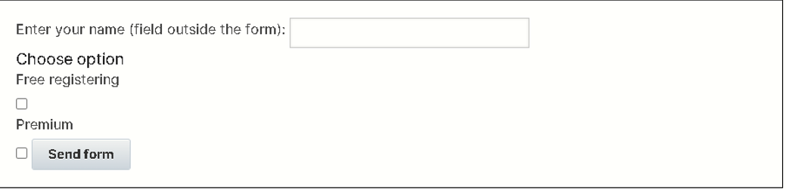
</p>
<!---   style="width:3in;height:1.99379in" --->

<h4>
<details>
  <summary Code from this example</summary>
</h4>

```
1.  <!DOCTYPE html PUBLIC "-//W3C//DTD XHTML 1.0 Transitional//EN" "https://www.w3.org/TR/xhtml1/DTD/xhtml1-transitional.dtd">
2.  <html xmlns="https://www.w3.org/1999/xhtml">
3.  
4.      <head\>
5.         <meta http-equiv="Content-Type" content="text/html; charset=UTF-8" /\>
6.         <meta name="viewport" content="width=device-width,
7.                                        target-densityDpi=device-dpi,
8.                                        initial-scale=1.0,
9.                                        user-scalable=no,
10.                                       maximum-scale=1.0">
11.        <title>iOS 4.2 Device Accellerometer</title>
12.        <style>
13.           body {
14.              font-family:Arial, Helvetica, sans-serif;
15.              font-size: 14px;
16.           }
17.           #board {
18.              position:absolute;
19.              left:0px;
20.              right:0px;
21.              top:0px;
22.              bottom:0px;
23.           }
24.           #ball {
25.              position:absolute;
26.              width: 60px;
27.              height: 60px;
28.              border-radius: 30px;
29.              background-image: -webkit-gradient(radial, 45% 45%, 5, 60% 60%,
30.                  40, from(red), color-stop(75%, black), to(rgba(255, 255, 255, 0)));
31.              -webkit-box-shadow: 3px 3px 5px #888;
32.           }
33.        </style>
34.        <script src="https://ajax.googleapis.com/ajax/libs/jquery/1.4.2/jquery.min.js">
35.        </script>
36.        <script>
37.           !window.jQuery && document.write('<script src="./js/jquery.min.js"></script>')
38.        </script>
39.        <script>
40.           var offset;
41.           var velocity;
42.           var board;
43.           var ball;
44.           var interval;
45. 
46.           $(document).ready(function() {
47.              window.addEventListener("devicemotion", onDeviceMotion, false);
48.               $('#timestamp').html(new Date().toString());
49.               $('#status').html("Ready!");
50. 
51.               velocity = {};
52.               velocity.x = 0;
53.               velocity.y = 0;
54. 
55.               offset = {};
56.               board = $('#board');
57.               ball = $('#ball');
58. 
59.               offset.left = (board.width() - ball.width()) / 2;
60.               offset.top = (board.height() - ball.height()) / 2;
61. 
62.               $('#ball').offset(offset);
63.               interval = setInterval(updateBall, 25);
64.           });
65. 
66.           function onDeviceMotion(event) {
67.              $('#timestamp').html(new Date().toString());
68.              $('#status').html("Device Motion Event");
69. 
70.              var eventDetails;
71.              try {
72.                  var accel = event.accelerationIncludingGravity;
73.                  eventDetails = "accelerationIncludingGravity: {" +
74.                  "<br>     x: " + accel.x +
75.                  "<br>     y: " + accel.y +
76.                  "<br>     z: " + accel.z +
77.                  "<br/>} </br><br/>" +
78.                  "interval: " + event.interval;
79.                  updateVelocity(event);
80.              } catch (e) {
81.                  eventDetails = e.toString();
82.              }
83. 
84.              $('#details').html(eventDetails);
85.           }
86. 
87.           var decay = .9;
88.           var bounceDecay = .95;
89.           var maxVelocity = 100;
90. 
91.           function updateVelocity(event) {
92.              velocity.x += event.accelerationIncludingGravity.x;
93.              if (Math.abs(velocity.x) > maxVelocity) {
94.                  if (velocity.x > 0) velocity.x = maxVelocity;
95.                  else velocity.x = -maxVelocity;
96.              }
97. 
98.              velocity.y += event.accelerationIncludingGravity.y;
99.              if (Math.abs(velocity.y) > maxVelocity) {
100.                  if (velocity.y > 0) velocity.y = maxVelocity;
101.                  else velocity.y = -maxVelocity;
102.              }
103.           }
104. 
105.           function updateBall() {
106.              if (offset.left <= -(ball.width() / 2)) {
107.                 velocity.x = Math.abs(velocity.x * bounceDecay);
108.              } else if (offset.left >= (board.width() - (ball.width() / 2))) {
109.                 velocity.x = -Math.abs(velocity.x * bounceDecay);
110.              } else {
111.                 velocity.x = parseInt(velocity.x);
112.                 velocity.x *= decay;
113.              }
114. 
115.           if (offset.top <= -(ball.height() / 2)) {
116.              velocity.y = -Math.abs(velocity.y * bounceDecay);
117.           } else if (offset.top >= (board.height() - (ball.height() / 2))) {
118.              velocity.y = Math.abs(velocity.y * bounceDecay);
119.           } else {
120.              velocity.y = parseInt(velocity.y);
121.              velocity.y *= decay;
122.           }
123. 
124.           offset.left += velocity.x;
125.           offset.top -= velocity.y;
126. 
127. 
128.           $('#ball').offset(offset);
129.       }
130.     </script>
131.   </head>
132. 
133.   <body>
134.      <div id="timestamp"></div>
135.      <div id="status"></div>
136.      <div id="details"></div>
137.      <div id="board">
138.          <div id="ball"></div>
139.      </div>spec: <a href="https://w3c.github.io/deviceorientation/spec-source-orientation.html" target="https://w3c.github.io/deviceorientation/spec-source-orientation.html"\>https://w3c.github.io/deviceorientation/spec-source-orientation.html</a>
140. 
141.   </body>
142. 
143. </html>
```

</details>

<h4>External resources</h4>
<ul>
<li>From the W3C specification: <a href="https://w3c.github.io/deviceorientation/spec-source-orientation.html#devicemotion">devicemotion
    Event</a></li>
<li>From Google Devs: "<a href="https://developers.google.com/web/fundamentals/native-hardware/device-orientation/">Device Orientation &
    Motion</s>"</li>
<li>On Dev. Opera: "<a href="https://dev.opera.com/articles/w3c-device-orientation-api/">The W3C Device Orientation API: Detecting
    Orientation and
    Acceleration</a>"</li>
</ul>

<h3 id="ch4-4-5">4.4.5 Discussion and projects</h3>
<p>
Here is the discussion forum for this part of the course. Please post
your comments/observations/questions and share your creations.
</p>

<h4>Suggested topics of discussion:</h4>
<ul>
<li>Did you know that you can "fake" the orientation using the devtools
    of some desktop browsers?</li>
<li>What kind of application would benefit from the Orientation and
    Motion APIs (apart from games)?</li>
</ul>

<h4>Optional projects:</h4>
<ul>
<li><a href="https://mainline.i3s.unice.fr/mooc/SkywardBound/">The Christmas
    game</a> developed by
    students from the previous run is a perfect candidate to be
    controlled using the APIs seen in this course!! I would start with
    the orientation API and try to move the bunny left/right...</li>
<li>Using the game framework, try to control the monster using the
    orientation API, so that it avoids the balls - see the last example
    from Module 2 of the course!</li>
</ul>
<!------
<!------------------------------------------------------------------------------------------------>
<!------------------------------ ##.  (##) -------------------------------->
<!------------------------------------------------------------------------------------------------>
<p align="center" width="100%">

</p>
------>

<h5>The end...</h5>

<h4>Last Updated: 9-28-2022 3:33pm</h4>
